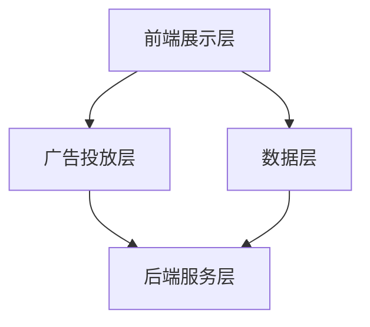

                 

# 《字节广告2024校招广告系统开发面试指南》

## 摘要

本文旨在为准备参加字节广告2024校招广告系统开发岗位的应聘者提供一份全面的面试指南。文章将从广告系统的基础知识、架构设计、开发实践、面试准备等多方面进行深入讲解，帮助读者全面了解广告系统开发的相关技术和面试策略。通过本文，读者将能够掌握广告系统开发的核心理念和实践方法，为面试做好充分准备。

## 目录大纲

### 第一部分：广告系统基础知识

- **第1章：广告系统概述**
  - 1.1 广告系统的发展历程
  - 1.2 广告系统的核心概念与架构
  - 1.3 广告系统在企业中的价值
  - 1.4 广告系统的技术挑战与解决方案

- **第2章：广告系统架构设计**
  - 2.1 广告系统总体架构
  - 2.2 数据处理与存储架构
  - 2.3 广告投放与优化策略
  - 2.4 广告创意设计与素材管理

- **第3章：广告数据管理与分析**
  - 3.1 广告数据来源与类型
  - 3.2 数据处理与清洗技术
  - 3.3 数据分析与挖掘方法
  - 3.4 广告效果评估与反馈机制

### 第二部分：广告系统开发实践

- **第4章：广告系统前端开发**
  - 4.1 前端开发基础
  - 4.2 广告投放页面的设计与实现
  - 4.3 前端性能优化技术
  - 4.4 前端安全性保障

- **第5章：广告系统后端开发**
  - 5.1 后端开发基础
  - 5.2 广告投放逻辑实现
  - 5.3 广告数据存储与管理
  - 5.4 接口设计与优化

- **第6章：广告系统测试与上线**
  - 6.1 单元测试与集成测试
  - 6.2 性能测试与压力测试
  - 6.3 上线流程与注意事项
  - 6.4 上线后的监控与优化

- **第7章：面试准备与策略**
  - 7.1 广告系统面试常见问题
  - 7.2 面试前的准备与策略
  - 7.3 编程面试技巧
  - 7.4 行为面试技巧

### 第三部分：附录

- **附录A：广告系统开发工具与资源**
  - A.1 常用开发工具
  - A.2 开源框架与库
  - A.3 技术文档与学习资源

## 第一部分：广告系统基础知识

### 第1章：广告系统概述

#### 1.1 广告系统的发展历程

广告系统的发展可以追溯到互联网的早期阶段。在1990年代初期，随着互联网的普及，网络广告开始兴起。最早的广告形式主要是横幅广告和弹出广告，它们通过在网页上占据一定的空间来吸引用户的注意。

随着时间的推移，广告技术不断演进。2000年代初，基于搜索引擎的广告（如Google AdWords）开始崭露头角。这种广告形式通过关键词匹配，将广告内容与用户搜索意图紧密关联，从而提高了广告的精准度和转化率。

进入2010年代，移动广告和社交媒体广告逐渐成为主流。随着智能手机的普及，广告开始从桌面端转移到移动端。同时，社交媒体平台如Facebook、Twitter和Instagram等，也为广告主提供了丰富的广告投放渠道和用户数据分析工具。

近年来，程序化购买（Programmatic Advertising）成为广告系统发展的重要趋势。程序化购买通过自动化技术，实现广告投放的精准匹配、实时竞价和优化。这使得广告主可以更高效地获取目标用户，同时提高广告投放的 ROI。

#### 1.2 广告系统的核心概念与架构

广告系统的核心概念包括广告主、广告平台、广告投放和广告效果评估等。

- **广告主（Advertiser）**：广告系统的核心客户，负责创建和投放广告，以宣传其产品或服务。
- **广告平台（Ad Platform）**：提供广告投放和管理服务的平台，如Google Ads、Facebook Ads和字节跳动广告平台等。
- **广告投放（Ad Delivery）**：将广告内容展示给目标用户的过程。广告投放涉及广告定位、投放策略和实时竞价等。
- **广告效果评估（Ad Performance Analysis）**：对广告投放效果进行监测和评估，以优化广告策略和提高 ROI。

广告系统的架构通常包括以下几个层次：

1. **前端展示层**：负责将广告内容展示给用户，包括网页、移动应用和社交媒体等。
2. **广告投放层**：实现广告定位、投放策略和实时竞价等功能，包括广告管理平台和广告投放引擎。
3. **数据层**：存储和管理广告数据，包括用户数据、广告数据和分析数据等。
4. **后端服务层**：提供广告投放、广告效果评估和用户反馈等功能，包括广告投放系统、广告效果评估系统和用户反馈系统等。

#### 1.3 广告系统在企业中的价值

广告系统对企业具有以下几个方面的价值：

- **增加品牌知名度**：通过广告投放，企业可以将其品牌和产品信息传递给潜在客户，从而提高品牌知名度。
- **提升销售额**：精准的广告投放可以吸引更多目标客户，从而提高销售额和市场份额。
- **优化广告预算**：广告系统可以帮助企业实时监测广告效果，根据数据反馈调整广告投放策略，从而提高广告 ROI。
- **增强用户体验**：通过个性化广告投放，企业可以提供更符合用户需求的广告内容，从而提高用户体验和满意度。
- **数据驱动决策**：广告系统为企业提供了丰富的用户数据和广告数据，可以帮助企业进行数据分析和决策，从而优化产品和服务。

#### 1.4 广告系统的技术挑战与解决方案

广告系统在开发和运营过程中面临以下技术挑战：

- **海量数据处理**：广告系统需要处理海量用户数据、广告数据和分析数据，对数据处理能力要求较高。解决方案包括分布式存储和处理技术，如Hadoop、Spark等。
- **实时性要求**：广告系统需要实时响应广告投放、实时竞价和实时数据分析等需求，对系统性能要求较高。解决方案包括微服务架构、高性能数据库和实时数据处理技术等。
- **隐私保护**：广告系统涉及用户隐私数据，需要确保用户数据的隐私和安全。解决方案包括数据加密、用户隐私保护协议和合规性管理等。
- **广告效果评估**：广告效果评估需要准确、全面地衡量广告投放效果，以优化广告策略。解决方案包括多维度数据分析、机器学习和广告效果评估算法等。

### 第2章：广告系统架构设计

#### 2.1 广告系统总体架构

广告系统总体架构通常包括前端展示层、广告投放层、数据层和后端服务层等，如下所示：



#### 2.2 数据处理与存储架构

广告系统的数据处理与存储架构包括以下组成部分：

1. **数据采集**：通过网站、APP和社交媒体等渠道收集用户行为数据、广告数据和分析数据等。
2. **数据存储**：使用分布式数据库存储海量数据，包括关系型数据库和NoSQL数据库等。
3. **数据清洗**：对采集到的数据进行清洗、去重和归一化处理，以确保数据质量。
4. **数据仓库**：将清洗后的数据存储到数据仓库中，为后续分析提供数据支持。
5. **数据处理**：使用分布式计算框架（如Hadoop、Spark）对数据进行处理和分析，包括数据挖掘、机器学习和实时处理等。

#### 2.3 广告投放与优化策略

广告投放与优化策略包括以下几个方面：

1. **广告定位**：根据用户行为数据、兴趣标签和地理位置等信息，确定广告的目标受众。
2. **广告创意**：设计吸引人的广告内容，包括文案、图片和视频等。
3. **广告投放策略**：根据广告定位和广告创意，制定广告投放计划，包括投放时间、投放地域和投放渠道等。
4. **实时竞价**：在广告投放过程中，实时竞价系统根据广告主的出价和广告效果，自动选择最优的广告投放位置。
5. **广告优化**：根据广告投放效果，实时调整广告投放策略，包括广告定位、广告创意和广告预算等。

#### 2.4 广告创意设计与素材管理

广告创意设计是广告系统的重要组成部分，包括以下几个方面：

1. **文案创作**：撰写吸引人的广告文案，强调产品或服务的优势和特点。
2. **图片设计**：设计高质量的广告图片，包括广告主品牌、产品形象和视觉元素等。
3. **视频制作**：制作引人入胜的广告视频，展示产品或服务的使用场景和效果。
4. **素材管理**：建立广告素材库，对广告素材进行分类、标签和版本管理，以便于广告创意设计和广告投放。

#### 2.5 数据分析与挖掘方法

数据分析与挖掘方法是广告系统优化的重要手段，包括以下几个方面：

1. **用户行为分析**：分析用户点击、浏览、购买等行为，了解用户兴趣和需求。
2. **广告效果分析**：分析广告投放效果，包括点击率、转化率和 ROI 等，以优化广告投放策略。
3. **兴趣建模**：基于用户行为数据和人口统计信息，构建用户兴趣模型，为广告定位和投放提供支持。
4. **推荐系统**：基于用户兴趣和行为数据，构建推荐系统，为用户推荐相关广告和产品。
5. **机器学习算法**：使用机器学习算法，对广告数据进行预测和分类，以提高广告投放的精准度和效果。

### 第3章：广告数据管理与分析

#### 3.1 广告数据来源与类型

广告数据的来源包括以下几个方面：

1. **用户行为数据**：包括用户点击、浏览、搜索、购买等行为数据。
2. **广告数据**：包括广告创意、广告定位、广告投放策略和广告效果等数据。
3. **市场数据**：包括行业趋势、竞争对手数据和市场需求等数据。
4. **用户画像数据**：包括用户基本信息、兴趣标签、地理位置和消费行为等数据。

广告数据的类型主要包括：

1. **结构化数据**：包括用户行为数据、广告数据和市场数据等，通常存储在关系型数据库中。
2. **非结构化数据**：包括文本、图片、视频等，通常存储在分布式文件系统或NoSQL数据库中。
3. **时序数据**：包括广告投放、用户点击和转化等随时间变化的数据，通常使用时序数据库或时序分析工具进行存储和分析。

#### 3.2 数据处理与清洗技术

数据处理与清洗技术包括以下几个方面：

1. **数据采集与接入**：使用数据采集工具（如Flume、Kafka）接入各种数据源，包括关系型数据库、NoSQL数据库和文件系统等。
2. **数据存储与管理**：使用分布式数据库（如Hadoop、Spark）存储和管理海量数据，包括结构化数据和非结构化数据。
3. **数据清洗**：对采集到的数据进行清洗、去重和归一化处理，包括数据质量检查、缺失值填充、异常值处理和格式转换等。
4. **数据转换与集成**：将清洗后的数据进行转换和集成，形成统一的数据格式和模型，以便于后续分析和挖掘。

#### 3.3 数据分析与挖掘方法

数据分析和挖掘方法包括以下几个方面：

1. **用户行为分析**：通过用户行为数据分析，了解用户兴趣、行为模式和需求，为广告定位和投放提供支持。
2. **广告效果分析**：通过广告效果分析，评估广告投放效果，包括点击率、转化率和 ROI 等，以优化广告投放策略。
3. **兴趣建模**：基于用户行为数据和人口统计信息，构建用户兴趣模型，为广告定位和投放提供支持。
4. **推荐系统**：基于用户兴趣和行为数据，构建推荐系统，为用户推荐相关广告和产品。
5. **机器学习算法**：使用机器学习算法，对广告数据进行预测和分类，以提高广告投放的精准度和效果。

#### 3.4 广告效果评估与反馈机制

广告效果评估与反馈机制包括以下几个方面：

1. **广告效果评估**：通过广告效果评估，衡量广告投放效果，包括点击率、转化率和 ROI 等，以优化广告投放策略。
2. **用户反馈收集**：通过用户反馈收集，了解用户对广告的喜好和不满，为广告创意和投放策略提供反馈。
3. **效果优化建议**：根据广告效果评估和用户反馈，提出优化建议，包括广告定位、广告创意、广告投放策略和广告预算等。
4. **持续迭代优化**：根据效果优化建议，持续迭代优化广告投放策略，以提高广告投放效果和 ROI。

## 第二部分：广告系统开发实践

### 第4章：广告系统前端开发

#### 4.1 前端开发基础

前端开发是指构建网页和移动应用用户界面（UI）的过程，包括HTML、CSS和JavaScript等技术的使用。广告系统前端开发的基础知识包括：

1. **HTML**：用于构建网页结构，定义页面内容和布局。
2. **CSS**：用于美化网页样式，控制页面元素的外观和布局。
3. **JavaScript**：用于实现网页交互和动态效果，以及处理用户输入和响应。

#### 4.2 广告投放页面的设计与实现

广告投放页面的设计与实现涉及以下几个方面：

1. **页面布局**：设计广告投放页面的布局，包括广告列表、广告详情和用户操作区域等。
2. **广告展示**：使用HTML和CSS实现广告的展示效果，包括广告标题、描述、图片和按钮等。
3. **用户交互**：使用JavaScript实现用户交互功能，如点击按钮跳转广告详情页、滚动加载更多广告等。

#### 4.3 前端性能优化技术

前端性能优化是提高用户体验和页面加载速度的重要手段，包括以下几个方面：

1. **资源压缩与缓存**：压缩和缓存CSS、JavaScript和图片等资源，减少HTTP请求和加载时间。
2. **懒加载与预加载**：对非重要资源采用懒加载，对重要资源采用预加载，减少页面加载时间。
3. **响应式设计**：使用响应式设计技术，确保页面在不同设备和分辨率下表现良好。
4. **代码分割与异步加载**：将代码分割成多个模块，异步加载非关键代码，减少初始加载时间。

#### 4.4 前端安全性保障

前端安全性保障是防止网页和用户数据受到攻击的重要措施，包括以下几个方面：

1. **输入验证**：对用户输入进行验证，防止SQL注入、XSS攻击等。
2. **HTTPS**：使用HTTPS协议加密网页数据传输，确保数据传输的安全性。
3. **内容安全策略（CSP）**：限制网页可以加载的资源和执行脚本，防止恶意脚本执行。
4. **跨域资源共享（CORS）**：合理配置CORS策略，允许跨域请求，防止跨域数据泄露。

### 第5章：广告系统后端开发

#### 5.1 后端开发基础

后端开发是指构建服务器端应用程序的过程，涉及服务器、数据库和网络编程等技术。广告系统后端开发的基础知识包括：

1. **服务器端编程**：使用服务器端编程语言（如Java、Python、Node.js等）构建后端逻辑。
2. **数据库操作**：使用数据库（如MySQL、MongoDB等）存储和管理广告数据。
3. **网络通信**：实现客户端和服务器之间的数据传输和交互。

#### 5.2 广告投放逻辑实现

广告投放逻辑实现涉及以下几个方面：

1. **广告定位**：根据用户数据、广告数据和投放策略，确定广告的目标受众。
2. **广告选择**：从多个广告中选择最适合当前用户的广告。
3. **广告展示**：将选定的广告展示给用户，包括广告加载、展示和点击等。
4. **广告反馈**：收集用户对广告的反馈，包括点击、浏览和转化等。

#### 5.3 广告数据存储与管理

广告数据存储与管理涉及以下几个方面：

1. **数据模型设计**：设计广告数据的存储模型，包括用户数据、广告数据和分析数据等。
2. **数据库操作**：使用数据库操作语言（如SQL）进行数据存储、查询和更新等。
3. **数据权限管理**：实现数据权限管理，确保用户数据的安全和隐私。

#### 5.4 接口设计与优化

接口设计与优化是广告系统后端开发的关键环节，包括以下几个方面：

1. **接口规范**：定义接口的规范和协议，包括接口名称、参数和返回值等。
2. **接口安全**：实现接口安全，防止恶意请求和数据泄露。
3. **性能优化**：优化接口性能，提高接口响应速度和并发处理能力。

### 第6章：广告系统测试与上线

#### 6.1 单元测试与集成测试

广告系统测试是确保系统质量和稳定性的重要环节，包括以下几个方面：

1. **单元测试**：对广告系统的各个模块进行独立测试，确保模块功能的正确性。
2. **集成测试**：将各个模块集成在一起进行测试，确保模块之间的交互正确无误。

#### 6.2 性能测试与压力测试

性能测试与压力测试是评估广告系统性能和稳定性的重要手段，包括以下几个方面：

1. **性能测试**：模拟大量用户访问，评估广告系统的响应速度和吞吐量。
2. **压力测试**：在极限条件下测试广告系统的稳定性和性能，确保系统在高负载下正常运行。

#### 6.3 上线流程与注意事项

广告系统上线是系统从开发环境切换到生产环境的重要步骤，包括以下几个方面：

1. **环境准备**：准备生产环境，包括服务器、数据库和网络等。
2. **数据迁移**：将开发环境中的数据迁移到生产环境。
3. **上线部署**：部署广告系统到生产环境，并进行测试和验证。
4. **上线监控**：上线后对广告系统进行监控，确保系统正常运行。

#### 6.4 上线后的监控与优化

上线后的监控与优化是确保广告系统稳定运行和持续改进的重要环节，包括以下几个方面：

1. **系统监控**：实时监控广告系统的运行状态，包括服务器负载、数据库性能和网络状态等。
2. **性能优化**：根据监控数据，优化系统性能和资源使用。
3. **故障处理**：及时处理系统故障和异常情况，确保系统正常运行。
4. **持续改进**：根据用户反馈和系统运行情况，持续改进广告系统。

### 第7章：面试准备与策略

#### 7.1 广告系统面试常见问题

广告系统面试常见问题包括以下几个方面：

1. **广告系统的工作原理是什么？**
2. **如何进行广告定位和投放？**
3. **广告效果评估有哪些指标？**
4. **如何优化广告投放效果？**
5. **如何处理海量用户数据？**

#### 7.2 面试前的准备与策略

面试前的准备与策略包括以下几个方面：

1. **了解公司背景和业务**：了解字节跳动的广告业务、市场定位和发展战略。
2. **掌握广告系统相关知识**：熟悉广告系统的基础知识、架构设计和开发实践。
3. **准备面试题目**：针对常见的面试题目进行准备和练习。
4. **优化简历**：确保简历内容准确、完整和有针对性。
5. **模拟面试**：进行模拟面试，提高面试技巧和自信心。

#### 7.3 编程面试技巧

编程面试技巧包括以下几个方面：

1. **理解问题**：仔细阅读题目，确保理解问题的要求和限制。
2. **设计算法**：分析问题，设计合适的算法和数据结构。
3. **编写代码**：按照算法设计，编写清晰、简洁的代码。
4. **测试代码**：编写测试用例，验证代码的正确性和性能。
5. **代码优化**：优化代码，提高代码的可读性和执行效率。

#### 7.4 行为面试技巧

行为面试技巧包括以下几个方面：

1. **准备故事**：提前准备与工作相关的故事，展示自己的能力和经验。
2. **回答客观**：客观回答问题，避免夸大或贬低自己。
3. **展示团队合作能力**：强调自己在团队中的协作和贡献。
4. **展示解决问题的能力**：通过故事展示自己解决问题的方法和经验。
5. **积极提问**：提出与工作相关的问题，展示自己的兴趣和思考。

### 第三部分：附录

#### 附录A：广告系统开发工具与资源

广告系统开发需要使用多种工具和资源，包括以下几个方面：

1. **开发工具**：Visual Studio Code、IntelliJ IDEA等。
2. **开源框架**：React、Vue.js、Angular等。
3. **数据库**：MySQL、MongoDB、Redis等。
4. **云计算平台**：阿里云、腾讯云、亚马逊AWS等。
5. **技术文档**：百度AI、腾讯AI、字节跳动技术博客等。

## 核心算法原理讲解

#### 广告投放优化算法（伪代码）

广告投放优化算法的目标是选择一组广告，以最大化预期收益。以下是一个简单的广告投放优化算法的伪代码：

```plaintext
function optimize_ads(ads_list, user_data, budget):
    # 初始化变量
    max_revenue = 0
    best_ads = []

    # 遍历所有广告
    for ad in ads_list:
        # 计算广告的预期收益
        revenue = calculate_revenue(ad, user_data) * ad.cost
        
        # 如果预期收益大于当前最大收益，更新最大收益和最佳广告
        if revenue > max_revenue:
            max_revenue = revenue
            best_ads = [ad]
        # 如果预期收益与当前最大收益相同，添加广告到最佳广告列表
        elif revenue == max_revenue:
            best_ads.append(ad)
            
    # 根据预算筛选最佳广告
    selected_ads = []
    for ad in best_ads:
        if ad.cost <= budget:
            selected_ads.append(ad)
            
    return selected_ads
```

#### 广告效果评估模型（Expected Revenue Model）

广告效果评估模型可以使用期望收入（Expected Revenue, ER）来衡量广告的表现。期望收入模型假设每个广告在特定用户上的点击概率（CTR）和转化概率（CVR）是已知的，并且每个点击的成本是固定的（CPC）。

期望收入模型公式如下：

$$
ER = CTR \times CVR \times CPC
$$

其中：
- **CTR**：点击率（Click-Through Rate）
- **CVR**：转化率（Conversion Rate）
- **CPC**：每点击成本（Cost Per Click）

#### 举例说明

假设某个广告的CTR为0.05，CVR为0.01，CPC为1元，根据期望收入模型计算期望收入：

$$
ER = 0.05 \times 0.01 \times 1 = 0.0005
$$

因此，这个广告的期望收入为0.0005元。

## 项目实战

#### 实战项目：广告系统前端页面设计

**项目目标：** 设计并实现一个广告系统前端页面，用于展示广告内容并进行用户交互。

**开发环境：** 
- 开发工具：Visual Studio Code
- 前端框架：React
- 构建工具：Webpack
- 测试框架：Jest

**项目实现：**

1. **页面布局设计：** 设计广告列表页面，包括广告标题、描述、图片、点击按钮等元素。
2. **广告数据获取：** 使用API获取广告数据，并将数据渲染到页面上。
3. **用户交互：** 实现用户点击广告按钮后跳转到广告详情页的功能。
4. **响应式设计：** 确保页面在不同设备上显示良好。

**代码实现示例：**

```jsx
// AdList.js
import React, { useEffect, useState } from 'react';

const AdList = () => {
    const [ads, setAds] = useState([]);

    useEffect(() => {
        fetch('/api/ads')
            .then(response => response.json())
            .then(data => setAds(data));
    }, []);

    return (
        <div>
            {ads.map(ad => (
                <div key={ad.id}>
                    <h3>{ad.title}</h3>
                    <p>{ad.description}</p>
                    
                    <button onClick={() => goToAdDetails(ad.id)}>查看详情</button>
                </div>
            ))}
        </div>
    );
};

const goToAdDetails = (adId) => {
    window.location.href = `/ad/${adId}`;
};

export default AdList;
```

**代码解读与分析：**

- 使用React hooks中的`useEffect`获取广告数据，并在数据更新时重新渲染页面。
- 使用`.map()`方法遍历广告数据，并使用`key`属性保证列表的渲染性能。
- 实现`goToAdDetails`函数，用于在用户点击广告按钮时跳转到广告详情页面。

通过以上实战项目，读者可以了解广告系统前端开发的基本流程和实现方法。在实际项目中，还需要结合具体业务需求进行更多功能模块的开发和优化。

### 附录A：广告系统开发工具与资源

#### A.1 常用开发工具

- **Visual Studio Code**：一款轻量级、高度可扩展的代码编辑器，适用于广告系统开发。
- **IntelliJ IDEA**：一款功能强大的集成开发环境（IDE），适用于广告系统后端开发。
- **Webpack**：一款现代前端构建工具，用于模块打包和优化资源。
- **Jest**：一款流行的JavaScript测试框架，用于广告系统测试。

#### A.2 开源框架与库

- **React**：一款用于构建用户界面的JavaScript库，适用于广告系统前端开发。
- **Vue.js**：一款用于构建用户界面的渐进式框架，适用于广告系统前端开发。
- **Angular**：一款由Google开发的框架，适用于复杂的前端应用程序开发。
- **Node.js**：一款基于Chrome V8引擎的JavaScript运行时，适用于广告系统后端开发。
- **Django**：一款Python Web框架，适用于广告系统后端开发。

#### A.3 技术文档与学习资源

- **百度AI**：提供丰富的AI技术和广告系统相关文档。
- **腾讯AI**：提供AI技术、广告系统解决方案和开发文档。
- **字节跳动技术博客**：分享广告系统、前端和后端开发相关技术文章。
- **GitHub**：包含大量广告系统相关的开源项目和技术文档。

通过以上工具和资源，开发者可以更好地进行广告系统开发，提高开发效率和系统质量。作者：AI天才研究院/AI Genius Institute & 禅与计算机程序设计艺术 /Zen And The Art of Computer Programming。

