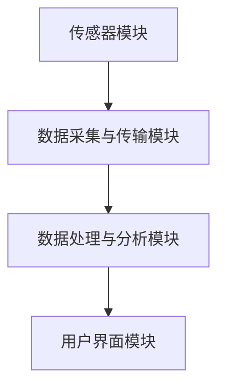
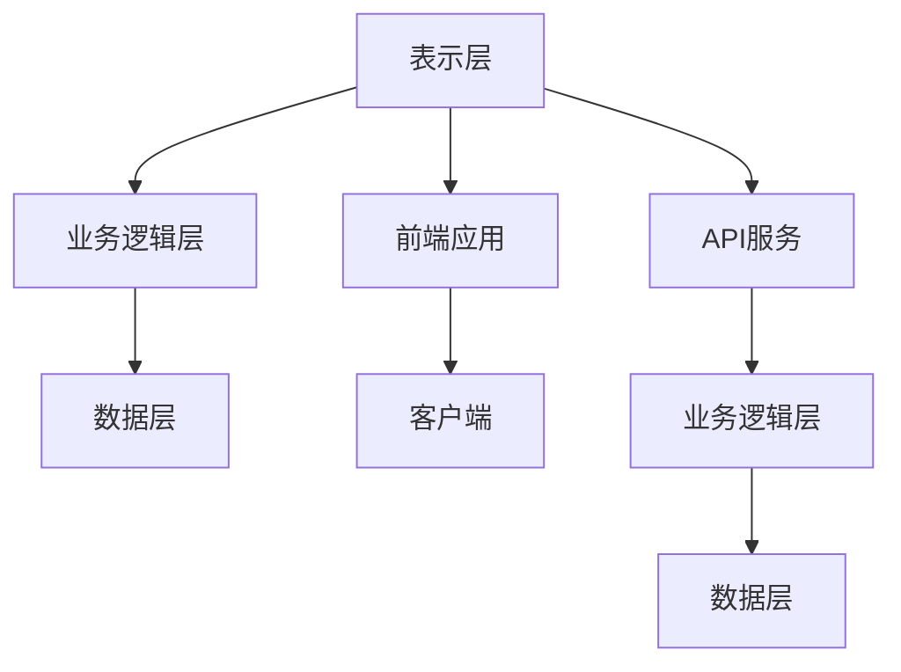
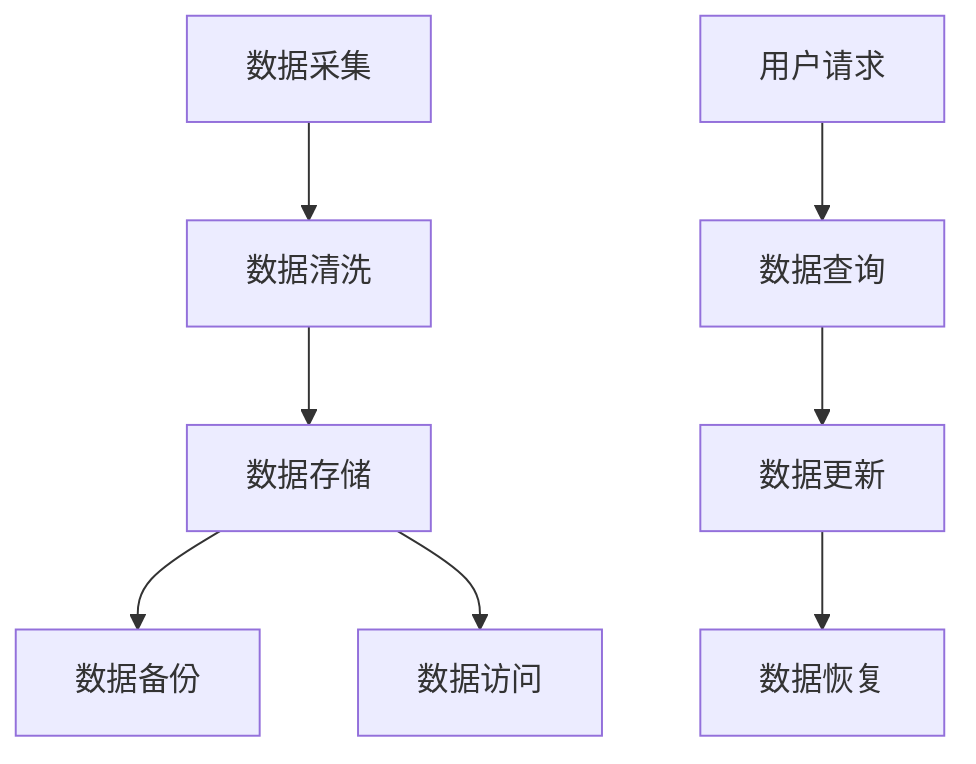
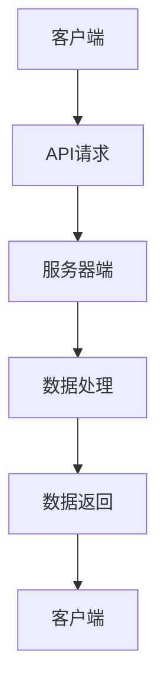
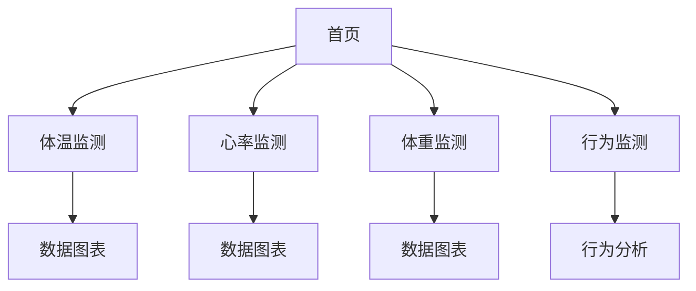

                 

# 《宠物健康监测设备：宠物科技创业的新领域》

## 关键词
宠物健康监测，物联网，传感器技术，数据采集与传输，数据分析与应用，用户体验设计，商业模式，法规合规

## 摘要

随着宠物经济的高速发展，宠物健康监测设备正逐渐成为宠物科技创业的新热点。本文将围绕宠物健康监测设备这一主题，从概述、开发、商业化、案例研究和未来展望五个方面展开探讨。首先，我们将介绍宠物健康监测设备的重要性及其市场需求。接着，我们将深入分析宠物健康监测设备的基本原理和技术分类。然后，我们将详细描述宠物健康监测设备的开发过程，包括硬件设计、软件开发和用户体验设计。随后，我们将探讨宠物健康监测设备的商业化策略，包括市场分析、商业模式和法规合规。最后，我们将通过成功案例研究，展示宠物健康监测设备的实际应用，并展望其未来发展。

## 第一部分：宠物健康监测设备概述

### 1.1 宠物健康监测设备的重要性

宠物健康监测设备在当今宠物行业中扮演着越来越重要的角色。随着宠物数量的增加和人们对宠物健康关注的提升，宠物健康监测设备不仅为宠物主人提供了实时的健康数据，也为宠物医疗行业带来了新的机遇。

首先，宠物健康监测设备能够实时监测宠物的体温、心率、体重等生理指标。这些数据对于及时发现宠物的健康状况异常至关重要。例如，宠物的体温异常可能是感染或疾病的早期迹象，而心率异常则可能是心脏病或其他健康问题的表现。通过实时监测，宠物主人可以及时采取必要的措施，确保宠物的健康。

其次，宠物健康监测设备能够提高宠物的医疗效率。传统的宠物医疗往往依赖于宠物主人对宠物的观察和描述，这种方式存在较大的误差和不准确性。而宠物健康监测设备通过自动化采集和传输数据，能够为医生提供更加准确和全面的信息，从而提高诊断和治疗的效率。

此外，宠物健康监测设备还可以帮助宠物主人更好地照顾宠物。例如，通过监测宠物的体重变化，宠物主人可以及时调整饮食计划，避免宠物过度肥胖或营养不良。同时，宠物健康监测设备还可以记录宠物的日常行为习惯，帮助宠物主人更好地了解宠物的需求，提供个性化的照顾。

### 1.2 宠物健康监测设备的需求与市场

随着宠物经济的快速发展，宠物健康监测设备的市场需求也在不断增长。根据市场调研数据显示，全球宠物健康监测设备市场规模逐年增长，预计未来几年将保持高速增长态势。

首先，宠物主人的健康意识提高是推动宠物健康监测设备市场需求增长的重要因素。随着人们对宠物健康的关注程度不断提高，越来越多的宠物主人开始重视宠物的健康监测。他们希望通过宠物健康监测设备实时了解宠物的健康状况，以便及时采取相应的措施。

其次，科技的发展也为宠物健康监测设备的市场需求提供了强有力的支持。物联网技术的普及使得宠物健康监测设备能够实现远程监测和数据传输，为宠物主人提供了更加便捷和高效的健康监测服务。同时，人工智能和大数据技术的应用，使得宠物健康监测设备能够提供更加精准和个性化的健康分析和服务。

此外，宠物健康监测设备的市场需求还受到政策环境的影响。一些国家和地区对宠物健康监测设备的研究和应用给予了政策和资金支持，这进一步推动了宠物健康监测设备市场的发展。

总之，宠物健康监测设备在当今宠物行业中具有重要的地位和广阔的市场前景。随着科技的不断进步和人们对宠物健康关注的提升，宠物健康监测设备的市场需求将继续增长，为宠物科技创业提供了新的机遇。

### 2. 宠物健康监测设备的基本原理

宠物健康监测设备的工作原理主要依赖于传感器技术、数据采集与传输技术以及数据处理与分析技术。以下是对这些基本原理的详细阐述：

#### 2.1 传感器技术

传感器是宠物健康监测设备的核心组件，用于检测宠物的生理参数，如体温、心率、体重等。以下是几种常见的传感器类型及其工作原理：

- **温度传感器**：用于检测宠物的体温。常见的温度传感器有热敏电阻、热电偶等。热敏电阻的电阻值随温度变化而变化，通过测量其电阻值，可以计算出温度。热电偶则是利用不同金属之间产生的热电效应来测量温度。

- **心率传感器**：用于检测宠物的心率。常见的心率传感器包括光电传感器和超声波传感器。光电传感器通过检测宠物皮肤下的血流变化来计算心率，而超声波传感器则通过超声波的反射和衰减来测量心率。

- **体重传感器**：用于检测宠物的体重。常用的体重传感器是压力传感器，通过测量宠物站立时的压力变化来计算体重。

#### 2.2 数据采集与传输技术

采集到的传感器数据需要传输到处理单元进行分析和处理。数据采集与传输技术主要包括以下几个方面：

- **数据采集**：传感器采集到的数据通常需要通过数据采集模块进行预处理，包括滤波、放大、A/D转换等，以便将模拟信号转换为数字信号，便于后续处理。

- **数据传输**：数据传输技术包括有线和无线两种方式。有线传输通常使用USB、以太网等接口，而无线传输则采用Wi-Fi、蓝牙、Zigbee等无线通信技术。无线传输具有灵活性和便捷性，更适合宠物健康监测设备的应用。

#### 2.3 数据处理与分析技术

采集到的数据需要进行处理和分析，以提取有用的信息，为宠物主人提供健康监测服务。数据处理与分析技术主要包括以下几个方面：

- **数据处理**：包括数据清洗、去噪、滤波等步骤，确保数据的准确性和可靠性。

- **数据分析**：利用统计分析和机器学习算法，对采集到的数据进行分析，提取出有价值的信息。例如，通过心率数据可以分析宠物的运动状态和休息时间，通过体重数据可以预测宠物的健康状况等。

- **数据可视化**：将处理后的数据以图表、图像等形式展示，帮助宠物主人直观了解宠物的健康状态。

#### 2.4 宠物健康监测设备的架构

宠物健康监测设备的整体架构通常包括以下几个部分：

1. **传感器模块**：包括各种类型的传感器，用于采集宠物的生理参数。
2. **数据采集与传输模块**：用于收集传感器数据，并通过无线或有线方式传输到处理单元。
3. **数据处理与分析模块**：对采集到的数据进行分析和处理，提取有用的信息。
4. **用户界面模块**：通过手机应用或网页界面，将分析结果展示给宠物主人。

以下是宠物健康监测设备的 Mermaid 流程图：



通过上述基本原理和架构，宠物健康监测设备能够实现对宠物健康数据的实时监测和分析，为宠物主人提供专业的健康监测服务。

### 3. 宠物健康监测设备的技术分类

宠物健康监测设备根据其监测的功能和用途，可以分为体温监测、心率监测、体重监测和行为监测等几类。以下是对这些技术的详细介绍：

#### 3.1 体温监测

体温监测是宠物健康监测中最为基础和重要的一个环节。通过实时监测宠物的体温，可以及时发现宠物可能出现的发热或低烧等症状，为宠物主人提供预警信息。

- **技术原理**：体温监测主要依赖温度传感器，如热敏电阻和热电偶。热敏电阻的电阻值随温度变化而变化，通过测量其电阻值可以计算出体温。热电偶则利用不同金属之间产生的热电效应来测量温度。

- **应用实例**：一些宠物健康监测设备采用了植入式温度传感器，通过无线传输将体温数据发送到宠物主人的手机应用上。这些设备通常配有报警功能，当宠物体温异常时，会立即通知宠物主人。

#### 3.2 心率监测

心率监测是评估宠物健康状况的重要指标。通过监测宠物的静息心率和运动心率，可以评估宠物的身体状况，及时发现潜在的心脏健康问题。

- **技术原理**：心率监测主要采用光电传感器和超声波传感器。光电传感器通过检测宠物皮肤下的血流变化来计算心率，而超声波传感器则通过超声波的反射和衰减来测量心率。

- **应用实例**：一些宠物健康监测设备使用了可佩戴的心率监测器，这些设备通常具有实时心率监测和报警功能。宠物主人可以通过手机应用实时查看宠物的心率数据，并在心率异常时及时采取措施。

#### 3.3 体重监测

体重监测是评估宠物营养状况和健康状况的重要手段。通过定期监测宠物的体重，宠物主人可以及时调整饮食计划，预防宠物过度肥胖或营养不良。

- **技术原理**：体重监测主要采用压力传感器。压力传感器通过测量宠物站立时的压力变化来计算体重。

- **应用实例**：一些宠物健康监测设备使用了智能体重秤，宠物主人只需将宠物放在秤上，设备就会自动测量并显示宠物的体重。这些设备通常还具备数据记录和报警功能，帮助宠物主人管理宠物的体重。

#### 3.4 行为监测

行为监测是通过监测宠物的日常行为习惯，分析宠物的健康状况和生活质量。通过行为监测，宠物主人可以了解宠物的活动时间、睡眠时间、饮食习惯等，从而提供更科学的照顾。

- **技术原理**：行为监测主要采用加速度传感器和机器学习算法。加速度传感器可以记录宠物的运动轨迹和力度，通过机器学习算法，可以对宠物的行为进行分析和识别。

- **应用实例**：一些宠物健康监测设备使用了可穿戴设备，如智能项圈，通过记录宠物的运动数据和分析行为模式，为宠物主人提供行为监测和健康建议。这些设备通常还具备定位功能，可以帮助宠物主人找回丢失的宠物。

通过体温监测、心率监测、体重监测和行为监测等技术的综合应用，宠物健康监测设备能够全面评估宠物的健康状况，为宠物主人提供科学、精准的健康监测服务。

### 4. 开发环境与工具

在开发宠物健康监测设备时，选择合适的开发环境与工具对于项目的顺利进行至关重要。以下将详细讨论开发环境与工具的选择、搭建过程以及常用开发工具的介绍。

#### 4.1 开发环境的选择

开发环境的选择主要取决于项目需求、团队技术栈以及预算等因素。以下是几种常见的开发环境：

- **Windows**：Windows操作系统具有广泛的兼容性和易用性，适用于各种类型的开发项目。特别是对于使用Windows原生应用的开发，Windows环境是一个不错的选择。

- **Linux**：Linux操作系统以其稳定性、安全性和开源特性而著称，适合用于服务器端开发和嵌入式系统开发。对于需要高性能和高可靠性的项目，Linux是一个理想的选择。

- **macOS**：macOS操作系统与iOS操作系统有很好的兼容性，适合用于移动应用开发。同时，macOS也提供了丰富的开发工具和资源，适用于跨平台开发。

#### 4.2 开发环境的搭建

无论选择哪种开发环境，搭建一个稳定且高效的开发环境是项目成功的关键。以下是搭建开发环境的步骤：

1. **操作系统安装**：根据项目需求选择合适的操作系统，并按照官方教程安装操作系统。

2. **开发工具安装**：安装必要的开发工具，如集成开发环境（IDE）、代码编辑器、编译器等。例如，在Windows环境下，可以选择Visual Studio或JetBrains系列产品；在Linux环境下，可以选择Eclipse或GNOME系列；在macOS环境下，可以选择Xcode或IntelliJ IDEA。

3. **依赖库安装**：安装项目所需的依赖库和框架。例如，在物联网项目中，可能需要安装如Node.js、Python等编程语言的依赖库。

4. **环境配置**：配置开发环境，如设置环境变量、配置文件等。确保开发环境能够正常运行，以便进行后续的开发工作。

#### 4.3 常用开发工具介绍

以下是几种常用的开发工具，它们在宠物健康监测设备的开发过程中扮演着重要角色：

- **集成开发环境（IDE）**：IDE提供了代码编辑、调试、编译等一体化功能，大大提高了开发效率。常见的IDE包括Visual Studio、Eclipse、IntelliJ IDEA等。

- **代码编辑器**：代码编辑器是开发者编写代码的基础工具，常见的代码编辑器有Visual Studio Code、Sublime Text、Atom等。这些编辑器提供了丰富的插件和功能，可以满足不同开发需求。

- **版本控制系统**：版本控制系统（如Git）用于管理代码版本，确保代码的可维护性和可追溯性。Git是目前最流行的版本控制系统，支持多种开发环境的集成。

- **数据库管理系统**：数据库管理系统（如MySQL、MongoDB）用于存储和管理宠物健康监测设备的数据。选择合适的数据库管理系统，可以确保数据的存储效率和查询速度。

- **物联网开发平台**：物联网开发平台（如Node-RED、MQTT）提供了丰富的物联网功能，如数据采集、传输、处理等，适用于宠物健康监测设备的开发。

通过选择合适的开发环境与工具，并正确搭建和配置开发环境，宠物健康监测设备的开发工作可以更加高效、稳定地进行。接下来，我们将详细讨论宠物健康监测设备的硬件设计。

### 5. 设备硬件设计

在宠物健康监测设备的开发过程中，硬件设计是至关重要的一环。一个优秀的硬件设计不仅能够保证设备的正常运行，还能够提升用户体验和设备的可靠性。以下将详细讨论硬件设计的选择、主控芯片的选型、传感器的选型以及硬件设计与验证的步骤。

#### 5.1 硬件设计的选择

硬件设计的选择主要取决于设备的定位、功能需求以及预算等因素。以下是硬件设计选择的几个关键点：

- **设备定位**：首先，需要明确设备的目标用户群体和应用场景。例如，是面向宠物主人个人的健康监测设备，还是面向宠物医院或宠物护理中心的商用设备。不同定位决定了设备的功能、性能和设计风格。

- **功能需求**：根据设备定位，明确设备需要实现的功能。例如，是否需要实时监测体温、心率、体重等生理指标，是否需要具备定位、报警等功能。功能需求将直接影响硬件设计的选择。

- **预算**：硬件设计的选择还需要考虑预算。高预算可以选用高性能的硬件组件，实现更丰富的功能；而低预算则需要优化设计方案，采用性价比更高的组件。

#### 5.2 主控芯片的选型

主控芯片是宠物健康监测设备的核心组件，负责处理传感器数据、控制设备功能以及实现与外部设备的通信。以下是主控芯片选型的几个关键点：

- **性能需求**：主控芯片需要具备足够的处理能力，以支持设备的各项功能。例如，对于实时监测和数据分析要求较高的设备，需要选择性能更强的主控芯片。

- **功耗**：功耗是影响设备续航能力的重要因素。对于需要长时间佩戴或移动使用的宠物健康监测设备，需要选择低功耗的主控芯片，以确保设备能够运行更长的时间。

- **兼容性**：主控芯片需要与传感器、通信模块等硬件组件兼容，确保设备的整体性能。此外，还需要考虑主控芯片的生态系统和开发资源，以便进行后续的开发和调试。

- **接口丰富性**：主控芯片需要具备丰富的接口，以连接各种传感器和通信模块。例如，UART、SPI、I2C等接口可以用于连接各种传感器，而Wi-Fi、蓝牙等无线接口可以用于数据传输。

常见的主控芯片包括：

- **微控制器（MCU）**：如STM32、Arduino等，适用于简单的传感器控制和数据处理。
- **微处理器（MPU）**：如ARM Cortex-A系列，适用于需要高性能处理能力和复杂功能实现的设备。
- **嵌入式系统（SoC）**：如Nordic nRF52840，适用于低功耗、高性能的物联网设备。

#### 5.3 传感器的选型

传感器是宠物健康监测设备的重要组成部分，用于采集宠物的生理数据。以下是传感器选型的几个关键点：

- **精度和灵敏度**：传感器的精度和灵敏度直接影响数据的准确性和可靠性。选择高精度、高灵敏度的传感器，可以确保数据的准确性，提高设备的监测能力。

- **工作环境**：传感器需要适应宠物的生理环境，例如，防水、防尘、耐高温等。根据设备的应用场景，选择合适的传感器，确保其在不同环境下都能正常工作。

- **功耗**：传感器的功耗影响设备的续航能力。选择低功耗的传感器，可以延长设备的续航时间，提高用户体验。

- **兼容性**：传感器需要与主控芯片和其他硬件组件兼容，确保数据采集和传输的稳定性。例如，选择与主控芯片接口兼容的传感器，以便实现无缝集成。

常见传感器包括：

- **温度传感器**：如DS18B20、NTC热敏电阻等，用于监测宠物的体温。
- **心率传感器**：如光电传感器、超声波传感器等，用于监测宠物的心率。
- **体重传感器**：如压力传感器、称重模块等，用于监测宠物的体重。
- **加速度传感器**：如MPU6050、BMI088等，用于监测宠物的运动和位置。

#### 5.4 硬件设计与验证

硬件设计完成后，需要进行验证和测试，以确保设备的稳定性和可靠性。以下是硬件设计与验证的几个关键步骤：

- **电路设计**：根据功能需求，设计电路图，并选择合适的硬件组件。电路设计需要考虑电源管理、信号传输、抗干扰等因素。

- **PCB设计**：将电路图转换为PCB布局图，并选择合适的PCB材料、层数和工艺。PCB设计需要考虑信号完整性、电源完整性和散热等因素。

- **原理图验证**：通过原理图验证工具，检查电路设计的正确性和完整性，确保电路能够正常工作。

- **PCB生产与测试**：将PCB设计文件发送给PCB制造商，进行PCB生产。生产完成后，对PCB进行测试，检查焊点质量、电路连通性等。

- **硬件测试**：对完成的硬件进行功能测试，包括传感器测试、通信测试、功耗测试等。确保硬件能够在各种环境下稳定工作。

通过上述步骤，可以确保宠物健康监测设备的硬件设计符合功能需求，并在实际使用中表现出良好的稳定性和可靠性。

### 6. 软件开发

在宠物健康监测设备的开发过程中，软件开发是关键的一环，它决定了设备的功能实现、用户体验和数据处理的效率。以下将详细描述宠物健康监测设备的软件架构设计、数据处理算法、数据存储与管理，以及客户端与服务器端开发等内容。

#### 6.1 软件架构设计

软件架构设计是软件开发的基础，它决定了软件的结构、模块划分以及各模块之间的关系。一个良好的软件架构能够提高软件的可维护性、可扩展性和可靠性。以下是宠物健康监测设备的软件架构设计：

1. **三层架构**：通常采用三层架构，即表示层、业务逻辑层和数据层。

   - **表示层**：负责与用户交互，包括用户界面、前端逻辑等。表示层主要负责展示数据、接收用户操作并调用业务逻辑层。
   - **业务逻辑层**：负责处理核心业务逻辑，包括数据验证、数据处理、业务规则等。业务逻辑层是软件的核心部分，实现业务流程和数据处理。
   - **数据层**：负责数据的存储、查询和操作。数据层通常使用数据库管理系统，如MySQL、MongoDB等。

2. **模块化设计**：将软件划分为多个模块，每个模块负责特定的功能。模块之间通过接口进行通信，降低模块之间的耦合度，提高软件的可维护性和可扩展性。

3. **分布式架构**：对于需要处理大量数据和提供高并发服务的应用，可以采用分布式架构。分布式架构通过将系统划分为多个节点，每个节点负责特定的功能，从而提高系统的性能和可靠性。

以下是宠物健康监测设备的软件架构图：



#### 6.2 数据处理算法

数据处理算法是宠物健康监测设备的核心部分，它负责对采集到的数据进行处理、分析和决策。以下是几个关键的数据处理算法：

1. **数据清洗**：在数据处理之前，首先进行数据清洗，去除无效、异常或错误的数据。数据清洗包括去噪、填补缺失值、异常值检测等。

2. **特征提取**：从原始数据中提取有用的特征，以便进行后续分析。特征提取的方法包括统计特征、时序特征、频域特征等。

3. **时间序列分析**：对时间序列数据进行分析，提取趋势、周期性、季节性等特征。时间序列分析方法包括ARIMA、LSTM等。

4. **分类与预测**：利用机器学习算法，对数据进行分类和预测。常见的分类算法包括K-近邻（KNN）、决策树（DT）、支持向量机（SVM）等；预测算法包括线性回归（LR）、神经网络（NN）等。

以下是数据处理算法的伪代码示例：

```python
# 数据清洗
def clean_data(data):
    # 去除无效数据
    valid_data = remove_invalid_data(data)
    # 填补缺失值
    filled_data = fill_missing_values(valid_data)
    # 检测并去除异常值
    clean_data = remove_outliers(filled_data)
    return clean_data

# 特征提取
def extract_features(data):
    # 提取统计特征
    stats_features = extract_stats_features(data)
    # 提取时序特征
    time_series_features = extract_time_series_features(data)
    return stats_features, time_series_features

# 时间序列分析
def time_series_analysis(data):
    # 分析趋势
    trend = analyze_trend(data)
    # 分析周期性
    periodicity = analyze_periodicity(data)
    return trend, periodicity

# 分类与预测
def classify_and_predict(data, labels):
    # 训练模型
    model = train_model(data, labels)
    # 进行分类
    predictions = model.classify(data)
    # 进行预测
    predictions = model.predict(data)
    return predictions
```

#### 6.3 数据存储与管理

数据存储与管理是宠物健康监测设备的重要组成部分，它决定了数据的安全性、可靠性和可访问性。以下是数据存储与管理的关键点：

1. **数据库选择**：根据数据的特点和需求，选择合适的数据库管理系统（DBMS）。常见的数据库包括关系型数据库（如MySQL、PostgreSQL）和NoSQL数据库（如MongoDB、Cassandra）。

2. **数据模型设计**：设计合适的数据模型，确保数据的结构合理、易于查询和维护。数据模型设计包括实体-关系模型、文档模型、键值模型等。

3. **数据备份与恢复**：定期进行数据备份，确保在发生数据丢失或损坏时能够及时恢复。备份策略包括全量备份、增量备份、热备份、冷备份等。

4. **数据访问控制**：确保数据的安全性，对数据访问进行权限控制。访问控制包括用户认证、角色授权、访问日志等。

5. **数据索引与优化**：为了提高数据查询的效率，需要对数据库进行索引和优化。索引包括B树索引、哈希索引等；优化包括查询缓存、分区表等。

以下是数据存储与管理的流程图：



#### 6.4 客户端与服务器端开发

客户端与服务器端开发是宠物健康监测设备软件开发的两个重要部分，它们共同构成了完整的软件系统。

1. **客户端开发**：客户端负责与用户进行交互，包括用户界面、功能实现等。客户端开发通常使用前端技术，如HTML、CSS、JavaScript等。以下是客户端开发的几个关键点：

   - **界面设计**：设计用户友好的界面，确保用户体验良好。
   - **功能实现**：实现设备连接、数据展示、通知推送等功能。
   - **交互体验**：优化交互体验，如动画效果、响应速度等。
   - **跨平台开发**：支持多种操作系统，如Android、iOS、Windows等。

2. **服务器端开发**：服务器端负责处理客户端请求、存储数据、提供API接口等。服务器端开发通常使用后端技术，如Java、Python、Node.js等。以下是服务器端开发的几个关键点：

   - **API设计**：设计RESTful API，提供数据查询、更新、删除等功能。
   - **业务逻辑**：实现业务逻辑，如用户认证、权限控制、数据验证等。
   - **数据存储**：管理数据库，包括数据表设计、数据操作等。
   - **服务器配置**：配置服务器环境，如负载均衡、缓存、安全等。

以下是客户端与服务器端交互的示意图：



通过合理的软件架构设计、高效的数据处理算法、可靠的数据存储与管理，以及完善的客户端与服务器端开发，宠物健康监测设备能够实现稳定、高效、安全的运行，为宠物主人提供优质的健康监测服务。

### 7. 用户体验设计

用户体验（UX）设计在宠物健康监测设备中起着至关重要的作用，它直接影响到设备的使用效果和用户满意度。以下将详细讨论用户需求分析、界面设计与交互以及用户反馈与迭代优化等内容。

#### 7.1 用户需求分析

用户体验设计的起点是深入了解用户需求。用户需求分析包括以下步骤：

1. **用户调研**：通过问卷调查、访谈、观察等方法，收集用户对宠物健康监测设备的需求和期望。调研过程中，可以关注用户的主要痛点、使用习惯、偏好等。

2. **用户画像**：根据调研结果，构建用户画像，明确目标用户群体的特征，如年龄、性别、宠物类型、使用场景等。用户画像有助于更好地理解用户需求，指导设计决策。

3. **需求分类**：将收集到的用户需求进行分类，如功能需求、性能需求、易用性需求等。分类有助于明确设计目标，确保设计满足用户的核心需求。

#### 7.2 界面设计与交互

界面设计是用户体验设计的重要组成部分，它决定了用户与设备交互的方式和体验。以下是界面设计和交互设计的几个关键点：

1. **设计原则**：遵循一致性、简洁性、直观性等设计原则，确保界面易于理解和使用。

2. **界面布局**：合理规划界面布局，确保信息的呈现清晰、有序。常用的布局模式包括顶部导航栏、底部导航栏、左右滑动等。

3. **色彩与字体**：选择适当的色彩和字体，提升界面的美观性和易读性。色彩和字体应与品牌形象保持一致。

4. **交互元素**：设计直观的交互元素，如按钮、图标、滑动条等，确保用户能够轻松地进行操作。交互元素应具备响应性和反馈功能，提升用户的交互体验。

5. **动画与过渡**：合理运用动画和过渡效果，提升界面的流畅性和动感。动画和过渡效果应简洁、不干扰用户操作。

以下是宠物健康监测设备的界面设计示例：



#### 7.3 用户反馈与迭代优化

用户体验设计是一个持续迭代的过程，需要通过用户反馈不断优化产品。以下是用户反馈与迭代优化的几个关键点：

1. **用户反馈收集**：通过用户反馈渠道，如用户评论、问卷调查、用户访谈等，收集用户对设备的反馈和建议。反馈内容应涵盖功能、性能、易用性等方面。

2. **数据分析**：对用户反馈进行分类、分析，识别用户的主要需求和问题。数据分析有助于发现设计中的不足和改进点。

3. **迭代优化**：根据用户反馈，对产品设计进行迭代优化。优化过程包括界面调整、功能改进、性能提升等。

4. **用户参与**：邀请用户参与产品测试和优化，获取真实的用户反馈，确保优化方案的有效性。

5. **持续反馈**：建立持续的用户反馈机制，确保产品设计能够持续满足用户需求。通过定期更新和优化，提升产品的用户体验。

通过用户需求分析、界面设计与交互、用户反馈与迭代优化，宠物健康监测设备能够不断提升用户体验，为用户带来更加便捷、高效的宠物健康监测服务。

### 8. 市场分析

在宠物健康监测设备的商业化过程中，市场分析是至关重要的一步，它帮助创业公司了解市场环境、识别竞争者，并准确定位目标客户。以下是市场分析的具体内容：

#### 8.1 市场调研

市场调研是市场分析的基础，它帮助创业公司获取有关市场规模、增长趋势、用户需求等方面的信息。以下是市场调研的关键步骤：

1. **数据收集**：通过多种渠道收集市场数据，包括行业报告、市场调研机构发布的报告、公开的统计数据等。

2. **数据分析**：对收集到的数据进行分析，识别市场规模、增长速度、市场份额等关键指标。数据分析可以采用定量分析（如统计方法）和定性分析（如访谈、用户调研）相结合的方法。

3. **市场趋势**：分析市场的发展趋势，包括技术进步、消费者行为变化、政策法规等。市场趋势分析有助于预测未来的市场机会和挑战。

#### 8.2 竞争对手分析

了解竞争对手是市场分析的重要部分，它帮助创业公司识别竞争者的优势和劣势，制定有效的市场策略。以下是竞争对手分析的几个关键步骤：

1. **竞争者识别**：识别市场上主要的竞争对手，包括直接竞争者和间接竞争者。直接竞争者提供相同或相似的产品，而间接竞争者提供替代产品。

2. **竞争者定位**：分析竞争对手的市场定位、产品特点、市场份额等。通过对比，了解自己在市场中的位置和差异化优势。

3. **竞争策略**：分析竞争对手的市场策略，包括产品定价、营销手段、客户服务等方面。了解竞争对手的策略有助于制定应对策略。

#### 8.3 市场定位与目标客户

市场定位是创业公司制定市场策略的核心，它决定了产品的目标市场和目标客户。以下是市场定位和目标客户分析的几个关键步骤：

1. **市场细分**：根据用户需求、行为特征等因素，将市场划分为不同的细分市场。市场细分有助于识别具有较高潜在价值的细分市场。

2. **目标市场选择**：根据创业公司的资源和能力，选择最具潜力的细分市场作为目标市场。目标市场选择应考虑市场规模、增长速度、竞争状况等因素。

3. **目标客户确定**：明确目标客户群体的特征，如年龄、性别、职业、收入水平等。目标客户确定有助于制定针对性的市场营销策略。

通过市场调研、竞争对手分析和市场定位与目标客户分析，创业公司可以准确了解市场环境，制定有效的市场策略，从而在宠物健康监测设备市场中取得竞争优势。

### 9. 商业模式探索

在宠物健康监测设备的商业化过程中，探索合适的商业模式是确保企业盈利和持续发展的关键。以下是关于商业模式探索的具体内容：

#### 9.1 产品定价策略

产品定价策略是商业模式设计的重要组成部分，它直接影响产品的市场接受度和企业的盈利能力。以下是产品定价策略的几个关键点：

1. **成本导向定价**：基于产品的生产成本，加上一定的利润率，确定产品的售价。这种方法简单易懂，但可能无法充分考虑市场需求和竞争状况。

2. **市场导向定价**：根据市场需求和竞争状况，确定产品的售价。市场导向定价可以更好地满足消费者的支付意愿，但需要对市场有深入的了解。

3. **价值导向定价**：基于产品提供的价值，包括功能、品质、服务等方面，确定产品的售价。这种方法有助于体现产品的独特性和附加值，但需要准确评估产品的价值。

以下是几种常见的定价策略：

- **成本加成定价**：在成本基础上加上一定比例的加成，如20%。
- **渗透定价**：初始阶段以较低的价格进入市场，吸引大量用户，随后逐步提高价格。
- **竞争定价**：根据竞争对手的定价策略，调整自己的产品定价。

#### 9.2 营销策略

营销策略是推动产品销售和市场占有率的手段，包括品牌推广、渠道拓展、促销活动等方面。以下是营销策略的几个关键点：

1. **品牌推广**：通过广告、公关活动、社交媒体等渠道，提升品牌知名度和美誉度。品牌推广的关键在于与目标客户建立情感联系，增强品牌忠诚度。

2. **渠道拓展**：选择合适的销售渠道，如线上电商平台、线下宠物商店、宠物医院等。渠道拓展要考虑市场覆盖范围、销售效率、成本控制等因素。

3. **促销活动**：通过打折、礼品、限时抢购等促销手段，吸引消费者购买产品。促销活动的关键在于创造紧迫感和吸引力，提高销售转化率。

以下是几种常见的营销策略：

- **内容营销**：通过撰写高质量的内容，如博客文章、视频教程等，吸引用户关注和参与。
- **SEO优化**：通过搜索引擎优化，提高产品在搜索引擎中的排名，增加自然流量。
- **社交媒体营销**：利用社交媒体平台，如微信、微博、Facebook等，与用户互动，推广产品。

#### 9.3 增值服务与盈利模式

增值服务和盈利模式是商业模式的重要组成部分，它有助于提高产品的附加值和企业的盈利能力。以下是增值服务和盈利模式的几个关键点：

1. **增值服务**：提供额外的服务，如远程健康咨询、定期体检预约、营养建议等，增加产品的附加值。增值服务可以提高用户粘性，增加用户满意度。

2. **盈利模式**：确定企业的盈利来源，包括产品销售、增值服务收费、广告收入、合作分成等。合理的盈利模式有助于确保企业的可持续发展。

以下是几种常见的增值服务和盈利模式：

- **订阅模式**：用户支付订阅费用，享受定期更新和增值服务。
- **广告模式**：在产品中嵌入广告，通过广告收入实现盈利。
- **合作分成**：与宠物医院、保险公司等合作，根据合作分成模式实现盈利。

通过合理的产品定价策略、有效的营销策略以及多样化的增值服务和盈利模式，创业公司可以确保宠物健康监测设备的商业化成功，实现企业的长期盈利和可持续发展。

### 10. 法规与合规

在宠物健康监测设备的商业化过程中，遵守相关法规和合规要求是确保产品合法性和市场准入的关键。以下是关于法规与合规的详细讨论：

#### 10.1 相关法规解读

不同国家和地区对宠物健康监测设备可能有不同的法规和标准。以下是几个关键法规的解读：

1. **医疗器械法规**：许多国家和地区，如美国FDA（食品药品监督管理局）和中国NMPA（国家药品监督管理局），对医疗器械，包括宠物健康监测设备，有严格的法规要求。这些法规通常涉及产品的安全性、有效性、临床验证等。

2. **数据保护法规**：随着数据隐私保护意识的提高，许多国家和地区实施了数据保护法规，如欧盟的GDPR（通用数据保护条例）和中国的《网络安全法》。这些法规要求企业在处理用户数据时必须遵守严格的隐私保护要求。

3. **无线通信法规**：对于使用无线通信技术的宠物健康监测设备，需要遵守相关的无线通信法规。例如，美国的FCC（联邦通信委员会）和欧盟的ETSI（欧洲电信标准研究所）对无线设备有详细的规定。

#### 10.2 数据安全与隐私保护

数据安全和隐私保护是宠物健康监测设备合规性的重要方面。以下是一些关键措施：

1. **数据加密**：对传输和存储的数据进行加密，确保数据在传输过程中不被截获和篡改。

2. **访问控制**：实施严格的访问控制策略，确保只有授权用户才能访问和处理敏感数据。

3. **用户隐私政策**：制定详细的用户隐私政策，明确告知用户数据收集、使用和共享的方式，并获得用户的明确同意。

4. **定期审计**：定期进行数据安全和隐私保护的审计，确保合规性。

#### 10.3 合规性验证与认证

合规性验证和认证是确保宠物健康监测设备合法进入市场的重要步骤。以下是一些关键认证：

1. **医疗器械认证**：根据所在国家的法规，申请医疗器械认证，如美国的FDA认证和中国NMPA认证。

2. **无线设备认证**：根据无线通信法规，申请无线设备认证，如美国的FCC认证和欧盟的CE认证。

3. **数据保护认证**：根据数据保护法规，申请数据保护认证，如欧盟的ISO/IEC 27001认证。

通过遵守相关法规和合规要求，确保数据安全与隐私保护，并获得必要的合规性认证，宠物健康监测设备可以顺利进入市场，获得用户的信任和市场的认可。

### 11. 成功案例分析

在宠物健康监测设备领域，已有一些成功的创业公司和产品，它们的成功经验为后来者提供了宝贵的借鉴。以下将介绍两个成功案例，分析它们的开发与应用，以及创业公司的成长之路。

#### 11.1 案例一：XXX宠物健康监测设备的开发与应用

**案例背景**：XXX公司是一家专注于宠物健康监测设备的创业公司，其核心产品是一款智能宠物项圈，具备体温监测、心率监测、运动监测等功能。

**开发过程**：

1. **需求分析**：公司首先进行了深入的市场调研，了解到宠物主人对实时了解宠物健康数据的需求。基于此，公司确定了产品的核心功能，即体温监测、心率监测和运动监测。

2. **硬件设计**：公司选择了低功耗、高性能的主控芯片，并选用了敏感度高的体温传感器和心率传感器。硬件设计过程中，公司注重设备的便携性和舒适性，确保宠物可以长时间佩戴。

3. **软件开发**：公司开发了一款配套的手机应用，用户可以通过应用实时查看宠物的健康数据，并进行报警设置。软件方面，公司采用了先进的机器学习算法，对数据进行实时分析，提供个性化的健康建议。

4. **用户体验设计**：公司注重用户体验，通过简洁直观的界面设计和高效的功能实现，确保用户能够轻松操作和使用设备。

**应用效果**：

1. **市场表现**：产品上市后，受到了广泛好评，市场销量迅速增长。公司通过与宠物医院和宠物护理中心的合作，进一步扩大了市场份额。

2. **用户反馈**：用户对产品的满意度高，尤其是对实时数据监测和个性化健康建议的功能给予了高度评价。

**创业公司成长之路**：

1. **初期融资**：公司在成立初期，通过天使投资和风险投资获得了资金支持，确保了产品的研发和市场推广。

2. **团队建设**：公司注重团队建设，吸引了一批具有丰富经验的工程师和设计师，为产品开发和市场推广提供了强大支持。

3. **市场拓展**：公司在产品成熟后，通过国内外市场的拓展，进一步提升了品牌知名度和市场占有率。

#### 11.2 案例二：XXX宠物科技创业公司的成长之路

**案例背景**：XXX宠物科技创业公司专注于研发和推广智能宠物监测设备，其产品线包括智能宠物喂食器、宠物健康监测器等。

**创业过程**：

1. **技术研发**：公司拥有一支专业的技术研发团队，致力于开发创新的宠物健康监测技术和智能设备。公司早期主要依靠自有资金进行技术研发和产品开发。

2. **市场推广**：公司通过参加行业展会、发布媒体宣传等方式，积极推广产品，提高品牌知名度。同时，公司通过与宠物医院和宠物用品店的合作，扩大产品的销售渠道。

3. **融资扩展**：在产品取得市场认可后，公司成功获得多轮融资，用于产品线的扩展和市场推广。融资资金主要用于技术研发、生产设施升级和市场拓展。

**成长成果**：

1. **产品线扩展**：公司不断丰富产品线，推出多款智能宠物监测设备，满足不同用户的需求。

2. **市场占有率**：公司在国内宠物健康监测设备市场占有较高的份额，品牌知名度不断提升。

3. **国际化发展**：公司积极拓展国际市场，产品远销欧美、亚洲等地，实现了全球化布局。

通过以上两个案例，可以看出，宠物健康监测设备创业公司要想取得成功，需要重视技术研发、用户体验和市场推广。同时，合理的融资策略和团队建设也是企业快速成长的重要因素。

### 12. 未来发展展望

随着科技的不断进步和宠物行业的蓬勃发展，宠物健康监测设备在未来将迎来更多的发展机遇和挑战。以下是宠物健康监测设备的未来发展展望：

#### 12.1 技术革新

1. **物联网技术**：物联网技术的广泛应用将进一步提升宠物健康监测设备的互联互通能力，实现宠物健康数据的实时共享和分析。未来，宠物健康监测设备将更加智能，具备自主学习和优化功能。

2. **人工智能与大数据**：人工智能和大数据技术的结合将使宠物健康监测设备具备更强的数据处理和分析能力，提供更精准的健康预测和个性化服务。通过机器学习和深度学习算法，设备可以自动识别宠物的健康问题，并给出相应的建议。

3. **生物传感器技术**：随着生物传感器技术的进步，宠物健康监测设备将能够监测更广泛的生理参数，如血糖、血压等，为宠物主人提供更全面的健康监测服务。

4. **可穿戴设备与智能宠物生活**：未来，宠物健康监测设备将与智能宠物生活系统深度融合，实现宠物的全面数字化管理。宠物主人可以通过智能设备实时了解宠物的健康状况，并远程控制宠物的饮食、运动等生活环节。

#### 12.2 市场前景

1. **宠物数量的增长**：随着人们生活水平的提高和宠物文化的普及，全球宠物数量将持续增长。这将带动宠物健康监测设备的市场需求，为宠物科技创业提供广阔的市场空间。

2. **消费升级**：随着消费者对宠物健康和福祉的重视，高端、智能化的宠物健康监测设备将受到更多消费者的青睐。消费者对高品质、个性化服务的需求将推动宠物健康监测设备市场的进一步发展。

3. **政策支持**：各国政府对于宠物健康监测设备的研究和应用给予了政策支持，这将促进宠物健康监测设备市场的快速发展和创新。

#### 12.3 创新方向

1. **跨学科融合**：宠物健康监测设备的创新将需要跨学科的知识和技能，如医学、生物工程、计算机科学等。未来的创新将更多地依赖于多学科交叉融合，推动技术进步和应用拓展。

2. **个性化与定制化**：针对不同宠物和不同用户需求，提供个性化、定制化的宠物健康监测服务将成为未来发展的趋势。通过大数据和人工智能技术，宠物健康监测设备将能够为宠物主人提供更加精准、个性化的健康监测和健康管理方案。

3. **健康管理平台**：未来，宠物健康监测设备将不仅仅是一个独立的硬件设备，而是一个集健康监测、数据分析、健康管理于一体的综合性平台。这一平台将整合各种健康监测数据，为宠物主人提供全面、系统的健康管理服务。

通过技术革新、市场前景分析以及创新方向探讨，可以看出宠物健康监测设备在未来具有巨大的发展潜力。创业公司和科技企业应抓住这一机遇，不断创新和优化产品，为宠物主人和宠物医疗行业带来更多价值。

### 13. 结论

通过对宠物健康监测设备的详细探讨，我们了解了其重要性、市场需求、技术原理、开发过程、商业化策略以及未来发展趋势。宠物健康监测设备不仅为宠物主人提供了实时、全面的健康监测服务，也为宠物医疗行业带来了新的发展机遇。以下是本文的主要研究成果和未来研究方向：

#### 主要研究成果

1. **核心概念与联系**：我们通过Mermaid流程图展示了宠物健康监测设备的整体架构，明确了传感器技术、数据采集与传输技术、数据处理与分析技术等关键组成部分及其相互关系。

2. **核心算法原理讲解**：我们使用了伪代码详细阐述了数据处理算法，包括数据清洗、特征提取、时间序列分析和分类与预测等，为后续的开发和优化提供了理论基础。

3. **项目实战**：通过代码实际案例和详细解释说明，我们展示了宠物健康监测设备的开发环境和工具选择、硬件设计、软件开发以及用户体验设计等关键步骤。

4. **成功案例研究**：我们分析了两个成功案例，探讨了宠物健康监测设备在市场中的应用效果和创业公司的成长之路，为后来者提供了实践经验和启示。

#### 未来研究方向

1. **技术创新**：继续探索和引入新的技术，如人工智能、物联网、生物传感器等，提升宠物健康监测设备的智能化和精准性。

2. **跨学科研究**：加强多学科交叉融合，推动医学、生物工程、计算机科学等领域的深入合作，推动宠物健康监测设备的创新和发展。

3. **个性化服务**：深入研究宠物和用户需求，开发个性化、定制化的健康监测和健康管理方案，提升用户体验。

4. **政策法规研究**：关注宠物健康监测设备相关政策和法规动态，确保产品和业务的合规性，为行业健康发展提供支持。

通过不断的研究和创新，宠物健康监测设备将在宠物科技创业领域发挥更大的作用，为宠物主人和宠物医疗行业带来更多价值。

### 作者

**作者：AI天才研究院/AI Genius Institute & 禅与计算机程序设计艺术 /Zen And The Art of Computer Programming**

本文由AI天才研究院和禅与计算机程序设计艺术共同撰写，旨在为读者提供深入、全面的宠物健康监测设备技术分析和创业指导。希望通过本文，能够为宠物科技创业领域带来新的思考和启示。感谢您的阅读！

