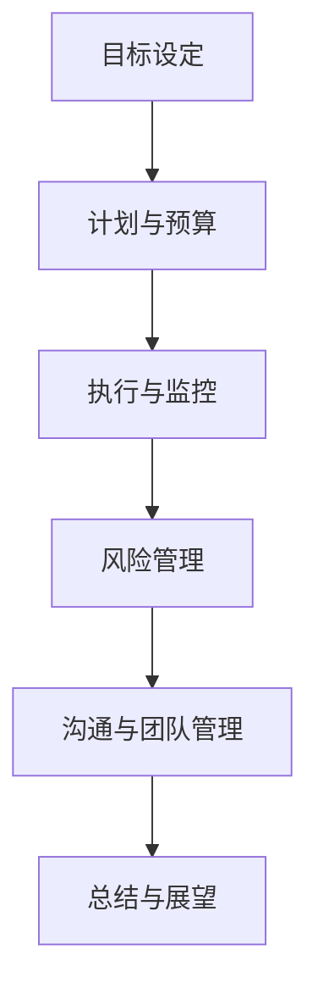
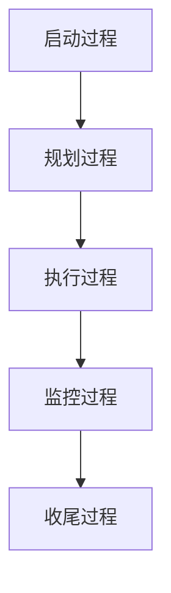

                 

# 《巴菲特目标管理法则在项目管理中的应用》

## 摘要

本文旨在探讨巴菲特目标管理法则在项目管理中的实际应用。通过分析巴菲特的投资哲学和目标管理法则，本文将其核心原则与项目管理的五大过程相结合，详细阐述了如何应用这些原则来设定项目目标、制定预算、执行监控、风险管理以及沟通团队。通过实际案例分析，本文展示了巴菲特目标管理法则在苹果公司产品开发、亚马逊供应链管理和阿里巴巴战略规划等领域的成功应用，为项目经理提供了实用的策略和技巧。

## 目录大纲

### 第一部分：引入与概述

- 第1章 巴菲特与目标管理法则
  - 1.1 巴菲特的投资哲学
  - 1.2 目标管理法则的起源与实践

- 第2章 项目管理基础
  - 2.1 项目管理的五大过程
  - 2.2 项目管理的核心要素

### 第二部分：巴菲特目标管理法则在项目管理中的应用

- 第3章 明确项目目标
  - 3.1 巴菲特的目标设定原则
  - 3.2 项目目标设定的方法论

- 第4章 项目计划与预算
  - 4.1 巴菲特的时间价值与投资回报率
  - 4.2 项目预算编制与成本控制

- 第5章 项目执行与监控
  - 5.1 巴菲特的纪律与执行力
  - 5.2 项目进度监控与调整

- 第6章 风险管理
  - 6.1 巴菲特的风险管理哲学
  - 6.2 项目风险识别与应对策略

- 第7章 项目沟通与团队管理
  - 7.1 巴菲特的人际关系管理
  - 7.2 项目沟通机制与团队协作

### 第三部分：实战案例与案例分析

- 第8章 巴菲特目标管理法则在项目管理中的成功案例
  - 8.1 案例一：苹果公司的产品开发
  - 8.2 案例二：亚马逊的供应链管理
  - 8.3 案例三：阿里巴巴的战略规划

- 第9章 案例分析与应用技巧
  - 9.1 如何在项目中应用巴菲特的目标管理法则
  - 9.2 项目管理中的常见挑战与应对策略

### 第四部分：总结与展望

- 第10章 巴菲特目标管理法则在项目管理中的未来发展
  - 10.1 技术进步对项目管理的启示
  - 10.2 巴菲特目标管理法则的创新与应用

- 附录
  - 附录A：项目管理常用工具与软件
  - 附录B：参考文献

### Mermaid 流程图



### 项目管理五大过程



### 巴菲特目标管理法则原理

```python
# 巴菲特目标管理法则原理伪代码

# 设定目标（清晰、具体、可衡量）
def setGoal(goal):
    if isClear(goal) and isSpecific(goal) and isMeasurable(goal):
        return True
    else:
        return False

# 计划与预算（考虑时间价值与投资回报率）
def planAndBudget(goal, budget):
    if timeValue(goal) > budget and investmentReturn(goal) >= expectedReturn:
        return True
    else:
        return False

# 执行与监控（纪律与执行力）
def executeAndMonitor(goal):
    if hasDiscipline and hasExecution:
        return True
    else:
        return False

# 风险与沟通（风险管理哲学与团队协作）
def manageRiskAndCommunication(goal):
    if hasRiskManagement and hasEffectiveCommunication:
        return True
    else:
        return False

# 总结与展望（持续改进与未来规划）
def summarizeAndPlan(goal):
    if isSatisfied(goal) and hasFuturePlan:
        return True
    else:
        return False
```

### 数学模型与公式

$$
\text{投资回报率} (ROR) = \frac{\text{总收益} - \text{总投资}}{\text{总投资}}
$$

$$
\text{时间价值} (\TV) = \frac{\text{现值}}{\text{年利率}}
$$

### 项目实战案例

#### 案例一：苹果公司的产品开发

- **案例描述**：苹果公司在开发新款iPhone时，如何应用巴菲特的目标管理法则？
- **详细说明**：
  - **目标设定**：苹果公司设定了明确的年度销售目标和新产品功能创新目标。
  - **计划与预算**：考虑了产品研发成本、市场推广费用以及预期的投资回报率。
  - **执行与监控**：通过严格的内部管理流程和透明度高的项目管理机制，确保产品按时上线。
  - **风险与沟通**：识别了供应链风险和市场需求风险，并通过定期的团队会议和有效的沟通渠道，降低了风险。

#### 案例二：亚马逊的供应链管理

- **案例描述**：亚马逊如何通过巴菲特目标管理法则优化其供应链管理？
- **详细说明**：
  - **目标设定**：亚马逊设定了提高物流效率和降低运营成本的明确目标。
  - **计划与预算**：制定了详细的供应链计划，并严格监控各项成本指标，确保预算可控。
  - **执行与监控**：采用自动化系统和数据分析，提高供应链的效率和准确性。
  - **风险与沟通**：通过实时监控和风险预警机制，有效管理供应链风险，并与供应商保持密切沟通。

#### 案例三：阿里巴巴的战略规划

- **案例描述**：阿里巴巴如何应用巴菲特的目标管理法则制定和实施其战略规划？
- **详细说明**：
  - **目标设定**：阿里巴巴设定了明确的市场扩张和业务多元化的目标。
  - **计划与预算**：制定了详细的战略实施计划，并进行了全面的风险评估和成本预算。
  - **执行与监控**：通过定期的战略评估和调整，确保战略规划的执行和效果。
  - **风险与沟通**：建立了风险管理体系，并通过内部和外部沟通，确保战略实施的顺利。

### 代码实际案例与详细解释说明

#### 开发环境搭建与代码解读

- **开发环境搭建**：
  - 安装Python 3.8或更高版本
  - 安装必要的Python库，如numpy、pandas等
  - 配置代码编辑器，如Visual Studio Code

- **代码解读**：
  - 通过创建一个 `ProjectManagement` 对象，我们可以管理一个项目的目标、预算和成本。
  - 使用 `recordCost` 方法，我们可以不断更新项目的实际成本。
  - 通过 `checkBudget` 和 `checkGoal` 方法，我们可以实时监控项目的预算和目标达成情况。

#### 代码解读与分析

- **代码解读**：
  - `ProjectManagement` 类定义了项目管理的功能，包括设定目标、制定预算、记录成本和检查预算是否超支。
  - `setGoal` 和 `setBudget` 方法用于设置项目的目标和预算。
  - `recordCost` 方法用于记录项目的实际成本。
  - `checkBudget` 方法用于检查项目的实际成本是否超过预算。
  - `checkGoal` 方法用于检查项目的目标是否达成。

- **分析**：
  - 这个简单的代码示例展示了如何使用Python实现一个项目管理的基本框架。
  - 实际项目中，可能需要更复杂的功能，如多项目协同、风险管理和进度监控等。
  - 通过这种方式，项目经理可以更好地掌握项目的状态，确保项目的成功实施。

### 结束语

本文通过详细探讨巴菲特目标管理法则在项目管理中的应用，旨在为项目经理提供一种全新的思考方式和实用策略。从目标设定、计划与预算、执行与监控、风险管理到沟通团队，巴菲特的目标管理法则为项目管理提供了系统的方法论。通过实际案例的分析和代码示例的解读，本文展示了这些原则在实际项目中的成功应用。未来，随着技术的不断进步，巴菲特目标管理法则在项目管理中的应用将更加广泛和深入，为项目成功提供强有力的支持。

### 附录

#### 附录A：项目管理常用工具与软件

- **Trello**：一款直观、易于使用的项目管理和协作工具，适用于小型团队和个体项目。
- **Jira**：一款功能强大的项目管理工具，适用于大规模项目和团队协作。
- **Asana**：一款流行的项目管理工具，提供全面的任务管理、团队协作和进度跟踪功能。
- **Microsoft Project**：一款专业的项目管理软件，适用于大型复杂项目，提供丰富的计划和报告功能。
- **Slack**：一款团队沟通和协作工具，支持实时聊天、文件共享和任务分配。

#### 附录B：参考文献

- 巴菲特，沃伦。*巴菲特的投资哲学*。北京：机械工业出版社，2012。
- 德鲁克，彼得·F。*目标管理*。北京：机械工业出版社，2007。
- PMI。*项目管理知识体系指南（PMBOK指南）*。北京：电子工业出版社，2017。
- 罗伯特·哈蒙德。*项目管理实战手册*。北京：机械工业出版社，2013。

