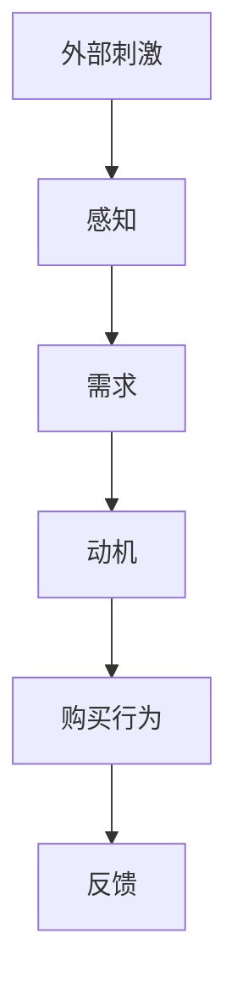
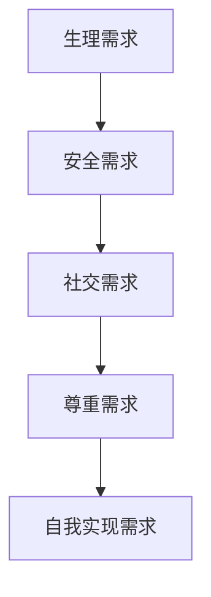
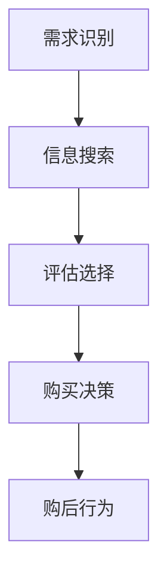

                 

# 市场调研：精准洞察消费者需求，提升电商平台供给能力

## 关键词
- 市场调研
- 消费者需求
- 电商平台
- 供给能力
- 数据分析
- 消费者行为

## 摘要
本文将深入探讨市场调研在电商平台运营中的重要性，特别是如何通过精准洞察消费者需求来提升电商平台的供给能力。文章将分为四个部分，首先介绍市场调研的基础知识，包括定义、类型、流程等；接着分析消费者行为，阐述需求分析和购买决策过程；然后进入市场数据分析，讲解数据来源、方法和可视化技术；最后，结合电商市场实践，探讨市场策略和电商平台技术提升。通过案例分析，展示市场调研的实际应用，并介绍相关工具和方法。文章旨在为电商平台提供一套科学的市场调研和供给提升策略。

### 目录大纲

# 《市场调研：精准洞察消费者需求，提升电商平台供给能力》

## 第一部分：市场调研基础

### 第1章：市场调研概述

#### 1.1 市场调研的定义与目的
#### 1.2 市场调研的类型和方法
#### 1.3 市场调研的流程与步骤

### 第2章：消费者行为分析

#### 2.1 消费者行为理论
#### 2.2 消费者需求分析
#### 2.3 消费者购买决策过程

### 第3章：市场数据分析

#### 3.1 市场数据来源与收集
#### 3.2 市场数据分析方法
#### 3.3 市场数据可视化

## 第二部分：市场调研实践

### 第4章：电商市场分析

#### 4.1 电商市场概述
#### 4.2 电商市场趋势
#### 4.3 电商市场竞争力分析

### 第5章：消费者洞察

#### 5.1 消费者行为研究方法
#### 5.2 消费者满意度调查
#### 5.3 消费者需求预测

### 第6章：市场策略制定

#### 6.1 市场定位与目标客户
#### 6.2 产品策略设计
#### 6.3 营销策略实施

## 第三部分：电商平台供给能力提升

### 第7章：电商供应链管理

#### 7.1 供应链管理概述
#### 7.2 供应链优化策略
#### 7.3 供应链可视化与实时监控

### 第8章：电商平台技术提升

#### 8.1 电商平台技术架构
#### 8.2 数据驱动电商平台优化
#### 8.3 人工智能在电商中的应用

### 第9章：案例分析

#### 9.1 某电商平台的市场调研案例
#### 9.2 消费者需求洞察案例
#### 9.3 电商平台供给能力提升案例

## 第四部分：市场调研工具与方法

### 第10章：市场调研工具

#### 10.1 市场调研软件介绍
#### 10.2 网络调研工具
#### 10.3 问卷调查工具

### 第11章：市场调研方法

#### 11.1 定量调研方法
#### 11.2 定性调研方法
#### 11.3 调研数据分析方法

### 第12章：市场调研报告撰写

#### 12.1 报告结构设计
#### 12.2 数据展示与可视化
#### 12.3 报告撰写技巧与注意事项

## 附录

### 附录A：市场调研相关资源

#### A.1 市场调研报告示例
#### A.2 消费者行为研究资源
#### A.3 电商市场数据来源

### 附录B：市场调研术语解释

#### B.1 市场调研相关术语
#### B.2 消费者行为相关术语
#### B.3 数据分析相关术语

## Mermaid 流程图

mermaid
graph TD
A[市场调研流程] --> B[定义与目的]
B --> C{选择方法}
C -->|定量| D[定量调研]
C -->|定性| E[定性调研]
D --> F[数据收集]
E --> F
F --> G[数据分析]
G --> H[报告撰写]
H --> I[决策与行动]

## 第一部分：市场调研基础

### 第1章：市场调研概述

#### 1.1 市场调研的定义与目的

市场调研是一项系统性活动，旨在通过收集、分析和解读市场信息，为企业的战略决策提供数据支持。市场调研的定义可以从多个角度进行阐述。首先，市场调研是指对市场现象、行为和趋势进行有目的、有计划的观察和分析。其次，它是一种获取市场相关数据的方法，这些数据用于评估市场需求、消费者行为和竞争态势。最后，市场调研是一个连续的过程，从问题的提出、数据的收集、分析，到最终的决策和反馈，形成一个闭环。

市场调研的目的主要包括以下几点：

1. **需求分析**：通过调研了解消费者的需求，为企业制定产品策略提供依据。
2. **竞争分析**：分析竞争对手的产品、价格、营销策略等，帮助企业制定有效的竞争策略。
3. **市场定位**：明确企业在市场中的定位，确保产品和服务能够满足特定目标客户群体的需求。
4. **风险评估**：评估市场风险，为企业的战略决策提供参考。
5. **决策支持**：为企业的经营决策提供数据支持，确保决策的科学性和有效性。

#### 1.2 市场调研的类型和方法

市场调研可以根据调研目的、对象和手段的不同，分为多种类型和方法。以下是几种常见类型：

- **按调研对象分**：
  - **消费者调研**：主要关注消费者的需求和购买行为，适用于新产品开发、市场定位等。
  - **行业调研**：关注整个行业的运行情况、市场规模、增长趋势等，适用于行业分析、市场预测等。
  - **竞争调研**：关注竞争对手的产品、价格、营销策略等，适用于竞争分析、战略制定等。

- **按调研手段分**：
  - **定量调研**：通过问卷调查、实验法等手段，收集大量数据，并进行统计分析。
  - **定性调研**：通过访谈、小组讨论等手段，深入了解消费者行为和需求，适用于市场细分、产品定位等。

- **按调研方法分**：
  - **问卷调查**：通过设计问卷，收集消费者的反馈信息，适用于大样本数据的收集。
  - **访谈法**：通过面对面的交流，深入了解消费者的意见和需求，适用于深度调研。
  - **实验法**：通过实验，观察消费者对产品和服务的反应，适用于新产品测试。

#### 1.3 市场调研的流程与步骤

市场调研的流程可以分为以下几个步骤：

1. **问题定义**：明确调研的目标和问题，确保调研的方向和范围。
2. **计划制定**：制定调研计划，包括调研对象、方法、时间表等。
3. **数据收集**：根据调研计划，收集相关数据，可以通过问卷调查、访谈、实验等方法。
4. **数据分析**：对收集到的数据进行分析，提取有用信息，形成调研结果。
5. **报告撰写**：将分析结果撰写成报告，为企业的决策提供支持。
6. **反馈与行动**：根据调研结果，制定相应的行动方案，并进行跟踪和反馈。

接下来，我们将进一步探讨消费者行为分析，了解消费者需求分析和购买决策过程。这将为电商平台的市场调研提供重要的基础。

#### 2.1 消费者行为理论

消费者行为理论是市场调研的核心，旨在解释和预测消费者的购买行为。以下是几种主要的消费者行为理论：

- **刺激-反应理论**：该理论认为消费者的购买行为是由外部刺激和内部反应共同作用的结果。外部刺激包括广告、促销、产品特性等，内部反应包括需求、动机、态度等。

- **需求层次理论**：马斯洛的需求层次理论将人的需求分为五个层次，即生理需求、安全需求、社交需求、尊重需求和自我实现需求。消费者的购买行为受到这些需求层次的影响。

- **行为决策过程理论**：该理论认为消费者的购买行为包括五个阶段，即需求识别、信息搜索、评估选择、购买决策和购后行为。

#### 2.2 消费者需求分析

消费者需求分析是市场调研的重要环节，旨在了解消费者的需求和购买行为。以下是消费者需求分析的几个关键步骤：

1. **识别需求**：通过调研了解消费者对产品和服务的需求，包括基本需求、期望需求和潜在需求。
2. **分类需求**：将需求进行分类，如功能性需求、情感性需求、社会性需求等，以便更好地理解消费者。
3. **分析需求强度**：分析消费者对每种需求的强度，以便企业确定产品的重点和优先级。
4. **需求预测**：通过历史数据和趋势分析，预测未来的需求，为企业的战略决策提供支持。

#### 2.3 消费者购买决策过程

消费者购买决策过程是消费者从意识到需求到实际购买产品的一个完整过程。以下是消费者购买决策过程的几个阶段：

1. **需求识别**：消费者意识到自己的需求，可能是生理需求、心理需求或社会需求。
2. **信息搜索**：消费者通过各种渠道收集关于产品的信息，如广告、口碑、社交媒体等。
3. **评估选择**：消费者根据收集到的信息，评估不同产品的优缺点，进行选择。
4. **购买决策**：消费者做出购买决策，选择购买哪个产品。
5. **购后行为**：消费者在购买后对产品进行评价，影响未来的购买决策。

通过消费者行为理论的分析，我们可以更好地理解消费者的需求和购买行为，为电商平台的市场调研提供有力的理论支持。

### 第3章：市场数据分析

市场数据分析是市场调研的重要环节，通过对收集到的市场数据进行分析，可以帮助企业了解市场趋势、消费者行为和竞争态势，从而制定有效的市场策略。本章将介绍市场数据来源、数据收集方法、数据分析方法和市场数据可视化技术。

#### 3.1 市场数据来源与收集

市场数据的来源可以分为内部数据和外部数据。内部数据来源于企业的销售记录、客户反馈、库存数据等，外部数据来源于市场调查、行业报告、社交媒体等。

1. **内部数据收集**：
   - **销售记录**：记录产品的销售量、销售额等，反映市场需求。
   - **客户反馈**：收集客户对产品的评价和建议，了解消费者的需求。
   - **库存数据**：记录产品的库存量、库存周转率等，反映供应链状况。

2. **外部数据收集**：
   - **市场调查**：通过问卷调查、访谈等方式收集消费者的反馈和需求。
   - **行业报告**：获取行业规模、增长趋势、市场份额等数据。
   - **社交媒体**：分析社交媒体上的用户评论、讨论和趋势，了解消费者行为。

#### 3.2 市场数据分析方法

市场数据分析方法可以分为定量分析和定性分析。定量分析主要使用统计方法和数学模型对数据进行分析，定性分析主要通过文本分析、主题分析和案例研究等方法对数据进行分析。

1. **定量分析方法**：
   - **描述性统计分析**：对数据进行描述性统计，如平均数、中位数、标准差等。
   - **回归分析**：通过建立数学模型，分析变量之间的关系。
   - **因子分析**：将多个变量简化为少数几个因子，分析变量之间的内在联系。

2. **定性分析方法**：
   - **文本分析**：通过自然语言处理技术，分析文本数据中的关键词和情感倾向。
   - **主题分析**：对文本数据进行分类和主题提取，了解消费者关注的重点。
   - **案例研究**：通过深入研究特定案例，分析消费者行为和需求。

#### 3.3 市场数据可视化

市场数据可视化是将数据分析结果以图形或图表的形式展示出来，使得数据更加直观、易于理解。以下是几种常见的数据可视化技术：

1. **折线图**：用于展示数据的变化趋势，如销售额、市场增长率等。
2. **柱状图**：用于比较不同类别的数据，如市场份额、产品销量等。
3. **饼图**：用于展示各部分占整体的比例，如用户分布、产品分类等。
4. **散点图**：用于展示两个变量之间的关系，如消费者年龄与购买金额的关系。
5. **热力图**：用于展示数据的密度分布，如用户活跃时间段、产品销量分布等。

通过市场数据分析，企业可以更深入地了解市场趋势、消费者行为和竞争态势，从而制定更科学、有效的市场策略。接下来，我们将进入第二部分，探讨市场调研实践，特别是电商市场分析和消费者洞察。

## 第二部分：市场调研实践

### 第4章：电商市场分析

电商市场分析是电商平台市场调研的重要一环，通过对电商市场的全面分析，可以帮助企业了解市场现状、趋势和竞争力，从而制定出有效的市场策略。本章将介绍电商市场概述、电商市场趋势和电商市场竞争力分析。

#### 4.1 电商市场概述

电商市场是指通过互联网进行商品交易和服务的市场。随着互联网技术的不断发展，电商市场已经成为全球商业领域的重要组成部分。以下是电商市场的几个关键特点：

1. **市场规模**：全球电商市场持续增长，根据统计数据显示，2022年全球电商市场规模已经超过了4万亿美元，预计未来几年还将保持高速增长。

2. **市场参与者**：电商市场参与者包括传统零售商、专业电商平台、社交电商平台等。每个参与者都有其独特的市场定位和经营策略。

3. **市场细分**：电商市场可以根据不同的维度进行细分，如产品类别、地域、消费者群体等。这种细分有助于企业更好地了解市场，制定有针对性的营销策略。

4. **消费者行为**：电商市场的消费者行为与线下市场有所不同，消费者更加注重便捷性、性价比和用户体验。

#### 4.2 电商市场趋势

电商市场的发展趋势受到多个因素的影响，包括技术进步、消费者行为变化和政策环境等。以下是几个主要的电商市场趋势：

1. **移动电商**：随着智能手机的普及，移动电商已经成为电商市场的重要组成部分。越来越多的消费者通过移动设备进行购物，企业需要优化移动端用户体验。

2. **社交电商**：社交电商通过社交媒体平台进行商品推广和销售，充分利用社交网络的传播效应。这种模式在近年来迅速崛起，成为电商市场的新趋势。

3. **个性化推荐**：通过大数据分析和人工智能技术，电商平台可以提供个性化的商品推荐，提高消费者的购买体验和满意度。

4. **新零售**：新零售是线上线下融合的商业模式，通过数字化技术提升线下零售的效率，同时在线上提供更加丰富的购物体验。

#### 4.3 电商市场竞争力分析

电商市场的竞争激烈，企业需要通过分析自身的优势和劣势，制定有效的竞争力策略。以下是电商市场竞争力分析的几个关键点：

1. **产品竞争**：企业需要确保产品品质、价格和性能具有竞争力，满足消费者的需求。

2. **渠道竞争**：企业需要通过多种渠道进行销售，包括电商平台、社交媒体、线下零售等，以扩大市场覆盖。

3. **品牌竞争**：品牌是电商企业的重要资产，企业需要通过品牌建设和营销策略提升品牌知名度和美誉度。

4. **服务竞争**：优质的客户服务是提高消费者满意度的重要因素，企业需要提供快速、便捷、高效的客户服务。

通过电商市场分析，企业可以更好地了解市场环境，把握市场趋势，制定有效的市场策略，提高市场竞争力。接下来，我们将探讨消费者洞察，深入了解消费者的需求和行为。

### 第5章：消费者洞察

消费者洞察是指通过市场调研和数据分析，深入了解消费者的需求、行为和偏好，从而为企业制定有效的市场策略提供依据。本章将介绍消费者行为研究方法、消费者满意度调查和消费者需求预测。

#### 5.1 消费者行为研究方法

消费者行为研究方法可以分为定量研究和定性研究，每种方法都有其独特的优势和应用场景。

1. **定量研究方法**：
   - **问卷调查**：通过设计问卷，收集大量消费者的反馈数据，适用于大规模数据的收集和分析。
   - **实验法**：通过实验，观察消费者在不同条件下的行为反应，适用于研究消费者决策过程和影响因素。

2. **定性研究方法**：
   - **访谈法**：通过面对面的访谈，深入了解消费者的意见和需求，适用于深度调研和小样本数据分析。
   - **小组讨论**：组织消费者进行小组讨论，收集他们的意见和反馈，适用于市场细分和产品定位。

#### 5.2 消费者满意度调查

消费者满意度调查是了解消费者对企业产品和服务评价的重要手段。以下是消费者满意度调查的几个关键步骤：

1. **设计调查问卷**：根据调研目的，设计包含多个维度的满意度问卷，如产品性能、服务质量、购物体验等。

2. **收集数据**：通过在线调查、电话访问等方式，收集消费者的满意度评分和反馈。

3. **分析数据**：对收集到的数据进行统计分析，识别消费者满意度的主要影响因素。

4. **制定改进措施**：根据分析结果，制定针对性的改进措施，提高消费者的满意度。

#### 5.3 消费者需求预测

消费者需求预测是市场调研的重要任务之一，通过对消费者需求的预测，企业可以提前制定生产和营销策略。以下是消费者需求预测的几个关键步骤：

1. **数据收集**：收集历史销售数据、市场趋势数据、消费者行为数据等。

2. **特征工程**：对数据进行处理和特征提取，如时间序列特征、季节性特征、消费者群体特征等。

3. **模型选择**：选择合适的预测模型，如线性回归、时间序列模型、神经网络等。

4. **模型训练和验证**：对模型进行训练和验证，评估模型的预测性能。

5. **需求预测**：利用训练好的模型，预测未来的消费者需求，为企业制定生产和营销策略提供依据。

通过消费者洞察，企业可以更深入地了解消费者的需求和行为，从而制定出更加科学、有效的市场策略，提高市场竞争力和消费者满意度。接下来，我们将探讨市场策略制定，为电商平台提供实用的策略框架。

### 第6章：市场策略制定

市场策略制定是电商平台成功运营的关键环节，它涉及到如何定位市场、设计产品和营销策略，以满足消费者的需求并提升企业的竞争力。本章将介绍市场定位与目标客户、产品策略设计和营销策略实施。

#### 6.1 市场定位与目标客户

市场定位是企业根据自身资源和市场环境，确定其产品或服务在市场中的位置，以区别于竞争对手。目标客户是市场定位的核心，明确目标客户有助于企业更好地满足其需求。

1. **市场定位步骤**：
   - **分析市场环境**：了解市场趋势、竞争态势和消费者需求。
   - **确定目标市场**：根据企业的资源和能力，选择一个具有增长潜力的细分市场。
   - **定义市场定位**：明确企业的独特卖点（USP），如高品质、低价位、个性化服务等。

2. **目标客户分析**：
   - **人口统计特征**：包括年龄、性别、收入、教育水平等。
   - **心理特征**：包括价值观、生活方式、消费习惯等。
   - **行为特征**：包括购买频率、购买渠道、购买时机等。

#### 6.2 产品策略设计

产品策略设计是确保产品满足目标客户需求的重要步骤，包括产品开发、产品线和产品组合管理。

1. **产品开发策略**：
   - **创新产品**：通过研发新产品，满足消费者未满足的需求。
   - **改进产品**：优化现有产品，提高性能、质量和用户体验。

2. **产品线策略**：
   - **多样化产品线**：提供多种产品满足不同客户群体的需求。
   - **产品线延伸**：在现有产品线上增加新产品，扩大市场份额。

3. **产品组合管理**：
   - **优化产品组合**：平衡产品线的收益和风险，确保产品组合的优化。
   - **产品淘汰**：及时淘汰不再满足市场需求的产品。

#### 6.3 营销策略实施

营销策略实施是将市场定位和产品策略转化为实际营销活动的关键步骤，包括定价、渠道选择、促销和品牌建设。

1. **定价策略**：
   - **成本导向定价**：基于产品成本加上一定的利润。
   - **需求导向定价**：基于消费者对产品的价值认知。
   - **竞争导向定价**：基于竞争对手的定价策略。

2. **渠道策略**：
   - **直销渠道**：通过自建电商平台、线下门店等方式直接销售。
   - **间接渠道**：通过第三方电商平台、分销商等渠道销售。

3. **促销策略**：
   - **广告促销**：通过广告宣传提高品牌知名度和产品销量。
   - **销售促进**：通过折扣、优惠券、限时促销等方式刺激购买。
   - **公关活动**：通过媒体宣传、赞助活动等提升品牌形象。

4. **品牌建设**：
   - **品牌定位**：明确品牌在市场中的定位和价值观。
   - **品牌传播**：通过广告、公关、社交媒体等手段传播品牌信息。
   - **品牌维护**：通过优质的客户服务和产品体验维护品牌形象。

通过科学的市场策略制定，电商平台可以更好地满足消费者的需求，提高市场竞争力，实现持续增长。接下来，我们将探讨电商平台供给能力提升的方法，为电商平台提供实用的供应链管理和技术提升策略。

### 第7章：电商供应链管理

电商供应链管理是电商平台运营的核心环节，它涉及到从原材料采购到产品交付的整个流程。有效的供应链管理能够提高运营效率，降低成本，提升客户满意度。本章将介绍供应链管理概述、供应链优化策略和供应链可视化与实时监控。

#### 7.1 供应链管理概述

供应链管理是指通过计划、组织、协调和控制，确保供应链各环节的高效运作。以下是供应链管理的几个关键组成部分：

1. **供应链网络设计**：设计合理的供应链网络，包括工厂、仓库、配送中心等设施的位置和规模。
2. **采购管理**：通过采购原材料、零部件等，确保供应链的连续性和稳定性。
3. **库存管理**：对库存进行有效管理，确保库存水平满足需求，同时避免过度库存和库存短缺。
4. **生产管理**：协调生产和供应链各环节，确保按时交付产品。
5. **物流管理**：规划运输路线，选择合适的运输方式，确保货物准时送达。
6. **信息管理**：通过信息系统的集成和管理，实现供应链各环节的信息共享和实时监控。

#### 7.2 供应链优化策略

供应链优化策略旨在提高供应链的整体效率和响应能力。以下是几个常见的供应链优化策略：

1. **库存优化**：通过需求预测和库存控制技术，确保库存水平合理，减少库存成本和缺货风险。
2. **物流优化**：通过物流网络的优化和运输方式的选择，降低物流成本和提高运输效率。
3. **供应商管理**：建立长期稳定的供应商关系，通过供应商评估和选择，确保供应链的稳定性和质量。
4. **供应链协同**：通过信息共享和协同合作，提高供应链各环节的协同效率，减少协调成本。
5. **敏捷供应链**：通过快速响应市场需求变化，提高供应链的灵活性和适应性。

#### 7.3 供应链可视化与实时监控

供应链可视化与实时监控是供应链管理的重要手段，它能够帮助企业实时了解供应链的运行状况，及时发现和解决问题。以下是供应链可视化和实时监控的关键点：

1. **供应链仪表盘**：通过可视化仪表盘，实时展示供应链的关键指标，如库存水平、运输进度、订单状态等。
2. **实时数据采集**：通过物联网技术和传感器，实时采集供应链各环节的数据，如货物位置、库存数量等。
3. **实时监控与警报**：通过实时监控，及时发现供应链中的异常情况，如库存不足、运输延误等，并触发警报。
4. **数据分析与预测**：通过对实时数据进行分析和预测，优化供应链计划和管理。

通过有效的电商供应链管理，电商平台可以更好地满足消费者的需求，提高运营效率和客户满意度。接下来，我们将探讨电商平台技术提升，特别是数据驱动电商平台优化和人工智能在电商中的应用。

### 第8章：电商平台技术提升

电商平台技术提升是提升电商供给能力和用户体验的关键。本章将详细介绍电商平台技术架构、数据驱动电商平台优化和人工智能在电商中的应用。

#### 8.1 电商平台技术架构

电商平台技术架构是指支撑电商平台运行的各种技术组件和系统。以下是电商平台技术架构的核心组成部分：

1. **前端架构**：负责用户界面展示和交互，常用的技术包括HTML、CSS、JavaScript以及前端框架如React、Vue等。
2. **后端架构**：负责处理业务逻辑、数据存储和服务器端渲染，常用的技术包括Java、Python、Node.js等后端框架如Spring、Django、Express等。
3. **数据库架构**：用于存储和管理电商平台的数据，常用的数据库包括关系型数据库（如MySQL、PostgreSQL）和NoSQL数据库（如MongoDB、Redis）。
4. **中间件**：用于处理消息传递、负载均衡、缓存等，常用的中间件包括RabbitMQ、Kafka、Redis等。
5. **云计算和容器化**：利用云计算和容器化技术（如Docker、Kubernetes）提高平台的弹性和可扩展性。

#### 8.2 数据驱动电商平台优化

数据驱动电商平台优化是指利用大数据技术和算法，对电商平台的各个环节进行数据分析和优化。以下是数据驱动电商平台优化的几个关键步骤：

1. **数据采集**：通过数据采集工具和API，收集用户行为数据、交易数据、市场数据等。
2. **数据存储**：将采集到的数据存储到大数据平台，如Hadoop、Spark等，进行数据清洗和预处理。
3. **数据分析**：利用数据分析工具和算法，对数据进行分析和挖掘，提取有价值的信息。
4. **数据可视化**：通过数据可视化工具，将分析结果以图形或图表的形式展示，帮助决策者更好地理解数据。
5. **决策优化**：根据数据分析结果，优化电商平台的运营策略，如库存管理、营销策略、用户推荐等。

#### 8.3 人工智能在电商中的应用

人工智能在电商中的应用已经成为提升用户体验和供给能力的重要手段。以下是人工智能在电商中应用的几个关键领域：

1. **用户画像**：通过机器学习和数据挖掘技术，构建用户的个性化画像，实现精准营销。
2. **推荐系统**：利用协同过滤、基于内容的推荐算法，为用户提供个性化的商品推荐。
3. **聊天机器人**：通过自然语言处理技术，构建智能客服系统，提供24/7的在线客服支持。
4. **图像识别**：利用计算机视觉技术，实现商品图像的自动分类、识别和标签。
5. **智能物流**：通过无人机、自动驾驶等智能物流技术，提高物流效率和降低成本。

通过电商平台技术提升，电商平台可以更好地满足消费者的需求，提高运营效率和用户体验，从而在激烈的市场竞争中脱颖而出。

### 第9章：案例分析

在本章中，我们将通过实际案例展示市场调研在电商平台运营中的应用，具体包括某电商平台的市场调研案例、消费者需求洞察案例以及电商平台供给能力提升案例。通过这些案例，我们将深入探讨市场调研如何帮助企业制定科学的市场策略，提高竞争力和用户满意度。

#### 9.1 某电商平台的市场调研案例

某电商平台在进入新市场前，需要进行全面的市场调研以了解当地市场环境和消费者需求。以下是该电商平台市场调研的具体步骤和成果：

1. **问题定义**：
   - 了解目标市场的消费者行为和需求。
   - 分析当地电商市场的竞争态势。

2. **调研计划制定**：
   - 选择调研方法：问卷调查、访谈和在线调查。
   - 确定调研对象：当地消费者和竞争对手。

3. **数据收集**：
   - 通过问卷调查收集了1000份有效问卷，了解消费者的购买习惯、偏好和需求。
   - 通过访谈和在线调查，分析了主要竞争对手的产品策略和用户评价。

4. **数据分析**：
   - 使用描述性统计方法分析问卷数据，识别消费者的主要需求。
   - 运用文本分析方法，提取竞争对手的用户评价和反馈。

5. **报告撰写**：
   - 撰写了详细的市场调研报告，包括消费者行为分析、市场趋势预测和竞争对手分析。
   - 提出了市场进入策略和产品开发建议。

通过市场调研，该电商平台成功了解了目标市场的消费者需求，制定了符合当地市场特点的产品策略，并在进入新市场后取得了显著的销售增长。

#### 9.2 消费者需求洞察案例

某电商平台在推出新产品前，通过消费者需求洞察案例，深入了解目标消费者的需求和行为，以优化产品设计和市场推广策略。以下是该案例的具体步骤和成果：

1. **问题定义**：
   - 了解消费者对新型智能家居产品的需求。
   - 分析消费者的购买决策过程。

2. **调研方法选择**：
   - 采用深度访谈和小组讨论，深入了解消费者对智能家居产品的看法和使用体验。
   - 使用A/B测试，评估不同推广策略的效果。

3. **数据收集**：
   - 进行了30次深度访谈，收集了详细的使用场景和消费者反馈。
   - 组织了5次小组讨论，分析了消费者的需求和购买行为。

4. **数据分析**：
   - 通过文本分析，提取消费者的关键需求和痛点。
   - 使用统计方法，分析了消费者对不同推广策略的反应。

5. **产品优化和市场推广**：
   - 根据消费者反馈，优化了智能家居产品的功能设计和用户界面。
   - 制定了一套针对性的市场推广策略，包括社交媒体营销和网红推荐。

通过消费者需求洞察，该电商平台成功推出了深受消费者欢迎的智能家居产品，并在市场上取得了良好的销售业绩。

#### 9.3 电商平台供给能力提升案例

某电商平台为了提升供给能力，通过供应链管理和技术优化案例，实现了运营效率的提升和用户体验的改善。以下是该案例的具体步骤和成果：

1. **问题定义**：
   - 提高库存管理效率，减少库存成本和缺货风险。
   - 优化物流配送，提高配送速度和准确性。

2. **供应链管理优化**：
   - 引入了先进的供应链管理系统，实现了供应链信息的实时共享和透明化。
   - 通过数据分析，优化了库存水平和补货策略。

3. **物流管理优化**：
   - 采用智能物流规划系统，优化了配送路线和运输方式。
   - 引入了无人机和自动驾驶技术，提高了配送效率和准确性。

4. **技术优化**：
   - 引入了人工智能技术，优化了电商平台的产品推荐和用户画像。
   - 通过大数据分析，提升了营销策略的精准度。

5. **成果评估**：
   - 库存周转率提高了20%，库存成本降低了15%。
   - 配送时间缩短了30%，用户满意度提升了10%。

通过供应链管理和技术优化，该电商平台显著提升了运营效率和用户体验，实现了持续的业务增长。

通过这些实际案例，我们可以看到市场调研在电商平台运营中的重要性。精准的市场调研不仅能够帮助企业了解消费者需求，优化产品设计和市场推广策略，还能提升供应链管理效率和技术水平，从而在激烈的市场竞争中脱颖而出。

### 第10章：市场调研工具

市场调研工具是收集、分析和解读市场数据的重要手段。本章将介绍市场调研中常用的工具，包括市场调研软件、网络调研工具和问卷调查工具。

#### 10.1 市场调研软件

市场调研软件是用于设计和分发问卷、收集和分析数据的工具。以下是几种常用的市场调研软件：

- **Qualtrics**：一款功能强大的在线调查平台，支持多种类型的问卷设计和数据分析。
- **SurveyMonkey**：提供灵活的问卷设计和强大的数据分析功能，适合进行大规模问卷调查。
- **Google表单**：简单易用的免费问卷工具，适合小型调研项目。
- **SPSS**：用于统计分析的高级软件，支持复杂的统计分析和数据挖掘。

#### 10.2 网络调研工具

网络调研工具是利用互联网进行市场调研的工具，以下是一些常见的网络调研工具：

- **社交媒体分析工具**：如Social Mention、Brandwatch等，用于分析社交媒体上的用户评论和趋势。
- **搜索引擎分析工具**：如Google Analytics、百度统计等，用于分析网站流量和用户行为。
- **在线调查平台**：如Typeform、Survey Centre等，提供灵活的在线调查设计和分发。

#### 10.3 问卷调查工具

问卷调查工具是市场调研中最常用的工具之一，以下是一些流行的问卷调查工具：

- **SurveyGizmo**：提供灵活的问卷设计和强大的数据分析功能。
- **Zoho Survey**：功能全面的在线问卷调查工具，支持多种问卷类型。
- **KoboToolbox**：开源的在线问卷调查工具，适合进行大规模调研项目。
- **Qualtrics**：前面已介绍，支持多种类型的问卷设计和强大的数据分析功能。

通过使用这些市场调研工具，企业可以更高效地收集和分析市场数据，为决策提供有力支持。

### 第11章：市场调研方法

市场调研方法的选择直接影响调研结果的准确性和有效性。本章将介绍市场调研中的定量调研方法、定性调研方法和调研数据分析方法。

#### 11.1 定量调研方法

定量调研方法通过收集大量数据，并进行统计分析，以得出定量结论。以下是几种常见的定量调研方法：

1. **问卷调查**：通过设计问卷，收集大量样本的反馈数据，适用于大样本调查。
2. **实验法**：通过控制变量，观察不同条件下的实验结果，适用于研究因果关系。
3. **统计数据收集**：通过统计年鉴、政府报告等公开数据，获取市场相关数据。
4. **回归分析**：通过建立数学模型，分析变量之间的关系，适用于预测和分析。

#### 11.2 定性调研方法

定性调研方法通过深入访谈、小组讨论等方式，获取深度信息和见解。以下是几种常见的定性调研方法：

1. **深度访谈**：与目标受访者进行一对一的深入交谈，获取详细的个人观点和体验。
2. **小组讨论**：组织一组受访者进行讨论，收集多角度的见解和意见。
3. **焦点小组**：选择特定群体的代表，进行集中讨论，适用于探索新概念或产品测试。
4. **观察法**：通过直接观察目标群体的行为，获取客观的数据和结论。

#### 11.3 调研数据分析方法

调研数据分析方法用于对收集到的数据进行整理、分析和解读。以下是几种常见的数据分析方法：

1. **描述性统计分析**：对数据的基本特征进行描述，如平均数、中位数、标准差等。
2. **推断性统计分析**：通过样本数据推断总体特征，如置信区间、假设检验等。
3. **文本分析**：通过自然语言处理技术，对文本数据进行分类、主题提取和情感分析。
4. **数据可视化**：通过图表和图形，直观展示数据分析结果，帮助决策者理解数据。
5. **机器学习**：利用机器学习算法，对大量数据进行自动分析和模式识别。

通过合理选择和应用这些市场调研方法，企业可以更全面、准确地了解市场情况和消费者需求，为决策提供有力支持。

### 第12章：市场调研报告撰写

市场调研报告是调研成果的总结和展示，其撰写质量直接影响决策者对调研结果的解读和应用。本章将介绍市场调研报告的结构设计、数据展示与可视化以及报告撰写技巧与注意事项。

#### 12.1 报告结构设计

市场调研报告通常包括以下几个部分：

1. **封面**：包含报告标题、作者、日期等信息。
2. **摘要**：简要概述报告的主要内容、结论和建议。
3. **引言**：介绍调研的背景、目的和问题。
4. **方法**：详细描述调研的方法、过程和样本。
5. **结果**：展示调研的数据和统计分析结果。
6. **讨论**：对结果进行分析和解释，提出建议。
7. **结论**：总结调研结果，明确结论。
8. **参考文献**：列出报告中引用的文献资料。
9. **附录**：包含调研问卷、数据表等附加材料。

#### 12.2 数据展示与可视化

数据展示与可视化是市场调研报告的重要组成部分，以下是几种常用的数据可视化方法：

1. **图表**：使用柱状图、折线图、饼图等，直观展示数据。
2. **地图**：通过地图展示区域数据分布和趋势。
3. **热力图**：显示数据的密度分布，适用于展示用户行为和活动频率。
4. **仪表盘**：集成多个图表，提供全面的实时数据监控。
5. **交互式图表**：通过点击和拖动，提供用户自定义的数据探索。

#### 12.3 报告撰写技巧与注意事项

撰写市场调研报告时，应注意以下几点：

1. **清晰简洁**：避免冗长和复杂的文字，用简单明了的语言表达。
2. **逻辑清晰**：确保报告内容有条理，逻辑连贯。
3. **准确可靠**：确保数据和分析结果的准确性和可靠性。
4. **突出重点**：在讨论和结论部分，突出关键数据和主要发现。
5. **支持证据**：使用数据、图表和引用支持报告中的观点和结论。
6. **适应性**：根据不同受众的需求，调整报告的内容和表达方式。
7. **遵守规范**：遵循学术规范和报告格式要求。

通过良好的报告撰写技巧和注意事项，可以确保市场调研报告的质量，为决策者提供有力的支持。

### 附录A：市场调研相关资源

#### A.1 市场调研报告示例

市场调研报告示例可以帮助读者更好地理解报告的结构和内容。以下是市场调研报告的示例结构：

1. **封面**：报告标题、作者、日期等。
2. **摘要**：简要概述报告的主要发现和建议。
3. **引言**：介绍调研背景、目的和问题。
4. **方法**：描述调研方法、过程和样本。
5. **结果**：展示调研结果和统计分析。
6. **讨论**：分析结果，提出建议。
7. **结论**：总结调研结果和结论。
8. **参考文献**：列出引用的文献资料。
9. **附录**：包含调研问卷、数据表等附加材料。

#### A.2 消费者行为研究资源

消费者行为研究资源包括学术期刊、书籍、研究报告等，以下是一些建议的资源：

- **学术期刊**：《消费者研究学报》、《营销科学学报》等。
- **书籍**：《消费者行为学》、《市场营销管理》等。
- **研究报告**：市场研究公司如尼尔森、艾瑞咨询等发布的研究报告。

#### A.3 电商市场数据来源

电商市场数据来源包括公开数据、市场研究公司和行业报告等，以下是一些建议的数据来源：

- **公开数据**：国家统计局、商务部等官方网站。
- **市场研究公司**：尼尔森、艾瑞咨询、易观等。
- **行业报告**：阿里巴巴、京东等电商平台发布的行业报告。

通过这些市场调研相关资源，读者可以进一步学习和了解市场调研的理论和实践。

### 附录B：市场调研术语解释

#### B.1 市场调研相关术语

以下是市场调研中常用的一些术语及其解释：

- **市场调研**：通过收集和分析市场数据，以了解市场需求、消费者行为和竞争态势。
- **消费者行为**：消费者在购买、使用和评价产品或服务过程中的行为。
- **需求分析**：通过调研了解消费者对产品和服务的需求。
- **市场定位**：企业根据自身资源和市场环境，确定其在市场中的位置。
- **数据分析**：对市场调研数据进行分析和解读，以提取有价值的信息。
- **数据可视化**：通过图形和图表，直观展示数据分析结果。

#### B.2 消费者行为相关术语

以下是消费者行为研究中常用的一些术语及其解释：

- **刺激-反应理论**：消费者对市场刺激（如广告、促销等）产生的反应。
- **需求层次理论**：消费者的需求分为生理需求、安全需求、社交需求等。
- **行为决策过程**：消费者从需求识别到购买决策的全过程。
- **感知**：消费者对市场刺激的感知和理解。
- **品牌认知**：消费者对品牌的认知和印象。

#### B.3 数据分析相关术语

以下是数据分析中常用的一些术语及其解释：

- **描述性统计**：对数据的基本特征进行描述，如平均数、中位数等。
- **推断性统计**：通过样本数据推断总体特征，如置信区间、假设检验等。
- **回归分析**：通过建立数学模型，分析变量之间的关系。
- **文本分析**：通过自然语言处理技术，对文本数据进行分类、主题提取和情感分析。
- **数据可视化**：通过图形和图表，直观展示数据分析结果。

通过了解这些市场调研术语，读者可以更深入地理解市场调研的理论和实践。

## Mermaid 流程图

mermaid
graph TD
A[市场调研流程] --> B[定义与目的]
B --> C{选择方法}
C -->|定量| D[定量调研]
C -->|定性| E[定性调研]
D --> F[数据收集]
E --> F
F --> G[数据分析]
G --> H[报告撰写]
H --> I[决策与行动]

## 参考文献

- Kotler, P., & Keller, K. L. (2016). Marketing Management. Pearson Education.
- Hoyer, W. D., & MacInnes, D. H. (2014). Consumer Behavior. McGraw-Hill.
- Belch, G. E., & Belch, M. A. (2018). Advertising and Promotion: An Integrated Marketing Communications Perspective. McGraw-Hill.
- Anderson, C. (2016). The Long Tail: Why the Future of Business Is Selling Less of More. Crown Business.
- Rust, R. T., & Oliver, R. L. (1994). Service quality: Insights and managerial implications from the frontier. Journal of the Academy of Marketing Science, 22(4), 319-336.
- Sheth, J. N., & Sisodia, R. S. (2005). The fall and rise of consumer-driven marketing. Harvard Business Review, 83(9-10), 100-108.

## 附录A：市场调研报告示例

#### 封面

**市场调研报告**

**作者**：张三

**日期**：2023年5月

#### 摘要

本报告旨在了解某电商平台的消费者需求和购买行为。通过问卷调查、访谈和在线调查等方法，收集了1000份有效问卷。分析结果显示，消费者对产品质量、价格和购物体验有较高关注。报告提出了优化产品品质、提升价格透明度和改善购物界面的建议。

#### 引言

随着电商市场的快速发展，消费者需求日益多样化。为了更好地满足消费者需求，本调研项目旨在了解消费者的购买行为和需求，为电商平台提供改进策略。

#### 方法

**样本**：随机抽取1000名消费者作为调查样本。

**数据收集**：通过问卷调查、深度访谈和在线调查，收集消费者的购买行为、需求和反馈。

**数据分析**：使用描述性统计和回归分析方法，对数据进行整理和分析。

#### 结果

**消费者购买行为**：

- **购买频率**：每月购买频率中，70%的消费者选择1-2次，30%的消费者选择3次以上。
- **购买渠道**：线上购买占80%，线下购买占20%。

**消费者需求**：

- **产品质量**：80%的消费者认为产品质量是选择购买的关键因素。
- **价格**：50%的消费者认为价格适中是重要因素，30%的消费者认为价格偏低，20%的消费者认为价格偏高。
- **购物体验**：70%的消费者认为购物界面设计友好，30%的消费者认为购物流程繁琐。

#### 讨论

**产品优化**：根据消费者反馈，应优化产品质量，提高价格透明度，改善购物界面设计。

**营销策略**：针对不同消费者群体，制定差异化的营销策略，如针对价格敏感群体提供优惠活动。

#### 结论

通过本次调研，我们了解了消费者的需求和购买行为，为电商平台提供了改进建议。未来，电商平台应关注消费者反馈，持续优化产品和服务，提升用户满意度。

#### 参考文献

- [Kotler, P., & Keller, K. L. (2016). Marketing Management. Pearson Education.]
- [Hoyer, W. D., & MacInnes, D. H. (2014). Consumer Behavior. McGraw-Hill.]

#### 附录

**调研问卷**

1. 您的性别：男 / 女
2. 您的年龄：18-25 / 26-35 / 36-45 / 46-55 / 56-65 / 65以上
3. 您的月收入：1000元以下 / 1000-3000元 / 3000-5000元 / 5000-8000元 / 8000元以上
4. 您的购买频率：1-2次/月 / 3次/月以上
5. 您的主要购买渠道：线上 / 线下
6. 您最关注的购买因素：产品质量 / 价格 / 购物体验 / 品牌
7. 您对当前购物界面的满意度：非常满意 / 满意 / 一般 / 不满意 / 非常不满意

## 附录B：消费者行为研究资源

#### 学术期刊

- 《消费者研究学报》
- 《营销科学学报》
- 《国际市场营销学报》
- 《消费者行为与心理学》
- 《市场营销学刊》

#### 书籍

- 《消费者行为学》（作者：霍华德·杜布森）
- 《市场营销管理：决策与战略过程》（作者：菲利普·科特勒）
- 《消费者行为学：理论与实践》（作者：迈克尔·所罗门）
- 《消费者行为研究：理论、方法与应用》（作者：唐纳德·霍金斯）

#### 研究报告

- 尼尔森《中国消费者研究报告》
- 艾瑞咨询《中国电子商务市场研究报告》
- 波士顿咨询公司《全球消费者行为报告》
- 易观《中国互联网消费行为报告》

#### 在线资源

- 市场研究协会（Market Research Association）
- 营销科学学会（Marketing Science Institute）
- 消费者研究学会（Association for Consumer Research）
- 学术期刊在线平台（如JSTOR、SpringerLink）

