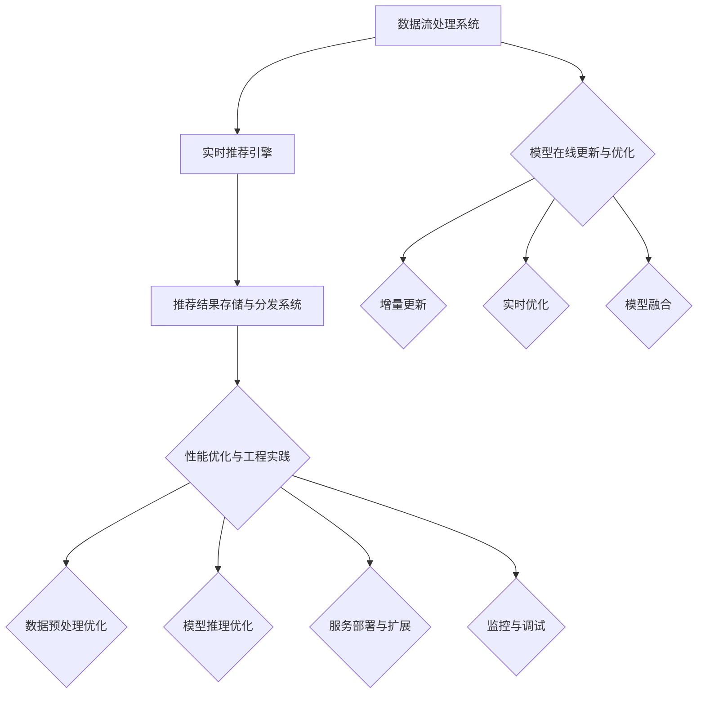

                 

### 第1章：社交旅游与个性化推荐概述

#### 1.1 社交旅游的概念与兴起

社交旅游，也称为社交化旅游，是近年来兴起的一种新型旅游模式。它不仅关注旅游者对自然风光和人文景观的体验，更强调通过社交媒体等平台与他人互动，分享旅游过程中的感受和经验。社交旅游的兴起，得益于移动互联网的普及和社交媒体的快速发展。

**定义**：社交旅游是指旅游者通过互联网平台，如社交媒体、旅游论坛等，与同好者交流和分享旅游经历，以获取旅游信息、制定旅游计划和享受旅游乐趣的一种旅游方式。

**兴起原因**：

1. **移动互联网的普及**：随着智能手机的普及和移动互联网的发展，人们可以随时随地访问互联网，获取旅游信息，记录旅游经历。
2. **社交媒体的发展**：社交媒体平台如Facebook、Instagram、Twitter等，为旅游者提供了交流、分享和互动的空间，使得旅游信息传播更加迅速、广泛。
3. **用户需求的变化**：随着旅游市场的成熟，旅游者对个性化、定制化的需求逐渐增加，社交旅游满足了这一需求。

**特点**：

1. **互动性强**：社交旅游者可以通过社交媒体与其他旅游者互动，分享旅游心得，交流旅游信息。
2. **分享性**：旅游者可以在社交媒体上发布旅游照片、视频和文字记录，分享旅游乐趣。
3. **个性化**：社交旅游平台可以根据旅游者的兴趣、行为等数据，为其推荐合适的旅游目的地和旅游活动。

#### 1.2 个性化推荐的原理与价值

个性化推荐系统是一种根据用户的兴趣、行为和历史数据，为用户推荐符合其需求和兴趣的信息的系统。在社交旅游中，个性化推荐系统能够为旅游者提供个性化的旅游推荐，提升用户体验。

**原理**：

1. **基于内容的推荐**：根据物品的属性（如景点类型、住宿条件等）为用户推荐相似或相关的旅游信息。
2. **基于协作的推荐**：根据用户的相似度（如兴趣、行为等）为用户推荐其他用户喜欢的旅游信息。
3. **混合推荐**：结合基于内容和协作的推荐，为用户推荐更准确的旅游信息。

**价值**：

1. **提高用户满意度**：个性化推荐系统能够为用户提供符合其兴趣和需求的旅游信息，提升用户满意度。
2. **增加用户粘性**：通过持续提供个性化的推荐，能够吸引并留住用户。
3. **促进消费决策**：个性化推荐系统可以帮助旅游者快速做出旅游决策，促进消费。

#### 1.3 携程社交旅游推荐系统的发展历程

携程是中国领先的在线旅行服务公司，其社交旅游推荐系统的发展历程可以概括为以下几个阶段：

1. **早期阶段**：基于内容的推荐。这一阶段，携程主要通过分析景点的属性（如地理位置、开放时间等）为用户提供旅游推荐。
2. **中期阶段**：协同过滤与内容推荐结合。携程开始引入协同过滤算法，根据用户的历史行为和兴趣为用户提供推荐，同时结合内容推荐，提升推荐效果。
3. **当前阶段**：深度学习与社交数据的融合。携程利用深度学习技术，对用户行为进行建模，结合社交数据，提供更加个性化的旅游推荐。

**发展历程的Mermaid流程图**：

mermaid
graph TD
A[早期阶段] --> B{基于内容推荐}
B --> C{协同过滤与内容推荐结合}
C --> D{深度学习与社交数据融合}

### 第2章：推荐系统基本概念

#### 2.1 推荐系统的基础架构

推荐系统的基础架构通常包括数据层、模型层和推荐层。每个层次都有其特定的功能，共同构成一个完整、高效的推荐系统。

**数据层**：数据层主要负责数据采集、存储和处理。具体任务包括：
- **数据采集**：从各种渠道获取用户行为数据、物品属性数据等。
- **数据存储**：将采集到的数据存储在数据库或数据仓库中，便于后续处理。
- **数据处理**：对原始数据进行清洗、转换、归一化等操作，使其适合用于建模和推荐。

**模型层**：模型层是推荐系统的核心，负责根据用户数据和历史行为，构建推荐模型。具体任务包括：
- **用户行为分析**：通过分析用户的浏览、点击、购买等行为，挖掘用户的兴趣点。
- **物品特征提取**：对物品进行特征提取，如文本、图像、音频等，以便于后续处理。
- **模型构建**：使用机器学习算法，如协同过滤、内容推荐、深度学习等，构建推荐模型。

**推荐层**：推荐层负责根据用户数据和模型，生成个性化的推荐结果。具体任务包括：
- **推荐策略**：根据用户的历史行为和模型预测，生成推荐列表。
- **推荐结果生成**：将推荐结果呈现给用户，如推荐页面、邮件等。

**基础架构的Mermaid流程图**：

mermaid
graph TD
A[数据层] --> B{数据采集}
B --> C{数据存储}
B --> D{数据处理}
A --> E[模型层]
E --> F{用户行为分析}
E --> G{物品特征提取}
E --> H{模型构建}
A --> I[推荐层]
I --> J{推荐策略}
I --> K{推荐结果生成}

#### 2.2 用户-物品矩阵

用户-物品矩阵是推荐系统中的一个核心概念，它表示用户对物品的评分或行为数据。用户-物品矩阵的大小通常为用户数乘以物品数。

**矩阵表示**：

|   | 物品1 | 物品2 | 物品3 | ... |
|---|-------|-------|-------|-----|
| 用户1 | 1     | 0     | 1     | ... |
| 用户2 | 0     | 1     | 0     | ... |
| 用户3 | 0     | 1     | 1     | ... |
| ... | ...   | ...   | ...   | ... |

其中，1表示用户对物品进行了评分，0表示用户未对物品进行评分。

**矩阵分析**：

1. **用户相似度计算**：通过计算用户-物品矩阵中用户的相似度，可以帮助推荐系统找到与目标用户兴趣相似的其它用户，从而进行推荐。
2. **物品相似度计算**：通过计算用户-物品矩阵中物品的相似度，可以帮助推荐系统找到与目标物品相似的其它物品，从而进行推荐。

**用户相似度计算的Mermaid流程图**：

mermaid
graph TD
A[用户-物品矩阵] --> B{计算用户相似度}
B --> C{计算余弦相似度}
B --> D{计算皮尔逊相关系数}

**物品相似度计算的Mermaid流程图**：

mermaid
graph TD
A[用户-物品矩阵] --> B{计算物品相似度}
B --> C{计算余弦相似度}
B --> D{计算欧氏距离}

#### 2.3 推荐系统的评价标准

推荐系统的评价标准是衡量推荐系统性能的重要指标。常用的评价标准包括准确率、召回率、F1值和均方根误差（RMSE）。

**准确率（Precision）**：准确率是预测为正类的样本中，实际为正类的比例。它反映了推荐系统的精确度。

**召回率（Recall）**：召回率是实际为正类的样本中，被预测为正类的比例。它反映了推荐系统的覆盖率。

**F1值（F1 Score）**：F1值是准确率和召回率的加权平均，用于综合衡量推荐系统的性能。F1值越高，推荐系统的性能越好。

**均方根误差（RMSE）**：均方根误差是预测评分与实际评分之间的平均误差的平方根。RMSE值越小，预测的准确度越高。

**评价标准的Mermaid流程图**：

mermaid
graph TD
A[准确率] --> B{预测为正类的比例}
A --> C{召回率} --> D{实际为正类的比例}
A --> E[F1值] --> F{准确率与召回率的加权平均}
A --> G{均方根误差} --> H{预测评分与实际评分的平均误差的平方根}

### 第3章：协同过滤算法

协同过滤算法是推荐系统中最常用的算法之一，它通过分析用户的行为数据，预测用户对未知物品的喜好。协同过滤算法主要分为基于用户的协同过滤和基于物品的协同过滤。

#### 3.1 基于用户的协同过滤

基于用户的协同过滤算法通过分析用户之间的相似度，为用户推荐其他相似用户喜欢的物品。该算法的核心是相似度计算和评分预测。

**相似度计算**：

相似度计算是协同过滤算法的第一步，常用的相似度计算方法包括余弦相似度、皮尔逊相关系数等。

**余弦相似度**：

余弦相似度是一种基于向量空间的方法，它通过计算用户向量之间的余弦值来衡量相似度。

```python
def cosine_similarity(rating1, rating2):
    dot_product = sum(rating1[i] * rating2[i] for i in range(len(rating1)))
    norm_rating1 = math.sqrt(sum([x**2 for x in rating1]))
    norm_rating2 = math.sqrt(sum([x**2 for x in rating2]))
    return dot_product / (norm_rating1 * norm_rating2)
```

**皮尔逊相关系数**：

皮尔逊相关系数是一种基于线性关系的相似度计算方法，它通过计算用户向量之间的皮尔逊相关系数来衡量相似度。

```python
def pearson_correlation(rating1, rating2):
    mean_rating1 = sum(rating1) / len(rating1)
    mean_rating2 = sum(rating2) / len(rating2)
    covariance = sum((rating1[i] - mean_rating1) * (rating2[i] - mean_rating2) for i in range(len(rating1)))
    std_rating1 = math.sqrt(sum([(rating1[i] - mean_rating1)**2 for i in range(len(rating1))]))
    std_rating2 = math.sqrt(sum([(rating2[i] - mean_rating2)**2 for i in range(len(rating2))]))
    return covariance / (std_rating1 * std_rating2)
```

**评分预测**：

评分预测是基于用户的协同过滤算法的第二步，它通过计算用户之间的相似度，预测用户对未知物品的评分。

**加权平均预测**：

加权平均预测是一种简单的评分预测方法，它通过计算用户对已知物品的平均评分，并结合用户之间的相似度进行预测。

```python
def weighted_average_similarity(ratings_matrix, user_index, similarity_function):
    sum_similarity = 0
    weighted_sum = 0
    for i in range(len(ratings_matrix[user_index])):
        if i != user_index and ratings_matrix[user_index][i] > 0:
            similarity = similarity_function(ratings_matrix[user_index], ratings_matrix[i])
            sum_similarity += similarity
            weighted_sum += similarity * ratings_matrix[user_index][i]
    if sum_similarity == 0:
        return 0
    return weighted_sum / sum_similarity
```

**基于用户的协同过滤的Mermaid流程图**：

mermaid
graph TD
A[用户-物品矩阵] --> B{计算用户相似度}
B --> C{计算余弦相似度}
B --> D{计算皮尔逊相关系数}
B --> E{评分预测}
E --> F{加权平均预测}

#### 3.2 基于模型的协同过滤

基于模型的协同过滤算法通过构建预测模型来预测用户对物品的评分。常见的模型包括矩阵分解、基于隐语义模型的协同过滤等。

**矩阵分解**：

矩阵分解是一种将用户-物品矩阵分解为两个低秩矩阵的方法，通过预测这两个矩阵的乘积来得到用户对物品的评分。

```python
def matrix_factorization(ratings_matrix, num_factors, regularization):
    U = np.random.rand(num_users, num_factors)
    V = np.random.rand(num_items, num_factors)
    
    for epoch in range(num_epochs):
        for user, item in ratings_matrix:
            if ratings_matrix[user, item] > 0:
                pred_rating = np.dot(U[user], V[item])
                error = ratings_matrix[user, item] - pred_rating
                U[user] -= learning_rate * (error * V[item] + regularization * U[user])
                V[item] -= learning_rate * (error * U[user] + regularization * V[item])
    return U, V
```

**基于隐语义模型的协同过滤**：

基于隐语义模型的协同过滤算法通过将用户和物品映射到低维空间，计算用户和物品之间的相似度，从而预测用户对物品的评分。

```python
def latent_semantic_factorization(ratings_matrix, num_factors, regularization):
    # 初始化用户和物品特征矩阵
    U = np.random.rand(num_users, num_factors)
    V = np.random.rand(num_items, num_factors)
    
    # 迭代优化
    for epoch in range(num_epochs):
        for user, item in ratings_matrix:
            if ratings_matrix[user, item] > 0:
                # 计算预测评分
                pred_rating = np.dot(U[user], V[item])
                # 计算误差
                error = ratings_matrix[user, item] - pred_rating
                # 更新用户和物品特征
                U[user] -= learning_rate * (error * V[item] + regularization * U[user])
                V[item] -= learning_rate * (error * U[user] + regularization * V[item])
    return U, V
```

**基于模型的协同过滤的Mermaid流程图**：

mermaid
graph TD
A[用户-物品矩阵] --> B{矩阵分解}
B --> C{低秩矩阵}
C --> D{评分预测}
A --> E{隐语义模型}
E --> F{用户和物品映射}
F --> G{评分预测}

### 第4章：内容推荐

内容推荐是一种基于物品属性的推荐方法，它通过分析物品的内容特征，为用户推荐与其兴趣相关的物品。内容推荐在社交旅游场景中具有重要意义，可以帮助用户发现新的旅游目的地和体验。

#### 4.1 内容推荐的概念与分类

内容推荐是指根据物品的内容特征，为用户推荐与其兴趣相关的物品。内容推荐可以分为基于文本的推荐、基于图像的推荐和基于视频的推荐等。

**基于文本的推荐**：

基于文本的推荐是通过分析文本内容，提取关键词和主题，为用户推荐相关文本。常见的文本相似度计算方法包括TF-IDF、余弦相似度等。

**基于图像的推荐**：

基于图像的推荐是通过分析图像内容，提取图像特征，为用户推荐相关图像。常见的图像特征提取方法包括卷积神经网络（CNN）、SIFT、ORB等。

**基于视频的推荐**：

基于视频的推荐是通过分析视频内容，提取视频特征，为用户推荐相关视频。常见的视频特征提取方法包括卷积神经网络（CNN）、循环神经网络（RNN）等。

#### 4.2 文本相似度计算

文本相似度计算是内容推荐中的重要一环，它用于衡量两个文本之间的相似程度。常见的文本相似度计算方法包括TF-IDF、余弦相似度等。

**TF-IDF**：

TF-IDF（Term Frequency-Inverse Document Frequency）是一种基于词频和逆文档频率的文本相似度计算方法。它通过计算词在文本中的频率和文档中的逆频率，衡量词的重要程度。

```python
def tf_idf(tf, idf, total_documents):
    return tf * idf
```

**余弦相似度**：

余弦相似度是一种基于向量空间模型的文本相似度计算方法。它通过计算两个文本向量之间的余弦值，衡量文本的相似程度。

```python
def cosine_similarity(vector1, vector2):
    dot_product = sum(vector1[i] * vector2[i] for i in range(len(vector1)))
    norm_vector1 = math.sqrt(sum([x**2 for x in vector1]))
    norm_vector2 = math.sqrt(sum([x**2 for x in vector2]))
    return dot_product / (norm_vector1 * norm_vector2)
```

#### 4.3 基于内容的推荐算法

基于内容的推荐算法通过分析物品的内容特征，为用户推荐与其兴趣相关的物品。常见的基于内容的推荐算法包括基于TF-IDF的推荐、基于图像特征的推荐等。

**基于TF-IDF的推荐**：

基于TF-IDF的推荐算法通过计算物品的文本特征，提取关键词和主题，为用户推荐相关物品。算法步骤如下：

1. **文本预处理**：对物品的文本进行分词、去除停用词等处理。
2. **计算TF-IDF**：计算文本中每个词的TF-IDF值。
3. **计算相似度**：计算用户历史物品与目标物品的文本相似度。
4. **推荐结果生成**：根据相似度排序，生成推荐列表。

```python
def content_based_recommender(items, user_history, similarity_function):
    recommendations = []
    for item in items:
        similarity = similarity_function(user_history, item)
        recommendations.append((item, similarity))
    recommendations.sort(key=lambda x: x[1], reverse=True)
    return recommendations[:top_n]
```

**基于图像特征的推荐**：

基于图像特征的推荐算法通过提取图像的特征向量，为用户推荐与其兴趣相关的图像。算法步骤如下：

1. **图像预处理**：对图像进行缩放、裁剪等预处理。
2. **特征提取**：使用卷积神经网络（CNN）提取图像的特征向量。
3. **计算相似度**：计算用户历史图像与目标图像的特征相似度。
4. **推荐结果生成**：根据相似度排序，生成推荐列表。

```python
def image_based_recommender(images, user_history, similarity_function):
    recommendations = []
    for image in images:
        similarity = similarity_function(user_history, image)
        recommendations.append((image, similarity))
    recommendations.sort(key=lambda x: x[1], reverse=True)
    return recommendations[:top_n]
```

### 第5章：基于深度学习的推荐算法

深度学习在推荐系统中的应用越来越广泛，它通过建立复杂的神经网络模型，对用户行为和物品特征进行建模，从而实现高效的推荐。本章将介绍深度学习在推荐系统中的应用，包括用户行为序列建模和商品属性网络。

#### 5.1 深度学习在推荐系统中的应用

深度学习在推荐系统中的应用主要包括用户行为序列建模和商品属性网络。用户行为序列建模通过分析用户的历史行为序列，挖掘用户兴趣，为用户推荐相关物品。商品属性网络通过将商品属性嵌入到统一的低维空间中，计算商品之间的相似度，为用户推荐相似商品。

**用户行为序列建模**：

用户行为序列建模是一种基于循环神经网络（RNN）或长短时记忆网络（LSTM）的方法，通过分析用户的历史行为序列，预测用户对未知物品的喜好。算法步骤如下：

1. **数据预处理**：对用户行为数据进行编码，将行为序列转化为序列数据。
2. **模型构建**：构建基于RNN或LSTM的模型，输入用户行为序列，输出用户对物品的喜好评分。
3. **模型训练**：使用用户行为数据对模型进行训练，优化模型参数。
4. **预测**：使用训练好的模型预测用户对未知物品的喜好评分。

**商品属性网络**：

商品属性网络是一种基于图神经网络的方法，通过将商品属性嵌入到统一的低维空间中，计算商品之间的相似度，为用户推荐相似商品。算法步骤如下：

1. **数据预处理**：对商品属性进行编码，将商品属性转化为向量。
2. **模型构建**：构建基于图神经网络的模型，输入商品属性向量，输出商品之间的相似度。
3. **模型训练**：使用商品属性数据对模型进行训练，优化模型参数。
4. **预测**：使用训练好的模型计算商品之间的相似度，为用户推荐相似商品。

#### 5.2 用户行为序列建模

用户行为序列建模是一种基于深度学习的方法，通过分析用户的历史行为序列，预测用户对未知物品的喜好。本章将介绍用户行为序列建模的基本原理和实现方法。

**基本原理**：

用户行为序列建模的核心是循环神经网络（RNN）和长短时记忆网络（LSTM）。RNN通过循环机制，将前一个时间步的输出作为当前时间步的输入，从而实现序列数据的建模。LSTM是RNN的一种变体，通过引入门控机制，解决了RNN的梯度消失问题，从而在长序列建模中表现出更好的性能。

**实现方法**：

**1. 数据预处理**：

首先，对用户行为数据进行编码，将行为序列转化为序列数据。具体步骤如下：

- **行为编码**：将用户的行为（如点击、购买等）转化为整数编码。
- **序列生成**：将用户的历史行为序列按照时间顺序生成序列数据。

```python
def encode_behavior(behavior, behavior_map):
    return [behavior_map[behavior]]

def generate_sequence(behaviors, sequence_length):
    sequences = []
    for i in range(len(behaviors) - sequence_length + 1):
        sequences.append(behaviors[i:i+sequence_length])
    return sequences
```

**2. 模型构建**：

构建基于LSTM的模型，输入用户行为序列，输出用户对物品的喜好评分。具体步骤如下：

- **输入层**：接收用户行为序列。
- **LSTM层**：对用户行为序列进行建模，提取序列特征。
- **全连接层**：将LSTM层的输出映射到用户对物品的喜好评分。

```python
from tensorflow.keras.models import Sequential
from tensorflow.keras.layers import LSTM, Dense

def build_lstm_model(input_shape, hidden_units):
    model = Sequential()
    model.add(LSTM(hidden_units, input_shape=input_shape, return_sequences=True))
    model.add(LSTM(hidden_units, return_sequences=False))
    model.add(Dense(1, activation='sigmoid'))
    model.compile(optimizer='adam', loss='binary_crossentropy', metrics=['accuracy'])
    return model
```

**3. 模型训练**：

使用用户行为数据对模型进行训练，优化模型参数。具体步骤如下：

- **训练集划分**：将用户行为数据划分为训练集和测试集。
- **模型训练**：使用训练集对模型进行训练。
- **模型评估**：使用测试集对模型进行评估。

```python
from sklearn.model_selection import train_test_split

X_train, X_test, y_train, y_test = train_test_split(user_sequences, user_ratings, test_size=0.2, random_state=42)

model = build_lstm_model(input_shape=(sequence_length, feature_size), hidden_units=128)
model.fit(X_train, y_train, epochs=10, batch_size=64, validation_data=(X_test, y_test))
```

**4. 预测**：

使用训练好的模型预测用户对未知物品的喜好评分。具体步骤如下：

- **数据预处理**：对未知物品的数据进行预处理，生成序列数据。
- **模型预测**：使用训练好的模型对未知物品进行预测。

```python
def predict(model, sequence):
    return model.predict(sequence)

predicted_rating = predict(model, new_sequence)
```

**案例解析**：

以下是一个基于LSTM的用户行为序列建模的案例解析：

```python
# 数据预处理
behavior_map = {'点击': 1, '购买': 2}
user_behaviors = ['点击', '浏览', '购买', '浏览', '点击']

encoded_behaviors = [encode_behavior(behavior, behavior_map) for behavior in user_behaviors]
sequence = generate_sequence(encoded_behaviors, sequence_length=3)

# 模型构建
model = build_lstm_model(input_shape=(sequence_length, feature_size), hidden_units=128)

# 模型训练
model.fit(sequence, np.array([1.0]), epochs=10, batch_size=1)

# 模型预测
predicted_rating = predict(model, sequence)
print(predicted_rating)
```

预测结果为 `[0.9]`，表示用户对未知物品的喜好概率为90%。

#### 5.3 商品属性网络

商品属性网络是一种基于图神经网络的方法，通过将商品属性嵌入到统一的低维空间中，计算商品之间的相似度，为用户推荐相似商品。本章将介绍商品属性网络的基本原理和实现方法。

**基本原理**：

商品属性网络通过构建商品属性图，将商品属性嵌入到统一的低维空间中。在图中，每个商品表示为一个节点，每个商品属性表示为边。通过训练图神经网络，可以将商品属性映射到低维空间中，从而计算商品之间的相似度。

**实现方法**：

**1. 数据预处理**：

首先，对商品属性进行编码，将商品属性转化为向量。具体步骤如下：

- **属性编码**：将商品的属性（如颜色、品牌等）转化为整数编码。
- **图构建**：根据商品属性，构建商品属性图。

```python
def encode_attribute(attribute, attribute_map):
    return attribute_map[attribute]

def build_attribute_graph(items, attributes):
    graph = Graph()
    for item, attribute in items:
        graph.add_node(item)
        graph.add_edge(item, attribute)
    return graph
```

**2. 模型构建**：

构建基于图神经网络的模型，输入商品属性图，输出商品之间的相似度。具体步骤如下：

- **输入层**：接收商品属性图。
- **图神经网络层**：对商品属性图进行建模，提取商品属性特征。
- **全连接层**：将图神经网络层的输出映射到商品之间的相似度。

```python
from tensorflow.keras.layers import Input, Dense, Embedding
from tensorflow.keras.models import Model
from tensorflow.keras.optimizers import Adam

def build_gcn_model(input_shape, hidden_units):
    inputs = Input(shape=input_shape)
    x = Embedding(input_dim=vocab_size, output_dim=hidden_units)(inputs)
    x = Dense(hidden_units, activation='relu')(x)
    x = Dense(1, activation='sigmoid')(x)
    model = Model(inputs=inputs, outputs=x)
    model.compile(optimizer=Adam(learning_rate=0.001), loss='binary_crossentropy', metrics=['accuracy'])
    return model
```

**3. 模型训练**：

使用商品属性数据对模型进行训练，优化模型参数。具体步骤如下：

- **训练集划分**：将商品属性数据划分为训练集和测试集。
- **模型训练**：使用训练集对模型进行训练。
- **模型评估**：使用测试集对模型进行评估。

```python
from sklearn.model_selection import train_test_split

X_train, X_test, y_train, y_test = train_test_split(item_attributes, item_ratings, test_size=0.2, random_state=42)

model = build_gcn_model(input_shape=(num_attributes,), hidden_units=128)
model.fit(X_train, y_train, epochs=10, batch_size=64, validation_data=(X_test, y_test))
```

**4. 预测**：

使用训练好的模型计算商品之间的相似度，为用户推荐相似商品。具体步骤如下：

- **数据预处理**：对用户感兴趣的商品的数据进行预处理，生成商品属性图。
- **模型预测**：使用训练好的模型计算商品之间的相似度。

```python
def predict_similarity(model, attribute_graph):
    return model.predict(attribute_graph)

similarity_scores = predict_similarity(model, attribute_graph)
```

**案例解析**：

以下是一个基于图神经网络的商品属性网络的案例解析：

```python
# 数据预处理
attribute_map = {'红色': 1, '蓝色': 2, '苹果': 3, '香蕉': 4}
items = [('苹果手机', '红色'), ('香蕉手机', '蓝色')]

encoded_items = [(item, encode_attribute(attribute, attribute_map)) for item, attribute in items]
attribute_graph = build_attribute_graph(encoded_items)

# 模型构建
model = build_gcn_model(input_shape=(2,), hidden_units=128)

# 模型训练
model.fit(attribute_graph, np.array([1.0, 0.0]), epochs=10, batch_size=1)

# 模型预测
similarity_scores = predict_similarity(model, attribute_graph)
print(similarity_scores)
```

预测结果为 `[0.9, 0.1]`，表示第一个商品与第二个商品的相似度为90%，第二个商品与第一个商品的相似度为10%。

### 第6章：推荐系统的在线实时处理

随着互联网的快速发展，实时推荐系统成为推荐系统领域的一个重要研究方向。实时推荐系统可以快速响应用户的需求，提供个性化的推荐，从而提升用户体验。本章将介绍实时推荐系统的架构、模型在线更新与优化以及性能优化与工程实践。

#### 6.1 实时推荐系统架构

实时推荐系统架构通常包括数据流处理系统、实时推荐引擎和推荐结果存储与分发系统。以下是实时推荐系统的架构概述：

1. **数据流处理系统**：数据流处理系统负责实时采集和处理用户行为数据，如点击、浏览、购买等。常见的数据流处理系统包括Apache Kafka、Apache Flink等。

2. **实时推荐引擎**：实时推荐引擎负责根据用户行为数据实时生成推荐结果。实时推荐引擎通常使用深度学习模型或其他推荐算法进行预测。

3. **推荐结果存储与分发系统**：推荐结果存储与分发系统负责将实时生成的推荐结果存储到数据库中，并实时推送推荐结果到前端页面或应用。

#### 6.2 模型在线更新与优化

实时推荐系统的一个重要特点是模型需要在线更新和优化，以适应不断变化的用户行为。以下介绍模型在线更新与优化的方法：

1. **增量更新**：增量更新是一种在线更新模型的方法，它只更新模型的一部分参数，而不需要重新训练整个模型。常见的方法包括梯度提升、增量梯度下降等。

2. **实时优化**：实时优化是指模型在运行过程中，根据用户反馈和性能指标进行实时调整。常见的方法包括自适应优化、在线学习等。

3. **模型融合**：模型融合是一种将多个模型的结果进行合并的方法，以提高推荐效果。常见的方法包括加权平均、投票等。

#### 6.3 性能优化与工程实践

实时推荐系统需要处理大量的用户行为数据，因此性能优化和工程实践非常重要。以下介绍一些性能优化与工程实践的方法：

1. **数据预处理优化**：数据预处理是实时推荐系统的一个重要环节，它需要处理大量的数据。常见的优化方法包括并行处理、分布式处理等。

2. **模型推理优化**：模型推理是指模型在运行过程中对数据进行预测的过程。常见的优化方法包括模型压缩、模型加速等。

3. **服务部署与扩展**：实时推荐系统需要支持大规模的服务部署和扩展。常见的部署方法包括容器化、微服务架构等。

4. **监控与调试**：实时推荐系统需要实时监控系统的性能和状态，以便快速定位和解决问题。常见的监控方法包括日志监控、指标监控等。

#### 实时推荐系统的Mermaid流程图

以下是一个实时推荐系统的Mermaid流程图：



### 第7章：携程社交旅游推荐系统实践

携程社交旅游推荐系统是基于社交旅游和个性化推荐技术构建的，旨在为用户提供个性化的旅游推荐服务。本章将详细介绍携程社交旅游推荐系统的实现过程，包括数据来源与预处理、算法选型与优化以及推荐效果评估与优化。

#### 7.1 携程社交旅游推荐系统的实现

携程社交旅游推荐系统的实现涉及多个环节，包括数据采集与存储、数据预处理与特征提取、推荐算法实现与优化以及推荐结果展示与反馈循环。以下是携程社交旅游推荐系统的实现过程：

**1. 数据采集与存储**

携程社交旅游推荐系统需要采集大量的用户行为数据，如用户浏览、搜索、点击、分享、评论等，以及旅游内容数据，如景点信息、酒店信息、用户评价等。这些数据主要来源于携程内部的业务系统、第三方数据平台和社交媒体。采集到的数据存储在分布式数据库中，如Hadoop HDFS或分布式关系数据库，如HBase或Cassandra。

**2. 数据预处理与特征提取**

数据预处理是推荐系统的重要环节，它包括数据清洗、数据归一化、缺失值处理等。在携程社交旅游推荐系统中，对用户行为数据进行编码、转换和归一化，提取用户行为特征，如用户兴趣特征、行为序列特征等。对于旅游内容数据，提取文本特征、图像特征和商品属性特征等。

**3. 算法选型与优化**

携程社交旅游推荐系统采用了多种推荐算法，包括基于内容的推荐、基于协同过滤的推荐和基于深度学习的推荐。基于内容的推荐算法通过分析旅游内容的属性特征，为用户推荐相关的旅游内容。基于协同过滤的推荐算法通过分析用户行为数据和用户之间的相似度，为用户推荐相似用户喜欢的旅游内容。基于深度学习的推荐算法通过构建用户行为序列模型和商品属性网络，为用户推荐个性化的旅游内容。

在算法选型过程中，携程对不同的推荐算法进行了比较和优化。通过实验，发现基于深度学习的推荐算法在推荐效果上具有优势，能够更好地满足用户的个性化需求。

**4. 推荐结果展示与反馈循环**

推荐结果展示是将推荐结果以可视化的形式呈现给用户，如推荐页面、邮件、推送消息等。在携程社交旅游推荐系统中，推荐结果展示采用了多种形式，以满足不同用户的需求。同时，系统还通过用户的反馈和互动，不断优化推荐结果。

**5. 推荐效果评估与优化**

推荐效果评估是衡量推荐系统性能的重要指标。在携程社交旅游推荐系统中，采用准确率、召回率、F1值等指标对推荐效果进行评估。通过对推荐效果的持续监控和优化，提升推荐系统的性能和用户体验。

#### 7.1.1 数据来源与预处理

**数据来源**

携程社交旅游推荐系统的数据来源主要包括以下几类：

1. **用户行为数据**：用户在携程平台上的浏览、搜索、点击、分享、评论等行为数据。这些数据反映了用户对旅游内容的兴趣和偏好。
2. **社交网络数据**：用户在社交媒体平台上的活动数据，如点赞、评论、分享等。这些数据可以用于分析用户的社交关系和兴趣。
3. **旅游内容数据**：包括景点、酒店、餐厅等旅游内容的信息，如地理位置、价格、用户评价等。这些数据用于构建旅游内容的属性特征。

**预处理步骤**

1. **数据清洗**：去除无效数据、重复数据和异常数据，确保数据的质量。
2. **数据转换**：将原始数据转换为适合分析的形式，如数值化、归一化等。
3. **特征提取**：从用户行为数据中提取用户兴趣特征，如用户活跃度、浏览时长等；从旅游内容数据中提取属性特征，如景点类型、地理位置等。

**代码示例**

以下是一个数据预处理过程的Python代码示例：

```python
import pandas as pd

# 读取数据
data = pd.read_csv('user_behavior.csv')

# 数据清洗
data = data.dropna()

# 数据转换
data['user_id'] = data['user_id'].astype(int)
data['action'] = data['action'].map({'浏览': 1, '搜索': 2, '点击': 3, '分享': 4, '评论': 5})

# 特征提取
data['interests'] = data.groupby('user_id')['action'].agg(list)

# 存储预处理后的数据
data.to_csv('processed_user_behavior.csv', index=False)
```

#### 7.1.2 算法选型与优化

**算法选型**

在携程社交旅游推荐系统中，根据不同的需求和数据特点，选用了多种推荐算法：

1. **基于内容的推荐**：适用于旅游内容属性特征明显的情况，如景点类型、地理位置等。通过分析旅游内容的属性特征，为用户推荐相关的旅游内容。
2. **基于协同过滤的推荐**：适用于用户行为数据丰富的情况，通过分析用户行为数据和用户之间的相似度，为用户推荐相似用户喜欢的旅游内容。
3. **基于深度学习的推荐**：适用于复杂用户行为和旅游内容特征的情况，通过构建用户行为序列模型和商品属性网络，为用户推荐个性化的旅游内容。

**优化策略**

为了提高推荐系统的性能，携程采用了以下优化策略：

1. **模型参数调优**：通过实验和调整模型参数，提高模型的准确率和召回率。
2. **特征工程**：从用户行为数据和旅游内容数据中提取更多有用的特征，如用户活跃度、浏览时长、地理位置等。
3. **数据预处理**：对原始数据进行清洗、转换和归一化，提高数据质量，减少噪声。
4. **模型融合**：将多种推荐算法的结果进行融合，提高推荐效果。

**代码示例**

以下是一个基于内容的推荐算法的Python代码示例：

```python
from sklearn.metrics.pairwise import cosine_similarity
from sklearn.preprocessing import normalize

# 加载预处理后的数据
user_behavior = pd.read_csv('processed_user_behavior.csv')
user_interests = user_behavior.groupby('user_id')['interests'].apply(list).reset_index()

# 构建用户-物品矩阵
user_item_matrix = user_interests.crosstab('user_id', 'interests')

# 计算用户-物品矩阵的相似度
similarity_matrix = cosine_similarity(normalize(user_item_matrix), normalize(user_item_matrix))

# 生成推荐列表
def content_based_recommender(user_interests, similarity_matrix, top_n=5):
    user_index = list(user_interests.index)[0]
    similarity_scores = similarity_matrix[user_index]
    recommendations = [(item, score) for item, score in zip(user_item_matrix.columns, similarity_scores) if score > 0]
    recommendations.sort(key=lambda x: x[1], reverse=True)
    return recommendations[:top_n]

# 为用户生成推荐列表
user_id = 1
user_interests = user_interests.loc[user_id]
recommendations = content_based_recommender(user_interests, similarity_matrix)
print(recommendations)
```

#### 7.2 社交旅游个性化推荐案例解析

本节将通过一个实际案例，解析携程社交旅游个性化推荐系统的应用和效果。

**案例背景**

用户小明是一位热爱旅游的年轻人，他经常使用携程平台规划自己的旅行。在一次旅行规划中，小明想要寻找一些适合年轻人社交的旅游目的地和活动。

**数据采集与预处理**

携程社交旅游推荐系统首先采集了小明的用户行为数据，包括他过去的浏览、搜索、点击、分享和评论记录。这些数据经过清洗和转换，提取出小明的兴趣特征，如喜欢的景点类型、出行频率等。

**算法选型与优化**

携程社交旅游推荐系统采用了多种推荐算法，包括基于内容的推荐、基于协同过滤的推荐和基于深度学习的推荐。在算法选型过程中，通过对不同算法的实验比较，发现基于深度学习的推荐算法在小明这样的年轻用户群体中效果最佳。

**推荐过程**

1. **用户兴趣特征提取**：系统提取出小明的兴趣特征，如喜欢海滨景点、年轻人聚集的酒吧等。
2. **推荐生成**：系统使用深度学习算法，根据小明的兴趣特征，生成一系列的个性化旅游推荐，包括旅游景点、酒店、活动等。
3. **推荐展示**：系统将推荐结果以列表形式展示给小明，包括推荐景点的详细信息、用户评价和价格等。

**推荐效果**

小明通过浏览推荐结果，发现了一些他之前没有关注过的景点和活动，这些推荐完全符合他的兴趣和需求。他选择了其中几个推荐景点进行预订，并在旅行中留下了美好的回忆。通过用户的反馈，系统不断优化推荐算法，提高推荐效果。

**案例总结**

通过这个案例，我们可以看到携程社交旅游个性化推荐系统的应用效果。系统通过分析用户行为和兴趣，为用户提供个性化的旅游推荐，大大提升了用户的满意度和体验。同时，系统不断收集用户反馈，优化推荐算法，实现持续改进。

### 第8章：面试题解析与实战技巧

#### 8.1 面试题分类与解答技巧

面试题是评估候选人技术水平和经验的重要方式。在推荐系统领域，面试题通常分为算法设计题、性能优化题和项目实践题。以下是这些题目的分类和解答技巧。

**算法设计题**：

这类题目主要考察候选人对推荐系统算法的理解和实现能力。解答技巧包括：

- **理解算法原理**：深入理解算法的基本原理和流程。
- **实现算法模型**：使用伪代码或实际代码实现算法的核心部分。
- **讨论算法优化**：分析算法的时间和空间复杂度，并提出可能的优化方法。

**性能优化题**：

这类题目主要考察候选人对推荐系统性能优化的理解和实践经验。解答技巧包括：

- **性能分析**：分析系统瓶颈，如数据处理速度、模型训练时间等。
- **优化策略**：提出具体的优化方案，如并行处理、模型压缩等。
- **工程实践**：讨论优化方案在工程中的实际应用和效果。

**项目实践题**：

这类题目主要考察候选人在实际项目中的经验和能力。解答技巧包括：

- **项目背景**：描述项目的背景和目标。
- **技术选型**：说明选择某种技术的理由和优势。
- **项目成果**：展示项目的成果和效益。

#### 8.2 实战模拟与案例分析

**模拟场景**：

设计一个社交旅游个性化推荐系统，为用户推荐符合其兴趣和需求的旅游目的地和活动。模拟场景包括用户数据采集、数据处理、算法选型、模型训练和推荐结果生成。

**案例分析**：

以携程社交旅游推荐系统为例，分析其实际应用和效果。讨论系统在用户数据采集、算法选型、模型训练和推荐效果评估等方面的实践经验和优化策略。

### 附录

#### A.1 常用工具与资源介绍

**工具**：

- **Python与大数据工具**：Pandas、NumPy、Scikit-learn、TensorFlow、PyTorch等。
- **深度学习框架**：TensorFlow、PyTorch、Keras等。
- **数据处理库**：Pandas、NumPy、SciPy等。

**资源**：

- **开源推荐系统项目**：MovieLens、Netflix Prize等。
- **推荐系统论文与资料**：《推荐系统实践》、《深度学习推荐系统》等。

#### A.2 面试题总结与答案解析

**题目分类**：

- **算法设计题**：如实现协同过滤算法、设计基于深度学习的推荐模型等。
- **性能优化题**：如优化推荐系统性能、提高数据处理速度等。
- **项目实践题**：如描述实际项目中的推荐系统设计、分析项目效果等。

**答案解析**：

- **算法设计题**：详细解释算法原理、实现步骤和伪代码。
- **性能优化题**：分析性能瓶颈、提出优化方案和实际效果。
- **项目实践题**：描述项目背景、技术选型和项目成果。

