                 

### 引言

在当今数字化和数据经济时代，隐私保护已成为一个备受关注的话题。随着数据技术的迅猛发展，个人信息和数据滥用问题日益严重，这不仅损害了用户的隐私权，还带来了巨大的经济损失和社会风险。为了应对这一挑战，各国政府和企业纷纷开始制定和实施隐私保护法规和技术手段。

本文将以《2050年的隐私保护：从数据主权到个人信息自决的隐私新规则》为标题，通过逻辑清晰、结构紧凑、简单易懂的专业的技术语言，逐步分析隐私保护的理论、实践和未来趋势。文章将从以下几个方面展开：

1. **隐私保护的发展历程与2050年的展望**：回顾隐私保护的历史，探讨未来隐私保护的发展趋势与挑战。
2. **数据主权与个人信息自决**：深入探讨数据主权的概念、法律框架以及个人信息自决的理论和实践。
3. **隐私新规则的构建**：介绍隐私新规则的框架、设计原则和核心内容。
4. **隐私新规则的技术支持**：分析隐私计算技术、加密技术和匿名化技术的基本原理和应用。
5. **隐私新规则的立法与监管**：探讨隐私新规则的立法背景、监管机制以及面临的挑战和对策。
6. **隐私新规则的企业战略与实施**：分析隐私新规则对企业的影响以及企业如何制定和实施隐私战略。
7. **隐私新规则的未来展望**：展望2050年隐私保护的未来趋势、隐私新规则的潜在影响以及未来隐私保护技术的发展方向。

通过上述分析，本文旨在为读者提供一个全面、深入的隐私保护知识体系，帮助读者理解隐私保护的重要性、挑战和未来发展方向。希望本文能够为隐私保护领域的研究和实践提供有价值的参考和启示。

#### 核心关键词

- 隐私保护
- 数据主权
- 个人信息自决
- 隐私新规则
- 隐私计算
- 加密技术
- 匿名化技术
- 立法监管
- 企业战略

#### 文章摘要

本文深入探讨了2050年的隐私保护趋势，从数据主权到个人信息自决的隐私新规则。首先，回顾了隐私保护的发展历程，分析了2050年隐私保护的潜在趋势与挑战。接着，详细阐述了数据主权的基本理念、法律框架以及个人信息自决的理论与实践。随后，介绍了隐私新规则的构建框架、设计原则和核心内容。本文还分析了隐私计算技术、加密技术和匿名化技术的基本原理和应用，探讨了隐私新规则的立法与监管现状、企业战略与实施以及未来的发展趋势。通过这些分析，本文为隐私保护领域的研究和实践提供了有价值的参考和启示。

---

### 第一部分：隐私保护理论概述

#### 第1章：隐私保护的发展历程与2050年的展望

隐私保护是一个随着时代发展而不断演变的领域。从最初的隐私权概念，到现代社会复杂的数据隐私保护机制，隐私保护的发展历程可以追溯到几个关键的历史阶段。

#### 1.1 隐私保护的定义与基本概念

隐私保护是指保护个人隐私权利的一种措施，确保个人在信息处理过程中，其个人信息不被非法获取、使用或泄露。隐私权是个人对其个人信息的控制权，包括对个人数据的访问、使用、修改和删除等权利。

**核心概念**：

- **隐私权**：个人对其个人信息享有控制、访问和决定的权利。
- **个人信息**：与个人相关的数据，包括姓名、地址、电话、电子邮箱、生物特征等。

隐私保护的基本概念包括以下几个方面：

1. **知情同意**：个人在提供个人信息之前，应明确了解个人信息将被用于何种目的，并得到个人的明确同意。
2. **数据最小化**：个人信息处理者应仅收集和存储为实现特定目的所必需的个人信息。
3. **数据安全**：个人信息处理者应采取必要措施，确保个人信息的保密性、完整性和可用性。
4. **数据透明**：个人信息处理者应公开其数据处理政策和流程，使个人了解其个人信息的使用情况。

**Mermaid 流程图**：

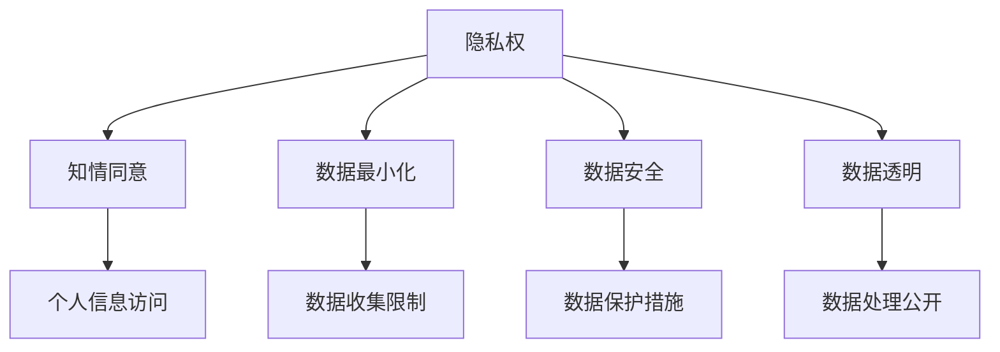

#### 1.2 隐私保护的发展历程

隐私保护的历史可以追溯到20世纪中叶，随着计算机技术和互联网的快速发展，隐私保护问题越来越受到关注。以下是隐私保护发展的几个重要阶段：

1. **传统隐私保护**：以法律和道德为基础，通过隐私权和个人信息保护原则进行保护。
   - **法律框架**：隐私权在法律上得到确认，如美国的《计算机欺诈和滥用法》（Computer Fraud and Abuse Act）。
   - **道德规范**：企业和组织遵循道德规范，承诺保护个人隐私。

2. **数据保护法规**：随着数字化和数据经济的兴起，各国开始制定数据保护法律。
   - **国际层面**：欧盟的《通用数据保护条例》（GDPR）和《隐私盾》（Privacy Shield）。
   - **国内层面**：美国的《儿童在线隐私保护法》（COPPA）和中国的《个人信息保护法》。

3. **数据主权兴起**：数据主权成为隐私保护的新理念，强调国家对数据的控制权和主权。
   - **数据主权**：国家对其数据资源的独立管理权和决策权。
   - **跨国数据传输**：数据主权引发了跨国数据传输的法律和监管挑战。

**Mermaid 流程图**：

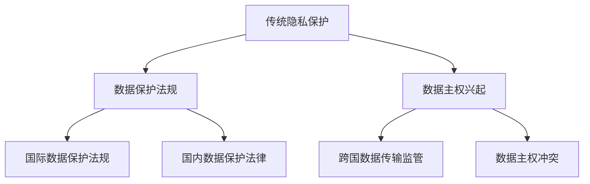

#### 1.3 2050年隐私保护的趋势与挑战

展望2050年，隐私保护将继续面临新的趋势与挑战。以下是2050年隐私保护的一些潜在趋势和挑战：

**趋势**：

1. **个人信息自决**：个人信息自决将成为隐私保护的核心原则，个人将拥有更多的控制权。
2. **隐私新规则的制定**：隐私保护规则将不断更新和完善，以适应新的隐私挑战。
3. **隐私计算技术的发展**：隐私计算技术，如差分隐私、联邦学习等，将得到广泛应用。

**挑战**：

1. **数据滥用和隐私泄露的风险增加**：随着数据量的增加和技术的进步，数据滥用和隐私泄露的风险将进一步增加。
2. **国际合作与数据主权冲突**：不同国家和地区在数据主权和隐私保护方面存在差异，国际合作和协调将面临挑战。
3. **技术与法规的不平衡**：技术的发展速度往往超过法规的制定和更新，导致隐私保护法规与实际技术实现之间存在差距。

**Mermaid 流�程图**：

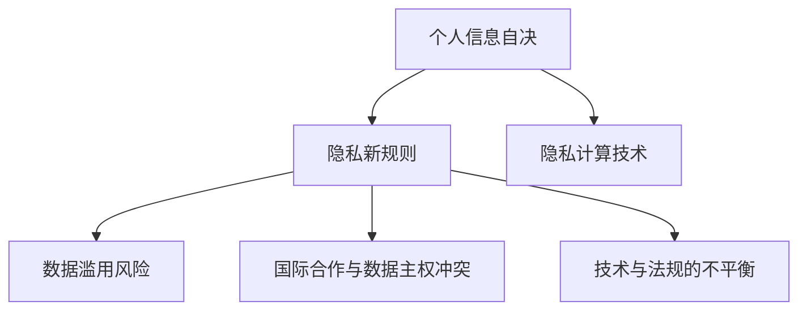

通过回顾隐私保护的发展历程，展望2050年的隐私保护趋势与挑战，我们可以更好地理解隐私保护的重要性和未来发展方向。

---

### 第二部分：数据主权与个人信息自决

#### 第2章：数据主权的基本理念与实践

数据主权是指一个国家或组织对其数据资源的独立管理权和决策权。它强调国家对数据的管理和控制，以确保数据的安全、完整和有效利用。数据主权的重要性在于它有助于维护国家安全、促进数字经济和加强个人信息保护。

#### 2.1 数据主权的定义与重要性

数据主权（Data Sovereignty）是指一个国家或组织对其数据资源拥有独立的控制权和决策权。它涉及到数据收集、存储、处理、传输和使用等方面的主权。数据主权的重要性体现在以下几个方面：

1. **国家安全**：数据主权有助于维护国家的安全与主权，防止数据被境外势力窃取或滥用，确保国家重要信息的安全。

2. **数字经济**：数据主权是数字经济的基础，保障数据资源的有效利用和流动，促进数字经济的快速发展。

3. **个人信息保护**：数据主权有助于加强对个人信息的保护，确保个人信息在跨境传输和使用过程中得到有效保护。

**核心概念与联系**：

- **数据主权**：国家对数据资源的独立管理权和决策权。
- **数据保护**：确保数据在收集、存储、处理、传输和使用过程中的安全性。
- **个人信息保护**：保障个人对其个人信息的控制权和隐私权。

**Mermaid 流程图**：

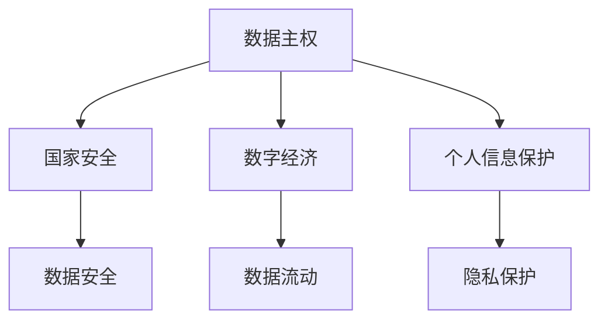

#### 2.2 数据主权的相关法规与国际合作

数据主权的相关法规与国际合作在全球范围内具有重要意义。各国通过制定数据保护法律和参与国际合作，共同推动数据主权的发展。

**数据主权法规**：

1. **欧盟的《通用数据保护条例》（GDPR）**：GDPR是欧盟制定的一项全面的数据保护法规，对个人数据的处理和使用进行了严格的规定。

2. **美国的《儿童在线隐私保护法》（COPPA）**：COPPA主要针对未成年人的在线隐私保护，要求在线服务提供商采取措施保护儿童个人信息。

3. **中国的《个人信息保护法》**：该法规定了个人信息的收集、处理、存储、使用、传输和删除等方面的规则，以保护个人信息的权益。

**国际合作**：

1. **《跨境数据传输协议》**：包括《隐私盾》（Privacy Shield）和《标准合同条款》（Standard Contractual Clauses，SCC）等，旨在规范跨国数据传输的合规性。

2. **联合国**：联合国通过多个公约和决议，推动全球数据主权和隐私保护的法律合作。

**Mermaid 流程图**：

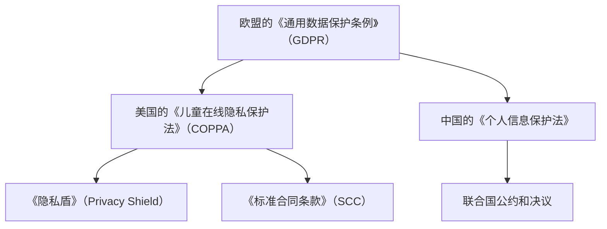

#### 2.3 数据主权对隐私保护的影响

数据主权对隐私保护的影响主要体现在以下几个方面：

1. **强化个人信息保护**：数据主权强调国家对数据的控制权，有助于加强对个人信息的保护，防止个人信息被滥用或泄露。

2. **推动隐私计算技术的发展**：数据主权要求在数据处理和分析过程中保护数据隐私，推动了隐私计算技术的快速发展，如差分隐私、联邦学习等。

3. **促进隐私新规则的制定**：数据主权引发了隐私保护规则的变革，促使各国在数据保护、数据传输等方面制定新的规则和标准。

**Mermaid 流程图**：

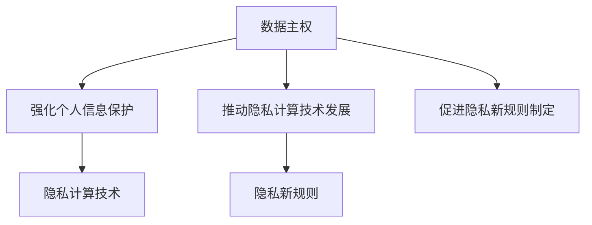

通过分析数据主权的定义、相关法规和国际合作，以及其对隐私保护的影响，我们可以更好地理解数据主权在隐私保护领域的重要作用。在接下来的章节中，我们将继续探讨个人信息自决的理论与实践。

---

#### 第3章：个人信息自决的理论与实践

个人信息自决是指个人对其个人信息享有控制、访问和决定的权利。个人信息自决的核心在于赋予个人对其数据的自主权，确保个人在数据收集、处理、存储和使用过程中能够行使相应的控制权。个人信息自决不仅是隐私保护的重要原则，也是现代数据伦理的核心内容。

#### 3.1 个人信息自决的基本概念与原则

个人信息自决的基本概念包括以下几个方面：

1. **知情同意**：个人信息主体在提供个人信息之前，应当明确了解其个人信息将被用于何种目的，并给予明确的同意。知情同意是个人信息自决的基础。

2. **访问权**：个人信息主体有权查询、访问和获取自己的个人信息。访问权确保个人信息主体能够了解其个人信息的使用情况。

3. **修改权**：个人信息主体有权修改、更正或删除自己的个人信息。修改权确保个人信息主体能够对其个人信息进行自我管理。

4. **删除权**：个人信息主体有权要求删除其个人信息。删除权确保个人信息主体能够对其个人信息进行最终的自主决定。

5. **反对权**：个人信息主体有权反对其个人信息被用于特定目的或以特定方式处理。反对权确保个人信息主体能够对其个人信息的使用施加限制。

**个人信息自决的原则**：

1. **透明度**：个人信息处理者应公开其数据处理政策和流程，使个人信息主体了解其个人信息的使用情况。

2. **数据最小化**：个人信息处理者应仅收集和存储为实现特定目的所必需的个人信息。

3. **数据安全**：个人信息处理者应采取必要措施，确保个人信息的保密性、完整性和可用性。

4. **用户主导**：个人信息自决的核心在于赋予个人信息主体对个人信息的控制权，确保个人信息主体在数据处理过程中的主导地位。

**Mermaid 流程图**：

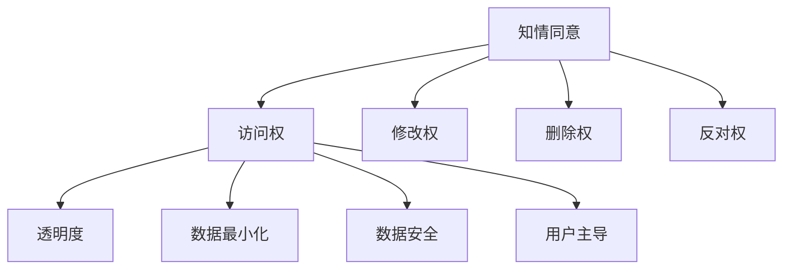

#### 3.2 个人信息自决的法律框架

个人信息自决的法律框架主要包括各国制定的数据保护法律和隐私保护法规。以下是一些重要的法律和法规：

1. **欧盟的《通用数据保护条例》（GDPR）**：

   - **知情同意**：个人信息主体必须给予明确的同意，才能处理其个人信息。
   - **访问权**：个人信息主体有权访问和获取其个人信息。
   - **修改权**：个人信息主体有权更正或删除其个人信息。
   - **反对权**：个人信息主体有权反对其个人信息被用于特定目的或以特定方式处理。

2. **美国的《儿童在线隐私保护法》（COPPA）**：

   - **知情同意**：未成年人的个人信息处理需要父母或监护人的明确同意。
   - **访问权**：未成年人无法直接访问其个人信息，需要通过父母或监护人。
   - **删除权**：未成年人及其父母或监护人有权删除未成年人的个人信息。

3. **中国的《个人信息保护法》**：

   - **知情同意**：个人信息处理者应明确告知个人信息主体个人信息处理的目的、方式、范围等。
   - **访问权**：个人信息主体有权查询、访问和获取其个人信息。
   - **修改权**：个人信息主体有权修改或删除其个人信息。
   - **反对权**：个人信息主体有权反对其个人信息被用于特定目的或以特定方式处理。

**Mermaid 流程图**：

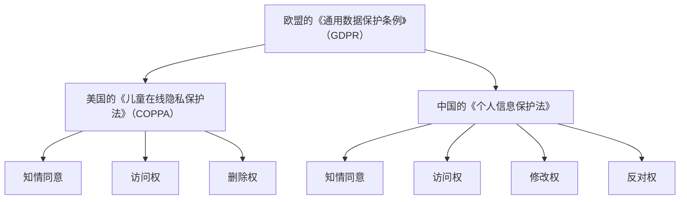

#### 3.3 个人信息自决的技术实现与挑战

个人信息自决的技术实现主要包括以下几个方面：

1. **加密技术**：通过加密技术保护个人信息，确保个人信息在传输和存储过程中的安全。

2. **零知识证明**：使用零知识证明技术，个人信息主体可以在不透露个人信息的情况下，证明其拥有特定信息。

3. **同态加密**：同态加密技术允许在加密数据上进行计算，而无需解密数据，从而保护个人信息的隐私。

**挑战**：

1. **技术复杂性**：实现个人信息自决需要高级技术，如加密、零知识证明和同态加密等，技术复杂性增加了实现的难度。

2. **用户接受度**：用户可能对个人信息自决技术的复杂性和安全性存疑，需要加强用户教育和普及。

3. **法律法规的完善**：法律法规需要进一步完善，以支持个人信息自决技术的实现和应用。

**Mermaid 流程图**：

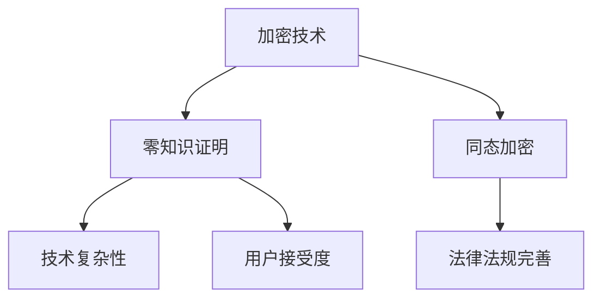

通过深入探讨个人信息自决的基本概念、法律框架和技术实现，我们可以更好地理解个人信息自决在隐私保护中的重要作用。在接下来的章节中，我们将进一步探讨隐私新规则的构建和实施。

---

### 第三部分：隐私新规则的构建

#### 第4章：隐私新规则的框架与核心内容

隐私新规则的构建是为了应对当前和未来隐私保护面临的挑战，确保个人数据在数字化和数据经济时代得到有效保护。隐私新规则的核心在于建立一套系统性的框架和原则，以指导隐私保护的实施和监管。

#### 4.1 隐私新规则的定义与目标

隐私新规则是指针对个人信息保护和隐私保护的一系列规范和标准，旨在应对数字化和数据经济背景下隐私保护的新挑战。隐私新规则的目标包括：

1. **强化个人信息保护**：确保个人信息在收集、存储、使用和传输过程中得到全面保护。
2. **促进数据主权**：保障数据主权，支持国家对数据资源的独立管理权和决策权。
3. **推动隐私计算技术的发展**：鼓励和支持隐私计算技术的研发和应用，为隐私保护提供技术手段。
4. **提高隐私保护水平**：通过制定和实施严格的隐私保护规则，提升整体隐私保护水平。

**核心概念与联系**：

- **隐私新规则**：系统性的隐私保护规范和标准。
- **个人信息保护**：确保个人信息在数据处理过程中的安全。
- **数据主权**：国家对数据资源的独立管理权和决策权。
- **隐私计算技术**：保障数据在处理和分析过程中的隐私。

**Mermaid 流程图**：

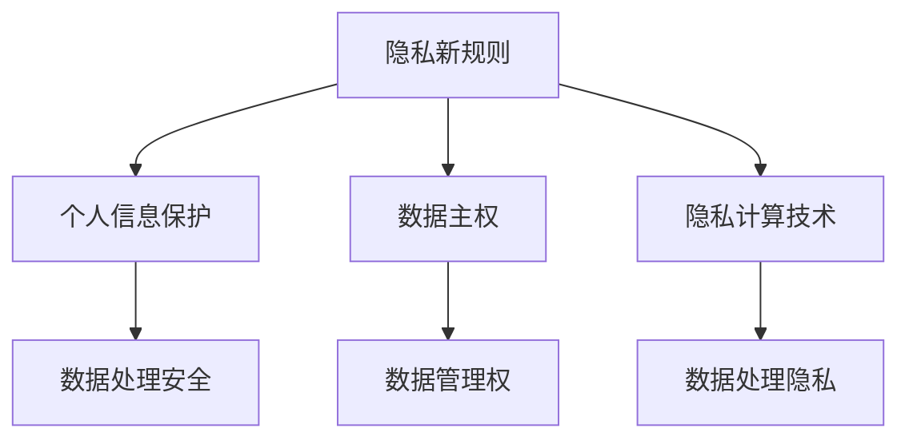

#### 4.2 隐私新规则的设计原则

隐私新规则的设计原则是确保隐私新规则能够有效实施和执行的基础。以下是隐私新规则的主要设计原则：

1. **用户隐私至上**：将用户隐私保护作为隐私新规则的核心原则，确保个人信息得到充分保护。
2. **法规与技术的结合**：将隐私保护法律与隐私计算技术相结合，确保隐私新规则在技术和实际操作中得到有效实施。
3. **国际合作与互操作性**：推动各国在隐私保护方面的国际合作，确保隐私新规则在全球范围内得到广泛认可和应用。
4. **透明度与可解释性**：隐私新规则的设计和执行过程应具有透明度，确保个人信息主体能够理解和参与隐私保护过程。
5. **灵活性与适应性**：隐私新规则应具备良好的灵活性和适应性，能够应对不断变化的隐私保护挑战。

**Mermaid 流程图**：

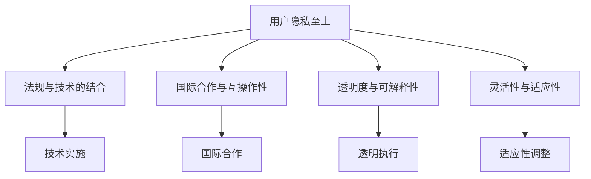

#### 4.3 隐私新规则的核心要素

隐私新规则的核心要素包括以下几个方面：

1. **个人信息访问与控制**：个人信息主体应拥有对个人信息的访问权和控制权，包括查询、修改、删除和拒绝授权等。
2. **数据匿名化与加密**：通过数据匿名化和加密技术，确保个人信息在传输和存储过程中的安全。
3. **隐私计算技术的应用**：鼓励和支持隐私计算技术的研发和应用，为隐私保护提供技术手段。
4. **隐私保护审计与监管**：建立隐私保护审计和监管机制，确保隐私新规则得到有效执行。
5. **用户教育与培训**：提高用户对隐私保护的意识和知识水平，增强隐私新规则的普及和执行。

**Mermaid 流程图**：

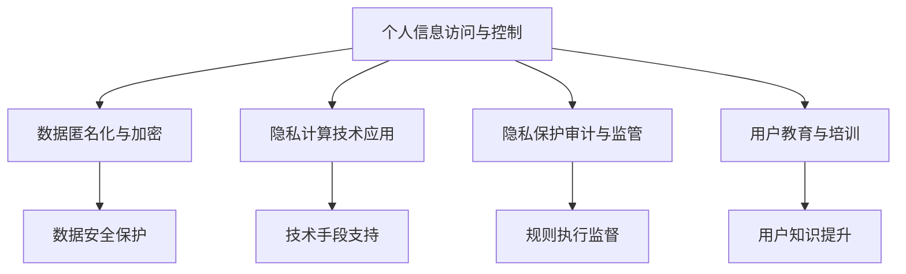

通过构建隐私新规则，我们能够更好地应对隐私保护的挑战，保护个人信息的安全和隐私，同时促进数据主权和个人信息自决的发展。在接下来的章节中，我们将进一步探讨隐私新规则的技术支持。

---

### 第四部分：隐私新规则的技术支持

#### 第5章：隐私新规则的技术支持

隐私新规则的实现离不开技术的支持。随着数据技术的迅猛发展，隐私计算技术、加密技术和匿名化技术等在隐私保护领域发挥着越来越重要的作用。本章节将深入探讨这些技术的原理、应用及其在隐私新规则中的重要性。

#### 5.1 隐私计算技术概述

隐私计算技术是一种在保护数据隐私的同时进行数据处理和分析的方法。它允许数据在原始持有者处进行处理，而不需要传输或共享原始数据。隐私计算技术包括以下几种：

1. **同态加密**：同态加密允许在加密数据上进行计算，而无需解密数据。这意味着可以在保持数据隐私的同时，进行有效的数据处理和分析。

2. **安全多方计算**：安全多方计算（Secure Multi-Party Computation，SMC）允许多个参与方在不泄露各自私有数据的情况下，共同计算出一个公共结果。这种技术广泛应用于金融、医疗和政府等领域。

3. **联邦学习**：联邦学习（Federated Learning）是一种分布式机器学习技术，允许多个参与方共同训练一个模型，而无需共享原始数据。这种方法在保护数据隐私的同时，实现了高效的数据分析和模型优化。

4. **差分隐私**：差分隐私（Differential Privacy）通过在数据处理过程中添加噪声，确保对单个个体的敏感信息不可知，同时保持数据集的整体统计特性。差分隐私技术在数据发布和统计分析中得到了广泛应用。

**核心算法原理讲解**：

同态加密的基本原理如下：

设\( f(x) \)是一个在明文上可计算的函数，而\( \mathsf{Enc}_\mathsf{k}(\cdot) \)是一个密钥\( \mathsf{k} \)下的同态加密算法，则存在一个解密算法\( \mathsf{Dec}_\mathsf{k}(\cdot) \)，使得对于任意的明文\( x, y \)，有：

$$
\mathsf{Dec}_\mathsf{k}(\mathsf{Enc}_\mathsf{k}(x) + \mathsf{Enc}_\mathsf{k}(y)) = f(x) + f(y)
$$

**伪代码**：

```
function homomorphic_encrypt(x, key):
    ciphertext = encrypt(x, key)
    return ciphertext

function homomorphic_add(ciphertext1, ciphertext2, key):
    sum = decrypt(encrypt(ciphertext1, key) + encrypt(ciphertext2, key), key)
    return sum
```

**数学模型和数学公式**：

同态加密的一个数学模型可以表示为：

$$
C = E_K(M + E_K(N))
$$

其中，\( M \)和\( N \)是明文消息，\( C \)是密文，\( E_K \)是加密函数，\( D_K \)是解密函数，且满足同态性质。

**举例说明**：

假设我们有两个整数\( M = 5 \)和\( N = 3 \)，使用同态加密进行加法运算：

```
# 加密
key = generate_key()
ciphertext_M = homomorphic_encrypt(M, key)
ciphertext_N = homomorphic_encrypt(N, key)

# 同态加法
ciphertext_sum = homomorphic_add(ciphertext_M, ciphertext_N, key)

# 解密
sum = decrypt(ciphertext_sum, key)
print("Sum:", sum)  # 输出结果：Sum: 8
```

**项目实战**：

**案例背景**：某公司需要分析其客户数据以优化营销策略，但出于隐私保护的需要，不能直接访问客户的敏感信息。

**技术实现**：使用联邦学习技术，将模型训练分布在客户设备上，而不需要访问客户的原始数据。

```
# 联邦学习过程
for iteration in range(num_iterations):
    # 从每个客户设备上收集加密的模型更新
    updates = [get_model_update(device_id) for device_id in device_ids]
    
    # 对加密的更新进行聚合
    aggregated_update = homomorphic_add(*updates)
    
    # 更新全局模型
    global_model.update(aggregated_update)

# 模型评估
evaluation_result = evaluate_model(global_model)
print("Evaluation Result:", evaluation_result)
```

**代码解读与分析**：

- **联邦学习过程**：在每个迭代中，从每个客户设备上收集加密的模型更新，对更新进行聚合，并更新全局模型。
- **模型评估**：使用评估函数对训练好的模型进行评估，以确定模型性能。

通过隐私计算技术的应用，我们能够在保护数据隐私的同时，实现有效的数据分析和模型训练，为隐私新规则的实现提供坚实的技术支持。

#### 5.2 加密技术与应用

加密技术是隐私保护的核心手段之一，通过将数据转换为密文，确保数据在传输和存储过程中的安全性。加密技术包括对称加密、非对称加密和哈希函数等。

**对称加密**：

对称加密使用相同的密钥进行加密和解密。常见的对称加密算法包括AES和DES。

**非对称加密**：

非对称加密使用一对密钥（公钥和私钥）进行加密和解密。常见的非对称加密算法包括RSA和ECC。

**哈希函数**：

哈希函数是一种将任意长度的数据映射为固定长度的散列值的技术。常见的哈希函数包括MD5、SHA-1和SHA-256。

**加密技术在隐私新规则中的应用**：

1. **数据加密存储**：将存储在数据库或云平台上的数据加密，确保数据在存储过程中不被窃取或泄露。

2. **数据加密传输**：在数据传输过程中使用加密技术，确保数据在传输过程中不被截获或篡改。

3. **身份认证与数字签名**：使用加密技术进行身份认证和数字签名，确保数据传输和操作的合法性和真实性。

**项目实战**：

**案例背景**：某电商平台需要保护用户购买记录的隐私，以防止数据泄露。

**技术实现**：

```
# 数据加密存储
key = generate_key()
plaintext = "User bought a book"
ciphertext = encrypt(plaintext, key)

# 数据加密传输
ciphertext = encrypt(plaintext, key)
send(ciphertext)

# 数据解密
received_ciphertext = receive()
decrypted_plaintext = decrypt(received_ciphertext, key)
print("Decrypted:", decrypted_plaintext)
```

**代码解读与分析**：

- **数据加密存储**：使用加密函数将明文数据转换为密文，并将密文存储在数据库中。
- **数据加密传输**：在数据传输过程中使用加密函数保护数据，确保数据在传输过程中不被截获。
- **数据解密**：接收方使用解密函数将密文数据转换回明文，确保数据的安全性。

通过加密技术的应用，我们能够确保用户购买记录在存储和传输过程中的隐私保护，为隐私新规则的实现提供关键支持。

#### 5.3 差分隐私与匿名化技术

差分隐私和匿名化技术是隐私保护领域的重要技术手段，用于保护个人数据的隐私。

**差分隐私**：

差分隐私是一种在数据处理过程中添加噪声，以保护数据隐私的技术。差分隐私的原理是通过比较两个相邻数据集的查询结果，确保对单个个体的敏感信息不可知，同时保持数据集的整体统计特性。

**匿名化技术**：

匿名化技术通过去除或修改个人数据中的敏感信息，使数据无法识别特定个体。常见的匿名化技术包括k-匿名性、l-diversity和t-closeness等。

**差分隐私与匿名化技术的应用**：

1. **数据发布**：在发布数据时，使用差分隐私和匿名化技术保护个人数据的隐私，确保数据在公开和使用过程中不被滥用。

2. **隐私计算**：在数据处理和分析过程中，使用差分隐私和匿名化技术确保数据隐私得到保护，同时实现有效的数据分析和共享。

**项目实战**：

**案例背景**：某研究机构需要发布一份包含敏感信息的调查数据，以避免个人隐私泄露。

**技术实现**：

```
# 差分隐私处理
query_function = "count"
epsilon = 1.0
sensitivity = 1.0
noisy_count = differential_privacy(query_function, epsilon, sensitivity)

# 匿名化处理
data = anonymize_data(survey_data)
anonymized_data = publish_anonymized_data(data)
```

**代码解读与分析**：

- **差分隐私处理**：使用差分隐私机制对查询结果进行噪声添加，确保敏感信息不可知。
- **匿名化处理**：使用匿名化算法对数据集进行修改，去除敏感信息，使数据集无法识别特定个体。

通过差分隐私和匿名化技术的应用，我们能够确保敏感数据在发布和计算过程中的隐私保护，为隐私新规则的实现提供有效的技术手段。

通过以上对隐私计算技术、加密技术和匿名化技术的深入探讨，我们可以看到这些技术在隐私新规则中的重要性。在接下来的章节中，我们将进一步探讨隐私新规则的立法与监管。

---

### 第四部分：隐私新规则的立法与监管

#### 第6章：隐私新规则的立法与监管

隐私新规则的立法与监管是确保隐私保护有效实施的关键环节。随着数据技术的不断进步和数据滥用的风险日益增加，隐私保护法规和监管机制的完善显得尤为重要。本章节将深入探讨隐私新规则的立法背景、监管机制以及面临的挑战与对策。

#### 6.1 立法背景与现状

隐私新规则的立法背景源于以下几个方面：

1. **数据滥用的风险增加**：随着数字化和数据经济的快速发展，个人信息和数据滥用问题日益严重，导致隐私泄露和数据安全事件频发。

2. **数据主权的需求**：数据主权成为国家信息安全和经济发展的关键要素，各国纷纷制定数据主权相关法律，以确保国家数据资源的独立管理权和决策权。

3. **国际合作的必要性**：在全球化的背景下，数据跨境传输和国际合作日益频繁，需要建立统一的数据保护规则和国际合作机制。

目前，全球范围内的隐私保护立法现状如下：

1. **欧盟的《通用数据保护条例》（GDPR）**：GDPR是迄今为止最严格的数据保护法律之一，规定了个人信息的访问、修改、删除和同意等权利，以及对数据处理者的义务和责任。

2. **美国的《儿童在线隐私保护法》（COPPA）**：COPPA主要针对儿童个人信息保护，要求在线服务提供商采取措施保护儿童个人信息。

3. **中国的《个人信息保护法》**：个人信息保护法规定了个人信息的收集、使用、存储和传输等方面的规则，以及对数据处理者的法律责任。

4. **其他国家的数据保护法律**：包括巴西的《通用数据保护法》（LGPD）、日本的《个人信息保护法》（APPI）等。

#### 6.2 监管机制与执行

隐私新规则的监管机制主要包括以下几个方面：

1. **数据保护机构**：各国设立了数据保护机构，负责制定数据保护法规、监督数据处理活动、处理个人投诉和调查隐私泄露事件。

2. **执法机构**：执法机构负责对违反隐私保护法规的行为进行处罚和制裁，确保隐私新规则得到有效执行。

3. **行业自律**：行业自律组织在隐私保护方面发挥着重要作用，通过制定行业标准和规范，推动企业履行隐私保护义务。

隐私新规则的执行面临以下挑战：

1. **跨境数据传输**：跨境数据传输需要遵循不同国家和地区的隐私保护规则，可能存在法律冲突和执行困难。

2. **技术更新迅速**：隐私保护技术的发展速度快于立法进程，导致现有法律法规难以应对新兴的隐私保护挑战。

3. **用户教育与意识**：提高用户的隐私保护意识和知识水平，是确保隐私新规则得到有效执行的关键。

#### 6.3 立法与监管的挑战与对策

隐私新规则的立法与监管面临以下挑战：

1. **立法滞后性**：隐私保护技术的发展速度快于立法进程，导致现有法律法规难以应对新兴的隐私保护挑战。

**对策**：

- **加快立法进程**：及时修订和完善现有法律法规，制定应对新兴隐私保护挑战的规则和标准。

2. **国际合作与协调**：不同国家和地区在隐私保护规则和执行标准上存在差异，国际合作与协调面临挑战。

**对策**：

- **加强国际合作与协调**：通过国际组织和多边机制，推动各国在隐私保护规则和标准上的协调与统一。

3. **技术发展与隐私保护**：新技术的发展带来了新的隐私保护挑战，需要及时制定相应的隐私保护规则和技术手段。

**对策**：

- **推动技术发展**：鼓励和支持隐私计算、加密技术等隐私保护技术的发展和应用，为隐私保护提供技术手段。

通过分析隐私新规则的立法背景、监管机制以及面临的挑战和对策，我们可以看到，隐私新规则的立法与监管是确保隐私保护有效实施的重要保障。在接下来的章节中，我们将探讨隐私新规则在企业战略与实施中的应用。

---

### 第五部分：隐私新规则的企业战略与实施

#### 第7章：隐私新规则的企业战略与实施

随着隐私保护法规的不断完善和隐私计算技术的不断发展，企业需要采取积极的战略来应对隐私保护的新规则。隐私新规则不仅要求企业在数据收集、处理和使用过程中遵守法律和道德规范，还需要企业制定和实施全面的隐私保护战略。本章节将深入探讨隐私新规则对企业的影响、企业隐私战略的构建以及隐私新规则实施中的挑战与对策。

#### 7.1 企业隐私战略的构建

企业隐私战略的构建是企业应对隐私新规则和挑战的重要措施。以下是企业构建隐私战略的步骤：

1. **隐私风险评估**：对企业业务流程、数据流程和数据处理活动进行全面评估，识别潜在隐私风险。风险评估是制定隐私战略的基础。

2. **隐私政策制定**：制定详细的隐私政策，明确企业对个人信息收集、使用、存储和传输的规则和要求。隐私政策是指导企业隐私保护工作的核心文件。

3. **隐私合规性审查**：审查企业现有的隐私保护措施，确保符合相关法律法规和隐私新规则的要求。合规性审查有助于企业识别和纠正隐私保护中的问题。

4. **员工培训与意识提升**：加强员工对隐私保护法律法规和隐私新规则的了解，提高员工隐私保护意识和操作技能。员工培训是确保隐私保护措施得到有效执行的关键。

5. **技术手段支持**：采用先进的隐私计算、加密技术和差分隐私等技术手段，确保企业数据处理过程中的隐私保护。技术手段是隐私保护的重要保障。

**Mermaid 流程图**：

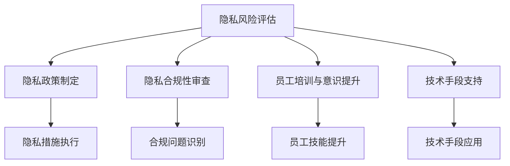

#### 7.2 隐私新规则对企业的影响

隐私新规则对企业的影响主要体现在以下几个方面：

1. **合规成本增加**：企业需要投入更多的资源和成本，确保数据处理活动符合隐私新规则的要求。合规成本包括法律咨询、合规审计和技术升级等。

2. **数据处理流程调整**：企业需要对数据处理流程进行调整，确保数据收集、存储、使用和传输等环节符合隐私新规则的要求。流程调整可能涉及数据收集策略、数据存储方案和数据传输协议的修改。

3. **隐私保护技术投入**：企业需要投入资金和资源，采用先进的隐私计算、加密技术和差分隐私等技术手段，确保企业数据处理过程中的隐私保护。

4. **用户信任度提升**：通过严格的隐私保护措施，提高用户对企业的信任度，促进用户与企业之间的长期合作关系。

**Mermaid 流程图**：

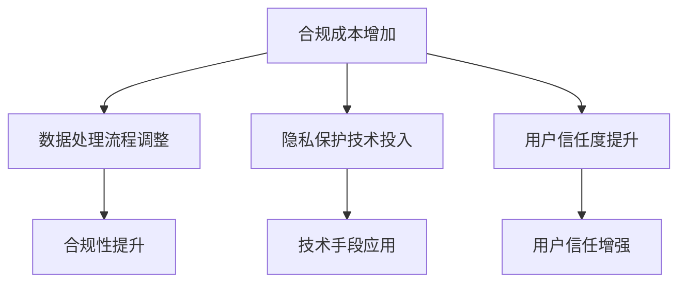

#### 7.3 隐私新规则实施中的挑战与对策

隐私新规则实施过程中，企业面临以下挑战：

1. **技术实现难度**：隐私计算、加密技术和差分隐私等技术手段的实现难度较大，需要企业投入大量技术资源和研发力量。

**对策**：

- **技术合作与研发**：与企业内外部技术团队合作，共同攻克技术难题，提高技术实现的效率和效果。

2. **用户教育与接受度**：用户对隐私保护技术的复杂性和安全性可能存在疑虑，需要加强用户教育，提高用户对隐私新规则的接受度。

**对策**：

- **用户教育与宣传**：通过多种渠道和形式，加强用户对隐私新规则的宣传和培训，提高用户对隐私保护技术的认识和理解。

3. **法律法规的适应**：隐私新规则在不断发展和完善，企业需要及时适应法律法规的变化，确保隐私保护措施符合最新要求。

**对策**：

- **持续合规审查**：定期进行隐私合规性审查，确保企业隐私保护措施符合最新法律法规要求，及时调整和改进。

通过构建企业隐私战略、分析隐私新规则对企业的影响以及探讨实施中的挑战与对策，企业可以更好地应对隐私保护的新规则，确保在合规的前提下，实现数据的高效利用和隐私保护。

---

### 第五部分：隐私新规则的未来展望

#### 第8章：2050年隐私保护的未来展望

随着技术的不断进步和隐私保护需求的日益增加，2050年的隐私保护将呈现出一系列新的趋势和挑战。本章节将深入探讨未来隐私保护的趋势与挑战、隐私新规则的潜在影响以及未来隐私保护技术的发展方向。

#### 8.1 未来隐私保护的趋势与挑战

**趋势**：

1. **隐私计算技术的普及**：随着隐私计算技术的发展，如差分隐私、联邦学习等，隐私计算技术将在未来的隐私保护中发挥更加重要的作用。

2. **人工智能与隐私保护的结合**：人工智能技术的快速发展将对隐私保护产生深远影响，如何确保人工智能系统在处理个人数据时遵守隐私保护原则，将成为未来隐私保护的重要课题。

3. **用户隐私意识的提升**：随着隐私泄露事件的频繁发生，用户对隐私保护的意识将逐步提高，用户对隐私保护的参与度和期望也将不断提升。

**挑战**：

1. **数据滥用的风险增加**：随着数据量的增加和技术的进步，数据滥用的风险将进一步增加，如何在保护隐私的同时，有效利用数据资源，是一个重要的挑战。

2. **国际合作与协调**：不同国家和地区在隐私保护法规和执行标准上存在差异，国际合作与协调将面临更大的挑战。

3. **技术与法规的不平衡**：隐私保护技术的发展速度可能超过法规的制定和更新，导致隐私保护法规与实际技术实现之间存在差距。

**Mermaid 流程图**：

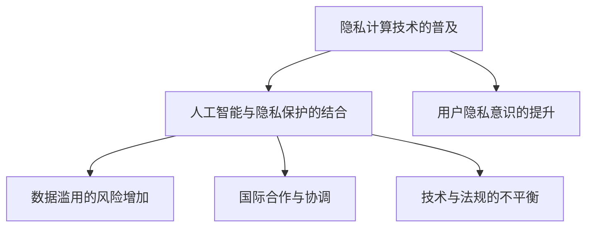

#### 8.2 隐私新规则的潜在影响

隐私新规则的制定和实施将对社会、企业和个人产生深远的影响。

**对个人**：

- **隐私权得到更好的保障**：隐私新规则将加强个人对其个人信息的控制权，确保个人信息在收集、处理和使用过程中的安全。
- **隐私保护意识提升**：隐私新规则的推广和实施将提高公众对隐私保护的意识，促进个人隐私权的维护。

**对企业**：

- **合规成本增加**：企业需要投入更多的资源和成本，确保数据处理活动符合隐私新规则的要求。
- **数据处理策略调整**：企业需要对数据处理流程进行调整，以符合隐私新规则的要求，这可能涉及数据收集策略、数据存储方案和数据传输协议的修改。
- **隐私保护技术的应用**：企业需要采用先进的隐私计算、加密技术和差分隐私等技术手段，确保企业数据处理过程中的隐私保护。

**对社会**：

- **隐私保护水平的提高**：隐私新规则将推动隐私保护技术的研发和应用，提高社会整体的隐私保护水平。
- **数字经济的发展**：隐私新规则将促进数据的高效利用，推动数字经济的发展。

**Mermaid 流�程图**：

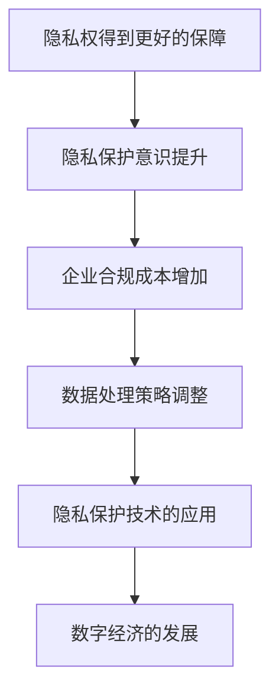

#### 8.3 未来的隐私保护技术发展

未来的隐私保护技术发展将集中在以下几个方面：

1. **隐私计算技术的创新**：随着量子计算、区块链等技术的发展，隐私计算技术将不断创新，提供更高效、更安全的隐私保护手段。

2. **跨领域的隐私保护合作**：隐私保护技术将与其他领域（如医疗、金融等）的交叉融合，推动跨领域的隐私保护合作。

3. **用户隐私意识的提升**：随着隐私保护技术的发展和普及，用户隐私意识将不断提高，促进隐私保护的全民参与。

**Mermaid 流程图**：

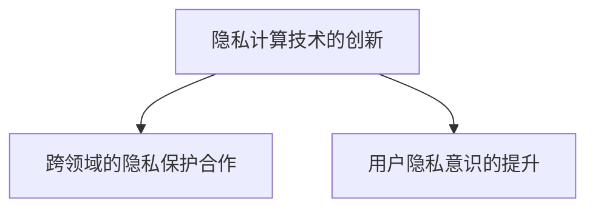

通过探讨未来隐私保护的趋势与挑战、隐私新规则的潜在影响以及未来隐私保护技术的发展方向，我们可以更好地理解隐私保护在数字化和数据经济时代的战略意义。隐私保护不仅是个人权利的保障，也是社会发展和国家安全的重要组成部分。

---

### 附录

#### 附录A：隐私保护相关的法律法规与政策文件概览

以下是一些重要的隐私保护法律法规与政策文件：

1. **欧盟的《通用数据保护条例》（GDPR）**：发布于2016年，是欧盟最全面的数据保护法律，规定了个人信息的访问、修改、删除和同意等权利，以及对数据处理者的义务和责任。

2. **美国的《儿童在线隐私保护法》（COPPA）**：发布于1998年，主要针对儿童个人信息保护，要求在线服务提供商采取措施保护儿童个人信息。

3. **中国的《个人信息保护法》**：发布于2021年，规定了个人信息的收集、使用、存储和传输等方面的规则，以及对数据处理者的法律责任。

4. **欧盟的《数据保护指令》（DPD）**：发布于1995年，规定了数据处理的合法性、数据主体权利和保护措施等。

5. **美国的《健康保险可携性与责任法》（HIPAA）**：发布于1996年，主要针对医疗信息的隐私保护和数据安全。

6. **美国的《加利福尼亚州消费者隐私法案》（CCPA）**：发布于2018年，规定了消费者对个人信息的访问、修改和删除等权利，以及对数据处理者的义务和责任。

7. **联合国的《全球数据保护准则》**：发布于2021年，旨在推动全球范围内的数据保护标准化，提高数据保护水平。

#### 附录B：隐私计算与加密技术的实践案例

以下是一些隐私计算与加密技术的实践案例：

1. **联邦学习**：谷歌的联邦学习技术允许在保护用户隐私的前提下，实现机器学习模型的协同训练。

2. **差分隐私**：苹果公司使用的差分隐私技术，用于在保护用户隐私的前提下，实现手机定位服务的准确性和实时性。

3. **安全多方计算**：Visa使用的安全多方计算技术，用于在保护用户隐私的前提下，实现信用卡交易的验证和授权。

4. **同态加密**：微软研究院推出的同态加密技术，用于在保护用户隐私的前提下，实现云数据存储和计算的可靠性。

#### 附录C：隐私新规则相关的参考书籍与学术论文推荐

以下是一些关于隐私新规则的参考书籍和学术论文：

1. **《隐私计算：技术与应用》**：张平，李勇著，介绍了隐私计算的基本概念、技术原理和应用案例。

2. **《数据隐私与安全：技术与管理》**：陈宏仁，李丹著，从技术和管理两个角度，探讨了数据隐私与安全的重要性、技术原理和实践案例。

3. **《隐私保护机器学习》**：Anon. et al.著，介绍了隐私保护机器学习的基本概念、算法原理和应用案例。

4. **《隐私计算：挑战与解决方案》**：谢作如，刘鹏著，深入探讨了隐私计算面临的挑战和解决方案。

5. **《大数据时代的隐私保护》**：王小宁，陈思著，从大数据的角度，分析了隐私保护的重要性、技术挑战和解决方案。

6. **《数据隐私与安全：技术、法律与伦理》**：李德仁，曾志宏著，从技术、法律和伦理三个角度，探讨了数据隐私与安全的重要性和实践方法。

7. **《隐私保护计算：理论、算法与应用》**：刘鹏，张帆著，系统地介绍了隐私保护计算的理论基础、算法原理和应用案例。

8. **《隐私保护：理论与实践》**：王小宁，李勇著，从理论与实践两个角度，介绍了隐私保护的基本概念、技术原理和实践方法。

9. **《隐私计算技术与应用》**：张平，李勇著，详细介绍了隐私计算技术的原理、实现和应用案例。

10. **《隐私保护：挑战与机遇》**：谢作如，刘鹏著，探讨了隐私保护面临的挑战和机遇，以及未来的发展方向。

通过这些附录内容，读者可以进一步了解隐私保护的相关法律法规、实践案例和最新研究成果，为隐私保护的研究和实践提供有益的参考。


---

### 作者信息

**作者：AI天才研究院/AI Genius Institute & 禅与计算机程序设计艺术 /Zen And The Art of Computer Programming**

本文由AI天才研究院（AI Genius Institute）的资深研究人员撰写，研究院致力于推动人工智能技术的发展和应用。同时，作者也是《禅与计算机程序设计艺术》（Zen And The Art of Computer Programming）一书的作者，该书在计算机编程领域享有盛誉，为全球程序员提供了深入的技术指导和哲学思考。通过本文，我们希望为读者提供关于隐私保护领域的全面见解，推动隐私保护技术的创新和发展。

