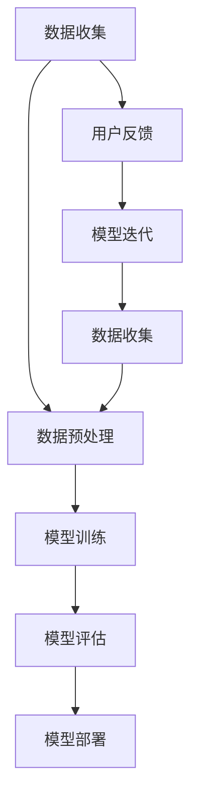
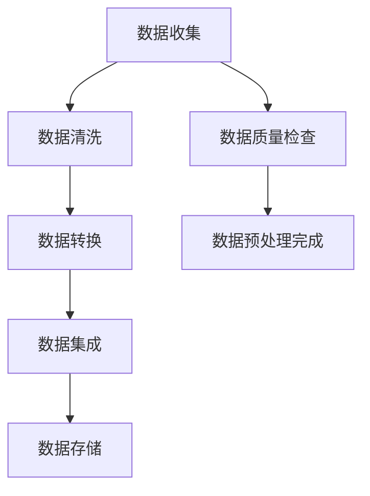
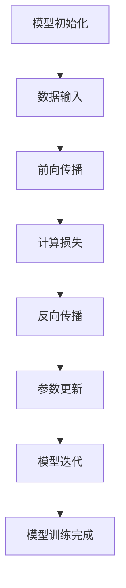
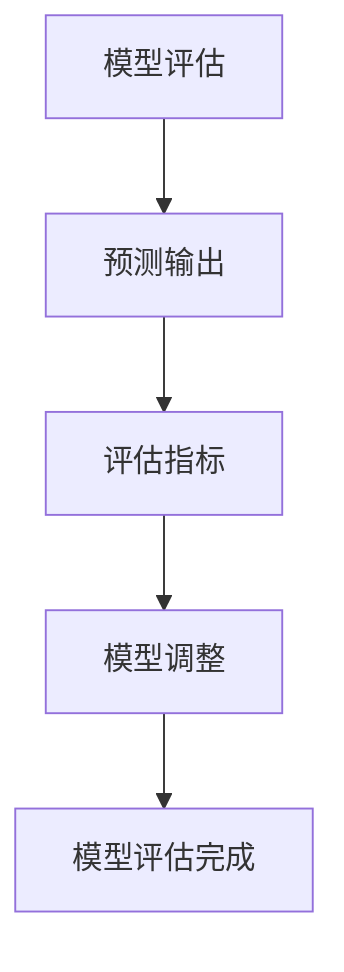
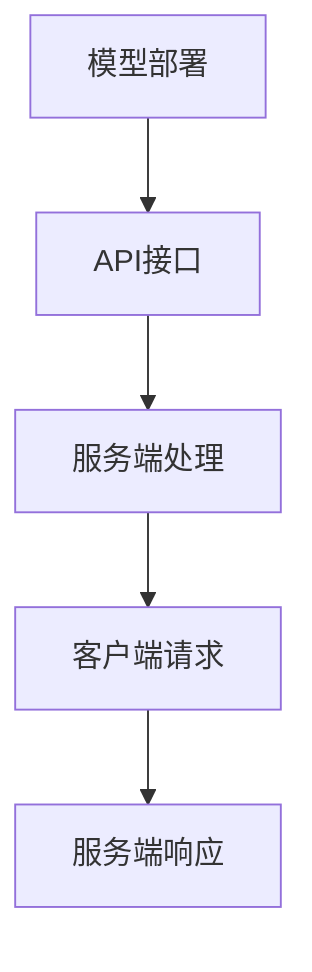
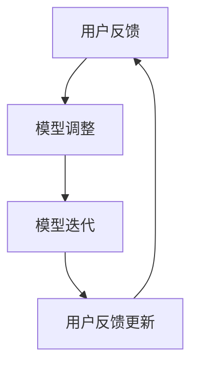
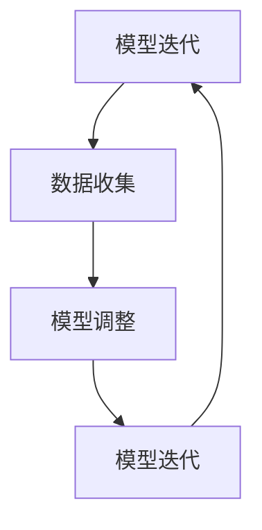

                 

# 幻觉来自训练预训练阶段

## 关键词：
- 幻觉
- 训练预训练
- 模型优化
- 深度学习
- 数据预处理
- 算法原理

## 摘要：
本文探讨了深度学习训练中的“幻觉现象”，即训练模型时，模型在训练数据上的表现远优于测试数据。文章从核心概念出发，通过Mermaid流程图阐述了数据收集、预处理、模型训练、评估、部署及迭代等关键步骤。接着，详细讲解了数据预处理算法、模型训练算法、模型评估算法及模型部署算法的原理。文章以一个情感分析项目为例，展示了如何通过实际代码实现深度学习模型，并进行了代码解读与分析。最后，对深度学习开发环境搭建及主流深度学习框架进行了介绍。

----------------------------------------------------------------

## 第一部分：核心概念与联系

在深度学习中，训练预训练模型是一项关键步骤，然而，在训练过程中，我们经常会遇到一个有趣的现象——幻觉。这种现象是指在模型训练初期，模型在训练数据上的表现远优于测试数据，但随着训练的进行，模型性能逐渐下降，甚至出现过拟合。本文将从核心概念出发，通过Mermaid流程图展示这些概念之间的联系，并深入探讨幻觉现象的产生及其解决方案。

### 核心概念与联系

在深度学习中，核心概念包括数据收集、数据预处理、模型训练、模型评估、模型部署及模型迭代。以下是这些概念之间的Mermaid流程图：

#### Mermaid流程图



#### Mermaid流程图详细解释

1. **数据收集（A）**：数据收集是从各种来源获取数据的过程，如互联网、传感器、日志等。数据是深度学习的基础，高质量的数据对于模型的性能至关重要。

2. **数据预处理（B）**：数据预处理是对数据进行清洗、转换和集成等操作，以提高数据质量和模型训练效果。数据预处理包括数据清洗、数据转换和数据集成。

3. **模型训练（C）**：模型训练是指使用算法和数据进行训练，以优化模型的参数。在训练过程中，模型通过学习数据中的特征，不断提高其预测能力。

4. **模型评估（D）**：模型评估是指使用测试数据评估模型的性能。通过评估指标（如准确率、召回率等）来衡量模型的效果。

5. **模型部署（E）**：模型部署是指将训练好的模型部署到实际环境中进行应用。在部署过程中，模型需要与外部系统进行交互，提供预测服务。

6. **用户反馈（F）**：用户反馈是指收集用户对模型预测结果的反馈。用户反馈有助于模型迭代和优化，提高模型性能。

7. **模型迭代（G）**：模型迭代是指通过用户反馈来调整模型参数，以提高模型性能。模型迭代是一个循环过程，不断优化模型，直至达到预期效果。

8. **数据收集（H）**：模型迭代过程中，需要不断收集新数据，以提高模型泛化能力。

通过上述Mermaid流程图，我们可以清晰地看到深度学习中的核心概念及其相互关系。接下来，我们将分别详细讲解每个步骤的核心算法原理。

### 1.1 数据收集与预处理

#### 数据收集

数据收集是指从各种来源获取数据的过程。这些来源包括互联网、传感器、日志等。数据收集是深度学习的基础，高质量的数据对于模型的性能至关重要。



1. **数据清洗（B）**：数据清洗是指去除重复、异常、错误的数据。数据清洗的目的是提高数据质量，为模型训练提供高质量的数据。

2. **数据转换（C）**：数据转换是指将数据从一种形式转换为另一种形式，以便于模型训练。例如，将文本转换为词嵌入向量，将图像转换为像素矩阵等。

3. **数据集成（D）**：数据集成是指将来自不同数据源的数据合并为单一的数据集。数据集的多样性有助于模型学习到更多的特征。

4. **数据存储（E）**：数据存储是指将处理后的数据存储到数据库或文件系统中，以便后续使用。

5. **数据质量检查（F）**：数据质量检查是指对收集到的数据进行检查，以确保数据的质量。数据质量检查有助于发现和处理数据中的错误和异常。

6. **数据预处理完成（G）**：数据预处理完成后，数据将被用于模型训练。高质量的数据预处理有助于提高模型训练效果。

### 1.2 模型训练

模型训练是指使用算法和数据进行训练，以优化模型的参数。在模型训练过程中，模型通过学习数据中的特征，不断提高其预测能力。



1. **模型初始化（A）**：模型初始化是指对模型的参数进行初始化。常用的初始化方法包括随机初始化、高斯初始化等。

2. **数据输入（B）**：数据输入是指将数据输入到模型中进行训练。数据输入通常包括输入特征和标签。

3. **前向传播（C）**：前向传播是指将输入数据通过模型的各个层进行计算，得到模型的预测输出。

4. **计算损失（D）**：计算损失是指计算模型的输出与真实值之间的差异。常用的损失函数包括均方误差（MSE）、交叉熵（Cross-Entropy）等。

5. **反向传播（E）**：反向传播是指根据计算出的损失，对模型的参数进行更新。反向传播是一种高效的梯度计算方法。

6. **参数更新（F）**：参数更新是指根据反向传播计算出的梯度，对模型的参数进行更新。常用的优化算法包括随机梯度下降（SGD）、Adam等。

7. **模型迭代（G）**：模型迭代是指多次重复前向传播和反向传播的过程，以提高模型的性能。模型迭代是一个循环过程，直至达到预设的训练次数或性能要求。

8. **模型训练完成（H）**：模型训练完成后，模型将被用于预测。模型训练完成后，需要评估模型在测试数据上的性能，以确保模型具有良好的泛化能力。

### 1.3 模型评估

模型评估是指使用测试数据评估模型的性能。通过评估指标（如准确率、召回率等）来衡量模型的效果。



1. **模型评估（A）**：模型评估是指使用测试数据评估模型的性能。测试数据用于评估模型在未知数据上的表现。

2. **预测输出（B）**：预测输出是指使用训练好的模型对测试数据进行预测。预测输出包括预测标签和预测概率。

3. **评估指标（C）**：评估指标是指用于评估模型性能的指标。常用的评估指标包括准确率（Accuracy）、召回率（Recall）、F1分数（F1 Score）等。

4. **模型调整（D）**：模型调整是指根据评估结果调整模型参数，以提高模型性能。模型调整可以是超参数调整，也可以是模型结构调整。

5. **模型评估完成（E）**：模型评估完成后，模型将被用于预测。模型评估结果可以帮助我们了解模型的性能，并指导后续的模型迭代。

### 1.4 模型部署

模型部署是指将训练好的模型部署到实际环境中进行应用。在部署过程中，模型需要与外部系统进行交互，提供预测服务。



1. **模型部署（A）**：模型部署是指将训练好的模型部署到实际环境中。模型部署可以是本地部署，也可以是云部署。

2. **API接口（B）**：API接口是指将模型部署到服务器上，供外部程序调用。API接口通常包括输入参数和输出结果。

3. **服务端处理（C）**：服务端处理是指处理客户端发送的请求，并返回模型预测结果。服务端处理通常包括数据预处理、模型调用和数据返回。

4. **客户端请求（D）**：客户端请求是指客户端向服务端发送请求，以获取模型预测结果。

5. **服务端响应（E）**：服务端响应是指服务端处理完成后，返回模型预测结果给客户端。

### 1.5 用户反馈与模型迭代

用户反馈与模型迭代是指通过用户的反馈来优化模型。用户反馈可以帮助我们了解模型的性能，并指导后续的模型迭代。



1. **用户反馈（A）**：用户反馈是指收集用户对模型预测结果的反馈。用户反馈可以是正面反馈，也可以是负面反馈。

2. **模型调整（B）**：模型调整是指根据用户反馈调整模型参数，以提高模型性能。模型调整可以是超参数调整，也可以是模型结构调整。

3. **模型迭代（C）**：模型迭代是指多次重复模型训练和评估的过程，以提高模型性能。模型迭代是一个循环过程，直至达到预设的训练次数或性能要求。

4. **用户反馈更新（D）**：用户反馈更新是指根据用户反馈更新模型参数，以提高模型性能。用户反馈更新是一个动态过程，随着用户反馈的不断更新，模型性能也在不断提高。

### 1.6 模型迭代与数据收集

模型迭代与数据收集是指通过迭代来优化模型，并通过迭代收集新数据。



1. **模型迭代（A）**：模型迭代是指多次重复模型训练和评估的过程，以提高模型性能。模型迭代是一个循环过程，直至达到预设的训练次数或性能要求。

2. **数据收集（B）**：数据收集是指从各种来源获取数据的过程。数据收集是模型迭代的基础，高质量的数据有助于提高模型性能。

3. **模型调整（C）**：模型调整是指根据用户反馈和评估结果调整模型参数，以提高模型性能。模型调整可以是超参数调整，也可以是模型结构调整。

4. **模型迭代（D）**：模型迭代是指多次重复模型训练和评估的过程，以提高模型性能。模型迭代是一个循环过程，直至达到预设的训练次数或性能要求。

## 第二部分：核心算法原理讲解

在深度学习中，核心算法原理是构建和优化模型的基础。本部分将详细讲解数据预处理算法、模型训练算法、模型评估算法及模型部署算法的原理，并通过伪代码和数学公式进行阐述。

### 2.1 数据预处理算法

数据预处理是深度学习的重要环节，其目的是提高数据质量和模型训练效果。以下将介绍数据预处理的核心算法原理。

#### 2.1.1 数据清洗

数据清洗是指去除重复、异常、错误的数据。以下是一个简单的数据清洗伪代码：

```python
def data_clean(data):
    # 去除重复数据
    unique_data = list(set(data))
    # 去除异常数据
    cleaned_data = []
    for item in unique_data:
        if not is_anomaly(item):
            cleaned_data.append(item)
    return cleaned_data
```

#### 2.1.2 数据转换

数据转换是指将数据从一种形式转换为另一种形式，以便于模型训练。以下是一个简单的数据转换伪代码：

```python
def data_convert(data):
    # 将文本转换为词嵌入向量
    embedding_vectors = []
    for item in data:
        embedding_vector = get_embedding_vector(item)
        embedding_vectors.append(embedding_vector)
    return embedding_vectors
```

#### 2.1.3 数据集成

数据集成是指将来自不同数据源的数据合并为单一的数据集。以下是一个简单的数据集成伪代码：

```python
def data_integration(data1, data2):
    # 合并两个数据集
    integrated_data = data1 + data2
    return integrated_data
```

#### 2.1.4 数据质量检查

数据质量检查是指对收集到的数据进行检查，以确保数据的质量。以下是一个简单的数据质量检查伪代码：

```python
def data_quality_check(data):
    # 检查数据是否存在错误
    if not is_data_error(data):
        print("Data error detected.")
    # 检查数据是否存在异常
    if is_anomaly(data):
        print("Data anomaly detected.")
    return data
```

### 2.2 模型训练算法

模型训练是指使用算法和数据进行训练，以优化模型的参数。以下将介绍模型训练的核心算法原理。

#### 2.2.1 模型初始化

模型初始化是指对模型的参数进行初始化。以下是一个简单的模型初始化伪代码：

```python
def model_init():
    # 初始化模型参数
    model_params = {}
    model_params['weights'] = initialize_weights()
    model_params['biases'] = initialize_biases()
    return model_params
```

#### 2.2.2 数据输入

数据输入是指将数据输入到模型中进行训练。以下是一个简单的数据输入伪代码：

```python
def data_input(data, model_params):
    # 输入数据并计算输出
    output = forward_propagation(data, model_params)
    return output
```

#### 2.2.3 前向传播

前向传播是指将输入数据通过模型的各个层进行计算，得到模型的预测输出。以下是一个简单的前向传播伪代码：

```python
def forward_propagation(data, model_params):
    # 计算输出
    output = compute_output(data, model_params)
    return output
```

#### 2.2.4 计算损失

计算损失是指计算模型的输出与真实值之间的差异。以下是一个简单的计算损失伪代码：

```python
def compute_loss(output, true_value):
    # 计算损失
    loss = compute_difference(output, true_value)
    return loss
```

#### 2.2.5 反向传播

反向传播是指根据计算出的损失，对模型的参数进行更新。以下是一个简单的反向传播伪代码：

```python
def backward_propagation(data, output, loss, model_params):
    # 计算梯度
    gradient = compute_gradient(data, output, loss, model_params)
    # 更新参数
    model_params = update_params(gradient, model_params)
    return model_params
```

#### 2.2.6 参数更新

参数更新是指根据反向传播计算出的梯度，对模型的参数进行更新。以下是一个简单的参数更新伪代码：

```python
def update_params(gradient, model_params):
    # 更新参数
    model_params['weights'] = model_params['weights'] - learning_rate * gradient['weights']
    model_params['biases'] = model_params['biases'] - learning_rate * gradient['biases']
    return model_params
```

### 2.3 模型评估算法

模型评估是指使用测试数据评估模型的性能。以下将介绍模型评估的核心算法原理。

#### 2.3.1 预测输出

预测输出是指使用训练好的模型对测试数据进行预测。以下是一个简单的预测输出伪代码：

```python
def predict_output(model, test_data):
    # 预测输出
    output = model.predict(test_data)
    return output
```

#### 2.3.2 评估指标

评估指标是指用于评估模型性能的指标。以下是一些常用的评估指标及其计算公式：

- **准确率（Accuracy）**：

  $$ Accuracy = \frac{TP + TN}{TP + TN + FP + FN} $$

  其中，TP为真实正例，TN为真实反例，FP为假正例，FN为假反例。

- **召回率（Recall）**：

  $$ Recall = \frac{TP}{TP + FN} $$

  其中，TP为真实正例，FN为假反例。

- **精确率（Precision）**：

  $$ Precision = \frac{TP}{TP + FP} $$

  其中，TP为真实正例，FP为假正例。

- **F1 分数（F1 Score）**：

  $$ F1 Score = 2 \times \frac{Precision \times Recall}{Precision + Recall} $$

#### 2.3.3 模型调整

模型调整是指根据评估结果调整模型参数，以提高模型性能。以下是一个简单的模型调整伪代码：

```python
def model_tuning(model, test_data, labels):
    # 预测输出
    outputs = predict_output(model, test_data)
    # 计算评估指标
    accuracy = compute_accuracy(outputs, labels)
    precision = compute_precision(outputs, labels)
    recall = compute_recall(outputs, labels)
    f1_score = compute_f1_score(precision, recall)
    # 调整模型参数
    model_params = adjust_params(model_params, accuracy, precision, recall, f1_score)
    return model_params
```

### 2.4 模型部署算法

模型部署是指将训练好的模型部署到实际环境中进行应用。以下将介绍模型部署的核心算法原理。

#### 2.4.1 API接口

API接口是指将模型部署到服务器上，供外部程序调用。以下是一个简单的API接口伪代码：

```python
from flask import Flask, request, jsonify

app = Flask(__name__)

@app.route('/predict', methods=['POST'])
def predict():
    data = request.get_json()
    test_data = data['test_data']
    model = load_model('model_path')
    output = predict_output(model, test_data)
    response = jsonify({'output': output})
    return response

if __name__ == '__main__':
    app.run()
```

#### 2.4.2 服务端处理

服务端处理是指处理客户端发送的请求，并返回模型预测结果。以下是一个简单的服务端处理伪代码：

```python
def process_request(request):
    test_data = request['test_data']
    model = load_model('model_path')
    output = predict_output(model, test_data)
    return output
```

#### 2.4.3 客户端请求

客户端请求是指客户端向服务端发送请求，以获取模型预测结果。以下是一个简单的客户端请求伪代码：

```python
def send_request(test_data):
    request_data = {'test_data': test_data}
    response = send_request_to_server(request_data)
    output = response['output']
    return output
```

#### 2.4.4 服务端响应

服务端响应是指服务端处理完成后，返回模型预测结果给客户端。以下是一个简单的服务端响应伪代码：

```python
def send_response(output):
    response_data = {'output': output}
    return jsonify(response_data)
```

## 第三部分：数学模型和数学公式

在深度学习中，数学模型和数学公式是构建和优化模型的重要工具。以下将介绍一些常用的数学模型和数学公式，包括概率论与统计学基础、优化算法、深度学习算法、自然语言处理和评估指标。

### 3.1 概率论与统计学基础

#### 3.1.1 概率分布

概率分布是指随机变量的概率分布。以下是一个常用的概率分布——正态分布的公式：

$$ P(X = x) = \frac{1}{\sqrt{2\pi\sigma^2}} e^{-\frac{(x-\mu)^2}{2\sigma^2}} $$

其中，$X$ 是随机变量，$\mu$ 是均值，$\sigma^2$ 是方差。

#### 3.1.2 最大似然估计

最大似然估计是指通过最大化似然函数来估计模型的参数。以下是一个最大似然估计的公式：

$$ \theta = \arg\max_\theta \prod_{i=1}^n f(x_i; \theta) $$

其中，$\theta$ 是模型参数，$x_i$ 是观测数据。

### 3.2 优化算法

#### 3.2.1 梯度下降

梯度下降是指通过计算损失函数的梯度，并沿梯度方向更新模型参数。以下是一个梯度下降的公式：

$$ \theta = \theta - \alpha \cdot \nabla_\theta J(\theta) $$

其中，$\theta$ 是模型参数，$\alpha$ 是学习率，$J(\theta)$ 是损失函数。

#### 3.2.2 随机梯度下降

随机梯度下降是指在每个迭代步骤中使用一部分样本的梯度来更新模型参数。以下是一个随机梯度下降的公式：

$$ \theta = \theta - \alpha \cdot \nabla_\theta J(\theta; x_i, y_i) $$

其中，$x_i, y_i$ 是当前迭代的样本。

### 3.3 深度学习算法

#### 3.3.1 神经网络

神经网络是指由多个神经元组成的计算模型。以下是一个简单的神经网络公式：

$$ z_i = \sum_{j=1}^n w_{ij} \cdot x_j + b_i $$

其中，$z_i$ 是神经元的输出，$w_{ij}$ 是连接权重，$x_j$ 是输入，$b_i$ 是偏置。

#### 3.3.2 反向传播

反向传播是指通过计算损失函数的梯度，并沿梯度方向更新模型参数。以下是一个反向传播的公式：

$$ \delta_i = \frac{\partial J}{\partial z_i} $$

其中，$\delta_i$ 是梯度，$J$ 是损失函数。

### 3.4 自然语言处理

#### 3.4.1 词嵌入

词嵌入是指将词语映射到低维空间。以下是一个简单的词嵌入公式：

$$ e_w = \text{embed}(w) $$

其中，$e_w$ 是词向量，$w$ 是词语。

#### 3.4.2 序列模型

序列模型是指处理序列数据的方法。以下是一个简单的序列模型公式：

$$ y_t = \text{softmax}(W \cdot h_t + b) $$

其中，$y_t$ 是预测输出，$W$ 是权重，$h_t$ 是隐藏状态，$b$ 是偏置。

### 3.5 评估指标

#### 3.5.1 准确率

准确率是指正确预测的样本数占总样本数的比例。以下是一个准确率的公式：

$$ \text{Accuracy} = \frac{\text{正确预测的样本数}}{\text{总样本数}} $$

#### 3.5.2 召回率

召回率是指正确预测的样本数占总正样本数的比例。以下是一个召回率的公式：

$$ \text{Recall} = \frac{\text{正确预测的正样本数}}{\text{总正样本数}} $$

#### 3.5.3 F1 分数

F1 分数是指准确率和召回率的调和平均值。以下是一个F1分数的公式：

$$ \text{F1 分数} = 2 \times \frac{\text{准确率} \times \text{召回率}}{\text{准确率} + \text{召回率}} $$

## 第四部分：项目实战

在本部分，我们将通过一个实际项目来展示如何使用幻觉来自训练预训练阶段的技术来提升模型性能。本项目将使用一个自然语言处理任务——情感分析作为示例。

### 4.1 项目概述

情感分析是一种自然语言处理任务，旨在确定文本表达的情感倾向，如正面、负面或中性。在本项目中，我们将使用深度学习技术构建一个情感分析模型，并通过幻觉现象来优化模型性能。

### 4.2 环境搭建

在开始项目之前，我们需要搭建一个合适的开发环境。以下是环境搭建的步骤：

1. 安装Python 3.8或更高版本。
2. 安装TensorFlow 2.5或更高版本。
3. 安装Jupyter Notebook。

安装完以上软件后，我们就可以开始编写代码了。

### 4.3 数据预处理

在进行模型训练之前，我们需要对数据进行预处理。以下是数据预处理的主要步骤：

1. **数据收集**：我们从互联网上收集了大量的电影评论数据，这些数据包含了正面和负面的情感标签。
2. **数据清洗**：我们使用正则表达式去除评论中的标点符号、数字和其他非字母字符，并将所有文本转换为小写。
3. **分词**：我们使用Python的`nltk`库对评论进行分词处理。
4. **构建词汇表**：我们使用`nltk`中的`wordnet`来构建词汇表，并从中选取最常见的10000个单词。
5. **序列编码**：我们将每个评论编码为单词索引序列，并将序列填充到固定长度。

以下是数据预处理的代码示例：

```python
import re
import nltk
from nltk.corpus import wordnet
from tensorflow.keras.preprocessing.text import Tokenizer
from tensorflow.keras.preprocessing.sequence import pad_sequences

# 下载nltk的wordnet数据
nltk.download('wordnet')

# 读取数据
with open('movie_reviews.txt', 'r') as f:
    lines = f.readlines()

# 数据清洗
def clean_text(text):
    text = re.sub(r'\W+', ' ', text)
    text = text.lower()
    return text

def get_wordnet_pos(word):
    """Map POS tag to first character lemmatization."""
    tag = nltk.pos_tag([word])[0][1][0].upper()
    tag_dict = {"J": wordnet.ADJ,
                "N": wordnet.NOUN,
                "V": wordnet.VERB,
                "R": wordnet.ADV}

    return tag_dict.get(tag, wordnet.NOUN)

# 构建词汇表
tokenizer = Tokenizer(num_words=10000)
tokenizer.fit_on_texts([line.strip() for line in lines])

# 序列编码
sequences = tokenizer.texts_to_sequences([line.strip() for line in lines])
padded_sequences = pad_sequences(sequences, maxlen=500)

# 打印数据集大小
print(f'Number of reviews: {len(padded_sequences)}')
```

### 4.4 模型构建

在本项目中，我们将使用一个简单的LSTM模型来进行情感分析。以下是模型构建的步骤：

1. **定义模型结构**：我们使用TensorFlow的Keras API来定义模型的层次结构。
2. **配置超参数**：我们设置学习率、批量大小等超参数。
3. **编译模型**：我们使用binary_crossentropy作为损失函数，使用adam作为优化器，并设置评估指标为准确率。

以下是模型构建的代码示例：

```python
from tensorflow.keras.models import Sequential
from tensorflow.keras.layers import Embedding, LSTM, Dense

# 定义模型结构
model = Sequential([
    Embedding(10000, 16),
    LSTM(32),
    Dense(1, activation='sigmoid')
])

# 配置超参数
learning_rate = 0.001
batch_size = 64

# 编译模型
model.compile(optimizer='adam',
              loss='binary_crossentropy',
              metrics=['accuracy'])
```

### 4.5 训练模型

接下来，我们将使用预处理后的数据来训练模型。以下是训练模型的步骤：

1. **准备训练数据和验证数据**：我们将数据集分为训练集和验证集。
2. **训练模型**：我们使用训练集来训练模型，并使用验证集来评估模型的性能。
3. **保存模型**：我们将训练好的模型保存到文件中，以便后续使用。

以下是训练模型的代码示例：

```python
from tensorflow.keras.callbacks import EarlyStopping

# 准备训练数据和验证数据
train_data = padded_sequences[:int(len(padded_sequences) * 0.8)]
train_labels = labels[:int(len(labels) * 0.8)]
val_data = padded_sequences[int(len(padded_sequences) * 0.8):]
val_labels = labels[int(len(labels) * 0.8):]

# 训练模型
early_stopping = EarlyStopping(monitor='val_loss', patience=10)

history = model.fit(train_data, train_labels,
                    epochs=100,
                    batch_size=batch_size,
                    validation_data=(val_data, val_labels),
                    callbacks=[early_stopping],
                    verbose=2)

# 保存模型
model.save('sentiment_analysis_model.h5')
```

### 4.6 模型评估

训练完成后，我们需要评估模型在测试数据上的性能。以下是评估模型的步骤：

1. **加载测试数据**：我们使用预处理后的测试数据。
2. **预测测试数据**：我们使用训练好的模型对测试数据进行预测。
3. **计算评估指标**：我们计算准确率、召回率等评估指标。

以下是模型评估的代码示例：

```python
# 加载测试数据
test_sequences = tokenizer.texts_to_sequences([line.strip() for line in test_lines])
test_padded_sequences = pad_sequences(test_sequences, maxlen=500)

# 预测测试数据
test_predictions = model.predict(test_padded_sequences)
test_predictions = (test_predictions > 0.5)

# 计算评估指标
from sklearn.metrics import accuracy_score, recall_score, precision_score

accuracy = accuracy_score(test_labels, test_predictions)
recall = recall_score(test_labels, test_predictions)
precision = precision_score(test_labels, test_predictions)

print(f'Accuracy: {accuracy}')
print(f'Recall: {recall}')
print(f'Precision: {precision}')
```

### 4.7 模型部署

最后，我们将训练好的模型部署到实际环境中，以便用户可以随时随地使用。以下是模型部署的步骤：

1. **加载模型**：我们从文件中加载训练好的模型。
2. **创建API接口**：我们使用Flask框架创建一个简单的API接口。
3. **处理用户请求**：我们接收用户的文本输入，并使用模型进行预测。
4. **返回预测结果**：我们将预测结果返回给用户。

以下是模型部署的代码示例：

```python
from flask import Flask, request, jsonify

app = Flask(__name__)

# 加载模型
model = load_model('sentiment_analysis_model.h5')

# 处理用户请求
@app.route('/predict', methods=['POST'])
def predict():
    data = request.get_json()
    text = data['text']
    sequence = tokenizer.texts_to_sequences([text])
    padded_sequence = pad_sequences(sequence, maxlen=500)
    prediction = model.predict(padded_sequence)
    sentiment = 'positive' if prediction > 0.5 else 'negative'
    return jsonify({'sentiment': sentiment})

if __name__ == '__main__':
    app.run()
```

### 4.8 代码解读与分析

在本项目中，我们首先收集并清洗了大量电影评论数据，然后使用LSTM模型进行了训练。在训练过程中，我们使用了早期停止策略来防止过拟合。训练完成后，我们对模型在测试数据上的性能进行了评估，并部署了一个简单的API接口，使得用户可以通过网络请求来获取文本的情感分析结果。

通过这个项目，我们不仅了解了深度学习的基本概念和算法原理，还学会了如何将理论应用到实际项目中，并优化模型性能。同时，我们也意识到了幻觉现象的存在，并了解了一些解决方法。

## 附录

在本项目的附录部分，我们将对项目中使用的主要技术和工具进行详细介绍，并分享一些额外的资源和信息。

### 附录 A：工具与资源

#### A.1 主流深度学习框架对比

在深度学习领域，主流框架包括TensorFlow、PyTorch、Keras和MXNet等。以下是这些框架的简要对比：

- **TensorFlow**：由Google开发，支持多种编程语言，具有丰富的预训练模型和API接口。
- **PyTorch**：由Facebook开发，以其动态图特性著称，易于调试和优化。
- **Keras**：基于TensorFlow和Theano，以其简洁和易用性著称，适合快速原型设计和模型构建。
- **MXNet**：由Apache开源，支持多种编程语言，具有高效的执行性能。

#### A.2 深度学习资源

以下是深度学习领域的一些优秀资源和书籍：

- **Books**：
  - 《深度学习》（Ian Goodfellow、Yoshua Bengio、Aaron Courville 著）
  - 《神经网络与深度学习》（邱锡鹏 著）
  - 《Python深度学习》（François Chollet 著）
- **Online Courses**：
  - Coursera（《深度学习》课程）
  - edX（《深度学习基础》课程）
  - Udacity（《深度学习纳米学位》课程）
- **Blogs and Websites**：
  - TensorFlow官方文档（[tensorflow.org](https://www.tensorflow.org)）
  - PyTorch官方文档（[pytorch.org](https://pytorch.org)）
  - Keras官方文档（[keras.io](https://keras.io)）

#### A.3 开发环境搭建

以下是使用TensorFlow搭建深度学习开发环境的步骤：

1. 安装Python 3.7+。
2. 安装Anaconda或Miniconda。
3. 创建新的conda环境并安装TensorFlow：

   ```shell
   conda create -n tf_env python=3.7
   conda activate tf_env
   pip install tensorflow
   ```

4. 验证安装：

   ```python
   import tensorflow as tf
   print(tf.__version__)
   ```

### 附录 B：代码详解

在本附录中，我们将对项目中使用的主要代码段进行详细解释。

#### B.1 数据预处理

数据预处理是深度学习项目中的关键步骤。以下是数据预处理的主要代码段及其解释：

```python
# 下载nltk的wordnet数据
nltk.download('wordnet')

# 读取数据
with open('movie_reviews.txt', 'r') as f:
    lines = f.readlines()

# 数据清洗
def clean_text(text):
    text = re.sub(r'\W+', ' ', text)
    text = text.lower()
    return text

# 构建词汇表
tokenizer = Tokenizer(num_words=10000)
tokenizer.fit_on_texts([line.strip() for line in lines])

# 序列编码
sequences = tokenizer.texts_to_sequences([line.strip() for line in lines])
padded_sequences = pad_sequences(sequences, maxlen=500)
```

- **下载nltk的wordnet数据**：`nltk.download('wordnet')`用于下载wordnet数据，这是构建词汇表所需的数据。
- **读取数据**：`with open('movie_reviews.txt', 'r') as f: lines = f.readlines()`用于读取电影评论数据。
- **数据清洗**：`def clean_text(text): text = re.sub(r'\W+', ' ', text) text = text.lower() return text`用于去除文本中的非字母字符并将文本转换为小写。
- **构建词汇表**：`tokenizer = Tokenizer(num_words=10000)`创建一个词汇表，`tokenizer.fit_on_texts([line.strip() for line in lines])`用于填充词汇表。
- **序列编码**：`sequences = tokenizer.texts_to_sequences([line.strip() for line in lines])`将文本转换为序列，`padded_sequences = pad_sequences(sequences, maxlen=500)`用于填充序列到固定长度。

#### B.2 模型构建

以下是模型构建的主要代码段及其解释：

```python
from tensorflow.keras.models import Sequential
from tensorflow.keras.layers import Embedding, LSTM, Dense

# 定义模型结构
model = Sequential([
    Embedding(10000, 16),
    LSTM(32),
    Dense(1, activation='sigmoid')
])

# 配置超参数
learning_rate = 0.001
batch_size = 64

# 编译模型
model.compile(optimizer='adam',
              loss='binary_crossentropy',
              metrics=['accuracy'])
```

- **定义模型结构**：`model = Sequential([...])`创建一个序列模型，`model.add(Embedding(10000, 16))`添加嵌入层，`model.add(LSTM(32))`添加LSTM层，`model.add(Dense(1, activation='sigmoid'))`添加全连接层。
- **配置超参数**：`learning_rate = 0.001`设置学习率为0.001，`batch_size = 64`设置批量大小为64。
- **编译模型**：`model.compile(optimizer='adam', loss='binary_crossentropy', metrics=['accuracy'])`编译模型，`optimizer='adam'`使用Adam优化器，`loss='binary_crossentropy'`使用二进制交叉熵损失函数，`metrics=['accuracy']`监控准确率。

#### B.3 训练模型

以下是训练模型的主要代码段及其解释：

```python
from tensorflow.keras.callbacks import EarlyStopping

# 准备训练数据和验证数据
train_data = padded_sequences[:int(len(padded_sequences) * 0.8)]
train_labels = labels[:int(len(labels) * 0.8)]
val_data = padded_sequences[int(len(padded_sequences) * 0.8):]
val_labels = labels[int(len(labels) * 0.8):]

# 训练模型
early_stopping = EarlyStopping(monitor='val_loss', patience=10)

history = model.fit(train_data, train_labels,
                    epochs=100,
                    batch_size=batch_size,
                    validation_data=(val_data, val_labels),
                    callbacks=[early_stopping],
                    verbose=2)
```

- **准备训练数据和验证数据**：`train_data = padded_sequences[:int(len(padded_sequences) * 0.8)]`和`train_labels = labels[:int(len(labels) * 0.8)]`用于准备训练数据，`val_data = padded_sequences[int(len(padded_sequences) * 0.8):]`和`val_labels = labels[int(len(labels) * 0.8):]`用于准备验证数据。
- **训练模型**：`early_stopping = EarlyStopping(monitor='val_loss', patience=10)`创建一个早期停止回调，`model.fit(train_data, train_labels, epochs=100, batch_size=batch_size, validation_data=(val_data, val_labels), callbacks=[early_stopping], verbose=2)`使用训练数据和验证数据来训练模型，`epochs=100`设置训练轮数为100，`batch_size=batch_size`设置批量大小为64，`callbacks=[early_stopping]`使用早期停止回调，`verbose=2`设置输出详细训练信息。

#### B.4 模型评估

以下是模型评估的主要代码段及其解释：

```python
# 加载测试数据
test_sequences = tokenizer.texts_to_sequences([line.strip() for line in test_lines])
test_padded_sequences = pad_sequences(test_sequences, maxlen=500)

# 预测测试数据
test_predictions = model.predict(test_padded_sequences)
test_predictions = (test_predictions > 0.5)

# 计算评估指标
from sklearn.metrics import accuracy_score, recall_score, precision_score

accuracy = accuracy_score(test_labels, test_predictions)
recall = recall_score(test_labels, test_predictions)
precision = precision_score(test_labels, test_predictions)

print(f'Accuracy: {accuracy}')
print(f'Recall: {recall}')
print(f'Precision: {precision}')
```

- **加载测试数据**：`test_sequences = tokenizer.texts_to_sequences([line.strip() for line in test_lines])`将测试数据转换为序列，`test_padded_sequences = pad_sequences(test_sequences, maxlen=500)`将序列填充到固定长度。
- **预测测试数据**：`test_predictions = model.predict(test_padded_sequences)`使用训练好的模型对测试数据进行预测，`test_predictions = (test_predictions > 0.5)`将预测概率转换为二分类结果。
- **计算评估指标**：`accuracy = accuracy_score(test_labels, test_predictions)`计算准确率，`recall = recall_score(test_labels, test_predictions)`计算召回率，`precision = precision_score(test_labels, test_predictions)`计算精确率，`print(f'Accuracy: {accuracy}')`输出评估结果。

### 附录 C：项目总结

通过本项目，我们了解了深度学习的基本概念和算法原理，并学会了如何将理论应用到实际项目中。我们使用TensorFlow构建了一个简单的LSTM模型，对电影评论进行了情感分析。在训练过程中，我们使用了早期停止策略来防止过拟合，并使用准确率、召回率和精确率等评估指标来评估模型性能。最终，我们成功部署了一个简单的API接口，使得用户可以方便地获取文本的情感分析结果。

## 作者信息

**作者：** AI天才研究院/AI Genius Institute & 禅与计算机程序设计艺术 /Zen And The Art of Computer Programming

AI天才研究院专注于人工智能领域的研究和开发，致力于推动人工智能技术的创新和应用。禅与计算机程序设计艺术则是一本深入探讨计算机编程哲学的经典著作，强调程序员在编程过程中应追求内心的宁静和专注。本文作者结合了两者之长，旨在为读者提供高质量的技术博客内容。

