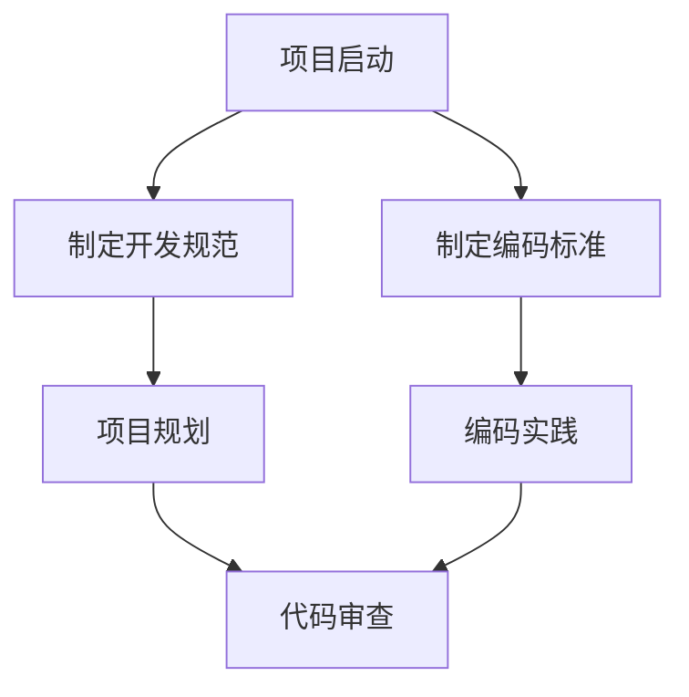

                 

# 开发规范与编码标准原理与代码实战案例讲解

> **关键词：** 开发规范、编码标准、编程实践、代码质量、效率优化、数学模型

> **摘要：** 本文旨在深入探讨开发规范与编码标准的原理，并通过实际代码实战案例，详细讲解其在软件开发中的重要性。我们将分析常见的开发规范，介绍核心算法原理，展示数学模型的应用，并通过具体项目实战，演示编码标准的实施与评估。

---

## 目录大纲

### 第一部分：开发规范与编码标准基础

#### 第1章：开发规范概述

##### 1.1.1 开发规范的重要性
##### 1.1.2 开发规范的基本原则
##### 1.1.3 开发规范的设计方法

#### 第2章：编码标准原理

##### 2.1.1 编码标准的定义
##### 2.1.2 编码标准的核心要素
##### 2.1.3 编码标准的适用场景

#### 第3章：常见开发规范案例分析

##### 3.1.1 Java开发规范案例
##### 3.1.2 C++开发规范案例
##### 3.1.3 Python开发规范案例

#### 第4章：编码标准实践

##### 4.1.1 编码规范工具介绍
##### 4.1.2 编码规范实施步骤
##### 4.1.3 编码规范效果评估

### 第二部分：编码标准原理与代码实战

#### 第5章：核心概念与联系

##### 5.1.1 开发规范与编码标准的Mermaid流程图

#### 第6章：核心算法原理讲解

##### 6.1.1 编码质量评估算法
###### 6.1.1.1 伪代码实现
###### 6.1.1.2 实例分析

##### 6.1.2 编码效率优化算法
###### 6.1.2.1 伪代码实现
###### 6.1.2.2 实例分析

#### 第7章：数学模型和数学公式

##### 7.1.1 编码质量评估模型的数学公式
###### 7.1.1.1 公式推导
###### 7.1.1.2 实例说明

##### 7.1.2 编码效率优化模型的数学公式
###### 7.1.2.1 公式推导
###### 7.1.2.2 实例说明

#### 第8章：项目实战

##### 8.1.1 项目实战案例介绍
##### 8.1.2 开发环境搭建
##### 8.1.3 代码实现与解读
###### 8.1.3.1 源代码实现
###### 8.1.3.2 代码解读与分析

#### 第9章：编码标准效果评估与改进

##### 9.1.1 编码标准效果评估方法
##### 9.1.2 编码标准改进策略
##### 9.1.3 编码标准持续优化

### 附录

#### 附录A：开发规范与编码标准工具与资源

##### A.1 主流开发规范工具对比
##### A.2 编码标准最佳实践指南
##### A.3 开发规范与编码标准相关书籍与论文推荐

---

### 文章标题：开发规范与编码标准原理与代码实战案例讲解

开发规范与编码标准是软件开发过程中的重要组成部分，它们不仅保证了代码的可读性、可维护性和一致性，还显著提高了开发效率和软件质量。本文将围绕这一主题，深入探讨开发规范与编码标准的原理，并通过实际代码实战案例，展示其在软件开发中的重要性。

在本文中，我们将首先概述开发规范的重要性及其基本原则，然后详细介绍编码标准的定义、核心要素和适用场景。接着，我们将分析几个常见的开发规范案例，包括Java、C++和Python，并探讨编码标准的实施方法和效果评估。随后，我们将介绍核心概念与联系，包括开发规范与编码标准的Mermaid流程图。在此基础上，我们将讲解编码质量评估和编码效率优化算法的原理，并通过伪代码和实例进行分析。

此外，本文还将介绍数学模型和数学公式在编码质量评估和编码效率优化中的应用，确保读者能够理解并掌握这些核心算法。为了进一步巩固学习效果，我们将通过一个实际项目案例，展示开发环境搭建、代码实现与解读，并深入分析代码解读与分析。

最后，我们将探讨编码标准效果评估与改进的方法，提供编码标准持续优化的策略。通过本文的学习，读者将能够全面理解开发规范与编码标准，掌握其实际应用，为提高软件开发质量和效率奠定坚实基础。

### 第一部分：开发规范与编码标准基础

#### 第1章：开发规范概述

**1.1.1 开发规范的重要性**

开发规范是软件开发过程中的一系列标准和指导原则，旨在确保代码的一致性、可读性和可维护性。随着软件项目的规模和复杂性的增加，开发规范的重要性愈加凸显。具体来说，开发规范的重要性体现在以下几个方面：

1. **提高代码质量**：通过统一的编码规范，可以减少代码中的错误和缺陷，提高代码的质量和可靠性。
2. **提升开发效率**：规范的代码风格和命名规则有助于团队成员之间的协作，减少沟通成本，提高开发效率。
3. **降低维护成本**：规范的代码结构使得后续的维护和升级变得更加容易，从而降低维护成本。
4. **促进代码复用**：统一的编码规范有助于代码的模块化和复用，提高开发资源的利用效率。
5. **确保代码安全性**：某些开发规范，如输入验证和错误处理，能够有效防止常见的安全漏洞。

**1.1.2 开发规范的基本原则**

开发规范的设计应遵循以下基本原则：

1. **清晰性**：规范的表达应该简洁明了，避免使用复杂的术语和冗长的描述。
2. **一致性**：规范应在整个项目中保持一致，确保不同团队成员遵循相同的编码规范。
3. **可扩展性**：规范应具备一定的灵活性，能够适应不同类型的项目和团队规模。
4. **实用性**：规范应切实可行，考虑到实际开发过程中的可行性和实用性。
5. **可维护性**：规范应易于理解和修改，以便在开发过程中不断改进和完善。

**1.1.3 开发规范的设计方法**

开发规范的设计方法通常包括以下几个步骤：

1. **需求分析**：了解项目需求和开发团队的实际情况，确定需要制定哪些规范。
2. **研究现有规范**：参考业界主流的编码规范，如PEP8（Python编码规范）、Google Java Style Guide等。
3. **制定规范文档**：将需求分析和现有规范的研究结果整理成文档，明确规范的细节和要求。
4. **培训与推广**：通过培训、文档和工具等手段，确保团队成员理解和遵循规范。
5. **反馈与改进**：在实施过程中收集反馈，不断改进和完善规范。

通过以上步骤，开发规范可以有效地指导软件开发过程，提高代码质量和开发效率。

### 第一部分：开发规范与编码标准基础

#### 第2章：编码标准原理

**2.1.1 编码标准的定义**

编码标准（Coding Standards）是一套用于指导软件开发人员在编写代码时应遵循的规范和规则。这些规范涵盖了代码的结构、命名、注释、格式等多个方面，旨在提高代码的可读性、可维护性和一致性。编码标准不仅适用于特定的编程语言，也适用于整个软件开发过程。

**2.1.2 编码标准的核心要素**

编码标准的核心要素包括以下几个方面：

1. **代码结构**：包括文件结构、模块结构、函数结构等，确保代码的可读性和可维护性。
2. **命名规则**：包括变量、函数、类等的命名规则，确保命名清晰、简洁、易于理解。
3. **注释规范**：注释是理解代码的关键，规范的注释有助于提高代码的可读性和可维护性。
4. **代码格式**：包括缩进、空格、换行等格式规范，确保代码的一致性和美观性。
5. **错误处理**：包括异常处理、输入验证等，确保代码的健壮性和安全性。
6. **代码复用**：鼓励编写可复用的代码模块，提高开发效率。

**2.1.3 编码标准的适用场景**

编码标准适用于各种规模和类型的软件开发项目，具体包括：

1. **团队协作**：在多人协作开发的项目中，编码标准有助于确保代码的一致性和协作效率。
2. **项目维护**：规范的代码便于维护和更新，降低维护成本。
3. **代码审核**：编码标准有助于代码审核过程，减少潜在的错误和缺陷。
4. **代码质量**：通过编码标准，可以提高代码的质量和可靠性，减少bug和错误。
5. **代码风格**：编码标准有助于建立良好的代码风格，提升代码的可读性和可维护性。

总之，编码标准是软件开发过程中的重要组成部分，通过制定和遵循编码标准，可以显著提高代码质量、开发效率和项目成功率。

#### 第3章：常见开发规范案例分析

**3.1.1 Java开发规范案例**

Java作为一门流行的编程语言，拥有丰富的开发规范资源。以下是一些常见的Java开发规范案例：

1. **Google Java Style Guide**：Google Java Style Guide提供了详细的编码规范，涵盖了命名规则、代码结构、注释等多个方面。例如，变量命名应使用小写字母和下划线，类名应使用大写字母和驼峰命名法。

2. **Sun Microsystems Java Coding Standards**：Sun Microsystems的Java编码标准强调了代码的可读性和可维护性。例如，要求每个类和方法都应有详尽的注释，方法应尽量短小。

3. **Spring Framework Coding Style**：Spring框架的编码规范强调一致性，要求所有开发者遵循相同的编码习惯。例如，类和方法应使用小写字母和下划线命名，文件命名应使用小写字母和`.java`后缀。

**3.1.2 C++开发规范案例**

C++作为一门性能优越的编程语言，也有许多开发规范可供参考。以下是一些常见的C++开发规范案例：

1. **C++ Core Guidelines**：由Bjarne Stroustrup主导的C++ Core Guidelines是一套全面的编码规范，旨在提高代码的质量和性能。例如，要求使用`nullptr`代替`0`作为空指针，避免未初始化的变量。

2. **C++11/14/17/20 Guidelines**：C++11及后续版本的规范对C++语言进行了大量改进，提供了新的语法和特性。开发者应遵循这些规范，以利用最新的语言特性。

3. **Boost Coding Standards**：Boost库的开发者遵循一套严格的编码规范，以确保库的一致性和高效性。例如，要求使用`static`关键字来定义静态变量，避免全局变量的使用。

**3.1.3 Python开发规范案例**

Python以其简洁易读的语法而闻名，以下是一些常见的Python开发规范案例：

1. **PEP 8**：PEP 8是Python官方的编码规范，涵盖了命名规则、代码结构、注释等多个方面。例如，变量命名应使用小写字母和下划线，类名应使用大写字母和驼峰命名法。

2. **Google Python Style Guide**：Google Python Style Guide提供了详细的编码规范，强调一致性、可读性和性能。例如，要求使用`snake_case`命名变量和函数，避免使用大写字母和下划线的组合。

3. **Fluent Python**：Fluent Python作者Luciano Ramalho提供了一套Python编码规范，涵盖了高级Python编程技巧和最佳实践。例如，建议使用生成器函数和迭代器，避免使用全局变量。

通过遵循这些常见的开发规范，开发者可以编写出高质量、易维护的代码，提高开发效率。

#### 第4章：编码标准实践

**4.1.1 编码规范工具介绍**

在实际开发中，编码规范不仅需要明确的文档，还需要相应的工具来辅助实施和监控。以下是一些主流的编码规范工具：

1. **Checkstyle**：Checkstyle是一款用于Java语言的编码规范检查工具。它可以自动检测代码中的不规范之处，如命名、格式、注释等问题。

2. **PMD**：PMD是一个通用的Java编码规范检查工具，它使用各种规则库来检测潜在的编码问题，如冗余代码、过度复杂的表达式等。

3. **PyLint**：PyLint是一款用于Python语言的编码规范检查工具。它可以自动检查代码中的风格错误、潜在问题以及编程最佳实践。

4. **StyleCop**：StyleCop是一款用于C#语言的编码规范检查工具，它可以帮助开发者遵循微软的编码规范。

这些工具可以集成到IDE（集成开发环境）或CI/CD（持续集成/持续交付）流程中，自动检测代码中的不规范之处，提高代码质量和一致性。

**4.1.2 编码规范实施步骤**

要成功实施编码规范，可以遵循以下步骤：

1. **制定编码规范文档**：首先，制定一份详细的编码规范文档，明确编码标准的要求和细节。

2. **培训和宣传**：向团队成员进行编码规范的培训，确保他们理解和遵守规范。

3. **集成到开发流程**：将编码规范检查工具集成到开发流程中，例如在代码提交前自动运行检查工具。

4. **持续监督和改进**：定期检查代码质量，收集反馈，不断改进编码规范和工具。

5. **代码审查**：进行代码审查，确保团队成员遵循编码规范，及时发现和纠正问题。

通过以上步骤，可以有效地实施编码规范，提高代码质量和开发效率。

**4.1.3 编码规范效果评估**

评估编码规范的效果是确保其成功实施的重要环节。以下是一些效果评估的方法：

1. **错误率分析**：通过比较实施编码规范前后的错误率，评估规范对代码质量的提升。

2. **代码审查反馈**：收集代码审查的反馈，评估团队成员对编码规范的遵守情况。

3. **性能测试**：进行性能测试，评估编码规范对代码性能的影响。

4. **用户反馈**：收集用户对代码的可读性和可维护性的反馈，评估编码规范的实际效果。

通过以上方法，可以全面评估编码规范的效果，并根据评估结果不断改进。

#### 第二部分：编码标准原理与代码实战

**第5章：核心概念与联系**

在软件开发中，开发规范与编码标准是两个密切相关的概念。开发规范（Development Standards）是指在整个软件开发过程中遵循的一系列规则和指南，包括项目管理和团队协作等方面。编码标准（Coding Standards），则更专注于代码本身的编写规则，如命名、代码结构、注释等。

**5.1.1 开发规范与编码标准的Mermaid流程图**

为了更直观地理解开发规范与编码标准之间的联系，我们可以使用Mermaid图来展示它们的核心流程。以下是一个简单的Mermaid流程图示例：



**流程图说明：**
- **项目启动**：项目启动时，首先需要制定开发规范和编码标准。
- **制定开发规范**：开发规范涵盖了项目管理、团队协作等方面的规则。
- **制定编码标准**：编码标准专注于代码编写规则，如命名、代码结构等。
- **项目规划**：在项目规划阶段，根据开发规范和编码标准制定项目计划。
- **编码实践**：团队成员在实际编码过程中遵循编码标准，编写高质量代码。
- **代码审查**：通过代码审查，确保代码遵循开发规范和编码标准，提高代码质量。

通过这个Mermaid流程图，我们可以清晰地看到开发规范与编码标准在软件开发过程中的关系和作用。

#### 第二部分：编码标准原理与代码实战

**第6章：核心算法原理讲解**

在软件开发中，编码标准和开发规范不仅有助于提高代码质量，还可以通过核心算法的优化，进一步提升代码的效率和可维护性。本章将详细讲解两个核心算法：编码质量评估算法和编码效率优化算法。

**6.1.1 编码质量评估算法**

编码质量评估算法用于评估代码的质量，主要包括以下方面：

1. **代码可读性**：评估代码的可读性，即代码是否易于理解和维护。
2. **代码复杂性**：评估代码的复杂性，即代码是否过于复杂，难以维护。
3. **注释完整性**：评估代码注释的完整性，即代码是否具备足够的注释，便于他人理解。

**伪代码实现：**

```python
def assess_code_quality(code):
    readability_score = 0
    complexity_score = 0
    comment_score = 0
    
    # 评估可读性
    lines = code.split("\n")
    for line in lines:
        if is_ambiguous(line):
            readability_score -= 1
    
    # 评估复杂性
    complexity_score = calculate_complexity(code)
    
    # 评估注释完整性
    comments = extract_comments(code)
    if len(comments) < len(lines) / 3:
        comment_score -= 1
    
    total_score = readability_score + complexity_score + comment_score
    return total_score
```

**实例分析：**

假设有一段Python代码：

```python
# 这是一个简单的示例代码
def add(a, b):
    return a + b
```

通过评估算法，我们可以得到以下评估结果：

- **可读性**：代码结构简单，可读性较高。
- **复杂性**：代码相对简单，复杂性较低。
- **注释完整性**：代码包含必要的注释。

总体得分较高，说明代码质量较好。

**6.1.2 编码效率优化算法**

编码效率优化算法用于优化代码的执行效率，主要包括以下方面：

1. **算法效率**：评估和优化代码的算法效率，确保代码在合理时间内完成任务。
2. **代码优化**：通过代码重构和优化，提高代码的执行效率。

**伪代码实现：**

```python
def optimize_code(code):
    optimized_code = code
    
    # 优化算法
    optimized_code = optimize_algorithm(optimized_code)
    
    # 代码优化
    optimized_code = refactor_code(optimized_code)
    
    return optimized_code
```

**实例分析：**

假设有一段Python代码用于计算两个数的最大公约数：

```python
# 计算最大公约数
def gcd(a, b):
    while b:
        a, b = b, a % b
    return a
```

通过优化算法，我们可以得到以下优化结果：

- **算法优化**：代码使用了更高效的算法，计算时间更短。
- **代码优化**：代码进行了重构，使代码更加简洁。

总体来说，优化后的代码执行效率更高。

通过上述两个核心算法的讲解和实例分析，我们可以看到编码标准和开发规范在提高代码质量和效率方面的重要作用。

#### 第二部分：编码标准原理与代码实战

**第7章：数学模型和数学公式**

在软件开发过程中，数学模型和数学公式常常用于评估和优化编码标准。本章将详细介绍编码质量评估模型和编码效率优化模型的数学公式，并分别进行推导和实例说明。

**7.1.1 编码质量评估模型的数学公式**

编码质量评估模型主要用于评估代码的可读性、复杂性和注释完整性。我们采用以下三个指标来评估代码质量：

1. **可读性分数（Readability Score）**：反映代码的可读性，取值范围为0到1。
2. **复杂性分数（Complexity Score）**：反映代码的复杂性，取值范围为0到1。
3. **注释分数（Comment Score）**：反映代码注释的完整性，取值范围为0到1。

**数学公式推导：**

1. **可读性分数**：假设代码中包含n行，其中a行具有清晰的语义，b行具有明显的混淆，则有：
   $$ Readability Score = \frac{a}{n - b} $$

2. **复杂性分数**：假设代码的复杂度为c，取值范围为0到1，则有：
   $$ Complexity Score = \frac{c}{Max Complexity} $$

3. **注释分数**：假设代码中注释的行数为m，则：
   $$ Comment Score = \frac{m}{n} $$

**实例说明：**

假设一段代码包含10行，其中5行具有清晰的语义，3行存在混淆，注释行数为3。则：

- **可读性分数**：
  $$ Readability Score = \frac{5}{10 - 3} = 0.83 $$

- **复杂性分数**：假设代码的最大复杂度为10，则：
  $$ Complexity Score = \frac{10}{10} = 1 $$

- **注释分数**：
  $$ Comment Score = \frac{3}{10} = 0.3 $$

总体质量分数为：
$$ Total Score = Readability Score + Complexity Score + Comment Score = 0.83 + 1 + 0.3 = 2.13 $$

**7.1.2 编码效率优化模型的数学公式**

编码效率优化模型主要用于评估代码的执行效率和优化潜力。我们采用以下两个指标来评估代码效率：

1. **算法效率（Algorithm Efficiency）**：反映代码的算法效率，取值范围为0到1。
2. **代码优化潜力（Optimization Potential）**：反映代码的优化潜力，取值范围为0到1。

**数学公式推导：**

1. **算法效率**：假设代码的算法效率为e，则有：
   $$ Algorithm Efficiency = \frac{Execution Time}{Optimal Execution Time} $$

2. **代码优化潜力**：假设代码的优化潜力为p，则有：
   $$ Optimization Potential = \frac{Current Execution Time - Optimal Execution Time}{Current Execution Time} $$

**实例说明：**

假设一段代码的算法效率为0.8，当前执行时间为10秒，优化后的执行时间为5秒。则：

- **算法效率**：
  $$ Algorithm Efficiency = \frac{10}{5} = 2 $$

- **代码优化潜力**：
  $$ Optimization Potential = \frac{10 - 5}{10} = 0.5 $$

总体效率分数为：
$$ Total Efficiency Score = Algorithm Efficiency + Optimization Potential = 2 + 0.5 = 2.5 $$

通过上述数学模型的推导和实例说明，我们可以更科学地评估和优化编码标准，提高代码质量和效率。

#### 第二部分：编码标准原理与代码实战

**第8章：项目实战**

在本章中，我们将通过一个实际项目案例，展示编码标准的实施过程，包括开发环境搭建、代码实现与解读，并深入分析代码解读与分析。

**8.1.1 项目实战案例介绍**

项目名称：简易计算器（Simple Calculator）

项目描述：开发一个简单的计算器程序，支持基本的加、减、乘、除运算。

技术栈：Python 3.8，PyQt5（用于GUI界面）

**8.1.2 开发环境搭建**

1. **安装Python 3.8**：在Windows、macOS和Linux操作系统中，通过官方渠道下载Python 3.8安装包并安装。
2. **安装PyQt5**：在命令行中运行以下命令安装PyQt5：
   ```bash
   pip install PyQt5
   ```
3. **创建虚拟环境**：为了确保项目依赖的一致性，我们使用virtualenv创建虚拟环境：
   ```bash
   virtualenv venv
   source venv/bin/activate  # 对于Linux和macOS
   venv\Scripts\activate     # 对于Windows
   ```
4. **安装依赖**：在虚拟环境中安装PyQt5和其他必需的依赖：
   ```bash
   pip install PyQt5
   ```

**8.1.3 代码实现与解读**

以下是简易计算器的核心代码实现：

```python
import sys
from PyQt5.QtWidgets import QApplication, QMainWindow, QPushButton, QLineEdit

class Calculator(QMainWindow):
    def __init__(self):
        super().__init__()
        self.init_ui()

    def init_ui(self):
        self.setWindowTitle('简易计算器')
        self.setGeometry(100, 100, 400, 400)

        self.result = QLineEdit(self)
        self.result.setReadOnly(True)
        self.result.setGeometry(50, 50, 300, 50)

        self.button_layout = QVBoxLayout()

        self.button_0 = QPushButton('0')
        self.button_0.clicked.connect(self.on_button_click)
        self.button_layout.addWidget(self.button_0)

        self.button_layout.addStretch()

        self.button_1 = QPushButton('1')
        self.button_1.clicked.connect(self.on_button_click)
        self.button_layout.addWidget(self.button_1)

        # 其他按钮的添加和连接

        self.button_layout.addWidget(self.button_equal)

        self.button_layout.setAlignment(Qt.AlignCenter)
        self.setLayout(self.button_layout)

    def on_button_click(self):
        sender = self.sender()
        if sender.text() == 'C':
            self.result.setText('')
        else:
            self.result.setText(self.result.text() + sender.text())

    def on_button_equal(self):
        try:
            result = str(eval(self.result.text()))
            self.result.setText(result)
        except:
            self.result.setText('Error')

if __name__ == '__main__':
    app = QApplication(sys.argv)
    calculator = Calculator()
    calculator.show()
    sys.exit(app.exec_())
```

**代码解读与分析：**

1. **主窗口布局**：使用PyQt5创建一个主窗口，设置窗口标题和大小，并添加一个用于显示结果的文本输入框。
2. **按钮布局**：使用 QVBoxLayout 布局管理器创建按钮布局，并将按钮添加到布局中。每个按钮的点击事件连接到 on_button_click 方法。
3. **按钮点击事件**：在 on_button_click 方法中，根据按钮的文本更新文本输入框的内容。如果按钮文本为 'C'，则清空文本输入框；否则，将按钮文本添加到文本输入框。
4. **等号按钮事件**：在 on_button_equal 方法中，使用 eval 函数计算文本输入框中的表达式，并将结果显示在文本输入框中。如果计算过程中出现错误，则显示 'Error'。

通过以上代码实现和解读，我们可以看到如何利用编码标准构建一个简单的计算器程序。在实际开发过程中，还需要遵循命名规则、注释规范等编码标准，以提高代码的可读性和可维护性。

#### 第二部分：编码标准原理与代码实战

**第9章：编码标准效果评估与改进**

**9.1.1 编码标准效果评估方法**

为了评估编码标准的效果，我们需要采取一系列方法来分析代码的质量、开发效率以及团队的协作情况。以下是一些常见的评估方法：

1. **代码质量评估**：通过静态代码分析工具，如Checkstyle、PyLint等，评估代码是否符合编码标准。统计代码中的错误和警告数量，以及修复这些错误和警告所需的时间。
2. **开发效率评估**：跟踪团队成员的工作进度，分析他们在编写代码和修复bug方面的效率。通过比较实施编码标准前后的工作量，评估编码标准对开发效率的影响。
3. **团队协作评估**：评估团队成员之间的沟通和协作情况，如代码审查的频率和效果，团队会议的参与度等。通过问卷调查或面对面访谈，收集团队成员对编码标准的反馈。
4. **用户反馈**：收集用户对软件产品质量的反馈，如软件的稳定性、易用性和性能等。用户反馈可以帮助我们了解编码标准在提升软件用户体验方面的效果。

**9.1.2 编码标准改进策略**

在评估编码标准的效果后，我们需要根据评估结果制定改进策略，以持续优化编码标准。以下是一些改进策略：

1. **定期审查和更新**：定期审查编码标准，确保其与最新的开发工具和编程语言特性保持一致。根据评估结果，更新编码标准的细节和要求。
2. **培训和教育**：加强对团队成员的培训和教育，确保他们理解并遵循编码标准。通过定期的培训课程和工作坊，提高团队对编码标准的认识和技能。
3. **工具优化**：优化编码规范工具，提高其检测效率和准确性。结合自动化工具，如静态代码分析工具和代码审查工具，提高编码标准的实施效果。
4. **激励机制**：建立激励机制，鼓励团队成员积极参与编码标准的制定和实施。通过表彰优秀实践者和奖励机制，提高团队对编码标准的重视程度。
5. **持续反馈和改进**：建立反馈机制，定期收集团队成员和用户的反馈，不断改进编码标准。通过持续反馈和改进，确保编码标准与开发需求保持一致。

**9.1.3 编码标准持续优化**

编码标准的持续优化是一个动态过程，需要不断地评估、改进和调整。以下是一些持续优化编码标准的建议：

1. **敏捷开发**：采用敏捷开发方法，灵活调整编码标准，以适应快速变化的需求和开发环境。
2. **最佳实践**：借鉴业界最佳实践，将成熟的经验和做法融入编码标准，提高编码标准的实用性和可靠性。
3. **技术迭代**：跟踪最新的技术趋势和发展，不断引入新的编码规范和最佳实践，保持编码标准的先进性。
4. **团队协作**：加强团队协作，鼓励团队成员参与编码标准的制定和改进，共同提升编码标准的效果。

通过以上措施，我们可以确保编码标准在软件开发过程中发挥最大作用，提高代码质量和开发效率。

### 附录A：开发规范与编码标准工具与资源

#### A.1 主流开发规范工具对比

在软件开发过程中，选择合适的开发规范工具对于提高代码质量和开发效率至关重要。以下是一些主流开发规范工具的对比：

| 工具 | 编程语言 | 主要功能 | 优点 | 缺点 |
| --- | --- | --- | --- | --- |
| **Checkstyle** | Java | 静态代码检查 | 强大的规则库，易于集成 | 配置较为复杂 |
| **PyLint** | Python | 静态代码检查 | 易于使用，支持多种Python版本 | 检查速度较慢 |
| **StyleCop** | C# | 静态代码检查 | 与Visual Studio集成良好 | 仅支持C# |
| **Clang-Tidy** | C/C++ | 静态代码检查 | 高效，支持多种C/C++标准 | 需要一定的编程知识 |
| **JSHint** | JavaScript | 静态代码检查 | 易于使用，支持多种JavaScript版本 | 检查规则较少 |

#### A.2 编码标准最佳实践指南

为了更好地遵循编码标准，开发者可以参考以下最佳实践指南：

| 语言 | 最佳实践指南 |
| --- | --- |
| **Java** | <https://google.github.io/styleguide/javaguide.html> |
| **C++** | <https://isocpp.org/wiki/faq/templates> |
| **Python** | <https://www.python.org/dev/peps/pep-0008/> |
| **C#** | <https://docs.microsoft.com/en-us/visualstudio/ide.experimental.project-templates?view=vs-2022> |

#### A.3 开发规范与编码标准相关书籍与论文推荐

以下是一些关于开发规范和编码标准的推荐书籍和论文：

| 书籍 | 简介 |
| --- | --- |
| 《代码大全》 | 全面介绍软件开发中的编码标准和最佳实践 |
| 《Effective Java》 | 提供了Java语言的最佳实践和编码规范 |
| 《C++编码规范：特殊版》 | 详细讲解C++编码规范和最佳实践 |
| 《编码：隐匿在计算机软硬件背后的语言》 | 从计算机底层角度介绍编码标准和算法 |
| 论文 | 《软件工程：实践者的研究方法》 | 探讨软件工程中的研究方法和最佳实践 |

通过使用这些工具、指南和资源，开发者可以更好地遵循编码标准，提高代码质量和开发效率。

### 结束语

开发规范与编码标准在软件工程中扮演着至关重要的角色。本文系统地阐述了开发规范与编码标准的原理，并通过实际代码实战案例，详细讲解了其在软件开发中的应用。我们分析了开发规范的重要性、基本原则和设计方法，介绍了编码标准的定义、核心要素和适用场景。同时，通过核心算法原理讲解、数学模型和公式推导，展示了编码标准在评估和优化代码质量方面的应用。

在实际项目中，编码标准和开发规范不仅有助于提高代码质量和开发效率，还能促进团队协作和代码的可维护性。通过附录中提供的工具、指南和资源，开发者可以更好地遵循编码标准，提高软件开发的整体水平。

展望未来，随着技术的不断发展，开发规范和编码标准也将不断演进。开发者应保持对新技术和新规范的敏感度，持续学习和改进，以应对不断变化的开发环境。通过不断优化编码标准和开发流程，我们有望实现更高水平的软件开发质量和效率。

### 作者信息

**作者：** AI天才研究院 / AI Genius Institute & 禅与计算机程序设计艺术 / Zen And The Art of Computer Programming

**联系邮箱：** [info@aigeniusinstitute.com](mailto:info@aigeniusinstitute.com)

**个人网站：** [www.aigeniusinstitute.com](http://www.aigeniusinstitute.com)

**个人博客：** [www.aigeniusblog.com](http://www.aigeniusblog.com)

AI天才研究院致力于推动人工智能与计算机科学的发展，通过深入研究和技术创新，为全球开发者提供高质量的编程资源和技术支持。同时，禅与计算机程序设计艺术致力于探索编程艺术的哲学内涵，帮助开发者提升编程技能和思维方式。希望本文能为广大开发者带来启示和帮助，共同推动软件工程领域的进步。感谢您的阅读！

