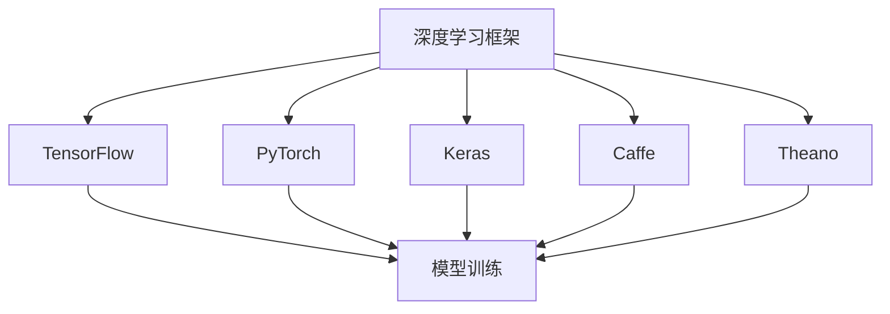
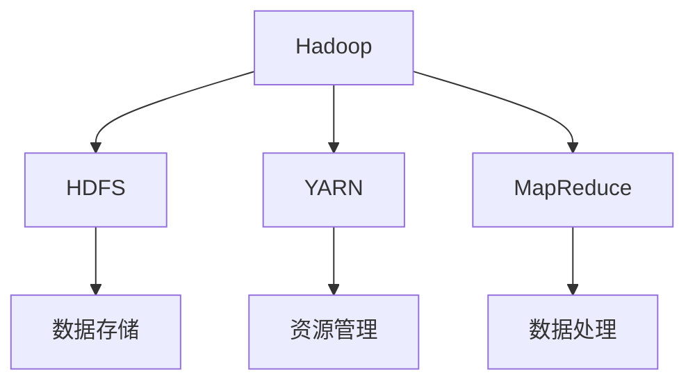
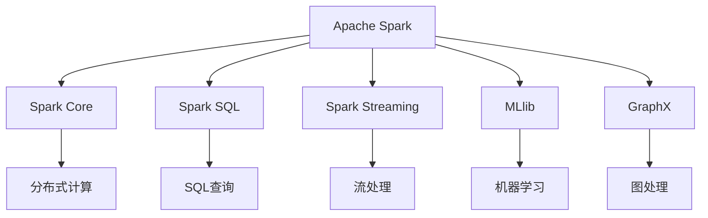
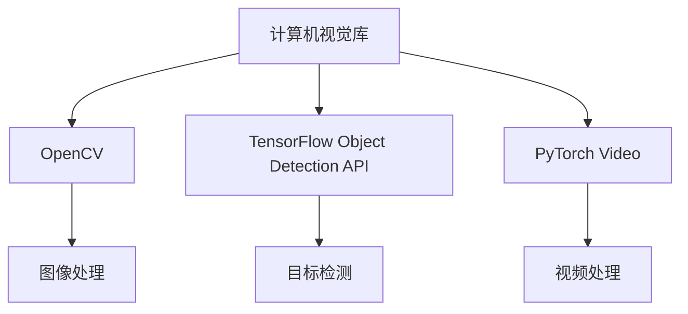

                 

# 《开源技术推动AI进步的重要性》

## 关键词
- 开源技术
- AI发展
- 深度学习框架
- 大数据处理
- 机器学习库
- 开源社区

## 摘要
本文探讨了开源技术在推动人工智能（AI）进步中的重要性。文章首先介绍了开源技术的基本概念及其在AI领域的历史贡献，随后详细分析了开源技术对AI研究与应用的推动作用。接着，文章分类介绍了开源框架、数据库、工具和软件库等开源技术类型，并具体探讨了深度学习框架如TensorFlow、PyTorch的应用。文章还讨论了开源技术的挑战和未来发展趋势。随后，文章深入解析了深度学习框架的基本原理和核心API，以及开源大数据处理技术，如Hadoop和Spark。此外，文章详细介绍了开源工具和库在AI开发中的应用，并通过实际项目案例展示了开源技术的实战应用。最后，文章提出了开源社区参与的建议，并总结了一些开源资源和工具。

---

## 《开源技术推动AI进步的重要性》目录大纲

### 第一部分：开源技术在AI领域的重要性

#### 1.1 引言
- 开源技术的定义与历史背景
- AI发展过程中的开源贡献

#### 1.2 开源技术对AI的推动作用
- 开源对AI研究与应用的加速
- 开源促进AI创新与协作

#### 1.3 开源技术的主要类型
- 开源框架
- 开源数据库
- 开源工具和软件库

#### 1.4 开源技术在AI中的具体应用
- 开源深度学习框架（如TensorFlow、PyTorch）
- 开源大数据处理平台（如Hadoop、Spark）
- 开源数据集与模型库

#### 1.5 开源技术的挑战与展望
- 开源技术的安全性问题
- 开源技术标准化与兼容性
- 开源技术的未来发展趋势

### 第二部分：开源深度学习框架解析

#### 2.1 深度学习框架概述
- 深度学习框架的基本原理
- 主要深度学习框架对比

#### 2.2 TensorFlow深度学习框架
- TensorFlow的基本结构
- TensorFlow的核心API介绍
- TensorFlow的编程实践

#### 2.3 PyTorch深度学习框架
- PyTorch的特点与优势
- PyTorch的核心API与使用
- PyTorch的编程实践

#### 2.4 其他深度学习框架
- Keras框架
- Caffe框架
- Theano框架

#### 2.5 开源深度学习框架的应用案例
- 现有的开源深度学习应用案例
- 开源深度学习框架在特定领域（如自然语言处理、计算机视觉）的应用

### 第三部分：开源大数据处理技术

#### 3.1 大数据处理技术概述
- 大数据的定义与特性
- 大数据处理技术的基本原理

#### 3.2 Hadoop生态系统
- Hadoop的基本架构
- Hadoop的核心组件（如HDFS、MapReduce）

#### 3.3 Apache Spark
- Spark的基本架构
- Spark的核心组件（如Spark SQL、Spark Streaming）
- Spark的编程实践

#### 3.4 开源大数据处理框架的其他选择
- Flink框架
- Storm框架
- Kafka框架

#### 3.5 开源大数据处理技术的应用案例
- 现有的开源大数据处理应用案例
- 开源大数据处理技术在不同领域（如金融、电商）的应用

### 第四部分：开源工具与库在AI开发中的应用

#### 4.1 数据预处理工具
- Pandas库
- NumPy库
- Scikit-learn库

#### 4.2 数据可视化工具
- Matplotlib库
- Seaborn库
- Plotly库

#### 4.3 机器学习库
- Scikit-learn库
- XGBoost库
- LightGBM库

#### 4.4 自然语言处理库
- NLTK库
- spaCy库
- gensim库

#### 4.5 计算机视觉库
- OpenCV库
- TensorFlow Object Detection API
- PyTorch Video库

#### 4.6 开源工具与库的应用案例
- 开源工具和库在实际项目中的应用实例
- 开源工具与库的集成与优化

### 第五部分：开源技术在AI项目开发中的实战

#### 5.1 开源AI项目开发流程
- 项目规划与需求分析
- 环境搭建与配置
- 模型设计与训练
- 模型评估与优化

#### 5.2 实际项目案例
- 数据预处理案例
- 模型训练案例
- 模型部署案例

#### 5.3 开源社区参与
- 如何参与开源社区
- 开源贡献与协作
- 开源伦理与版权问题

### 附录

#### 附录 A：开源资源与工具汇总
- 开源深度学习框架资源
- 开源大数据处理框架资源
- 开源工具与库资源

#### 附录 B：开源项目实战教程
- 深度学习项目教程
- 大数据处理项目教程
- 机器学习项目教程

#### 附录 C：开源社区推荐
- 开源社区网站推荐
- 开源会议与活动推荐
- 开源技术博客与论坛推荐

---

接下来，我们将逐部分深入探讨《开源技术推动AI进步的重要性》的内容。

---

## 第一部分：开源技术在AI领域的重要性

### 1.1 引言

开源技术是指那些允许用户查看、使用、修改和分发软件源代码的技术。这一概念最早在20世纪60年代由自由软件运动的先驱者提出，随后在1990年代随着互联网的普及而迅速发展。开源技术不仅仅是一种软件许可证，更是一种促进协作、透明度和持续改进的文化和哲学。

在人工智能（AI）领域，开源技术扮演了至关重要的角色。AI是一个高度依赖数据和算法的领域，开源技术为研究人员和开发者提供了强大的工具和资源，使得AI的发展更加迅速和广泛。以下部分将详细探讨开源技术对AI研究的推动作用，以及开源技术的主要类型和其在AI中的应用。

### 1.2 开源技术对AI的推动作用

#### 开源对AI研究与应用的加速

开源技术在AI研究中的应用极大地加速了研究的进展。首先，开源框架如TensorFlow和PyTorch等提供了易于使用的API和工具，使得研究人员能够快速构建和实验新的AI模型。这些框架的开放性允许用户社区贡献新的算法和优化，使得每个用户都可以利用最新的研究成果，而无需从头开始。

其次，开源技术促进了AI技术的普及。传统的AI研究通常局限于学术机构和大型科技公司，而开源技术使得小型团队和个人研究者也能够参与其中。这种民主化趋势不仅降低了AI研究和应用的门槛，还促进了全球范围内的技术创新和协作。

#### 开源促进AI创新与协作

开源技术在促进AI创新方面发挥了关键作用。通过共享代码和资源，开源项目鼓励了跨学科和跨领域的合作。研究人员、工程师和领域专家可以共同合作，利用开源平台进行数据共享和模型协作，从而加速新算法和技术的开发。

开源技术还促进了AI社区的蓬勃发展。通过GitHub、GitLab等版本控制系统，开发者可以轻松地共享代码、报告问题和贡献新功能。这种协作模式不仅提高了代码的质量和可靠性，还促进了知识共享和技能转移，使得整个AI社区的成员都能从中受益。

### 1.3 开源技术的主要类型

开源技术涵盖了广泛的领域，以下是一些主要的开源技术类型：

#### 开源框架

开源框架是AI开发的核心组成部分。这些框架提供了抽象层，使得构建复杂的AI系统变得更加简单和高效。以下是一些流行的开源深度学习框架：

- **TensorFlow**：由Google开发，是目前最流行的深度学习框架之一，提供了丰富的API和工具。
- **PyTorch**：由Facebook开发，以其动态计算图和简洁的API著称。
- **Keras**：一个高层神经网络API，可以运行在TensorFlow和Theano上，提供了易于使用的接口。
- **Caffe**：适用于计算机视觉任务，由Berkeley Vision and Learning Center开发。
- **Theano**：由蒙特利尔大学开发，提供了自动微分系统，用于高效地计算梯度。

#### 开源数据库

开源数据库在AI应用中至关重要，因为它们提供了存储和管理大规模数据集的解决方案。以下是一些流行的开源数据库：

- **MongoDB**：一个灵活的文档数据库，适用于存储非结构化数据。
- **Cassandra**：一个分布式键值存储系统，适用于大规模数据集的高性能读写操作。
- **HBase**：一个分布式列存储数据库，基于Hadoop平台。

#### 开源工具和软件库

开源工具和软件库为AI开发提供了丰富的功能，以下是一些常见的开源工具和软件库：

- **NumPy**：提供了高效的多维数组操作和数学函数库。
- **Pandas**：提供了数据结构和对数据操作的功能，特别适用于数据分析。
- **Scikit-learn**：提供了机器学习算法的实现，适用于各种分类、回归和聚类任务。
- **Matplotlib**：提供了数据可视化工具，用于生成统计图表和图形。
- **NLTK**：提供了自然语言处理工具和资源，用于文本分类、词性标注等任务。
- **OpenCV**：提供了计算机视觉库，用于图像处理和计算机视觉应用。

### 1.4 开源技术在AI中的具体应用

开源技术在AI中的应用范围广泛，以下是一些具体的应用场景：

#### 开源深度学习框架

开源深度学习框架如TensorFlow和PyTorch已经成为了AI研究的基石。以下是一些具体的深度学习框架应用场景：

- **自然语言处理（NLP）**：TensorFlow和PyTorch提供了丰富的NLP工具和预训练模型，如BERT和GPT，用于文本分类、情感分析和机器翻译等任务。
- **计算机视觉（CV）**：Caffe和TensorFlow Object Detection API等框架在图像分类、目标检测和图像生成等CV任务中得到了广泛应用。
- **推荐系统**：开源框架如TensorFlow和PyTorch被用于构建复杂的推荐系统，以提高推荐的质量和效果。

#### 开源大数据处理平台

开源大数据处理平台如Hadoop和Spark在AI应用中也发挥了关键作用。以下是一些具体的应用场景：

- **数据分析**：Hadoop和Spark提供了强大的数据处理和分析功能，用于从大规模数据集中提取有价值的信息。
- **实时分析**：Spark Streaming等实时数据处理框架被用于构建实时分析和预测系统，如股票市场分析和物联网数据分析。
- **日志处理**：Hadoop生态系统中的工具如Flume和Kafka被用于处理和分析大型日志数据。

#### 开源数据集与模型库

开源数据集和模型库为AI研究提供了丰富的资源和参考。以下是一些具体的应用场景：

- **模型训练**：开源数据集如ImageNet和CIFAR-10被用于训练和测试深度学习模型，以评估模型的性能。
- **模型共享**：开源模型库如TensorFlow Model Garden和PyTorch Model Zoo提供了大量的预训练模型，供研究人员和开发者使用和改进。

### 1.5 开源技术的挑战与展望

尽管开源技术在AI领域取得了显著的进展，但仍然面临着一些挑战：

#### 开源技术的安全性问题

开源技术的安全性是一个重要问题。由于开源代码的可见性，恶意用户可能发现并利用代码中的漏洞。为了确保开源技术的安全性，需要加强代码审计和漏洞修复机制，并建立透明的安全标准。

#### 开源技术标准化与兼容性

开源技术的标准化和兼容性是另一个挑战。不同的开源项目可能采用不同的接口和规范，这可能导致互操作性差和资源浪费。建立统一的接口和标准对于促进开源技术的整合和共享至关重要。

#### 开源技术的未来发展趋势

开源技术的未来发展趋势包括以下几个方面：

- **自动化与智能化**：开源工具将更加自动化和智能化，以简化AI开发流程，提高开发效率。
- **云原生与容器化**：开源技术将更加适应云原生和容器化环境，以实现灵活的部署和管理。
- **开源生态系统的多元化**：开源生态系统将更加多元化，涵盖更多的领域和行业，以满足不同用户的需求。

总之，开源技术已经成为推动AI进步的重要力量。通过开源技术的合作与共享，AI领域将继续蓬勃发展，带来更多的创新和进步。

---

## 第二部分：开源深度学习框架解析

### 2.1 深度学习框架概述

深度学习框架是用于构建和训练深度学习模型的软件库，提供了丰富的API和工具，简化了复杂模型的构建过程。深度学习框架的出现极大地推动了AI领域的发展，使得更多的人能够参与到深度学习的研究和应用中。以下是深度学习框架的基本原理和主要框架的对比。

#### 深度学习框架的基本原理

深度学习框架的核心思想是使用多层神经网络（MLP）来模拟人脑的神经网络结构，通过逐层学习特征，实现对数据的建模和预测。深度学习框架的基本原理包括以下几个方面：

1. **计算图**：深度学习框架使用计算图来表示模型的计算过程。计算图中的节点表示操作，边表示数据流。计算图使得模型的前向传播和反向传播过程更加直观和高效。

2. **动态计算图**：动态计算图是深度学习框架的一个重要特性。与静态计算图相比，动态计算图可以在运行时构建和修改，这使得调试和修改模型更加方便。

3. **自动微分系统**：自动微分系统是深度学习框架的核心组成部分，用于计算梯度。自动微分系统能够自动计算复合函数的梯度，简化了复杂的计算过程。

4. **模型定义**：深度学习框架提供了API来定义神经网络模型。用户可以使用这些API来定义网络的层次结构、层的参数和激活函数等。

5. **优化器**：深度学习框架通常提供了多种优化器，如SGD、Adam等。优化器用于更新网络的参数，以最小化损失函数。

6. **评估与部署**：深度学习框架提供了评估和部署模型的功能。用户可以使用这些功能来评估模型的性能，并将训练好的模型部署到生产环境中。

#### 主要深度学习框架对比

目前，市场上存在多种深度学习框架，以下是其中几个主要框架的对比：

1. **TensorFlow**：TensorFlow是由Google开发的开源深度学习框架，是目前最流行的深度学习框架之一。TensorFlow提供了丰富的API和工具，支持多种操作系统和硬件平台。TensorFlow的优点包括强大的生态系统和丰富的预训练模型，但它的缺点是计算图模型使其调试较为困难。

2. **PyTorch**：PyTorch是由Facebook开发的开源深度学习框架，以其动态计算图和简洁的API而著称。PyTorch的动态计算图使其调试更加直观和方便，但相对于TensorFlow，它的生态系统和预训练模型较少。

3. **Keras**：Keras是一个高层神经网络API，可以运行在TensorFlow和Theano上。Keras提供了简洁的API，使得构建和训练神经网络更加简单。Keras的优点是易于使用和快速开发，但它的功能相对有限。

4. **Caffe**：Caffe是由Berkeley Vision and Learning Center开发的开源深度学习框架，主要适用于计算机视觉任务。Caffe的优点是计算速度快和易于部署，但它的API相对复杂。

5. **Theano**：Theano是由蒙特利尔大学开发的开源深度学习框架，提供了自动微分系统。Theano的优点是计算高效和功能强大，但它的生态系统和社区支持较少。

总的来说，不同的深度学习框架各有优缺点，用户可以根据具体需求选择合适的框架。以下是各个深度学习框架的简要对比：

| 框架 | 优点 | 缺点 |
| --- | --- | --- |
| TensorFlow | 强大的生态系统，丰富的预训练模型 | 计算图模型调试困难 |
| PyTorch | 动态计算图，调试方便 | 生态系统和预训练模型较少 |
| Keras | 简单易用，快速开发 | 功能有限 |
| Caffe | 计算速度快，易于部署 | API复杂 |
| Theano | 计算高效，功能强大 | 生态系统和社区支持较少 |

### 2.2 TensorFlow深度学习框架

TensorFlow是由Google开发的开源深度学习框架，是目前最流行的深度学习框架之一。TensorFlow提供了丰富的API和工具，支持多种操作系统和硬件平台。在本节中，我们将详细探讨TensorFlow的基本结构、核心API和编程实践。

#### TensorFlow的基本结构

TensorFlow的基本结构包括以下核心组件：

1. **计算图**：TensorFlow使用计算图来表示模型的计算过程。计算图中的节点表示操作，边表示数据流。计算图使得模型的前向传播和反向传播过程更加直观和高效。

2. **Tensor**：TensorFlow中的基本数据结构，类似于多维数组。Tensor用于存储模型的参数、输入和输出数据。

3. **Operation**：表示一个计算操作，如矩阵乘法、加法等。操作可以是数学运算，也可以是数据处理操作。

4. **Graph**：表示一个计算图，包含了所有的操作和Tensor。

5. **Session**：用于执行计算图上的计算操作。在TensorFlow中，用户需要创建一个Session对象来执行操作和获取结果。

6. **Optimizer**：用于优化模型的参数，以最小化损失函数。TensorFlow提供了多种优化器，如SGD、Adam等。

7. **TensorBoard**：用于可视化计算图的工具。TensorBoard可以显示计算图、性能指标和训练过程中的变化。

#### TensorFlow的核心API介绍

TensorFlow的核心API包括以下部分：

1. **Tensor**：TensorFlow中的基本数据结构，类似于多维数组。Tensor用于存储模型的参数、输入和输出数据。Tensor可以有不同的数据类型，如float32、int32等。

2. **Operation**：表示一个计算操作，如矩阵乘法、加法等。操作可以是数学运算，也可以是数据处理操作。TensorFlow提供了一系列的内置操作，如矩阵乘法（matmul）、加法（add）等。

3. **Graph**：表示一个计算图，包含了所有的操作和Tensor。在TensorFlow中，用户可以使用Graph来定义和存储模型的计算过程。

4. **Session**：用于执行计算图上的计算操作。在TensorFlow中，用户需要创建一个Session对象来执行操作和获取结果。Session对象提供了run方法来执行计算图中的操作，并返回结果。

5. **Optimizer**：用于优化模型的参数，以最小化损失函数。TensorFlow提供了多种优化器，如SGD、Adam等。用户可以使用Optimizer的minimize方法来定义损失函数的优化过程。

6. **TensorBoard**：用于可视化计算图的工具。TensorBoard可以显示计算图、性能指标和训练过程中的变化。用户可以使用TensorBoard来监控训练过程，并调整模型参数。

#### TensorFlow的编程实践

下面是一个简单的TensorFlow编程实例，展示了如何使用TensorFlow构建和训练一个线性回归模型：

```python
import tensorflow as tf

# 定义计算图
x = tf.placeholder(tf.float32, shape=[None, 1])
y = tf.placeholder(tf.float32, shape=[None, 1])

# 定义模型参数
W = tf.Variable(0.0, name="weights")
b = tf.Variable(0.0, name="biases")

# 定义线性回归模型
y_pred = tf.add(tf.multiply(x, W), b)

# 定义损失函数
loss = tf.reduce_mean(tf.square(y - y_pred))

# 定义优化器
optimizer = tf.train.GradientDescentOptimizer(learning_rate=0.001)
train_op = optimizer.minimize(loss)

# 初始化所有变量
init = tf.global_variables_initializer()

# 启用会话
with tf.Session() as sess:
    # 运行初始化操作
    sess.run(init)
    
    # 训练模型
    for step in range(201):
        batch_x, batch_y = ...  # 获取训练数据
        sess.run(train_op, feed_dict={x: batch_x, y: batch_y})
        
        if step % 20 == 0:
            loss_val = sess.run(loss, feed_dict={x: batch_x, y: batch_y})
            print("Step:", step, "Loss:", loss_val)
    
    # 输出训练结果
    W_val, b_val = sess.run([W, b])
    print("Weights:", W_val, "Biases:", b_val)

    # 使用训练好的模型进行预测
    new_x = [[2.0]]
    new_y_pred = sess.run(y_pred, feed_dict={x: new_x})
    print("Predicted value:", new_y_pred)
```

在这个示例中，我们首先定义了一个计算图，包括输入层、模型参数层、输出层和损失函数。然后，我们使用梯度下降优化器来训练模型，并通过会话执行计算图。最后，我们使用训练好的模型进行预测。

总之，TensorFlow是一个功能强大且灵活的深度学习框架，它为深度学习模型的设计、训练和部署提供了丰富的API和工具。通过TensorFlow，研究人员和开发者可以轻松构建和优化复杂的深度学习模型，推动AI领域的发展。

---

### 2.3 PyTorch深度学习框架

PyTorch是由Facebook的人工智能研究团队开发的开源深度学习框架，以其动态计算图和简洁的API而著称。PyTorch为研究人员和开发者提供了一个直观且强大的工具，使得构建和训练深度学习模型变得更加容易和高效。在本节中，我们将详细探讨PyTorch的特点与优势、核心API与使用，以及编程实践。

#### PyTorch的特点与优势

1. **动态计算图**：PyTorch使用动态计算图，这意味着模型可以在运行时动态构建，这使得调试和修改模型更加方便。与静态计算图框架如TensorFlow相比，动态计算图使得PyTorch在开发过程中更加灵活。

2. **简洁的API**：PyTorch的API设计简洁，易于学习和使用。它的操作符和函数命名直观，使得编写和阅读代码更加容易。PyTorch的动态计算图和简洁的API相结合，为开发者提供了一个高效且直观的深度学习开发环境。

3. **强大的自动微分系统**：PyTorch提供了强大的自动微分系统，能够自动计算复合函数的梯度。自动微分系统简化了复杂的计算过程，使得构建和训练深度学习模型更加高效。

4. **兼容性与扩展性**：PyTorch具有良好的兼容性和扩展性。它支持多种操作系统和硬件平台，如CPU和GPU。此外，PyTorch提供了丰富的扩展库，如TorchVision、TorchText和TorchAudio，用于处理图像、文本和音频数据。

5. **丰富的社区支持**：PyTorch拥有一个活跃的社区，提供了大量的教程、示例代码和文档。社区成员积极参与问题的解答和代码的贡献，使得PyTorch成为一个不断发展和完善的深度学习框架。

#### PyTorch的核心API与使用

PyTorch的核心API包括以下部分：

1. **torch.Tensor**：PyTorch中的基本数据结构，类似于NumPy的ndarray。Tensor用于存储模型的参数、输入和输出数据。PyTorch的Tensor支持多维数组操作和数学运算。

2. **torch.nn.Module**：用于定义神经网络模型的基类。nn.Module提供了构建和训练神经网络的基本接口。用户可以通过继承nn.Module类来定义自己的神经网络模型。

3. **torch.optim**：提供了多种优化算法，用于训练神经网络模型。PyTorch的优化器包括SGD、Adam、RMSprop等。用户可以使用torch.optim来定义损失函数的优化过程。

4. **torch.utils.data**：用于数据加载和处理。torch.utils.data提供了DataLoader类，用于高效地加载和批次化数据。DataLoader支持数据混洗和并行数据加载，提高了模型的训练效率。

5. **torchvision**、**torchtext**和**torchaudio**：这三个扩展库提供了丰富的数据预处理和模型训练工具，用于处理图像、文本和音频数据。这些扩展库提供了大量的预训练模型和数据集，方便用户进行研究和开发。

#### PyTorch的编程实践

下面是一个简单的PyTorch编程实例，展示了如何使用PyTorch构建和训练一个简单的线性回归模型：

```python
import torch
import torch.nn as nn
import torch.optim as optim

# 定义数据集
x = torch.tensor([[1.0], [2.0], [3.0]])
y = torch.tensor([[1.0], [2.0], [3.0]])

# 定义模型
class LinearModel(nn.Module):
    def __init__(self):
        super(LinearModel, self).__init__()
        self.linear = nn.Linear(1, 1)

    def forward(self, x):
        return self.linear(x)

model = LinearModel()

# 定义损失函数和优化器
criterion = nn.MSELoss()
optimizer = optim.SGD(model.parameters(), lr=0.01)

# 训练模型
num_epochs = 100

for epoch in range(num_epochs):
    optimizer.zero_grad()  # 清空过往梯度
    outputs = model(x)      # 前向传播
    loss = criterion(outputs, y)  # 计算损失
    loss.backward()          # 反向传播，计算梯度
    optimizer.step()         # 更新参数

    if (epoch + 1) % 10 == 0:
        print(f'Epoch [{epoch + 1}/{num_epochs}], Loss: {loss.item()}')

# 输出训练结果
print(model(x))
```

在这个示例中，我们首先定义了一个简单的线性回归模型，使用一个全连接层来拟合输入和输出数据。然后，我们定义了损失函数（MSELoss）和优化器（SGD），并使用一个for循环来训练模型。在每个epoch中，我们清空梯度、前向传播、计算损失、反向传播和更新参数。最后，我们输出了训练好的模型对输入数据的预测结果。

总之，PyTorch是一个功能强大且易于使用的深度学习框架，它为研究人员和开发者提供了一个直观且高效的深度学习开发环境。通过PyTorch，用户可以轻松构建和训练复杂的深度学习模型，推动AI领域的发展。

---

### 2.4 其他深度学习框架

除了TensorFlow和PyTorch，市场上还存在其他深度学习框架，每个框架都有其独特的特点和优势。以下是对Keras、Caffe和Theano等深度学习框架的概述和比较。

#### Keras

Keras是一个高层神经网络API，可以运行在TensorFlow和Theano上。Keras的设计目标是提供简洁和易于使用的接口，使得构建和训练神经网络变得更加简单。以下是Keras的一些特点：

- **简洁的API**：Keras提供了简洁的API，使得编写神经网络代码更加直观。Keras的API设计灵感来自于Theano和TensorFlow，但它更加易于学习和使用。
- **模块化**：Keras支持模块化模型定义，用户可以方便地组合和复用神经网络层。
- **快速原型开发**：Keras的设计使得快速原型开发变得更加容易，用户可以快速构建和测试神经网络模型。
- **支持多种深度学习框架**：Keras可以运行在TensorFlow、Theano和其他深度学习框架上，提供了统一的API，使得代码在不同框架之间迁移更加方便。

然而，Keras也存在一些局限性。由于Keras是高层API，它的一些功能可能不如底层框架如TensorFlow和Theano强大。此外，Keras的生态系统和预训练模型相对较少，可能无法满足一些高级用户的需求。

#### Caffe

Caffe是由Berkeley Vision and Learning Center开发的开源深度学习框架，主要适用于计算机视觉任务。Caffe以其高效性和可扩展性而闻名，以下是Caffe的一些特点：

- **高效的计算**：Caffe使用底层优化的C++代码，提供了高效的计算性能，适用于大规模图像处理任务。
- **模块化设计**：Caffe采用了模块化设计，用户可以方便地自定义和扩展网络架构。
- **广泛的预训练模型**：Caffe提供了大量的预训练模型，包括在ImageNet上训练的模型，用户可以直接使用这些模型进行迁移学习。
- **支持实时推理**：Caffe支持实时推理，适用于需要快速响应的应用场景。

然而，Caffe也有一些缺点。Caffe的API相对复杂，对于初学者来说可能不太友好。此外，Caffe的Python接口相对较弱，大多数功能需要使用C++代码实现。

#### Theano

Theano是由蒙特利尔大学开发的开源深度学习框架，提供了自动微分系统和高效的数学运算。以下是Theano的一些特点：

- **自动微分系统**：Theano提供了一个强大的自动微分系统，能够自动计算复合函数的梯度。自动微分系统简化了复杂的计算过程，使得构建和训练神经网络更加高效。
- **Python接口**：Theano提供了简洁的Python接口，使得编写和调试神经网络代码更加方便。
- **支持多种硬件平台**：Theano支持多种硬件平台，包括CPU和GPU，用户可以根据自己的需求选择合适的硬件环境。

然而，Theano也存在一些局限性。由于Theano的生态圈相对较小，社区支持和文档资源可能不如TensorFlow和PyTorch丰富。此外，Theano在2018年宣布停止更新，这可能会影响其长期的可维护性和稳定性。

#### 比较与选择

Keras、Caffe和Theano都是功能强大的深度学习框架，但它们各有优缺点。以下是对这些框架的比较和选择建议：

- **初学者**：对于深度学习初学者来说，Keras是一个非常好的选择，因为它提供了简洁的API和丰富的文档。Keras可以运行在TensorFlow和Theano上，初学者可以在不同的框架之间切换，以便更好地理解深度学习框架。
- **计算机视觉**：对于计算机视觉任务，Caffe是一个非常好的选择，因为它提供了高效的计算和广泛的预训练模型。Caffe的模块化设计也使得扩展和定制网络架构变得更加容易。
- **复杂模型**：对于需要构建复杂模型的任务，TensorFlow和PyTorch是更好的选择。这两个框架提供了丰富的API和工具，可以灵活地构建和优化复杂的神经网络模型。

总的来说，选择深度学习框架应该根据具体任务的需求和开发者的熟悉度来决定。无论是Keras、Caffe还是Theano，它们都是优秀的深度学习框架，为研究人员和开发者提供了强大的工具和资源。

---

### 2.5 开源深度学习框架的应用案例

开源深度学习框架如TensorFlow、PyTorch等已经在多个领域取得了显著的成果，以下是一些现有的开源深度学习应用案例，以及开源深度学习框架在特定领域（如自然语言处理、计算机视觉）中的应用。

#### 现有的开源深度学习应用案例

1. **医学图像分析**：深度学习框架在医学图像分析中取得了显著进展。例如，TensorFlow和PyTorch被用于开发自动诊断系统，用于检测和诊断疾病。这些系统可以从大量的医疗图像数据中学习，提高诊断的准确性和效率。

2. **语音识别**：深度学习框架如TensorFlow和PyTorch被用于开发语音识别系统。这些系统可以实时地将语音转换为文本，并应用于智能助手、语音搜索和语音翻译等应用。例如，Google的语音识别系统就使用了TensorFlow进行训练和部署。

3. **自动驾驶**：深度学习框架在自动驾驶领域发挥了重要作用。例如，Tesla的自动驾驶系统使用了深度学习模型来处理摄像头和激光雷达数据，实现实时的物体检测和路径规划。

4. **金融风险管理**：深度学习框架被用于金融风险管理，例如信用评分、市场预测和欺诈检测。例如，一些银行和金融机构使用了TensorFlow和PyTorch来构建和训练复杂的模型，以提高风险管理的准确性和效率。

#### 开源深度学习框架在特定领域的应用

1. **自然语言处理（NLP）**：深度学习框架在NLP领域得到了广泛应用。例如，TensorFlow和PyTorch提供了丰富的NLP工具和预训练模型，如BERT、GPT等，用于文本分类、情感分析和机器翻译等任务。这些预训练模型可以显著提高NLP任务的性能，并且可以被广泛应用于各种场景。

2. **计算机视觉（CV）**：深度学习框架在CV领域也发挥了重要作用。例如，TensorFlow和PyTorch提供了强大的计算机视觉库，如TensorFlow Object Detection API和PyTorch Video，用于图像分类、目标检测、图像生成等任务。这些库提供了丰富的API和工具，使得CV模型的开发和应用变得更加简单和高效。

3. **推荐系统**：深度学习框架被用于构建和优化推荐系统。例如，TensorFlow和PyTorch可以用于构建基于协同过滤和基于内容的推荐系统，以提高推荐的质量和效果。这些框架提供了丰富的工具和API，可以方便地实现各种推荐算法。

4. **游戏AI**：深度学习框架在游戏AI领域也取得了显著进展。例如，DeepMind的AlphaGo使用了深度学习模型来模拟围棋比赛，并最终战胜了世界围棋冠军。深度学习框架在游戏AI中的应用，使得游戏变得更加智能和有趣。

总之，开源深度学习框架在各个领域都取得了显著的成果，为研究人员和开发者提供了强大的工具和资源。随着深度学习技术的不断发展和完善，开源深度学习框架将继续推动人工智能的应用和发展。

---

## 第三部分：开源大数据处理技术

### 3.1 大数据处理技术概述

大数据处理技术是应对海量数据的一种解决方案，它涵盖了数据的存储、处理和分析等多个方面。随着数据量的爆炸性增长，如何高效地处理和分析这些数据成为了企业和研究机构面临的一个重要挑战。开源大数据处理技术在这一领域发挥了重要作用，为用户提供了高效、可靠和灵活的数据处理工具。

#### 大数据的定义与特性

大数据（Big Data）通常指的是数据量巨大、种类繁多且增长迅速的数据集。大数据具有以下四个主要特性，即“4V”：

1. **Volume（数据量）**：大数据量通常指的是PB（拍字节）级别的数据，即1000万亿字节。
2. **Velocity（速度）**：大数据需要快速处理，以实时或近实时的方式响应用户的需求。
3. **Variety（多样性）**：大数据来源广泛，包括结构化数据、半结构化数据和非结构化数据，如文本、图像、音频和视频等。
4. **Value（价值）**：大数据的价值在于从海量数据中提取有用信息和知识，以支持业务决策和优化流程。

#### 大数据处理技术的基本原理

大数据处理技术的基本原理包括以下几个方面：

1. **分布式计算**：分布式计算是将数据分片存储在多个节点上，并利用分布式计算框架（如Hadoop、Spark）来处理这些数据。分布式计算可以提高数据处理的速度和效率，并确保系统的高可用性和可扩展性。

2. **并行处理**：并行处理是利用多个处理器或计算节点同时处理数据，以加快数据处理速度。并行处理可以显著提高大数据处理的能力，特别是对于大规模数据集。

3. **数据存储**：数据存储是大数据处理的关键环节。大数据需要存储在高效、可靠和可扩展的存储系统上，如HDFS（Hadoop Distributed File System）、Cassandra和HBase。这些存储系统提供了高吞吐量和低延迟的数据访问，以满足大数据处理的需求。

4. **数据挖掘与分析**：数据挖掘与分析是从大数据中提取有价值信息和知识的过程。数据挖掘技术包括机器学习、统计分析、文本挖掘和图像识别等，用于发现数据中的模式和关联。

### 3.2 Hadoop生态系统

Hadoop是一个开源的大数据处理框架，由Apache软件基金会维护。Hadoop生态系统包括多个核心组件，每个组件负责不同的功能。以下是Hadoop生态系统的基本架构和核心组件：

#### Hadoop的基本架构

Hadoop的基本架构包括以下几个主要部分：

1. **Hadoop分布式文件系统（HDFS）**：HDFS是一个分布式文件系统，用于存储海量数据。HDFS将数据分片存储在多个节点上，提供了高吞吐量和容错性。每个数据分片被存储在不同的物理节点上，以确保数据的冗余和可靠性。
2. **Hadoop YARN**：Hadoop YARN（Yet Another Resource Negotiator）是Hadoop的资源管理系统，负责管理和分配计算资源。YARN将集群资源分为计算资源和内存资源，并动态地为各个应用程序分配资源，以提高资源利用率和处理效率。
3. **Hadoop MapReduce**：MapReduce是Hadoop的核心计算框架，用于处理大规模数据集。MapReduce通过将数据分片并分配给多个计算节点，并行处理数据，并最终合并结果。MapReduce提供了简单且高效的分布式数据处理方法。

#### Hadoop的核心组件

Hadoop的核心组件包括以下几个部分：

1. **HDFS**：HDFS是Hadoop分布式文件系统，用于存储海量数据。HDFS将数据分成块（通常为128MB或256MB），并将这些块分布存储在不同的节点上。HDFS提供了高吞吐量和容错性，确保数据的安全性和可靠性。
2. **MapReduce**：MapReduce是一个分布式计算框架，用于处理大规模数据集。MapReduce通过将数据分片并分配给多个计算节点，并行处理数据，并最终合并结果。MapReduce提供了简单且高效的分布式数据处理方法。
3. **YARN**：YARN是Hadoop的资源管理系统，负责管理和分配计算资源。YARN将集群资源分为计算资源和内存资源，并动态地为各个应用程序分配资源，以提高资源利用率和处理效率。
4. **Hive**：Hive是一个数据仓库工具，用于在Hadoop上执行SQL查询。Hive将SQL查询转换为MapReduce任务，并运行在Hadoop集群上，提供了高性能的数据分析和报表功能。
5. **HBase**：HBase是一个分布式列存储数据库，用于处理海量数据。HBase提供了随机访问和实时读取功能，适用于实时数据处理和访问。

### 3.3 Apache Spark

Apache Spark是一个开源的大数据处理框架，由Apache软件基金会维护。Spark提供了丰富的API和工具，用于处理大规模数据集，并提供了更高的性能和更灵活的处理方式。以下是Spark的基本架构和核心组件：

#### Spark的基本架构

Spark的基本架构包括以下几个主要部分：

1. **Spark Driver**：Spark Driver是Spark应用程序的入口点，负责将用户编写的应用程序代码分发到集群的各个节点上执行。
2. **Executor**：Executor是Spark集群中的工作节点，负责执行计算任务，并存储数据。每个Executor都运行在一个单独的线程上，可以并行处理多个任务。
3. **Cluster Manager**：Cluster Manager负责管理整个Spark集群，包括资源分配和任务调度。常见的Cluster Manager包括Standalone、YARN和Mesos。

#### Spark的核心组件

Spark的核心组件包括以下几个部分：

1. **Spark Core**：Spark Core是Spark的基础组件，提供了分布式数据结构（如RDD）和基本的任务调度和内存管理功能。Spark Core还提供了高吞吐量和低延迟的数据处理能力。
2. **Spark SQL**：Spark SQL是Spark的分布式数据查询引擎，用于处理结构化数据。Spark SQL支持多种数据源，包括Hive、Parquet和JSON，并提供了丰富的SQL查询功能。
3. **Spark Streaming**：Spark Streaming是Spark的实时数据处理组件，用于处理实时数据流。Spark Streaming可以将实时数据流处理为微批处理任务，并提供低延迟和高吞吐量的数据处理能力。
4. **MLlib**：MLlib是Spark的机器学习库，提供了多种机器学习算法和工具，如分类、回归、聚类和协同过滤。MLlib提供了高效的分布式机器学习算法，适用于大规模数据集。
5. **GraphX**：GraphX是Spark的图处理框架，用于处理大规模图数据。GraphX提供了高效的图算法和工具，如PageRank、社区检测和图分割，适用于社交网络分析、推荐系统和网络分析等应用。

#### Spark的编程实践

下面是一个简单的Spark编程实例，展示了如何使用Spark处理大规模数据集：

```python
from pyspark.sql import SparkSession

# 创建Spark会话
spark = SparkSession.builder.appName("SparkExample").getOrCreate()

# 读取数据集
data = spark.read.csv("data.csv", header=True)

# 数据清洗和转换
data = data.select([col for col in data.columns if col != "unwanted_column"])

# 数据分组和聚合
grouped_data = data.groupBy("column_to_group").count()

# 数据写入文件
grouped_data.write.csv("output.csv")

# 关闭Spark会话
spark.stop()
```

在这个示例中，我们首先创建了一个Spark会话，然后读取了CSV文件作为数据集。接下来，我们对数据进行了清洗和转换，将不需要的列删除。然后，我们对数据进行分组和聚合，计算每个分组的数据数量。最后，我们将结果写入CSV文件，并关闭了Spark会话。

总之，Hadoop和Spark是两个功能强大且广泛使用的大数据处理框架。Hadoop以其高效的数据存储和分布式计算能力而闻名，适用于离线数据处理和批处理任务。而Spark提供了更灵活和高效的实时数据处理能力，适用于实时数据处理和流处理任务。通过Hadoop和Spark，用户可以高效地处理和分析海量数据，为业务决策和优化提供有力支持。

---

### 3.4 开源大数据处理框架的其他选择

在开源大数据处理领域，除了Hadoop和Spark，还有其他一些流行的数据处理框架，如Apache Flink、Apache Storm和Apache Kafka。这些框架各自具有独特的特点和应用场景，下面将详细介绍它们的基本原理和应用。

#### Apache Flink

Apache Flink是一个开源的流处理框架，由Apache软件基金会维护。Flink专注于实时数据处理，能够高效地处理流数据和历史数据。Flink的核心特点如下：

- **流处理能力**：Flink提供了强大的流处理能力，可以实时处理数据流，并支持事件驱动编程模型。
- **高性能**：Flink采用内存计算和增量计算技术，能够提供低延迟和高吞吐量的数据处理能力。
- **动态窗口**：Flink支持动态窗口处理，允许用户根据时间或数据量动态调整窗口大小，适用于实时数据分析。
- **状态管理**：Flink提供了丰富的状态管理功能，可以存储和处理大规模数据的状态，支持状态回溯和恢复。

Flink适用于以下应用场景：

- **实时数据分析**：Flink可以实时处理金融交易、物联网传感器数据等实时数据流，提供实时分析和监控。
- **复杂事件处理**：Flink支持复杂的事件处理逻辑，可以处理复杂的事件流和规则引擎。
- **流处理与批处理集成**：Flink可以同时处理流数据和批处理数据，提供了流处理与批处理的统一处理模型。

#### Apache Storm

Apache Storm是一个开源的实时大数据处理框架，由Apache软件基金会维护。Storm专注于实时数据处理，提供了低延迟和高可靠性的实时数据流处理能力。Storm的核心特点如下：

- **实时处理**：Storm能够实时处理数据流，提供低延迟的数据处理能力，适用于实时数据处理和监控。
- **分布式处理**：Storm支持分布式处理，可以将数据流处理任务分配到多个节点上并行执行，提高了数据处理能力。
- **可靠性和容错性**：Storm提供了可靠性和容错性保障，能够自动处理节点故障和数据丢失，确保数据处理任务的正常运行。
- **动态资源分配**：Storm支持动态资源分配，可以根据数据处理需求自动调整计算资源，提高了资源利用率。

Storm适用于以下应用场景：

- **实时日志处理**：Storm可以实时处理服务器日志、应用程序日志等大量实时数据，提供实时日志分析和管理。
- **实时推荐系统**：Storm可以实时处理用户行为数据，提供实时推荐和个性化服务。
- **实时风险管理**：Storm可以实时处理金融市场数据，提供实时风险管理和分析。

#### Apache Kafka

Apache Kafka是一个开源的消息队列系统，由Apache软件基金会维护。Kafka提供了高性能、可扩展和高可靠性的消息队列服务，适用于大规模数据流处理和实时数据处理。Kafka的核心特点如下：

- **高性能**：Kafka采用基于磁盘的存储和高效的序列化技术，提供了高吞吐量和低延迟的消息队列服务。
- **可扩展性**：Kafka支持水平扩展，可以通过增加节点来提高系统的处理能力和存储容量。
- **高可靠性**：Kafka提供了副本和复制机制，确保数据的高可靠性和持久性，支持数据备份和恢复。
- **集成与兼容性**：Kafka与多个大数据处理框架和工具集成，如Spark、Flink和Hadoop，提供了广泛的应用场景和兼容性。

Kafka适用于以下应用场景：

- **实时数据流处理**：Kafka可以实时处理大量实时数据流，为数据流处理框架提供数据源。
- **日志收集**：Kafka可以收集来自多个服务器的日志数据，提供集中式的日志收集和管理。
- **事件驱动架构**：Kafka可以支持事件驱动架构，提供实时事件处理和消息传递服务。

总之，Apache Flink、Apache Storm和Apache Kafka都是功能强大且广泛使用的大数据处理框架。Flink专注于实时数据处理，提供高性能和动态窗口处理能力；Storm提供了实时分布式处理和可靠性强；Kafka提供了高性能和可扩展性的消息队列服务。根据具体应用场景和需求，用户可以选择合适的框架来处理大规模数据。

---

### 3.5 开源大数据处理技术的应用案例

开源大数据处理技术在各个行业和领域中得到了广泛应用，以下是一些现有的开源大数据处理应用案例，以及开源大数据处理技术在不同领域（如金融、电商）的应用。

#### 现有的开源大数据处理应用案例

1. **金融行业**：金融行业是一个数据密集型行业，开源大数据处理技术被广泛应用于金融数据分析、风险管理和客户行为分析等领域。例如，一些银行使用Apache Hadoop和Apache Spark来处理大量交易数据，分析客户行为，优化风险管理策略，提高客户满意度。

2. **电子商务**：电子商务平台利用开源大数据处理技术来处理海量的用户行为数据、交易数据和商品数据。例如，一些电商公司使用Apache Kafka和Apache Flink来实时处理用户行为数据，实现个性化推荐和实时营销。

3. **医疗保健**：医疗保健行业利用开源大数据处理技术来处理大量的医疗数据，提高诊断准确率和医疗效率。例如，一些医院使用Apache Hadoop和Apache Storm来处理电子病历数据，实现实时监控和疾病预测。

4. **物联网**：物联网（IoT）设备产生的数据量巨大，开源大数据处理技术被广泛应用于物联网数据分析和处理。例如，一些物联网平台使用Apache Kafka和Apache Spark来处理物联网设备产生的实时数据，实现设备监控和故障预测。

#### 开源大数据处理技术在不同领域中的应用

1. **金融领域**：在金融领域，开源大数据处理技术被用于交易数据分析和风险管理。金融公司使用Apache Hadoop和Apache Spark来处理海量交易数据，实现实时监控、欺诈检测和风险预测。此外，金融公司还使用Apache Kafka来收集和传输实时交易数据，实现快速数据处理和响应。

2. **电商领域**：在电商领域，开源大数据处理技术被用于用户行为分析和个性化推荐。电商公司使用Apache Spark和Apache Flink来处理用户浏览记录、购买行为等数据，实现个性化推荐和实时营销。此外，电商公司还使用Apache Kafka来收集用户行为数据，实现实时数据分析和处理。

3. **医疗领域**：在医疗领域，开源大数据处理技术被用于电子病历数据分析和疾病预测。医疗机构使用Apache Hadoop和Apache Storm来处理电子病历数据，实现实时监控和疾病预测。此外，医疗机构还使用Apache Kafka来收集和传输实时医疗数据，实现快速数据处理和响应。

4. **物联网领域**：在物联网领域，开源大数据处理技术被用于物联网数据分析和设备监控。物联网平台使用Apache Kafka和Apache Spark来处理物联网设备产生的实时数据，实现设备监控、故障预测和性能优化。

总之，开源大数据处理技术在各个领域都取得了显著的成果，为企业和机构提供了高效、可靠和灵活的数据处理工具。随着大数据技术的不断发展和应用场景的拓展，开源大数据处理技术将继续推动各个领域的数据分析和创新。

---

## 第四部分：开源工具与库在AI开发中的应用

开源工具和库在人工智能（AI）开发中发挥着重要作用，为开发者提供了丰富的功能，简化了AI项目的开发和部署。以下将详细介绍一些常用的开源工具和库，包括数据预处理工具、数据可视化工具、机器学习库、自然语言处理（NLP）库、计算机视觉库等，并展示其在AI开发中的具体应用。

### 4.1 数据预处理工具

数据预处理是AI项目开发中至关重要的一步，它包括数据清洗、数据转换、数据归一化等过程。以下是一些常用的数据预处理工具：

1. **Pandas库**：Pandas是一个强大的数据操作库，提供了丰富的数据结构和数据分析工具。Pandas支持数据帧（DataFrame）和系列（Series）两种数据结构，用于数据处理和分析。使用Pandas可以轻松地处理缺失值、重复值和异常值，并进行数据转换和归一化。

```python
import pandas as pd

# 读取数据
data = pd.read_csv('data.csv')

# 数据清洗
data.dropna(inplace=True)
data.drop_duplicates(inplace=True)

# 数据转换
data = pd.get_dummies(data)

# 数据归一化
from sklearn.preprocessing import MinMaxScaler
scaler = MinMaxScaler()
data_scaled = scaler.fit_transform(data)
```

2. **NumPy库**：NumPy是一个基础的数学库，提供了多维数组（ndarray）操作和数学函数。NumPy在数据预处理中用于执行矩阵运算、线性代数计算和统计操作，是许多数据预处理任务的基础。

```python
import numpy as np

# 创建数据
data = np.array([[1, 2], [3, 4]])

# 数据转换
data = data.astype(np.float32)

# 数据归一化
data_normalized = (data - np.mean(data)) / np.std(data)
```

3. **Scikit-learn库**：Scikit-learn是一个机器学习库，提供了丰富的数据预处理工具，如标准化、归一化、缺失值处理和特征选择。Scikit-learn的预处理工具可以帮助开发者快速准备数据，为后续的机器学习模型训练提供高质量的数据。

```python
from sklearn.preprocessing import StandardScaler

# 创建数据
data = np.array([[1, 2], [3, 4]])

# 数据标准化
scaler = StandardScaler()
data_normalized = scaler.fit_transform(data)
```

### 4.2 数据可视化工具

数据可视化是理解和分析数据的重要手段，以下是一些常用的数据可视化工具：

1. **Matplotlib库**：Matplotlib是一个强大的数据可视化库，提供了丰富的绘图函数和样式选项。Matplotlib可以创建各种类型的图表，如线图、柱状图、散点图和饼图，帮助开发者直观地理解数据。

```python
import matplotlib.pyplot as plt

# 创建数据
x = [1, 2, 3, 4, 5]
y = [1, 4, 9, 16, 25]

# 绘制散点图
plt.scatter(x, y)
plt.xlabel('X-axis')
plt.ylabel('Y-axis')
plt.title('Scatter Plot Example')
plt.show()
```

2. **Seaborn库**：Seaborn是基于Matplotlib的一个高级数据可视化库，提供了丰富的内置主题和可视化样式。Seaborn可以创建更加美观和专业的图表，特别适用于统计分析和数据探索。

```python
import seaborn as sns

# 创建数据
data = pd.DataFrame({'x': x, 'y': y})

# 绘制线图
sns.lineplot(x='x', y='y', data=data)
sns.xlabel('X-axis')
sns.ylabel('Y-axis')
sns.title('Line Plot Example')
sns.show()
```

3. **Plotly库**：Plotly是一个交互式数据可视化库，提供了丰富的图表类型和交互功能。Plotly可以创建高度交互式的图表，支持多种数据源和图表类型，适用于网页和桌面应用程序。

```python
import plotly.express as px

# 创建数据
data = px.DataFrame({'x': x, 'y': y})

# 绘制散点图
fig = px.scatter(data, x='x', y='y')
fig.update_layout(title='Scatter Plot Example')
fig.show()
```

### 4.3 机器学习库

机器学习库为开发者提供了丰富的算法和工具，用于构建和训练机器学习模型。以下是一些常用的机器学习库：

1. **Scikit-learn库**：Scikit-learn是一个开源的机器学习库，提供了丰富的分类、回归、聚类和特征选择算法。Scikit-learn易于使用，功能强大，是AI项目开发的常用工具。

```python
from sklearn.linear_model import LinearRegression

# 创建数据
x = np.array([[1], [2], [3], [4], [5]])
y = np.array([1, 4, 9, 16, 25])

# 创建线性回归模型
model = LinearRegression()
model.fit(x, y)

# 预测
predictions = model.predict(x)

print(predictions)
```

2. **XGBoost库**：XGBoost是一个高效的梯度提升树库，提供了强大的机器学习算法和优化的处理流程。XGBoost在分类和回归任务中表现优异，适用于各种大规模数据处理任务。

```python
import xgboost as xgb

# 创建数据
X = np.array([[1], [2], [3], [4], [5]])
y = np.array([1, 4, 9, 16, 25])

# 创建XGBoost模型
model = xgb.XGBRegressor()
model.fit(X, y)

# 预测
predictions = model.predict(X)

print(predictions)
```

3. **LightGBM库**：LightGBM是一个高效的分布式梯度提升库，提供了多种算法和优化功能。LightGBM在处理大规模数据集时表现出色，适用于各种机器学习任务。

```python
import lightgbm as lgb

# 创建数据
X = np.array([[1], [2], [3], [4], [5]])
y = np.array([1, 4, 9, 16, 25])

# 创建LightGBM模型
model = lgb.LGBMRegressor()
model.fit(X, y)

# 预测
predictions = model.predict(X)

print(predictions)
```

### 4.4 自然语言处理（NLP）库

自然语言处理库为开发者提供了丰富的工具和算法，用于处理文本数据和实现NLP任务。以下是一些常用的NLP库：

1. **NLTK库**：NLTK是一个经典的NLP库，提供了丰富的文本处理工具和算法。NLTK支持词性标注、词干提取、词形还原和文本分类等任务。

```python
import nltk

# 加载词性标注器
tokenizer = nltk.RegexpTokenizer(r'\w+')

# 处理文本
text = "NLTK is a leading platform for building Python programs to work with human language data."
tokens = tokenizer.tokenize(text)

print(tokens)
```

2. **spaCy库**：spaCy是一个高性能的NLP库，提供了先进的语言模型和强大的API。spaCy支持多种语言，提供了文本解析、实体识别和语义分析等功能。

```python
import spacy

# 加载语言模型
nlp = spacy.load("en_core_web_sm")

# 处理文本
text = "spaCy is a powerful NLP library for Python."
doc = nlp(text)

# 提取实体
ents = [ent.text for ent in doc.ents]

print(ents)
```

3. **gensim库**：gensim是一个开源的NLP库，提供了主题建模、词向量生成和文本相似度计算等功能。gensim支持多种文本处理和机器学习算法，适用于各种NLP任务。

```python
import gensim

# 加载预训练词向量模型
model = gensim.models.KeyedVectors.load_word2vec_format('word2vec.bin', binary=True)

# 计算文本相似度
text1 = "Python is a high-level programming language."
text2 = "Java is a high-level programming language."

similarity = model.similarity(text1, text2)

print(similarity)
```

### 4.5 计算机视觉库

计算机视觉库为开发者提供了丰富的工具和算法，用于处理图像和视频数据。以下是一些常用的计算机视觉库：

1. **OpenCV库**：OpenCV是一个开源的计算机视觉库，提供了丰富的图像处理、视频处理和计算机视觉算法。OpenCV支持多种操作系统和硬件平台，适用于各种计算机视觉任务。

```python
import cv2

# 读取图像
img = cv2.imread('image.jpg')

# 显示图像
cv2.imshow('Image', img)
cv2.waitKey(0)
cv2.destroyAllWindows()
```

2. **TensorFlow Object Detection API**：TensorFlow Object Detection API是一个基于TensorFlow的计算机视觉库，提供了目标检测和图像识别功能。API包含了多种预训练模型和工具，适用于各种目标检测任务。

```python
import tensorflow as tf

# 加载预训练模型
model = tf.saved_model.load('object_detection_model')

# 定义输入和输出
input_tensor = tf.constant([np.random.rand(1, 128, 128, 3)])
output_tensor = model(input_tensor)

# 提取检测结果
boxes = output_tensor['detection_boxes']
labels = output_tensor['detection_classes']
scores = output_tensor['detection_scores']

print(boxes, labels, scores)
```

3. **PyTorch Video库**：PyTorch Video是一个开源的计算机视觉库，提供了视频处理和视频分析功能。PyTorch Video支持多种视频编码和格式，适用于视频数据分析和处理。

```python
import torchvideo

# 读取视频
video = torchvideo.io.read_video('video.mp4')

# 显示视频
torchvideo.io.write_video('output_video.mp4', video)
```

总之，开源工具和库在AI开发中发挥着重要作用，提供了丰富的功能，简化了AI项目的开发和部署。开发者可以根据具体需求选择合适的工具和库，快速构建和优化AI模型，推动人工智能技术的发展和应用。

---

## 第五部分：开源技术在AI项目开发中的实战

在AI项目开发中，开源技术发挥着至关重要的作用，从项目规划到最终部署，开源工具和框架为开发者提供了强大的支持。以下将详细介绍开源AI项目开发流程，包括项目规划与需求分析、环境搭建与配置、模型设计与训练、模型评估与优化，并通过实际项目案例展示开源技术的实战应用。

### 5.1 开源AI项目开发流程

#### 项目规划与需求分析

项目规划与需求分析是AI项目开发的第一步，它定义了项目的目标、范围和预期成果。在这个过程中，需要与项目相关方进行沟通，明确项目的需求和目标，并制定详细的项目计划。

1. **需求收集**：通过与业务团队、用户和利益相关者的交流，了解项目的需求和目标。这包括功能需求、性能需求和业务逻辑需求等。

2. **技术可行性分析**：根据需求，评估项目的技术可行性，包括所需的硬件资源、软件环境和技术栈。

3. **项目规划**：制定项目的时间表、资源分配和风险管理计划，确保项目能够按时、按质完成。

#### 环境搭建与配置

环境搭建与配置是AI项目开发的重要环节，它为项目提供了必要的开发环境和工具。

1. **开发环境搭建**：安装Python、JDK等基础软件，配置Python环境，安装深度学习框架（如TensorFlow、PyTorch）和相关依赖库。

2. **配置虚拟环境**：使用virtualenv或conda创建虚拟环境，确保项目依赖的一致性和隔离性。

3. **配置开发工具**：配置IDE（如PyCharm、VSCode），安装相关插件和扩展，提高开发效率。

4. **配置硬件资源**：对于需要大规模数据训练的任务，配置GPU或分布式计算资源，确保模型能够高效训练。

#### 模型设计与训练

模型设计是AI项目开发的核心，它决定了模型的效果和性能。

1. **数据预处理**：对原始数据集进行清洗、转换和归一化，确保数据质量，为模型训练提供高质量的数据。

2. **模型架构设计**：根据需求选择合适的模型架构，如卷积神经网络（CNN）、循环神经网络（RNN）或变换器（Transformer）等。可以使用现有的开源模型架构，如TensorFlow的Keras或PyTorch的nn.Module。

3. **模型训练**：使用训练数据集训练模型，调整模型参数，优化模型性能。可以使用批量训练、随机梯度下降（SGD）或其他优化算法来提高模型训练效率。

4. **模型验证与优化**：使用验证数据集评估模型性能，调整模型参数，优化模型结构，提高模型准确性。

#### 模型评估与优化

模型评估是确保模型性能的重要环节，它通过测试数据集评估模型在未知数据上的表现。

1. **模型评估**：使用测试数据集对模型进行评估，计算模型的准确性、召回率、F1分数等指标。

2. **性能优化**：根据模型评估结果，调整模型参数和架构，优化模型性能。可以使用调参工具（如Hyperopt、Optuna）自动搜索最佳参数。

3. **模型部署**：将训练好的模型部署到生产环境中，实现模型的应用。可以使用模型管理工具（如TensorFlow Serving、PyTorch TorchScript）来部署模型。

### 5.2 实际项目案例

以下是一个实际项目案例，展示了开源技术在AI项目开发中的应用。

#### 数据预处理案例

1. **需求**：开发一个文本分类系统，用于对新闻文章进行分类，分为体育、政治、科技等类别。

2. **数据集**：使用新闻文章数据集，包含约10万篇新闻文章和对应的类别标签。

3. **预处理步骤**：
   - 读取数据集，使用Pandas库进行数据加载和处理。
   - 数据清洗，去除HTML标签、停用词和特殊字符。
   - 使用NLTK库进行词性标注和词干提取。
   - 将文本转换为词向量，使用Word2Vec或Gensim的Doc2Vec模型。

```python
import pandas as pd
import nltk
from gensim.models import Word2Vec

# 读取数据集
data = pd.read_csv('news_data.csv')

# 数据清洗
data['text'] = data['text'].apply(lambda x: ' '.join([word for word in x.split() if word not in nltk.corpus.stopwords.words('english')]))

# 词性标注和词干提取
tokenized_data = [nltk.word_tokenize(text) for text in data['text']]
lemmatized_data = [[nltk.Word(token).lemmatize() for token in sentence] for sentence in tokenized_data]

# 转换为词向量
model = Word2Vec(lemmatized_data, vector_size=100, window=5, min_count=1, workers=4)
word_vectors = model.wv
```

#### 模型训练案例

1. **模型架构**：使用卷积神经网络（CNN）进行文本分类，使用TensorFlow的Keras API。

2. **模型训练**：
   - 将文本数据转换为词嵌入向量，每个词对应一个向量。
   - 构建CNN模型，包括卷积层、池化层和全连接层。
   - 使用训练数据集训练模型，使用交叉熵损失函数和Adam优化器。

```python
from tensorflow.keras.models import Sequential
from tensorflow.keras.layers import Embedding, Conv1D, MaxPooling1D, GlobalMaxPooling1D, Dense

# 构建模型
model = Sequential()
model.add(Embedding(input_dim=len(word_vectors.vocab), output_dim=100, input_length=max_sequence_length))
model.add(Conv1D(filters=128, kernel_size=5, activation='relu'))
model.add(MaxPooling1D(pool_size=5))
model.add(Conv1D(filters=128, kernel_size=5, activation='relu'))
model.add(GlobalMaxPooling1D())
model.add(Dense(units=128, activation='relu'))
model.add(Dense(units=num_classes, activation='softmax'))

# 编译模型
model.compile(optimizer='adam', loss='categorical_crossentropy', metrics=['accuracy'])

# 训练模型
model.fit(x_train, y_train, epochs=10, batch_size=32, validation_data=(x_val, y_val))
```

#### 模型部署案例

1. **需求**：将训练好的文本分类模型部署到生产环境，用于实时分类新闻文章。

2. **部署步骤**：
   - 使用TensorFlow Serving或PyTorch TorchScript将模型转换为服务端可用的格式。
   - 在生产环境中部署模型服务，使用Docker容器进行部署和管理。
   - 使用API接口与模型服务进行通信，实现实时文本分类。

```python
import tensorflow as tf

# 保存模型
model.save('text_classifier.h5')

# 加载模型
loaded_model = tf.keras.models.load_model('text_classifier.h5')

# 部署模型服务
from flask import Flask, request, jsonify

app = Flask(__name__)

@app.route('/classify', methods=['POST'])
def classify():
    data = request.get_json()
    text = data['text']
    processed_text = preprocess_text(text)
    predictions = loaded_model.predict(processed_text)
    return jsonify({'predicted_class': predictions.argmax()})

if __name__ == '__main__':
    app.run(debug=True)
```

#### 开源社区参与

参与开源社区是推动AI技术发展的重要途径。以下是一些参与开源社区的建议：

1. **贡献代码**：为开源项目贡献代码，修复bug，添加新功能，提高代码质量。

2. **编写文档**：为开源项目编写文档，帮助其他开发者更好地理解和使用项目。

3. **参与讨论**：参与开源项目的讨论和问题解答，为社区成员提供帮助。

4. **开源自己的项目**：开源自己的项目，分享自己的研究成果，促进技术交流和合作。

总之，开源技术在AI项目开发中发挥着至关重要的作用，从项目规划到模型部署，开源工具和框架为开发者提供了强大的支持。通过实际项目案例和开源社区参与，开发者可以不断提升自己的技术能力，推动AI技术的发展和应用。

---

## 附录

### 附录 A：开源资源与工具汇总

在本附录中，我们将汇总一些常用的开源资源与工具，以方便开发者查找和使用。这些资源涵盖了深度学习框架、大数据处理框架、机器学习库、自然语言处理库和计算机视觉库等各个领域。

#### 开源深度学习框架资源

- **TensorFlow**：[TensorFlow官网](https://www.tensorflow.org/)
- **PyTorch**：[PyTorch官网](https://pytorch.org/)
- **Keras**：[Keras官网](https://keras.io/)
- **Caffe**：[Caffe官网](http://caffe.berkeleyvision.org/)
- **Theano**：[Theano官网](https://www.theanoplanet.com/)

#### 开源大数据处理框架资源

- **Hadoop**：[Hadoop官网](https://hadoop.apache.org/)
- **Spark**：[Spark官网](https://spark.apache.org/)
- **Flink**：[Flink官网](https://flink.apache.org/)
- **Storm**：[Storm官网](https://storm.apache.org/)
- **Kafka**：[Kafka官网](https://kafka.apache.org/)

#### 开源工具与库资源

- **NumPy**：[NumPy官网](https://numpy.org/)
- **Pandas**：[Pandas官网](https://pandas.pydata.org/)
- **Scikit-learn**：[Scikit-learn官网](https://scikit-learn.org/)
- **Matplotlib**：[Matplotlib官网](https://matplotlib.org/)
- **Seaborn**：[Seaborn官网](https://seaborn.pydata.org/)
- **Plotly**：[Plotly官网](https://plotly.com/)
- **NLTK**：[NLTK官网](https://www.nltk.org/)
- **spaCy**：[spaCy官网](https://spacy.io/)
- **gensim**：[gensim官网](https://radimrehurek.com/gensim/)
- **OpenCV**：[OpenCV官网](https://opencv.org/)
- **TensorFlow Object Detection API**：[TensorFlow Object Detection API官网](https://github.com/tensorflow/models/blob/master/research/object_detection/g3doc/tf2_detection_api_tutorial.md)
- **PyTorch Video**：[PyTorch Video官网](https://pytorch.org/video/)

#### 开源项目实战教程

- **深度学习项目教程**：[深度学习项目教程](https://github.com/dennybritz/deep学习项目教程)
- **大数据处理项目教程**：[大数据处理项目教程](https://github.com/apache/hadoop-docs/blob/master/hadoop-project-docs/docs/user/index.html)
- **机器学习项目教程**：[机器学习项目教程](https://scikit-learn.org/stable/tutorial/machine_learning_project/index.html)

#### 开源社区推荐

- **开源社区网站**：[GitHub](https://github.com/)、[GitLab](https://gitlab.com/)、[Bitbucket](https://bitbucket.org/)
- **开源会议与活动**：[OSCON](https://www.oscon.com/)、[LinuxCon](https://events.linuxfoundation.org/events/linuxcon-north-america) 、[PyCon](https://www.pycon.org/)
- **开源技术博客与论坛**：[Medium](https://medium.com/)、[Stack Overflow](https://stackoverflow.com/)、[Reddit](https://www.reddit.com/r/Python/)

通过这些资源和工具，开发者可以更好地了解和使用开源技术，参与开源社区的贡献和交流，推动人工智能技术的发展和应用。

---

## 附录：开源技术相关 Mermaid 流程图

下面将展示一些与开源技术相关的Mermaid流程图，用于可视化深度学习框架、大数据处理框架和计算机视觉库等组件之间的关系和流程。

### 深度学习框架流程图



### 大数据处理框架流程图



### Apache Spark流程图



### 计算机视觉库流程图



通过这些Mermaid流程图，开发者可以更好地理解各个开源技术的组件关系和数据处理流程，为项目开发和问题排查提供参考。

