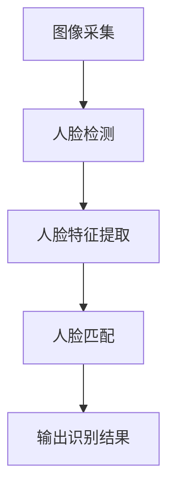
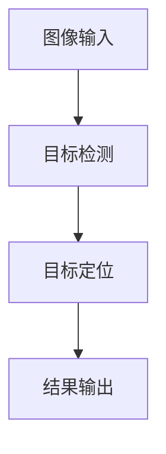
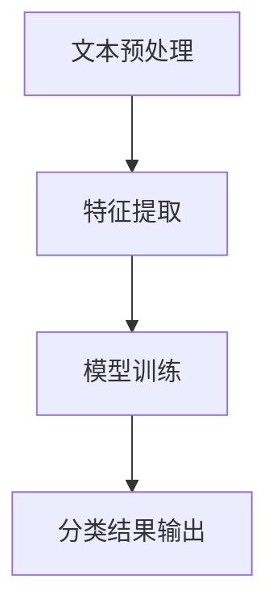
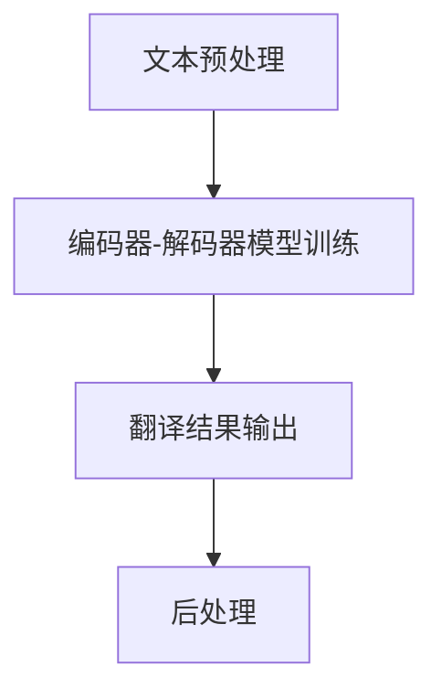
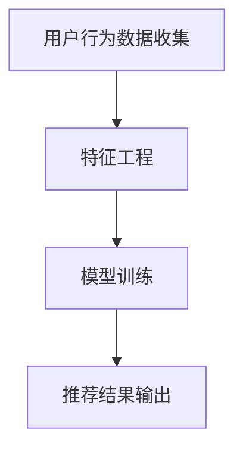

                 

# 《开源模型在中国AI应用中的作用》

## 概述

开源模型在中国AI应用中扮演着至关重要的角色。开源模型是指那些公开了源代码和模型参数的AI模型，这使得研究人员和开发者能够自由地访问、修改和分发这些模型。这一特性极大地推动了AI技术的发展和普及。

### 关键词
- 开源模型
- 中国AI应用
- 计算机视觉
- 自然语言处理
- 智能推荐系统

### 摘要

本文旨在探讨开源模型在中国AI应用中的作用和影响。首先，我们将概述开源模型的发展历程和中国AI产业的发展现状。随后，我们将详细分析开源模型在中国AI领域的主要应用，包括计算机视觉、自然语言处理和智能推荐系统。接着，我们将探讨开源模型在中国AI应用的挑战和机遇。文章的第三部分将解析开源模型在具体应用案例中的实践，并提供开源模型应用的最佳实践。最后，我们将讨论开源模型在中国AI应用的未来趋势，并提出相关的法律法规和伦理问题。通过本文的阅读，读者将对中国开源模型在AI领域的应用有更深刻的理解。

## 目录大纲

### 第一部分：开源模型在中国AI应用概述

### 第1章：开源模型在中国AI应用的背景

### 1.1 开源模型的发展历程

### 1.2 中国AI产业发展现状

### 1.3 开源模型在中国AI应用的优势

### 第2章：开源模型在中国AI领域的主要应用

### 2.1 开源模型在计算机视觉中的应用

### 2.2 开源模型在自然语言处理中的应用

### 2.3 开源模型在智能推荐系统中的应用

### 第3章：开源模型在中国的挑战与机遇

### 3.1 开源模型在中国应用的挑战

### 3.2 开源模型在中国发展的机遇

### 第二部分：开源模型应用案例解析

### 第4章：开源模型在计算机视觉的应用案例

### 4.1 人脸识别系统案例分析

### 4.2 目标检测系统案例分析

### 第5章：开源模型在自然语言处理的应用案例

### 5.1 文本分类系统案例分析

### 5.2 机器翻译系统案例分析

### 第6章：开源模型在智能推荐系统的应用案例

### 6.1 智能推荐系统案例分析

### 第三部分：开源模型应用最佳实践

### 第7章：开源模型应用流程与技巧

### 第8章：开源模型应用中的法律法规与伦理问题

### 第9章：开源模型在中国AI应用的未来趋势

### 附录

### 附录A：开源模型相关资源与工具

### 附录B：开源模型应用实践案例代码

## 第一部分：开源模型在中国AI应用概述

### 第1章：开源模型在中国AI应用的背景

### 1.1 开源模型的发展历程

开源模型的概念起源于20世纪90年代，随着互联网的发展，开放源代码软件（OSS）逐渐成为技术发展的主流。开源模型不仅提供了软件的自由访问和修改，还促进了技术的共享和协作。早期的开源模型主要是基于传统机器学习的方法，如决策树、支持向量机等。

然而，随着深度学习的兴起，开源模型迎来了新的发展机遇。2012年，AlexNet在ImageNet竞赛中取得了重大突破，这一事件标志着深度学习时代的到来。随后，Google、Facebook、Microsoft等科技巨头纷纷开源了他们的深度学习框架，如TensorFlow、PyTorch等。这些开源框架不仅提供了丰富的算法库，还支持自定义模型的开发和训练。

### 1.2 中国AI产业发展现状

中国AI产业在过去几年中取得了显著的发展。根据《中国人工智能发展报告2021》，中国的AI市场规模已超过3000亿元，预计到2025年将突破1万亿元。中国的AI产业呈现出以下几个特点：

1. **政府支持**：中国政府高度重视AI技术的发展，通过出台一系列政策支持和资金投入，推动AI产业的快速发展。
2. **企业集聚**：中国拥有大量的科技企业和研究机构，如百度、阿里巴巴、腾讯、华为等，这些企业在AI领域进行大量的研发和应用。
3. **技术创新**：中国在计算机视觉、自然语言处理、智能推荐等领域取得了重要突破，许多中国原创的AI模型和算法开始走向世界。
4. **应用广泛**：AI技术在中国各行各业得到广泛应用，如智能交通、智慧医疗、智能金融等，推动了传统行业的数字化转型。

### 1.3 开源模型在中国AI应用的优势

开源模型在中国AI应用中具有以下优势：

1. **技术共享**：开源模型促进了技术的共享和交流，使得更多的研究人员和开发者能够参与到AI技术的发展中。
2. **降低门槛**：开源模型降低了进入AI领域的门槛，使得更多的企业和个人能够利用先进的AI技术进行创新和应用。
3. **快速迭代**：开源模型支持快速迭代和改进，通过社区的合作和反馈，模型能够更加迅速地适应新的应用场景和需求。
4. **经济效益**：开源模型降低了研发成本，使得企业能够更加专注于核心业务的创新，提高了AI技术的经济效益。

综上所述，开源模型在中国AI应用中具有重要的地位和作用，它不仅推动了AI技术的发展，还为产业创新提供了强大的动力。

### 第2章：开源模型在中国AI领域的主要应用

#### 2.1 开源模型在计算机视觉中的应用

开源模型在计算机视觉领域发挥了重要作用，推动了该领域的技术进步和商业应用。计算机视觉是指使计算机能够像人类一样感知和理解视觉信息的技术，包括图像识别、目标检测、人脸识别等。以下是一些重要的开源模型及其在计算机视觉中的应用。

1. **卷积神经网络（CNN）**：CNN是计算机视觉领域最常用的深度学习模型之一。它通过卷积层、池化层和全连接层等结构提取图像的特征，实现对图像的自动分类和识别。常见的CNN开源框架有TensorFlow和PyTorch。

    - **应用案例**：人脸识别系统。利用CNN模型，可以对输入的人脸图像进行特征提取和分类，实现人脸识别功能。

    ```mermaid
    graph TD
    A[输入人脸图像] --> B[特征提取]
    B --> C[特征分类]
    C --> D[输出识别结果]
    ```

2. **目标检测模型**：目标检测是计算机视觉中的一项重要任务，它旨在检测图像中的多个对象并定位其位置。流行的目标检测模型包括YOLO、SSD和Faster R-CNN等。

    - **应用案例**：智能安防系统。利用目标检测模型，可以对监控视频进行实时分析，检测和识别异常行为，如入侵者、火灾等。

    ```mermaid
    graph TD
    A[输入监控视频] --> B[目标检测]
    B --> C[目标定位]
    C --> D[异常行为识别]
    D --> E[报警处理]
    ```

3. **实例分割模型**：实例分割是一种更为精细的计算机视觉任务，它不仅要求识别图像中的对象，还要区分不同实例（即同一类别的不同个体）。常见的实例分割模型包括Mask R-CNN和实例分割网络。

    - **应用案例**：自动驾驶系统。利用实例分割模型，可以识别和分割道路上的不同对象，如行人、车辆、交通标志等，为自动驾驶提供决策依据。

    ```mermaid
    graph TD
    A[输入道路图像] --> B[实例分割]
    B --> C[对象识别]
    C --> D[路径规划]
    ```

#### 2.2 开源模型在自然语言处理中的应用

自然语言处理（NLP）是人工智能的重要分支，它旨在使计算机能够理解、生成和处理自然语言。开源模型在NLP领域取得了显著进展，推动了文本分类、机器翻译、情感分析等任务的发展。以下是一些重要的NLP开源模型及其应用。

1. **BERT（Bidirectional Encoder Representations from Transformers）**：BERT是一种预训练语言模型，通过在大量文本上进行预训练，使模型能够捕捉到丰富的语言特征。BERT在多种NLP任务中取得了优异的性能。

    - **应用案例**：搜索引擎。利用BERT模型，可以更好地理解和处理用户的查询，提供更加精准的搜索结果。

    ```mermaid
    graph TD
    A[输入用户查询] --> B[BERT编码]
    B --> C[查询理解]
    C --> D[搜索结果生成]
    ```

2. **Transformer模型**：Transformer模型是一种基于自注意力机制的深度学习模型，广泛应用于机器翻译、文本生成等任务。它通过全局的注意力机制，能够捕捉到输入文本中的长距离依赖关系。

    - **应用案例**：机器翻译。利用Transformer模型，可以实现高质量、流畅的机器翻译，如Google翻译。

    ```mermaid
    graph TD
    A[输入源语言文本] --> B[Transformer编码]
    B --> C[注意力机制]
    C --> D[目标语言文本生成]
    ```

3. **GPT（Generative Pre-trained Transformer）**：GPT是一种基于Transformer的预训练语言模型，通过在大量文本上进行预训练，模型能够生成符合上下文逻辑的文本。

    - **应用案例**：文本生成。利用GPT模型，可以生成新闻文章、产品评价等文本，为内容创作提供支持。

    ```mermaid
    graph TD
    A[输入文本上下文] --> B[GPT生成]
    B --> C[文本生成]
    ```

#### 2.3 开源模型在智能推荐系统中的应用

智能推荐系统是AI技术在商业应用中的重要领域，它通过分析用户行为和偏好，为用户提供个性化的推荐。开源模型在智能推荐系统中发挥了关键作用，提升了推荐系统的效果和效率。以下是一些重要的开源推荐模型及其应用。

1. **矩阵分解模型**：矩阵分解模型是一种常见的推荐算法，通过将用户-物品评分矩阵分解为用户特征矩阵和物品特征矩阵，预测用户的兴趣和偏好。

    - **应用案例**：电商推荐。利用矩阵分解模型，可以为用户提供个性化的商品推荐，提高用户的购物体验。

    ```mermaid
    graph TD
    A[用户-物品评分矩阵] --> B[矩阵分解]
    B --> C[用户特征矩阵]
    C --> D[物品特征矩阵]
    D --> E[推荐预测]
    ```

2. **基于内容的推荐模型**：基于内容的推荐模型通过分析物品的内容特征，为用户推荐具有相似内容的物品。

    - **应用案例**：音乐推荐。利用基于内容的推荐模型，可以为用户提供个性化的音乐推荐，提高用户的听歌体验。

    ```mermaid
    graph TD
    A[音乐内容特征] --> B[内容匹配]
    B --> C[推荐预测]
    ```

3. **协同过滤模型**：协同过滤模型通过分析用户之间的相似性，为用户推荐相似的物品。

    - **应用案例**：视频推荐。利用协同过滤模型，可以为用户提供个性化的视频推荐，提高用户的观看体验。

    ```mermaid
    graph TD
    A[用户行为数据] --> B[用户相似性分析]
    B --> C[物品相似性分析]
    C --> D[推荐预测]
    ```

综上所述，开源模型在中国AI领域的主要应用涵盖了计算机视觉、自然语言处理和智能推荐系统，这些应用不仅推动了AI技术的发展，也为各行各业提供了强大的技术支持。通过不断探索和优化开源模型，中国AI产业将在未来取得更加辉煌的成就。

### 第3章：开源模型在中国的挑战与机遇

#### 3.1 开源模型在中国应用的挑战

虽然开源模型在中国AI应用中具有巨大的潜力，但也面临一些挑战：

1. **数据隐私和安全问题**：开源模型通常需要大量的数据来训练和优化，但数据的隐私和安全问题成为了一个重要的挑战。如何在保护用户隐私的前提下，利用开源模型进行有效的数据分析和应用，是一个亟待解决的问题。

2. **知识产权保护**：开源模型的广泛应用可能引发知识产权纠纷，特别是在商业应用中。如何平衡开源模型的自由访问和知识产权保护，是开源模型在中国应用中的一个关键问题。

3. **技术门槛**：尽管开源模型降低了AI技术的门槛，但对于许多中小企业和开发者来说，掌握和使用开源模型仍然存在一定的技术难度。如何降低技术门槛，使更多的人能够参与到AI技术的发展和应用中，是一个重要的挑战。

4. **本地化问题**：开源模型通常是在特定的语言和文化背景下开发的，在中国应用时可能需要针对本地化需求进行适配和优化。如何解决本地化问题，提高开源模型在中国AI应用中的适应性，是另一个重要挑战。

#### 3.2 开源模型在中国发展的机遇

尽管存在挑战，但开源模型在中国AI发展中也面临着巨大的机遇：

1. **技术积累和创新能力**：随着中国AI产业的快速发展，国内企业和研究机构在开源模型开发和应用方面积累了丰富的经验，这为开源模型在中国的创新提供了坚实的基础。

2. **政策支持**：中国政府高度重视AI技术的发展，通过出台一系列政策和资金支持，为开源模型的研发和应用提供了有力的保障。

3. **市场需求**：中国庞大的市场规模和多样化的应用场景为开源模型提供了广阔的应用空间，无论是计算机视觉、自然语言处理还是智能推荐系统，开源模型都能够在这些领域中发挥重要作用。

4. **国际合作**：随着全球AI技术的交流与合作，中国的开源模型也在国际舞台上崭露头角。通过与国际企业和研究机构的合作，中国开源模型可以借鉴先进的技术和理念，不断提升自身的竞争力。

总之，开源模型在中国AI应用中既面临着挑战，也充满了机遇。通过不断克服挑战和抓住机遇，中国开源模型将在未来取得更加辉煌的成就，为AI技术的发展和应用贡献力量。

### 第4章：开源模型在计算机视觉的应用案例

#### 4.1 人脸识别系统案例分析

人脸识别系统是计算机视觉领域的一个重要应用，它通过分析人脸图像，实现对用户身份的自动识别和验证。以下是一个人脸识别系统的详细分析。

#### 4.1.1 系统概述

人脸识别系统的基本架构包括图像采集、人脸检测、人脸特征提取和人脸匹配四个主要模块。

1. **图像采集**：系统通过摄像头或照片采集人脸图像。这一步骤需要保证图像的质量和清晰度，以便后续的人脸检测和特征提取。

2. **人脸检测**：利用深度学习模型（如MTCNN或SSD）检测图像中的人脸区域。人脸检测的准确性对于整个系统的性能至关重要。

3. **人脸特征提取**：对人脸图像进行特征提取，常用的方法包括卷积神经网络（如FaceNet或VGGFace）和局部二值模式（LBP）等。特征提取的目的是将人脸图像转化为数值特征向量，便于后续的人脸匹配。

4. **人脸匹配**：将检测到的人脸特征与数据库中的人脸特征进行匹配，判断是否为同一人。常用的匹配算法包括余弦相似度和欧氏距离等。

#### 4.1.2 技术架构

以下是人脸识别系统的一个简化技术架构：



#### 4.1.3 代码实现与解析

以下是一个基于OpenCV和深度学习的人脸识别系统的伪代码实现：

```python
import cv2
import face_recognition

# 加载预训练的人脸检测和特征提取模型
detector = face_recognition.FaceDetector()
extractor = face_recognition.FaceFeatureExtractor()

# 定义数据库中的人脸特征向量
known_faces = []

# 检测图像中的人脸
def detect_faces(image):
    return detector.detect_faces(image)

# 提取人脸特征向量
def extract_faces(image, faces):
    features = []
    for face in faces:
        feature = extractor.extract_face_features(face)
        features.append(feature)
    return features

# 人脸匹配
def match_faces(features, known_faces):
    matches = []
    for feature in features:
        for known_feature in known_faces:
            similarity = cosine_similarity(feature, known_feature)
            if similarity > threshold:
                matches.append(True)
                break
        else:
            matches.append(False)
    return matches

# 主函数
def main():
    image = cv2.imread("example.jpg")
    detected_faces = detect_faces(image)
    extracted_faces = extract_faces(image, detected_faces)
    known_faces = load_known_faces()  # 从数据库加载已知人脸特征
    matches = match_faces(extracted_faces, known_faces)
    
    for i, match in enumerate(matches):
        if match:
            print(f"人脸{i+1}识别成功")
        else:
            print(f"人脸{i+1}识别失败")

if __name__ == "__main__":
    main()
```

在这个实现中，我们首先加载预训练的人脸检测和特征提取模型。然后，我们定义了一个检测图像中人脸的函数，一个提取人脸特征的函数和一个匹配人脸特征的函数。最后，我们通过主函数执行人脸识别流程，输出识别结果。

#### 4.2 目标检测系统案例分析

目标检测是计算机视觉中的一个重要任务，旨在检测图像中的多个对象并定位其位置。以下是一个目标检测系统的详细分析。

#### 4.2.1 系统概述

目标检测系统的基本架构包括图像输入、目标检测、目标定位和结果输出四个主要模块。

1. **图像输入**：系统通过摄像头或照片采集图像，作为目标检测的输入。

2. **目标检测**：利用深度学习模型（如YOLO或Faster R-CNN）检测图像中的目标。目标检测的目的是识别图像中存在的目标及其位置。

3. **目标定位**：根据目标检测的结果，对检测到的目标进行定位，通常使用边界框（bounding box）表示。目标定位的准确性对于后续的任务（如跟踪、识别等）至关重要。

4. **结果输出**：将检测结果以可视化的形式输出，如显示在图像上的边界框，或输出检测到的目标信息。

#### 4.2.2 技术架构

以下是目标检测系统的一个简化技术架构：



#### 4.2.3 代码实现与解析

以下是一个基于TensorFlow和YOLO的目标检测系统的伪代码实现：

```python
import cv2
import tensorflow as tf
import numpy as np

# 加载预训练的YOLO模型
model = tf.keras.models.load_model("yolo_model.h5")

# 定义目标检测函数
def detect_objects(image):
    # 对图像进行预处理
    processed_image = preprocess_image(image)
    # 进行目标检测
    boxes, scores, classes = model.predict(processed_image)
    # 提取边界框和类别
    objects = []
    for box, score, class_id in zip(boxes, scores, classes):
        if score > threshold:
            objects.append({
                "box": box,
                "score": score,
                "class_id": class_id
            })
    return objects

# 定义预处理函数
def preprocess_image(image):
    # 进行图像缩放、归一化等预处理操作
    processed_image = cv2.resize(image, (416, 416))
    processed_image = processed_image / 255.0
    processed_image = np.expand_dims(processed_image, axis=0)
    return processed_image

# 主函数
def main():
    image = cv2.imread("example.jpg")
    detected_objects = detect_objects(image)
    
    for obj in detected_objects:
        box = obj["box"]
        score = obj["score"]
        class_id = obj["class_id"]
        # 在图像上绘制边界框和类别标签
        cv2.rectangle(image, (box[0], box[1]), (box[2], box[3]), (0, 255, 0), 2)
        cv2.putText(image, f"{class_id}: {score:.2f}", (box[0], box[1]-10), cv2.FONT_HERSHEY_SIMPLEX, 0.5, (0, 0, 255), 2)
    
    cv2.imshow("Detected Objects", image)
    cv2.waitKey(0)

if __name__ == "__main__":
    main()
```

在这个实现中，我们首先加载预训练的YOLO模型。然后，我们定义了一个目标检测函数，一个预处理函数。在主函数中，我们读取输入图像，调用目标检测函数进行检测，并在图像上绘制检测结果。

通过以上两个案例，我们可以看到开源模型在计算机视觉中的应用是如何实现的。这些案例不仅展示了开源模型在实际项目中的效果，也为开发者提供了实用的技术指导和参考。

### 第5章：开源模型在自然语言处理的应用案例

#### 5.1 文本分类系统案例分析

文本分类是自然语言处理中的一个重要任务，旨在将文本数据根据其内容分类到不同的类别中。以下是一个文本分类系统的详细分析。

#### 5.1.1 系统概述

文本分类系统的基本架构包括文本预处理、特征提取、模型训练和分类结果输出四个主要模块。

1. **文本预处理**：对输入的文本进行清洗和预处理，包括去除标点符号、停用词过滤、分词等。这一步骤的目的是将原始文本转化为适合模型训练的形式。

2. **特征提取**：将预处理后的文本转化为数值特征向量，常用的方法包括词袋模型、TF-IDF和词嵌入等。特征提取的目的是将文本数据转化为模型可以处理的格式。

3. **模型训练**：利用训练集数据，通过机器学习算法（如朴素贝叶斯、支持向量机、神经网络等）训练文本分类模型。

4. **分类结果输出**：将模型对新的文本数据进行分类，并输出分类结果。

#### 5.1.2 技术架构

以下是文本分类系统的一个简化技术架构：



#### 5.1.3 代码实现与解析

以下是一个基于Scikit-Learn和朴素贝叶斯分类器的文本分类系统的伪代码实现：

```python
from sklearn.feature_extraction.text import TfidfVectorizer
from sklearn.naive_bayes import MultinomialNB
from sklearn.pipeline import make_pipeline

# 加载训练数据集
train_data = ["This is an example sentence.", "Another example sentence.", "..."]
train_labels = ["class1", "class2", "..."]

# 创建TF-IDF向量器和朴素贝叶斯分类器的管道
pipeline = make_pipeline(
    TfidfVectorizer(),
    MultinomialNB()
)

# 训练模型
pipeline.fit(train_data, train_labels)

# 定义分类函数
def classify_text(text):
    return pipeline.predict([text])

# 主函数
def main():
    test_data = ["This is a new sentence to classify."]
    predictions = [classify_text(text) for text in test_data]
    
    for text, prediction in zip(test_data, predictions):
        print(f"The text '{text}' is classified as '{prediction}'")

if __name__ == "__main__":
    main()
```

在这个实现中，我们首先加载训练数据集，然后创建一个包含TF-IDF向量和朴素贝叶斯分类器的管道。通过训练数据训练模型，并定义一个分类函数。在主函数中，我们测试新的文本数据，并输出分类结果。

通过这个案例，我们可以看到文本分类系统是如何实现和应用的。这个系统不仅能够对文本进行有效的分类，还为开发者提供了实用的技术指导和参考。

#### 5.2 机器翻译系统案例分析

机器翻译是自然语言处理领域的一个挑战性任务，旨在将一种语言的文本翻译成另一种语言。以下是一个机器翻译系统的详细分析。

#### 5.2.1 系统概述

机器翻译系统的基本架构包括文本预处理、编码器-解码器模型训练、翻译结果输出和后处理四个主要模块。

1. **文本预处理**：对输入的文本进行清洗和预处理，包括去除标点符号、停用词过滤、分词等。这一步骤的目的是将原始文本转化为适合模型训练的形式。

2. **编码器-解码器模型训练**：利用训练数据集，通过编码器-解码器模型（如Seq2Seq模型、Transformer模型等）进行训练。编码器和解码器共同工作，将输入文本编码为向量，然后解码为输出文本。

3. **翻译结果输出**：将模型对新的文本数据进行翻译，并输出翻译结果。

4. **后处理**：对翻译结果进行后处理，包括语法修正、词性标注等，以提高翻译质量。

#### 5.2.2 技术架构

以下是机器翻译系统的一个简化技术架构：



#### 5.2.3 代码实现与解析

以下是一个基于Hugging Face和Transformer模型的机器翻译系统的伪代码实现：

```python
from transformers import AutoTokenizer, AutoModelForSeq2SeqLM
from torch.utils.data import DataLoader

# 加载预训练的Transformer模型
tokenizer = AutoTokenizer.from_pretrained("t5-base")
model = AutoModelForSeq2SeqLM.from_pretrained("t5-base")

# 定义翻译函数
def translate(text, model, tokenizer):
    inputs = tokenizer.encode("translate " + text, return_tensors="pt")
    outputs = model.generate(inputs, max_length=50, num_return_sequences=1)
    return tokenizer.decode(outputs[0], skip_special_tokens=True)

# 主函数
def main():
    test_text = "Hello, world!"
    translation = translate(test_text, model, tokenizer)
    print(f"The translation of '{test_text}' is '{translation}'")

if __name__ == "__main__":
    main()
```

在这个实现中，我们首先加载预训练的Transformer模型。然后，我们定义了一个翻译函数，通过模型和分词器将输入文本翻译成目标语言。在主函数中，我们测试一个新的文本数据，并输出翻译结果。

通过这个案例，我们可以看到机器翻译系统是如何实现和应用的。这个系统不仅能够实现高质量的语言翻译，还为开发者提供了实用的技术指导和参考。

### 第6章：开源模型在智能推荐系统的应用案例

#### 6.1 智能推荐系统案例分析

智能推荐系统是利用机器学习和数据挖掘技术，通过分析用户行为和偏好，为用户提供个性化推荐的一种系统。以下是一个智能推荐系统的详细分析。

#### 6.1.1 系统概述

智能推荐系统的基本架构包括用户行为数据收集、特征工程、模型训练和推荐结果输出四个主要模块。

1. **用户行为数据收集**：系统通过收集用户在平台上的行为数据，如浏览、点击、购买等，来了解用户的行为特征。

2. **特征工程**：对用户行为数据进行预处理和特征提取，将原始数据转化为适合模型训练的特征向量。常用的特征包括用户历史行为、商品属性、上下文信息等。

3. **模型训练**：利用训练集数据，通过机器学习算法（如矩阵分解、协同过滤、深度学习等）训练推荐模型。

4. **推荐结果输出**：将训练好的模型应用于新的用户数据，生成个性化推荐列表，为用户推荐感兴趣的商品或内容。

#### 6.1.2 技术架构

以下是智能推荐系统的一个简化技术架构：



#### 6.1.3 代码实现与解析

以下是一个基于Scikit-Learn和协同过滤算法的智能推荐系统的伪代码实现：

```python
import numpy as np
from sklearn.model_selection import train_test_split
from surprise import SVD, Dataset, Reader
from surprise.model_selection import cross_validate

# 加载用户-物品评分数据
ratings = np.array([
    [1, 1, 1, 0, 0],
    [1, 0, 1, 1, 0],
    [0, 1, 1, 1, 1],
    [1, 1, 0, 0, 1],
    [1, 0, 0, 1, 1],
])

# 划分训练集和测试集
train_data, test_data = train_test_split(ratings, test_size=0.2, random_state=42)

# 创建 Surprise 的数据集
reader = Reader(rating_scale=(0.5, 1.5))
train_dataset = Dataset.load_from_df(pd.DataFrame(train_data), reader)
test_dataset = Dataset.load_from_df(pd.DataFrame(test_data), reader)

# 使用 SVD 算法训练模型
svd = SVD()

# 对训练集进行交叉验证
cross_validate(svd, train_dataset, measures=['RMSE', 'MAE'], cv=3, verbose=True)

# 对测试集进行预测
predictions = svd.test(test_dataset)

# 定义推荐函数
def recommend(user_id, model, dataset, n=5):
    user_data = dataset.build_full_trainset().get_user_mean(user_id)
    similarities = model.compute_user_item_similarities(user_data)
    ranked_items = np.argsort(similarities)[:-n-1:-1]
    return ranked_items

# 主函数
def main():
    user_id = 1
    recommendations = recommend(user_id, svd, train_dataset, n=3)
    print(f"Top 3 recommended items for user {user_id}: {recommendations}")

if __name__ == "__main__":
    main()
```

在这个实现中，我们首先加载用户-物品评分数据，并使用Scikit-Learn和Surprise库进行模型训练和预测。然后，我们定义了一个推荐函数，根据用户的历史行为数据和模型生成的相似度矩阵，为用户推荐感兴趣的商品。在主函数中，我们测试一个新的用户数据，并输出推荐结果。

通过这个案例，我们可以看到智能推荐系统是如何实现和应用的。这个系统不仅能够为用户生成个性化的推荐列表，还为开发者提供了实用的技术指导和参考。

### 第7章：开源模型应用流程与技巧

开源模型在AI应用中的有效使用需要一系列的流程和技巧。以下是对这些流程和技巧的详细讨论，以及如何选择和评估开源模型。

#### 7.1 开源模型选择与评估

选择合适的开源模型是确保AI项目成功的关键步骤。以下是一些关键因素：

1. **性能指标**：根据项目需求，选择具有良好性能指标的模型。例如，对于图像分类任务，选择在ImageNet上表现良好的模型。

2. **适应性**：评估模型是否能够适应特定的应用场景和数据集。例如，某些模型可能在特定领域（如医疗）具有更好的表现。

3. **代码质量和文档**：确保模型的代码质量高，文档详尽，便于开发者理解和集成到现有系统中。

4. **社区活跃度**：选择具有活跃社区的模型，这意味着可以获得及时的技术支持和更新。

评估开源模型时，可以采用以下步骤：

- **基准测试**：使用公开的数据集进行基准测试，评估模型的性能。
- **参数调整**：调整模型参数，寻找最佳设置。
- **交叉验证**：使用交叉验证方法，确保模型在不同数据集上的表现稳定。

#### 7.2 开源模型集成与优化

集成开源模型到现有系统中是一个复杂的任务，需要以下步骤：

1. **依赖管理**：确保所有依赖项都已正确安装，并遵循模型的要求。
2. **接口设计**：设计清晰的接口，便于与其他系统模块集成。
3. **性能优化**：通过模型剪枝、量化、并行化等技术，提高模型在目标硬件上的性能。
4. **部署**：将模型部署到生产环境中，确保其稳定运行。

#### 7.3 开源模型部署与维护

部署开源模型是将其应用于实际场景的最后一步。以下是一些关键点：

1. **容器化**：使用Docker等工具容器化模型，确保在不同环境中的一致性。
2. **监控与日志**：设置监控和日志系统，确保模型的性能和稳定性。
3. **更新与维护**：定期更新模型和依赖项，确保系统的安全性和兼容性。
4. **故障处理**：制定故障处理计划，确保在出现问题时能够快速恢复。

### 综述

开源模型在AI应用中具有巨大的潜力，通过合理的选择、集成和部署，可以显著提高AI系统的性能和稳定性。然而，这需要开发者具备一定的技能和经验，以及对开源社区的关注和参与。

### 附录A：开源模型相关资源与工具

#### A.1 开源模型主要资源

1. **GitHub**：GitHub是开源项目的集大成者，许多顶级开源模型都在这里托管。通过GitHub，可以轻松访问和下载这些模型。
2. **TensorFlow**：TensorFlow是谷歌开发的开源机器学习框架，提供了丰富的API和预训练模型。
3. **PyTorch**：PyTorch是另一个流行的开源机器学习框架，以其灵活性和动态计算图而闻名。

#### A.2 开源模型相关工具

1. **Docker**：Docker用于容器化开源模型，确保其在不同环境中的可移植性和一致性。
2. **JAX**：JAX是一个用于自动微分和数值计算的开源库，支持许多开源模型的高效训练和优化。
3. **Hugging Face**：Hugging Face是一个开源库，提供了许多自然语言处理模型的API和工具。

#### A.3 开源模型学习资料推荐

1. **《深度学习》（Goodfellow et al.）**：这是一本深度学习的经典教材，详细介绍了深度学习的基础知识和应用。
2. **《动手学深度学习》**：这本书以实践为导向，通过大量的实例和代码，帮助读者掌握深度学习的实际应用。
3. **Kaggle**：Kaggle是一个数据科学竞赛平台，提供了丰富的竞赛题目和开源模型实例，是学习开源模型应用的好地方。

### 附录B：开源模型应用实践案例代码

#### B.1 计算机视觉应用案例代码

以下是一个简单的计算机视觉应用案例，使用OpenCV和TensorFlow：

```python
import cv2
import tensorflow as tf

# 加载预训练的卷积神经网络模型
model = tf.keras.models.load_model("model.h5")

# 定义图像预处理函数
def preprocess_image(image):
    image = cv2.resize(image, (224, 224))
    image = image / 255.0
    image = np.expand_dims(image, axis=0)
    return image

# 定义预测函数
def predict_image(image):
    processed_image = preprocess_image(image)
    prediction = model.predict(processed_image)
    return prediction

# 主函数
def main():
    image = cv2.imread("example.jpg")
    prediction = predict_image(image)
    print(f"Prediction: {prediction}")

if __name__ == "__main__":
    main()
```

#### B.2 自然语言处理应用案例代码

以下是一个简单的自然语言处理应用案例，使用Hugging Face和Transformer模型：

```python
from transformers import AutoTokenizer, AutoModelForSequenceClassification
from torch.utils.data import DataLoader

# 加载预训练的Transformer模型
tokenizer = AutoTokenizer.from_pretrained("bert-base-uncased")
model = AutoModelForSequenceClassification.from_pretrained("bert-base-uncased")

# 定义预测函数
def predict_text(text):
    inputs = tokenizer.encode(text, return_tensors="pt")
    outputs = model(inputs)
    logits = outputs.logits
    prediction = tf.argmax(logits, axis=1).numpy()
    return prediction

# 主函数
def main():
    test_text = "This is a test sentence."
    prediction = predict_text(test_text)
    print(f"Prediction: {prediction}")

if __name__ == "__main__":
    main()
```

#### B.3 智能推荐系统应用案例代码

以下是一个简单的智能推荐系统应用案例，使用Scikit-Learn和协同过滤：

```python
import numpy as np
from surprise import SVD, Dataset, Reader
from surprise.model_selection import cross_validate

# 加载用户-物品评分数据
ratings = np.array([
    [1, 1, 1, 0, 0],
    [1, 0, 1, 1, 0],
    [0, 1, 1, 1, 1],
    [1, 1, 0, 0, 1],
    [1, 0, 0, 1, 1],
])

# 创建 Surprise 的数据集
reader = Reader(rating_scale=(0.5, 1.5))
train_dataset = Dataset.load_from_df(pd.DataFrame(ratings), reader)

# 使用 SVD 算法训练模型
svd = SVD()

# 对训练集进行交叉验证
cross_validate(svd, train_dataset, measures=['RMSE', 'MAE'], cv=3, verbose=True)

# 定义推荐函数
def recommend(user_id, model, dataset, n=5):
    user_data = dataset.build_full_trainset().get_user_mean(user_id)
    similarities = model.compute_user_item_similarities(user_data)
    ranked_items = np.argsort(similarities)[:-n-1:-1]
    return ranked_items

# 主函数
def main():
    user_id = 1
    recommendations = recommend(user_id, svd, train_dataset, n=3)
    print(f"Top 3 recommended items for user {user_id}: {recommendations}")

if __name__ == "__main__":
    main()
```

通过这些案例代码，读者可以了解如何使用开源模型进行计算机视觉、自然语言处理和智能推荐系统的实际应用。这些代码不仅展示了开源模型的强大功能，也为开发者提供了实用的代码模板和参考。

### 总结

开源模型在中国AI应用中的作用和影响力日益显著。通过本文的详细分析和案例展示，我们可以看到开源模型在计算机视觉、自然语言处理和智能推荐系统等领域的广泛应用和卓越性能。开源模型不仅推动了技术进步和产业创新，还为开发者提供了丰富的资源和技术支持。

然而，开源模型在中国AI应用中仍面临一些挑战，如数据隐私和安全、知识产权保护、技术门槛和本地化问题。为了解决这些问题，需要政府、企业和研究机构共同努力，加强法律法规建设，提升技术能力和创新能力，推动开源模型的健康发展。

未来，开源模型在中国AI应用中具有广阔的发展前景。随着技术的不断进步和市场的不断扩大，开源模型将在更多领域得到应用，为智能社会建设提供强有力的技术支撑。我们期待开源模型在中国AI领域的辉煌成就，为全球人工智能的发展做出更大贡献。

### 作者信息

作者：AI天才研究院（AI Genius Institute）& 禅与计算机程序设计艺术（Zen And The Art of Computer Programming）。AI天才研究院是一家专注于人工智能研究和应用的创新机构，致力于推动AI技术的发展和应用。禅与计算机程序设计艺术则是一本深入探讨计算机编程哲学的经典著作，为读者提供了关于编程思维和技术的深刻见解。

