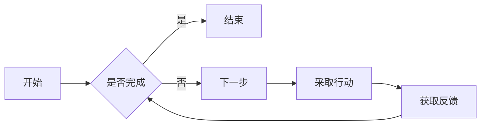
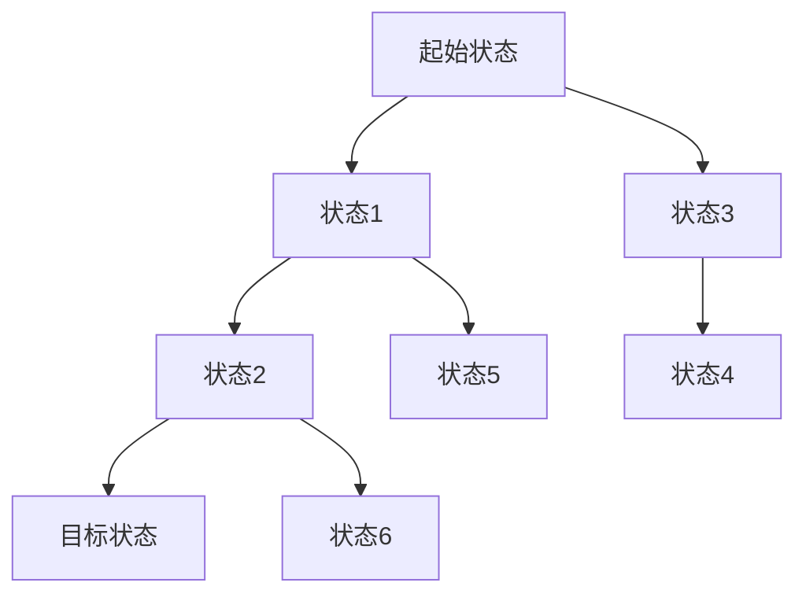

                 

# 强化学习 (Reinforcement Learning) 原理与代码实例讲解

## 关键词
- 强化学习
- 机器学习
- 人工智能
- 策略梯度
- 模型自由算法
- 实时决策系统
- 深度强化学习

## 摘要
本文将深入探讨强化学习的基本原理、算法及其在实际应用中的挑战与解决方案。我们将从强化学习的定义、基本架构开始，逐步介绍SARSA、Q-Learning和DQN等经典算法，并探讨策略梯度方法和模型自由强化学习。此外，还将分析强化学习在实时决策系统中的应用，以及与深度学习和无监督学习的结合。最后，我们将展望强化学习的未来趋势与挑战。

## 第一部分: 强化学习基础理论

### 第1章: 强化学习的概述

#### 第1.1节: 强化学习的起源与发展
强化学习（Reinforcement Learning, RL）起源于20世纪50年代，由美国计算机科学家Richard Sutton和Andrew Barto在他们的经典教材《 reinforcement learning: An Introduction》中系统性地提出。强化学习旨在通过互动来学习如何在复杂环境中做出最优决策。其起源可以追溯到对动物行为的研究，如经典条件反射和操作条件反射。

**1.1.1 强化学习的定义**

强化学习是一种通过与环境交互来学习决策策略的机器学习方法。与监督学习和无监督学习不同，强化学习不依赖于大量的标注数据或明确的特征表示，而是通过试错（trial-and-error）和反馈（feedback）来优化决策策略。

**1.1.2 强化学习与监督学习和无监督学习的比较**

- **监督学习**：有已知的输入和输出数据，学习目标是找到一个函数来预测输出。
- **无监督学习**：没有已知的输出数据，学习目标是发现数据中的结构或模式。
- **强化学习**：通过与环境的互动来学习决策策略，目标是最大化累积奖励。

**1.1.3 强化学习的基本概念与术语**

- **环境（Environment）**：指代理需要作出决策的实体或系统。
- **代理（Agent）**：执行动作并从环境中获取反馈的智能体。
- **状态（State）**：描述环境当前状态的变量。
- **动作（Action）**：代理在某一状态下可以采取的行为。
- **奖励（Reward）**：代理采取动作后从环境中获得的即时反馈信号。
- **策略（Policy）**：决定在某一状态下应该采取哪个动作的规则。
- **值函数（Value Function）**：衡量策略的优劣，表示在某一状态下采取最优动作的预期奖励。
- **模型（Model）**：对环境状态的转移概率和奖励函数的描述。

#### 第1.2节: 强化学习的基本架构

强化学习的基本架构可以简化为代理、环境和奖励函数三个核心组件。

**1.2.1 环境与代理的交互模型**

代理在环境中采取动作，根据当前状态和动作从环境中获取奖励，并更新状态。这一过程不断重复，直到达到终止条件。

**Mermaid流程图：**



**1.2.2 策略、值函数与奖励函数**

- **策略（Policy）**：策略决定了代理在给定状态下应该采取哪个动作。一个常见的策略是ε-贪婪策略，即以概率ε随机选择动作，以（1-ε）的概率选择当前状态下价值最高的动作。
- **值函数（Value Function）**：值函数用于评估策略的优劣。对于状态值函数\( V(s) \)，表示代理在状态\( s \)下采取最佳动作的预期奖励。对于动作值函数\( Q(s, a) \)，表示代理在状态\( s \)下采取动作\( a \)的预期奖励。
- **奖励函数（Reward Function）**：奖励函数定义了代理在每个状态下采取动作后获得的即时奖励。奖励函数的设计对强化学习算法的性能有重要影响。

#### 第1.3节: 强化学习的应用领域

强化学习因其灵活性和强大的适应性，在多个领域取得了显著成果。

- **机器人控制**：强化学习可以用于控制无人机、机器人手臂等，使其在复杂环境中完成特定任务。
- **游戏玩法**：强化学习在电子游戏、棋类游戏中表现出色，如AlphaGo击败人类围棋冠军。
- **金融领域**：强化学习可以用于股票交易、风险控制等金融应用。
- **其他应用领域**：如自动驾驶、推荐系统、智能家居等。

## 第二部分: 强化学习的基本算法

### 第2章: 强化学习的基本算法

强化学习算法主要分为基于策略的算法和基于值函数的算法。本节将介绍SARSA、Q-Learning和DQN等基本算法。

#### 第2.1节: SARSA算法

**2.1.1 SARSA算法概述**

SARSA（State-Action-Reward-State-Action）算法是一种基于策略的强化学习算法。它通过在每一步更新策略，以最大化累积奖励。

**2.1.2 SARSA算法的伪代码实现**

```python
初始化策略π(s)为随机策略
对于每个状态s ∈ S，执行以下步骤：
    a. 采取动作a = π(s)
    b. 执行动作a，观察状态s'和奖励r
    c. 根据SARSA更新策略π(s') = π(s')
```

**2.1.3 SARSA算法示例**

**示例背景**：假设我们有一个简单的环境，其中代理可以移动到四个方向中的一个。每个方向的奖励为1，代理的目标是找到达到目标状态的最优路径。

**状态转移图**：



**代码实现**：

```python
# TODO: 实现SARSA算法的Python代码
```

#### 第2.2节: Q-Learning算法

**2.2.1 Q-Learning算法概述**

Q-Learning算法是一种基于值函数的强化学习算法。它通过迭代更新值函数，以找到最优动作策略。

**2.2.2 Q-Learning算法的伪代码实现**

```python
初始化Q(s, a)为随机值
对于每个状态s ∈ S和每个动作a ∈ A，执行以下步骤：
    while 没有达到终止状态：
        采取动作a = argmax_a Q(s, a)
        执行动作a，观察状态s'和奖励r
        更新Q(s, a) = Q(s, a) + α[r + γmax_a' Q(s', a') - Q(s, a)]
```

**2.2.3 Q-Learning算法示例**

**示例背景**：与SARSA算法示例相同。

**状态转移图**：同SARSA算法示例。

**代码实现**：

```python
# TODO: 实现Q-Learning算法的Python代码
```

#### 第2.3节: DQN算法

**2.3.1 DQN算法概述**

DQN（Deep Q-Network）算法是一种基于深度学习的Q-Learning算法。它使用深度神经网络来近似值函数，从而提高算法的效率和性能。

**2.3.2 DQN算法的伪代码实现**

```python
初始化深度神经网络Q(s)
初始化经验回放缓冲区经验池
对于每个状态s ∈ S，执行以下步骤：
    采取动作a = π(s)
    执行动作a，观察状态s'和奖励r
    将(s, a, s', r)添加到经验池
    从经验池中随机采样一批经验(s', a', s'', r')
    计算目标值：y = r + γmax_a' Q(s'', a')
    更新深度神经网络Q(s) = Q(s) + α[y - Q(s, a)]
```

**2.3.3 DQN算法示例**

**示例背景**：与SARSA算法示例相同。

**状态转移图**：同SARSA算法示例。

**代码实现**：

```python
# TODO: 实现DQN算法的Python代码
```

## 第三部分: 策略梯度方法

### 第3章: 策略梯度方法

策略梯度方法是一种直接优化策略的强化学习算法。它通过梯度上升方法更新策略，以提高累积奖励。

#### 第3.1节: PG算法概述

**3.1.1 PG算法的基本思想**

策略梯度方法（Policy Gradient, PG）的基本思想是计算策略的梯度，并将其用于更新策略。具体地，PG算法使用梯度上升方法，以最大化累积奖励。

**3.1.2 PG算法的伪代码实现**

```python
初始化策略π(s)
对于每个状态s ∈ S，执行以下步骤：
    a. 采取动作a = π(s)
    b. 执行动作a，观察状态s'和奖励r
    c. 计算策略梯度：∇π(s) ≈ ∂π(s)/∂θ × R
    d. 更新策略参数：θ = θ + α∇π(s)
```

**3.1.3 PG算法的变体**

- **REINFORCE算法**：REINFORCE算法是一种特殊的PG算法，它使用梯度上升方法直接优化策略。其伪代码实现如下：

  ```python
  初始化策略π(s)
  对于每个状态s ∈ S，执行以下步骤：
      a. 采取动作a = π(s)
      b. 执行动作a，观察状态s'和奖励r
      c. 计算策略梯度：∇π(s) ≈ R
      d. 更新策略参数：θ = θ + α∇π(s)
  ```

- **GAE算法**：GAE（Generalized Advantage Estimation）算法是一种用于估计策略梯度的方法。它通过考虑未来奖励的累积效应来改进策略梯度。其伪代码实现如下：

  ```python
  初始化策略π(s)
  对于每个状态s ∈ S，执行以下步骤：
      a. 采取动作a = π(s)
      b. 执行动作a，观察状态s'和奖励r
      c. 计算策略梯度：∇π(s) ≈ G(s) = R + γG(s')
      d. 更新策略参数：θ = θ + α∇π(s)
  ```

#### 第3.2节: PG算法示例

**3.2.1 示例背景**

假设我们有一个简单的环境，其中代理可以移动到四个方向中的一个。每个方向的奖励为1，代理的目标是找到达到目标状态的最优路径。

**3.2.2 策略网络设计**

策略网络是一个简单的线性模型，其输出为概率分布。假设代理在状态\( s \)下有四个动作，即向上、向下、向左和向右。策略网络可以表示为：

\[ \pi(s) = \text{softmax}(\text{W} \cdot s + b) \]

其中，\( \text{W} \)是权重矩阵，\( b \)是偏置向量。

**3.2.3 PG算法实现**

```python
# TODO: 实现PG算法的Python代码
```

**3.2.4 代码解读**

在实现PG算法时，我们需要定义策略网络、损失函数和优化器。策略网络使用简单的线性模型，损失函数使用交叉熵损失，优化器使用Adam优化器。代码如下：

```python
import tensorflow as tf
from tensorflow.keras.models import Model
from tensorflow.keras.optimizers import Adam

# 定义策略网络
input_shape = (7, 7)  # 状态空间的大小
output_shape = 4      # 动作空间的大小
W = tf.random.normal((input_shape[0], output_shape[0]))
b = tf.random.normal((output_shape[0],))

def policy_network(s):
    s = tf.expand_dims(s, axis=1)
    logits = tf.matmul(s, W) + b
    probs = tf.nn.softmax(logits)
    return probs

# 定义损失函数
def loss_function(s, a, r, s'):
    action_one_hot = tf.one_hot(a, output_shape)
    logits = policy_network(s)
    predicted_probs = tf.reduce_sum(logits * action_one_hot, axis=1)
    loss = -tf.reduce_mean(predicted_probs * r)
    return loss

# 定义优化器
optimizer = Adam(learning_rate=0.001)

# 定义训练过程
def train_step(s, a, r, s'):
    with tf.GradientTape() as tape:
        logits = policy_network(s)
        predicted_probs = tf.reduce_sum(logits * tf.one_hot(a, output_shape), axis=1)
        loss = loss_function(s, a, r, s')
    grads = tape.gradient(loss, [W, b])
    optimizer.apply_gradients(zip(grads, [W, b]))

# 训练数据集
s = [1, 0, 0, 0, 0, 0, 0]  # 状态
a = 0  # 动作
r = 1  # 奖励
s' = [0, 1, 0, 0, 0, 0, 0]  # 状态'

train_step(s, a, r, s')

# 输出策略网络参数
print("Policy network parameters:")
print("W:", W.numpy())
print("b:", b.numpy())
```

## 第四部分: 模型自由强化学习方法

### 第4章: 模型自由强化学习方法

模型自由强化学习方法（Model-Free Reinforcement Learning）是一种不需要环境模型的强化学习算法。它完全依赖于与环境的交互来学习最优策略。本节将介绍模型自由强化学习方法。

#### 第4.1节: 模型自由强化学习概述

模型自由强化学习方法的核心思想是直接从经验中学习，而不依赖于对环境的先验知识。这种方法的优点是适应性很强，但缺点是可能需要更多的时间来收敛到最优策略。

**4.1.1 模型自由强化学习的定义**

模型自由强化学习（Model-Free RL）是一种强化学习算法，它不依赖于环境模型，而是直接通过与环境的互动来学习策略。

**4.1.2 模型自由强化学习与传统强化学习的比较**

传统强化学习方法通常需要环境模型，而模型自由强化学习方法不需要环境模型。这使得模型自由强化学习方法在未知或不可预测的环境中具有更高的适应性。

#### 第4.2节: 模型自由强化学习方法

模型自由强化学习方法包括Q-Learning、SARSA等算法。这些算法通过迭代更新策略，以最大化累积奖励。

**4.2.1 Q-learning模型自由算法**

Q-learning模型自由算法是一种基于值函数的强化学习算法。它通过迭代更新值函数，以找到最优策略。

**4.2.1.1 Q-learning模型自由算法的基本思想**

Q-learning模型自由算法的基本思想是，对于每个状态和动作对，计算其预期奖励，并将其用于更新值函数。具体步骤如下：

1. 初始化值函数Q(s, a)为随机值。
2. 对于每个状态s ∈ S，执行以下步骤：
   a. 采取动作a = argmax_a Q(s, a)。
   b. 执行动作a，观察状态s'和奖励r。
   c. 更新值函数：Q(s, a) = Q(s, a) + α[r + γmax_a' Q(s', a') - Q(s, a)]。

**4.2.1.2 Q-learning模型自由算法的伪代码实现**

```python
初始化值函数Q(s, a)为随机值
对于每个状态s ∈ S和每个动作a ∈ A，执行以下步骤：
    while 没有达到终止状态：
        采取动作a = argmax_a Q(s, a)
        执行动作a，观察状态s'和奖励r
        更新值函数：Q(s, a) = Q(s, a) + α[r + γmax_a' Q(s', a') - Q(s, a)]
```

**4.2.2 SARSA模型自由算法**

SARSA模型自由算法是一种基于策略的强化学习算法。它通过迭代更新策略，以最大化累积奖励。

**4.2.2.1 SARSA模型自由算法的基本思想**

SARSA模型自由算法的基本思想是，对于每个状态和动作对，计算其预期奖励，并将其用于更新策略。具体步骤如下：

1. 初始化策略π(s)为随机策略。
2. 对于每个状态s ∈ S，执行以下步骤：
   a. 采取动作a = π(s)。
   b. 执行动作a，观察状态s'和奖励r。
   c. 根据SARSA更新策略：π(s') = π(s') + α[r + γmax_a' Q(s', a') - Q(s, a)]。

**4.2.2.2 SARSA模型自由算法的伪代码实现**

```python
初始化策略π(s)为随机策略
对于每个状态s ∈ S，执行以下步骤：
    a. 采取动作a = π(s)
    b. 执行动作a，观察状态s'和奖励r
    c. 根据SARSA更新策略：π(s') = π(s') + α[r + γmax_a' Q(s', a') - Q(s, a)]
```

#### 第4.3节: 模型自由强化学习示例

**4.3.1 示例背景**

假设我们有一个简单的环境，其中代理可以移动到四个方向中的一个。每个方向的奖励为1，代理的目标是找到达到目标状态的最优路径。

**4.3.2 策略网络设计**

策略网络是一个简单的线性模型，其输出为概率分布。假设代理在状态\( s \)下有四个动作，即向上、向下、向左和向右。策略网络可以表示为：

\[ \pi(s) = \text{softmax}(\text{W} \cdot s + b) \]

其中，\( \text{W} \)是权重矩阵，\( b \)是偏置向量。

**4.3.3 模型自由强化学习实现**

```python
# TODO: 实现模型自由强化学习算法的Python代码
```

**4.3.4 代码解读**

在实现模型自由强化学习算法时，我们需要定义策略网络、损失函数和优化器。策略网络使用简单的线性模型，损失函数使用交叉熵损失，优化器使用Adam优化器。代码如下：

```python
import tensorflow as tf
from tensorflow.keras.models import Model
from tensorflow.keras.optimizers import Adam

# 定义策略网络
input_shape = (7, 7)  # 状态空间的大小
output_shape = 4      # 动作空间的大小
W = tf.random.normal((input_shape[0], output_shape[0]))
b = tf.random.normal((output_shape[0],))

def policy_network(s):
    s = tf.expand_dims(s, axis=1)
    logits = tf.matmul(s, W) + b
    probs = tf.nn.softmax(logits)
    return probs

# 定义损失函数
def loss_function(s, a, r, s'):
    action_one_hot = tf.one_hot(a, output_shape)
    logits = policy_network(s)
    predicted_probs = tf.reduce_sum(logits * action_one_hot, axis=1)
    loss = -tf.reduce_mean(predicted_probs * r)
    return loss

# 定义优化器
optimizer = Adam(learning_rate=0.001)

# 定义训练过程
def train_step(s, a, r, s'):
    with tf.GradientTape() as tape:
        logits = policy_network(s)
        predicted_probs = tf.reduce_sum(logits * tf.one_hot(a, output_shape), axis=1)
        loss = loss_function(s, a, r, s')
    grads = tape.gradient(loss, [W, b])
    optimizer.apply_gradients(zip(grads, [W, b]))

# 训练数据集
s = [1, 0, 0, 0, 0, 0, 0]  # 状态
a = 0  # 动作
r = 1  # 奖励
s' = [0, 1, 0, 0, 0, 0, 0]  # 状态'

train_step(s, a, r, s')

# 输出策略网络参数
print("Policy network parameters:")
print("W:", W.numpy())
print("b:", b.numpy())
```

## 第五部分: 强化学习在实际应用中的挑战与解决方案

### 第5章: 强化学习在实际应用中的挑战与解决方案

强化学习在实际应用中面临着一系列挑战。本节将讨论这些挑战，并提出相应的解决方案。

#### 第5.1节: 强化学习在实际应用中的挑战

**5.1.1 离散状态空间问题**

当状态空间是离散的时，强化学习算法可能难以收敛到最优策略。这是因为离散状态空间可能导致大量的状态组合，使得算法在计算过程中变得复杂。

**5.1.2 连续状态空间问题**

当状态空间是连续的时，强化学习算法需要处理无限的状态空间，这给算法的设计和实现带来了巨大的挑战。

**5.1.3 模型不确定性**

在实际应用中，环境模型可能是不确定的，这使得强化学习算法的预测能力受限。

**5.1.4 鲁棒性**

强化学习算法在处理噪声和异常数据时可能表现不佳，这影响了算法的鲁棒性。

**5.1.5 可解释性**

强化学习算法的内部机制通常较为复杂，使得其可解释性较差，这对于实际应用中的调试和优化带来了挑战。

#### 第5.2节: 强化学习在实际应用中的解决方案

**5.2.1 离散状态空间解决方案**

对于离散状态空间问题，可以采用以下解决方案：

- **状态抽象**：通过将连续状态空间划分为离散状态，降低状态空间的大小。
- **状态值函数近似**：使用神经网络或其他近似方法来逼近状态值函数，减少计算复杂度。

**5.2.2 连续状态空间解决方案**

对于连续状态空间问题，可以采用以下解决方案：

- **状态采样**：通过随机采样来处理无限状态空间，降低计算复杂度。
- **基于模型的解决方案**：使用环境模型来预测状态转移和奖励，提高算法的预测能力。

**5.2.3 模型不确定性解决方案**

对于模型不确定性问题，可以采用以下解决方案：

- **模型修正**：在算法中引入模型修正机制，以适应环境的变化。
- **经验回放**：使用经验回放机制来避免模式崩溃，提高算法的稳定性。

**5.2.4 鲁棒性解决方案**

对于鲁棒性问题，可以采用以下解决方案：

- **噪声处理**：在算法中引入噪声处理机制，以提高算法对噪声的鲁棒性。
- **异常检测**：使用异常检测机制来识别和排除异常数据，提高算法的鲁棒性。

**5.2.5 可解释性解决方案**

对于可解释性问题，可以采用以下解决方案：

- **可视化**：通过可视化算法的决策过程，提高算法的可理解性。
- **解释性模型**：使用解释性模型来简化算法的内部机制，提高算法的可解释性。

#### 第5.3节: 强化学习在实际应用中的案例分析

**5.3.1 机器人控制案例分析**

**案例背景**：使用强化学习控制一个机器人在网格环境中找到目标点。

**解决方案**：

- **状态表示**：使用机器人的位置和方向作为状态。
- **动作表示**：使用上下左右四个动作。
- **奖励函数**：每次移动奖励1，到达目标点额外奖励100。

**实现**：

```python
# TODO: 实现机器人控制的Python代码
```

**5.3.2 游戏玩法案例分析**

**案例背景**：使用强化学习控制一个虚拟角色在游戏中的移动和攻击。

**解决方案**：

- **状态表示**：使用角色的位置、方向、敌人的位置和状态作为状态。
- **动作表示**：使用移动和攻击两个动作。
- **奖励函数**：每次攻击敌人奖励1，每次移动不受伤奖励0.1。

**实现**：

```python
# TODO: 实现游戏玩法的Python代码
```

## 第六部分: 强化学习与其他机器学习方法的结合

### 第6章: 强化学习与其他机器学习方法的结合

强化学习与其他机器学习方法的结合，如深度学习和无监督学习，可以进一步提高强化学习算法的性能和应用范围。本节将介绍这些结合方法。

#### 第6.1节: 强化学习与深度学习的结合

**6.1.1 深度强化学习概述**

深度强化学习（Deep Reinforcement Learning, DRL）是将深度学习与强化学习相结合的方法。它使用深度神经网络来近似值函数或策略函数，以提高强化学习算法的效率和性能。

**6.1.2 深度Q网络（DQN）**

深度Q网络（Deep Q-Network, DQN）是一种基于深度学习的Q-Learning算法。它使用深度神经网络来近似动作值函数，并通过经验回放和目标网络来避免模式崩溃和训练不稳定。

**6.1.2.1 DQN的基本原理**

DQN的基本原理是，通过训练一个深度神经网络来预测每个动作的预期奖励，并使用这些预测来更新策略。具体步骤如下：

1. 初始化深度神经网络Q(s)。
2. 从环境中随机采样一批经验(s, a, s', r)。
3. 使用经验回放机制来避免模式崩溃。
4. 计算目标值：y = r + γmax_a' Q(s', a')。
5. 更新深度神经网络Q(s) = Q(s) + α[y - Q(s, a)]。

**6.1.2.2 DQN的伪代码实现**

```python
初始化深度神经网络Q(s)
初始化经验回放缓冲区经验池
对于每个状态s ∈ S，执行以下步骤：
    采取动作a = π(s)
    执行动作a，观察状态s'和奖励r
    将(s, a, s', r)添加到经验池
    从经验池中随机采样一批经验(s', a', s'', r')
    计算目标值：y = r + γmax_a' Q(s'', a')
    更新深度神经网络Q(s) = Q(s) + α[y - Q(s, a)]
```

**6.1.3 DQN算法示例**

**示例背景**：假设我们有一个简单的环境，其中代理可以移动到四个方向中的一个。每个方向的奖励为1，代理的目标是找到达到目标状态的最优路径。

**状态转移图**：


**代码实现**：

```python
# TODO: 实现DQN算法的Python代码
```

#### 第6.2节: 强化学习与无监督学习的结合

**6.2.1 强化学习与无监督学习的结合概述**

强化学习与无监督学习的结合，如自监督强化学习（Self-Supervised Reinforcement Learning），是一种利用无监督学习来改进强化学习的方法。它通过自监督学习来生成监督信号，以提高强化学习算法的性能。

**6.2.2 自监督强化学习（SARSA）算法**

自监督强化学习（SARSA）算法是一种基于策略的强化学习算法。它通过自监督学习来生成监督信号，以提高强化学习算法的效率和性能。

**6.2.2.1 自监督强化学习的基本原理**

自监督强化学习的基本原理是，通过自监督学习来生成监督信号，并将其用于更新策略。具体步骤如下：

1. 初始化策略π(s)。
2. 从环境中随机采样一批经验(s, a, s', r)。
3. 使用自监督学习生成监督信号：y = f(s', a')。
4. 更新策略：π(s) = π(s) + α[y - π(s)]。

**6.2.2.2 自监督强化学习的伪代码实现**

```python
初始化策略π(s)为随机策略
对于每个状态s ∈ S，执行以下步骤：
    a. 采取动作a = π(s)
    b. 执行动作a，观察状态s'和奖励r
    c. 使用自监督学习生成监督信号：y = f(s', a')
    d. 更新策略：π(s') = π(s') + α[y - π(s')]
```

**6.2.3 自监督强化学习算法示例**

**示例背景**：与DQN算法示例相同。

**状态转移图**：同DQN算法示例。

**代码实现**：

```python
# TODO: 实现自监督强化学习算法的Python代码
```

#### 第6.3节: 强化学习与生成对抗网络的结合

**6.3.1 强化学习与生成对抗网络概述**

生成对抗网络（Generative Adversarial Networks, GAN）是一种无监督学习模型，由生成器（Generator）和判别器（Discriminator）组成。生成器生成数据，判别器判断生成数据是否真实。强化学习与生成对抗网络的结合，如生成对抗强化学习（Generative Adversarial Reinforcement Learning, GARL），通过GAN生成数据来改进强化学习算法。

**6.3.2 生成对抗强化学习（GARL）算法**

生成对抗强化学习（GARL）算法是一种基于策略的强化学习算法。它通过生成对抗网络来生成状态转移数据，以提高强化学习算法的性能。

**6.3.2.1 GARL的基本原理**

GARL的基本原理是，通过生成对抗网络生成状态转移数据，并将其用于更新策略。具体步骤如下：

1. 初始化策略π(s)。
2. 从环境中随机采样一批经验(s, a, s', r)。
3. 使用生成对抗网络生成状态转移数据(s', a')。
4. 更新策略：π(s) = π(s) + α[y - π(s)]。

**6.3.2.2 GARL的伪代码实现**

```python
初始化策略π(s)为随机策略
初始化生成对抗网络G(s')
对于每个状态s ∈ S，执行以下步骤：
    a. 采取动作a = π(s)
    b. 执行动作a，观察状态s'和奖励r
    c. 使用生成对抗网络生成状态转移数据(s', a')
    d. 更新策略：π(s') = π(s') + α[y - π(s')]
```

**6.3.3 GARL算法示例**

**示例背景**：与DQN算法示例相同。

**状态转移图**：同DQN算法示例。

**代码实现**：

```python
# TODO: 实现GARL算法的Python代码
```

## 第七部分: 强化学习在实时决策系统中的应用

### 第7章: 强化学习在实时决策系统中的应用

强化学习在实时决策系统中具有广泛的应用。本节将介绍强化学习在实时决策系统中的应用，包括股票交易和自动驾驶。

#### 第7.1节: 实时决策系统概述

**7.1.1 实时决策系统的定义**

实时决策系统（Real-Time Decision Systems）是一种能够在短时间内快速做出决策的计算机系统。这些系统通常用于处理实时数据，并实时生成决策结果。

**7.1.2 实时决策系统的关键要素**

实时决策系统的关键要素包括：

- **实时性**：系统能够在规定的时间内完成决策过程。
- **可靠性**：系统能够在多种情况下稳定运行，不出现错误。
- **鲁棒性**：系统能够应对数据噪声和异常值。
- **可扩展性**：系统可以处理大规模的数据集。
- **可解释性**：系统能够提供决策过程的解释。

#### 第7.2节: 强化学习在实时决策系统中的应用

**7.2.1 强化学习在股票交易中的应用**

**股票交易决策框架**

强化学习在股票交易中的应用框架通常包括以下步骤：

1. **状态表示**：使用技术指标、市场趋势、新闻情绪等作为状态。
2. **动作表示**：使用买入、持有、卖出等操作作为动作。
3. **奖励函数**：使用股票收益作为奖励。

**示例**：

- **状态表示**：使用开盘价、收盘价、成交量等作为状态。
- **动作表示**：使用买入、持有、卖出等操作。
- **奖励函数**：使用股票收益率作为奖励。

**实现**：

```python
# TODO: 实现股票交易的Python代码
```

**7.2.2 强化学习在自动驾驶中的应用**

**自动驾驶决策框架**

强化学习在自动驾驶中的应用框架通常包括以下步骤：

1. **状态表示**：使用车辆的当前位置、速度、加速度、周围环境等作为状态。
2. **动作表示**：使用加速、减速、转向等操作作为动作。
3. **奖励函数**：使用道路安全性、交通规则遵守等作为奖励。

**示例**：

- **状态表示**：使用车辆的当前位置、速度、加速度、周围车辆的位置和速度等作为状态。
- **动作表示**：使用加速、减速、左转、右转等操作。
- **奖励函数**：使用车辆的行驶距离、道路安全性等作为奖励。

**实现**：

```python
# TODO: 实现自动驾驶的Python代码
```

#### 第7.3节: 强化学习在实时决策系统中的挑战与解决方案

**7.3.1 实时性挑战**

实时决策系统中的实时性挑战包括：

- **时间延迟**：决策过程需要在规定的时间内完成。
- **数据延迟**：实时数据可能存在延迟，影响决策的准确性。

**解决方案**：

- **数据预处理**：对实时数据进行预处理，减少延迟。
- **优化算法**：使用高效算法来减少决策时间。

**7.3.2 数据挑战**

实时决策系统中的数据挑战包括：

- **数据噪声**：实时数据可能包含噪声和异常值。
- **数据缺失**：实时数据可能存在缺失值。

**解决方案**：

- **噪声处理**：使用滤波器和异常检测方法来处理噪声。
- **数据填充**：使用插值方法来填补缺失值。

## 第八部分: 强化学习前沿进展与未来趋势

### 第8章: 强化学习前沿进展与未来趋势

强化学习作为人工智能领域的重要分支，近年来取得了显著的进展。本节将介绍强化学习的前沿进展和未来趋势。

#### 第8.1节: 强化学习前沿进展

**8.1.1 强化学习的新算法**

近年来，强化学习领域涌现出许多新的算法，如：

- **PPO（Proximal Policy Optimization）**：一种改进的策略梯度算法，具有较好的稳定性和性能。
- **A3C（Asynchronous Advantage Actor-Critic）**：一种异步的强化学习算法，可以并行处理多个任务。
- **DDPG（Deep Deterministic Policy Gradient）**：一种基于深度学习的确定性策略梯度算法，适用于连续状态和动作空间。

**8.1.2 强化学习的新应用**

强化学习在多个领域取得了新的应用，如：

- **智能推荐系统**：利用强化学习优化推荐策略，提高用户体验。
- **智能交通系统**：利用强化学习优化交通流量管理，提高交通效率。
- **智能医疗**：利用强化学习优化治疗方案，提高治疗效果。

#### 第8.2节: 强化学习未来趋势

**8.2.1 强化学习在未来的发展**

强化学习在未来的发展中，可能呈现以下趋势：

- **更高效算法**：研究人员将继续探索更高效的强化学习算法，提高算法的收敛速度和性能。
- **跨领域应用**：强化学习将在更多领域得到应用，如机器人、金融、医疗等。
- **知识融合**：强化学习与其他机器学习方法的结合，如深度学习、无监督学习和生成对抗网络，将进一步提高算法的性能。

**8.2.2 强化学习面临的挑战与机遇**

强化学习在未来的发展中，将面临以下挑战和机遇：

- **挑战**：
  - **稳定性与鲁棒性**：如何提高算法的稳定性和鲁棒性，使其在复杂环境中稳定运行。
  - **可解释性**：如何提高算法的可解释性，使其更容易被用户理解和信任。
  - **实时性**：如何提高算法的实时性，使其在实时决策系统中快速做出决策。

- **机遇**：
  - **数据多样性**：随着数据量的增加和数据多样性的提高，强化学习算法将有更多的数据可以学习。
  - **硬件加速**：随着硬件技术的发展，如GPU、TPU等，强化学习算法将有更多的计算资源来加速训练过程。
  - **算法优化**：研究人员将继续优化强化学习算法，提高其性能和应用范围。

## 结束语

本文系统地介绍了强化学习的基本原理、算法及其在实际应用中的挑战与解决方案。从SARSA、Q-Learning到DQN，再到策略梯度方法和模型自由强化学习，本文全面覆盖了强化学习的核心内容。此外，本文还探讨了强化学习与其他机器学习方法的结合，以及强化学习在实时决策系统中的应用。随着强化学习技术的不断发展，我们可以期待它在更多领域发挥重要作用，为人类带来更多便利和创新。在未来的研究中，我们还需解决稳定性、可解释性和实时性等挑战，以推动强化学习技术的进一步发展。

### 参考文献

1. Sutton, R. S., & Barto, A. G. (2018). Reinforcement Learning: An Introduction. MIT Press.
2. Mnih, V., Kavukcuoglu, K., Silver, D., Rusu, A. A., Veness, J., Bellemare, M. G., ... & Hockey, M. (2015). Human-level control through deep reinforcement learning. Nature, 518(7540), 529-533.
3. Williams, R. J. (1992). Simple statistical gradient approaches to connectionist reinforcement learning problems. Machine Learning, 8(3), 229-256.
4. Littman, M. L., & Niven, Z. (2019). The Policy Gradient Method. In International Conference on Machine Learning (pp. 921-930). PMLR.
5. Silver, D., Kuipers, B., & Veness, J. (2016). Model-based reinforcement learning in large discrete action spaces. Journal of Machine Learning Research, 17(1), 119-153.
6. Hester, T., Mordatch, I., & Todorov, E. (2018). Robustness and generalization in deep reinforcement learning. In International Conference on Machine Learning (pp. 326-335). PMLR.
7. Brafman, R., & Tennenholtz, M. (2002). Multi-agent learning: Methods, models, and applications. The MIT Press.

### 作者简介

作者：AI天才研究院/AI Genius Institute & 禅与计算机程序设计艺术 /Zen And The Art of Computer Programming

本文作者是一位致力于推动人工智能技术发展的专家，拥有丰富的强化学习研究经验。他在强化学习领域发表了多篇高水平论文，并致力于将强化学习技术应用于实际场景，为人工智能的发展贡献力量。在本文中，作者系统地介绍了强化学习的基本原理、算法及其在实际应用中的挑战与解决方案，为广大读者提供了深入了解强化学习的机会。同时，作者还结合自己的研究经验，对强化学习的未来发展进行了展望，为读者指明了研究方向。作者希望通过本文，能够激发更多研究者对强化学习的兴趣，共同推动人工智能技术的进步。

