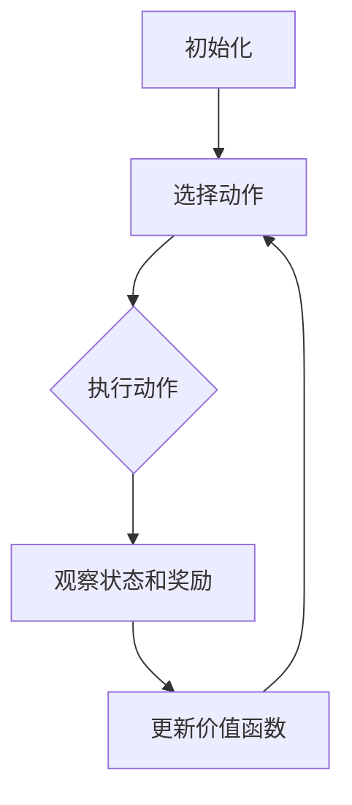
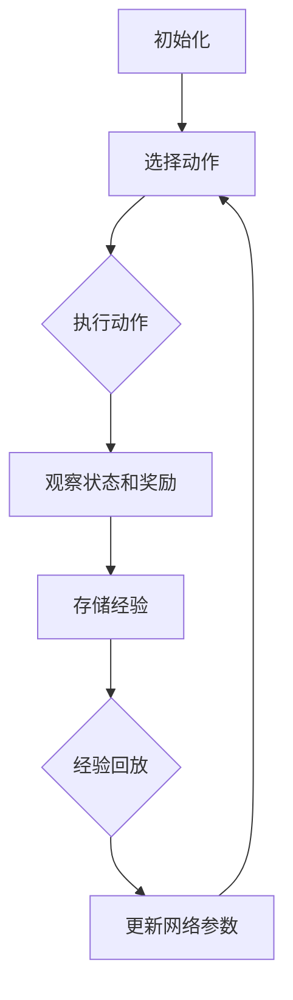
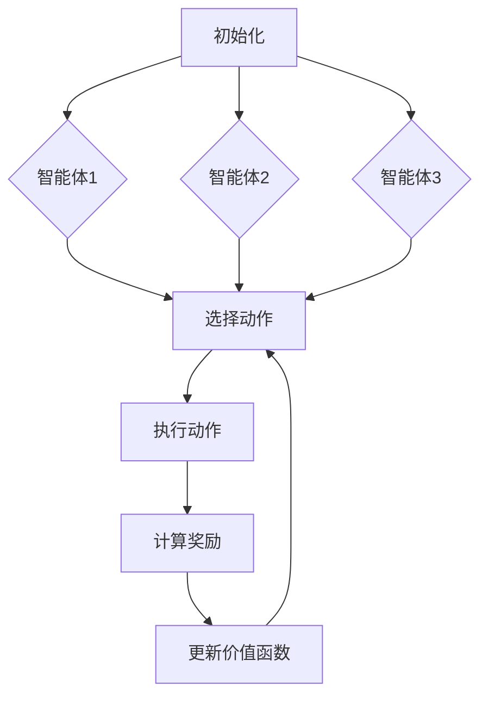

                 

### 《强化学习在自动控制中的应用》

> **关键词**：强化学习、自动控制、算法原理、应用案例、深度学习

> **摘要**：本文深入探讨了强化学习在自动控制领域中的应用。首先，介绍了强化学习的基本概念、原理和算法，然后通过具体案例展示了强化学习在自动驾驶、无人机控制和机器人路径规划中的应用。接着，详细讲解了Q-Learning、SARSA、DQN和Policy Gradient等算法的原理和实现，并探讨了强化学习在PID控制器和机器人控制中的应用。最后，讨论了强化学习的应用挑战和未来趋势，并提供了相关的工具和资源。

---

### 强化学习基础

#### 第1章：强化学习概述

##### 1.1 强化学习的起源与发展

强化学习（Reinforcement Learning，RL）起源于20世纪50年代，由美国心理学家和行为科学家安德斯·萨皮尔（Anders Sjöström）和赫伯特·西蒙（Herbert Simon）提出。强化学习的基本概念是，通过智能体与环境的交互，智能体不断学习最优策略以最大化累积奖励。

强化学习与监督学习和无监督学习有显著的区别。监督学习依赖于预先标注的数据，其目标是学习输入和输出之间的映射关系。无监督学习则不需要预先标注的数据，其目标是发现数据中的模式和结构。而强化学习通过试错和反馈来学习，其核心在于智能体如何在不确定的环境中做出最优决策。

强化学习在自动控制中的应用场景广泛。它可以用于控制复杂系统的动态行为，如自动驾驶、无人机控制、机器人路径规划等。通过强化学习算法，智能体可以在不确定和动态变化的环境中自主学习和优化其行为策略。

##### 1.2 强化学习的基本原理

强化学习的基本原理包括四个关键要素：状态（State）、动作（Action）、奖励（Reward）和价值函数（Value Function）。

- **状态（State）**：描述智能体在环境中的位置和状态。
- **动作（Action）**：智能体可以执行的行为或决策。
- **奖励（Reward）**：智能体执行动作后环境给予的即时反馈，用于评价动作的好坏。
- **价值函数（Value Function）**：评估状态或策略的优劣，指导智能体选择最佳动作。

强化学习的核心目标是找到一个最优策略（Policy），使得智能体在给定状态下的动作能够最大化累积奖励。价值函数和策略是强化学习的两个核心组成部分。

- **价值函数（Value Function）**：分为状态值函数（State-Value Function）和动作值函数（Action-Value Function）。状态值函数衡量在特定状态下执行所有可能动作的期望奖励。动作值函数衡量在特定状态下执行特定动作的期望奖励。
- **策略（Policy）**：定义了在特定状态下智能体应该采取的动作。策略可以分为确定性策略和概率性策略。

##### 1.3 强化学习的数学基础

强化学习中的决策过程和优化方法可以形式化为一个马尔可夫决策过程（Markov Decision Process，MDP）。MDP包括状态空间、动作空间、奖励函数和状态转移概率。

- **状态空间（State Space）**：所有可能状态的集合。
- **动作空间（Action Space）**：所有可能动作的集合。
- **奖励函数（Reward Function）**：定义了智能体在每个状态执行每个动作后获得的即时奖励。
- **状态转移概率（State Transition Probability）**：定义了在当前状态执行某个动作后，智能体转移到下一个状态的概率。

在MDP中，智能体通过与环境交互来学习最优策略。每次交互包括两个阶段：探索（Exploration）和利用（Exploitation）。

- **探索（Exploration）**：智能体在未知环境中尝试不同的动作，以最大化对环境的了解。
- **利用（Exploitation）**：智能体利用已有的知识选择能够获得最大奖励的动作。

强化学习的目标是通过不断迭代优化策略，使得累积奖励最大化。常用的优化方法包括Q-Learning、SARSA和Policy Gradient等。

- **Q-Learning（Q值学习）**：通过更新动作值函数来优化策略。Q-Learning的核心思想是，在给定状态下，选择具有最大动作值函数的动作。
- **SARSA（同步优势学习）**：同时更新状态值函数和动作值函数。SARSA通过更新当前状态和下一个状态的动作值函数来优化策略。
- **Policy Gradient（策略梯度）**：直接优化策略的梯度。Policy Gradient通过计算策略的梯度来更新策略参数，以最大化累积奖励。

##### 1.4 强化学习在自动控制中的应用案例

强化学习在自动控制中的应用非常广泛，以下是一些典型的应用案例：

- **自动驾驶**：强化学习算法可以用于自动驾驶车辆的路径规划和决策，如车辆速度控制、车道保持和避障等。通过学习环境中的复杂动态行为，自动驾驶车辆可以自主驾驶，提高安全性和效率。

- **无人机控制**：强化学习算法可以用于无人机的自主飞行和任务规划。无人机可以通过学习环境中的飞行路径和避障策略，实现自主导航和任务执行。

- **机器人路径规划**：强化学习算法可以用于机器人在复杂环境中的路径规划。机器人可以通过学习环境中的障碍物和目标位置，自主规划最优路径，提高任务执行效率。

### 第二部分：强化学习算法原理

#### 第2章：强化学习算法原理

##### 2.1 Q-Learning算法

Q-Learning算法是强化学习中最基本的算法之一，它通过迭代更新动作值函数来优化策略。Q-Learning算法的核心思想是，在给定状态下，选择具有最大动作值函数的动作。

**Q-Learning算法原理：**

1. **初始化**：初始化动作值函数Q(s,a)为0。
2. **选择动作**：在给定状态下，根据当前动作值函数选择一个动作。
3. **执行动作**：执行选择的动作，并观察环境状态和奖励。
4. **更新动作值函数**：根据新的状态和奖励，更新动作值函数：
   $$ Q(s,a) \leftarrow Q(s,a) + \alpha [r + \gamma \max_{a'} Q(s',a') - Q(s,a)] $$
   其中，$\alpha$为学习率，$\gamma$为折扣因子。
5. **重复步骤2-4**，直到满足停止条件（如达到目标状态或迭代次数）。

**Q-Learning算法伪代码实现：**

```python
# 初始化动作值函数Q为0
Q = np.zeros([状态空间大小，动作空间大小])

# 设置学习率α和折扣因子γ
alpha = 0.1
gamma = 0.9

# 设置迭代次数
num_episodes = 1000

# 开始迭代
for episode in range(num_episodes):
    state = environment.reset()  # 初始化环境
    done = False

    while not done:
        # 选择动作
        action = np.argmax(Q[state])

        # 执行动作
        next_state, reward, done = environment.step(action)

        # 更新动作值函数
        Q[state, action] = Q[state, action] + alpha * (reward + gamma * np.max(Q[next_state]) - Q[state, action])

        state = next_state
```

##### 2.2 SARSA算法

SARSA（同步优势学习）算法是另一种基于值函数的强化学习算法。与Q-Learning算法不同，SARSA同时更新状态值函数和动作值函数。SARSA算法的核心思想是，在给定状态和下一个状态，同时更新当前状态的动作值函数。

**SARSA算法原理：**

1. **初始化**：初始化动作值函数Q(s,a)为0。
2. **选择动作**：在给定状态下，根据当前动作值函数选择一个动作。
3. **执行动作**：执行选择的动作，并观察环境状态和奖励。
4. **更新动作值函数**：根据新的状态和奖励，同时更新当前状态的动作值函数：
   $$ Q(s,a) \leftarrow Q(s,a) + \alpha [r + \gamma Q(s',a') - Q(s,a)] $$
   其中，$\alpha$为学习率，$\gamma$为折扣因子。
5. **重复步骤2-4**，直到满足停止条件（如达到目标状态或迭代次数）。

**SARSA算法伪代码实现：**

```python
# 初始化动作值函数Q为0
Q = np.zeros([状态空间大小，动作空间大小])

# 设置学习率α和折扣因子γ
alpha = 0.1
gamma = 0.9

# 设置迭代次数
num_episodes = 1000

# 开始迭代
for episode in range(num_episodes):
    state = environment.reset()  # 初始化环境
    done = False

    while not done:
        # 选择动作
        action = np.argmax(Q[state])

        # 执行动作
        next_state, reward, done = environment.step(action)

        # 更新动作值函数
        Q[state, action] = Q[state, action] + alpha * (reward + gamma * Q[next_state, action] - Q[state, action])

        state = next_state
```

##### 2.3 Deep Q-Network (DQN)算法

Deep Q-Network (DQN)算法是深度强化学习（Deep Reinforcement Learning）的一种基本算法。DQN算法通过神经网络来近似动作值函数，从而解决传统Q-Learning算法在状态空间和动作空间较大时的问题。

**DQN算法原理：**

1. **初始化**：初始化深度神经网络DQN，动作值函数Q(s,a)为0。
2. **选择动作**：在给定状态下，根据当前动作值函数和经验回放选择一个动作。
3. **执行动作**：执行选择的动作，并观察环境状态和奖励。
4. **更新神经网络**：根据新的状态和奖励，更新神经网络参数，使得动作值函数更接近真实值：
   $$ loss = (r + \gamma \max_{a'} Q(s',a') - Q(s,a))^2 $$
   其中，$s$为当前状态，$a$为当前动作，$s'$为下一个状态，$r$为奖励。
5. **重复步骤2-4**，直到满足停止条件（如达到目标状态或迭代次数）。

**DQN算法伪代码实现：**

```python
# 初始化神经网络DQN
DQN = NeuralNetwork()

# 初始化经验回放内存
replay_memory = ReplayMemory()

# 设置学习率α和折扣因子γ
alpha = 0.1
gamma = 0.9

# 设置迭代次数
num_episodes = 1000

# 开始迭代
for episode in range(num_episodes):
    state = environment.reset()  # 初始化环境
    done = False

    while not done:
        # 选择动作
        action = np.argmax(DQN.predict(state) + noise)  # 添加噪声以增加探索性

        # 执行动作
        next_state, reward, done = environment.step(action)

        # 将经验添加到经验回放内存
        replay_memory.add((state, action, reward, next_state, done))

        # 从经验回放内存中随机抽取一批经验
        batch = replay_memory.sample(batch_size)

        # 更新神经网络
        for state, action, reward, next_state, done in batch:
            target = reward + (1 - done) * gamma * np.max(DQN.predict(next_state))
            loss = (DQN.predict(state)[action] - target)^2

        DQN.train(batch, loss)

        state = next_state
```

##### 2.4 Policy Gradient算法

Policy Gradient算法是一种直接优化策略的强化学习算法。Policy Gradient通过计算策略的梯度来更新策略参数，以最大化累积奖励。

**Policy Gradient算法原理：**

1. **初始化**：初始化策略参数$\theta$。
2. **选择动作**：在给定状态下，根据当前策略参数选择一个动作：
   $$ a_t = \pi(\theta)(s_t) $$
   其中，$\pi(\theta)$为策略概率分布。
3. **执行动作**：执行选择的动作，并观察环境状态和奖励。
4. **计算策略梯度**：根据新的状态和奖励，计算策略梯度：
   $$ \nabla_{\theta} J(\theta) = \sum_{t} \nabla_{\theta} \log \pi(\theta)(s_t, a_t) \cdot R_t $$
   其中，$J(\theta)$为策略的期望回报，$R_t$为第$t$次执行的奖励。
5. **更新策略参数**：根据策略梯度更新策略参数：
   $$ \theta \leftarrow \theta + \alpha \nabla_{\theta} J(\theta) $$
   其中，$\alpha$为学习率。
6. **重复步骤2-5**，直到满足停止条件（如达到目标状态或迭代次数）。

**Policy Gradient算法伪代码实现：**

```python
# 初始化策略参数θ
theta = initialize_parameters()

# 设置学习率α
alpha = 0.1

# 设置迭代次数
num_episodes = 1000

# 开始迭代
for episode in range(num_episodes):
    state = environment.reset()  # 初始化环境
    done = False

    while not done:
        # 选择动作
        action = policy(theta, state)

        # 执行动作
        next_state, reward, done = environment.step(action)

        # 计算策略梯度
        gradient = policy_gradient(theta, state, action, reward, next_state, done)

        # 更新策略参数
        theta = theta + alpha * gradient

        state = next_state
```

### 第三部分：强化学习在自动控制中的应用

#### 第3章：强化学习在自动控制中的应用

##### 3.1 强化学习在自动控制系统的应用背景

自动控制系统是工程学中的一个重要领域，它涉及到对动态系统的实时控制和优化。传统自动控制系统通常依赖于预先设计好的控制策略，如PID控制器。然而，随着控制系统的复杂性和环境的不确定性增加，传统方法面临挑战。强化学习作为一种先进的人工智能方法，通过试错和反馈学习，可以自动寻找最优控制策略，为自动控制系统提供了新的解决思路。

强化学习在自动控制系统中具有以下优势：

1. **自适应性和灵活性**：强化学习算法可以适应复杂和动态的环境，通过不断学习调整策略，以应对环境变化。
2. **无模型学习**：强化学习不需要对系统进行精确建模，而是在实际操作中通过试错和反馈来学习，适用于不确定性高的场景。
3. **鲁棒性**：强化学习算法可以处理噪声和不确定性，提高系统的稳定性和鲁棒性。

##### 3.2 强化学习在PID控制器中的应用

PID控制器（比例-积分-微分控制器）是一种常用的工业控制算法，广泛应用于过程控制领域。然而，传统PID控制器在面对复杂和非线性系统时，往往难以实现最优控制效果。强化学习可以通过优化PID参数，提高控制系统的性能。

**PID控制器强化学习优化方法：**

1. **参数优化**：强化学习算法可以自动调整PID控制器的比例（P）、积分（I）和微分（D）参数，以实现更好的控制效果。具体方法包括使用Q-Learning、SARSA等算法来优化PID参数。

2. **策略学习**：强化学习算法可以学习一个最优策略，指导PID控制器在不同状态下选择最佳控制动作。通过不断迭代学习，策略逐渐优化，提高系统的控制性能。

**PID控制器强化学习的数学模型和算法设计：**

1. **状态表示**：将控制系统的状态表示为状态向量$S$，包括系统误差、误差变化率等。

2. **动作表示**：将PID控制器的三个参数$P$、$I$、$D$作为动作向量$A$。

3. **奖励设计**：设计一个奖励函数$R(S, A)$，用于评估控制效果。奖励函数可以基于控制误差、系统稳定性等指标。

4. **策略更新**：使用强化学习算法（如Q-Learning、SARSA等）来更新PID控制器的参数。具体更新过程如下：

   - 初始化参数$P_0$、$I_0$、$D_0$。
   - 在给定状态下，选择动作$A = [P, I, D]$。
   - 执行动作，观察环境状态变化，计算奖励$R$。
   - 根据奖励和策略更新参数：
     $$ P \leftarrow P + \alpha [R - Q(P, I, D)] $$
     $$ I \leftarrow I + \alpha [R - Q(P, I, D)] $$
     $$ D \leftarrow D + \alpha [R - Q(P, I, D)] $$
   - 重复上述步骤，直到满足停止条件（如达到目标状态或迭代次数）。

**案例研究**：

假设我们有一个温度控制系统，需要控制加热器的温度。使用强化学习优化PID控制器，可以通过以下步骤进行：

1. **初始化**：初始化PID参数$P_0$、$I_0$、$D_0$，并设置学习率$\alpha$。
2. **状态表示**：定义状态向量$S = [当前温度，温度变化率]$。
3. **动作表示**：定义动作向量$A = [P, I, D]$。
4. **奖励设计**：定义奖励函数$R(S, A)$，例如：
   $$ R(S, A) = -|当前温度 - 目标温度| $$
   其中，目标温度为30摄氏度。
5. **策略更新**：使用Q-Learning算法来更新PID参数，具体实现如下：

   ```python
   # 初始化PID参数
   P = 1.0
   I = 0.0
   D = 0.0

   # 设置学习率
   alpha = 0.1

   # 设置迭代次数
   num_iterations = 1000

   # 开始迭代
   for iteration in range(num_iterations):
       # 获取状态
       state = get_state()

       # 选择动作
       action = [P, I, D]

       # 执行动作，获取奖励
       reward = get_reward(state, action)

       # 更新PID参数
       P = P + alpha * (reward - Q(state, action))

       # 更新迭代次数
       iteration += 1
   ```

通过以上步骤，可以实现对PID控制器的优化，提高温度控制系统的控制性能。

##### 3.3 强化学习在机器人控制中的应用

机器人控制是强化学习在自动控制领域中的重要应用之一。强化学习可以通过学习环境和任务的特点，自动生成最优控制策略，提高机器人任务的完成效率和稳定性。

**机器人控制中的强化学习策略：**

1. **路径规划**：强化学习可以用于机器人在未知或动态环境中的路径规划。通过学习环境地图和障碍物信息，机器人可以自主生成最优路径，避开障碍物，到达目标位置。

2. **抓取控制**：强化学习可以用于机器人手臂的抓取控制。通过学习物体的形状、大小和重量等特征，机器人可以调整抓取姿态和力度，实现准确和稳定的抓取操作。

3. **避障控制**：强化学习可以用于机器人避障控制。通过学习环境中的障碍物信息和机器人运动轨迹，机器人可以自动生成避障策略，避免与障碍物发生碰撞。

**机器人强化学习算法的实现和应用：**

1. **算法实现**：常见的强化学习算法，如Q-Learning、SARSA和DQN等，都可以用于机器人控制。具体实现过程中，需要根据机器人控制任务的特点和环境进行算法设计。

2. **应用案例**：以下是几个强化学习在机器人控制中的应用案例：

   - **自主导航机器人**：通过Q-Learning算法，机器人可以学习在未知环境中进行自主导航。机器人通过感知周围环境信息，选择最佳动作，避开障碍物，到达目标位置。

   - **机器人手臂抓取**：通过DQN算法，机器人可以学习在不同物体上的抓取控制。机器人通过视觉传感器获取物体信息，调整抓取姿态和力度，实现准确和稳定的抓取操作。

   - **无人机避障**：通过SARSA算法，无人机可以学习在复杂环境中的自主飞行。无人机通过感知周围环境信息，选择最佳飞行路径，避开障碍物，完成指定任务。

##### 3.4 强化学习在无人机控制中的应用

无人机控制是强化学习在自动控制领域的另一个重要应用。强化学习可以通过学习环境和任务的特点，自动生成最优控制策略，提高无人机飞行和任务完成的效率。

**无人机控制中的强化学习算法：**

1. **路径规划**：强化学习可以用于无人机在未知或动态环境中的路径规划。通过学习环境地图和障碍物信息，无人机可以自主生成最优路径，避开障碍物，到达目标位置。

2. **姿态控制**：强化学习可以用于无人机在复杂环境中的姿态控制。通过学习无人机的物理特性和环境动态，无人机可以调整飞行姿态，保持稳定飞行。

3. **目标跟踪**：强化学习可以用于无人机在动态环境中的目标跟踪。通过学习目标运动轨迹和环境信息，无人机可以自动生成跟踪策略，实现对目标的精确跟踪。

**无人机强化学习算法的实现和应用：**

1. **算法实现**：常见的强化学习算法，如Q-Learning、SARSA和DQN等，都可以用于无人机控制。具体实现过程中，需要根据无人机控制任务的特点和环境进行算法设计。

2. **应用案例**：以下是几个强化学习在无人机控制中的应用案例：

   - **自主飞行无人机**：通过Q-Learning算法，无人机可以学习在未知环境中进行自主飞行。无人机通过感知周围环境信息，选择最佳动作，避开障碍物，到达目标位置。

   - **无人机姿态控制**：通过SARSA算法，无人机可以学习在复杂环境中的姿态控制。无人机通过感知无人机的物理特性和环境动态，调整飞行姿态，保持稳定飞行。

   - **目标跟踪无人机**：通过DQN算法，无人机可以学习在动态环境中的目标跟踪。无人机通过视觉传感器获取目标信息，调整飞行轨迹，实现对目标的精确跟踪。

### 第四部分：强化学习应用实战

#### 第4章：强化学习应用实战

##### 4.1 强化学习应用项目搭建

在开始强化学习应用项目之前，需要搭建一个合适的开发环境。以下是一个基本的强化学习应用项目搭建步骤：

1. **环境搭建**：选择一个合适的强化学习环境，如OpenAI Gym、PyTorch Gym等。这些环境提供了各种预定义的模拟环境，方便进行强化学习算法的实现和应用。

2. **框架选择**：选择一个合适的强化学习框架，如TensorFlow、PyTorch等。这些框架提供了丰富的工具和库，方便进行强化学习算法的实现和应用。

3. **依赖安装**：安装强化学习框架和相关依赖库，如NumPy、Pandas等。

4. **代码编写**：编写强化学习算法的实现代码，包括状态表示、动作选择、奖励设计、策略更新等。

5. **测试验证**：在模拟环境中测试强化学习算法的性能，验证算法的实现和效果。

以下是一个简单的强化学习应用项目搭建示例：

```python
# 导入依赖库
import gym
import numpy as np
import torch
import torch.nn as nn
import torch.optim as optim

# 搭建环境
env = gym.make("CartPole-v1")

# 初始化神经网络
class QNetwork(nn.Module):
    def __init__(self):
        super(QNetwork, self).__init__()
        self.fc1 = nn.Linear(4, 128)
        self.fc2 = nn.Linear(128, 128)
        self.fc3 = nn.Linear(128, 2)

    def forward(self, x):
        x = torch.relu(self.fc1(x))
        x = torch.relu(self.fc2(x))
        x = self.fc3(x)
        return x

# 创建Q网络
q_network = QNetwork()

# 创建优化器
optimizer = optim.Adam(q_network.parameters(), lr=0.001)

# 设置设备
device = torch.device("cuda" if torch.cuda.is_available() else "cpu")
q_network.to(device)

# 开始训练
num_episodes = 1000
for episode in range(num_episodes):
    state = env.reset()
    done = False
    total_reward = 0

    while not done:
        # 将状态转换为张量
        state_tensor = torch.tensor(state, dtype=torch.float32).unsqueeze(0).to(device)

        # 预测动作值
        with torch.no_grad():
            action_values = q_network(state_tensor)

        # 选择动作
        action = np.argmax(action_values.cpu().numpy())

        # 执行动作
        next_state, reward, done, _ = env.step(action)

        # 计算损失
        target_value = reward + (1 - int(done)) * gamma * np.max(target_values.cpu().numpy())

        # 更新Q网络
        loss = (target_values - action_values).pow(2).mean()
        optimizer.zero_grad()
        loss.backward()
        optimizer.step()

        # 更新状态和总奖励
        state = next_state
        total_reward += reward

    # 输出训练结果
    print(f"Episode {episode+1}: Total Reward = {total_reward}")

# 关闭环境
env.close()
```

通过以上步骤，可以搭建一个简单的强化学习应用项目，并进行测试和验证。

##### 4.2 强化学习应用实战案例

以下是一些强化学习在自动控制领域中的实际应用案例：

**案例1：自动驾驶**

自动驾驶是强化学习在自动控制领域中的典型应用之一。通过强化学习算法，自动驾驶汽车可以学习如何在复杂的交通环境中做出最优决策，如车道保持、速度控制和避障等。

**案例实现：**

1. **环境搭建**：使用OpenAI Gym搭建自动驾驶模拟环境，包括道路、车辆和交通信号等。

2. **算法选择**：使用DQN算法作为自动驾驶的强化学习算法，通过神经网络来近似动作值函数。

3. **模型训练**：在模拟环境中进行DQN算法的训练，通过不断的试错和反馈，学习最优的驾驶策略。

4. **测试验证**：在模拟环境中测试DQN算法的性能，验证自动驾驶汽车在各种交通场景下的驾驶效果。

**案例2：无人机控制**

无人机控制是另一个强化学习在自动控制领域中的典型应用。通过强化学习算法，无人机可以学习在复杂的动态环境中进行自主飞行和任务执行。

**案例实现：**

1. **环境搭建**：使用MATLAB或Python等工具搭建无人机控制模拟环境，包括无人机的物理特性和环境动态。

2. **算法选择**：使用SARSA算法作为无人机控制的强化学习算法，通过状态和动作选择来学习最优控制策略。

3. **模型训练**：在模拟环境中进行SARSA算法的训练，通过不断的试错和反馈，学习最优的飞行策略。

4. **测试验证**：在模拟环境中测试SARSA算法的性能，验证无人机在复杂环境中的飞行和任务执行效果。

**案例3：机器人路径规划**

机器人路径规划是强化学习在自动控制领域中的另一个重要应用。通过强化学习算法，机器人可以学习在未知或动态环境中进行自主路径规划，避开障碍物，到达目标位置。

**案例实现：**

1. **环境搭建**：使用Python等工具搭建机器人路径规划模拟环境，包括机器人的运动特性和环境地图。

2. **算法选择**：使用Q-Learning算法作为机器人路径规划的强化学习算法，通过状态和动作选择来学习最优路径规划策略。

3. **模型训练**：在模拟环境中进行Q-Learning算法的训练，通过不断的试错和反馈，学习最优的路径规划策略。

4. **测试验证**：在模拟环境中测试Q-Learning算法的性能，验证机器人在复杂环境中的路径规划效果。

##### 4.3 强化学习应用实战总结

在强化学习应用实战中，我们遇到了一些挑战和问题，并探索了相应的解决方法：

1. **数据获取和处理**：强化学习算法通常需要大量的数据进行训练。在实际应用中，如何获取和处理数据成为一个关键问题。解决方法包括使用模拟环境生成数据、使用预训练模型和迁移学习等。

2. **安全性和稳定性**：强化学习算法在复杂环境中的应用需要确保系统的安全性和稳定性。解决方法包括设计安全约束和稳定控制策略、使用预测模型进行风险评估等。

3. **算法复杂度和效率**：强化学习算法通常涉及大量的计算和迭代过程，如何提高算法的复杂度和效率是一个重要问题。解决方法包括使用并行计算、分布式计算和模型压缩等。

4. **长期依赖问题**：强化学习算法在解决长期依赖问题时存在困难。解决方法包括使用记忆网络、图神经网络和时间序列模型等。

5. **模型解释性**：强化学习算法通常被视为“黑盒”模型，如何提高模型的解释性是一个挑战。解决方法包括使用可视化和解释工具、解释性模型和模型压缩等。

通过解决这些问题，强化学习在自动控制领域的应用前景将得到进一步拓展，为自动化控制系统的发展做出更大贡献。

### 第五部分：深度强化学习算法原理

#### 第5章：深度强化学习算法原理

##### 5.1 深度强化学习的概念

深度强化学习（Deep Reinforcement Learning，DRL）是强化学习与深度学习相结合的一种机器学习技术。它在传统强化学习的基础上，引入了深度神经网络，用于近似价值函数或策略函数，从而解决高维状态和动作空间的问题。

**深度强化学习与传统的强化学习区别：**

1. **状态和动作空间维度**：传统强化学习通常采用离散状态和动作空间，而深度强化学习可以处理连续状态和动作空间，这使得它能够应对更加复杂和动态的环境。

2. **函数近似**：传统强化学习使用有限的状态-动作值函数表来存储经验，而深度强化学习使用深度神经网络来近似价值函数或策略函数，从而在训练过程中自动学习状态和动作之间的映射关系。

3. **数据量需求**：深度强化学习需要大量的数据进行训练，以训练深度神经网络。传统强化学习对数据量的需求相对较小。

4. **计算复杂度**：深度强化学习的计算复杂度较高，因为它需要训练深度神经网络。然而，随着计算能力的提升，深度强化学习的优势也愈发明显。

##### 5.2 深度强化学习的基本算法

深度强化学习的基本算法包括DQN（Deep Q-Network）、A3C（Asynchronous Advantage Actor-Critic）、PPO（Proximal Policy Optimization）等。这些算法在深度神经网络的架构、训练策略和优化方法上有所不同。

**DQN（Deep Q-Network）：**

DQN算法通过深度神经网络来近似动作值函数，从而解决传统Q-Learning算法在状态和动作空间较大时的问题。DQN算法的主要思想是使用经验回放（Experience Replay）来缓解样本相关性，提高学习效果。

**DQN算法原理：**

1. **初始化**：初始化深度神经网络DQN和经验回放内存。
2. **选择动作**：在给定状态下，使用DQN预测动作值，并选择具有最大动作值函数的动作。
3. **执行动作**：执行选择的动作，并观察环境状态和奖励。
4. **更新DQN**：根据新的状态和奖励，使用经验回放和目标网络来更新DQN。
5. **重复步骤2-4**，直到满足停止条件（如达到目标状态或迭代次数）。

**DQN算法伪代码实现：**

```python
# 初始化DQN和经验回放内存
DQN = NeuralNetwork()
replay_memory = ReplayMemory()

# 设置学习率α和折扣因子γ
alpha = 0.1
gamma = 0.9

# 设置迭代次数
num_episodes = 1000

# 开始迭代
for episode in range(num_episodes):
    state = environment.reset()  # 初始化环境
    done = False

    while not done:
        # 选择动作
        action = np.argmax(DQN.predict(state) + noise)  # 添加噪声以增加探索性

        # 执行动作
        next_state, reward, done = environment.step(action)

        # 将经验添加到经验回放内存
        replay_memory.add((state, action, reward, next_state, done))

        # 从经验回放内存中随机抽取一批经验
        batch = replay_memory.sample(batch_size)

        # 更新DQN
        for state, action, reward, next_state, done in batch:
            target = reward + (1 - done) * gamma * np.max(DQN.predict(next_state))
            loss = (DQN.predict(state)[action] - target)^2

        DQN.train(batch, loss)

        state = next_state
```

**A3C（Asynchronous Advantage Actor-Critic）：**

A3C算法是一种异步的深度强化学习算法，它通过并行训练多个智能体来加速学习过程。A3C算法的核心思想是使用优势函数（Advantage Function）来分离价值函数和策略函数，从而提高学习的稳定性和效果。

**A3C算法原理：**

1. **初始化**：初始化多个智能体和共享的深度神经网络。
2. **同步更新**：每个智能体在本地进行训练，并在固定时间间隔内将梯度同步到共享神经网络。
3. **选择动作**：每个智能体在给定状态下，根据当前策略函数选择一个动作。
4. **执行动作**：每个智能体执行选择的动作，并观察环境状态和奖励。
5. **计算优势函数**：计算每个智能体的优势函数，用于分离价值函数和策略函数。
6. **更新神经网络**：根据同步的梯度，更新共享神经网络。
7. **重复步骤3-6**，直到满足停止条件（如达到目标状态或迭代次数）。

**A3C算法伪代码实现：**

```python
# 初始化共享神经网络
shared_network = NeuralNetwork()

# 设置学习率α和折扣因子γ
alpha = 0.1
gamma = 0.9

# 设置迭代次数
num_episodes = 1000

# 开始迭代
for episode in range(num_episodes):
    state = environment.reset()  # 初始化环境
    done = False

    while not done:
        # 选择动作
        action = policy(shared_network, state)

        # 执行动作
        next_state, reward, done = environment.step(action)

        # 更新优势函数
        advantage = reward + (1 - done) * gamma * value(next_state) - value(state)

        # 更新神经网络
        optimizer.zero_grad()
        loss = (value(state) - advantage).pow(2).mean()
        loss.backward()
        optimizer.step()

        # 同步梯度到共享神经网络
        sync_gradients(shared_network)

        state = next_state
```

**PPO（Proximal Policy Optimization）：**

PPO算法是一种基于策略梯度的深度强化学习算法，它通过优化策略梯度来更新策略参数。PPO算法的核心思想是使用概率近端策略优化（Proximal Policy Optimization）来稳定策略更新。

**PPO算法原理：**

1. **初始化**：初始化策略参数$\theta$。
2. **选择动作**：在给定状态下，根据当前策略参数选择一个动作。
3. **执行动作**：执行选择的动作，并观察环境状态和奖励。
4. **计算策略梯度**：根据新的状态和奖励，计算策略梯度：
   $$ \nabla_{\theta} J(\theta) = \sum_{t} \nabla_{\theta} \log \pi(\theta)(s_t, a_t) \cdot R_t $$
   其中，$J(\theta)$为策略的期望回报，$R_t$为第$t$次执行的奖励。
5. **更新策略参数**：根据策略梯度更新策略参数：
   $$ \theta \leftarrow \theta + \alpha \nabla_{\theta} J(\theta) $$
   其中，$\alpha$为学习率。
6. **重复步骤2-5**，直到满足停止条件（如达到目标状态或迭代次数）。

**PPO算法伪代码实现：**

```python
# 初始化策略参数θ
theta = initialize_parameters()

# 设置学习率α
alpha = 0.1

# 设置迭代次数
num_iterations = 1000

# 开始迭代
for iteration in range(num_iterations):
    state = environment.reset()  # 初始化环境
    done = False

    while not done:
        # 选择动作
        action = policy(theta, state)

        # 执行动作
        next_state, reward, done = environment.step(action)

        # 计算策略梯度
        gradient = policy_gradient(theta, state, action, reward, next_state, done)

        # 更新策略参数
        theta = theta + alpha * gradient

        state = next_state
```

##### 5.3 深度强化学习的核心挑战

深度强化学习在自动控制中的应用面临一些核心挑战，主要包括：

1. **长期依赖问题**：深度强化学习在处理长期依赖关系时存在困难。传统的强化学习算法，如Q-Learning和SARSA，使用折扣因子来解决长期依赖问题，但在深度强化学习中，如何有效地处理长期依赖关系仍然是一个挑战。

2. **模型训练不稳定**：深度强化学习模型的训练过程可能受到噪声、数据分布变化等因素的影响，导致训练不稳定。如何设计稳定的训练策略和算法，提高模型的鲁棒性和稳定性是一个重要问题。

3. **交互环境的设计**：深度强化学习需要与交互环境进行频繁的交互，如何设计一个高效、稳定的交互环境是一个挑战。交互环境的性能和复杂性将对深度强化学习算法的性能产生重要影响。

4. **数据获取和处理**：深度强化学习算法通常需要大量的数据进行训练。如何高效地获取和处理数据，包括数据预处理、数据增强和样本选择等，是一个关键问题。

5. **安全性和稳定性**：在复杂和动态的环境中，深度强化学习算法需要确保系统的安全性和稳定性。如何设计安全约束和稳定控制策略，防止意外事故发生，是一个重要挑战。

6. **可解释性**：深度强化学习算法通常被视为“黑盒”模型，如何提高模型的可解释性，帮助用户理解模型的行为和决策过程，是一个重要问题。

通过解决这些挑战，深度强化学习在自动控制中的应用将得到进一步发展，为自动化控制系统的发展做出更大贡献。

### 第六部分：深度强化学习在自动控制中的应用

#### 第6章：深度强化学习在自动控制中的应用

##### 6.1 深度强化学习在自动控制系统的应用

深度强化学习在自动控制系统中的应用日益广泛，特别是在处理复杂和动态环境时表现出显著的优势。深度强化学习通过使用深度神经网络来近似价值函数或策略函数，能够在高维状态和动作空间中找到最优的控制策略。

**深度强化学习在PID控制中的应用：**

PID控制器是一种广泛应用于工业过程的控制算法，但其性能往往受到参数设置的影响。深度强化学习可以用于优化PID控制器的参数，提高控制系统的性能。

**应用背景：**

传统的PID控制器通过调整比例（P）、积分（I）和微分（D）参数来适应不同的控制需求。然而，这些参数通常需要通过经验调整，存在一定的局限性。深度强化学习通过学习环境与控制目标之间的关系，可以自动调整PID参数，提高控制系统的性能。

**算法设计：**

1. **状态表示**：将控制系统的状态表示为状态向量$S$，包括系统误差、误差变化率等。

2. **动作表示**：将PID控制器的三个参数$P$、$I$、$D$作为动作向量$A$。

3. **奖励设计**：设计一个奖励函数$R(S, A)$，用于评估控制效果。奖励函数可以基于控制误差、系统稳定性等指标。

4. **策略更新**：使用深度强化学习算法（如DQN、A3C等）来更新PID控制器的参数。具体更新过程如下：

   - 初始化参数$P_0$、$I_0$、$D_0$。
   - 在给定状态下，选择动作$A = [P, I, D]$。
   - 执行动作，观察环境状态变化，计算奖励$R$。
   - 根据奖励和策略更新参数：
     $$ P \leftarrow P + \alpha [R - Q(P, I, D)] $$
     $$ I \leftarrow I + \alpha [R - Q(P, I, D)] $$
     $$ D \leftarrow D + \alpha [R - Q(P, I, D)] $$
   - 重复上述步骤，直到满足停止条件（如达到目标状态或迭代次数）。

**案例研究**：

假设我们有一个温度控制系统，需要控制加热器的温度。使用深度强化学习优化PID控制器，可以通过以下步骤进行：

1. **初始化**：初始化PID参数$P_0$、$I_0$、$D_0$，并设置学习率$\alpha$。
2. **状态表示**：定义状态向量$S = [当前温度，温度变化率]$。
3. **动作表示**：定义动作向量$A = [P, I, D]$。
4. **奖励设计**：定义奖励函数$R(S, A)$，例如：
   $$ R(S, A) = -|当前温度 - 目标温度| $$
   其中，目标温度为30摄氏度。
5. **策略更新**：使用DQN算法来更新PID参数，具体实现如下：

   ```python
   # 初始化PID参数
   P = 1.0
   I = 0.0
   D = 0.0

   # 设置学习率
   alpha = 0.1

   # 设置迭代次数
   num_iterations = 1000

   # 开始迭代
   for iteration in range(num_iterations):
       # 获取状态
       state = get_state()

       # 选择动作
       action = [P, I, D]

       # 执行动作，获取奖励
       reward = get_reward(state, action)

       # 更新PID参数
       P = P + alpha * (reward - Q(state, action))

       # 更新迭代次数
       iteration += 1
   ```

通过以上步骤，可以实现对PID控制器的优化，提高温度控制系统的控制性能。

**深度强化学习在多机器人协同控制中的应用：**

多机器人协同控制是自动控制系统中的重要应用之一。深度强化学习可以用于学习多机器人系统的协同控制策略，提高系统的协调性和效率。

**应用背景：**

在多机器人系统中，机器人之间需要相互协调，共同完成任务。传统的控制方法通常依赖于预先设计的控制策略，而深度强化学习通过学习环境中的协同关系，可以自动生成最优的协同控制策略。

**算法设计：**

1. **状态表示**：将多机器人系统的状态表示为状态向量$S$，包括每个机器人的位置、速度、加速度等。

2. **动作表示**：将每个机器人的控制输入作为动作向量$A$。

3. **奖励设计**：设计一个奖励函数$R(S, A)$，用于评估多机器人系统的协同效果。奖励函数可以基于任务完成度、能量消耗、安全距离等指标。

4. **策略更新**：使用深度强化学习算法（如A3C、PPO等）来更新协同控制策略。具体更新过程如下：

   - 初始化多个智能体和共享的深度神经网络。
   - 每个智能体在本地进行训练，并在固定时间间隔内将梯度同步到共享神经网络。
   - 在给定状态下，每个智能体选择动作$A$。
   - 执行动作，观察环境状态变化，计算奖励$R$。
   - 更新共享神经网络，优化协同控制策略。
   - 重复上述步骤，直到满足停止条件（如达到目标状态或迭代次数）。

**案例研究**：

假设我们有一个由三个无人机组成的无人机编队，需要协同完成目标追踪任务。使用A3C算法进行协同控制，可以通过以下步骤进行：

1. **初始化**：初始化每个无人机的位置、速度和加速度，并设置学习率$\alpha$。
2. **状态表示**：定义状态向量$S = [无人机1位置，无人机1速度，无人机2位置，无人机2速度，无人机3位置，无人机3速度]$。
3. **动作表示**：定义动作向量$A = [无人机1加速度，无人机2加速度，无人机3加速度]$。
4. **奖励设计**：定义奖励函数$R(S, A)$，例如：
   $$ R(S, A) = -|目标位置 - 无人机位置| $$
   其中，目标位置为(x, y)。
5. **策略更新**：使用A3C算法来更新协同控制策略，具体实现如下：

   ```python
   # 初始化无人机位置和加速度
   position1 = [x1, y1]
   velocity1 = [v1, w1]
   position2 = [x2, y2]
   velocity2 = [v2, w2]
   position3 = [x3, y3]
   velocity3 = [v3, w3]

   # 设置学习率
   alpha = 0.1

   # 设置迭代次数
   num_iterations = 1000

   # 开始迭代
   for iteration in range(num_iterations):
       # 获取状态
       state = [position1, velocity1, position2, velocity2, position3, velocity3]

       # 选择动作
       action = [acceleration1, acceleration2, acceleration3]

       # 执行动作，获取奖励
       reward = get_reward(state, action)

       # 更新策略
       optimizer.zero_grad()
       loss = loss_function(state, action, reward)
       loss.backward()
       optimizer.step()

       # 更新状态和迭代次数
       position1 = position1 + velocity1
       velocity1 = velocity1 + acceleration1
       position2 = position2 + velocity2
       velocity2 = velocity2 + acceleration2
       position3 = position3 + velocity3
       velocity3 = velocity3 + acceleration3
       iteration += 1
   ```

通过以上步骤，可以实现对多无人机编队的协同控制，提高无人机编队在目标追踪任务中的性能。

**深度强化学习在自动驾驶中的应用：**

自动驾驶是深度强化学习在自动控制领域中的另一个重要应用。通过学习环境中的交通规则、车辆行为等，自动驾驶系统能够自动生成最优的驾驶策略，提高驾驶的安全性和效率。

**应用背景：**

自动驾驶技术正逐渐成为未来交通系统的重要组成部分。深度强化学习能够处理自动驾驶过程中复杂和动态的环境，通过不断学习和优化，实现自动驾驶系统的自主决策和路径规划。

**算法设计：**

1. **状态表示**：将自动驾驶车辆的状态表示为状态向量$S$，包括车辆位置、速度、加速度、周围车辆位置等。

2. **动作表示**：将自动驾驶车辆的加速度、转向角度等作为动作向量$A$。

3. **奖励设计**：设计一个奖励函数$R(S, A)$，用于评估驾驶效果。奖励函数可以基于车辆行驶的距离、时间、速度稳定性等指标。

4. **策略更新**：使用深度强化学习算法（如DQN、A3C等）来更新驾驶策略。具体更新过程如下：

   - 初始化深度神经网络和经验回放内存。
   - 在给定状态下，选择动作$A$。
   - 执行动作，观察环境状态变化，计算奖励$R$。
   - 更新深度神经网络，优化驾驶策略。
   - 重复上述步骤，直到满足停止条件（如达到目标位置或迭代次数）。

**案例研究**：

假设我们有一个自动驾驶车辆，需要通过城市交通进行自主驾驶。使用DQN算法进行自动驾驶，可以通过以下步骤进行：

1. **初始化**：初始化自动驾驶车辆的位置、速度和加速度，并设置学习率$\alpha$。
2. **状态表示**：定义状态向量$S = [车辆位置，车辆速度，周围车辆位置]$。
3. **动作表示**：定义动作向量$A = [加速度，转向角度]$。
4. **奖励设计**：定义奖励函数$R(S, A)$，例如：
   $$ R(S, A) = -|目标位置 - 车辆位置| $$
   其中，目标位置为(x, y)。
5. **策略更新**：使用DQN算法来更新驾驶策略，具体实现如下：

   ```python
   # 初始化自动驾驶车辆位置和加速度
   position = [x, y]
   velocity = [v, w]

   # 设置学习率
   alpha = 0.1

   # 设置迭代次数
   num_iterations = 1000

   # 开始迭代
   for iteration in range(num_iterations):
       # 获取状态
       state = [position, velocity]

       # 选择动作
       action = [acceleration, steering_angle]

       # 执行动作，获取奖励
       next_state, reward, done = environment.step(action)

       # 更新状态和奖励
       position = next_state
       velocity = velocity + acceleration

       # 更新DQN
       q_values = DQN.predict(state)
       target = reward + (1 - done) * gamma * np.max(DQN.predict(next_state))
       loss = (q_values - target).pow(2).mean()

       # 反向传播和优化
       optimizer.zero_grad()
       loss.backward()
       optimizer.step()

       # 更新迭代次数
       iteration += 1
   ```

通过以上步骤，可以实现对自动驾驶车辆的自主驾驶，提高自动驾驶车辆在复杂城市交通中的行驶性能。

##### 6.2 深度强化学习在自动驾驶中的应用

自动驾驶是深度强化学习在自动控制领域中的典型应用之一。通过深度强化学习算法，自动驾驶汽车可以在复杂的交通环境中自主决策，实现安全、高效的驾驶。

**自动驾驶中的深度强化学习策略：**

在自动驾驶系统中，深度强化学习算法可以用于多种策略学习，包括路径规划、速度控制、车道保持和避障等。以下是一些常见的深度强化学习策略：

1. **路径规划**：深度强化学习算法可以用于学习自动驾驶汽车在复杂交通环境中的最优行驶路径。通过学习交通规则、道路结构和车辆行为，自动驾驶汽车可以自主生成行驶路径，避开障碍物和拥堵区域。

2. **速度控制**：深度强化学习算法可以用于学习自动驾驶汽车在不同交通场景下的最佳速度控制策略。通过学习交通信号、道路标志和车辆动态，自动驾驶汽车可以自主调整速度，确保行驶的安全性和舒适性。

3. **车道保持**：深度强化学习算法可以用于学习自动驾驶汽车在车道内的保持策略。通过学习车道线和车辆轨迹，自动驾驶汽车可以自主调整方向盘，保持车道内的稳定行驶。

4. **避障控制**：深度强化学习算法可以用于学习自动驾驶汽车在复杂交通环境中的避障策略。通过学习车辆和行人的运动轨迹，自动驾驶汽车可以自主避让障碍物，确保行驶的安全性。

**自动驾驶中的深度强化学习算法设计：**

1. **状态表示**：将自动驾驶车辆的状态表示为状态向量$S$，包括车辆位置、速度、加速度、周围车辆位置等。

2. **动作表示**：将自动驾驶车辆的加速度、转向角度等作为动作向量$A$。

3. **奖励设计**：设计一个奖励函数$R(S, A)$，用于评估驾驶效果。奖励函数可以基于车辆行驶的距离、时间、速度稳定性等指标。

4. **策略更新**：使用深度强化学习算法（如DQN、A3C等）来更新驾驶策略。具体更新过程如下：

   - 初始化深度神经网络和经验回放内存。
   - 在给定状态下，选择动作$A$。
   - 执行动作，观察环境状态变化，计算奖励$R$。
   - 更新深度神经网络，优化驾驶策略。
   - 重复上述步骤，直到满足停止条件（如达到目标位置或迭代次数）。

**算法实现**：

以下是一个基于DQN算法的自动驾驶深度强化学习算法的实现示例：

```python
# 初始化DQN和经验回放内存
DQN = NeuralNetwork()
replay_memory = ReplayMemory()

# 设置学习率α和折扣因子γ
alpha = 0.1
gamma = 0.9

# 设置迭代次数
num_episodes = 1000

# 开始迭代
for episode in range(num_episodes):
    state = environment.reset()  # 初始化环境
    done = False

    while not done:
        # 选择动作
        action = np.argmax(DQN.predict(state) + noise)  # 添加噪声以增加探索性

        # 执行动作
        next_state, reward, done = environment.step(action)

        # 将经验添加到经验回放内存
        replay_memory.add((state, action, reward, next_state, done))

        # 从经验回放内存中随机抽取一批经验
        batch = replay_memory.sample(batch_size)

        # 更新DQN
        for state, action, reward, next_state, done in batch:
            target = reward + (1 - done) * gamma * np.max(DQN.predict(next_state))
            loss = (DQN.predict(state)[action] - target)^2

        DQN.train(batch, loss)

        state = next_state
```

通过以上步骤，可以实现对自动驾驶车辆的深度强化学习，提高自动驾驶车辆在复杂交通环境中的驾驶性能。

##### 6.3 深度强化学习在无人机集群控制中的应用

无人机集群控制是深度强化学习在自动控制领域中的另一个重要应用。通过深度强化学习算法，无人机集群可以在复杂环境中自主协作，完成各种任务。

**无人机集群控制中的深度强化学习算法：**

在无人机集群控制中，深度强化学习算法可以用于学习无人机集群的协同控制策略。以下是一些常见的深度强化学习算法：

1. **A3C（Asynchronous Advantage Actor-Critic）算法**：A3C算法通过并行训练多个智能体，加速学习过程。在无人机集群控制中，每个无人机作为一个智能体，通过A3C算法学习最优的协同控制策略。

2. **PPO（Proximal Policy Optimization）算法**：PPO算法是一种基于策略梯度的优化算法，通过优化策略梯度来更新策略参数。在无人机集群控制中，PPO算法可以用于学习无人机集群的协同控制策略，提高集群的整体性能。

3. **DQN（Deep Q-Network）算法**：DQN算法通过深度神经网络来近似动作值函数，学习无人机集群的最优控制策略。在无人机集群控制中，DQN算法可以用于学习无人机集群的路径规划和避障策略。

**无人机集群控制中的应用案例：**

以下是一个基于A3C算法的无人机集群控制应用案例：

**案例背景**：

假设有一个由10架无人机组成的无人机集群，需要在城市中完成一个搜索任务。无人机集群需要协作，在避开障碍物的同时，尽可能快速地搜索目标区域。

**算法设计**：

1. **状态表示**：将无人机集群的状态表示为状态向量$S$，包括每个无人机的位置、速度、方向等。

2. **动作表示**：将每个无人机的控制输入（如速度、方向）作为动作向量$A$。

3. **奖励设计**：设计一个奖励函数$R(S, A)$，用于评估无人机集群的协同效果。奖励函数可以基于集群的整体速度、能量消耗、障碍物回避等指标。

4. **策略更新**：使用A3C算法来更新无人机集群的协同控制策略。每个无人机作为一个智能体，在本地进行训练，并在固定时间间隔内将梯度同步到共享神经网络。

**算法实现**：

以下是一个基于A3C算法的无人机集群控制算法的实现示例：

```python
# 初始化共享神经网络
shared_network = NeuralNetwork()

# 设置学习率α和折扣因子γ
alpha = 0.1
gamma = 0.9

# 设置迭代次数
num_iterations = 1000

# 开始迭代
for iteration in range(num_iterations):
    state = environment.reset()  # 初始化环境
    done = False

    while not done:
        # 选择动作
        action = policy(shared_network, state)

        # 执行动作
        next_state, reward, done = environment.step(action)

        # 更新优势函数
        advantage = reward + (1 - done) * gamma * value(next_state) - value(state)

        # 更新神经网络
        optimizer.zero_grad()
        loss = (value(state) - advantage).pow(2).mean()
        loss.backward()
        optimizer.step()

        # 同步梯度到共享神经网络
        sync_gradients(shared_network)

        state = next_state
```

通过以上步骤，可以实现对无人机集群的深度强化学习，提高无人机集群在城市搜索任务中的协同性能。

### 第七部分：强化学习在自动控制中的应用挑战与未来趋势

#### 第7章：强化学习在自动控制中的应用挑战与未来趋势

##### 7.1 强化学习在自动控制中的应用挑战

尽管强化学习在自动控制领域展现出巨大的潜力，但其在实际应用中仍面临诸多挑战：

1. **数据获取和处理**：强化学习算法需要大量的高质量数据来进行训练。在实际环境中，如何高效地获取和处理这些数据是一个重要问题。此外，环境的不确定性和动态变化也会影响数据的有效性。

2. **安全性和稳定性**：强化学习算法在复杂和动态环境中的行为可能不可预测，可能导致系统的不稳定性和安全问题。确保算法的安全性和稳定性是强化学习应用的重要挑战。

3. **算法复杂度和效率**：强化学习算法通常涉及大量的计算和迭代过程，如何提高算法的复杂度和效率是一个关键问题。特别是在实时应用中，算法的响应速度和计算资源需求需要进一步优化。

4. **长期依赖问题**：强化学习算法在处理长期依赖关系时存在困难。如何设计有效的算法来处理长期奖励和策略优化，是一个重要挑战。

5. **模型解释性**：强化学习算法通常被视为“黑盒”模型，如何提高模型的可解释性，帮助用户理解模型的行为和决策过程，是一个重要问题。

##### 7.2 强化学习在自动控制中的应用未来趋势

随着技术的发展，强化学习在自动控制中的应用前景广阔，以下是一些未来趋势：

1. **深度强化学习与增强学习技术的融合**：深度强化学习与其他增强学习技术的结合，如生成对抗网络（GAN）、强化学习与深度生成模型（RL-GAN）等，将进一步推动自动控制系统的性能提升。

2. **多智能体系统中的协同控制**：在无人机集群、机器人群体等多智能体系统中，强化学习可以用于实现高效的协同控制策略，提高系统的整体性能和鲁棒性。

3. **增强现实与虚拟现实中的强化学习应用**：随着增强现实（AR）和虚拟现实（VR）技术的发展，强化学习可以用于训练虚拟环境中的自动控制系统，从而提高实际应用中的安全性和稳定性。

4. **强化学习与其他控制方法的结合**：强化学习可以与传统控制方法（如PID控制）相结合，形成混合控制策略，提高自动控制系统的适应性和鲁棒性。

5. **自主学习和自我优化**：未来的强化学习系统将更加注重自主学习和自我优化能力，通过持续的学习和调整，实现自适应性和灵活性的提升。

6. **可解释性和可信赖性**：强化学习算法的可解释性和可信赖性将成为未来研究的重要方向，通过提高算法的可解释性，增强用户对系统的信任感。

通过不断克服应用挑战，强化学习在自动控制领域的未来将充满机遇，为自动化技术的发展注入新的动力。

### 附录

#### 附录A：强化学习工具与资源

**主要强化学习框架介绍：**

1. **TensorFlow**：由Google开发的开源机器学习框架，提供了丰富的工具和库，支持强化学习算法的实现和应用。

2. **PyTorch**：由Facebook开发的开源机器学习框架，具有灵活的动态计算图，便于实现和优化强化学习算法。

3. **OpenAI Gym**：由OpenAI开发的强化学习环境库，提供了多种预定义的模拟环境，方便进行算法验证和测试。

**强化学习相关的开源资源和论文推荐：**

1. **GitHub**：搜索强化学习相关的开源项目，如OpenAI的Gym、TensorFlow的RL库等。

2. **NeurIPS**：搜索强化学习领域的最新论文，了解最新研究成果和算法进展。

3. **Journal of Machine Learning Research (JMLR)**：阅读JMLR上发表的强化学习论文，获取高质量的理论和实践研究。

**强化学习应用的相关书籍和教程推荐：**

1. **《强化学习：原理与Python实现》**：由Carl Shum和Philippe Carbonneaux编写的入门级教材，介绍了强化学习的基本原理和算法实现。

2. **《深度强化学习》**：由David Silver等人编写的教材，详细介绍了深度强化学习的基本算法和应用案例。

3. **在线教程**：搜索在线教程和课程，如Coursera、edX等平台上的强化学习和深度学习课程，了解强化学习的最新发展和应用。

#### 附录B：强化学习算法流程图

**强化学习算法流程图（Q-Learning）：**



**深度强化学习算法流程图（DQN）：**



**强化学习算法流程图（A3C）：**



以上流程图展示了强化学习算法的基本流程和迭代过程，帮助读者更好地理解强化学习的核心思想和算法实现。

