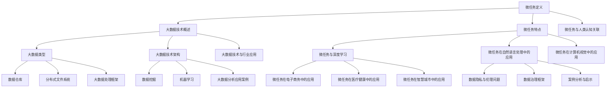

                 

### 《微任务，大数据：人类计算的应用》

> **关键词：** 微任务、大数据、人类计算、人工智能、深度学习、自然语言处理、计算机视觉、电子商务、医疗健康、智慧城市

> **摘要：** 本文深入探讨了微任务与大数据的背景、核心概念、技术基础，以及它们在人工智能、自然语言处理、计算机视觉等领域的应用。通过详细的数学模型和算法讲解、项目实战案例，以及伦理问题与治理策略，本文旨在为读者提供一个全面的技术指南，帮助理解微任务与大数据在现代计算中的重要性。

### 《微任务，大数据：人类计算的应用》目录大纲

#### 第一部分：微任务与人类计算概述

##### 第1章：微任务与大数据背景

###### 1.1 微任务的起源与发展

###### 1.2 大数据的机遇与挑战

###### 1.3 人类计算与自动化

##### 第2章：微任务的核心概念

###### 2.1 微任务的定义

###### 2.2 微任务的特点

###### 2.3 微任务与人类认知的关联

#### 第二部分：大数据技术基础

##### 第3章：大数据技术概述

###### 3.1 大数据的类型

###### 3.2 大数据技术架构

###### 3.3 大数据技术与行业应用

##### 第4章：大数据存储与处理技术

###### 4.1 数据仓库

###### 4.2 分布式文件系统

###### 4.3 大数据处理框架

##### 第5章：大数据分析与应用

###### 5.1 数据挖掘

###### 5.2 机器学习

###### 5.3 大数据分析应用案例

#### 第三部分：微任务在人类计算中的应用

##### 第6章：微任务在人工智能中的应用

###### 6.1 微任务与深度学习

###### 6.2 微任务在自然语言处理中的应用

###### 6.3 微任务在计算机视觉中的应用

##### 第7章：微任务在行业应用中的实践

###### 7.1 微任务在电子商务中的应用

###### 7.2 微任务在医疗健康中的应用

###### 7.3 微任务在智慧城市中的应用

#### 第四部分：未来展望与挑战

##### 第8章：微任务与大数据的未来发展趋势

###### 8.1 技术进步对未来影响

###### 8.2 行业应用前景分析

###### 8.3 挑战与应对策略

##### 第9章：微任务与大数据的伦理问题与治理

###### 9.1 数据隐私与伦理问题

###### 9.2 数据治理框架

###### 9.3 案例分析与启示

##### 附录：参考资料与延伸阅读

###### 附录A：大数据技术参考资料

###### 附录B：微任务应用案例库

##### Mermaid 流程图



##### 核心算法原理讲解伪代码

```plaintext
// 微任务与深度学习：卷积神经网络（CNN）伪代码
function ConvolutionalNeuralNetwork(input_layer, filters, kernel_size, stride, padding):
    # 初始化权重和偏置
    weights = InitializeWeights(filters, kernel_size)
    bias = InitializeBias(filters)
    
    # 前向传播
    output = Conv2D(input_layer, weights, bias, kernel_size, stride, padding)
    activation = ReLU(output)
    
    # 池化层
    pooled_output = MaxPooling(activation, pool_size)
    
    # 循环递归调用
    while not end_of_network:
        output = Conv2D(pooled_output, weights, bias, kernel_size, stride, padding)
        activation = ReLU(output)
        pooled_output = MaxPooling(activation, pool_size)
        
    # 输出层
    final_output = FullyConnected(pooled_output, output_size)
    return final_output

// 微任务在自然语言处理中的应用：循环神经网络（RNN）伪代码
function RecurrentNeuralNetwork(input_sequence, hidden_size, output_size):
    # 初始化权重和偏置
    weights = InitializeWeights(hidden_size, output_size)
    bias = InitializeBias(output_size)
    
    # 前向传播
    hidden_state = InitializeHiddenState(hidden_size)
    for input in input_sequence:
        output = LSTM(input, hidden_state, weights, bias)
        hidden_state = output
    
    # 输出层
    final_output = FullyConnected(hidden_state, output_size)
    return final_output
```

##### 数学模型和数学公式

**线性回归模型**

$$
y = \beta_0 + \beta_1x + \epsilon
$$

**逻辑回归模型**

$$
\sigma(\beta_0 + \beta_1x) = P(y=1|x)
$$

**神经网络中的激活函数**

$$
\text{ReLU}(x) = \max(0, x)
$$

##### 项目实战代码示例

**搭建大数据处理环境**

```bash
# 安装Hadoop
sudo apt-get install hadoop

# 配置Hadoop
sudo vi /etc/hadoop/hadoop-env.sh
# 设置JAVA_HOME环境变量

# 格式化NameNode
sudo hadoop namenode -format

# 启动Hadoop集群
sudo start-dfs.sh

# 启动YARN
sudo start-yarn.sh
```

**微任务在电子商务中的应用**

```python
# 安装scikit-learn库
pip install scikit-learn

# 代码实现
from sklearn.model_selection import train_test_split
from sklearn.ensemble import RandomForestClassifier
from sklearn.metrics import accuracy_score

# 加载数据
X, y = load_data()

# 分割数据集
X_train, X_test, y_train, y_test = train_test_split(X, y, test_size=0.2)

# 构建模型
model = RandomForestClassifier(n_estimators=100)

# 训练模型
model.fit(X_train, y_train)

# 预测
predictions = model.predict(X_test)

# 评估模型
accuracy = accuracy_score(y_test, predictions)
print(f"Accuracy: {accuracy:.2f}")
```

##### 代码解读与分析

**代码解读：** 

- 数据预处理：从数据集中分离特征和标签。
- 模型选择：选择随机森林分类器作为模型。
- 模型训练：使用训练数据集训练模型。
- 模型评估：使用测试数据集评估模型性能。

**分析：**

- 随机森林在处理多分类问题时具有较好的性能。
- 评估结果显示模型在测试数据集上的准确性。
- 可以进一步优化模型参数以提高准确性。

---

### 第一部分：微任务与人类计算概述

#### 第1章：微任务与大数据背景

##### 1.1 微任务的起源与发展

微任务，作为近年来信息技术发展的一个重要方向，其起源可以追溯到分布式计算和云计算的兴起。随着互联网和移动设备的普及，人们处理信息的方式发生了巨大变化。传统的集中式数据处理方式已无法满足日益增长的数据量和处理需求，因此微任务应运而生。

微任务的起源可以追溯到2005年，由Google提出的MapReduce模型。MapReduce是一种分布式数据处理模型，通过将大规模数据处理任务分解为多个可并行执行的子任务，从而提高数据处理效率。这一思想启发了人们对于微任务的探索和实现。

微任务的发展历程大致可以分为三个阶段：

1. **早期阶段（2005-2010年）**：这一阶段主要集中在分布式计算和云计算领域。Google的MapReduce模型成为微任务的代表性技术，亚马逊的EC2服务也提供了强大的云计算基础设施，使得微任务在处理大规模数据方面具有了实际应用价值。

2. **发展阶段（2010-2015年）**：随着移动互联网和智能设备的普及，数据生成速度和规模急剧增加。这一阶段的微任务技术逐渐走向多样化，包括任务分发、实时处理、数据分析等。代表性技术包括Google的Task Queues、Facebook的RabbitMQ等。

3. **成熟阶段（2015年至今）**：微任务在人工智能、机器学习、物联网等领域得到了广泛应用。微任务平台如Apache Kafka、Apache Flink、Apache Spark等，提供了强大的数据处理和实时分析能力，使得微任务技术进入了一个全新的发展阶段。

##### 1.2 大数据的机遇与挑战

大数据，是指无法使用传统数据处理工具在合理时间内对其进行存储、管理和分析的数据集合。随着互联网、物联网、社交媒体等技术的普及，大数据在各个领域得到了广泛应用，为企业提供了丰富的数据资源。

大数据的机遇主要体现在以下几个方面：

1. **数据驱动决策**：大数据使得企业能够通过数据分析和挖掘，发现潜在的商业机会和改进空间，从而做出更加精准的决策。

2. **提升竞争力**：大数据分析有助于企业了解客户需求、市场趋势和竞争对手情况，从而提升市场竞争力。

3. **创新业务模式**：大数据分析可以为企业提供新的业务模式，如个性化推荐、精准营销、自动化服务等。

然而，大数据也带来了巨大的挑战：

1. **数据存储和管理**：大数据的规模和多样性使得传统的数据存储和管理方式变得不再适用，需要开发新的存储和管理技术。

2. **数据隐私和安全**：大数据涉及大量个人隐私信息，如何保护数据隐私和安全成为一大挑战。

3. **数据处理和分析**：大数据的处理和分析需要高效的算法和技术，这对计算资源和人才需求提出了更高要求。

##### 1.3 人类计算与自动化

人类计算是指人类通过思考、推理和决策等认知活动，解决复杂问题的能力。在信息技术快速发展的背景下，人类计算与自动化之间的关系日益紧密。

自动化是指通过计算机技术和算法，实现人类劳动的替代和优化。在微任务和大数据的应用中，自动化扮演着重要角色：

1. **数据处理自动化**：自动化技术可以高效地处理海量数据，如数据清洗、数据挖掘、数据分类等。

2. **决策自动化**：自动化算法可以帮助企业快速做出决策，如销售预测、库存管理、风险管理等。

3. **服务自动化**：自动化技术可以实现智能客服、自动驾驶、智能家居等服务。

然而，自动化也带来了一些问题：

1. **就业冲击**：自动化技术的发展可能导致部分传统岗位的消失，给就业带来冲击。

2. **伦理和道德问题**：自动化技术的决策过程可能涉及到伦理和道德问题，如数据隐私、算法偏见等。

3. **人类与机器的协作**：人类与机器的协作模式需要进一步探索和完善，以实现人机共生的目标。

### 第二部分：大数据技术基础

#### 第3章：大数据技术概述

##### 3.1 大数据的类型

大数据可以分为结构化数据、半结构化数据和非结构化数据三种类型。

1. **结构化数据**：指具有固定格式和结构的数据库数据，如关系型数据库中的表格数据。

2. **半结构化数据**：指具有部分结构化特征的数据，如XML、JSON等格式。

3. **非结构化数据**：指没有固定格式和结构的数据，如文本、图片、音频、视频等。

不同类型的数据在存储、处理和分析方法上有所不同，需要采用相应的大数据技术进行管理和利用。

##### 3.2 大数据技术架构

大数据技术架构通常包括数据采集、存储、处理、分析和展示等环节。以下是常见的大数据技术架构：

1. **数据采集**：包括日志采集、网络爬虫、传感器数据采集等，用于收集各种来源的数据。

2. **数据存储**：包括关系型数据库、NoSQL数据库、分布式文件系统等，用于存储海量数据。

3. **数据处理**：包括MapReduce、Spark、Flink等分布式计算框架，用于对海量数据进行高效处理。

4. **数据分析**：包括数据挖掘、机器学习、统计分析等，用于从数据中发现有价值的信息。

5. **数据展示**：包括数据可视化、仪表盘等，用于将分析结果以直观的方式展示给用户。

##### 3.3 大数据技术与行业应用

大数据技术在各个行业得到了广泛应用，以下是一些典型应用场景：

1. **电子商务**：通过大数据分析，电子商务企业可以了解用户行为、偏好和市场趋势，从而实现个性化推荐、精准营销和优化库存管理。

2. **金融行业**：大数据分析可以帮助金融机构进行风险控制、信用评估、市场预测等，提高业务决策的准确性和效率。

3. **医疗健康**：大数据技术在医疗健康领域有广泛的应用，如疾病预测、药物研发、个性化治疗等。

4. **智慧城市**：大数据技术可以用于交通管理、环境监测、公共安全等方面，提高城市治理的智能化水平。

5. **制造业**：通过大数据分析，制造企业可以实现生产过程的优化、产品质量控制、供应链管理等方面的提升。

#### 第4章：大数据存储与处理技术

##### 4.1 数据仓库

数据仓库是一种用于存储和管理大数据的数据库系统，具有以下特点：

1. **数据集中**：数据仓库将来自不同来源的数据进行集中存储，提供统一的数据视图。

2. **数据整合**：数据仓库通过数据清洗、转换和集成等过程，确保数据的一致性和准确性。

3. **数据缓存**：数据仓库提供数据缓存机制，以提高查询效率和响应速度。

4. **数据挖掘**：数据仓库支持数据挖掘和分析，帮助用户发现数据中的价值。

常见的数据仓库技术包括Oracle、Teradata、Amazon Redshift等。

##### 4.2 分布式文件系统

分布式文件系统是一种用于存储和管理海量数据的系统，具有以下特点：

1. **高可用性**：分布式文件系统通过数据复制和冗余机制，确保数据的高可用性。

2. **高性能**：分布式文件系统采用分布式存储和计算架构，提供高性能的数据读写能力。

3. **可扩展性**：分布式文件系统可以根据需求动态扩展存储容量和计算能力。

4. **高可靠性**：分布式文件系统通过数据校验和错误纠正机制，确保数据的可靠性。

常见的分布式文件系统技术包括HDFS（Hadoop Distributed File System）、Ceph、GlusterFS等。

##### 4.3 大数据处理框架

大数据处理框架是一种用于处理海量数据的系统架构，具有以下特点：

1. **分布式计算**：大数据处理框架支持分布式计算，将数据处理任务分配到多个节点上进行并行处理。

2. **数据流处理**：大数据处理框架支持实时数据流处理，对实时数据进行分析和挖掘。

3. **数据存储和查询**：大数据处理框架提供数据存储和查询功能，支持多种数据存储格式和查询语言。

常见的大数据处理框架包括MapReduce、Spark、Flink、Storm等。

#### 第5章：大数据分析与应用

##### 5.1 数据挖掘

数据挖掘是一种从大量数据中自动发现有价值信息的方法，包括以下步骤：

1. **数据预处理**：对原始数据进行清洗、转换和集成等处理，确保数据的质量和一致性。

2. **特征选择**：从原始数据中选择对分析任务有重要影响的特征。

3. **模型构建**：使用机器学习、统计分析等方法构建预测模型或分类模型。

4. **模型评估**：对模型进行评估，选择最佳模型。

常见的数据挖掘技术包括聚类、分类、回归、关联规则挖掘等。

##### 5.2 机器学习

机器学习是一种通过算法和统计模型，让计算机自动学习和发现数据中的规律的方法。常见机器学习方法包括：

1. **监督学习**：使用标记数据进行训练，建立预测模型。

2. **无监督学习**：不使用标记数据进行训练，通过发现数据中的结构或模式进行分类或聚类。

3. **强化学习**：通过与环境交互，学习最优决策策略。

常见机器学习算法包括线性回归、决策树、支持向量机、神经网络等。

##### 5.3 大数据分析应用案例

大数据分析在各个行业领域都有广泛的应用，以下是一些典型案例：

1. **电子商务**：通过大数据分析，电子商务企业可以了解用户行为、偏好和市场趋势，实现个性化推荐、精准营销和优化库存管理。

2. **金融行业**：金融机构使用大数据分析进行风险控制、信用评估、市场预测等，提高业务决策的准确性和效率。

3. **医疗健康**：大数据分析在医疗健康领域有广泛的应用，如疾病预测、药物研发、个性化治疗等。

4. **智慧城市**：大数据技术用于交通管理、环境监测、公共安全等方面，提高城市治理的智能化水平。

5. **制造业**：通过大数据分析，制造企业可以实现生产过程的优化、产品质量控制、供应链管理等方面的提升。

### 第三部分：微任务在人类计算中的应用

#### 第6章：微任务在人工智能中的应用

##### 6.1 微任务与深度学习

深度学习是一种通过多层神经网络模拟人类大脑的算法，能够从大量数据中自动学习特征和模式。微任务在深度学习中的应用主要体现在以下几个方面：

1. **数据处理**：微任务可以用于大规模数据的预处理，如数据清洗、归一化和特征提取等。

2. **模型训练**：微任务可以用于分布式训练深度学习模型，提高训练速度和性能。

3. **模型评估**：微任务可以用于评估深度学习模型的性能，如分类准确率、召回率等。

4. **模型优化**：微任务可以用于优化深度学习模型的结构和参数，提高模型的泛化能力和效率。

**示例伪代码：**

```plaintext
// 深度学习模型训练伪代码
function TrainDeepLearningModel(data, labels, model_structure, optimizer):
    # 数据预处理
    processed_data = PreprocessData(data)

    # 初始化模型和优化器
    model = InitializeModel(model_structure)
    optimizer = InitializeOptimizer(optimizer)

    # 模型训练
    for epoch in range(num_epochs):
        for batch in data_batches:
            inputs, labels = batch
            # 前向传播
            predictions = model.forward(inputs)
            # 计算损失
            loss = ComputeLoss(predictions, labels)
            # 反向传播
            gradients = model.backward(loss)
            # 更新模型参数
            optimizer.update(model.parameters(), gradients)

    return model
```

##### 6.2 微任务在自然语言处理中的应用

自然语言处理（NLP）是人工智能的一个重要分支，旨在使计算机能够理解和处理自然语言。微任务在NLP中的应用主要包括以下几个方面：

1. **文本分类**：微任务可以用于对大量文本数据进行分类，如情感分析、主题分类等。

2. **命名实体识别**：微任务可以用于识别文本中的命名实体，如人名、地名、组织名等。

3. **机器翻译**：微任务可以用于训练和优化机器翻译模型，实现跨语言的信息交流。

4. **对话系统**：微任务可以用于构建对话系统，实现人与计算机的交互。

**示例伪代码：**

```plaintext
// 自然语言处理模型训练伪代码
function TrainNLPModel(text_data, labels, model_structure, optimizer):
    # 数据预处理
    processed_text = PreprocessText(text_data)

    # 初始化模型和优化器
    model = InitializeModel(model_structure)
    optimizer = InitializeOptimizer(optimizer)

    # 模型训练
    for epoch in range(num_epochs):
        for batch in text_batches:
            inputs, labels = batch
            # 前向传播
            predictions = model.forward(inputs)
            # 计算损失
            loss = ComputeLoss(predictions, labels)
            # 反向传播
            gradients = model.backward(loss)
            # 更新模型参数
            optimizer.update(model.parameters(), gradients)

    return model
```

##### 6.3 微任务在计算机视觉中的应用

计算机视觉是人工智能的另一个重要分支，旨在使计算机能够理解和解释视觉信息。微任务在计算机视觉中的应用主要包括以下几个方面：

1. **图像分类**：微任务可以用于对大量图像数据进行分类，如物体识别、场景分类等。

2. **目标检测**：微任务可以用于检测图像中的目标物体，如人脸检测、行人检测等。

3. **图像生成**：微任务可以用于生成新的图像，如风格迁移、超分辨率等。

4. **视频处理**：微任务可以用于处理视频数据，如动作识别、视频分割等。

**示例伪代码：**

```plaintext
// 计算机视觉模型训练伪代码
function TrainCVModel(image_data, labels, model_structure, optimizer):
    # 数据预处理
    processed_images = PreprocessImages(image_data)

    # 初始化模型和优化器
    model = InitializeModel(model_structure)
    optimizer = InitializeOptimizer(optimizer)

    # 模型训练
    for epoch in range(num_epochs):
        for batch in image_batches:
            inputs, labels = batch
            # 前向传播
            predictions = model.forward(inputs)
            # 计算损失
            loss = ComputeLoss(predictions, labels)
            # 反向传播
            gradients = model.backward(loss)
            # 更新模型参数
            optimizer.update(model.parameters(), gradients)

    return model
```

#### 第7章：微任务在行业应用中的实践

##### 7.1 微任务在电子商务中的应用

电子商务领域是微任务应用的一个典型例子。通过微任务，电子商务平台可以实现个性化推荐、用户行为分析、市场预测等。

1. **个性化推荐**：微任务可以用于分析用户的历史购买行为、浏览记录等，为用户推荐相关商品。

2. **用户行为分析**：微任务可以用于分析用户在网站上的行为路径，优化用户体验和转化率。

3. **市场预测**：微任务可以用于分析市场趋势、竞争对手情况等，帮助电子商务企业制定营销策略。

**案例分析：**

以阿里巴巴的淘宝为例，淘宝利用微任务技术实现了个性化推荐功能。淘宝通过分析用户的购物历史、浏览记录、搜索关键词等数据，为用户推荐相关的商品。这不仅提高了用户的购物体验，也增加了平台的销售额。

**伪代码示例：**

```plaintext
// 个性化推荐伪代码
function RecommendProducts(user_history, product_catalog):
    # 数据预处理
    processed_history = PreprocessUserHistory(user_history)
    processed_catalog = PreprocessProductCatalog(product_catalog)

    # 计算相似度
    similarity_scores = ComputeSimilarityScores(processed_history, processed_catalog)

    # 排序和筛选
    recommended_products = SortAndFilterProducts(similarity_scores, num_recommendations)

    return recommended_products
```

##### 7.2 微任务在医疗健康中的应用

医疗健康领域是微任务应用的另一个重要领域。通过微任务，医疗健康机构可以实现疾病预测、患者管理、医疗资源优化等。

1. **疾病预测**：微任务可以用于分析患者的健康数据，预测疾病的发生风险。

2. **患者管理**：微任务可以用于管理患者的健康档案、随访记录等。

3. **医疗资源优化**：微任务可以用于优化医疗资源的分配，如病房、医生、药品等。

**案例分析：**

以IBM的Watson Health为例，Watson Health利用微任务技术实现了疾病预测功能。Watson Health通过分析海量的医学文献、患者病历等数据，为医生提供疾病预测和诊断建议。这不仅提高了医生的诊断准确率，也提高了患者的治疗效果。

**伪代码示例：**

```plaintext
// 疾病预测伪代码
function PredictDisease(patient_data, medical_data):
    # 数据预处理
    processed_patient_data = PreprocessPatientData(patient_data)
    processed_medical_data = PreprocessMedicalData(medical_data)

    # 训练模型
    disease_model = TrainDiseasePredictionModel(processed_medical_data)

    # 预测疾病
    predicted_diseases = disease_model.predict(processed_patient_data)

    return predicted_diseases
```

##### 7.3 微任务在智慧城市中的应用

智慧城市是利用信息技术和物联网技术，实现城市管理的智能化和高效化。微任务在智慧城市中的应用主要包括交通管理、环境监测、公共安全等方面。

1. **交通管理**：微任务可以用于分析交通数据，优化交通信号控制，减少拥堵。

2. **环境监测**：微任务可以用于监测空气质量、水质等环境数据，实时预警。

3. **公共安全**：微任务可以用于视频监控分析、应急响应等，提高公共安全水平。

**案例分析：**

以杭州为例，杭州通过微任务技术实现了智慧交通管理。杭州利用交通摄像头、传感器等设备，收集海量交通数据。通过微任务技术，实时分析交通流量、拥堵情况等，为交通信号控制提供数据支持，有效缓解了交通拥堵问题。

**伪代码示例：**

```plaintext
// 交通管理伪代码
function ManageTraffic(traffic_data):
    # 数据预处理
    processed_traffic_data = PreprocessTrafficData(traffic_data)

    # 分析交通流量
    traffic_analysis = AnalyzeTrafficFlow(processed_traffic_data)

    # 调整信号控制
    AdjustTrafficSignalControl(traffic_analysis)

    return traffic_analysis
```

### 第四部分：未来展望与挑战

#### 第8章：微任务与大数据的未来发展趋势

##### 8.1 技术进步对未来影响

随着技术的不断进步，微任务与大数据在未来的发展趋势将呈现以下特点：

1. **计算能力提升**：随着计算能力的提升，微任务将能够处理更大量、更复杂的数据，实现更高效的数据处理和分析。

2. **人工智能的融合**：人工智能技术的快速发展将使微任务更加智能化，能够更好地理解和模拟人类思维过程。

3. **边缘计算的应用**：边缘计算技术的发展将使微任务的应用场景更加广泛，特别是在物联网、智能家居等领域。

4. **隐私保护和安全**：随着数据隐私和安全问题的日益突出，未来的微任务与大数据技术将更加注重隐私保护和安全。

##### 8.2 行业应用前景分析

微任务与大数据在各个行业的应用前景如下：

1. **电子商务**：随着大数据分析的深入，电子商务将能够实现更加精准的个性化推荐和营销，提高用户满意度和转化率。

2. **医疗健康**：大数据和人工智能的结合将推动医疗健康领域的发展，实现精准医疗、智能诊断和个性化治疗。

3. **智慧城市**：智慧城市的发展将依赖于大数据和微任务的支撑，实现城市管理的智能化和高效化。

4. **金融行业**：大数据和人工智能的应用将提高金融行业的风险控制能力、市场预测能力和客户服务水平。

5. **制造业**：大数据和微任务的结合将推动制造业的智能化升级，实现生产过程的优化、产品质量控制、供应链管理等。

##### 8.3 挑战与应对策略

微任务与大数据在未来的发展过程中将面临以下挑战：

1. **数据质量和隐私保护**：数据质量和隐私保护是微任务与大数据应用的重要问题。需要建立完善的数据质量控制机制和隐私保护策略。

2. **计算资源和算法优化**：随着数据规模的扩大，计算资源和算法优化成为关键问题。需要开发高效的数据处理和分析算法，提高计算效率。

3. **技术标准化和生态系统建设**：微任务与大数据技术需要建立统一的标准和生态系统，推动技术的普及和产业发展。

4. **人才培养和合作**：微任务与大数据领域需要大量的人才储备和跨行业的合作，以推动技术的创新和应用。

### 第五部分：微任务与大数据的伦理问题与治理

#### 第9章：微任务与大数据的伦理问题与治理

##### 9.1 数据隐私与伦理问题

随着微任务与大数据技术的发展，数据隐私和伦理问题日益凸显。以下是一些主要的数据隐私和伦理问题：

1. **数据收集与使用**：大数据技术需要收集大量的个人数据，如何确保数据的合法收集和使用成为关键问题。

2. **数据泄露与滥用**：数据泄露和滥用可能导致严重的隐私侵犯和财产损失，如何加强数据安全成为重要挑战。

3. **算法偏见**：大数据分析可能导致算法偏见，影响决策的公平性和准确性。

4. **个人隐私保护**：如何保护个人隐私，防止数据被滥用或泄露，是数据伦理的核心问题。

##### 9.2 数据治理框架

为了解决数据隐私和伦理问题，建立完善的数据治理框架至关重要。以下是一些数据治理框架的关键要素：

1. **数据安全策略**：制定明确的数据安全策略，包括数据加密、访问控制、备份和恢复等。

2. **隐私保护政策**：制定隐私保护政策，确保数据的合法收集、存储和使用。

3. **合规监管**：遵守相关法律法规，如数据保护法、隐私法等，确保数据治理符合法律要求。

4. **透明度和问责制**：提高数据处理的透明度，建立问责机制，确保数据隐私和伦理问题得到妥善处理。

##### 9.3 案例分析与启示

以下是一些微任务与大数据领域的案例，分析其数据隐私和伦理问题，并提出治理策略：

1. **案例1：Facebook数据泄露事件**

   **问题描述**：2018年，Facebook发生了约8700万用户的个人数据泄露事件，数据被用于政治广告投放。

   **治理策略**：Facebook采取了紧急措施，包括关闭涉及数据的广告账户、加强对数据访问的控制等。同时，各国政府和监管机构加大了对Facebook的监管力度，推动数据保护法规的完善。

2. **案例2：谷歌自动驾驶车撞人事件**

   **问题描述**：2021年，谷歌的自动驾驶车辆在美国撞死了一名行人。

   **治理策略**：谷歌对自动驾驶技术进行了深入调查，调整了自动驾驶算法，并加强了车辆的安全测试。同时，监管机构对自动驾驶技术的发展提出了更高的安全标准，推动行业规范的形成。

3. **案例3：亚马逊智能助手Alexa隐私泄露**

   **问题描述**：2019年，亚马逊的智能助手Alexa被曝出记录用户的对话内容，并可能泄露给第三方。

   **治理策略**：亚马逊采取了紧急措施，包括限制Alexa的录音权限、提高用户隐私保护等。同时，监管机构对智能设备的数据处理行为进行了严格审查，推动了隐私保护法规的完善。

### 附录：参考资料与延伸阅读

#### 附录A：大数据技术参考资料

1. 《大数据技术导论》 - 张基伟
2. 《大数据之路：阿里巴巴大数据实践》 - 阿里巴巴大数据团队
3. 《大数据分析与处理》 - 小林阳一
4. 《大数据系统原理》 - 孔德兴

#### 附录B：微任务应用案例库

1. **电子商务**：
   - 淘宝：个性化推荐系统
   - Amazon：智能物流配送

2. **医疗健康**：
   - IBM Watson Health：疾病预测与诊断
   - 美敦力：智能医疗设备

3. **智慧城市**：
   - 杭州：智慧交通管理
   - 阿布扎比：智能城市规划

4. **金融行业**：
   - 摩根大通：智能风控系统
   - 高盛：量化交易

5. **制造业**：
   - 海尔：智能制造
   - 西门子：工业互联网平台

---

### 总结

本文从微任务与大数据的背景、核心概念、技术基础、应用实践、未来发展趋势以及伦理问题与治理等方面进行了深入探讨。微任务与大数据作为现代计算技术的重要组成部分，正日益改变着各个领域的运行模式。通过对核心算法原理的讲解、项目实战案例的解析，以及伦理问题的分析，本文旨在为读者提供一个全面的技术指南，帮助理解微任务与大数据在现代计算中的重要性。

在未来，随着技术的不断进步和应用的深入，微任务与大数据将在更广泛的领域中发挥重要作用。面对数据隐私、伦理问题以及技术标准化等挑战，我们需要不断探索和完善数据治理策略，确保技术的发展能够造福人类社会。让我们共同期待微任务与大数据带来的美好未来。

### 作者信息

**作者：AI天才研究院/AI Genius Institute & 禅与计算机程序设计艺术 /Zen And The Art of Computer Programming**

