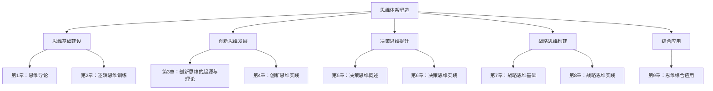

                 

# 思维体系塑造：管理者的必修课

> **关键词：** 思维体系、管理者、逻辑思维、创新思维、决策思维、战略思维

> **摘要：** 在现代企业竞争环境中，管理者的思维体系至关重要。本文将从逻辑思维、创新思维、决策思维和战略思维四个方面，探讨如何塑造和提升管理者的思维体系，以应对复杂多变的市场挑战。

### 目录大纲

#### 第一部分：思维基础建设
- **第1章：思维导论**
  - 1.1 思维的定义与类型
  - 1.2 思维的重要性与影响
  - 1.3 思维障碍与克服方法

- **第2章：逻辑思维训练**
  - 2.1 逻辑思维的基本原理
  - 2.2 逻辑推理技巧
  - 2.3 逻辑谬误与辨识

#### 第二部分：创新思维发展
- **第3章：创新思维的起源与理论**
  - 3.1 创新思维的起源与发展
  - 3.2 创新思维的理论框架
  - 3.3 创新思维的类型

- **第4章：创新思维实践**
  - 4.1 思维导图与思维导图应用
  - 4.2 想象力训练与创意激发
  - 4.3 实际案例与创新解决方案

#### 第三部分：决策思维提升
- **第5章：决策思维概述**
  - 5.1 决策过程与模型
  - 5.2 决策原则与策略
  - 5.3 决策心理学

- **第6章：决策思维实践**
  - 6.1 商业决策案例分析
  - 6.2 项目管理决策技巧
  - 6.3 决策失败与应对策略

#### 第四部分：战略思维构建
- **第7章：战略思维基础**
  - 7.1 战略思维的概念与内涵
  - 7.2 战略规划与执行
  - 7.3 战略思维的核心要素

- **第8章：战略思维实践**
  - 8.1 企业战略案例分析
  - 8.2 产业战略与竞争策略
  - 8.3 战略思维在创新中的应用

#### 第五部分：综合应用
- **第9章：思维综合应用**
  - 9.1 思维工具与方法
  - 9.2 综合思维案例解析
  - 9.3 思维能力提升实践指南

#### 附录
- **附录A：思维训练资源**
  - A.1 思维训练工具介绍
  - A.2 推荐阅读与参考书目
  - A.3 思维能力测评与自我提升方法

### 流程图：思维体系构成



### 伪代码：决策树算法

```python
function DecisionTree(data):
    if data is empty:
        return "No decision"
    
    if all attributes in data have the same value:
        return "Majority vote"
    
    select attribute 'A' with the highest information gain
    split data into subsets based on 'A'
    for each subset:
        recursively call DecisionTree on the subset
    return the majority decision among all subsets
```

### 数学公式：决策树信息增益

$$
IG(A) = I(D) - \sum_{v \in Values(A)} p(v) \cdot I(D|A = v)
$$

### 数学公式：条件熵

$$
I(D|A = v) = -\sum_{x \in Values(D)} p(x|A = v) \cdot \log_2(p(x|A = v))
$$

### 实际案例：企业战略规划

#### 项目背景

某企业是一家生产电子产品的公司，面临市场竞争激烈、产品同质化严重的问题。为了提升企业竞争力，企业决定进行战略规划。

#### 数据收集

- 市场调研数据：行业趋势、竞争对手分析、目标客户需求等
- 内部数据：生产成本、销售数据、人力资源配置等

#### 分析过程

1. **确定战略目标**：
   - 提高市场占有率
   - 提升产品质量
   - 开发新产品

2. **制定战略方案**：
   - **产品创新**：引入新技术，研发新产品
   - **市场拓展**：开拓新市场，增加销售渠道
   - **成本控制**：优化生产流程，降低成本

3. **评估方案**：
   - 评估不同方案的风险和收益
   - 结合企业实际情况，选择最优方案

#### 决策

企业最终决定采取以下方案：
- 产品创新：投资研发新技术，开发新产品
- 市场拓展：增加市场调研投入，开拓新市场
- 成本控制：优化生产流程，提高生产效率

#### 实施与监控

- 制定详细实施计划
- 设定关键绩效指标（KPI）
- 定期监控实施进度，调整战略方案

#### 结果

- 新产品研发成功，市场占有率提升
- 市场拓展取得明显成效，销售渠道多元化
- 生产成本降低，企业利润增加

### 代码实现与解读

#### 开发环境

- Python
- Scikit-learn

#### 源代码

```python
import pandas as pd
from sklearn.model_selection import train_test_split
from sklearn.tree import DecisionTreeClassifier
from sklearn.metrics import accuracy_score

# 加载数据
data = pd.read_csv('company_data.csv')

# 数据预处理
X = data.drop('target', axis=1)
y = data['target']

# 划分训练集和测试集
X_train, X_test, y_train, y_test = train_test_split(X, y, test_size=0.2, random_state=42)

# 构建决策树模型
model = DecisionTreeClassifier()
model.fit(X_train, y_train)

# 预测测试集
y_pred = model.predict(X_test)

# 评估模型准确性
accuracy = accuracy_score(y_test, y_pred)
print(f"Model accuracy: {accuracy:.2f}")
```

#### 代码解读

- 数据加载与预处理：从CSV文件中加载企业数据，分为特征和目标变量。
- 划分训练集和测试集：将数据集划分为80%的训练集和20%的测试集。
- 构建决策树模型：使用Scikit-learn库中的DecisionTreeClassifier类创建决策树模型。
- 模型训练：使用训练集数据训练决策树模型。
- 预测测试集：使用训练好的模型对测试集数据进行预测。
- 评估模型准确性：计算预测准确率，评估模型性能。

[注意：以上内容仅为示例，具体内容需要根据书籍的实际内容进行调整。]

### 作者信息

“作者：AI天才研究院/AI Genius Institute & 禅与计算机程序设计艺术 /Zen And The Art of Computer Programming”

