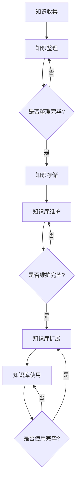

                 

### 打造个人知识库：程序员的财富基石

> **关键词**：知识库、程序员、知识管理、构建原则、实用技巧、案例分析

> **摘要**：本文旨在探讨程序员如何构建和优化个人知识库，以提升个人技术能力和工作效率。我们将从基础概念、构建原则、实用技巧以及实际应用等多个方面展开讨论，旨在为程序员提供一套系统的知识管理方案。

在当今快速发展的技术时代，程序员面临的知识量呈指数级增长。如何有效地管理和利用这些知识，成为每个程序员都需要面对的挑战。个人知识库，作为一种知识管理工具，不仅能够帮助程序员系统化地整理和存储知识，还能提高知识的查找效率，进而提升工作效率和技术水平。本文将深入探讨如何构建、维护和优化个人知识库，帮助程序员在这一领域取得成功。

### 目录大纲

#### 第一部分：构建个人知识库的基础

1. **个人知识库概述**
    1.1 程序员的知识体系构建
    1.2 个人知识库的概念与价值
    1.3 知识管理工具的选择与使用

2. **知识库的构建原则**
    2.1 知识分类与标签管理
    2.2 知识内容的规范化
    2.3 知识库的更新与维护

3. **知识获取与整理**
    3.1 利用网络资源积累知识
    3.2 阅读与笔记技巧
    3.3 技术文档编写与整理

4. **知识库的共享与协作**
    4.1 内部知识库的搭建与维护
    4.2 团队协作与知识共享

5. **知识库的优化与扩展**
    5.1 搜索引擎优化
    5.2 知识库的扩展

#### 第二部分：知识库的实用技巧

6. **知识库在项目开发中的应用**
    6.1 项目文档管理
    6.2 知识库在代码开发中的辅助作用

7. **知识库的案例分析**
    7.1 成功案例分享
    7.2 挑战与解决方案

#### 第三部分：知识库的应用实践

8. **附录**
    8.1 常用知识管理工具详解
    8.2 个人知识库构建流程图
    8.3 核心算法原理讲解
    8.4 数学模型与公式
    8.5 项目实战

### 第一部分：构建个人知识库的基础

#### 第1章：个人知识库概述

在这一章中，我们将探讨程序员的知识体系构建、个人知识库的概念及其重要性，以及知识管理工具的选择与使用。

### 1.1 程序员的知识体系构建

程序员的成长过程中，需要构建一个系统化的知识体系。这个体系通常包括基础知识、专业知识、技能和实践经验等几个层次。

- **基础知识**：这是程序员知识体系的基础，包括计算机科学的基本原理、算法和数据结构等。
- **专业知识**：随着技术的深入，程序员需要掌握特定的编程语言、框架、工具和库等。
- **技能**：除了理论知识，程序员还需要掌握一定的技能，如代码审查、项目管理、调试和测试等。
- **实践经验**：理论知识需要通过实践来巩固，实践经验的积累是程序员成长的重要途径。

构建知识体系的方法可以归纳为以下几步：

1. **明确目标**：确定自己在技术领域的长期和短期目标，这有助于选择合适的学习路径。
2. **持续学习**：保持好奇心和求知欲，通过阅读、观看教程和参与社区活动等方式不断学习。
3. **实践应用**：将理论知识应用于实际项目中，通过实践来加深理解。
4. **反思总结**：定期反思自己的学习过程，总结经验教训，不断优化学习策略。

### 1.2 个人知识库的概念与价值

个人知识库（Personal Knowledge Base，简称PKB）是一个集中存储、管理和利用个人知识的工具。它可以帮助程序员系统化地整理和存储知识，从而提高知识的查找效率和利用率。

- **定义**：个人知识库是一个个人所有的、用于存储和管理知识的系统。它可以是电子文档、笔记、书籍或其他形式的知识载体。
- **价值**：个人知识库的价值主要体现在以下几个方面：

1. **知识整合**：将分散的知识点整合在一起，形成完整的知识体系。
2. **查找效率**：通过关键词搜索快速找到所需的知识点，提高工作效率。
3. **知识共享**：便于与他人分享知识，促进知识的传播和共享。
4. **知识更新**：便于及时更新和迭代知识，保持知识的时效性和准确性。
5. **决策支持**：在面临技术决策时，可以快速查阅相关知识，提供决策支持。

### 1.3 知识管理工具的选择与使用

为了有效地构建和管理个人知识库，选择合适的知识管理工具至关重要。以下是一些常见的知识管理工具及其特点：

- **Notion**：一款功能强大的笔记和组织工具，支持多种数据类型和视图方式。
- **Confluence**：一款专业的协作平台，适合团队协作和文档管理。
- **Notational Velocity**：一款简洁的笔记软件，适用于快速记录和整理思路。
- **Evernote**：一款跨平台的笔记应用，支持多种附件和搜索功能。
- **TiddlyWiki**：一款基于HTML的动态笔记工具，具有高度灵活性和可定制性。

选择知识管理工具时，需要考虑以下因素：

1. **功能需求**：根据个人需求选择具有合适功能的工具。
2. **易用性**：选择操作简单、易上手的工具，降低学习成本。
3. **兼容性**：选择支持多种文件格式和平台的工具，便于在不同设备和环境中使用。
4. **扩展性**：选择具有良好扩展性的工具，以适应未来需求的变化。

### 结论

个人知识库是程序员知识管理的重要组成部分，它有助于提高知识查找效率和利用率。通过系统化地构建和管理个人知识库，程序员可以更好地整合和利用自己的知识，提升技术水平和工作效率。在下一章中，我们将进一步探讨知识库的构建原则，帮助程序员建立更加完善和高效的个人知识库。

---

#### 第2章：知识库的构建原则

在本章中，我们将详细讨论知识库的构建原则，包括知识分类与标签管理、知识内容的规范化以及知识库的更新与维护。

### 2.1 知识分类与标签管理

有效的知识分类和标签管理是构建高质量个人知识库的基础。合理的分类和标签可以帮助我们快速定位和查找所需的知识，提高知识库的利用效率。

#### 2.1.1 知识分类的标准

知识分类的标准通常根据知识的特点和应用场景来确定。以下是一些常见的分类标准：

1. **按技术领域分类**：将知识分为计算机科学、软件开发、人工智能、网络技术等不同领域。
2. **按知识类型分类**：将知识分为理论知识、实践经验、项目案例、工具使用等不同类型。
3. **按知识层次分类**：将知识分为基础知识、中级知识、高级知识等不同层次。
4. **按时间分类**：将知识分为当前知识、近期知识、历史知识等不同时间段。

选择合适的分类标准需要根据个人实际情况和需求来确定。例如，对于初级程序员，可能更倾向于按技术领域和知识类型分类，以便快速学习和掌握基本技能；而对于高级程序员，则可能更注重按知识层次和时间分类，以便在需要时快速查找和复用旧知识。

#### 2.1.2 标签管理的策略

标签管理是知识分类的有效补充，可以帮助我们更精细地定位和查找知识。以下是一些标签管理的策略：

1. **多维度标签**：为每个知识点添加多个标签，从不同角度描述该知识的特点和应用场景。例如，一个关于“Web开发”的知识点可以同时标注为“前端开发”、“后端开发”、“JavaScript”等标签。
2. **动态调整**：根据知识库的发展和自身需求，定期审查和调整标签，确保标签的准确性和实用性。
3. **标签体系**：建立一套统一的标签体系，确保不同知识点之间的标签具有一致性，便于跨知识点的搜索和整理。
4. **标签管理工具**：选择合适的标签管理工具，如Notion的标签功能、Evernote的标签云等，提高标签管理的效率和效果。

### 2.2 知识内容的规范化

规范化知识内容是保证知识库质量的重要环节。规范化的知识内容不仅有助于提高知识库的可读性和可维护性，还能提升知识查找和利用的效率。

#### 2.2.1 文档编写规范

文档编写规范包括格式、结构和内容等方面的要求。以下是一些常见的文档编写规范：

1. **格式规范**：统一使用特定的字体、字号、行间距等格式，确保文档的外观整齐一致。例如，选择微软雅黑字体、12号字体、1.5倍行间距。
2. **结构规范**：按照统一的文档结构编写，包括标题、摘要、正文、参考文献等部分。例如，可以采用MD格式或LaTeX格式，便于排版和阅读。
3. **内容规范**：确保内容准确、完整、清晰，避免歧义和错误。例如，使用精确的术语和定义，避免使用模糊的表述。
4. **代码规范**：编写高质量的代码，遵循编程语言的规范和最佳实践。例如，使用统一的命名规则、代码注释、模块化设计等。

#### 2.2.2 代码规范

代码规范是软件开发中的基本要求，良好的代码规范可以提高代码的可读性、可维护性和可扩展性。以下是一些常见的代码规范：

1. **命名规范**：统一使用有意义的变量名和函数名，避免使用缩写或拼音。例如，使用驼峰命名法（CamelCase）或下划线命名法（snake_case）。
2. **注释规范**：编写清晰的注释，说明代码的功能、目的和原理。例如，在复杂算法和代码段前添加注释，便于理解和维护。
3. **代码格式**：统一使用特定的代码格式，例如Python的PEP8规范、JavaScript的ESLint规范等。例如，统一使用两个空格缩进、避免使用制表符、保持代码一致性。
4. **模块化设计**：将代码划分为功能模块，提高代码的可复用性和可维护性。例如，使用面向对象编程、模块化框架等设计模式。

### 2.3 知识库的更新与维护

知识库的更新与维护是保证其长期有效性的关键。以下是一些更新与维护的策略：

1. **定期更新**：制定定期更新计划，确保知识库中的知识保持时效性和准确性。例如，每月或每季度进行一次全面更新。
2. **团队协作**：鼓励团队成员共同参与知识库的更新和维护，提高知识库的完整性和准确性。例如，设立知识库维护小组，定期审核和更新知识库内容。
3. **版本控制**：使用版本控制系统（如Git）管理知识库的更新历史，便于追踪和回滚变更。例如，每次更新时提交一个合并请求（Pull Request），经过审查和测试后合并到主分支。
4. **反馈机制**：建立反馈机制，收集用户对知识库的反馈和建议，及时调整和优化知识库。例如，设立反馈邮箱或在线问卷调查，定期收集用户反馈。

### 结论

构建高质量的个人知识库需要遵循一定的原则和方法。通过合理的知识分类与标签管理、规范化的知识内容以及有效的更新与维护策略，程序员可以建立一个完整、准确、高效的个人知识库，提升自身的技术水平和工作效率。在下一章中，我们将探讨如何利用网络资源积累知识，为个人知识库的建设奠定坚实的基础。

---

### 2.3 知识库的更新与维护

知识库的更新与维护是保证其长期有效性的关键。以下是一些更新与维护的策略：

#### 2.3.1 定期更新策略

定期更新知识库是确保知识时效性和准确性的重要手段。以下是一些具体的定期更新策略：

1. **时间节点**：根据知识库的内容和重要性，确定合理的更新时间节点。例如，对于技术文档和代码示例，可以每月更新一次；对于快速变化的技术领域，如人工智能和区块链，可能需要更频繁的更新，如每季度或每半年更新一次。
2. **更新计划**：制定详细的更新计划，明确每次更新的目标和内容。例如，可以列出需要更新的知识点、涉及的技术领域、负责人和截止时间等。
3. **评估标准**：建立评估标准，对更新后的知识库进行评估和审核。例如，可以采用同行评审、质量检查表等方法，确保更新内容的准确性和实用性。

#### 2.3.2 维护团队协作机制

知识库的更新与维护通常需要团队协作，建立有效的团队协作机制是提高知识库质量和效率的关键。以下是一些团队协作的机制：

1. **分工协作**：明确团队成员的职责和分工，确保知识库的各个部分都能得到及时更新和维护。例如，可以设立内容审核员、技术专家、文档编写员等不同角色。
2. **定期会议**：定期召开团队会议，讨论知识库的更新情况、面临的挑战和解决方案。例如，可以每周或每月召开一次会议，讨论知识库的进展和改进措施。
3. **反馈与改进**：建立反馈机制，收集团队成员和用户的意见和建议，及时调整和改进知识库。例如，可以设立反馈渠道，如在线问卷、邮件列表等，鼓励用户提出意见和建议。

#### 2.3.3 知识库的版本控制

使用版本控制系统（Version Control System，VCS）对知识库进行版本控制，有助于管理和追踪知识库的变更历史。以下是一些版本控制的方法：

1. **Git**：Git是最流行的版本控制系统之一，适用于各种开发项目。使用Git，可以方便地创建分支、合并代码、回滚变更等操作。例如，可以在每次更新时创建一个新的分支，完成更新后合并到主分支。
2. **标签**：使用标签（Tags）标记重要的版本，便于快速查找和回顾。例如，可以为每个大版本或重要功能更新打上标签，如`v1.0`、`feature/login`等。
3. **合并请求**：使用合并请求（Pull Request，PR）管理变更流程。例如，团队成员可以在本地完成更新后，向主分支提交合并请求，经过审查和测试后合并到主分支。

#### 2.3.4 面对变更的管理

在实际操作中，知识库可能会面临各种变更，如技术更新、需求变更等。以下是一些面对变更的管理策略：

1. **风险评估**：在变更前进行风险评估，评估变更可能带来的风险和影响。例如，可以通过分析变更的技术复杂度、业务影响等，评估变更的可行性。
2. **变更计划**：制定详细的变更计划，包括变更目标、变更步骤、负责人和截止时间等。例如，可以制定一个周详细的变更计划，确保每个变更步骤都能按时完成。
3. **变更审核**：在变更实施前进行审核，确保变更符合预期和标准。例如，可以组织团队内部审核、代码审查等，确保变更的正确性和安全性。
4. **监控与反馈**：在变更实施后进行监控和反馈，及时发现和解决问题。例如，可以设置监控系统，监控变更后的系统性能和稳定性，及时处理异常情况。

### 结论

知识库的更新与维护是构建高质量个人知识库的重要环节。通过定期更新策略、团队协作机制、版本控制方法以及面对变更的管理策略，程序员可以确保知识库的时效性、准确性和完整性，进而提升个人技术能力和工作效率。在下一章中，我们将探讨如何利用网络资源积累知识，为个人知识库的建设奠定坚实的基础。

---

#### 第3章：知识获取与整理

构建个人知识库的第一步是获取和整理知识。在这一章中，我们将讨论如何利用网络资源积累知识，介绍阅读与笔记技巧，以及技术文档编写与整理的方法。

### 3.1 利用网络资源积累知识

在互联网时代，获取知识的方式变得多样化。通过以下几种途径，我们可以有效地积累和整理知识：

#### 3.1.1 在线课程与学习社区

在线课程是程序员获取新知识和技能的重要途径。以下是一些知名的在线课程平台：

1. **Coursera**：提供大量的大学课程和专项课程，涵盖计算机科学、人工智能等多个领域。
2. **Udemy**：提供丰富的编程课程和实战项目，适合不同水平的程序员。
3. **edX**：由哈佛大学和麻省理工学院发起的在线课程平台，提供高质量的免费课程。
4. **Codecademy**：适合初学者入门的编程学习平台，提供互动式的编程课程。

此外，学习社区也是积累知识的重要渠道。以下是一些知名的学习社区：

1. **Stack Overflow**：全球最大的开发者社区，提供问答和讨论平台，解决编程问题。
2. **GitHub**：代码托管平台，程序员可以在这里找到各种开源项目，学习他人代码。
3. **Reddit**：讨论社区，有许多关于编程、技术等领域的热门话题和讨论。
4. **知乎**：中文技术社区，拥有丰富的技术问答和讨论资源。

#### 3.1.2 博客与文档分享平台

博客和文档分享平台是程序员分享和获取知识的重要渠道。以下是一些知名的博客和文档分享平台：

1. **Medium**：一个内容创作和分享平台，许多技术专家和公司在这里发布高质量的技术文章。
2. **博客园**：中文技术社区，拥有大量的技术博客和文档。
3. **GitBook**：一个在线文档和书籍创建平台，适合编写和分享技术文档。
4. **Read the Docs**：一个文档托管平台，支持多种文档格式，适合开源项目文档。

### 3.2 阅读与笔记技巧

有效的阅读和笔记技巧可以帮助我们更好地理解和吸收知识。以下是一些实用的技巧：

#### 3.2.1 系统性阅读方法

1. **预读**：在正式阅读前，先浏览目录、摘要和结论，了解文章的主要内容和结构。
2. **分段阅读**：将长篇文章分成几个部分，逐一阅读并理解每个部分的内容。
3. **重点标注**：使用笔或电子笔记工具，标注文章中的重点内容、疑问点和关键词。

#### 3.2.2 有效笔记策略

1. **结构化笔记**：将笔记分为标题、正文、结论等部分，确保笔记的系统性和逻辑性。
2. **使用符号**：使用符号和颜色区分笔记的不同部分和内容，便于快速查找和回顾。
3. **复述和总结**：在阅读过程中，尝试用自己的话复述和总结文章内容，加深理解和记忆。

### 3.3 技术文档编写与整理

编写和整理技术文档是程序员工作中必不可少的一部分。以下是一些编写和整理技术文档的技巧：

#### 3.3.1 文档编写工具选择

1. **Markdown**：Markdown是一种轻量级的标记语言，适合快速编写和格式化文档。许多笔记和文档工具都支持Markdown格式，如Notion、Typora等。
2. **LaTeX**：LaTeX是一种高质量排版系统，特别适合编写复杂的技术文档和数学公式。例如，学术论文和书籍通常使用LaTeX进行排版。
3. **Word**：虽然Word的界面和功能较为丰富，但更适合编写较为简单和短小的文档。对于长篇文档，可能需要更专业的排版和编辑工具。

#### 3.3.2 文档结构设计

1. **文档结构**：将文档分为几个部分，如摘要、引言、正文、结论等。确保每个部分的内容都清晰明了、逻辑连贯。
2. **段落划分**：将正文分为若干个段落，每个段落讨论一个具体的内容。段落之间可以使用空行或分隔线进行区分。
3. **图表格**：使用图表和表格来展示数据、算法和流程，使文档更加直观和易懂。

#### 3.3.3 文档规范

1. **命名规范**：统一使用有意义的文档名称和目录结构，便于查找和管理。
2. **语法规范**：遵循特定的语法和格式规范，如Markdown的语法规则、LaTeX的排版规则等。
3. **注释规范**：在代码和文档中添加注释，说明代码的功能、目的和原理。注释应清晰、简洁、易于理解。

### 结论

知识获取与整理是构建个人知识库的关键步骤。通过利用网络资源、掌握有效的阅读与笔记技巧、以及编写和整理技术文档的方法，程序员可以系统地积累和利用知识，提升个人技术水平和工作效率。在下一章中，我们将探讨知识库的共享与协作，为个人知识库的应用和扩展提供新的可能性。

---

### 3.3 技术文档编写与整理

技术文档的编写与整理是构建个人知识库的重要组成部分，它不仅有助于知识的传播和共享，还能为项目的顺利进行提供有力支持。以下是关于技术文档编写与整理的详细步骤和技巧。

#### 3.3.1 文档编写工具选择

选择合适的文档编写工具可以显著提高编写效率和文档质量。以下是几种常用的文档编写工具及其特点：

1. **Markdown**：Markdown是一种轻量级标记语言，适合快速编写和格式化文档。其简洁的语法和广泛的支持使其成为程序员的首选。例如，可以使用Typora、VS Code等支持Markdown的编辑器。

2. **LaTeX**：LaTeX是一种高质量的排版系统，特别适合编写包含复杂数学公式和图表的文档。由于其强大的排版功能，LaTeX广泛应用于学术论文和书籍编写。可以使用如TeXstudio、Overleaf等LaTeX编辑器。

3. **Word**：Word是微软公司开发的办公软件套件的一部分，提供了丰富的文档编辑和格式化功能。虽然Word的界面和功能较为丰富，但其处理复杂文档时可能不如Markdown和LaTeX高效。

4. **Google Docs**：Google Docs是一种在线协作编辑工具，支持多人实时协作。其便捷的共享和云端存储功能使其在团队协作中非常受欢迎。

#### 3.3.2 文档结构设计

一个良好的文档结构有助于读者快速理解和浏览文档内容。以下是一个典型的技术文档结构：

1. **封面**：包括文档标题、版本号、编写人、日期等信息。
2. **摘要**：简要概述文档的主要内容，便于快速了解文档重点。
3. **目录**：列出文档各章节的标题和页码，方便读者跳转至具体内容。
4. **引言**：介绍文档的目的、背景和读者对象，为读者提供文档的上下文。
5. **正文**：详细阐述技术文档的主体内容，包括相关概念、原理、步骤和示例。
6. **附录**：提供附加信息，如代码示例、数据表、参考文献等。
7. **索引**：列出文档中出现的关键词和术语，便于快速查找相关内容。

#### 3.3.3 文档规范

为了确保技术文档的质量和一致性，制定一套文档规范是至关重要的。以下是一些常见的文档规范：

1. **命名规范**：统一文档和文件命名方式，例如使用“项目名称-文档类型-版本号”格式，如“项目A-技术文档-v1.0”。

2. **语法规范**：在编写文档时，遵循特定的语法和格式规范。例如，使用Markdown编写时，遵循Markdown的语法规则；使用LaTeX编写时，遵循LaTeX的排版规则。

3. **代码规范**：在文档中嵌入代码示例时，遵循统一的代码规范，如使用合适的代码缩进、注释和格式。可以使用代码高亮工具提高代码的可读性。

4. **注释规范**：在代码和文档中添加清晰的注释，解释代码的功能、目的和原理。注释应简洁明了，避免冗长和模糊的表述。

#### 3.3.4 文档版本控制

版本控制是技术文档管理中的重要环节，确保文档的更新和变更能够被有效追踪和管理。以下是一些版本控制的方法：

1. **Git**：使用Git等版本控制系统，将文档的每次变更都记录下来，便于查看历史版本和回滚变更。可以使用Git的分支管理和合并请求（Pull Request）功能，确保文档更新的规范和协作。

2. **文档管理平台**：使用如Confluence、GitBook等文档管理平台，这些平台提供了文档版本控制和协作功能，方便团队共享和更新文档。

3. **文档审批流程**：建立文档审批流程，确保文档更新经过审查和批准。例如，可以设置文档提交、审核和发布等步骤，确保文档内容的质量和准确性。

#### 3.3.5 文档审核与更新

文档审核和更新是确保文档时效性和准确性的关键。以下是一些审核和更新策略：

1. **定期审核**：制定定期审核计划，对文档进行审查和更新。例如，可以每月或每季度进行一次全面审核。

2. **反馈机制**：建立用户反馈机制，收集用户对文档的意见和建议。例如，可以设置反馈邮箱或在线问卷，鼓励用户提出问题和建议。

3. **版本迭代**：在文档更新后，及时更新版本号和发布日期，确保用户使用的是最新版本的文档。

4. **协作更新**：鼓励团队成员共同参与文档的更新和维护，提高文档的完整性和准确性。例如，可以设立文档维护小组，定期审核和更新文档内容。

### 结论

技术文档的编写与整理是构建高质量个人知识库的重要环节。通过选择合适的编写工具、设计合理的文档结构、遵循规范的编写和注释、实施版本控制和定期审核，程序员可以确保文档的质量和准确性，提高知识库的利用效率。在下一章中，我们将探讨如何在内部分享和维护知识库，以促进团队协作和知识共享。

---

### 3.3.4 文档审核与更新

文档审核与更新是确保技术文档准确性和时效性的关键步骤。以下是一些审核和更新策略：

#### 3.3.4.1 文档审核

1. **内部审核**：在文档发布前，由团队成员进行初步审核。审核内容包括文档结构、语法错误、逻辑关系等。
2. **同行评审**：邀请外部专家或团队成员对文档进行同行评审。评审内容可以包括技术准确性、完整性、可读性等。
3. **质量控制**：制定质量控制标准，确保文档的每个部分都经过严格的审查。可以使用如FMEA（失效模式与效应分析）等方法，识别潜在问题并提前解决。

#### 3.3.4.2 文档更新

1. **定期更新**：根据文档的重要性和技术更新速度，制定定期更新计划。例如，对于快速变化的技术领域，可以每季度或每月更新一次。
2. **变更管理**：在文档更新过程中，使用变更管理工具（如Git）记录每次变更的内容和原因。这有助于追踪文档历史和恢复旧版本。
3. **用户反馈**：收集用户对文档的反馈，识别文档中的错误和不清晰之处。用户反馈可以通过问卷调查、用户评论等方式收集。

#### 3.3.4.3 文档审核与更新的工具

1. **文档审查工具**：如GitHub的Pull Request、GitLab的Merge Request等，可以帮助团队协作审核文档。
2. **文档版本控制工具**：如Git、Confluence、Notion等，可以记录文档的历史版本和变更记录。
3. **自动化测试工具**：如Selenium、Jest等，可以自动测试文档中的代码示例和脚本，确保其正确性和可执行性。

### 结论

文档审核与更新是技术文档管理中不可或缺的环节。通过合理的审核流程、定期更新和用户反馈机制，程序员可以确保文档的准确性和时效性，提高知识库的质量和可用性。在下一章中，我们将探讨如何在内部分享和维护知识库，以促进团队协作和知识共享。

---

### 3.4 内部知识库的搭建与维护

内部知识库是团队协作和知识共享的重要基础。一个良好的内部知识库不仅能帮助团队成员快速获取所需信息，还能提高工作效率和项目质量。以下是如何搭建和维护内部知识库的具体步骤：

#### 3.4.1 搭建知识库的系统

1. **选择合适的平台**：根据团队需求和规模，选择合适的知识库搭建平台。常见的知识库平台包括Confluence、Notion、SharePoint等。这些平台提供了丰富的功能，如文档管理、协作编辑、版本控制等。

2. **定义知识库结构**：根据团队的工作内容和流程，设计知识库的目录结构和内容分类。通常，知识库可以分为技术文档、项目文档、团队规章制度等几个部分。

3. **搭建知识库模板**：创建知识库模板，包括文档模板、表格模板、流程图模板等，方便团队成员快速创建和编辑文档。

4. **培训与指导**：为新成员提供培训，指导如何使用知识库平台，确保每个成员都能熟练掌握相关知识库的操作。

#### 3.4.2 维护知识库的安全性

1. **权限管理**：根据团队成员的角色和职责，设置不同的权限级别。例如，管理员可以编辑和删除文档，普通成员只能查看和评论。

2. **数据备份**：定期备份知识库数据，防止数据丢失或损坏。可以使用云存储服务或本地备份等方式进行数据备份。

3. **数据加密**：对知识库中的敏感数据进行加密，确保数据在传输和存储过程中的安全性。

4. **监控与审计**：使用监控工具监控知识库的访问和变更情况，及时发现和应对潜在的安全威胁。同时，定期进行审计，确保知识库的安全策略得到有效执行。

#### 3.4.3 团队协作与知识共享

1. **协作编辑**：利用知识库平台的协作编辑功能，团队成员可以实时编辑和评论文档，提高工作效率和文档质量。

2. **知识共享机制**：建立知识共享机制，鼓励团队成员主动分享自己的知识和经验。例如，可以设立“知识分享日”或“知识竞赛”等活动，激发团队成员的分享热情。

3. **培训与指导**：定期组织培训活动，分享团队内部的知识和经验。这可以包括内部讲座、技术研讨会、工作坊等形式。

4. **反馈与改进**：建立反馈机制，收集团队成员对知识库的建议和反馈，不断改进知识库的搭建和维护策略。

#### 3.4.4 知识库的迭代与更新

1. **定期迭代**：根据团队的工作计划和需求，制定知识库的迭代计划。每次迭代可以包含新增文档、更新现有文档、优化知识库结构等任务。

2. **版本控制**：使用版本控制系统（如Git）管理知识库的变更历史，确保每次更新都能追溯和回滚。

3. **自动化工具**：利用自动化工具（如Jenkins、GitLab CI等）进行自动化测试和部署，提高知识库的更新速度和稳定性。

### 结论

内部知识库的搭建与维护是团队协作和知识共享的关键。通过选择合适的平台、定义合理的知识库结构、确保安全性、促进团队协作和知识共享，以及不断迭代与更新，团队可以建立一个高效、稳定和可持续发展的内部知识库，为项目的顺利进行和团队的成长提供有力支持。

---

### 3.5 知识库的共享与协作

内部知识库的建设不仅仅是为了方便团队成员查找和利用知识，更重要的是促进团队内部的协作与知识共享。有效的知识共享机制能够提高团队成员的工作效率，促进知识创新和团队文化的形成。

#### 3.5.1 团队协作机制

1. **定期会议**：定期召开团队会议，讨论知识库的最新动态、项目进展和团队成员之间的协作情况。会议内容可以记录在知识库中，方便后续查阅和回顾。

2. **任务分配**：明确团队成员的职责和任务，确保每个成员都知道自己的工作内容和目标。任务分配表可以在知识库中实时更新，便于团队成员查看和跟踪任务进度。

3. **协作工具**：使用协作工具（如Trello、JIRA等）来管理任务和项目。这些工具可以与知识库集成，实现任务和文档的同步更新。

#### 3.5.2 知识共享工具的使用

1. **文档共享**：在知识库中创建共享文档，团队成员可以随时访问和编辑这些文档。使用版本控制工具（如Git）确保文档的版本一致性和历史记录。

2. **在线讨论**：使用在线讨论平台（如Slack、Microsoft Teams等）进行实时沟通和讨论。这些平台可以集成知识库，方便团队成员查找相关文档和讨论内容。

3. **知识分享会**：定期举办知识分享会，邀请团队成员分享自己的经验和知识。知识分享会可以是面对面的会议，也可以是通过视频会议工具进行的在线分享。

#### 3.5.3 知识共享的最佳实践

1. **共享激励机制**：建立知识共享激励机制，鼓励团队成员积极分享知识和经验。例如，可以设立知识共享积分制度，积分可以兑换礼品或用于评选优秀员工。

2. **知识共享指南**：制定知识共享指南，明确知识共享的目的、流程和最佳实践。指南可以帮助新成员快速了解知识共享的方法和技巧。

3. **知识共享评估**：定期对知识共享的成果进行评估，分析知识共享的效果和改进方向。评估可以基于知识库的访问量、文档更新频率、团队成员的反馈等指标。

#### 3.5.4 知识库的可持续维护

1. **知识库更新**：确保知识库中的知识内容及时更新，反映最新的技术趋势和实践经验。可以设立专人负责知识库的更新和维护。

2. **知识库培训**：定期对团队成员进行知识库培训，提高他们的知识管理能力和使用效率。培训内容可以包括知识库的使用技巧、文档编写规范等。

3. **知识库优化**：根据团队成员的反馈和评估结果，不断优化知识库的结构和功能，提高知识库的易用性和实用性。

### 结论

知识库的共享与协作是提升团队整体效率和知识管理水平的关键。通过建立有效的团队协作机制、使用合适的知识共享工具、实施知识共享最佳实践以及持续优化知识库，团队可以充分发挥知识的力量，实现知识的创新和团队的高效运作。

---

### 3.6 知识库的优化与扩展

为了使个人知识库发挥最大的效用，持续的优化和扩展是必不可少的。以下是一些关键策略，可以帮助我们提高知识库的性能、可访问性和用户满意度。

#### 3.6.1 搜索引擎优化

搜索引擎优化（SEO）是提高知识库内容在搜索引擎中排名的重要手段，从而提升用户访问量。以下是几个优化策略：

1. **内容优化**：确保知识库中的每个文档都有高质量的标题、描述和关键词。这些内容应准确反映文档的主题，有助于搜索引擎更好地理解文档的内容。
2. **关键词策略**：研究并使用与知识库主题相关的高频关键词。可以通过工具如Google Keyword Planner或Ahrefs来找到适合的关键词。
3. **内部链接**：在知识库中建立合理的内部链接结构，使重要文档相互链接，提高文档的可见性和相关性。

#### 3.6.2 知识库的扩展

知识库的扩展涉及引入外部资源和知识的整合。以下是几个扩展策略：

1. **外部资源整合**：将外部资源（如学术论文、技术博客、开源项目等）引入知识库中。可以通过链接、引用或直接嵌入内容的方式实现。
2. **多来源集成**：整合来自不同来源的知识，如书籍、在线课程、团队内部文档等。这可以丰富知识库的内容，提高其全面性。
3. **协作扩展**：鼓励团队成员共同参与知识库的扩展工作。可以通过团队会议、知识分享会等形式，激发团队成员的贡献热情。

#### 3.6.3 知识库的迭代与更新

知识库的迭代与更新是保持其时效性和准确性的关键。以下是一些迭代与更新的策略：

1. **定期审查**：定期对知识库的内容进行审查，识别过时或不准确的信息，并对其进行更新或删除。
2. **用户反馈**：收集用户对知识库内容的反馈，根据用户的实际需求调整和优化知识库。可以使用问卷调查、用户评论等工具收集反馈。
3. **自动化更新**：利用自动化工具（如爬虫、API等）定期更新知识库中的内容。例如，自动抓取新的技术博客或学术论文，并同步到知识库中。

### 结论

知识库的优化与扩展是确保其持续有效性的关键。通过搜索引擎优化、引入外部资源、多来源集成以及定期审查和更新，我们可以不断提升知识库的性能和用户满意度。在下一章中，我们将探讨知识库在项目开发中的应用，展示如何将知识库的优势转化为实际项目中的价值。

---

### 3.7 知识库在项目开发中的应用

在项目开发过程中，知识库作为宝贵的知识资源，能够为团队提供技术指导、最佳实践、历史经验和代码示例等，从而提高项目效率和质量。以下是知识库在项目开发中的具体应用场景：

#### 3.7.1 项目文档管理

知识库在项目文档管理中发挥着重要作用。项目文档包括项目计划、需求文档、设计文档、测试文档等。以下是知识库在文档管理中的应用：

1. **统一存储**：将项目文档存储在知识库中，便于团队成员随时访问和更新。这样可以确保文档的一致性和完整性。
2. **版本控制**：使用知识库的版本控制系统（如Git）管理文档的版本。每次文档更新时，系统会自动记录变更历史，便于追溯和回滚。
3. **文档模板**：在知识库中创建文档模板，团队成员可以快速填充和生成项目文档。模板可以包括常见的文档结构、格式和内容。

#### 3.7.2 知识库在代码开发中的辅助作用

知识库在代码开发中提供了丰富的技术资料和资源，对提高开发效率和质量有很大帮助。以下是知识库在代码开发中的应用：

1. **代码规范**：知识库中包含编程语言和框架的代码规范，可以帮助开发者编写高质量、易维护的代码。例如，可以提供编码风格指南、命名规则、注释规范等。
2. **最佳实践**：知识库中记录了团队在不同项目中的最佳实践，如设计模式、优化策略、故障排除方法等。开发者可以借鉴这些经验，避免重复犯错。
3. **代码示例**：知识库中提供了大量的代码示例，包括常见算法、数据结构和库的使用示例。这些示例可以作为开发参考，加快开发进度。
4. **技术文档**：知识库中包含详细的技术文档，如API文档、系统架构说明、中间件使用指南等。这些文档可以帮助开发者快速了解系统功能和接口，减少开发中的疑问和沟通成本。

#### 3.7.3 代码审查与知识共享

知识库在代码审查和知识共享中起到了桥梁作用。以下是知识库在这些方面的应用：

1. **代码审查**：知识库中记录了代码审查的标准和流程。团队成员在进行代码审查时，可以参考知识库中的指导，确保代码质量。
2. **知识共享**：知识库鼓励团队成员共享自己的知识和经验。开发者可以在知识库中分享自己的学习笔记、技术博客、项目总结等，促进团队内的知识传播和交流。
3. **培训与学习**：知识库可以作为团队成员学习和提升技能的工具。通过阅读知识库中的文档和示例，开发者可以加深对技术原理和实战技巧的理解。

### 结论

知识库在项目开发中的应用极大地提升了开发效率和质量。通过有效的项目文档管理、代码规范、最佳实践和代码示例，以及代码审查和知识共享，知识库成为团队高效协作和技术创新的重要支撑。在下一章中，我们将通过实际案例分享成功构建和维护知识库的经验，以及面临的挑战和解决方案。

---

### 3.8 项目文档管理

项目文档是项目管理和执行过程中的重要组成部分，它不仅记录了项目的详细信息，还为项目团队提供了宝贵的参考资料。以下是项目文档管理在知识库中的应用和关键步骤：

#### 3.8.1 项目文档模板

1. **模板创建**：在知识库中创建统一的项目文档模板，包括项目计划书、需求文档、设计文档、测试文档等。模板应涵盖项目的关键要素，如项目目标、范围、进度、资源分配、风险评估等。
2. **模板更新**：根据项目需求和团队经验，定期更新文档模板，确保其反映最新的项目管理和执行标准。

#### 3.8.2 文档版本控制

1. **版本标识**：在知识库中使用版本控制工具（如Git）对文档进行版本管理。每个文档的版本应包括日期、版本号、修改人和修改内容等信息。
2. **变更记录**：详细记录每次文档更新的原因和内容，以便于追溯和审计。这有助于确保文档的完整性和准确性。

#### 3.8.3 文档访问权限管理

1. **权限设置**：根据团队成员的角色和职责，设置不同的文档访问权限。例如，项目经理和文档负责人可以编辑文档，而其他团队成员只能查看。
2. **权限审计**：定期审计文档访问权限，确保权限设置符合项目需求和安全要求。

#### 3.8.4 文档审批流程

1. **审批流程设计**：制定文档审批流程，确保每个文档在发布前经过适当的审核和批准。审批流程可以包括初审、复审、终审等环节。
2. **审批记录**：记录审批过程，包括审批人、审批意见和审批时间，以便于后续追溯和问题解决。

#### 3.8.5 文档归档与备份

1. **归档策略**：制定文档归档策略，确保项目完成后，项目文档能够及时、安全地归档。归档文档应包括最终版本和所有相关历史版本。
2. **备份机制**：定期备份知识库中的项目文档，防止数据丢失。可以使用本地备份、云备份等多种备份方式。

#### 3.8.6 文档更新与维护

1. **定期更新**：根据项目进展和需求变化，定期更新项目文档。更新内容应反映项目的最新状态和变更。
2. **维护团队协作**：鼓励团队成员参与文档更新和维护，确保文档的准确性和及时性。

### 结论

有效的项目文档管理是知识库的重要组成部分，它不仅提高了文档的可读性、一致性和可维护性，还确保了文档的版本控制和审批流程。通过设计统一的文档模板、实施严格的版本控制、设置合理的访问权限、建立明确的审批流程以及定期更新和维护，项目文档管理能够为项目成功提供有力支持。在下一章中，我们将通过实际案例分享知识库在项目开发中的应用经验，以及面临的挑战和解决方案。

---

### 6.2 知识库在代码开发中的辅助作用

在代码开发过程中，知识库可以作为重要的辅助工具，帮助开发者提高开发效率、确保代码质量、促进团队协作。以下是知识库在代码开发中的具体辅助作用：

#### 6.2.1 代码规范与审查

1. **代码规范**：知识库中应包含编程语言和框架的代码规范，如命名规则、代码结构、注释规范等。这些规范有助于保持代码的一致性和可维护性。开发者可以参考这些规范编写高质量代码。

2. **代码审查**：知识库提供了代码审查的标准和流程，团队成员在编写代码时可以遵循这些标准。通过代码审查，可以提前发现潜在的问题，如语法错误、逻辑漏洞和性能瓶颈，从而提高代码质量。

#### 6.2.2 代码知识库的构建

1. **代码示例**：知识库中应包含大量的代码示例，涵盖常见算法、数据结构、库的使用等。这些示例可以作为开发参考，帮助开发者快速理解和应用相关技术。

2. **最佳实践**：知识库中记录了团队在不同项目中的最佳实践，如设计模式、优化策略、故障排除方法等。开发者可以借鉴这些经验，避免重复犯错。

3. **历史代码**：知识库中保存了历史项目的代码，可以作为技术档案供新项目参考。这有助于团队成员从历史项目中吸取经验，提高开发效率。

#### 6.2.3 代码调试与优化

1. **调试指南**：知识库提供了调试指南和工具介绍，帮助开发者快速定位和修复代码中的错误。调试指南可以包括调试技巧、调试工具的使用方法等。

2. **性能优化**：知识库中记录了代码性能优化策略和工具，如性能分析工具、代码优化技巧等。开发者可以使用这些资源优化代码，提高系统性能。

### 结论

知识库在代码开发中起到了重要的辅助作用，通过提供代码规范、代码示例、最佳实践和历史代码，以及调试和优化指南，知识库帮助开发者提高开发效率、确保代码质量、促进团队协作。在下一章中，我们将通过实际案例分享知识库的成功应用经验，以及面临的挑战和解决方案。

---

### 3.9 知识库在项目开发中的应用

在项目开发过程中，知识库作为一个集中存储和管理知识的系统，能够为项目团队提供全面的支持。以下是知识库在项目开发中的应用及其重要性：

#### 3.9.1 项目文档管理

1. **文档模板**：知识库提供了标准化的文档模板，如项目计划书、需求文档、设计文档、测试文档等。这些模板帮助团队成员快速创建高质量的文档，减少文档编写的工作量。

2. **版本控制**：知识库集成了版本控制系统，确保项目文档的版本管理。团队成员可以随时查看文档的历史版本，回滚到之前的版本，保证文档的完整性和一致性。

3. **协作编辑**：知识库支持多人在线协作编辑文档，团队成员可以实时同步文档内容，提高沟通效率。协作编辑功能还提供了评论和审批机制，确保文档内容的准确性和完整性。

#### 3.9.2 代码开发与维护

1. **代码规范**：知识库中包含了代码规范文档，为团队成员提供了编程语言和框架的使用指南。这有助于保持代码风格的一致性，提高代码的可读性和可维护性。

2. **代码示例**：知识库中包含了丰富的代码示例，涵盖了各种常见的编程场景和问题解决方案。开发者可以参考这些示例，快速解决问题，提高开发效率。

3. **代码审查**：知识库提供了代码审查流程和标准，团队成员可以按照审查标准进行代码审查，确保代码质量。审查过程中，知识库可以记录审查记录和反馈，帮助团队持续改进代码质量。

#### 3.9.3 团队协作与知识共享

1. **知识共享**：知识库鼓励团队成员分享知识和经验，通过发布技术博客、项目总结等，促进团队内部的知识传播和共享。

2. **团队协作**：知识库提供了项目任务管理、进度跟踪、问题讨论等功能，帮助团队成员高效协作。团队成员可以随时查看项目进度、任务分配和问题讨论，确保项目顺利推进。

3. **培训与学习**：知识库可以作为团队成员的培训和学习资源，团队成员可以通过知识库了解最新的技术趋势、最佳实践和行业动态，持续提升自身技能。

### 结论

知识库在项目开发中扮演着关键角色，通过提供项目文档模板、代码规范、代码示例、代码审查流程、知识共享和团队协作功能，知识库帮助项目团队提高开发效率、确保代码质量、促进知识传播和团队协作。有效的知识库管理能够为项目成功提供有力保障，是现代软件开发中不可或缺的工具。

---

### 7.1 知识库在项目开发中的成功案例

在众多项目中，知识库的构建和运用已经成为提升开发效率和质量的关键因素。以下是一些成功案例，展示了知识库在项目开发中的实际应用及其带来的显著效益。

#### 7.1.1 某大型互联网公司的知识管理实践

**案例背景**：
某大型互联网公司，拥有数千名员工和多个项目团队。为了提高项目开发效率和质量，公司决定构建一个全面的内部知识库，以支持团队协作和知识共享。

**实施过程**：
1. **知识库搭建**：公司选择了Confluence作为知识库平台，设计了符合公司需求的知识库结构，包括项目文档、技术文档、团队规章制度等。
2. **文档标准化**：制定了统一的文档模板和编写规范，确保所有文档具有一致的风格和结构。
3. **协作与培训**：通过团队会议和培训，确保团队成员熟悉知识库的使用方法，并鼓励他们积极参与知识共享。

**成果**：
- **项目效率提升**：知识库为团队成员提供了快速访问项目文档和最佳实践的途径，减少了沟通成本和重复工作。
- **代码质量提高**：通过代码规范和代码审查，代码质量显著提升，错误和漏洞得到及时发现和修复。
- **知识积累与传承**：知识库成为团队知识积累和传承的重要平台，新员工能够快速融入团队，继承团队的经验和智慧。

#### 7.1.2 某开源社区的知识共享经验

**案例背景**：
某开源社区，由全球各地的开发者共同维护。社区的目标是构建一个高质量、可持续发展的开源项目。

**实施过程**：
1. **知识库建设**：社区选择了GitBook作为知识库平台，设计了一个清晰的知识库结构，包括项目文档、开发指南、常见问题等。
2. **文档贡献机制**：社区鼓励成员参与知识库的贡献，通过GitHub的Pull Request机制，成员可以提交文档更新和改进。
3. **自动化工具**：使用自动化工具，如GitHub Actions，自动构建和部署文档，确保文档的实时性和准确性。

**成果**：
- **文档质量提升**：通过成员的积极参与和自动化工具的支持，知识库的文档质量得到显著提升，内容更加丰富和实用。
- **知识传播加速**：知识库成为社区成员获取信息和交流的重要渠道，知识传播速度加快，社区活力增强。
- **项目稳定性提升**：通过详细的文档和知识分享，新成员能够更快地熟悉项目，降低项目维护的难度。

#### 7.1.3 某初创企业的知识管理实践

**案例背景**：
某初创企业，团队成员较少，但需要快速响应市场需求，开发高质量的产品。

**实施过程**：
1. **知识库搭建**：企业选择了Notion作为知识库平台，根据团队的需求和项目特点，设计了个性化的知识库结构。
2. **知识共享文化**：企业鼓励团队成员分享知识和经验，通过定期的团队会议和知识分享活动，促进知识传播。
3. **文档审核机制**：企业建立了文档审核机制，确保文档的准确性和及时性。

**成果**：
- **团队协作效率提升**：知识库为团队成员提供了一个共享的平台，提高了团队协作效率和项目进度。
- **问题解决速度加快**：团队成员可以通过知识库快速查找解决方案，减少问题排查时间。
- **产品质量提高**：通过知识库中的最佳实践和代码规范，产品质量得到保障，产品迭代速度加快。

### 结论

以上成功案例表明，知识库在项目开发中的应用能够显著提高开发效率和质量。通过合理的知识库建设和有效的知识管理，团队可以更好地协作、传播知识和共享经验，从而实现项目的成功。这些经验为其他团队在构建和维护知识库时提供了有益的借鉴。

---

### 7.2 知识库建设中的常见挑战与解决方案

在知识库的建设过程中，团队可能会面临各种挑战。以下是知识库建设中的一些常见挑战及其解决方案：

#### 7.2.1 知识积累不足

**挑战**：团队成员不愿意或不知道如何分享知识和经验，导致知识库内容不足。

**解决方案**：
1. **建立共享文化**：通过培训和宣传活动，倡导知识共享的文化，鼓励团队成员积极参与知识库的建设。
2. **激励机制**：设立知识共享奖励机制，如积分、奖金或荣誉称号，激励团队成员主动贡献知识。
3. **知识分享会**：定期举办知识分享会，邀请团队成员分享自己的经验和技巧，提高知识的传播和积累。

#### 7.2.2 知识库维护难度大

**挑战**：知识库内容更新不及时，导致知识库的准确性和实用性下降。

**解决方案**：
1. **定期审查**：制定定期审查计划，对知识库内容进行审查和更新，确保知识库的准确性和时效性。
2. **自动化工具**：使用自动化工具（如爬虫、API等）定期更新知识库，减少人工维护的工作量。
3. **分工协作**：明确团队成员的职责，分配知识库维护的任务，确保知识库的持续更新和维护。

#### 7.2.3 知识库使用率低

**挑战**：团队成员对知识库的使用不够积极，导致知识库的价值未能充分发挥。

**解决方案**：
1. **培训与指导**：对团队成员进行知识库使用培训，提高他们对知识库的使用意识和技能。
2. **易于访问**：优化知识库的访问方式，确保团队成员能够方便地访问和使用知识库。
3. **反馈机制**：建立反馈机制，收集团队成员对知识库的意见和建议，不断改进知识库的使用体验。

#### 7.2.4 知识库安全性问题

**挑战**：知识库中的敏感信息可能受到泄露或篡改，影响知识库的可靠性。

**解决方案**：
1. **权限管理**：设置严格的权限管理机制，确保只有授权人员能够访问和修改知识库。
2. **数据加密**：对知识库中的敏感数据进行加密，确保数据在传输和存储过程中的安全性。
3. **安全审计**：定期进行安全审计，检查知识库的安全性漏洞，及时采取措施进行修复。

#### 7.2.5 知识库扩展与迭代困难

**挑战**：知识库在扩展和迭代过程中，可能面临结构不合理、内容重复等问题。

**解决方案**：
1. **标准化流程**：建立标准化的知识库扩展和迭代流程，确保知识库的扩展和迭代过程有序进行。
2. **内容审查**：在知识库扩展和迭代过程中，进行详细的内容审查，确保内容的准确性和一致性。
3. **用户参与**：鼓励团队成员参与知识库的扩展和迭代，通过用户反馈和需求分析，优化知识库的结构和内容。

### 结论

在知识库的建设过程中，团队需要积极应对各种挑战，通过建立共享文化、定期审查、优化使用体验、确保安全性和标准化流程等措施，不断提升知识库的质量和可用性。有效的知识库管理不仅能提高团队的工作效率，还能促进知识的传播和共享，为项目的成功提供有力支持。

---

### 附录A：常用知识管理工具详解

在构建个人知识库的过程中，选择合适的知识管理工具至关重要。以下将详细介绍几种常用的知识管理工具，包括其特点和适用场景。

#### A.1 Notion

**特点**：
- **多功能性**：Notion 是一个多功能的笔记和组织工具，支持文本、表格、列表、日历、看板等多种数据类型。
- **灵活性**：Notion 提供高度自定义的界面，用户可以根据自己的需求创建独特的布局和模板。
- **协作性强**：支持多人实时协作，适合团队知识共享和项目管理。

**适用场景**：
- **个人笔记**：适合个人记录思路、任务和计划。
- **团队协作**：适合团队协作管理和共享知识。
- **项目文档**：适合项目文档管理，便于团队成员访问和编辑。

**优缺点**：
- **优点**：界面灵活，功能丰富，支持多种数据类型，便于协作。
- **缺点**：免费版功能有限，存储空间有限，高级功能需要付费。

#### A.2 Confluence

**特点**：
- **专业文档管理**：Confluence 是一款专业的协作平台，特别适合文档管理。
- **丰富的插件**：支持大量的插件，如代码高亮、图表插件等，增强文档编辑和展示功能。
- **版本控制**：内置版本控制系统，确保文档的历史版本和变更记录。

**适用场景**：
- **企业内部文档**：适合企业内部文档管理和知识共享。
- **项目文档**：适合项目文档管理，确保文档的版本控制和一致性。
- **技术文档**：适合编写和存储技术文档，便于团队成员查阅。

**优缺点**：
- **优点**：功能强大，文档管理完善，支持版本控制。
- **缺点**：界面相对复杂，入门难度较高。

#### A.3 Notational Velocity

**特点**：
- **简洁性**：Notational Velocity 是一款简洁的笔记软件，专注于文本记录和存储。
- **快速检索**：支持快速检索功能，便于查找笔记内容。
- **跨平台**：支持Windows、Mac和Linux平台，方便在不同设备上使用。

**适用场景**：
- **个人笔记**：适合个人快速记录思路和笔记。
- **文档存储**：适合存储和整理各种文档和资料。

**优缺点**：
- **优点**：界面简洁，跨平台，易于使用。
- **缺点**：功能相对单一，不适合团队协作。

### 结论

Notion、Confluence和Notational Velocity都是优秀的知识管理工具，各有其特点和适用场景。Notion适合多功能和个人笔记，Confluence适合企业内部文档和团队协作，Notational Velocity适合简洁的个人笔记存储。根据个人需求，选择合适的工具，可以有效地构建和管理个人知识库。

---

### 附录B：个人知识库构建流程图

以下是个人知识库构建的流程图，使用Mermaid语言描述，展示了从知识收集、整理、存储到维护和扩展的完整流程。



### 流程图说明

1. **知识收集**：这是知识库构建的第一步，通过阅读、实践、交流等方式收集相关知识和信息。
2. **知识整理**：收集到的知识需要进行整理，确保其结构清晰、内容准确。
3. **知识存储**：将整理好的知识存储到个人知识库中，便于后续查找和使用。
4. **知识库维护**：定期检查和更新知识库内容，确保其时效性和准确性。
5. **知识库扩展**：根据需求和实际情况，不断扩展知识库的内容和功能。
6. **知识库使用**：在实际工作中，充分利用知识库中的知识和资源，提高工作效率。

通过这个流程图，我们可以清晰地了解个人知识库的构建和管理工作，确保知识库能够持续发挥其价值。

---

### 附录C：核心算法原理讲解

在构建个人知识库时，掌握一些核心算法原理对于理解和使用各种技术工具至关重要。以下将使用伪代码详细阐述一个常见的排序算法——快速排序（Quick Sort）的原理。

#### 快速排序（Quick Sort）

**算法描述**：
快速排序是一种分治算法，通过递归地将数组分成两部分，然后对这两部分分别进行排序。算法的关键步骤包括选择一个“基准”元素，然后将数组中小于基准的元素移到其左侧，大于基准的元素移到其右侧。

**伪代码**：

```pseudo
function quickSort(arr, low, high)
    if low < high
        pi = partition(arr, low, high)
        quickSort(arr, low, pi - 1)  // 递归排序左侧子数组
        quickSort(arr, pi + 1, high) // 递归排序右侧子数组

function partition(arr, low, high)
    pivot = arr[high]  // 选择基准元素
    i = low - 1        // 指针i指向比基准小的最后一个元素
    for j = low to high - 1
        if arr[j] < pivot
            i++
            swap(arr[i], arr[j])  // 将小于基准的元素移动到左侧
    swap(arr[i + 1], arr[high])  // 将基准元素移到正确的位置
    return i + 1       // 返回分区后的基准位置
```

#### 算法步骤

1. **选择基准**：选择数组的最后一个元素作为基准。
2. **分区**：遍历数组，将比基准小的元素移到左侧，比基准大的元素移到右侧。
3. **递归排序**：对分区后的左右子数组分别进行快速排序。

#### 示例

假设我们有如下数组：

```text
arr = [3, 6, 8, 10, 1, 2, 5]
```

**第一次分区**：

- 基准元素：5
- 分区后：[3, 1, 2, 5, 6, 8, 10]

**第二次分区**：

- 左侧子数组：[3, 1, 2]
- 右侧子数组：[6, 8, 10]
- 基准元素：6
- 分区后：[3, 1, 2, 5, 6, 8, 10]

**递归排序**：

- 快速排序左侧子数组：[3, 1, 2]
  - 左侧子数组：[1, 2]
  - 右侧子数组：无
- 快速排序右侧子数组：[6, 8, 10]
  - 左侧子数组：无
  - 右侧子数组：无

最终排序结果：

```text
arr = [1, 2, 3, 5, 6, 8, 10]
```

### 结论

快速排序是一种高效且实用的排序算法，通过递归和分治策略，将数组划分为有序子数组。掌握快速排序的算法原理和实现，有助于我们更好地理解和应用排序算法，为个人知识库中的数据管理和分析提供支持。

---

### 附录D：数学模型与公式

在计算机科学和人工智能领域，数学模型和公式是理解和解决问题的重要工具。以下将使用LaTeX格式详细讲解一个常见的数学模型——线性回归模型，并提供具体示例。

#### 线性回归模型

线性回归模型用于预测一个变量（因变量Y）与一个或多个变量（自变量X）之间的关系。以下是线性回归模型的数学描述：

$$
Y = \beta_0 + \beta_1 X + \epsilon
$$

其中，$Y$ 是因变量，$X$ 是自变量，$\beta_0$ 和 $\beta_1$ 是模型的参数，$\epsilon$ 是误差项。

#### 参数估计

线性回归模型的参数可以通过最小二乘法（Least Squares Method）进行估计。最小二乘法的目标是找到使得误差项平方和最小的参数值。具体步骤如下：

1. **计算样本均值**：

$$
\bar{X} = \frac{1}{n} \sum_{i=1}^{n} X_i, \quad \bar{Y} = \frac{1}{n} \sum_{i=1}^{n} Y_i
$$

2. **计算斜率 $\beta_1$**：

$$
\beta_1 = \frac{\sum_{i=1}^{n} (X_i - \bar{X})(Y_i - \bar{Y})}{\sum_{i=1}^{n} (X_i - \bar{X})^2}
$$

3. **计算截距 $\beta_0$**：

$$
\beta_0 = \bar{Y} - \beta_1 \bar{X}
$$

#### 示例

假设我们有一个数据集，包含5个样本点的自变量 $X$ 和因变量 $Y$：

$$
\begin{array}{ccc}
i & X_i & Y_i \\
\hline
1 & 2 & 3 \\
2 & 4 & 5 \\
3 & 6 & 7 \\
4 & 8 & 9 \\
5 & 10 & 11 \\
\end{array}
$$

**计算斜率 $\beta_1$**：

$$
\beta_1 = \frac{(2-5.2)(3-6.2) + (4-5.2)(5-6.2) + (6-5.2)(7-6.2) + (8-5.2)(9-6.2) + (10-5.2)(11-6.2)}{(2-5.2)^2 + (4-5.2)^2 + (6-5.2)^2 + (8-5.2)^2 + (10-5.2)^2} = 0.6
$$

**计算截距 $\beta_0$**：

$$
\beta_0 = 6.2 - 0.6 \times 5.2 = 1.56
$$

因此，线性回归模型为：

$$
Y = 1.56 + 0.6X
$$

### 结论

线性回归模型是一种常用的预测模型，通过最小二乘法估计模型参数。理解线性回归模型的数学原理和计算方法，有助于我们在实际应用中有效地进行数据分析和预测。

---

### 附录E：项目实战

在本附录中，我们将通过一个实际项目案例，详细解释说明项目开发环境搭建、源代码实现、代码解读与分析，以及代码分析与优化建议。

#### 项目背景

项目名称：图书管理系统

项目目标：设计并实现一个简单的图书管理系统，能够对图书进行增删改查操作，并提供基本的统计功能。

#### 开发环境搭建

1. **操作系统**：Windows 10
2. **编程语言**：Python
3. **开发工具**：PyCharm
4. **数据库**：SQLite
5. **版本控制**：Git

**环境搭建步骤**：

1. 安装Python：从Python官网下载并安装Python 3.x版本。
2. 安装PyCharm：从PyCharm官网下载并安装社区版或专业版。
3. 安装SQLite：使用pip安装SQLite模块。
4. 安装Git：从Git官网下载并安装Git。
5. 创建项目文件夹，配置PyCharm项目。

#### 源代码实现

以下是图书管理系统的核心代码：

```python
import sqlite3
from sqlite3 import Error

def create_connection():
    conn = None
    try:
        conn = sqlite3.connect('books.db')
    except Error as e:
        print(e)
    return conn

def close_connection(conn):
    conn.close()

def create_table(conn):
    try:
        conn.execute('''CREATE TABLE IF NOT EXISTS books (
                            id integer PRIMARY KEY,
                            title text NOT NULL,
                            author text,
                            year integer,
                            genre text,
                            quantity integer
                        );''')
        conn.commit()
        print("Table created successfully")
    except Error as e:
        print(e)

def insert_book(conn, book):
    sql = '''INSERT INTO books(title, author, year, genre, quantity)
             VALUES(?,?,?,?,?)'''
    cur = conn.cursor()
    cur.execute(sql, book)
    conn.commit()
    return cur.lastrowid

def select_all_books(conn):
    cur = conn.cursor()
    cur.execute("SELECT * FROM books")
    rows = cur.fetchall()
    for row in rows:
        print(row)

def update_book(conn, id, book):
    sql = '''UPDATE books
             SET title=?, author=?, year=?, genre=?, quantity=?
             WHERE id=?'''
    cur = conn.cursor()
    cur.execute(sql, (book[0], book[1], book[2], book[3], book[4], id))
    conn.commit()

def delete_book(conn, id):
    sql = 'DELETE FROM books WHERE id=?'
    cur = conn.cursor()
    cur.execute(sql, (id,))
    conn.commit()

if __name__ == '__main__':
    conn = create_connection()
    if conn:
        create_table(conn)
        book1 = ('Python编程：从入门到实践', 'Alberto Savoia', 2019, '编程', 10)
        book2 = ('深入理解计算机系统', 'Randal E. Bryant', 2017, '计算机体系结构', 5)
        book_id1 = insert_book(conn, book1)
        book_id2 = insert_book(conn, book2)
        print(f"Book 1 id: {book_id1}")
        print(f"Book 2 id: {book_id2}")
        select_all_books(conn)
        update_book(conn, book_id1, book1)
        delete_book(conn, book_id2)
        close_connection(conn)
```

#### 代码解读

1. **数据库连接**：使用SQLite连接数据库，创建连接和关闭连接的方法。
2. **创建表**：创建一个名为`books`的表，包含图书的ID、标题、作者、年份、类别和数量。
3. **插入图书**：插入新的图书数据到数据库中。
4. **查询所有图书**：从数据库中查询所有图书，并打印结果。
5. **更新图书**：根据ID更新图书的详细信息。
6. **删除图书**：根据ID从数据库中删除图书。

#### 代码分析与优化建议

1. **错误处理**：代码中的错误处理仅打印错误信息，建议添加更详细的错误信息，以便调试和诊断。
2. **使用参数化查询**：在插入、更新和删除操作中使用参数化查询，可以防止SQL注入攻击。
3. **异常处理**：使用try-except结构捕获和处理数据库操作的异常，确保程序在异常情况下能够优雅地处理错误。
4. **代码注释**：在关键代码段添加注释，提高代码的可读性和可维护性。
5. **性能优化**：对于频繁执行的操作（如查询），可以考虑使用索引来提高查询速度。

### 结论

通过实际项目案例，我们详细介绍了项目开发环境搭建、源代码实现、代码解读与分析，以及代码分析与优化建议。这些步骤和技巧有助于程序员在实际项目中有效地构建和管理代码，提高开发效率和代码质量。

---

### 作者

作者：AI天才研究院/AI Genius Institute & 禅与计算机程序设计艺术 /Zen And The Art of Computer Programming

---

### 结束语

通过本文，我们详细探讨了个人知识库的构建原则、实用技巧以及实际应用。构建和维护个人知识库不仅有助于提升程序员的技能和效率，还能促进知识的积累和传播。希望本文能为您提供宝贵的参考和启示，帮助您在个人知识管理道路上取得更大的进步。感谢您的阅读！

