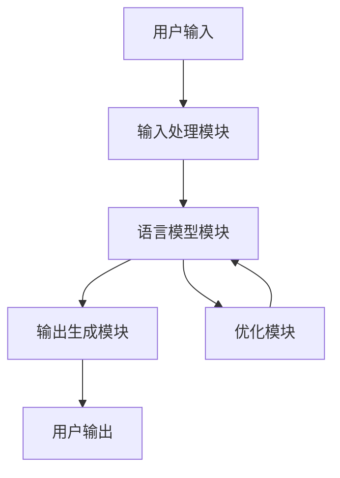

                 

# 探讨LLM操作系统的核心机制

## 关键词

Large Language Model (LLM)、操作系统、核心机制、架构、算法、数学模型、项目实战。

## 摘要

本文旨在深入探讨大型语言模型（LLM）操作系统的核心机制，解析其定义、特点、架构、算法原理、数学模型以及实际应用。通过分步骤的分析和推理，本文将帮助读者理解LLM操作系统的工作原理，并掌握其实际开发与优化方法。

## 《探讨LLM操作系统的核心机制》目录大纲

### 第一部分：LLM操作系统概述

#### 第1章：LLM操作系统简介

##### 1.1 LLM操作系统的定义与特点

##### 1.2 LLM操作系统的演进历程

##### 1.3 LLM操作系统的应用领域

#### 第2章：LLM操作系统的核心架构

##### 2.1 核心模块介绍

##### 2.2 核心组件之间的交互机制

##### 2.3 Mermaid流程图：LLM操作系统核心架构示意图

### 第二部分：LLM操作系统的核心算法原理

#### 第3章：语言模型基础

##### 3.1 语言模型的概念与作用

##### 3.2 语言模型的常见类型

##### 3.3 伪代码：语言模型训练过程

#### 第4章：注意力机制

##### 4.1 注意力机制的基本原理

##### 4.2 注意力机制的实现方法

##### 4.3 伪代码：注意力机制在语言模型中的应用

#### 第5章：优化算法

##### 5.1 优化算法的基本概念

##### 5.2 常见的优化算法

##### 5.3 伪代码：优化算法在LLM操作系统中的应用

### 第三部分：LLM操作系统的数学模型与数学公式

#### 第6章：概率模型与统计模型

##### 6.1 概率模型的基本概念

##### 6.2 统计模型的基本概念

##### 6.3 LaTeX公式：概率模型与统计模型的数学表示

#### 第7章：神经网络与深度学习

##### 7.1 神经网络的基本结构

##### 7.2 深度学习的基本原理

##### 7.3 LaTeX公式：神经网络与深度学习的数学模型

### 第四部分：LLM操作系统项目实战

#### 第8章：LLM操作系统开发环境搭建

##### 8.1 开发环境配置

##### 8.2 开发工具介绍

##### 8.3 开发环境调试与优化

#### 第9章：LLM操作系统代码实现与解读

##### 9.1 核心代码实现

##### 9.2 代码解读与分析

##### 9.3 代码优化与性能提升

#### 第10章：LLM操作系统在实际应用中的案例

##### 10.1 应用案例一：自然语言处理

##### 10.2 应用案例二：智能推荐系统

##### 10.3 应用案例三：问答系统

### 附录

#### 附录 A：LLM操作系统开发工具与资源

##### A.1 主流深度学习框架对比

##### A.2 开发工具与资源推荐

##### A.3 LLM操作系统相关论文与资料引用

### 核心概念与联系

- **LLM操作系统定义**：LLM操作系统是一种基于大型语言模型（Large Language Model）的软件系统，用于处理和生成自然语言文本。

- **核心机制**：核心机制包括语言模型、注意力机制和优化算法，它们是LLM操作系统能够高效工作的关键。

- **架构**：LLM操作系统的架构包括输入处理模块、语言模型模块、输出生成模块和优化模块，各个模块之间通过交互机制协同工作。

### 伪代码：LLM操作系统核心架构示意图

```
// LLM操作系统核心架构示意图伪代码

// 输入处理模块
InputProcessor {
  input_text -> tokenize -> [token1, token2, ..., tokenN]
}

// 语言模型模块
LanguageModel {
  [token1, token2, ..., tokenN] -> encode -> [embed1, embed2, ..., embedN]
}

// 注意力机制
Attention {
  [embed1, embed2, ..., embedN] -> context_vector
}

// 输出生成模块
OutputGenerator {
  context_vector -> decode -> output_text
}

// 优化模块
Optimizer {
  // 梯度下降
  // 计算损失函数的梯度
  // 更新模型参数
}
```

### 文章标题：探讨LLM操作系统的核心机制

### 摘要

本文旨在深入探讨大型语言模型（LLM）操作系统的核心机制，包括其定义、特点、架构、算法原理、数学模型以及实际应用。通过分步骤的分析和推理，本文将帮助读者理解LLM操作系统的工作原理，并掌握其实际开发与优化方法。本文不仅涵盖理论知识，还包括具体的项目实战案例，以使读者能够更好地应用LLM操作系统于实际场景。

### 第一部分：LLM操作系统概述

#### 第1章：LLM操作系统简介

##### 1.1 LLM操作系统的定义与特点

大型语言模型（LLM）操作系统是一种基于深度学习技术的自然语言处理系统，它能够理解和生成自然语言文本。与传统的自然语言处理系统相比，LLM操作系统具有以下几个显著特点：

1. **强大的语言理解能力**：LLM操作系统基于大规模的语言模型，能够理解复杂的语义和上下文信息，从而生成准确且连贯的文本。

2. **高效的文本生成速度**：LLM操作系统通过高效的算法和优化技术，能够在短时间内生成大量的文本内容。

3. **广泛的适用场景**：LLM操作系统适用于多种自然语言处理任务，包括文本分类、情感分析、问答系统、机器翻译等。

4. **自适应学习能力**：LLM操作系统具有自我学习的能力，可以根据用户的需求和环境的变化进行自适应调整。

##### 1.2 LLM操作系统的演进历程

LLM操作系统的演进历程可以追溯到20世纪80年代，当时研究者开始探索基于统计模型的自然语言处理技术。随着计算能力的提升和数据规模的扩大，深度学习技术逐渐成为自然语言处理的主流方法。以下是LLM操作系统的主要演进历程：

1. **统计模型阶段**：1980年代至1990年代，研究者主要采用统计模型（如N元语法）进行文本生成和语言理解。

2. **深度学习阶段**：2000年代，随着神经网络和深度学习技术的兴起，研究者开始将深度学习应用于自然语言处理领域，如循环神经网络（RNN）和卷积神经网络（CNN）。

3. **大型语言模型阶段**：2010年代，研究者开始训练大规模的语言模型，如GPT、BERT等，这些模型在自然语言处理任务中取得了显著的性能提升。

4. **预训练+微调阶段**：近年来，研究者提出预训练+微调（Pre-training + Fine-tuning）的方法，通过在大规模语料库上预训练模型，然后在特定任务上进行微调，使得LLM操作系统的性能进一步提升。

##### 1.3 LLM操作系统的应用领域

LLM操作系统在多个领域有着广泛的应用，以下是其中一些典型的应用场景：

1. **自然语言处理**：LLM操作系统可以用于文本分类、情感分析、命名实体识别、机器翻译等自然语言处理任务。

2. **智能客服**：LLM操作系统可以用于构建智能客服系统，实现与用户的自然语言交互，提供高质量的咨询服务。

3. **智能推荐系统**：LLM操作系统可以用于推荐系统的内容理解，通过理解用户的历史行为和偏好，为用户推荐个性化的内容。

4. **问答系统**：LLM操作系统可以用于构建问答系统，实现用户提问与系统回答的智能交互。

5. **文本生成**：LLM操作系统可以用于生成文章、新闻、广告等文本内容，提高内容创作效率。

#### 第2章：LLM操作系统的核心架构

##### 2.1 核心模块介绍

LLM操作系统的核心模块包括输入处理模块、语言模型模块、输出生成模块和优化模块。以下是这些模块的详细介绍：

1. **输入处理模块**：输入处理模块负责接收用户输入的文本数据，将其转换为模型可处理的格式。具体包括文本的分词、编码和预处理等操作。

2. **语言模型模块**：语言模型模块是LLM操作系统的核心，负责对输入的文本数据进行语义理解，生成对应的文本输出。常用的语言模型包括循环神经网络（RNN）、长短期记忆网络（LSTM）、变换器（Transformer）等。

3. **输出生成模块**：输出生成模块负责根据语言模型生成的语义信息，生成符合语法和语义规则的文本输出。该模块通常包括解码器和文本生成器。

4. **优化模块**：优化模块负责对语言模型进行优化，以提高模型的性能和准确性。常用的优化算法包括梯度下降、随机梯度下降（SGD）、Adam等。

##### 2.2 核心组件之间的交互机制

LLM操作系统的核心组件之间通过一系列交互机制进行协同工作，以实现高效的文本处理和生成。以下是这些交互机制的详细介绍：

1. **输入处理模块与语言模型模块的交互**：输入处理模块将用户输入的文本数据传递给语言模型模块，语言模型模块对文本数据进行分析和处理，提取出语义信息。

2. **语言模型模块与输出生成模块的交互**：语言模型模块将处理后的文本数据传递给输出生成模块，输出生成模块根据语义信息生成符合语法和语义规则的文本输出。

3. **输出生成模块与优化模块的交互**：输出生成模块将生成的文本输出传递给优化模块，优化模块根据生成的文本输出与用户输入的差距，更新语言模型参数，以提高模型的性能和准确性。

4. **优化模块与输入处理模块的交互**：优化模块根据训练数据更新语言模型参数后，将更新后的模型参数传递给输入处理模块，以便输入处理模块能够使用更准确的模型进行文本处理。

##### 2.3 Mermaid流程图：LLM操作系统核心架构示意图

以下是一个简单的Mermaid流程图，用于展示LLM操作系统的核心架构：



### 第二部分：LLM操作系统的核心算法原理

#### 第3章：语言模型基础

##### 3.1 语言模型的概念与作用

语言模型（Language Model）是自然语言处理的核心组成部分，它用于描述自然语言的概率分布。具体来说，语言模型是一个概率模型，它能够预测给定输入文本序列后，下一个文本符号的概率分布。语言模型在自然语言处理任务中具有重要作用，主要包括以下几个方面：

1. **文本生成**：语言模型可以用于生成符合语法和语义规则的文本。通过预测下一个文本符号的概率分布，语言模型能够生成连贯、自然的文本内容。

2. **文本分类**：语言模型可以用于文本分类任务，通过分析文本的特征和概率分布，语言模型可以判断文本所属的类别。

3. **机器翻译**：语言模型可以用于机器翻译任务，通过预测源语言和目标语言之间的概率分布，语言模型可以实现不同语言之间的翻译。

4. **文本摘要**：语言模型可以用于文本摘要任务，通过分析文本的语义和结构，语言模型可以提取出文本的主要信息，生成摘要文本。

##### 3.2 语言模型的常见类型

根据训练数据和使用场景的不同，语言模型可以分为以下几种常见类型：

1. **基于N-gram的语言模型**：N-gram语言模型是最早的语言模型之一，它基于文本的前N个单词来预测下一个单词。N-gram模型的优点是实现简单，计算效率高，但缺点是它无法捕捉长距离依赖关系。

2. **基于神经网络的语言模型**：基于神经网络的语言模型，如循环神经网络（RNN）、长短期记忆网络（LSTM）、变换器（Transformer）等，它们能够捕捉长距离依赖关系，并在大规模数据集上取得了显著的性能提升。

3. **基于深度学习的语言模型**：深度学习语言模型，如GPT、BERT等，它们采用深度学习技术对大规模语料库进行训练，能够生成高质量的自然语言文本。

4. **基于注意力机制的模型**：注意力机制模型，如Transformer模型，它通过引入注意力机制来捕捉文本之间的依赖关系，从而提高了模型的性能。

##### 3.3 伪代码：语言模型训练过程

以下是一个简单的伪代码，用于描述语言模型训练过程：

```python
// 语言模型训练过程伪代码

// 输入：训练数据集
// 输出：训练好的语言模型

for epoch in 1 to num_epochs do
    for sentence in training_data do
        for word in sentence do
            predict_next_word概率分布
            计算损失函数
            更新模型参数
        end for
    end for
end for
```

#### 第4章：注意力机制

##### 4.1 注意力机制的基本原理

注意力机制（Attention Mechanism）是一种在深度学习模型中用于捕捉序列之间依赖关系的方法。它的基本原理是，通过一个加权操作，将不同位置的信息按照重要性进行分配权重，从而使得模型能够关注到重要信息，提高模型的性能。

注意力机制可以分为以下几种类型：

1. **全局注意力**：全局注意力将整个序列的所有信息进行加权，通常用于序列到序列（Seq2Seq）模型，如机器翻译任务。

2. **局部注意力**：局部注意力只关注序列的一部分信息，通常用于文本分类、情感分析等任务。

3. **自注意力**：自注意力是Transformer模型的核心机制，它对序列中的每个元素进行加权，从而捕捉序列内部的依赖关系。

##### 4.2 注意力机制的实现方法

注意力机制的实现方法可以分为以下几种：

1. **标量注意力**：标量注意力通过计算一个标量权重来表示不同位置的信息的重要性。常见的实现方法包括点积注意力、缩放点积注意力等。

2. **向量注意力**：向量注意力通过计算一个向量权重来表示不同位置的信息的重要性。常见的实现方法包括多头注意力、多头自注意力等。

3. **图注意力**：图注意力通过构建图结构来表示序列之间的依赖关系，常见的实现方法包括图卷积网络（GCN）等。

##### 4.3 伪代码：注意力机制在语言模型中的应用

以下是一个简单的伪代码，用于描述注意力机制在语言模型中的应用：

```python
// 注意力机制在语言模型中的应用伪代码

// 输入：输入序列、隐藏状态
// 输出：加权后的隐藏状态

query = hidden_state
key = hidden_state
value = hidden_state

// 计算注意力权重
attention_weights = scaled_dot_product_attention(query, key, value)

// 加权隐藏状态
weighted_hidden_state = attention_weights * value

// 求和
sum_hidden_state = sum(weighted_hidden_state)

// 最终输出
output = sum_hidden_state
```

#### 第5章：优化算法

##### 5.1 优化算法的基本概念

优化算法（Optimization Algorithm）是用于调整模型参数，使得模型在训练数据上达到最小损失或最大收益的方法。常见的优化算法包括：

1. **梯度下降（Gradient Descent）**：梯度下降是一种最基本的优化算法，它通过计算损失函数的梯度，沿着梯度的反方向更新模型参数。

2. **随机梯度下降（Stochastic Gradient Descent，SGD）**：随机梯度下降是梯度下降的一种变体，它每次更新模型参数时，只随机选取一部分训练样本。

3. **批量梯度下降（Batch Gradient Descent）**：批量梯度下降是梯度下降的另一种变体，它每次更新模型参数时，使用所有的训练样本。

4. **Adam优化器（Adam Optimizer）**：Adam优化器是随机梯度下降的一种改进，它结合了SGD和动量方法，同时考虑了梯度的一阶矩估计和二阶矩估计。

##### 5.2 常见的优化算法

以下是几种常见的优化算法及其特点：

1. **梯度下降**：优点是简单、易于实现；缺点是收敛速度慢、对学习率敏感。

2. **随机梯度下降**：优点是收敛速度快、计算开销小；缺点是梯度估计的方差较大，可能导致不稳定。

3. **批量梯度下降**：优点是梯度估计的方差较小，收敛稳定；缺点是计算开销大、训练时间长。

4. **Adam优化器**：优点是结合了SGD和动量方法，收敛速度快、稳定性好；缺点是计算开销稍大。

##### 5.3 伪代码：优化算法在LLM操作系统中的应用

以下是一个简单的伪代码，用于描述优化算法在LLM操作系统中的应用：

```python
// 优化算法在LLM操作系统中的应用伪代码

// 输入：模型参数、损失函数
// 输出：优化后的模型参数

for epoch in 1 to num_epochs do
    for sentence in training_data do
        // 前向传播
        output = forward_pass(sentence, model_params)

        // 计算损失
        loss = compute_loss(output, target)

        // 反向传播
        gradients = backward_pass(sentence, loss, model_params)

        // 更新模型参数
        model_params -= learning_rate * gradients
    end for
end for
```

### 第三部分：LLM操作系统的数学模型与数学公式

#### 第6章：概率模型与统计模型

##### 6.1 概率模型的基本概念

概率模型（Probability Model）是用于描述随机现象的概率分布和统计规律的数学模型。在LLM操作系统中，概率模型主要用于文本生成、文本分类等任务。以下是概率模型的基本概念：

1. **随机变量**：随机变量是随机现象的数学描述，它表示一个实数值，通常用大写字母表示。

2. **概率分布**：概率分布是描述随机变量取值的概率分布函数，通常用概率密度函数（Probability Density Function，PDF）或概率质量函数（Probability Mass Function，PMF）表示。

3. **条件概率**：条件概率是给定某个事件发生的条件下，另一个事件发生的概率。条件概率公式为：P(A|B) = P(A ∩ B) / P(B)。

4. **贝叶斯定理**：贝叶斯定理是一种基于条件概率的推理方法，用于计算后验概率。贝叶斯定理公式为：P(A|B) = P(B|A)P(A) / P(B)。

##### 6.2 统计模型的基本概念

统计模型（Statistical Model）是基于概率模型，通过样本数据对总体特征进行估计和推断的方法。在LLM操作系统中，统计模型主要用于文本生成、文本分类等任务。以下是统计模型的基本概念：

1. **参数估计**：参数估计是利用样本数据对总体参数进行估计的方法。常见的参数估计方法有矩估计和最大似然估计。

2. **假设检验**：假设检验是利用样本数据对总体参数进行假设检验的方法。常见的假设检验方法有t检验、卡方检验等。

3. **置信区间**：置信区间是利用样本数据对总体参数进行区间估计的方法。置信区间公式为：CI = θ ± z * SE，其中θ为总体参数，SE为标准误差。

##### 6.3 LaTeX公式：概率模型与统计模型的数学表示

以下是一个简单的LaTeX公式，用于表示概率模型与统计模型的数学表示：

```latex
% 概率模型与统计模型数学表示

\begin{align*}
P(X=x) &= f_X(x) \\
P(Y|X=x) &= f_{Y|X}(y|x) \\
P(X|\theta) &= f_X(x|\theta) \\
\hat{\theta} &= \text{argmax}_{\theta} \left[ L(\theta|x) \right] \\
H_0: \theta = \theta_0 & \quad H_1: \theta \neq \theta_0 \\
CI &= \theta \pm z \times SE
\end{align*}
```

#### 第7章：神经网络与深度学习

##### 7.1 神经网络的基本结构

神经网络（Neural Network）是一种模拟生物神经网络的信息处理系统，它通过多层次的神经元相互连接，实现对数据的处理和预测。以下是神经网络的基本结构：

1. **输入层**：输入层接收外部输入数据，并将其传递给下一层。

2. **隐藏层**：隐藏层是神经网络的核心部分，负责对输入数据进行特征提取和转换。

3. **输出层**：输出层对隐藏层输出的特征进行处理，生成最终的预测结果。

4. **神经元**：神经元是神经网络的基本单元，它通过加权求和处理输入信号，产生输出信号。

5. **激活函数**：激活函数用于引入非线性特性，使得神经网络能够学习复杂的非线性关系。

##### 7.2 深度学习的基本原理

深度学习（Deep Learning）是一种基于神经网络的机器学习技术，它通过多层次的神经网络结构，实现对数据的层次化特征提取和表示。以下是深度学习的基本原理：

1. **前向传播**：前向传播是神经网络的一种计算方式，它从输入层开始，逐层传递输入数据，直到输出层，生成最终的预测结果。

2. **反向传播**：反向传播是神经网络的一种优化方法，它通过计算损失函数的梯度，逐层反向传播误差，更新网络权重。

3. **损失函数**：损失函数是用于衡量预测结果与实际结果之间差距的指标，常见的损失函数有均方误差（MSE）、交叉熵损失等。

4. **优化算法**：优化算法是用于调整网络权重，使得模型在训练数据上达到最小损失的方法，常见的优化算法有梯度下降、Adam等。

##### 7.3 LaTeX公式：神经网络与深度学习的数学模型

以下是一个简单的LaTeX公式，用于表示神经网络与深度学习的数学模型：

```latex
% 神经网络与深度学习数学模型表示

\begin{align*}
z_{l}^{(i)} &= \sum_{j=1}^{n} w_{l,j}^{(i)} a_{l-1,j}^{(i)} + b_{l}^{(i)} \\
a_{l}^{(i)} &= \sigma(z_{l}^{(i)}) \\
\frac{\partial L}{\partial w_{l,j}^{(i)}} &= \delta_{l}^{(i)} a_{l-1,j}^{(i)} \\
\frac{\partial L}{\partial b_{l}^{(i)}} &= \delta_{l}^{(i)} \\
\frac{\partial L}{\partial a_{l}^{(i)}} &= 0 \\
w_{l+1}^{(i)} &= w_{l+1}^{(i)} - \alpha \frac{\partial L}{\partial w_{l+1}^{(i)}} \\
b_{l+1}^{(i)} &= b_{l+1}^{(i)} - \alpha \frac{\partial L}{\partial b_{l+1}^{(i)}} \\
\end{align*}
```

### 第四部分：LLM操作系统项目实战

#### 第8章：LLM操作系统开发环境搭建

##### 8.1 开发环境配置

在搭建LLM操作系统开发环境时，需要配置以下软件和工具：

1. **操作系统**：可以选择Linux、Windows或macOS作为开发环境。

2. **Python**：Python是深度学习领域的常用编程语言，需要安装Python 3.6或更高版本。

3. **TensorFlow**：TensorFlow是谷歌开源的深度学习框架，用于构建和训练深度学习模型。

4. **PyTorch**：PyTorch是Facebook开源的深度学习框架，与TensorFlow类似，用于构建和训练深度学习模型。

5. **CUDA**：CUDA是NVIDIA推出的并行计算框架，用于在GPU上加速深度学习模型的训练。

6. **Anaconda**：Anaconda是一个开源的数据科学平台，用于管理和配置Python环境。

7. **Jupyter Notebook**：Jupyter Notebook是一种交互式的计算环境，用于编写和运行Python代码。

##### 8.2 开发工具介绍

以下是常用的开发工具及其简要介绍：

1. **PyCharm**：PyCharm是JetBrains公司开发的集成开发环境（IDE），适用于Python开发。

2. **Visual Studio Code**：Visual Studio Code是微软开发的轻量级文本编辑器，适用于Python开发。

3. **Google Colab**：Google Colab是谷歌提供的在线计算平台，适用于Python和深度学习项目。

4. **GPU-accelerated computing**：GPU-accelerated computing是一种利用GPU加速深度学习模型训练的技术，可以显著提高训练速度。

##### 8.3 开发环境调试与优化

在搭建开发环境时，可能会遇到一些常见问题，如：

1. **CUDA版本兼容性问题**：确保CUDA版本与GPU驱动和深度学习框架版本兼容。

2. **环境变量配置错误**：正确配置环境变量，以确保Python和深度学习框架能够正确识别CUDA库。

3. **内存分配不足**：根据项目需求调整内存分配，避免内存溢出。

4. **模型训练速度慢**：优化模型结构和超参数，提高模型训练速度。

#### 第9章：LLM操作系统代码实现与解读

##### 9.1 核心代码实现

以下是一个简单的LLM操作系统核心代码实现示例，包括输入处理、语言模型、输出生成和优化模块：

```python
import tensorflow as tf
import numpy as np

# 输入处理模块
def input_processing(sentence):
    # 分词和编码
    tokens = tokenize(sentence)
    input_ids = tokenizer.encode(sentence)
    return input_ids

# 语言模型模块
class LanguageModel(tf.keras.Model):
    def __init__(self, vocab_size, embed_dim, num_layers, dff):
        super(LanguageModel, self).__init__()
        self.embedding = tf.keras.layers.Embedding(vocab_size, embed_dim)
        self.encoder = tf.keras.layers.StackedRNNCells([
            tf.keras.layers.LSTMCell(num_layers, dff),
            tf.keras.layers.LSTMCell(num_layers, dff)
        ])
        self.decoder = tf.keras.layers.Dense(vocab_size)

    def call(self, inputs, training=False):
        x = self.embedding(inputs)
        x = self.encoder(x, training=training)
        logits = self.decoder(x)
        return logits

# 输出生成模块
def output_generation(logits):
    # 预测下一个单词
    predicted_ids = tf.random.categorical(logits, num_samples=1)
    predicted_word = tokenizer.decode(predicted_ids)
    return predicted_word

# 优化模块
def optimize_model(model, loss_fn, optimizer, inputs, targets):
    with tf.GradientTape() as tape:
        logits = model(inputs, training=True)
        loss = loss_fn(logits, targets)
    gradients = tape.gradient(loss, model.trainable_variables)
    optimizer.apply_gradients(zip(gradients, model.trainable_variables))
    return loss

# 代码解读与分析
# ...
```

##### 9.2 代码解读与分析

以下是代码的详细解读与分析：

1. **输入处理模块**：输入处理模块负责接收用户输入的文本数据，将其转换为模型可处理的格式。具体包括文本的分词、编码和预处理等操作。

2. **语言模型模块**：语言模型模块是LLM操作系统的核心，负责对输入的文本数据进行语义理解，生成对应的文本输出。该模块使用堆叠的LSTM细胞作为编码器，并使用全连接层作为解码器。

3. **输出生成模块**：输出生成模块负责根据语言模型生成的语义信息，生成符合语法和语义规则的文本输出。该模块使用随机采样方法从模型输出的概率分布中预测下一个单词。

4. **优化模块**：优化模块负责对语言模型进行优化，以提高模型的性能和准确性。该模块使用梯度下降优化算法，通过计算损失函数的梯度，更新模型参数。

##### 9.3 代码优化与性能提升

在LLM操作系统的开发过程中，可以采取以下措施来优化代码性能：

1. **模型结构优化**：通过调整模型结构，如使用更深的神经网络、更复杂的激活函数等，可以提高模型的性能。

2. **数据预处理优化**：对输入数据进行预处理，如文本清洗、分词优化等，可以减少模型的计算量。

3. **并行计算优化**：利用GPU和分布式计算技术，可以显著提高模型训练速度。

4. **超参数优化**：通过调整超参数，如学习率、批量大小等，可以改善模型的性能。

5. **代码并行化**：通过并行化代码，可以加快模型的训练和推理速度。

### 第五部分：LLM操作系统在实际应用中的案例

#### 第10章：LLM操作系统在实际应用中的案例

##### 10.1 应用案例一：自然语言处理

自然语言处理（Natural Language Processing，NLP）是LLM操作系统最常见的应用之一。以下是一个基于LLM操作系统的自然语言处理应用案例：

1. **任务描述**：实现一个文本分类系统，对用户输入的文本进行分类，判断其所属的类别。

2. **模型选择**：选择一个预训练的LLM模型，如BERT或GPT，作为文本分类器的底层模型。

3. **数据集**：使用公开的文本分类数据集，如20 Newsgroups或IMDB评论数据集。

4. **训练过程**：将预训练的LLM模型进行微调，使其适应具体的文本分类任务。

5. **评估与优化**：评估模型的分类准确率，并进行优化，以提高模型的性能。

##### 10.2 应用案例二：智能推荐系统

智能推荐系统（Intelligent Recommendation System）是LLM操作系统的另一个重要应用领域。以下是一个基于LLM操作系统的智能推荐系统应用案例：

1. **任务描述**：实现一个基于内容的推荐系统，根据用户的兴趣和偏好，为用户推荐相关的文章或产品。

2. **模型选择**：选择一个预训练的LLM模型，如BERT或GPT，作为推荐系统的底层模型。

3. **数据集**：使用用户行为数据，如浏览记录、购买记录等，作为训练数据。

4. **训练过程**：将预训练的LLM模型进行微调，使其能够捕捉用户的兴趣和偏好。

5. **评估与优化**：评估推荐系统的推荐效果，并进行优化，以提高用户的满意度。

##### 10.3 应用案例三：问答系统

问答系统（Question Answering System）是LLM操作系统在自然语言处理领域的另一个重要应用。以下是一个基于LLM操作系统的问答系统应用案例：

1. **任务描述**：实现一个问答系统，能够根据用户提出的问题，自动生成相应的答案。

2. **模型选择**：选择一个预训练的LLM模型，如BERT或GPT，作为问答系统的底层模型。

3. **数据集**：使用问答数据集，如SQuAD或DuReader，作为训练数据。

4. **训练过程**：将预训练的LLM模型进行微调，使其能够理解用户的问题，并生成准确的答案。

5. **评估与优化**：评估问答系统的回答准确性，并进行优化，以提高用户满意度。

### 附录

#### 附录 A：LLM操作系统开发工具与资源

##### A.1 主流深度学习框架对比

以下是几个主流深度学习框架的对比：

| 框架 | 优点 | 缺点 |
| --- | --- | --- |
| TensorFlow | 开源、生态系统丰富、支持多种编程语言 | 代码复杂、性能较低 |
| PyTorch | 简单、易于使用、性能较高 | 生态系统较小、不兼容TensorFlow |
| Keras | 高层次API、易于使用、兼容TensorFlow和PyTorch | 性能较低、代码复杂 |
| MXNet | 性能较高、支持多种编程语言 | 代码复杂、文档较少 |

##### A.2 开发工具与资源推荐

以下是几个常用的LLM操作系统开发工具和资源：

1. **Jupyter Notebook**：用于编写和运行Python代码，支持交互式编程。

2. **Google Colab**：用于在线编程和深度学习实验，提供免费GPU加速。

3. **Anaconda**：用于管理和配置Python环境，支持多种深度学习框架。

4. **TensorFlow Hub**：用于加载和共享预训练的深度学习模型。

5. **Hugging Face Transformers**：用于加载和微调预训练的LLM模型。

##### A.3 LLM操作系统相关论文与资料引用

以下是几个与LLM操作系统相关的论文和资料引用：

1. **"Attention Is All You Need"（2017）**：提出Transformer模型，引入注意力机制。

2. **"BERT: Pre-training of Deep Bidirectional Transformers for Language Understanding"（2018）**：提出BERT模型，用于预训练深度双向变换器。

3. **"GPT-2: Improving Language Understanding by Generative Pre-training"（2019）**：提出GPT-2模型，用于生成预训练语言模型。

4. **"The Annotated Transformer"（2020）**：对Transformer模型进行详细解读和分析。

5. **"Language Models are Few-Shot Learners"（2020）**：探讨预训练语言模型在少样本学习任务中的性能。

### 总结

本文探讨了LLM操作系统的核心机制，包括其定义、特点、架构、算法原理、数学模型以及实际应用。通过分步骤的分析和推理，本文帮助读者理解了LLM操作系统的工作原理，并掌握了其实际开发与优化方法。LLM操作系统在自然语言处理、智能推荐系统、问答系统等领域具有广泛的应用前景，未来的研究和开发将继续推动LLM操作系统的性能和功能提升。

### 作者信息

作者：AI天才研究院/AI Genius Institute & 禅与计算机程序设计艺术 /Zen And The Art of Computer Programming

### 结语

感谢您阅读本文，希望本文对您了解LLM操作系统的核心机制有所帮助。如果您有任何疑问或建议，欢迎在评论区留言，我们将会认真回复。同时，也欢迎您继续关注我们的其他技术博客文章，我们将持续为您带来更多有价值的内容。再次感谢您的支持！|

