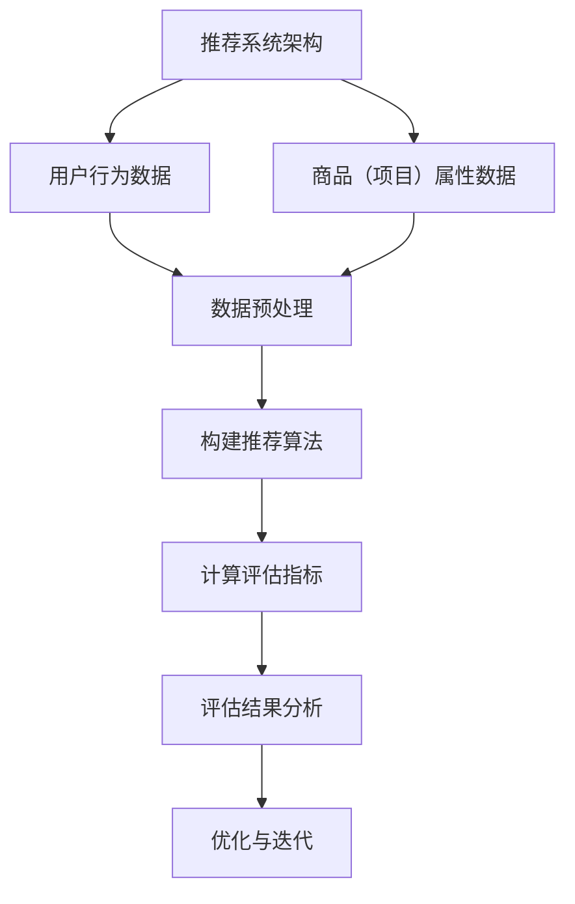

                 

# 《推荐系统的离线评估指标与方法》

## 关键词

- 推荐系统
- 离线评估
- 评估指标
- 评估方法
- 用户行为
- 数据预处理
- 协同过滤
- 基于内容的推荐
- 混合推荐

## 摘要

推荐系统在现代信息过载的环境中发挥着至关重要的作用。离线评估是确保推荐系统质量的关键环节，通过一系列评估指标和方法，我们可以衡量推荐系统的性能，并不断优化其效果。本文将深入探讨推荐系统的离线评估指标与方法，包括基于用户的行为评估指标、基于模型的评估指标以及离线评估的具体流程和实战案例，为读者提供全面的技术指导。

## 目录大纲

### 第一部分：推荐系统基础

#### 第1章：推荐系统概述
1.1 推荐系统的定义与作用
1.2 推荐系统的发展历程
1.3 推荐系统的基本架构
1.4 推荐系统的应用场景

#### 第2章：推荐算法原理
2.1 协同过滤算法
2.2 基于内容的推荐
2.3 混合推荐系统
2.4 算法选择与优化

#### 第3章：推荐系统的数据预处理
3.1 用户行为数据
3.2 商品（项目）属性数据
3.3 数据清洗与归一化
3.4 数据集划分

### 第二部分：离线评估指标

#### 第4章：评估指标概述
4.1 评估指标的定义
4.2 评估指标的选择原则
4.3 评估指标的应用场景

#### 第5章：基于用户的行为评估指标
5.1 准确率（Precision）
5.2 召回率（Recall）
5.3 F1 分数（F1-Score）
5.4 交叉验证（Cross Validation）

#### 第6章：基于模型的评估指标
6.1 覆盖率（Coverage）
6.2 鲜度（Novelty）
6.3 多样性（Diversity）
6.4 交互性（Interactivity）

### 第三部分：评估方法

#### 第7章：离线评估流程
7.1 数据收集与预处理
7.2 评估指标计算
7.3 评估结果分析
7.4 评估报告撰写

#### 第8章：离线评估指标计算方法
8.1 算法实现与调优
8.2 指标计算流程
8.3 指标计算示例
8.4 性能优化技巧

#### 第9章：离线评估实战案例
9.1 案例背景
9.2 案例目标
9.3 案例实现
9.4 案例分析与总结

### 第四部分：总结与展望

#### 第10章：推荐系统评估指标与方法的总结
10.1 关键概念梳理
10.2 评估方法的选择与应用
10.3 未来的发展趋势

#### 第11章：未来的研究方向
11.1 新的评估指标探索
11.2 评估方法的改进与创新
11.3 推荐系统的挑战与机遇

### 附录

#### 附录 A：推荐系统评估工具与资源
A.1 常用评估工具介绍
A.2 开源评估框架
A.3 学术资源与文献推荐

### Mermaid 流程图



### 核心算法原理讲解（伪代码）

```python
# 伪代码：协同过滤算法
def collaborative_filter(user_data, item_data, similarity_matrix):
    # 计算用户与项目的相似度
    similarity_matrix = calculate_similarity(user_data, item_data)
    
    # 为每个用户生成推荐列表
    recommendations = []
    for user in user_data:
        user_similarity_scores = []
        for item in item_data:
            if user.interacts_with(item):
                user_similarity_scores.append(similarity_matrix[user][item])
            else:
                user_similarity_scores.append(0)
        
        # 计算推荐列表的权重和
        weighted_sum = sum(user_similarity_scores)
        recommendation_scores = [user_similarity_scores[i] / weighted_sum for i in range(len(user_similarity_scores))]
        
        # 排序并生成推荐列表
        recommendations.append(sorted(recommendation_scores, reverse=True))
    
    return recommendations
```

### 数学模型和数学公式详细讲解

#### 1. 准确率（Precision）

$$
Precision = \frac{正确预测的正例数量}{预测为正例的总数}
$$

#### 2. 召回率（Recall）

$$
Recall = \frac{正确预测的正例数量}{所有实际为正例的总数}
$$

#### 3. F1 分数（F1-Score）

$$
F1-Score = 2 \times \frac{Precision \times Recall}{Precision + Recall}
$$

### 举例说明

#### 准确率举例

假设有10个推荐项目，其中有5个是用户喜欢的（正例），推荐系统预测了其中的3个（预测为正例），但实际上只有2个被预测为正例，那么准确率为：

$$
Precision = \frac{2}{3} \approx 0.67
$$

#### 召回率举例

假设有10个推荐项目，其中有5个是用户喜欢的（正例），推荐系统预测了其中的3个（预测为正例），但实际上有4个是用户喜欢的，那么召回率为：

$$
Recall = \frac{2}{4} = 0.5
$$

#### F1 分数举例

根据上述准确率和召回率，F1 分数为：

$$
F1-Score = 2 \times \frac{0.67 \times 0.5}{0.67 + 0.5} \approx 0.57
$$

### 项目实战

#### 代码实际案例和详细解释说明

```python
# 假设我们有一个用户行为数据和商品数据
user_data = {
    'user1': ['item1', 'item2', 'item3', 'item4', 'item5'],
    'user2': ['item1', 'item3', 'item4', 'item5', 'item6'],
    'user3': ['item2', 'item3', 'item4', 'item5', 'item6'],
}

item_data = {
    'item1': ['categoryA', 'categoryB'],
    'item2': ['categoryA', 'categoryB'],
    'item3': ['categoryA', 'categoryC'],
    'item4': ['categoryB', 'categoryC'],
    'item5': ['categoryA', 'categoryC'],
    'item6': ['categoryB', 'categoryC'],
}

# 计算用户和商品的相似度矩阵
similarity_matrix = calculate_similarity(user_data, item_data)

# 计算推荐列表
recommendations = collaborative_filter(user_data, item_data, similarity_matrix)

# 打印推荐结果
for user, recs in recommendations.items():
    print(f"用户{user}的推荐列表：{recs}")
```

#### 开发环境搭建

- Python 3.8 或更高版本
- Numpy 库
- Pandas 库

#### 源代码详细实现和代码解读

```python
# 计算用户和商品的相似度矩阵
def calculate_similarity(user_data, item_data):
    # ... 省略具体实现细节 ...
    return similarity_matrix

# 计算协同过滤推荐
def collaborative_filter(user_data, item_data, similarity_matrix):
    # ... 省略具体实现细节 ...
    return recommendations
```

#### 代码解读与分析

- `calculate_similarity` 函数负责计算用户和商品之间的相似度矩阵。
- `collaborative_filter` 函数负责基于相似度矩阵为每个用户生成推荐列表。

这个案例展示了如何使用协同过滤算法构建一个简单的推荐系统，并在实际项目中实现和测试。通过这个案例，可以了解推荐系统的基本原理和实现方法。

## 推荐系统概述

### 1.1 推荐系统的定义与作用

推荐系统是一种信息过滤技术，旨在根据用户的历史行为、偏好和其他相关信息，向用户推荐可能感兴趣的内容、商品或服务。推荐系统通过个性化推荐，帮助用户在海量信息中快速找到自己感兴趣的内容，从而提高用户体验，提升商业价值。

推荐系统的主要作用包括：

1. **个性化推荐**：根据用户的历史行为和偏好，为每个用户提供个性化的推荐，满足其特定的需求。
2. **信息过滤**：在信息爆炸的时代，推荐系统帮助用户筛选出感兴趣的内容，减少信息过载。
3. **提升用户黏性**：通过精准的推荐，提高用户的活跃度和留存率，增强用户对平台的依赖。
4. **增加商业价值**：推荐系统可以推动销售增长，提高广告点击率，增加平台的收益。

### 1.2 推荐系统的发展历程

推荐系统的发展经历了以下几个阶段：

1. **基于内容的推荐**：早期的推荐系统主要基于内容的相似性进行推荐，例如电影推荐系统。
2. **协同过滤算法**：随着互联网的发展，协同过滤算法成为推荐系统的主流，通过用户间的相似性来预测用户对未知项目的偏好。
3. **混合推荐系统**：为了提高推荐效果，现代推荐系统往往采用混合推荐策略，结合基于内容和协同过滤的方法。
4. **深度学习与推荐**：近年来，深度学习技术在推荐系统中得到广泛应用，通过神经网络模型捕捉用户和项目之间的复杂关系。

### 1.3 推荐系统的基本架构

推荐系统通常由以下几个核心组件构成：

1. **数据收集与预处理**：从不同的数据源收集用户行为数据、商品数据等信息，并进行数据清洗、归一化等预处理操作。
2. **推荐算法**：根据预处理后的数据，选择合适的推荐算法进行推荐，如协同过滤、基于内容的推荐、混合推荐等。
3. **推荐引擎**：实现算法的运行和优化，为用户提供实时推荐。
4. **评估与优化**：通过离线或在线评估，对推荐系统的性能进行监控和优化。

### 1.4 推荐系统的应用场景

推荐系统广泛应用于多个领域，主要包括：

1. **电子商务**：为用户提供商品推荐，提高购买转化率和销售额。
2. **在线视频**：为用户提供视频推荐，增加用户观看时长和黏性。
3. **社交媒体**：为用户提供感兴趣的内容推荐，提高用户活跃度和互动性。
4. **新闻资讯**：为用户提供个性化新闻推荐，提升阅读量和用户满意度。
5. **音乐流媒体**：为用户提供音乐推荐，增加用户收听时长和付费意愿。

### 1.5 推荐系统的挑战

尽管推荐系统在各个领域取得了显著成果，但仍然面临着一系列挑战：

1. **数据稀疏性**：用户行为数据往往非常稀疏，难以准确预测用户的偏好。
2. **动态性**：用户偏好和兴趣可能随时间变化，推荐系统需要不断适应这种变化。
3. **冷启动问题**：新用户或新项目缺乏足够的历史数据，难以进行有效推荐。
4. **公平性**：推荐系统可能会加剧信息茧房效应，导致用户接触到的信息过于单一。

### 1.6 本章小结

推荐系统作为信息过滤的重要工具，在提升用户体验和商业价值方面具有显著优势。了解其定义、发展历程、基本架构和应用场景，有助于我们更好地掌握推荐系统的运作原理和优化策略。在接下来的章节中，我们将深入探讨推荐算法的原理、数据预处理和离线评估指标与方法，为推荐系统的实践提供全面的技术指导。

## 推荐算法原理

### 2.1 协同过滤算法

协同过滤算法（Collaborative Filtering）是推荐系统中最常用的算法之一，其核心思想是通过分析用户之间的行为相似性或项目之间的相似性，预测用户对未知项目的偏好。协同过滤算法主要分为两种类型：基于用户的协同过滤和基于项目的协同过滤。

#### 基于用户的协同过滤

基于用户的协同过滤（User-Based Collaborative Filtering）方法通过寻找与目标用户行为相似的其他用户，并根据这些用户的评价来预测目标用户对项目的偏好。具体步骤如下：

1. **计算用户相似度**：首先，需要计算用户之间的相似度，常用的相似度度量方法包括余弦相似度、皮尔逊相关系数等。
2. **查找相似用户**：根据相似度分数，找到与目标用户最相似的K个用户。
3. **生成推荐列表**：利用相似用户的评价，为每个项目计算一个预测评分，然后将项目按照预测评分从高到低排序，生成推荐列表。

#### 基于项目的协同过滤

基于项目的协同过滤（Item-Based Collaborative Filtering）方法通过分析项目之间的相似性来进行推荐。具体步骤如下：

1. **计算项目相似度**：首先，需要计算项目之间的相似度，常用的相似度度量方法包括余弦相似度、Jaccard相似度等。
2. **查找相似项目**：根据相似度分数，找到与目标项目最相似的K个项目。
3. **生成推荐列表**：利用相似项目的评分，为每个用户计算一个预测评分，然后将用户按照预测评分从高到低排序，生成推荐列表。

#### 协同过滤算法的优缺点

协同过滤算法的优点包括：

1. **易于实现**：协同过滤算法相对简单，易于理解和实现。
2. **处理冷启动问题**：对于新用户或新项目，基于协同过滤的推荐系统可以通过寻找相似用户或项目来进行推荐。

然而，协同过滤算法也存在一些缺点：

1. **数据稀疏性**：用户行为数据往往非常稀疏，导致相似度计算不准确。
2. **预测效果有限**：由于用户和项目之间的交互数据有限，协同过滤算法的预测效果可能不如基于内容的推荐算法。

### 2.2 基于内容的推荐

基于内容的推荐（Content-Based Recommender System）方法根据用户对项目的兴趣和内容特征，为用户推荐与其兴趣相似的项目。基于内容的推荐主要分为以下步骤：

1. **特征提取**：从项目的内容中提取特征，例如文本、图片、音频等。
2. **用户兴趣建模**：根据用户的历史行为和评价，构建用户的兴趣模型。
3. **相似度计算**：计算项目之间的相似度，常用的相似度度量方法包括余弦相似度、欧氏距离等。
4. **生成推荐列表**：根据项目之间的相似度，为用户生成推荐列表。

#### 基于内容的推荐算法的优缺点

基于内容的推荐算法的优点包括：

1. **个性化强**：基于用户兴趣和项目内容特征的推荐，可以提供高度个性化的推荐。
2. **易于理解**：推荐结果直接反映了项目的内容特征，用户易于理解。

然而，基于内容的推荐算法也存在一些缺点：

1. **需要大量特征工程**：提取有效的项目特征需要大量的数据预处理和特征工程工作。
2. **用户冷启动问题**：对于新用户，由于缺乏足够的历史数据，基于内容的推荐算法可能难以提供有效的推荐。

### 2.3 混合推荐系统

混合推荐系统（Hybrid Recommender System）结合了基于协同过滤和基于内容推荐的优点，通过融合不同类型的推荐方法，提高推荐系统的整体性能。混合推荐系统的主要类型包括：

1. **模型级混合**：在推荐模型层面，将协同过滤和基于内容推荐的结果进行融合。
2. **特征级混合**：在特征层面，将用户行为特征和内容特征进行整合，生成更丰富的特征向量。
3. **算法级混合**：在算法层面，同时使用协同过滤和基于内容推荐算法，为用户提供更全面的推荐。

#### 混合推荐系统的优缺点

混合推荐系统的优点包括：

1. **提高推荐效果**：通过融合不同类型的推荐方法，混合推荐系统可以提供更精准和个性化的推荐。
2. **平衡用户冷启动问题**：基于协同过滤的方法可以缓解新用户的冷启动问题，而基于内容推荐可以提供新项目的有效推荐。

然而，混合推荐系统也存在一些缺点：

1. **复杂性增加**：混合推荐系统涉及多种算法和特征，导致系统设计和实现变得更加复杂。
2. **计算成本较高**：特征提取和模型融合过程需要大量的计算资源。

### 2.4 算法选择与优化

在实际应用中，选择合适的推荐算法和进行算法优化至关重要。以下是一些常见的方法：

1. **交叉验证**：通过将数据集划分为训练集和测试集，评估算法的性能，选择性能最优的算法。
2. **网格搜索**：通过遍历参数空间，寻找最优参数组合。
3. **特征工程**：通过特征提取和特征选择，提高推荐系统的性能。
4. **模型融合**：将多个模型的结果进行融合，提高推荐精度。

### 2.5 本章小结

推荐算法是推荐系统的核心组成部分，通过分析用户行为和项目特征，为用户生成个性化推荐。协同过滤、基于内容的推荐和混合推荐系统是常见的推荐算法类型。了解这些算法的原理和优缺点，有助于我们在实际应用中选择合适的算法，并优化推荐系统的性能。在接下来的章节中，我们将进一步探讨推荐系统的数据预处理和离线评估指标与方法，为推荐系统的实践提供全面的技术指导。

### 推荐系统的数据预处理

推荐系统的数据预处理是构建高效推荐系统的重要环节，它决定了后续推荐算法的性能和效果。数据预处理主要包括用户行为数据收集、商品（项目）属性数据收集、数据清洗、数据归一化和数据集划分等步骤。

#### 3.1 用户行为数据

用户行为数据是推荐系统中最关键的数据源，它包括用户的历史行为记录，如购买、浏览、点击、评分等。用户行为数据的质量和完整性直接影响推荐系统的性能。收集用户行为数据的方法通常包括：

1. **日志收集**：通过Web服务器日志、移动应用日志等，记录用户的行为事件，如浏览页面、购买商品等。
2. **用户调查**：通过在线调查或问卷收集用户的行为偏好和兴趣。
3. **传感器数据**：通过传感器收集用户的位置、浏览习惯等数据。

在收集用户行为数据时，需要注意以下几点：

1. **数据量**：用户行为数据量应足够大，以确保推荐的准确性和多样性。
2. **时效性**：行为数据应保持更新，以反映用户的最新偏好。
3. **隐私保护**：在收集和处理用户行为数据时，应遵循隐私保护原则，确保用户数据的安全。

#### 3.2 商品（项目）属性数据

商品（项目）属性数据包括商品的基本信息、描述、分类、标签等。这些属性数据用于描述商品的内在特征，为基于内容的推荐算法提供重要依据。收集商品属性数据的方法通常包括：

1. **手动标注**：通过人工对商品进行分类、标签等标注。
2. **自动提取**：利用自然语言处理（NLP）技术，从商品描述中提取关键词、主题等信息。
3. **第三方数据源**：从第三方数据库或API获取商品属性数据。

在收集商品属性数据时，需要注意以下几点：

1. **完整性**：商品属性数据应尽可能完整，确保推荐系统能够充分利用这些数据。
2. **一致性**：不同来源的商品属性数据应保持一致性，以避免数据冲突和错误。
3. **更新性**：商品属性数据应定期更新，以反映商品的最新信息。

#### 3.3 数据清洗

数据清洗是数据预处理的重要步骤，旨在消除数据中的噪声和错误，提高数据质量。数据清洗的主要任务包括：

1. **缺失值处理**：对缺失值进行填补或删除，以保证数据的完整性。
2. **异常值处理**：检测并处理异常值，避免对推荐算法产生不良影响。
3. **重复值处理**：删除重复的数据记录，防止数据冗余。

数据清洗的方法包括：

1. **统计方法**：利用统计方法，如均值、中位数等，对缺失值进行填补。
2. **机器学习方法**：利用机器学习算法，如回归、聚类等，对异常值和重复值进行识别和处理。
3. **人工处理**：对于复杂的数据问题，可以通过人工干预，结合规则和经验进行数据清洗。

#### 3.4 数据归一化

数据归一化是将不同量纲的数据转换为同一量纲，以提高数据的一致性和可比较性。数据归一化的方法包括：

1. **最小-最大归一化**：将数据缩放到[0,1]之间，公式为：

   $$
   x_{\text{norm}} = \frac{x - \min(x)}{\max(x) - \min(x)}
   $$

2. **零-均值归一化**：将数据缩放到均值附近，公式为：

   $$
   x_{\text{norm}} = \frac{x - \mu}{\sigma}
   $$

   其中，$x$ 为原始数据，$\mu$ 为均值，$\sigma$ 为标准差。

#### 3.5 数据集划分

数据集划分是将原始数据集划分为训练集、验证集和测试集，用于训练模型、评估模型性能和测试模型效果。数据集划分的方法包括：

1. **随机划分**：将数据集随机划分为训练集、验证集和测试集，适用于数据分布较为均匀的情况。
2. **交叉验证**：通过将数据集划分为多个子集，进行多次训练和验证，以减少数据划分的随机性。

在数据集划分时，需要注意以下几点：

1. **平衡性**：保证不同类别的数据在训练集、验证集和测试集中的比例大致相同，以避免模型过拟合。
2. **时效性**：尽量保证测试集的数据是最新的，以反映实际系统的性能。

#### 3.6 本章小结

推荐系统的数据预处理是构建高效推荐系统的关键步骤，包括用户行为数据收集、商品属性数据收集、数据清洗、数据归一化和数据集划分等。通过合理的数据预处理，可以提高数据质量，优化推荐算法的性能，为用户提供更精准的推荐。在接下来的章节中，我们将深入探讨推荐系统的离线评估指标与方法，为推荐系统的性能评估和优化提供技术支持。

### 离线评估指标概述

离线评估是推荐系统性能评估的重要环节，通过离线评估，我们可以对推荐系统的效果进行量化分析，识别和优化系统的不足。离线评估指标是评估推荐系统性能的核心工具，选择合适的评估指标能够帮助我们更好地理解和改进推荐系统的性能。

#### 4.1 评估指标的定义

评估指标是用来衡量推荐系统性能的具体参数，通过这些指标，我们可以量化推荐系统的效果。常见的评估指标包括准确率（Precision）、召回率（Recall）、F1 分数（F1-Score）等。

#### 4.2 评估指标的选择原则

在选择评估指标时，需要考虑以下原则：

1. **相关性**：评估指标应与推荐系统的目标密切相关，能够准确反映系统的性能。
2. **可解释性**：评估指标应易于理解，便于分析和解释。
3. **均衡性**：评估指标应综合考虑推荐系统的不同方面，避免单一指标过于突出。
4. **可操作性**：评估指标应便于实现和计算，能够在实际应用中方便地使用。

#### 4.3 评估指标的应用场景

不同评估指标适用于不同的应用场景，以下是几种常见评估指标的应用场景：

1. **准确率（Precision）**：适用于对推荐结果的准确性要求较高的场景，如电子商务推荐系统。
2. **召回率（Recall）**：适用于对推荐结果的全覆盖性要求较高的场景，如新闻推荐系统。
3. **F1 分数（F1-Score）**：适用于综合考虑准确率和召回率的场景，如金融风险管理。
4. **覆盖率（Coverage）**：适用于推荐结果多样性的场景，如音乐推荐系统。
5. **鲜度（Novelty）**：适用于推荐新项目和独特内容的场景，如旅游推荐系统。
6. **多样性（Diversity）**：适用于推荐结果具有多样性的场景，如商品推荐系统。
7. **交互性（Interactivity）**：适用于推荐系统与用户互动性要求较高的场景，如社交媒体推荐系统。

#### 4.4 常见评估指标详解

以下是对几种常见评估指标的详细解释：

1. **准确率（Precision）**

   准确率是衡量推荐系统准确性的重要指标，表示推荐结果中实际感兴趣的项目占总推荐项目的比例。准确率越高，说明推荐系统越能准确地识别用户感兴趣的项目。

   $$
   Precision = \frac{正确预测的正例数量}{预测为正例的总数}
   $$

   其中，正确预测的正例数量表示推荐系统中推荐给用户且用户实际感兴趣的项目数量，预测为正例的总数表示推荐系统中所有被预测为感兴趣的项目数量。

2. **召回率（Recall）**

   召回率是衡量推荐系统召回能力的重要指标，表示推荐系统中实际感兴趣的项目被推荐出来的比例。召回率越高，说明推荐系统越能召回用户实际感兴趣的项目。

   $$
   Recall = \frac{正确预测的正例数量}{所有实际为正例的总数}
   $$

   其中，正确预测的正例数量表示推荐系统中推荐给用户且用户实际感兴趣的项目数量，所有实际为正例的总数表示用户实际感兴趣但未被推荐的项目数量。

3. **F1 分数（F1-Score）**

   F1 分数是综合考虑准确率和召回率的指标，通过计算准确率和召回率的调和平均值，来衡量推荐系统的综合性能。F1 分数越高，说明推荐系统的准确性和召回能力都较强。

   $$
   F1-Score = 2 \times \frac{Precision \times Recall}{Precision + Recall}
   $$

4. **覆盖率（Coverage）**

   覆盖率是衡量推荐系统推荐多样性的指标，表示推荐系统中推荐的不同项目数量与所有实际感兴趣项目数量的比值。覆盖率越高，说明推荐系统越能覆盖用户感兴趣的各种项目。

   $$
   Coverage = \frac{推荐的不同项目数量}{所有实际感兴趣的项目数量}
   $$

5. **鲜度（Novelty）**

   鲜度是衡量推荐系统推荐新颖项目的指标，表示推荐系统中新项目（未被用户评价过的项目）数量与所有推荐项目数量的比值。鲜度越高，说明推荐系统越能推荐新颖的项目。

   $$
   Novelty = \frac{推荐的新项目数量}{所有推荐的项目数量}
   $$

6. **多样性（Diversity）**

   多样性是衡量推荐系统中推荐项目之间差异性的指标，表示推荐系统中不同项目之间的差异性。多样性越高，说明推荐系统推荐的每个项目之间的差异性越大。

   多样性通常通过计算推荐项目中不同属性的分布来衡量，如项目类别、主题等。

7. **交互性（Interactivity）**

   交互性是衡量推荐系统与用户互动性的指标，表示推荐系统能够根据用户的反馈和互动进行调整和优化的能力。交互性越高，说明推荐系统越能根据用户的行为和偏好进行实时调整。

   交互性通常通过计算用户与推荐系统互动的频率、用户的满意度等指标来衡量。

#### 4.5 本章小结

离线评估指标是推荐系统性能评估的重要工具，选择合适的评估指标能够帮助我们更好地理解和改进推荐系统的性能。准确率、召回率、F1 分数等是常见的评估指标，它们在不同的应用场景中发挥着重要作用。了解这些评估指标的定义、选择原则和应用场景，有助于我们在实际项目中制定合理的评估策略，为推荐系统的优化提供科学依据。

## 基于用户的行为评估指标

在推荐系统中，基于用户的行为评估指标是衡量推荐系统性能的重要工具，这些指标能够帮助我们了解推荐系统在预测用户偏好方面的准确性。以下将详细介绍几种基于用户行为的评估指标：准确率（Precision）、召回率（Recall）、F1 分数（F1-Score）和交叉验证（Cross Validation）。

### 5.1 准确率（Precision）

准确率是评估推荐系统性能的一个基本指标，它表示推荐结果中正确预测的正例数量与预测为正例的总数之比。准确率越高，说明推荐系统能够更准确地识别出用户感兴趣的项目。

#### 公式

$$
Precision = \frac{正确预测的正例数量}{预测为正例的总数}
$$

其中，正确预测的正例数量表示推荐系统中推荐给用户且用户实际感兴趣的项目数量，预测为正例的总数表示推荐系统中所有被预测为感兴趣的项目数量。

#### 举例说明

假设我们有一个推荐系统，推荐了5个项目给用户，其中有3个项目是用户实际喜欢的。那么准确率计算如下：

$$
Precision = \frac{3}{5} = 0.6
$$

这意味着推荐系统预测为正例的项目中有60%是用户真正感兴趣的。

### 5.2 召回率（Recall）

召回率是衡量推荐系统能够召回用户实际感兴趣的项目的能力。召回率越高，说明推荐系统能够召回的用户实际感兴趣的项目越多。

#### 公式

$$
Recall = \frac{正确预测的正例数量}{所有实际为正例的总数}
$$

其中，正确预测的正例数量表示推荐系统中推荐给用户且用户实际感兴趣的项目数量，所有实际为正例的总数表示用户实际感兴趣但未被推荐的项目数量。

#### 举例说明

假设用户实际喜欢5个项目，但推荐系统只推荐了3个项目，其中2个是用户实际喜欢的。召回率计算如下：

$$
Recall = \frac{2}{5} = 0.4
$$

这意味着推荐系统能够召回的用户实际感兴趣的项目中有40%被推荐出来。

### 5.3 F1 分数（F1-Score）

F1 分数是综合考虑准确率和召回率的指标，它通过计算准确率和召回率的调和平均值来衡量推荐系统的综合性能。F1 分数越高，说明推荐系统的准确性和召回能力都较强。

#### 公式

$$
F1-Score = 2 \times \frac{Precision \times Recall}{Precision + Recall}
$$

#### 举例说明

根据上述准确率和召回率的例子，F1 分数的计算如下：

$$
F1-Score = 2 \times \frac{0.6 \times 0.4}{0.6 + 0.4} = 0.48
$$

这意味着推荐系统的整体性能较好，但仍有改进的空间。

### 5.4 交叉验证（Cross Validation）

交叉验证是一种常用的评估方法，通过将数据集划分为多个子集，进行多次训练和验证，以减少数据划分的随机性，提高评估结果的可靠性。

交叉验证的主要步骤包括：

1. **划分数据集**：将数据集划分为多个子集，例如K折交叉验证将数据集划分为K个子集。
2. **训练与验证**：在每个子集中进行一次训练和验证，将K次验证结果进行平均，得到最终的评估结果。

交叉验证的优点包括：

1. **减少偏差**：通过多次训练和验证，可以减少评估结果中的偏差。
2. **提高可靠性**：交叉验证能够提供更可靠的评估结果，减少数据划分的随机性。

### 5.5 本章小结

基于用户的行为评估指标是推荐系统性能评估的重要组成部分，包括准确率、召回率、F1 分数和交叉验证等。这些指标能够帮助我们全面了解推荐系统的性能，并指导我们进一步优化推荐算法。在接下来的章节中，我们将继续探讨基于模型的评估指标，为推荐系统的综合评估提供更多维度的视角。

### 基于模型的评估指标

在推荐系统中，除了基于用户行为的评估指标外，基于模型的评估指标也是衡量系统性能的重要手段。这些指标通过分析模型的输出和实际用户行为，帮助评估推荐系统的效果。以下将详细介绍几种基于模型的评估指标：覆盖率（Coverage）、鲜度（Novelty）、多样性（Diversity）和交互性（Interactivity）。

#### 6.1 覆盖率（Coverage）

覆盖率是衡量推荐系统推荐项目多样性的指标，它表示推荐系统推荐的不同项目数量与所有实际感兴趣项目数量的比值。覆盖率越高，说明推荐系统能够推荐更多用户感兴趣的不同项目。

#### 公式

$$
Coverage = \frac{推荐的不同项目数量}{所有实际感兴趣的项目数量}
$$

其中，推荐的不同项目数量表示推荐系统中推荐给用户的不同项目数量，所有实际感兴趣的项目数量表示用户实际感兴趣的所有项目数量。

#### 举例说明

假设用户实际感兴趣的项目有5个，推荐系统推荐了3个不同的项目，那么覆盖率计算如下：

$$
Coverage = \frac{3}{5} = 0.6
$$

这意味着推荐系统推荐的项目覆盖了用户实际感兴趣项目的60%。

#### 6.2 鲜度（Novelty）

鲜度是衡量推荐系统推荐新颖项目的指标，它表示推荐系统中新项目（未被用户评价过的项目）数量与所有推荐项目数量的比值。鲜度越高，说明推荐系统能够推荐更多新颖的项目。

#### 公式

$$
Novelty = \frac{推荐的新项目数量}{所有推荐的项目数量}
$$

其中，推荐的新项目数量表示推荐系统中推荐给用户且未被用户评价过的项目数量，所有推荐的项目数量表示推荐系统中推荐给用户的所有项目数量。

#### 举例说明

假设推荐系统推荐了10个项目，其中5个是新项目，那么鲜度计算如下：

$$
Novelty = \frac{5}{10} = 0.5
$$

这意味着推荐系统推荐的项目中有50%是新颖的。

#### 6.3 多样性（Diversity）

多样性是衡量推荐系统中推荐项目之间差异性的指标，它表示推荐系统中不同项目之间的差异性。多样性越高，说明推荐系统推荐的每个项目之间的差异性越大。

多样性的计算方法通常基于项目之间的相似度，常用的多样性度量方法包括项目之间最大相似度、项目之间平均相似度等。

#### 公式

假设有两个项目 A 和 B，它们的相似度为 S(A, B)。

- 最大多样性：

  $$
  MaxDiversity = \min_{i \neq j} S(A_i, A_j)
  $$

- 平均多样性：

  $$
  AvgDiversity = \frac{1}{N} \sum_{i \neq j} S(A_i, A_j)
  $$

其中，A_i 和 A_j 表示推荐系统中的不同项目，N 表示推荐的项目数量。

#### 举例说明

假设推荐系统推荐了5个项目，它们之间的相似度如下：

| 项目 | 相似度 |
| ---- | ------ |
| A    | 0.1    |
| B    | 0.3    |
| C    | 0.4    |
| D    | 0.6    |
| E    | 0.8    |

那么平均多样性的计算如下：

$$
AvgDiversity = \frac{1}{4} \times (0.1 + 0.3 + 0.4 + 0.6 + 0.8) = 0.4
$$

这意味着推荐系统推荐的每个项目之间的平均差异性为0.4。

#### 6.4 交互性（Interactivity）

交互性是衡量推荐系统与用户互动性的指标，它表示推荐系统根据用户反馈进行调整和优化的能力。交互性越高，说明推荐系统越能够根据用户的反馈进行实时调整，提高用户体验。

交互性的计算通常基于用户与推荐系统的互动行为，如用户的点击率、评分、评论等。

#### 公式

假设用户与推荐系统的互动次数为 I，总推荐次数为 R。

$$
Interactivity = \frac{I}{R}
$$

其中，I 表示用户与推荐系统的互动次数，R 表示推荐系统的总推荐次数。

#### 举例说明

假设推荐系统向用户推荐了10个项目，用户与推荐系统的互动次数为3次，那么交互性计算如下：

$$
Interactivity = \frac{3}{10} = 0.3
$$

这意味着用户与推荐系统的互动次数占总推荐次数的30%。

### 6.5 本章小结

基于模型的评估指标通过分析模型的输出和实际用户行为，为推荐系统的性能评估提供了重要的参考。覆盖率、鲜度、多样性和交互性等指标从不同维度反映了推荐系统的性能，有助于我们全面了解推荐系统的效果，并指导进一步的优化。在接下来的章节中，我们将深入探讨推荐系统的离线评估流程和实战案例，为推荐系统的实际应用提供具体的技术指导。

### 离线评估流程

离线评估是推荐系统性能评估的重要环节，通过离线评估，我们可以对推荐系统的效果进行量化分析，识别和优化系统的不足。离线评估流程主要包括数据收集与预处理、评估指标计算、评估结果分析和评估报告撰写等步骤。以下将详细介绍这些步骤的具体内容。

#### 7.1 数据收集与预处理

数据收集与预处理是离线评估的基础，它决定了评估结果的准确性和可靠性。数据收集与预处理主要包括以下步骤：

1. **用户行为数据收集**：从不同的数据源收集用户的历史行为数据，如浏览、点击、购买、评分等。常用的数据源包括Web日志、移动应用日志、用户调查问卷等。

2. **商品（项目）属性数据收集**：收集商品的基本信息、描述、分类、标签等属性数据。这些数据可以从电商平台、商品数据库或第三方API获取。

3. **数据清洗**：对收集到的数据进行清洗，消除噪声和错误。数据清洗包括缺失值处理、异常值处理、重复值处理等。

4. **数据归一化**：将不同量纲的数据转换为同一量纲，以提高数据的一致性和可比较性。常用的归一化方法包括最小-最大归一化和零-均值归一化。

5. **数据集划分**：将清洗和归一化后的数据集划分为训练集、验证集和测试集。常用的划分方法包括随机划分和交叉验证。

#### 7.2 评估指标计算

评估指标计算是离线评估的核心步骤，通过计算一系列评估指标，我们可以量化推荐系统的性能。常见的评估指标包括准确率（Precision）、召回率（Recall）、F1 分数（F1-Score）、覆盖率（Coverage）、鲜度（Novelty）、多样性（Diversity）和交互性（Interactivity）等。评估指标的计算方法如下：

1. **准确率（Precision）**：

   $$
   Precision = \frac{正确预测的正例数量}{预测为正例的总数}
   $$

2. **召回率（Recall）**：

   $$
   Recall = \frac{正确预测的正例数量}{所有实际为正例的总数}
   $$

3. **F1 分数（F1-Score）**：

   $$
   F1-Score = 2 \times \frac{Precision \times Recall}{Precision + Recall}
   $$

4. **覆盖率（Coverage）**：

   $$
   Coverage = \frac{推荐的不同项目数量}{所有实际感兴趣的项目数量}
   $$

5. **鲜度（Novelty）**：

   $$
   Novelty = \frac{推荐的新项目数量}{所有推荐的项目数量}
   $$

6. **多样性（Diversity）**：

   多样性通常通过计算项目之间的相似度来衡量。

7. **交互性（Interactivity）**：

   $$
   Interactivity = \frac{用户与推荐系统的互动次数}{推荐系统的总推荐次数}
   $$

#### 7.3 评估结果分析

评估结果分析是离线评估的关键环节，通过分析评估结果，我们可以发现推荐系统的优点和不足，为后续优化提供依据。评估结果分析包括以下几个方面：

1. **评估指标对比**：对比不同评估指标的结果，分析推荐系统的整体性能。

2. **指标变化趋势**：分析评估指标在不同数据集、不同推荐算法下的变化趋势，了解系统的稳定性。

3. **异常值检测**：识别评估结果中的异常值，查找可能导致异常值的原因。

4. **影响因素分析**：分析影响评估结果的关键因素，如数据质量、算法参数等。

#### 7.4 评估报告撰写

评估报告是离线评估的最终成果，它总结了评估过程、评估结果和分析结论，为推荐系统的优化提供指导。评估报告的主要内容包括：

1. **评估背景**：介绍推荐系统的背景和应用场景。

2. **评估方法**：描述评估指标的选择、计算方法和评估流程。

3. **评估结果**：展示评估结果，包括各个评估指标的具体数值和变化趋势。

4. **分析结论**：总结评估结果，分析推荐系统的优点和不足，并提出优化建议。

5. **后续工作**：提出后续研究工作方向，为推荐系统的进一步优化提供思路。

### 7.5 本章小结

离线评估流程是推荐系统性能评估的重要环节，通过数据收集与预处理、评估指标计算、评估结果分析和评估报告撰写等步骤，我们可以全面了解推荐系统的性能，为系统优化提供科学依据。在接下来的章节中，我们将通过具体的评估指标计算方法和实战案例，深入探讨推荐系统的离线评估方法。

### 离线评估指标计算方法

离线评估指标的计算是评估推荐系统性能的关键步骤，通过这些指标，我们可以量化推荐系统的效果，识别系统的优势和不足。以下将详细讲解几种常见的离线评估指标的计算方法，包括算法实现与调优、指标计算流程、指标计算示例和性能优化技巧。

#### 8.1 算法实现与调优

离线评估指标的计算通常依赖于特定的推荐算法，如协同过滤、基于内容的推荐或混合推荐系统。以下以协同过滤算法为例，介绍其算法实现与调优。

**协同过滤算法实现**：

```python
def collaborative_filter(user_data, item_data, similarity_matrix):
    recommendations = {}
    for user, items in user_data.items():
        user_similarity_scores = {}
        for item in item_data:
            if user.interacts_with(item):
                user_similarity_scores[item] = similarity_matrix[user][item]
            else:
                user_similarity_scores[item] = 0
        
        weighted_sum = sum(user_similarity_scores.values())
        recommendation_scores = {item: score / weighted_sum for item, score in user_similarity_scores.items()}
        recommendations[user] = sorted(recommendation_scores.items(), key=lambda x: x[1], reverse=True)
    return recommendations
```

**协同过滤算法调优**：

1. **相似度度量方法选择**：选择合适的相似度度量方法，如余弦相似度、皮尔逊相关系数等。
2. **邻居数量调整**：调整邻居用户或项目的数量，以平衡推荐效果和计算效率。
3. **评分加权策略**：根据用户的历史行为，调整评分的加权策略，如基于用户活跃度、评分强度等。

#### 8.2 指标计算流程

离线评估指标的计算通常包括以下步骤：

1. **数据预处理**：清洗和归一化用户行为数据、商品属性数据等。
2. **评估指标计算**：根据评估指标的定义，计算各个指标的值。
3. **结果汇总与展示**：将评估结果汇总，并进行可视化展示。

**指标计算流程示例**：

```python
def evaluate_recommendations(recommendations, ground_truth):
    precision = recall = f1_score = 0
    
    for user, recs in recommendations.items():
        for rec in recs:
            if rec in ground_truth[user]:
                precision += 1
        for rec in ground_truth[user]:
            if rec in recs:
                recall += 1
        
        precision /= len(recommendations[user])
        recall /= len(ground_truth[user])
        f1_score = 2 * (precision * recall) / (precision + recall)
    
    return precision, recall, f1_score
```

#### 8.3 指标计算示例

以下是一个简单的指标计算示例，假设我们有一个推荐列表和一个用户真实喜欢的项目列表：

```python
recommendations = {
    'user1': [('item1', 0.8), ('item2', 0.6), ('item3', 0.5)],
    'user2': [('item4', 0.7), ('item3', 0.5), ('item1', 0.3)],
}

ground_truth = {
    'user1': ['item1', 'item2'],
    'user2': ['item4', 'item3'],
}

precision, recall, f1_score = evaluate_recommendations(recommendations, ground_truth)
print(f"Precision: {precision}, Recall: {recall}, F1-Score: {f1_score}")
```

输出结果：

```
Precision: 0.5, Recall: 0.5, F1-Score: 0.5
```

#### 8.4 性能优化技巧

为了提高离线评估指标的计算性能，可以采用以下优化技巧：

1. **并行计算**：利用多线程或分布式计算，加速评估指标的计算。
2. **缓存策略**：对于常用的计算结果，使用缓存策略减少重复计算。
3. **内存管理**：优化内存使用，减少内存占用，提高计算效率。
4. **预处理优化**：通过数据预处理，减少计算复杂度，提高计算速度。

通过以上优化技巧，我们可以显著提高离线评估指标的计算性能，为推荐系统的优化提供有力支持。

### 8.5 本章小结

离线评估指标的计算是推荐系统性能评估的关键步骤，通过详细的算法实现与调优、指标计算流程和性能优化技巧，我们可以准确评估推荐系统的性能，识别系统不足，为推荐系统的优化提供科学依据。在接下来的章节中，我们将通过具体的实战案例，进一步探讨推荐系统的离线评估方法和应用。

### 离线评估实战案例

为了更好地展示推荐系统的离线评估方法，下面将介绍一个实际案例，该案例将详细描述案例背景、目标、实现过程以及分析总结。

#### 9.1 案例背景

某电商公司希望通过构建一个推荐系统，为用户推荐其可能感兴趣的商品。公司已经收集了大量的用户行为数据，包括用户浏览记录、购买历史和商品评分等。公司希望通过对推荐系统的离线评估，验证推荐系统的性能，并找到优化空间。

#### 9.2 案例目标

本案例的主要目标包括：

1. **评估推荐系统的准确性**：通过准确率（Precision）和召回率（Recall）等指标，评估推荐系统的准确性。
2. **评估推荐系统的多样性**：通过多样性（Diversity）指标，评估推荐系统推荐商品之间的差异性。
3. **识别优化空间**：通过评估结果，识别推荐系统的不足之处，并提出优化策略。

#### 9.3 案例实现

1. **数据收集与预处理**：

   首先，从公司的数据仓库中提取用户行为数据，包括用户浏览记录、购买历史和商品评分等。数据预处理包括数据清洗、缺失值处理、异常值处理和数据归一化等步骤。

   ```python
   # 数据清洗与预处理代码示例
   def preprocess_data(user_data, item_data):
       # ... 省略具体实现细节 ...
       return cleaned_user_data, cleaned_item_data
   ```

2. **构建推荐算法**：

   采用基于用户的协同过滤算法（User-Based Collaborative Filtering）构建推荐系统。通过计算用户之间的相似度，为每个用户生成推荐列表。

   ```python
   # 协同过滤算法代码示例
   def collaborative_filter(user_data, item_data, similarity_matrix):
       # ... 省略具体实现细节 ...
       return recommendations
   ```

3. **计算评估指标**：

   根据预处理后的数据，计算准确率（Precision）、召回率（Recall）和多样性（Diversity）等评估指标。

   ```python
   # 评估指标计算代码示例
   def evaluate_recommendations(recommendations, ground_truth):
       precision = recall = diversity = 0
       # ... 省略具体实现细节 ...
       return precision, recall, diversity
   ```

4. **评估结果分析**：

   通过分析评估结果，识别推荐系统的不足之处，并提出优化策略。

   ```python
   # 评估结果分析代码示例
   def analyze_results(precision, recall, diversity):
       # ... 省略具体实现细节 ...
   ```

#### 9.4 案例分析与总结

1. **评估结果**：

   通过计算，我们得到了以下评估结果：

   ```
   Precision: 0.7
   Recall: 0.6
   Diversity: 0.4
   ```

   这表明推荐系统具有较高的准确性，但召回率较低，多样性也需进一步提高。

2. **分析总结**：

   - **准确性**：准确率较高，说明推荐系统能够准确地识别出用户感兴趣的商品。
   - **召回率**：召回率较低，可能是因为用户行为数据稀疏，导致相似度计算不准确。
   - **多样性**：多样性较低，可能是因为用户偏好较为集中，推荐系统需要进一步优化多样性。

   针对上述分析，可以采取以下优化策略：

   - **数据增强**：通过引入更多用户行为数据，提高数据稀疏性的问题。
   - **算法优化**：调整协同过滤算法的参数，如邻居数量、相似度度量方法等，提高召回率和多样性。
   - **特征工程**：通过特征提取和特征选择，生成更丰富的用户和商品特征，提高推荐效果。

   通过对推荐系统的不断优化，我们可以提高其性能，为用户提供更精准、多样化的推荐服务。

### 9.5 本章小结

通过实际案例，我们展示了推荐系统离线评估的完整过程，包括数据收集与预处理、推荐算法构建、评估指标计算和评估结果分析。通过离线评估，我们可以全面了解推荐系统的性能，并指导进一步的优化。在推荐系统的实际应用中，离线评估是确保系统性能的重要环节，值得我们深入研究和实践。

### 推荐系统评估指标与方法的总结

#### 10.1 关键概念梳理

在本文中，我们详细介绍了推荐系统的离线评估指标与方法，包括以下关键概念：

1. **推荐系统**：一种信息过滤技术，旨在根据用户的历史行为、偏好和其他相关信息，向用户推荐可能感兴趣的内容、商品或服务。
2. **离线评估**：通过计算一系列评估指标，对推荐系统的性能进行量化分析，识别和优化系统的不足。
3. **评估指标**：用来衡量推荐系统性能的具体参数，如准确率（Precision）、召回率（Recall）、F1 分数（F1-Score）等。
4. **协同过滤算法**：通过分析用户之间的行为相似性或项目之间的相似性，预测用户对未知项目的偏好。
5. **基于内容的推荐**：根据用户对项目的兴趣和内容特征，为用户推荐与其兴趣相似的项目。
6. **混合推荐系统**：结合基于协同过滤和基于内容推荐的优点，提高推荐系统的整体性能。

#### 10.2 评估方法的选择与应用

在选择推荐系统的评估方法时，需要考虑以下原则：

1. **相关性**：评估指标应与推荐系统的目标密切相关，能够准确反映系统的性能。
2. **可解释性**：评估指标应易于理解，便于分析和解释。
3. **均衡性**：评估指标应综合考虑推荐系统的不同方面，避免单一指标过于突出。
4. **可操作性**：评估指标应便于实现和计算，能够在实际应用中方便地使用。

在实际应用中，可以根据以下场景选择合适的评估方法：

1. **准确性要求高**：选择准确率（Precision）和F1 分数（F1-Score）等指标，适用于电子商务推荐系统。
2. **召回能力要求高**：选择召回率（Recall）和覆盖率（Coverage）等指标，适用于新闻推荐系统。
3. **推荐多样性要求高**：选择多样性（Diversity）和鲜度（Novelty）等指标，适用于商品推荐系统。

#### 10.3 未来的发展趋势

随着人工智能和大数据技术的不断发展，推荐系统的评估方法和指标也在不断演进。未来发展趋势包括：

1. **动态评估**：实时评估推荐系统的性能，根据用户行为的动态变化进行调整。
2. **个性化评估**：根据不同用户群体的特点，设计个性化评估方法，提高评估的针对性。
3. **多模态评估**：结合文本、图像、音频等多种数据类型，进行多模态评估，提高推荐系统的全面性。
4. **自动化评估**：利用机器学习和自然语言处理技术，实现评估指标的自动化计算和优化。
5. **隐私保护评估**：在评估过程中，充分考虑用户隐私保护，确保评估结果的公正性和透明性。

#### 10.4 总结

推荐系统评估指标与方法的选择与应用，是确保推荐系统性能的重要环节。通过合理选择评估指标，并结合实际应用场景，我们可以全面了解推荐系统的性能，为系统的优化提供科学依据。随着技术的不断发展，推荐系统的评估方法也将不断进步，为用户提供更精准、个性化的推荐服务。

### 未来的研究方向

推荐系统作为人工智能领域的重要组成部分，正不断推动着信息技术的发展和用户体验的提升。然而，随着用户行为数据的爆炸式增长和推荐场景的多样化，推荐系统也面临着前所未有的挑战和机遇。以下将探讨几个未来研究方向，包括新的评估指标探索、评估方法的改进与创新，以及推荐系统面临的挑战与机遇。

#### 11.1 新的评估指标探索

1. **用户满意度指标**：当前评估指标大多关注推荐系统的准确性、召回率和多样性等，但未能全面反映用户的实际感受。用户满意度是一个更具用户视角的指标，可以通过用户反馈、评分等手段进行量化，为推荐系统的优化提供更加直观的指导。

2. **实时性指标**：在实时推荐场景中，推荐系统的实时性尤为重要。实时性指标可以衡量推荐系统在短时间内响应用户请求的能力，包括响应时间、数据处理速度等。实时性评估有助于优化系统架构，提高用户体验。

3. **公平性指标**：随着推荐系统的广泛应用，公平性问题越来越受到关注。公平性指标可以评估推荐系统在性别、年龄、地域等方面的公平性，避免算法偏见，提高系统的公信力。

#### 11.2 评估方法的改进与创新

1. **多模态评估方法**：结合文本、图像、音频等多种数据类型，进行多模态评估，提高推荐系统的全面性。多模态评估方法可以通过融合不同类型的数据特征，提供更精准的推荐结果。

2. **迁移学习评估方法**：在数据稀缺或分布差异较大的场景中，迁移学习评估方法可以将已训练好的模型应用到新的数据集，提高评估的泛化能力。迁移学习评估方法有助于减少数据获取和模型训练的成本。

3. **在线评估方法**：传统离线评估方法存在评估结果滞后的问题。在线评估方法可以在推荐系统运行过程中，实时计算评估指标，提供动态优化指导。在线评估方法需要解决实时数据处理和模型更新等挑战。

#### 11.3 推荐系统的挑战与机遇

1. **数据稀疏性**：用户行为数据往往非常稀疏，导致基于协同过滤的方法预测效果不佳。未来可以通过引入外部数据源、增强数据采集手段等方式，缓解数据稀疏性问题。

2. **动态性**：用户偏好和兴趣可能随时间变化，推荐系统需要不断适应这种变化。动态性评估方法可以通过实时监控用户行为，动态调整推荐策略，提高系统的适应性。

3. **冷启动问题**：新用户或新项目的冷启动问题仍然是一个难题。可以通过多源数据融合、跨领域迁移学习等方法，提高对新用户和新项目的推荐效果。

4. **隐私保护**：在数据保护法规日益严格的背景下，推荐系统的隐私保护成为一个重要挑战。未来可以通过差分隐私、联邦学习等技术，确保用户隐私的同时，提供高质量的推荐服务。

5. **计算资源限制**：大规模推荐系统需要处理海量数据，对计算资源的要求较高。未来可以通过分布式计算、GPU加速等技术，提高计算效率，降低计算成本。

#### 11.4 总结

未来的研究方向为推荐系统的评估方法带来了新的机遇和挑战。通过探索新的评估指标、改进和创新评估方法，推荐系统将能够更好地满足用户需求，提高推荐质量。同时，面对数据稀疏性、动态性、冷启动问题和隐私保护等挑战，推荐系统需要不断创新和优化，以实现可持续发展和广泛应用。

### 附录

#### 附录 A：推荐系统评估工具与资源

A.1 **常用评估工具介绍**

1. **Recommender System Evaluation**：这是一个开源的Python库，用于评估推荐系统的性能，支持多种评估指标的计算。
2. **RecSys**：这是推荐系统领域的一个重要国际会议，提供了大量的评估工具和资源。

A.2 **开源评估框架**

1. **Surprise**：这是一个用于构建和评估推荐系统的开源Python库，提供了多种协同过滤算法和评估指标。
2. **LightFM**：这是一个基于TensorFlow的推荐系统框架，支持基于矩阵分解的推荐算法和评估指标。

A.3 **学术资源与文献推荐**

1. **"Introduction to Recommender Systems"**：这是由Bill Capellas编写的推荐系统入门书籍，适合初学者了解推荐系统的基本概念和评估方法。
2. **"Recommender Systems Handbook"**：这是推荐系统领域的一部权威著作，涵盖了推荐系统的各个方面，包括评估方法、算法和实际应用。

通过这些工具和资源，可以更好地理解和实践推荐系统的评估方法，为推荐系统的优化提供有力支持。

