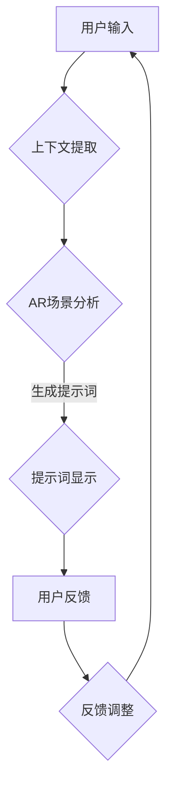

                 

### 增强现实交互设计与提示词工程的核心概念与联系

在数字时代，增强现实（AR）和提示词工程逐渐成为人机交互领域的重要研究方向。这两者之间存在着紧密的联系，共同构建了更加智能化、个性化的用户交互体验。

**增强现实（AR）**是一种通过技术手段将虚拟信息叠加到现实世界中的技术，它通过摄像头捕捉现实场景，并在屏幕上实时显示虚拟物体或信息。这种技术为用户提供了丰富的交互体验，使得虚拟信息与现实世界无缝融合。

**提示词工程**是一种基于自然语言处理（NLP）的技术，通过生成与上下文相关的提示词，指导用户进行交互。这些提示词可以是文字、语音或其他形式，目的是为了提高用户交互的效率、降低学习成本，并增强用户体验。

**核心概念与联系**：

1. **上下文提取**：提示词工程的关键步骤之一是上下文提取。AR技术能够实时捕捉现实场景，为提示词工程提供了丰富的上下文信息。这些信息包括用户的位置、动作、场景中的物体特征等。

2. **提示词生成**：基于提取的上下文信息，提示词工程生成与用户当前操作或环境相关的提示词。这些提示词可以帮助用户更好地理解虚拟信息，并指导用户进行下一步操作。

3. **用户反馈**：用户在交互过程中的反馈是优化提示词工程的重要依据。通过分析用户反馈，系统可以不断调整提示词生成策略，提高用户满意度。

4. **智能化交互**：增强现实交互设计与提示词工程的结合，实现了智能化交互。系统可以根据用户行为和环境信息，自动生成个性化的提示词，提供更加自然的交互体验。

**Mermaid流程图**：

为了更直观地展示增强现实交互设计与提示词工程之间的联系，我们使用Mermaid图形工具绘制了一个流程图。



在这个流程图中，用户输入首先经过上下文提取，然后进行AR场景分析，生成与用户操作或环境相关的提示词。用户通过提示词进行操作，并提供反馈，这些反馈用于不断优化提示词生成策略。

通过以上分析，我们可以看出，增强现实交互设计与提示词工程相互促进，共同为用户提供更加智能化、个性化的交互体验。接下来，我们将深入探讨提示词工程的基础知识和核心算法，以便更好地理解其在增强现实交互设计中的应用。 <|user|>### 增强现实与交互设计概述

#### 增强现实技术简介

增强现实（Augmented Reality，简称AR）是一种将虚拟信息与现实世界融合的技术。通过计算机生成的图像、声音、视频等虚拟信息，叠加到用户的真实视野中，使用户能够看到增强后的现实。与虚拟现实（VR）不同，AR技术不要求用户完全沉浸在一个虚拟环境中，而是将虚拟信息与真实环境相结合，从而实现更加丰富、自然的交互体验。

AR技术的核心组成部分包括以下几个关键要素：

1. **显示技术**：AR技术通常使用智能手机或平板电脑的摄像头作为显示设备，将虚拟信息叠加到用户视野中。此外，还有一些专门的AR眼镜，如微软的HoloLens和Magic Leap。

2. **传感器**：为了实时捕捉用户和环境信息，AR系统需要配备多种传感器，如摄像头、GPS、加速度计、陀螺仪等。这些传感器可以帮助系统确定用户的位置、方向、速度等信息，从而实现准确的虚拟信息叠加。

3. **计算机视觉算法**：计算机视觉算法在AR技术中起着至关重要的作用。通过图像识别、目标跟踪、场景重建等技术，系统能够将虚拟信息准确叠加到现实场景中。

4. **数据处理与实时渲染**：为了实现实时交互，AR系统需要高效地处理大量数据，并在极短的时间内渲染出虚拟信息。这要求系统具备强大的计算能力和优化的数据处理算法。

#### 增强现实技术的发展趋势

近年来，随着技术的不断进步，增强现实技术取得了显著的进展，并呈现出以下发展趋势：

1. **硬件技术的提升**：随着智能手机和AR眼镜等硬件设备的不断升级，AR技术的显示效果和交互体验得到了大幅提升。例如，更高分辨率、更快刷新率的屏幕，以及更先进的传感器技术，使得虚拟信息与现实世界的融合更加自然。

2. **应用场景的扩展**：AR技术在各个领域的应用场景不断扩展，从娱乐、教育、医疗到工业、军事等，都取得了显著的成果。特别是在电子商务、旅游、医疗和教育等领域，AR技术为用户提供了全新的交互体验，极大地提升了用户满意度。

3. **智能化与个性化**：随着人工智能技术的不断发展，AR系统逐渐具备了智能化和个性化的特点。通过深度学习和自然语言处理等技术，AR系统能够更好地理解用户需求，生成个性化的虚拟信息，提供更加精准的交互体验。

4. **跨平台与跨设备**：随着互联网技术的发展，AR技术逐渐实现了跨平台和跨设备的兼容。用户可以在不同的设备上使用AR应用，如智能手机、平板电脑、AR眼镜等，享受一致且无缝的交互体验。

#### 增强现实交互设计的挑战与机遇

虽然增强现实技术取得了显著的进展，但在实际应用中仍面临一些挑战和机遇：

1. **交互设计的挑战**：

   - **用户理解**：AR技术相对较新，用户对其理解程度有限。如何设计易于理解、直观的交互界面，是增强现实交互设计需要解决的重要问题。
   - **操作便捷性**：由于AR技术涉及到多个传感器和设备，如何设计便捷的操作方式，使得用户能够快速上手并高效地使用AR应用，是一个重要的挑战。
   - **真实感**：在AR交互设计中，如何实现虚拟信息与现实世界的自然融合，提高真实感，是提升用户体验的关键。

2. **机遇**：

   - **用户体验的提升**：随着AR技术的不断发展，用户对交互体验的需求不断提高。通过创新的设计理念和先进的技术手段，AR交互设计有望为用户带来更加丰富、个性化的体验。
   - **商业价值的挖掘**：AR技术具有广泛的应用前景，特别是在电子商务、旅游、教育等领域。通过深入挖掘AR技术的商业价值，企业可以创造出新的商业模式和收入来源。
   - **跨界融合**：AR技术与其他领域（如医疗、工业、娱乐等）的跨界融合，将为交互设计带来更多创新机会。通过跨领域的合作，可以创造出更多具有颠覆性的产品和应用。

总之，增强现实技术为交互设计带来了巨大的机遇和挑战。通过不断创新和优化，交互设计师和开发人员可以充分发挥AR技术的优势，为用户提供更加丰富、自然、个性化的交互体验。接下来，我们将进一步探讨提示词工程的基础知识，以深入了解其在增强现实交互设计中的应用。 <|user|>### 提示词工程的基础

#### 提示词的定义与作用

提示词（Hint Words）是一种用于引导用户进行特定操作或决策的词汇或短语。在增强现实（AR）交互设计中，提示词发挥着至关重要的作用。它们可以帮助用户理解虚拟信息，指导用户进行下一步操作，从而提高交互效率和用户体验。

提示词的主要作用包括：

1. **简化操作**：通过提示词，用户可以快速了解当前操作或任务的步骤，减少学习成本，提高操作便捷性。
2. **提高互动性**：提示词可以激发用户的互动兴趣，鼓励用户积极参与到交互过程中，增强用户粘性。
3. **优化体验**：个性化的提示词可以根据用户需求和偏好进行定制，提供更加贴心的服务，提升用户体验。
4. **增强引导性**：在复杂的应用场景中，提示词可以为用户提供清晰的指导，帮助用户顺利完成操作。

#### 提示词的分类与设计原则

提示词可以根据不同的分类标准进行分类，常见的方法包括以下几种：

1. **按用途分类**：

   - **引导型提示词**：用于引导用户进行特定操作或任务的提示词，如“点击此处查看详情”、“请输入您的密码”等。
   - **提示性提示词**：用于提醒用户注意某些信息的提示词，如“注意：操作可能需要一段时间才能完成”等。
   - **鼓励型提示词**：用于激励用户参与互动的提示词，如“恭喜您完成任务！”、“继续加油！”等。

2. **按形式分类**：

   - **文字提示词**：以文字形式出现在屏幕上，如“请点击‘开始’按钮”。
   - **语音提示词**：以语音形式传达给用户，如语音助手中的提示词。
   - **动画提示词**：以动画形式引导用户，如弹出窗口、图标动画等。

3. **按表达方式分类**：

   - **简单提示词**：仅包含一个关键词或短语，如“开始”。
   - **复杂提示词**：包含多个关键词或短语，并可能包含描述性语句，如“点击屏幕右上角的‘设置’按钮，选择‘网络’选项”。

在提示词设计过程中，需要遵循以下原则：

1. **简洁性**：提示词应尽量简洁明了，避免冗长复杂的表述，以便用户快速理解。
2. **针对性**：提示词应根据用户需求和操作场景进行个性化定制，确保提示的针对性和实用性。
3. **易理解性**：提示词应易于理解，避免使用专业术语或模糊不清的表达，确保用户能够迅速掌握。
4. **一致性**：在不同应用场景中，提示词应保持一致的风格和表达方式，以增强用户的认知和使用体验。
5. **多样性**：提示词应具备多样性，以适应不同的用户需求和操作场景，提高用户的互动兴趣。

#### 提示词语言模型概述

提示词语言模型是自然语言处理（NLP）中的重要组成部分，旨在生成与上下文相关的提示词。语言模型通过学习大量文本数据，建立单词或短语之间的概率分布关系，从而预测可能的输出序列。

常见的语言模型包括：

1. **n-gram模型**：基于统计方法，通过计算单词序列的概率来生成提示词。n-gram模型将文本分割成一系列连续的n个单词，并假设当前单词的出现概率仅与其前n-1个单词有关。
2. **循环神经网络（RNN）**：RNN是一种能够处理序列数据的神经网络，通过将当前输入与之前的隐藏状态结合来预测下一个输入。RNN在生成提示词方面具有较好的效果，但存在梯度消失和梯度爆炸等问题。
3. **长短期记忆网络（LSTM）**：LSTM是RNN的一种变体，通过引入记忆单元来解决RNN的梯度消失问题。LSTM在生成提示词方面表现出色，能够处理长序列数据。
4. **卷积神经网络（CNN）**：CNN主要用于图像处理，但在生成提示词方面也取得了一定的成果。CNN通过卷积操作提取文本特征，从而生成提示词。
5. **生成式对抗网络（GAN）**：GAN是一种基于生成模型的深度学习技术，通过训练生成器和判别器，实现高质量提示词的生成。

在实际应用中，提示词语言模型的选择取决于具体需求和性能要求。例如，在AR交互设计中，n-gram模型和LSTM模型较为常用，因为它们能够生成符合上下文语境的提示词。而GAN模型则适用于生成具有创意性的提示词，以丰富用户体验。

通过了解提示词的定义、分类、设计原则以及语言模型，我们可以更好地理解其在增强现实交互设计中的应用。在接下来的章节中，我们将进一步探讨提示词工程的核心算法，以便更深入地掌握其在AR交互设计中的应用方法和策略。 <|user|>### 提示词工程的核心算法

#### 语言模型算法原理

语言模型是自然语言处理（NLP）中的重要组成部分，旨在预测一段文本序列的概率分布。在增强现实（AR）交互设计中，语言模型用于生成与上下文相关的提示词，从而提高用户体验。

**n-gram模型**是一种基于统计的简单语言模型，通过计算单词序列的概率来生成提示词。n-gram模型将文本分割成一系列连续的n个单词（n可以是1、2、3等），并假设当前单词的出现概率仅与其前n-1个单词有关。

**n-gram模型的工作原理**：

1. **文本预处理**：首先，将原始文本进行预处理，包括分词、去除停用词、标点符号等。然后，将处理后的文本转化为数字序列，通常使用单词索引作为表示。
2. **构建模型**：根据预处理后的文本数据，构建n-gram模型。模型的每个状态表示一个n个单词的序列，状态之间的转移概率表示当前单词出现时，下一个单词的概率分布。
3. **生成提示词**：在给定一个起始单词序列的情况下，使用n-gram模型生成下一个单词。具体方法是从当前状态出发，根据转移概率计算下一个单词的概率分布，并随机选择一个单词作为下一个状态。

**n-gram模型的优点**：

- **简单有效**：n-gram模型结构简单，易于实现和优化。
- **实时生成**：在给定起始序列的情况下，n-gram模型可以快速生成后续单词。

**n-gram模型的局限性**：

- **上下文依赖不足**：n-gram模型仅考虑前n-1个单词，无法充分利用整个文本的上下文信息，导致生成的提示词可能不够准确。
- **长序列处理困难**：对于长序列文本，n-gram模型容易出现梯度消失和梯度爆炸问题，难以训练。

**伪代码**：

```python
# n-gram模型训练
def train_n_gram_model(data, n):
    model = {}
    for sentence in data:
        for i in range(len(sentence) - n):
            context = tuple(sentence[i:i+n-1])
            next_word = sentence[i+n-1]
            update_n_gram_model(model, context, next_word)
    return model

def update_n_gram_model(model, context, next_word):
    if context not in model:
        model[context] = {}
    if next_word not in model[context]:
        model[context][next_word] = 0
    model[context][next_word] += 1

# n-gram模型预测
def predict_next_word(model, context):
    next_word_probabilities = {}
    for next_word, count in model[context].items():
        next_word_probabilities[next_word] = count / sum(model[context].values())
    return random_choice(next_word_probabilities)
```

**应用场景**：

n-gram模型在增强现实交互设计中的应用场景包括：

1. **实时提示词生成**：在AR应用中，使用n-gram模型根据用户输入或环境信息生成实时提示词，帮助用户进行交互。
2. **文本生成**：在AR艺术创作或游戏设计中，n-gram模型可以生成创意性的文本内容，为用户提供丰富的互动体验。

#### 提示词生成的算法框架

提示词生成的算法框架通常包括三个主要部分：提示词生成器、上下文生成器和反馈机制。

**1. 提示词生成器**

提示词生成器是算法的核心部分，负责根据上下文信息生成可能的提示词列表。常见的生成器包括：

- **n-gram生成器**：基于n-gram模型的生成器，根据上下文信息预测下一个单词。
- **循环神经网络（RNN）生成器**：基于RNN的生成器，通过将当前输入与之前的隐藏状态结合来生成提示词。
- **生成式对抗网络（GAN）生成器**：基于GAN的生成器，通过生成对抗训练生成创意性的提示词。

**2. 上下文生成器**

上下文生成器负责根据用户输入或场景信息生成上下文。常见的上下文生成器包括：

- **基于关键词提取的上下文生成器**：从用户输入或场景信息中提取关键词，构建上下文。
- **基于文本分类的上下文生成器**：使用文本分类模型对用户输入或场景信息进行分类，生成相应的上下文。

**3. 反馈机制**

反馈机制负责收集用户反馈，用于优化模型性能。常见的反馈机制包括：

- **用户点击率反馈**：根据用户对提示词的点击率，调整提示词的优先级。
- **用户满意度反馈**：收集用户对提示词的满意度评分，用于优化提示词生成策略。
- **自动调整机制**：使用机器学习方法，根据用户反馈自动调整模型参数，提高提示词生成质量。

**算法框架伪代码**：

```python
# 提示词生成器
def generate_hint_words(context, model):
    # 根据上下文信息使用语言模型生成提示词
    hint_words = model.predict(context)
    return hint_words

# 上下文生成器
def generate_context(input):
    # 根据用户输入生成上下文
    context = preprocess_input(input)
    return context

# 反馈机制
def update_model(model, context, hint_word, feedback):
    # 根据用户反馈更新模型
    model.train(context, hint_word, feedback)
```

**应用场景**：

提示词生成的算法框架在增强现实交互设计中的应用场景包括：

1. **实时交互**：在AR应用中，使用算法框架实时生成提示词，指导用户进行交互。
2. **个性化推荐**：根据用户行为和场景信息，生成个性化的提示词，提高用户满意度。
3. **艺术创作**：在AR艺术创作中，使用算法框架生成创意性的提示词，为用户提供丰富的互动体验。

通过以上分析，我们可以看到，提示词工程的核心算法在增强现实交互设计中具有广泛的应用。在实际应用中，可以根据具体需求选择合适的算法，并结合上下文生成器和反馈机制，实现高质量、个性化的提示词生成。在接下来的章节中，我们将进一步探讨提示词工程在增强现实交互设计中的应用场景，以展示其在实际项目中的具体应用。 <|user|>### 提示词工程在增强现实中的应用场景

#### 增强现实购物体验

增强现实购物体验是AR技术应用于电子商务领域的重要方向。通过AR技术，用户可以在现实环境中实时查看商品，并进行虚拟试穿、试用等操作，从而提高购物体验和购买决策的准确性。

1. **应用场景**：

   - **虚拟试穿**：用户可以在试衣镜前使用AR应用查看衣物效果，通过实时渲染技术，用户可以看到穿着效果，并进行调整。
   - **虚拟试用**：用户可以在家中尝试使用电子产品、化妆品等，通过AR技术，用户可以直观地了解产品性能和使用效果。
   - **个性化推荐**：基于用户的购物记录和偏好，AR系统可以推荐符合用户需求的商品，并提供相关的购物提示词，如“您可能会喜欢这款产品”或“尝试搭配这组商品”。

2. **提示词生成**：

   - **引导型提示词**：如“点击屏幕查看商品详情”、“尝试其他颜色和款式”等，帮助用户了解商品的更多信息。
   - **鼓励型提示词**：如“您已经试穿了3件商品，看看这最后一款如何？”等，激发用户的购买欲望。
   - **个性化提示词**：根据用户的购物记录和偏好，生成个性化的提示词，如“您的喜好数据显示，这款商品可能是您的下一个选择”。

3. **案例解析**：

   - **案例一：亚马逊的AR购物体验**：亚马逊推出了一款AR购物应用，用户可以通过手机摄像头扫描商品二维码，查看商品的3D模型和详细描述。应用还提供了个性化的购物提示词，如“您可能还会喜欢这款商品”等，提高了用户的购物体验。

#### 增强现实教育应用

增强现实技术在教育领域的应用具有很大的潜力，通过AR技术，学生可以更加直观地学习知识，提高学习兴趣和效果。

1. **应用场景**：

   - **互动教学**：教师可以使用AR技术为学生提供互动式教学，例如在课堂上展示生物标本、历史事件等，使学生更加直观地理解知识。
   - **虚拟实验室**：学生可以在虚拟实验室中进行实验，通过AR技术观察实验现象和结果，提高实验操作的准确性和安全性。
   - **个性化学习**：根据学生的学习进度和需求，AR系统可以生成个性化的学习提示词，如“您可能需要复习这部分知识”或“挑战自己，尝试解决这个难题”。

2. **提示词生成**：

   - **引导型提示词**：如“点击屏幕查看相关资料”、“尝试操作这个虚拟物品”等，引导学生进行互动学习。
   - **提示性提示词**：如“请注意，这里是一个重要的知识点”、“请记住这个公式”等，帮助学生巩固学习内容。
   - **鼓励型提示词**：如“您已经完成了80%的课程，继续努力！”等，激励学生保持学习动力。

3. **案例解析**：

   - **案例一：HoloLens在教育中的应用**：微软的HoloLens在教育领域取得了显著的应用成果。教师可以使用HoloLens为学生提供互动式教学，例如在课堂上展示恐龙化石、历史事件等，使教学内容更加生动有趣。系统还根据学生的学习进度生成个性化的学习提示词，帮助学生更好地掌握知识。

#### 增强现实游戏设计

增强现实游戏设计是AR技术的重要应用领域，通过将虚拟元素与现实世界相结合，创造独特的游戏体验。

1. **应用场景**：

   - **真实场景游戏**：玩家可以在现实世界中进行游戏，通过AR技术，游戏元素如角色、道具等与现实世界中的物体融合，提供更加丰富的游戏体验。
   - **虚拟现实体验**：玩家可以在虚拟环境中进行游戏，通过AR技术，虚拟场景与现实世界相结合，使游戏更加沉浸。
   - **互动式游戏**：玩家与其他玩家或NPC进行互动，通过AR技术，游戏中的互动更加真实和有趣。

2. **提示词生成**：

   - **引导型提示词**：如“点击屏幕解锁道具”、“找到隐藏的宝藏”等，引导玩家进行游戏操作。
   - **鼓励型提示词**：如“您已经完成了50%的任务，继续前进！”等，激励玩家保持游戏动力。
   - **挑战性提示词**：如“您有能力完成这个挑战吗？”等，为玩家提供挑战性的游戏体验。

3. **案例解析**：

   - **案例一：Pokémon GO**：Pokémon GO是AR游戏设计的经典案例。玩家可以在现实世界中捕捉精灵宝可梦，通过AR技术，精灵宝可梦与现实世界中的物体融合，提供了独特的游戏体验。游戏还根据玩家的行动和进度生成个性化的提示词，如“恭喜您捕捉到皮卡丘！”等。

通过以上分析，我们可以看到，提示词工程在增强现实购物体验、教育应用和游戏设计等领域具有广泛的应用。在实际项目中，通过结合AR技术和提示词工程，可以提供更加丰富、个性化、互动的体验，满足不同用户的需求。在接下来的章节中，我们将进一步探讨提示词工程在具体项目中的实现和应用，以展示其在实际场景中的效果和优势。 <|user|>### 提示词工程案例解析

在本节中，我们将通过两个具体的案例——AR导航系统和增强现实艺术创作，详细解析提示词工程在增强现实交互设计中的应用。

#### 案例一：AR导航系统

**1. 案例背景**

AR导航系统利用增强现实技术，将虚拟导航信息叠加到现实世界中，为用户提供更加直观、清晰的导航体验。然而，如何在复杂的现实场景中为用户提供准确、及时的导航提示是一个挑战。提示词工程在此发挥了关键作用，通过生成与用户当前操作或环境相关的提示词，提高导航的便利性和用户体验。

**2. 技术实现**

技术实现包括以下几个关键步骤：

1. **数据采集**：首先，需要收集包含位置信息的增强现实场景数据。这些数据可以来源于地图服务提供商、GPS设备或用户实时上传的数据。
2. **数据预处理**：对采集到的数据进行分析和处理，提取有用的信息，如位置、方向、地标等。数据预处理包括去除噪声、标点符号和停用词等。
3. **模型训练**：使用预处理后的数据训练一个语言模型，用于生成提示词。常用的语言模型包括n-gram模型、循环神经网络（RNN）和生成式对抗网络（GAN）等。
4. **提示词生成**：基于用户输入或场景信息，使用训练好的语言模型生成提示词。例如，当用户接近某个地标时，系统可以生成提示词“前方50米到达‘XX商场’，请做好下车准备”。
5. **系统集成**：将提示词生成模块集成到AR导航系统中，实现实时提示词生成。例如，在AR导航应用中，提示词可以通过文字、语音或动画等形式显示在用户视野中。

**3. 代码解读**

以下是一个简化的Python代码示例，展示了提示词工程在AR导航系统中的应用：

```python
# 数据预处理
def preprocess_data(data):
    # 对数据进行清洗和格式转换
    processed_data = []
    for item in data:
        processed_item = []
        for word in item:
            processed_item.append(word.lower())
        processed_data.append(processed_item)
    return processed_data

# 模型训练
def train_language_model(data, n):
    # 训练n-gram语言模型
    model = n_gram_language_model(data, n)
    return model

# 提示词生成
def generate_hint_word(model, context):
    # 使用语言模型生成提示词
    possible_words = model.predict(context)
    hint_word = random_choice(possible_words)
    return hint_word

# 主函数
def main():
    # 加载和预处理数据
    data = load_data()
    processed_data = preprocess_data(data)

    # 训练语言模型
    model = train_language_model(processed_data, n)

    # 用户交互
    while True:
        input_context = get_user_input()
        hint_word = generate_hint_word(model, input_context)
        print("生成的提示词：", hint_word)

if __name__ == "__main__":
    main()
```

**4. 代码解读与分析**

- **数据预处理**：数据预处理是为了将原始数据转换为适合训练模型的形式。在这个例子中，我们将数据中的单词转换为小写，并存储在一个列表中。
- **模型训练**：训练语言模型是通过遍历训练数据，并更新模型参数来实现的。在这里，我们使用n-gram语言模型来训练数据。
- **提示词生成**：提示词生成是通过调用模型来预测可能的单词列表，并从中随机选择一个单词。
- **系统集成**：将提示词生成模块集成到AR导航系统中，使得系统能够根据用户输入或场景信息实时生成提示词。

在实际应用中，为了提高模型的性能和准确度，可以采用更复杂的模型和算法，如基于深度学习的语言模型。此外，为了提高系统的实时性能，可以采用优化策略，如模型压缩、量化等。

#### 案例二：增强现实艺术创作

**1. 案例背景**

增强现实艺术创作是一种利用增强现实技术进行艺术创作和展示的方式。艺术家可以通过AR技术，在现实环境中创建虚拟艺术作品，并与观众进行互动。提示词工程在增强现实艺术创作中起着重要作用，通过生成与艺术作品和观众互动相关的提示词，提高艺术创作的互动性和观赏体验。

**2. 技术实现**

技术实现包括以下几个关键步骤：

1. **数据采集**：收集包含艺术作品的增强现实场景数据。这些数据可以来源于艺术家创作过程中的记录或用户上传的AR艺术作品。
2. **数据预处理**：对采集到的数据进行分析和处理，提取有用的信息，如艺术作品的位置、颜色、形状等。
3. **模型训练**：使用预处理后的数据训练一个语言模型，用于生成提示词。语言模型的选择取决于具体需求，如n-gram模型、RNN或GAN等。
4. **提示词生成**：根据观众输入或场景信息，使用训练好的语言模型生成提示词。例如，当观众接近艺术作品时，系统可以生成提示词“这件作品名为‘梦境’，作者是‘XXX’”。
5. **系统集成**：将提示词生成模块集成到增强现实艺术创作系统中，实现实时提示词生成。例如，在AR艺术创作应用中，提示词可以通过文字、语音或动画等形式显示在观众视野中。

**3. 代码解读**

以下是一个简化的Python代码示例，展示了提示词工程在增强现实艺术创作中的应用：

```python
# 数据预处理
def preprocess_data(data):
    # 对数据进行清洗和格式转换
    processed_data = []
    for item in data:
        processed_item = []
        for word in item:
            processed_item.append(word.lower())
        processed_data.append(processed_item)
    return processed_data

# 模型训练
def train_language_model(data, n):
    # 训练n-gram语言模型
    model = n_gram_language_model(data, n)
    return model

# 提示词生成
def generate_hint_word(model, context):
    # 使用语言模型生成提示词
    possible_words = model.predict(context)
    hint_word = random_choice(possible_words)
    return hint_word

# 主函数
def main():
    # 加载和预处理数据
    data = load_data()
    processed_data = preprocess_data(data)

    # 训练语言模型
    model = train_language_model(processed_data, n)

    # 用户交互
    while True:
        input_context = get_user_input()
        hint_word = generate_hint_word(model, input_context)
        print("生成的提示词：", hint_word)

if __name__ == "__main__":
    main()
```

**4. 代码解读与分析**

- **数据预处理**：数据预处理是为了将原始数据转换为适合训练模型的形式。在这个例子中，我们将数据中的单词转换为小写，并存储在一个列表中。
- **模型训练**：训练语言模型是通过遍历训练数据，并更新模型参数来实现的。在这里，我们使用n-gram语言模型来训练数据。
- **提示词生成**：提示词生成是通过调用模型来预测可能的单词列表，并从中随机选择一个单词。
- **系统集成**：将提示词生成模块集成到增强现实艺术创作系统中，使得系统能够根据用户输入或场景信息实时生成提示词。

在实际应用中，为了提高模型的性能和准确度，可以采用更复杂的模型和算法，如基于深度学习的语言模型。此外，为了提高系统的实时性能，可以采用优化策略，如模型压缩、量化等。

通过以上两个案例，我们可以看到提示词工程在增强现实交互设计中的应用价值。在实际项目中，通过结合AR技术和提示词工程，可以提供更加丰富、个性化、互动的体验，满足不同用户的需求。在接下来的章节中，我们将进一步探讨提示词工程的开发与优化，以提升其在AR交互设计中的应用效果。 <|user|>### 提示词工程的开发与优化

#### 开发环境搭建

为了实现提示词工程在增强现实交互设计中的应用，我们需要搭建一个合适的开发环境。以下是一个基本的开发环境搭建指南：

1. **操作系统**：可以选择Windows、macOS或Linux操作系统。建议选择Linux系统，因为它提供了更好的稳定性和性能。
2. **编程语言**：Python是一种常用的编程语言，特别适合自然语言处理和增强现实应用。因此，我们将使用Python作为主要编程语言。
3. **深度学习框架**：TensorFlow和PyTorch是两种流行的深度学习框架。根据个人喜好和项目需求，可以选择其中一个作为主要框架。
4. **增强现实开发工具**：Unity和ARKit（仅限iOS）是两种常用的增强现实开发工具。根据项目需求，可以选择其中一个或两个工具。

以下是一个简单的开发环境搭建步骤：

1. **安装操作系统**：从官方网站下载并安装操作系统。
2. **安装Python**：从Python官方网站下载并安装Python，并确保将Python添加到环境变量中。
3. **安装深度学习框架**：选择TensorFlow或PyTorch，并使用pip命令安装。例如，安装TensorFlow的命令为：`pip install tensorflow`。
4. **安装增强现实开发工具**：从Unity官方网站下载并安装Unity，并确保安装了增强现实相关插件。对于iOS平台，需要安装Xcode并配置ARKit。
5. **配置开发环境**：在IDE（如PyCharm或VS Code）中配置Python环境，并安装必要的库和依赖。

通过以上步骤，我们就可以搭建一个基本的开发环境，为后续的提示词工程开发做好准备。

#### 提示词模型的训练与优化

在搭建好开发环境后，我们需要训练提示词模型，并对其进行优化，以提高模型的性能和准确度。以下是一个简单的训练和优化过程：

1. **数据准备**：首先，我们需要收集和准备用于训练的文本数据。这些数据可以来自于增强现实交互场景的文本描述、用户对话记录或其他相关文本资料。确保数据质量，去除噪声和无关信息。
2. **数据预处理**：对收集到的数据进行预处理，包括分词、去除停用词、标点符号和格式转换等。预处理后的数据将作为训练模型的输入。
3. **模型训练**：使用预处理后的数据训练提示词模型。选择合适的模型架构，如n-gram模型、循环神经网络（RNN）或生成式对抗网络（GAN）等。在训练过程中，使用适当的优化器和损失函数，如交叉熵损失函数。
4. **模型评估**：在训练过程中，定期评估模型的性能，以确定是否需要调整模型参数或训练策略。常用的评估指标包括准确率、召回率和F1分数等。
5. **模型优化**：根据评估结果，对模型进行优化。可以采用以下方法：

   - **超参数调整**：调整学习率、批次大小、迭代次数等超参数，以提高模型性能。
   - **数据增强**：通过数据增强技术，如随机裁剪、旋转、缩放等，增加训练数据集的多样性，提高模型的泛化能力。
   - **模型压缩**：通过模型压缩技术，如量化、剪枝和蒸馏等，减小模型大小，降低计算成本。

6. **模型部署**：在完成模型训练和优化后，将模型部署到目标环境中，如增强现实应用或服务器。确保模型能够实时生成提示词，并提供高质量的交互体验。

#### 提示词模型的评估与调整

提示词模型的评估与调整是确保模型性能和用户体验的重要环节。以下是一些常见的评估方法和调整策略：

1. **评估方法**：

   - **准确率**：模型预测的正确率，表示模型对提示词生成的准确性。
   - **召回率**：模型能够召回的正确提示词数量与总正确提示词数量的比值，表示模型对提示词的覆盖率。
   - **F1分数**：准确率和召回率的调和平均数，综合考虑了模型准确性和覆盖率。
   - **用户满意度**：通过用户问卷调查或用户反馈评分，评估模型生成提示词的用户满意度。

2. **调整策略**：

   - **参数调整**：根据评估结果，调整模型参数，如学习率、批次大小、迭代次数等，以提高模型性能。
   - **模型更新**：定期更新模型，以适应新的数据和用户需求。可以采用在线学习或迁移学习等技术，实现模型的持续优化。
   - **反馈机制**：建立用户反馈机制，收集用户对提示词的满意度，并根据反馈进行调整。可以采用机器学习方法，如决策树、支持向量机等，对用户反馈进行分类和处理。
   - **多样化提示词**：生成多样化、个性化的提示词，以满足不同用户的需求。可以采用生成式对抗网络（GAN）等技术，生成具有创意性的提示词。

通过以上开发与优化方法，我们可以构建一个高性能、高质量的提示词模型，为增强现实交互设计提供强大的支持。在后续的应用实践中，不断优化和调整模型，以满足用户不断变化的需求，提升用户体验。 <|user|>### 未来展望与趋势

随着科技的不断进步，提示词工程在增强现实交互设计中的应用前景广阔。未来，这一领域有望在以下几个方面取得重要进展：

#### 提示词工程的发展方向

1. **智能化与个性化**：未来的提示词工程将更加智能化，能够根据用户的行为、偏好和历史数据，生成个性化的提示词。通过深度学习和人工智能技术，系统将能够更好地理解用户需求，提供更加精准的交互体验。

2. **跨模态交互**：随着多模态交互技术的发展，未来的提示词工程将支持文本、语音、图像等多种交互方式。例如，用户可以通过语音命令获取提示词，同时结合图像和视频进行更丰富的交互体验。

3. **实时动态调整**：未来的提示词工程将具备实时动态调整能力，能够根据用户实时反馈和交互行为，动态调整提示词的生成策略和优先级，提供更加自然的交互体验。

4. **跨界融合**：提示词工程将与其他领域（如物联网、虚拟现实、医疗等）进行深度融合，为不同场景下的交互设计提供更加创新的解决方案。

#### 增强现实交互设计的前沿技术

1. **实时环境感知**：未来的增强现实交互设计将更加注重实时环境感知，通过高级传感器和计算机视觉技术，系统能够更准确地捕捉和理解用户周围的环境，提供更加真实的交互体验。

2. **自然交互**：通过自然语言处理和语音识别技术，用户将能够以更自然的方式与系统进行交互，例如通过口语化的语言进行沟通，系统将能够理解并回应用户的意图。

3. **虚拟与现实的融合**：随着渲染技术和实时渲染技术的提升，增强现实交互设计将能够更加无缝地将虚拟信息与现实世界融合，提供更加沉浸式的交互体验。

#### 提示词工程在实际应用中的挑战与解决方案

1. **数据质量和多样性**：为了生成高质量的提示词，需要高质量、多样化的数据支持。未来，可以通过数据清洗、数据增强和跨领域数据融合等方法，提高数据的质量和多样性。

2. **计算效率和实时性**：随着应用的场景变得更加复杂，提示词工程需要更高的计算效率和实时性。可以通过模型压缩、量化、分布式计算和边缘计算等方法，提高系统的实时性能。

3. **用户体验和满意度**：提示词工程需要生成符合用户期望的提示词，以提高用户体验和满意度。可以通过用户反馈机制、用户行为分析和A/B测试等方法，不断优化提示词生成策略。

### 结论

总之，提示词工程在增强现实交互设计中的应用前景广阔，随着技术的不断进步，它将为用户提供更加智能化、个性化、自然的交互体验。未来的发展将带来更多的创新和机遇，同时也需要我们面对和解决一系列挑战。通过持续的研究和实践，我们有望推动这一领域的发展，为人类创造更加美好的数字生活。 <|user|>### 附录

#### A.1 常用深度学习框架简介

在提示词工程的开发中，常用的深度学习框架包括TensorFlow、PyTorch和MXNet等。以下是这些框架的基本介绍和特点：

**TensorFlow**：由Google开发的开源深度学习框架，具有丰富的API和预训练模型，适合各种规模的深度学习项目。TensorFlow支持Python和C++编程语言，并且可以在多个平台上运行，包括CPU、GPU和TPU。

**PyTorch**：由Facebook开发的开源深度学习框架，以其动态计算图和易于调试的特点受到开发者的喜爱。PyTorch支持Python编程语言，提供了灵活的接口和丰富的文档，适用于研究和生产环境。

**MXNet**：由Apache Software Foundation开发的深度学习框架，支持多种编程语言，包括Python、R和Scala。MXNet具有高效的计算性能和灵活性，适用于大规模的分布式训练和推理任务。

#### A.2 增强现实开发工具指南

增强现实开发工具为提示词工程的实现提供了基础。以下是几种流行的增强现实开发工具的简要指南：

**Unity**：Unity是一款跨平台的游戏和增强现实开发工具，支持2D、3D和VR/AR内容创建。Unity提供了丰富的功能，包括物理引擎、动画系统、图形渲染和脚本编程，适用于各种规模的增强现实项目。

**ARKit**：ARKit是苹果公司开发的增强现实框架，专门用于iOS平台。ARKit支持实时环境感知、3D物体追踪和增强现实内容创建，提供了简单易用的API和工具，适用于开发iOS增强现实应用。

**ARCore**：ARCore是谷歌开发的增强现实开发框架，支持Android平台。ARCore提供了实时环境感知、3D物体追踪和增强现实内容创建功能，适用于开发Android增强现实应用。

#### A.3 提示词工程相关论文与资料引用

在提示词工程领域，有许多重要的论文和研究资料提供了理论基础

