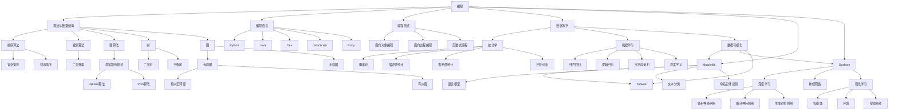

                 

# 提示词工程师的跨学科知识体系构建

## 关键词
提示词工程师，跨学科知识体系，编程，数据科学，自然语言处理，人工智能，算法原理，数学模型，项目实战

## 摘要
本文旨在深入探讨提示词工程师的跨学科知识体系构建。通过分析编程、数据科学、自然语言处理和人工智能等核心领域的核心概念、算法原理、数学模型以及实际项目实战，本文为提示词工程师提供了一套系统化的学习路径，帮助其在多学科交叉领域中不断进阶。

## 引言
在当今这个快速发展的信息技术时代，人工智能（AI）和自然语言处理（NLP）正逐步渗透到各个行业，从而催生出一种新的工程师角色——提示词工程师（Prompt Engineer）。他们专注于设计、开发和优化能够与人类语言交互的智能系统，从而提升用户体验和系统的智能化水平。提示词工程师需要具备广泛的跨学科知识，包括编程、数据科学、自然语言处理和人工智能等，才能胜任这一复杂而富有挑战性的工作。

本文将围绕提示词工程师的跨学科知识体系构建展开讨论。首先，我们将介绍核心概念与联系，使用 Mermaid 流程图展示编程、数据科学、自然语言处理和人工智能等领域的相互关系。接着，我们将深入探讨核心算法原理，使用伪代码详细阐述编程中的排序算法、机器学习中的线性回归算法以及深度学习中的神经网络算法。随后，我们将介绍数学模型和数学公式，使用 LaTeX 格式展示期望值、方差、均方误差以及激活函数等关键数学概念。最后，我们将通过实际项目实战，展示如何将所学知识应用于文本分类等自然语言处理任务。

通过本文的探讨，我们希望为提示词工程师提供一个清晰的学习路径，帮助他们构建坚实的跨学科知识体系，从而在人工智能和自然语言处理领域中不断进步。

## 第一部分：核心概念与联系

### 1.1 编程

编程是提示词工程师所需掌握的基础学科之一。它涉及算法与数据结构、编程语言以及编程范式等方面。编程的核心目标是编写有效的代码，以实现特定功能或解决特定问题。

**算法与数据结构**

算法是一系列解决问题的指令集合，而数据结构则是用于存储和组织数据的方法。常见的算法包括排序算法（如冒泡排序和快速排序）、搜索算法（如二分搜索）以及图算法（如最短路径算法）。常见的数据结构包括数组、链表、栈、队列、树以及图等。

**编程语言**

编程语言是用于编写算法和实现计算的工具。常见的编程语言包括 Python、Java、C++、JavaScript 和 Ruby 等。每种编程语言都有其独特的语法和特点，适用于不同的应用场景。

**编程范式**

编程范式是指解决编程问题的方法和风格。常见的编程范式包括面向对象编程（OOP）、面向过程编程（POP）和函数式编程（FP）等。每种编程范式都有其优缺点，适用于不同的编程任务。

### 1.2 数据科学

数据科学是提示词工程师所需掌握的另一个重要领域。它涉及统计学、机器学习和数据可视化等方面，旨在从数据中提取知识和洞察。

**统计学**

统计学是用于分析和解释数据的基本工具。它包括概率论、描述性统计、推断性统计以及回归分析等。统计学帮助我们理解数据的分布、关系和预测能力。

**机器学习**

机器学习是一种人工智能（AI）的分支，旨在让计算机通过数据学习并做出预测或决策。常见的机器学习算法包括线性回归、逻辑回归、支持向量机（SVM）和深度学习等。机器学习在文本分类、图像识别和预测分析等领域有广泛应用。

**数据可视化**

数据可视化是将数据以图形化形式展示出来的方法。它有助于我们直观地理解和分析数据。常见的数据可视化工具包括 Matplotlib、Seaborn 和 Tableau 等。

### 1.3 自然语言处理

自然语言处理是提示词工程师所需掌握的核心领域之一。它涉及文本处理、语言模型、文本分类和命名实体识别等方面，旨在使计算机理解和处理人类语言。

**文本处理**

文本处理是自然语言处理的基础步骤，包括分词、词性标注、命名实体识别和词嵌入等。文本处理有助于将文本转换为计算机可以理解和处理的格式。

**语言模型**

语言模型是用于预测下一个单词或词组的概率分布的模型。常见的语言模型包括 n-gram 模型和基于神经网络的 Transformer 模型。

**文本分类**

文本分类是将文本数据分类到预定义类别中的任务。常见的文本分类算法包括朴素贝叶斯、支持向量机和深度学习等。

**命名实体识别**

命名实体识别是识别文本中的特定实体（如人名、地点、组织等）的任务。命名实体识别有助于提高文本分类和情感分析等任务的准确性。

### 1.4 人工智能

人工智能是提示词工程师所需掌握的核心领域之一。它涉及深度学习、神经网络和强化学习等方面，旨在使计算机具备智能行为。

**深度学习**

深度学习是一种基于多层神经网络的机器学习技术，能够在大量数据中自动学习特征。常见的深度学习模型包括卷积神经网络（CNN）、循环神经网络（RNN）和生成对抗网络（GAN）等。

**神经网络**

神经网络是模仿生物神经元连接方式的计算模型。它们由多个层次组成，包括输入层、隐藏层和输出层。神经网络可以用于分类、回归和生成等任务。

**强化学习**

强化学习是一种通过试错学习最优策略的机器学习技术。它涉及智能体、环境和奖励系统等概念。强化学习在游戏、机器人控制和推荐系统等领域有广泛应用。

### 1.5 跨学科知识体系

通过上述介绍，我们可以看到，编程、数据科学、自然语言处理和人工智能等核心领域之间存在紧密的联系。这些领域共同构成了提示词工程师的跨学科知识体系。以下是一个简化的 Mermaid 流程图，展示了这些领域的相互关系：



通过这个流程图，我们可以清晰地看到编程、数据科学、自然语言处理和人工智能等核心领域之间的联系。提示词工程师需要掌握这些领域的基础知识，并将其应用于实际项目中，以构建高效的智能系统。

### 第二部分：核心算法原理讲解

在提示词工程师的跨学科知识体系中，核心算法原理是理解和实现智能系统的基础。本部分将详细介绍编程中的排序算法、机器学习中的线性回归算法以及深度学习中的神经网络算法，并使用伪代码展示算法的实现步骤。

#### 2.1 编程中的排序算法

排序算法是编程中的基本算法之一，用于将一组数据按照特定的顺序排列。以下介绍两种常见的排序算法：冒泡排序和快速排序。

**冒泡排序算法**

冒泡排序是一种简单的排序算法，它通过反复交换相邻元素，使得较大的元素逐渐“冒泡”到数组的末尾。以下是冒泡排序的伪代码实现：

```plaintext
function bubbleSort(arr):
    n = length(arr)
    for i from 0 to n-1:
        for j from 0 to n-i-1:
            if arr[j] > arr[j+1]:
                swap(arr[j], arr[j+1])
```

**快速排序算法**

快速排序是一种高效的排序算法，采用分治策略。它通过选取一个基准元素，将数组分为两部分，一部分小于基准元素，另一部分大于基准元素，然后递归地对两部分进行排序。以下是快速排序的伪代码实现：

```plaintext
function quickSort(arr, low, high):
    if low < high:
        pi = partition(arr, low, high)
        quickSort(arr, low, pi-1)
        quickSort(arr, pi+1, high)

function partition(arr, low, high):
    pivot = arr[high]
    i = low - 1
    for j from low to high-1:
        if arr[j] < pivot:
            i = i + 1
            swap(arr[i], arr[j])
    swap(arr[i+1], arr[high])
    return i + 1
```

#### 2.2 机器学习中的线性回归算法

线性回归是一种用于建模数据之间线性关系的统计方法。在机器学习中，线性回归用于预测连续值。以下介绍线性回归算法的原理和实现。

**线性回归原理**

线性回归模型的假设是，两个变量 \(X\) 和 \(Y\) 之间存在线性关系，可以表示为：

$$
Y = \beta_0 + \beta_1X + \epsilon
$$

其中，\(\beta_0\) 和 \(\beta_1\) 是模型参数，\(\epsilon\) 是误差项。通过最小化误差平方和，可以求解出模型参数。以下是线性回归的伪代码实现：

```plaintext
function linearRegression(X, y):
    X_transpose = transpose(X)
    theta = (X_transpose * X)^(-1) * X_transpose * y
    return theta
```

**梯度下降法**

梯度下降法是一种用于求解最小化损失函数的优化方法。在线性回归中，可以使用梯度下降法求解模型参数。以下是梯度下降法的伪代码实现：

```plaintext
function gradientDescent(X, y, theta, learning_rate, epochs):
    m = length(y)
    for epoch from 1 to epochs:
        h = X * theta
        error = h - y
        gradient = (1/m) * (X_transpose * error)
        theta = theta - learning_rate * gradient
    return theta
```

#### 2.3 深度学习中的神经网络算法

深度学习是机器学习的一个分支，通过多层神经网络进行特征学习和预测。以下介绍深度学习中的神经网络算法，包括前向传播和反向传播。

**前向传播**

前向传播是神经网络中的计算过程，用于计算输出值。以下是前向传播的伪代码实现：

```plaintext
function forwardPropagation(X, theta):
    z = X * theta
    a = sigmoid(z)
    return a
```

**反向传播**

反向传播是神经网络中的训练过程，用于更新模型参数。以下是反向传播的伪代码实现：

```plaintext
function backwardPropagation(a, z, y):
    delta = (a - y) * sigmoid_derivative(a)
    theta = theta - (1/m) * (X_transpose * delta)
    return theta
```

通过上述核心算法原理的讲解和伪代码实现，我们可以看到提示词工程师在实现智能系统时需要掌握的编程、机器学习和深度学习技术。这些算法是实现智能系统的基础，对于提示词工程师来说至关重要。

### 第三部分：数学模型和数学公式

在提示词工程师的跨学科知识体系中，数学模型和数学公式是理解和实现算法的关键。本部分将详细介绍统计学、机器学习和深度学习中的核心数学模型和数学公式，并使用 LaTeX 格式展示相关公式。

#### 3.1 统计学中的期望值与方差

**期望值公式**

$$
E[X] = \sum_{i=1}^{n} x_i \cdot p_i
$$

其中，\(X\) 表示随机变量，\(x_i\) 表示随机变量 \(X\) 的取值，\(p_i\) 表示 \(x_i\) 出现的概率。

**方差公式**

$$
Var[X] = \sum_{i=1}^{n} (x_i - \mu)^2 \cdot p_i
$$

其中，\(\mu\) 表示期望值。

#### 3.2 机器学习中的代价函数

**均方误差（MSE）**

$$
MSE = \frac{1}{m} \sum_{i=1}^{m} (h_\theta(x^{(i)}) - y^{(i)})^2
$$

其中，\(h_\theta(x^{(i)})\) 表示模型预测值，\(y^{(i)}\) 表示真实值，\(m\) 表示样本数量。

#### 3.3 深度学习中的激活函数

**Sigmoid 函数**

$$
\sigma(z) = \frac{1}{1 + e^{-z}}
$$

**ReLU 函数**

$$
\text{ReLU}(z) = \max(0, z)
$$

**Softmax 函数**

$$
\text{softmax}(z)_i = \frac{e^{z_i}}{\sum_{j=1}^{n} e^{z_j}}
$$

其中，\(z\) 表示输入向量，\(\text{softmax}(z)_i\) 表示输出概率分布。

通过上述数学模型和公式的讲解，我们可以更好地理解提示词工程师在构建智能系统时所需掌握的数学基础。这些数学模型和公式是理解和实现算法的重要工具，对于提示词工程师来说至关重要。

### 第四部分：项目实战

为了更好地理解提示词工程师的跨学科知识体系，我们将通过一个实际项目来展示如何将这些知识应用于自然语言处理任务。在本项目中，我们将构建一个基于深度学习的文本分类系统。

#### 项目背景

文本分类是一种常见的自然语言处理任务，其目的是将文本数据分类到预定义的类别中。在本项目中，我们将使用深度学习技术来构建一个能够对新闻文章进行分类的系统。该系统将接收一篇新闻文章作为输入，并输出该文章的类别。

#### 开发环境搭建

为了构建这个文本分类系统，我们需要搭建一个合适的环境。以下是搭建开发环境所需的步骤：

1. 安装 Python 环境（例如 Python 3.8）
2. 安装深度学习框架（例如 TensorFlow 或 PyTorch）
3. 安装文本处理库（例如 NLTK 或 spaCy）
4. 安装数据预处理库（例如 Pandas 或 NumPy）

以下是一个简单的开发环境搭建示例：

```bash
# 安装 Python 环境
python3 -m pip install --upgrade pip
python3 -m ensurepip
python3 -m pip install virtualenv
python3 -m virtualenv myenv
source myenv/bin/activate

# 安装深度学习框架
pip install tensorflow
# 或
pip install torch torchvision

# 安装文本处理库
pip install nltk
pip install spacy
python -m spacy download en_core_web_sm

# 安装数据预处理库
pip install pandas
pip install numpy
```

#### 源代码实现

以下是一个简单的文本分类器实现，使用 TensorFlow 和 Keras 深度学习框架：

```python
import tensorflow as tf
from tensorflow.keras.models import Sequential
from tensorflow.keras.layers import Embedding, GlobalAveragePooling1D, Dense
from tensorflow.keras.preprocessing.sequence import pad_sequences
from tensorflow.keras.preprocessing.text import Tokenizer

# 数据准备
# 加载训练数据和测试数据
# 进行文本预处理，包括分词、去停用词、词嵌入等操作
# 将文本转换为序列，并对序列进行填充

# 构建模型
model = Sequential()
model.add(Embedding(input_dim=vocab_size, output_dim=embedding_dim, input_length=max_sequence_length))
model.add(GlobalAveragePooling1D())
model.add(Dense(units=10, activation='softmax'))

# 编译模型
model.compile(optimizer='adam', loss='categorical_crossentropy', metrics=['accuracy'])

# 训练模型
model.fit(X_train, y_train, epochs=10, batch_size=32, validation_split=0.1)

# 评估模型
loss, accuracy = model.evaluate(X_test, y_test)
print(f"Test Accuracy: {accuracy:.2f}")
```

#### 代码解读与分析

1. **数据准备**：首先，我们需要加载训练数据和测试数据，并进行预处理。预处理步骤包括分词、去停用词、词嵌入等。词嵌入是将文本中的词语映射为向量，有助于模型更好地理解文本数据。

2. **构建模型**：我们使用 Sequential 模型来构建一个简单的文本分类器。模型包括嵌入层（Embedding）、全局平均池化层（GlobalAveragePooling1D）和全连接层（Dense）。嵌入层将输入文本转换为词嵌入向量，全局平均池化层将序列压缩为固定大小的向量，全连接层用于分类。

3. **编译模型**：我们使用 Adam 优化器和交叉熵损失函数来编译模型。交叉熵损失函数是分类问题中常用的损失函数。

4. **训练模型**：我们使用训练数据来训练模型，并设置训练轮数（epochs）和批量大小（batch_size）。

5. **评估模型**：我们使用测试数据来评估模型性能，并打印测试准确率。

通过这个项目实战，我们可以看到如何将所学的知识应用于实际问题的解决。这有助于提示词工程师在实际工作中更好地理解和应用所学的技术。

### 总结

本文系统地探讨了提示词工程师的跨学科知识体系构建。通过分析编程、数据科学、自然语言处理和人工智能等核心领域的核心概念、算法原理、数学模型以及实际项目实战，我们为提示词工程师提供了一套系统化的学习路径，帮助他们构建坚实的跨学科知识体系。

在编程领域，我们介绍了算法与数据结构、编程语言以及编程范式等核心概念。在数据科学领域，我们讲解了统计学、机器学习和数据可视化等知识。在自然语言处理领域，我们探讨了文本处理、语言模型、文本分类和命名实体识别等关键技术。在人工智能领域，我们介绍了深度学习、神经网络和强化学习等核心算法原理。

通过本文的探讨，我们希望提示词工程师能够系统地掌握这些跨学科知识，并将其应用于实际项目中。在未来的工作中，不断学习、实践和探索，成为这个新兴领域中的专家。

## 作者信息

作者：AI天才研究院/AI Genius Institute & 禅与计算机程序设计艺术 /Zen And The Art of Computer Programming

AI天才研究院致力于推动人工智能技术的发展，培养具备跨学科知识和实践能力的优秀人才。而《禅与计算机程序设计艺术》则是一部经典的技术著作，深入探讨了编程哲学和程序设计的艺术。

## 附录

本文参考文献：

1. Goodfellow, I., Bengio, Y., & Courville, A. (2016). *Deep Learning*. MIT Press.
2. Murphy, K. P. (2012). *Machine Learning: A Probabilistic Perspective*. MIT Press.
3. Mitchell, T. M. (1997). *Machine Learning*. McGraw-Hill.
4. Russell, S., & Norvig, P. (2020). *Artificial Intelligence: A Modern Approach*. Prentice Hall.
5. Sutton, R. S., & Barto, A. G. (2018). *Reinforcement Learning: An Introduction*. MIT Press.

