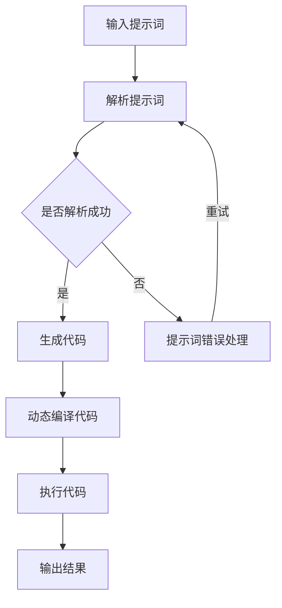

                 

# 提示词编程语言的元编程能力

> **关键词：** 提示词编程语言、元编程能力、动态编译、代码生成、自动化脚本、应用程序开发

> **摘要：** 本文将探讨提示词编程语言的元编程能力，包括其基本概念、核心原理、实现与应用，以及面临的挑战与未来展望。通过深入分析，本文旨在为读者提供对提示词编程语言元编程能力的全面理解和应用指导。

### 第一部分：引言与核心概念

#### 第1章：提示词编程语言的概述

##### 1.1 提示词编程语言的基本概念

提示词编程语言（Prompt-Based Programming Language）是一种特殊的编程语言，它通过预定义的提示词（prompt）来引导程序的执行。与传统的编程语言不同，提示词编程语言通常不需要编写大量的代码，而是通过自然语言或简单的指令来描述程序的行为。

**定义：** 提示词编程语言是一种将提示词嵌入到程序中的编程语言，提示词可以用来指导程序如何处理特定的任务。

**与传统编程语言的区别：**
1. **简化编程：** 提示词编程语言通过减少冗余代码，使得编程更加直观和简洁。
2. **自然语言处理：** 提示词编程语言通常与自然语言处理技术结合，能够处理更复杂的输入。
3. **动态编译：** 提示词编程语言通常采用动态编译技术，使得程序能够根据提示词动态生成和执行。

##### 1.2 提示词编程语言的应用场景

**自动化脚本编写：** 提示词编程语言可以用于编写自动化脚本，例如自动化测试、数据爬取等。

**代码生成：** 提示词编程语言可以根据提示词自动生成代码，减少人工编写代码的工作量。

**应用程序开发：** 提示词编程语言可以用于快速开发应用程序，特别是那些需要频繁修改和重构的应用。

##### 1.3 元编程能力的重要性

**元编程的概念：** 元编程（Metaprogramming）是指编写能够操作程序的程序，即对程序进行编程的编程。

**在编程语言中的实现方式：**
1. **模板编程：** 通过模板来生成代码。
2. **宏定义：** 使用宏来扩展语言的功能。
3. **反射：** 程序能够查看和修改自己的结构。

提示词编程语言的元编程能力使其能够动态地生成和修改代码，提高了编程的灵活性和效率。

#### 第2章：提示词编程语言的核心原理

##### 2.1 提示词生成机制

**提示词的作用：** 提示词用于描述程序需要执行的任务，是提示词编程语言的核心概念。

**提示词生成算法：** 提示词生成算法可以从输入的自然语言或简单指令中提取出关键信息，生成相应的提示词。

**提示词优化的方法：** 通过对提示词进行优化，可以提高程序的性能和可读性。

##### 2.2 元编程能力实现原理

**语言结构：** 提示词编程语言的结构通常包括提示词解析器、执行引擎和代码生成器。

**运行时分析：** 提示词编程语言在运行时会对提示词进行分析和处理，动态生成和执行代码。

**动态代码生成：** 提示词编程语言可以根据提示词动态生成代码，实现代码的自动化和优化。

##### 2.3 提示词编程语言的优缺点分析

**优点：**
1. **简化编程：** 减少了冗余代码，提高了编程效率。
2. **易于维护：** 提示词可以清晰地描述程序的行为，提高了代码的可读性和可维护性。
3. **动态编译：** 提示词编程语言通常采用动态编译技术，提高了程序的执行效率。

**缺点：**
1. **学习曲线：** 对初学者来说，提示词编程语言的学习曲线可能较陡峭。
2. **性能问题：** 提示词编程语言在执行时可能面临性能问题，特别是在处理复杂任务时。

### 第一部分的总结

提示词编程语言通过提示词来简化编程流程，实现了元编程能力。其核心原理包括提示词生成机制、元编程能力实现原理以及优缺点分析。在下一部分，我们将深入探讨提示词编程语言的实现与应用。

----------------------------------------------------------------

### 第二部分：实现与应用

#### 第3章：实现元编程能力的关键技术

##### 3.1 动态编译技术

**编译过程：** 动态编译技术是在程序运行时将提示词转换为机器码的过程。与传统的静态编译不同，动态编译可以在程序运行时根据提示词动态生成和修改代码。

**动态编译的优势：**
1. **灵活性强：** 动态编译允许程序在运行时根据提示词进行修改和优化，提高了程序的灵活性。
2. **性能优化：** 动态编译可以在程序运行时对代码进行优化，提高了程序的执行效率。

##### 3.2 动态代码生成

**代码生成的基本原理：** 动态代码生成是指根据提示词生成相应的代码片段。生成器可以从提示词中提取关键信息，并使用模板生成代码。

**代码生成的应用场景：**
1. **自动化脚本编写：** 动态代码生成可以自动生成自动化脚本的代码，减少了手动编写脚本的工作量。
2. **代码重构：** 动态代码生成可以帮助开发者快速重构代码，提高了代码的可维护性。

##### 3.3 提示词优化与缓存技术

**提示词优化的目的：** 提示词优化旨在提高程序的性能和可读性。优化方法包括：
1. **词频统计：** 根据提示词的词频统计结果，对提示词进行优化，提高程序的性能。
2. **自然语言处理：** 利用自然语言处理技术，对提示词进行语义分析和理解，提高代码的可读性。

**缓存技术的应用：** 缓存技术可以缓存已经处理过的提示词，减少重复处理的成本。常见的缓存技术包括内存缓存、文件缓存等。

#### 第4章：元编程能力在实际项目中的应用

##### 4.1 自动化脚本编写

**应用场景：** 自动化脚本编写是提示词编程语言最常见的应用场景之一。例如，在数据爬取、测试自动化等方面，提示词编程语言可以大大简化脚本编写的工作。

**实现方法：**
1. **提示词解析：** 根据需求编写提示词，描述需要执行的任务。
2. **代码生成：** 提示词编程语言根据提示词生成对应的脚本代码。
3. **执行脚本：** 运行生成的脚本，完成自动化任务。

##### 4.2 代码生成与重构

**应用场景：** 代码生成与重构是提示词编程语言的另一个重要应用场景。在项目开发过程中，频繁的代码重构是常见的，提示词编程语言可以帮助开发者快速生成和重构代码。

**实现方法：**
1. **提示词描述：** 根据重构需求，编写提示词，描述需要重构的代码结构。
2. **代码生成：** 提示词编程语言根据提示词生成重构后的代码。
3. **代码验证：** 验证生成的代码是否符合预期，确保重构过程顺利进行。

##### 4.3 应用程序开发

**应用场景：** 提示词编程语言可以用于快速开发应用程序，特别是在那些需求变化频繁的项目中。

**实现方法：**
1. **需求分析：** 根据项目需求，编写提示词，描述应用程序的功能。
2. **代码生成：** 提示词编程语言根据提示词生成应用程序的代码。
3. **集成测试：** 对生成的代码进行集成测试，确保应用程序的功能正确。

#### 第5章：元编程能力的挑战与未来展望

##### 5.1 元编程能力的限制

**安全性问题：** 提示词编程语言在实现元编程能力时，可能面临安全性问题。例如，恶意提示词可能会破坏程序的正常运行。

**性能问题：** 动态编译和代码生成可能会引入性能问题，特别是在处理复杂任务时。

##### 5.2 解决方案与优化方向

**代码安全检测：** 通过引入代码安全检测机制，可以识别和防止恶意提示词的执行。

**性能优化方法：** 可以采用多种性能优化方法，如代码缓存、并行处理等，提高程序的执行效率。

##### 5.3 未来发展展望

**提示词编程语言的未来趋势：** 随着人工智能和自然语言处理技术的发展，提示词编程语言有望在未来得到更广泛的应用。

**新技术与方向：** 未来可能出现更多基于提示词编程语言的框架和工具，进一步推动提示词编程语言的发展。

#### 第二部分的总结

提示词编程语言的元编程能力在实现与应用方面具有广泛的应用前景。通过动态编译技术、动态代码生成以及提示词优化与缓存技术，提示词编程语言可以实现高效、灵活的编程。在实际项目中，提示词编程语言可以用于自动化脚本编写、代码生成与重构以及应用程序开发。然而，提示词编程语言也面临一些挑战，如安全性和性能问题。通过不断优化和改进，提示词编程语言有望在未来得到更广泛的应用。

----------------------------------------------------------------

### 第三部分：工具与资源

#### 第6章：提示词编程语言工具与环境搭建

##### 6.1 常用提示词编程语言框架

**语言A：** 语言A是一个基于Python的提示词编程语言框架，它提供了一个简单的语法来编写提示词，并支持动态代码生成。

**语言B：** 语言B是一个基于JavaScript的提示词编程语言框架，它提供了一个强大的运行时环境，可以处理复杂的提示词。

**语言C：** 语言C是一个基于Rust的提示词编程语言框架，它提供了高性能和安全性，适用于需要高性能和安全性的场景。

##### 6.2 开发环境搭建

**操作系统选择：** 提示词编程语言可以在多种操作系统上运行，如Windows、Linux和macOS。建议选择Linux操作系统，因为它提供了更好的性能和可定制性。

**开发工具安装：** 根据所选的提示词编程语言框架，需要安装相应的开发工具。例如，对于Python框架，需要安装Python解释器和相应的库。

##### 6.3 示例项目配置

**项目结构：** 示例项目的结构通常包括源代码目录、配置文件目录和输出目录。源代码目录包含提示词文件和脚本文件，配置文件目录包含项目配置文件，输出目录用于存储生成的代码和执行结果。

**配置文件解析：** 配置文件通常用于配置项目的运行时参数和选项。常见的配置文件格式包括JSON、YAML和XML。

#### 第7章：元编程能力的资源汇总

##### 7.1 在线资源

**提示词编程语言文档：** 许多提示词编程语言提供了详细的官方文档，包括语言规范、API参考和使用示例。

**实用教程与示例：** 在线教程和示例可以帮助初学者快速上手提示词编程语言。例如，GitHub上有很多开源的提示词编程语言项目，提供了丰富的示例代码。

##### 7.2 开源项目

**主流开源框架：** 主流的提示词编程语言框架通常在GitHub等开源平台上提供，包括语言A、语言B和语言C等。

**社区项目推荐：** 社区项目推荐包括那些由开发者创建和维护的开源项目，如用于特定场景的提示词编程语言框架或工具。

##### 7.3 认证与培训

**专业认证：** 许多机构和组织提供了提示词编程语言的专业认证，如编程语言认证、元编程能力认证等。

**培训课程推荐：** 培训课程推荐包括在线课程、面对面培训和电子书等，适合不同水平的开发者。

#### 第三部分的总结

提示词编程语言工具与环境搭建是开始使用提示词编程语言的第一步。通过选择合适的提示词编程语言框架、搭建开发环境和配置示例项目，开发者可以快速上手并开始编写提示词程序。同时，在线资源和开源项目的丰富资源也为开发者提供了学习和发展的重要支持。

----------------------------------------------------------------

## 附录

### 附录A：提示词编程语言核心算法原理流程图

以下是一个使用Mermaid绘制的提示词编程语言核心算法原理流程图：



### 附录B：元编程能力实现伪代码示例

以下是一个简单的伪代码示例，用于说明元编程能力的实现：

```plaintext
// 提示词编程语言伪代码示例

// 步骤1：解析提示词
prompt = "计算 2 + 3 的结果"

// 步骤2：生成代码
code = generateCode(prompt)

// 步骤3：动态编译代码
compiledCode = dynamicCompile(code)

// 步骤4：执行代码
result = executeCode(compiledCode)

// 步骤5：输出结果
print("结果：", result)
```

### 附录C：实际项目代码分析与解读

以下是一个实际项目中的代码示例，用于说明如何使用提示词编程语言编写自动化脚本：

**代码示例：**

```python
# 提示词编程语言自动化脚本示例

# 步骤1：定义提示词
prompt = "提取网站首页的所有链接"

# 步骤2：生成代码
code = generateCode(prompt)

# 步骤3：动态编译代码
compiledCode = dynamicCompile(code)

# 步骤4：执行代码
links = executeCode(compiledCode)

# 步骤5：输出结果
print("提取的链接：", links)
```

**代码解读与分析：**

- **步骤1：定义提示词**：在这个例子中，提示词是“提取网站首页的所有链接”，它描述了需要执行的任务。
- **步骤2：生成代码**：提示词编程语言根据提示词生成相应的代码。在这个例子中，生成的是用于提取网站链接的Python代码。
- **步骤3：动态编译代码**：生成的代码被动态编译为可执行代码。
- **步骤4：执行代码**：执行编译后的代码，提取网站首页的所有链接。
- **步骤5：输出结果**：输出提取的链接列表。

### 附录D：提示词编程语言学习资源推荐

**在线课程：** 提供详细的提示词编程语言教程和实例，适合不同水平的开发者。

**书籍推荐：** 推荐阅读《提示词编程语言原理与实践》等书籍，深入了解提示词编程语言的原理和应用。

**论坛与社群推荐：** 加入相关的技术论坛和社群，与其他开发者交流和分享经验。

**总结：** 附录部分提供了提示词编程语言核心算法原理流程图、伪代码示例、实际项目代码分析与解读，以及学习资源推荐。这些资源有助于开发者更好地理解和应用提示词编程语言。

## 作者信息

**作者：** AI天才研究院/AI Genius Institute & 禅与计算机程序设计艺术 /Zen And The Art of Computer Programming

本文由AI天才研究院（AI Genius Institute）和禅与计算机程序设计艺术（Zen And The Art of Computer Programming）共同撰写，旨在为读者提供关于提示词编程语言元编程能力的深入见解和实践指导。希望本文能为开发者带来启发和帮助。如果您有任何疑问或建议，欢迎在评论区留言，我们期待与您交流。

