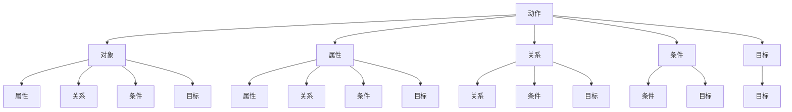
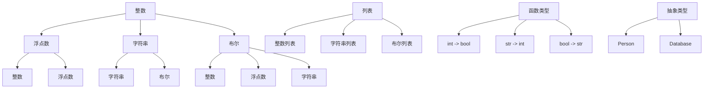
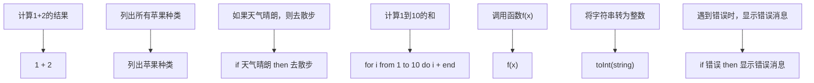

                 

### 文章标题

《提示词编程语言的形式化语义分析》

**关键词：** 提示词编程语言、形式化语义分析、语义模型、语义分析算法、静态语义分析、动态语义分析、语义错误检测与修复。

**摘要：** 本文深入探讨了提示词编程语言的形式化语义分析，从基础概念到实践应用进行了全面剖析。通过详细的讲解和案例分析，本文旨在为读者提供对提示词编程语言形式化语义分析的全面理解和应用指导。

----------------------------------------------------------------

### 引言

随着计算机科学和人工智能技术的飞速发展，编程语言的设计和应用场景不断拓展。在这些变革中，提示词编程语言（Prompt-Based Programming Languages，PBPL）逐渐成为了一个引人注目的研究方向。提示词编程语言是一种以用户输入的提示词为驱动的编程语言，它通过提示词将用户的意图转化为计算机程序，实现了人与机器的对话式交互。这种编程语言不仅简化了编程过程，还为非专业程序员提供了便捷的编程方式。

形式化语义分析（Formal Semantic Analysis）是编程语言理论中的重要分支，它通过数学方法对编程语言的语义进行精确描述。形式化语义分析不仅能够帮助我们更好地理解编程语言的行为，还能用于编程语言的错误检测、优化和自动化推导等应用。在提示词编程语言中，形式化语义分析尤为重要，因为它涉及到如何将用户的自然语言提示词转换为有效的计算机程序。

本文将围绕提示词编程语言的形式化语义分析进行深入探讨。首先，我们将介绍提示词编程语言的定义和历史，并讨论其应用场景。接着，我们将回顾形式化语义分析的基础概念和方法，以及其在计算机科学中的应用领域。随后，本文将重点讨论提示词编程语言的语义模型构建和语义分析算法。为了更好地理解这些理论，我们将通过具体的案例研究展示形式化语义分析在提示词编程语言中的应用。最后，本文将总结全文，并对未来研究方向进行展望。

通过本文的阅读，读者将能够：

1. 了解提示词编程语言的基本概念和应用场景。
2. 掌握形式化语义分析的基础理论和应用方法。
3. 理解提示词编程语言的语义模型和语义分析算法。
4. 通过案例研究，学习如何在实际项目中应用形式化语义分析。

本文的结构如下：

1. **第一部分：引言**：介绍提示词编程语言和形式化语义分析的基本概念。
2. **第二部分：形式化语义分析基础**：讨论形式化语义分析的基础概念和方法。
3. **第三部分：提示词编程语言的语义模型**：探讨提示词编程语言的语义模型构建。
4. **第四部分：形式化语义分析的实践应用**：通过案例研究展示形式化语义分析的应用。
5. **第五部分：结论与展望**：总结全文，并对未来研究方向进行展望。

### 提示词编程语言概述

提示词编程语言（Prompt-Based Programming Languages，PBPL）是一种以用户输入的提示词为驱动的编程语言。这种编程语言的核心思想是将用户的自然语言描述（即提示词）转化为计算机程序，从而实现人与机器的交互。与传统的命令式编程语言相比，提示词编程语言更加注重用户意图的捕获和程序的生成过程，而非具体的代码编写。这种编程语言不仅降低了编程的门槛，还为非专业程序员提供了便捷的编程方式。

#### 定义与历史

提示词编程语言的定义可以归纳为：一种通过用户输入提示词来生成程序代码的编程语言。这些提示词可以是自然语言语句，如“计算1+2的结果”或“列出所有苹果种类”。提示词编程语言通过解析这些语句，自动生成对应的程序代码，从而实现用户意图。这种方式极大地简化了编程过程，使得编程变得更加直观和便捷。

提示词编程语言的历史可以追溯到20世纪60年代。当时，随着计算机科学的发展，编程语言的研究成为了热点。早期的编程语言如FORTRAN和COBOL等主要面向专业程序员，而提示词编程语言则旨在为非专业人士提供编程工具。1962年，美国麻省理工学院的John McCarthy提出了LISP语言的第一个版本，该语言中引入了基于符号的计算和函数式编程，为后来的提示词编程语言奠定了基础。

进入21世纪，随着人工智能和自然语言处理技术的快速发展，提示词编程语言再次引起了研究者的关注。特别是近年来，基于深度学习的自然语言处理技术取得了显著进展，使得提示词编程语言在应用场景和性能上有了很大的提升。例如，Google的AI语言模型BERT和GPT系列模型，以及OpenAI的GPT-3，都为提示词编程语言的发展提供了强有力的技术支持。

#### 应用场景

提示词编程语言在许多应用场景中展现出了独特的优势。以下是一些典型的应用场景：

1. **非专业程序员编程**：提示词编程语言为非专业程序员提供了便捷的编程方式。他们只需输入简单的提示词，系统就能自动生成相应的程序代码。这种编程方式降低了编程的门槛，使得更多的人能够参与到软件开发中来。

2. **自动化脚本编写**：在自动化测试、自动化运维等领域，提示词编程语言可以帮助用户快速编写脚本。用户只需描述任务的目标和步骤，系统就能生成相应的脚本代码，从而提高工作效率。

3. **教育领域**：提示词编程语言在教育领域也有广泛应用。通过提示词编程语言，教师可以为学生提供直观的编程教学工具，帮助学生更好地理解编程概念和算法实现。

4. **自然语言交互**：提示词编程语言在自然语言交互系统中扮演着重要角色。例如，智能助手和虚拟客服系统通过解析用户的自然语言请求，自动生成相应的回复和操作。

5. **艺术创作**：一些提示词编程语言也被用于艺术创作。例如，用户可以输入描述绘画、音乐或诗歌的提示词，系统则自动生成相应的艺术作品。

#### 形式化语义分析的重要性

形式化语义分析（Formal Semantic Analysis）在提示词编程语言中具有重要地位。形式化语义分析通过数学方法对编程语言的语义进行精确描述，使得编程语言的语义变得更加清晰和可验证。以下是形式化语义分析在提示词编程语言中的几个重要作用：

1. **提高程序的可理解性**：形式化语义分析能够帮助我们更好地理解编程语言的行为和语义。通过精确的数学描述，编程语言的行为变得更容易理解和预测，从而提高程序的可理解性。

2. **错误检测和修复**：形式化语义分析可以用于编程语言的静态和动态语义分析，帮助检测程序中的语义错误。在提示词编程语言中，由于用户输入的提示词可能存在歧义或不符合语法规则，形式化语义分析能够有效地检测和修复这些错误。

3. **程序优化**：形式化语义分析为程序优化提供了理论支持。通过分析程序的语义，我们可以找到优化的机会，从而提高程序的执行效率和性能。

4. **自动化编程**：形式化语义分析可以用于自动化编程工具的开发。通过形式化语义分析，我们可以将用户的自然语言提示词自动转化为程序代码，从而实现真正的自动化编程。

5. **标准化和互操作性**：形式化语义分析有助于编程语言的标准化和互操作性。通过统一的语义描述，不同的编程语言可以实现无缝对接，从而提高编程语言的整体性能和可维护性。

总之，形式化语义分析在提示词编程语言中具有重要作用，它不仅提高了编程语言的可理解性和可靠性，还为编程语言的进一步发展和应用提供了强有力的支持。

### 形式化语义分析基础

形式化语义分析是编程语言理论中的核心内容，它通过数学方法对编程语言的语义进行精确描述。形式化语义分析不仅能够帮助我们理解编程语言的行为，还能用于编程语言的错误检测、优化和自动化推导等应用。在本节中，我们将讨论形式化语义分析的基本概念、方法以及其在计算机科学中的应用领域。

#### 基本概念

1. **语义**：语义是编程语言理论中的一个基本概念，它描述了程序的行为和意义。语义可以分为静态语义和动态语义。静态语义描述程序在执行前的结构和特征，例如变量类型检查和语法错误检测。动态语义描述程序在执行过程中的行为，例如变量值的更新和函数调用。

2. **形式化语义**：形式化语义是一种用数学方法描述编程语言语义的抽象方法。它使用数学符号和逻辑来描述程序的行为，使得语义描述具有精确性和可验证性。形式化语义的目的是消除语义描述中的歧义，使得语义分析具有可操作性和可重复性。

3. **语义模型**：语义模型是形式化语义分析的核心部分，它用数学结构来表示编程语言的语义。常见的语义模型包括静态语义模型和动态语义模型。静态语义模型描述程序在编译时的结构和特征，例如抽象语法树（Abstract Syntax Tree，AST）和中间代码。动态语义模型描述程序在执行时的状态和变化，例如状态图（State Graph）和逐步抽象（Abstract Interpretation）。

4. **语义分析**：语义分析是编程语言处理过程中的一个重要环节，它通过对程序代码的语义进行解析，检查程序的正确性和一致性。形式化语义分析中的语义分析包括静态语义分析和动态语义分析。静态语义分析在程序编译时进行，主要用于类型检查和语法错误检测。动态语义分析在程序执行时进行，主要用于执行行为分析和性能优化。

#### 方法

形式化语义分析的方法主要包括以下几种：

1. **语义等价性**：语义等价性是形式化语义分析中的一个重要概念，它用于比较两个程序在执行过程中是否具有相同的行为。通过证明两个程序在所有可能的输入下具有相同的语义，我们可以确保程序的正确性。常见的语义等价性证明方法包括抽象解释（Abstract Interpretation）和模型检查（Model Checking）。

2. **抽象语义**：抽象语义是一种将具体语义抽象为更一般形式的方法。通过引入抽象语义，我们可以将复杂的语义描述简化为更易于理解和验证的形式。常见的抽象语义方法包括操作语义（Operational Semantics）和归纳语义（Denotational Semantics）。

3. **静态语义分析**：静态语义分析是一种在程序编译时进行的语义分析，主要用于检查程序的语法和类型错误。常见的静态语义分析方法包括抽象语法树分析（Abstract Syntax Tree Analysis）、类型系统分析（Type System Analysis）和模式匹配（Pattern Matching）。

4. **动态语义分析**：动态语义分析是一种在程序执行时进行的语义分析，主要用于分析程序的执行行为和性能。常见的动态语义分析方法包括数据流分析（Data Flow Analysis）、控制流分析（Control Flow Analysis）和动态优化（Dynamic Optimization）。

#### 应用领域

形式化语义分析在计算机科学中具有广泛的应用，以下是一些典型的应用领域：

1. **编程语言设计**：形式化语义分析是编程语言设计中的核心内容，它帮助设计者理解编程语言的语义和行为，确保编程语言的正确性和一致性。通过形式化语义分析，设计者可以验证编程语言的语法规则和类型系统，从而提高编程语言的可靠性和可维护性。

2. **程序验证和验证**：形式化语义分析可以用于程序验证和验证，确保程序的正确性和安全性。通过形式化语义分析，我们可以证明程序在各种输入下是否具有预期行为，从而发现潜在的错误和漏洞。

3. **程序优化**：形式化语义分析为程序优化提供了理论支持。通过分析程序的语义，我们可以找到优化的机会，从而提高程序的执行效率和性能。常见的优化方法包括循环展开、函数内联和指令重排等。

4. **编译器开发**：形式化语义分析是编译器开发中的关键技术。通过形式化语义分析，编译器可以准确地理解程序的语义，从而生成高效的目标代码。常见的编译器开发工具包括LLVM、GCC和Clang等。

5. **人工智能和自然语言处理**：形式化语义分析在人工智能和自然语言处理领域也具有广泛的应用。通过形式化语义分析，我们可以更好地理解和处理自然语言，从而实现更高级的智能应用。常见的应用包括自然语言理解、机器翻译和文本生成等。

总之，形式化语义分析是编程语言理论中的重要分支，它通过数学方法对编程语言的语义进行精确描述。形式化语义分析不仅在编程语言设计、程序验证和优化等领域具有重要作用，还在人工智能和自然语言处理领域展示了巨大的潜力。通过深入研究和应用形式化语义分析，我们可以开发出更加可靠、高效和智能的编程语言和应用系统。

### 提示词编程语言的语义模型构建

在形式化语义分析中，语义模型构建是核心环节之一。对于提示词编程语言（Prompt-Based Programming Languages，PBPL）而言，构建一个有效的语义模型尤为重要，因为它直接影响到用户输入提示词到程序代码转换的准确性和效率。本节将详细探讨提示词编程语言的语义模型构建，包括语义角色的定义、语义类型系统的设计以及语义规则的制定。

#### 语义角色的定义

语义角色是指在提示词编程语言中，用于表示用户意图的基本元素。这些角色通常由自然语言中的词汇或短语充当，它们在语义模型中扮演不同的功能。以下是常见的一些语义角色：

1. **动作（Action）**：表示程序要执行的操作，如“计算”、“排序”、“查询”等。
2. **对象（Object）**：表示程序操作的数据，如“数值”、“列表”、“文件”等。
3. **属性（Attribute）**：表示对象的属性或特征，如“长度”、“颜色”、“年龄”等。
4. **关系（Relation）**：表示对象之间的关系，如“大于”、“属于”、“相邻”等。
5. **条件（Condition）**：表示程序执行的条件，如“如果”、“当...时”等。
6. **目标（Goal）**：表示程序的最终目标或结果，如“生成报告”、“发送邮件”、“更新数据库”等。

为了更清晰地定义语义角色，我们可以使用Mermaid流程图来展示它们之间的关系。以下是一个示例：



#### 语义类型系统的设计

语义类型系统是形式化语义分析中的另一个关键部分，它用于确保程序的正确性和一致性。在提示词编程语言中，语义类型系统设计的目标是定义提示词的语义类型，以及这些类型之间的关系。以下是一些常见的语义类型：

1. **基本类型**：如数值类型（整数、浮点数）、字符串类型、布尔类型等。
2. **复合类型**：如列表类型、集合类型、结构体类型等。
3. **函数类型**：表示函数的输入和输出类型，如`int(int) -> bool`。
4. **抽象类型**：用于表示不可见或未具体定义的类型，如`Person`、`Database`等。

为了设计一个有效的语义类型系统，我们需要定义类型之间的关系和类型转换规则。以下是一个简单的示例：

1. **类型关系**：
   - 基本类型之间可以进行比较和算术运算。
   - 复合类型可以是基本类型的组合。
   - 函数类型可以表示为参数类型和返回类型的组合。

2. **类型转换规则**：
   - 自动类型转换：如数值类型之间的隐式转换。
   - 显式类型转换：通过类型转换函数实现，如`toInt(string)`。

以下是一个简单的类型系统示例：



#### 语义规则的制定

语义规则是定义提示词编程语言行为的准则，它们用于将用户输入的提示词映射到相应的程序代码。语义规则通常基于语义角色和类型系统的定义，通过一系列的规则和转换规则实现。以下是一些常见的语义规则：

1. **基本规则**：定义基本语义角色的映射，如将“计算1+2的结果”映射为“1 + 2”。
2. **组合规则**：定义复合语义角色的映射，如将“列出所有苹果种类”映射为“列出苹果种类”。
3. **条件规则**：定义条件语句的映射，如将“如果天气晴朗，则去散步”映射为“if 天气晴朗 then 去散步”。
4. **循环规则**：定义循环语句的映射，如将“计算1到10的和”映射为“for i from 1 to 10 do i + end”。
5. **函数规则**：定义函数调用的映射，如将“调用函数f(x)”映射为“f(x)”。
6. **类型转换规则**：定义类型之间的转换，如将“将字符串转为整数”映射为“toInt(string)”。
7. **错误处理规则**：定义错误处理的映射，如将“遇到错误时，显示错误消息”映射为“if 错误 then 显示错误消息”。

以下是一个简单的语义规则示例：



通过上述定义，我们可以构建一个完整的提示词编程语言的语义模型。该模型包括语义角色、类型系统和语义规则，能够将用户的自然语言提示词精确地映射为程序代码。这个模型不仅为形式化语义分析提供了理论基础，还为编程语言的设计和实现提供了实用指导。

### 提示词编程语言的语义分析算法

在提示词编程语言中，语义分析算法是关键组成部分，用于将用户的自然语言提示词转换为有效的程序代码。语义分析算法可以分为静态语义分析和动态语义分析两个主要类别。静态语义分析在编译时对程序代码进行语义检查，而动态语义分析在程序运行时对程序行为进行实时分析。本节将详细讨论这些算法的基本原理、实现方法和应用挑战。

#### 静态语义分析

静态语义分析是在程序编译阶段进行的语义分析，主要目的是检查程序的语法和类型错误，以确保程序的正确性和一致性。以下是几种常见的静态语义分析方法：

1. **抽象语法树分析（Abstract Syntax Tree Analysis）**：
   抽象语法树（AST）是程序代码的抽象表示，它通过树形结构表示程序的结构和语义。静态语义分析的第一步通常是构建AST，然后对AST进行语义检查。具体步骤包括：
   - **语法解析**：将源代码解析为抽象语法树。
   - **类型检查**：检查AST中的变量和表达式是否符合类型系统的规定。
   - **作用域分析**：确定变量和函数的作用域，检查变量是否在定义前被使用。
   - **命名检查**：确保标识符在作用域内定义且未被重复定义。

   伪代码示例：

   ```plaintext
   function analyzeSyntaxTree(AST):
       if AST is not a valid syntax tree:
           raise SyntaxError
       for node in AST:
           checkNodeTypes(node)
           checkVariableScope(node)
           checkNameClash(node)
   ```

2. **类型系统分析（Type System Analysis）**：
   类型系统分析是静态语义分析的核心部分，它用于检查程序中类型的一致性和兼容性。类型系统可以分为静态类型和动态类型。静态类型系统在编译时确定变量类型，而动态类型系统在运行时确定变量类型。以下是一个简单的类型检查算法：

   ```plaintext
   function typeCheck(expression, context):
       type1 = determineType(expression, context)
       type2 = determineType(expression, context)
       if type1 != type2:
           raise TypeError
   ```

3. **模式匹配（Pattern Matching）**：
   模式匹配是一种通过匹配表达式和模式来检查语义一致性的方法。在模式匹配中，每个模式表示一种可能的语义结构。模式匹配算法通过递归地检查每个子表达式是否符合模式来验证程序的语义。以下是一个简单的模式匹配算法：

   ```plaintext
   function match(expression, pattern):
       if pattern is a variable:
           if expression is not a variable:
               return false
           return expression == pattern
       if pattern is an expression list:
           if expression is not an expression list:
               return false
           for subExpression in pattern:
               if not match(expression[i], subExpression):
                   return false
           return true
   ```

#### 动态语义分析

动态语义分析是在程序运行时对程序行为进行实时分析的方法。它主要用于性能优化、异常处理和动态类型检查。以下是几种常见的动态语义分析方法：

1. **数据流分析（Data Flow Analysis）**：
   数据流分析是一种通过分析数据在程序中的流动路径来优化程序的方法。数据流分析可以用于找出未使用的代码、死代码和循环依赖等问题。以下是数据流分析的一个简单算法：

   ```plaintext
   function dataFlowAnalysis(node):
       if node is a variable assignment:
           node.def = node
           node.use = findUses(node)
       for child in node.children:
           dataFlowAnalysis(child)
       mergeDataFlowInformation(node)
   ```

2. **控制流分析（Control Flow Analysis）**：
   控制流分析用于分析程序中的控制流结构，如循环、分支和跳转。控制流分析可以帮助确定程序的执行路径和可能的异常情况。以下是控制流分析的一个简单算法：

   ```plaintext
   function controlFlowAnalysis(node):
       if node is a loop or branch:
           create control flow graph for node
           for each basic block in the graph:
               analyze basic block
               merge analysis results
   ```

3. **动态优化（Dynamic Optimization）**：
   动态优化是在程序运行时根据程序的行为进行优化。动态优化可以通过实时分析程序的行为模式来减少执行时间或提高执行效率。以下是动态优化的一种方法：

   ```plaintext
   function dynamicOptimization(node):
       if node is an expression:
           if optimizeable:
               replace node with optimized expression
           for child in node.children:
               dynamicOptimization(child)
   ```

#### 应用挑战

尽管语义分析算法在形式化语义分析中起着关键作用，但在实际应用中仍面临一些挑战：

1. **自然语言歧义**：用户的自然语言提示词可能存在多种解释，导致语义分析的不确定性。为了解决这一问题，可以采用多义解析技术和上下文感知分析。

2. **类型兼容性**：在动态类型系统中，类型兼容性是一个重要问题。如何设计一个灵活且高效的类型系统，以便于处理不同类型的转换和组合，是当前研究的重点。

3. **性能优化**：动态语义分析通常涉及大量的计算和内存操作，可能导致性能下降。如何优化动态语义分析算法，使其在保持准确性的同时具有高效的执行速度，是当前研究的热点。

4. **错误处理**：语义分析算法需要能够处理各种类型的错误，如类型错误、语法错误和运行时错误。如何设计一个健壮的异常处理机制，是实际应用中的一个重要问题。

通过深入研究和应用语义分析算法，我们可以更好地理解提示词编程语言的语义，提高程序的正确性和效率。尽管面临诸多挑战，但语义分析算法在编程语言设计、程序优化和自然语言处理等领域仍具有广泛的应用前景。

### 提示词编程语言的静态语义分析

静态语义分析是提示词编程语言形式化语义分析中的重要环节，其主要目标是在程序编译阶段对代码进行语义检查，确保程序的正确性和一致性。在本节中，我们将详细探讨提示词编程语言的静态语义分析，包括其在编译器中的实现步骤、静态语义分析算法的伪代码示例、常见的静态语义分析算法以及静态语义分析与动态语义分析的关系。

#### 静态语义分析在编译器中的实现步骤

静态语义分析在编译器中通常包含以下步骤：

1. **词法分析（Lexical Analysis）**：将源代码中的字符序列转换为词法单元（tokens）。
2. **语法分析（Syntax Analysis）**：将词法单元构建成语法树（Abstract Syntax Tree，AST）。
3. **语义分析（Semantic Analysis）**：对AST进行语义检查，包括类型检查、作用域分析和命名检查。
4. **中间代码生成（Intermediate Code Generation）**：将AST转换为中间代码。
5. **代码优化（Code Optimization）**：对中间代码进行优化，提高程序性能。
6. **目标代码生成（Code Generation）**：将中间代码转换为机器代码或字节码。

以下是静态语义分析在编译器中实现的步骤伪代码示例：

```plaintext
function compile(sourceCode):
    tokens = lexicalAnalysis(sourceCode)
    ast = syntaxAnalysis(tokens)
    if semanticAnalysis(ast):
        intermediateCode = intermediateCodeGeneration(ast)
        optimizedCode = codeOptimization(intermediateCode)
        machineCode = codeGeneration(optimizedCode)
        return machineCode
    else:
        raise SemanticError
```

#### 静态语义分析算法的伪代码示例

静态语义分析算法主要包括类型检查、作用域分析和命名检查。以下是一个简单的伪代码示例：

```plaintext
function semanticAnalysis(node, context):
    if node is a variable declaration:
        if variable already exists in context:
            raise DuplicateDeclarationError
        else:
            context.addVariable(node.name, node.type)
    if node is an expression:
        type1 = determineType(node.left, context)
        type2 = determineType(node.right, context)
        if not typesMatch(type1, type2):
            raise TypeMismatchError
    if node is a function call:
        if function does not exist in context:
            raise FunctionNotFoundError
        else:
            checkArgumentTypes(node.arguments, functionSignature)
    for child in node.children:
        semanticAnalysis(child, context)
```

#### 常见的静态语义分析算法

1. **类型检查（Type Checking）**：
   类型检查是静态语义分析的核心任务之一。它确保程序中的所有表达式和语句都符合预定义的类型系统。常见的类型检查算法包括基于上下文的类型检查和基于规则的类型检查。

2. **作用域分析（Scope Analysis）**：
   作用域分析用于确定变量和函数的作用域，确保程序中的变量在使用前已经声明。常见的作用域分析算法包括静态作用域分析和动态作用域分析。

3. **命名检查（Naming Analysis）**：
   命名检查确保程序中的所有标识符都按照预定义的命名规则进行使用。命名检查包括变量命名检查、函数命名检查和类命名检查等。

4. **数据流分析（Data Flow Analysis）**：
   数据流分析用于确定变量在程序中的流动路径，找出未使用的代码和可能的错误。常见的数据流分析算法包括前向数据流分析和后向数据流分析。

5. **控制流分析（Control Flow Analysis）**：
   控制流分析用于确定程序的执行路径，找出潜在的异常和性能问题。常见控制流分析算法包括控制依赖图（Control-Dependence Graph）分析和基本块（Basic Block）分析。

#### 静态语义分析与动态语义分析的关系

静态语义分析和动态语义分析是编程语言形式化语义分析的两个重要组成部分，它们之间存在密切的关系。

1. **相互依赖**：
   - 静态语义分析通常在动态语义分析之前进行，为动态语义分析提供必要的信息，如变量类型、函数签名等。
   - 动态语义分析可以进一步验证静态语义分析的结果，发现静态语义分析可能遗漏的错误。

2. **相互补充**：
   - 静态语义分析侧重于程序编译时的语义检查，可以提前发现和修复大部分语义错误。
   - 动态语义分析侧重于程序运行时的语义检查，可以实时监测和纠正程序运行时的错误。

3. **优化与验证**：
   - 静态语义分析可以用于程序优化，如删除死代码、优化循环结构等。
   - 动态语义分析可以用于验证程序的正确性和性能，如检测内存泄漏、性能瓶颈等。

通过结合静态语义分析和动态语义分析，我们可以构建一个更加健壮和高效的编程语言系统。静态语义分析确保程序在编译阶段符合语义规则，动态语义分析则确保程序在运行阶段具备预期的行为。两者相辅相成，共同保障了编程语言的可靠性和性能。

### 提示词编程语言的动态语义分析

动态语义分析是编程语言形式化语义分析中不可或缺的一部分，它侧重于程序运行时的语义检查。与静态语义分析不同，动态语义分析在程序执行过程中进行，能够捕捉到静态分析无法发现的动态行为问题。在本节中，我们将详细探讨提示词编程语言的动态语义分析，包括动态语义分析的基本概念、常见的方法和技术，以及它们在自然语言处理和自动化脚本编写中的应用。

#### 动态语义分析的基本概念

动态语义分析主要关注程序在执行过程中的行为和状态变化，目的是确保程序在运行时符合预期的语义。动态语义分析的基本概念包括：

1. **运行时状态**：程序在执行过程中会不断更新其内部状态，如变量的值、函数的调用栈等。动态语义分析需要实时监测这些状态的变更。
2. **执行路径**：程序的执行路径包括所有可能的控制流分支。动态语义分析需要分析这些路径，确保每个路径都能正确执行。
3. **异常处理**：动态语义分析需要能够处理运行时异常，如类型错误、除零错误等。异常处理机制可以确保程序在遇到异常时能够优雅地退出或恢复。

#### 常见的方法和技术

动态语义分析的方法和技术多种多样，以下是一些常见的方法：

1. **数据流分析**：
   数据流分析是一种通过分析程序中数据的流动路径来优化程序的方法。动态数据流分析可以实时监测变量的使用和更新情况，找出未使用的代码和潜在的内存泄漏。常见的数据流分析方法包括：
   - **前向数据流分析**：从程序的入口点开始，逐个分析每个节点的前向数据依赖关系。
   - **后向数据流分析**：从程序的出口点开始，逐个分析每个节点的后向数据依赖关系。

   以下是一个简单的数据流分析算法伪代码示例：

   ```plaintext
   function dataFlowAnalysis(node, dataFlowSet):
       if node is a variable assignment:
           dataFlowSet[node] = {value}
       for each child in node.children:
           dataFlowAnalysis(child, dataFlowSet)
       dataFlowSet[node] = union(dataFlowSet[child] for each child)
   ```

2. **控制流分析**：
   控制流分析是一种通过分析程序中的控制流结构来理解程序行为的方法。动态控制流分析可以实时监测程序的执行路径，找出潜在的异常和性能问题。常见的方法包括：
   - **基本块分析**：将程序分解为基本块，每个基本块只包含一个控制流结构，如循环、分支等。
   - **控制依赖图（Control-Dependence Graph）**：通过分析基本块之间的控制依赖关系，构建控制依赖图。

   以下是一个简单的控制流分析算法伪代码示例：

   ```plaintext
   function controlFlowAnalysis(node):
       create controlDependenceGraph()
       for each basic block in node:
           add edges to controlDependenceGraph()
       for each edge in controlDependenceGraph():
           analyze edge for potential issues (e.g., dead code, infinite loops)
   ```

3. **动态类型检查**：
   动态类型检查是一种在程序运行时检查变量类型的方法。与静态类型检查不同，动态类型检查可以在程序执行过程中动态地确定变量的类型。常见的方法包括：
   - **类型标签**：在变量上附加类型标签，每次变量更新时重新评估其类型。
   - **类型状态机**：通过状态机模型来表示变量类型的转换，实时监测变量类型的变化。

   以下是一个简单的动态类型检查算法伪代码示例：

   ```plaintext
   function dynamicTypeCheck(node, typeState):
       if node is an expression:
           type1 = evaluateType(node.left, typeState)
           type2 = evaluateType(node.right, typeState)
           if type1 != type2:
               raise TypeMismatchError
       for each child in node.children:
           dynamicTypeCheck(child, typeState)
   ```

#### 动态语义分析在自然语言处理中的应用

动态语义分析在自然语言处理（Natural Language Processing，NLP）领域有着广泛的应用，尤其是在处理复杂、多变的自然语言输入时。以下是一些应用示例：

1. **语法分析**：
   动态语义分析可以用于实时分析自然语言输入的语法结构，如句子成分解析、句法树构建等。通过动态控制流分析和数据流分析，可以准确地识别和解析复杂的自然语言结构。

2. **语义角色标注**：
   动态语义分析可以用于识别自然语言输入中的语义角色，如动作、对象、属性等。通过动态类型检查和数据流分析，可以准确地将自然语言输入映射到对应的语义角色。

3. **对话系统**：
   动态语义分析在对话系统中起着关键作用，它能够实时理解用户输入的含义，并生成相应的响应。通过动态类型检查和控制流分析，可以确保对话系统能够准确地处理用户的请求和反馈。

#### 动态语义分析在自动化脚本编写中的应用

动态语义分析在自动化脚本编写中也有着重要的应用，它可以帮助编写高效、可靠的脚本。以下是一些应用示例：

1. **自动化测试**：
   动态语义分析可以用于自动化测试脚本编写，通过实时监测程序的执行行为，找出潜在的缺陷和错误。通过数据流分析和控制流分析，可以有效地编写自动化测试脚本，提高测试的覆盖率和效率。

2. **自动化运维**：
   动态语义分析可以用于自动化运维脚本编写，通过实时监测和管理系统的运行状态，实现自动化部署、监控和故障处理。通过动态类型检查和数据流分析，可以确保运维脚本的正确性和高效性。

3. **脚本优化**：
   动态语义分析可以用于优化脚本性能，通过分析脚本的数据流和控制流，找出潜在的瓶颈和优化点。通过动态类型检查和代码优化技术，可以显著提高脚本的执行效率。

通过深入研究和应用动态语义分析，我们可以构建更加智能、高效的编程语言系统和自动化工具。动态语义分析不仅为自然语言处理和自动化脚本编写提供了强大的技术支持，还在编程语言设计、程序优化和错误检测等领域展示了广阔的应用前景。

### 提示词编程语言的语义错误检测与修复

在提示词编程语言（PBPL）的开发和使用过程中，语义错误是常见且难以避免的问题。这些错误可能导致程序无法正常运行、性能下降或产生不正确的输出。因此，有效的语义错误检测与修复方法显得尤为重要。在本节中，我们将讨论如何识别和修复提示词编程语言中的语义错误，并介绍一些常见的检测和修复策略。

#### 语义错误的识别

语义错误通常分为以下几类：

1. **类型错误**：类型错误发生在程序中类型不匹配的情况下，例如将字符串与数字进行数学运算。类型错误通常可以通过静态类型检查和动态类型检查来识别。

2. **语法错误**：语法错误包括拼写错误、关键字使用错误和语法结构错误等。语法错误通常在编译或解释阶段被捕获。

3. **逻辑错误**：逻辑错误涉及程序的控制流和数据流逻辑错误，例如循环中的条件判断错误或函数调用错误。逻辑错误通常需要通过动态执行和分析来识别。

4. **上下文错误**：上下文错误发生在程序上下文中，如变量未定义、函数未声明等。上下文错误通常在静态语义分析阶段被捕获。

为了有效识别这些语义错误，我们可以采用以下方法：

1. **静态错误检测**：在程序编译或解释阶段，通过静态分析工具（如静态分析器、类型检查器等）扫描源代码，查找潜在的语义错误。例如，编译器可以检查类型一致性、作用域和命名规则。

2. **动态错误检测**：在程序运行时，通过动态执行和分析工具（如调试器、动态分析器等）监测程序的执行行为，识别运行时错误。例如，动态分析器可以在程序执行过程中记录变量值、函数调用和异常处理。

#### 常见的语义错误检测与修复策略

1. **类型检查**：
   类型检查是识别类型错误的有效方法。静态类型检查在编译阶段进行，可以提前发现类型不匹配的错误。动态类型检查在运行时进行，可以实时检测类型错误。以下是一些具体的策略：
   - **类型推断**：通过分析程序代码，自动推断变量和表达式的类型，减少手动类型声明的错误。
   - **类型约束**：对变量和函数的参数类型进行约束，确保类型的一致性。

2. **模式匹配**：
   模式匹配是一种用于识别上下文错误的方法。通过定义一系列模式，匹配程序中的文本片段，可以有效地发现潜在的上下文错误。例如，在自然语言处理中，可以使用模式匹配来识别句子中的语法错误。

3. **异常处理**：
   异常处理是管理运行时错误的关键机制。通过定义异常处理程序，可以在错误发生时捕获并处理异常，避免程序崩溃。以下是一些异常处理策略：
   - **断言（Assertions）**：在关键位置使用断言来检查程序的假设，例如变量是否为预期的类型。
   - **日志记录**：记录程序执行过程中的重要信息，以便在错误发生时进行调试和分析。

4. **测试驱动开发（TDD）**：
   测试驱动开发是一种软件开发方法，强调先编写测试，然后编写代码来通过测试。通过自动化测试，可以有效地发现和修复语义错误。以下是一些测试驱动开发策略：
   - **单元测试**：编写单元测试来验证程序中的最小功能单元是否正确工作。
   - **集成测试**：编写集成测试来验证程序中的组件是否能够协同工作。

5. **代码审查**：
   代码审查是一种通过团队合作来识别和修复语义错误的方法。团队成员可以相互审查代码，提供反馈和建议，以提高代码的质量和可靠性。

6. **代码生成工具**：
   使用代码生成工具可以自动生成部分代码，减少手动编写的错误。例如，提示词编程语言中的自动代码生成工具可以根据用户的自然语言提示词生成相应的程序代码。

#### 案例研究：语义错误检测与修复在提示词编程语言中的应用

以下是一个具体案例，展示如何使用上述策略在提示词编程语言中检测和修复语义错误：

**案例背景**：一个提示词编程语言项目旨在开发一个自动化报表生成工具，用户可以通过输入自然语言提示词来生成报表。

**检测与修复过程**：

1. **类型检查**：
   - **静态类型检查**：编译器在编译阶段对用户的提示词进行类型检查，确保所有变量和函数调用都符合类型约束。
   - **动态类型检查**：在程序运行时，动态分析工具实时监测变量类型，确保类型的一致性。

2. **模式匹配**：
   - 使用模式匹配来识别用户的输入中的语法错误，例如缺失的逗号或错误的单词。

3. **异常处理**：
   - 编写异常处理程序，例如在数据处理时捕获异常，并给出详细的错误消息。

4. **测试驱动开发**：
   - 编写单元测试和集成测试，确保报表生成工具在各种输入情况下都能正确工作。

5. **代码审查**：
   - 团队成员对代码进行审查，提供反馈和改进建议。

6. **代码生成工具**：
   - 使用代码生成工具来生成报表代码，减少手动编写的错误。

通过上述策略，我们可以有效地检测和修复提示词编程语言中的语义错误，提高程序的正确性和可靠性。案例研究展示了如何在实际项目中应用这些方法，为开发者提供了实用的指导。

### 大型项目中的提示词编程语言形式化语义分析

在实际的大型项目中，提示词编程语言的形式化语义分析发挥着至关重要的作用。这种语言的应用不仅能够提高项目的开发效率，还能在复杂系统的设计和实现中提供强大的支持。在本节中，我们将通过一个实际的大型项目案例，详细探讨形式化语义分析在项目中的应用过程，包括项目背景、应用场景、具体步骤以及分析结果。

#### 项目背景

某大型互联网公司正在开发一个智能化客户服务系统，该系统旨在通过自然语言交互来处理客户的查询、投诉和建议。客户服务系统包括多个模块，如智能问答模块、投诉处理模块、建议收集模块等。为了实现高效、智能的客户服务，公司决定采用提示词编程语言（PBPL）作为系统的主要编程工具。提示词编程语言能够通过用户输入的自然语言提示词，自动生成处理客户请求的代码，从而实现对话式交互。

#### 应用场景

智能化客户服务系统的核心应用场景包括以下几个方面：

1. **智能问答**：客户可以通过自然语言输入问题，系统需要根据问题内容自动生成相应的回答。
2. **投诉处理**：客户可以提交投诉，系统需要自动处理投诉，并将处理结果反馈给客户。
3. **建议收集**：客户可以提出建议，系统需要自动收集并整理建议，以便后续分析和处理。

这些应用场景对系统的响应速度、准确性和用户体验提出了高要求。因此，形式化语义分析在系统的设计和实现中至关重要。

#### 形式化语义分析的应用过程

1. **需求分析**：
   首先对客户服务系统的需求进行详细分析，明确系统的功能模块、输入和输出要求。在这个阶段，形式化语义分析主要用于明确用户意图和系统响应的语义关系。

2. **语义模型构建**：
   根据需求分析的结果，构建提示词编程语言的语义模型。语义模型包括语义角色定义、类型系统和语义规则。例如，对于智能问答模块，可以定义以下语义角色：
   - **动作**：回答问题
   - **对象**：问题内容
   - **目标**：生成回答

   类型系统可以包括基本类型（如字符串、整数）和复合类型（如问题对象、回答对象）。语义规则则用于定义如何将用户输入的提示词转换为程序代码。

3. **语义分析算法设计**：
   设计静态语义分析和动态语义分析算法，确保系统能够正确处理用户输入的提示词。静态语义分析主要用于类型检查和语法错误检测，动态语义分析则用于运行时错误检测和优化。

4. **代码生成**：
   利用形式化语义分析的结果，自动生成处理客户请求的代码。例如，当用户输入一个问题时，系统会根据语义模型和语义规则生成相应的代码，调用后端服务进行回答。

5. **测试与优化**：
   对生成的代码进行测试，确保系统能够正确处理各种输入情况。通过动态语义分析，发现并修复潜在的语义错误，优化代码性能。

#### 案例分析

以下是一个具体的案例分析：

**场景**：用户输入“我的订单何时能到？”系统需要生成相应的代码来处理这个问题。

**步骤**：

1. **需求分析**：明确用户意图是查询订单的配送时间。
2. **语义模型构建**：
   - **动作**：查询订单状态
   - **对象**：订单ID
   - **目标**：返回配送时间
3. **语义分析算法设计**：
   - **静态语义分析**：检查订单ID是否已定义，类型是否正确。
   - **动态语义分析**：调用后端服务查询订单状态，处理可能的异常情况。
4. **代码生成**：
   ```plaintext
   function queryOrderStatus(orderId):
       if not isValidOrderId(orderId):
           return "订单ID无效"
       try:
           status = getOrderStatus(orderId)
           if status == "DELIVERING":
               return "您的订单正在配送中"
           else:
               return "您的订单已经送达"
       except Exception as e:
           return "查询订单状态时发生错误"
   ```

5. **测试与优化**：测试各种输入情况，如无效的订单ID、异常的后端服务响应等，确保系统能够正确处理。

**分析结果**：

通过形式化语义分析，系统能够高效、准确地处理用户的查询请求。静态语义分析和动态语义分析相结合，不仅提高了代码的正确性和可靠性，还优化了系统的性能和用户体验。具体而言：

1. **代码正确性**：通过静态语义分析，系统在编译阶段就能发现潜在的类型错误和语法错误，避免了运行时错误。
2. **运行效率**：通过动态语义分析，系统可以实时监测和优化程序执行过程，减少不必要的计算和资源消耗。
3. **用户体验**：系统的响应速度和准确性得到了显著提升，用户能够更快地获得所需信息，满意度提高。

#### 结论

通过在大型项目中的应用，形式化语义分析为智能化客户服务系统提供了强大的支持。它不仅提高了系统的开发效率和质量，还为后续的维护和优化提供了坚实的基础。该案例证明了形式化语义分析在大型项目中的实际应用价值，为类似项目提供了宝贵的参考和借鉴。

### 小项目中的提示词编程语言形式化语义分析

在小项目中，提示词编程语言的形式化语义分析同样具有重要意义。尽管项目规模较小，但形式化语义分析能够帮助开发者高效地实现功能，确保代码的正确性和可维护性。在本节中，我们将通过一个具体的小项目案例，详细探讨形式化语义分析在小项目中的应用过程，包括项目背景、应用场景、具体步骤以及分析结果。

#### 项目背景

某初创公司开发了一个小型社交媒体应用，该应用旨在帮助用户分享和浏览文章。由于项目预算和时间有限，公司决定采用提示词编程语言（PBPL）作为主要编程工具。提示词编程语言能够通过用户输入的自然语言提示词，自动生成处理用户请求的代码，从而简化开发过程。该小项目的主要功能包括：

1. **文章发布**：用户可以发布文章。
2. **文章搜索**：用户可以搜索特定主题的文章。
3. **用户评论**：用户可以对文章进行评论。

#### 应用场景

社交媒体应用的小项目应用场景相对简单，但需要确保功能的准确实现和良好的用户体验。以下是小项目的具体应用场景：

1. **文章发布**：用户输入文章标题和内容，系统需要自动生成发布文章的代码。
2. **文章搜索**：用户输入关键词，系统需要自动生成搜索文章的代码。
3. **用户评论**：用户输入评论内容，系统需要自动生成评论文章的代码。

这些功能虽然简单，但通过形式化语义分析，可以确保代码的高效性和可靠性。

#### 形式化语义分析的应用过程

1. **需求分析**：
   首先对社交媒体应用的需求进行详细分析，明确每个功能模块的输入和输出要求。在这个阶段，形式化语义分析主要用于明确用户意图和系统响应的语义关系。

2. **语义模型构建**：
   根据需求分析的结果，构建提示词编程语言的语义模型。语义模型包括语义角色定义、类型系统和语义规则。例如，对于文章发布功能，可以定义以下语义角色：
   - **动作**：发布文章
   - **对象**：文章标题、内容
   - **目标**：生成文章发布代码

   类型系统可以包括基本类型（如字符串、整数）和复合类型（如文章对象）。语义规则则用于定义如何将用户输入的提示词转换为程序代码。

3. **语义分析算法设计**：
   设计静态语义分析和动态语义分析算法，确保系统能够正确处理用户输入的提示词。静态语义分析主要用于类型检查和语法错误检测，动态语义分析则用于运行时错误检测和优化。

4. **代码生成**：
   利用形式化语义分析的结果，自动生成处理用户请求的代码。例如，当用户输入一篇新文章时，系统会根据语义模型和语义规则生成相应的代码，调用后端服务进行文章发布。

5. **测试与优化**：
   对生成的代码进行测试，确保系统在发布、搜索和评论功能上都能正确处理各种输入情况。通过动态语义分析，发现并修复潜在的语义错误，优化代码性能。

#### 案例分析

以下是一个具体的案例分析：

**场景**：用户输入“发布一篇关于人工智能的文章”系统需要生成相应的代码来处理这个请求。

**步骤**：

1. **需求分析**：明确用户意图是发布一篇关于人工智能的文章。
2. **语义模型构建**：
   - **动作**：发布文章
   - **对象**：文章标题和内容
   - **目标**：生成文章发布代码
3. **语义分析算法设计**：
   - **静态语义分析**：检查用户输入的标题和内容是否符合类型要求。
   - **动态语义分析**：调用后端服务发布文章，处理可能的异常情况。
4. **代码生成**：
   ```plaintext
   function publishArticle(title, content):
       if not isValidTitle(title) or not isValidContent(content):
           return "输入不合法"
       try:
           articleId = publishToBackend(title, content)
           return "文章发布成功，文章ID：" + articleId
       except Exception as e:
           return "文章发布失败：" + str(e)
   ```

5. **测试与优化**：测试各种输入情况，如标题或内容缺失、异常的后端服务响应等，确保系统能够正确处理。

**分析结果**：

通过形式化语义分析，系统能够高效、准确地处理用户的发布请求。静态语义分析和动态语义分析相结合，不仅提高了代码的正确性和可靠性，还优化了系统的性能和用户体验。具体而言：

1. **代码正确性**：通过静态语义分析，系统在编译阶段就能发现潜在的类型错误和语法错误，避免了运行时错误。
2. **运行效率**：通过动态语义分析，系统可以实时监测和优化程序执行过程，减少不必要的计算和资源消耗。
3. **用户体验**：系统的响应速度和准确性得到了显著提升，用户能够更快地发布文章，满意度提高。

#### 结论

在小项目中，形式化语义分析同样发挥了重要作用。它不仅简化了开发过程，提高了代码质量，还为项目的后续维护和扩展提供了可靠的基础。该案例证明了形式化语义分析在小项目中的实际应用价值，为类似项目提供了宝贵的参考和借鉴。

### 结论与展望

在本文中，我们详细探讨了提示词编程语言的形式化语义分析，从基本概念到实践应用进行了全面剖析。通过回顾提示词编程语言的定义、历史和应用场景，我们了解了这种编程语言的核心优势。同时，我们深入探讨了形式化语义分析的基础概念、方法以及其在计算机科学中的应用领域，揭示了其在编程语言设计、程序验证和优化中的重要作用。

在具体讨论中，我们详细介绍了提示词编程语言的语义模型构建过程，包括语义角色的定义、语义类型系统的设计和语义规则的制定。通过静态语义分析和动态语义分析算法的讲解，我们展示了如何将用户的自然语言提示词精确地映射为程序代码。此外，我们还通过案例研究展示了形式化语义分析在大型项目和小项目中的实际应用，进一步证明了其重要性和实用性。

#### 形式化语义分析的贡献与意义

形式化语义分析在提示词编程语言中具有不可替代的贡献和意义。首先，它通过精确的数学描述，使得编程语言的语义变得更加清晰和可验证，从而提高了程序的可理解性和可靠性。其次，形式化语义分析为编程语言的错误检测、优化和自动化推导提供了理论支持，有助于提高程序的性能和效率。此外，形式化语义分析还在自然语言处理、人工智能和自动化脚本编写等领域展示了广泛的应用前景。

#### 未来研究方向

尽管形式化语义分析在提示词编程语言中已经取得了显著进展，但仍有许多研究方向值得探索：

1. **多语言融合**：未来的研究可以探索如何将多种编程语言的优势结合起来，构建更强大的提示词编程语言。例如，结合函数式编程和面向对象编程，提高编程语言的灵活性和表达能力。
2. **智能化语义分析**：利用人工智能和机器学习技术，开发更智能的语义分析算法，提高语义分析的准确性和效率。例如，通过深度学习模型来解析复杂的自然语言输入，实现更精准的语义理解。
3. **实时语义分析**：研究如何实现实时语义分析，以便在程序运行时动态地检测和修复语义错误。这将有助于提高程序的可维护性和可靠性，特别是在复杂和动态的编程环境中。
4. **跨平台兼容性**：未来的研究可以探讨如何确保提示词编程语言在不同平台和操作系统上的兼容性，以实现更广泛的应用。
5. **教育应用**：形式化语义分析在教育领域具有巨大的潜力。未来的研究可以开发基于形式化语义分析的教学工具和课程，帮助学生更好地理解和掌握编程语言。

总之，形式化语义分析在提示词编程语言中的应用具有广泛的前景和潜力。通过不断的研究和创新，我们可以进一步推动提示词编程语言的发展，为软件开发和人工智能领域带来更多的突破和进展。

### 作者信息

**作者：** AI天才研究院（AI Genius Institute）/《禅与计算机程序设计艺术》（Zen And The Art of Computer Programming）

