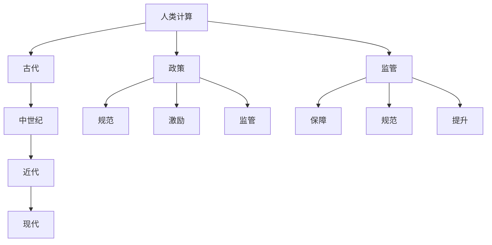

                 

# 政策与监管：引导人类计算的健康发展

## 关键词
政策、监管、人类计算、隐私保护、人工智能、网络安全、法律法规、国际合作

## 摘要
随着计算机技术的飞速发展，人类计算活动日益丰富和复杂。政策与监管作为引导计算活动健康发展的重要手段，对于保障计算活动的公平、安全、合规具有至关重要的作用。本文将从政策与监管的基本概念出发，详细探讨政策与监管在引导人类计算健康发展中的重要性、关系、案例分析以及未来发展趋势。通过这篇文章，我们希望能够为读者提供一个全面、深入的理解，以促进计算领域的可持续发展。

### 第1章：政策与监管概述

#### 1.1 人类计算的定义与发展历程

人类计算是指人类在信息处理和知识发现过程中的思维方式和方法。从古代到现代，人类计算经历了漫长的发展历程。

- **古代**：人类计算主要依靠口头传承和文字记录。古埃及人使用象形文字记录信息，古希腊人则通过几何学进行数学计算。
- **中世纪**：随着图书馆和手抄本的出现，人类计算进入了一个新的阶段。图书馆成为知识的宝库，手抄本成为信息传播的主要途径。
- **近代**：印刷术和电报的发明使得人类计算进一步发展。印刷术使得书籍的复制变得更加便捷，电报则实现了远距离信息传输。
- **现代**：计算机和互联网的出现标志着人类计算进入了一个全新的时代。计算机的运算速度和存储能力大幅提升，互联网则实现了全球信息共享。

#### 1.2 政策在引导人类计算中的作用

政策是政府或组织制定的关于计算活动的基本方针和行动指南。政策在引导人类计算中的作用主要体现在以下几个方面：

- **规范**：政策为计算活动提供了明确的法律边界，确保计算活动在合法范围内进行。
- **激励**：政策通过财政和政策支持，鼓励创新和投资，促进计算活动的发展。
- **监管**：政策为计算活动的监管提供了依据和框架，确保计算活动的合规性。

#### 1.3 监管在引导人类计算中的重要性

监管是指政府或专门机构对计算活动进行监督和管理的过程。监管在引导人类计算中的重要性主要体现在以下几个方面：

- **保障**：监管保障了计算活动的公平和安全，防止了非法和不良计算活动的发生。
- **规范**：监管规范了计算市场的秩序，促进了计算活动的健康发展。
- **提升**：监管提升了计算技术的应用效果，提高了计算活动的效率和质量。

### Mermaid 流�程图

---

### 第2章：政策的基本概念

#### 2.1 政策的定义

政策是政府或组织制定的关于计算活动的基本方针和行动指南。政策通常包括以下几个方面：

- **目标**：政策的目标是解决计算活动中的问题，实现特定的社会目标。
- **原则**：政策的原则是政策制定和执行的基本准则，确保政策的公正性和有效性。
- **措施**：政策的措施是实现政策目标的手段，包括立法、财政支持、行政命令等。

#### 2.2 政策的类型

根据政策的目标和内容，政策可以分为以下几种类型：

- **导向性政策**：导向性政策是指引导计算活动发展方向的政策。这类政策通常包括技术发展方向、产业政策等。
- **激励性政策**：激励性政策是指鼓励计算活动创新和投资的政策。这类政策通常包括财政补贴、税收优惠、奖励等。
- **规范性政策**：规范性政策是指规定计算活动标准和规则的政策。这类政策通常包括法律法规、行业标准等。
- **监管性政策**：监管性政策是指监督计算活动合规性的政策。这类政策通常包括监管机构、监管程序、监管措施等。

#### 2.3 政策制定的基本原则

政策制定的基本原则是确保政策的合法性、公正性、效率和透明度。

- **合法性**：政策应符合法律规定，不得违反现行法律法规。
- **公正性**：政策应公平对待所有参与者，确保政策的公平性和公正性。
- **效率性**：政策应高效实施，确保政策目标的有效实现。
- **透明性**：政策制定和执行过程应公开透明，接受社会监督。

---

### 第3章：监管的基本概念

#### 3.1 监管的定义

监管是指政府或专门机构对计算活动进行监督和管理的过程。监管的主要目的是确保计算活动的公平、安全、合规。

- **监管主体**：监管主体是负责监管活动的政府机构或专门机构。例如，中国的国家互联网信息办公室、美国的联邦贸易委员会等。
- **监管对象**：监管对象是计算活动的主体，包括企业、个人、政府等。
- **监管内容**：监管内容是计算活动的各个方面，包括数据安全、隐私保护、网络安全等。

#### 3.2 监管的类型

根据监管的主体和对象，监管可以分为以下几种类型：

- **政府监管**：政府监管是指由政府机构负责监督计算活动的过程。政府监管通常具有强制性和权威性。
- **行业监管**：行业监管是指由行业协会或组织负责监督计算活动的过程。行业监管通常更注重行业的规范和自律。
- **第三方监管**：第三方监管是指由独立第三方机构负责监督计算活动的过程。第三方监管通常更具有独立性和公正性。

#### 3.3 监管的目标

监管的目标主要包括以下几个方面：

- **保障**：保障计算活动的公平和安全，防止非法和不良计算活动的发生。
- **规范**：规范计算市场的秩序，促进计算活动的健康发展。
- **提升**：提升计算技术的应用效果，提高计算活动的效率和质量。

---

### 第4章：政策与监管的关系

#### 4.1 政策与监管的互动

政策与监管之间存在紧密的互动关系。

- **政策**：政策为监管提供了框架和指导。政策的制定和执行需要监管机构的支持和配合。
- **监管**：监管确保了政策的实施。监管机构通过监督和管理计算活动，确保政策目标的实现。

#### 4.2 政策与监管的协同作用

政策与监管的协同作用主要体现在以下几个方面：

- **引导**：政策通过制定明确的指导方针，引导计算活动的发展方向。
- **规范**：政策通过制定标准和规则，规范计算活动的行为。
- **激励**：政策通过财政和政策支持，激励计算活动的创新和投资。
- **保障**：监管通过监督和管理计算活动，保障计算活动的公平和安全。

#### 4.3 政策与监管的挑战

政策与监管在实际操作中面临以下挑战：

- **政策的灵活性与法规的稳定性**：政策需要灵活适应技术发展，但法规需要保持稳定性。
- **监管的执行力度与合规成本**：监管需要适当力度，同时企业需要承担合理的合规成本。

---

### 第5章：政策与监管的案例分析

#### 5.1 案例一：互联网隐私保护政策

互联网隐私保护政策是近年来各国政府出台的重要政策之一。以欧盟的《通用数据保护条例》（GDPR）为例，其核心内容包括：

- **数据主体权利**：用户有权知道自己的数据被如何使用，有权要求企业删除自己的数据等。
- **数据保护义务**：企业需要采取技术和管理措施，确保用户数据的保密性和安全性。
- **违规处罚**：对违反隐私保护政策的企业，欧盟委员会有权进行高额罚款。

GDPR的实施对互联网企业产生了深远影响，一方面，企业需要投入更多资源来保护用户隐私；另一方面，用户的隐私保护意识得到了提升。

#### 5.2 案例二：人工智能伦理监管

人工智能技术的快速发展引发了社会对伦理问题的关注。各国政府纷纷出台政策，对人工智能的伦理监管提出要求。以美国的《人工智能法案》为例，其核心内容包括：

- **算法透明度**：企业需要公开其人工智能算法的设计和实现过程，接受社会监督。
- **伦理审核**：人工智能项目需要经过伦理审核，确保其应用不会对人类造成伤害。
- **责任界定**：明确人工智能应用中各方的责任，确保事故发生时责任得以追究。

人工智能伦理监管的政策和措施，有助于引导人工智能技术的健康发展，防止其被滥用。

#### 5.3 案例三：云计算服务监管

云计算服务的兴起带来了数据安全和隐私保护的新挑战。各国政府纷纷出台政策，对云计算服务进行监管。以中国的《云计算服务管理条例》为例，其核心内容包括：

- **数据本地化**：云计算服务提供商需要将用户数据存储在本国境内，确保数据的安全性。
- **数据备份**：云计算服务提供商需要定期备份数据，防止数据丢失。
- **用户知情权**：用户有权了解其数据的使用情况和安全保护措施。

云计算服务监管的政策和措施，有助于提升云计算服务的安全性和用户满意度。

---

### 第6章：政策与监管的未来发展趋势

#### 6.1 新兴技术的挑战

随着区块链、人工智能等新兴技术的发展，政策与监管面临新的挑战。

- **区块链**：区块链技术具有去中心化、不可篡改的特点，对传统监管模式提出了挑战。例如，如何保障区块链上数据的隐私和安全。
- **人工智能**：人工智能技术的快速进步，使得算法透明度、伦理审核等问题愈发突出。例如，如何确保人工智能决策的公正性和透明性。

#### 6.2 国际合作的重要性

在全球化背景下，国际合作在政策与监管中具有重要意义。

- **跨国数据流动**：随着跨国数据流动的日益频繁，需要全球统一的政策和监管框架，确保数据的安全和合规。
- **国际标准和法规**：通过国际合作，制定统一的国际标准和法规，促进技术发展和国际贸易。

#### 6.3 持续改进的政策与监管

政策与监管需要不断适应技术变革，持续改进。

- **适应性**：政策与监管应具备适应性，能够及时应对技术发展的新挑战。
- **前瞻性**：政策与监管应具备前瞻性，为未来可能出现的技术变革做好准备。

---

### 第7章：政策与监管的综合影响

#### 7.1 对企业的影响

政策与监管对企业的影响主要体现在以下几个方面：

- **合规成本**：企业需要投入资源，遵守政策和监管要求，包括合规性检查、数据安全措施等。
- **创新能力**：政策与监管为企业提供了发展空间，同时也需要确保创新的可持续性。例如，通过激励性政策，鼓励企业进行技术创新。

#### 7.2 对社会的影响

政策与监管对社会的影响主要体现在以下几个方面：

- **公平性**：政策和监管应保障社会公平，减少数字鸿沟。例如，通过制定普惠政策，确保所有人都能享受到计算技术的便利。
- **安全性**：政策和监管应提升计算活动的安全性，保护用户隐私和数据安全。例如，通过加强网络安全监管，防止网络攻击和数据泄露。

#### 7.3 对技术发展的影响

政策与监管对技术发展的影响主要体现在以下几个方面：

- **创新驱动**：政策和监管鼓励技术发展和应用，推动计算技术的进步。例如，通过激励性政策，鼓励企业进行技术创新。
- **风险管理**：政策和监管降低技术风险，确保计算技术的安全性和稳定性。例如，通过加强数据安全和隐私保护，防止技术滥用。

---

### 第8章：政策与监管的实际应用

#### 8.1 政策制定的实际流程

政策制定的实际流程通常包括以下几个阶段：

- **需求分析**：分析计算活动中的问题和挑战，确定政策的目标和原则。
- **政策设计**：制定具体的政策方案，包括措施和执行步骤。
- **政策评估**：评估政策实施的效果，根据实际情况进行调整和优化。

#### 8.2 监管的实施机制

监管的实施机制通常包括以下几个环节：

- **监管机构**：设立专门的监管机构，负责监管活动的组织和实施。
- **合规检查**：对计算活动进行合规性检查，确保企业遵守政策和法规。
- **违规处理**：对违规行为进行处理，包括警告、罚款、吊销执照等。

#### 8.3 案例分析：政策与监管的实际应用

- **案例分析一**：中国的网络安全法实施案例。网络安全法明确了网络安全的基本要求，建立了网络安全监管体系，对网络安全的提升起到了重要作用。
- **案例分析二**：欧盟的GDPR实施案例。GDPR的实施提升了用户隐私保护水平，对企业的合规要求也较高，但同时也推动了企业对用户隐私保护的重视。

---

### 第9章：政策与监管的国际比较

#### 9.1 各国政策的差异

不同国家的政策在内容、执行力度和效果方面存在显著差异。

- **隐私保护**：不同国家的隐私保护政策有所不同。例如，欧盟的GDPR对隐私保护的要求较高，而美国的隐私保护政策则较为宽松。
- **数据监管**：不同国家的数据监管政策也有所不同。例如，中国的数据本地化政策要求较为严格，而美国的政策则相对宽松。

#### 9.2 各国监管的异同

不同国家的监管在监管主体、监管内容和监管手段方面存在异同。

- **政府角色**：不同国家的政府在国际监管中的角色和职责不同。例如，欧盟的监管主体主要是政府机构，而美国的监管主体则包括政府机构和行业协会。
- **市场机制**：不同国家的市场机制在监管中的作用也不同。例如，中国的监管侧重于政府主导，而美国的监管则更注重市场机制。

#### 9.3 国际合作与协调

国际合作在政策与监管中具有重要意义。

- **国际组织**：联合国、欧盟等国际组织在政策与监管中发挥着重要作用，通过制定国际标准和法规，推动全球范围内的政策与监管协调。
- **多边协议**：多边协议如《数字千禧年发展目标》等，有助于推动各国在政策与监管方面的合作与协调。

---

### 第10章：政策与监管的未来展望

#### 10.1 技术发展的挑战

随着区块链、人工智能等新兴技术的发展，政策与监管面临新的挑战。

- **区块链**：区块链技术的去中心化特性对传统监管模式提出了挑战，如何保障区块链上数据的隐私和安全成为重要课题。
- **人工智能**：人工智能技术的快速进步，如何确保算法的透明度和公正性，以及如何应对潜在的伦理问题，成为政策与监管的重要议题。

#### 10.2 政策与监管的创新

政策与监管需要不断创新，以适应技术发展的新需求。

- **数字经济政策**：推动数字经济发展的政策创新，如数据隐私保护政策、数字经济安全政策等。
- **监管科技**：利用科技手段提升监管效率和透明度，如大数据分析、区块链技术等。

#### 10.3 持续改进的政策与监管

政策与监管需要持续改进，以应对技术变革和新的挑战。

- **适应性**：政策与监管应具备适应性，能够及时应对技术发展的新挑战。
- **前瞻性**：政策与监管应具备前瞻性，为未来可能出现的技术变革做好准备。

---

### 附录

#### 附录A：政策与监管相关的法律法规

- **中国**：《中华人民共和国网络安全法》、《中华人民共和国数据安全法》等。
- **美国**：《加州消费者隐私法》、《联邦贸易委员会法》等。
- **欧盟**：《欧盟通用数据保护条例》（GDPR）等。

#### 附录B：政策与监管相关的国际组织

- **联合国**：国际电信联盟（ITU）。
- **欧盟**：欧洲数据保护委员会（EDPB）。
- **美国**：联邦贸易委员会（FTC）。

---

### 第11章：政策与监管的工具和方法

#### 11.1 政策评估方法

政策评估是确保政策有效性的重要手段。常见的政策评估方法包括：

- **成本-效益分析**：评估政策实施的经济效益，包括直接和间接成本以及收益。
- **社会影响评估**：评估政策对社会各方面的影响，包括经济、环境、社会等方面。
- **合规性评估**：评估企业对政策的合规程度，确保政策目标的实现。

#### 11.2 监管工具

监管工具是政策与监管实施的关键。常见的监管工具包括：

- **审计工具**：用于检查计算活动的合规性，如财务审计、安全审计等。
- **监控工具**：用于实时监控计算活动，如网络监控、数据监控等。
- **合规管理软件**：用于管理合规性要求和记录，如合规性报告、合规性审计等。

#### 11.3 政策与监管的最佳实践

最佳实践是政策与监管实施的成功经验。常见的最佳实践包括：

- **经验总结**：总结成功政策与监管的实施经验，如成功的案例、最佳实践等。
- **案例分析**：分析具体政策与监管案例，讨论其实际效果，如GDPR的实施效果等。

---

### 第12章：政策与监管的实际案例分析

#### 12.1 案例一：中国网络安全法实施案例

中国网络安全法的实施是中国网络安全政策与监管的重要里程碑。网络安全法明确了网络安全的基本要求和责任，包括：

- **数据本地化**：网络运营者在中国境内运营的云计算等数据中心，其存储的个人信息和重要数据应当在中国境内存储。
- **网络安全审查**：关键信息基础设施的运营者应当进行网络安全审查，确保网络安全。
- **用户隐私保护**：网络运营者应当依法保护用户个人信息，采取有效措施防止个人信息泄露和滥用。

网络安全法的实施提升了中国的网络安全水平，但也对企业提出了更高的合规要求。

#### 12.2 案例二：欧盟GDPR实施案例

欧盟的GDPR是国际上最具影响力的隐私保护法规之一。GDPR的核心要求包括：

- **用户数据权利**：用户有权访问、修改、删除自己的个人信息，企业需要提供透明的个人信息处理流程。
- **数据泄露通知**：企业需要在数据泄露事件发生后72小时内通知监管机构和受影响的用户。
- **数据保护官（DPO）**：大型企业需要任命数据保护官，负责监督数据保护合规性。

GDPR的实施显著提升了欧盟的隐私保护水平，但同时也给企业带来了巨大的合规成本和技术挑战。

#### 12.3 案例三：美国联邦贸易委员会（FTC）监管案例

美国联邦贸易委员会（FTC）是美国的消费者保护机构，负责监管与消费者权益相关的问题，包括网络安全和数据隐私。FTC的监管内容包括：

- **隐私政策**：FTC要求企业公开其隐私政策，明确用户数据的使用和共享方式。
- **数据安全**：FTC要求企业采取合理措施保护用户数据，防止数据泄露。
- **违规处罚**：FTC对违反隐私保护法规的企业进行处罚，包括罚款和命令企业采取纠正措施。

FTC的监管活动保护了消费者的隐私权益，促进了企业的合规性提升。

---

### 第13章：政策与监管的未来展望

#### 13.1 技术发展的挑战

随着人工智能、区块链等技术的不断发展，政策与监管面临新的挑战。这些挑战主要包括：

- **算法透明度**：人工智能算法的复杂性和黑箱性质使得算法透明度成为监管难题。
- **数据隐私**：随着大数据和云计算的普及，数据隐私保护面临更大的挑战。
- **网络安全**：网络攻击手段日益多样，网络安全监管需要不断提升。

#### 13.2 政策与监管的创新

为了应对技术发展的挑战，政策与监管需要不断创新。以下是一些可能的创新方向：

- **监管沙盒**：建立监管沙盒，允许企业在受控环境下测试新的技术和业务模式。
- **智能监管**：利用人工智能和大数据技术，提高监管的智能化和效率。
- **国际合作**：加强国际合作，制定全球统一的政策和监管框架。

#### 13.3 持续改进的政策与监管

政策与监管需要持续改进，以适应技术变革和社会需求。以下是一些持续改进的措施：

- **适应性**：政策与监管应具备适应性，能够及时调整以应对新的技术和社会环境。
- **前瞻性**：政策与监管应具备前瞻性，预测未来可能出现的技术和社会变革，并提前制定相应的政策和监管措施。

---

### 第14章：政策与监管的国际合作

#### 14.1 国际合作的重要性

国际合作在政策与监管中具有重要作用。随着全球化和数字化的深入发展，跨国数据流动和跨境业务日益增多，国际合作有助于：

- **协调政策与监管**：通过国际合作，协调不同国家和地区的政策与监管，避免政策冲突和监管漏洞。
- **共享经验与最佳实践**：通过国际合作，各国可以分享政策与监管的经验和最佳实践，提升全球政策与监管水平。
- **推动技术标准统一**：通过国际合作，推动全球技术标准的统一，促进技术的全球推广和应用。

#### 14.2 国际合作机制

国际合作机制主要包括以下几个方面：

- **国际组织**：如联合国、欧盟、国际电信联盟（ITU）等，负责制定全球性的政策与监管标准和指南。
- **双边或多边协议**：如《跨大西洋数据传输协议》（T移动欧洲协议）、《数字千禧年发展目标》等，旨在促进跨国数据流动和跨境业务的健康发展。
- **国际合作项目**：如“全球网络安全合作计划”、“全球数据治理倡议”等，旨在通过国际合作，提升全球网络安全和数据治理水平。

#### 14.3 国际合作案例分析

国际合作在政策与监管中的应用案例丰富。以下是一些案例分析：

- **欧盟-美国隐私盾牌协议**：该协议旨在促进欧盟与美国的跨国数据传输，同时保障数据隐私。协议规定了数据保护的基本要求和执行机制。
- **亚太经合组织（APEC）隐私框架**：该框架旨在推动APEC成员国在数据隐私保护方面的合作，促进跨境数据流动和业务发展。
- **联合国数字合作高级别小组**：该小组旨在推动全球数字合作，包括政策与监管、技术标准、数字经济发展等方面。

---

### 第15章：政策与监管的综合影响

#### 15.1 对企业的影响

政策与监管对企业的影响是多方面的，包括：

- **合规成本**：企业需要投入资源，遵守政策和监管要求，包括合规性检查、数据安全措施等，这可能会增加企业的运营成本。
- **创新驱动**：政策与监管鼓励企业进行技术创新，通过激励性政策，支持企业在合规的基础上探索新的技术和商业模式。
- **竞争环境**：政策与监管有助于维护公平竞争的市场环境，防止垄断和不公平竞争行为。

#### 15.2 对社会的影响

政策与监管对社会的影响主要体现在以下几个方面：

- **公平性**：政策与监管应保障社会公平，减少数字鸿沟，确保所有人都能享受到计算技术的便利。
- **安全性**：政策与监管提升计算活动的安全性，保护用户隐私和数据安全，减少网络攻击和数据泄露的风险。
- **信任建设**：政策与监管有助于增强社会对计算技术的信任，促进计算技术的普及和应用。

#### 15.3 对技术发展的影响

政策与监管对技术发展的影响主要体现在以下几个方面：

- **创新驱动**：政策与监管鼓励技术发展和应用，通过激励性政策和监管框架，支持企业进行技术创新。
- **风险管控**：政策与监管降低技术风险，确保计算技术的安全性和稳定性，防止技术滥用和负面效应。
- **标准制定**：政策与监管有助于制定和推广技术标准，促进技术统一和互操作性。

---

### 第16章：政策与监管的实际应用

#### 16.1 政策制定的实际流程

政策制定的实际流程通常包括以下几个步骤：

- **需求分析**：分析计算活动中的问题和挑战，确定政策的目标和原则。
- **政策设计**：制定具体的政策方案，包括措施和执行步骤。
- **政策评估**：评估政策实施的效果，根据实际情况进行调整和优化。

#### 16.2 监管的实施机制

监管的实施机制通常包括以下几个环节：

- **监管机构**：设立专门的监管机构，负责监管活动的组织和实施。
- **合规检查**：对计算活动进行合规性检查，确保企业遵守政策和法规。
- **违规处理**：对违规行为进行处理，包括警告、罚款、吊销执照等。

#### 16.3 案例分析：政策与监管的实际应用

- **案例分析一**：中国的网络安全法实施案例。网络安全法明确了网络安全的基本要求和责任，建立了网络安全监管体系，对网络安全的提升起到了重要作用。
- **案例分析二**：欧盟的GDPR实施案例。GDPR的实施提升了用户隐私保护水平，对企业的合规要求也较高，但同时也推动了企业对用户隐私保护的重视。

---

### 第17章：政策与监管的国际比较

#### 17.1 各国政策的差异

不同国家的政策在内容、执行力度和效果方面存在显著差异。

- **隐私保护**：不同国家的隐私保护政策有所不同。例如，欧盟的GDPR对隐私保护的要求较高，而美国的隐私保护政策则较为宽松。
- **数据监管**：不同国家的数据监管政策也有所不同。例如，中国的数据本地化政策要求较为严格，而美国的政策则相对宽松。

#### 17.2 各国监管的异同

不同国家的监管在监管主体、监管内容和监管手段方面存在异同。

- **政府角色**：不同国家的政府在国际监管中的角色和职责不同。例如，欧盟的监管主体主要是政府机构，而美国的监管主体则包括政府机构和行业协会。
- **市场机制**：不同国家的市场机制在监管中的作用也不同。例如，中国的监管侧重于政府主导，而美国的监管则更注重市场机制。

#### 17.3 国际合作与协调

国际合作在政策与监管中具有重要意义。

- **国际组织**：联合国、欧盟等国际组织在政策与监管中发挥着重要作用，通过制定国际标准和法规，推动全球范围内的政策与监管协调。
- **多边协议**：多边协议如《数字千禧年发展目标》等，有助于推动各国在政策与监管方面的合作与协调。

---

### 第18章：政策与监管的未来发展趋势

#### 18.1 新兴技术的挑战

随着区块链、人工智能等新兴技术的发展，政策与监管面临新的挑战。

- **区块链**：区块链技术的去中心化特性对传统监管模式提出了挑战，如何保障区块链上数据的隐私和安全成为重要课题。
- **人工智能**：人工智能技术的快速进步，如何确保算法的透明度和公正性，以及如何应对潜在的伦理问题，成为政策与监管的重要议题。

#### 18.2 政策与监管的创新

为了应对技术发展的挑战，政策与监管需要不断创新。

- **监管沙盒**：建立监管沙盒，允许企业在受控环境下测试新的技术和业务模式。
- **智能监管**：利用人工智能和大数据技术，提高监管的智能化和效率。
- **国际合作**：加强国际合作，制定全球统一的政策和监管框架。

#### 18.3 持续改进的政策与监管

政策与监管需要持续改进，以适应技术变革和社会需求。

- **适应性**：政策与监管应具备适应性，能够及时应对技术发展的新挑战。
- **前瞻性**：政策与监管应具备前瞻性，预测未来可能出现的技术和社会变革，并提前制定相应的政策和监管措施。

---

### 附录

#### 附录A：政策与监管相关的法律法规

- **中国**：《中华人民共和国网络安全法》、《中华人民共和国数据安全法》等。
- **美国**：《加州消费者隐私法》、《联邦贸易委员会法》等。
- **欧盟**：《欧盟通用数据保护条例》（GDPR）等。

#### 附录B：政策与监管相关的国际组织

- **联合国**：国际电信联盟（ITU）。
- **欧盟**：欧洲数据保护委员会（EDPB）。
- **美国**：联邦贸易委员会（FTC）。

---

### 第19章：政策与监管的挑战与应对策略

#### 19.1 技术发展带来的挑战

随着人工智能、区块链等新兴技术的快速发展，政策与监管面临诸多挑战。

- **算法透明度**：人工智能算法的复杂性和黑箱性质使得算法透明度成为监管难题。监管机构需要确保算法的透明度和可解释性，以便对算法进行有效监管。
- **数据隐私**：大数据和云计算的普及使得数据隐私保护面临更大的挑战。政策与监管需要确保用户数据的隐私和安全，防止数据泄露和滥用。
- **网络安全**：随着网络攻击手段的日益多样，网络安全监管需要不断提升。政策与监管需要制定有效的网络安全策略，提高网络安全的防护能力。

#### 19.2 法律法规的滞后性

法律法规的制定和实施往往滞后于技术的发展。这导致政策与监管在应对新技术时可能存在不足。

- **应对策略**：政策与监管需要具备前瞻性，提前预见技术发展可能带来的挑战，并制定相应的政策和监管措施。同时，监管机构需要与科技企业密切合作，了解最新的技术发展和应用情况，以便及时调整政策和监管策略。

#### 19.3 国际合作与协调的挑战

在全球化和数字化的背景下，国际合作在政策与监管中具有重要意义。然而，国际合作也面临诸多挑战。

- **法律差异**：不同国家和地区的法律法规存在差异，这可能导致政策与监管的冲突和协调困难。
- **数据流动**：跨国数据流动的需求日益增长，如何保障数据流动的安全和合规成为国际合作的重要议题。
- **应对策略**：政策与监管需要通过国际合作，推动全球范围内的政策协调和法律统一。国际组织如联合国、欧盟等可以发挥重要作用，制定全球性的政策与监管标准和指南。

#### 19.4 企业合规成本与创新能力

政策与监管的实施对企业合规成本提出了新的挑战。同时，过高的合规成本可能会抑制企业的创新能力。

- **应对策略**：政策与监管需要在保障合规性和促进创新之间找到平衡。一方面，政策与监管应确保企业的合规性，防止违规行为的发生。另一方面，政策与监管应提供一定的激励措施，鼓励企业进行技术创新和投资。

---

### 第20章：政策与监管的成功案例分析

#### 20.1 案例一：美国《加州消费者隐私法》（CCPA）

美国《加州消费者隐私法》（CCPA）是首个在全美范围内实施的消费者隐私保护法规，其核心内容包括：

- **消费者权利**：消费者有权访问、删除、纠正自己的个人信息，并有权拒绝企业对其信息的商业用途。
- **企业义务**：企业需要明确其收集、使用和共享消费者个人信息的方式，并采取措施保障消费者个人信息的安全。
- **违规处罚**：对违反CCPA的企业，加州总检察长有权进行罚款，最高可达每违规事项7500美元。

CCPA的实施提高了企业的合规成本，但也增强了消费者的隐私保护意识，促进了企业对用户隐私保护的重视。

#### 20.2 案例二：欧盟《通用数据保护条例》（GDPR）

欧盟《通用数据保护条例》（GDPR）是世界上最严格的数据保护法规之一，其核心内容包括：

- **用户数据权利**：用户有权访问、修改、删除自己的个人信息，企业需要提供透明的个人信息处理流程。
- **数据泄露通知**：企业需要在数据泄露事件发生后72小时内通知监管机构和受影响的用户。
- **数据保护官（DPO）**：大型企业需要任命数据保护官，负责监督数据保护合规性。

GDPR的实施显著提升了欧盟的隐私保护水平，但也给企业带来了巨大的合规成本和技术挑战。

#### 20.3 案例三：中国《网络安全法》

中国《网络安全法》是首部全面规范网络安全管理的国家法律，其核心内容包括：

- **数据本地化**：网络运营者在中国境内运营的云计算等数据中心，其存储的个人信息和重要数据应当在中国境内存储。
- **网络安全审查**：关键信息基础设施的运营者应当进行网络安全审查，确保网络安全。
- **用户隐私保护**：网络运营者应当依法保护用户个人信息，采取有效措施防止个人信息泄露和滥用。

《网络安全法》的实施提升了中国的网络安全水平，但也对企业提出了更高的合规要求。

---

### 第21章：政策与监管的公众参与与透明度

#### 21.1 公众参与的重要性

政策与监管的公众参与是保障其合法性和公正性的重要环节。公众参与有助于：

- **政策制定的民主化**：通过公众参与，政策制定过程更加透明和民主，能够更好地反映社会各界的利益诉求。
- **监管的公正性**：公众参与能够监督监管机构的公正性和透明度，防止权力滥用和腐败。

#### 21.2 透明度的重要性

政策与监管的透明度是确保其有效性和公信力的关键。透明度包括：

- **政策制定的公开**：政策制定的背景、目标、措施和预期效果等应当公开透明，接受社会监督。
- **监管过程的公开**：监管机构的监管活动，包括检查、处罚、整改等过程应当公开透明，确保监管的公正性和效率。

#### 21.3 提升公众参与和透明度的策略

为了提升公众参与和透明度，可以采取以下策略：

- **建立公众参与机制**：通过官方网站、公众听证会、问卷调查等方式，鼓励公众参与政策与监管的讨论和决策过程。
- **增强信息公开**：建立信息公开制度，定期发布政策与监管相关的报告和统计数据，提高监管的透明度。
- **加强公众监督**：鼓励媒体和公众对政策与监管进行监督，通过舆论压力推动政策与监管的改进。

---

### 第22章：政策与监管的未来趋势

#### 22.1 技术发展的影响

未来，随着人工智能、区块链等技术的发展，政策与监管将面临新的挑战和机遇。

- **人工智能**：人工智能技术的快速发展将影响政策与监管的各个方面，包括算法透明度、伦理审核、隐私保护等。
- **区块链**：区块链技术的去中心化特性将对数据安全、隐私保护、跨境交易等方面产生深远影响，政策与监管需要适应这些变化。

#### 22.2 政策与监管的创新方向

未来，政策与监管的创新方向主要包括：

- **监管沙盒**：建立监管沙盒，允许企业在受控环境下测试新的技术和业务模式，降低创新风险。
- **智能监管**：利用人工智能和大数据技术，提高监管的智能化和效率，提升监管能力。
- **全球合作**：加强国际合作，制定全球统一的政策与监管框架，应对跨国数据流动和跨境业务的挑战。

#### 22.3 持续改进的政策与监管

未来，政策与监管需要持续改进，以适应技术变革和社会需求。

- **适应性**：政策与监管应具备适应性，能够及时应对技术发展的新挑战。
- **前瞻性**：政策与监管应具备前瞻性，预测未来可能出现的技术和社会变革，并提前制定相应的政策和监管措施。

---

### 第23章：政策与监管的可持续发展

#### 23.1 可持续发展的意义

政策与监管的可持续发展是指政策与监管能够长期适应技术变革和社会需求，保障计算活动的健康、稳定、可持续发展。

- **健康**：政策与监管应保障计算活动的公平、安全、合规，防止不良计算活动的发生。
- **稳定**：政策与监管应具备稳定性，确保法规的连续性和可预测性，为企业提供明确的合规预期。
- **发展**：政策与监管应促进计算技术的创新和应用，推动计算活动的发展，为社会创造更多的价值。

#### 23.2 可持续发展的策略

为了实现政策与监管的可持续发展，可以采取以下策略：

- **加强国际合作**：通过国际合作，协调全球范围内的政策与监管，推动计算活动的全球化发展。
- **推动技术创新**：支持计算技术的发展和应用，鼓励企业进行技术创新，提升计算技术的竞争力和影响力。
- **公众参与与透明度**：加强公众参与和透明度，提高政策与监管的公信力和执行力。

#### 23.3 可持续发展的挑战

政策与监管的可持续发展面临诸多挑战：

- **技术变革的快速性**：技术变革速度加快，政策与监管需要及时适应，确保法规的连续性和有效性。
- **全球合作的复杂性**：全球合作涉及不同国家和地区的利益，政策协调和法律统一面临较大挑战。
- **社会需求的多元化**：社会需求日益多元化，政策与监管需要平衡不同利益诉求，确保计算活动的公平、安全和可持续发展。

---

### 第24章：政策与监管的伦理与社会责任

#### 24.1 伦理的重要性

政策与监管的伦理维度至关重要，它确保计算活动在道德和法律框架内进行。

- **隐私伦理**：隐私权是基本人权之一，政策与监管应尊重和保护个人隐私。
- **公平伦理**：政策与监管应促进公平，避免数字鸿沟和歧视。
- **透明伦理**：计算活动应透明，确保公众能够理解其运作方式和潜在影响。

#### 24.2 社会责任

政策与监管需要承担社会责任，确保计算活动对社会有益。

- **环境责任**：计算活动应减少对环境的影响，推动绿色计算。
- **社会影响**：政策与监管应评估计算活动对社会的影响，促进社会福祉。
- **公共利益**：政策与监管应以公共利益为导向，确保计算技术为社会带来积极影响。

#### 24.3 伦理与社会责任的实践

政策与监管的伦理和社会责任可以通过以下实践实现：

- **伦理审查**：设立独立的伦理审查委员会，对计算项目进行伦理评估。
- **社会责任报告**：企业应定期发布社会责任报告，披露计算活动对社会的影响。
- **公众参与**：鼓励公众参与政策与监管的讨论和决策过程，确保政策与监管的社会可接受性。

---

### 第25章：政策与监管的实践总结与展望

#### 25.1 实践总结

政策与监管在引导人类计算健康发展方面发挥了重要作用。

- **规范计算活动**：政策与监管明确了计算活动的法律边界，规范了计算市场的秩序。
- **保护个人隐私**：政策与监管提升了个人隐私保护水平，降低了数据泄露的风险。
- **促进技术创新**：政策与监管通过激励性措施，鼓励计算技术的创新和应用。

#### 25.2 展望未来

未来，政策与监管需要应对新兴技术的挑战，持续改进。

- **适应技术变革**：政策与监管应具备前瞻性和适应性，及时调整以适应技术发展。
- **加强国际合作**：通过国际合作，协调全球范围内的政策与监管，应对跨国数据流动和跨境业务的挑战。
- **提升公众参与与透明度**：加强公众参与和透明度，提高政策与监管的公信力和执行力。

#### 25.3 结论

政策与监管是引导人类计算健康发展的重要手段。通过规范计算活动、保护个人隐私、促进技术创新，政策与监管为计算活动提供了良好的发展环境。未来，政策与监管需要不断适应技术变革，加强国际合作，提升公众参与与透明度，以实现计算活动的可持续健康发展。

---

### 作者

**作者：AI天才研究院/AI Genius Institute & 禅与计算机程序设计艺术 /Zen And The Art of Computer Programming**

