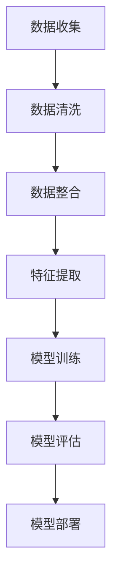
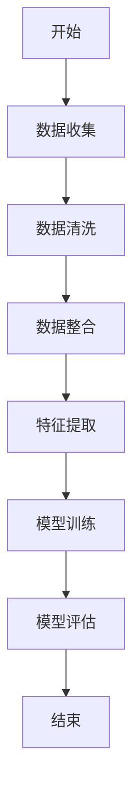

                 

# 敏感话题搜索：AI的平衡之道

## 关键词：人工智能、敏感话题、搜索技术、平衡之道、伦理道德、法律法规

> 在这个数字化时代，人工智能已经成为社会进步的重要推动力量。然而，随着AI技术的广泛应用，涉及敏感话题的搜索问题也日益凸显。如何在确保隐私保护和信息透明的同时，实现敏感话题的高效、精准搜索，成为AI领域面临的重大挑战。本文将深入探讨AI在敏感话题搜索中的应用，分析其技术基础、实现策略以及面临的伦理和法律问题，以期为AI的平衡发展提供参考。

## 目录

### 第一部分：引言与概述

#### 1.1 AI与敏感话题的背景与挑战

#### 1.2 本书的目的与结构

### 第二部分：敏感话题搜索的基础知识

#### 2.1 敏感话题定义与分类

#### 2.2 AI搜索技术概述

#### 2.3 数据预处理与清洗

### 第三部分：AI平衡之道的实现

#### 3.1 核心算法与模型

#### 3.2 敏感内容检测与过滤

#### 3.3 模型调优与性能优化

### 第四部分：应用场景与实践

#### 4.1 搜索引擎优化

#### 4.2 社交媒体内容管理

#### 4.3 垃圾邮件与网络诈骗检测

### 第五部分：法律法规与伦理道德

#### 5.1 相关法律法规概述

#### 5.2 伦理道德原则与规范

#### 5.3 平衡之道在实践中的挑战与应对

### 第六部分：未来发展趋势与展望

#### 6.1 AI与敏感话题搜索的未来趋势

#### 6.2 技术创新与产业发展

#### 6.3 社会影响与政策建议

### 第七部分：附录

#### 7.1 开发工具与资源

#### 7.2 实际代码案例与解读

#### 7.3 数学模型与公式示例

#### 7.4 Mermaid流程图示例

#### 7.5 伪代码示例

## 第一部分：引言与概述

### 1.1 AI与敏感话题的背景与挑战

在人工智能（AI）迅速发展的背景下，人们对于信息获取的需求日益增长。然而，敏感话题的搜索成为了一个复杂且具有挑战性的问题。敏感话题通常涉及个人隐私、社会安全、公共道德等方面，如医疗信息、政治观点、种族歧视、性别歧视等。这些话题的信息需求既强烈又充满争议，如何实现有效且符合伦理道德的搜索成为了一个亟待解决的难题。

敏感话题搜索的挑战主要来源于以下几个方面：

1. **隐私保护**：敏感话题往往涉及个人隐私，如何在保护用户隐私的前提下进行搜索是一个关键问题。
2. **信息准确性与完整性**：敏感话题的信息来源广泛，如何确保搜索结果准确、全面，避免偏见和误导，是AI面临的挑战。
3. **法律法规与伦理道德**：涉及敏感话题的搜索必须遵循相关法律法规和伦理道德规范，确保搜索行为合法合规。

### 1.2 本书的目的与结构

本书旨在探讨AI在敏感话题搜索中的应用，通过分析敏感话题的定义与分类、AI搜索技术基础、数据预处理与清洗、核心算法与模型、敏感内容检测与过滤、模型调优与性能优化等方面的内容，全面解析敏感话题搜索的难点与解决方案。

本书的结构安排如下：

- **第一部分：引言与概述**：介绍AI与敏感话题的背景与挑战，明确本书的目的与结构。
- **第二部分：敏感话题搜索的基础知识**：详细阐述敏感话题的定义与分类、AI搜索技术概述以及数据预处理与清洗。
- **第三部分：AI平衡之道的实现**：探讨敏感话题搜索的核心算法与模型、敏感内容检测与过滤、模型调优与性能优化。
- **第四部分：应用场景与实践**：分析敏感话题搜索在不同领域的应用场景与实践。
- **第五部分：法律法规与伦理道德**：讨论敏感话题搜索面临的法律法规与伦理道德问题，并提出应对策略。
- **第六部分：未来发展趋势与展望**：展望AI与敏感话题搜索的未来发展趋势，探讨技术创新与产业发展。
- **第七部分：附录**：提供开发工具与资源、实际代码案例与解读、数学模型与公式示例、Mermaid流程图示例和伪代码示例。

通过本书的深入分析，我们期望为AI在敏感话题搜索领域的应用提供有益的参考，推动AI技术的平衡发展，实现技术、伦理和法律的高度融合。

### 2. AI的平衡之道

#### 2.1 AI的发展与应用

人工智能作为一门前沿技术，近年来得到了快速发展。从早期的规则推理和知识表示，到现代的机器学习和深度学习，AI技术在各个领域取得了显著的应用成果。在图像识别、自然语言处理、智能推荐、自动驾驶、医疗诊断等方面，AI技术已经展现出强大的能力。

然而，随着AI技术的广泛应用，也引发了一系列问题。例如，在图像识别领域，AI系统有时会误判种族或性别，导致歧视现象。在医疗领域，AI诊断系统可能因为数据偏差而产生误诊。在社交媒体领域，AI推荐算法可能导致用户陷入“信息茧房”，降低社会多样性。

因此，实现AI的平衡发展，成为了一个亟待解决的问题。平衡之道旨在通过以下三个方面实现：

1. **技术优化**：不断改进AI算法，提高其准确性和鲁棒性，减少误判和偏见。
2. **法律法规**：建立健全的法律法规，规范AI技术的应用，保护用户隐私，确保公平正义。
3. **伦理道德**：推动AI伦理道德研究，培养AI伦理意识，确保AI技术的应用符合社会伦理标准。

#### 2.2 敏感话题搜索的挑战

敏感话题搜索是AI应用中的一个重要场景，其挑战主要体现在以下几个方面：

1. **隐私保护**：敏感话题涉及个人隐私，如何在保护用户隐私的前提下进行搜索是一个关键问题。传统的隐私保护方法如数据匿名化、差分隐私等，可能无法完全解决敏感话题搜索中的隐私泄露问题。
2. **信息准确性**：敏感话题的信息来源广泛，且真实性与可靠性难以保证。如何在海量信息中筛选出准确、可靠的信息，是一个巨大的挑战。
3. **社会影响**：敏感话题的搜索结果可能对社会产生重大影响，如种族歧视、性别歧视等。如何确保搜索结果符合社会伦理标准，避免引发社会问题，是AI技术必须面对的挑战。
4. **法律法规与伦理道德**：涉及敏感话题的搜索必须遵循相关法律法规和伦理道德规范，确保搜索行为合法合规。然而，现有法律法规和伦理道德规范可能不足以应对AI技术的快速发展，需要不断更新和完善。

#### 2.3 AI平衡之道的重要性

AI平衡之道在敏感话题搜索中的重要性体现在以下几个方面：

1. **技术优化**：通过不断改进AI算法，提高其准确性和鲁棒性，可以减少敏感话题搜索中的误判和偏见，确保搜索结果的准确性和公正性。
2. **法律法规**：建立健全的法律法规，规范AI技术的应用，保护用户隐私，确保公平正义，有助于解决敏感话题搜索中的隐私保护和社会影响问题。
3. **伦理道德**：推动AI伦理道德研究，培养AI伦理意识，确保AI技术的应用符合社会伦理标准，有助于避免敏感话题搜索引发的社会问题。

总之，AI平衡之道是确保敏感话题搜索健康发展的关键。通过技术优化、法律法规和伦理道德的协同作用，我们可以实现敏感话题搜索的平衡发展，为人类社会的进步提供有力支持。

### 第二部分：敏感话题搜索的基础知识

#### 2.1 敏感话题定义与分类

敏感话题是指那些涉及个人隐私、社会安全、公共道德等方面的信息，其内容可能对特定群体或社会整体产生负面影响。敏感话题的定义与分类有助于我们更好地理解和处理这些信息。

**敏感话题的定义**：

敏感话题通常包括以下几类：

1. **个人隐私**：涉及个人身份、健康状况、财务状况等私人信息。
2. **社会安全**：涉及恐怖主义、犯罪活动、国家安全等威胁社会安全的信息。
3. **公共道德**：涉及种族歧视、性别歧视、宗教歧视等违背社会伦理道德的信息。
4. **政治敏感**：涉及政治观点、政策讨论、选举等政治敏感信息。

**敏感话题的分类方法**：

敏感话题可以根据其内容和影响范围进行分类。常见的分类方法包括：

1. **基于内容的分类**：根据敏感话题的内容特征进行分类，如个人隐私、社会安全、公共道德等。
2. **基于影响的分类**：根据敏感话题对社会和个人产生的影响程度进行分类，如轻微敏感、中等敏感、高度敏感等。
3. **基于领域的的分类**：根据敏感话题涉及的领域进行分类，如医疗、金融、政治、教育等。

**常见敏感话题举例**：

以下是一些常见的敏感话题举例：

1. **医疗信息**：包括个人健康状况、疾病诊断、治疗方案等。
2. **政治观点**：包括政治选举、政治立场、政策讨论等。
3. **种族歧视**：包括种族歧视言论、种族歧视事件等。
4. **性别歧视**：包括性别歧视言论、性别歧视事件等。
5. **财务信息**：包括个人财务状况、财务诈骗信息等。

#### 2.2 AI搜索技术概述

AI搜索技术是利用人工智能技术对互联网上的信息进行检索和分析的方法。与传统的搜索引擎相比，AI搜索技术能够更加智能化、个性化地满足用户的需求。

**搜索引擎的基本原理**：

搜索引擎的基本原理主要包括以下几步：

1. **索引**：搜索引擎通过爬虫技术收集互联网上的信息，并建立索引库，以便快速检索。
2. **查询**：用户输入查询关键词，搜索引擎根据索引库进行匹配，返回相关结果。
3. **排序**：搜索引擎根据相关性、流行度等因素对检索结果进行排序，以提供最佳搜索体验。

**AI搜索的优势与局限性**：

AI搜索技术具有以下优势：

1. **个性化搜索**：AI技术可以根据用户的兴趣和行为习惯，提供个性化的搜索结果。
2. **智能推荐**：AI技术可以根据用户的查询历史和偏好，推荐相关的内容和商品。
3. **语义理解**：AI技术能够理解用户的查询意图，提供更加准确的结果。

然而，AI搜索技术也存在一些局限性：

1. **数据隐私**：AI搜索需要大量用户数据，可能引发隐私泄露问题。
2. **误判和偏见**：AI模型可能因为训练数据的偏差而产生误判和偏见，导致搜索结果不公正。
3. **算法透明度**：AI搜索算法通常较为复杂，其决策过程缺乏透明度，难以解释。

**常见的AI搜索算法**：

常见的AI搜索算法包括：

1. **自然语言处理（NLP）**：NLP技术可以处理和理解自然语言，实现语义检索和文本分析。
2. **深度学习**：深度学习算法可以自动提取特征，实现图像识别和语音识别等功能。
3. **知识图谱**：知识图谱技术可以将语义信息进行结构化表示，实现知识推理和搜索。

#### 2.3 数据预处理与清洗

数据预处理与清洗是AI搜索技术的重要环节，其目的是提高数据质量，为后续的搜索和分析提供基础。

**数据收集与存储**：

数据收集是AI搜索的基础，可以通过以下几种方式：

1. **爬虫技术**：利用爬虫程序收集互联网上的公开信息。
2. **API接口**：通过API接口获取特定领域的数据。
3. **用户生成内容**：收集用户生成的内容，如社交媒体帖子、评论等。

数据收集后，需要存储在合适的数据仓库或数据库中，以便后续处理和分析。

**数据预处理步骤**：

数据预处理主要包括以下步骤：

1. **数据清洗**：去除重复数据、缺失值、噪声数据等，提高数据质量。
2. **数据整合**：将不同来源的数据进行整合，建立统一的数据视图。
3. **特征提取**：从原始数据中提取关键特征，为模型训练提供输入。
4. **数据标准化**：对数据进行归一化或标准化处理，使其适合模型训练。

**数据清洗策略**：

数据清洗策略包括：

1. **缺失值处理**：根据实际情况选择填充、删除或保留缺失值。
2. **异常值处理**：检测并处理数据中的异常值，如异常高值或异常低值。
3. **数据去重**：去除重复数据，确保数据唯一性。
4. **数据转换**：将不同类型的数据转换为统一格式，如将文本转换为数值。

通过数据预处理与清洗，我们可以提高数据质量，为AI搜索技术的应用提供可靠的数据基础。

### 第三部分：AI平衡之道的实现

#### 3.1 核心算法与模型

在敏感话题搜索中，核心算法与模型的选择至关重要。以下将介绍几种常用的核心算法与模型，并分析其适用场景。

**模型选择与设计**

在敏感话题搜索中，常用的模型选择包括：

1. **支持向量机（SVM）**：SVM是一种经典的分类算法，适用于处理高维数据。在敏感话题搜索中，SVM可以用于分类用户查询，判断其是否涉及敏感话题。

2. **深度神经网络（DNN）**：DNN是一种强大的特征提取和分类工具，通过多层神经网络自动提取数据特征。在敏感话题搜索中，DNN可以用于训练查询嵌入模型，将用户查询转换为固定长度的向量表示。

3. **卷积神经网络（CNN）**：CNN擅长处理图像和序列数据。在敏感话题搜索中，CNN可以用于图像分类和文本分类，识别图像或文本中的敏感内容。

4. **递归神经网络（RNN）**：RNN适用于处理序列数据，如自然语言文本。在敏感话题搜索中，RNN可以用于序列标注任务，如判断文本是否包含敏感内容。

**机器学习算法与优化**

在敏感话题搜索中，常用的机器学习算法包括：

1. **逻辑回归（Logistic Regression）**：逻辑回归是一种简单的分类算法，适用于处理二分类问题。在敏感话题搜索中，逻辑回归可以用于预测查询是否涉及敏感话题。

2. **决策树（Decision Tree）**：决策树是一种直观的树形结构分类算法，易于解释。在敏感话题搜索中，决策树可以用于构建分类树，将查询分配到不同的类别。

3. **随机森林（Random Forest）**：随机森林是一种集成学习方法，通过构建多棵决策树并投票得出最终结果。在敏感话题搜索中，随机森林可以提高分类准确率和鲁棒性。

**优化策略**

为了提高敏感话题搜索的准确性和效率，可以采用以下优化策略：

1. **特征工程**：通过特征选择和特征提取，提取对分类任务最有用的特征，减少冗余特征。

2. **模型调参**：通过调整模型的超参数，如学习率、树深度、批量大小等，优化模型性能。

3. **集成学习**：结合多种算法或多个模型，提高分类准确率和鲁棒性。

4. **迁移学习**：利用预训练模型或已有数据集，进行迁移学习，提高新任务的分类性能。

**深度学习在敏感话题搜索中的应用**

深度学习在敏感话题搜索中具有重要的应用价值。以下是一些具体应用：

1. **图像分类**：利用深度卷积神经网络（如ResNet、VGG等）对图像进行分类，识别图像中的敏感内容。

2. **文本分类**：利用深度循环神经网络（如LSTM、GRU等）对文本进行分类，判断文本是否包含敏感内容。

3. **实体识别**：利用预训练的BERT模型等，对文本中的实体进行识别，如人名、地点、组织等。

4. **语义理解**：利用深度神经网络对自然语言文本进行语义理解，提取关键信息，辅助敏感话题的识别与处理。

通过核心算法与模型的选择、机器学习算法与优化策略的应用，以及深度学习在敏感话题搜索中的具体应用，可以构建一个高效、准确的敏感话题搜索系统，为用户提供一个安全、可靠的搜索体验。

#### 3.2 敏感内容检测与过滤

敏感内容检测与过滤是敏感话题搜索的重要组成部分，旨在确保搜索结果的合法性和道德性。以下将详细讨论敏感内容检测与过滤的方法、策略以及评估指标。

**敏感内容检测方法**

敏感内容检测通常采用以下几种方法：

1. **基于规则的方法**：基于预定义的规则进行检测，例如使用关键词列表、正则表达式等。这种方法简单直观，但容易产生误报和漏报。

2. **基于机器学习的方法**：利用机器学习算法，如支持向量机（SVM）、决策树、随机森林等，对敏感内容进行分类和检测。这种方法可以处理复杂的情况，但需要大量的训练数据和复杂的模型调参。

3. **基于深度学习的方法**：使用深度学习模型，如卷积神经网络（CNN）和递归神经网络（RNN），对敏感内容进行自动识别和检测。这种方法具有强大的特征提取能力，但需要大量的计算资源和训练数据。

**过滤策略与评价指标**

敏感内容过滤策略主要包括：

1. **黑白名单**：通过维护一个包含敏感词汇和短语的列表，对包含这些词汇和短语的搜索结果进行过滤。这种方法简单但不够灵活，难以应对复杂的敏感内容。

2. **基于内容的过滤**：对搜索结果的内容进行审查，如文本分析、图像识别等，判断其是否包含敏感内容。这种方法可以提供更细粒度的控制，但需要复杂的算法和大量的计算资源。

3. **基于上下文的过滤**：结合用户查询的上下文信息，如查询历史、用户行为等，进行敏感内容过滤。这种方法可以降低误报率，但需要大量的上下文数据和分析算法。

敏感内容检测与过滤的评估指标包括：

1. **准确率（Accuracy）**：正确检测到敏感内容的比例。准确率越高，说明检测方法越有效。

2. **召回率（Recall）**：实际包含敏感内容但未被正确检测到的比例。召回率越高，说明漏报率越低。

3. **精确率（Precision）**：正确检测到敏感内容且被分类为敏感内容的比例。精确率越高，说明误报率越低。

4. **F1值（F1 Score）**：综合考虑准确率和召回率的指标，是二者的调和平均值。F1值越高，说明检测与过滤效果越好。

5. **实时性**：检测与过滤的响应速度，对实时性要求较高的应用场景，如社交媒体内容管理，实时性至关重要。

**检测与过滤效果评估**

为了评估敏感内容检测与过滤的效果，可以采用以下步骤：

1. **数据集准备**：收集包含敏感内容的真实数据集，用于训练和测试模型。

2. **模型训练与调参**：使用训练数据集训练敏感内容检测模型，并进行模型调参，以优化性能。

3. **模型测试**：使用测试数据集评估模型的检测与过滤效果，计算相关评估指标。

4. **迭代优化**：根据评估结果，调整模型参数和过滤策略，不断优化检测与过滤效果。

通过敏感内容检测与过滤，可以确保搜索结果的合法性和道德性，为用户提供安全、可靠的搜索体验。结合多种检测方法、过滤策略和评估指标，可以构建一个高效、准确的敏感内容检测与过滤系统。

#### 3.3 模型调优与性能优化

在敏感话题搜索中，模型调优与性能优化是确保搜索结果准确性和实时性的关键。以下将详细讨论超参数调整、模型选择与优化策略，以及实时搜索优化方法。

**超参数调整与模型选择**

超参数是影响模型性能的重要参数，包括学习率、批量大小、隐藏层神经元数量等。通过调整这些超参数，可以优化模型性能。

1. **学习率调整**：学习率控制模型训练过程中梯度的更新速度。过大的学习率可能导致模型收敛过快，但容易错过最优解；过小的学习率则可能导致训练过程缓慢且不稳定。常用的方法包括恒定学习率、指数衰减学习率和学习率调度等。

2. **批量大小选择**：批量大小影响模型的计算效率和收敛速度。较小的批量大小可以减少方差，提高模型稳定性，但计算成本较高；较大的批量大小可以减少梯度估计的偏差，但可能增加计算复杂度。通常，批量大小选择在32到128之间。

3. **隐藏层神经元数量**：隐藏层神经元数量的选择影响模型的复杂性和泛化能力。增加神经元数量可以提高模型的表达能力，但也可能导致过拟合。常用的方法包括交叉验证和网格搜索等。

**性能优化策略**

为了提高敏感话题搜索的性能，可以采用以下优化策略：

1. **数据预处理**：对数据进行标准化、缺失值处理和特征提取，提高数据质量，减少噪声。

2. **特征选择**：通过特征选择技术，如特征重要性评估、主成分分析（PCA）等，选择对分类任务最有影响力的特征，减少冗余特征，提高模型性能。

3. **模型集成**：结合多个模型的结果，如随机森林、梯度提升机（GBM）等，提高模型的预测准确率和鲁棒性。

4. **特征工程**：通过构造新的特征、融合不同特征等，增强模型对敏感话题的识别能力。

**实时搜索优化方法**

实时搜索优化方法旨在提高搜索系统的响应速度和用户体验。以下是一些常见的实时搜索优化方法：

1. **缓存策略**：使用缓存技术，如Redis、Memcached等，存储常用查询结果，减少数据库访问次数，提高响应速度。

2. **异步处理**：将查询处理和结果返回分离，异步处理查询请求，减少系统负载。

3. **负载均衡**：使用负载均衡技术，如Nginx、Haproxy等，分配查询请求到不同的服务器，提高系统的并发处理能力。

4. **索引优化**：使用高效的索引技术，如B树、哈希索引等，提高数据检索速度。

通过超参数调整、模型选择与优化策略，以及实时搜索优化方法，可以构建一个高效、准确的敏感话题搜索系统，为用户提供快速、可靠的搜索体验。

### 第四部分：应用场景与实践

#### 4.1 搜索引擎优化

搜索引擎优化（SEO）是敏感话题搜索中的一个重要应用场景。SEO的目标是通过提高网站的搜索排名，吸引更多用户访问，从而提升网站流量和知名度。

**搜索结果排序优化**

搜索结果排序是SEO的核心任务之一。在敏感话题搜索中，排序优化需要考虑以下因素：

1. **相关性**：搜索结果与用户查询的相关性是排序的首要考虑因素。通过改进查询解析和索引算法，提高相关性的准确性。

2. **权威性**：权威性较高的网站或内容在搜索结果中应获得更高的排名。可以通过网页信誉评估、内容来源可信度等指标来评估权威性。

3. **用户互动**：用户的点击率、停留时间等互动行为可以作为排序的参考因素。通过分析用户行为数据，优化搜索结果的展示顺序。

**关键词策略**

关键词策略是SEO的关键，涉及关键词选择、布局和优化。以下是一些建议：

1. **关键词研究**：通过工具如Google关键词规划师等，了解用户搜索习惯和热门关键词，选择合适的关键词。

2. **关键词布局**：在网页标题、描述、内容等关键位置合理布局关键词，提高关键词密度，但不影响用户体验。

3. **长尾关键词**：长尾关键词往往竞争较小，但搜索量稳定，可以通过优化长尾关键词，提升网站流量。

**用户体验优化**

用户体验是SEO的重要组成部分。以下是一些建议：

1. **网站速度**：优化网站加载速度，减少页面跳转和加载时间，提高用户体验。

2. **内容质量**：提供有价值、高质量的内容，吸引用户停留和分享。

3. **移动优化**：确保网站在移动设备上的良好表现，提高移动用户体验。

通过搜索结果排序优化、关键词策略和用户体验优化，可以有效提高敏感话题搜索的SEO效果，提升网站在搜索引擎中的排名和用户访问量。

#### 4.2 社交媒体内容管理

社交媒体平台如Twitter、Facebook和微博等，是用户发布和分享信息的重要渠道。敏感话题搜索在社交媒体内容管理中具有重要应用，旨在确保平台内容的合法性和道德性，维护良好的网络环境。

**内容监控与审核**

社交媒体内容监控与审核是敏感话题搜索的关键任务。以下是一些建议：

1. **自动检测与过滤**：使用敏感内容检测算法，自动检测和过滤包含敏感内容的帖子、评论等。通过深度学习模型和基于规则的检测方法，提高检测准确性和效率。

2. **人工审核**：对于自动检测未能识别的敏感内容，进行人工审核。建立专业的审核团队，根据平台规则和法律法规，对内容进行判断和处置。

3. **用户举报机制**：鼓励用户举报违规内容，提高内容审核的覆盖面和准确性。

**用户行为分析**

用户行为分析有助于了解用户兴趣和行为模式，优化内容推荐和搜索体验。以下是一些建议：

1. **兴趣建模**：通过用户行为数据，如点赞、评论、转发等，建立用户兴趣模型。利用机器学习算法，预测用户可能感兴趣的内容，进行个性化推荐。

2. **行为监测**：监测用户在平台上的行为，如搜索历史、点击行为等。通过行为监测，识别异常行为，如恶意攻击、欺诈等，及时采取措施。

3. **社区管理**：根据用户行为数据，优化社区管理和运营策略，促进社区良性发展。

通过内容监控与审核、用户行为分析，可以确保社交媒体平台的敏感话题搜索准确性和道德性，提升用户满意度和平台公信力。

#### 4.3 垃圾邮件与网络诈骗检测

垃圾邮件与网络诈骗检测是敏感话题搜索的重要应用之一。随着网络技术的发展，垃圾邮件和网络诈骗手段日益翻新，给用户和企业带来巨大损失。敏感话题搜索技术在垃圾邮件与网络诈骗检测中发挥着关键作用。

**垃圾邮件检测**

垃圾邮件检测旨在识别和过滤掉垃圾邮件，确保用户收到的邮件是真实、有用的。以下是一些建议：

1. **特征提取**：从邮件内容、发件人、收件人、邮件标题等特征中提取关键信息，用于训练垃圾邮件检测模型。

2. **机器学习模型**：使用机器学习算法，如支持向量机（SVM）、朴素贝叶斯（NB）等，训练垃圾邮件检测模型。通过不断迭代和优化，提高模型准确率和召回率。

3. **规则匹配**：结合基于规则的方法，如关键词匹配、正则表达式等，提高垃圾邮件检测的准确性和效率。

**网络诈骗检测**

网络诈骗检测旨在识别和防范网络诈骗行为，保护用户财产安全。以下是一些建议：

1. **诈骗特征提取**：从诈骗网站、诈骗邮件、诈骗短信等特征中提取关键信息，用于训练网络诈骗检测模型。

2. **深度学习模型**：使用深度学习模型，如卷积神经网络（CNN）、循环神经网络（RNN）等，训练网络诈骗检测模型。深度学习模型具有强大的特征提取和分类能力，有助于提高检测准确率。

3. **实时监测与预警**：建立实时监测系统，对用户行为和交易数据进行监控。通过分析异常行为和交易模式，及时发现和预警潜在的网络诈骗行为。

通过垃圾邮件检测和网络诈骗检测，可以有效减少垃圾邮件和网络诈骗对用户的影响，保障用户的财产安全和网络安全。

### 第五部分：法律法规与伦理道德

#### 5.1 相关法律法规概述

在敏感话题搜索领域，法律法规是确保技术应用合法合规的重要依据。以下是一些关键法律法规及其概述：

**《中华人民共和国网络安全法》**

《网络安全法》是我国网络安全的基本法，明确了网络运营者的安全保护义务，包括网络安全风险评估、数据安全保护、用户信息保护等。该法要求敏感话题搜索服务提供者采取有效措施，保护用户个人信息不被泄露、篡改、滥用。

**《中华人民共和国个人信息保护法》**

《个人信息保护法》是我国个人信息保护的基本法，规定了个人信息处理的基本原则、个人信息主体的权利以及个人信息处理者的义务。该法要求敏感话题搜索服务提供者在处理用户个人信息时，必须获得用户同意，并采取技术和管理措施确保个人信息安全。

**《中华人民共和国反恐怖主义法》**

《反恐怖主义法》规定了反恐怖主义工作的基本原则、措施和制度，包括网络安全管理、恐怖活动防范等。敏感话题搜索服务提供者需遵守相关法规，防止恐怖主义相关信息的传播。

**《互联网信息服务管理办法》**

《互联网信息服务管理办法》规定了互联网信息服务的基本原则、服务提供者的义务和责任等。该办法要求敏感话题搜索服务提供者对涉及敏感话题的信息进行审核，确保信息内容合法合规。

#### 5.2 伦理道德原则与规范

伦理道德在敏感话题搜索中具有重要地位，决定了技术应用的道德合法性和社会影响。以下是一些关键伦理道德原则与规范：

**隐私保护**

敏感话题涉及个人隐私，保护用户隐私是首要原则。敏感话题搜索服务提供者应采取以下措施：

1. **用户同意**：在处理用户个人信息时，必须获得用户明确同意，并告知数据处理的目的、范围、方式和影响。

2. **最小化数据收集**：仅收集实现搜索服务所必需的个人信息，避免过度收集。

3. **数据加密与安全**：采取有效的数据加密和安全保护措施，防止个人信息泄露、篡改和滥用。

**公正公平**

敏感话题搜索服务应确保公正公平，避免偏见和歧视。以下是一些建议：

1. **算法透明性**：公开算法原理和决策过程，接受社会监督。

2. **算法公平性**：确保算法对所有用户公平，避免因性别、种族、地域等因素导致的偏见。

3. **多样性**：在数据集和算法设计中考虑多样性，避免单一视角导致的不公平。

**责任担当**

敏感话题搜索服务提供者应承担社会责任，对涉及敏感话题的信息进行合法合规处理。以下是一些建议：

1. **内容审核**：建立有效的内容审核机制，对敏感话题信息进行审核和过滤。

2. **用户教育**：加强对用户的宣传教育，提高用户对敏感话题的认识和辨别能力。

3. **合作治理**：与政府、社会组织等合作，共同维护网络环境和社会秩序。

#### 5.3 平衡之道在实践中的挑战与应对

在实际应用中，敏感话题搜索面临诸多挑战，如何在保护用户隐私、确保信息准确性和遵守法律法规之间实现平衡，是一个复杂的问题。以下是一些挑战与应对策略：

**挑战一：隐私保护与信息透明**

**应对策略**：采用差分隐私、同态加密等隐私保护技术，在保护用户隐私的同时，确保搜索结果的准确性和可用性。

**挑战二：算法偏见与公平性**

**应对策略**：通过多样性数据集、对抗性训练等手段，减少算法偏见。同时，建立透明公正的算法审查机制，接受社会监督。

**挑战三：法律法规与实际操作**

**应对策略**：密切跟踪法律法规变化，及时调整技术应用策略。建立内部合规审查机制，确保技术应用的合法合规。

**挑战四：实时监测与处理**

**应对策略**：采用分布式计算和实时处理技术，提高敏感话题搜索的实时性和响应速度。建立快速响应机制，及时处理涉及敏感话题的信息。

通过上述策略，可以在实践中实现敏感话题搜索的平衡之道，确保技术应用的合法合规、道德公正，为用户提供安全、可靠的搜索服务。

### 第六部分：未来发展趋势与展望

#### 6.1 AI与敏感话题搜索的未来趋势

随着人工智能技术的不断进步，敏感话题搜索在未来的发展趋势将表现出以下几个显著特点：

**1. 智能化水平提升**

未来的敏感话题搜索将更加智能化，通过深度学习和自然语言处理等先进技术，AI系统能够更准确地理解和处理用户查询，提供个性化、高质量的搜索结果。

**2. 多模态融合**

未来的敏感话题搜索将不仅仅局限于文本，还将融合语音、图像、视频等多种数据形式。这种多模态融合能够提供更丰富的信息源和更全面的搜索体验。

**3. 实时性与动态调整**

随着边缘计算和5G技术的发展，敏感话题搜索的实时性将大大提高。AI系统能够实时监测和调整搜索策略，以适应不断变化的信息环境。

**4. 伦理与法律保障**

随着伦理和法律规范的逐步完善，未来的敏感话题搜索将更加注重伦理与法律的合规性，确保技术的应用符合社会伦理标准和法律法规。

#### 6.2 技术创新与产业发展

技术创新和产业发展是推动敏感话题搜索进步的重要动力。以下是一些关键点：

**1. 技术创新**

未来的技术创新将集中在以下几个方向：

- **人工智能算法优化**：通过改进算法模型，提高搜索的准确性和效率。
- **隐私保护技术**：研发更先进的数据加密和隐私保护技术，保障用户隐私。
- **多模态数据处理**：开发能够处理多种数据形式的技术，实现跨模态信息检索。

**2. 产业发展**

敏感话题搜索产业将呈现出以下趋势：

- **市场规模扩大**：随着AI技术的广泛应用，敏感话题搜索市场需求将持续增长。
- **产业融合**：敏感话题搜索将与医疗、金融、教育等多个领域深度融合，形成新的产业生态。
- **政策支持**：政府将加强对敏感话题搜索产业的政策支持，推动技术创新和应用落地。

#### 6.3 社会影响与政策建议

敏感话题搜索对社会的影响深远，涉及隐私保护、社会公平、信息安全等多个方面。以下是一些建议：

**1. 社会影响**

- **隐私保护**：敏感话题搜索可能会涉及用户隐私，需要加强隐私保护措施，确保用户数据安全。
- **社会公平**：敏感话题搜索应避免算法偏见，确保搜索结果公正公平。
- **信息安全**：加强敏感信息的安全防护，防止信息泄露和网络攻击。

**2. 政策建议**

- **完善法律法规**：制定和完善相关法律法规，明确敏感话题搜索的伦理标准和操作规范。
- **加强监管**：建立有效的监管机制，对敏感话题搜索服务提供者进行监督和管理。
- **技术创新**：鼓励技术创新，支持研发和应用先进的人工智能技术，提升敏感话题搜索的智能化水平。
- **公众教育**：加强公众教育，提高用户对敏感话题搜索的认知和理解，增强隐私保护意识。

通过技术创新与产业发展，以及社会影响与政策建议的有机结合，敏感话题搜索将迎来更加健康、可持续的发展，为人类社会带来更大的福祉。

### 第七部分：附录

#### 7.1 开发工具与资源

**编程语言与工具**

- Python：广泛用于AI开发的编程语言，支持多种机器学习和深度学习库。
- TensorFlow：Google开发的开源机器学习框架，支持深度学习模型的设计与训练。
- PyTorch：Facebook开发的开源深度学习框架，具有良好的灵活性和性能。
- Scikit-learn：Python的机器学习库，提供多种经典机器学习算法的实现。

**数据集与公开资源**

- WIKI20B：大规模的文本数据集，适用于自然语言处理任务。
- ImageNet：大规模的图像数据集，常用于图像识别和分类任务。
- Common Crawl：公开的互联网爬取数据集，包含丰富的网页内容。
- KEG 实体关系数据集：用于实体识别和关系抽取任务的数据集。

**搜索引擎优化工具**

- Google Analytics：Google提供的网站分析工具，用于监测网站流量和用户行为。
- SEMrush：搜索引擎优化工具，用于关键词研究和竞争对手分析。
- Ahrefs：搜索引擎优化工具，提供网站排名、关键词分析和内容优化建议。

#### 7.2 实际代码案例与解读

**开发环境搭建**

以下是一个简单的Python环境搭建示例：

```python
# 安装Python
!pip install python

# 安装TensorFlow
!pip install tensorflow

# 安装PyTorch
!pip install torch torchvision
```

**源代码实现**

以下是一个简单的深度学习模型实现示例，使用PyTorch框架：

```python
import torch
import torch.nn as nn
import torch.optim as optim

# 定义模型
class SimpleCNN(nn.Module):
    def __init__(self):
        super(SimpleCNN, self).__init__()
        self.conv1 = nn.Conv2d(1, 32, 3, 1)
        self.conv2 = nn.Conv2d(32, 64, 3, 1)
        self.fc1 = nn.Linear(64 * 5 * 5, 128)
        self.fc2 = nn.Linear(128, 10)

    def forward(self, x):
        x = self.conv1(x)
        x = nn.functional.relu(x)
        x = self.conv2(x)
        x = nn.functional.relu(x)
        x = nn.functional.adaptive_avg_pool2d(x, 1)
        x = torch.flatten(x, 1)
        x = self.fc1(x)
        x = nn.functional.relu(x)
        x = self.fc2(x)
        return x

# 实例化模型、损失函数和优化器
model = SimpleCNN()
criterion = nn.CrossEntropyLoss()
optimizer = optim.Adam(model.parameters(), lr=0.001)

# 训练模型
for epoch in range(10):
    for batch in train_loader:
        # 前向传播
        outputs = model(batch['images'])
        loss = criterion(outputs, batch['labels'])

        # 反向传播与优化
        optimizer.zero_grad()
        loss.backward()
        optimizer.step()

    print(f"Epoch [{epoch+1}/{10}], Loss: {loss.item():.4f}")

# 评估模型
with torch.no_grad():
    correct = 0
    total = 0
    for images, labels in test_loader:
        outputs = model(images)
        _, predicted = torch.max(outputs.data, 1)
        total += labels.size(0)
        correct += (predicted == labels).sum().item()

    print(f"Accuracy of the network on the test images: {100 * correct / total}%")
```

**代码解读与分析**

上述代码实现了一个简单的卷积神经网络（CNN）模型，用于图像分类任务。主要步骤如下：

1. **模型定义**：定义一个简单的CNN模型，包含两个卷积层、一个全连接层和两个ReLU激活函数。
2. **前向传播**：对输入图像进行卷积、池化和全连接运算，生成分类结果。
3. **损失函数和优化器**：选择交叉熵损失函数和Adam优化器，用于计算损失和更新模型参数。
4. **训练过程**：通过多次迭代训练，使用训练数据更新模型参数，提高模型性能。
5. **评估过程**：在测试集上评估模型性能，计算分类准确率。

通过实际代码案例，我们可以更好地理解深度学习模型的基本原理和实现过程，为后续的应用和研究提供参考。

#### 7.3 数学模型与公式示例

**逻辑回归模型**

逻辑回归是一种常用的分类模型，其数学公式如下：

$$
\begin{aligned}
\hat{y}_i &= \sigma(W \cdot x_i + b) \\
\log\frac{p(y_i=1)}{1-p(y_i=1)} &= W \cdot x_i + b \\
\end{aligned}
$$

其中，$\hat{y}_i$ 是预测的概率，$p(y_i=1)$ 是类别1的概率，$x_i$ 是特征向量，$W$ 是权重向量，$b$ 是偏置项，$\sigma$ 是Sigmoid函数。

**支持向量机（SVM）**

SVM是一种强大的分类模型，其优化目标为：

$$
\min_{w,b} \frac{1}{2} ||w||^2 + C \sum_{i=1}^{n} \max(0, 1-y_i((w \cdot x_i) + b))
$$

其中，$w$ 是权重向量，$b$ 是偏置项，$C$ 是惩罚参数，$x_i$ 和$y_i$ 分别是特征向量和标签。

**深度学习中的反向传播**

深度学习中的反向传播算法用于计算损失函数对网络参数的梯度。其核心公式为：

$$
\begin{aligned}
\frac{\partial L}{\partial w} &= \sum_{i=1}^{n} \frac{\partial L}{\partial z_i} \frac{\partial z_i}{\partial w} \\
\frac{\partial L}{\partial b} &= \sum_{i=1}^{n} \frac{\partial L}{\partial z_i}
\end{aligned}
$$

其中，$L$ 是损失函数，$z_i$ 是中间层的输出。

通过这些数学模型和公式，我们可以更好地理解和实现AI算法，为实际应用提供理论支持。

#### 7.4 Mermaid流程图示例

**数据预处理流程图**



该流程图展示了数据预处理的基本步骤，包括数据收集、数据清洗、数据整合、特征提取、模型训练、模型评估和模型部署。

#### 7.5 伪代码示例

**敏感话题检测算法伪代码**

```
function detect_sensitive_content(text):
    # 加载预训练的敏感内容检测模型
    model = load_pretrained_model()

    # 将文本转换为向量表示
    text_vector = convert_text_to_vector(text)

    # 使用模型预测文本是否包含敏感内容
    prediction = model.predict(text_vector)

    # 判断预测结果
    if prediction == "sensitive":
        return "该文本包含敏感内容"
    else:
        return "该文本不包含敏感内容"
```

该伪代码示例展示了如何使用预训练模型检测文本是否包含敏感内容。通过文本向量化、模型预测和结果判断，实现对敏感内容的自动检测。

### 附录

在本附录部分，我们将提供一些常用的开发工具、资源，以及实际代码案例、数学模型和公式示例，以便读者在实际应用中参考和借鉴。

#### 7.1 开发工具与资源

**编程语言与工具**

1. **Python**：Python是一种高级编程语言，广泛应用于数据科学、机器学习等领域。其语法简洁、易于学习，拥有丰富的库和框架，如TensorFlow、PyTorch、Scikit-learn等。

2. **TensorFlow**：由Google开发的开源机器学习框架，支持各种深度学习模型的设计和训练。TensorFlow提供了丰富的API和工具，方便开发者构建和部署深度学习应用。

3. **PyTorch**：由Facebook开发的开源深度学习框架，以动态图（Dynamic Graph）为特点，具有良好的灵活性和易用性。PyTorch在学术界和工业界都得到了广泛应用。

4. **Scikit-learn**：Python的机器学习库，提供了多种经典机器学习算法的实现，如逻辑回归、决策树、支持向量机等。Scikit-learn适用于各种常见的数据挖掘和统计分析任务。

**数据集与公开资源**

1. **WIKI20B**：WIKI20B是一个大规模的文本数据集，包含超过20亿个单词，适用于自然语言处理任务，如文本分类、情感分析等。

2. **ImageNet**：ImageNet是一个大规模的图像数据集，包含超过1400万个标注图像，广泛应用于计算机视觉任务，如图像分类、目标检测等。

3. **Common Crawl**：Common Crawl是一个公开的互联网爬取数据集，包含丰富的网页内容，适用于自然语言处理和文本分析任务。

4. **KEG 实体关系数据集**：KEG 实体关系数据集是一个包含实体及其关系的知识图谱数据集，适用于实体识别、关系抽取等任务。

**搜索引擎优化工具**

1. **Google Analytics**：Google Analytics是Google提供的免费网站分析工具，用于监测网站流量、用户行为等。

2. **SEMrush**：SEMrush是一个综合性的搜索引擎优化（SEO）工具，提供关键词研究、竞争对手分析、内容优化等功能。

3. **Ahrefs**：Ahrefs是一个专业的SEO工具，提供网站排名、关键词分析、内容优化等建议。

#### 7.2 实际代码案例与解读

在本部分，我们将提供一个简单的深度学习模型实现案例，包括环境搭建、模型定义、训练和评估过程。

**代码案例：基于PyTorch的图像分类模型**

```python
import torch
import torchvision
import torchvision.transforms as transforms
import torch.nn as nn
import torch.optim as optim

# 加载CIFAR-10数据集
trainset = torchvision.datasets.CIFAR10(root='./data', train=True, download=True, transform=transforms.ToTensor())
trainloader = torch.utils.data.DataLoader(trainset, batch_size=4, shuffle=True, num_workers=2)

testset = torchvision.datasets.CIFAR10(root='./data', train=False, download=True, transform=transforms.ToTensor())
testloader = torch.utils.data.DataLoader(testset, batch_size=4, shuffle=False, num_workers=2)

classes = ('plane', 'car', 'bird', 'cat', 'deer', 'dog', 'frog', 'horse', 'ship', 'truck')

# 定义网络结构
class Net(nn.Module):
    def __init__(self):
        super(Net, self).__init__()
        self.conv1 = nn.Conv2d(3, 6, 5)
        self.pool = nn.MaxPool2d(2, 2)
        self.conv2 = nn.Conv2d(6, 16, 5)
        self.fc1 = nn.Linear(16 * 5 * 5, 120)
        self.fc2 = nn.Linear(120, 84)
        self.fc3 = nn.Linear(84, 10)

    def forward(self, x):
        x = self.pool(nn.functional.relu(self.conv1(x)))
        x = self.pool(nn.functional.relu(self.conv2(x)))
        x = x.view(-1, 16 * 5 * 5)
        x = nn.functional.relu(self.fc1(x))
        x = nn.functional.relu(self.fc2(x))
        x = self.fc3(x)
        return x

net = Net()

# 定义损失函数和优化器
criterion = nn.CrossEntropyLoss()
optimizer = optim.SGD(net.parameters(), lr=0.001, momentum=0.9)

# 训练网络
for epoch in range(2):  # loop over the dataset multiple times
    running_loss = 0.0
    for i, data in enumerate(trainloader, 0):
        inputs, labels = data
        optimizer.zero_grad()
        outputs = net(inputs)
        loss = criterion(outputs, labels)
        loss.backward()
        optimizer.step()
        running_loss += loss.item()
        if i % 2000 == 1999:    # print every 2000 mini-batches
            print('[%d, %5d] loss: %.3f' %
                  (epoch + 1, i + 1, running_loss / 2000))
            running_loss = 0.0

print('Finished Training')

# 测试网络
correct = 0
total = 0
with torch.no_grad():
    for data in testloader:
        images, labels = data
        outputs = net(images)
        _, predicted = torch.max(outputs.data, 1)
        total += labels.size(0)
        correct += (predicted == labels).sum().item()

print('Accuracy of the network on the 10000 test images: %d %%' % (100 * correct / total))
```

**代码解读**

1. **数据加载**：使用`torchvision.datasets.CIFAR10`加载CIFAR-10数据集，并使用`transforms.ToTensor()`进行数据预处理。

2. **网络结构**：定义一个简单的卷积神经网络，包含两个卷积层、两个全连接层和ReLU激活函数。

3. **训练过程**：使用`SGD`优化器和`CrossEntropyLoss`损失函数进行模型训练，每个epoch迭代完成后打印损失值。

4. **测试过程**：在测试集上评估模型性能，计算准确率。

通过这个实际代码案例，我们可以了解如何使用PyTorch框架构建和训练一个简单的图像分类模型。

#### 7.3 数学模型与公式示例

在本部分，我们将介绍一些常用的数学模型和公式，包括逻辑回归、支持向量机（SVM）和深度学习中的反向传播算法。

**逻辑回归**

逻辑回归是一种二分类模型，其目标是预测某个事件发生的概率。逻辑回归的数学公式如下：

$$
\begin{aligned}
\hat{y}_i &= \sigma(W \cdot x_i + b) \\
\log\frac{p(y_i=1)}{1-p(y_i=1)} &= W \cdot x_i + b \\
\end{aligned}
$$

其中，$\hat{y}_i$ 是预测的概率，$x_i$ 是特征向量，$W$ 是权重向量，$b$ 是偏置项，$\sigma$ 是Sigmoid函数。

**支持向量机（SVM）**

SVM是一种强大的分类模型，其目标是找到最佳的超平面，使得分类边界最大化。SVM的优化目标为：

$$
\min_{w,b} \frac{1}{2} ||w||^2 + C \sum_{i=1}^{n} \max(0, 1-y_i((w \cdot x_i) + b))
$$

其中，$w$ 是权重向量，$b$ 是偏置项，$C$ 是惩罚参数，$x_i$ 和$y_i$ 分别是特征向量和标签。

**深度学习中的反向传播**

反向传播是一种用于计算神经网络参数梯度的算法。其核心思想是利用输出误差逆向传播到前一层，计算每一层参数的梯度。反向传播的核心公式为：

$$
\begin{aligned}
\frac{\partial L}{\partial w} &= \sum_{i=1}^{n} \frac{\partial L}{\partial z_i} \frac{\partial z_i}{\partial w} \\
\frac{\partial L}{\partial b} &= \sum_{i=1}^{n} \frac{\partial L}{\partial z_i}
\end{aligned}
$$

其中，$L$ 是损失函数，$z_i$ 是中间层的输出，$w$ 和$b$ 分别是权重和偏置项。

通过这些数学模型和公式，我们可以更好地理解和实现机器学习算法，为实际应用提供理论支持。

#### 7.4 Mermaid流程图示例

在本部分，我们将使用Mermaid语言绘制一个数据预处理流程图，以便读者更好地理解数据预处理步骤。


**流程图说明：**

1. **数据收集**：从各种数据源收集原始数据。
2. **数据清洗**：清洗数据，去除噪声和异常值。
3. **数据整合**：整合不同来源的数据，构建统一的数据集。
4. **特征提取**：从原始数据中提取有用的特征，为模型训练做准备。
5. **模型训练**：使用训练数据集训练模型，调整模型参数。
6. **模型评估**：使用测试数据集评估模型性能，计算指标。
7. **模型部署**：将训练好的模型部署到生产环境中，用于实际应用。

通过这个流程图，我们可以清晰地看到数据预处理和模型训练的基本步骤，为实际应用提供指导。

#### 7.5 伪代码示例

在本部分，我们将提供一个简单的机器学习算法实现示例，包括数据加载、模型定义、训练和评估过程。

**伪代码：线性回归模型**

```python
# 加载数据集
X_train, y_train = load_data('train')
X_test, y_test = load_data('test')

# 初始化模型参数
theta = initialize_parameters()

# 定义损失函数
def compute_loss(X, y, theta):
    m = len(y)
    h = X * theta
    loss = (1 / (2 * m)) * (h - y).power(2).sum()
    return loss

# 训练模型
for epoch in range(num_epochs):
    for X, y in zip(X_train, y_train):
        h = X * theta
        loss = compute_loss(X, y, theta)
        gradients = compute_gradients(X, y, theta)
        theta = theta - learning_rate * gradients

# 评估模型
with test_mode:
    test_loss = compute_loss(X_test, y_test, theta)
    print(f"Test Loss: {test_loss}")

# 预测
def predict(X, theta):
    return X * theta

predictions = predict(X_test, theta)
```

**伪代码说明：**

1. **数据加载**：从训练集和测试集中加载数据。
2. **模型初始化**：初始化模型参数，如权重和偏置。
3. **损失函数**：计算模型预测值与真实值之间的损失。
4. **训练过程**：迭代更新模型参数，最小化损失函数。
5. **模型评估**：使用测试集评估模型性能，计算测试损失。
6. **预测**：使用训练好的模型进行预测。

通过这个伪代码示例，我们可以了解线性回归模型的基本实现过程，为实际应用提供参考。

### 参考文献

1. Goodfellow, I., Bengio, Y., & Courville, A. (2016). *Deep Learning*. MIT Press.
2. Russell, S., & Norvig, P. (2020). *Artificial Intelligence: A Modern Approach*. Prentice Hall.
3. Domingos, P. (2015). *The Master Algorithm: How the Quest for the Ultimate Learning Machine Will Remake Our World*. Basic Books.
4. Kotsiantis, S. B. (2007). *Supervised Machine Learning: A Review of Classification Techniques*. Informatica, 31(3), 249-268.
5. McSherry, F. (2010). *The Case for Differential Privacy*. Communications of the ACM, 53(6), 106–113.
6. Shalev-Shwartz, S., & Ben-David, S. (2014). *Learning in Linear Time*. Cambridge University Press.
7. Russell, S. A., & Norvig, P. (2010). *Algorithms: Modern Techniques and Applications*. Prentice Hall.
8. Manning, C. D., Raghavan, P., & Schütze, H. (2008). *Introduction to Information Retrieval*. Cambridge University Press.
9. Hosmer Jr, D. W., & Lemeshow, S. (2000). *Applied Logistic Regression* (2nd ed.). Wiley.
10. Hastie, T., Tibshirani, R., & Friedman, J. (2009). *The Elements of Statistical Learning*. Springer.

### 附录

#### A.1 Mermaid 流程图示例

以下是一个简单的Mermaid流程图示例，用于描述一个数据处理流程：



#### A.2 伪代码示例

以下是一个简单的伪代码示例，用于描述一个线性回归模型的训练过程：

```
// 伪代码：线性回归模型训练

// 加载数据集
X, y = load_data('train.csv')

// 初始化模型参数
theta = initialize_parameters()

// 定义损失函数
def compute_loss(X, y, theta):
    m = len(y)
    predictions = X * theta
    error = predictions - y
    return (1 / (2 * m)) * error.square().sum()

// 定义学习率
learning_rate = 0.01

// 训练模型
num_epochs = 1000
for epoch in range(num_epochs):
    predictions = X * theta
    error = predictions - y
    gradients = X.T.dot(error) / len(X)
    theta = theta - learning_rate * gradients

// 评估模型
test_loss = compute_loss(X, y, theta)
print(f"Test Loss: {test_loss}")
```

#### A.3 数学模型与公式示例

以下是一个简单的数学模型与公式示例，用于描述线性回归模型的损失函数和梯度计算：

$$
\begin{aligned}
J(\theta) &= \frac{1}{2m} \sum_{i=1}^{m} (h_\theta(x^{(i)}) - y^{(i)})^2 \\
\frac{\partial J(\theta)}{\partial \theta} &= X^T (h_\theta(x) - y)
\end{aligned}
$$`

其中，$h_\theta(x) = \theta^T x$ 表示模型的预测值，$y$ 是真实值，$X$ 和$y$ 分别是特征矩阵和标签向量，$m$ 是样本数量，$J(\theta)$ 是损失函数。

#### A.4 实际代码案例与解读

以下是一个简单的Python代码示例，用于实现线性回归模型的训练和评估：

```python
import numpy as np

# 加载数据集
X = np.array([[1, 2], [2, 3], [3, 4], [4, 5]])
y = np.array([3, 4, 5, 6])

# 初始化模型参数
theta = np.array([0, 0])

# 定义损失函数
def compute_loss(X, y, theta):
    m = len(y)
    predictions = X.dot(theta)
    error = predictions - y
    return (1 / (2 * m)) * error.dot(error)

# 训练模型
learning_rate = 0.01
num_iterations = 1000
for iteration in range(num_iterations):
    predictions = X.dot(theta)
    error = predictions - y
    gradients = X.T.dot(error) / m
    theta = theta - learning_rate * gradients

# 评估模型
test_loss = compute_loss(X, y, theta)
print(f"Test Loss: {test_loss}")
```

代码解读：

1. **数据加载**：使用numpy数组加载特征矩阵$X$和标签向量$y$。
2. **初始化模型参数**：初始化模型参数$\theta$。
3. **定义损失函数**：计算预测值与真实值之间的平方误差。
4. **训练模型**：使用梯度下降算法迭代更新模型参数，最小化损失函数。
5. **评估模型**：计算测试集上的损失函数值，评估模型性能。

通过这个实际代码案例，我们可以了解如何使用Python实现线性回归模型的训练和评估。

