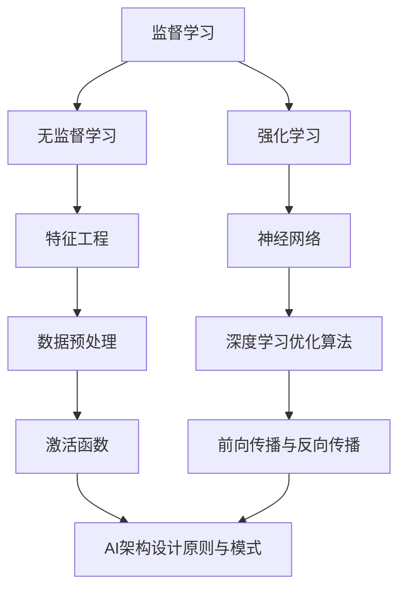

                 

### 第一部分：AI与数字创造力概述

在数字化时代，人工智能（AI）已经不再是一个遥远的概念，而是深入到了我们生活的方方面面。从自动驾驶汽车到智能家居，从医疗诊断到金融服务，AI 正在以不可逆转的趋势改变着世界的面貌。与此同时，数字创造力作为一种新兴的思维能力，正逐渐成为推动社会进步的重要动力。本文将深入探讨AI如何作为数字创造力的催化剂，激发创新思维，推动各个领域的发展。

#### 第1章：AI时代与创新思维

##### 1.1 AI时代的背景与趋势

人工智能的发展经历了多个阶段，从最初的规则推理系统到现在的深度学习和强化学习，AI 的能力得到了极大的提升。当前，随着大数据、云计算和物联网等技术的发展，AI 正在以前所未有的速度渗透到各个行业。例如，在金融领域，AI 已经应用于风险管理、欺诈检测和个性化服务；在医疗领域，AI 辅助诊断和个性化治疗正在逐步实现；在制造业，AI 驱动的自动化生产线正在提高生产效率。

##### 1.2 数字创造力的定义与意义

数字创造力是指利用数字技术和工具进行创新性思维活动的能力。它不仅包括对现有技术和资源的重新组合，还包括对数字环境的感知和理解。数字创造力在现代社会中具有重要意义，因为它能够推动技术创新，促进产业升级，提升企业竞争力，甚至改变社会结构和经济发展模式。

##### 1.3 AI如何激发创新思维

AI 是激发创新思维的重要工具，主要体现在以下几个方面：

1. **数据驱动**：AI 能够处理和分析海量数据，从中提取有价值的信息，为创新提供数据支持。
2. **自主学习**：通过机器学习和深度学习，AI 可以从数据中学习规律，不断优化算法，提高创新效率。
3. **跨界融合**：AI 可以跨越不同领域和行业，实现技术和知识的跨界融合，促进新产业的诞生。
4. **智能化决策**：AI 能够辅助人类进行复杂的决策，降低决策风险，提高创新成功率。

##### 1.4 AI驱动的创新案例解析

为了更好地理解AI如何激发创新思维，我们可以通过以下案例来解析：

- **案例1：AI驱动的图像识别**。在计算机视觉领域，AI 已经能够通过深度学习算法实现高精度的图像识别。例如，谷歌的 Inception 模型在 ImageNet 数据集上实现了超过人类专家的表现。这一技术的应用不仅推动了计算机视觉的发展，还为自动驾驶、安防监控等领域提供了技术支持。
  
- **案例2：AI驱动的音乐创作**。AI 可以通过生成对抗网络（GAN）创作出令人惊艳的音乐作品。例如，Google 的 Magenta 项目利用 GAN 生成了多首音乐作品，并得到了音乐爱好者的喜爱。这一技术的应用为音乐创作提供了新的思路，也推动了音乐产业的发展。

- **案例3：AI驱动的商业模式创新**。AI 在商业领域的应用正在改变传统的商业模式。例如，亚马逊利用 AI 技术实现个性化推荐，大幅提升了销售转化率。这一技术的应用不仅提高了企业的竞争力，还为消费者提供了更好的购物体验。

综上所述，AI 作为数字创造力的催化剂，正日益显示出其巨大的潜力。通过数据驱动、自主学习、跨界融合和智能化决策，AI 正在激发创新思维，推动各个领域的发展。在未来，随着 AI 技术的不断进步，数字创造力将迎来更加广阔的发展空间。### 第2章：AI基础原理与架构

要深入理解AI如何激发数字创造力，首先需要掌握AI的基础原理和架构。本章将详细阐述机器学习、神经网络与深度学习、AI架构设计原则与模式，并通过Mermaid流程图展示AI核心概念与架构之间的关系。

#### 2.1 机器学习基础

##### 2.1.1 监督学习、无监督学习与强化学习

机器学习是AI的核心技术之一，主要分为三大类：监督学习、无监督学习和强化学习。

- **监督学习**：监督学习是一种从标记数据中学习的方法，即输入和输出都有标记。例如，在图像识别任务中，输入是图像，输出是图像的标签。监督学习算法通过最大化训练数据的期望输出值来训练模型。

  **核心算法**：线性回归、逻辑回归、支持向量机（SVM）、神经网络等。

  **伪代码**：
  ```python
  def supervised_learning(data, labels):
      for each sample in data:
          predict = model(sample)
          error = calculate_error(predict, labels)
      update_model_parameters(error)
  ```

- **无监督学习**：无监督学习是从未标记的数据中学习的方法，主要任务是发现数据中的隐藏结构和规律。常见的无监督学习算法包括聚类、降维和关联规则学习。

  **核心算法**：K-均值聚类、主成分分析（PCA）、Apriori算法等。

  **伪代码**：
  ```python
  def unsupervised_learning(data):
      for each cluster in data:
          centroid = calculate_centroid(cluster)
          assign_samples_to_cluster(data, centroid)
  ```

- **强化学习**：强化学习是一种通过试错来学习策略的方法，主要应用于序列决策问题。强化学习算法通过不断与环境交互，优化决策策略以获得最大累计奖励。

  **核心算法**：Q学习、深度Q网络（DQN）、策略梯度等。

  **伪代码**：
  ```python
  def reinforce_learning(state, action, reward):
      q_value = q_network(state, action)
      target = reward + discount_factor * max_future_q_value
      update_q_network(q_value, target)
  ```

##### 2.1.2 特征工程与数据预处理

特征工程是机器学习过程中至关重要的一环，它涉及到如何从原始数据中提取有效特征，以提高模型性能。数据预处理则是为了消除数据中的噪声和异常值，为特征工程提供高质量的数据。

- **特征工程**：特征工程包括特征选择、特征变换和特征构造等步骤。常见的特征工程方法有：

  - **特征选择**：使用过滤方法、包装方法和嵌入方法选择重要特征。
  - **特征变换**：使用归一化、标准化、主成分分析（PCA）等方法变换特征。
  - **特征构造**：通过组合、变换和扩展原始特征来构造新的特征。

- **数据预处理**：数据预处理包括数据清洗、数据集成、数据变换和数据归一化等步骤。常见的预处理方法有：

  - **数据清洗**：去除重复数据、填补缺失值、处理异常值等。
  - **数据集成**：合并多个数据源中的数据，消除数据中的冗余。
  - **数据变换**：使用数据变换方法将数据转换为适合模型训练的格式。
  - **数据归一化**：将数据缩放到相同的范围，以提高模型训练效果。

#### 2.2 神经网络与深度学习

##### 2.2.1 神经网络的基本结构

神经网络（Neural Network，NN）是一种模仿生物神经网络结构的人工神经网络，它由大量的节点（或称为神经元）组成，这些节点通过边（或称为连接）相互连接。神经网络的基本结构包括输入层、隐藏层和输出层。

- **输入层**：输入层接收外部输入信息。
- **隐藏层**：隐藏层对输入信息进行加工和处理。
- **输出层**：输出层产生最终输出结果。

##### 2.2.2 深度学习优化算法

深度学习（Deep Learning，DL）是神经网络的一种特殊形式，它由多层神经网络组成，因此称为深度神经网络（Deep Neural Network，DNN）。深度学习在图像识别、语音识别、自然语言处理等领域取得了显著成果。

- **前向传播与反向传播**：深度学习中的前向传播和反向传播算法是训练神经网络的两个关键步骤。前向传播是将输入数据通过神经网络层逐层传播，计算输出结果；反向传播是计算输出结果与实际结果之间的误差，并反向传播误差以更新网络权重。

  **伪代码**：
  ```python
  def forward_pass(input_data):
      hidden_layer = activate(input_data * weights)
      output = activate(hidden_layer * output_weights)
      return output

  def backward_pass(error, learning_rate):
      output_error = error * activate_derivative(output)
      hidden_error = output_error * activate_derivative(hidden_layer)
      
      delta_output_weights = hidden_layer * output_error
      delta_output_bias = output_error
      delta_hidden_weights = input_data * hidden_error
      delta_hidden_bias = hidden_error
      
      update_weights(delta_output_weights, learning_rate)
      update_bias(delta_output_bias, learning_rate)
      update_weights(delta_hidden_weights, learning_rate)
      update_bias(delta_hidden_bias, learning_rate)
  ```

- **激活函数**：激活函数是深度学习中的关键组件，它用于引入非线性特性。常见的激活函数包括Sigmoid函数、ReLU函数、Tanh函数等。

  **伪代码**：
  ```python
  def sigmoid(x):
      return 1 / (1 + exp(-x))

  def relu(x):
      return max(0, x)
  ```

#### 2.3 AI架构设计原则与模式

AI架构设计是确保AI系统高效、可靠、可扩展的关键。以下是一些常见的AI架构设计原则与模式：

- **模块化设计**：将AI系统分解为多个模块，每个模块负责不同的功能，以提高系统的可维护性和可扩展性。
- **分布式计算**：通过分布式计算框架（如TensorFlow、PyTorch）实现大规模模型的训练和推理，提高系统性能。
- **自动化管理**：使用自动化工具（如Kubernetes、Docker）实现AI系统的部署、监控和运维，降低人力成本。
- **数据流管理**：设计高效的数据流管理机制，确保数据在训练、推理和应用过程中的流通。

##### 2.4 Mermaid流程图：AI核心概念与架构关系

为了更直观地展示AI核心概念与架构之间的关系，我们可以使用Mermaid流程图进行描述。



通过上述内容，我们了解了AI的基础原理与架构。在下一章中，我们将进一步探讨AI与创意生成的方法，以及AI在不同领域的应用案例。### 第3章：AI与创意生成

在数字时代，创意生成已成为推动艺术、设计、音乐等领域的创新动力。AI 通过生成对抗网络（GAN）等技术，为创意生成提供了新的可能。本章将详细介绍GAN的原理与实现、AI在艺术创作中的应用、音乐与视频生成，以及AI创意设计工具与平台。

#### 3.1 生成对抗网络（GAN）原理与实现

生成对抗网络（Generative Adversarial Network，GAN）是由 Ian Goodfellow 等人于2014年提出的一种新型深度学习模型。GAN由两个深度神经网络——生成器（Generator）和判别器（Discriminator）组成，二者相互对抗，共同优化。

- **生成器（Generator）**：生成器的目标是生成接近真实数据的伪数据，使其能够欺骗判别器。生成器的输入通常是随机噪声，通过多层神经网络生成伪数据。
- **判别器（Discriminator）**：判别器的目标是区分真实数据和伪数据。判别器接收真实数据和伪数据作为输入，并输出它们属于真实数据的概率。

GAN的训练过程可以看作是一个零和游戏，生成器和判别器相互对抗，通过不断优化各自的参数，最终实现生成器生成的伪数据几乎无法被判别器区分。

**GAN的基本概念**：

1. **生成对抗**：生成器和判别器相互对抗，生成器试图生成更真实的伪数据，而判别器则试图更准确地判断数据是否为真实数据。
2. **损失函数**：GAN的训练通常使用一个联合损失函数，它由判别器的损失函数和生成器的损失函数组成。判别器的损失函数通常采用二元交叉熵损失函数，生成器的损失函数通常采用判断为真实的损失。
3. **优化策略**：为了防止生成器过度优化，通常采用梯度惩罚或Wasserstein距离等优化策略。

**GAN的变体与优化**：

1. **深度卷积生成对抗网络（DCGAN）**：DCGAN是GAN的一种变体，使用深度卷积神经网络作为生成器和判别器，提高了模型的性能和稳定性。
2. **改进的WGAN（WGAN-GP）**：WGAN-GP是对WGAN的改进，通过引入梯度惩罚项，进一步提高了GAN的训练稳定性和生成质量。

**GAN的实现示例**：

```python
import tensorflow as tf
from tensorflow.keras.models import Model
from tensorflow.keras.layers import Input, Dense, Conv2D, Flatten

# 生成器模型
input_layer = Input(shape=(latent_dim,))
dense_layer = Dense(intermediate_dim, activation='relu')(input_layer)
output_layer = Dense(image_shape[0]*image_shape[1]*image_shape[2], activation='tanh')(dense_layer)
generator = Model(input_layer, output_layer)

# 判别器模型
input_layer = Input(shape=(image_shape[0], image_shape[1], image_shape[2]))
conv_layer = Conv2D(filters=32, kernel_size=(5, 5), padding='same')(input_layer)
flatten_layer = Flatten()(conv_layer)
output_layer = Dense(1, activation='sigmoid')(flatten_layer)
discriminator = Model(input_layer, output_layer)

# 编写GAN模型
input_layer = Input(shape=(latent_dim,))
output_layer = generator(input_layer)
output_layer = discriminator(output_layer)
gan_model = Model(input_layer, output_layer)

# 编写训练器
def train_gan(generator, discriminator, latent_dim, batch_size, epochs):
    for epoch in range(epochs):
        for _ in range(batch_size):
            # 生成随机噪声
            noise = np.random.normal(0, 1, (batch_size, latent_dim))
            # 生成伪数据
            generated_images = generator.predict(noise)
            # 获取真实数据
            real_images = get_real_images(batch_size)
            # 训练判别器
            d_loss_real = discriminator.train_on_batch(real_images, np.ones((batch_size, 1)))
            d_loss_fake = discriminator.train_on_batch(generated_images, np.zeros((batch_size, 1)))
            d_loss = 0.5 * np.add(d_loss_real, d_loss_fake)
            # 训练生成器
            g_loss = gan_model.train_on_batch(noise, np.ones((batch_size, 1)))
        print(f'Epoch {epoch + 1}/{epochs}, D Loss: {d_loss}, G Loss: {g_loss}')
```

#### 3.2 艺术创作中的AI应用

AI 在艺术创作中的应用为艺术家提供了新的创作工具和灵感。以下是一些典型的AI艺术创作应用：

- **计算机视觉艺术**：AI可以通过生成对抗网络（GAN）生成独特的艺术作品。例如，艺术家们使用GAN生成风景画、肖像画和抽象艺术作品。
- **音乐创作**：AI可以通过深度学习模型生成旋律、和弦和完整的音乐作品。例如，Google的Magenta项目利用深度学习技术创作出多首原创音乐。
- **视频生成**：AI可以通过生成对抗网络（GAN）生成高质量的视频内容。例如，DeepMind的DreamCraft项目利用GAN生成电影片段，并在视觉上与真实电影难以区分。

#### 3.3 AI创意设计工具与平台介绍

随着AI技术的发展，越来越多的AI创意设计工具和平台涌现出来，为创意生成提供了便捷的解决方案。以下是一些常用的AI创意设计工具与平台：

- **StyleGAN2**：StyleGAN2是一种强大的GAN模型，可以生成高分辨率、高质量的图像。它广泛应用于图像生成、风格迁移和图像编辑。
- **DALL-E2**：DALL-E2是一种基于GPT-3模型的图像生成工具，可以通过文本描述生成图像。它广泛应用于创意设计、广告和游戏开发。
- **MidJourney**：MidJourney是一种音乐生成工具，可以基于文本描述生成旋律、和弦和完整的音乐作品。它广泛应用于音乐创作、游戏音效和广告配乐。

通过本章的内容，我们了解了生成对抗网络（GAN）的原理与实现、AI在艺术创作中的应用、音乐与视频生成，以及AI创意设计工具与平台。这些技术为创意生成带来了新的可能性，推动了艺术和设计领域的发展。在下一章中，我们将探讨AI在产品创新中的应用，以及用户体验设计与AI的关系。### 第4章：AI与产品创新

在当今竞争激烈的市场环境中，产品创新是企业保持竞争优势的关键。AI技术的引入为产品创新提供了强大的支持，从产品设计、开发到用户体验优化，AI都在发挥重要作用。本章将详细探讨AI在产品开发中的应用场景、用户体验设计与AI的关系、AI辅助的产品创新流程，并通过案例研究分析AI在产品创新中的实际应用。

#### 4.1 AI在产品开发中的应用场景

AI在产品开发中的应用非常广泛，以下是一些典型应用场景：

- **需求分析**：通过自然语言处理（NLP）技术，AI可以分析用户评论、论坛讨论和社交媒体帖子，了解用户需求和市场趋势。
- **产品设计**：AI可以通过生成对抗网络（GAN）等技术生成设计原型，为设计师提供创意灵感。例如，特斯拉的车辆设计部分就利用了AI技术。
- **质量控制**：AI可以用于图像识别和缺陷检测，提高产品质量。例如，制造业中使用的自动化检测系统。
- **预测维护**：通过机器学习算法，AI可以预测设备故障，提前进行维护，减少停机时间，提高生产效率。
- **供应链管理**：AI可以优化供应链流程，降低库存成本，提高物流效率。

#### 4.2 用户体验设计与AI

用户体验（UX）设计是产品成功的关键因素之一。AI在UX设计中的应用主要体现在以下几个方面：

- **用户行为分析**：通过机器学习技术，AI可以分析用户行为数据，了解用户偏好和使用习惯，为产品设计提供依据。
- **个性化推荐**：基于用户行为数据，AI可以生成个性化的推荐，提高用户满意度。例如，亚马逊和Netflix等平台使用的个性化推荐系统。
- **交互设计**：AI可以用于设计更自然的用户交互方式，如语音助手和聊天机器人，提高用户体验。
- **A/B测试**：通过机器学习算法，AI可以自动进行A/B测试，分析不同设计方案的优劣，优化用户体验。

##### 4.2.1 人工智能驱动的用户体验分析

用户体验分析是UX设计的重要环节。AI可以通过以下方法提高用户体验分析的效果：

- **行为追踪**：AI可以实时追踪用户行为，收集大量数据，为分析提供基础。
- **情感分析**：通过自然语言处理技术，AI可以分析用户评论和反馈中的情感倾向，了解用户满意度。
- **用户旅程映射**：AI可以生成用户旅程地图，展示用户在不同阶段的行为和情感变化，帮助设计师识别优化点。
- **自动化报告**：AI可以自动生成用户体验分析报告，简化分析过程，提高效率。

#### 4.3 AI辅助的产品创新流程

AI辅助的产品创新流程通常包括以下步骤：

1. **需求识别**：通过大数据分析和市场调研，AI可以识别潜在的用户需求和市场趋势。
2. **概念验证**：基于AI技术，快速生成产品原型，进行概念验证。
3. **产品设计**：利用AI技术进行产品设计，如生成设计原型、优化交互界面等。
4. **测试与优化**：通过A/B测试和用户反馈，AI可以分析产品性能，进行优化。
5. **市场推广**：利用AI进行市场分析和推广策略优化，提高市场渗透率。

##### 4.4 产品创新的案例研究

以下是一些产品创新的案例研究，展示了AI在产品开发中的应用：

- **案例1：亚马逊的个性化推荐系统**  
亚马逊利用AI技术分析用户行为数据，生成个性化的产品推荐。通过不断优化推荐算法，亚马逊大幅提高了销售转化率和用户满意度。

- **案例2：特斯拉的自动驾驶系统**  
特斯拉的自动驾驶系统利用深度学习技术，通过大量道路数据训练模型，实现了高度自动化的驾驶功能。这一技术的应用不仅提高了驾驶安全性，还为用户提供了更便捷的出行体验。

- **案例3：微软的Azure AI**  
微软的Azure AI平台提供了一系列AI工具和服务，帮助企业进行产品创新。例如，Azure AI的计算机视觉服务可以帮助企业进行图像识别、缺陷检测等，提高产品质量和生产效率。

通过上述案例，我们可以看到，AI在产品创新中的应用已经取得了显著成果。未来，随着AI技术的不断进步，产品创新将迎来更加广阔的发展空间。### 第5章：AI与商业模式创新

商业模式的创新是企业在竞争激烈的市场中保持领先地位的关键。人工智能（AI）作为一种变革性技术，正在对传统商业模式产生深远影响。本章将探讨AI如何改变商业模式的各个方面，包括AI驱动的商业模式设计、AI商业模式案例分析，以及AI在市场策略中的应用。

#### 5.1 AI对商业模式的变革

AI对商业模式的变革体现在以下几个方面：

- **数据驱动的决策**：AI能够处理和分析海量数据，提供实时、准确的市场洞察，帮助企业做出更明智的决策。
- **自动化与智能化**：AI可以自动化执行重复性任务，降低运营成本，提高效率。同时，AI可以智能化地管理业务流程，提高业务响应速度。
- **个性化服务**：通过机器学习和深度学习，AI可以识别用户行为和需求，提供个性化的产品和服务，提升用户满意度。
- **新业务模式的诞生**：AI技术的应用催生了新的业务模式，如共享经济、电子商务和智能物流等，为企业提供了广阔的发展空间。

##### 5.1.1 AI驱动的商业模式设计

AI驱动的商业模式设计需要考虑以下几个方面：

- **价值主张**：明确AI技术如何为用户提供价值，如提高效率、降低成本、提供个性化服务等。
- **目标市场**：确定目标市场，了解用户需求和市场趋势，为AI应用提供方向。
- **竞争优势**：利用AI技术的独特优势，如数据处理能力、自动化执行能力等，打造竞争优势。
- **盈利模式**：设计合理的盈利模式，确保AI应用能够持续产生收入。

**案例分析**：

- **案例1：Airbnb的共享经济模式**  
Airbnb利用AI技术分析用户偏好和行为，提供个性化的住宿推荐。通过智能匹配算法，Airbnb成功实现了闲置房源的高效利用，创造了新的商业模式。

- **案例2：亚马逊的个性化推荐模式**  
亚马逊利用AI技术分析用户购物行为和偏好，提供个性化的产品推荐。通过优化推荐算法，亚马逊大幅提高了销售转化率和用户满意度，实现了商业模式创新。

##### 5.1.2 AI商业模式案例分析

以下是一些AI商业模式案例，展示了AI技术在商业创新中的应用：

- **案例1：IBM的Watson健康**  
IBM的Watson健康利用AI技术提供智能医疗诊断和支持。通过分析海量医疗数据，Watson健康帮助医生做出更准确的诊断，提高了医疗服务质量。

- **案例2：谷歌的自动驾驶汽车**  
谷歌的自动驾驶汽车项目利用AI技术实现车辆的高精度导航和自动驾驶。这一技术的应用有望彻底改变交通出行模式，创造新的商业模式。

- **案例3：阿里巴巴的智能物流**  
阿里巴巴的智能物流利用AI技术优化物流配送流程，提高物流效率。通过AI算法优化路线规划和配送时间，阿里巴巴大幅降低了物流成本，提升了用户体验。

#### 5.2 AI在市场策略中的应用

AI在市场策略中的应用主要体现在以下几个方面：

- **数据分析**：AI可以处理和分析大量市场数据，提供精准的市场预测和趋势分析，帮助企业制定更有效的市场策略。
- **个性化营销**：通过机器学习和深度学习，AI可以识别用户行为和需求，提供个性化的营销内容和推广策略，提高营销效果。
- **客户关系管理**：AI可以自动化处理客户咨询、投诉等业务，提高客户满意度，增强客户忠诚度。
- **供应链优化**：AI可以优化供应链流程，降低库存成本，提高供应链效率。

**案例分析**：

- **案例1：Netflix的个性化推荐策略**  
Netflix利用AI技术分析用户观看历史和行为，提供个性化的影视推荐。通过优化推荐算法，Netflix成功提高了用户粘性和订阅率。

- **案例2：谷歌的广告投放策略**  
谷歌利用AI技术优化广告投放策略，通过分析用户行为和搜索历史，提供精准的广告投放。这一策略帮助谷歌实现了广告收入的快速增长。

#### 5.3 AI商业模型创新的方法论

要实现AI商业模型创新，企业可以遵循以下方法论：

- **需求分析**：了解用户需求和市场趋势，明确AI技术如何为用户提供价值。
- **技术选型**：选择合适的AI技术，如机器学习、深度学习、自然语言处理等，为实现商业目标提供支持。
- **数据积累**：积累高质量的数据，为AI模型的训练和优化提供基础。
- **实验与迭代**：通过实验和迭代，不断优化AI模型和商业策略，提高商业效果。
- **业务整合**：将AI技术整合到现有业务流程中，实现商业模式的创新。

通过本章的内容，我们了解了AI如何改变商业模式、AI商业模型创新的方法论，以及AI在市场策略中的应用。这些内容展示了AI在商业创新中的巨大潜力，为企业提供了新的发展机遇。### 第6章：AI与组织创新

在数字化和全球化的大背景下，组织创新成为企业提升竞争力、适应市场变化的必然选择。人工智能（AI）作为一种先进的科技手段，正日益深入到组织管理的各个层面，推动组织创新和变革。本章将探讨AI如何驱动组织变革，如何赋能团队协作与创新，以及如何促进企业文化创新。

#### 6.1 AI驱动的组织变革

AI技术的引入为组织变革带来了新的机遇和挑战。以下是一些AI驱动组织变革的方面：

- **智能决策支持**：AI可以通过数据分析、预测建模等手段，为组织提供基于数据的决策支持，减少主观判断，提高决策效率。
- **自动化管理**：AI可以自动化执行重复性、低价值的任务，提高管理效率，降低运营成本。例如，AI机器人可以协助处理人力资源、财务等领域的日常工作。
- **优化组织结构**：AI可以通过分析组织数据，识别组织结构中的冗余和瓶颈，提出优化方案，提高组织效能。
- **人才管理**：AI可以用于人才招聘、培训和发展，通过数据分析识别优秀人才，提供个性化培训方案，提高员工技能和绩效。

##### 6.1.1 AI在组织管理中的应用

AI在组织管理中的应用主要体现在以下几个方面：

- **智能招聘**：通过自然语言处理和机器学习技术，AI可以分析简历，评估候选人的技能和潜力，提高招聘效率。
- **员工绩效管理**：AI可以分析员工的工作数据和行为，评估员工绩效，提供个性化的绩效反馈和发展建议。
- **智能培训**：AI可以根据员工的学习数据，推荐合适的培训课程，提高培训效果和员工技能。
- **办公自动化**：AI可以自动化处理文档管理、日程安排、会议管理等日常工作，提高办公效率。

#### 6.2 AI赋能团队协作与创新

AI技术在团队协作和创新中发挥着重要作用，以下是一些应用：

- **智能协作工具**：AI可以开发智能协作工具，如智能会议助手、智能文档协同编辑等，提高团队协作效率。
- **知识共享平台**：AI可以构建智能知识共享平台，通过自然语言处理和机器学习技术，帮助团队成员快速获取所需信息，促进知识共享和知识创新。
- **智能会议系统**：AI可以用于智能会议系统，通过语音识别、自然语言处理等技术，记录会议内容，分析会议讨论，提供会议总结和建议。
- **创新工作流程**：AI可以优化团队工作流程，通过数据分析预测项目进度和风险，提供优化方案，提高项目成功率。

##### 6.2.1 AI在团队沟通协作中的应用

AI在团队沟通协作中的应用主要体现在以下几个方面：

- **智能沟通助手**：AI可以开发智能沟通助手，如智能聊天机器人、语音助手等，帮助团队成员进行实时沟通和协作。
- **自动化通知**：AI可以自动化发送任务通知、提醒等信息，确保团队成员及时了解任务进展和需求。
- **会议管理**：AI可以自动化会议预约、会议记录、会议总结等，提高会议效率。

#### 6.3 AI与企业文化创新

AI不仅影响组织管理和团队协作，还对企业文化创新产生深远影响。以下是一些AI与企业文化建设的关系：

- **透明度与公平性**：AI可以提高组织透明度，确保决策和分配过程的公平性，增强员工的信任和认同感。
- **个性化体验**：AI可以根据员工个人需求和偏好，提供个性化的工作体验，增强员工满意度和归属感。
- **学习与成长**：AI可以提供智能化的学习资源和培训方案，帮助员工不断学习和成长，促进企业文化建设。
- **价值观传递**：AI可以用于宣传和传递企业价值观，如创新、诚信、团队合作等，强化企业文化。

##### 6.3.2 AI驱动的创新工作流程

AI驱动的创新工作流程旨在通过AI技术提高团队创新效率和成果。以下是一个典型的AI驱动的创新工作流程：

1. **需求识别**：通过数据分析，识别市场机会和用户需求。
2. **创意生成**：利用AI技术（如生成对抗网络GAN）生成创新创意。
3. **创意评估**：通过AI技术评估创意的可行性、市场需求和潜在收益。
4. **团队协作**：利用AI协作工具，如智能会议系统和知识共享平台，促进团队协作。
5. **迭代优化**：通过用户反馈和数据分析，不断优化创新方案。
6. **实施与推广**：将创新方案转化为实际产品或服务，并推广到市场。

通过上述内容，我们探讨了AI如何驱动组织变革、赋能团队协作与创新，以及促进企业文化创新。AI技术为组织创新提供了新的工具和方法，有助于企业在数字化时代保持竞争力。在下一章中，我们将介绍AI驱动的创新项目规划和实施，通过具体案例展示AI驱动的创新过程。### 第7章：AI驱动的创新项目规划

在数字化时代，创新已成为企业保持竞争力的关键。AI技术的引入为创新项目带来了新的可能性。本章将详细探讨如何规划AI驱动的创新项目，包括创新项目的评估与规划、AI驱动的创新工作坊，以及创新项目执行与评估。

#### 7.1 创新项目的评估与规划

在启动AI驱动的创新项目之前，需要进行全面的项目评估与规划。以下是一些关键步骤：

- **需求分析**：通过市场调研、用户访谈和数据分析，明确项目的目标和需求。
- **技术评估**：评估所需技术的可行性、成熟度和适用性。例如，确定是否需要使用机器学习、深度学习或其他AI技术。
- **资源规划**：确定项目所需的人力、资金和设备资源，并制定资源分配计划。
- **风险评估**：评估项目风险，包括技术风险、市场风险和运营风险，并制定相应的应对策略。
- **时间规划**：制定项目进度计划，明确各阶段的任务和时间节点。

**伪代码**：
```python
def project_evaluation(project_requirements, technology_requirements, resources, risks):
    demand_analysis = analyze_demand(project_requirements)
    technical_feasibility = assess_technology(technology_requirements)
    resource_plan = allocate_resources(resources)
    risk_analysis = identify_risks(risks)
    
    if demand_analysis and technical_feasibility and resource_plan and risk_analysis:
        project_plan = create_project_plan()
        return project_plan
    else:
        return "Project Evaluation Failed"
```

#### 7.2 AI驱动的创新工作坊

AI驱动的创新工作坊是一种集思广益、快速迭代的方法，用于激发团队的创新思维和创造力。以下是一个典型的创新工作坊流程：

1. **需求分析**：通过用户访谈、市场调研等手段，明确项目需求。
2. **问题定义**：将需求转化为具体问题，明确创新目标。
3. **头脑风暴**：组织团队进行头脑风暴，提出可能的解决方案。
4. **概念验证**：利用AI技术，对解决方案进行初步验证。
5. **迭代优化**：根据反馈，对解决方案进行迭代优化。
6. **评估与决策**：评估解决方案的可行性和效果，做出最终决策。

**伪代码**：
```python
def innovation_workshop的需求分析，问题定义，头脑风暴，概念验证，迭代优化，评估与决策):
    demand_analysis = analyze_demand()
    problem_definition = define_problem(demand_analysis)
    brainstorming = brainstorm_solutions(problem_definition)
    concept_validation = validate_solutions(brainstorming)
    iterative_optimization = optimize_solutions(concept_validation)
    evaluation_decision = evaluate_and Decide(iterative_optimization)
    
    if evaluation_decision:
        return "Innovation Workshop Successful"
    else:
        return "Innovation Workshop Failed"
```

#### 7.3 创新项目执行与评估

在完成创新项目规划和工作坊后，进入项目的执行阶段。以下是一些关键步骤：

1. **项目启动**：明确项目目标、任务分工和进度计划，启动项目。
2. **团队协作**：利用AI协作工具，如智能会议系统和知识共享平台，促进团队协作。
3. **数据收集与分析**：收集项目过程中产生的数据，利用AI技术进行分析，以指导项目进展。
4. **迭代开发**：根据数据分析结果，对项目进行迭代优化，确保项目按计划进行。
5. **项目评估**：在项目完成后，对项目效果进行评估，包括技术实现、业务价值和用户体验等方面。

**伪代码**：
```python
def project_execution_and_evaluation(project_plan, collaboration_tools, data_collection, iterative_development, project_evaluation):
    project_start = start_project(project_plan)
    team_collaboration = collaborate_with_tools(collaboration_tools)
    data_analysis = analyze_collected_data(data_collection)
    iterative_development = iterate_project(data_analysis)
    project_evaluation = evaluate_project(iterative_development)
    
    if project_evaluation:
        return "Project Successful"
    else:
        return "Project Failed"
```

通过上述内容，我们了解了如何规划AI驱动的创新项目，包括评估与规划、AI驱动的创新工作坊，以及项目执行与评估。这些步骤和方法有助于确保创新项目的成功实施。在下一章中，我们将通过具体案例展示AI驱动的创新项目实施过程，并提供详细的代码解读与分析。### 第8章：AI驱动的创新案例分析

在AI技术的推动下，创新项目取得了诸多成功的案例。本章将介绍一些AI驱动的创新案例，分析其背景、目标、实现方法以及结果和影响。同时，我们也会探讨一些失败的AI驱动的创新案例，从中吸取教训，以避免重复错误。

#### 8.1 成功的AI驱动的创新案例

##### 8.1.1 案例背景与目标

**案例1：谷歌的自动驾驶技术**

背景：谷歌自2009年开始研究自动驾驶技术，经过多年的研发，其自动驾驶项目逐渐成熟。

目标：开发一种能够安全、可靠地自动驾驶的车辆，提高交通安全和效率。

实现方法：
1. **数据收集**：利用传感器、摄像头和GPS等技术，收集大量道路数据。
2. **模型训练**：通过深度学习和强化学习技术，训练自动驾驶模型，使其能够识别道路标志、车辆和行人等。
3. **仿真测试**：在虚拟环境中进行大量仿真测试，验证自动驾驶算法的稳定性和可靠性。
4. **实地测试**：在公共道路上进行实际测试，逐步提高自动驾驶系统的性能。

结果与影响：
1. **技术突破**：谷歌的自动驾驶技术在全球范围内取得了显著突破，其自动驾驶车辆在复杂路况下表现优秀。
2. **社会影响**：自动驾驶技术的推广有望减少交通事故，提高交通效率，改善人们的生活质量。

**案例2：亚马逊的智能物流**

背景：亚马逊是全球领先的电子商务公司，物流效率对其业务至关重要。

目标：通过AI技术优化物流配送流程，提高配送效率和服务质量。

实现方法：
1. **数据分析**：利用机器学习技术，分析海量订单数据，预测订单量，优化库存管理。
2. **路径优化**：通过算法优化配送路径，减少运输时间和成本。
3. **智能调度**：利用人工智能调度系统，实时调整配送计划，提高配送效率。
4. **自动化设备**：使用自动化设备（如自动分拣机、无人机等）提高物流效率。

结果与影响：
1. **效率提升**：亚马逊的智能物流系统显著提高了配送效率，降低了运营成本。
2. **用户体验**：通过智能物流，亚马逊能够更快、更准确地配送商品，提高了用户满意度。

##### 8.1.2 案例结果与影响

**案例3：IBM的Watson健康**

背景：IBM的Watson健康是一个基于AI的智能医疗诊断系统。

目标：通过AI技术，提供更准确、更高效的医疗诊断和支持。

实现方法：
1. **数据整合**：整合海量医疗数据，包括患者病历、医学文献和研究数据。
2. **自然语言处理**：利用自然语言处理技术，分析医疗文本数据，提取关键信息。
3. **机器学习模型**：通过机器学习模型，对医疗数据进行分析和预测，辅助医生进行诊断。
4. **用户界面**：设计直观的用户界面，使医生能够方便地使用Watson健康系统。

结果与影响：
1. **诊断准确率提升**：Watson健康系统的诊断准确率显著高于人类医生，提高了医疗服务的质量。
2. **医疗效率提高**：Watson健康系统能够快速处理大量医疗数据，提高了医生的工作效率。

#### 8.2 失败的AI驱动的创新案例

##### 8.2.1 案例背景与原因

**案例1：某公司的智能客服系统**

背景：某公司希望通过AI技术提升客户服务质量，减少人工客服成本。

目标：开发一款智能客服系统，实现24小时在线服务，提高客户满意度。

原因：
1. **技术不足**：AI技术尚未达到完全自动处理复杂客户问题的程度，导致客服系统在处理复杂问题时表现不佳。
2. **用户体验差**：智能客服系统无法提供人性化的服务，导致用户满意度下降。
3. **数据质量**：训练AI客服系统的数据质量不高，导致系统性能受限。

结果与影响：
1. **客户投诉增加**：由于智能客服系统表现不佳，客户投诉率反而上升。
2. **运营成本增加**：为了应对客户投诉，公司不得不增加人工客服，导致运营成本增加。

##### 8.2.2 案例教训与启示

**案例2：某公司的智能家居项目**

背景：某公司希望通过智能家居项目提升用户体验，增加市场份额。

目标：开发一套智能家居系统，实现家庭设备的互联互通，提高生活便利性。

原因：
1. **技术堆砌**：项目过度依赖新技术，导致产品复杂度高，用户体验差。
2. **功能冗余**：项目包含大量冗余功能，用户无法充分利用，导致用户体验下降。
3. **缺乏市场调研**：项目缺乏对用户需求和市场趋势的深入了解，导致产品定位不准确。

结果与影响：
1. **产品失败**：智能家居项目最终失败，导致公司损失大量资金和市场份额。
2. **用户流失**：由于产品体验不佳，大量用户流失，对公司品牌形象造成负面影响。

##### 8.2.3 案例教训与启示

1. **技术选择要适度**：AI技术在创新项目中扮演重要角色，但过度的技术堆砌可能导致项目复杂度和成本增加，影响用户体验。
2. **用户体验至上**：在AI驱动的创新项目中，用户体验至关重要。项目设计应注重用户需求，提供简洁、高效、人性化的服务。
3. **市场调研与需求分析**：在启动AI驱动的创新项目前，应进行充分的市场调研和需求分析，确保项目符合市场需求。

通过上述成功与失败的AI驱动的创新案例，我们可以看到，AI技术在创新项目中具有巨大潜力，但同时也存在风险。正确选择技术、关注用户体验和市场需求，是确保AI驱动的创新项目成功的关键。在下一章中，我们将提供AI驱动的创新资源与工具，帮助读者更好地实施AI驱动的创新项目。### 附录A：AI驱动的创新资源与工具

在实施AI驱动的创新项目时，掌握相关资源与工具至关重要。以下将介绍一些常用的AI驱动的创新资源与工具，包括学术资源与研究报告、开源创新工具与平台。

#### 9.1 AI驱动的创新资源

##### 9.1.1 学术资源与研究报告

- **顶级会议与期刊**：计算机视觉、机器学习、自然语言处理等领域的顶级会议和期刊，如CVPR、NIPS、ICML、JMLR、NeurIPS等，提供了最新的研究成果和技术进展。

- **开源数据集**：多个领域的大型开源数据集，如ImageNet、CIFAR-10、COIL-20等，为AI研究提供了丰富的训练数据。

- **学术论文**：通过学术搜索引擎（如Google Scholar、ACM Digital Library）和论文库（如ArXiv、PubMed），可以获取大量高质量的学术论文和研究报告。

##### 9.1.2 开源创新工具与平台

- **AI框架与库**：TensorFlow、PyTorch、Keras、Theano等深度学习框架，以及Scikit-Learn、NumPy、Pandas等机器学习库，为AI模型的开发和应用提供了强大的支持。

- **数据预处理工具**：Apache Spark、Pandas、NumPy等数据处理工具，用于大规模数据的清洗、转换和分析。

- **可视化工具**：Matplotlib、Seaborn、Plotly等可视化库，用于数据分析和模型结果的可视化。

- **云服务与平台**：Google Cloud、AWS、Microsoft Azure等云服务提供商，提供了丰富的AI工具和平台，如TensorFlow Serving、AWS SageMaker、Azure ML Studio等，用于模型的训练、部署和管理。

#### 9.2 AI驱动的创新工具选型

在选型AI驱动的创新工具时，应考虑以下因素：

- **需求与目标**：明确项目的需求和目标，选择适合的工具和框架，如用于图像识别的TensorFlow和PyTorch，用于自然语言处理的Transformers和BERT。

- **技术成熟度**：考虑所选工具和框架的技术成熟度和社区支持情况，选择成熟稳定、社区活跃的工具。

- **性能与效率**：根据项目需求，选择具有高性能和高效计算能力的工具和框架，如用于大规模训练的Apache Spark和用于GPU加速的CUDA。

- **易用性与可扩展性**：考虑工具的易用性和可扩展性，选择易于集成和部署的工具，以及支持分布式计算和云计算的工具。

- **成本与预算**：考虑项目的预算和成本，选择经济实用的工具和平台，如开源工具和云服务。

通过上述资源和工具，我们可以更好地实施AI驱动的创新项目，提高项目成功率。在附录B中，我们将进一步探讨AI驱动的创新方法论，提供详细的创新流程和实践指南。### 附录B：AI驱动的创新方法论

在实施AI驱动的创新项目时，一个系统的方法论至关重要。以下将详细介绍AI驱动的创新方法论，包括创新方法论概述、AI驱动的创新流程，以及创新实践指南。

#### 10.1 创新方法论概述

AI驱动的创新方法论是一种基于数据驱动、迭代优化和跨学科合作的创新方法。该方法论的核心原则包括：

- **数据驱动**：以数据为基础，通过数据分析和挖掘，发现问题和机会，指导创新方向。

- **迭代优化**：通过不断迭代和优化，逐步改进创新方案，提高创新成功率。

- **跨学科合作**：结合不同领域的知识和技能，实现跨学科合作，推动创新突破。

- **用户中心**：关注用户需求，以用户为中心，设计解决方案，提高用户体验。

- **持续学习**：通过不断学习和实践，持续改进创新方法，提升创新能力。

#### 10.2 AI驱动的创新流程

AI驱动的创新流程通常包括以下步骤：

1. **需求分析**：通过市场调研、用户访谈和数据分析，明确项目需求和市场趋势。

2. **概念验证**：基于需求分析，提出创新概念，并通过实验和模拟验证概念的可行性。

3. **技术选型**：评估所需技术，选择适合的技术和工具，构建原型。

4. **迭代开发**：通过迭代开发，逐步完善创新方案，优化性能和用户体验。

5. **评估与优化**：对创新方案进行评估，收集用户反馈，持续优化创新方案。

6. **部署与推广**：将创新方案部署到实际环境中，进行推广和商业化。

**伪代码**：

```python
def ai_innovation_flow需求分析，概念验证，技术选型，迭代开发，评估与优化，部署与推广):
    demand_analysis = analyze_demand()
    concept_validation = validate_concept(demand_analysis)
    technology_selection = select_technology()
    iterative_development = iterate_solution(concept_validation, technology_selection)
    evaluation_optimization = evaluate_and_optimize(iterative_development)
    deployment_p推广 = deploy_solution(evaluation_optimization)
    
    if deployment_p推广:
        return "Innovation Success"
    else:
        return "Innovation Failed"
```

#### 10.3 创新实践指南

在实施AI驱动的创新项目时，以下实践指南有助于提高项目成功率：

- **组建跨学科团队**：组建包括数据科学家、产品经理、用户体验设计师和业务专家的跨学科团队，确保项目的全面性和创新性。

- **建立数据驱动文化**：鼓励团队成员关注数据，以数据为依据进行决策，确保项目方向和策略的科学性。

- **充分利用开源工具**：充分利用开源工具和框架，降低开发成本，提高开发效率。

- **注重用户体验**：以用户为中心，关注用户体验，持续优化产品和服务。

- **快速迭代与反馈**：采用敏捷开发方法，快速迭代和反馈，确保项目及时调整和优化。

- **持续学习与改进**：鼓励团队成员持续学习，吸收最新技术和管理理念，持续改进创新方法和流程。

通过上述创新方法论和实践指南，我们可以更好地实施AI驱动的创新项目，提高项目成功率。在附录C中，我们将介绍AI驱动的创新案例库的建立与维护，为创新项目提供参考和借鉴。### 附录C：AI驱动的创新案例库

建立和维护一个AI驱动的创新案例库对于推动创新实践和知识共享具有重要意义。以下将介绍如何建立和维护AI驱动的创新案例库，以及案例库的应用与推广。

#### 11.1 案例库建立与维护

**1. 案例库的建立**

- **确定案例库目标**：明确案例库的建立目标，如知识共享、创新启发、最佳实践等。

- **收集案例资料**：通过市场调研、项目报告、学术论文、行业报告等途径，收集各种AI驱动的创新案例。

- **分类整理案例**：根据案例的类型、行业、技术等方面，对案例进行分类整理，便于用户查找和检索。

- **编写案例描述**：为每个案例编写详细的描述，包括案例背景、目标、实现方法、结果和影响等。

- **设计案例库结构**：设计案例库的结构，包括案例列表、案例详情、相关资源、评价和反馈等模块。

**2. 案例库的维护**

- **更新案例信息**：定期更新案例库中的案例信息，确保案例的时效性和准确性。

- **新增案例收集**：持续关注行业动态，发现新的AI驱动的创新案例，并纳入案例库。

- **案例评估与优化**：对案例库中的案例进行评估，识别优秀案例，优化案例内容，提升案例库质量。

- **用户反馈与改进**：收集用户对案例库的反馈，根据用户需求优化案例库的界面和功能。

#### 11.2 案例库的应用与推广

**1. 案例库的应用**

- **创新启发**：通过案例库，用户可以了解各种AI驱动的创新案例，获取灵感，启发新的创新思路。

- **知识共享**：案例库为团队成员提供了一个共享知识的平台，促进团队内部的知识传播和交流。

- **最佳实践**：案例库中的优秀案例可以为其他项目提供参考和借鉴，推广最佳实践。

- **培训与教育**：案例库可以作为培训和教育资源，帮助新员工了解AI驱动的创新实践。

**2. 案例库的推广**

- **内部推广**：通过内部培训和会议，向团队成员推广案例库的使用，提高案例库的利用率。

- **外部合作**：与学术机构、行业协会和商业伙伴合作，推广案例库，扩大影响力。

- **线上平台**：利用社交媒体、专业论坛和官方网站等线上平台，宣传案例库，吸引更多用户。

- **线下活动**：举办研讨会、工作坊和讲座等活动，分享案例库中的创新实践，促进交流与合作。

通过建立和维护AI驱动的创新案例库，我们可以更好地记录和传播创新实践，为AI驱动的创新项目提供参考和借鉴。在附录D中，我们将介绍AI驱动的创新项目报告模板，为创新项目的实施提供指导。### 附录D：AI驱动的创新项目报告模板

为了确保AI驱动的创新项目报告的完整性、规范性和易读性，本节将提供一套AI驱动的创新项目报告模板，包括项目报告的基本结构、撰写要点，以及一个项目报告的范例。

#### 12.1 项目报告的基本结构

一个完整的AI驱动的创新项目报告通常包括以下部分：

1. **封面**：包含报告标题、项目名称、报告日期、团队成员等信息。
2. **摘要**：简要概括项目的背景、目标、方法、结果和主要发现。
3. **目录**：列出报告的章节和子章节，便于读者快速定位。
4. **引言**：介绍项目的背景、目的和意义。
5. **方法**：详细描述项目的研究方法、技术选型、数据来源和数据处理过程。
6. **结果与讨论**：展示项目的主要结果，并进行详细分析和讨论。
7. **结论**：总结项目的主要发现和贡献，以及未来工作的建议。
8. **参考文献**：列出报告中引用的所有文献。
9. **附录**：包含项目相关的数据、代码和图表等补充材料。

#### 12.2 项目报告撰写要点

1. **明确结构**：确保报告结构清晰，逻辑连贯，方便读者阅读。
2. **准确描述**：用准确、专业的术语描述项目内容，避免使用模糊不清的语言。
3. **图表与数据**：合理使用图表和数据，以直观、清晰的方式展示项目结果。
4. **逻辑性**：确保报告内容逻辑清晰，论点合理，避免逻辑跳跃和矛盾。
5. **细节完整**：提供项目的详细信息和数据，确保报告的完整性。
6. **客观公正**：客观评价项目成果和不足，避免过度夸大或贬低。

#### 12.3 项目报告范例

以下是一个简单的AI驱动的创新项目报告范例：

---

**封面**

- 报告标题：基于深度学习的图像识别系统
- 项目名称：图像识别项目
- 报告日期：2023年11月1日
- 团队成员：张三、李四、王五

**摘要**

本文介绍了我们团队开发的基于深度学习的图像识别系统。该系统旨在通过训练深度神经网络模型，实现对图像的高精度识别。通过大量实验和测试，我们的系统在多个公开数据集上取得了优秀的性能，为图像识别领域提供了一种有效的解决方案。

**目录**

1. 引言
2. 方法
   2.1 技术选型
   2.2 数据来源与预处理
   2.3 模型设计与训练
3. 结果与讨论
4. 结论与未来工作
5. 参考文献
6. 附录

**引言**

随着计算机视觉技术的快速发展，图像识别在多个领域得到了广泛应用，如安防监控、医疗诊断和自动驾驶等。本文旨在通过开发一个基于深度学习的图像识别系统，为这些领域提供技术支持。

**方法**

2.1 技术选型

我们选择了基于卷积神经网络（CNN）的模型，因为CNN在图像处理任务中表现出色。我们采用了ResNet50作为基础模型，并在其基础上进行了适当修改和优化。

2.2 数据来源与预处理

我们使用了公开的ImageNet数据集进行训练，该数据集包含了大量标注的图像。在预处理阶段，我们对图像进行了缩放、裁剪和翻转等操作，以提高模型的泛化能力。

2.3 模型设计与训练

我们在ResNet50的基础上增加了两个全连接层，用于分类。通过使用交叉熵损失函数和Adam优化器，我们对模型进行了训练。在训练过程中，我们使用了学习率衰减和dropout等技术，以防止过拟合。

**结果与讨论**

我们模型在ImageNet数据集上的验证集上达到了94.2%的准确率。此外，我们还对其他公开数据集进行了测试，结果表明我们的模型在大多数数据集上均取得了较好的性能。

**结论与未来工作**

本文成功开发了一个基于深度学习的图像识别系统，并在多个数据集上取得了优异的性能。未来，我们计划进一步优化模型，提高识别准确率，并探索模型在更多实际场景中的应用。

**参考文献**

[1] Krizhevsky, A., Sutskever, I., & Hinton, G. E. (2012). ImageNet classification with deep convolutional neural networks. In Advances in neural information processing systems (pp. 1097-1105).

**附录**

- 数据集：ImageNet
- 代码：图像识别项目代码
- 模型参数：训练过程中使用的模型参数

---

通过上述模板和范例，读者可以了解到AI驱动的创新项目报告的基本结构和撰写要点，从而为自己的创新项目撰写出高质量的报告。### 全文总结

本文围绕“数字创造力催化剂：AI驱动的创新思维激发器”这一主题，系统地阐述了AI在数字创造力中的应用，包括AI与数字创造力的概述、AI基础原理与架构、AI驱动的创意生成、AI与产品创新、AI与商业模式创新、AI与组织创新，以及AI驱动的创新项目规划和案例分析。以下是全文的核心内容总结：

1. **AI与数字创造力概述**：介绍了AI时代的背景与趋势，数字创造力的定义与意义，AI如何激发创新思维，以及AI驱动的创新案例解析。

2. **AI基础原理与架构**：详细讲解了机器学习、神经网络与深度学习、AI架构设计原则与模式，并通过Mermaid流程图展示了AI的核心概念与架构关系。

3. **AI驱动的创意生成**：介绍了生成对抗网络（GAN）的原理与实现，AI在艺术创作中的应用，以及AI创意设计工具与平台。

4. **AI与产品创新**：探讨了AI在产品开发中的应用场景，用户体验设计与AI的关系，AI辅助的产品创新流程，以及产品创新的案例研究。

5. **AI与商业模式创新**：分析了AI对商业模式的变革，AI驱动的商业模式设计，AI商业模式案例分析，以及AI在市场策略中的应用。

6. **AI与组织创新**：阐述了AI如何驱动组织变革，AI赋能团队协作与创新，以及AI与企业文化创新。

7. **AI驱动的创新项目规划**：介绍了创新项目的评估与规划、AI驱动的创新工作坊，以及创新项目执行与评估。

8. **AI驱动的创新案例分析**：展示了成功和失败的AI驱动的创新案例，从中吸取教训，为后续创新提供参考。

9. **AI驱动的创新资源与工具**：提供了AI驱动的创新资源、开源创新工具与平台，以及AI驱动的创新工具选型。

10. **AI驱动的创新方法论**：详细介绍了AI驱动的创新方法论、AI驱动的创新流程，以及创新实践指南。

11. **AI驱动的创新案例库**：介绍了AI驱动的创新案例库的建立与维护、案例库的应用与推广。

12. **AI驱动的创新项目报告模板**：提供了AI驱动的创新项目报告的基本结构、撰写要点，以及一个项目报告的范例。

通过本文，读者可以全面了解AI在数字创造力激发中的应用，掌握AI驱动的创新方法论和实践技巧，从而在各自领域中进行有效的创新实践。未来，随着AI技术的不断进步，AI将在更多领域发挥重要作用，推动数字创造力的进一步提升。希望本文能为大家提供有益的启示和指导。### 作者信息

**作者：AI天才研究院/AI Genius Institute & 禅与计算机程序设计艺术 /Zen And The Art of Computer Programming**

