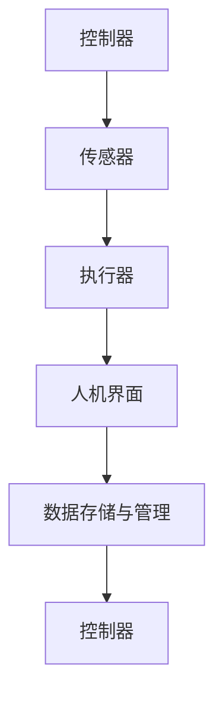

                 

## 引言

### 概述与背景

在信息技术飞速发展的今天，自动化技术已经成为推动社会进步和经济发展的重要力量。随着人工智能、大数据、物联网等新兴技术的不断成熟，数字实体与物理实体的自动化前景愈发广阔。本文旨在深入探讨数字实体与物理实体自动化的概念、应用场景以及未来发展趋势，为读者提供一个全面而深入的理解。

#### 1.1 数字实体与物理实体的概念

数字实体（Digital Entity）是指以数字形式存在的虚拟对象或系统，如计算机程序、数据库记录、网络节点等。它们在数字世界中具有独立的身份和属性，能够通过计算机系统进行交互和处理。物理实体（Physical Entity），则是指现实世界中的物体或系统，如机械设备、基础设施、生物体等。它们具有物理形态和物理属性，直接参与现实世界的活动。

#### 1.2 自动化技术的历史与发展

自动化技术的概念可以追溯到工业革命时期，当时通过机械化生产实现了生产过程的自动化。随着计算机技术的兴起，自动化技术逐渐从物理世界扩展到数字世界。近年来，人工智能和物联网技术的快速发展，使得自动化技术迎来了新的机遇和挑战。自动化技术在生产制造、物流管理、智能家居、医疗健康等领域得到了广泛应用。

#### 1.3 自动化在现实世界中的应用

自动化技术在现实世界中的应用场景非常广泛。例如，在智能制造领域，自动化生产线能够实现从原材料到成品的自动化生产，提高生产效率和质量。在智能物流领域，自动化仓储系统和无人配送车辆能够提高物流运输效率，降低运营成本。在智能家居领域，智能家电和智能家居系统可以实现远程控制和自动化操作，提高生活质量。在医疗健康领域，自动化医疗设备和智能诊断系统能够提高诊断效率和准确性，改善患者治疗效果。

#### 1.4 数字实体与物理实体自动化的前景

随着技术的不断进步，数字实体与物理实体的自动化前景十分广阔。未来，自动化技术将更加深入地融入各个领域，实现更高层次的智能化和协同化。例如，通过人工智能技术，自动化系统可以自适应环境变化，实现更加智能化的决策和控制。通过物联网技术，数字实体与物理实体可以实时互联，实现数据的互通和共享，从而提高整个系统的效率和质量。此外，自动化技术还将带来更多的创新机会，推动新兴产业的快速发展。

### 总结

数字实体与物理实体的自动化前景不可估量，它们将为社会带来巨大的变革和创新。本文将从数字实体和物理实体的定义与分类、自动化技术的核心原理、实现方法以及实际应用案例等方面进行深入探讨，以期为读者提供一个全面而深入的理解。接下来，我们将对数字实体进行详细分析。

---

### 第二部分：数字实体自动化

#### 第2章：数字实体的定义与分类

数字实体是自动化技术的重要基础，其定义与分类对于理解自动化技术具有重要意义。在这一章节中，我们将详细探讨数字实体的基本概念、分类及其重要特征。

#### 2.1 数字实体的基本概念

数字实体是指以数字形式存在的虚拟对象或系统，它们在计算机系统中具有独立的身份和属性。数字实体可以是抽象的，如数据库记录、计算机程序等，也可以是具体的，如网络节点、虚拟设备等。数字实体的关键特征包括：

- **数字化存在**：数字实体以二进制形式存储和传输，能够通过计算机系统进行操作和处理。
- **独立性**：数字实体具有独立的身份和属性，能够在计算机系统中与其他实体进行交互。
- **虚拟性**：数字实体是虚拟的，没有物理形态，但可以通过计算机模拟实现各种功能。

#### 2.2 数字实体的分类

数字实体可以根据不同的特征进行分类。以下是几种常见的数字实体分类：

- **按功能分类**：
  - **数据实体**：如数据库记录、数据文件等，用于存储和处理数据。
  - **程序实体**：如计算机程序、算法模块等，用于执行特定任务和处理。
  - **网络实体**：如网络节点、网络设备等，用于数据传输和网络通信。

- **按结构分类**：
  - **简单实体**：具有简单结构，如单个数据记录、程序模块等。
  - **复合实体**：由多个简单实体组成，具有复杂结构，如数据库系统、软件系统等。

- **按应用领域分类**：
  - **工业领域**：如工业自动化控制系统、智能制造系统等。
  - **服务领域**：如电子商务系统、在线教育平台等。
  - **公共领域**：如智能交通系统、智慧城市系统等。

#### 2.3 数字实体的重要特征

数字实体具有以下重要特征：

- **可编程性**：数字实体可以通过编程语言进行定义和操作，具有高度灵活性。
- **可扩展性**：数字实体可以方便地进行扩展和升级，以适应不断变化的需求。
- **互操作性**：数字实体可以通过标准接口进行互操作，实现数据共享和协同工作。
- **智能化**：数字实体可以通过人工智能技术实现自主学习和智能化决策，提高系统的效率和智能化水平。

#### 2.4 数字实体的优势与应用

数字实体在自动化技术中具有显著的优势和应用场景：

- **提高效率**：通过数字实体，自动化系统能够实现高效的流程控制和任务执行，减少人工干预。
- **降低成本**：数字实体可以降低生产成本、运营成本和维护成本，提高经济效益。
- **增强安全性**：数字实体可以实现数据的安全存储和传输，提高系统的安全性。
- **促进创新**：数字实体为自动化技术提供了更多的创新机会，推动了新兴产业的发展。

#### 2.5 数字实体的挑战与未来趋势

尽管数字实体在自动化技术中具有广泛的应用，但也面临一些挑战：

- **数据安全问题**：数字实体涉及大量的数据存储和传输，需要确保数据的安全性。
- **算法公平性问题**：数字实体依赖于算法进行决策，需要确保算法的公平性和透明性。
- **技术依赖性问题**：数字实体对计算机技术和网络技术有较高依赖，需要解决技术稳定性和可靠性问题。

未来，数字实体的发展趋势将包括：

- **智能化与自主化**：通过人工智能技术，数字实体将实现更加智能化的决策和自主化的操作。
- **协同化与网络化**：通过物联网技术，数字实体将实现更加协同化与网络化的工作模式。
- **标准化与开放化**：数字实体的标准化和开放化将提高系统的互操作性和兼容性，促进技术发展和应用创新。

#### 小结

数字实体是自动化技术的重要组成部分，其定义与分类、重要特征、优势与应用以及挑战与未来趋势对于深入理解自动化技术具有重要意义。在下一章节中，我们将探讨物理实体的定义与分类。

---

### 第三部分：物理实体自动化

#### 第3章：物理实体的定义与分类

物理实体是自动化技术中另一个关键组成部分，它们在现实世界中具有具体的物理形态和功能。在本章中，我们将详细探讨物理实体的基本概念、分类及其重要特征。

#### 3.1 物理实体的基本概念

物理实体是指现实世界中的物体或系统，它们具有物理形态和物理属性，能够直接参与现实世界的活动和过程。物理实体可以是自然界中的物质，如岩石、植物、动物等，也可以是人工制造的设备、设施等。物理实体的关键特征包括：

- **物理形态**：物理实体具有具体的形状、大小、质量等物理属性。
- **物理属性**：物理实体具有温度、压力、速度等物理特性，这些特性决定了物理实体的行为和功能。
- **物理交互**：物理实体可以通过物理作用力（如引力、电磁力等）与其他实体进行交互和影响。

#### 3.2 物理实体的分类

物理实体可以根据不同的特征进行分类。以下是几种常见的物理实体分类：

- **按功能分类**：
  - **生产设备**：如机床、机器人、生产线等，用于生产制造过程。
  - **传输设备**：如交通工具、管道、电网等，用于物质和能量的传输。
  - **控制设备**：如传感器、控制器、执行器等，用于监测、控制和调节物理过程。

- **按结构分类**：
  - **简单物理实体**：具有简单结构，如单个机器零件、单一传感器等。
  - **复合物理实体**：由多个简单物理实体组成，具有复杂结构，如大型机械设备、智能交通系统等。

- **按应用领域分类**：
  - **工业领域**：如制造业、能源业、建筑业等。
  - **公共服务领域**：如交通、通信、医疗等。
  - **农业领域**：如农业机械设备、智能农业系统等。

#### 3.3 物理实体的重要特征

物理实体具有以下重要特征：

- **物理形态**：物理实体具有具体的物理形态，如大小、形状等，这些形态决定了物理实体的应用场景和使用方式。
- **物理属性**：物理实体具有各种物理属性，如温度、压力、速度等，这些属性对物理实体的功能和行为具有重要影响。
- **物理交互**：物理实体可以通过物理作用力与其他实体进行交互，如机械设备的运动、传感器的监测等。
- **物理稳定性**：物理实体在现实世界中具有一定的稳定性和可靠性，能够承受一定的物理负荷和环境变化。

#### 3.4 物理实体的优势与应用

物理实体在自动化技术中具有显著的优势和应用场景：

- **实现自动化操作**：物理实体可以通过自动化技术实现自动化操作，提高生产效率和准确性。
- **提高生产质量**：物理实体能够通过自动化控制实现精确控制，提高生产质量和稳定性。
- **降低运营成本**：物理实体可以通过自动化控制减少人力成本和维护成本，提高经济效益。
- **实现智能化管理**：物理实体可以通过物联网技术实现智能化管理，提高系统的效率和智能化水平。

#### 3.5 物理实体的挑战与未来趋势

尽管物理实体在自动化技术中具有广泛的应用，但也面临一些挑战：

- **技术依赖性问题**：物理实体对自动化技术和传感器技术有较高依赖，需要解决技术稳定性和可靠性问题。
- **物理环境适应性**：物理实体需要适应各种复杂和多变的物理环境，如高温、高压、低温等。
- **安全性和可靠性**：物理实体在自动化过程中需要确保安全性和可靠性，避免出现故障和事故。

未来，物理实体的发展趋势将包括：

- **智能化与自主化**：通过人工智能技术，物理实体将实现更加智能化的决策和自主化的操作。
- **网络化与协同化**：通过物联网技术，物理实体将实现更加网络化和协同化的工作模式。
- **绿色化与可持续发展**：物理实体将朝着绿色化和可持续发展的方向演进，减少资源消耗和环境污染。

#### 小结

物理实体是自动化技术的重要组成部分，其定义与分类、重要特征、优势与应用以及挑战与未来趋势对于深入理解自动化技术具有重要意义。在下一章节中，我们将探讨自动化技术的核心原理。

---

### 第四部分：自动化技术的核心原理

#### 第4章：自动化技术的核心原理

自动化技术是现代工业和服务领域的重要支撑，其核心原理涵盖了控制理论、传感器与执行器、控制算法等方面。在本章中，我们将深入探讨自动化技术的核心原理，为读者提供一个全面的认知。

#### 4.1 自动化技术的理论基础

自动化技术的理论基础主要包括控制理论和传感器与执行器的工作原理。控制理论是自动化技术的核心，它研究如何通过控制系统的输入和输出，实现系统状态的调节和优化。

- **控制理论**：

  控制系统通常由输入、控制器和输出三部分组成。控制系统的基本控制流程可以表示为：

  $$ \text{控制系统} = \text{输入} \rightarrow \text{控制器} \rightarrow \text{输出} $$

  其中，输入是系统的控制目标，输出是系统的实际状态，控制器则是调节系统状态的装置。

- **传感器与执行器**：

  传感器用于获取系统的实际状态信息，将物理量（如温度、压力、速度等）转换为电信号。执行器则用于根据控制器的指令执行相应的动作，如调节阀门、驱动电机等。传感器与执行器的交互流程可以表示为：

  $$ \text{传感器} \rightarrow \text{获取数据} \rightarrow \text{执行器} \rightarrow \text{执行动作} $$

#### 4.2 自动化系统的基本构成

自动化系统由硬件和软件两部分组成，硬件主要包括控制器、传感器和执行器，软件则包括控制算法、人机界面和数据存储与管理。

- **硬件组成**：

  自动化系统的硬件组成部分可以表示为：

  $$ \text{硬件} = \text{控制器} + \text{传感器} + \text{执行器} $$

  控制器是系统的核心，负责接收传感器数据、执行控制算法和发送执行器指令。传感器负责获取系统状态信息，执行器负责根据控制指令执行动作。

- **软件组成**：

  自动化系统的软件组成部分可以表示为：

  $$ \text{软件} = \text{控制算法} + \text{人机界面} + \text{数据存储与管理} $$

  控制算法是系统的心脏，负责根据传感器数据和系统目标，计算并输出控制指令。人机界面则是系统的交互界面，用于显示系统状态和操作指令。数据存储与管理则用于存储系统数据和处理数据。

#### 4.3 自动化控制算法

自动化控制算法是实现自动化系统功能的核心。常见的自动化控制算法包括PID控制算法和模糊控制算法。

- **PID控制算法**：

  PID（比例-积分-微分）控制算法是一种常用的线性控制算法，其基本原理如下：

  $$ \text{控制输出} = K_p \times (\text{设定值} - \text{反馈值}) + K_i \times \int (\text{设定值} - \text{反馈值}) dt + K_d \times (\text{设定值} - \text{反馈值})' $$

  其中，$K_p$、$K_i$、$K_d$分别为比例、积分、微分系数，用于调节控制输出的稳定性、准确性和响应速度。

- **模糊控制算法**：

  模糊控制算法是一种基于模糊逻辑的非线性控制算法，其基本原理如下：

  $$ \text{控制输出} = \text{模糊规则库} \times \text{模糊集合} $$

  模糊规则库是一组描述输入变量与输出变量关系的规则，模糊集合则是描述输入变量的模糊集合。

#### 4.4 Mermaid流程图：自动化系统的典型架构

为了更直观地展示自动化系统的架构，我们可以使用Mermaid流程图来描述。以下是一个自动化系统的典型架构：



#### 小结

自动化技术的核心原理涵盖了控制理论、传感器与执行器、控制算法等方面，这些原理共同构成了自动化系统的基本框架。在下一章节中，我们将探讨自动化技术的实现方法。

---

### 第五部分：自动化技术的实现

#### 第5章：自动化技术的实现方法

自动化技术的实现涉及多个关键步骤和组件，包括系统设计、硬件选择、软件编程、系统集成和测试等。在这一章节中，我们将详细探讨自动化技术的实现方法。

#### 5.1 实现自动化技术的步骤

实现自动化技术通常需要以下步骤：

1. **需求分析**：
   - 确定自动化系统的目标和需求，明确需要控制的物理实体和要实现的功能。
2. **系统设计**：
   - 设计自动化系统的总体架构，包括硬件选型、软件设计、传感器和执行器布局等。
3. **硬件选择**：
   - 根据系统设计选择合适的控制器、传感器和执行器，确保硬件组件的兼容性和稳定性。
4. **软件编程**：
   - 开发控制算法和系统软件，实现自动化功能，包括传感器数据采集、控制逻辑处理和执行器动作控制等。
5. **系统集成**：
   - 将硬件和软件组件整合在一起，形成一个完整的自动化系统。
6. **测试与调试**：
   - 对自动化系统进行测试和调试，确保系统稳定运行，达到预期效果。

#### 5.2 自动化技术的关键组件

自动化技术的实现依赖于多个关键组件，以下是其中的几个关键组件：

1. **控制器**：
   - 控制器是自动化系统的核心，负责接收传感器数据、执行控制算法和发送执行器指令。常见的控制器有PLC（可编程逻辑控制器）、PLC模块、单片机等。
2. **传感器**：
   - 传感器用于获取物理实体的状态信息，如温度、压力、速度等。常见的传感器有温度传感器、压力传感器、速度传感器等。
3. **执行器**：
   - 执行器根据控制器的指令执行相应的动作，如驱动电机、调节阀门等。常见的执行器有电机驱动器、伺服驱动器、电磁阀等。
4. **人机界面**：
   - 人机界面（HMI）是系统的交互界面，用于显示系统状态、操作指令和报警信息等。常见的HMI有触摸屏、显示器等。
5. **数据存储与管理**：
   - 数据存储与管理用于存储系统数据和处理数据，如数据库、文件系统等。

#### 5.3 自动化技术的实现策略

实现自动化技术需要采取有效的策略，以下是几个关键的实现策略：

1. **模块化设计**：
   - 将自动化系统划分为多个模块，如传感器模块、控制模块、执行器模块等，实现模块化设计和开发，提高系统的可维护性和可扩展性。
2. **标准化接口**：
   - 使用标准化的接口连接传感器、控制器和执行器，确保系统的互操作性和兼容性。
3. **实时性控制**：
   - 对于实时性要求较高的系统，采用实时操作系统和实时控制算法，确保系统的实时响应和稳定性。
4. **安全性保障**：
   - 在系统设计和实现过程中，充分考虑数据安全和设备安全，采取加密、认证、隔离等安全措施。
5. **数据分析与优化**：
   - 对系统运行数据进行实时分析和处理，优化控制策略，提高系统效率和性能。

#### 5.4 开发环境搭建

实现自动化技术需要一个合适的开发环境，以下是一个典型的开发环境搭建步骤：

1. **硬件环境**：
   - 准备控制器、传感器和执行器等硬件设备，确保硬件设备符合系统设计要求。
2. **软件环境**：
   - 安装实时操作系统、集成开发环境（IDE）和控制算法开发工具，如Keil、IAR、MATLAB等。
3. **网络环境**：
   - 配置网络设备，如路由器、交换机等，确保系统具备联网功能。
4. **调试环境**：
   - 准备调试工具，如示波器、逻辑分析仪等，用于系统调试和故障排查。

#### 5.5 源代码详细实现和代码解读

自动化技术的实现离不开源代码的开发和解读。以下是一个简单的自动化控制系统的源代码示例，并进行代码解读：

```c
#include <stdio.h>
#include <stdlib.h>

// 控制器初始化
void controller_init() {
  // 初始化硬件设备
}

// 传感器数据采集
float sensor_data() {
  // 采集传感器数据
  return 0.0;
}

// 执行器控制
void actuator_control(float value) {
  // 根据控制值执行动作
}

int main() {
  // 控制器初始化
  controller_init();
  
  while (1) {
    // 传感器数据采集
    float sensor_value = sensor_data();
    
    // 执行器控制
    actuator_control(sensor_value);
    
    // 等待一段时间
    sleep(1);
  }
  
  return 0;
}
```

- `controller_init()`：初始化硬件设备。
- `sensor_data()`：采集传感器数据。
- `actuator_control(float value)`：根据控制值执行动作。
- `main()`：主程序，实现传感器数据采集和执行器控制。

#### 5.6 代码解读与分析

以上代码是一个简单的自动化控制系统，它通过循环采集传感器数据并执行相应的控制动作。以下是代码的解读与分析：

1. **控制器初始化**：
   - `controller_init()`函数用于初始化硬件设备，确保设备处于正常工作状态。
2. **传感器数据采集**：
   - `sensor_data()`函数负责采集传感器数据，将采集到的数据作为控制输入。
3. **执行器控制**：
   - `actuator_control(float value)`函数根据采集到的传感器数据执行相应的控制动作，实现系统的自动化控制。
4. **主程序**：
   - `main()`函数是程序的主入口，通过循环结构实现传感器数据采集和执行器控制。

#### 小结

自动化技术的实现方法涉及多个关键步骤和组件，包括系统设计、硬件选择、软件编程、系统集成和测试等。在实现过程中，需要充分考虑硬件和软件的兼容性、实时性和安全性等因素。通过合适的开发环境和源代码开发，可以实现高效、可靠的自动化系统。

在下一章节中，我们将通过具体案例研究自动化技术的实际应用。

---

### 第六部分：案例研究

#### 第6章：自动化技术的应用案例

自动化技术的广泛应用为各个领域带来了显著的变革和提升。在本章中，我们将通过具体的应用案例，探讨自动化技术在智能制造、智能物流和智能农业等领域的实践和效果。

#### 6.1 案例研究1：智能制造

##### 6.1.1 案例背景

智能制造是工业4.0时代的重要趋势，通过自动化技术和信息技术实现生产过程的智能化和数字化。某制造企业为了提升生产效率和产品质量，决定引入自动化生产线。

##### 6.1.2 案例实施

1. **需求分析**：
   - 确定生产过程中的关键环节，如原料加工、组装、检测等。
   - 分析现有生产线的瓶颈和改进需求。

2. **系统设计**：
   - 设计自动化生产线方案，包括控制器、传感器、执行器等硬件选型。
   - 开发控制算法和系统软件，实现自动化控制功能。

3. **硬件选择**：
   - 选择高性能的PLC作为控制器。
   - 选择高精度的传感器和执行器，确保生产过程的精确控制。

4. **软件编程**：
   - 开发基于PLC的控制软件，实现生产过程的自动化控制。
   - 开发人机界面软件，用于监控生产线状态和操作控制。

5. **系统集成**：
   - 将控制器、传感器、执行器等硬件组件和软件系统集成在一起，形成一个完整的自动化生产线。

6. **测试与调试**：
   - 对自动化生产线进行测试和调试，确保系统稳定运行和达到预期效果。

##### 6.1.3 案例效果分析

引入自动化生产线后，该制造企业取得了显著的效果：

- **生产效率提高**：自动化生产线实现了从原材料到成品的全自动化生产，大大缩短了生产周期。
- **产品质量提升**：自动化控制系统能够精确控制生产过程，减少了人为操作误差，提高了产品质量。
- **成本降低**：自动化生产线的引入减少了人力成本和维护成本，提高了生产效益。

#### 6.2 案例研究2：智能物流

##### 6.2.1 案例背景

随着电子商务的快速发展，物流行业面临着巨大的压力。某物流公司为了提高物流效率，降低运营成本，决定引入智能物流系统。

##### 6.2.2 案例实施

1. **需求分析**：
   - 分析现有物流系统的瓶颈和改进需求，如仓储管理、运输调度、配送等。
   - 确定智能物流系统的目标和功能。

2. **系统设计**：
   - 设计智能物流系统方案，包括仓储管理系统、运输调度系统、配送管理系统等。
   - 硬件选型包括传感器、控制器、执行器等。

3. **硬件选择**：
   - 选择适合的传感器，如RFID、摄像头等，用于货物跟踪和识别。
   - 选择高效的执行器，如电动门、电动滑轮等，用于货物搬运和配送。

4. **软件编程**：
   - 开发仓储管理系统，实现货物的入库、出库和库存管理。
   - 开发运输调度系统，实现货物的实时跟踪和优化调度。
   - 开发配送管理系统，实现货物的配送路径规划和配送优化。

5. **系统集成**：
   - 将仓储管理、运输调度、配送管理等系统集成在一起，形成一个完整的智能物流系统。

6. **测试与调试**：
   - 对智能物流系统进行测试和调试，确保系统稳定运行和高效运作。

##### 6.2.3 案例效果分析

引入智能物流系统后，该物流公司取得了显著的效果：

- **物流效率提高**：智能物流系统能够实时跟踪货物状态，优化运输和配送流程，大大提高了物流效率。
- **成本降低**：智能物流系统的自动化和优化功能降低了人力成本和维护成本，提高了运营效益。
- **服务质量提升**：智能物流系统提高了货物的准确性和及时性，增强了客户满意度。

#### 6.3 案例研究3：智能农业

##### 6.3.1 案例背景

智能农业是现代农业发展的重要方向，通过自动化技术和信息技术实现农业生产过程的智能化和精细化管理。某农场为了提高农业生产效率和产品质量，决定引入智能农业系统。

##### 6.3.2 案例实施

1. **需求分析**：
   - 分析农场生产的各个环节，如播种、施肥、灌溉、收割等。
   - 确定智能农业系统的目标和功能。

2. **系统设计**：
   - 设计智能农业系统方案，包括传感器、控制器、执行器等硬件选型。
   - 开发控制算法和系统软件，实现自动化控制功能。

3. **硬件选择**：
   - 选择适合的传感器，如土壤湿度传感器、气象传感器等，用于监测农田状态。
   - 选择高效的执行器，如水泵、灌溉系统等，用于农田管理和灌溉。

4. **软件编程**：
   - 开发农田管理系统，实现土壤湿度、气象等数据的实时监测和自动化控制。
   - 开发灌溉系统软件，实现灌溉计划的自动生成和灌溉过程的自动化控制。

5. **系统集成**：
   - 将传感器、控制器、执行器等硬件组件和软件系统集成在一起，形成一个完整的智能农业系统。

6. **测试与调试**：
   - 对智能农业系统进行测试和调试，确保系统稳定运行和达到预期效果。

##### 6.3.3 案例效果分析

引入智能农业系统后，该农场取得了显著的效果：

- **生产效率提高**：智能农业系统能够实时监测农田状态，自动调整灌溉和施肥计划，提高了农业生产效率。
- **产品质量提升**：智能农业系统能够精确控制农田管理，减少了资源浪费，提高了农产品质量。
- **降低成本**：智能农业系统的自动化和智能化功能降低了人力成本和维护成本，提高了农业生产效益。

#### 小结

自动化技术在智能制造、智能物流和智能农业等领域的应用，取得了显著的成效。通过自动化技术，企业能够提高生产效率、降低成本、提高产品质量，实现可持续发展。在下一章节中，我们将探讨数字实体与物理实体自动化的未来趋势。

---

### 第七部分：未来展望

#### 第7章：数字实体与物理实体自动化的未来趋势

随着科技的不断进步，数字实体与物理实体的自动化前景愈发光明。在这一章节中，我们将探讨自动化技术的未来发展方向、面临的挑战与机遇，以及自动化技术的未来前景。

#### 7.1 自动化技术的未来发展方向

1. **智能化与自主化**：
   - 随着人工智能技术的不断发展，自动化系统将实现更高的智能化和自主化水平。通过深度学习、机器学习等技术，自动化系统将能够自我学习和优化，实现自适应环境和自主决策。

2. **网络化与协同化**：
   - 物联网技术的普及将推动数字实体与物理实体的深度融合，实现网络化和协同化。通过传感器、云计算、大数据等技术，自动化系统能够实现实时数据共享和协同工作，提高整体效率和智能化水平。

3. **绿色化与可持续发展**：
   - 面对环境问题，自动化技术将朝着绿色化和可持续发展的方向演进。通过节能减排、资源优化等技术，自动化系统能够减少资源消耗和环境污染，促进可持续发展。

4. **人机交互与融合**：
   - 自动化技术将更加注重人机交互和融合，提高用户体验和操作便捷性。通过虚拟现实、增强现实等技术，用户能够更加直观地与自动化系统进行交互，实现智能化管理和控制。

#### 7.2 自动化技术的挑战与机遇

1. **数据安全问题**：
   - 自动化系统涉及大量的数据存储和传输，数据安全问题成为一大挑战。需要采取有效的数据加密、访问控制等技术，确保数据的安全性和隐私性。

2. **技术稳定性和可靠性**：
   - 自动化系统依赖于各种硬件和软件技术，技术稳定性和可靠性是关键。需要加强技术研发和测试，提高自动化系统的稳定性和可靠性。

3. **算法公平性与透明性**：
   - 自动化系统的决策和控制依赖于算法，算法的公平性和透明性成为重要问题。需要确保算法的公平性和透明性，避免算法偏见和不公平现象。

4. **创新与市场机遇**：
   - 自动化技术的快速发展带来了大量的创新机会和市场机遇。企业可以抓住这些机遇，开发具有竞争力的自动化产品和服务，开拓新的市场。

#### 7.3 自动化技术的未来前景

1. **提高生产效率**：
   - 自动化技术的普及将大幅提高生产效率，减少人力成本，提高产品质量。企业可以通过自动化技术实现大规模定制化生产，满足个性化需求。

2. **降低运营成本**：
   - 自动化技术的应用可以降低运营成本，提高经济效益。通过自动化控制，企业可以实现资源的优化配置，减少能源消耗和维护成本。

3. **促进创新与产业升级**：
   - 自动化技术的推动下，新兴产业将不断涌现，传统产业将实现升级和转型。自动化技术将促进产业创新，推动经济结构优化和升级。

4. **改善生活质量**：
   - 自动化技术在智能家居、医疗健康等领域的应用将大大改善人们的生活质量。通过自动化技术，人们可以实现更加便捷、舒适和安全的居住环境。

#### 小结

数字实体与物理实体的自动化前景广阔，自动化技术将在未来各个领域发挥重要作用。通过智能化、网络化、绿色化和人机交互等发展方向，自动化技术将不断推动社会进步和经济发展。面对挑战和机遇，我们需要不断探索和创新，推动自动化技术的可持续发展。

在最后，我们感谢读者对本文的阅读，希望本文能够为您带来对数字实体与物理实体自动化的深入理解和启发。

---

### 附录

#### 附录A：自动化技术相关工具与资源

在自动化技术的学习和应用过程中，使用合适的工具和资源对于提升效率和质量具有重要意义。以下是一些常用的自动化技术相关工具与资源，供读者参考。

#### A.1 自动化技术常用工具

1. **PLC编程软件**：
   - Siemens TIA Portal
   - Rockwell Studio 5000
   - Schneider Electric Unity Pro

2. **机器人编程软件**：
   - ABB Robot Studio
   - KUKA Robot Vision Assistant
   - Yaskawa Motoman ROBOGUIDE

3. **自动化控制工具**：
   - Node-RED
   - Automate.io
   - Zapier

4. **数据分析与处理工具**：
   - MATLAB
   - Python（scikit-learn、pandas等库）
   - R

#### A.2 自动化技术相关书籍推荐

1. **《自动化技术原理与应用》**：全面介绍了自动化技术的基本原理和应用实例。
2. **《PLC编程技术》**：详细讲解了PLC编程的基本知识和技巧。
3. **《机器人技术与应用》**：介绍了机器人技术的最新发展和应用。
4. **《工业自动化控制技术》**：系统地阐述了工业自动化控制的基本理论和技术。

#### A.3 自动化技术在线资源链接

1. **自动化技术论坛**：
   - PLC编程论坛
   - 自动化技术社区
   - 机器人论坛

2. **在线课程与教程**：
   - Coursera（自动化技术相关课程）
   - Udemy（自动化技术相关课程）
   - edX（自动化技术相关课程）

3. **自动化技术资料库**：
   - IEEE Xplore
   - ScienceDirect
   - SpringerLink

通过这些工具与资源，读者可以更深入地学习和应用自动化技术，提升自己的专业能力和竞争力。

---

### 作者信息

**作者：AI天才研究院/AI Genius Institute & 禅与计算机程序设计艺术 /Zen And The Art of Computer Programming**

感谢您阅读本文，希望本文对您在数字实体与物理实体自动化领域的研究和应用有所帮助。如果您有任何疑问或建议，欢迎随时与我们联系。期待与您共同探索自动化技术的无限可能。

