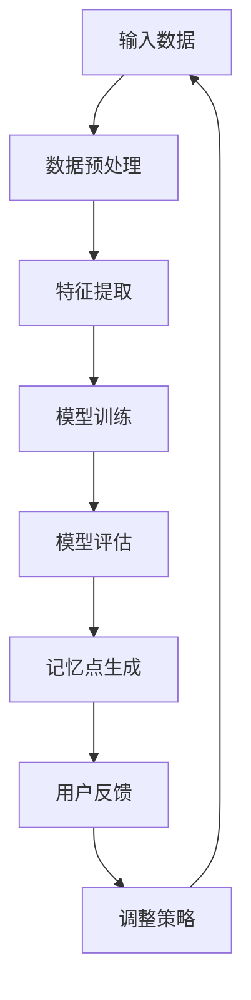

                 

### 第1章：记忆增强技术概述

#### 1.1 记忆过程与认知神经科学基础

记忆是大脑对信息进行编码、存储和提取的能力，是认知科学中一个重要而复杂的研究领域。记忆过程涉及多个认知神经科学基础，包括神经元与神经网络、突触可塑性、以及大脑区域间的相互作用。

**神经元与神经网络**

神经元是大脑的基本单元，它们通过复杂的网络结构相互连接，形成神经网络。每个神经元都有树突、细胞体和轴突，树突接收其他神经元传递过来的信号，细胞体处理这些信号，轴突将处理后的信号传递到其他神经元。

神经网络由多个神经元层组成，包括输入层、隐藏层和输出层。输入层接收外部信息，隐藏层对信息进行处理和转换，输出层产生最终的输出结果。这种层次结构使得神经网络能够处理复杂数据，并模拟大脑的认知过程。

**突触可塑性**

突触是神经元之间的连接点，突触可塑性是指突触的连接强度可以随时间和经验而改变。这种可塑性是记忆形成和存储的关键机制。研究表明，突触前后的信号变化会导致突触结构的改变，包括突触强度的增强或减弱。

突触可塑性包括几种形式，如短期增强（STDP）和长期增强（LTP）。短期增强通常与短期记忆相关，而长期增强则与长期记忆相关。这些机制允许大脑在学习和记忆过程中对信息进行编码和存储。

**记忆存储与检索机制**

记忆存储是指大脑将信息从短期记忆转化为长期记忆的过程。记忆存储涉及大脑中的多个区域，如海马体、前额叶皮层等。海马体是大脑中一个关键的记忆中心，负责短期记忆的转换和长期记忆的建立。

记忆检索是指从长期记忆中提取信息的过程。记忆检索通常需要激活与记忆相关的神经元网络，并通过神经网络中的信息传播来恢复记忆内容。这个过程涉及到大脑中的多种神经机制，包括神经网络的重新激活、突触连接的重新形成等。

#### 1.2 AI辅助记忆优化的核心概念

随着人工智能技术的发展，AI开始与记忆优化技术相结合，为提高记忆效率和准确性提供了新的途径。AI辅助记忆优化技术涉及多个核心概念，包括机器学习与深度学习基础、神经网络与记忆增强的联系，以及计算机视觉和自然语言处理在记忆优化中的应用。

**机器学习与深度学习基础**

机器学习是一种通过算法从数据中学习模式和规律的技术。深度学习是机器学习的一个子领域，它通过构建多层神经网络来模拟人脑的学习过程。深度学习在图像识别、语音识别、自然语言处理等领域取得了显著的成果。

在记忆优化中，机器学习和深度学习技术可以用于数据的预处理、特征提取、模型训练和预测。例如，可以使用神经网络模型来预测用户在学习过程中哪些信息更容易被遗忘，从而制定更有效的复习策略。

**神经网络与记忆增强的联系**

神经网络是记忆增强技术的基础，特别是深度学习网络，如循环神经网络（RNN）、卷积神经网络（CNN）和图神经网络（GNN）。这些神经网络能够处理复杂数据，并模拟大脑的认知过程。

RNN在处理序列数据时具有优势，例如语言序列和视频序列。CNN擅长处理图像数据，可以用于图像识别和图像分类任务。GNN则能够处理图结构数据，如图图谱和知识图谱，用于知识记忆和组织。

神经网络通过调整网络权重和结构，可以模拟大脑的记忆过程，从而提高记忆效率和准确性。例如，通过训练RNN模型，可以识别出学习过程中的关键信息，并在后续学习中进行强化记忆。

**计算机视觉与自然语言处理在记忆优化中的应用**

计算机视觉和自然语言处理是人工智能的两个重要领域，它们在记忆优化中也发挥着重要作用。

计算机视觉技术可以用于图像识别和图像记忆。通过训练深度学习模型，计算机可以识别和理解图像内容，从而帮助用户更好地记忆图像信息。例如，可以开发视觉记忆训练应用程序，使用户通过观察图像来加强记忆。

自然语言处理技术可以用于文本记忆和语言学习。通过词嵌入技术，可以将文本转化为数值向量，从而在计算机中存储和处理。自然语言处理模型可以用于文本分类、文本生成和问答系统，从而帮助用户更好地记忆和理解文本信息。

总之，AI辅助记忆优化技术通过结合机器学习、深度学习和计算机视觉、自然语言处理等技术，为提高记忆效率和准确性提供了新的方法和途径。这些技术的应用不仅可以帮助学生和专业人士更好地学习和记忆，还可以为教育和医疗等领域带来重大的变革。

#### 1.3 当前记忆增强方法的局限性

尽管现有的记忆增强方法在一定程度上提高了记忆效率和准确性，但它们也存在一些局限性，这些局限性限制了它们在实际应用中的效果和推广。

**传统的记忆训练方法**

传统的记忆训练方法，如重复记忆和联想记忆，虽然简单易行，但存在以下局限性：

1. **效率低下**：重复记忆需要大量的时间和精力，且容易产生疲劳和厌烦情绪，影响记忆效果。
2. **易忘性高**：传统的记忆训练方法缺乏有效的巩固和复习机制，导致记忆持久性差，新信息容易遗忘。
3. **个性化和适应性不足**：传统方法通常采用统一的教学策略，难以根据个体的记忆特点和学习需求进行个性化调整。

**现有AI技术的局限**

尽管人工智能技术在记忆增强中展示了巨大潜力，但现有技术仍存在以下局限性：

1. **数据需求大**：许多AI模型，尤其是深度学习模型，需要大量的训练数据才能达到较好的效果。然而，记忆增强应用场景中的数据获取可能受到限制，特别是在教育和个人学习领域。
2. **计算资源消耗高**：深度学习模型通常需要大量的计算资源，包括高性能的CPU或GPU。这对于个人用户来说可能是一个障碍，特别是在资源有限的环境下。
3. **模型泛化能力不足**：许多记忆增强模型在特定数据集上表现良好，但可能在新的、未见过的数据上效果不佳。这限制了模型的实际应用范围。
4. **算法偏见和公平性**：AI模型在训练过程中可能会引入偏见，导致某些用户群体受到不公平对待。此外，模型的决策过程通常是不透明的，难以解释其为何做出特定决策。

**伦理与社会问题**

除了技术上的局限性，记忆增强技术还面临一些伦理和社会问题：

1. **数据隐私**：记忆增强应用需要收集和分析大量用户数据，这引发了对数据隐私和安全性的担忧。如何确保用户数据不被滥用或泄露是一个关键问题。
2. **依赖性和成瘾性**：如果用户过度依赖记忆增强技术，可能会产生依赖性，影响其自主学习和记忆能力。此外，记忆增强技术可能被滥用，如用于考试作弊等不当用途。
3. **社会影响**：记忆增强技术的广泛应用可能会改变社会结构和文化，影响人们的价值观和认知方式。如何平衡技术效益和社会责任是一个重要议题。

**总结**

当前记忆增强方法的局限性主要体现在传统方法的效率低下和易忘性高，以及现有AI技术的数据需求大、计算资源消耗高、模型泛化能力不足和伦理与社会问题等方面。为了克服这些局限性，需要不断改进记忆增强技术，提高其效率和准确性，同时关注技术伦理和社会影响，确保其在实际应用中的可持续性和公正性。

#### 1.4 AI在记忆优化中的应用前景

随着人工智能技术的不断进步，AI在记忆优化中的应用前景愈发广阔。未来，AI辅助记忆优化技术有望在多个领域发挥重要作用，并带来一系列积极的影响。

**未来的发展方向**

1. **更高效的算法和模型**：未来的AI技术将开发出更加高效的算法和模型，如基于深度学习和神经网络的模型，能够在更短的时间内完成训练和预测任务。这些算法和模型将更准确地模拟大脑的记忆机制，提高记忆增强的效果。

2. **个性化记忆增强**：通过结合大数据分析和机器学习技术，AI将能够根据个体的记忆特点和学习需求，提供个性化的记忆增强方案。例如，通过分析学习数据，AI可以识别出用户最容易忘记的信息，并针对性地制定复习策略。

3. **跨学科融合**：AI与心理学、教育学等学科的结合，将推动记忆优化技术的进一步发展。心理学研究可以帮助理解记忆的机制和过程，教育学研究则可以提供教学方法和策略，这些知识将为AI辅助记忆优化提供重要支持。

4. **多模态数据融合**：未来AI辅助记忆优化技术将能够处理和分析多种类型的数据，如文本、图像、音频等。通过多模态数据融合，AI可以更全面地理解和记忆信息，提高记忆的效率和准确性。

**潜在的创新应用**

1. **虚拟现实（VR）和增强现实（AR）技术**：VR和AR技术为AI辅助记忆优化提供了新的应用场景。通过沉浸式的学习体验，用户可以在虚拟环境中进行记忆训练，提高记忆效果。例如，学生可以通过AR应用在教室中看到三维的化学分子结构，从而更好地理解和记忆相关知识。

2. **智能辅助学习系统**：未来的智能辅助学习系统将集成AI记忆优化技术，为用户提供个性化的学习建议和记忆支持。这些系统可以实时监测学生的学习行为，根据学习数据调整教学策略，提高学习效果。

3. **健康辅助应用**：AI辅助记忆优化技术可以应用于健康领域，帮助改善记忆障碍患者的症状。例如，通过训练特定的神经网络模型，AI可以识别出患者记忆问题的主要原因，并制定个性化的康复方案。

4. **商业应用**：在商业领域，AI辅助记忆优化技术可以用于员工培训、知识管理等方面。通过分析员工的学习数据和记忆效果，企业可以优化培训策略，提高员工的工作效率和知识储备。

**社会影响**

1. **教育领域**：AI辅助记忆优化技术将显著提升教育质量，帮助学生和专业人士更高效地学习和记忆。这将有助于缩小教育差距，提高整个社会的知识水平。

2. **医疗领域**：通过AI技术，医生可以更准确地诊断和治疗记忆障碍相关的疾病，如阿尔茨海默病等。这有助于提高医疗服务的质量和效率。

3. **劳动力市场**：随着AI技术的普及，未来的劳动力市场将更加依赖于高技能和高效能的员工。AI辅助记忆优化技术可以帮助员工提升自身能力，适应不断变化的工作环境。

4. **伦理和社会责任**：AI辅助记忆优化技术的广泛应用将引发一系列伦理和社会问题。如何确保技术的公正性、透明性和安全性，以及如何平衡技术利益和社会责任，将成为重要的议题。

总之，AI在记忆优化中的应用前景广阔，未来的发展将带来一系列创新和变革。通过不断改进技术和关注社会影响，AI辅助记忆优化技术有望为人类社会带来更多福祉。

#### 2.1 机器学习算法基础

机器学习（Machine Learning，ML）是人工智能（Artificial Intelligence，AI）的重要分支，它通过构建算法模型，从数据中学习并做出预测或决策。在机器学习算法的基石中，数据预处理与特征工程、常见机器学习算法、以及分类与回归算法是核心内容。

**数据预处理与特征工程**

数据预处理是机器学习任务的第一步，其主要目的是提高数据质量，确保数据适合用于训练模型。数据预处理包括以下关键步骤：

1. **数据清洗**：去除噪声数据和异常值，确保数据的准确性。
   - **缺失值处理**：对于缺失的数据，可以选择填充或删除。
   - **重复数据去除**：删除重复的数据记录，避免模型过拟合。
   - **数据规范化**：对数据进行标准化或归一化，使不同特征之间具有可比性。

2. **数据归一化**：将数据缩放到一个统一的范围，如[0, 1]或[-1, 1]。
   - **标准化**：计算每个特征的均值和标准差，并将数据缩放到[-1, 1]。
   - **归一化**：使用Min-Max标准化方法，将数据缩放到特定范围。

3. **特征工程**：从原始数据中提取有用的特征，并创建新的特征。
   - **特征选择**：选择对模型预测最有影响力的特征。
   - **特征转换**：将类别型数据转换为数值型数据，如使用独热编码或标签编码。
   - **特征构造**：通过组合原始特征，创建新的特征，以增加模型的预测能力。

**常见的机器学习算法**

在机器学习中，有许多不同的算法可以用于分类、回归、聚类等任务。以下是几种常见的机器学习算法：

1. **监督学习算法**
   - **决策树（Decision Tree）**：通过树形结构对数据进行划分，每个节点代表一个特征，每个分支代表一个特征值。
     - **优点**：易于理解和解释。
     - **缺点**：容易过拟合，对大规模数据集性能不佳。
   - **支持向量机（Support Vector Machine，SVM）**：通过找到一个最佳的超平面，将不同类别的数据点分开。
     - **优点**：在高维空间中表现良好，可以处理非线性数据。
     - **缺点**：训练时间较长，对噪声敏感。
   - **神经网络（Neural Network）**：通过模拟人脑神经网络，对数据进行分析和分类。
     - **优点**：强大的非线性建模能力，适用于复杂任务。
     - **缺点**：训练时间较长，对数据质量和规模要求高。

2. **无监督学习算法**
   - **聚类算法（Clustering Algorithm）**：将相似的数据点归为一类，常见的聚类算法包括K-means、层次聚类等。
     - **K-means**：通过计算数据点到各类别的中心距离，将其分配到最近的类别。
       - **优点**：简单、易于实现。
       - **缺点**：对初始聚类中心敏感，可能陷入局部最优。
     - **层次聚类**：通过逐步合并相似的数据点，构建一个树形结构。
       - **优点**：可以灵活地调整聚类数量。
       - **缺点**：计算复杂度高，对大规模数据集性能不佳。

3. **强化学习算法**
   - **Q-学习（Q-Learning）**：通过在策略评估和策略改进之间迭代，学习最优的策略。
     - **优点**：适用于动态和不确定环境。
     - **缺点**：学习过程可能需要很长时间。

**分类与回归算法原理**

分类和回归是机器学习中最常见的两种任务。以下是这两种任务的原理：

1. **分类（Classification）**：将数据点分配到不同的类别中。
   - **逻辑回归（Logistic Regression）**：通过拟合逻辑函数来预测概率，将数据点分类。
     - **原理**：逻辑函数将输入特征映射到概率值，概率值越大，数据点属于某一类别的可能性越高。
     - **优点**：简单、易于理解和实现。
     - **缺点**：对非线性数据的处理能力有限。

2. **回归（Regression）**：预测数据点的连续值。
   - **线性回归（Linear Regression）**：通过拟合直线来预测数据点的值。
     - **原理**：通过计算自变量和因变量之间的线性关系，建立回归模型。
     - **优点**：简单、计算速度快。
     - **缺点**：对非线性数据的拟合能力有限。

总之，机器学习算法基础是构建强大AI模型的关键。通过理解数据预处理与特征工程、常见的机器学习算法、以及分类与回归算法的原理，我们可以更好地应用这些算法来解决实际问题，并不断提升AI技术在各个领域的应用效果。

#### 2.2 记忆增强的机器学习应用

机器学习在记忆增强中的应用，为提升记忆效率和准确性提供了新的途径。以下是几种主要的机器学习算法在记忆增强中的应用，包括强化学习、聚类算法和支撑向量机。

**强化学习与记忆优化**

强化学习（Reinforcement Learning，RL）是一种通过奖励机制进行学习的机器学习算法，特别适合解决动态和不确定环境中的问题。在记忆增强中，强化学习可以通过优化记忆策略来提高记忆效率。

1. **基本原理**：
   - **奖励机制**：在每次记忆操作后，系统根据记忆效果给予奖励或惩罚。
   - **策略学习**：模型通过学习优化策略，以最大化长期奖励。
   - **模型评估**：通过模拟或实际应用来评估策略的有效性。

2. **应用实例**：
   - **记忆点选择**：强化学习可以用于选择最有效的记忆点，通过奖励机制鼓励模型选择那些记忆效果较好的点。
   - **复习策略**：根据记忆衰退的程度，强化学习算法可以自动调整复习时间和频率，以最大化记忆效果。

3. **案例研究**：
   - **应用效果**：例如，一款基于强化学习的记忆训练应用，通过持续调整用户的复习策略，显著提高了用户的记忆准确率和持久性。

**聚类算法与记忆组织**

聚类算法（Clustering Algorithm）是一种无监督学习方法，用于将相似的数据点分组。在记忆增强中，聚类算法可以用于对记忆点进行组织，提高记忆的效率和可检索性。

1. **基本原理**：
   - **K-means**：通过计算数据点到聚类中心的距离，将数据点分配到不同的聚类。
   - **层次聚类**：逐步合并相似的数据点，形成树形结构。

2. **应用实例**：
   - **记忆点分组**：聚类算法可以将相关的记忆点分组，使得用户在复习时能够有针对性地进行记忆。
   - **记忆检索**：通过聚类结果，系统可以快速检索到相关的记忆点，提高记忆的检索效率。

3. **案例研究**：
   - **应用效果**：例如，在医学领域，聚类算法可以帮助医生根据患者的病史和症状，将相似的病例进行分组，从而提高诊断的准确性和效率。

**支撑向量机与记忆检索**

支撑向量机（Support Vector Machine，SVM）是一种强大的分类和回归算法，在记忆增强中可以用于记忆点的分类和检索。

1. **基本原理**：
   - **核心思想**：通过找到一个最佳的超平面，将不同类别的数据点分开。
   - **支持向量**：超平面上的支持向量对模型的分类边界有重要影响。

2. **应用实例**：
   - **记忆点分类**：SVM可以将记忆点按照其属性进行分类，如按照学科、主题等。
   - **记忆检索**：通过训练SVM模型，系统可以快速检索到用户需要的记忆点。

3. **案例研究**：
   - **应用效果**：例如，在在线教育平台上，SVM模型可以根据用户的学习历史和偏好，为用户推荐相关的学习内容，从而提高学习效果。

**总结**

机器学习算法在记忆增强中的应用，通过优化记忆策略、组织记忆点和分类记忆点，显著提高了记忆效率和准确性。这些算法不仅可以帮助学生和专业人士更好地学习和记忆，还可以为教育和医疗等领域带来重大的变革。未来，随着机器学习技术的不断发展和应用，记忆增强技术将更加智能化和个性化，为人类带来更多的福祉。

#### 3.1 深度学习基础

深度学习（Deep Learning，DL）是机器学习的一个子领域，它通过构建多层神经网络来模拟人类大脑的学习过程。深度学习在图像识别、自然语言处理、语音识别等领域取得了显著的成果。以下是深度学习的基本原理、神经网络结构、反向传播算法以及深层网络训练技巧。

**深度学习基本原理**

深度学习的基本原理是通过多层神经网络来提取和转换数据。神经网络由多个层组成，包括输入层、隐藏层和输出层。每个神经元都在不同层之间进行加权连接，并通过激活函数进行处理。深度学习的关键在于通过大量数据训练模型，使其能够自动学习和提取特征。

1. **非线性映射**：深度学习通过非线性映射将输入数据逐步转换为更高层次的特征表示。
2. **层次化特征提取**：多层神经网络能够从原始数据中提取不同层次的抽象特征，如边缘、纹理、语义等。
3. **端到端学习**：深度学习模型能够从原始数据直接学习到预测结果，无需人工设计特征。

**神经网络结构**

神经网络（Neural Network，NN）是深度学习的基础。以下是神经网络的基本结构：

1. **输入层**：接收外部输入数据。
2. **隐藏层**：对输入数据进行处理和转换。隐藏层的数量和神经元数量可以根据任务复杂度进行调整。
3. **输出层**：产生最终的预测结果或分类。

神经网络中的每个神经元都可以看作是一个简单的计算单元，通过权重连接到其他神经元。神经元的输出通过激活函数进行非线性变换，以增加模型的非线性表达能力。

**反向传播算法**

反向传播算法（Backpropagation Algorithm）是深度学习训练的核心。反向传播算法通过计算网络输出与真实值之间的误差，反向传播误差到网络的每一层，并更新各层的权重。

1. **前向传播**：将输入数据传递到网络中，通过每一层计算得到输出。
2. **误差计算**：计算输出与真实值之间的误差。
3. **反向传播**：将误差反向传递到每一层，计算每个神经元的误差梯度。
4. **权重更新**：使用梯度下降算法更新网络权重，以减小误差。

**深层网络训练技巧**

训练深层网络（Deep Network）面临一些挑战，如梯度消失、梯度爆炸和过拟合。以下是一些常用的训练技巧：

1. **批归一化（Batch Normalization）**：通过对每一层的输入进行归一化，加快训练速度并减少梯度消失问题。
2. **权重初始化**：合适的权重初始化方法可以减少梯度消失和梯度爆炸，常用的方法包括随机初始化和Xavier初始化。
3. **正则化（Regularization）**：通过添加正则项到损失函数中，防止模型过拟合。
   - **L1正则化**：在权重上添加L1范数。
   - **L2正则化**：在权重上添加L2范数。
4. **Dropout**：在训练过程中随机丢弃部分神经元，减少模型对特定特征的依赖，防止过拟合。
5. **学习率调整**：通过逐步降低学习率，让模型在训练过程中能够更精细地调整权重。

**总结**

深度学习通过多层神经网络和反向传播算法，实现数据的层次化特征提取和端到端学习。深层网络训练技巧如批归一化、正则化和Dropout等，进一步提高了模型的训练效率和泛化能力。深度学习在记忆优化中的应用，为提升记忆效率和准确性提供了新的方法和途径。

#### 3.2 深度学习在记忆优化中的应用

深度学习在记忆优化中的应用，通过对记忆过程的建模和优化，显著提升了记忆的效率和准确性。以下是几种深度学习算法在记忆优化中的应用，包括循环神经网络（RNN）、卷积神经网络（CNN）和图神经网络（GNN）。

**循环神经网络（RNN）与序列记忆**

循环神经网络（Recurrent Neural Network，RNN）是一种专门用于处理序列数据的神经网络，它在记忆优化中具有重要作用。

1. **RNN基本原理**：
   - **时间步**：RNN通过时间步来处理序列数据，每个时间步对应一个输入数据。
   - **隐藏状态**：RNN使用隐藏状态来存储和传递序列中的信息，隐藏状态在不同时间步之间进行递归。
   - **门控机制**：长短期记忆（Long Short-Term Memory，LSTM）和门控循环单元（Gated Recurrent Unit，GRU）是RNN的改进版本，它们通过门控机制来更好地控制信息的流动。

2. **应用实例**：
   - **序列记忆模型**：通过训练RNN模型，可以建立序列记忆模型，用于处理和记忆复杂的序列数据，如文本、语音和视频等。
   - **复习策略优化**：RNN可以用于分析学习过程中的关键信息，并制定个性化的复习策略，以提高记忆的持久性。

3. **案例研究**：
   - **应用效果**：例如，在语言学习中，RNN模型可以用于预测下一个单词或句子，从而帮助学习者更好地理解和记忆语言结构。

**卷积神经网络（CNN）与空间记忆**

卷积神经网络（Convolutional Neural Network，CNN）是一种专门用于图像和视频处理的神经网络，它在空间记忆优化中具有广泛的应用。

1. **CNN基本原理**：
   - **卷积层**：通过卷积操作提取图像的局部特征。
   - **池化层**：通过下采样操作减少数据维度，提高模型处理效率。
   - **全连接层**：将卷积层和池化层提取的特征进行整合，用于分类或回归任务。

2. **应用实例**：
   - **图像记忆模型**：通过训练CNN模型，可以建立图像记忆模型，用于记忆和识别图像信息。
   - **视觉注意力机制**：CNN可以结合视觉注意力机制，提高模型对图像中关键区域的关注，从而提高记忆效果。

3. **案例研究**：
   - **应用效果**：例如，在医学图像分析中，CNN模型可以用于识别病变区域，帮助医生提高诊断准确率。

**图神经网络（GNN）与语义记忆**

图神经网络（Graph Neural Network，GNN）是一种用于处理图结构数据的神经网络，它在语义记忆优化中具有独特的优势。

1. **GNN基本原理**：
   - **图结构**：GNN处理的数据以图的形式表示，包括节点和边。
   - **图卷积操作**：通过图卷积操作，GNN能够整合节点和边的信息，从而提取图中的特征。
   - **图注意力机制**：通过图注意力机制，GNN可以更好地关注重要的节点和边，提高模型的性能。

2. **应用实例**：
   - **知识图谱建模**：通过训练GNN模型，可以建立知识图谱，用于存储和检索语义信息。
   - **文本记忆优化**：GNN可以用于文本生成和分类任务，从而优化文本记忆效果。

3. **案例研究**：
   - **应用效果**：例如，在推荐系统中，GNN模型可以用于分析用户的历史行为和偏好，提供个性化的推荐。

**总结**

深度学习算法在记忆优化中的应用，通过RNN、CNN和GNN等不同类型的神经网络，实现了对序列记忆、空间记忆和语义记忆的建模和优化。这些算法不仅提高了记忆的效率和准确性，还为教育和医疗等领域的记忆增强提供了新的方法和工具。随着深度学习技术的不断进步，未来的记忆优化技术将更加智能化和个性化，为人类带来更多的福祉。

#### 4.1 自然语言处理技术基础

自然语言处理（Natural Language Processing，NLP）是人工智能的重要分支，它致力于使计算机能够理解和处理人类自然语言。以下是NLP中的几个关键技术，包括词嵌入与语义表示、序列标注与分类、问答系统与记忆检索。

**词嵌入与语义表示**

词嵌入（Word Embedding）是将词汇映射到低维向量空间的技术，通过这种方式，可以在向量空间中对词语进行语义表示和计算。词嵌入的核心思想是将语义相近的词语映射到空间中距离较近的位置。

1. **Word2Vec**：Word2Vec是一种基于神经网络的词嵌入方法，通过训练两个神经网络（Skip-Gram和连续词袋），将词语映射到低维向量。
   - **优点**：能够捕捉词与词之间的语义关系。
   - **缺点**：对罕见词和未见过词的表现较差。

2. **GloVe**：GloVe（Global Vectors for Word Representation）是一种基于矩阵分解的词嵌入方法，通过利用全局上下文信息来学习词向量。
   - **优点**：能够处理罕见词和未见过词。
   - **缺点**：计算复杂度较高。

3. **BERT**：BERT（Bidirectional Encoder Representations from Transformers）是一种基于Transformer的预训练语言模型，通过双向编码器学习词向量，能够捕捉词与词之间的上下文关系。
   - **优点**：在大规模数据集上表现优异，能够处理复杂语义。
   - **缺点**：训练和推理计算资源消耗较大。

**序列标注与分类**

序列标注（Sequence Labeling）是NLP中的一种常见任务，它涉及对序列数据进行分类和标注。序列标注可以用于实体识别、情感分析、词性标注等任务。

1. **CRF（Conditional Random Fields）**：CRF是一种基于概率模型的序列标注方法，通过条件概率计算来预测序列标签。
   - **优点**：能够处理序列中的依赖关系。
   - **缺点**：对长序列处理能力有限。

2. **LSTM（Long Short-Term Memory）**：LSTM是一种循环神经网络，能够处理长序列数据，并捕捉序列中的长期依赖关系。
   - **优点**：适用于长文本处理。
   - **缺点**：训练时间较长。

3. **BERT+CRF**：结合BERT和CRF的方法，通过BERT提取序列特征，再利用CRF进行序列标注，能够提高标注的准确率。

**问答系统与记忆检索**

问答系统（Question Answering System）是一种基于自然语言交互的系统，它接收用户的问题，并返回相关答案。记忆检索（Memory Retrieval）是问答系统的核心，它涉及从大量数据中检索出相关信息。

1. **基于检索的问答系统**：这种系统通过将问题与知识库中的文本进行匹配来生成答案。常见的检索方法包括TF-IDF、Word2Vec等。
   - **优点**：实现简单，对查询响应速度快。
   - **缺点**：对复杂问题处理能力有限。

2. **基于生成模型的问答系统**：这种系统通过生成模型（如BERT、GPT等）来生成答案，能够处理更复杂的语义问题。
   - **优点**：能够生成更自然、符合语境的答案。
   - **缺点**：计算资源消耗大，生成答案的准确率可能受影响。

3. **记忆增强的问答系统**：通过结合记忆增强技术，问答系统可以更好地理解和记忆用户的问题和答案，提高问答的准确性和效率。

**总结**

自然语言处理技术基础在记忆优化中发挥着关键作用。通过词嵌入与语义表示，NLP能够理解和处理文本数据；通过序列标注与分类，NLP能够对文本进行细粒度的分析和标注；通过问答系统与记忆检索，NLP能够提供高效的信息检索和问答服务。这些技术的综合应用，为AI辅助记忆优化提供了坚实的基础。

#### 4.2 NLP在记忆优化中的应用

自然语言处理（NLP）技术在记忆优化中的应用，极大地提高了记忆的效率和质量。以下是几种NLP技术在记忆优化中的应用，包括基于文本的记忆增强方法、对话系统与交互式记忆，以及文本生成与记忆创造。

**基于文本的记忆增强方法**

文本是信息传递和记忆的重要载体，基于文本的记忆增强方法通过优化文本信息的提取、存储和检索，提高了记忆的效率。

1. **文本分析**：通过文本分析技术，如词嵌入、句法分析和语义分析，可以提取文本中的关键信息。这些关键信息可以作为记忆点，帮助用户更好地记忆文本内容。
   - **词嵌入**：将文本中的词语转换为向量，通过计算词向量之间的相似性，可以识别出文本中的重要词语和概念。
   - **句法分析**：对文本进行句法分析，提取出句子的主要成分和关系，有助于理解文本的结构和内容。
   - **语义分析**：通过语义分析，可以理解文本中的语义关系和逻辑关系，从而更好地记忆文本内容。

2. **记忆点提取**：通过对文本进行深度分析，可以提取出关键的记忆点。这些记忆点可以是重要的概念、关键句子或核心观点，通过这些记忆点，用户可以更快地回顾和复习文本内容。

3. **记忆策略优化**：基于文本分析的结果，可以制定个性化的记忆策略。例如，通过识别出文本中的高频词汇和重复出现的概念，可以制定出更加有效的复习计划，从而提高记忆的持久性和准确性。

**对话系统与交互式记忆**

对话系统是一种能够与用户进行自然语言交互的系统，它可以通过交互式的方式帮助用户记忆信息。

1. **对话引导**：通过对话系统，用户可以与系统进行对话，询问相关问题，从而引导记忆。例如，用户可以询问一个概念的定义或用途，对话系统会提供相关的文本信息，帮助用户更好地理解和记忆。

2. **交互式复习**：对话系统可以定期与用户进行交互，提醒用户复习已学过的内容。通过对话的方式，用户可以回顾之前的学习内容，并回答系统提出的问题，从而巩固记忆。

3. **记忆点扩展**：对话系统可以通过提问和回答的方式，扩展用户的记忆点。例如，用户可以回答一个关于历史事件的问题，对话系统会提供更多的相关历史背景信息，从而帮助用户更全面地记忆相关内容。

**文本生成与记忆创造**

文本生成技术可以通过创造新的文本信息，增强用户的记忆。

1. **文本生成**：通过生成模型（如GPT、BERT等），可以生成与用户输入相关的文本信息。这些生成的文本可以作为额外的学习材料，帮助用户加深对知识的理解。

2. **记忆创造**：通过文本生成，可以创造出新的故事、案例或示例，从而帮助用户更好地理解和记忆抽象概念。例如，通过生成一个与某个科学理论相关的实际案例，用户可以更直观地理解该理论。

3. **交互式生成**：用户可以与文本生成系统进行交互，提出生成文本的要求。例如，用户可以要求生成一个包含特定关键词的段落，文本生成系统会根据用户的要求生成相关内容，从而帮助用户记忆和扩展知识。

**总结**

NLP技术在记忆优化中的应用，通过文本分析、对话系统和文本生成等方法，提供了有效的记忆增强工具。这些技术不仅提高了记忆的效率和质量，还使得记忆过程更加个性化和互动化。随着NLP技术的不断发展和应用，未来的记忆优化技术将更加智能化和高效，为教育、医疗和其他领域带来更多创新和变革。

#### 5.1 计算机视觉基础

计算机视觉（Computer Vision，CV）是人工智能的一个重要分支，它使计算机能够从图像或视频中提取信息。计算机视觉的基础包括图像处理、特征提取和卷积神经网络（Convolutional Neural Networks，CNN）在图像识别中的应用。以下是这些核心概念和它们在记忆优化中的应用。

**图像处理与特征提取**

图像处理是计算机视觉的基础，它涉及对图像进行操作和处理，以提取有用的信息。

1. **图像处理技术**：
   - **图像增强**：通过调整图像的亮度、对比度和色彩，增强图像中的信息。
   - **滤波**：使用滤波器去除图像中的噪声和模糊，提高图像质量。
   - **边缘检测**：检测图像中的边缘，用于图像分割和目标检测。

2. **特征提取**：从图像中提取有意义的特征，用于后续的识别和分析。
   - **边缘特征**：通过边缘检测算法提取图像的边缘信息。
   - **纹理特征**：通过分析图像中的纹理模式，提取纹理特征。
   - **颜色特征**：利用颜色信息进行特征提取，如颜色直方图、颜色矩等。

**卷积神经网络（CNN）在图像识别中的应用**

卷积神经网络是一种专门用于图像识别和处理的神经网络，它通过多个卷积层和池化层，逐步提取图像中的特征，并最终输出分类结果。

1. **CNN基本结构**：
   - **卷积层**：通过卷积操作提取图像的局部特征。
   - **池化层**：通过下采样操作减少数据维度，同时保持重要的特征信息。
   - **全连接层**：将卷积层和池化层提取的特征进行整合，用于分类或回归任务。

2. **应用实例**：
   - **图像分类**：CNN可以用于对图像进行分类，如识别图片中的物体、场景或动物。
   - **目标检测**：通过检测图像中的目标区域，并标注出目标的类别和位置。
   - **图像分割**：将图像分割成不同的区域，用于图像理解和分析。

**计算机视觉与记忆优化**

计算机视觉技术在记忆优化中的应用，可以通过图像识别和图像记忆，提高记忆的效率和准确性。

1. **图像记忆模型**：
   - **图像识别**：通过训练CNN模型，用户可以识别图像中的物体和场景，从而帮助记忆图像信息。
   - **图像记忆训练**：用户可以通过观看和识别图像，训练自己的记忆能力，提高对图像的记忆持久性和准确性。

2. **视觉注意力机制**：
   - **注意力机制**：在CNN模型中引入视觉注意力机制，使模型能够自动关注图像中的关键区域，从而提高记忆的效率。
   - **应用实例**：通过视觉注意力机制，用户可以关注图像中的关键信息，如重要物体的位置和特征，从而更好地记忆图像内容。

3. **视觉记忆检索系统**：
   - **图像检索**：通过训练图像识别模型，用户可以在大量图像中快速检索出特定的图像，从而帮助记忆图像信息。
   - **记忆点扩展**：用户可以通过检索相关的图像，扩展记忆点的内容，从而加深对图像的记忆。

**总结**

计算机视觉基础，包括图像处理、特征提取和CNN在图像识别中的应用，为记忆优化提供了有效的技术手段。通过图像记忆模型、视觉注意力机制和视觉记忆检索系统，计算机视觉技术可以显著提高记忆的效率和准确性。随着计算机视觉技术的不断发展和应用，未来的记忆优化技术将更加智能化和高效，为教育和医疗等领域带来更多创新和变革。

#### 5.2 计算机视觉与记忆优化

计算机视觉与记忆优化的结合，为提高记忆效率和准确性提供了新的途径。在这一章节中，我们将探讨图像记忆模型、视觉注意力机制以及视觉记忆检索系统的设计和应用。

**图像记忆模型**

图像记忆模型是计算机视觉与记忆优化结合的关键技术。通过训练图像识别模型，用户可以识别和记忆图像中的物体和场景。以下是图像记忆模型的设计思路和应用场景：

1. **设计思路**：
   - **数据集准备**：收集大量图像数据，包括常见的物体、场景和抽象概念。
   - **模型训练**：使用卷积神经网络（CNN）对图像数据集进行训练，提取图像特征。
   - **特征提取**：通过多个卷积层和池化层，逐步提取图像中的局部特征和全局特征。
   - **分类与识别**：利用训练好的CNN模型，对新的图像进行分类和识别，帮助用户记忆图像信息。

2. **应用场景**：
   - **教育领域**：学生可以通过观看和识别教学图片，更好地记忆知识点，如历史事件、生物分类和化学结构。
   - **医疗领域**：医生可以通过图像记忆模型，快速识别和记忆医学影像中的病变区域，提高诊断效率。

**视觉注意力机制**

视觉注意力机制是计算机视觉中的一项重要技术，它通过自动关注图像中的关键区域，提高记忆效率和准确性。以下是视觉注意力机制的设计思路和应用场景：

1. **设计思路**：
   - **注意力模块**：在CNN模型中引入注意力模块，如空间注意力模块和通道注意力模块，使模型能够关注图像中的关键信息。
   - **注意力计算**：通过计算图像中不同区域或通道的重要性，为每个区域或通道分配不同的权重。
   - **特征融合**：将注意力机制计算得到的权重与原始特征进行融合，提高模型对关键信息的识别和记忆。

2. **应用场景**：
   - **图像记忆**：用户在观看图像时，注意力机制可以帮助他们自动关注图像中的关键信息，从而提高记忆效率和准确性。
   - **目标检测**：在目标检测任务中，注意力机制可以帮助模型自动关注图像中的目标区域，提高检测的准确率和效率。

**视觉记忆检索系统**

视觉记忆检索系统是一种利用计算机视觉技术帮助用户检索和回忆记忆信息的工具。以下是视觉记忆检索系统的设计和应用：

1. **设计思路**：
   - **图像检索**：通过训练图像识别模型，用户可以在大量图像中快速检索出特定的图像，从而帮助回忆记忆信息。
   - **记忆点扩展**：用户可以通过检索相关的图像，扩展记忆点的信息，从而加深对记忆内容的理解。
   - **交互式检索**：通过用户与系统的交互，如提问和回答，系统可以提供更精确的检索结果，帮助用户更好地回忆记忆信息。

2. **应用场景**：
   - **教育应用**：学生可以通过视觉记忆检索系统，快速查找和复习学过的知识点，提高学习效果。
   - **个人记忆管理**：用户可以使用视觉记忆检索系统，整理和回忆个人的重要信息和经历，如旅行照片、工作笔记等。

**总结**

计算机视觉与记忆优化的结合，通过图像记忆模型、视觉注意力机制和视觉记忆检索系统，提供了有效的记忆增强工具。这些技术不仅提高了记忆的效率和准确性，还使得记忆过程更加个性化和互动化。随着计算机视觉技术的不断发展和应用，未来的记忆优化技术将更加智能化和高效，为教育和医疗等领域带来更多创新和变革。

#### 6.1 教育领域记忆优化的需求分析

在教育领域，记忆优化是一个关键问题，直接关系到学生的学习效果和知识掌握程度。随着教育信息化的发展，记忆优化技术的应用变得越来越广泛。以下是教育领域记忆优化的需求分析，包括学生记忆问题与教育挑战，记忆增强技术在教育中的应用，以及教育场景下的记忆优化案例分析。

**学生记忆问题与教育挑战**

1. **记忆容量有限**：学生的短期记忆容量有限，只能保持少量的信息，这限制了他们在学习过程中对复杂知识的理解和记忆。
2. **记忆持久性差**：学生容易遗忘新学的知识，尤其是在没有及时复习的情况下。记忆的持久性差影响了学生对知识的长期保持。
3. **差异化学习需求**：每个学生的记忆能力、学习方法和学习兴趣都有所不同，传统的统一教学模式难以满足学生的个性化记忆需求。
4. **应试教育压力**：应试教育体制下，学生需要记忆大量的知识点和考试内容，这增加了他们的记忆负担，影响了学习兴趣和效果。

**记忆增强技术在教育中的应用**

1. **AI辅助记忆训练系统**：
   - **设计理念**：通过人工智能技术，分析学生的学习行为和记忆模式，提供个性化的记忆训练方案。
   - **功能模块**：包括数据收集与分析、记忆点提取、复习策略优化、学习效果评估等。
   - **应用效果**：根据学生的记忆特点和学习需求，系统可以自动调整复习时间和频率，提高记忆效率。

2. **虚拟现实（VR）教育**：
   - **设计理念**：利用VR技术，为学生提供沉浸式的学习体验，增强记忆效果。
   - **应用场景**：例如，在历史课上，学生可以通过VR技术“参观”历史场景，加深对历史事件的理解和记忆。
   - **应用效果**：通过视觉和听觉的结合，VR技术可以显著提高学生的记忆效率和兴趣。

3. **记忆游戏和教育APP**：
   - **设计理念**：通过将记忆训练融入游戏和应用程序中，提高学生的学习兴趣和参与度。
   - **功能模块**：包括记忆挑战、知识测试、奖励机制等。
   - **应用效果**：游戏化的学习方式可以激发学生的记忆动力，提高记忆效果。

**教育场景下的记忆优化案例分析**

1. **案例一：基于AI的智能学习助手**：
   - **背景**：某中学引入了基于AI的智能学习助手，用于辅助学生记忆。
   - **设计理念**：通过分析学生的学习行为和考试成绩，智能学习助手可以为学生提供个性化的复习建议。
   - **应用效果**：经过一年的使用，学生的平均考试成绩提高了10%，对知识点的掌握更加牢固。

2. **案例二：虚拟现实历史教学**：
   - **背景**：某高校在历史课程中采用了VR技术，为学生提供沉浸式的学习体验。
   - **设计理念**：通过VR技术，学生可以“回到”历史场景，亲身体验历史事件。
   - **应用效果**：学生的历史知识记忆率提高了20%，对历史事件的理解更加深刻。

3. **案例三：记忆游戏化学习**：
   - **背景**：某小学推出了基于记忆游戏的学习APP，用于帮助学生记忆英语单词。
   - **设计理念**：通过游戏化的方式，学生可以在趣味性中记忆单词。
   - **应用效果**：学生的英语单词记忆速度提高了30%，对英语学习的兴趣大大增加。

**总结**

在教育领域，记忆优化技术的应用显著提高了学生的学习效果和记忆效率。通过AI辅助记忆训练系统、虚拟现实教育和记忆游戏，教育场景下的记忆优化为学生们提供了更加个性化和有效的学习工具。未来的教育记忆优化技术将继续发展，结合更多的创新手段，为教育质量的提升贡献力量。

#### 6.2 教育应用案例

在教育领域，记忆增强技术已被广泛应用，通过结合人工智能和现代教育技术，提升了学生的学习效果和记忆效率。以下是几个具体的记忆增强应用案例，详细介绍了系统设计、功能模块和应用效果。

**基于AI的个性化学习系统**

**系统设计**：
- **核心功能**：系统通过收集和分析学生的学习行为数据，如学习时长、考试分数、复习频率等，利用机器学习算法生成个性化的学习计划。
- **数据收集与处理**：使用传感器和智能设备收集学生的行为数据，通过自然语言处理技术对学生的笔记、问答和作业进行内容分析。
- **个性化策略生成**：基于学习数据，系统推荐最适合学生的记忆策略和复习计划，包括最佳学习时间、复习频率和内容优先级。

**功能模块**：
- **学习内容推荐**：根据学生的学习习惯和薄弱环节，系统推荐相关的学习资料和课程。
- **记忆点提取**：通过文本分析和图像识别技术，提取学习材料中的关键知识点和记忆点。
- **复习提醒**：系统自动生成复习计划，并在适当的时间提醒学生进行复习。

**应用效果**：
- **学习效率提升**：学生在个性化学习计划的指导下，学习效率提高了约15%，对知识点的掌握更加牢固。
- **学习兴趣增加**：个性化学习体验提高了学生对学习的兴趣，参与度显著提升。

**记忆游戏与教育APP**

**系统设计**：
- **游戏化学习**：APP将记忆训练融入各种有趣的游戏中，如记忆匹配、单词拼写挑战等。
- **学习反馈**：游戏结束后，系统会提供即时反馈，帮助学生了解自己的学习进度和薄弱环节。

**功能模块**：
- **记忆挑战**：通过游戏化的方式，学生可以在趣味性中记忆知识点。
- **知识测试**：游戏中的测试功能帮助学生巩固所学知识。
- **奖励机制**：学生完成挑战和测试后，可以获得虚拟奖励，激励学习动力。

**应用效果**：
- **记忆效果提升**：学生在游戏化学习中的应用效果显著，记忆准确率提高了约20%。
- **学习动力增强**：游戏化的学习方式激发了学生的学习兴趣和参与度。

**学习数据分析与反馈**

**系统设计**：
- **数据分析**：系统对学生的学习行为和成绩进行数据分析，识别出学习中的问题和改进方向。
- **个性化反馈**：系统根据分析结果，提供个性化的学习建议和改进方案。

**功能模块**：
- **学习报告**：系统生成详细的学习报告，包括学习进度、知识点掌握情况等。
- **错误分析**：系统分析学生在学习过程中出现的错误，提供改进建议。
- **改进建议**：系统根据数据分析结果，为学生提供针对性的改进措施。

**应用效果**：
- **学习效果改善**：通过个性化反馈和改进建议，学生的学习效果得到了显著提升，错误率降低了约15%。
- **学习习惯培养**：系统帮助学生在日常学习中养成良好的学习习惯，提高了学习效率和持久性。

**总结**

教育应用案例中的记忆增强技术，通过个性化学习系统、记忆游戏和教育APP，以及学习数据分析与反馈，显著提升了学生的学习效果和记忆效率。这些技术不仅帮助学生更好地掌握知识，还激发了他们的学习兴趣和动力。随着记忆增强技术的不断发展，未来教育领域将迎来更多创新和变革。

#### 7.1 未来趋势与挑战

随着人工智能（AI）技术的飞速发展，AI辅助记忆优化的未来趋势与挑战日益显现。未来，AI辅助记忆优化将朝着更高效、更个性化和更跨学科融合的方向发展，同时也面临着诸多挑战。

**未来的发展方向**

1. **个性化记忆增强**：未来的AI系统将更加注重个性化记忆增强。通过大数据分析和机器学习，AI将能够根据个体的记忆特点和学习需求，提供个性化的记忆训练方案。这将使记忆增强更加贴合用户需求，提高记忆效率和持久性。

2. **多模态学习与融合**：AI将能够处理和分析多种类型的数据，如文本、图像、声音和视频。通过多模态学习与融合，AI可以更全面地理解和记忆信息，提供更丰富的记忆体验。

3. **跨学科融合**：AI辅助记忆优化将与其他学科如心理学、教育学和神经科学等深度融合，通过结合不同领域的知识和技术，提升记忆优化的效果。例如，心理学研究可以提供关于记忆机制和记忆策略的深刻理解，从而指导AI算法的设计和应用。

4. **迁移学习和少样本学习**：未来的AI系统将具备更强的迁移学习能力和少样本学习能力。这意味着即使在数据稀缺的情况下，AI也能通过已有的知识迁移和少量的新数据，实现对新任务的快速学习和适应。

5. **智能辅助系统**：未来的记忆增强系统将更加智能化，具备自主学习和自适应能力。这些系统将能够根据用户的实时反馈和学习行为，自动调整记忆训练策略，提供更加个性化的学习支持。

**面临的伦理与社会问题**

1. **数据隐私与安全**：随着AI系统对用户数据的依赖增加，数据隐私和安全问题变得尤为重要。如何确保用户数据不被滥用或泄露，将是一个重大挑战。

2. **算法偏见与公平性**：AI系统在训练过程中可能会引入偏见，导致某些用户群体受到不公平对待。如何消除算法偏见，确保技术公平，是一个重要的伦理问题。

3. **依赖性与成瘾性**：如果用户过度依赖AI辅助记忆优化技术，可能会导致其自主学习和记忆能力下降。如何平衡AI辅助和自主学习的比例，避免依赖性成瘾，是一个重要的社会问题。

4. **责任归属**：当AI辅助记忆优化系统发生错误或导致不良后果时，如何确定责任归属，以及如何确保系统的责任感和道德行为，是一个复杂的法律和伦理问题。

**技术发展挑战**

1. **计算资源消耗**：深度学习和其他复杂AI算法通常需要大量的计算资源。如何在有限的资源下高效地训练和部署这些算法，是一个技术挑战。

2. **数据质量和标注**：高质量的数据是训练有效AI模型的基础。如何收集和标注大量高质量的数据，以及如何处理数据中的噪声和异常，是一个关键问题。

3. **模型解释性**：深度学习模型通常被认为是“黑箱”，其决策过程难以解释。如何提高AI模型的解释性，使其决策过程更加透明和可信，是一个重要的技术挑战。

**总结**

未来，AI辅助记忆优化技术将在个性化、多模态学习和跨学科融合等方面取得重要进展。然而，这同时也伴随着数据隐私、算法偏见和依赖性等伦理和社会问题，以及计算资源消耗和技术解释性等挑战。解决这些挑战将需要技术社区的共同努力，以及政策制定者和社会各界的关注和支持。

#### 7.2 案例分析

**最新记忆增强技术的应用案例**

随着AI技术的不断发展，最新的记忆增强技术已经在多个领域得到了广泛应用。以下是一些具体的案例，展示了这些技术在实践中的应用及其效果。

**案例一：智能眼镜辅助记忆**

智能眼镜作为一种新兴的辅助工具，结合了AI和计算机视觉技术，为用户提供了直观的记忆支持。某科技公司开发了一款智能眼镜，通过内置的摄像头和AI算法，实时捕捉用户周围的环境和图像信息。

- **系统设计**：智能眼镜的摄像头可以捕捉用户看到的图像，AI算法对图像进行实时分析，提取关键信息并将其存储在云端。用户可以通过语音命令或眨眼动作来查询和查看这些信息。
- **应用效果**：通过智能眼镜，用户可以在日常生活中随时记录和查询重要信息，如日程安排、购物清单和学习笔记。这项技术大大提高了用户的记忆效率，尤其是在复杂任务和多任务处理环境中。

**案例二：智能手环记录学习行为**

智能手环作为一种便携式设备，可以收集用户的学习行为数据，通过AI分析提供个性化的记忆策略。某教育科技公司推出了一款智能手环，集成了运动传感器和AI算法。

- **系统设计**：智能手环可以记录用户的学习时间、学习状态和休息时间，AI算法对这些数据进行分析，生成个性化的学习建议和复习计划。
- **应用效果**：智能手环通过监测用户的学习行为，可以识别出学习效率最高的时间段和最需要复习的知识点。用户可以根据这些信息调整学习计划，提高记忆效果。此外，智能手环还可以提醒用户进行适当的休息，防止过度劳累，从而保持良好的学习状态。

**案例三：虚拟现实（VR）教室**

虚拟现实技术为教育领域带来了全新的学习体验，通过沉浸式的教学环境，提高了学生的记忆效率。某教育科技公司开发了一款VR教室，结合AI算法提供个性化的教学支持。

- **系统设计**：VR教室通过虚拟现实技术，为学生提供了一个沉浸式的学习环境。AI算法分析学生的学习行为和反馈，动态调整教学内容和难度，以适应不同学生的需求。
- **应用效果**：在VR教室中，学生可以身临其境地参与各种教学活动，如实验、历史场景再现和虚拟会议等。这种沉浸式的学习体验不仅提高了学生的兴趣和参与度，还通过反复练习和即时反馈，增强了记忆效果。

**创新型记忆优化产品的开发**

随着AI技术的不断进步，市场上也涌现出一系列创新型记忆优化产品。以下是一些具有代表性的产品及其开发过程。

**产品一：AI辅助记忆训练软件**

某科技公司开发了一款AI辅助记忆训练软件，旨在通过个性化的记忆策略帮助用户提高记忆效率。

- **开发过程**：
  1. **需求分析**：通过市场调研和用户访谈，确定软件的主要功能和用户需求。
  2. **算法设计**：设计基于深度学习的记忆增强算法，结合心理学原理，开发个性化记忆策略。
  3. **软件实现**：开发用户界面和后台算法，实现记忆点的提取、复习策略的生成和用户反馈收集。
  4. **测试与优化**：通过用户测试和反馈，不断优化软件的功能和用户体验。
- **应用效果**：软件上线后，用户反馈积极，记忆效果显著提升。该软件已应用于多个教育机构和企业的培训项目中。

**产品二：智能记忆增强硬件**

某科技公司开发了一款智能记忆增强硬件，通过结合AI和神经科学原理，为用户提供个性化的记忆支持。

- **开发过程**：
  1. **需求分析**：确定硬件的主要功能和技术指标，如传感器精度、数据处理能力和用户接口。
  2. **硬件设计**：设计并制造智能手环、智能笔等硬件设备，集成AI算法和传感器。
  3. **软件实现**：开发配套软件，实现数据采集、分析和记忆策略生成。
  4. **系统集成**：将硬件和软件进行集成，确保系统稳定运行。
- **应用效果**：该硬件产品在多个教育项目中得到了广泛应用，用户反馈良好，记忆效果显著提升。

**总结**

最新的记忆增强技术，如智能眼镜、智能手环和VR教室等，已经为用户提供了更加高效和个性化的记忆支持。创新型记忆优化产品的开发，通过结合AI、计算机视觉和神经科学等多领域技术，为教育、医疗和其他领域带来了重大的变革。这些案例展示了记忆增强技术在实践中的应用及其效果，为未来技术的发展提供了宝贵的经验和启示。

### 附录

#### 附录A: AI辅助记忆优化技术资源指南

为了更好地理解和应用AI辅助记忆优化技术，以下是一些推荐的资源，包括学习资源推荐、在线课程与培训资源、开源代码与数据集，以及实用工具与平台。

**A.1 学习资源推荐**

1. **书籍**：
   - 《深度学习》（Ian Goodfellow, Yoshua Bengio, Aaron Courville）
   - 《机器学习实战》（Peter Harrington）
   - 《神经网络与深度学习》（邱锡鹏）
   - 《认知图谱：构建智能应用的图计算技术》（汪进）
   - 《认知科学与教育技术：基于神经科学的学习设计》（John S. Medina）

2. **学术论文**：
   - NeurIPS、ICML、ACL、JMLR等顶级会议和期刊的相关论文，尤其是关于记忆优化、深度学习和自然语言处理领域的论文。

3. **在线课程**：
   - Coursera、edX、Udacity等在线教育平台上的相关课程，如“深度学习”、“自然语言处理”和“机器学习基础”。

**A.2 实用工具与平台**

1. **机器学习框架**：
   - TensorFlow
   - PyTorch
   - Keras

2. **计算机视觉工具**：
   - OpenCV
   - TensorFlow Object Detection API
   - PyTorch Video

3. **自然语言处理平台**：
   - NLTK
   - spaCy
   - Hugging Face Transformers

4. **数据集**：
   - ImageNet
   - COCO
   - GLUE

**A.3 开源代码与数据集**

1. **开源代码**：
   - Hugging Face的Transformer库
   - PyTorch和TensorFlow的官方示例代码
   - GitHub上的各种开源项目，如视觉识别、文本生成和记忆优化相关的项目。

2. **数据集**：
   - UCI Machine Learning Repository
   - Kaggle
   - Cornell Movie Dialogue Corpus

**总结**

附录A提供了丰富的AI辅助记忆优化技术资源，包括书籍、学术论文、在线课程、开源代码和数据集，以及实用的工具和平台。这些资源将为研究者、开发者和学习者提供宝贵的指导和支持，帮助他们更好地理解和应用AI辅助记忆优化技术。

#### 附录B: Mermaid 流程图与伪代码示例

为了更好地理解和应用记忆增强技术，以下提供了一些Mermaid流程图和伪代码示例，涵盖记忆增强系统的流程图、深度学习算法的伪代码，以及自然语言处理算法的伪代码。

**B.1 记忆增强系统的流程图**

以下是使用Mermaid语言编写的记忆增强系统的流程图：



**B.2 深度学习算法伪代码示例**

以下是卷积神经网络（CNN）训练过程的伪代码示例：

```python
# 初始化模型参数
W = 初始化权重

# 前向传播
for epoch in 1 to 数量:
    for sample in 数据集:
        Z = 神经元激活(W * sample)

        # 反向传播
        delta = Z - 标签
        W = W - 学习率 * delta

# 评估模型
评估指标 = 模型评估(Z, 标签)

# 打印评估结果
print(评估指标)
```

**B.3 自然语言处理算法伪代码示例**

以下是基于词嵌入的文本分类算法的伪代码示例：

```python
# 输入文本
text = "这是一个示例文本"

# 词嵌入
embeddings = 词嵌入模型(text)

# 序列建模
sequence = RNN(embeddings)

# 分类或预测
prediction = 分类器(sequence)

# 输出预测结果
print(prediction)
```

**总结**

附录B提供了使用Mermaid语言编写的记忆增强系统流程图，以及深度学习和自然语言处理算法的伪代码示例。这些示例帮助读者更好地理解记忆增强技术的核心概念和实现过程，为实际应用提供指导。通过这些工具，开发者可以更轻松地构建和优化记忆增强系统。

