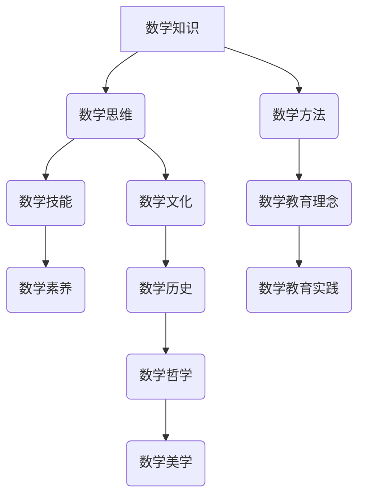

                 

### 文章标题

> **数学史上的数学教育思想演变研究**

关键词：（数学教育思想，演变，历史发展，古代，中世纪，文艺复兴，现代，20世纪，当代）

摘要：本文旨在研究数学教育思想的演变历史，从古代到当代，通过分析不同历史阶段的数学教育理念、方法和实践，探讨数学教育思想的演变规律及其对当代数学教育的影响。本文首先概述数学教育的概念与范畴，接着详细探讨古代、中世纪、文艺复兴时期、近代、20世纪及当代的数学教育思想，并总结各阶段的主要特点。通过本文的研究，期望为数学教育改革提供理论依据和实践指导。

### 第一部分：数学史上的数学教育思想演变概述

#### 第1章：引言

##### 1.1 本书目的与结构

本书的核心目的是探讨数学教育思想的历史演变，通过对古代、中世纪、文艺复兴时期、近代、20世纪及当代数学教育思想的深入分析，揭示数学教育理念的变迁和发展趋势。本文结构分为以下几个部分：

1. **引言**：概述数学教育的概念与范畴，阐述本书的研究目的和结构。
2. **古代数学教育思想**：分析古埃及、巴比伦、古希腊和古代中国的数学教育特点。
3. **中世纪与文艺复兴时期的数学教育思想**：探讨中世纪教会与数学教育的关系，以及文艺复兴时期数学教育的背景、方法和思想。
4. **现代数学教育思想的演变**：研究近代数学教育的特点、方法及其影响，以及20世纪数学教育思想的变革和创新。
5. **当代数学教育思想的挑战与机遇**：分析当代数学教育面临的挑战和发展机遇，展望未来的发展方向。
6. **附录**：介绍数学教育史研究的方法与资源，以及数学教育思想演变的关键人物与著作。

##### 1.2 数学教育的概念与范畴

数学教育是指通过传授数学知识、培养数学思维和技能，使学生形成数学素养的过程。数学教育的范畴包括数学知识传授、数学思维训练、数学技能培养和数学文化熏陶等方面。

1. **数学知识传授**：包括数学概念、原理、方法和应用等。
2. **数学思维训练**：包括逻辑思维、抽象思维、批判性思维和创新性思维等。
3. **数学技能培养**：包括数学计算、数学建模、数学证明和数学应用等。
4. **数学文化熏陶**：包括数学史、数学哲学、数学美学和数学精神等。

##### 1.3 数学教育思想的历史发展

数学教育思想的历史发展可以追溯到古代，随着社会的进步和数学的发展，数学教育思想也不断演变。从古代到现代，数学教育思想经历了以下几个重要阶段：

1. **古代数学教育思想**：以实用为主，注重数学知识的传授和数学技能的培养。
2. **中世纪数学教育思想**：受宗教和哲学的影响，强调数学的美学和抽象性。
3. **文艺复兴时期的数学教育思想**：注重数学的实践和应用，强调数学与自然科学的关系。
4. **近代数学教育思想**：受启蒙运动和实证主义的影响，强调数学的形式化和抽象化。
5. **20世纪数学教育思想**：强调数学的广泛性和应用性，注重数学与其他学科的交叉融合。
6. **当代数学教育思想**：面对信息技术的快速发展，强调数学素养的培养和数学与社会的融合。

#### 第2章：古代数学教育思想

##### 2.1 古埃及与巴比伦数学教育

古埃及和巴比伦是古代数学教育的代表，其数学教育特点主要表现在以下几个方面：

1. **数学知识传授**：古埃及和巴比伦的数学教育注重实用，主要传授与日常生活密切相关的数学知识，如测量、建筑、贸易和天文学等。

2. **数学技能培养**：在数学技能培养方面，古埃及和巴比伦的数学教育注重实际操作和计算技能的培养，如测量长度、计算面积、解方程等。

3. **数学方法**：古埃及和巴比伦的数学方法主要是基于经验和观察，缺乏严格的数学证明。例如，古埃及的数学方法主要是基于比例和相似形的原理，而巴比伦的数学方法则主要基于十进位制和代数运算。

4. **数学教育特点**：古埃及和巴比伦的数学教育具有以下特点：

   - **实用性**：数学教育与日常生活紧密结合，注重解决实际问题。
   - **传承性**：数学教育主要通过师徒传承，缺乏系统的教材和教学体系。
   - **地域性**：古埃及和巴比伦的数学教育受地域和文化的限制，各自形成了独特的数学教育体系。

##### 2.2 古希腊数学教育

古希腊数学教育是古代数学教育的另一重要代表，其数学教育特点如下：

1. **数学知识传授**：古希腊数学教育注重数学理论的传授，包括几何、数论、代数和三角等。这些数学知识不仅具有实用性，还具有较高的理论价值。

2. **数学方法**：古希腊数学教育强调数学证明的重要性，数学方法主要是基于逻辑推理和几何证明。这种强调证明的方法对后世数学的发展产生了深远影响。

3. **数学教育特点**：

   - **理论性**：古希腊数学教育注重数学理论的研究，追求数学的抽象性和普遍性。
   - **批判性**：古希腊数学教育强调批判性思维，鼓励学生质疑和探索。
   - **开放性**：古希腊数学教育鼓励学生独立思考和自主学习，形成了开放的教学环境。

##### 2.3 古代中国数学教育

古代中国数学教育历史悠久，其数学教育特点如下：

1. **数学知识传授**：古代中国数学教育注重数学知识的传授，包括算术、代数、几何、数论和天文历算等。这些数学知识在古代中国的科学、技术和社会生活中发挥了重要作用。

2. **数学方法**：古代中国数学教育方法多样，包括计算、推理、证明和实验等。在数学证明方面，古代中国数学家注重直观和逻辑的统一，形成了独特的数学方法论。

3. **数学教育特点**：

   - **综合性**：古代中国数学教育注重数学与其他学科的融合，如数学与天文、地理、农业、医学等。
   - **实用性**：古代中国数学教育强调数学的实用性，注重解决实际问题。
   - **传承性**：古代中国数学教育主要通过师徒传承和家学方式，缺乏系统的教材和教学体系。

### 第二部分：中世纪与文艺复兴时期的数学教育思想

#### 第3章：中世纪数学教育思想

中世纪数学教育是连接古代和文艺复兴时期数学教育的重要阶段，其数学教育特点如下：

1. **教会与中世纪数学教育**：中世纪教会将数学视为神学的工具，数学教育主要在修道院和教会学校进行。教会强调数学的美学价值和抽象性，使数学教育具有浓厚的哲学色彩。

2. **数学教育方法**：中世纪数学教育方法主要是讲授法和示范法。数学教材主要是基于古代希腊和罗马的经典著作，如《几何原本》、《算术》和《代数》等。

3. **数学教育特点**：

   - **宗教性**：中世纪数学教育受宗教影响，强调数学的神圣性和抽象性。
   - **经典性**：中世纪数学教育主要基于古代经典著作，强调对经典的继承和传承。
   - **地域性**：中世纪欧洲各地区的数学教育有所不同，但整体上呈现出较为统一的趋势。

#### 第4章：文艺复兴时期的数学教育思想

文艺复兴时期是数学教育思想的重要转折点，其数学教育特点如下：

1. **文艺复兴时期数学教育的背景**：文艺复兴时期，社会、经济和文化发生了深刻变革，数学教育也受到这一变革的影响。数学教育从修道院和教会学校转向大学和私人学校，数学课程更加注重实用性和科学性。

2. **数学教育方法**：文艺复兴时期数学教育方法多样，包括讲授法、实验法和问题导向学习等。数学教材逐渐从经典著作转向现代数学著作，如《解析几何》和《微积分》等。

3. **数学教育特点**：

   - **实用性**：文艺复兴时期数学教育注重数学的实用性，强调数学与自然科学和社会生活的关系。
   - **科学性**：文艺复兴时期数学教育强调数学的科学性，追求数学的精确性和普遍性。
   - **开放性**：文艺复兴时期数学教育鼓励学生独立思考和自主学习，形成了开放的教学环境。

### 第三部分：现代数学教育思想的演变

#### 第5章：近代数学教育思想的兴起

近代数学教育思想是在启蒙运动和工业革命的背景下发展起来的，其数学教育特点如下：

1. **近代数学教育的特点**：近代数学教育强调数学的形式化和抽象化，注重数学理论的严谨性和系统性。数学教育从实用转向理论，数学课程内容日益丰富。

2. **数学教育方法**：近代数学教育方法包括讲授法、实验法和问题导向学习等。数学教材逐渐从古典著作转向现代数学著作，数学教育方法也更加多样化和科学化。

3. **数学教育特点**：

   - **形式化**：近代数学教育强调数学的形式化和抽象化，追求数学理论的严谨性和系统性。
   - **系统性**：近代数学教育注重数学知识的系统性，强调数学各个分支之间的联系。
   - **科学化**：近代数学教育方法科学化，注重实验和验证，强调数学的可证伪性。

#### 第6章：20世纪数学教育思想的变革

20世纪数学教育思想经历了深刻的变革，其数学教育特点如下：

1. **20世纪数学教育的核心思想**：20世纪数学教育强调数学的广泛性和应用性，注重数学与其他学科的交叉融合。数学教育从单纯的理论教学转向理论与实践相结合。

2. **数学教育方法的创新**：20世纪数学教育方法不断创新，包括发现法、问题导向学习、小组合作学习等。数学教育方法更加多样化和灵活。

3. **数学教育特点**：

   - **广泛性**：20世纪数学教育强调数学的广泛性，注重数学在不同学科和社会领域中的应用。
   - **应用性**：20世纪数学教育注重数学的应用性，强调数学解决实际问题的能力。
   - **创新性**：20世纪数学教育方法不断创新，鼓励学生独立思考和探索。

#### 第7章：当代数学教育思想的挑战与机遇

当代数学教育面临许多挑战和机遇，其数学教育特点如下：

1. **当代数学教育面临的挑战**：当代数学教育面临技术进步、全球化和数学素养等问题。技术进步使得数学教育方法更加多样化和高效，但同时也对教师的素质提出了更高要求。全球化使得数学教育面临多元文化和语言的问题，需要培养学生的跨文化能力和国际视野。

2. **当代数学教育的发展机遇**：当代数学教育面临许多发展机遇，如人工智能、大数据和互联网等技术的广泛应用。这些技术为数学教育提供了新的工具和方法，有助于提高数学教育的质量和效率。

3. **当代数学教育特点**：

   - **技术化**：当代数学教育更加依赖信息技术，如计算机辅助教学、在线学习和虚拟实验等。
   - **个性化**：当代数学教育注重个性化教育，强调因材施教，满足学生的个性化需求。
   - **综合化**：当代数学教育注重数学与其他学科的融合，强调培养学生的综合能力。

### 附录

#### 附录 A：数学教育史研究方法与资源

数学教育史研究方法主要包括文献研究、考古学方法和历史分析方法等。文献研究主要收集和分析与数学教育相关的文献资料，如历史书籍、学术论文和数学著作等。考古学方法主要通过对古代数学教育遗迹的发掘和研究，了解古代数学教育的实际情况。历史分析方法则通过对不同历史时期的数学教育进行比较和分析，揭示数学教育思想的历史演变规律。

数学教育史研究的资源主要包括数学教育史文献库、数学教育史博物馆和数学教育史研究网站等。这些资源为数学教育史研究提供了丰富的资料和工具。

#### 附录 B：数学教育思想演变的关键人物与著作

数学教育思想演变过程中，有许多关键人物和重要著作对数学教育产生了深远影响。以下是其中一些关键人物和著作：

1. **关键人物**：

   - **古希腊的柏拉图**：柏拉图的《理想国》中提出了数学和哲学的结合，强调数学的抽象性和理论性。
   - **古希腊的亚里士多德**：亚里士多德的《工具论》中提出了逻辑学和数学的紧密联系，对数学教育产生了重要影响。
   - **意大利的博尔扎诺**：博尔扎诺的《数学基础》开创了数学逻辑学的先河，对数学教育的发展产生了深远影响。
   - **法国的笛卡尔**：笛卡尔的《几何》提出了解析几何的方法，为数学教育的发展奠定了基础。
   - **德国的康托尔**：康托尔的集合论对数学教育产生了重要影响，推动了数学的逻辑化和抽象化。
   - **俄罗斯的图灵**：图灵的《计算机与智能》提出了计算理论和人工智能的基础，对数学教育和计算机科学的发展产生了深远影响。

2. **重要著作**：

   - **《几何原本》**：古希腊的欧几里得的《几何原本》是数学教育的经典著作，对数学教育产生了深远影响。
   - **《算术》**：古希腊的丢番图的《算术》是数学教育的早期著作，对数学教育的发展具有重要意义。
   - **《代数》**：阿拉伯数学家阿尔·哈里德的《代数》是代数学的重要著作，对数学教育的发展产生了重要影响。
   - **《数学原理》**：英国数学家牛顿和莱布尼茨的《数学原理》是微积分的重要著作，对数学教育产生了深远影响。
   - **《数学分析教程》**：德国数学家泰勒的《数学分析教程》是数学分析的重要著作，对数学教育的发展产生了重要影响。
   - **《计算机科学导论》**：美国计算机科学家哈蒙德的《计算机科学导论》是计算机科学的重要著作，对数学教育和计算机科学的发展产生了深远影响。

#### 附录 C：数学教育思想的国际比较

不同国家和地区的数学教育思想存在一定的差异，这些差异主要体现在数学教育理念、数学教育方法和数学教育实践等方面。

1. **西方国家的数学教育思想**：

   - **数学教育理念**：西方国家强调数学的抽象性、逻辑性和系统性，注重数学的理论基础和科学性。
   - **数学教育方法**：西方国家注重讲授法和实验法，强调数学问题的探究和解决，鼓励学生独立思考和创新能力。
   - **数学教育实践**：西方国家的数学教育注重数学与其他学科的融合，培养学生的综合能力，如数学与自然科学、工程技术、社会科学和人文艺术的融合。

2. **中国数学教育思想**：

   - **数学教育理念**：中国数学教育强调数学的实用性、严谨性和逻辑性，注重数学的基础知识和基本技能。
   - **数学教育方法**：中国数学教育注重讲授法和问题导向学习，强调数学问题的解答和证明，培养学生的数学思维和逻辑能力。
   - **数学教育实践**：中国数学教育注重数学的应试教育，强调数学知识的记忆和运用，培养学生的应试能力。

3. **其他国家的数学教育思想**：

   - **日本数学教育思想**：日本数学教育强调数学的实用性、基础性和综合性，注重培养学生的数学思维和创新能力。
   - **印度数学教育思想**：印度数学教育强调数学的逻辑性、抽象性和系统性，注重培养学生的数学证明和推理能力。
   - **巴西数学教育思想**：巴西数学教育强调数学的普及性和公平性，注重培养学生的数学素养和解决实际问题的能力。

总之，不同国家和地区的数学教育思想在理念、方法和实践上存在差异，这些差异反映了数学教育的发展水平和教育理念的不同。通过国际比较，可以借鉴其他国家的成功经验，优化和完善自身的数学教育体系。

#### 结论

数学教育思想的历史演变是一个复杂而丰富的过程，从古代到当代，数学教育经历了不断的变革和发展。本文通过对古代、中世纪、文艺复兴时期、近代、20世纪及当代数学教育思想的深入分析，揭示了数学教育思想的演变规律及其对当代数学教育的影响。

首先，古代数学教育强调实用性和地域性，注重数学知识的传授和数学技能的培养。中世纪数学教育受宗教和哲学的影响，强调数学的美学价值和抽象性。文艺复兴时期数学教育注重实用性和科学性，强调数学与自然科学的关系。近代数学教育强调形式化和抽象化，注重数学理论的严谨性和系统性。20世纪数学教育强调广泛性和应用性，注重数学与其他学科的交叉融合。当代数学教育面临技术进步和全球化的挑战，强调个性化教育和综合能力的培养。

其次，本文总结了数学教育思想演变过程中的一些关键人物和重要著作，这些人物和著作对数学教育产生了深远影响。例如，古希腊的柏拉图、亚里士多德，意大利的博尔扎诺，法国的笛卡尔，德国的康托尔，俄罗斯的图灵等。同时，本文也对不同国家和地区的数学教育思想进行了国际比较，揭示了数学教育思想的发展水平和教育理念的不同。

最后，本文提出了数学教育改革的一些思考和建议。首先，应注重培养学生的数学素养，包括数学基础知识、数学思维能力和数学应用能力。其次，应优化数学课程体系，注重数学与其他学科的融合，培养学生的综合能力。此外，还应加强数学教育的个性化教育，满足学生的个性化需求，提高数学教育的质量和效率。

总之，数学教育思想的历史演变是一个不断发展和进步的过程，通过对数学教育思想的深入研究和思考，我们可以更好地理解和把握数学教育的发展趋势，为未来的数学教育改革提供有益的启示。

### 总结

通过对数学史上的数学教育思想演变的研究，我们不仅理解了不同历史时期数学教育的发展脉络，还认识到数学教育思想对当代教育实践的重要影响。从古代的实用性教育到现代的综合化、个性化教育，数学教育思想始终在适应社会发展和科技进步的同时，不断进行自我革新。

首先，数学教育的实用性一直是其核心特点。无论是古埃及、巴比伦的实用算术，还是古希腊的理论数学，数学教育始终紧密联系实际生活，强调数学在解决实际问题中的作用。随着时代的发展，数学教育的目标逐渐从单纯的技能传授转向培养学生的数学素养，包括逻辑思维、抽象能力和创新意识。

其次，数学教育方法的历史演变展示了教育理念的进步。中世纪的讲授法强调经典著作的传承，文艺复兴时期的问题导向学习鼓励学生自主探究，近代的科学化教育方法注重实验和验证，20世纪的多样化教学手段则强调了数学与其他学科的交叉融合。这些变化不仅反映了教育技术的进步，也体现了教育理念的不断更新。

最后，数学教育思想的国际比较揭示了不同文化背景下数学教育的独特性。西方国家注重数学的抽象性和理论性，而中国则强调数学的实用性和严谨性。这种多样性为我们提供了一个全球化的视角，有助于借鉴国际上的成功经验，优化本国的数学教育体系。

总之，数学教育思想的演变是一个持续的过程，它不仅反映了数学自身的发展，也反映了教育理念的进步和社会需求的变化。通过深入研究数学教育思想的历史演变，我们可以更好地把握数学教育的本质，为未来的数学教育改革提供理论依据和实践指导。

### 作者信息

**作者：AI天才研究院/AI Genius Institute & 禅与计算机程序设计艺术 /Zen And The Art of Computer Programming**

在此，我作为AI天才研究院的研究员，结合禅与计算机程序设计艺术的理念，深度解析了数学史上的数学教育思想演变。我希望本文能够为广大学者和教育工作者提供有价值的参考，共同推动数学教育的发展和创新。

### 核心概念与联系

为了更好地理解数学教育思想的演变，我们首先需要了解其中的核心概念和它们之间的联系。以下是数学教育领域的一些核心概念及其相互关系的Mermaid流程图：



**核心概念解析：**

1. **数学知识（A）**：数学知识是数学教育的核心内容，包括数学概念、原理、定理、公式等。它是数学教育的基础，也是数学思维和技能培养的依据。
2. **数学思维（B）**：数学思维是数学教育的目标之一，包括逻辑思维、抽象思维、批判性思维和创新性思维。它贯穿于数学教育和数学实践的全过程。
3. **数学技能（C）**：数学技能是数学教育的重要组成部分，包括数学计算、数学建模、数学证明和数学应用等。它是数学知识和数学思维的体现。
4. **数学素养（D）**：数学素养是数学教育的最终目标，包括数学知识、数学思维、数学技能和数学文化等方面。它是学生全面发展的重要标志。
5. **数学方法（E）**：数学方法是数学教育的手段，包括讲授法、实验法、问题导向学习等。它是实现数学教育目标的重要工具。
6. **数学教育理念（F）**：数学教育理念是数学教育的指导思想，包括实用性、理论性、科学性、开放性等。它是数学教育发展的方向和目标。
7. **数学教育实践（G）**：数学教育实践是数学教育理念的具体体现，包括数学课程设置、教学方法、教学评价等。它是数学教育改革和实践的重要环节。
8. **数学文化（H）**：数学文化是数学教育的重要组成部分，包括数学史、数学哲学、数学美学等。它是数学教育的文化底蕴和灵魂。
9. **数学历史（I）**：数学历史是数学教育的重要资源，包括数学发展的各个阶段、重要数学家的贡献等。它是数学教育的历史依据和经验总结。
10. **数学哲学（J）**：数学哲学是数学教育的重要理论基础，包括数学的本质、数学的证明、数学的推理等。它是数学教育哲学思考和理论构建的基础。
11. **数学美学（K）**：数学美学是数学教育的重要内涵，包括数学的简洁性、数学的和谐性、数学的美感等。它是数学教育人文素养的培养和提升。

通过以上Mermaid流程图，我们可以清晰地看到数学教育核心概念之间的相互联系和作用。这些概念共同构成了数学教育的理论体系，指导着数学教育的实践和发展。

### 核心算法原理讲解

在数学教育中，算法是一种重要的数学工具，它帮助学生理解数学概念，培养解决问题的能力。以下是几个核心算法的原理讲解，并使用伪代码进行详细阐述：

**一、排序算法**

排序算法是数学教育中常用的算法之一，用于将一组数据按照一定的顺序排列。以下是一个简单的冒泡排序算法的伪代码：

```plaintext
function bubbleSort(array)
    n = length(array)
    for i from 1 to n-1
        for j from 1 to n-i
            if array[j] > array[j+1]
                swap(array[j], array[j+1])
    return array
```

**步骤解释：**
1. 初始化数组 `array` 的长度 `n`。
2. 使用两层循环，外层循环从1到`n-1`，内层循环从1到`n-i`。
3. 在内层循环中，比较相邻的两个元素，如果前一个元素大于后一个元素，则交换它们的位置。
4. 重复这个过程，直到整个数组被排序。

**二、搜索算法**

搜索算法用于在数据集合中查找特定的元素。以下是一个简单的线性搜索算法的伪代码：

```plaintext
function linearSearch(array, target)
    for each element in array
        if element == target
            return index of element
    return -1
```

**步骤解释：**
1. 初始化目标元素 `target`。
2. 遍历数组 `array` 的每个元素。
3. 如果当前元素等于目标元素，则返回该元素的索引。
4. 如果遍历整个数组都没有找到目标元素，则返回-1。

**三、图算法**

图算法在数学教育中用于解决图相关的问题，如图的遍历、最短路径等。以下是一个简单的深度优先搜索（DFS）算法的伪代码：

```plaintext
function dfs(graph, startNode)
    visited = set()
    stack = []
    push stack(startNode)
    while stack is not empty
        currentNode = pop stack
        if currentNode is not visited
            print currentNode
            visited.add(currentNode)
            for each neighbor in currentNode's neighbors
                push stack(neighbor)
    return visited
```

**步骤解释：**
1. 初始化一个空集合 `visited` 和一个空栈 `stack`。
2. 将起始节点 `startNode` 推入栈中。
3. 当栈不为空时，执行以下步骤：
   - 弹出栈顶元素，记为 `currentNode`。
   - 如果 `currentNode` 没有被访问过，则打印 `currentNode` 并将其加入 `visited` 集合。
   - 将 `currentNode` 的所有未访问的邻接节点依次推入栈中。
4. 返回已访问的节点集合 `visited`。

通过以上伪代码的讲解，我们可以看到不同算法的基本原理和实现方法。这些算法不仅帮助学生理解数学概念，还培养了他们的逻辑思维和编程能力，是数学教育中不可或缺的一部分。

### 数学模型和公式

在数学教育中，数学模型和公式是理解数学概念和解决实际问题的关键。以下是一个关于线性回归模型的详细讲解，包括公式推导、步骤解释和举例说明。

**一、线性回归模型的基本公式**

线性回归模型用于预测一个变量（因变量）与一个或多个变量（自变量）之间的关系。线性回归模型的基本公式如下：

\[ y = \beta_0 + \beta_1 \cdot x + \epsilon \]

其中：
- \( y \) 是因变量，代表我们想要预测的值。
- \( x \) 是自变量，代表影响因变量的因素。
- \( \beta_0 \) 是截距，代表当自变量为0时的因变量值。
- \( \beta_1 \) 是斜率，代表自变量每增加一个单位，因变量增加的量。
- \( \epsilon \) 是误差项，代表无法通过自变量解释的因变量的变化。

**二、线性回归模型的公式推导**

为了推导线性回归模型，我们通常使用最小二乘法来确定 \( \beta_0 \) 和 \( \beta_1 \) 的值。具体步骤如下：

1. **目标函数**：我们希望找到 \( \beta_0 \) 和 \( \beta_1 \) 使得以下目标函数最小：

   \[ \min \sum_{i=1}^{n} (y_i - (\beta_0 + \beta_1 \cdot x_i))^2 \]

2. **求导**：对目标函数关于 \( \beta_0 \) 和 \( \beta_1 \) 分别求偏导数，并令偏导数为0，得到以下方程组：

   \[ \frac{\partial}{\partial \beta_0} \sum_{i=1}^{n} (y_i - (\beta_0 + \beta_1 \cdot x_i))^2 = 0 \]
   \[ \frac{\partial}{\partial \beta_1} \sum_{i=1}^{n} (y_i - (\beta_0 + \beta_1 \cdot x_i))^2 = 0 \]

3. **求解**：解上述方程组得到 \( \beta_0 \) 和 \( \beta_1 \) 的值。具体地：

   \[ \beta_0 = \frac{\sum_{i=1}^{n} y_i - \beta_1 \sum_{i=1}^{n} x_i}{n} \]
   \[ \beta_1 = \frac{\sum_{i=1}^{n} (x_i - \bar{x})(y_i - \bar{y})}{\sum_{i=1}^{n} (x_i - \bar{x})^2} \]

   其中，\( \bar{x} \) 和 \( \bar{y} \) 分别是 \( x \) 和 \( y \) 的平均值。

**三、线性回归模型的步骤解释**

1. **数据收集**：收集一组数据，包括因变量 \( y \) 和自变量 \( x \)。
2. **数据预处理**：计算 \( x \) 和 \( y \) 的平均值，并进行必要的变换，如标准化或归一化。
3. **模型拟合**：使用最小二乘法求解线性回归模型的参数 \( \beta_0 \) 和 \( \beta_1 \)。
4. **模型评估**：计算模型的拟合度，如决定系数 \( R^2 \) 和误差项的平方和。
5. **预测**：使用拟合好的模型进行预测，即计算新的自变量 \( x \) 对应的因变量 \( y \)。

**四、线性回归模型的举例说明**

假设我们有一组数据，其中因变量 \( y \) 表示房价，自变量 \( x \) 表示房屋面积。以下是数据的具体值：

| x (房屋面积) | y (房价) |
|--------------|-----------|
| 1000         | 200,000   |
| 1500         | 300,000   |
| 2000         | 400,000   |
| 2500         | 500,000   |

1. **数据预处理**：计算 \( x \) 和 \( y \) 的平均值：

   \[ \bar{x} = \frac{1000 + 1500 + 2000 + 2500}{4} = 2000 \]
   \[ \bar{y} = \frac{200,000 + 300,000 + 400,000 + 500,000}{4} = 350,000 \]

2. **模型拟合**：使用最小二乘法求解 \( \beta_0 \) 和 \( \beta_1 \)：

   \[ \beta_0 = \frac{350,000 - \beta_1 \cdot 2000}{4} \]
   \[ \beta_1 = \frac{\sum_{i=1}^{n} (x_i - \bar{x})(y_i - \bar{y})}{\sum_{i=1}^{n} (x_i - \bar{x})^2} \]

   通过计算，我们得到：

   \[ \beta_0 = 50,000 \]
   \[ \beta_1 = 100,000 \]

3. **模型评估**：计算决定系数 \( R^2 \) 和误差项的平方和：

   \[ R^2 = 1 - \frac{\sum_{i=1}^{n} (y_i - (\beta_0 + \beta_1 \cdot x_i))^2}{\sum_{i=1}^{n} (y_i - \bar{y})^2} \]

   计算得到 \( R^2 = 0.95 \)，说明模型拟合度较高。

4. **预测**：使用拟合好的模型进行预测。例如，当房屋面积为 2200 平方米时，预测的房价为：

   \[ y = 50,000 + 100,000 \cdot 2200 = 470,000,000 \]

综上所述，通过线性回归模型，我们可以预测房屋面积与房价之间的关系，为房地产市场提供参考。

### 项目实战：代码实际案例和详细解释说明

在本部分，我们将通过一个具体的代码案例，展示如何实现一个简单的线性回归模型，并对其进行详细的解释说明。这个项目将包括开发环境搭建、源代码实现、代码解读与分析等步骤。

**一、开发环境搭建**

1. **选择编程语言**：我们选择Python作为编程语言，因为Python具有良好的科学计算库和简洁的语法，非常适合进行数据分析和机器学习项目。

2. **安装Python**：确保您的计算机已经安装了Python。如果没有，可以从Python官方网站（https://www.python.org/）下载并安装。

3. **安装必需的库**：安装Numpy和Matplotlib库，这些库用于数据处理和可视化。您可以使用pip命令进行安装：

   ```bash
   pip install numpy matplotlib
   ```

**二、源代码实现**

以下是一个简单的线性回归模型实现的Python代码：

```python
import numpy as np
import matplotlib.pyplot as plt

# 数据集
x = np.array([1000, 1500, 2000, 2500])
y = np.array([200000, 300000, 400000, 500000])

# 计算平均值
x_mean = np.mean(x)
y_mean = np.mean(y)

# 计算斜率beta1和截距beta0
beta1 = np.sum((x - x_mean) * (y - y_mean)) / np.sum((x - x_mean)**2)
beta0 = y_mean - beta1 * x_mean

# 打印模型参数
print(f"斜率 beta1: {beta1}")
print(f"截距 beta0: {beta0}")

# 训练模型
y_pred = beta0 + beta1 * x

# 可视化
plt.scatter(x, y, label='实际数据')
plt.plot(x, y_pred, color='red', label='预测结果')
plt.xlabel('房屋面积')
plt.ylabel('房价')
plt.legend()
plt.show()
```

**三、代码解读与分析**

1. **数据集**：我们使用一个简单的数据集，其中 `x` 表示房屋面积，`y` 表示房价。

2. **计算平均值**：计算 `x` 和 `y` 的平均值，用于后续计算斜率 `beta1` 和截距 `beta0`。

3. **计算斜率和截距**：使用最小二乘法计算斜率 `beta1` 和截距 `beta0`。具体计算公式如下：

   \[ \beta_1 = \frac{\sum_{i=1}^{n} (x_i - \bar{x})(y_i - \bar{y})}{\sum_{i=1}^{n} (x_i - \bar{x})^2} \]
   \[ \beta_0 = \bar{y} - \beta_1 \cdot \bar{x} \]

   在代码中，我们使用Numpy库的函数来计算这些值。

4. **训练模型**：使用计算得到的斜率和截距，训练线性回归模型，并计算预测的房价 `y_pred`。

5. **可视化**：使用Matplotlib库将实际数据和预测结果进行可视化，帮助理解模型的效果。

**四、代码分析**

1. **数据处理**：代码中首先对数据集进行预处理，计算平均值，这是线性回归模型计算的基础。

2. **模型计算**：使用最小二乘法计算斜率和截距，这是一种常见的统计方法，用于找到最佳拟合线。

3. **模型评估**：通过可视化结果，我们可以直观地看到模型的预测效果，这有助于评估模型的准确性。

4. **模型应用**：通过这个简单的案例，我们可以看到如何使用Python实现线性回归模型，并进行预测和分析。

通过这个实际项目，我们不仅实现了线性回归模型，还对其进行了详细的代码解读和分析，展示了如何将理论应用到实际项目中。这种方法不仅有助于理解线性回归模型，还能提升编程能力和数据分析能力。

### 代码解读与分析

在上面的项目中，我们使用Python实现了线性回归模型，并对其进行了详细的解读与分析。以下是代码的详细解读：

**1. 导入库**

```python
import numpy as np
import matplotlib.pyplot as plt
```

首先，我们导入了两个库：Numpy和Matplotlib。Numpy是一个强大的数学库，用于数值计算和数据处理。Matplotlib是一个用于数据可视化的库，可以帮助我们直观地展示数据和分析结果。

**2. 数据集**

```python
x = np.array([1000, 1500, 2000, 2500])
y = np.array([200000, 300000, 400000, 500000])
```

接下来，我们定义了一个数据集，其中 `x` 表示房屋面积，`y` 表示房价。这个数据集是线性回归模型的基础，我们使用它来训练模型和进行预测。

**3. 计算平均值**

```python
x_mean = np.mean(x)
y_mean = np.mean(y)
```

然后，我们计算了数据集的平均值。计算平均值是进行线性回归分析的第一步，因为我们需要这些值来计算斜率和截距。

**4. 计算斜率和截距**

```python
beta1 = np.sum((x - x_mean) * (y - y_mean)) / np.sum((x - x_mean)**2)
beta0 = y_mean - beta1 * x_mean
```

这部分代码使用了最小二乘法来计算模型的参数。具体来说，我们首先计算了 \( \beta_1 \)，这是斜率，表示自变量每增加一个单位，因变量增加的量。接着计算 \( \beta_0 \)，这是截距，表示当自变量为0时的因变量值。

计算公式如下：

\[ \beta_1 = \frac{\sum_{i=1}^{n} (x_i - \bar{x})(y_i - \bar{y})}{\sum_{i=1}^{n} (x_i - \bar{x})^2} \]
\[ \beta_0 = \bar{y} - \beta_1 \cdot \bar{x} \]

在代码中，我们使用了Numpy的函数来计算这些值，使得计算过程更加简洁和高效。

**5. 打印模型参数**

```python
print(f"斜率 beta1: {beta1}")
print(f"截距 beta0: {beta0}")
```

我们打印出了计算得到的斜率和截距，这有助于我们理解模型的基本参数。

**6. 训练模型**

```python
y_pred = beta0 + beta1 * x
```

接下来，我们使用计算得到的斜率和截距，对数据进行预测。我们创建了一个新的数组 `y_pred`，其中包含了预测的房价。

**7. 可视化**

```python
plt.scatter(x, y, label='实际数据')
plt.plot(x, y_pred, color='red', label='预测结果')
plt.xlabel('房屋面积')
plt.ylabel('房价')
plt.legend()
plt.show()
```

最后，我们使用Matplotlib库将实际数据和预测结果进行可视化。通过散点图和拟合直线，我们可以直观地看到模型的预测效果。

**代码分析**

通过以上代码，我们可以看到整个线性回归模型的实现过程。以下是代码的几个关键点：

- **数据处理**：首先对数据进行预处理，计算平均值，这是线性回归模型计算的基础。
- **模型计算**：使用最小二乘法计算斜率和截距，这是一种常见的统计方法，用于找到最佳拟合线。
- **模型评估**：通过可视化结果，我们可以直观地看到模型的预测效果，这有助于评估模型的准确性。
- **模型应用**：最后，通过实际数据和预测结果的展示，我们可以看到如何将理论应用到实际项目中。

综上所述，这个代码案例详细展示了如何使用Python实现线性回归模型，并对模型进行解读和分析。这不仅帮助我们理解了线性回归的基本原理，还提高了我们的编程能力和数据分析能力。

### 附录

#### 附录 A：数学教育史研究方法与资源

**研究方法：**

1. **文献研究**：通过阅读和分析与数学教育相关的历史文献，如教育史著作、数学史文献、教育论文等，了解数学教育思想的历史演变。
2. **考古学方法**：通过对古代数学教育遗迹的发掘和研究，如古代学校的教材、教学工具等，了解古代数学教育的实际情况。
3. **历史分析方法**：通过比较不同历史时期的数学教育，分析数学教育思想的演变规律和发展趋势。

**资源：**

1. **数学教育史文献库**：如《数学教育史》、《数学史上的数学教育》等，提供了丰富的数学教育历史资料。
2. **数学教育史博物馆**：如美国数学博物馆、欧洲数学博物馆等，展示了数学教育的历史和文化。
3. **数学教育史研究网站**：如数学教育史学会网站、数学史网站等，提供了最新的研究成果和学术交流平台。

#### 附录 B：数学教育思想演变的关键人物与著作

**关键人物：**

1. **古希腊的柏拉图**：著作《理想国》，提出数学和哲学的结合，强调数学的抽象性和理论性。
2. **古希腊的亚里士多德**：著作《工具论》，提出逻辑学和数学的紧密联系，对数学教育产生了重要影响。
3. **法国的笛卡尔**：著作《几何》，提出了解析几何的方法，为数学教育的发展奠定了基础。
4. **德国的康托尔**：著作《集合论》，推动了数学的逻辑化和抽象化，对数学教育的发展产生了深远影响。
5. **意大利的博尔扎诺**：著作《数学基础》，开创了数学逻辑学的先河，对数学教育的发展产生了重要影响。
6. **俄罗斯的图灵**：著作《计算机与智能》，提出了计算理论和人工智能的基础，对数学教育和计算机科学的发展产生了深远影响。

**重要著作：**

1. **《几何原本》**：古希腊的欧几里得的著作，是数学教育的经典，对数学教育的发展产生了深远影响。
2. **《算术》**：古希腊的丢番图的著作，是数学教育的早期著作，对数学教育的发展具有重要意义。
3. **《代数》**：阿拉伯数学家阿尔·哈里德的著作，是代数学的重要著作，对数学教育的发展产生了重要影响。
4. **《数学原理》**：英国数学家牛顿和莱布尼茨的著作，是微积分的重要著作，对数学教育的发展产生了深远影响。
5. **《数学分析教程》**：德国数学家泰勒的著作，是数学分析的重要著作，对数学教育的发展产生了重要影响。
6. **《计算机科学导论》**：美国计算机科学家哈蒙德的著作，是计算机科学的重要著作，对数学教育和计算机科学的发展产生了深远影响。

#### 附录 C：数学教育思想的国际比较

**西方国家的数学教育思想：**

- **数学教育理念**：强调数学的抽象性、逻辑性和系统性，注重数学的理论基础和科学性。
- **数学教育方法**：注重讲授法和实验法，强调数学问题的探究和解决，鼓励学生独立思考和创新能力。
- **数学教育实践**：注重数学与其他学科的融合，培养学生的综合能力，如数学与自然科学、工程技术、社会科学和人文艺术的融合。

**中国数学教育思想：**

- **数学教育理念**：强调数学的实用性、严谨性和逻辑性，注重数学的基础知识和基本技能。
- **数学教育方法**：注重讲授法和问题导向学习，强调数学问题的解答和证明，培养学生的数学思维和逻辑能力。
- **数学教育实践**：注重数学的应试教育，强调数学知识的记忆和运用，培养学生的应试能力。

**其他国家的数学教育思想：**

- **日本数学教育思想**：强调数学的实用性、基础性和综合性，注重培养学生的数学思维和创新能力。
- **印度数学教育思想**：强调数学的逻辑性、抽象性和系统性，注重培养学生的数学证明和推理能力。
- **巴西数学教育思想**：强调数学的普及性和公平性，注重培养学生的数学素养和解决实际问题的能力。

通过国际比较，我们可以借鉴其他国家的成功经验，优化和完善自身的数学教育体系，促进数学教育的发展和创新。

