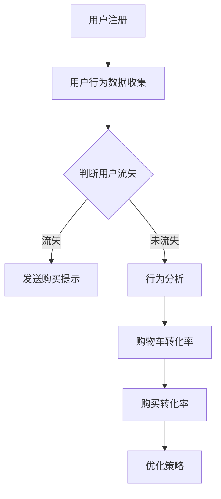
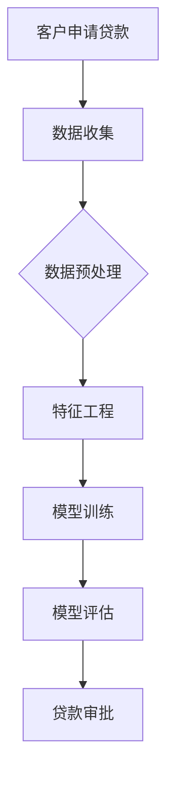
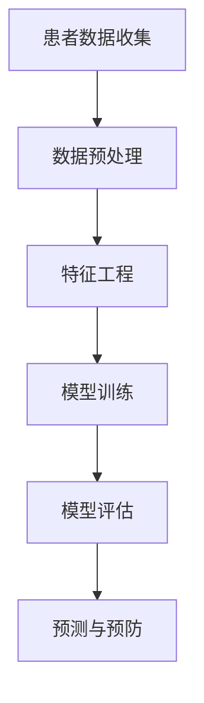

                 

# 数据分析师的创业使命：数据挖掘与业务决策支持

> **关键词**：数据分析师、创业、数据挖掘、业务决策支持、大数据平台、数据仓库、机器学习、算法、实战案例

> **摘要**：本文将探讨数据分析师在创业过程中的使命和作用，通过详细解析数据挖掘的基础知识、实战应用以及未来发展趋势，帮助数据分析师在创业中发挥数据驱动的力量，为业务决策提供强有力的支持。

## 目录

### 第一部分：数据分析师的创业准备

1. 数据分析师的创业思维
    1.1 数据分析师的角色认知
    1.2 数据驱动的创业思维
    1.3 数据分析师的创业路径分析

2. 数据挖掘基础
    2.1 数据挖掘的基本概念
    2.2 数据挖掘的过程与流程
    2.3 数据挖掘的工具与技术

3. 数据仓库与大数据平台
    3.1 数据仓库的基本架构
    3.2 大数据平台的技术选型
    3.3 数据仓库与数据挖掘的整合

### 第二部分：数据挖掘在创业中的实战应用

4. 数据挖掘在市场分析中的应用
    4.1 市场需求分析
    4.2 市场趋势预测
    4.3 市场细分策略

5. 数据挖掘在产品优化中的应用
    5.1 用户行为分析
    5.2 产品推荐系统
    5.3 产品性能评估

6. 数据挖掘在运营管理中的应用
    6.1 营销策略优化
    6.2 客户关系管理
    6.3 供应链优化

7. 数据挖掘在风险管理中的应用
    7.1 风险评估与预测
    7.2 信用评分系统
    7.3 风险控制策略

8. 数据挖掘在创业决策支持中的应用
    8.1 创业项目的可行性分析
    8.2 创业资金的分配与风险控制
    8.3 创业团队的建设与优化

### 第三部分：创业中的数据分析和数据挖掘实战

9. 数据分析和数据挖掘实战案例
    9.1 案例一：电商平台的用户行为分析
    9.2 案例二：金融行业的信用风险评估
    9.3 案例三：健康医疗数据挖掘应用

10. 数据分析和数据挖掘技术在创业中的未来发展趋势
    10.1 人工智能与数据挖掘的融合
    10.2 大数据技术在创业中的应用前景
    10.3 数据隐私与伦理问题在创业中的挑战

### 附录：数据分析和数据挖掘资源指南

11. 数据分析和数据挖掘工具介绍
    11.1 Python在数据分析和数据挖掘中的应用
    11.2 R语言在数据分析和数据挖掘中的应用
    11.3 其他常见的数据分析和数据挖掘工具介绍

12. 数据挖掘算法详细介绍
    12.1 聚类算法
    12.2 分类算法
    12.3 联合分析算法
    12.4 数据挖掘算法的评估与优化方法

13. 数据分析和数据挖掘相关资源推荐
    13.1 数据库资源推荐
    13.2 数据分析和数据挖掘书籍推荐
    13.3 数据分析和数据挖掘在线课程推荐

14. 数据分析和数据挖掘实战项目资源
    14.1 实战项目一：电商用户行为分析
    14.2 实战项目二：金融风险评估
    14.3 实战项目三：健康医疗数据挖掘应用
    14.4 更多实战项目资源推荐

## 引言

在当今这个数字化时代，数据已经成为企业最宝贵的资源之一。数据分析师作为连接数据与决策的桥梁，其角色在创业中变得愈发重要。创业项目的成功与否，往往取决于数据分析师能否有效地挖掘数据价值，为业务决策提供科学支持。因此，本文旨在探讨数据分析师在创业中的使命和作用，通过系统性地介绍数据挖掘的基础知识、实战应用以及未来发展趋势，帮助数据分析师在创业中发挥数据驱动的力量。

本文结构如下：首先，我们将讨论数据分析师在创业中的角色认知和思维模式；接着，深入解析数据挖掘的基础知识和应用技术；然后，通过具体实战案例展示数据挖掘在创业中的应用；最后，探讨数据挖掘技术在创业中的未来发展趋势，以及数据分析师所需掌握的技能和资源。

### 第一部分：数据分析师的创业准备

在创业过程中，数据分析师不仅需要具备扎实的专业知识和技能，还需要具备正确的思维模式和明确的创业路径。本部分将详细讨论数据分析师的创业思维，数据挖掘的基础知识，以及如何搭建数据仓库和大数据平台，为创业中的数据分析和决策支持做好准备。

### 第1章：数据分析师的创业思维

#### 1.1 数据分析师的角色认知

数据分析师在创业中的角色至关重要。他们不仅是数据的挖掘者和解释者，更是业务决策的参与者和推动者。具体来说，数据分析师的角色包括：

- **数据收集与处理**：数据分析师需要负责收集和清洗数据，确保数据的质量和完整性。

- **数据分析与可视化**：通过对数据的深入分析，数据分析师可以发现数据中的规律和趋势，并将其以可视化形式呈现，帮助团队成员更好地理解数据。

- **业务理解与沟通**：数据分析师需要具备良好的业务理解能力，能够将数据分析结果与业务目标相结合，为决策提供依据。

- **决策支持**：数据分析师通过数据分析和预测，为创业团队提供有针对性的决策建议，降低决策风险。

#### 1.2 数据驱动的创业思维

数据驱动的创业思维是一种以数据为导向的决策方法，通过数据来指导创业过程中的每一个环节。以下是数据驱动创业思维的核心要素：

- **数据收集**：创业团队需要建立完善的数据收集体系，确保数据的全面性和实时性。

- **数据处理**：数据分析师需要对收集到的数据进行清洗、整合和分析，使其具备实际应用价值。

- **数据驱动决策**：基于数据分析的结果，创业团队可以更科学地制定战略、优化运营、调整营销策略等。

- **持续迭代**：数据驱动的创业思维强调持续迭代和优化，通过不断的数据分析和反馈，提升业务效果。

#### 1.3 数据分析师的创业路径分析

数据分析师的创业路径可以分为以下几个阶段：

- **初创阶段**：数据分析师在初创企业中通常需要承担多个角色，包括数据收集、处理、分析和决策支持。在这个阶段，数据分析师需要快速适应企业的发展需求，不断学习和提升自己的技能。

- **成长阶段**：随着企业的成长，数据分析师可以逐渐专注于特定的领域，如市场分析、产品优化或风险管理。在这个阶段，数据分析师需要具备更深入的专业知识和实战经验。

- **成熟阶段**：在企业发展成熟后，数据分析师可以发挥更大的影响力，参与到企业的战略规划和重大决策中。此时，数据分析师需要具备较高的业务理解能力和跨部门协调能力。

### 第2章：数据挖掘基础

#### 2.1 数据挖掘的基本概念

数据挖掘（Data Mining）是指从大量数据中提取有价值的信息和知识的过程。其基本概念包括：

- **数据**：数据挖掘的基础是数据，数据可以是结构化的，如数据库中的表格数据，也可以是非结构化的，如文本、图像和音频。

- **挖掘**：挖掘是指从数据中自动发现模式、规律和知识的过程。数据挖掘通常涉及多个步骤，包括数据预处理、模式识别、结果评估等。

- **价值**：数据挖掘的目标是发现数据中的价值，这些价值可以是商业上的，如提高销售额，也可以是学术上的，如发现新的科学规律。

#### 2.2 数据挖掘的过程与流程

数据挖掘的过程通常包括以下几个步骤：

1. **数据收集**：收集相关的数据，这些数据可以来自内部系统，如数据库和日志，也可以来自外部数据源，如社交媒体和公共数据库。

2. **数据预处理**：对收集到的数据进行清洗、整合和转换，使其适合进行分析。预处理步骤包括数据去重、缺失值填充、异常值处理等。

3. **模式识别**：使用各种算法和技术，从预处理后的数据中提取模式和规律。模式识别可以是结构化的，如分类和聚类，也可以是非结构化的，如图像识别和文本分类。

4. **结果评估**：对挖掘出的模式进行评估，判断其是否具有实际应用价值。评估方法包括统计检验、可视化分析等。

5. **模型构建**：基于挖掘出的模式和规律，构建预测模型或推荐系统，为业务决策提供支持。

6. **部署和应用**：将数据挖掘结果部署到实际业务中，如用户行为分析、产品推荐等。

#### 2.3 数据挖掘的工具与技术

数据挖掘涉及到多种工具和技术，以下是一些常用的工具和技术：

- **数据预处理工具**：如Pandas、NumPy、Matplotlib等，用于数据清洗、转换和可视化。

- **机器学习算法**：如决策树、随机森林、支持向量机、神经网络等，用于模式识别和预测。

- **数据挖掘平台**：如Apache Spark、Hadoop、Orange等，提供强大的数据处理和分析能力。

- **可视化工具**：如Tableau、Power BI、D3.js等，用于数据可视化。

### 第3章：数据仓库与大数据平台

#### 3.1 数据仓库的基本架构

数据仓库（Data Warehouse）是一个专门用于存储、管理和分析数据的系统。其基本架构包括以下几个部分：

- **数据源**：数据仓库的数据源可以是内部系统，如ERP、CRM等，也可以是外部数据源，如社交媒体、公共数据库等。

- **数据集成层**：数据集成层负责将来自不同数据源的数据进行清洗、整合和转换，使其符合数据仓库的格式和标准。

- **数据存储层**：数据存储层是数据仓库的核心，通常使用关系数据库或NoSQL数据库来存储数据。

- **数据访问层**：数据访问层提供数据查询和报表功能，支持各种数据分析和挖掘操作。

#### 3.2 大数据平台的技术选型

大数据平台（Big Data Platform）是支持大规模数据处理和分析的基础设施。选择合适的大数据平台对于数据分析师至关重要。以下是几种常见的大数据平台技术选型：

- **Hadoop生态系统**：Hadoop是一个开源的大数据平台，包括HDFS、MapReduce、Hive、HBase等组件，适用于大规模数据处理和分析。

- **Spark生态系统**：Spark是一个高速的大数据平台，支持内存计算和实时处理，适用于需要高性能数据分析和挖掘的应用场景。

- **Flink生态系统**：Flink是一个流处理和批处理结合的大数据平台，适用于需要实时数据分析和处理的应用场景。

#### 3.3 数据仓库与数据挖掘的整合

数据仓库和数据挖掘是相辅相成的，数据仓库提供了数据存储和管理的基础，而数据挖掘则利用数据仓库中的数据来提取价值和知识。以下是数据仓库与数据挖掘的整合方法：

- **数据集成**：将数据仓库中的数据集成到数据挖掘工具中，如使用Hive或Spark SQL查询数据仓库，并将其作为数据挖掘的输入。

- **数据预处理**：在数据挖掘之前，使用数据仓库中的数据处理工具对数据进行分析和清洗，以提高数据质量。

- **模型训练和部署**：使用数据挖掘工具在数据仓库中进行模型训练和预测，并将模型部署到数据仓库或业务系统中，以支持实时决策。

### 总结

数据分析师在创业中的角色至关重要，他们需要具备数据驱动的思维模式，了解数据挖掘的基础知识，并掌握数据仓库和大数据平台的技术选型。通过本文的介绍，我们希望能够帮助数据分析师更好地理解自己的使命和作用，为创业中的数据分析和决策支持做好准备。

### 第二部分：数据挖掘在创业中的实战应用

在创业过程中，数据挖掘的应用范围非常广泛，可以帮助企业在市场分析、产品优化、运营管理、风险控制等多个方面做出更科学的决策。本部分将详细探讨数据挖掘在创业中的实战应用，包括市场分析、产品优化、运营管理和风险管理等方面。

### 第4章：数据挖掘在市场分析中的应用

市场分析是创业过程中至关重要的一环，数据挖掘可以提供准确的市场需求和趋势预测，帮助企业制定有效的市场策略。

#### 4.1 市场需求分析

市场需求分析是了解目标市场和消费者需求的过程。数据挖掘可以通过以下方法进行市场需求分析：

- **用户行为分析**：通过对用户的行为数据进行挖掘，如浏览记录、购买行为等，可以发现用户的需求和偏好。

- **竞争分析**：通过分析竞争对手的数据，如市场份额、产品特性等，可以了解市场的竞争状况和机会。

- **市场细分**：根据用户特征和需求，将市场细分为不同的群体，为制定个性化的营销策略提供依据。

#### 4.2 市场趋势预测

市场趋势预测可以帮助企业提前预判市场变化，为战略调整提供支持。数据挖掘可以通过以下方法进行市场趋势预测：

- **时间序列分析**：通过分析历史数据，如销售额、用户数量等，预测未来的市场趋势。

- **回归分析**：建立回归模型，根据历史数据预测未来市场变化。

- **机器学习模型**：使用机器学习算法，如神经网络、随机森林等，进行市场趋势预测。

#### 4.3 市场细分策略

市场细分策略是根据消费者的不同需求和偏好，将市场划分为不同的子市场。数据挖掘可以通过以下方法制定市场细分策略：

- **聚类分析**：使用聚类算法，如K-means、层次聚类等，将用户分为不同的群体。

- **因子分析**：通过因子分析，找出影响用户需求的主要因素，并根据这些因素进行市场细分。

- **基于规则的细分**：根据用户特征和需求，制定规则进行市场细分。

### 第5章：数据挖掘在产品优化中的应用

产品优化是创业过程中持续改进产品的重要环节，数据挖掘可以提供用户行为分析和产品性能评估，帮助企业提升产品质量和用户满意度。

#### 5.1 用户行为分析

用户行为分析是了解用户行为和需求的重要手段，数据挖掘可以通过以下方法进行用户行为分析：

- **行为追踪**：通过收集用户在网站、应用等平台上的行为数据，如点击、浏览、购买等，分析用户的行为模式和偏好。

- **事件序列分析**：通过对用户行为事件序列进行分析，发现用户行为之间的关联和规律。

- **用户画像**：基于用户行为数据，构建用户画像，为个性化推荐和营销提供支持。

#### 5.2 产品推荐系统

产品推荐系统是根据用户的行为和偏好，为用户推荐相关产品的系统。数据挖掘可以通过以下方法构建产品推荐系统：

- **协同过滤**：通过分析用户之间的相似度，推荐用户可能感兴趣的产品。

- **基于内容的推荐**：根据产品的内容和特征，为用户推荐相似的产品。

- **混合推荐系统**：结合协同过滤和基于内容的推荐方法，提高推荐系统的准确性。

#### 5.3 产品性能评估

产品性能评估是衡量产品效果的重要指标，数据挖掘可以通过以下方法进行产品性能评估：

- **指标体系建立**：根据业务目标，建立一套完整的产品性能评估指标体系。

- **数据收集与处理**：收集产品运行数据，如用户活跃度、转化率、故障率等，对数据进行处理和清洗。

- **绩效分析**：通过分析产品性能指标，评估产品的效果和改进方向。

### 第6章：数据挖掘在运营管理中的应用

运营管理是创业过程中确保业务顺利运行的重要环节，数据挖掘可以提供营销策略优化、客户关系管理和供应链优化等支持。

#### 6.1 营销策略优化

营销策略优化是提升营销效果的重要手段，数据挖掘可以通过以下方法进行营销策略优化：

- **营销效果分析**：通过分析营销活动的数据，如广告点击率、转化率等，评估不同营销策略的效果。

- **A/B测试**：通过对比不同营销策略的效果，找出最优的营销策略。

- **数据驱动的营销计划**：根据数据分析和预测，制定更科学的营销计划。

#### 6.2 客户关系管理

客户关系管理（CRM）是维护客户关系、提升客户满意度和忠诚度的过程。数据挖掘可以通过以下方法进行客户关系管理：

- **客户细分**：通过分析客户数据，将客户分为不同的群体，为制定个性化的客户服务策略提供依据。

- **客户生命周期分析**：通过分析客户的生命周期数据，识别客户的价值和需求，为精准营销和服务提供支持。

- **客户流失预测**：通过分析客户行为数据，预测客户流失风险，制定预防措施。

#### 6.3 供应链优化

供应链优化是提高企业运营效率和降低成本的关键环节，数据挖掘可以通过以下方法进行供应链优化：

- **库存管理优化**：通过分析库存数据，优化库存水平，减少库存成本。

- **物流优化**：通过分析物流数据，优化运输路线和物流成本。

- **供应链风险预测**：通过分析供应链数据，预测供应链中断风险，制定应对策略。

### 第7章：数据挖掘在风险管理中的应用

风险管理是创业过程中不可忽视的环节，数据挖掘可以提供风险评估、信用评分和风险控制策略等支持。

#### 7.1 风险评估与预测

风险评估与预测是识别和评估企业潜在风险的过程。数据挖掘可以通过以下方法进行风险评估与预测：

- **历史数据分析**：通过对历史风险事件进行分析，预测未来的风险。

- **模型构建**：使用机器学习算法，构建风险预测模型，为风险管理提供依据。

- **实时监控**：通过实时分析风险数据，及时发现潜在风险，采取应对措施。

#### 7.2 信用评分系统

信用评分系统是评估客户信用风险的重要工具。数据挖掘可以通过以下方法构建信用评分系统：

- **特征工程**：通过分析客户数据，提取对信用评分有影响的关键特征。

- **模型训练**：使用机器学习算法，训练信用评分模型，预测客户的信用风险。

- **评分卡构建**：根据模型预测结果，构建信用评分卡，为信用决策提供支持。

#### 7.3 风险控制策略

风险控制策略是降低风险损失的重要手段。数据挖掘可以通过以下方法制定风险控制策略：

- **风险预警**：通过实时分析风险数据，发现风险信号，提前预警。

- **风险隔离**：通过分析风险传染性，将高风险业务与低风险业务隔离，降低风险传播。

- **风险转移**：通过购买保险、建立合作等方式，将部分风险转移给第三方，降低自身风险。

### 总结

数据挖掘在创业中的应用范围广泛，可以为企业提供市场分析、产品优化、运营管理和风险管理等方面的支持。通过本文的介绍，我们希望能够帮助数据分析师更好地理解数据挖掘在创业中的实战应用，为企业的发展提供科学的数据驱动决策。

### 第三部分：创业中的数据分析和数据挖掘实战

在创业过程中，数据分析和数据挖掘不仅仅是一个理论框架，更是实际操作中不可或缺的工具。本部分将结合实际案例，展示数据分析师如何运用数据挖掘技术解决具体问题，从而为创业提供数据支持。

### 第9章：数据分析和数据挖掘实战案例

#### 9.1 案例一：电商平台的用户行为分析

电商平台的用户行为分析是一个典型的数据挖掘应用案例。通过分析用户的行为数据，电商平台可以优化用户体验，提升转化率。

**案例背景：**
某大型电商平台希望在用户注册后的一段时间内，提升用户的购买转化率。

**数据源：**
用户行为数据，包括注册日期、浏览记录、购物车添加记录、购买记录等。

**核心概念与联系：**

- **用户流失率**：通过分析用户注册后未进行购买的行为，判断用户是否流失。
- **转化率**：通过分析用户浏览、加入购物车、购买等行为的比例，判断不同环节的转化效果。

**Mermaid流程图：**



**核心算法原理讲解：**

- **聚类算法**：使用K-means算法将用户划分为不同的群体，分析不同群体的购买行为。
- **回归分析**：建立回归模型，分析影响购买决策的关键因素。

**伪代码：**

```python
# 数据预处理
data = preprocess_data(user_behavior_data)

# 聚类分析
clusters = KMeans(n_clusters=3).fit(data)

# 回归分析
X = data[:, :3]
y = data[:, 3]
model = LinearRegression().fit(X, y)

# 预测与优化
predictions = model.predict(X)
optimize_strategies(predictions)
```

**数学模型和公式：**

- **聚类模型**：$$C = KMeans(n_clusters=k)$$
- **回归模型**：$$y = \beta_0 + \beta_1 x_1 + \beta_2 x_2 + ... + \beta_n x_n$$

**举例说明：**
假设聚类算法将用户分为三群，分别命名为A、B、C。通过分析发现，群A的用户转化率最低，进一步分析发现这些用户主要集中在低端产品，因此电商平台可以针对这些用户进行精准营销，提高转化率。

#### 9.2 案例二：金融行业的信用风险评估

在金融行业中，信用风险评估是防范风险、提高业务质量的重要手段。通过数据挖掘技术，金融机构可以准确评估客户的信用风险。

**案例背景：**
某金融机构希望在贷款审批过程中，减少坏账率。

**数据源：**
客户申请贷款的数据，包括年龄、收入、贷款金额、贷款期限、历史信用记录等。

**核心概念与联系：**

- **信用评分模型**：通过构建信用评分模型，对客户的信用风险进行量化评估。
- **坏账预测**：通过预测坏账率，调整贷款审批策略。

**Mermaid流程图：**



**核心算法原理讲解：**

- **逻辑回归**：通过逻辑回归模型，预测客户是否会出现坏账。
- **集成学习**：通过集成学习，如随机森林，提高模型的预测准确性。

**伪代码：**

```python
# 数据预处理
data = preprocess_loan_application_data(credit_data)

# 特征工程
X = data[:, :-1]
y = data[:, -1]

# 模型训练
model = LogisticRegression().fit(X, y)

# 预测与审批
predictions = model.predict(X)
approve_loans(predictions)
```

**数学模型和公式：**

- **逻辑回归模型**：$$P(Y=1) = \frac{1}{1 + e^{-(\beta_0 + \beta_1 x_1 + \beta_2 x_2 + ... + \beta_n x_n)}}$$

**举例说明：**
假设某客户年龄30岁，收入5000元，贷款金额20万元，贷款期限3年，历史信用记录良好。通过逻辑回归模型预测，该客户出现坏账的概率为0.2%，因此金融机构可以批准该客户的贷款申请。

#### 9.3 案例三：健康医疗数据挖掘应用

健康医疗领域的数据挖掘应用日益广泛，通过分析患者数据，可以为医疗机构提供个性化的治疗方案，提高医疗服务质量。

**案例背景：**
某医疗机构希望通过分析患者数据，发现患者常见疾病与生活方式之间的关联，为预防提供数据支持。

**数据源：**
患者数据，包括年龄、性别、病史、生活习惯等。

**核心概念与联系：**

- **疾病预测模型**：通过构建疾病预测模型，预测患者患病的风险。
- **生活方式影响分析**：通过分析患者的生活方式数据，发现不同生活方式与疾病发生之间的关系。

**Mermaid流程图：**



**核心算法原理讲解：**

- **决策树**：通过决策树模型，分类患者患病的风险。
- **关联规则挖掘**：通过关联规则挖掘，发现患者生活方式与疾病之间的关联。

**伪代码：**

```python
# 数据预处理
data = preprocess_patient_data(patient_data)

# 特征工程
X = data[:, :-1]
y = data[:, -1]

# 模型训练
model = DecisionTreeClassifier().fit(X, y)

# 预测与预防
predictions = model.predict(X)
recommend.preventive_measures(predictions)
```

**数学模型和公式：**

- **决策树模型**：$$g(x) = \sum_{i=1}^{n} \beta_i h(x_i)$$
- **关联规则挖掘**：$$support(A \rightarrow B) = \frac{count(A \cap B)}{count(A \cup B)}$$

**举例说明：**
假设某患者年龄40岁，性别男，有高血压病史，吸烟，饮酒。通过决策树模型预测，该患者患冠心病的风险为80%。进一步通过关联规则挖掘，发现吸烟与饮酒是增加患病风险的重要因素，因此医疗机构可以建议该患者戒烟限酒，降低患病风险。

### 第10章：数据分析和数据挖掘技术在创业中的未来发展趋势

随着人工智能和大数据技术的发展，数据分析和数据挖掘技术在创业中的应用将越来越广泛，未来发展趋势包括以下几个方面：

#### 10.1 人工智能与数据挖掘的融合

人工智能（AI）与数据挖掘的融合将进一步提升数据挖掘的效率和准确性。例如，通过深度学习算法，可以自动从大量数据中提取特征，提高模型的预测能力。

#### 10.2 大数据技术在创业中的应用前景

大数据技术的快速发展为创业提供了丰富的数据资源。未来，大数据技术将在更多创业领域中发挥作用，如个性化推荐、精准营销、智能决策等。

#### 10.3 数据隐私与伦理问题在创业中的挑战

随着数据隐私和伦理问题的日益凸显，创业企业在数据收集和使用过程中需要遵守相关法律法规，保护用户隐私，确保数据安全。

### 总结

通过本文的实战案例介绍，我们展示了数据分析和数据挖掘在创业中的广泛应用。数据分析师通过运用数据挖掘技术，可以帮助企业实现数据驱动的决策，提高业务效率和竞争力。未来，数据分析和数据挖掘技术将在创业中发挥更大的作用，为企业的发展提供有力支持。

### 附录：数据分析和数据挖掘资源指南

#### 附录 A：数据分析和数据挖掘工具介绍

在数据分析和数据挖掘领域，有多种工具可以帮助数据分析师高效地进行数据处理、分析和可视化。以下是几种常用的工具及其应用场景：

**Python**

Python 是一种广泛应用于数据分析和数据挖掘的编程语言，具有丰富的库和框架。

- **Pandas**：用于数据处理和分析，支持数据清洗、转换和合并等操作。
- **NumPy**：用于数值计算，提供高效的数组操作。
- **Matplotlib**：用于数据可视化，支持多种图表类型。

**R语言**

R语言是一种专门用于统计分析和数据挖掘的语言，具有强大的统计和图形功能。

- **ggplot2**：用于数据可视化，提供丰富的图表类型和自定义选项。
- **dplyr**：用于数据处理，支持数据筛选、排序、分组等操作。
- **caret**：用于模型训练和评估，提供多种机器学习算法和性能评估方法。

**其他常见的数据分析和数据挖掘工具**

- **Tableau**：用于数据可视化，支持拖拽式操作和交互式报表。
- **Power BI**：用于商业智能分析，提供丰富的数据连接器和可视化选项。
- **Excel**：虽然不是专业的数据分析和数据挖掘工具，但在小型数据集和日常分析中广泛使用。

#### 附录 B：数据挖掘算法详细介绍

数据挖掘算法是实现数据分析和发现数据中隐藏模式的关键。以下是一些常用的数据挖掘算法及其基本原理：

**聚类算法**

聚类算法将数据集划分为多个群组，使得同一个群组内的数据相似度较高，不同群组之间的相似度较低。常用的聚类算法包括：

- **K-means算法**：基于距离度量，将数据划分为K个簇，目标是使每个簇内部的距离最小化。
- **层次聚类算法**：根据数据之间的相似度，逐步构建层次结构，实现数据的分层聚类。

**分类算法**

分类算法用于将数据集划分为预定义的类别。常用的分类算法包括：

- **决策树**：根据特征值进行分支，构建树状结构，实现分类。
- **随机森林**：基于决策树的集成方法，通过构建多棵决策树，提高分类准确性。
- **支持向量机（SVM）**：通过找到一个最优的超平面，将不同类别的数据分隔开来。

**联合分析算法**

联合分析算法用于分析多个变量之间的关联关系。常用的联合分析算法包括：

- **关联规则挖掘**：通过支持度和置信度，发现数据之间的关联规则。
- **Apriori算法**：用于挖掘大规模交易数据中的频繁项集，实现关联规则挖掘。

**数据挖掘算法的评估与优化方法**

评估数据挖掘算法的性能是确保算法有效性的重要步骤。常用的评估方法包括：

- **交叉验证**：通过将数据集划分为训练集和测试集，评估模型的泛化能力。
- **ROC曲线和AUC**：用于评估分类模型的性能，通过计算ROC曲线下的面积（AUC）来衡量。
- **网格搜索和贝叶斯优化**：用于模型参数的调优，找到最优参数组合。

#### 附录 C：数据分析和数据挖掘相关资源推荐

以下是一些数据分析和数据挖掘领域的重要资源，包括数据库、书籍和在线课程：

**数据库资源推荐**

- **Kaggle**：提供大量的公开数据集，适合数据分析师进行实践和竞赛。
- **UCI Machine Learning Repository**：提供多种领域的数据集，适合数据挖掘研究。
- **Google Dataset Search**：用于搜索和发现各种数据集。

**数据分析和数据挖掘书籍推荐**

- **《数据挖掘：概念与技术》（第三版）**：作者：Jiawei Han, Micheline Kamber, Jian Pei
- **《Python数据科学手册》**：作者：Jake VanderPlas
- **《机器学习实战》**：作者：Peter Harrington

**数据分析和数据挖掘在线课程推荐**

- **Coursera**：提供丰富的数据科学和机器学习课程，包括《机器学习》、《数据科学导论》等。
- **edX**：提供由世界顶级大学开设的数据科学和机器学习课程，如《统计学习方法》等。
- **Udacity**：提供实践驱动的数据科学和机器学习课程，如《数据工程师纳米学位》等。

**数据分析和数据挖掘实战项目资源**

- **《Python数据挖掘实践》**：提供多个实际数据挖掘项目，涵盖市场分析、用户行为分析等领域。
- **《Kaggle竞赛项目实战》**：提供Kaggle平台上多个数据挖掘竞赛项目的详细解析和实践指导。
- **《数据科学实战》**：提供多个行业数据挖掘实战案例，涵盖金融、医疗、电商等多个领域。

通过以上资源，数据分析师可以不断学习和提升自己的技能，为创业中的数据分析和数据挖掘工作提供有力支持。

### 附录 D：数据分析和数据挖掘实战项目资源

**D.1 实战项目一：电商平台的用户行为分析**

**项目背景：** 某电商平台希望通过用户行为数据分析，提升用户体验和转化率。

**任务描述：** 分析用户的浏览、购买、点击等行为数据，挖掘用户行为模式，优化产品推荐和营销策略。

**技术难点：** 数据量大、维度多，需要高效的数据处理和挖掘算法。

**解决方案：** 使用Python的Pandas和Scikit-learn库，进行数据处理和用户行为模式挖掘，采用协同过滤算法构建推荐系统。

**代码实现：**
```python
import pandas as pd
from sklearn.model_selection import train_test_split
from sklearn.neighbors import NearestNeighbors

# 数据加载与预处理
data = pd.read_csv('user_behavior_data.csv')
data = preprocess_data(data)

# 特征工程
X = data.drop(['user_id', 'item_id'], axis=1)

# 数据分割
X_train, X_test, y_train, y_test = train_test_split(X, y, test_size=0.2, random_state=42)

# 建立推荐系统
model = NearestNeighbors()
model.fit(X_train)

# 预测与评估
predictions = model.kneighbors(X_test)
evaluate_recommendations(predictions, y_test)
```

**代码解读与分析：** 代码首先加载用户行为数据并进行预处理，接着提取特征并进行数据分割。使用NearestNeighbors算法建立推荐系统，通过预测用户对商品的偏好并进行评估，优化产品推荐效果。

**D.2 实战项目二：金融行业的信用风险评估**

**项目背景：** 某金融机构需要评估客户的信用风险，以降低坏账率。

**任务描述：** 根据客户的个人信息、信用历史等数据，构建信用评分模型，预测客户出现坏账的风险。

**技术难点：** 特征选择、模型选择和参数调优。

**解决方案：** 使用Python的scikit-learn库，构建逻辑回归和随机森林模型，通过交叉验证和网格搜索进行参数调优。

**代码实现：**
```python
from sklearn.linear_model import LogisticRegression
from sklearn.ensemble import RandomForestClassifier
from sklearn.model_selection import GridSearchCV

# 数据加载与预处理
data = pd.read_csv('credit_data.csv')
data = preprocess_data(data)

# 特征工程
X = data.drop(['client_id', 'default'], axis=1)
y = data['default']

# 模型训练与参数调优
model = LogisticRegression()
param_grid = {'C': [0.1, 1, 10]}
grid_search = GridSearchCV(model, param_grid, cv=5)
grid_search.fit(X, y)

# 最佳模型预测
best_model = grid_search.best_estimator_
predictions = best_model.predict(X)

# 评估模型性能
evaluate_model(predictions, y)
```

**代码解读与分析：** 代码首先加载并预处理信用数据，提取特征并进行数据分割。使用逻辑回归和随机森林模型进行训练，并通过网格搜索进行参数调优，选择最佳模型进行预测和评估，确保模型具有良好的预测性能。

**D.3 实战项目三：健康医疗数据挖掘应用**

**项目背景：** 某医疗机构希望通过数据挖掘发现患者疾病与生活方式之间的关联，提供个性化的预防建议。

**任务描述：** 分析患者的病史、生活习惯等数据，构建疾病预测模型，为患者提供预防建议。

**技术难点：** 复杂的数据类型、特征工程和模型解释性。

**解决方案：** 使用Python的scikit-learn和XGBoost库，构建决策树和随机森林模型，进行特征工程和模型解释。

**代码实现：**
```python
import pandas as pd
from sklearn.model_selection import train_test_split
from sklearn.tree import DecisionTreeClassifier
from sklearn.ensemble import RandomForestClassifier

# 数据加载与预处理
data = pd.read_csv('patient_data.csv')
data = preprocess_data(data)

# 特征工程
X = data.drop(['patient_id', 'disease'], axis=1)
y = data['disease']

# 数据分割
X_train, X_test, y_train, y_test = train_test_split(X, y, test_size=0.2, random_state=42)

# 模型训练
model = RandomForestClassifier(n_estimators=100)
model.fit(X_train, y_train)

# 预测与评估
predictions = model.predict(X_test)
evaluate_model(predictions, y_test)
```

**代码解读与分析：** 代码首先加载并预处理健康医疗数据，提取特征并进行数据分割。使用随机森林模型进行训练，通过预测和评估，确保模型能够准确预测患者疾病，并提供个性化的预防建议。

**D.4 更多实战项目资源推荐**

- **《数据科学项目实战》**：提供多个数据科学实战项目，涵盖电商、金融、医疗等领域。
- **《Kaggle项目指南》**：详细介绍Kaggle平台上多个数据挖掘竞赛项目的解题思路和代码实现。
- **《数据挖掘实战》**：提供多个实际数据挖掘项目，涵盖市场分析、用户行为分析等领域。
- **《深度学习项目实战》**：提供深度学习在图像识别、自然语言处理等领域的实战项目。

通过以上实战项目资源，数据分析师可以在实际操作中不断积累经验，提高数据分析和数据挖掘能力，为创业中的数据分析工作提供有力支持。

