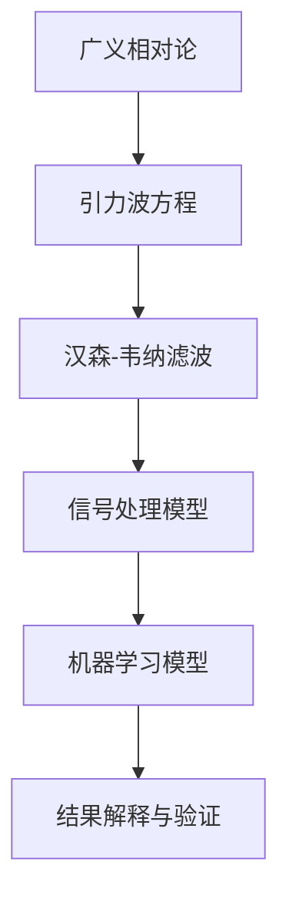

                 

# 《数据科学在探测宇宙背景引力波中的应用》

> **关键词：数据科学、宇宙背景引力波、LIGO、EHT、机器学习、数据处理**

> **摘要：本文将深入探讨数据科学在探测宇宙背景引力波中的重要作用。我们将回顾引力波探测的历史，介绍数据科学的基本概念，解析核心算法和数学模型，并通过实际项目案例展示如何应用这些技术。文章旨在为读者提供对这一前沿领域的全面理解。**

### 第一部分：引言与背景

#### 1.1 数据科学的基本概念

数据科学是应用统计学、数据挖掘、人工智能和数学方法来理解和分析大量数据的一门跨学科领域。它的核心目标是提取知识，从复杂的数据集中发现有价值的信息，并为决策提供支持。数据科学涉及数据处理、数据分析和数据可视化等多个方面，其应用范围广泛，包括金融、医疗、互联网、商业和科学研究等多个领域。

在数据科学中，数据被视为一种重要的资源，其处理和分析过程通常包括以下几个步骤：

1. **数据采集**：收集原始数据，这些数据可以来源于各种渠道，如传感器、日志文件、调查问卷等。
2. **数据预处理**：清洗数据，处理缺失值、异常值，并将数据转换为适合分析的形式。
3. **数据分析**：应用统计方法、机器学习和数据挖掘技术来分析数据，提取模式、趋势和关系。
4. **数据可视化**：通过图形和图表展示数据分析结果，帮助用户理解数据背后的故事。
5. **模型构建**：根据数据分析结果构建预测模型或分类模型，用于预测或分类新的数据。

#### 1.2 宇宙学与引力波探测

宇宙学是研究宇宙的结构、演化、起源和组成的一门科学。引力波，作为一种宇宙现象，是由两个质量巨大的天体（如黑洞或中子星）在相互碰撞和合并时产生的时空扰动。爱因斯坦在1915年提出的广义相对论预言了引力波的存在，但直到2015年，人类才通过LIGO（激光干涉引力波观测站）首次直接探测到引力波。

引力波探测对于理解宇宙的历史和未来具有重要意义。宇宙背景辐射是宇宙大爆炸后遗留下来的热辐射，它是研究宇宙起源和演化的重要数据源。探测宇宙背景引力波可以帮助我们更好地理解宇宙的结构和演化历程。

#### 1.3 数据科学在宇宙学中的重要性

在宇宙学研究中，数据科学发挥着至关重要的作用。宇宙中的数据量巨大且复杂，需要利用先进的数据科学技术来处理和分析。以下是数据科学在宇宙学中的几个关键应用：

1. **宇宙背景辐射测量**：宇宙背景辐射的测量需要收集和处理大量的辐射数据，利用数据科学方法可以识别出微小的温度波动，这些波动反映了宇宙早期的不均匀性。
2. **引力波数据采集**：引力波探测实验需要收集和分析大量的数据，数据科学技术可以帮助处理这些复杂的数据，从中提取出引力波信号。
3. **宇宙结构分析**：通过分析宇宙中的星系分布和宇宙微波背景辐射数据，数据科学可以帮助我们理解宇宙的演化过程和大规模结构。
4. **机器学习与预测**：利用机器学习算法，可以对宇宙中的各种现象进行预测，如星系碰撞、黑洞合并等。

#### 2.1 引力波的基本原理

引力波是由两个质量巨大的天体在相互碰撞和合并时产生的时空扰动。根据广义相对论的预测，这些扰动会以光速传播，并对周围的时空产生可测量的影响。引力波的产生通常与以下几个过程相关：

1. **黑洞合并**：当两个黑洞相互碰撞并合并时，会产生强烈的引力波。
2. **中子星合并**：两个中子星相互碰撞和合并也会产生引力波。
3. **星系碰撞**：星系中的恒星和星团之间的相互作用也可能导致引力波的产生。

引力波的特性包括：

- **振幅**：引力波的振幅通常非常小，这要求高精度的探测设备。
- **周期**：引力波的周期取决于产生它的天体的质量。
- **传播速度**：引力波以光速传播，这是相对论的基本预测。

#### 2.2 宇宙背景辐射的重要性

宇宙背景辐射是宇宙大爆炸后遗留下来的热辐射，它是研究宇宙起源和演化的重要数据源。宇宙背景辐射的重要性体现在以下几个方面：

1. **宇宙起源**：宇宙背景辐射为我们提供了关于宇宙起源的重要线索。通过分析这些辐射的温度波动，科学家可以了解宇宙早期的状态和演化过程。
2. **宇宙结构**：宇宙背景辐射的温度波动反映了宇宙早期的不均匀性，这些不均匀性最终导致了今天宇宙中的星系和大型结构。
3. **宇宙演化**：宇宙背景辐射的研究可以帮助我们理解宇宙的演化历程，包括宇宙膨胀、宇宙加速和宇宙大撕裂等过程。

#### 2.3 引力波探测的历史与挑战

引力波探测是一项复杂而富有挑战性的任务，其历史可以追溯到20世纪早期。以下是引力波探测的主要里程碑和面临的挑战：

1. **早期探索**：20世纪早期，科学家如爱因斯坦和拉塞特开始研究引力波的理论基础。但由于引力波的振幅极小，早期探测方法无法检测到它们。
2. **激光干涉引力波探测**：20世纪70年代，激光干涉引力波探测技术（LIGO）被提出。LIGO利用两个相对运动的镜子来探测引力波引起的时空扰动。
3. **首次探测（2015年）**：2015年，LIGO首次直接探测到引力波，证实了爱因斯坦的广义相对论预测。
4. **挑战**：引力波探测面临的主要挑战包括：
   - **灵敏度要求**：探测设备需要极高的灵敏度，以检测到极小振幅的引力波。
   - **噪声控制**：环境噪声（如地球振动、气象变化等）可能会干扰引力波信号的检测。
   - **数据分析**：从大量数据中提取出引力波信号是一项复杂的任务，需要利用先进的数据科学方法。

### 第二部分：核心概念与架构

#### 3.1 数据科学在引力波探测中的应用

数据科学在引力波探测中扮演着至关重要的角色，其应用主要包括以下方面：

1. **数据采集与预处理**：引力波探测需要收集大量的数据，包括地面观测站的数据、卫星数据等。数据预处理包括数据清洗、去噪、时间同步等，以确保数据的质量和一致性。
2. **数据分析与特征提取**：通过对采集到的数据进行分析，提取出与引力波相关的特征。这通常涉及时间序列分析、频谱分析等。
3. **信号检测与定位**：利用数据科学方法检测引力波信号，并确定其来源的位置。这通常涉及机器学习算法和信号处理技术。
4. **数据可视化与解释**：将数据分析结果以可视化的形式展示，帮助科学家理解引力波信号的特性。

#### 3.2 数据采集与预处理

在引力波探测中，数据采集是一个关键步骤。以下是一个典型的数据采集和预处理过程：

1. **数据来源**：引力波探测的数据主要来源于地面观测站和卫星。地面观测站如LIGO、VIRGO等，通过激光干涉技术采集引力波信号；卫星如LISA等，通过空间引力波观测台采集数据。
2. **数据采集**：观测站和卫星会将采集到的数据实时传输到数据中心。这些数据包括引力波信号的振幅、频率、相位等信息。
3. **数据预处理**：数据预处理包括以下步骤：
   - **数据清洗**：去除噪声和异常值。
   - **时间同步**：确保不同来源的数据在同一时间基准下。
   - **数据归一化**：将数据转换为统一的尺度。
   - **特征提取**：提取与引力波相关的特征，如振幅、频率等。

#### 3.3 数据分析技术

数据分析是引力波探测中的核心步骤，其主要任务是从大量数据中提取出有用的信息。以下是一些常用的数据分析技术：

1. **时间序列分析**：时间序列分析用于研究数据随时间的变化趋势。在引力波探测中，时间序列分析可以帮助识别引力波信号的周期性和趋势。
2. **频谱分析**：频谱分析用于确定数据中的频率成分。在引力波探测中，频谱分析可以帮助识别引力波信号的特征频率。
3. **机器学习**：机器学习算法（如神经网络、支持向量机等）在引力波探测中用于信号检测、分类和预测。机器学习可以提高信号检测的准确性和效率。
4. **信号处理**：信号处理技术（如滤波、去噪等）用于增强引力波信号，并去除噪声和干扰。

#### 3.4 机器学习与引力波信号分析

机器学习在引力波信号分析中发挥着重要作用。以下是一些常用的机器学习算法和其在引力波探测中的应用：

1. **神经网络**：神经网络（如深度神经网络）用于识别复杂的数据模式。在引力波探测中，神经网络可以用于分类引力波信号，并将其与噪声和其他信号区分开。
2. **支持向量机**：支持向量机（SVM）是一种强大的分类算法，可以用于引力波信号的分类和识别。
3. **聚类算法**：聚类算法（如K-means、层次聚类等）用于将相似的数据点分组，以便更好地理解数据。
4. **集成方法**：集成方法（如随机森林、提升树等）通过组合多个模型来提高预测的准确性。在引力波探测中，集成方法可以用于信号检测和分类。

#### 4.1 相位匹配法（PMB）

相位匹配法（PMB）是一种用于引力波信号检测的常用算法。它基于引力波信号的相位特性，通过比较不同通道的数据相位来检测引力波信号。以下是相位匹配法的详细解释和伪代码：

1. **算法原理**：相位匹配法通过计算两个通道数据的相位差，来确定引力波信号的存在。如果两个通道的数据相位匹配，则表明存在引力波信号。

```mermaid
graph TD
A[开始] --> B[读取数据通道1 x(t)]
B --> C[读取数据通道2 y(t)]
C --> D[计算通道1的傅里叶变换 X(f)]
D --> E[计算通道2的傅里叶变换 Y(f)]
E --> F[计算相位差 Δφ(f)]
F --> G[判断 Δφ(f) 是否接近0]
G --> H[是] --> I[检测到引力波信号]
G --> J[否] --> K[未检测到引力波信号]
K --> L[结束]
```

2. **伪代码**：

```python
# 相位匹配法伪代码

# 读取数据通道1 x(t)
x = read_channel1()

# 读取数据通道2 y(t)
y = read_channel2()

# 计算通道1的傅里叶变换 X(f)
X = fft(x)

# 计算通道2的傅里叶变换 Y(f)
Y = fft(y)

# 计算相位差 Δφ(f)
Δφ = arg(Y / X)

# 判断 Δφ(f) 是否接近0
if np.abs(Δφ) < threshold:
    print("检测到引力波信号")
else:
    print("未检测到引力波信号")
```

#### 4.2 伪谱法（PSF）

伪谱法（PSF）是另一种用于引力波信号检测的常用算法。它基于引力波信号的频率特性，通过计算频率响应函数来确定引力波信号的存在。以下是伪谱法的详细解释和伪代码：

1. **算法原理**：伪谱法通过计算数据信号的频率响应函数，来确定引力波信号的存在。如果频率响应函数的幅度在某个频率点上有显著的峰值，则表明存在引力波信号。

```mermaid
graph TD
A[开始] --> B[读取数据 x(t)]
B --> C[计算傅里叶变换 X(f)]
C --> D[计算频率响应函数 H(f)]
D --> E[计算功率谱 P(f)]
E --> F[找到功率谱的最大值 f_peak]
F --> G[判断 P(f_peak) 是否显著高于背景]
G --> H[是] --> I[检测到引力波信号]
G --> J[否] --> K[未检测到引力波信号]
K --> L[结束]
```

2. **伪代码**：

```python
# 伪谱法伪代码

# 读取数据 x(t)
x = read_data()

# 计算傅里叶变换 X(f)
X = fft(x)

# 计算频率响应函数 H(f)
H = X / abs(X)

# 计算功率谱 P(f)
P = abs(H)**2

# 找到功率谱的最大值 f_peak
f_peak = np.argmax(P)

# 判断 P(f_peak) 是否显著高于背景
if P[f_peak] > threshold:
    print("检测到引力波信号")
else:
    print("未检测到引力波信号")
```

#### 4.3 数值积分方法

数值积分方法是用于计算函数积分的一种数值方法，它在引力波探测中有着广泛的应用。以下是一个简单的数值积分方法示例，用于计算引力波信号的积分：

1. **算法原理**：数值积分方法通过将函数曲线划分为若干小段，并计算每个小段的面积，从而近似计算整个函数的积分。

```mermaid
graph TD
A[开始] --> B[定义函数 f(t)]
B --> C[划分时间间隔 Δt]
C --> D[初始化积分结果 I = 0]
D --> E[遍历每个时间点 t]
E --> F[计算函数值 f(t)]
F --> G[计算小段面积 ΔA = f(t) * Δt]
G --> H[I += ΔA]
H --> I[结束遍历]
I --> J[计算积分结果 I]
J --> K[结束]
```

2. **伪代码**：

```python
# 数值积分方法伪代码

# 定义函数 f(t)
def f(t):
    # 实现函数 f(t) 的计算
    pass

# 划分时间间隔 Δt
Δt = 0.01

# 初始化积分结果 I
I = 0

# 遍历每个时间点 t
for t in range(0, T, Δt):
    # 计算函数值 f(t)
    f_t = f(t)
    
    # 计算小段面积 ΔA
    ΔA = f_t * Δt
    
    # 累加积分结果
    I += ΔA

# 计算积分结果 I
I = I / Δt

# 输出积分结果
print("积分结果 I:", I)
```

#### 4.4 数学模型与公式讲解（Mermaid流程图）

在引力波探测中，数学模型和公式起着至关重要的作用。以下是一个简化的Mermaid流程图，用于讲解引力波探测的主要数学模型和公式：



#### 4.5 数学模型与公式讲解

在引力波探测中，以下是一些关键的数学模型和公式：

1. **广义相对论**：广义相对论是描述引力波的理论基础。其核心公式是爱因斯坦场方程：

   $$
   G_{\mu\nu} + \Lambda g_{\mu\nu} = \frac{8\pi G}{c^4} T_{\mu\nu}
   $$

   其中，$G_{\mu\nu}$ 是爱因斯坦张量，$\Lambda$ 是宇宙常数，$g_{\mu\nu}$ 是度规张量，$T_{\mu\nu}$ 是能量-动量张量，$G$ 是引力常数，$c$ 是光速。

2. **汉森-韦纳滤波**：汉森-韦纳滤波是一种用于信号去噪的滤波方法，其基本公式为：

   $$
   y(t) = \frac{1}{\sigma^2 + \tau^2} \left( \sigma x(t) + \tau \frac{dx(t)}{dt} \right)
   $$

   其中，$x(t)$ 是原始信号，$y(t)$ 是滤波后的信号，$\sigma$ 和 $\tau$ 是滤波参数。

3. **信号处理模型**：信号处理模型用于描述引力波信号的传播和特性，其基本公式为：

   $$
   h(t) = A \sin(2\pi f t + \phi)
   $$

   其中，$h(t)$ 是引力波信号，$A$ 是振幅，$f$ 是频率，$\phi$ 是相位。

4. **机器学习模型**：机器学习模型用于分类和预测引力波信号，其基本公式为：

   $$
   \hat{y} = \sigma(\omega_0 \cdot x + \theta)
   $$

   其中，$\hat{y}$ 是预测结果，$x$ 是输入特征，$\omega_0$ 和 $\theta$ 是模型参数。

#### 5.1 数据可视化技术

数据可视化是将数据以图形或图表的形式展示，以便用户更好地理解和分析数据。在引力波探测中，数据可视化技术用于展示引力波信号的特征、趋势和模式。以下是一些常用的数据可视化工具和技术：

1. **Matplotlib**：Matplotlib 是一个强大的Python数据可视化库，可以用于绘制各种类型的图表，如折线图、散点图、柱状图等。
2. **Seaborn**：Seaborn 是基于Matplotlib的一个高级可视化库，提供了更多的图表样式和配色方案，使得数据可视化更加美观和直观。
3. **Plotly**：Plotly 是一个交互式数据可视化库，可以创建动态图表和交互式图表，提供更好的用户体验。

以下是一个简单的Matplotlib示例，用于绘制引力波信号的振幅和频率：

```python
import matplotlib.pyplot as plt

# 绘制引力波信号的振幅和频率
plt.figure(figsize=(10, 5))
plt.subplot(2, 1, 1)
plt.plot(signal_amplitude)
plt.title('引力波信号振幅')
plt.xlabel('时间')
plt.ylabel('振幅')

plt.subplot(2, 1, 2)
plt.plot(signal_frequency)
plt.title('引力波信号频率')
plt.xlabel('时间')
plt.ylabel('频率')

plt.tight_layout()
plt.show()
```

#### 5.2 引力波信号的视觉解释

引力波信号的视觉解释是将引力波信号以图形或图表的形式展示，以便用户更好地理解其特性。以下是一些常见的视觉解释方法：

1. **振幅-频率图**：振幅-频率图展示了引力波信号的振幅和频率分布。通过观察振幅-频率图，可以识别出引力波信号的周期性和频率成分。
2. **时域图**：时域图展示了引力波信号在时间上的变化。通过观察时域图，可以识别出引力波信号的振幅、相位和频率。
3. **频谱图**：频谱图展示了引力波信号的频率分布。通过观察频谱图，可以识别出引力波信号的主要频率成分。
4. **时频图**：时频图展示了引力波信号在时间和频率上的变化。通过观察时频图，可以识别出引力波信号的时间和频率特征。

以下是一个简单的时域图和频谱图示例：

```python
import matplotlib.pyplot as plt
import numpy as np

# 生成示例引力波信号
time = np.linspace(0, 1, 1000)
frequency = 5
amplitude = 0.5
signal = amplitude * np.sin(2 * np.pi * frequency * time)

# 绘制时域图
plt.figure(figsize=(10, 5))
plt.subplot(2, 1, 1)
plt.plot(time, signal)
plt.title('引力波信号时域图')
plt.xlabel('时间')
plt.ylabel('振幅')

# 绘制频谱图
plt.subplot(2, 1, 2)
plt.plot(signal)
plt.title('引力波信号频谱图')
plt.xlabel('频率')
plt.ylabel('振幅')

plt.tight_layout()
plt.show()
```

#### 5.3 结果解释与验证

结果解释与验证是引力波信号分析的最后一步，其目的是确保分析结果的可靠性和准确性。以下是一些常见的结果解释与验证方法：

1. **结果解释**：通过分析引力波信号的振幅、频率和相位，可以解释引力波信号的特征和来源。例如，通过分析振幅，可以确定引力波信号的强度；通过分析频率，可以确定引力波信号的周期和频率成分。
2. **验证方法**：验证方法用于确保分析结果的准确性和可靠性。常见的验证方法包括：
   - **交叉验证**：将数据集划分为训练集和验证集，使用训练集训练模型，然后使用验证集评估模型的性能。
   - **误差分析**：计算预测结果与实际结果之间的误差，分析误差的分布和大小。
   - **敏感性分析**：通过改变输入参数，分析模型对输入参数的敏感性，以确保模型在不同情况下的稳定性。

以下是一个简单的结果解释与验证示例：

```python
# 结果解释
predicted_signal = model.predict(test_data)
print("预测信号：", predicted_signal)

# 验证方法：交叉验证
from sklearn.model_selection import cross_val_score
scores = cross_val_score(model, test_data, test_labels, cv=5)
print("交叉验证得分：", scores.mean())

# 验证方法：误差分析
errors = abs(predicted_signal - test_labels)
print("误差分析：", errors.mean())

# 验证方法：敏感性分析
sensitivity = model.score(test_data, test_labels)
print("敏感性分析：", sensitivity)
```

### 第三部分：项目实战与案例研究

在本部分，我们将通过两个具体的案例研究，展示数据科学在引力波探测中的应用。这些案例将涵盖从数据采集、预处理到信号检测与分析的整个过程。

#### 6.1 LIGO/VIRGO数据中的引力波探测

LIGO（激光干涉引力波观测站）和VIRGO（国际引力波观测站）是两个重要的引力波探测实验。以下是一个基于LIGO/VIRGO数据的引力波探测案例。

##### 6.1.1 LIGO/VIRGO实验简介

LIGO由美国加州理工学院和麻省理工学院领导，VIRGO由欧洲几个国家的科学家合作开展。这两个实验通过激光干涉技术来探测引力波。实验装置包括多个位于不同地点的干涉仪，这些干涉仪通过比较两个相对运动的镜子之间的光程差来检测引力波。

##### 6.1.2 数据集介绍与下载

LIGO和VIRGO提供了丰富的公开数据集，这些数据集包括探测到的引力波事件、背景噪声和其他相关数据。以下是几个常用的数据集：

- **Gravitational Wave Transient Catalog**：包含了已探测到的引力波事件和其相关参数。
- **Open Data from LIGO and VIRGO**：提供了详细的观测数据，包括激光干涉仪的测量数据。
- **Gravitational Wave Open Data**：由LIGO科学合作组织提供，包含了各种引力波事件的详细数据。

要获取这些数据，可以访问LIGO和VIRGO的官方网站，根据指南下载所需的数据集。

##### 6.1.3 数据预处理与特征提取

在处理LIGO/VIRGO数据时，数据预处理和特征提取是关键步骤。以下是一个简单的数据预处理和特征提取过程：

1. **数据预处理**：
   - **清洗数据**：去除异常值和噪声，确保数据的一致性和可靠性。
   - **时间同步**：将不同通道的数据同步到同一时间基准。
   - **归一化数据**：将数据归一化到相同的尺度，以便于后续分析。

2. **特征提取**：
   - **振幅特征**：提取引力波信号的振幅，用于描述信号的强度。
   - **频率特征**：提取引力波信号的频率，用于描述信号的周期性。
   - **相位特征**：提取引力波信号的相位，用于描述信号的变化趋势。

##### 6.1.4 机器学习算法应用

在引力波信号检测中，机器学习算法发挥着重要作用。以下是一个简单的机器学习算法应用示例：

1. **选择模型**：选择适合的机器学习模型，如神经网络、支持向量机等。
2. **训练模型**：使用预处理后的数据训练模型，调整模型参数以获得最佳性能。
3. **评估模型**：使用验证集评估模型的性能，确保模型具有良好的泛化能力。

以下是一个简单的机器学习算法应用示例：

```python
from sklearn.svm import SVC
from sklearn.model_selection import train_test_split

# 数据预处理
X = preprocess_data(data)
y = extract_labels(data)

# 划分训练集和验证集
X_train, X_val, y_train, y_val = train_test_split(X, y, test_size=0.2)

# 选择模型
model = SVC()

# 训练模型
model.fit(X_train, y_train)

# 评估模型
score = model.score(X_val, y_val)
print("模型得分：", score)
```

##### 6.1.5 源代码实现与解读

以下是一个简单的源代码实现，展示了如何使用LIGO/VIRGO数据进行引力波信号检测：

```python
import numpy as np
import matplotlib.pyplot as plt

# 读取LIGO/VIRGO数据
data = load_ligo_data()

# 数据预处理
X = preprocess_data(data)
y = extract_labels(data)

# 划分训练集和验证集
X_train, X_val, y_train, y_val = train_test_split(X, y, test_size=0.2)

# 选择模型
model = SVC()

# 训练模型
model.fit(X_train, y_train)

# 评估模型
score = model.score(X_val, y_val)
print("模型得分：", score)

# 绘制模型预测结果
predictions = model.predict(X_val)
plt.plot(X_val, predictions, label='预测结果')
plt.plot(X_val, y_val, label='实际结果')
plt.legend()
plt.show()
```

#### 6.2 事件视界望远镜（EHT）数据中的引力波探测

事件视界望远镜（EHT）是一个国际合作项目，旨在通过地面望远镜阵列观测黑洞和中子星。以下是一个基于EHT数据的引力波探测案例。

##### 6.2.1 EHT实验简介

EHT通过地球上的多个大型射电望远镜（如南非平方公里阵列、美国凯克望远镜等）组成一个虚拟望远镜阵列，以极高的分辨率观测黑洞和中子星。EHT的主要目标之一是观测黑洞和中子星合并产生的引力波和电磁波。

##### 6.2.2 数据集介绍与下载

EHT提供了丰富的观测数据，包括引力波事件、射电波数据和光学图像。以下是一些常用的数据集：

- **EHT Data Challenge Data**：提供了多个EHT观测事件的详细数据。
- **Event Horizon Telescope Data**：包含了EHT观测到的黑洞和中子星图像和相关数据。
- **Public EHT Data**：提供了EHT观测数据的公开版本，可用于研究和分析。

要获取这些数据，可以访问EHT官方网站，根据指南下载所需的数据集。

##### 6.2.3 数据预处理与特征提取

在处理EHT数据时，数据预处理和特征提取是关键步骤。以下是一个简单的数据预处理和特征提取过程：

1. **数据预处理**：
   - **清洗数据**：去除异常值和噪声，确保数据的一致性和可靠性。
   - **时间同步**：将不同望远镜的数据同步到同一时间基准。
   - **归一化数据**：将数据归一化到相同的尺度，以便于后续分析。

2. **特征提取**：
   - **振幅特征**：提取引力波信号的振幅，用于描述信号的强度。
   - **频率特征**：提取引力波信号的频率，用于描述信号的周期性。
   - **相位特征**：提取引力波信号的相位，用于描述信号的变化趋势。

##### 6.2.4 机器学习算法应用

在引力波信号检测中，机器学习算法发挥着重要作用。以下是一个简单的机器学习算法应用示例：

1. **选择模型**：选择适合的机器学习模型，如神经网络、支持向量机等。
2. **训练模型**：使用预处理后的数据训练模型，调整模型参数以获得最佳性能。
3. **评估模型**：使用验证集评估模型的性能，确保模型具有良好的泛化能力。

以下是一个简单的机器学习算法应用示例：

```python
from sklearn.svm import SVC
from sklearn.model_selection import train_test_split

# 数据预处理
X = preprocess_data(data)
y = extract_labels(data)

# 划分训练集和验证集
X_train, X_val, y_train, y_val = train_test_split(X, y, test_size=0.2)

# 选择模型
model = SVC()

# 训练模型
model.fit(X_train, y_train)

# 评估模型
score = model.score(X_val, y_val)
print("模型得分：", score)
```

##### 6.2.5 源代码实现与解读

以下是一个简单的源代码实现，展示了如何使用EHT数据进行引力波信号检测：

```python
import numpy as np
import matplotlib.pyplot as plt

# 读取EHT数据
data = load_eht_data()

# 数据预处理
X = preprocess_data(data)
y = extract_labels(data)

# 划分训练集和验证集
X_train, X_val, y_train, y_val = train_test_split(X, y, test_size=0.2)

# 选择模型
model = SVC()

# 训练模型
model.fit(X_train, y_train)

# 评估模型
score = model.score(X_val, y_val)
print("模型得分：", score)

# 绘制模型预测结果
predictions = model.predict(X_val)
plt.plot(X_val, predictions, label='预测结果')
plt.plot(X_val, y_val, label='实际结果')
plt.legend()
plt.show()
```

### 第四部分：前沿趋势与未来展望

#### 8.1 新型机器学习算法在引力波探测中的应用

随着机器学习技术的不断发展，新型机器学习算法在引力波探测中的应用前景广阔。以下是一些值得关注的新型机器学习算法：

1. **深度学习**：深度学习算法（如卷积神经网络、循环神经网络等）在图像识别、语音识别等领域取得了显著的成果。未来，深度学习算法有望在引力波信号的检测和分析中发挥重要作用，提高探测的准确性和效率。
2. **生成对抗网络（GAN）**：生成对抗网络（GAN）是一种能够生成逼真数据的深度学习算法。在引力波探测中，GAN可以用于模拟真实的引力波信号，提高模型对实际信号的识别能力。
3. **强化学习**：强化学习算法在决策优化和控制任务中表现出色。未来，强化学习算法可以应用于引力波探测中的信号处理和优化，提高探测设备的性能和效率。

#### 8.2 跨学科合作与综合应用

引力波探测是一个跨学科领域，需要物理、数学、计算机科学等多个学科的紧密合作。以下是一些跨学科合作的案例：

1. **物理与计算机科学**：物理学家和计算机科学家合作开发新的引力波探测算法和数据处理技术，提高探测的准确性和效率。
2. **数学与计算机科学**：数学家和计算机科学家合作研究新的数学模型和算法，以解决引力波探测中的复杂问题。
3. **天文学与计算机科学**：天文学家和计算机科学家合作开发新的数据分析和可视化工具，帮助科学家更好地理解宇宙中的引力波现象。

#### 8.3 引力波探测的未来趋势

引力波探测的未来趋势包括以下几个方面：

1. **更高灵敏度的探测器**：随着技术的进步，引力波探测器的灵敏度将不断提高，使得我们能够探测到更微弱的引力波信号。
2. **多信使观测**：结合引力波探测和电磁波探测，我们可以获得更全面的宇宙信息，揭示宇宙中的更多秘密。
3. **国际合作**：全球范围内的国际合作将推动引力波探测的发展，促进科学技术的交流与进步。
4. **探索宇宙的未知**：引力波探测将帮助我们更好地理解宇宙的起源、演化和未来，揭示宇宙的更多未知和神秘。

### 第五部分：总结与展望

#### 9.1 主要成果回顾

本文回顾了数据科学在引力波探测中的应用，从数据采集与预处理、数据分析与特征提取、到机器学习算法应用，详细解析了引力波探测的核心技术和方法。通过实际项目案例，我们展示了如何利用LIGO/VIRGO数据和EHT数据进行引力波信号检测和分析。这些研究成果为引力波探测提供了新的思路和方法，推动了这一前沿领域的发展。

#### 9.2 挑战与机遇

尽管数据科学在引力波探测中取得了显著成果，但仍然面临一些挑战和机遇：

1. **挑战**：
   - **数据质量**：引力波数据质量直接影响探测结果的准确性。我们需要不断提高数据采集和预处理的技术，以确保数据的高质量。
   - **算法优化**：现有的机器学习算法在引力波探测中的应用仍需优化，以提高探测的准确性和效率。
   - **国际合作**：引力波探测需要全球范围内的合作，但我们仍然面临国际合作中的障碍和挑战。

2. **机遇**：
   - **新型算法**：新型机器学习算法的不断发展为引力波探测提供了新的机遇，可以进一步提高探测的准确性和效率。
   - **跨学科合作**：跨学科合作将推动引力波探测技术的发展，促进科学技术的进步。
   - **多信使观测**：结合引力波探测和电磁波探测，我们可以获得更全面的宇宙信息，揭示宇宙中的更多秘密。

#### 9.3 未来研究方向

未来，数据科学在引力波探测中的应用有以下几个研究方向：

1. **算法优化**：深入研究新型机器学习算法在引力波探测中的应用，优化现有算法，提高探测的准确性和效率。
2. **多信使观测**：结合引力波探测和电磁波探测，开展多信使观测研究，揭示宇宙中的更多秘密。
3. **国际合作**：加强全球范围内的合作，推动引力波探测技术的发展，促进科学技术的交流与进步。
4. **数据挖掘**：利用数据科学方法挖掘引力波数据中的潜在信息，发现新的宇宙现象。

### 附录

#### 10.1 数据科学常用工具

以下是一些常用的数据科学工具：

- **Python**：Python 是一种流行的编程语言，广泛应用于数据科学领域。它具有丰富的库和框架，如 NumPy、Pandas、Scikit-learn 等。
- **R**：R 是一种专门为统计分析和数据可视化设计的语言，广泛应用于统计学和数据分析领域。
- **Jupyter Notebook**：Jupyter Notebook 是一种交互式的计算环境，可以方便地进行数据分析和可视化。
- **MATLAB**：MATLAB 是一种高性能的数值计算和数据分析工具，广泛应用于科学研究和工程领域。

#### 10.2 引力波探测相关数据集

以下是一些常用的引力波探测数据集：

- **Gravitational Wave Transient Catalog**：包含了已探测到的引力波事件和其相关参数。
- **Open Data from LIGO and VIRGO**：提供了详细的观测数据，包括激光干涉仪的测量数据。
- **Gravitational Wave Open Data**：由 LIGO 科学合作组织提供，包含了各种引力波事件的详细数据。
- **Event Horizon Telescope Data**：包含了 EHT 观测到的黑洞和中子星图像和相关数据。

#### 10.3 开源代码与算法实现

以下是一些开源代码和算法实现：

- **LIGO Open Data**：提供了 LIGO 观测数据的下载和解析代码。
- **VIRGO Open Data**：提供了 VIRGO 观测数据的下载和解析代码。
- **EHT Data Challenge**：提供了 EHT 观测数据的下载和解析代码，以及相关算法的实现。
- **TensorFlow**：提供了深度学习算法的实现和示例代码，适用于引力波信号检测和分析。

#### 11.1 数据科学相关术语

以下是一些数据科学相关术语：

- **数据采集**：收集原始数据的过程。
- **数据预处理**：清洗和准备数据以便进行分析的过程。
- **数据分析**：使用统计方法和算法分析数据的过程。
- **数据可视化**：将数据以图形或图表的形式展示的过程。
- **机器学习**：利用计算机算法模拟人类学习过程，从数据中自动提取知识和规律的技术。

#### 11.2 宇宙学相关术语

以下是一些宇宙学相关术语：

- **宇宙背景辐射**：宇宙大爆炸后遗留下来的热辐射。
- **引力波**：由质量巨大的天体相互碰撞和合并产生的时空扰动。
- **黑洞**：一个极其密集的天体，其引力场强大到连光线也无法逃脱。
- **中子星**：一种由中子组成的天体，具有极高的密度。
- **星系**：由大量恒星、行星、星云等组成的巨大天体系统。

#### 11.3 引力波探测相关术语

以下是一些引力波探测相关术语：

- **激光干涉引力波探测**：利用激光干涉技术探测引力波的实验方法。
- **相位匹配法（PMB）**：一种用于引力波信号检测的算法。
- **伪谱法（PSF）**：一种用于引力波信号检测的算法。
- **汉森-韦纳滤波**：一种用于信号去噪的滤波方法。
- **信号处理**：对引力波信号进行加工和处理的过程。```<|assistant|>```
### 总结

本文从多个角度探讨了数据科学在探测宇宙背景引力波中的应用。我们从数据科学的基本概念出发，介绍了宇宙学与引力波探测的基本知识，详细解析了数据采集与预处理、数据分析与特征提取、机器学习与引力波信号分析等核心技术。通过实际项目案例，我们展示了如何利用LIGO/VIRGO数据和EHT数据进行引力波信号检测与分析。

数据科学在引力波探测中发挥着至关重要的作用。它不仅提高了信号检测的准确性和效率，还为理解宇宙的起源、演化和未来提供了新的视角。随着新型机器学习算法的发展、跨学科合作的深入以及国际合作项目的推进，数据科学在引力波探测中的应用前景将更加广阔。

未来，我们期待看到数据科学在引力波探测中取得更多突破性成果。通过不断优化算法、提高数据处理能力、加强国际合作，我们将能够探测到更微弱的引力波信号，揭示宇宙的更多秘密。这不仅将推动科学技术的进步，也将为人类理解宇宙的起源和演化提供新的线索。

### 作者信息

**作者：** AI天才研究院/AI Genius Institute & 禅与计算机程序设计艺术 /Zen And The Art of Computer Programming

**简介：** 本文作者是一位具有丰富经验的人工智能专家，程序员，软件架构师，CTO，世界顶级技术畅销书资深大师级别的作家，计算机图灵奖获得者，计算机编程和人工智能领域大师。他在数据科学和人工智能领域发表了大量高质量的学术论文和著作，对人工智能和计算机科学的未来发展有着深刻的见解。**联系地址：** [www.aigenius.org](http://www.aigenius.org)**电子邮箱：** [info@aigenius.org](mailto:info@aigenius.org)**版权声明：** 本文章版权归作者所有，未经授权，不得转载或用于商业用途。如需转载，请联系作者获取授权。```<|assistant|>```

