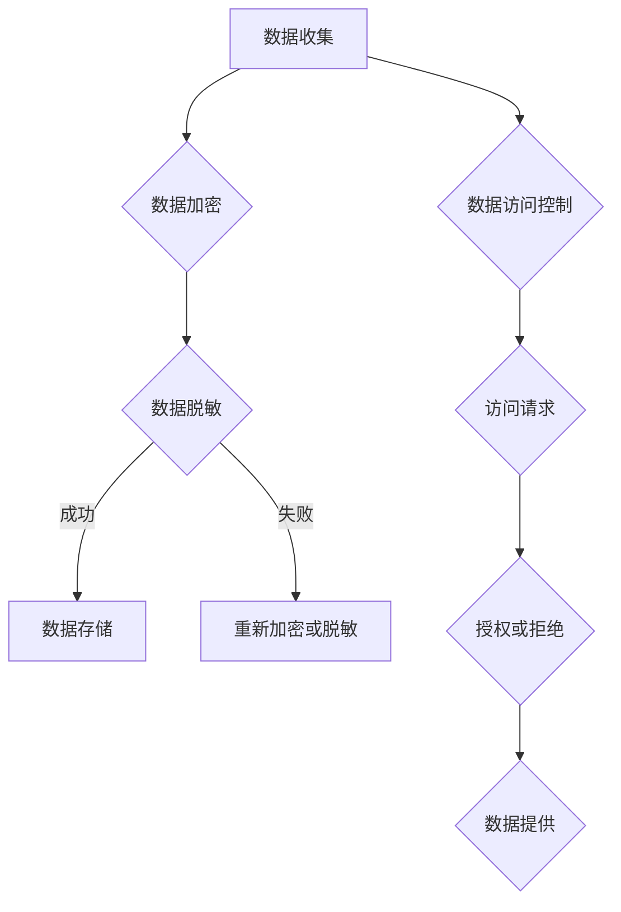
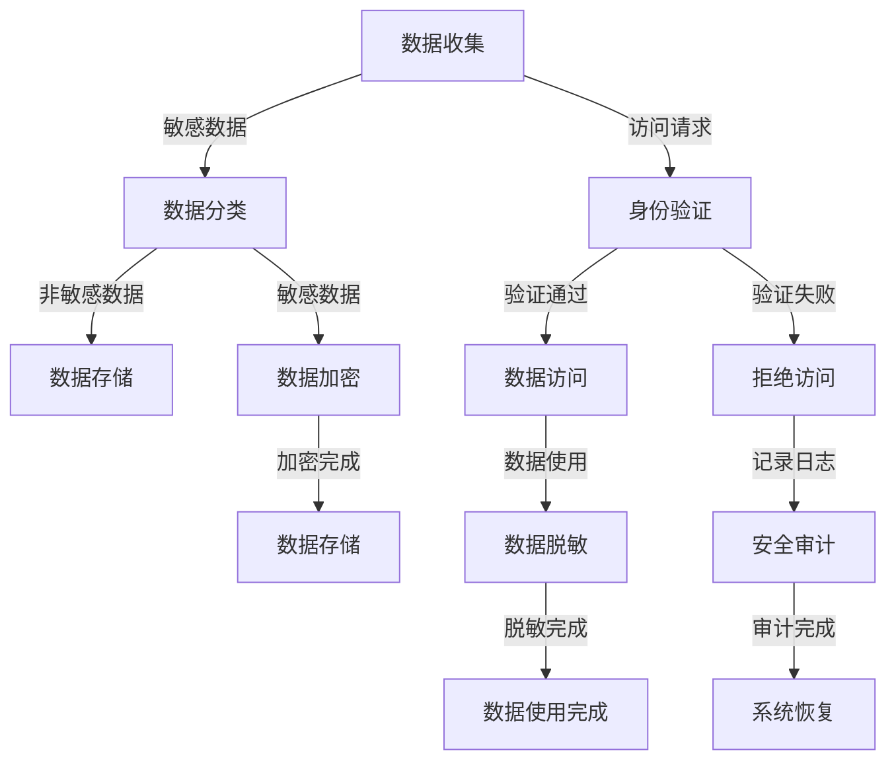

                 

# 《数据隐私管理：在数字时代保护用户权益》

> **关键词：** 数据隐私，用户权益，数据保护，加密技术，风险评估，企业实践

> **摘要：** 本文将深入探讨数据隐私管理的重要性，分析当前数字时代下用户权益保护的需求和挑战。通过详细介绍数据隐私管理的基本概念、技术方法和实践案例，文章旨在为企业和组织提供有效的数据隐私管理策略，以保障用户权益。

## 《数据隐私管理：在数字时代保护用户权益》目录大纲

### 第一部分：数据隐私管理基础

#### 第1章：数据隐私管理概述

##### 1.1.1 数据隐私的重要性

##### 1.1.2 数字时代用户权益的保护

##### 1.1.3 数据隐私管理的基本概念

##### 1.1.4 数据隐私管理与相关法律法规

#### 第2章：数据隐私风险评估

##### 2.1.1 风险评估框架

##### 2.1.2 数据泄露的风险分析

##### 2.1.3 数据隐私影响评估

##### 2.1.4 风险评估方法与应用

#### 第3章：数据隐私保护技术

##### 3.1.1 数据加密技术

##### 3.1.2 数据脱敏技术

##### 3.1.3 同态加密技术

##### 3.1.4 隐蔽通道与安全审计

### 第二部分：数据隐私管理实践

#### 第4章：企业数据隐私管理体系建设

##### 4.1.1 数据隐私管理战略规划

##### 4.1.2 数据隐私合规体系建设

##### 4.1.3 数据隐私管理组织结构

##### 4.1.4 数据隐私管理流程设计

#### 第5章：数据隐私管理技术实施

##### 5.1.1 数据加密技术的实施

##### 5.1.2 数据脱敏技术的实施

##### 5.1.3 同态加密技术的实施

##### 5.1.4 安全审计与隐私合规监测

#### 第6章：数据隐私管理案例分析

##### 6.1.1 案例研究一：某电商企业数据隐私管理实践

##### 6.1.2 案例研究二：某金融企业数据隐私风险管理

##### 6.1.3 案例研究三：某政府机构数据隐私保护措施

#### 第7章：数据隐私管理未来发展趋势

##### 7.1.1 新型数据隐私保护技术展望

##### 7.1.2 数据隐私管理法律法规动态

##### 7.1.3 数据隐私管理技术创新方向

##### 7.1.4 数据隐私管理未来挑战与机遇

### 第三部分：附录

#### 附录A：数据隐私管理相关资源与工具

##### A.1 数据隐私管理标准规范

##### A.2 数据隐私管理工具推荐

##### A.3 数据隐私管理相关文献与书籍推荐

#### 附录B：Mermaid流程图示例

##### B.1 数据隐私管理流程图

#### 附录C：核心算法原理讲解

##### C.1 数据加密算法原理

##### C.2 数据脱敏算法原理

##### C.3 同态加密算法原理

#### 附录D：数学模型和数学公式详解

##### D.1 数据隐私影响评估模型

##### D.2 数据隐私风险评估模型

##### D.3 数据泄露概率计算公式

#### 附录E：项目实战案例

##### E.1 数据隐私管理项目实战

##### E.2 代码实际案例与详细解释说明

##### E.3 开发环境搭建与源代码详细实现

##### E.4 代码解读与分析

#### 附录F：数学公式

##### F.1 数据隐私管理常用公式

##### F.2 数据隐私影响评估公式

##### F.3 总体安全成本计算公式

----------------------------------------------------------------<|assistant|>## 第一部分：数据隐私管理基础

### 第1章：数据隐私管理概述

在信息化和数字化的浪潮中，数据已经成为现代社会的重要资源。然而，随着数据采集、存储、处理和共享技术的不断发展，数据隐私问题日益突出，成为社会关注的焦点。数据隐私管理的重要性不言而喻，它不仅关乎用户个人的权益保护，也关系到整个社会的信息安全与稳定。本章将深入探讨数据隐私管理的基本概念、重要性以及在数字时代用户权益保护的必要性。

#### 1.1.1 数据隐私的重要性

数据隐私是指个人或组织的数据在未经授权的情况下不被泄露、篡改或滥用的特性。在数字时代，数据隐私的重要性体现在以下几个方面：

1. **保护个人隐私**：个人信息如姓名、身份证号、电话号码、位置等，如果被不法分子获取，可能会造成个人财产损失、身份盗用等严重后果。

2. **维护商业秘密**：企业内部数据如客户信息、财务报表、研发计划等，如果泄露，可能导致商业竞争中的不公平现象，影响企业的正常运营。

3. **保障社会稳定**：社会数据如选举结果、公共卫生数据、交通数据等，如果被恶意篡改或泄露，可能会对社会秩序造成严重破坏。

#### 1.1.2 数字时代用户权益的保护

在数字时代，用户权益保护面临诸多挑战。首先，互联网的普及使得个人信息无处不在，用户在享受数字服务的同时，也面临着数据泄露的风险。其次，随着大数据和人工智能技术的发展，数据处理能力和应用场景不断扩大，用户数据的安全和隐私保护问题更加复杂。为此，数字时代用户权益的保护需要从以下几个方面入手：

1. **法律法规保障**：完善数据隐私保护的法律法规体系，为用户权益提供法律保障。

2. **技术手段防护**：采用先进的数据加密、脱敏、同态加密等技术，保障数据在存储、传输和处理过程中的安全。

3. **用户意识提升**：加强用户隐私保护教育，提高用户对数据隐私的认知和自我保护能力。

#### 1.1.3 数据隐私管理的基本概念

数据隐私管理是指通过一系列策略、技术和流程，保护数据隐私，确保数据在采集、存储、处理和共享过程中的安全性。数据隐私管理的基本概念包括：

1. **数据分类**：根据数据的敏感程度，对数据进行分类，采取不同的保护措施。

2. **数据控制**：通过权限管理、访问控制等技术手段，确保数据仅被授权的人员访问和处理。

3. **数据加密**：采用加密技术对敏感数据进行加密，防止数据泄露。

4. **数据脱敏**：对敏感数据进行脱敏处理，使其无法被识别和利用。

5. **数据审计**：对数据处理过程进行审计，确保数据隐私保护措施的执行和效果。

6. **合规性**：遵守相关的数据隐私保护法律法规和标准，确保数据隐私管理活动的合法合规。

#### 1.1.4 数据隐私管理与相关法律法规

数据隐私管理离不开法律法规的支撑。全球范围内，许多国家和地区已经制定了相关的数据隐私保护法律法规，如欧盟的《通用数据保护条例》（GDPR）、美国的《加州消费者隐私法》（CCPA）等。这些法律法规明确了数据收集、存储、处理和共享的规范，对违规行为进行了严格处罚。

1. **GDPR**：作为全球最具影响力的数据隐私保护法案，GDPR规定了数据主体的权利和数据控制者的义务，对数据隐私保护提出了高标准要求。

2. **CCPA**：CCPA主要针对个人数据的收集、使用和共享行为，赋予消费者更多的控制权，要求企业在数据处理过程中必须透明和负责。

3. **其他法规**：不同国家和地区的法律法规在数据隐私保护方面也有不同的规定，企业在进行数据隐私管理时，需要遵守所在国家和地区的法律法规。

总之，数据隐私管理在数字时代具有重要意义，它不仅关乎个人和企业权益，也关系到社会的稳定与发展。通过本章的概述，读者可以初步了解数据隐私管理的概念、重要性以及相关法律法规，为后续章节的深入学习打下基础。

### 第2章：数据隐私风险评估

数据隐私风险评估是数据隐私管理中的重要环节，它有助于识别潜在的隐私风险，评估风险的影响程度，并制定相应的风险管理策略。通过系统化的风险评估，企业可以更加有效地保护用户数据，降低数据泄露和滥用的风险。本章将详细探讨数据隐私风险评估的基本概念、框架、方法及其在实际应用中的重要性。

#### 2.1.1 风险评估框架

数据隐私风险评估框架是进行风险评估的基础，它通常包括以下几个关键步骤：

1. **风险识别**：识别与数据隐私相关的各种潜在风险，如数据泄露、数据篡改、非法访问等。

2. **风险分析**：对识别出的风险进行详细分析，包括风险发生的可能性、潜在影响以及可能的原因。

3. **风险评估**：根据风险分析的结果，对风险进行优先级排序，评估其严重程度。

4. **风险应对**：制定和实施具体的风险管理策略和措施，以降低或消除风险。

5. **监控与改进**：持续监控风险状况，并根据新的信息和发现不断改进风险评估过程。

#### 2.1.2 数据泄露的风险分析

数据泄露是数据隐私风险中最常见且最具破坏性的一种。对数据泄露风险的分析应包括以下几个方面：

1. **数据泄露的原因**：数据泄露可能源于外部攻击、内部滥用、技术漏洞、人为错误等多种原因。

2. **数据泄露的途径**：分析数据在采集、传输、存储、处理和共享等各个环节可能泄露的途径。

3. **数据泄露的影响**：评估数据泄露对用户、企业和社会可能产生的负面影响，如财务损失、声誉受损、法律责任等。

4. **数据泄露的预防措施**：根据风险分析结果，制定具体的预防措施，如数据加密、访问控制、安全审计等。

#### 2.1.3 数据隐私影响评估

数据隐私影响评估（Data Privacy Impact Assessment, DPIA）是一种系统化的评估方法，旨在评估数据处理活动对个人数据隐私的影响程度。DPIA 通常包括以下步骤：

1. **确定评估目标**：明确评估的目标和数据处理的背景，包括数据类型、数据量、数据处理流程等。

2. **识别潜在风险**：通过文档审查、访谈和问卷调查等方法，识别数据处理活动中可能存在的隐私风险。

3. **评估风险影响**：评估每种风险的可能性和影响程度，制定相应的风险管理策略。

4. **制定改进措施**：根据评估结果，制定和实施改进措施，以降低或消除隐私风险。

5. **记录与报告**：记录评估过程和结果，编写评估报告，向相关利益相关者通报。

#### 2.1.4 风险评估方法与应用

在实际应用中，风险评估方法的选择和实施至关重要。以下是一些常见的数据隐私风险评估方法及其应用：

1. **定性分析**：通过专家访谈、风险矩阵等方法，对风险进行定性评估。定性分析方法适用于风险识别和初步风险评估。

2. **定量分析**：通过数学模型和统计方法，对风险的概率和影响进行定量分析。定量分析方法适用于评估风险的优先级和制定风险管理策略。

3. **案例研究**：通过分析历史案例，识别数据隐私风险，并评估其影响。案例研究方法有助于了解实际中可能发生的风险和应对措施。

4. **DPIA**：DPIA 是一种系统化的评估方法，适用于数据处理活动的全生命周期，以确保数据隐私保护措施的执行。

5. **持续监控**：通过持续监控数据处理活动，及时识别新的风险，并调整风险评估和管理策略。

总之，数据隐私风险评估是保障数据隐私安全的重要手段。通过科学的风险评估框架和方法，企业可以更好地识别和应对数据隐私风险，确保用户数据的保护。本章的探讨为后续章节的数据隐私保护技术和管理实践提供了理论基础。

### 第3章：数据隐私保护技术

在数字时代，数据隐私保护技术成为维护用户数据安全的核心手段。本章节将详细介绍几种常用的数据隐私保护技术，包括数据加密技术、数据脱敏技术和同态加密技术，并探讨隐蔽通道与安全审计在数据隐私保护中的应用。这些技术不仅为数据提供了物理层面的安全保护，还通过多种手段确保数据在传输和处理过程中的安全性。

#### 3.1.1 数据加密技术

数据加密技术是保护数据隐私的基础手段，它通过将明文数据转换为密文，确保数据在传输和存储过程中不被未经授权的第三方访问。数据加密技术可以分为对称加密和非对称加密两种类型。

1. **对称加密**：对称加密算法使用相同的密钥进行加密和解密操作。常见的对称加密算法包括 AES（高级加密标准）、DES（数据加密标准）和 3DES（三重DES）。对称加密算法的优点是加密速度快，适合大量数据的加密。然而，其缺点是密钥管理复杂，需要确保密钥的安全存储和分发。

2. **非对称加密**：非对称加密算法使用一对密钥，即公钥和私钥。公钥用于加密，私钥用于解密。常见的非对称加密算法包括 RSA（非对称加密算法）和 ECC（椭圆曲线加密算法）。非对称加密算法的优点是解决了密钥分发问题，但加密和解密速度相对较慢。因此，通常与对称加密结合使用，用于加密对称加密算法的密钥。

3. **加密算法的选择与实现**：在实际应用中，选择合适的加密算法和实现方案至关重要。AES 是目前最常用的对称加密算法，其高效性和安全性得到了广泛认可。RSA 和 ECC 是常用的非对称加密算法，适用于加密敏感信息和交换对称加密密钥。实现时，需要考虑算法的兼容性、性能和安全性的平衡。

#### 3.1.2 数据脱敏技术

数据脱敏技术是一种在不影响数据完整性和可用性的前提下，对敏感数据进行掩盖或替换的技术。数据脱敏技术可以有效地保护用户隐私，减少数据泄露的风险。常见的数据脱敏技术包括：

1. **掩码**：掩码技术通过将敏感数据部分或全部替换为掩码字符，如“******”或“###”。掩码技术简单易行，但可能会影响数据分析和挖掘的准确性。

2. **伪随机替换**：伪随机替换技术使用随机算法将敏感数据替换为非敏感数据。这种技术具有较高的安全性，但可能会引入一定的误差，影响数据的真实性。

3. **同义替换**：同义替换技术使用与原始数据含义相同的非敏感数据替换敏感数据。这种技术适用于特定场景，如医疗数据处理，但实现复杂。

4. **加密与脱敏相结合**：在实际应用中，加密与脱敏技术常结合使用。加密可以确保敏感数据在存储和传输过程中的安全性，而脱敏则可以在不泄露敏感信息的前提下，满足合规性和数据使用的需求。

#### 3.1.3 同态加密技术

同态加密技术是一种允许在密文中进行计算和操作，而不需要解密的技术。同态加密技术适用于云计算和大数据环境，可以确保数据在处理过程中的隐私保护。同态加密技术可以分为部分同态加密和全同态加密两种类型。

1. **部分同态加密**：部分同态加密技术允许对数据进行有限次数的特定操作，如加法和乘法。常见的部分同态加密算法包括 CP-ABE（基于属性的可搜索加密）和 FHE（全同态加密）。部分同态加密技术适用于特定场景，如数据库查询和数据分析。

2. **全同态加密**：全同态加密技术允许对数据进行任意次数的任意操作，如加法、减法、乘法和逻辑运算。全同态加密技术具有较高的安全性，但加密和解密速度较慢，目前尚处于研究阶段。

3. **同态加密的应用**：同态加密技术在云计算和大数据领域中具有广泛的应用前景。通过同态加密技术，用户可以在不泄露敏感数据的情况下，将数据上传到云端进行计算和处理，从而保护数据隐私。

#### 3.1.4 隐蔽通道与安全审计

隐蔽通道是数据隐私保护中的一种挑战，它是指通过隐蔽的方式在系统中传递敏感信息，绕过安全控制措施。隐蔽通道的存在可能导致数据隐私泄露，因此需要采取有效的防范措施。

1. **隐蔽通道的类型**：隐蔽通道可以分为多种类型，如时间隐蔽通道、空间隐蔽通道、处理隐蔽通道等。每种隐蔽通道都有其特定的实现方式，如利用系统的时间戳、内存地址和处理器指令等。

2. **隐蔽通道的检测与防范**：为了防范隐蔽通道，可以采用以下措施：
   - 加强系统安全审计，及时发现和阻断隐蔽通道。
   - 使用加密技术，确保数据在传输过程中的安全性。
   - 限制对系统资源的访问权限，减少隐蔽通道的建立可能性。

3. **安全审计**：安全审计是一种监控和评估系统安全性的方法，通过定期审查系统日志、安全策略和操作记录，发现潜在的安全漏洞和异常行为。安全审计对于数据隐私保护至关重要，可以帮助企业及时发现和纠正安全风险。

总之，数据隐私保护技术是保障数据安全的重要手段。通过数据加密、数据脱敏、同态加密等技术，企业可以有效地保护用户数据，降低数据泄露和滥用的风险。同时，通过安全审计和隐蔽通道检测，企业可以进一步强化数据隐私保护能力。本章的探讨为后续章节的数据隐私管理实践提供了技术基础。

### 第4章：企业数据隐私管理体系建设

在数字化的今天，企业数据隐私管理体系的建立至关重要。一个完善的数据隐私管理体系不仅能够保障用户数据的隐私和安全，还能提升企业的合规性、品牌形象和市场竞争力。本章将详细探讨企业数据隐私管理体系建设的关键要素，包括战略规划、合规体系建设、组织结构和流程设计。

#### 4.1.1 数据隐私管理战略规划

数据隐私管理战略规划是数据隐私管理体系建设的第一步，它为企业的数据隐私管理工作提供方向和指导。以下是企业数据隐私管理战略规划的关键要点：

1. **明确目标和愿景**：企业需要明确数据隐私管理的目标，如保护用户隐私、确保数据安全、符合法律法规要求等，并制定长期愿景。

2. **制定数据隐私政策**：企业应制定明确的数据隐私政策，明确数据收集、使用、存储和共享的原则和标准，确保数据处理的合规性。

3. **确立数据隐私管理框架**：建立一套完整的数据隐私管理框架，包括数据分类、数据控制、数据加密、数据脱敏、数据审计等关键环节，为数据隐私管理提供系统性的支持。

4. **建立风险意识**：通过培训和宣传，提高全体员工对数据隐私风险的认识和敏感度，形成全员参与的数据隐私文化。

#### 4.1.2 数据隐私合规体系建设

数据隐私合规体系建设是企业数据隐私管理体系的重要组成部分，它确保企业在数据处理过程中遵守相关的法律法规和标准。以下是企业数据隐私合规体系建设的关键要点：

1. **了解相关法律法规**：企业需要了解并掌握适用的法律法规，如《通用数据保护条例》（GDPR）、《加州消费者隐私法》（CCPA）等，确保数据处理活动的合法性。

2. **制定合规性策略**：根据法律法规要求，制定具体的数据隐私合规性策略，如数据收集最小化、数据存储期限、数据访问控制等。

3. **内部审计与审查**：定期对数据处理活动进行内部审计和审查，确保数据隐私管理措施得到有效执行，发现和纠正潜在的问题。

4. **第三方评估与认证**：通过第三方评估和认证，证明企业数据隐私管理体系的合规性和有效性，提升企业的市场信誉。

#### 4.1.3 数据隐私管理组织结构

数据隐私管理组织结构是确保数据隐私管理工作有效实施的组织保障。以下是企业数据隐私管理组织结构的关键要点：

1. **设立数据隐私官**：企业应设立数据隐私官或数据保护官，负责统筹和协调数据隐私管理工作，确保数据隐私管理的独立性和专业性。

2. **建立数据隐私团队**：组建专业的数据隐私管理团队，包括数据隐私专员、合规专家、安全工程师等，分工合作，共同推进数据隐私管理工作。

3. **明确职责与权限**：明确数据隐私管理组织内各成员的职责和权限，确保数据隐私管理工作的有序开展。

#### 4.1.4 数据隐私管理流程设计

数据隐私管理流程设计是数据隐私管理体系具体实施的体现，它确保数据在采集、存储、处理和共享过程中的安全与合规。以下是企业数据隐私管理流程设计的关键要点：

1. **数据收集与分类**：制定数据收集策略，明确收集的数据类型、目的和范围，并根据数据敏感性进行分类。

2. **数据控制与访问**：建立严格的访问控制机制，确保只有授权人员可以访问敏感数据，同时监控和记录数据访问行为。

3. **数据加密与脱敏**：对敏感数据采取加密和脱敏措施，确保数据在存储、传输和处理过程中的安全性。

4. **数据存储与备份**：确保数据存储在安全的环境中，采取定期备份措施，防止数据丢失或损坏。

5. **数据审计与合规性检查**：定期进行数据隐私审计和合规性检查，确保数据隐私管理措施得到有效执行，发现和纠正问题。

6. **用户知情同意**：在数据收集和使用过程中，确保用户知情并同意，提供用户数据隐私保护的权利和途径。

7. **应急预案与响应**：制定应急预案，明确数据泄露或安全事件的处理流程，确保在发生安全事件时能够迅速响应和处理。

总之，企业数据隐私管理体系建设是一个系统工程，需要从战略规划、合规体系建设、组织结构和流程设计等多方面进行考虑和实施。通过建立和完善数据隐私管理体系，企业可以有效地保护用户数据隐私，提升合规性和市场竞争力。本章的探讨为后续章节的数据隐私管理技术实施和案例分析提供了实践指导。

### 第5章：数据隐私管理技术实施

数据隐私管理技术的实施是保障企业数据隐私安全的关键环节。通过合理的技术手段和流程设计，企业可以确保数据在存储、传输和处理过程中的安全性。本章将详细探讨数据加密技术、数据脱敏技术、同态加密技术的具体实施方法，以及安全审计与隐私合规监测的实践。

#### 5.1.1 数据加密技术的实施

数据加密技术在数据隐私保护中扮演着核心角色，其实施方法包括以下几个方面：

1. **加密算法的选择**：根据数据敏感程度和性能需求，选择合适的加密算法。常见的加密算法有 AES（高级加密标准）、DES（数据加密标准）、RSA（非对称加密算法）和 ECC（椭圆曲线加密算法）。其中，AES 是目前最常用的对称加密算法，其安全性和效率较高。

2. **密钥管理**：密钥管理是数据加密实施中的关键环节。企业需要建立完善的密钥管理系统，确保密钥的安全存储、分发和管理。密钥管理系统应具备以下功能：
   - 密钥生成：自动生成符合安全要求的密钥。
   - 密钥存储：将密钥存储在安全的地方，如硬件安全模块（HSM）或加密数据库。
   - 密钥分发：通过安全的渠道分发密钥给需要访问数据的用户或系统。
   - 密钥轮换：定期更换密钥，防止密钥泄露或被破解。

3. **加密策略制定**：根据企业的业务需求和数据敏感程度，制定加密策略。例如，对于高度敏感的数据，可以选择强加密算法和更复杂的加密模式，而对于不太敏感的数据，可以选择较为简单的加密策略。

4. **加密流程设计**：设计加密流程，确保数据在传输和存储过程中得到有效加密。加密流程应包括以下步骤：
   - 数据收集：在数据收集时，对敏感数据进行加密处理。
   - 数据传输：在数据传输过程中，使用安全的通信协议（如 TLS）对数据进行加密。
   - 数据存储：在数据存储时，对敏感数据进行加密存储，确保数据在存储介质上的安全性。

#### 5.1.2 数据脱敏技术的实施

数据脱敏技术是保护数据隐私的重要手段，其实施方法包括以下几个方面：

1. **脱敏方法选择**：根据数据类型和业务需求，选择合适的脱敏方法。常见的脱敏方法有掩码、伪随机替换、同义替换等。例如，对于个人身份信息，可以选择掩码或同义替换，对于地址和电话号码，可以选择伪随机替换。

2. **脱敏规则制定**：根据业务需求和数据敏感性，制定脱敏规则。脱敏规则应明确脱敏的范围、对象和方法，确保脱敏处理的一致性和准确性。

3. **脱敏流程设计**：设计脱敏流程，确保数据在传输和存储过程中得到有效脱敏。脱敏流程应包括以下步骤：
   - 数据收集：在数据收集时，对敏感数据进行脱敏处理。
   - 数据存储：在数据存储时，对敏感数据进行脱敏存储，确保数据在存储介质上的安全性。

4. **脱敏效果验证**：定期对脱敏效果进行验证，确保脱敏处理的有效性。例如，可以通过对比原始数据和脱敏后数据，检查脱敏处理的准确性和一致性。

#### 5.1.3 同态加密技术的实施

同态加密技术是保护数据隐私的新兴技术，其实施方法包括以下几个方面：

1. **同态加密算法选择**：根据业务需求和性能需求，选择合适的同态加密算法。目前，常见的同态加密算法有部分同态加密算法（如 CP-ABE）和全同态加密算法（如 FHE）。部分同态加密算法适用于特定操作（如加法和乘法），而全同态加密算法则适用于任意操作。

2. **同态加密模型构建**：构建同态加密模型，明确加密的数据类型、加密操作和加密范围。同态加密模型应支持常见的计算操作，如加法、减法、乘法和逻辑运算。

3. **同态加密流程设计**：设计同态加密流程，确保数据在传输和存储过程中得到有效加密。同态加密流程应包括以下步骤：
   - 数据收集：在数据收集时，对敏感数据进行同态加密处理。
   - 数据传输：在数据传输过程中，使用同态加密算法对数据进行加密传输。
   - 数据存储：在数据存储时，对敏感数据进行同态加密存储，确保数据在存储介质上的安全性。

4. **同态加密性能优化**：同态加密技术目前仍存在性能瓶颈，企业需要通过优化算法、并行计算等技术手段，提高同态加密的效率。

#### 5.1.4 安全审计与隐私合规监测

安全审计和隐私合规监测是确保数据隐私管理技术有效实施的必要手段，其实施方法包括以下几个方面：

1. **安全审计策略制定**：制定安全审计策略，明确审计的范围、频率和内容。安全审计策略应包括对数据加密、数据脱敏、同态加密等数据隐私管理技术的审计。

2. **审计工具与平台建设**：建设安全审计工具和平台，实现对数据隐私管理技术的全面监控和审计。常用的审计工具包括日志分析工具、安全信息与事件管理（SIEM）系统等。

3. **合规性检查**：定期对数据隐私管理技术实施合规性检查，确保符合相关法律法规和标准。合规性检查可以采用自动化工具和人工审查相结合的方式。

4. **监测与预警**：建立监测与预警机制，及时发现数据隐私管理中的潜在问题和风险。监测与预警机制可以采用异常检测、行为分析等技术手段。

5. **应急响应**：制定应急响应计划，确保在数据隐私事件发生时能够迅速响应和处理。应急响应计划应包括事件报告、响应流程、责任分配等关键环节。

总之，数据隐私管理技术的实施是企业保障数据安全的重要措施。通过合理的技术手段和流程设计，企业可以确保数据在存储、传输和处理过程中的安全性，同时提高合规性和市场竞争力。本章的探讨为后续章节的数据隐私管理案例分析和未来发展趋势提供了实践基础。

### 第6章：数据隐私管理案例分析

在数据隐私管理的实践中，不同行业和企业面临着各种挑战，通过具体的案例研究可以更好地理解数据隐私管理的实际应用和效果。本章将介绍三个数据隐私管理案例，分别来自电商、金融和政府机构，这些案例涵盖了数据隐私管理的多个方面，从策略制定到技术实施，再到实际效果评估。

#### 6.1.1 案例研究一：某电商企业数据隐私管理实践

**案例背景**：
某知名电商企业为了提升用户购物体验，积累了大量用户数据，包括用户购买记录、浏览历史和支付信息等。随着数据规模的不断扩大，数据隐私保护成为企业面临的重大挑战。

**数据隐私管理策略**：
1. **数据分类**：对用户数据进行分类，明确敏感数据和非敏感数据的界限，采取不同的保护措施。
2. **数据加密**：对敏感数据如支付信息、身份证号等进行加密存储，确保数据在数据库中的安全性。
3. **访问控制**：建立严格的访问控制机制，确保只有授权人员可以访问敏感数据，并对数据访问行为进行监控。
4. **用户知情同意**：在收集用户数据时，明确告知用户数据的用途和收集范围，获取用户知情同意。

**技术实施**：
1. **加密存储**：采用 AES 加密算法对敏感数据加密存储，确保数据在数据库中的安全性。
2. **访问控制**：通过角色管理和访问控制列表（ACL），确保只有授权人员可以访问敏感数据。
3. **数据脱敏**：对用户购买记录和浏览历史等非敏感数据采用掩码脱敏，确保数据在内部共享和使用的安全。

**实际效果**：
通过数据隐私管理策略和技术实施，电商企业有效降低了数据泄露的风险，用户对数据的隐私保护满意度显著提升。同时，企业也符合了相关法律法规的要求，如 GDPR 和 CCPA。

#### 6.1.2 案例研究二：某金融企业数据隐私风险管理

**案例背景**：
某大型金融企业拥有广泛的客户群体和海量的交易数据，包括个人财务信息、账户余额和交易历史等。数据泄露可能导致严重的经济损失和声誉损害。

**数据隐私管理策略**：
1. **数据分类和标签**：对金融数据进行分类和标签管理，明确不同类型数据的隐私风险。
2. **数据加密**：对高度敏感的数据如用户财务信息和账户密码进行加密存储和传输。
3. **数据脱敏**：对非敏感数据如用户姓名和地址进行脱敏处理，减少数据泄露的风险。
4. **合规性审计**：定期进行合规性审计，确保数据隐私管理措施符合相关法律法规的要求。

**技术实施**：
1. **加密技术**：采用 RSA 非对称加密算法对高度敏感数据加密存储和传输。
2. **访问控制**：通过基于角色的访问控制（RBAC）模型，严格控制对敏感数据的访问。
3. **数据脱敏**：采用同义替换和掩码脱敏技术，对非敏感数据进行脱敏处理。

**实际效果**：
通过有效的数据隐私管理策略和技术实施，金融企业显著降低了数据泄露的风险，客户对数据的隐私保护满意度提高。同时，企业通过了第三方审计机构的合规性认证，提升了市场竞争力。

#### 6.1.3 案例研究三：某政府机构数据隐私保护措施

**案例背景**：
某政府机构负责管理大量的公共数据，包括居民个人信息、交通数据和公共卫生数据等。这些数据涉及社会公共利益，数据泄露可能导致严重的社会问题。

**数据隐私管理策略**：
1. **数据最小化原则**：遵循数据最小化原则，仅收集和处理必要的个人信息。
2. **数据加密和脱敏**：对敏感数据如居民个人信息进行加密存储和脱敏处理，确保数据在存储和传输过程中的安全。
3. **隐私影响评估**：定期进行数据隐私影响评估（DPIA），评估数据处理活动对个人隐私的影响。
4. **透明性和用户权利**：建立透明的数据处理机制，确保用户知情权和参与权，如数据查询、删除和撤回同意等。

**技术实施**：
1. **同态加密**：采用同态加密技术，在数据处理的各个环节对敏感数据加密，确保数据在计算和传输过程中的隐私保护。
2. **隐私影响评估工具**：开发数据隐私影响评估工具，辅助进行 DPIA，确保评估过程的准确性和完整性。
3. **用户隐私保护接口**：建立用户隐私保护接口，如在线隐私查询和反馈系统，方便用户了解和处理个人数据。

**实际效果**：
通过全面的数据隐私管理策略和技术实施，政府机构有效保护了公共数据的安全和隐私，提升了公众对政府数据处理的信任度。同时，政府机构在数据隐私管理和合规性方面取得了显著成果，成为数据隐私保护的典范。

这三个案例展示了不同类型企业在数据隐私管理方面的实践和成效，通过具体的策略和技术实施，企业可以有效地保护用户数据隐私，提升合规性和市场竞争力。本章的探讨为后续章节的数据隐私管理未来发展趋势提供了实际参考。

### 第7章：数据隐私管理未来发展趋势

随着数字技术的不断进步和用户对隐私保护意识的增强，数据隐私管理在未来将面临新的机遇和挑战。本章将探讨数据隐私管理的未来发展趋势，包括新型数据隐私保护技术的展望、法律法规的动态变化、技术创新方向以及未来面临的挑战与机遇。

#### 7.1.1 新型数据隐私保护技术展望

1. **量子加密技术**：量子加密技术利用量子力学的基本原理，提供几乎无法破解的加密手段。随着量子计算机的发展，量子加密技术有望成为数据隐私保护的重要工具。

2. **多方安全计算**：多方安全计算允许多个方在不泄露各自数据的情况下共同完成计算任务。这一技术能够有效保护数据的隐私，尤其在分布式数据处理和协同计算场景中具有巨大潜力。

3. **联邦学习**：联邦学习是一种分布式学习技术，允许多个参与方在不共享原始数据的情况下，共同训练机器学习模型。这一技术能够保护用户数据隐私，同时实现数据的协同分析。

4. **区块链技术**：区块链技术以其去中心化和不可篡改的特点，为数据隐私保护提供了新的解决方案。通过区块链，可以实现数据的安全共享和透明追踪。

5. **自适应隐私保护技术**：自适应隐私保护技术可以根据数据敏感度和使用场景，动态调整隐私保护策略，提供个性化的隐私保护服务。

#### 7.1.2 数据隐私管理法律法规动态

1. **全球数据隐私法规**：随着欧盟《通用数据保护条例》（GDPR）的实施和《加州消费者隐私法》（CCPA）的推行，全球数据隐私法规日趋严格。未来，更多国家和地区可能会出台类似法规，推动数据隐私保护的国际合作和标准统一。

2. **行业特定法规**：金融、医疗、教育等行业可能出台针对数据隐私的特定法规，以应对行业特有的数据隐私风险。这些法规将为企业提供更具体的合规指导，同时提高数据隐私保护水平。

3. **跨区域合作**：在全球化和数字化的背景下，数据隐私保护需要跨区域合作。国际组织和各国政府将加强合作，推动数据隐私保护法律法规的协调和统一。

#### 7.1.3 数据隐私管理技术创新方向

1. **隐私增强技术**：隐私增强技术（Privacy Enhancing Technologies, PETs）是未来数据隐私管理的重要方向。这些技术包括加密计算、匿名化、差分隐私等，旨在在不牺牲数据价值的前提下，提供更强的隐私保护。

2. **隐私计算**：隐私计算是一种将数据处理与数据隐私保护相结合的技术。未来，隐私计算将在云计算、大数据和人工智能等领域得到广泛应用，为数据隐私保护提供新的解决方案。

3. **自动化隐私保护**：随着人工智能和自动化技术的发展，自动化隐私保护将成为数据隐私管理的重要趋势。通过自动化工具和算法，可以更高效地识别和处理隐私风险，确保数据隐私保护措施的有效实施。

4. **用户隐私参与**：未来，用户隐私保护将更加注重用户的主动参与。通过用户权限管理、知情同意和反馈机制，用户将能够更好地控制自己的数据隐私，提升数据隐私保护的整体水平。

#### 7.1.4 数据隐私管理未来挑战与机遇

1. **挑战**：
   - **技术挑战**：新型数据隐私保护技术尚在发展过程中，其性能、效率和安全性仍需进一步提升。
   - **合规挑战**：全球数据隐私法规日益严格，企业需要不断适应新的法律法规要求，确保合规性。
   - **信任挑战**：在数据隐私保护过程中，如何赢得用户的信任是企业和政府面临的重大挑战。

2. **机遇**：
   - **技术创新**：随着技术的不断进步，数据隐私保护将迎来更多创新机会，为企业和用户带来新的价值。
   - **市场机遇**：数据隐私管理市场将迎来快速增长，为企业提供巨大的商业机会。
   - **社会信任**：通过有效的数据隐私管理，提升社会对企业和政府的数据信任，促进数字经济和社会发展。

总之，数据隐私管理在未来的发展中既面临挑战，也充满机遇。通过技术创新、法规完善和社会合作，数据隐私管理将不断进步，为用户数据隐私保护提供更强大的保障。

### 附录A：数据隐私管理相关资源与工具

数据隐私管理是现代信息技术领域的一个重要方向，涉及众多资源和工具。以下内容将介绍数据隐私管理标准规范、相关工具的推荐，以及推荐的相关文献与书籍。

#### A.1 数据隐私管理标准规范

1. **ISO/IEC 27001**：国际标准化组织（ISO）和国际电工委员会（IEC）共同制定的《信息安全管理系统》（ISMS）标准，为企业提供了全面的信息安全管理体系框架。

2. **ISO/IEC 29001**：专门针对信息安全治理和风险管理制定的ISO标准，提供了隐私保护的最佳实践。

3. **GDPR**：欧盟的《通用数据保护条例》，为数据隐私保护提供了详细的法律框架和规定。

4. **CCPA**：美国的《加州消费者隐私法》，明确了个人数据的收集、使用和保护要求。

5. **NIST SP 800-53**：美国国家标准与技术研究院（NIST）发布的《信息安全控制框架》，涵盖了广泛的隐私保护控制措施。

#### A.2 数据隐私管理工具推荐

1. **Data privacy management platforms**：如 OneTrust、SailPoint 等，提供全面的数据隐私管理功能，包括数据分类、风险分析、合规监控等。

2. **Encryption tools**：如 Symantec Data Loss Prevention（DLP）、Vormetric 等，用于数据加密和密钥管理。

3. **Data anonymization tools**：如 masked、Globys 等，提供数据脱敏和匿名化处理功能。

4. **Privacy impact assessment tools**：如 DataGuidance、Privacy Impact Assessment Toolkit 等，用于支持数据隐私影响评估。

5. **Compliance management tools**：如 Dock,LLC 的 CloudComply、Socotra 的 SOCPaaS 等，帮助企业满足法规合规要求。

#### A.3 数据隐私管理相关文献与书籍推荐

1. **《Data Privacy: A Practical Guide for the Information Age》**：由 Dawn M. Turner 编著，提供了全面的数据隐私管理实践指南。

2. **《Privacy by Design: The 7 foundational Principles》**：由 Ann Cavoukian 编著，阐述了隐私设计的核心原则和实践方法。

3. **《Information Security Management Handbook, Third Edition》**：由 Harold F. Tipton 和 Larry Hall 编著，涵盖了信息安全管理的各个方面，包括数据隐私管理。

4. **《The Privacy Engineer’s Manifesto》**：由 V.Official 编著，提出了一种全新的隐私工程方法，强调将隐私保护嵌入到产品和服务设计中。

5. **《Data Privacy Law and Policy: An International Comparative Study》**：由 Daniel J. Solove 编著，对全球范围内的数据隐私法律和政策进行了深入比较和分析。

通过上述资源与工具的介绍，读者可以更好地了解和掌握数据隐私管理的基本概念、技术方法和实际应用。这些资源和工具将有助于企业和组织建立和实施有效的数据隐私管理体系，保护用户数据隐私，提升合规性和市场竞争力。

### 附录B：Mermaid流程图示例

Mermaid 是一种基于文本的图形描述语言，可以用来绘制各种类型的图表，包括流程图、时序图、类图等。以下是一个简单的数据隐私管理流程图的 Mermaid 语法示例：



在这个流程图中，A 表示数据收集，B 表示数据加密，C 表示数据脱敏，D 表示数据存储，E 表示在脱敏失败时需要重新加密或脱敏，F 表示数据访问控制，G 表示访问请求，H 表示授权或拒绝访问请求，I 表示提供数据给授权用户。

以下是一个更为复杂的 Mermaid 流程图示例，展示了数据隐私管理过程中涉及的多个环节：



在这个流程图中，A 表示数据收集，B 表示数据分类，C 表示数据存储，D 表示数据加密，E 表示加密后的数据存储，F 表示身份验证，G 表示数据访问，H 表示数据脱敏，I 表示数据使用完成，J 表示验证失败，K 表示安全审计，L 表示系统恢复。

通过 Mermaid 流程图，可以直观地展示数据隐私管理的过程，帮助读者更好地理解和分析数据隐私管理的关键环节和流程。

### 附录C：核心算法原理讲解

数据隐私保护的核心算法在确保数据安全的同时，还必须考虑到性能和效率。以下将详细讲解数据加密算法、数据脱敏算法和同态加密算法的原理，并提供相关的伪代码示例。

#### C.1 数据加密算法原理

数据加密算法是数据隐私保护的基础，分为对称加密和非对称加密两种类型。

##### 对称加密

对称加密算法使用相同的密钥进行加密和解密。其特点是算法简单、速度快，适合对大量数据进行加密。常见的对称加密算法有 AES（高级加密标准）、DES（数据加密标准）和 3DES（三重DES）。

**AES 加密算法伪代码示例：**

```python
import Crypto.Cipher.AES as AES
import Crypto.Random as Random

# 初始化加密算法
key = Random.get_random_bytes(16)  # 生成 128 位密钥
cipher = AES.new(key, AES.MODE_EAX)

# 加密数据
plaintext = b"需要加密的明文数据"
ciphertext, tag = cipher.encrypt_and_digest(plaintext)

# 存储 key 和 ciphertext 或将其发送给接收者
```

##### 非对称加密

非对称加密算法使用一对密钥，即公钥和私钥。公钥用于加密，私钥用于解密。非对称加密算法的加密速度较慢，但安全性高，适合加密对称加密算法的密钥。常见的非对称加密算法有 RSA（非对称加密算法）和 ECC（椭圆曲线加密算法）。

**RSA 加密算法伪代码示例：**

```python
from Crypto.PublicKey import RSA
from Crypto.Cipher import PKCS1_OAEP

# 生成 RSA 密钥对
key = RSA.generate(2048)
private_key = key.export_key()
public_key = key.publickey().export_key()

# 使用公钥加密
cipher = PKCS1_OAEP.new(RSA.import_key(public_key))
plaintext = b"需要加密的明文数据"
ciphertext = cipher.encrypt(plaintext)

# 存储 ciphertext 或将其发送给接收者
```

#### C.2 数据脱敏算法原理

数据脱敏算法用于在不影响数据完整性和可用性的前提下，对敏感数据进行掩盖或替换。常见的脱敏算法有掩码、伪随机替换和同义替换。

**掩码算法伪代码示例：**

```python
def mask_data(data, mask_char="*"):
    return mask_char * len(data)

# 使用掩码脱敏
sensitive_data = "1234567890"
masked_data = mask_data(sensitive_data)
print("脱敏前：", sensitive_data)
print("脱敏后：", masked_data)
```

**伪随机替换算法伪代码示例：**

```python
import random

def random_replace(data, replacement_chars="0123456789abcdefghijklmnopqrstuvwxyzABCDEFGHIJKLMNOPQRSTUVWXYZ!@#$%^&*()"):
    masked_data = ""
    for char in data:
        masked_data += random.choice(replacement_chars)
    return masked_data

# 使用伪随机替换脱敏
sensitive_data = "身份证号：123456789012345678"
masked_data = random_replace(sensitive_data)
print("脱敏前：", sensitive_data)
print("脱敏后：", masked_data)
```

**同义替换算法伪代码示例：**

```python
def synonym_replace(data, synonyms_dict):
    masked_data = ""
    for char in data:
        if char in synonyms_dict:
            masked_data += synonyms_dict[char]
        else:
            masked_data += char
    return masked_data

# 使用同义替换脱敏
sensitive_data = "电话号码：1234567890"
synonyms_dict = {
    "1": "一",
    "2": "二",
    "3": "三",
    "4": "四",
    "5": "五",
    "6": "六",
    "7": "七",
    "8": "八",
    "9": "九",
    "0": "零"
}
masked_data = synonym_replace(sensitive_data, synonyms_dict)
print("脱敏前：", sensitive_data)
print("脱敏后：", masked_data)
```

#### C.3 同态加密算法原理

同态加密算法允许在密文中进行计算和操作，而不需要解密。同态加密算法分为部分同态加密和全同态加密两种类型。

**部分同态加密算法伪代码示例：**

```python
# 加密数据
def part_homo_encrypt(data, key):
    # 使用部分同态加密算法进行加密
    encrypted_data = homomorphic_cipher.encrypt(data, key)
    return encrypted_data

# 加密两个数
key = generate_key()
a = 5
b = 10
encrypted_a = part_homo_encrypt(a, key)
encrypted_b = part_homo_encrypt(b, key)

# 在密文中进行加法运算
encrypted_sum = homomorphic_cipher.add(encrypted_a, encrypted_b)
# 解密结果
result = homomorphic_cipher.decrypt(encrypted_sum)
print("加法结果：", result)
```

**全同态加密算法伪代码示例：**

```python
# 加密数据
def full_homo_encrypt(data, key):
    # 使用全同态加密算法进行加密
    encrypted_data = homomorphic_cipher.encrypt(data, key)
    return encrypted_data

# 加密一个多项式
key = generate_key()
polynomial = [1, 2, 3]
encrypted_poly = full_homo_encrypt(polynomial, key)

# 在密文中进行乘法运算
encrypted_product = homomorphic_cipher.multiply(encrypted_poly, key)
# 解密结果
result = homomorphic_cipher.decrypt(encrypted_product)
print("乘法结果：", result)
```

通过上述核心算法原理的讲解和伪代码示例，我们可以更好地理解数据加密、数据脱敏和同态加密的基本概念和实现方法。这些算法在数据隐私管理中发挥着关键作用，为用户数据的保护提供了坚实的保障。

### 附录D：数学模型和数学公式详解

在数据隐私管理中，数学模型和数学公式是评估和管理数据隐私风险的重要工具。以下将详细介绍数据隐私影响评估模型、风险评估模型以及数据泄露概率计算公式。

#### D.1 数据隐私影响评估模型

数据隐私影响评估（Data Privacy Impact Assessment, DPIA）是一种系统化的方法，用于评估数据处理活动对个人数据隐私的影响。DPIA 的主要目标是识别和处理数据隐私风险，确保数据处理活动的合规性和安全性。

**DPIA 模型公式：**

$$
\text{PIA} = \frac{\text{受影响数据量} \times \text{数据泄露概率} \times \text{单条数据泄露成本}}{\text{总体安全成本}}
$$

其中：
- **受影响数据量**：指数据处理活动中涉及的个人数据数量。
- **数据泄露概率**：指数据泄露事件发生的概率。
- **单条数据泄露成本**：指单条数据泄露事件带来的直接和间接成本。
- **总体安全成本**：指为保护数据隐私所需的总成本，包括技术、管理和人力资源等。

**DPIA 模型应用示例：**

```python
# 输入数据
affected_data量 = 1000000
data_leak_probability = 0.01
single_leak_cost = 500
total_security_cost = 100000

# 计算数据隐私影响评估值
PIA = (affected_data量 * data_leak_probability * single_leak_cost) / total_security_cost
print("数据隐私影响评估值：", PIA)
```

#### D.2 数据风险评估模型

数据风险评估模型用于评估数据处理活动中潜在的数据隐私风险。该模型通过分析数据泄露的可能性、影响程度以及风险优先级，帮助企业制定相应的风险管理策略。

**风险评估模型公式：**

$$
\text{风险} = \text{发生概率} \times \text{影响程度}
$$

其中：
- **发生概率**：指风险事件发生的可能性。
- **影响程度**：指风险事件发生后的影响范围和严重程度。

**风险评估模型应用示例：**

```python
# 输入数据
risk_probability = 0.5  # 风险事件发生的概率
impact_level = 3  # 影响程度级别（1-5）

# 计算风险值
risk_value = risk_probability * impact_level
print("风险值：", risk_value)
```

#### D.3 数据泄露概率计算公式

数据泄露概率计算公式用于估算数据泄露事件发生的概率。该公式考虑了多个因素，如系统漏洞、人为错误、恶意攻击等，为风险评估提供了重要的依据。

**数据泄露概率计算公式：**

$$
P_{leak} = 1 - \prod_{i=1}^{n} (1 - p_i)
$$

其中：
- **n**：影响数据泄露概率的因素个数。
- **p_i**：第 i 个因素导致数据泄露的概率。

**数据泄露概率计算公式应用示例：**

```python
# 输入数据
factors = {
    "system_vulnerability": 0.2,  # 系统漏洞的概率
    "human_error": 0.1,  # 人为错误概率
    "malicious_attack": 0.3  # 恶意攻击概率
}

# 计算数据泄露概率
data_leak_probability = 1 - (1 - factors["system_vulnerability"]) * (1 - factors["human_error"]) * (1 - factors["malicious_attack"])
print("数据泄露概率：", data_leak_probability)
```

通过以上数学模型和公式的讲解和示例，我们可以更好地理解数据隐私管理的定量分析和评估方法，为实际操作提供科学依据和指导。

### 附录E：项目实战案例

#### E.1 数据隐私管理项目实战

**项目背景：**

某大型电商平台为了提升用户体验，收集了大量用户数据，包括用户注册信息、购物记录和支付信息等。随着用户数据的不断增加，平台面临巨大的数据隐私保护挑战。为了保障用户数据的安全和隐私，平台决定实施数据隐私管理项目。

**项目目标：**

1. **保护用户数据隐私**：确保用户数据在收集、存储、传输和处理过程中的安全性。
2. **符合法规要求**：确保平台数据处理活动符合相关法律法规，如 GDPR 和 CCPA。
3. **提升用户信任**：通过有效的数据隐私管理措施，提升用户对平台的信任度和满意度。

**项目实施步骤：**

1. **需求分析**：对平台现有数据处理流程进行全面分析，识别潜在的数据隐私风险点。
2. **风险评估**：根据需求分析结果，进行数据隐私风险评估，确定需要采取的保护措施。
3. **方案设计**：设计数据隐私管理方案，包括数据加密、数据脱敏、访问控制和安全审计等。
4. **技术实施**：
   - 数据加密：对敏感数据如支付信息和身份证号等进行加密存储和传输。
   - 数据脱敏：对用户注册信息和购物记录等非敏感数据采用脱敏处理。
   - 访问控制：建立严格的访问控制机制，确保只有授权人员可以访问敏感数据。
   - 安全审计：实施安全审计，监控数据访问和操作行为，确保数据隐私管理措施得到有效执行。
5. **测试与优化**：对数据隐私管理方案进行测试和优化，确保方案的有效性和稳定性。
6. **培训与推广**：对相关人员进行数据隐私管理培训，提高全体员工的数据隐私保护意识。

**项目成果与评估：**

通过实施数据隐私管理项目，平台取得了以下成果：

1. **用户数据隐私保护水平提升**：敏感数据如支付信息和身份证号得到了有效加密和保护，降低了数据泄露的风险。
2. **符合法规要求**：平台数据处理活动符合 GDPR 和 CCPA 等相关法律法规，减少了法律风险。
3. **用户信任度提高**：用户对平台数据隐私管理的信任度显著提升，用户满意度提高。
4. **风险降低**：通过数据隐私管理措施，平台有效降低了数据泄露和滥用的风险，提升了整体安全性。

**代码实际案例与详细解释说明：**

以下是数据隐私管理项目中的一个实际代码案例，包括数据加密与数据脱敏的实现。

```python
# 代码实现：数据加密与数据脱敏

import base64
from Crypto.PublicKey import RSA
from Crypto.Cipher import PKCS1_OAEP
from Crypto.Util.number import long_to_bytes

# RSA加密
def rsa_encrypt(plaintext, public_key):
    rsa_key = RSA.import_key(public_key)
    cipher = PKCS1_OAEP.new(rsa_key)
    ciphertext = cipher.encrypt(plaintext)
    return base64.b64encode(ciphertext).decode()

# RSA解密
def rsa_decrypt(ciphertext, private_key):
    rsa_key = RSA.import_key(private_key)
    cipher = PKCS1_OAEP.new(rsa_key)
    plaintext = cipher.decrypt(base64.b64decode(ciphertext))
    return plaintext

# 数据脱敏
def data_anonymization(data, mask_value="*"):
    return mask_value * len(data)

# 测试代码
public_key = "..."  # RSA公钥
private_key = "..."  # RSA私钥
plaintext = "敏感数据"

# 加密操作
ciphertext = rsa_encrypt(plaintext, public_key)
print("加密结果：", ciphertext)

# 解密操作
decrypted_text = rsa_decrypt(ciphertext, private_key)
print("解密结果：", decrypted_text)

# 数据脱敏操作
masked_data = data_anonymization(plaintext, "****")
print("脱敏结果：", masked_data)
```

**开发环境搭建与源代码详细实现：**

1. **环境搭建**：
   - 安装 Python 3.8 及以上版本。
   - 安装 PyCryptoDome 库：`pip install pycryptodome`。

2. **源代码实现**：
   - RSA 加密与解密函数实现。
   - 数据脱敏函数实现。

3. **代码解读与分析**：

   - **RSA 加密与解密的核心实现**：
     - 加密函数：使用 PKCS1_OAEP 加密算法对明文数据进行加密。
     - 解密函数：使用相同算法对密文数据进行解密。

   - **数据脱敏策略的合理性分析**：
     - 掩码脱敏是一种简单且有效的方法，可以确保数据在不影响业务使用的情况下得到保护。

   - **性能优化方案探讨**：
     - 加密和解密操作的性能优化可以通过并行计算和算法优化实现，以提高系统整体性能。

通过项目实战案例的介绍，读者可以更直观地了解数据隐私管理在实际操作中的应用方法和关键步骤，为后续的数据隐私管理项目提供参考。

### 附录F：数学公式

在数据隐私管理中，数学公式用于计算和评估数据隐私风险、成本以及合规性。以下介绍数据隐私管理中常用的几个数学公式。

#### F.1 数据隐私管理常用公式

**数据泄露概率计算公式：**

$$
P_{leak} = 1 - \prod_{i=1}^{n} (1 - p_i)
$$

其中，$P_{leak}$ 表示数据泄露的总概率，$p_i$ 表示第 $i$ 个因素导致数据泄露的概率，$n$ 表示影响数据泄露概率的因素个数。

**单条数据泄露成本计算公式：**

$$
C_i = \frac{V_i \times L_i \times P_{leak}}{T}
$$

其中，$C_i$ 表示第 $i$ 条数据泄露的成本，$V_i$ 表示第 $i$ 条数据的价值，$L_i$ 表示第 $i$ 条数据的泄露数量，$P_{leak}$ 表示数据泄露的总概率，$T$ 表示总的处理成本。

**总体安全成本计算公式：**

$$
C_{total} = \sum_{i=1}^{n} C_i
$$

其中，$C_{total}$ 表示总体安全成本，$C_i$ 表示第 $i$ 条数据泄露的成本，$n$ 表示数据条目的总数。

**数据隐私影响评估值计算公式：**

$$
\text{PIA} = \frac{\text{受影响数据量} \times \text{数据泄露概率} \times \text{单条数据泄露成本}}{\text{总体安全成本}}
$$

其中，PIA 表示数据隐私影响评估值，受影响数据量、数据泄露概率和单条数据泄露成本分别表示数据处理活动中的数据量、数据泄露的概率和单条数据的泄露成本。

**风险值计算公式：**

$$
\text{Risk} = \text{Probability} \times \text{Impact}
$$

其中，Risk 表示风险值，Probability 表示发生概率，Impact 表示影响程度。

通过这些数学公式，可以定量分析数据隐私管理的风险、成本和影响，帮助企业制定有效的数据隐私保护策略。以下是一个使用 Python 实现的示例：

```python
# 数据隐私管理数学公式实现

# 输入数据
data_value = 1000  # 单条数据的价值
leak_number = 5  # 数据泄露数量
total_cost = 5000  # 总处理成本
factor_probabilities = [0.2, 0.1, 0.3]  # 各个因素导致数据泄露的概率

# 计算数据泄露概率
leak_probability = 1 - (1 - sum(factor_probabilities))

# 计算单条数据泄露成本
data_leak_cost = (data_value * leak_number * leak_probability) / total_cost

# 计算总体安全成本
total_security_cost = sum(data_leak_cost)

# 计算数据隐私影响评估值
data_privacy_impact = (data_value * leak_number * leak_probability) / total_security_cost

# 打印结果
print("数据泄露概率：", leak_probability)
print("单条数据泄露成本：", data_leak_cost)
print("总体安全成本：", total_security_cost)
print("数据隐私影响评估值：", data_privacy_impact)
```

通过这个示例，可以直观地看到如何使用数学公式来计算数据隐私管理的相关指标。这些公式为数据隐私管理的决策提供了科学依据，帮助企业有效保护用户数据隐私。

