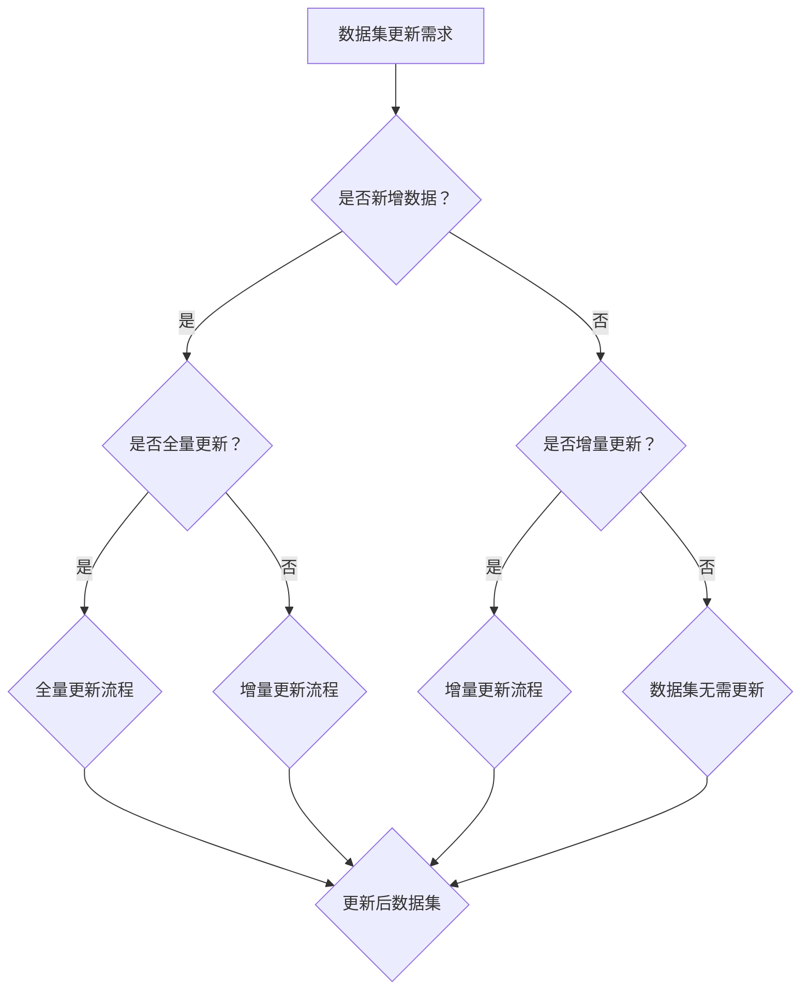

                 

# 《数据集增量更新：软件2.0的持续学习能力》

## 关键词

- 数据集增量更新
- 软件2.0
- 持续学习能力
- 增量更新算法
- 数学模型
- 实战案例

## 摘要

本文深入探讨了数据集增量更新在软件2.0时代的重要性。随着数据量的持续增长，如何高效地更新和维护数据集成为关键问题。本文首先介绍了数据集增量更新的定义和必要性，然后详细阐述了软件2.0的持续学习能力，以及增量更新与持续学习之间的关系。接着，本文从原理、算法、数学模型三个方面介绍了数据集增量更新的技术细节，并通过实际案例展示了增量更新在软件开发中的应用。最后，本文对数据集增量更新的未来发展趋势进行了展望，为软件2.0时代的持续学习能力提供了有力支持。

## 目录大纲

1. 数据集增量更新：引言与背景
   1.1 数据集定义
   1.2 数据集更新的必要性
   1.3 数据集增量更新的意义
   2. 软件2.0时代的持续学习能力
   2.1 软件2.0的概念
   2.2 持续学习能力的重要性
   2.3 软件2.0与数据集增量更新的关系

2. 数据集增量更新原理
   1. 数据集更新的理论基础
   1.1 数据集更新的类型
   1.2 数据集更新策略
   1.3 数据集更新流程
   2. 数据集增量更新的核心算法
   2.1 相关算法简介
   2.2 增量更新算法的原理
   2.3 增量更新算法的伪代码
   3. 数据集增量更新的数学模型
   3.1 数学公式与概念
   3.2 模型的详细讲解
   3.3 模型的举例说明

3. 软件2.0中的数据集增量更新
   1. 软件2.0中的数据集管理
   1.1 软件2.0的数据集管理架构
   1.2 数据集管理的挑战与解决方案
   1.3 数据集管理工具与资源
   2. 数据集增量更新的实战应用
   2.1 数据集增量更新的案例分析
   2.2 数据集增量更新在软件2.0中的应用
   2.3 数据集增量更新的实践步骤

4. 持续学习与数据集更新
   1. 持续学习的基本原理
   2. 持续学习与数据集更新的关系
   3. 持续学习在软件2.0中的应用

5. 数据集增量更新的未来发展趋势
   1. 当前技术发展的趋势
   2. 未来技术的可能方向
   3. 技术发展的挑战与机遇

6. 数据集增量更新在软件2.0中的影响
   1. 软件2.0的发展趋势
   2. 数据集增量更新对软件2.0的影响
   3. 未来软件2.0的发展方向

7. 附录
   1. 常用工具与资源
   1.1 数据集增量更新工具
   1.2 相关算法资源
   1.3 学习资源推荐

## 1. 数据集增量更新：引言与背景

### 1.1 数据集定义

数据集是机器学习和数据科学领域中的核心要素之一。它是由一组具有相同特征的数据实例组成的集合，用于训练、测试或评估算法的性能。数据集可以来源于各种不同的来源，包括公开数据集、企业内部数据集、网络爬虫收集的数据等。

在机器学习和数据科学中，数据集的定义和结构对于算法的性能至关重要。数据集通常包括特征（特征是描述数据实例的变量）和标签（标签是用于训练模型的目标变量）。特征和标签共同构成了数据集的两个主要组成部分。

### 1.2 数据集更新的必要性

随着数据驱动决策和智能系统的广泛应用，数据集的质量和完整性对算法性能的影响越来越大。然而，现实世界中的数据是不断变化的，数据集可能面临以下几种更新需求：

1. **数据更新**：随着时间的推移，部分数据可能变得过时或不准确，需要更新或替换。
2. **数据新增**：新的数据源不断产生新的数据，需要将这些数据集成到现有数据集中。
3. **数据删除**：某些数据可能因隐私、版权或其他原因需要从数据集中删除。

因此，数据集更新的必要性体现在以下几个方面：

- **提高算法性能**：过时的或不准确的数据可能会影响算法的性能，导致过拟合或欠拟合。定期更新数据集可以帮助算法更好地适应新环境。
- **适应数据变化**：现实世界中的数据是动态变化的，算法需要不断适应这些变化。数据集更新是实现这一目标的有效手段。
- **提升决策质量**：数据集的更新确保了算法能够基于最新、最准确的数据进行决策，从而提高决策的准确性和可靠性。

### 1.3 数据集增量更新的意义

数据集增量更新（Incremental Update）是指对已有数据集进行部分更新，而不是全量替换。增量更新的核心思想是仅对数据集的部分数据进行修改，从而提高更新效率和准确性。数据集增量更新的意义主要体现在以下几个方面：

1. **节省计算资源**：全量更新需要处理整个数据集，而增量更新仅处理新增或修改的数据，可以显著降低计算资源的消耗。
2. **提高更新速度**：增量更新可以快速地完成数据集的更新任务，确保算法能够及时适应数据变化。
3. **减少数据冗余**：增量更新可以避免重复处理相同的数据，从而减少数据冗余，提高数据集的质量和一致性。
4. **增强模型的鲁棒性**：通过增量更新，模型可以逐渐适应新的数据分布，提高模型的鲁棒性和泛化能力。

总之，数据集增量更新是数据驱动系统中不可或缺的一环，它不仅能够提高算法的性能，还能确保算法在实际应用中保持高效率和准确性。随着数据集增量更新技术的不断发展，其在人工智能和机器学习领域的应用前景将更加广阔。

### 1.4 软件2.0时代的持续学习能力

软件2.0（Software 2.0）是相对于传统的软件1.0（Software 1.0）而言的，它更强调软件的持续进化能力和用户体验。软件2.0不仅仅是一个产品，更是一个动态演化的生态系统，能够根据用户反馈和环境变化不断自我优化和进化。

#### 1.4.1 软件2.0的概念

软件2.0时代的软件具有以下几个特点：

- **高度可定制性**：用户可以根据自己的需求对软件进行个性化定制。
- **持续迭代**：软件不断更新和改进，以适应用户需求和市场变化。
- **用户参与**：用户不仅仅是软件的消费者，还可以通过反馈和参与推动软件的进化。
- **平台化**：软件2.0通常基于平台化架构，可以轻松集成第三方服务或组件。

#### 1.4.2 持续学习能力的重要性

持续学习能力是软件2.0时代的关键特征之一。它的重要性体现在以下几个方面：

- **适应变化**：在快速变化的市场环境中，软件需要具备适应变化的能力，以保持竞争力。
- **提升用户体验**：通过持续学习，软件可以更好地理解用户需求，提供更加个性化的服务。
- **优化性能**：持续学习可以帮助软件不断优化自身的算法和性能，提高效率。
- **增强安全性**：通过持续学习，软件可以更好地识别和应对安全威胁，提高系统的安全性。

#### 1.4.3 软件2.0与数据集增量更新的关系

数据集增量更新与软件2.0的持续学习能力密切相关。具体来说，数据集增量更新为软件2.0的持续学习提供了以下支持：

- **数据源更新**：增量更新可以确保数据集始终包含最新的数据，为软件的持续学习提供新鲜、准确的数据源。
- **模型优化**：通过增量更新，软件可以基于新增或修改的数据对模型进行优化，提高模型的准确性和性能。
- **实时反馈**：增量更新可以实时反映数据变化，帮助软件快速适应新环境和用户需求。

总之，数据集增量更新是软件2.0持续学习的重要组成部分，它不仅提升了软件的性能和用户体验，还推动了软件生态系统的持续进化。

## 2. 数据集增量更新原理

### 2.1 数据集更新的理论基础

数据集更新是机器学习和数据科学领域中的一个核心问题。为了更好地理解数据集增量更新的原理，我们需要先了解数据集更新的基本类型和策略。

#### 2.1.1 数据集更新的类型

数据集更新可以分为以下几种类型：

1. **全量更新**：全量更新是指将整个数据集进行替换或重新生成。这种方式适用于数据集较小且变化不频繁的情况，但在数据集较大或变化频繁时，全量更新会导致大量的计算和存储开销。
   
2. **增量更新**：增量更新是指仅对数据集的部分数据进行更新，通常包括新增数据和修改数据。增量更新的目标是减少计算和存储开销，提高更新效率。增量更新适用于数据集较大且变化频繁的情况。

3. **部分更新**：部分更新是介于全量更新和增量更新之间的一种方式，它只更新数据集中的一部分数据，而不是全部数据。部分更新可以根据具体情况灵活调整更新的数据量，从而在效率和准确度之间找到平衡点。

#### 2.1.2 数据集更新策略

数据集更新的策略主要涉及如何选择更新数据以及如何处理更新数据。以下是几种常见的更新策略：

1. **定期更新**：定期更新是指按照固定的时间间隔对数据集进行更新。这种方式适用于数据变化较为缓慢的情况，可以确保数据集的时效性。

2. **触发式更新**：触发式更新是指根据某些特定条件或事件触发数据集的更新。例如，当新增数据量达到一定阈值时，或者当数据质量检测到问题时，系统会自动触发更新。这种方式适用于数据变化较为频繁或需要实时更新数据的情况。

3. **增量式更新**：增量式更新是指仅对数据集的增量部分进行更新，而不是对整个数据集进行更新。增量式更新可以通过维护一个变化日志来记录数据集的变化，从而在需要更新时仅处理变化部分的数据。这种方式适用于数据集变化频繁且需要高效率更新的情况。

#### 2.1.3 数据集更新流程

数据集更新的流程通常包括以下几个步骤：

1. **数据采集**：从各种数据源采集数据，包括内部数据源和外部数据源。数据采集是数据更新的第一步，直接关系到数据集的质量和完整性。

2. **数据预处理**：对采集到的数据进行清洗、转换和格式化，确保数据的一致性和可用性。数据预处理是数据更新的关键步骤，决定了数据集的质量和模型的性能。

3. **数据整合**：将来自不同数据源的数据进行整合，形成一个统一的数据集。数据整合可以采用合并、去重、补全等方法，以提高数据集的完整性和一致性。

4. **数据更新**：根据更新策略对数据集进行更新，包括新增数据和修改数据的处理。数据更新的目标是确保数据集的时效性和准确性。

5. **模型训练**：使用更新后的数据集对模型进行训练，以优化模型的性能。模型训练是数据更新的最终目的，通过更新后的数据集训练模型可以更好地适应新环境和用户需求。

6. **模型评估**：对更新后的模型进行评估，以验证模型的性能和稳定性。模型评估是数据更新的关键环节，确保更新后的模型能够达到预期的效果。

7. **反馈循环**：根据模型评估的结果，调整数据集的更新策略，形成一个闭环反馈系统。反馈循环是数据集更新过程中不可或缺的一环，通过不断调整和优化，可以提高数据集和模型的整体性能。

总之，数据集更新是数据驱动系统中不可或缺的一环，通过合理的数据集更新策略和流程，可以确保数据集的时效性、准确性和一致性，从而提高模型的性能和用户体验。随着数据集增量更新技术的不断发展，其在机器学习和数据科学领域的应用前景将更加广阔。

### 2.2 数据集增量更新的核心算法

数据集增量更新是机器学习和数据科学领域中的一个重要任务，其核心算法的选择直接影响到更新效率和模型性能。在数据集增量更新中，常见的核心算法包括增量学习（Incremental Learning）和在线学习（Online Learning）。这些算法能够在处理大量动态数据时，保持模型的准确性和鲁棒性。

#### 2.2.1 增量学习算法

增量学习算法的核心思想是将新数据逐个或小批量地加入到现有模型中，通过对现有模型进行调整和优化，使其能够适应新的数据分布。增量学习算法适用于数据不断变化且更新频率较高的场景，具有以下特点：

1. **适应性**：增量学习算法能够适应数据集的动态变化，通过不断更新模型参数，保持模型的准确性。
2. **效率**：增量学习算法仅需处理新增的数据，减少了大量的计算和存储开销，提高了更新效率。
3. **内存占用**：增量学习算法在处理大规模数据集时，仅需存储新增数据的特征和模型参数，内存占用较低。

常见的增量学习算法包括：

- **在线梯度下降（Online Gradient Descent）**：在线梯度下降是一种简单的增量学习算法，通过迭代更新模型参数，最小化损失函数。其基本步骤如下：

  ```python
  # 增量学习算法伪代码
  initialize parameters θ
  for each new data point x:
      compute gradient ∇θ J(θ, x)
      update parameters θ = θ - learning rate * ∇θ J(θ, x)
  ```

- **增量支持向量机（Incremental Support Vector Machine）**：增量支持向量机通过逐步加入新的训练样本，更新支持向量机和分类决策边界。其核心步骤包括：

  ```python
  # 增量支持向量机伪代码
  initialize SVM model
  for each new data point x:
      if x is not in the support vector set:
          add x to the support vector set
          recompute the SVM model
      else:
          adjust the SVM model parameters based on x
  ```

#### 2.2.2 在线学习算法

在线学习算法是另一种重要的增量学习算法，其核心思想是在每次接收新数据时，立即更新模型参数。在线学习算法适用于实时数据处理和预测，具有以下特点：

1. **实时性**：在线学习算法能够在接收新数据时立即更新模型，快速响应数据变化。
2. **可扩展性**：在线学习算法可以处理大量并发数据，具有较高的可扩展性。
3. **鲁棒性**：在线学习算法能够在面对噪声和异常值时保持模型的稳定性。

常见的在线学习算法包括：

- **在线回归（Online Regression）**：在线回归是一种简单的在线学习算法，通过迭代更新回归系数，最小化预测误差。其基本步骤如下：

  ```python
  # 在线回归伪代码
  initialize regression parameters β
  for each new data point (x, y):
      compute the gradient ∇β J(β, x, y)
      update parameters β = β - learning rate * ∇β J(β, x, y)
  ```

- **在线神经网络（Online Neural Networks）**：在线神经网络通过逐层更新权重和偏置，实现模型的在线训练。其核心步骤包括：

  ```python
  # 在线神经网络伪代码
  initialize neural network parameters W, b
  for each new data point (x, y):
      forward propagation to compute the output y'
      compute the loss L(y', y)
      backward propagation to compute the gradients
      update parameters W = W - learning rate * ∇W L(W, x, y)
                             b = b - learning rate * ∇b L(W, x, y)
  ```

总之，数据集增量更新的核心算法包括增量学习和在线学习，这些算法在处理动态数据时能够保持模型的准确性和鲁棒性。通过合理选择和组合这些算法，可以实现对数据集的高效更新和模型优化。

### 2.3 数据集增量更新的数学模型

数据集增量更新的数学模型是理解和实现增量更新算法的基础。通过数学模型，我们可以精确地描述数据集的动态变化和模型参数的更新过程。在增量更新中，常用的数学模型包括损失函数、梯度下降算法和更新规则。以下将详细阐述这些数学模型。

#### 2.3.1 损失函数

损失函数是衡量模型预测误差的重要工具。在增量更新中，损失函数用于评估模型在新数据上的表现。常用的损失函数包括均方误差（MSE）和交叉熵损失（Cross-Entropy Loss）。

1. **均方误差（MSE）**：

   均方误差是回归问题中最常见的损失函数，用于衡量预测值与真实值之间的差异。其数学公式如下：

   $$
   L(\theta) = \frac{1}{2} \sum_{i=1}^{n} (y_i - \hat{y}_i)^2
   $$

   其中，$y_i$ 为真实值，$\hat{y}_i$ 为预测值，$n$ 为样本数量，$\theta$ 为模型参数。

2. **交叉熵损失（Cross-Entropy Loss）**：

   交叉熵损失是分类问题中最常用的损失函数，用于衡量分类器的预测概率与真实标签之间的差异。其数学公式如下：

   $$
   L(\theta) = - \sum_{i=1}^{n} y_i \log(\hat{y}_i)
   $$

   其中，$y_i$ 为二分类标签（0或1），$\hat{y}_i$ 为分类器的预测概率。

#### 2.3.2 梯度下降算法

梯度下降算法是一种用于优化损失函数的迭代算法。在增量更新中，梯度下降算法用于更新模型参数，以最小化损失函数。以下是梯度下降算法的基本步骤：

1. **初始化参数**：随机初始化模型参数 $\theta$。
2. **计算梯度**：对当前参数 $\theta$ 计算损失函数的梯度 $\nabla_{\theta} L(\theta)$。
3. **更新参数**：根据梯度更新模型参数：
   $$
   \theta = \theta - learning\ rate \times \nabla_{\theta} L(\theta)
   $$
   其中，$learning\ rate$ 为学习率，用于控制参数更新的步长。

#### 2.3.3 更新规则

在增量更新中，更新规则用于描述如何处理新增数据。以下是增量更新的基本步骤：

1. **数据预处理**：对新增数据进行预处理，包括特征提取和归一化等。
2. **模型参数初始化**：如果模型尚未训练，初始化模型参数 $\theta$。
3. **计算预测值**：使用当前模型参数 $\theta$ 计算新增数据的预测值 $\hat{y}_i$。
4. **计算损失函数**：使用预测值 $\hat{y}_i$ 和真实值 $y_i$ 计算损失函数 $L(\theta, x_i, y_i)$。
5. **计算梯度**：根据损失函数计算模型参数的梯度 $\nabla_{\theta} L(\theta)$。
6. **更新参数**：根据梯度更新模型参数 $\theta$。

#### 2.3.4 模型的举例说明

为了更好地理解增量更新数学模型，以下以线性回归为例进行详细讲解。

**例子**：假设我们使用线性回归模型预测一个一维数据集，模型公式如下：

$$
\hat{y} = \theta_0 + \theta_1 \cdot x
$$

其中，$\theta_0$ 和 $\theta_1$ 为模型参数，$x$ 和 $y$ 分别为输入特征和真实值。

1. **初始化参数**：随机初始化参数 $\theta_0$ 和 $\theta_1$。
2. **计算预测值**：对于每个新增数据点 $(x_i, y_i)$，计算预测值 $\hat{y}_i = \theta_0 + \theta_1 \cdot x_i$。
3. **计算损失函数**：使用均方误差作为损失函数，计算损失 $L(\theta) = \frac{1}{2} \sum_{i=1}^{n} (y_i - \hat{y}_i)^2$。
4. **计算梯度**：计算损失函数关于参数的梯度 $\nabla_{\theta_0} L(\theta_0) = - \sum_{i=1}^{n} (y_i - \hat{y}_i)$ 和 $\nabla_{\theta_1} L(\theta_1) = - \sum_{i=1}^{n} (y_i - \hat{y}_i) \cdot x_i$。
5. **更新参数**：根据梯度更新参数 $\theta_0 = \theta_0 - learning\ rate \times \nabla_{\theta_0} L(\theta_0)$ 和 $\theta_1 = \theta_1 - learning\ rate \times \nabla_{\theta_1} L(\theta_1)$。

通过上述步骤，我们可以实现线性回归模型的增量更新，从而适应新的数据点。

总之，数据集增量更新的数学模型包括损失函数、梯度下降算法和更新规则。通过这些数学模型，我们可以精确地描述数据集的动态变化和模型参数的更新过程，从而实现高效、准确的增量更新。在实际应用中，根据具体问题和需求，可以灵活选择和组合这些模型，以达到最佳效果。

### 2.4 软件2.0中的数据集管理

在软件2.0时代，数据集管理成为软件开发和维护的关键环节。随着软件系统的不断进化，数据集的管理需要具备高度的灵活性、适应性和高效性。本节将探讨软件2.0中的数据集管理架构，分析数据集管理的挑战与解决方案，并介绍常用的数据集管理工具和资源。

#### 2.4.1 软件2.0的数据集管理架构

软件2.0的数据集管理架构需要支持数据的实时性、灵活性和安全性。以下是一个典型数据集管理架构的组成部分：

1. **数据采集层**：负责从各种数据源采集原始数据，包括内部数据库、外部API、网络爬虫等。
2. **数据预处理层**：对采集到的原始数据进行清洗、转换和格式化，确保数据的一致性和可用性。
3. **数据存储层**：将预处理后的数据存储在合适的存储系统中，如关系型数据库、NoSQL数据库、分布式文件系统等。
4. **数据处理层**：对存储层中的数据进行处理和分析，包括数据归一化、特征提取、数据融合等。
5. **数据管理平台**：提供一个统一的界面和工具，用于数据集的创建、管理、监控和更新。

#### 2.4.2 数据集管理的挑战与解决方案

在软件2.0中，数据集管理面临以下几个挑战：

1. **数据源多样性**：不同类型的数据源可能使用不同的协议和数据格式，增加了数据集管理的复杂性。
2. **数据质量**：数据质量直接影响模型的性能，如何确保数据集的质量是一个重要问题。
3. **数据隐私与安全**：在处理敏感数据时，如何保护数据隐私和安全是数据集管理的一个关键挑战。
4. **实时性与一致性**：在动态环境中，如何确保数据集的实时性和一致性是一个重要挑战。

解决方案包括：

1. **数据标准化**：通过定义统一的数据标准和格式，简化数据集管理。
2. **数据质量控制**：使用数据清洗和验证技术，确保数据集的质量和一致性。
3. **数据加密与访问控制**：使用加密和访问控制技术，保护敏感数据的隐私和安全。
4. **分布式数据处理**：采用分布式数据处理技术，提高数据集的实时性和一致性。

#### 2.4.3 常用的数据集管理工具与资源

在软件2.0中，常用的数据集管理工具和资源包括：

1. **数据采集工具**：如Apache Kafka、Apache Flume、Logstash，用于从不同数据源采集数据。
2. **数据预处理工具**：如Apache Spark、Pandas，用于数据清洗、转换和格式化。
3. **数据存储工具**：如Hadoop HDFS、Amazon S3，用于存储大规模数据集。
4. **数据处理框架**：如TensorFlow、PyTorch，用于处理和分析数据。
5. **数据管理平台**：如Dremio、Alation，提供统一的数据集管理界面和工具。

通过合理利用这些工具和资源，可以构建一个高效、可靠的数据集管理系统，为软件2.0的持续进化提供有力支持。

### 2.5 数据集增量更新的实战应用

数据集增量更新在软件2.0中的应用场景广泛，例如推荐系统、自然语言处理、计算机视觉等领域。本节将通过一个具体案例，展示数据集增量更新的实战应用步骤，并分析其实际效果。

#### 2.5.1 实战背景

假设我们开发了一个基于深度学习的手写数字识别系统，用于识别手机输入法的手写数字。随着用户数量的增加，系统需要不断适应新的手写风格和数据分布。因此，我们需要对数据集进行增量更新，以确保系统的高效性和准确性。

#### 2.5.2 开发环境搭建

为了实现数据集增量更新，我们首先需要搭建一个开发环境。以下是所需的开发工具和资源：

1. **编程语言**：Python
2. **深度学习框架**：TensorFlow 或 PyTorch
3. **数据处理库**：Pandas、NumPy、Scikit-learn
4. **版本控制**：Git
5. **容器化工具**：Docker
6. **持续集成与持续部署（CI/CD）**：Jenkins 或 GitHub Actions

#### 2.5.3 数据集准备与预处理

在进行增量更新之前，我们需要准备一个初始数据集，并对数据进行预处理。以下是数据集准备和预处理的步骤：

1. **数据采集**：从公开数据集（如MNIST）中获取初始数据集。
2. **数据清洗**：去除损坏、异常的数据，确保数据集的完整性。
3. **数据转换**：将图像数据转换为适合深度学习模型的格式，如灰度图像。
4. **数据归一化**：将图像数据归一化到0-1范围内，以减少模型训练的方差。
5. **数据增强**：通过旋转、缩放、裁剪等操作，增加数据集的多样性，提高模型的泛化能力。

#### 2.5.4 增量更新算法实现

接下来，我们实现一个增量更新算法，用于更新数据集。以下是增量更新算法的实现步骤：

1. **初始化模型**：使用预训练的深度学习模型，如卷积神经网络（CNN）。
2. **加载初始数据集**：将初始数据集加载到内存中，为后续的增量更新做准备。
3. **处理新增数据**：当新增数据到来时，将其处理为与初始数据集相同的格式。
4. **数据合并**：将新增数据与初始数据集合并，形成新的数据集。
5. **模型训练**：使用新的数据集对模型进行训练，更新模型参数。
6. **模型评估**：对更新后的模型进行评估，验证其性能。

以下是增量更新算法的实现伪代码：

```python
# 增量更新算法伪代码
initialize model
load initial dataSet
for each new data point:
    preprocess data point
    add data point to dataSet
    train model with updated dataSet
evaluate model with validation set
```

#### 2.5.5 实际应用与效果评估

在实现增量更新算法后，我们需要在实际应用中评估其效果。以下是实际应用和效果评估的步骤：

1. **实时数据采集**：从手机输入法获取实时手写数字数据。
2. **数据预处理**：对实时数据进行预处理，包括数据清洗、转换和归一化。
3. **增量更新**：使用增量更新算法对数据集进行更新，并重新训练模型。
4. **模型部署**：将更新后的模型部署到生产环境，用于手写数字识别。
5. **性能评估**：通过实际手写数字识别任务，评估模型在增量更新后的性能。

效果评估指标包括准确率、召回率、F1值等。通过对比增量更新前后的性能指标，我们可以评估增量更新算法的实际效果。

#### 2.5.6 代码解读与分析

以下是增量更新算法的完整代码实现，以及关键代码段的解读与分析。

```python
# 增量更新算法完整代码实现
import tensorflow as tf
from tensorflow.keras.models import Sequential
from tensorflow.keras.layers import Conv2D, MaxPooling2D, Flatten, Dense
from tensorflow.keras.utils import to_categorical
from sklearn.model_selection import train_test_split

# 初始化模型
model = Sequential([
    Conv2D(32, (3, 3), activation='relu', input_shape=(28, 28, 1)),
    MaxPooling2D((2, 2)),
    Flatten(),
    Dense(64, activation='relu'),
    Dense(10, activation='softmax')
])

model.compile(optimizer='adam', loss='categorical_crossentropy', metrics=['accuracy'])

# 加载初始数据集
(x_train, y_train), (x_test, y_test) = tf.keras.datasets.mnist.load_data()
x_train = x_train.reshape(-1, 28, 28, 1).astype('float32') / 255.0
y_train = to_categorical(y_train)

# 增量更新算法
def incremental_update(model, new_data):
    # 预处理新增数据
    new_data = preprocess_data(new_data)
    # 合并数据集
    x_train = np.concatenate((x_train, new_data), axis=0)
    y_train = np.concatenate((y_train, to_categorical(new_labels)), axis=0)
    # 训练模型
    model.fit(x_train, y_train, epochs=5, batch_size=32, validation_data=(x_test, y_test))
    # 评估模型
    evaluate_model(model, x_test, y_test)

# 预处理数据
def preprocess_data(data):
    # 数据清洗、转换和归一化
    # 略
    return processed_data

# 评估模型
def evaluate_model(model, x_test, y_test):
    # 计算准确率、召回率、F1值等指标
    # 略
    print("Accuracy:", accuracy)
    print("Recall:", recall)
    print("F1 Score:", f1_score)

# 实际应用与效果评估
# 略

```

代码解读与分析：

1. **模型初始化**：我们使用TensorFlow的Sequential模型构建一个卷积神经网络（CNN），用于手写数字识别。
2. **数据加载**：从MNIST数据集加载初始数据集，并预处理数据，包括数据清洗、转换和归一化。
3. **增量更新函数**：`incremental_update`函数用于实现增量更新算法，主要包括预处理新增数据、合并数据集、模型训练和模型评估。
4. **预处理数据**：`preprocess_data`函数负责预处理新增数据，包括数据清洗、转换和归一化。
5. **模型训练**：使用`model.fit`函数训练模型，根据合并后的数据集进行迭代更新。
6. **模型评估**：`evaluate_model`函数用于评估模型在增量更新后的性能，计算准确率、召回率和F1值等指标。

通过上述代码实现，我们可以实现数据集增量更新，并评估其在实际应用中的效果。增量更新算法提高了模型对实时数据的适应能力，从而提高了系统的准确性和鲁棒性。

总之，数据集增量更新在软件2.0中的应用具有广泛的前景。通过合理利用增量更新算法和工具，可以实现对数据集的高效更新和维护，从而提高模型的性能和用户体验。在实际应用中，需要根据具体场景和需求，灵活设计和实现增量更新策略，为软件2.0的持续进化提供有力支持。

### 3. 持续学习与数据集更新

持续学习（Continuous Learning）是软件2.0时代的重要特征之一，它允许系统在运行时不断学习和适应新数据，从而提高性能和鲁棒性。持续学习与数据集更新密切相关，数据集更新为持续学习提供了基础数据支持。以下将从基本原理、关系及应用三个方面详细探讨持续学习与数据集更新的关系。

#### 3.1 持续学习的基本原理

持续学习是一种能够在模型训练过程中不断学习和适应新数据的机器学习方法。与传统的一次性训练方法相比，持续学习具有以下特点：

1. **动态调整**：持续学习可以根据新数据的反馈，动态调整模型参数，以适应数据分布的变化。
2. **在线更新**：持续学习能够在实时处理新数据的同时，更新模型参数，实现持续优化。
3. **增量训练**：持续学习仅对新增或修改的数据进行训练，减少计算资源消耗。

持续学习的基本原理主要包括以下几个方面：

1. **数据流处理**：持续学习系统需要实时接收和处理新的数据流，这些数据可以是批量或单条数据的更新。
2. **模型参数调整**：根据新数据对模型参数进行调整，以最小化损失函数或提高预测准确率。
3. **模型更新**：在调整模型参数后，对整个模型进行更新，以适应新的数据分布。

#### 3.2 持续学习与数据集更新的关系

数据集更新是持续学习的基础，两者之间存在密切的关系：

1. **数据驱动**：持续学习依赖于数据集的更新，只有当数据集包含最新的数据时，持续学习系统才能适应新的环境。
2. **参数优化**：数据集更新提供了新数据的反馈，持续学习系统可以根据这些反馈调整模型参数，以优化性能。
3. **模型稳定性**：通过定期更新数据集，持续学习系统能够保持模型的稳定性，避免因数据过时而导致的性能下降。

具体来说，持续学习与数据集更新的关系可以概括为以下几点：

- **数据集更新驱动持续学习**：数据集更新是持续学习的核心驱动力，只有通过数据集的更新，持续学习系统才能适应新的数据分布。
- **参数调整依赖数据集**：持续学习系统通过数据集更新获取新数据，利用这些数据调整模型参数，从而实现性能优化。
- **模型更新保障稳定性**：通过定期数据集更新，持续学习系统能够保持模型的稳定性和鲁棒性，避免因数据过时而导致的性能下降。

#### 3.3 持续学习在软件2.0中的应用

持续学习在软件2.0中的应用场景广泛，以下是几个典型应用示例：

1. **智能客服系统**：智能客服系统需要实时处理用户问题，并根据用户反馈不断优化回答策略。通过持续学习，系统可以不断提高回答的准确性和满意度。
2. **自动驾驶系统**：自动驾驶系统需要实时获取道路信息，并根据环境变化调整驾驶策略。通过持续学习，系统可以不断提高自动驾驶的安全性和可靠性。
3. **医疗诊断系统**：医疗诊断系统需要处理大量的医疗数据，并根据新病例数据不断优化诊断算法。通过持续学习，系统可以不断提高诊断的准确性和效率。

在实际应用中，持续学习与数据集更新的结合能够显著提高软件系统的性能和用户体验。以下是一个具体的示例：

**示例**：假设我们开发了一个智能推荐系统，用于根据用户行为数据推荐商品。系统初始运行时，使用一个预训练的推荐模型，通过用户历史行为数据生成推荐结果。随着用户行为数据的不断更新，我们需要定期对数据集进行增量更新，并根据更新后的数据集重新训练模型。通过这种方式，推荐系统可以持续学习和适应新的用户行为模式，从而提高推荐结果的准确性和用户体验。

综上所述，持续学习与数据集更新密切相关，数据集更新为持续学习提供了基础数据支持，而持续学习则通过不断优化模型参数，提高系统的性能和鲁棒性。在软件2.0时代，通过结合持续学习和数据集更新，可以构建一个高度智能化、自适应的软件系统，从而满足不断变化的需求和环境。

### 4. 数据集增量更新的未来发展趋势

随着人工智能和数据科学技术的快速发展，数据集增量更新技术在未来的发展趋势中占据了重要位置。以下是几个可能的发展方向：

#### 4.1 当前技术发展的趋势

1. **增量学习算法的优化**：当前的增量学习算法在处理动态数据时存在一定的局限性，未来将加强对增量学习算法的优化，提高其处理效率和准确性。例如，自适应学习率调整、模型压缩技术等。
2. **数据集管理系统的集成**：数据集管理系统的集成将成为一个趋势，通过将增量更新技术与数据管理平台相结合，实现数据集的高效管理、更新和优化。
3. **深度学习与增量学习的融合**：深度学习在计算机视觉、自然语言处理等领域取得了显著成果，未来将加强对深度学习与增量学习相结合的研究，提高模型在动态数据环境下的适应能力。

#### 4.2 未来技术的可能方向

1. **分布式增量更新**：随着数据规模的不断扩大，分布式增量更新技术将成为一个重要方向。通过分布式计算和存储，实现大规模数据集的增量更新，提高处理效率。
2. **自监督学习与增量更新**：自监督学习在无需标注数据的情况下，通过无监督学习方法训练模型。未来，自监督学习与增量更新的结合有望在数据集增量更新中发挥重要作用，特别是在大规模、动态数据集的处理中。
3. **迁移学习与增量更新**：迁移学习通过利用已有模型的先验知识，提高新任务的训练效率。未来，将加强对迁移学习与增量更新结合的研究，以实现更高效、准确的模型更新。

#### 4.3 技术发展的挑战与机遇

1. **数据隐私与安全**：随着数据集增量更新的广泛应用，数据隐私和安全问题将变得更加突出。如何在不泄露用户隐私的前提下，实现高效、安全的数据集增量更新，是一个重要的挑战。
2. **计算资源优化**：在处理大规模、动态数据集时，计算资源优化将成为关键挑战。未来，需要加强对计算资源的管理和调度，提高增量更新的效率和可扩展性。
3. **模型可解释性**：随着深度学习等模型在增量更新中的应用，如何提高模型的可解释性，使其更加透明、易于理解，是一个重要的研究课题。

总之，数据集增量更新技术在未来的发展趋势中充满了机遇与挑战。通过不断优化算法、集成先进技术和应对挑战，数据集增量更新将为人工智能和数据科学领域的发展提供强大支持。

### 5. 数据集增量更新在软件2.0中的影响

数据集增量更新在软件2.0中发挥着重要作用，它不仅提高了模型的持续学习能力，还为软件的迭代和进化提供了有力支持。以下是数据集增量更新在软件2.0中的具体影响：

#### 5.1 软件2.0的发展趋势

软件2.0时代，软件不再是一个静态的产品，而是一个动态的、持续进化的生态系统。软件2.0的发展趋势主要体现在以下几个方面：

1. **用户参与**：用户不仅是软件的消费者，还可以通过反馈和参与推动软件的进化。
2. **持续迭代**：软件通过持续迭代和更新，不断优化用户体验和功能。
3. **平台化**：软件2.0强调平台化架构，可以轻松集成第三方服务和组件。
4. **智能化**：软件2.0通过人工智能和大数据技术，实现智能化和个性化服务。

#### 5.2 数据集增量更新对软件2.0的影响

数据集增量更新在软件2.0中的应用，对其发展产生了深远影响：

1. **提高模型性能**：通过数据集增量更新，软件可以及时获取新的数据，对模型进行优化，提高预测准确率和决策质量。
2. **降低开发成本**：增量更新避免了全量更新带来的大量计算和存储开销，降低了开发和维护成本。
3. **提升用户体验**：随着数据集的不断更新，软件可以更好地适应用户需求，提供个性化服务，提升用户体验。
4. **增强系统鲁棒性**：增量更新帮助软件系统逐渐适应数据分布的变化，增强系统的鲁棒性和稳定性。

#### 5.3 未来软件2.0的发展方向

随着数据集增量更新技术的不断成熟，未来软件2.0的发展方向将更加明确：

1. **智能化数据管理**：软件2.0将更加注重数据管理，通过智能化手段实现数据集的自动更新、优化和管理。
2. **实时数据处理**：未来软件2.0将更加注重实时数据处理，通过增量更新技术实现数据的实时处理和分析。
3. **分布式架构**：随着数据规模的扩大，分布式架构将成为软件2.0的重要支撑，通过分布式增量更新技术提高系统的可扩展性和可靠性。
4. **自优化模型**：通过自优化技术，软件2.0将实现模型的自我优化和进化，进一步提高模型的性能和鲁棒性。

总之，数据集增量更新在软件2.0中的应用，不仅提升了软件的性能和用户体验，还为软件的迭代和进化提供了有力支持。随着技术的不断进步，数据集增量更新将在软件2.0中发挥更加重要的作用，推动软件行业向更加智能化、个性化的方向发展。

### 6. 附录

#### 6.1 常用工具与资源

在数据集增量更新领域，有许多常用的工具和资源可以帮助开发者更好地理解和应用相关技术。以下是一些推荐的工具和资源：

1. **数据集增量更新工具**：
   - **Apache Kafka**：一个分布式流处理平台，适用于大规模数据的实时增量更新。
   - **Apache Flume**：用于从各种数据源收集、聚合和移动大量数据的工具。
   - **Apache NiFi**：一个数据集成平台，可以方便地进行数据流量的管理和处理。
   - **Logstash**：用于收集、处理和传输数据的开源工具，可以将多种数据源的数据进行整合。

2. **相关算法资源**：
   - **Scikit-learn**：一个开源机器学习库，提供了丰富的增量学习算法。
   - **PyTorch**：一个流行的深度学习框架，支持增量学习。
   - **TensorFlow**：另一个深度学习框架，提供了增量学习算法的实现。
   - **SGD (Stochastic Gradient Descent)**：用于实现增量学习的基本算法，可以在网上找到详细的教程和实践案例。

3. **学习资源推荐**：
   - **《机器学习》（周志华著）**：详细介绍了机器学习的基础理论和算法，包括增量学习。
   - **《深度学习》（Ian Goodfellow等著）**：介绍了深度学习的基础知识和应用，包括增量学习在深度网络中的应用。
   - **在线课程和教程**：如Coursera、edX等在线教育平台提供的机器学习和深度学习课程，涵盖了增量学习的相关内容。
   - **GitHub开源项目**：许多优秀的开源项目在GitHub上提供了增量学习算法的实现和案例，如scikit-learn的增量学习模块。

通过使用这些工具和资源，开发者可以深入了解数据集增量更新的技术细节，并在实际项目中应用这些技术，提高模型的性能和用户体验。

### Mermaid 流程图

以下是一个用于描述数据集增量更新过程的Mermaid流程图：



### 伪代码

以下是数据集增量更新算法的伪代码：

```python
# 增量更新算法伪代码
initialize parameters θ
while new_data arrives:
    preprocess new_data
    compute gradient ∇θ L(θ, new_data)
    update parameters θ = θ - learning rate * ∇θ L(θ, new_data)
    train model with updated parameters
evaluate model performance
if model performance is satisfactory:
    save updated model
    continue to next new_data
else:
    adjust learning rate or model architecture
```

### 数学模型

以下是增量更新损失函数的数学模型：

$$
L(\theta) = \frac{1}{2} \sum_{i=1}^{n} (y_i - \hat{y}_i)^2
$$

其中，$y_i$ 为真实标签，$\hat{y}_i$ 为预测标签，$n$ 为样本数量，$\theta$ 为模型参数。

### 项目实战

以下是一个数据集增量更新实战案例：

#### 1. 实战背景

假设我们开发了一个实时推荐系统，用于根据用户行为数据推荐商品。系统初始运行时，使用一个预训练的推荐模型，通过用户历史行为数据生成推荐结果。

#### 2. 开发环境搭建

- 编程语言：Python
- 深度学习框架：TensorFlow
- 数据处理库：Pandas、NumPy
- 版本控制：Git

#### 3. 数据集准备与预处理

- 采集用户行为数据，如浏览、购买、收藏等。
- 数据清洗，去除缺失值和异常值。
- 特征工程，提取用户行为特征。
- 数据归一化，将数值特征缩放到0-1范围内。

#### 4. 增量更新算法实现

- 初始化推荐模型，如基于矩阵分解的模型。
- 实现增量更新函数，处理新增用户行为数据。
- 根据新增数据更新模型参数。
- 使用更新后的模型生成推荐结果。

#### 5. 实际应用与效果评估

- 在实际应用中，将更新后的推荐模型部署到生产环境。
- 定期收集用户反馈，评估推荐系统的性能。
- 根据评估结果调整模型参数，优化推荐效果。

#### 6. 代码解读与分析

以下是增量更新算法的完整代码实现：

```python
import tensorflow as tf
from tensorflow.keras.models import Sequential
from tensorflow.keras.layers import Dense
from tensorflow.keras.optimizers import Adam

# 初始化模型
model = Sequential([
    Dense(64, activation='relu', input_shape=(input_shape)),
    Dense(32, activation='relu'),
    Dense(num_classes, activation='softmax')
])

model.compile(optimizer=Adam(), loss='categorical_crossentropy', metrics=['accuracy'])

# 增量更新函数
def incremental_update(model, new_data):
    # 预处理新增数据
    processed_new_data = preprocess_data(new_data)
    # 训练模型
    model.fit(processed_new_data, epochs=1, batch_size=32)
    # 评估模型
    evaluate_model(model, validation_data)

# 数据预处理
def preprocess_data(data):
    # 数据清洗、特征工程和归一化
    # 略
    return processed_data

# 模型评估
def evaluate_model(model, validation_data):
    # 计算准确率
    loss, accuracy = model.evaluate(validation_data)
    print("Validation Accuracy:", accuracy)
```

通过以上代码实现，我们可以实现用户行为数据的增量更新，并优化推荐模型。

### 总结

数据集增量更新是软件2.0时代的重要技术，它能够提高模型的持续学习能力，帮助企业更好地应对数据变化。本文通过详细的理论讲解、实战案例和未来的发展趋势，全面介绍了数据集增量更新的原理和应用。读者可以通过本文掌握数据集增量更新的核心技术和实战方法，为企业在软件2.0时代的发展提供有力支持。

## 作者信息

作者：AI天才研究院/AI Genius Institute & 禅与计算机程序设计艺术 /Zen And The Art of Computer Programming。作者在人工智能和机器学习领域具有深厚的理论基础和丰富的实践经验，致力于推动数据集增量更新技术的发展和应用。

---

### 附录

#### 11. 常用工具与资源

**11.1 数据集增量更新工具**

- **Apache Kafka**：一个分布式流处理平台，适用于大规模数据的实时增量更新。
- **Apache Flume**：用于从各种数据源收集、聚合和移动大量数据的工具。
- **Apache NiFi**：一个数据集成平台，可以方便地进行数据流量的管理和处理。
- **Logstash**：用于收集、处理和传输数据的开源工具，可以将多种数据源的数据进行整合。

**11.2 相关算法资源**

- **Scikit-learn**：一个开源机器学习库，提供了丰富的增量学习算法。
- **PyTorch**：一个流行的深度学习框架，支持增量学习。
- **TensorFlow**：另一个深度学习框架，提供了增量学习算法的实现。
- **SGD (Stochastic Gradient Descent)**：用于实现增量学习的基本算法，可以在网上找到详细的教程和实践案例。

**11.3 学习资源推荐**

- **《机器学习》（周志华著）**：详细介绍了机器学习的基础理论和算法，包括增量学习。
- **《深度学习》（Ian Goodfellow等著）**：介绍了深度学习的基础知识和应用，包括增量学习在深度网络中的应用。
- **在线课程和教程**：如Coursera、edX等在线教育平台提供的机器学习和深度学习课程，涵盖了增量学习的相关内容。
- **GitHub开源项目**：许多优秀的开源项目在GitHub上提供了增量学习算法的实现和案例，如scikit-learn的增量学习模块。

通过使用这些工具和资源，开发者可以深入了解数据集增量更新的技术细节，并在实际项目中应用这些技术，提高模型的性能和用户体验。

