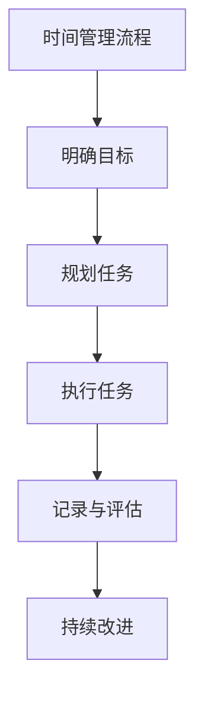

                 

### 文章标题

在当今快速变化和高度竞争的IT领域，个人和团队的生产力成为决定企业成功的关键因素之一。然而，如何在众多任务和紧迫的截止日期中有效管理时间，从而最大限度地提高生产力和效率，成为每位从业者必须面对的挑战。本文旨在深入探讨时间管理在个人和团队层面的重要性，分析时间管理的基础理论、方法和技巧，并结合实际案例进行详细讲解，旨在为读者提供一套全面、实用的时间管理解决方案。

## 核心关键词

- 时间管理
- 个人生产力
- 团队协作
- 工作流程优化
- 多任务处理
- 专注力训练
- 时间管理工具
- 案例分析

### 摘要

时间管理是提高个人和团队生产力的关键。本文从理论、方法和实践三个层面，系统地分析了时间管理的重要性、核心原则、常用工具与方法，并探讨了时间管理在提高个人和团队效率方面的具体应用技巧。通过详细的项目实战案例分析，本文旨在为读者提供一套切实可行的时间管理策略，帮助他们在复杂的工作环境中实现高效产出。

## 目录大纲

### 第一部分：时间管理基础理论

1. **第1章 时间管理的核心理念**
    - **1.1 时间管理的定义与重要性**
    - **1.2 个人时间观念的形成**
    - **1.3 时间管理的基本原则**

2. **第2章 时间管理工具与方法**
    - **2.1 日历与日程管理**
    - **2.2 待办事项清单**
    - **2.3 记录与分析时间使用情况**

3. **第3章 时间管理中的障碍与挑战**
    - **3.1 时间的感知与认知偏差**
    - **3.2 时间管理中的常见误区**
    - **3.3 时间管理的心理因素**

### 第二部分：时间管理技巧应用

4. **第4章 提高个人工作效率**
    - **4.1 工作流程优化**
    - **4.2 多任务处理策略**
    - **4.3 专注力训练**

5. **第5章 时间管理的团队协作**
    - **5.1 团队时间管理策略**
    - **5.2 团队沟通与协作技巧**
    - **5.3 团队时间表与任务分配**

6. **第6章 时间管理实践案例**
    - **6.1 企业时间管理实践**
    - **6.2 个人时间管理实践**
    - **6.3 团队时间管理实践案例**

### 第三部分：时间管理案例分析

7. **第7章 成功的时间管理案例解析**
    - **7.1 案例一：个人成功时间管理**
    - **7.2 案例二：企业团队时间管理**
    - **7.3 案例三：时间管理跨部门协作**

8. **第8章 时间管理趋势与未来展望**
    - **8.1 人工智能与时间管理**
    - **8.2 时间管理技术的未来发展方向**
    - **8.3 时间管理在全球化背景下的新挑战**

### 附录：时间管理资源与工具

- **A.1 时间管理软件与应用**
- **A.2 时间管理书籍推荐**
- **A.3 时间管理网站与社区资源**

### 核心概念与联系

- **时间管理流程图**



### 核心算法原理讲解

- **优先级排序算法伪代码**

```python
def priority_sort(tasks):
    sorted_tasks = []
    while tasks:
        max_priority = -1
        max_priority_index = -1
        for i, task in enumerate(tasks):
            if task['priority'] > max_priority:
                max_priority = task['priority']
                max_priority_index = i
        sorted_tasks.append(tasks.pop(max_priority_index))
    return sorted_tasks
```

- **期望值计算公式**

$$
E(X) = \sum_{i=1}^{n} x_i \cdot p_i
$$

其中，$x_i$ 表示第 $i$ 个事件的取值，$p_i$ 表示第 $i$ 个事件发生的概率。

- **时间分配比例公式**

$$
\text{时间分配比例} = \frac{\text{某项任务所需时间}}{\text{总时间}}
$$

### 项目实战

#### 实战一：个人时间管理应用开发

**1. 开发环境搭建**

- Python环境
- GUI框架：Tkinter或PyQt5

**2. 源代码实现**

```python
import tkinter as tk
from tkinter import ttk

# 任务条目类
class TaskEntry(tk.Frame):
    def __init__(self, master, task_name, task_time, priority):
        super().__init__(master)
        self.task_name = task_name
        self.task_time = task_time
        self.priority = priority

        self.create_widgets()

    def create_widgets(self):
        self.task_label = ttk.Label(self, text=self.task_name)
        self.task_label.pack(side=tk.TOP)

        self.time_label = ttk.Label(self, text=str(self.task_time) + " hours")
        self.time_label.pack(side=tk.TOP)

        self.priority_label = ttk.Label(self, text="Priority: " + str(self.priority))
        self.priority_label.pack(side=tk.TOP)

# 应用主窗口类
class TimeManagementApp(tk.Tk):
    def __init__(self):
        super().__init__()
        self.title("Time Management App")
        self.geometry("400x300")

        self.task_entries = []

        self.create_widgets()

    def create_widgets(self):
        self.task_frame = ttk.Frame(self)
        self.task_frame.pack(fill=tk.BOTH, expand=True)

        self.add_task_button = ttk.Button(self, text="Add Task", command=self.add_task)
        self.add_task_button.pack(side=tk.BOTTOM, fill=tk.X)

    def add_task(self):
        task_name = input("Enter task name: ")
        task_time = float(input("Enter task time (hours): "))
        priority = int(input("Enter task priority (1-5): "))
        new_task = TaskEntry(self.task_frame, task_name, task_time, priority)
        new_task.pack(side=tk.TOP, anchor=tk.NW)
        self.task_entries.append(new_task)
```

**3. 代码解读与分析**

- `TaskEntry` 类负责创建单个任务条目，包含任务名称、所需时间和优先级。
- `TimeManagementApp` 类负责创建应用程序主窗口，并管理任务条目的添加。

#### 实战二：团队时间管理应用开发

**1. 开发环境搭建**

- Python环境
- Web框架：Flask或Django

**2. 源代码实现（伪代码）**

```python
# 模型定义
class Task(db.Model):
    id = db.Column(db.Integer, primary_key=True)
    name = db.Column(db.String(120), nullable=False)
    time_required = db.Column(db.Float, nullable=False)
    priority = db.Column(db.Integer, nullable=False)
    assigned_to = db.Column(db.String(120), nullable=False)

# 应用主窗口类
class TimeManagementApp(Flask):
    def __init__(self):
        super().__init__()
        self.title("Team Time Management App")
        self.create_widgets()

    def create_widgets(self):
        # 创建HTML界面元素，用于添加任务、查看任务列表等

    # 添加任务的函数
    def add_task(self, task_name, time_required, priority, assigned_to):
        # 创建新的任务对象，保存到数据库

    # 查看任务列表的函数
    def show_tasks(self):
        # 从数据库查询任务列表，并在界面上展示
```

**3. 代码解读与分析**

- `Task` 类定义了任务的模型，包含任务ID、名称、所需时间、优先级和分配人。
- `TimeManagementApp` 类负责创建Web应用程序，并管理任务的添加和展示。

以上内容为文章的引言部分，接下来我们将逐步深入探讨时间管理的基础理论、应用技巧和实际案例分析。让我们一步一步思考，深入挖掘时间管理的本质，为读者提供一套全面、实用的时间管理解决方案。

