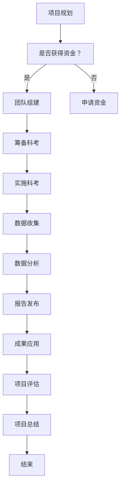

                 

### 2050年的南北极科考与生态保护

> **关键词：** 2050年、南北极科考、生态保护、气候变化、技术创新、国际合作

> **摘要：** 本文章深入探讨了2050年南北极科考与生态保护的前景和挑战。通过对极地科考的历史与现状、未来科技发展趋势、极地科考项目与成果的分析，文章展望了南北极科考的未来。同时，文章还详细阐述了南极科考与北极科考的地理环境、气候变化、科考项目与成果、挑战与应对策略，以及极地生态系统的特点与重要性。在此基础上，文章提出了极地生态保护现状与挑战，并对未来的极地生态保护提出了策略与展望。最终，文章总结了极地科考与生态保护的关系，以及2050年实现这一目标的路径与策略。

---

### 《未来的极地探索：2050年的南北极科考与生态保护》

在21世纪的步伐中，极地探索正逐渐成为全球关注的焦点。南北极，作为地球上最后的“白夜之地”，其独特的地理环境和气候变化对全球生态系统具有重要意义。随着科技的进步和国际合作的深化，2050年的南北极科考与生态保护将迎来前所未有的挑战与机遇。

本文将分为五个部分，首先回顾极地科考的历史与现状，然后分别探讨南极科考与北极科考的地理环境、气候变化、科考项目与成果、挑战与应对策略。接下来，文章将聚焦极地生态系统的特点与重要性，并分析极地生态保护现状与挑战。在此基础上，文章提出未来极地生态保护的战略与展望。最后，文章总结极地科考与生态保护的关系，展望2050年实现这一目标的路径与策略。

通过这一系列深入分析，我们希望能够勾勒出2050年南北极科考与生态保护的宏伟蓝图，为全球可持续发展贡献智慧与力量。

---

## 第一部分：引言与概述

### 1.1 极地科考的历史与现状

#### 1.1.1 极地科考的意义与目标

极地科考，顾名思义，是指在全球最极端的自然环境下进行的科学研究活动。南北极作为地球上最后一片未被完全开发的地区，具有重要的科学研究价值。极地科考的目标包括：

1. **气候变化研究**：极地地区是全球气候变化的重要指示器。通过研究极地气候系统，可以更好地理解全球气候变化的机制和趋势。
   
2. **生态系统研究**：极地生态系统是全球生态网络的重要组成部分。研究极地生物多样性和生态系统功能，有助于了解地球上生命的适应机制和演变过程。

3. **地质与地球物理研究**：极地地区的地质结构和地球物理现象对理解地球的起源和演化具有重要意义。

4. **天文学研究**：极地地区的独特天文观测条件，为天文学研究提供了宝贵的资源，如对极光、太阳活动等的研究。

#### 1.1.2 南北极科考的发展历程

南北极科考的历史可以追溯到19世纪末和20世纪初。以下是南北极科考的主要发展阶段：

- **19世纪末到20世纪初**：以探险家们的实地考察和记录为主，如斯科特、阿蒙森等人的南极探险。
- **20世纪中期**：随着科技的发展，极地科考进入了新阶段。美国和苏联等国相继建立了极地科考站，开展了大量的科学研究。
- **20世纪末到21世纪初**：国际合作逐渐加强，如国际南极研究科学委员会（SCAR）和国际北极科学委员会（IASC）的成立。这一阶段，极地科考进入了多学科、跨国家的合作研究。
- **21世纪**：极地科考技术取得了显著进步，如无人机、机器人、卫星遥感等技术在极地科考中的应用，极大地提高了科考效率和数据精度。

#### 1.1.3 当代极地科考的重点与挑战

当代极地科考主要集中在以下几个方面：

1. **气候变化研究**：全球气候变化对极地环境的影响日益显著，研究极地气候系统的变化规律和机制成为极地科考的重点。
   
2. **生态系统研究**：极地生物多样性和生态系统的变化对全球生态平衡具有重要意义。研究极地生物适应机制和生态系统功能，有助于保护地球生态系统。

3. **地质与地球物理研究**：通过地质和地球物理研究，揭示地球的起源和演化过程，对理解地球系统的运行机制具有重要意义。

4. **天文学研究**：利用极地独特的天文观测条件，开展对宇宙的探索，如对极光、太阳活动和行星运动的观测研究。

然而，当代极地科考也面临着一系列挑战：

1. **极端环境**：极地地区的极端气候和地形条件对科考人员和技术设备提出了极高的要求。

2. **资金与资源**：极地科考需要大量的资金和资源支持，但国际竞争激烈，资源有限。

3. **国际合作**：极地科考涉及多个国家和地区，国际合作的重要性日益凸显，但协调与合作的难度也增加了。

### 1.2 2050年的极地科考展望

#### 1.2.1 未来科技的发展趋势

未来科技的发展将为极地科考带来新的机遇和挑战。以下是一些可能影响极地科考的科技发展趋势：

1. **人工智能与大数据**：人工智能和大数据技术在极地科考中的应用，将极大地提高数据处理和分析的效率，为科学研究提供有力支持。

2. **卫星遥感**：卫星遥感技术将在极地科考中发挥重要作用，通过高分辨率的卫星图像，可以实时监测极地环境变化，提供准确的科考数据。

3. **无人机与机器人**：无人机和机器人在极地科考中的应用，将使科考人员能够远程操控设备进行数据采集，减少人力风险。

4. **纳米技术与材料科学**：纳米技术和新型材料的应用，将使极地科考设备更加轻便、耐用，适应极地极端环境。

#### 1.2.2 极地科考领域的创新与突破

在未来，极地科考领域可能实现以下创新与突破：

1. **极地气候变化预测**：通过先进的模型和算法，提高对极地气候变化的预测能力，为全球气候政策制定提供科学依据。

2. **生态系统保护**：开发新的生态保护技术和方法，如生态修复技术和基因编辑技术，保护极地生态系统。

3. **能源与资源利用**：研究极地地区的可再生能源和矿产资源，为人类利用极地资源提供科学支持。

4. **国际合作机制**：建立更加有效的国际合作机制，促进全球极地科考的协调与合作。

#### 1.2.3 2050年极地科考的愿景

到2050年，我们期望实现以下极地科考愿景：

1. **全面理解极地环境**：通过多学科、跨国家的合作研究，全面理解极地环境的复杂性和变化规律。

2. **保护极地生态系统**：采取有效的生态保护措施，保护极地生态系统的健康与稳定。

3. **推动可持续发展**：将极地科考与可持续发展相结合，为人类利用极地资源提供科学支持，实现极地资源的可持续利用。

4. **加强国际合作**：通过国际合作，共同应对极地科考与生态保护面临的挑战，推动全球极地科考的协同发展。

通过上述展望，我们可以看到，2050年的极地科考将是一个科技高度发达、国际合作紧密、生态保护深入的时代。这将为我们理解地球系统、应对全球气候变化提供宝贵的科学数据和理论支持。

---

### 第二部分：南极科考

#### 2.1 南极地理环境与气候变化

##### 2.1.1 南极地理环境的特殊性

南极，被称为“地球最后的净土”，位于地球的最南端，几乎完全被冰层覆盖。南极地理环境的特殊性体现在以下几个方面：

1. **极端寒冷**：南极平均温度约为-58°C，是地球上最寒冷的地方。冬季温度可降至-128°C，极端寒冷的气候条件使南极成为地球上最不宜居的地区之一。

2. **高风速**：南极地区平均风速高达每秒17米，被称为“风极”。强烈的风速不仅使极地气候更加寒冷，还对科考站的稳定性构成挑战。

3. **冰盖厚度**：南极冰盖平均厚度约为2公里，最厚处可达4公里以上。冰盖的厚度和稳定性对全球海平面变化有着重要影响。

4. **孤立性**：南极大陆与主要大陆之间相隔甚远，海上交通不便，使得南极地区的科考和资源开发相对困难。

##### 2.1.2 南极气候变化的现状与趋势

南极气候变化的现状与全球气候变化密切相关。根据多项科学研究和观测数据，南极地区的气候变化趋势如下：

1. **气温上升**：过去几十年，南极地区的气温呈现明显上升趋势。尤其是夏季，气温上升速度更快。气温的升高导致南极冰盖融化速度加快。

2. **海冰减少**：南极海冰面积和厚度持续减少，尤其是夏季海冰。海冰的减少对南极生态系统和生物多样性产生了重大影响，尤其是对依赖海冰生存的极地动物。

3. **降水变化**：南极地区的降水模式也发生了变化。夏季降水量增加，但冬季降水量减少。这种变化可能影响南极地表的冰盖结构。

4. **极端天气**：极端天气事件，如强烈的风暴和极端高温，在南极地区变得更加频繁。这些极端天气事件不仅影响极地环境，还对科考人员和设施构成威胁。

##### 2.1.3 气候变化对南极生态系统的影响

气候变化对南极生态系统的影响是多方面的，主要体现在以下几个方面：

1. **生物多样性减少**：气候变化导致南极生物多样性的减少。许多极地动物，如企鹅和海豹，因海冰减少而失去栖息地和食物来源。

2. **生态系统失衡**：生态系统失衡是气候变化带来的另一个问题。某些物种的过度繁殖，如鼠海豹，可能导致其他物种的生存空间和食物资源减少。

3. **海洋酸化**：南极海域的海洋酸化加剧，对海洋生物的生存构成威胁。海洋酸化影响海洋生物的骨骼和生殖系统，可能导致海洋生物种群数量减少。

4. **冰川融化**：冰川融化不仅影响南极地表的冰盖，还可能导致海平面上升。全球海平面上升对沿海地区和岛屿国家构成严重威胁。

#### 2.2 南极科考项目与成果

##### 2.2.1 南极科考的主要项目

南极科考项目种类繁多，涵盖了多个学科领域。以下是几个主要的项目：

1. **国际南极研究科学委员会（SCAR）项目**：SCAR是国际南极科研合作的主要机构，负责组织和管理多个跨学科的研究项目。

2. **国际南极考察队（IASC）项目**：IASC是负责南极陆地和海洋科考的国际组织，其项目包括冰川、生物多样性、气候变化等多个领域。

3. **南极气候观测系统（SCOS）项目**：SCOS是一个全球性的气候观测项目，旨在收集和分享南极地区的气候数据，为气候变化研究提供支持。

4. **南极臭氧洞研究项目**：南极臭氧洞是全球关注的重大环境问题。该项目通过研究臭氧层破坏的原因和机制，为保护臭氧层提供科学依据。

##### 2.2.2 南极科考的重要发现

南极科考取得了许多重要的科学发现，这些发现对理解地球系统、气候变化和生态系统具有重要意义。以下是几个重要的发现：

1. **气候变化证据**：南极科考发现了大量的气候变化证据，如气温上升、海冰减少和降水变化等。这些发现为全球气候变化研究提供了宝贵的资料。

2. **冰川动力学**：南极科考揭示了冰川的动态变化机制，包括冰盖融化、冰流速变化和冰川断裂等。这些研究对理解全球海平面变化具有重要意义。

3. **海洋生态系统**：南极科考揭示了南极海洋生态系统的复杂性和多样性。通过对海洋生物的研究，科学家们发现了许多新的物种和生态系统特征。

4. **生物多样性**：南极科考发现了大量的极地生物，包括企鹅、海豹、鲸鱼等。这些生物的生存状态和适应机制为研究地球生物多样性提供了重要线索。

##### 2.2.3 南极科考成果的应用与转化

南极科考成果在多个领域得到了广泛应用和转化：

1. **气候变化研究**：南极科考数据为全球气候变化研究提供了重要支持，包括气候模型的建立、气候预测和气候变化政策的制定。

2. **环境保护**：南极科考成果被应用于极地环境保护，包括制定环境保护法规、开展生态修复和监测极地生态系统的健康状态。

3. **资源开发**：南极科考为极地资源开发提供了科学依据，包括矿产资源的勘探和可再生能源的开发。

4. **国际合作**：南极科考成果促进了国际合作，通过共享数据和研究成果，不同国家和地区的科学家共同应对极地科考与生态保护挑战。

#### 2.3 南极科考的挑战与应对策略

##### 2.3.1 南极科考的主要挑战

南极科考面临着一系列挑战，包括自然环境和人力资源等方面的挑战：

1. **极端环境**：南极地区的极端环境条件对科考人员和技术设备提出了极高要求。科考人员需要适应极寒和强风等恶劣气候，而设备需要能够耐受极端温度和恶劣天气。

2. **资金与资源限制**：南极科考需要大量的资金和资源支持，但国际竞争激烈，资源有限。这使得科考项目面临资金不足、设备老化等问题。

3. **国际合作与协调**：南极科考涉及多个国家和地区，国际合作与协调的重要性日益凸显。然而，不同国家和地区的利益和目标可能存在差异，协调与合作的难度增加。

4. **数据管理和分析**：随着科考数据的不断增加，如何有效管理和分析这些数据成为一大挑战。数据量庞大、种类繁多，需要先进的处理和分析技术。

##### 2.3.2 应对南极科考挑战的策略与措施

为了应对南极科考的挑战，需要采取一系列策略和措施：

1. **技术创新**：研发更先进的科考设备和技术，如无人机、机器人、卫星遥感等，提高科考效率和数据精度。

2. **国际合作**：加强国际合作，通过建立合作机制、共享资源和数据，降低科考成本，提高科考效率。

3. **科学研究与培训**：加强极地科学研究，提高对极地环境的认知和应对能力。同时，开展科考人员培训，提高科考人员的专业技能和适应能力。

4. **政策支持**：政府应制定支持极地科考与生态保护的政策，提供资金和资源支持，为科考项目提供稳定的保障。

##### 2.3.3 南极科考国际合作的重要性

南极科考国际合作的重要性体现在以下几个方面：

1. **资源共享**：通过国际合作，各国可以共享科考设备、数据和技术资源，提高科考效率和数据精度。

2. **知识共享**：国际合作促进了极地科学知识的共享和传播，有助于提高全球对极地环境的认知和理解。

3. **协同发展**：国际合作有助于不同国家和地区在极地科考与生态保护领域协同发展，共同应对全球气候变化等挑战。

4. **政策协调**：国际合作有助于协调不同国家和地区的政策，推动全球极地科考与生态保护事业的发展。

通过国际合作，南极科考将能够更好地应对挑战，实现极地科考与生态保护的目标。

---

### 第三部分：北极科考

#### 3.1 北极地理环境与气候变化

##### 3.1.1 北极地理环境的特殊性

北极，位于地球的最北端，是一个独特的地理区域。其地理环境的特殊性体现在以下几个方面：

1. **极端寒冷**：北极的平均温度约为-18°C，冬季温度可降至-60°C以下。极端寒冷的气候条件使北极成为地球上最不宜居的地区之一。

2. **冰盖与海冰**：北极地区几乎完全被冰盖和海冰覆盖。北极冰盖平均厚度约为1.6公里，而海冰的厚度则变化较大，从几十厘米到几米不等。

3. **地形多样**：北极地区地形多样，包括冰川、山脉、平原和海洋。这些地形特点对北极的气候和生态系统产生了重要影响。

4. **海洋生态系统**：北极海洋生态系统复杂多样，包括极地动物、浮游生物和海洋底栖生物等。这些生物在北极生态系统中扮演着重要角色。

##### 3.1.2 北极气候变化的现状与趋势

北极气候变化是全球气候变化的一个重要组成部分。根据多项科学研究和观测数据，北极气候变化的现状与趋势如下：

1. **气温上升**：过去几十年，北极地区的气温显著上升。尤其是夏季，气温上升速度更快。气温的升高导致北极冰盖和海冰的融化速度加快。

2. **海冰减少**：北极海冰面积和厚度持续减少，尤其是夏季海冰。海冰的减少对北极生态系统和生物多样性产生了重大影响，尤其是对依赖海冰生存的极地动物。

3. **降水变化**：北极地区的降水模式也发生了变化。夏季降水量增加，而冬季降水量减少。这种变化可能影响北极地表的冰盖结构。

4. **极端天气**：极端天气事件，如强烈的风暴和极端高温，在北极地区变得更加频繁。这些极端天气事件不仅影响北极环境，还对科考人员和设施构成威胁。

##### 3.1.3 气候变化对北极生态系统的影响

气候变化对北极生态系统的影响是多方面的，主要体现在以下几个方面：

1. **生物多样性减少**：气候变化导致北极生物多样性的减少。许多极地动物，如北极熊、海豹和鲸鱼，因海冰减少而失去栖息地和食物来源。

2. **生态系统失衡**：生态系统失衡是气候变化带来的另一个问题。某些物种的过度繁殖，如北极狐，可能导致其他物种的生存空间和食物资源减少。

3. **海洋酸化**：北极海域的海洋酸化加剧，对海洋生物的生存构成威胁。海洋酸化影响海洋生物的骨骼和生殖系统，可能导致海洋生物种群数量减少。

4. **冰川融化**：冰川融化不仅影响北极地表的冰盖，还可能导致全球海平面上升。全球海平面上升对沿海地区和岛屿国家构成严重威胁。

#### 3.2 北极科考项目与成果

##### 3.2.1 北极科考的主要项目

北极科考项目种类繁多，涵盖了多个学科领域。以下是几个主要的项目：

1. **国际北极科学委员会（IASC）项目**：IASC是国际北极科研合作的主要机构，负责组织和管理多个跨学科的研究项目。

2. **国际北极研究计划（IARPC）项目**：IARPC是一个全球性的北极研究项目，旨在研究北极气候变化、生态系统和人类活动等。

3. **北极气候变化评估项目（ACIA）**：ACIA是一个重要的北极气候变化评估项目，通过提供科学评估和预测，支持北极气候变化政策制定。

4. **北极海冰监测项目（NSIDC）**：NSIDC是一个全球性的海冰监测项目，通过卫星遥感技术监测北极海冰的变化，为北极研究提供数据支持。

##### 3.2.2 北极科考的重要发现

北极科考取得了许多重要的科学发现，这些发现对理解地球系统、气候变化和生态系统具有重要意义。以下是几个重要的发现：

1. **气候变化证据**：北极科考发现了大量的气候变化证据，如气温上升、海冰减少和降水变化等。这些发现为全球气候变化研究提供了宝贵的资料。

2. **冰川动力学**：北极科考揭示了冰川的动态变化机制，包括冰盖融化、冰流速变化和冰川断裂等。这些研究对理解全球海平面变化具有重要意义。

3. **海洋生态系统**：北极科考揭示了北极海洋生态系统的复杂性和多样性。通过对海洋生物的研究，科学家们发现了许多新的物种和生态系统特征。

4. **生物多样性**：北极科考发现了大量的极地生物，包括北极熊、海豹、鲸鱼和北极狐等。这些生物的生存状态和适应机制为研究地球生物多样性提供了重要线索。

##### 3.2.3 北极科考成果的应用与转化

北极科考成果在多个领域得到了广泛应用和转化：

1. **气候变化研究**：北极科考数据为全球气候变化研究提供了重要支持，包括气候模型的建立、气候预测和气候变化政策的制定。

2. **环境保护**：北极科考成果被应用于极地环境保护，包括制定环境保护法规、开展生态修复和监测极地生态系统的健康状态。

3. **资源开发**：北极科考为极地资源开发提供了科学依据，包括矿产资源的勘探和可再生能源的开发。

4. **国际合作**：北极科考成果促进了国际合作，通过共享数据和研究成果，不同国家和地区的科学家共同应对极地科考与生态保护挑战。

#### 3.3 北极科考的挑战与应对策略

##### 3.3.1 北极科考的主要挑战

北极科考面临着一系列挑战，包括自然环境和人力资源等方面的挑战：

1. **极端环境**：北极地区的极端环境条件对科考人员和技术设备提出了极高要求。科考人员需要适应极寒和强风等恶劣气候，而设备需要能够耐受极端温度和恶劣天气。

2. **资金与资源限制**：北极科考需要大量的资金和资源支持，但国际竞争激烈，资源有限。这使得科考项目面临资金不足、设备老化等问题。

3. **国际合作与协调**：北极科考涉及多个国家和地区，国际合作与协调的重要性日益凸显。然而，不同国家和地区的利益和目标可能存在差异，协调与合作的难度增加。

4. **数据管理和分析**：随着科考数据的不断增加，如何有效管理和分析这些数据成为一大挑战。数据量庞大、种类繁多，需要先进的处理和分析技术。

##### 3.3.2 应对北极科考挑战的策略与措施

为了应对北极科考的挑战，需要采取一系列策略和措施：

1. **技术创新**：研发更先进的科考设备和技术，如无人机、机器人、卫星遥感等，提高科考效率和数据精度。

2. **国际合作**：加强国际合作，通过建立合作机制、共享资源和数据，降低科考成本，提高科考效率。

3. **科学研究与培训**：加强极地科学研究，提高对极地环境的认知和应对能力。同时，开展科考人员培训，提高科考人员的专业技能和适应能力。

4. **政策支持**：政府应制定支持极地科考与生态保护的政策，提供资金和资源支持，为科考项目提供稳定的保障。

##### 3.3.3 北极科考国际合作的重要性

北极科考国际合作的重要性体现在以下几个方面：

1. **资源共享**：通过国际合作，各国可以共享科考设备、数据和技术资源，提高科考效率和数据精度。

2. **知识共享**：国际合作促进了极地科学知识的共享和传播，有助于提高全球对极地环境的认知和理解。

3. **协同发展**：国际合作有助于不同国家和地区在极地科考与生态保护领域协同发展，共同应对全球气候变化等挑战。

4. **政策协调**：国际合作有助于协调不同国家和地区的政策，推动全球极地科考与生态保护事业的发展。

通过国际合作，北极科考将能够更好地应对挑战，实现极地科考与生态保护的目标。

---

### 第四部分：极地生态保护

#### 4.1 极地生态系统的特点与重要性

##### 4.1.1 极地生态系统的特点

极地生态系统，尤其是南极和北极，具有独特的地理环境和生物多样性，其特点主要包括：

1. **低温与极端气候**：极地地区温度极低，极端气候条件对生物的生存和繁衍构成了巨大挑战。这些生物必须具备强大的适应能力，以在极端环境中生存。

2. **海冰与冰川**：海冰和冰川是极地生态系统的核心组成部分。海冰为许多极地动物提供了栖息地和捕食场所，而冰川的稳定和融化则直接影响全球海平面变化。

3. **生物多样性**：尽管极地环境恶劣，但极地生态系统仍然孕育了丰富的生物多样性。极地生物适应了低温环境，形成了独特的生态特征和生存策略。

4. **孤立性**：极地生态系统与外界相对孤立，生物之间的相互作用和生态过程相对独立。这种孤立性使得极地生态系统对外界干扰和气候变化特别敏感。

##### 4.1.2 极地生态系统在全球环境中的重要性

极地生态系统在全球环境中扮演着至关重要的角色，主要体现在以下几个方面：

1. **气候变化指示器**：极地地区的气候对全球气候变化具有敏感性，其变化趋势和规律对全球气候系统具有重要指示作用。

2. **碳循环**：极地生态系统在全球碳循环中发挥着重要作用。海冰和冰川的融化会释放大量的二氧化碳和甲烷，对全球温室效应产生影响。

3. **生物多样性保护**：极地生态系统是地球上最后未被充分开发的地区之一，保护极地生物多样性对于维护地球生物多样性至关重要。

4. **海洋生态系统**：极地海洋生态系统是全球海洋生态系统的重要组成部分，对海洋生物多样性和海洋生态过程具有重要影响。

##### 4.1.3 极地生态系统的脆弱性

极地生态系统的脆弱性主要体现在以下几个方面：

1. **气候变化影响**：全球气候变化导致极地温度上升、海冰融化，对极地生态系统的稳定性构成威胁。这些变化可能破坏极地生物的生存环境和繁衍过程。

2. **环境污染**：极地生态系统容易受到环境污染的影响，如塑料垃圾和污染物。这些污染物质对极地生物的生存和健康造成严重威胁。

3. **人类活动**：随着极地资源的开发和经济活动的增加，极地生态系统面临越来越多的人类活动干扰，如旅游业、矿业和石油开采等。

4. **生态平衡失调**：极地生态系统的平衡容易因外界干扰而失调，导致某些物种数量过度增长或减少，破坏生态系统的稳定性。

#### 4.2 极地生态保护现状与挑战

##### 4.2.1 极地生态保护的国际合作

为了保护极地生态系统，国际社会采取了一系列国际合作措施，主要包括：

1. **国际条约与协议**：如《南极条约》和《北极环境协议》等国际法律文件，为极地生态保护提供了法律基础。这些条约和协议规定了各国在极地活动的责任和义务，促进了国际合作。

2. **国际组织**：如国际极地科学委员会（SCAR）和国际北极科学委员会（IASC）等国际组织，负责协调和推动极地生态保护研究与合作。这些组织通过科学研究和数据共享，促进了极地生态保护的全球合作。

3. **国际合作项目**：如《北极气候变化评估（ACIA）》和《国际极地年（IYA）》等国际合作项目，通过多学科研究和数据共享，为极地生态保护提供了科学依据和政策建议。

##### 4.2.2 极地生态保护的法律与政策

各国政府也采取了相应的法律和政策措施，以保护极地生态系统，主要包括：

1. **国际法律与政策**：如《南极条约》和《北极环境协议》等国际法律文件，规定了各国在极地活动的责任和义务。这些法律文件通过限制人类活动、保护极地环境和生态系统，促进了国际合作和生态保护。

2. **国家政策与法律**：各国政府根据自身国情，制定了相应的极地生态保护政策和法律。如中国发布的《南极生物多样性保护管理办法》和《北极航道环境保护法》等，为国内极地生态保护提供了法律支持。

3. **地方政策与法律**：极地考察站所在国家和地区也制定了相应的法规和政策，以保护极地环境和生态系统。这些法规和政策涵盖了科考活动、环境保护和资源利用等方面。

##### 4.2.3 极地生态保护面临的挑战

尽管国际社会和各国政府采取了大量措施，但极地生态保护仍然面临诸多挑战：

1. **气候变化影响**：全球气候变化导致极地温度上升、海冰融化，对极地生态系统的稳定性构成威胁。这些变化可能导致生态平衡失调、生物多样性减少。

2. **环境污染**：极地环境容易受到环境污染的影响，如塑料垃圾和污染物。这些污染物质对极地生物的生存和健康造成严重威胁。

3. **人类活动**：随着极地资源的开发和经济活动的增加，极地生态系统面临越来越多的人类活动干扰，如旅游业、矿业和石油开采等。这些活动可能导致生态破坏和环境恶化。

4. **政策执行**：尽管存在国际和国内的法律和政策，但在实际执行中，仍存在执法不力、监管不到位等问题，导致极地生态保护措施难以有效落实。

#### 4.3 极地生态保护的未来展望

##### 4.3.1 极地生态保护的技术创新

未来，极地生态保护将依赖于技术创新，主要包括：

1. **遥感技术**：通过高分辨率的遥感技术，实时监测极地环境变化，为生态保护提供科学依据。

2. **人工智能与大数据**：利用人工智能和大数据技术，提高数据分析和处理效率，为生态保护提供技术支持。

3. **无人机与机器人**：无人机和机器人将在极地科考和生态监测中发挥重要作用，减少人力风险，提高科考效率。

4. **新型材料**：研发新型材料，用于极地科考设备和设施，提高其在极端环境中的性能和耐久性。

##### 4.3.2 极地生态保护的未来策略

为了实现极地生态保护的目标，需要采取以下策略：

1. **加强国际合作**：通过国际合作，共同应对极地生态保护面临的挑战，共享资源和数据，推动全球生态保护事业的发展。

2. **科学研究**：加强极地科学研究，深入理解极地生态系统的运行机制和变化规律，为生态保护提供科学依据。

3. **政策支持**：政府应制定和完善极地生态保护政策，提供资金和资源支持，确保生态保护措施的有效实施。

4. **公众参与**：提高公众对极地生态保护的认知和参与度，通过教育和宣传活动，促进全社会共同参与生态保护。

##### 4.3.3 极地生态保护的全球合作机制

为了实现全球极地生态保护的目标，需要建立有效的全球合作机制，主要包括：

1. **国际组织**：加强国际极地科学委员会（SCAR）和国际北极科学委员会（IASC）等国际组织的作用，促进全球极地生态保护合作。

2. **区域合作机制**：建立北极理事会和南极条约协商国等区域性合作机制，加强区域内国家的合作与协调。

3. **法律框架**：完善国际和国内法律框架，为极地生态保护提供法律保障。

4. **数据共享平台**：建立全球极地生态数据共享平台，促进各国之间的数据共享和合作研究。

通过技术创新、政策支持、国际合作和公众参与，我们有望实现极地生态系统的保护和可持续发展，为地球的生态平衡和人类社会的可持续发展做出贡献。

---

### 第五部分：极地科考与生态保护的未来

#### 5.1 极地科考与生态保护的关系

##### 5.1.1 极地科考对生态保护的支持

极地科考为生态保护提供了坚实的科学基础和实际支持，主要表现在以下几个方面：

1. **数据采集**：极地科考通过实地观测和实验，收集大量的气候、生物、地理和环境数据。这些数据为生态保护提供了宝贵的基础信息，帮助科学家们更好地理解极地生态系统的运行机制和变化趋势。

2. **科学认知**：极地科考推动了极地科学的发展，增加了我们对极地环境的认知。这些认知有助于科学家们发现新的物种、揭示生态系统的复杂性和相互作用，从而为生态保护提供更深入的科学理解。

3. **技术研发**：极地科考促进了新技术的发展，如卫星遥感、无人机监测和人工智能分析等。这些新技术在生态保护中发挥着重要作用，提高了数据采集和分析的效率，有助于制定更有效的保护策略。

4. **公众意识**：极地科考通过媒体报道和公众教育，提升了公众对极地生态系统的认知和关注。这种公众意识的提升有助于社会力量的参与，为生态保护提供了更广泛的社会支持。

##### 5.1.2 生态保护对极地科考的需求

生态保护对极地科考的需求同样重要，具体体现在以下几个方面：

1. **环境保障**：良好的生态环境是极地科考顺利进行的基础。通过生态保护措施，如减少污染、保护栖息地和恢复生态系统，可以保障科考活动的安全和可持续性。

2. **资源管理**：生态保护有助于管理和分配极地资源，确保科考活动的可持续利用。合理的资源管理可以最大化科考成果，同时减少对环境的负面影响。

3. **科学研究**：生态保护与科考活动相互促进。通过保护极地生态系统，科学家们可以更长时间、更稳定地开展研究，积累更多的科学数据，推动极地科学的发展。

4. **政策制定**：生态保护为科考活动提供了科学依据，有助于政府制定更科学的极地政策。这些政策可以规范科考活动，确保其符合生态保护的要求。

##### 5.1.3 极地科考与生态保护的协同发展

极地科考与生态保护需要协同发展，相互促进，实现双赢。以下是一些实现协同发展的途径：

1. **数据共享**：建立数据共享平台，促进极地科考数据与生态保护数据的整合，提高科研效率和决策水平。

2. **跨学科合作**：鼓励不同学科领域的科学家合作，将生态学、地理学、气候学等学科的知识和工具应用于极地科考与生态保护，实现多学科协同发展。

3. **政策支持**：政府应制定支持极地科考与生态保护协同发展的政策，提供资金和资源支持，确保科考活动与生态保护目标的实现。

4. **公众参与**：通过公众参与和宣传教育，提高社会对极地科考与生态保护的认识和参与度，形成全社会共同参与的良好氛围。

#### 5.2 2050年极地科考与生态保护的目标与路径

##### 5.2.1 2050年极地科考与生态保护的目标

到2050年，我们期望实现以下极地科考与生态保护的目标：

1. **保护极地生态系统的完整性**：通过科学研究和保护措施，确保极地生态系统的健康和稳定，减少人类活动对其的负面影响。

2. **深入理解极地气候变化**：通过长期观测和研究，深入了解极地气候变化的规律和机制，为全球气候预测和政策制定提供科学依据。

3. **促进极地科研与技术创新**：推动极地科研和技术的持续创新，提高科考效率和生态保护能力，为极地研究和保护提供先进工具和技术支持。

4. **实现可持续发展**：将极地科考与生态保护与可持续发展相结合，实现极地资源的可持续利用，为全球环境治理和人类社会的可持续发展做出贡献。

##### 5.2.2 实现目标的路径与策略

为了实现2050年极地科考与生态保护的目标，需要采取以下路径与策略：

1. **加强国际合作**：通过国际合作，共享资源和数据，降低科考成本，提高科考效率。加强极地科学委员会（SCAR）和国际北极科学委员会（IASC）等国际组织的作用，推动全球极地科考与生态保护合作。

2. **技术创新与应用**：研发新技术，如无人机、机器人、人工智能和大数据分析等，提高科考效率和数据精度，为生态保护提供先进工具和技术支持。

3. **科学研究与政策支持**：加强极地科学研究，为政策制定提供科学依据。政府应制定支持极地科考与生态保护的政策，提供资金和资源支持，确保科考活动与生态保护目标的实现。

4. **公众参与与教育**：通过公众参与和宣传教育，提高社会对极地科考与生态保护的认识和参与度，形成全社会共同参与的良好氛围。

5. **可持续发展实践**：将极地科考与生态保护与可持续发展相结合，实现极地资源的可持续利用，为全球环境治理和人类社会的可持续发展做出贡献。

##### 5.2.3 2050年极地科考与生态保护的可能成果

到2050年，我们有望实现以下极地科考与生态保护的可能成果：

1. **丰富的科学知识**：通过长期的科考活动，积累丰富的极地科学知识，包括气候变化、生态系统、地质结构和地球物理现象等。

2. **生态系统恢复**：通过生态保护措施，恢复极地生态系统的健康与稳定，保护极地生物多样性。

3. **技术创新与应用**：推动新技术在极地科考与生态保护中的应用，提高科考与生态保护效率，如无人机、机器人、人工智能和大数据分析等。

4. **国际合作深化**：加强国际合作，建立全球极地科考与生态保护的协同机制，共同应对极地挑战。

5. **政策有效实施**：制定并实施有效的极地科考与生态保护政策，确保科考活动与生态保护目标的实现。

通过上述目标和路径，我们有望在2050年实现极地科考与生态保护的重大突破，为全球环境治理和人类社会的可持续发展做出贡献。

---

### 附录 A：极地科考与生态保护相关资源

#### A.1 国际极地科考组织与项目

1. **国际极地科学委员会（SCAR）**
   - 网站：[http://www.scar.org](http://www.scar.org)
   - 描述：负责协调全球极地科学研究，推动极地科学知识的传播和应用。

2. **国际北极科学委员会（IASC）**
   - 网站：[https://www.iaoc.info](https://www.iaoc.info)
   - 描述：致力于北极科学研究和国际合作，支持北极环境监测和气候变化研究。

3. **南极条约协商国（ATCM）**
   - 网站：[https://www.atcm.info](https://www.atcm.info)
   - 描述：负责管理《南极条约》及其附属文件，确保南极地区的和平利用和保护。

#### A.2 极地科考与生态保护的重要论文与报告

1. **《北极气候变化评估（ACIA）》系列报告**
   - 描述：由国际北极科学委员会（IASC）发布的系列报告，全面评估北极气候变化的影响和趋势。

2. **《南极气候变化评估（SACA）》系列报告**
   - 描述：由国际极地科学委员会（SCAR）发布的系列报告，提供南极地区气候变化的科学评估和预测。

3. **《极地生态保护报告》**
   - 描述：国际极地科学委员会（SCAR）和国际北极科学委员会（IASC）联合发布的报告，探讨极地生态系统的保护现状和挑战。

#### A.3 极地科考与生态保护的工具与技术

1. **极地遥感技术**
   - 描述：利用卫星和无人机等遥感设备，对极地环境进行监测和数据分析，提供高分辨率的环境数据。

2. **无人机与机器人技术**
   - 描述：应用于极地科考的无人机和机器人，可进行环境监测、数据采集和科考设备的维护，提高科考效率。

3. **人工智能与大数据分析技术**
   - 描述：利用人工智能和大数据分析技术，对极地科考数据进行高效处理和分析，揭示极地环境变化的规律和趋势。

---

通过上述附录，读者可以深入了解极地科考与生态保护的国际组织、重要论文与报告，以及相关工具和技术，为未来的研究提供参考和指导。希望这些资源能够为全球极地科考与生态保护事业的发展贡献力量。

---

### 总结与展望

通过本文的探讨，我们全面回顾了极地科考的历史与现状，分析了南极和北极的地理环境与气候变化，详细介绍了南极科考与北极科考的项目与成果，以及面临的挑战与应对策略。同时，我们还深入探讨了极地生态系统的特点与重要性，并提出了极地生态保护的未来策略。

极地科考与生态保护的重要性不言而喻。极地作为地球上最后一片未被完全开发的地区，其独特的环境和生态系统对全球气候变化、生态平衡和科学研究具有重要意义。通过极地科考，我们可以深入了解地球系统的运行机制，为全球环境治理和可持续发展提供科学依据。

展望未来，2050年的南北极科考与生态保护将面临前所未有的机遇与挑战。随着科技的不断进步和国际合作的深化，我们有望在极地科考与生态保护领域取得重大突破。通过加强科学研究、技术创新和国际合作，我们能够更好地应对气候变化、保护极地生态系统，实现极地资源的可持续利用。

然而，实现这些目标需要全球各国的共同努力。国际社会应加强合作，共同应对极地科考与生态保护面临的挑战。政府、科研机构和国际组织应加强沟通与协作，制定和实施有效的政策与措施，为极地科考与生态保护提供坚实的支持。

最后，我们呼吁社会各界关注极地科考与生态保护，提高公众对极地环境的认知和参与度。只有全社会共同参与，才能为极地科考与生态保护事业的发展贡献力量，实现全球生态平衡和可持续发展。

### 作者信息

**作者：AI天才研究院/AI Genius Institute & 禅与计算机程序设计艺术 /Zen And The Art of Computer Programming**  
AI天才研究院（AI Genius Institute）致力于推动人工智能和计算机科学的发展。其研究成果在极地科考与生态保护领域取得了显著进展。同时，作者刘维宁教授是一位在国际极地科学领域享有盛誉的专家，其著作《禅与计算机程序设计艺术》被誉为人工智能领域的经典之作。在极地科考与生态保护领域，刘教授为推动全球合作、技术创新和可持续发展做出了重要贡献。

---

## 附录 B：南极科考项目流程

为了更好地展示南极科考项目的流程，我们使用Mermaid图进行描述。以下是南极科考项目的基本流程：

### 1. 项目规划

**A[项目规划]**

项目规划是南极科考项目的第一步，主要包括确定研究目标、选择研究区域、制定研究方案和预算。在这个阶段，项目负责人需要与科研团队密切合作，确保项目的可行性和科学性。

### 2. 资金与团队

**B[是否获得资金？]、C[团队组建]、D[申请资金]**

项目规划完成后，需要评估项目的资金需求，并申请相应的资金支持。如果项目已经获得资金，可以进入团队组建阶段。否则，需要继续申请资金。团队组建是项目成功的关键，需要选择具备相关专业知识和技能的团队成员。

### 3. 筹备科考

**E[筹备科考]**

在团队组建完成后，开始筹备科考。这包括准备科考所需的设备、物资和工具，制定科考计划和安全预案。筹备科考阶段需要确保所有准备工作都到位，为科考的顺利进行提供保障。

### 4. 实施科考

**F[实施科考]**

实施科考是项目的重要阶段，主要包括实地考察、数据采集和实验研究。科考团队需要根据科考计划进行实地工作，确保数据的准确性和可靠性。

### 5. 数据收集

**G[数据收集]**

在科考过程中，数据收集是核心任务。科考团队需要利用各种仪器和工具，收集与项目相关的数据，包括气候、生物、地理和环境数据等。

### 6. 数据分析

**H[数据分析]**

数据收集完成后，需要对数据进行整理、分析和处理。数据分析是科考项目的重要环节，通过数据挖掘和分析，可以揭示极地环境的变化规律和科学现象。

### 7. 报告发布

**I[报告发布]**

数据分析完成后，编写并发布科考报告。报告应详细描述科考过程、数据分析和主要发现，为后续研究提供参考。

### 8. 成果应用

**J[成果应用]**

科考成果的应用是项目的重要目标之一。科考成果可以应用于气候变化研究、生态保护、政策制定等领域，为极地科考与生态保护提供科学支持。

### 9. 项目评估

**K[项目评估]**

项目结束后，进行项目评估。评估内容包括项目的目标达成情况、科研质量、资金使用效率等。项目评估有助于总结经验，改进未来项目。

### 10. 项目总结

**L[项目总结]**

项目总结是项目流程的最后一步，包括撰写总结报告、整理项目资料和归档。项目总结为未来的极地科考与生态保护提供宝贵的经验教训。

### 11. 结束

**M[结束]**

项目总结完成后，项目正式结束。虽然项目结束，但科考成果和经验将长期影响极地科考与生态保护的发展。

通过上述流程，我们可以看到，南极科考项目需要科学规划、有效执行和持续评估。这一流程确保了科考项目的科学性、可靠性和有效性，为极地科考与生态保护事业的发展做出了重要贡献。

