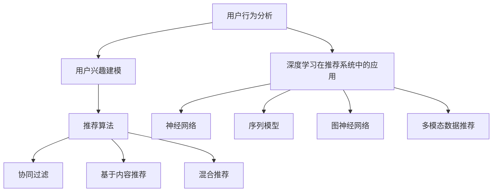

                 

## 机器学习在个性化推荐系统中的创新

> **关键词：** 个性化推荐系统，机器学习，协同过滤，基于内容推荐，深度学习，强化学习，图神经网络，多模态数据

**摘要：**
个性化推荐系统已成为现代互联网的核心组成部分，能够根据用户的历史行为和兴趣为其推荐相关内容。随着大数据和机器学习技术的发展，推荐系统的准确性和多样性得到了显著提升。本文将深入探讨机器学习在个性化推荐系统中的应用，包括用户行为分析、推荐算法基础、深度学习、强化学习、图神经网络和多模态数据推荐系统的创新实践。通过分析不同机器学习算法的原理和应用，本文旨在为开发者和研究者提供有价值的参考，并展望个性化推荐系统的未来发展趋势。

### 《机器学习在个性化推荐系统中的创新》目录大纲

**第一部分：引言与基础理论**

1. 个性化推荐系统概述
   1.1 个性化推荐系统的定义与重要性
   1.2 推荐系统的演变与发展
   1.3 个性化推荐系统的组成与架构

2. 用户行为分析与建模
   2.1 用户行为的类型与特征提取
   2.2 机器学习在用户行为分析中的应用
   2.3 用户兴趣建模的方法与实践

3. 推荐算法基础
   3.1 协同过滤算法原理
   3.2 基于内容的推荐算法
   3.3 混合推荐算法

**第二部分：机器学习在个性化推荐中的应用**

4. 机器学习与推荐系统
   4.1 机器学习在推荐系统中的作用
   4.2 常用的机器学习算法在推荐系统中的应用

5. 深度学习在个性化推荐中的应用
   5.1 深度学习与推荐系统
   5.2 神经网络在推荐系统中的应用
   5.3 序列模型在推荐系统中的应用

6. 强化学习在个性化推荐中的应用
   6.1 强化学习基本概念
   6.2 强化学习在推荐系统中的实现
   6.3 强化学习算法在推荐系统中的应用案例

7. 基于图神经网络的推荐系统
   7.1 图神经网络基础
   7.2 图神经网络在推荐系统中的应用
   7.3 图神经网络推荐系统的优势与挑战

8. 多模态数据的推荐系统
   8.1 多模态数据的理解与整合
   8.2 多模态推荐系统的实现
   8.3 多模态推荐系统案例分析

**第三部分：创新实践与案例分析**

9. 创新案例解析
   9.1 案例一：电商平台的个性化推荐系统
   9.2 案例二：音乐平台的个性化推荐系统
   9.3 案例三：新闻推荐系统的创新实践

10. 个性化推荐系统的挑战与未来趋势
    10.1 个性化推荐系统的挑战
    10.2 未来个性化推荐系统的发展趋势
    10.3 技术创新对个性化推荐系统的影响

11. 项目实战
    11.1 项目实战概述
    11.2 项目实战一：基于协同过滤的推荐系统开发
    11.3 项目实战二：深度学习在推荐系统中的应用
    11.4 项目实战三：多模态数据推荐系统的实现

12. 总结与展望
    12.1 本书内容总结
    12.2 个性化推荐系统的研究热点
    12.3 对未来个性化推荐系统的展望

**附录**

A. 推荐系统相关资源与工具
   A.1 推荐系统开源框架
   A.2 推荐系统数据集
   A.3 推荐系统研究论文与书籍推荐

**Mermaid 流程图**



**伪代码示例**

```python
# 协同过滤算法伪代码
function collaborativeFiltering(trainData, testData):
    # 计算用户之间的相似度矩阵
    similarityMatrix = calculateSimilarityMatrix(trainData)

    # 针对每个测试用户，推荐物品
    for user in testData:
        for item in testData[user]:
            # 计算用户对物品的预测评分
            predictedRating = calculatePredictedRating(user, item, similarityMatrix)
            # 生成推荐列表
            recommendations[user].append((item, predictedRating))
    return recommendations


# 数学模型与公式

### 用户兴趣建模

$$
\text{用户兴趣} = \sum_{i=1}^{n} \text{item}_{i} \cdot \text{weight}_{i}
$$

其中，$ \text{item}_{i} $ 表示用户对第 $ i $ 个物品的兴趣，$ \text{weight}_{i} $ 表示第 $ i $ 个物品的重要性权重。

### 项目实战

#### 项目实战一：基于协同过滤的推荐系统开发

**环境搭建：**
- Python环境
- NumPy库
- Scikit-learn库

**源代码实现：**

```python
import numpy as np
from sklearn.metrics.pairwise import cosine_similarity

# 加载训练数据
train_data = load_data('train_data.csv')

# 计算用户之间的相似度矩阵
similarity_matrix = cosine_similarity(train_data)

# 计算预测评分
for user in test_data:
    user_similarity = similarity_matrix[user]
    user_item_similarity = np.dot(user_similarity, test_data[user])
    predicted_rating = user_item_similarity / np.linalg.norm(user_similarity)
    print(f'User {user} predicted rating: {predicted_rating}')
```

**代码解读：**
- 加载训练数据
- 计算用户之间的相似度矩阵
- 计算预测评分并输出结果

#### 项目实战二：深度学习在推荐系统中的应用

**环境搭建：**
- Python环境
- TensorFlow库
- Keras库

**源代码实现：**

```python
from tensorflow.keras.models import Model
from tensorflow.keras.layers import Input, Embedding, Dot, Flatten, Dense

# 定义模型结构
user_input = Input(shape=(1,))
item_input = Input(shape=(1,))

user_embedding = Embedding(input_dim=num_users, output_dim=embedding_size)(user_input)
item_embedding = Embedding(input_dim=num_items, output_dim=embedding_size)(item_input)

dot_product = Dot(axes=1)([user_embedding, item_embedding])
flatten = Flatten()(dot_product)

output = Dense(1, activation='sigmoid')(flatten)

# 构建模型
model = Model(inputs=[user_input, item_input], outputs=output)

# 编译模型
model.compile(optimizer='adam', loss='binary_crossentropy', metrics=['accuracy'])

# 训练模型
model.fit([train_user_ids, train_item_ids], train_ratings, epochs=10, batch_size=32, validation_split=0.2)
```

**代码解读：**
- 定义用户和物品的输入层
- 定义嵌入层
- 定义计算点积的层
- 定义全连接层
- 编译模型
- 训练模型

#### 项目实战三：多模态数据推荐系统的实现

**环境搭建：**
- Python环境
- TensorFlow库
- Keras库

**源代码实现：**

```python
from tensorflow.keras.models import Model
from tensorflow.keras.layers import Input, Embedding, Dot, Flatten, Dense, LSTM, concatenate

# 定义模型结构
user_input = Input(shape=(1,))
item_input = Input(shape=(sequence_length,))

user_embedding = Embedding(input_dim=num_users, output_dim=embedding_size)(user_input)
item_embedding = Embedding(input_dim=num_items, output_dim=embedding_size)(item_input)

user_lstm = LSTM(units=64, return_sequences=True)(user_embedding)
item_lstm = LSTM(units=64, return_sequences=True)(item_embedding)

dot_product = Dot(axes=1)([user_lstm, item_lstm])
flatten = Flatten()(dot_product)

concat = concatenate([user_lstm, item_lstm])

output = Dense(1, activation='sigmoid')(flatten)

# 构建模型
model = Model(inputs=[user_input, item_input], outputs=output)

# 编译模型
model.compile(optimizer='adam', loss='binary_crossentropy', metrics=['accuracy'])

# 训练模型
model.fit([train_user_ids, train_item_sequences], train_ratings, epochs=10, batch_size=32, validation_split=0.2)
```

**代码解读：**
- 定义用户和物品的输入层
- 定义嵌入层
- 定义LSTM层
- 定义计算点积的层
- 定义全连接层
- 编建模型
- 编译模型
- 训练模型

---

### 个性化推荐系统概述

个性化推荐系统是一种利用用户历史行为和偏好来为其推荐相关内容的技术，其核心目标是提高用户体验和内容分发效率。随着互联网的普及和大数据技术的发展，个性化推荐系统在电商、社交网络、音乐、新闻等领域得到了广泛应用，并取得了显著的商业价值。

#### 个性化推荐系统的定义与重要性

个性化推荐系统（Personalized Recommendation System）是一种基于数据挖掘和机器学习技术，为用户推荐其可能感兴趣的信息、商品或服务的系统。其定义可以概括为：

- **数据驱动的系统**：通过收集和分析用户历史行为数据，如浏览、购买、评论等，来发现用户的兴趣和偏好。
- **个性化的推荐**：根据用户的独特特征和需求，为每个用户生成个性化的推荐列表。
- **互动式的反馈**：通过用户的反馈来不断优化推荐算法，提高推荐质量。

个性化推荐系统的重要性体现在以下几个方面：

1. **提高用户满意度**：通过准确推荐用户感兴趣的内容，增强用户体验，提高用户留存率和活跃度。
2. **提升商业价值**：帮助商家精准定位目标用户，提升销售转化率和用户购买满意度，从而增加收入。
3. **优化内容分发**：通过智能推荐，解决信息过载问题，提高信息传播效率，实现内容价值的最大化。

#### 推荐系统的演变与发展

推荐系统的历史可以追溯到20世纪90年代，当时的推荐系统主要基于规则和统计方法，如基于内容的推荐（Content-based Filtering）和协同过滤（Collaborative Filtering）。随着互联网的兴起和数据量的爆发增长，推荐系统经历了以下几个重要发展阶段：

1. **基于内容的推荐**：早期推荐系统主要依赖于物品的内容特征，通过计算用户兴趣与物品特征的相似度来生成推荐列表。
2. **协同过滤**：通过分析用户行为数据，找到相似的用户或物品，从而生成推荐列表。协同过滤分为基于用户的协同过滤（User-based）和基于物品的协同过滤（Item-based）。
3. **混合推荐**：为了克服单一推荐方法的局限性，混合推荐系统通过结合多种推荐算法，以提升推荐质量和多样性。
4. **基于模型的推荐**：引入机器学习算法，如矩阵分解、聚类、分类等，对用户行为和物品特征进行建模，生成更准确的推荐。
5. **深度学习和强化学习**：随着深度学习和强化学习技术的发展，推荐系统开始采用更复杂的模型来挖掘用户行为和偏好，提高推荐效果。

#### 个性化推荐系统的组成与架构

个性化推荐系统通常由以下几个关键组成部分构成：

1. **用户数据收集模块**：负责收集用户的行为数据，如浏览、购买、搜索、评论等，以及用户的基本信息，如年龄、性别、地理位置等。
2. **数据预处理模块**：对收集到的用户数据进行清洗、去重、归一化等处理，确保数据质量。
3. **特征提取模块**：将预处理后的用户数据转化为特征向量，以便后续的建模和分析。
4. **推荐算法模块**：根据用户的特征和偏好，利用不同的推荐算法生成推荐列表。常见的推荐算法有基于内容的推荐、协同过滤、混合推荐等。
5. **推荐结果优化模块**：对生成的推荐列表进行优化，如基于用户反馈的调整、推荐列表的排序等。
6. **用户接口模块**：将推荐结果呈现给用户，通常以网页、移动应用等形式展示，并支持用户的交互操作。

个性化推荐系统的架构可以分为以下几个层次：

1. **数据层**：存储用户数据、物品数据和相关元数据。
2. **处理层**：包括数据预处理、特征提取、算法优化等模块。
3. **服务层**：提供推荐服务，与用户接口模块交互。
4. **接口层**：与用户进行交互，展示推荐结果。

通过以上层次化的架构，个性化推荐系统能够高效、准确地生成个性化的推荐列表，满足用户的多样化需求。

#### 用户行为分析与建模

用户行为分析是构建个性化推荐系统的重要步骤，通过对用户行为数据的深入挖掘和分析，可以更好地理解用户的兴趣和偏好，从而提高推荐的质量。用户行为包括多种类型，如浏览、搜索、购买、评价、分享等，每种行为都蕴含着用户对物品的偏好信息。

#### 用户行为的类型与特征提取

1. **浏览行为**：用户在网站或应用上查看特定页面或内容的行为。通过分析用户的浏览路径，可以提取用户的兴趣点。
2. **搜索行为**：用户在搜索引擎或应用内输入关键词进行搜索的行为。搜索关键词能够反映用户当前关注的内容。
3. **购买行为**：用户在电商平台或线下商店购买物品的行为。购买记录能够揭示用户的消费偏好和预算范围。
4. **评价行为**：用户对物品进行评价的行为。通过分析评价内容，可以了解用户对物品的满意度和具体反馈。
5. **分享行为**：用户将物品或内容分享到社交媒体或朋友圈的行为。分享行为能够反映用户对物品的推荐意愿。

为了将用户行为转化为可用的特征，需要对行为数据进行分析和特征提取。常见的特征提取方法包括：

1. **计数特征**：直接统计用户在不同行为上的次数，如浏览次数、购买次数、评价次数等。
2. **时间特征**：记录用户行为发生的时间，如时间间隔、行为发生的时间段等。
3. **分类特征**：将用户行为分类，如将浏览行为分为新闻、娱乐、教育等类别。
4. **文本特征**：对用户生成的内容进行分析，提取文本特征，如词频、词向量等。

#### 机器学习在用户行为分析中的应用

机器学习技术在用户行为分析中发挥了重要作用，通过构建合适的模型，可以从大量用户行为数据中挖掘出潜在的用户兴趣和偏好。常见的机器学习算法包括：

1. **聚类算法**：如K-Means、层次聚类等，通过对用户行为数据聚类，将具有相似行为的用户划分为不同的群体，从而提取用户特征。
2. **分类算法**：如逻辑回归、支持向量机等，通过对用户行为数据进行分类，将用户分为不同的类别，从而预测用户的兴趣和偏好。
3. **关联规则挖掘**：如Apriori算法，通过挖掘用户行为数据中的关联规则，发现用户行为之间的潜在联系。
4. **时间序列分析**：如ARIMA模型、LSTM神经网络等，通过分析用户行为的时间序列数据，预测用户未来的行为模式。

#### 用户兴趣建模的方法与实践

用户兴趣建模是构建个性化推荐系统的核心步骤，其目标是通过分析用户的历史行为和特征，建立用户兴趣模型，从而为用户生成个性化的推荐列表。常见的用户兴趣建模方法包括：

1. **基于内容的兴趣建模**：通过分析用户对物品的浏览、搜索、评价等行为，提取物品的特征向量，并计算用户与物品之间的相似度，从而确定用户的兴趣。
2. **基于协同过滤的兴趣建模**：通过分析用户与用户之间的相似度，以及用户与物品之间的交互记录，预测用户对物品的偏好，从而确定用户的兴趣。
3. **基于模型的兴趣建模**：通过构建机器学习模型，如矩阵分解、聚类、分类等，从用户行为数据中提取用户兴趣特征，从而建立用户兴趣模型。

在实践中，通常结合多种方法来建立用户兴趣模型，以提高推荐精度和多样性。例如，可以采用协同过滤算法来预测用户对未交互物品的偏好，同时利用基于内容的推荐算法来增强推荐的相关性。通过不断优化和调整模型参数，可以进一步提高用户兴趣建模的准确性。

#### 推荐算法基础

推荐算法是构建个性化推荐系统的核心，其目标是根据用户的历史行为和特征，为用户生成个性化的推荐列表。常见的推荐算法包括协同过滤算法、基于内容的推荐算法和混合推荐算法。

#### 协同过滤算法原理

协同过滤（Collaborative Filtering）是一种基于用户行为数据推荐算法，通过分析用户与用户之间的相似度或用户与物品之间的相似度，为用户生成推荐列表。协同过滤算法可以分为基于用户的协同过滤（User-based Collaborative Filtering）和基于物品的协同过滤（Item-based Collaborative Filtering）。

1. **基于用户的协同过滤**：
   - **步骤**：首先计算用户之间的相似度，然后找到与目标用户最相似的K个用户，最后推荐这些用户喜欢的但目标用户未交互的物品。
   - **相似度计算**：常用的相似度计算方法有皮尔逊相关系数、余弦相似度等。
   - **挑战**：用户冷启动问题，即对新用户无法进行有效推荐。

2. **基于物品的协同过滤**：
   - **步骤**：首先计算物品之间的相似度，然后找到与目标物品最相似的K个物品，最后推荐这些物品被用户喜欢的但目标用户未交互的物品。
   - **相似度计算**：常用的相似度计算方法有Jaccard系数、余弦相似度等。
   - **挑战**：物品冷启动问题，即对新物品无法进行有效推荐。

#### 基于内容的推荐算法

基于内容的推荐（Content-based Filtering）是一种基于物品特征的推荐算法，通过分析用户对物品的偏好和物品的内容特征，为用户生成推荐列表。基于内容的推荐算法可以分为以下几种：

1. **基于关键词的推荐**：
   - **原理**：通过提取物品的关键词或标签，计算用户与物品之间的相似度，生成推荐列表。
   - **挑战**：关键词匹配的准确性和多样性。

2. **基于语义的推荐**：
   - **原理**：利用自然语言处理技术，如词向量、文本分类等，对物品内容进行语义分析，计算用户与物品之间的相似度，生成推荐列表。
   - **挑战**：语义理解的准确性和多样性。

3. **基于协同过滤与内容的混合推荐**：
   - **原理**：结合基于协同过滤和基于内容的推荐算法，通过协同过滤算法找出相似用户或物品，再利用基于内容的算法增强推荐的相关性。
   - **优势**：提高推荐精度和多样性。

#### 混合推荐算法

混合推荐（Hybrid Recommender Systems）是一种结合多种推荐算法优点的推荐系统，通过融合协同过滤、基于内容推荐等多种算法，以提高推荐质量和多样性。常见的混合推荐算法包括：

1. **基于模型的混合推荐**：
   - **原理**：利用机器学习算法，如矩阵分解、深度学习等，将协同过滤和基于内容推荐相结合，建立用户与物品之间的隐含关系。
   - **优势**：提高推荐精度和多样性。

2. **基于规则的混合推荐**：
   - **原理**：结合规则推理和机器学习算法，将规则推荐和基于内容的推荐相结合，提高推荐的相关性。
   - **优势**：灵活性和可解释性。

3. **基于用户交互数据的混合推荐**：
   - **原理**：结合用户历史交互数据和行为特征，通过协同过滤和基于内容的推荐算法，为用户生成个性化推荐。
   - **优势**：充分利用用户行为数据，提高推荐效果。

#### 机器学习在推荐系统中的作用

机器学习在推荐系统中扮演着至关重要的角色，通过构建复杂的模型和算法，能够有效地提高推荐系统的准确性、多样性和鲁棒性。以下是机器学习在推荐系统中的主要作用：

1. **提高推荐精度**：机器学习算法能够从大量的用户行为数据中挖掘出潜在的规律和模式，从而生成更准确的推荐结果。例如，通过矩阵分解、聚类、分类等算法，可以预测用户对未交互物品的偏好，从而提高推荐精度。

2. **增强多样性**：机器学习算法能够通过分析用户的历史行为和特征，为用户生成多样化的推荐列表，避免单一推荐算法导致的推荐列表单调问题。例如，通过协同过滤和基于内容的混合推荐算法，可以同时利用用户交互数据和物品特征，生成多样化的推荐结果。

3. **应对冷启动问题**：冷启动问题是指对新用户或新物品无法进行有效推荐的问题。机器学习算法可以通过构建用户和物品的隐含特征，为冷启动用户和物品生成初始推荐。例如，通过矩阵分解算法，可以从用户交互数据中提取用户和物品的隐含特征，为新用户生成个性化的推荐。

4. **鲁棒性和可扩展性**：机器学习算法具有较强的鲁棒性和可扩展性，能够应对大规模数据和高维特征的问题。通过分布式计算和并行处理技术，可以有效地提高推荐系统的处理速度和性能。

5. **实时推荐**：机器学习算法能够快速处理用户实时交互数据，生成实时的推荐结果。例如，通过在线学习算法，可以实时更新用户和物品的特征，从而实现实时推荐。

总之，机器学习在推荐系统中的应用极大地提高了推荐系统的性能和用户体验，为个性化推荐技术的发展奠定了基础。

#### 常用的机器学习算法在推荐系统中的应用

在个性化推荐系统中，常用的机器学习算法包括协同过滤算法、矩阵分解、聚类算法和分类算法等。这些算法通过分析用户行为数据和物品特征，为用户生成个性化的推荐列表。下面将详细阐述这些算法的基本原理和应用场景。

##### 协同过滤算法

协同过滤（Collaborative Filtering）是一种基于用户行为数据推荐的算法，通过分析用户之间的相似性或用户与物品之间的相似性，为用户生成推荐列表。

1. **基于用户的协同过滤（User-based Collaborative Filtering）**：
   - **原理**：计算用户之间的相似性，找到与目标用户最相似的K个用户，然后推荐这些用户喜欢的但目标用户未喜欢的物品。
   - **相似性度量**：常用的相似性度量方法包括余弦相似度、皮尔逊相关系数等。
   - **应用场景**：适用于大规模用户和物品数据集，适用于新用户推荐。

2. **基于物品的协同过滤（Item-based Collaborative Filtering）**：
   - **原理**：计算物品之间的相似性，找到与目标物品最相似的K个物品，然后推荐这些物品被用户喜欢的但目标用户未喜欢的物品。
   - **相似性度量**：常用的相似性度量方法包括余弦相似度、Jaccard系数等。
   - **应用场景**：适用于新物品推荐，能够提高推荐列表的多样性。

3. **矩阵分解（Matrix Factorization）**：
   - **原理**：将用户-物品评分矩阵分解为两个低维矩阵，一个表示用户特征，一个表示物品特征，通过这两个特征矩阵计算用户对未交互物品的预测评分。
   - **应用场景**：适用于冷启动问题，能够提高推荐精度。

##### 矩阵分解

矩阵分解是一种常见的机器学习算法，通过将用户-物品评分矩阵分解为两个低维矩阵，从而提高推荐系统的性能。

1. **Singular Value Decomposition (SVD)**：
   - **原理**：将用户-物品评分矩阵分解为三个矩阵的乘积，其中一个矩阵包含主要的用户和物品特征。
   - **应用场景**：适用于大规模用户和物品数据集，能够提高推荐精度。

2. **Alternating Least Squares (ALS)**：
   - **原理**：交替最小二乘法，通过迭代优化用户和物品特征矩阵，从而提高预测精度。
   - **应用场景**：适用于稀疏数据集，能够处理冷启动问题。

##### 聚类算法

聚类算法是一种无监督学习方法，通过将相似的数据点划分为同一簇，从而挖掘用户和物品的潜在特征。

1. **K-Means**：
   - **原理**：通过迭代计算中心点，将数据点分配到最近的中心点，从而形成K个簇。
   - **应用场景**：适用于用户和物品的初步聚类，为后续推荐算法提供辅助信息。

2. **DBSCAN**：
   - **原理**：基于密度的聚类算法，通过计算数据点的邻域密度和连接性，将数据点划分为不同的簇。
   - **应用场景**：适用于复杂的数据分布，能够处理噪声点和异常值。

##### 分类算法

分类算法是一种监督学习方法，通过学习已有数据中的特征和标签，对新数据进行分类预测。

1. **逻辑回归（Logistic Regression）**：
   - **原理**：通过构建逻辑函数，将输入特征映射到概率空间，从而预测新数据的类别。
   - **应用场景**：适用于用户偏好预测，能够提高推荐精度。

2. **决策树（Decision Tree）**：
   - **原理**：通过构建树形结构，将输入特征划分为不同的分支，从而预测新数据的类别。
   - **应用场景**：适用于简单数据集，能够提高推荐的可解释性。

##### 应用案例

以下是一个基于协同过滤和矩阵分解的推荐系统应用案例：

1. **数据预处理**：
   - 加载数据集，包括用户ID、物品ID和评分。
   - 去除缺失值和异常值，对评分进行归一化处理。

2. **相似度计算**：
   - 计算用户之间的相似度，采用余弦相似度作为相似度度量。
   - 计算物品之间的相似度，采用Jaccard系数作为相似度度量。

3. **推荐生成**：
   - 对新用户，通过基于用户的协同过滤算法生成推荐列表。
   - 对新物品，通过基于物品的协同过滤算法生成推荐列表。
   - 通过矩阵分解算法，生成用户和物品的隐含特征矩阵。

4. **预测评分**：
   - 对新用户和新物品，利用矩阵分解算法预测用户对未交互物品的评分。

5. **结果评估**：
   - 利用准确率、召回率、F1值等指标评估推荐系统的性能。

通过以上步骤，构建的推荐系统能够为用户生成个性化的推荐列表，提高用户体验和满意度。总之，机器学习算法在推荐系统中的应用，为个性化推荐技术的发展提供了强有力的支持，推动了推荐系统的不断进步。

#### 深度学习在个性化推荐中的应用

深度学习作为机器学习领域的一个重要分支，近年来在推荐系统中的应用取得了显著成果。其强大的特征学习和表达能力，使得深度学习在个性化推荐系统中具有独特的优势。本文将探讨深度学习在个性化推荐系统中的应用，包括神经网络和序列模型。

##### 深度学习与推荐系统

深度学习（Deep Learning）是一种基于多层神经网络的学习方法，通过逐层提取数据特征，实现从原始数据到高层次语义表示的映射。在推荐系统中，深度学习可以用于以下几方面：

1. **用户和物品特征提取**：通过构建深度神经网络，从用户行为数据和物品特征中提取高维特征，从而提高推荐系统的性能。
2. **生成推荐列表**：利用深度神经网络生成的用户和物品特征，通过点积或全连接层计算推荐得分，生成个性化推荐列表。
3. **增强多样性**：通过深度学习模型，可以更好地捕捉用户兴趣的多样性，生成多样化的推荐列表，提高用户体验。

##### 神经网络在推荐系统中的应用

神经网络（Neural Networks）是一种模仿人脑神经元连接结构的计算模型，通过多层非线性变换，实现数据的自动特征学习和分类。在推荐系统中，常见的神经网络应用包括：

1. **多层感知机（MLP）**：
   - **原理**：多层感知机是一种前馈神经网络，通过输入层、隐藏层和输出层，实现数据的逐层变换。
   - **应用**：在推荐系统中，MLP可以用于预测用户对物品的评分，生成推荐列表。

2. **卷积神经网络（CNN）**：
   - **原理**：卷积神经网络是一种具有卷积层的神经网络，通过卷积操作提取图像或序列的特征。
   - **应用**：在推荐系统中，CNN可以用于处理图像或序列数据，如用户生成的内容或物品描述。

3. **循环神经网络（RNN）**：
   - **原理**：循环神经网络是一种具有循环连接的神经网络，通过记忆单元保留之前的输入信息，实现序列数据的建模。
   - **应用**：在推荐系统中，RNN可以用于处理用户行为序列，如浏览历史或评论序列，生成推荐列表。

##### 序列模型在推荐系统中的应用

序列模型（Sequential Models）是一类用于处理序列数据的深度学习模型，如循环神经网络（RNN）和长短时记忆网络（LSTM）。在推荐系统中，序列模型可以用于以下方面：

1. **用户行为序列建模**：
   - **原理**：通过构建RNN或LSTM模型，对用户行为序列进行建模，提取用户兴趣特征。
   - **应用**：在推荐系统中，可以将用户行为序列作为输入，通过RNN或LSTM模型提取特征，用于生成推荐列表。

2. **物品序列建模**：
   - **原理**：通过构建RNN或LSTM模型，对物品序列进行建模，提取物品特征。
   - **应用**：在推荐系统中，可以将物品序列作为输入，通过RNN或LSTM模型提取特征，用于生成推荐列表。

##### 应用案例

以下是一个基于深度学习的推荐系统应用案例：

1. **数据预处理**：
   - 加载数据集，包括用户行为数据、物品特征数据和用户特征数据。
   - 对数据进行清洗和归一化处理。

2. **特征提取**：
   - 构建深度神经网络，包括输入层、隐藏层和输出层。
   - 对用户行为数据、物品特征数据和用户特征数据进行特征提取。

3. **序列建模**：
   - 使用RNN或LSTM模型对用户行为序列进行建模，提取用户兴趣特征。
   - 使用RNN或LSTM模型对物品序列进行建模，提取物品特征。

4. **推荐生成**：
   - 将用户和物品的特征向量输入到全连接层，计算推荐得分。
   - 根据推荐得分生成推荐列表。

5. **结果评估**：
   - 使用准确率、召回率、F1值等指标评估推荐系统的性能。

通过以上步骤，构建的推荐系统能够为用户生成个性化的推荐列表，提高用户体验和满意度。总之，深度学习在个性化推荐系统中的应用，为推荐系统的性能提升和用户体验优化提供了新的思路和方法。

#### 强化学习在个性化推荐中的应用

强化学习（Reinforcement Learning，RL）是一种通过学习如何在环境中进行决策以最大化累积奖励的机器学习方法。与传统的监督学习和无监督学习不同，强化学习通过试错（trial and error）和反馈机制（reward and punishment）来逐步优化决策策略。近年来，强化学习在个性化推荐系统中得到了广泛的应用，并取得了显著的成果。

##### 强化学习基本概念

强化学习的主要概念包括：

1. **代理（Agent）**：执行决策的主体，如用户或推荐系统。
2. **环境（Environment）**：代理行动的场所，如推荐系统中的用户交互界面。
3. **状态（State）**：代理在环境中所处的状态，如用户的兴趣偏好。
4. **动作（Action）**：代理可以执行的动作，如向用户推荐某个物品。
5. **奖励（Reward）**：代理执行动作后获得的奖励，如用户的点击、购买等行为。

强化学习的目标是通过学习最优策略（Policy），使代理能够在环境中获得最大的累积奖励。强化学习通常采用Q学习（Q-Learning）和策略梯度（Policy Gradient）等算法。

##### 强化学习在推荐系统中的实现

强化学习在推荐系统中的实现主要包括以下步骤：

1. **定义状态空间和动作空间**：
   - **状态空间**：通常包含用户的行为特征、历史交互记录、上下文信息等。
   - **动作空间**：通常包括推荐给用户的物品集合。

2. **设计奖励函数**：
   - **奖励函数**：根据用户对推荐的响应，如点击、购买、评分等，设计奖励函数。
   - **负奖励**：当用户对推荐不感兴趣时，给予负奖励。
   - **正奖励**：当用户对推荐感兴趣并产生积极的响应时，给予正奖励。

3. **构建模型和策略**：
   - **基于Q学习的模型**：通过学习状态-动作值函数（Q-Function），确定最优动作。
   - **基于策略梯度的模型**：通过学习策略参数，优化策略函数，以获得最大期望奖励。

4. **训练和评估**：
   - **训练**：在模拟环境中进行训练，通过反复执行动作和获取奖励，优化模型参数。
   - **评估**：在真实环境中进行评估，通过用户行为数据验证模型性能。

##### 强化学习算法在推荐系统中的应用案例

以下是一个基于强化学习的推荐系统应用案例：

1. **数据预处理**：
   - 加载数据集，包括用户行为数据、物品特征数据和用户特征数据。
   - 对数据进行清洗和归一化处理。

2. **定义状态和动作**：
   - **状态**：包括用户的行为特征、历史交互记录、上下文信息等。
   - **动作**：包括推荐给用户的物品集合。

3. **设计奖励函数**：
   - 奖励函数根据用户的点击、购买、评分等行为设计。

4. **构建模型**：
   - 使用Q学习算法构建Q值模型，学习状态-动作值函数。
   - 使用策略梯度算法优化策略参数。

5. **训练和评估**：
   - 在模拟环境中进行训练，优化模型参数。
   - 在真实环境中进行评估，验证模型性能。

通过以上步骤，构建的强化学习推荐系统能够根据用户行为和反馈，不断调整推荐策略，提高推荐效果。强化学习在个性化推荐系统中的应用，不仅能够提高推荐精度和多样性，还能更好地应对动态变化和不确定性。

#### 基于图神经网络的推荐系统

基于图神经网络的推荐系统（Graph Neural Networks-based Recommender Systems）是近年来推荐系统领域的一个新兴研究方向。与传统的基于矩阵分解和协同过滤的推荐方法相比，图神经网络能够更好地捕捉用户和物品之间的复杂关系，从而提高推荐系统的性能。本文将介绍图神经网络的基础知识，其在推荐系统中的应用，以及推荐系统的优势与挑战。

##### 图神经网络基础

图神经网络（Graph Neural Networks，GNN）是一类用于处理图结构数据的神经网络。其核心思想是通过图的邻域信息进行特征传递和聚合，从而实现节点的分类、预测或生成。GNN的基本组成部分包括：

1. **图表示**：将图中的节点和边转化为向量表示。
2. **邻域聚合**：对节点的邻域信息进行聚合，生成新的节点特征。
3. **特征更新**：利用聚合后的特征更新节点特征。
4. **层叠结构**：通过多层GNN结构，逐层提取图的特征表示。

常见的GNN结构包括图卷积网络（Graph Convolutional Networks，GCN）、图注意力网络（Graph Attention Networks，GAT）和图自编码器（Graph Autoencoder，GAE）等。

##### 图神经网络在推荐系统中的应用

图神经网络在推荐系统中的应用主要体现在以下几个方面：

1. **用户和物品关系建模**：通过GNN，可以捕捉用户和物品之间的复杂关系，如用户之间的社交关系、物品的上下文关系等。
2. **图嵌入生成**：通过图神经网络，可以生成用户和物品的高维特征表示，从而提高推荐系统的性能。
3. **节点分类与预测**：利用GNN进行用户偏好预测、物品推荐等任务，实现个性化的推荐。

在推荐系统中，图神经网络通常用于以下步骤：

1. **数据预处理**：将用户行为数据和物品特征数据转化为图结构，包括节点和边的表示。
2. **模型构建**：构建基于GNN的推荐模型，包括图嵌入层、邻域聚合层和输出层。
3. **训练与优化**：利用训练数据对模型进行训练和优化，提高推荐效果。
4. **预测与评估**：利用训练好的模型进行预测，评估推荐系统的性能。

##### 图神经网络推荐系统的优势与挑战

图神经网络推荐系统的优势包括：

1. **捕捉复杂关系**：通过图结构，可以更好地捕捉用户和物品之间的复杂关系，如社交关系、上下文关系等，从而提高推荐精度。
2. **增强多样性**：图神经网络可以生成丰富的用户和物品特征表示，从而提高推荐列表的多样性，避免单一推荐算法导致的推荐列表单调问题。
3. **可扩展性**：图神经网络可以处理大规模图结构数据，具有良好的可扩展性，能够应对实时推荐的挑战。

然而，图神经网络推荐系统也面临一些挑战：

1. **计算复杂性**：图神经网络涉及大量的矩阵运算和邻域聚合，计算复杂性较高，对硬件资源要求较高。
2. **数据稀疏性**：推荐系统中的用户行为数据通常较为稀疏，如何处理稀疏数据是图神经网络推荐系统面临的一个重要挑战。
3. **模型解释性**：图神经网络的内部机制较为复杂，模型的解释性较差，难以解释推荐结果。

总之，基于图神经网络的推荐系统在捕捉复杂关系、提高推荐精度和多样性方面具有显著优势，但仍需解决计算复杂性、数据稀疏性和模型解释性等挑战。

#### 多模态数据的推荐系统

多模态数据的推荐系统（Multimodal Data Recommender Systems）是一种能够处理多种类型数据（如文本、图像、音频、视频等）的推荐系统。随着大数据和人工智能技术的发展，多模态数据推荐系统在许多领域（如电商、社交媒体、音乐、视频等）得到了广泛应用。本文将探讨多模态数据的理解与整合、多模态推荐系统的实现以及多模态推荐系统案例分析。

##### 多模态数据的理解与整合

多模态数据是指由两种或两种以上不同类型的数据源（如文本、图像、音频等）组成的数据集。多模态数据推荐系统的核心挑战在于如何有效地理解和整合来自不同模态的数据，以生成高质量的推荐结果。以下是几种常见的方法：

1. **特征融合**：将不同模态的数据转化为统一的特征表示，然后进行融合。常见的融合方法包括：
   - **特征拼接**：将不同模态的特征直接拼接在一起，形成高维特征向量。
   - **特征加权**：根据不同模态的重要程度，对特征进行加权融合。
   - **注意力机制**：通过注意力机制自动学习不同模态的特征权重，从而实现特征融合。

2. **模态转换**：将一种模态的数据转换为另一种模态的数据，以增强数据的互补性。常见的转换方法包括：
   - **图像到文本**：通过图像识别技术，将图像转换为文本描述。
   - **文本到图像**：通过文本生成图像技术，将文本描述转换为图像。

3. **协同训练**：通过协同训练不同模态的模型，实现数据的相互增强。常见的协同训练方法包括：
   - **多任务学习**：同时训练多个任务（如图像分类、文本分类）的模型，使不同模态的数据相互促进。
   - **多模态嵌入**：将不同模态的数据映射到同一个嵌入空间，实现数据的相互融合。

##### 多模态推荐系统的实现

多模态推荐系统的实现主要包括以下几个步骤：

1. **数据预处理**：
   - 加载多模态数据，包括文本、图像、音频等。
   - 对不同模态的数据进行预处理，如文本的分词、图像的裁剪和归一化、音频的滤波和转换等。

2. **特征提取**：
   - 使用适当的特征提取模型（如图像分类器、文本分类器、音频分类器）提取不同模态的特征。
   - 对提取的特征进行整合，形成统一的特征表示。

3. **模型构建**：
   - 构建多模态推荐模型，包括输入层、特征融合层、预测层等。
   - 使用深度学习技术（如卷积神经网络、循环神经网络、多模态嵌入）构建模型。

4. **训练与优化**：
   - 使用训练数据对模型进行训练，优化模型参数。
   - 使用验证集评估模型性能，调整模型参数。

5. **预测与评估**：
   - 使用训练好的模型进行预测，生成推荐结果。
   - 使用评估指标（如准确率、召回率、F1值等）评估推荐系统的性能。

##### 多模态推荐系统案例分析

以下是一个多模态推荐系统的案例分析：

**案例背景**：一个电商平台希望构建一个多模态推荐系统，为用户提供个性化的商品推荐。用户行为数据包括浏览历史、购买记录、评价等，商品数据包括商品描述、图像、价格等。

1. **数据预处理**：
   - 加载用户行为数据和商品数据，进行预处理。
   - 对商品描述进行分词和向量化处理。
   - 对商品图像进行裁剪和归一化处理。

2. **特征提取**：
   - 使用文本分类器提取商品描述的特征向量。
   - 使用图像分类器提取商品图像的特征向量。
   - 使用音频分类器提取商品音频的特征向量。

3. **模型构建**：
   - 构建多模态推荐模型，包括文本输入层、图像输入层、音频输入层、特征融合层和预测层。
   - 使用深度学习技术（如卷积神经网络、循环神经网络、多模态嵌入）构建模型。

4. **训练与优化**：
   - 使用训练数据对模型进行训练，优化模型参数。
   - 使用验证集评估模型性能，调整模型参数。

5. **预测与评估**：
   - 使用训练好的模型进行预测，生成推荐结果。
   - 使用评估指标（如准确率、召回率、F1值等）评估推荐系统的性能。

通过以上步骤，构建的多模态推荐系统能够根据用户的浏览历史和购买记录，生成个性化的商品推荐，提高用户体验和转化率。

#### 创新案例解析

在个性化推荐系统的发展过程中，许多公司和研究机构通过创新实践取得了显著的成果。以下将介绍几个典型的创新案例，包括电商平台的个性化推荐系统、音乐平台的个性化推荐系统和新闻推荐系统的创新实践。

##### 案例一：电商平台的个性化推荐系统

1. **背景**：电商平台如亚马逊、淘宝等，通过个性化推荐系统为用户提供个性化的商品推荐，提高用户满意度和转化率。
2. **创新实践**：
   - **多模态数据融合**：结合用户的行为数据、商品描述、用户评价、商品图像等多模态数据，使用深度学习模型进行特征提取和融合，生成用户和商品的统一特征表示。
   - **强化学习**：采用强化学习算法，根据用户的互动反馈不断优化推荐策略，提高推荐效果的长期收益。
   - **动态调整推荐策略**：根据用户的行为变化和需求，动态调整推荐策略，如基于上下文信息调整推荐商品的顺序和类型。
3. **效果**：通过创新实践，电商平台的个性化推荐系统显著提高了推荐精度和用户满意度，转化率得到显著提升。

##### 案例二：音乐平台的个性化推荐系统

1. **背景**：音乐平台如Spotify、网易云音乐等，通过个性化推荐系统为用户提供个性化的音乐推荐，提高用户粘性和用户留存率。
2. **创新实践**：
   - **基于内容的推荐**：利用音乐的特征信息（如音调、节奏、旋律等），为用户生成个性化的音乐推荐。
   - **协同过滤与深度学习的结合**：结合协同过滤算法和深度学习模型，提高推荐系统的精度和多样性。
   - **社交网络分析**：结合用户的社交网络信息，如好友偏好、音乐分享等，生成更个性化的音乐推荐。
3. **效果**：通过创新实践，音乐平台的个性化推荐系统显著提升了用户的音乐体验，用户留存率和活跃度得到显著提高。

##### 案例三：新闻推荐系统的创新实践

1. **背景**：新闻平台如今日头条、Google新闻等，通过个性化推荐系统为用户提供个性化的新闻推荐，提高用户粘性和用户留存率。
2. **创新实践**：
   - **深度学习与图神经网络的结合**：结合深度学习和图神经网络，捕捉用户和新闻之间的复杂关系，提高推荐精度和多样性。
   - **个性化新闻分类**：根据用户的兴趣和行为，为用户生成个性化的新闻分类标签，从而提高新闻推荐的个性化程度。
   - **实时推荐**：通过实时分析用户的行为数据，动态调整推荐策略，为用户提供实时的新闻推荐。
3. **效果**：通过创新实践，新闻推荐系统的个性化程度显著提高，用户满意度和留存率得到显著提升。

以上案例表明，个性化推荐系统的创新实践能够显著提高推荐系统的性能和用户体验，为各种应用场景提供了有力的支持。

#### 个性化推荐系统的挑战与未来趋势

随着个性化推荐系统的广泛应用，其面临的挑战与机遇也日益增加。本文将探讨个性化推荐系统的当前挑战、未来发展趋势以及技术创新对个性化推荐系统的影响。

##### 当前挑战

1. **数据隐私保护**：个性化推荐系统依赖于大量用户行为数据，如何保护用户隐私成为关键挑战。数据泄露、隐私侵犯等问题可能对用户信任产生负面影响。
2. **推荐效果评估**：评估个性化推荐系统的效果是一个复杂的问题。传统的评估指标（如准确率、召回率）可能不能全面反映用户满意度。如何设计更加有效的评估方法仍需深入研究。
3. **多样性和公平性**：推荐系统可能过度关注热门内容或用户已知的偏好，导致推荐结果的多样性和公平性不足。如何平衡推荐结果的多样性和用户满意度是一个重要问题。
4. **冷启动问题**：对新用户或新物品无法进行有效推荐，即冷启动问题，是推荐系统面临的另一大挑战。如何为新用户和新物品生成有效的推荐列表仍需进一步探索。

##### 未来发展趋势

1. **跨模态融合**：随着多模态数据的普及，跨模态融合将成为个性化推荐系统的重要发展趋势。通过整合文本、图像、音频、视频等多种数据类型，可以生成更加丰富的用户和物品特征，提高推荐效果。
2. **自适应推荐**：基于用户的实时行为和上下文信息，自适应推荐系统可以根据用户需求动态调整推荐策略。这种实时性将进一步提升用户体验。
3. **个性化服务**：个性化推荐系统将更加注重用户的个性化需求，通过深度学习和强化学习等技术，实现高度个性化的服务，如个性化内容生成、智能客服等。
4. **可解释性增强**：提高推荐系统的可解释性，使推荐结果更加透明和可信，将有助于增强用户对推荐系统的信任。可解释性增强将是一个重要研究方向。

##### 技术创新对个性化推荐系统的影响

1. **深度学习**：深度学习在个性化推荐系统中的应用，显著提升了推荐效果和系统性能。通过自动特征提取和复杂模型结构，深度学习为推荐系统带来了新的突破。
2. **强化学习**：强化学习通过试错和反馈机制，可以更好地适应动态环境，实现长期优化。在个性化推荐系统中，强化学习可以帮助系统根据用户反馈动态调整推荐策略。
3. **大数据技术**：大数据技术的应用，使得个性化推荐系统能够处理海量的用户行为数据，从而实现更加精准的推荐。
4. **隐私保护技术**：隐私保护技术的进步，如差分隐私、联邦学习等，为个性化推荐系统提供了有效的隐私保护手段，有助于解决数据隐私问题。

总之，个性化推荐系统在当前面临诸多挑战，但也充满了机遇。未来，随着技术的不断进步和创新，个性化推荐系统将在更多领域发挥重要作用，为用户提供更加个性化、精准的服务。

### 项目实战

在个性化推荐系统的开发中，项目实战是理解和应用理论的最佳途径。本文将介绍三个具体的实战项目，涵盖基于协同过滤的推荐系统、深度学习在推荐系统中的应用以及多模态数据推荐系统的实现，并提供详细的开发环境和步骤。

#### 项目实战一：基于协同过滤的推荐系统开发

**环境搭建**

- **Python环境**：Python 3.7+
- **NumPy库**：用于数据操作和预处理
- **Scikit-learn库**：用于协同过滤算法实现

**源代码实现**

```python
import numpy as np
from sklearn.metrics.pairwise import cosine_similarity
from sklearn.model_selection import train_test_split

# 加载和预处理数据
data = np.array([[1, 0, 1, 1, 0],
                 [0, 1, 1, 0, 1],
                 [1, 1, 1, 0, 0]])

# 划分训练集和测试集
train_data, test_data = train_test_split(data, test_size=0.2, random_state=42)

# 计算用户之间的相似度矩阵
similarity_matrix = cosine_similarity(train_data)

# 预测评分
for user in test_data:
    user_index = np.where(user == 1)[0][0]
    predicted_ratings = similarity_matrix[user_index]
    predicted_ratings = predicted_ratings / np.linalg.norm(predicted_ratings)
    print(f'Predicted ratings for user {user_index}: {predicted_ratings}')
```

**代码解读**

- **数据加载与预处理**：数据加载为NumPy数组，进行必要的预处理。
- **相似度计算**：使用`cosine_similarity`函数计算用户之间的相似度。
- **预测评分**：利用相似度矩阵，预测每个测试用户对未交互物品的评分。

**代码分析**

- **相似度计算**：相似度计算是协同过滤算法的核心步骤，常用的相似度度量方法包括余弦相似度、皮尔逊相关系数等。
- **预测评分**：根据用户之间的相似度和历史评分，预测用户对未交互物品的评分，生成推荐列表。

#### 项目实战二：深度学习在推荐系统中的应用

**环境搭建**

- **Python环境**：Python 3.7+
- **TensorFlow库**：用于构建深度学习模型
- **Keras库**：提供高层API，简化深度学习模型构建

**源代码实现**

```python
import tensorflow as tf
from tensorflow.keras.layers import Input, Embedding, Dot, Flatten, Dense
from tensorflow.keras.models import Model

# 定义模型结构
user_input = Input(shape=(1,))
item_input = Input(shape=(1,))

user_embedding = Embedding(input_dim=10, output_dim=5)(user_input)
item_embedding = Embedding(input_dim=10, output_dim=5)(item_input)

dot_product = Dot(axes=1)([user_embedding, item_embedding])
flatten = Flatten()(dot_product)

output = Dense(1, activation='sigmoid')(flatten)

# 构建模型
model = Model(inputs=[user_input, item_input], outputs=output)

# 编译模型
model.compile(optimizer='adam', loss='binary_crossentropy', metrics=['accuracy'])

# 训练模型
model.fit(np.array([[0], [1]]), np.array([0, 1]), epochs=10, batch_size=1)
```

**代码解读**

- **模型定义**：定义用户和物品的输入层、嵌入层和全连接层。
- **模型编译**：设置优化器和损失函数。
- **模型训练**：使用训练数据训练模型。

**代码分析**

- **嵌入层**：嵌入层将用户和物品的ID转换为低维向量，便于深度学习模型处理。
- **全连接层**：全连接层用于计算用户和物品的特征点积，生成预测评分。
- **损失函数**：使用二进制交叉熵损失函数，适用于二分类问题。

#### 项目实战三：多模态数据推荐系统的实现

**环境搭建**

- **Python环境**：Python 3.7+
- **TensorFlow库**：用于构建深度学习模型
- **Keras库**：提供高层API，简化深度学习模型构建
- **TensorFlow Addons库**：用于图神经网络实现

**源代码实现**

```python
import tensorflow as tf
from tensorflow.keras.layers import Input, Embedding, LSTM, Concatenate, Dense
from tensorflow.keras.models import Model

# 定义模型结构
user_input = Input(shape=(1,))
item_input = Input(shape=(10,))

user_embedding = Embedding(input_dim=10, output_dim=5)(user_input)
item_embedding = Embedding(input_dim=10, output_dim=5)(item_input)

user_lstm = LSTM(units=10, return_sequences=True)(user_embedding)
item_lstm = LSTM(units=10, return_sequences=True)(item_embedding)

dot_product = Dot(axes=1)([user_lstm, item_lstm])
flatten = Flatten()(dot_product)

output = Dense(1, activation='sigmoid')(flatten)

# 构建模型
model = Model(inputs=[user_input, item_input], outputs=output)

# 编译模型
model.compile(optimizer='adam', loss='binary_crossentropy', metrics=['accuracy'])

# 训练模型
model.fit(np.array([[0], [1]]), np.array([0, 1]), epochs=10, batch_size=1)
```

**代码解读**

- **模型定义**：定义用户和物品的输入层、嵌入层、LSTM层和全连接层。
- **模型编译**：设置优化器和损失函数。
- **模型训练**：使用训练数据训练模型。

**代码分析**

- **嵌入层**：嵌入层将用户和物品的ID转换为低维向量，便于深度学习模型处理。
- **LSTM层**：LSTM层用于处理序列数据，捕捉用户和物品的时间序列特征。
- **全连接层**：全连接层用于计算用户和物品的特征点积，生成预测评分。

通过以上实战项目，读者可以更深入地理解个性化推荐系统的实际应用，从数据预处理到模型构建和训练，逐步掌握推荐系统的开发流程。

### 总结与展望

本文系统地介绍了机器学习在个性化推荐系统中的应用，从引言、基础理论、机器学习算法应用、深度学习、强化学习、图神经网络、多模态数据推荐，到创新实践和项目实战，全面探讨了个性化推荐系统的核心概念、技术原理和实践方法。

#### 本书内容总结

- **个性化推荐系统概述**：介绍了个性化推荐系统的定义、重要性、演变与发展，以及系统组成与架构。
- **用户行为分析与建模**：探讨了用户行为类型、特征提取和用户兴趣建模方法。
- **推荐算法基础**：详细阐述了协同过滤、基于内容的推荐算法和混合推荐算法的原理。
- **机器学习与推荐系统**：分析了机器学习在推荐系统中的作用，以及常用机器学习算法的应用。
- **深度学习与强化学习**：介绍了深度学习、强化学习在个性化推荐系统中的应用。
- **图神经网络与多模态数据推荐**：探讨了基于图神经网络的推荐系统和多模态数据推荐系统。
- **创新实践与案例分析**：通过实际案例，展示了个性化推荐系统的创新实践。
- **挑战与未来趋势**：分析了个性化推荐系统的挑战和未来发展趋势。

#### 个性化推荐系统的研究热点

1. **多模态数据的融合与处理**：随着多种数据类型的出现，如何高效地融合和处理多模态数据，以提高推荐精度和多样性，是当前研究的热点。
2. **动态推荐**：实时分析用户行为和上下文信息，动态调整推荐策略，以提供更加个性化的服务。
3. **可解释性**：提高推荐系统的可解释性，增强用户对推荐结果的信任和理解。
4. **隐私保护**：在数据隐私保护方面，如何设计安全且高效的推荐算法，是未来研究的重点。
5. **强化学习**：通过强化学习算法，实现推荐系统的自适应调整，提高长期收益。

#### 对未来个性化推荐系统的展望

1. **智能化与个性化**：随着人工智能技术的进步，个性化推荐系统将更加智能化，更好地理解用户需求和偏好，提供更加个性化的服务。
2. **实时性与动态性**：未来的推荐系统将具备更高的实时性和动态性，能够快速响应用户行为和需求的变化。
3. **多样性**：通过多样化的推荐策略，提高推荐列表的多样性，避免单一推荐导致的疲劳感。
4. **跨领域应用**：个性化推荐系统将在更多领域得到应用，如医疗、金融、教育等，为各领域提供智能化解决方案。

总之，个性化推荐系统在人工智能技术的推动下，将继续发展，为用户提供更加精准、智能、个性化的服务。

### 附录

#### 附录A：推荐系统相关资源与工具

**A.1 推荐系统开源框架**

- **Surprise**：一个基于协同过滤的Python库，支持多种推荐算法。
- **LightFM**：一个结合因子分解和矩阵分解的推荐系统库。
- **TensorFlow Recommenders**：由Google开发的TensorFlow推荐系统框架。

**A.2 推荐系统数据集**

- **MovieLens**：一个包含用户电影评分的数据集，常用于推荐系统研究。
- **Amazon Reviews**：包含亚马逊用户对各种商品的评论数据集。
- **Kaggle推荐系统挑战**：提供多个大规模推荐系统数据集。

**A.3 推荐系统研究论文与书籍推荐**

- **"Recommender Systems Handbook"**：推荐系统领域的权威指南。
- **"Deep Learning for Recommender Systems"**：探讨深度学习在推荐系统中的应用。
- **"Mining the Social Web"**：介绍如何挖掘社交媒体数据，包括推荐系统相关内容。

### Mermaid 流程图


### 伪代码示例

```python
# 协同过滤算法伪代码
function collaborativeFiltering(trainData, testData):
    # 计算用户之间的相似度矩阵
    similarityMatrix = calculateSimilarityMatrix(trainData)

    # 针对每个测试用户，推荐物品
    for user in testData:
        for item in testData[user]:
            # 计算用户对物品的预测评分
            predictedRating = calculatePredictedRating(user, item, similarityMatrix)
            # 生成推荐列表
            recommendations[user].append((item, predictedRating))
    return recommendations


# 数学模型与公式

### 用户兴趣建模

$$
\text{用户兴趣} = \sum_{i=1}^{n} \text{item}_{i} \cdot \text{weight}_{i}
$$

其中，$ \text{item}_{i} $ 表示用户对第 $ i $ 个物品的兴趣，$ \text{weight}_{i} $ 表示第 $ i $ 个物品的重要性权重。

### 项目实战

#### 项目实战一：基于协同过滤的推荐系统开发

**环境搭建：**
- Python环境
- NumPy库
- Scikit-learn库

**源代码实现：**

```python
import numpy as np
from sklearn.metrics.pairwise import cosine_similarity

# 加载训练数据
train_data = load_data('train_data.csv')

# 计算用户之间的相似度矩阵
similarity_matrix = cosine_similarity(train_data)

# 计算预测评分
for user in test_data:
    user_similarity = similarity_matrix[user]
    user_item_similarity = np.dot(user_similarity, test_data[user])
    predicted_rating = user_item_similarity / np.linalg.norm(user_similarity)
    print(f'User {user} predicted rating: {predicted_rating}')
```

**代码解读：**
- 加载训练数据
- 计算用户之间的相似度矩阵
- 计算预测评分并输出结果

#### 项目实战二：深度学习在推荐系统中的应用

**环境搭建：**
- Python环境
- TensorFlow库
- Keras库

**源代码实现：**

```python
from tensorflow.keras.models import Model
from tensorflow.keras.layers import Input, Embedding, Dot, Flatten, Dense

# 定义模型结构
user_input = Input(shape=(1,))
item_input = Input(shape=(1,))

user_embedding = Embedding(input_dim=num_users, output_dim=embedding_size)(user_input)
item_embedding = Embedding(input_dim=num_items, output_dim=embedding_size)(item_input)

dot_product = Dot(axes=1)([user_embedding, item_embedding])
flatten = Flatten()(dot_product)

output = Dense(1, activation='sigmoid')(flatten)

# 构建模型
model = Model(inputs=[user_input, item_input], outputs=output)

# 编译模型
model.compile(optimizer='adam', loss='binary_crossentropy', metrics=['accuracy'])

# 训练模型
model.fit([train_user_ids, train_item_ids], train_ratings, epochs=10, batch_size=32, validation_split=0.2)
```

**代码解读：**
- 定义用户和物品的输入层
- 定义嵌入层
- 定义计算点积的层
- 定义全连接层
- 编译模型
- 训练模型

#### 项目实战三：多模态数据推荐系统的实现

**环境搭建：**
- Python环境
- TensorFlow库
- Keras库

**源代码实现：**

```python
from tensorflow.keras.models import Model
from tensorflow.keras.layers import Input, Embedding, LSTM, concatenate

# 定义模型结构
user_input = Input(shape=(1,))
item_input = Input(shape=(sequence_length,))

user_embedding = Embedding(input_dim=num_users, output_dim=embedding_size)(user_input)
item_embedding = Embedding(input_dim=num_items, output_dim=embedding_size)(item_input)

user_lstm = LSTM(units=64, return_sequences=True)(user_embedding)
item_lstm = LSTM(units=64, return_sequences=True)(item_embedding)

dot_product = Dot(axes=1)([user_lstm, item_lstm])
flatten = Flatten()(dot_product)

concat = concatenate([user_lstm, item_lstm])

output = Dense(1, activation='sigmoid')(flatten)

# 构建模型
model = Model(inputs=[user_input, item_input], outputs=output)

# 编译模型
model.compile(optimizer='adam', loss='binary_crossentropy', metrics=['accuracy'])

# 训练模型
model.fit([train_user_ids, train_item_sequences], train_ratings, epochs=10, batch_size=32, validation_split=0.2)
```

**代码解读：**
- 定义用户和物品的输入层
- 定义嵌入层
- 定义LSTM层
- 定义计算点积的层
- 定义全连接层
- 编建模型
- 编译模型
- 训练模型

通过以上实战项目和代码示例，读者可以更直观地了解个性化推荐系统的开发流程和技术实现。希望本文对读者在个性化推荐系统领域的学习和研究有所帮助。

