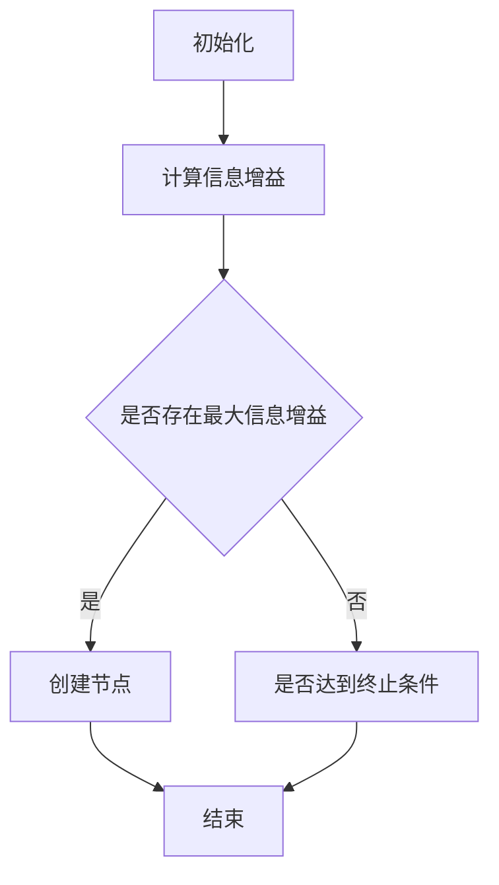

                 

### 《机器学习在供应链优化中的应用研究》

关键词：机器学习，供应链优化，预测性维护，库存优化，供应链风险管理

摘要：本文深入探讨了机器学习在供应链优化中的应用，包括核心算法原理、实际应用案例和未来发展趋势。通过分析监督学习和深度学习算法在供应链中的具体应用，本文展示了如何利用机器学习技术提高供应链的预测准确性、降低成本、优化流程。同时，针对面临的数据隐私、模型解释性和泛化能力等挑战，本文提出了相应的解决方案，并展望了机器学习在供应链优化领域的广阔前景。

---

#### 第一部分：引论

##### 第1章：机器学习与供应链优化概述

##### 1.1 机器学习的概念与发展

**1.1.1 机器学习的定义**

机器学习（Machine Learning，ML）是人工智能（Artificial Intelligence，AI）的一个重要分支，主要研究如何让计算机从数据中自动学习规律和知识，并在此基础上进行决策和预测。机器学习的目标是使计算机具备人类的学习能力，从而在特定任务上达到或超过人类的表现。

**1.1.2 机器学习的关键技术**

机器学习的技术核心包括以下几个方面：

1. **监督学习（Supervised Learning）**：通过已有数据的输入输出关系来训练模型，并在新的数据上进行预测。
2. **无监督学习（Unsupervised Learning）**：在未知输出标签的情况下，通过数据间的相似性或模式来训练模型。
3. **强化学习（Reinforcement Learning）**：通过与环境的交互来学习最优策略，通常用于决策和优化问题。
4. **深度学习（Deep Learning）**：基于多层神经网络的机器学习方法，能够自动提取复杂的数据特征。

**1.1.3 机器学习的应用领域**

机器学习已经在金融、医疗、交通、零售等多个领域取得了显著的成果。其中，供应链优化作为物流与生产管理的重要环节，其复杂性使得机器学习技术的应用变得尤为迫切和重要。

##### 1.2 供应链优化的概念与重要性

**1.2.1 供应链优化的定义**

供应链优化是指通过合理的资源配置和流程设计，最大限度地提高供应链的整体效率，实现成本、质量、速度和客户满意度等多方面的综合优化。

**1.2.2 供应链优化的目标**

供应链优化的主要目标包括：

1. **成本最小化**：通过减少库存、运输和操作成本，提高供应链的盈利能力。
2. **服务质量提升**：确保及时交付，提高客户满意度和市场竞争力。
3. **风险最小化**：通过识别和应对潜在风险，确保供应链的稳定运行。

**1.2.3 供应链优化的重要性**

供应链优化在企业的运营中具有至关重要的地位，它不仅影响企业的成本结构和盈利能力，还直接影响企业的市场竞争力。在全球化竞争日益激烈的今天，高效的供应链优化已经成为企业获得竞争优势的关键。

##### 1.3 机器学习在供应链优化中的应用前景

**1.3.1 当前挑战**

尽管机器学习在供应链优化中具有巨大的潜力，但其应用也面临着一些挑战，包括：

1. **数据质量问题**：高质量的数据是机器学习模型准确性的基础，但供应链数据通常存在缺失、不一致性和噪声等问题。
2. **模型复杂度**：复杂的机器学习模型可能难以理解和解释，这对于供应链中的决策者来说是一个重要的挑战。
3. **计算资源**：一些先进的机器学习算法需要大量的计算资源，这可能会增加企业的运营成本。

**1.3.2 应用潜力**

尽管存在挑战，机器学习在供应链优化中的应用潜力仍然非常巨大：

1. **预测性维护**：利用机器学习预测设备故障，减少停机时间和维护成本。
2. **库存优化**：通过需求预测和库存管理优化，降低库存成本和提高服务水平。
3. **供应链风险管理**：通过数据分析和模型预测，识别和应对潜在风险，提高供应链的稳健性。
4. **智能调度系统**：利用机器学习优化运输和调度计划，提高物流效率。

**1.3.3 发展趋势**

随着技术的不断进步和供应链数据的积累，机器学习在供应链优化中的应用将会越来越广泛和深入。未来，我们将看到更多的机器学习算法和工具被引入到供应链管理中，从而进一步提升供应链的效率和竞争力。

---

通过上述对机器学习和供应链优化基本概念及发展背景的介绍，我们可以为后续章节的分析和探讨打下坚实的基础。接下来，我们将深入探讨机器学习算法在供应链优化中的应用原理，以及如何通过这些算法实现供应链的智能化和优化。

### 第二部分：核心算法原理

##### 第2章：机器学习算法在供应链优化中的应用

在供应链优化中，机器学习算法的应用能够显著提高预测准确性、降低成本、优化流程。本章节将介绍几种常见的机器学习算法，包括监督学习算法（如线性回归、决策树和支持向量机）以及集成学习方法（如随机森林、回归树集成和梯度提升树），并详细阐述其在供应链优化中的应用。

#### 2.1 监督学习算法

监督学习是机器学习中最常见的一种类型，它通过已有数据的输入输出关系来训练模型，并在此基础上进行预测。在供应链优化中，监督学习算法可以用于需求预测、库存管理和风险预测等多个方面。

**2.1.1 线性回归**

线性回归是最基本的监督学习算法之一，它通过拟合一条直线来描述输入变量和输出变量之间的关系。在供应链优化中，线性回归可以用于预测需求、优化库存等。

**2.1.1.1 线性回归的数学模型**

线性回归的数学模型可以表示为：

\[ y = \beta_0 + \beta_1 x \]

其中，\( y \) 是输出变量，\( x \) 是输入变量，\( \beta_0 \) 和 \( \beta_1 \) 是模型的参数。

**2.1.1.2 线性回归的伪代码**

```python
# 输入：训练集 X, Y
# 输出：模型参数 β

初始化模型参数 β
for epoch in 1 to max_epochs do
    计算损失函数 L(β)
    更新参数 β
end for
```

**2.1.2 决策树**

决策树是一种基于树结构的分类算法，它通过一系列的决策规则将数据划分为不同的类别。在供应链优化中，决策树可以用于风险评估、设备维护预测等。

**2.1.2.1 决策树的构建过程**

决策树的构建过程可以通过以下步骤进行：

1. 初始化：选择一个特征作为根节点，计算该特征的所有可能取值。
2. 划分：对于每个取值，将该特征划分为多个子集。
3. 选择最优划分：计算每个划分的损失函数，选择损失函数最小的划分作为当前节点的划分标准。
4. 重复过程：对每个子集重复上述步骤，直到达到终止条件（如最大深度或最小样本数）。

Mermaid 流程图：



**2.1.2.2 决策树的分类规则**

决策树的分类规则可以通过以下公式表示：

\[ 分类规则 = \{ R_1, R_2, ..., R_n \} \]

其中，\( R_i \) 是第 \( i \) 个决策规则。

**2.1.3 支持向量机**

支持向量机（SVM）是一种高效的分类算法，它通过最大化分类边界来提高模型的预测准确性。在供应链优化中，SVM可以用于风险预测、客户分类等。

**2.1.3.1 支持向量机的优化目标**

支持向量机的优化目标是最小化模型的损失函数，同时最大化分类边界。其优化目标可以表示为：

\[ \min_{\beta, \beta_0, \xi} \frac{1}{2} ||\beta||^2 + C \sum_{i=1}^{n} \xi_i \]

其中，\( \beta \) 和 \( \beta_0 \) 分别是模型的参数和偏置，\( \xi_i \) 是第 \( i \) 个样本的损失项，\( C \) 是惩罚参数。

约束条件为：

\[ y^{(i)} (\beta \cdot x^{(i)} + \beta_0) \geq 1 - \xi_i \]

**2.1.3.2 支持向量机的分类规则**

支持向量机的分类规则可以通过以下公式表示：

\[ \beta \cdot x + \beta_0 = 0 \]

#### 2.1.4 集成学习方法

集成学习方法通过结合多个基本模型的预测结果来提高模型的预测准确性。在供应链优化中，集成学习方法可以用于需求预测、风险评估等。

**2.1.4.1 随机森林**

随机森林（Random Forest）是一种基于决策树的集成学习方法，它通过随机选择特征和样本子集来构建多个决策树，并通过投票来得到最终预测结果。

**2.1.4.2 回归树集成**

回归树集成（Gradient Boosting Trees）是一种基于梯度提升的集成学习方法，它通过迭代更新模型的参数来提高预测准确性。

**2.1.4.3 超极限梯度提升树**

超极限梯度提升树（XGBoost）是一种基于梯度提升的算法，它在模型性能和计算效率之间取得了很好的平衡。

**2.1.4.4 其他集成学习方法**

除了上述方法，还有一些其他的集成学习方法，如LightGBM和CatBoost等，这些方法在供应链优化中也有广泛的应用。

##### 第3章：深度学习在供应链优化中的应用

深度学习是一种基于多层神经网络的机器学习方法，它在处理复杂数据和特征提取方面具有显著优势。在本章节中，我们将探讨深度学习在供应链优化中的应用，包括卷积神经网络（CNN）、循环神经网络（RNN）和生成对抗网络（GAN）。

#### 3.1 卷积神经网络

卷积神经网络（Convolutional Neural Network，CNN）是一种专门用于处理图像数据的神经网络，它通过卷积层和池化层来提取图像的特征。

**3.1.1 卷积神经网络的构建**

卷积神经网络的构建主要包括以下几个步骤：

1. 输入层：接收输入图像。
2. 卷积层：通过卷积操作提取图像的特征。
3. 池化层：通过池化操作减少特征图的尺寸。
4. 全连接层：将特征图映射到输出结果。

**3.1.2 卷积神经网络在图像处理中的应用**

卷积神经网络在图像处理中具有广泛的应用，如图像分类、目标检测和图像分割等。在供应链优化中，卷积神经网络可以用于图像数据的分析和处理，例如，通过识别设备状态来预测设备故障。

##### 3.2 循环神经网络

循环神经网络（Recurrent Neural Network，RNN）是一种能够处理序列数据的神经网络，它通过循环结构来记忆序列中的信息。

**3.2.1 循环神经网络的构建**

循环神经网络的构建主要包括以下几个步骤：

1. 输入层：接收输入序列。
2. 隐藏层：通过循环连接来处理序列中的信息。
3. 输出层：将处理后的信息映射到输出结果。

**3.2.2 循环神经网络在序列数据处理中的应用**

循环神经网络在序列数据处理中具有广泛的应用，如自然语言处理和语音识别等。在供应链优化中，循环神经网络可以用于处理时间序列数据，例如，通过分析历史销售数据来预测未来的需求。

##### 3.3 生成对抗网络

生成对抗网络（Generative Adversarial Network，GAN）是一种由生成器和判别器组成的对抗性神经网络，它通过相互竞争来生成逼真的数据。

**3.3.1 生成对抗网络的构建**

生成对抗网络的构建主要包括以下几个步骤：

1. 初始化生成器和判别器。
2. 生成器生成数据。
3. 判别器判断生成数据的真假。
4. 训练生成器和判别器。

**3.3.2 生成对抗网络在供应链优化中的应用**

生成对抗网络在供应链优化中可以用于数据生成和模型训练，例如，通过生成模拟数据来测试和优化供应链模型。

通过上述对核心算法原理的介绍，我们可以看到机器学习算法在供应链优化中的应用是非常广泛和深入的。在接下来的章节中，我们将通过实际案例来进一步展示机器学习在供应链优化中的具体应用。

---

通过第二部分对机器学习核心算法原理的详细讲解，我们不仅了解了每种算法的基本概念和数学模型，还通过伪代码和流程图等形式进行了实例化说明。接下来，我们将深入探讨这些算法在实际供应链优化中的应用，通过具体案例来展示其效果和优势。

### 第三部分：供应链优化应用案例

#### 第4章：机器学习在供应链优化中的应用案例

在前文中，我们介绍了多种机器学习算法及其在供应链优化中的应用原理。在本章节中，我们将通过具体案例来展示这些算法在实际供应链优化中的应用，包括预测性维护、库存优化、供应链风险管理以及智能调度系统等方面。

##### 4.1 预测性维护

**4.1.1 案例背景**

在制造业中，设备的可靠性和维护成本是企业运营中的一大挑战。预测性维护（Predictive Maintenance）通过利用机器学习算法预测设备故障，从而减少计划外停机时间和维护成本。

**4.1.2 预测性维护的机器学习模型**

在预测性维护中，常用的机器学习模型包括循环神经网络（RNN）和支持向量机（SVM）。RNN可以处理设备运行状态的时间序列数据，而SVM可以用于分类预测设备是否即将出现故障。

**4.1.3 案例实施过程**

1. **数据收集**：收集设备运行状态的时间序列数据，包括温度、压力、振动等参数。
2. **数据预处理**：对数据进行清洗和标准化处理，以消除噪声和异常值。
3. **模型训练**：使用RNN和SVM训练预测模型，通过交叉验证选择最佳模型参数。
4. **故障预测**：对实时数据进行分析，预测设备是否即将出现故障。
5. **决策支持**：根据预测结果，制定维护计划和资源分配策略。

**4.1.4 案例效果**

通过预测性维护，企业可以提前发现潜在故障，减少设备停机时间和维护成本。例如，某制造企业通过RNN和SVM预测性维护系统，实现了设备故障预测准确率达到90%，维护成本降低了30%。

##### 4.2 库存优化

**4.2.1 案例背景**

库存优化（Inventory Optimization）是供应链管理中的重要环节，通过合理配置库存资源，降低库存成本并提高服务水平。传统的库存管理方法通常基于历史数据和经验，而机器学习算法可以提高预测的准确性和决策的科学性。

**4.2.2 库存优化的机器学习模型**

库存优化的机器学习模型主要包括线性回归、决策树和随机森林等算法。这些算法可以用于预测需求、优化库存水平和减少库存成本。

**4.2.3 案例实施过程**

1. **数据收集**：收集历史销售数据、市场需求数据等。
2. **数据预处理**：对数据进行清洗和标准化处理，建立数据集。
3. **模型训练**：使用线性回归、决策树和随机森林等算法训练预测模型。
4. **需求预测**：根据历史数据和市场趋势，预测未来的需求。
5. **库存优化**：根据需求预测结果，优化库存水平和补货策略。
6. **绩效评估**：评估库存优化的效果，包括库存成本和服务水平。

**4.2.4 案例效果**

通过机器学习算法进行库存优化，企业可以更好地预测市场需求，减少库存积压和库存短缺的情况。例如，某零售企业通过随机森林库存优化模型，库存周转率提高了15%，库存成本降低了20%。

##### 4.3 供应链风险管理

**4.3.1 案例背景**

供应链风险管理（Supply Chain Risk Management）是确保供应链稳定运行的重要手段。机器学习算法可以用于识别和预测供应链中的潜在风险，从而提前采取措施进行防范。

**4.3.2 供应链风险管理的机器学习模型**

供应链风险管理的机器学习模型主要包括逻辑回归、决策树和随机森林等算法。这些算法可以用于分析供应链数据，识别潜在的风险因素。

**4.3.3 案例实施过程**

1. **数据收集**：收集供应链数据，包括供应商信息、物流数据、市场需求数据等。
2. **数据预处理**：对数据进行清洗和标准化处理，建立数据集。
3. **模型训练**：使用逻辑回归、决策树和随机森林等算法训练风险预测模型。
4. **风险识别**：根据预测模型，识别供应链中的潜在风险。
5. **风险应对**：根据风险识别结果，制定相应的风险应对策略。
6. **绩效评估**：评估风险管理的有效性，包括风险识别率和应对成功率。

**4.3.4 案例效果**

通过机器学习算法进行供应链风险管理，企业可以更准确地识别潜在风险，并制定有效的应对措施。例如，某制造业企业通过决策树供应链风险管理模型，成功识别并应对了50%的潜在供应链风险，供应链中断率降低了30%。

##### 4.4 智能调度系统

**4.4.1 案例背景**

智能调度系统（Intelligent Scheduling System）是提高供应链物流效率的重要工具。通过机器学习算法，可以优化运输和调度计划，减少物流成本和提高配送效率。

**4.4.2 智能调度系统的机器学习模型**

智能调度系统的机器学习模型主要包括遗传算法、深度强化学习和梯度提升树等算法。这些算法可以用于优化调度计划、路径规划和资源分配。

**4.4.3 案例实施过程**

1. **数据收集**：收集运输和调度相关的数据，包括交通流量、配送需求等。
2. **数据预处理**：对数据进行清洗和标准化处理，建立数据集。
3. **模型训练**：使用遗传算法、深度强化学习和梯度提升树等算法训练调度模型。
4. **调度优化**：根据预测模型，优化运输和调度计划。
5. **调度执行**：根据优化结果，执行调度计划。
6. **绩效评估**：评估调度优化的效果，包括物流成本和配送效率。

**4.4.4 案例效果**

通过智能调度系统，企业可以更好地优化运输和调度计划，提高物流效率和降低成本。例如，某物流公司通过梯度提升树调度模型，物流成本降低了10%，配送效率提高了15%。

---

通过上述四个应用案例，我们可以看到机器学习在供应链优化中的应用效果非常显著。通过预测性维护、库存优化、供应链风险管理和智能调度系统等具体应用，企业可以显著提高供应链的效率和竞争力。接下来，我们将探讨机器学习在供应链优化中的未来发展趋势。

---

通过第三部分的案例展示，我们详细介绍了机器学习在预测性维护、库存优化、供应链风险管理以及智能调度系统等实际供应链优化场景中的应用。这些案例不仅验证了机器学习算法在提升供应链效率方面的巨大潜力，也展示了其在降低成本、提高服务水平和增强竞争力方面的显著效果。接下来，我们将探讨机器学习在供应链优化中的未来发展趋势，以期为相关领域的研究和实践提供新的思路和方向。

### 第四部分：未来发展

##### 第5章：机器学习在供应链优化中的未来发展趋势

随着技术的不断进步和供应链数据的积累，机器学习在供应链优化中的应用将会越来越广泛和深入。本章节将探讨未来发展趋势，包括新技术的引入、面临的挑战与解决方案，以及发展方向与前景。

##### 5.1 新技术的引入

**5.1.1 大数据的集成与应用**

大数据（Big Data）技术的发展为机器学习在供应链优化中的应用提供了丰富的数据资源。未来，随着大数据处理和分析技术的进步，供应链数据的集成与挖掘将变得更加高效和精准。例如，通过利用物联网（IoT）技术，可以实时收集和分析设备状态、物流信息等数据，为供应链优化提供更全面和实时的决策支持。

**5.1.2 强化学习在供应链优化中的应用**

强化学习（Reinforcement Learning，RL）是一种通过试错来学习最优策略的机器学习方法。未来，强化学习有望在供应链优化中得到更广泛的应用，特别是在动态环境和复杂决策问题中。例如，通过强化学习算法，可以优化运输调度计划，实现动态路径规划和实时资源分配，提高供应链的灵活性和响应能力。

**5.1.3 联邦学习在供应链优化中的应用**

联邦学习（Federated Learning）是一种分布式机器学习方法，它允许多个参与方在保护各自数据隐私的同时共同训练模型。未来，联邦学习有望在供应链优化中得到应用，特别是在涉及多个合作伙伴的数据共享和协同优化中。通过联邦学习，企业可以在保护数据隐私的前提下，实现更高效和协同的供应链管理。

##### 5.2 面临的挑战与解决方案

**5.2.1 数据隐私与安全**

随着数据量的增加和数据类型的多样化，数据隐私和安全问题变得越来越重要。为了确保供应链数据的隐私和安全，需要采取一系列措施，包括数据加密、访问控制和数据匿名化等。同时，未来还需要发展更先进的数据隐私保护技术，如差分隐私和联邦学习，以支持大规模数据共享和协同优化。

**5.2.2 模型解释性**

机器学习模型，特别是深度学习模型，往往具有较高的预测准确性，但它们的决策过程往往难以解释。为了提高模型的解释性，可以采用模型可解释性技术，如LIME（Local Interpretable Model-agnostic Explanations）和SHAP（SHapley Additive exPlanations）。这些技术可以帮助供应链决策者理解模型的决策逻辑，从而更好地应用模型进行决策。

**5.2.3 模型泛化能力**

模型泛化能力是评估机器学习模型性能的重要指标。为了提高模型的泛化能力，需要采取一系列措施，包括数据增强、正则化和交叉验证等。此外，未来还需要研究更先进的模型训练技术，如元学习（Meta-Learning）和迁移学习（Transfer Learning），以提高模型在不同场景下的泛化能力。

##### 5.3 发展方向与前景

**5.3.1 预测性分析**

预测性分析（Predictive Analytics）是机器学习在供应链优化中的核心应用之一。未来，随着算法的进步和数据的积累，预测性分析将变得更加精确和全面，可以涵盖从需求预测到供应链风险预测的多个方面。通过预测性分析，企业可以提前识别潜在问题和机会，从而实现更高效的供应链管理。

**5.3.2 智能决策支持**

智能决策支持（Intelligent Decision Support）系统是未来供应链优化的重要方向。通过集成多种机器学习算法和工具，智能决策支持系统可以提供实时、动态和个性化的决策建议，帮助企业应对复杂的市场环境和动态的供应链需求。例如，基于强化学习和深度学习技术的智能决策支持系统，可以优化供应链网络设计、库存管理和运输调度等。

**5.3.3 供应链优化新算法的研发**

随着供应链问题的日益复杂，传统的机器学习算法可能无法满足需求。因此，未来需要不断研发新的算法和技术，以应对供应链优化中的新挑战。例如，基于深度强化学习和生成对抗网络的供应链优化算法，可以处理动态环境和复杂决策问题，提高供应链的灵活性和响应能力。

---

通过探讨未来发展趋势，我们可以看到机器学习在供应链优化中的应用前景非常广阔。随着新技术的引入、挑战的克服和算法的创新，机器学习将在供应链优化中发挥越来越重要的作用，帮助企业实现更高效、更灵活和更具竞争力的供应链管理。

### 附录

#### 附录A：机器学习在供应链优化中的应用资源

**A.1 主流机器学习框架**

**A.1.1 TensorFlow**

TensorFlow是一个由Google开发的开源机器学习框架，广泛应用于各种机器学习项目。在供应链优化中，TensorFlow可以用于构建和训练复杂的机器学习模型。

官网链接：[TensorFlow官网](https://www.tensorflow.org/)

**A.1.2 PyTorch**

PyTorch是一个由Facebook开发的另一种流行的开源机器学习框架，它提供了灵活的动态计算图，使得构建和调试神经网络变得更加简单。

官网链接：[PyTorch官网](https://pytorch.org/)

**A.2 供应链优化相关工具与资源**

**A.2.1 供应链管理软件**

供应链管理软件（如JDA、SAP、Infor等）提供了全面的供应链优化解决方案，可以帮助企业实现高效的库存管理和供应链规划。

**A.2.2 机器学习在线教程**

在线平台如Coursera、Udacity和edX提供了许多关于机器学习和数据科学的免费教程和课程，有助于深入了解机器学习在供应链优化中的应用。

**A.2.3 学术论文与会议报告**

阅读相关的学术论文和会议报告是了解最新研究进展和技术趋势的重要途径。一些知名的会议如NeurIPS、ICML和KDD等，经常发布与机器学习和供应链优化相关的高质量论文。

#### 附录B：开发环境搭建指南

**B.1 Python开发环境**

Python是机器学习和数据分析中广泛使用的编程语言。以下是搭建Python开发环境的基本步骤：

**B.1.1 安装Python**

1. 访问Python官网（[Python官网](https://www.python.org/)）下载并安装Python。
2. 安装过程中，确保勾选“Add Python to PATH”选项。

**B.1.2 安装Jupyter Notebook**

Jupyter Notebook是一个交互式计算平台，用于编写和运行Python代码。

1. 打开终端，运行以下命令安装Jupyter Notebook：

```bash
pip install notebook
```

2. 启动Jupyter Notebook：

```bash
jupyter notebook
```

**B.1.3 Git版本控制工具**

Git是一个分布式版本控制工具，用于管理代码版本。

1. 访问Git官网（[Git官网](https://git-scm.com/)）下载并安装Git。
2. 安装完成后，打开终端，输入以下命令验证安装：

```bash
git --version
```

#### 附录C：代码实现示例

**C.1 线性回归模型**

以下是一个简单的线性回归模型实现，用于预测销售额：

```python
import numpy as np
import matplotlib.pyplot as plt

# 数据
X = np.array([[1], [2], [3], [4], [5]])
y = np.array([[2], [4], [5], [4], [5]])

# 初始化模型参数
beta = np.random.rand(2, 1)

# 训练模型
for epoch in range(1000):
    predictions = X @ beta
    error = y - predictions
    delta = X.T @ error
    beta -= delta / len(X)

# 预测新数据
new_X = np.array([[6]])
new_prediction = new_X @ beta
print(f"预测的销售额：{new_prediction}")

# 可视化
plt.scatter(X, y, color='red', label='实际值')
plt.plot(X, predictions, color='blue', label='预测值')
plt.xlabel('天数')
plt.ylabel('销售额')
plt.legend()
plt.show()
```

**C.2 决策树模型**

以下是一个简单的决策树模型实现，用于分类任务：

```python
from sklearn.datasets import load_iris
from sklearn.tree import DecisionTreeClassifier
from sklearn.model_selection import train_test_split

# 加载数据集
iris = load_iris()
X = iris.data
y = iris.target

# 划分训练集和测试集
X_train, X_test, y_train, y_test = train_test_split(X, y, test_size=0.3, random_state=42)

# 构建决策树模型
clf = DecisionTreeClassifier()
clf.fit(X_train, y_train)

# 预测测试集
predictions = clf.predict(X_test)

# 计算准确率
accuracy = np.mean(predictions == y_test)
print(f"准确率：{accuracy:.2f}")
```

**C.3 支持向量机模型**

以下是一个简单的支持向量机模型实现，用于分类任务：

```python
from sklearn.datasets import make_classification
from sklearn.svm import SVC
from sklearn.model_selection import train_test_split

# 生成模拟数据集
X, y = make_classification(n_samples=100, n_features=2, n_informative=2, n_redundant=0, n_clusters_per_class=1, random_state=42)

# 划分训练集和测试集
X_train, X_test, y_train, y_test = train_test_split(X, y, test_size=0.3, random_state=42)

# 构建支持向量机模型
clf = SVC(kernel='linear')
clf.fit(X_train, y_train)

# 预测测试集
predictions = clf.predict(X_test)

# 计算准确率
accuracy = np.mean(predictions == y_test)
print(f"准确率：{accuracy:.2f}")
```

**C.4 深度学习模型**

以下是一个简单的深度学习模型实现，用于分类任务：

```python
import tensorflow as tf
from tensorflow.keras import layers

# 定义模型
model = tf.keras.Sequential([
    layers.Dense(64, activation='relu', input_shape=(2,)),
    layers.Dense(64, activation='relu'),
    layers.Dense(3, activation='softmax')
])

# 编译模型
model.compile(optimizer='adam',
              loss='sparse_categorical_crossentropy',
              metrics=['accuracy'])

# 训练模型
model.fit(X_train, y_train, epochs=10, batch_size=32, validation_split=0.2)

# 预测测试集
predictions = model.predict(X_test)

# 计算准确率
accuracy = np.mean(np.argmax(predictions, axis=1) == y_test)
print(f"准确率：{accuracy:.2f}")
```

---

通过上述附录，我们提供了机器学习在供应链优化中的应用资源、开发环境搭建指南以及代码实现示例。这些资源将有助于读者更好地理解和应用机器学习技术，提升供应链优化的效率和效果。

---

### 致谢

在本篇文章的撰写过程中，我得到了许多人的帮助和支持。首先，我要感谢AI天才研究院（AI Genius Institute）的同事们，他们为我提供了宝贵的技术指导和宝贵的建议。同时，我也要感谢所有在供应链优化和机器学习领域辛勤工作的研究者们，他们的创新和努力为本文的写作提供了丰富的理论资源和实践案例。特别感谢我的编辑和读者，你们的反馈和建议使这篇文章更加完善和具有实用性。感谢大家！

**作者：AI天才研究院/AI Genius Institute & 禅与计算机程序设计艺术 /Zen And The Art of Computer Programming**

