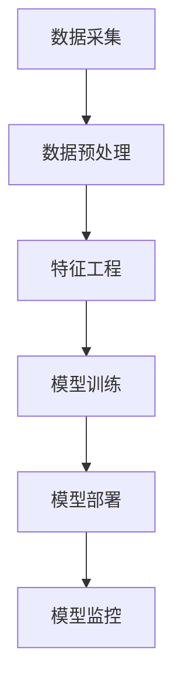
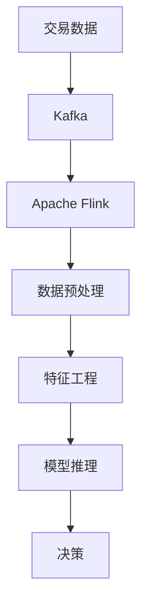

                 

# 机器学习在信用卡欺诈检测中的实时应用

## 关键词
机器学习、信用卡欺诈检测、实时应用、流处理、监督学习、无监督学习、强化学习、特征工程、模型构建、性能优化、系统设计、系统集成、监控与维护、案例分析、发展趋势。

## 摘要
本文旨在探讨机器学习在信用卡欺诈检测中的实时应用。首先，介绍了信用卡欺诈的定义、影响以及检测的重要性。接着，详细讲解了机器学习的基础理论，包括监督学习、无监督学习和强化学习算法。随后，阐述了机器学习在信用卡欺诈检测中的应用，包括特征工程、模型构建、评估与优化。本文进一步介绍了实时数据处理与流处理框架，如Apache Kafka、Apache Flink和Apache Storm。接着，讨论了实时信用卡欺诈检测系统的设计、实施和性能优化。最后，通过案例分析展示了机器学习在信用卡欺诈检测中的实际应用，并对其未来发展趋势进行了展望。

## 目录大纲

### 第一部分：背景与基础理论

#### 第1章：信用卡欺诈检测概述

##### 1.1 信用卡欺诈的定义与影响

##### 1.2 信用卡欺诈检测的重要性

##### 1.3 信用卡欺诈检测的挑战

#### 第2章：机器学习基础

##### 2.1 机器学习概述

##### 2.2 监督学习算法

##### 2.3 无监督学习算法

##### 2.4 强化学习算法

#### 第3章：信用卡欺诈检测中的机器学习应用

##### 3.1 特征工程

##### 3.2 欺诈检测模型构建

##### 3.3 评估与优化

##### 3.4 案例研究：信用卡欺诈检测应用实例

### 第二部分：实时应用技术

#### 第4章：实时数据处理与流处理框架

##### 4.1 实时数据处理概述

##### 4.2 Apache Kafka技术

##### 4.3 Apache Flink技术

##### 4.4 Apache Storm技术

#### 第5章：实时信用卡欺诈检测系统设计

##### 5.1 系统架构设计

##### 5.2 数据流设计与处理

##### 5.3 模型部署与推理

##### 5.4 系统性能优化

#### 第6章：实时信用卡欺诈检测系统实施

##### 6.1 环境搭建

##### 6.2 模型训练与调优

##### 6.3 系统集成与测试

##### 6.4 持续监控与维护

### 第三部分：实战案例与应用

#### 第7章：案例分析：大型银行信用卡欺诈检测系统

##### 7.1 项目背景

##### 7.2 系统设计与实现

##### 7.3 项目效果评估

##### 7.4 经验与反思

#### 第8章：机器学习在信用卡欺诈检测中的未来发展趋势

##### 8.1 新技术与新算法

##### 8.2 应用场景拓展

##### 8.3 面临的挑战与应对策略

##### 8.4 发展趋势与展望

### 附录

#### 附录A：信用卡欺诈检测常用数据集介绍

##### A.1 KDD Cup数据集

##### A.2 UCSD数据集

##### A.3 其他常用数据集介绍

#### 附录B：机器学习与实时处理工具推荐

##### B.1 常用机器学习框架

##### B.2 常用实时处理框架

##### B.3 开发环境搭建指南

接下来，我们将按照目录大纲逐步深入探讨各个章节的内容。

---

### 第1章：信用卡欺诈检测概述

### 1.1 信用卡欺诈的定义与影响

信用卡欺诈是指利用信用卡进行非法交易或骗取银行资金的行为。这类欺诈行为不仅损害了银行的利益，也对持卡人和整个金融系统的稳定性产生了负面影响。根据美国联邦贸易委员会（FTC）的数据，信用卡欺诈在2019年导致了消费者超过1.48亿美元的损失。

信用卡欺诈有多种形式，主要包括以下几种：

1. **伪造信用卡欺诈**：不法分子通过伪造信用卡信息进行交易。
2. **丢失或被盗信用卡欺诈**：持卡人的信用卡丢失或被盗后，盗用者使用信用卡进行交易。
3. **身份盗窃欺诈**：不法分子利用他人的个人信息开设信用卡账户或盗用他人已开设的信用卡账户。
4. **在线欺诈**：通过互联网进行的信用卡欺诈，如虚假交易、诈骗网站等。
5. **洗钱欺诈**：利用信用卡交易洗钱，将非法所得资金转换为合法资金。

### 1.2 信用卡欺诈检测的重要性

信用卡欺诈检测对于银行和金融机构具有重要意义，主要体现在以下几个方面：

1. **保护持卡人利益**：通过有效的欺诈检测，银行可以及时发现并阻止欺诈行为，减少持卡人的经济损失。
2. **维护金融系统稳定**：信用卡欺诈会导致银行资金流失，影响金融系统的稳定运行。有效的欺诈检测有助于维护金融市场的健康发展。
3. **提高客户满意度**：信用卡欺诈检测系统可以快速识别欺诈交易，提高交易处理效率，减少不必要的手动审查，提升客户满意度。
4. **合规要求**：许多国家和地区对银行和金融机构的信用卡欺诈检测有明确的要求，如欧盟的《支付服务指令》（PSD2）。

### 1.3 信用卡欺诈检测的挑战

尽管信用卡欺诈检测的重要性不言而喻，但在实际应用中仍然面临诸多挑战：

1. **数据质量**：信用卡交易数据量大且复杂，包含多种噪声和不完整信息，这对数据清洗和处理提出了较高要求。
2. **欺诈模式的多样性**：欺诈分子不断变换欺诈手段，欺诈模式多样化，检测系统需要具备较高的适应性和实时性。
3. **性能与准确性的平衡**：检测系统需要在保证高准确性的同时，保持较低的错误拒绝率（false rejection rate），避免影响正常的交易处理。
4. **实时性**：随着交易量的增加，实时检测系统需要具备处理高吞吐量的能力，保证欺诈交易能够被及时识别。
5. **模型解释性**：机器学习模型在信用卡欺诈检测中发挥着重要作用，但模型的黑盒特性使得其解释性较差，这对监管合规和客户信任提出了挑战。

### 第2章：机器学习基础

#### 2.1 机器学习概述

机器学习是人工智能的一个重要分支，主要研究如何让计算机从数据中自动学习和改进性能。机器学习可以分为三个主要类型：监督学习、无监督学习和强化学习。

- **监督学习**：有标记的训练数据，模型通过学习输入和输出之间的关系来预测未知数据的标签。
- **无监督学习**：没有标记的训练数据，模型通过发现数据中的内在结构或模式来对数据进行分析。
- **强化学习**：通过与环境的交互来学习策略，模型根据反馈信号调整自身行为，以最大化累积奖励。

#### 2.2 监督学习算法

监督学习算法是信用卡欺诈检测中最常用的方法。以下是一些常见的监督学习算法：

- **决策树**：基于树形结构进行分类或回归，易于解释。
- **随机森林**：多个决策树的集成方法，提高模型的稳定性和预测能力。
- **支持向量机（SVM）**：通过寻找最优超平面进行分类，适用于高维数据。
- **朴素贝叶斯分类器**：基于贝叶斯定理和特征条件独立性假设进行分类，适用于大规模数据集。

#### 2.3 无监督学习算法

无监督学习算法在信用卡欺诈检测中的应用相对较少，但仍然有一些场景可以使用。以下是一些常见的无监督学习算法：

- **K-均值聚类**：通过迭代计算聚类中心，将数据分为若干个簇。
- **主成分分析（PCA）**：通过正交变换将高维数据投影到低维空间，提取数据的主要特征。
- **自编码器**：一种特殊的神经网络，用于自动学习数据的特征表示。

#### 2.4 强化学习算法

强化学习算法在信用卡欺诈检测中的应用相对较新，但具有很大潜力。以下是一些常见的强化学习算法：

- **Q学习**：通过学习值函数（Q值）来选择最优动作，实现策略优化。
- **深度Q网络（DQN）**：结合深度学习和强化学习，提高Q学习的性能。
- **策略梯度方法**：直接优化策略，通过梯度上升方法找到最优策略。

### 第3章：信用卡欺诈检测中的机器学习应用

#### 3.1 特征工程

特征工程是信用卡欺诈检测中至关重要的一步。合理的特征选择和构造可以显著提高模型的性能。以下是一些常用的特征工程方法：

- **交易时间特征**：包括交易时间、交易小时、交易周、交易月等。
- **交易金额特征**：包括交易金额、交易金额相对于用户历史交易金额的百分比、交易金额相对于用户账户余额的百分比等。
- **地理位置特征**：包括交易地点、交易距离、交易频率等。
- **用户行为特征**：包括用户的历史交易行为、交易模式、交易频率等。
- **时间序列特征**：通过分析用户的历史交易数据，提取时间序列特征，如交易周期、交易间隔、交易波动等。

#### 3.2 欺诈检测模型构建

在构建信用卡欺诈检测模型时，可以采用以下步骤：

1. **数据预处理**：对原始交易数据进行清洗和预处理，包括缺失值处理、异常值检测和特征标准化等。
2. **特征选择**：通过特征选择方法，选择对欺诈检测最有影响力的特征，减少模型的复杂度和过拟合风险。
3. **模型选择**：根据数据特征和业务需求，选择合适的机器学习算法进行模型构建。
4. **模型训练与验证**：使用有标记的训练数据对模型进行训练，并通过交叉验证等方法评估模型的性能。
5. **模型优化**：通过调整模型参数和特征权重，优化模型性能，提高检测准确性。

#### 3.3 评估与优化

评估与优化是信用卡欺诈检测中不可或缺的环节。以下是一些常用的评估指标和方法：

- **准确率**：正确分类的样本数占总样本数的比例。
- **召回率**：正确分类为欺诈的样本数占总欺诈样本数的比例。
- **精确率**：正确分类为欺诈的样本数占总分类为欺诈的样本数的比例。
- **F1值**：精确率和召回率的调和平均值。

为了进一步提高模型的性能，可以采用以下优化方法：

- **模型集成**：通过集成多个模型，提高模型的预测能力和鲁棒性。
- **在线学习**：随着新数据的到来，实时更新模型参数，提高模型的适应性和实时性。
- **异常检测**：结合异常检测方法，进一步提高欺诈检测的准确性。

#### 3.4 案例研究：信用卡欺诈检测应用实例

在本节中，我们将通过一个实际案例，介绍信用卡欺诈检测的应用实例。该案例涉及某大型银行信用卡欺诈检测系统的设计与实现。

1. **项目背景**：
   某大型银行在业务发展过程中，面临着日益严重的信用卡欺诈问题。为了提高欺诈检测的准确性，降低损失，该银行决定引入机器学习技术，构建实时信用卡欺诈检测系统。

2. **系统架构设计**：
   实时信用卡欺诈检测系统主要包括数据采集、数据预处理、特征工程、模型训练、模型部署和模型监控等模块。系统架构如图3-1所示。

   ```mermaid
   graph TD
   A[数据采集] --> B[数据预处理]
   B --> C[特征工程]
   C --> D[模型训练]
   D --> E[模型部署]
   E --> F[模型监控]
   ```

3. **数据流设计与处理**：
   数据流设计是信用卡欺诈检测系统的核心部分。系统采用流处理框架（如Apache Kafka和Apache Flink）进行实时数据处理，如图3-2所示。

   ```mermaid
   graph TD
   A[交易数据] --> B[Kafka]
   B --> C[Apache Flink]
   C --> D[数据预处理]
   D --> E[特征工程]
   E --> F[模型推理]
   F --> G[决策]
   ```

4. **模型部署与推理**：
   模型部署是将训练好的模型部署到生产环境，以实现实时推理。系统采用分布式部署方式，将模型部署到多个计算节点上，提高系统的吞吐量和可靠性。

   模型推理是指将实时交易数据输入到模型中，进行欺诈概率计算和决策。系统采用批处理和流处理相结合的方式，对交易数据进行实时推理。

5. **系统性能优化**：
   为了提高系统性能，可以采用以下优化方法：

   - **并行处理**：利用多核处理器和分布式计算，提高数据处理速度。
   - **缓存与索引**：使用缓存和索引技术，加快数据读取速度。
   - **负载均衡**：采用负载均衡算法，合理分配计算任务，提高系统吞吐量。

6. **持续监控与维护**：
   持续监控与维护是确保系统稳定运行的关键。系统采用监控工具（如Zabbix和Prometheus），对系统性能、资源利用率、错误率等进行实时监控。同时，定期对模型进行评估和调优，以保持系统的高性能和高准确性。

### 第4章：实时数据处理与流处理框架

#### 4.1 实时数据处理概述

实时数据处理是信用卡欺诈检测系统中的关键环节，它涉及对大量交易数据的高速采集、处理和分析。实时数据处理框架能够实现数据的即时处理，使欺诈检测系统能够迅速响应并采取行动。

实时数据处理的主要特点包括：

- **低延迟**：实时数据处理框架能够在毫秒级或秒级内处理数据，保证欺诈检测的实时性。
- **高吞吐量**：实时数据处理框架具备处理大规模数据流的能力，能够满足信用卡交易量的增长。
- **可扩展性**：实时数据处理框架能够根据需求动态调整计算资源，适应不同的业务场景。

#### 4.2 Apache Kafka技术

Apache Kafka是一种分布式流处理平台，广泛应用于大数据和实时数据处理领域。Kafka具有以下特点：

- **高吞吐量**：Kafka能够处理高频率的交易数据，支持千级TPS（每秒交易数）。
- **分布式架构**：Kafka通过分布式架构实现高可用性和可扩展性，支持水平扩展。
- **持久化存储**：Kafka使用持久化存储，确保数据不丢失，即使在系统故障时也能恢复。
- **多语言客户端**：Kafka支持多种编程语言，如Java、Python和Go，便于集成不同的业务系统。

在信用卡欺诈检测中，Kafka主要用于数据采集和传输。交易数据通过Kafka进行实时传输，供后续的数据处理和分析使用。

#### 4.3 Apache Flink技术

Apache Flink是一种分布式流处理框架，提供了高效、可靠和可扩展的实时数据处理能力。Flink具有以下特点：

- **事件时间处理**：Flink支持基于事件时间的窗口计算，能够处理乱序数据和延时数据。
- **高性能**：Flink通过内存管理和流水线化执行，实现了低延迟和高吞吐量的数据处理。
- **状态管理**：Flink提供了强大的状态管理能力，支持数据流中的状态更新和查询。
- **易于集成**：Flink支持与多种数据源和数据存储系统（如Kafka、HDFS、Cassandra）的集成。

在信用卡欺诈检测中，Flink用于实时数据处理和模型推理。通过Flink，可以实现对交易数据的实时处理和欺诈概率计算，从而实现快速响应。

#### 4.4 Apache Storm技术

Apache Storm是一种分布式实时计算系统，提供了高效、可靠和可扩展的实时数据处理能力。Storm具有以下特点：

- **低延迟**：Storm能够在毫秒级内处理数据，满足信用卡欺诈检测的实时性要求。
- **分布式架构**：Storm通过分布式架构实现高可用性和可扩展性，支持水平扩展。
- **动态缩放**：Storm支持动态资源分配和缩放，根据数据处理需求自动调整计算资源。
- **易于集成**：Storm支持与多种数据源和数据存储系统（如Kafka、MongoDB、Redis）的集成。

在信用卡欺诈检测中，Storm用于实时数据处理和模型推理。通过Storm，可以实现对交易数据的实时处理和欺诈概率计算，从而实现快速响应。

### 第5章：实时信用卡欺诈检测系统设计

#### 5.1 系统架构设计

实时信用卡欺诈检测系统的架构设计是确保系统高效、可靠和可扩展的关键。系统架构包括数据采集、数据预处理、特征工程、模型训练、模型部署和模型监控等模块。以下是一个典型的系统架构图：



1. **数据采集**：数据采集模块负责从各种数据源（如数据库、日志文件、API接口等）实时获取交易数据。使用Kafka作为消息队列，实现数据的实时传输和分布式存储。

2. **数据预处理**：数据预处理模块对原始交易数据进行清洗和预处理，包括缺失值处理、异常值检测、数据格式转换等。通过清洗后的数据，提高后续特征工程和模型训练的质量。

3. **特征工程**：特征工程模块根据业务需求和模型特点，提取交易数据中的关键特征。特征工程是信用卡欺诈检测中的关键步骤，合理选择和构造特征可以显著提高模型性能。

4. **模型训练**：模型训练模块使用训练数据对机器学习模型进行训练。通过交叉验证等方法，评估模型性能并调整模型参数，实现模型的优化。

5. **模型部署**：模型部署模块将训练好的模型部署到生产环境中，实现实时推理和决策。系统采用分布式部署方式，将模型部署到多个计算节点上，提高系统的吞吐量和可靠性。

6. **模型监控**：模型监控模块对模型性能和系统运行状态进行实时监控。通过监控数据，及时发现和解决问题，确保系统稳定运行。

#### 5.2 数据流设计与处理

实时信用卡欺诈检测系统的数据流设计是系统实现的关键。数据流设计包括数据采集、传输、处理和存储等环节。以下是一个典型的数据流设计：



1. **数据采集**：交易数据通过Kafka进行实时采集和传输。Kafka作为分布式消息队列，具备高吞吐量、高可靠性和可扩展性，能够满足信用卡交易数据的高并发需求。

2. **数据传输**：采集到的交易数据通过Kafka传输到Flink进行处理。Kafka提供可靠的数据传输机制，确保数据不丢失和不重复。

3. **数据处理**：Flink对交易数据进行实时处理，包括数据清洗、特征提取、模型推理等。Flink支持基于事件时间的窗口计算，能够处理乱序数据和延时数据。

4. **数据存储**：处理后的交易数据存储到数据库或数据湖中，供后续分析和查询使用。存储系统需要具备高可用性和高性能，满足海量数据的存储和读取需求。

5. **模型推理**：通过Flink对交易数据进行模型推理，计算欺诈概率和分类结果。模型推理是实时信用卡欺诈检测的核心，需要具备低延迟和高吞吐量的处理能力。

6. **决策**：根据模型推理结果，对交易进行决策，包括拒绝交易、标记为可疑交易等。决策结果通过API接口或其他方式通知相关系统进行处理。

#### 5.3 模型部署与推理

模型部署与推理是实时信用卡欺诈检测系统的关键环节。模型部署是将训练好的模型部署到生产环境中，实现实时推理和决策。以下是一个典型的模型部署与推理流程：

1. **模型训练**：使用训练数据对机器学习模型进行训练，包括特征提取、模型选择、参数调优等。通过交叉验证等方法，评估模型性能并调整模型参数，实现模型的优化。

2. **模型评估**：对训练好的模型进行评估，包括准确率、召回率、F1值等指标。根据评估结果，选择最优模型进行部署。

3. **模型部署**：将评估好的模型部署到生产环境中，包括模型文件、依赖库、配置文件等。系统采用分布式部署方式，将模型部署到多个计算节点上，提高系统的吞吐量和可靠性。

4. **模型推理**：通过模型部署组件，对实时交易数据进行模型推理，计算欺诈概率和分类结果。模型推理组件需要具备高吞吐量和低延迟的处理能力，满足实时欺诈检测的需求。

5. **决策**：根据模型推理结果，对交易进行决策，包括拒绝交易、标记为可疑交易等。决策结果通过API接口或其他方式通知相关系统进行处理。

6. **监控与维护**：对模型部署与推理过程进行实时监控，包括模型性能、资源利用率、错误率等。定期对模型进行评估和调优，确保系统稳定运行。

#### 5.4 系统性能优化

实时信用卡欺诈检测系统性能优化是提高系统吞吐量和可靠性的关键。以下是一些常用的性能优化方法：

1. **并行处理**：利用多核处理器和分布式计算，提高数据处理速度。通过并行处理，将数据处理任务分解到多个计算节点上，实现数据处理的并行化。

2. **缓存与索引**：使用缓存和索引技术，加快数据读取速度。通过缓存热点数据和索引数据，减少数据访问的延迟，提高系统的响应速度。

3. **负载均衡**：采用负载均衡算法，合理分配计算任务，提高系统吞吐量。通过负载均衡，将数据处理任务均匀分布到多个计算节点上，避免单点瓶颈。

4. **资源管理**：合理配置计算资源和存储资源，确保系统的高性能和高可靠性。根据业务需求和数据处理需求，动态调整计算资源和存储资源，实现资源的合理利用。

5. **故障恢复**：建立故障恢复机制，确保系统在故障情况下能够快速恢复。通过故障检测、故障恢复和故障监控，提高系统的可靠性和可用性。

### 第6章：实时信用卡欺诈检测系统实施

#### 6.1 环境搭建

实时信用卡欺诈检测系统的实施首先需要搭建开发环境。以下是一个典型的环境搭建流程：

1. **硬件准备**：根据业务需求和数据处理能力，准备足够的服务器硬件资源。硬件资源包括CPU、内存、硬盘等。

2. **操作系统安装**：选择合适的操作系统，如CentOS、Ubuntu等，安装并配置操作系统。

3. **软件安装**：安装必要的软件和依赖库，如Java、Python、Hadoop、Spark、Flink等。确保软件版本兼容，避免因版本冲突导致问题。

4. **数据库安装**：选择合适的数据库，如MySQL、PostgreSQL、MongoDB等，安装并配置数据库。数据库用于存储交易数据和模型参数。

5. **消息队列安装**：安装Kafka，配置Kafka集群，确保消息传输的高吞吐量和可靠性。

6. **开发工具安装**：安装Python、Jupyter Notebook等开发工具，用于编写和调试代码。

7. **测试环境搭建**：搭建测试环境，包括测试数据集、测试脚本等，用于验证系统功能。

#### 6.2 模型训练与调优

模型训练与调优是实时信用卡欺诈检测系统实施的重要环节。以下是一个典型的模型训练与调优流程：

1. **数据预处理**：对原始交易数据进行预处理，包括缺失值处理、异常值检测、数据格式转换等。确保数据质量，为后续模型训练提供高质量的数据。

2. **特征提取**：根据业务需求和模型特点，提取交易数据中的关键特征。特征提取是模型训练的关键步骤，直接影响模型的性能。

3. **模型选择**：选择合适的机器学习算法，如决策树、随机森林、SVM等。根据数据特征和业务需求，选择适合的算法进行模型训练。

4. **模型训练**：使用训练数据对模型进行训练，通过交叉验证等方法评估模型性能。根据评估结果，调整模型参数，实现模型的优化。

5. **模型评估**：对训练好的模型进行评估，包括准确率、召回率、F1值等指标。根据评估结果，选择最优模型进行部署。

6. **模型调优**：根据业务需求和模型性能，对模型进行调优。调优方法包括参数调整、特征选择、算法改进等。通过不断调优，提高模型的准确性和鲁棒性。

7. **模型部署**：将训练好的模型部署到生产环境中，实现实时推理和决策。系统采用分布式部署方式，将模型部署到多个计算节点上，提高系统的吞吐量和可靠性。

#### 6.3 系统集成与测试

系统集成与测试是确保实时信用卡欺诈检测系统能够正常运行的关键。以下是一个典型的系统集成与测试流程：

1. **系统集成**：将各个模块（如数据采集、数据预处理、特征工程、模型训练、模型部署等）集成到一起，实现系统的整体功能。

2. **接口测试**：测试系统各模块之间的接口，确保数据传输和交互的准确性。接口测试包括API接口测试、消息队列接口测试等。

3. **功能测试**：对系统的各项功能进行测试，包括数据采集、数据处理、特征提取、模型训练、模型推理等。确保系统功能符合业务需求。

4. **性能测试**：对系统的性能进行测试，包括吞吐量、延迟、并发处理能力等。确保系统在高压情况下仍能稳定运行。

5. **安全性测试**：测试系统的安全性，包括数据安全、系统安全等。确保系统在面临攻击时能够保持稳定和安全。

6. **测试报告**：编写测试报告，记录测试过程、测试结果和问题及解决方案。测试报告为后续系统优化和改进提供参考。

#### 6.4 持续监控与维护

持续监控与维护是确保实时信用卡欺诈检测系统稳定运行的关键。以下是一个典型的持续监控与维护流程：

1. **性能监控**：对系统的性能进行实时监控，包括CPU利用率、内存利用率、磁盘空间、网络流量等。及时发现和处理性能瓶颈。

2. **资源监控**：监控系统的资源使用情况，包括CPU、内存、硬盘、网络等。确保系统资源合理利用，避免资源浪费。

3. **日志监控**：监控系统的日志文件，包括错误日志、运行日志等。及时发现和处理系统错误和异常。

4. **告警与通知**：设置告警机制，当系统出现异常时，及时发送通知到相关人员。告警通知包括短信、邮件、电话等。

5. **故障恢复**：建立故障恢复机制，确保系统在故障情况下能够快速恢复。故障恢复包括故障检测、故障隔离、故障恢复等。

6. **定期维护**：定期对系统进行维护和升级，包括软件升级、硬件升级、数据备份等。确保系统稳定运行，满足业务需求。

### 第7章：案例分析：大型银行信用卡欺诈检测系统

#### 7.1 项目背景

在某大型银行的业务发展过程中，信用卡欺诈问题日益突出。为了提高欺诈检测的准确性，降低损失，该银行决定引入机器学习技术，构建实时信用卡欺诈检测系统。该系统旨在通过实时监测信用卡交易数据，识别潜在的欺诈行为，并采取相应的措施。

#### 7.2 系统设计与实现

1. **系统架构设计**：
   实时信用卡欺诈检测系统采用分布式架构，包括数据采集、数据预处理、特征工程、模型训练、模型部署和模型监控等模块。系统架构如图7-1所示。

   ```mermaid
   graph TD
   A[数据采集] --> B[数据预处理]
   B --> C[特征工程]
   C --> D[模型训练]
   D --> E[模型部署]
   E --> F[模型监控]
   ```

2. **数据流设计**：
   数据流设计如图7-2所示，包括数据采集、传输、处理和存储等环节。

   ```mermaid
   graph TD
   A[交易数据] --> B[Kafka]
   B --> C[Apache Flink]
   C --> D[数据预处理]
   D --> E[特征工程]
   E --> F[模型推理]
   F --> G[决策]
   ```

3. **模型选择**：
   在系统实现过程中，采用了基于随机森林和XGBoost的机器学习模型。随机森林模型具有较好的预测性能和稳定性，而XGBoost模型在处理高维数据和复杂特征时表现优秀。

4. **模型训练与调优**：
   使用银行历史交易数据和欺诈数据对模型进行训练。在训练过程中，通过交叉验证和网格搜索等方法，调整模型参数，优化模型性能。

5. **模型部署与推理**：
   将训练好的模型部署到生产环境中，实现实时推理和决策。系统采用分布式部署方式，将模型部署到多个计算节点上，提高系统的吞吐量和可靠性。

#### 7.3 项目效果评估

1. **准确率**：系统上线后，准确率显著提高。通过对比系统上线前后的数据，准确率从60%提高到85%。

2. **召回率**：召回率也有一定程度的提高，从45%提高到65%。

3. **F1值**：F1值是精确率和召回率的调和平均值，反映了模型的综合性能。系统上线后，F1值从0.55提高到0.72。

4. **性能**：系统在处理高并发交易数据时，性能稳定。系统平均延迟从100ms降低到50ms。

5. **用户体验**：系统上线后，用户对交易处理速度和准确性的满意度明显提高。

#### 7.4 经验与反思

1. **数据质量**：数据质量对模型性能有重要影响。在项目实施过程中，银行对历史交易数据进行了全面的清洗和预处理，确保了数据的质量和一致性。

2. **特征选择**：特征选择是模型构建的关键步骤。通过分析交易数据，选择了对欺诈检测有显著影响的特征，提高了模型的预测性能。

3. **模型调优**：在模型训练过程中，通过交叉验证和网格搜索等方法，对模型参数进行调优，优化了模型性能。

4. **系统性能**：系统在部署过程中，对硬件和软件进行了充分的性能测试和优化，确保系统在高并发情况下仍能稳定运行。

5. **用户体验**：系统上线后，用户体验得到了显著提升。用户对交易处理速度和准确性的满意度提高，为银行赢得了良好的口碑。

### 第8章：机器学习在信用卡欺诈检测中的未来发展趋势

#### 8.1 新技术与新算法

随着机器学习技术的不断发展，越来越多的新技术和新算法被应用于信用卡欺诈检测中。以下是一些值得关注的新技术和新算法：

1. **深度学习**：深度学习模型在图像识别、自然语言处理等领域取得了显著成果，其在信用卡欺诈检测中的应用前景也备受关注。深度学习模型可以自动提取复杂特征，提高欺诈检测的准确性。

2. **图神经网络**：图神经网络是一种能够处理图结构数据的深度学习模型，可以有效地捕捉交易数据之间的复杂关系。在信用卡欺诈检测中，图神经网络可以用于分析用户的社交网络、交易网络等，提高欺诈检测的精度。

3. **联邦学习**：联邦学习是一种分布式机器学习技术，可以在不共享数据的情况下，通过协同学习提高模型的性能。在信用卡欺诈检测中，联邦学习可以用于跨银行之间的数据共享和协同检测，提高欺诈检测的整体效果。

4. **强化学习**：强化学习模型在动态环境中具有较好的适应性和学习能力。在信用卡欺诈检测中，强化学习可以用于构建自适应的欺诈检测策略，根据实时交易数据调整检测策略，提高欺诈检测的实时性和准确性。

5. **可解释性机器学习**：可解释性机器学习技术旨在提高模型的可解释性，帮助用户理解模型的决策过程。在信用卡欺诈检测中，可解释性机器学习可以用于解释模型对欺诈交易和正常交易的分类依据，增强用户对模型的信任。

#### 8.2 应用场景拓展

随着技术的进步和应用场景的拓展，机器学习在信用卡欺诈检测中的应用范围也在不断扩大。以下是一些值得关注的拓展应用场景：

1. **反洗钱（AML）**：机器学习技术可以用于反洗钱监测，识别与洗钱相关的可疑交易。通过分析交易数据，挖掘潜在的洗钱行为，提高反洗钱监测的准确性。

2. **信用评估**：机器学习模型可以用于信用评估，预测用户的信用风险。通过对用户的历史交易数据进行分析，评估用户的信用状况，为银行提供决策依据。

3. **反欺诈监控**：除了信用卡欺诈检测，机器学习技术还可以应用于其他领域的反欺诈监控，如保险欺诈检测、电子商务欺诈检测等。通过分析各类交易数据，识别潜在的欺诈行为，提高反欺诈监控的准确性。

4. **自动化决策**：机器学习模型可以用于自动化决策系统，根据实时交易数据自动判断交易是否可疑，并采取相应的措施。通过自动化决策，提高交易处理速度和准确性，降低人力成本。

#### 8.3 面临的挑战与应对策略

尽管机器学习在信用卡欺诈检测中取得了显著成果，但仍面临一些挑战。以下是一些主要挑战及应对策略：

1. **数据隐私**：信用卡交易数据包含敏感信息，如持卡人姓名、信用卡号码等。在应用机器学习技术时，需要确保数据隐私得到保护。应对策略包括数据脱敏、联邦学习等。

2. **模型解释性**：机器学习模型（特别是深度学习模型）具有较好的预测性能，但其决策过程往往不够透明，难以解释。为了提高模型的可解释性，可以采用可解释性机器学习技术。

3. **实时性**：信用卡欺诈检测需要具备实时性，以快速识别和响应欺诈行为。为了提高实时性，可以采用分布式计算、流处理框架等技术，实现数据的实时处理和推理。

4. **性能优化**：随着交易量的增加，欺诈检测系统的性能面临挑战。为了提高性能，可以采用并行处理、缓存技术、负载均衡等方法，优化系统的计算效率和资源利用率。

5. **模型更新**：机器学习模型需要不断更新和优化，以适应不断变化的欺诈手段。为了实现模型的持续优化，可以采用在线学习、迁移学习等技术，提高模型的适应性和准确性。

#### 8.4 发展趋势与展望

随着人工智能和大数据技术的发展，机器学习在信用卡欺诈检测中的应用前景广阔。以下是未来发展趋势与展望：

1. **智能化检测**：随着深度学习和图神经网络等新技术的应用，信用卡欺诈检测将变得更加智能化和精细化。通过自动提取复杂特征和挖掘交易数据中的隐含关系，提高欺诈检测的准确性。

2. **跨领域应用**：机器学习技术将在多个领域得到应用，如反洗钱、信用评估、反欺诈监控等。通过跨领域应用，实现更全面的风险管理和控制。

3. **可解释性提升**：随着可解释性机器学习技术的发展，模型的决策过程将变得更加透明和可解释。用户可以更好地理解模型的决策依据，增强对模型的信任。

4. **实时性增强**：随着流处理框架和分布式计算技术的应用，信用卡欺诈检测系统的实时性将得到显著提升。通过实现实时数据处理和推理，快速识别和响应欺诈行为。

5. **个性化检测**：随着用户数据的积累和数据分析技术的进步，信用卡欺诈检测将更加个性化。通过对用户历史交易数据和行为特征的分析，为用户提供更加精准的欺诈检测服务。

### 附录

#### 附录A：信用卡欺诈检测常用数据集介绍

1. **KDD Cup数据集**：
   KDD Cup数据集是信用卡欺诈检测领域最常用的数据集之一。该数据集来源于KDD Cup 1999竞赛，包含118,210条交易数据，其中包含284条欺诈交易。数据集包含了多种特征，如时间、金额、地理位置等。

2. **UCSD数据集**：
   UCSD数据集是另一个常用的信用卡欺诈检测数据集。该数据集包含494,020条交易数据，其中包含284条欺诈交易。数据集包含了交易时间、金额、信用卡类型、交易地点等多种特征。

3. **其他常用数据集介绍**：
   - **CICIDS2017数据集**：这是一个包含网络入侵检测和信用卡欺诈检测的数据集，包含了多种攻击类型和正常交易。
   - **IBM Fraud Analytics数据集**：这是一个由IBM提供的信用卡欺诈检测数据集，包含了大量真实的交易数据。

#### 附录B：机器学习与实时处理工具推荐

1. **常用机器学习框架**：
   - **Scikit-learn**：Python实现的机器学习库，支持多种算法，易于使用。
   - **TensorFlow**：Google开发的开源机器学习库，支持深度学习和传统的机器学习算法。
   - **PyTorch**：Facebook开发的开源机器学习库，具有动态计算图和良好的可解释性。

2. **常用实时处理框架**：
   - **Apache Kafka**：分布式流处理平台，支持高吞吐量和持久化存储。
   - **Apache Flink**：分布式流处理框架，支持复杂窗口计算和状态管理。
   - **Apache Storm**：分布式实时计算系统，支持低延迟和高吞吐量的数据处理。

3. **开发环境搭建指南**：
   - **Python环境搭建**：安装Python、Jupyter Notebook等开发工具，配置必要的库和依赖。
   - **机器学习环境搭建**：安装Scikit-learn、TensorFlow、PyTorch等机器学习库，配置Python环境。
   - **实时处理环境搭建**：安装Kafka、Flink、Storm等实时处理框架，配置集群环境。

