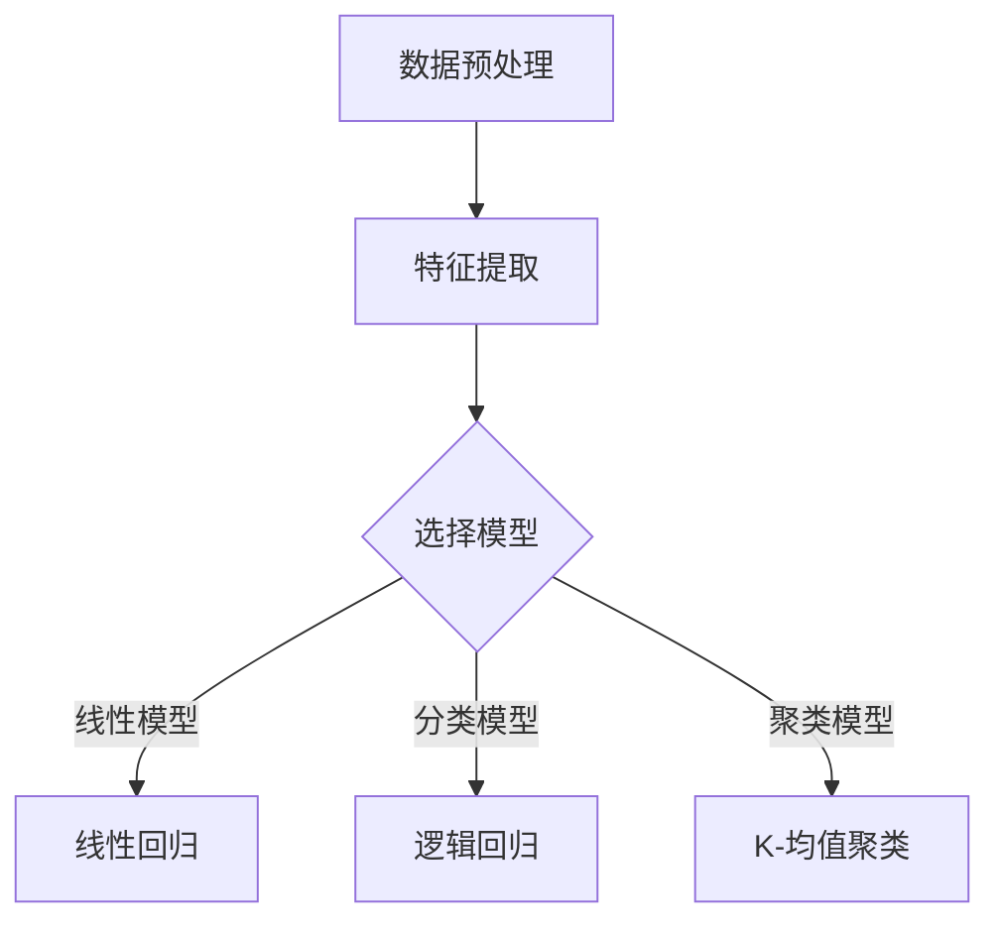
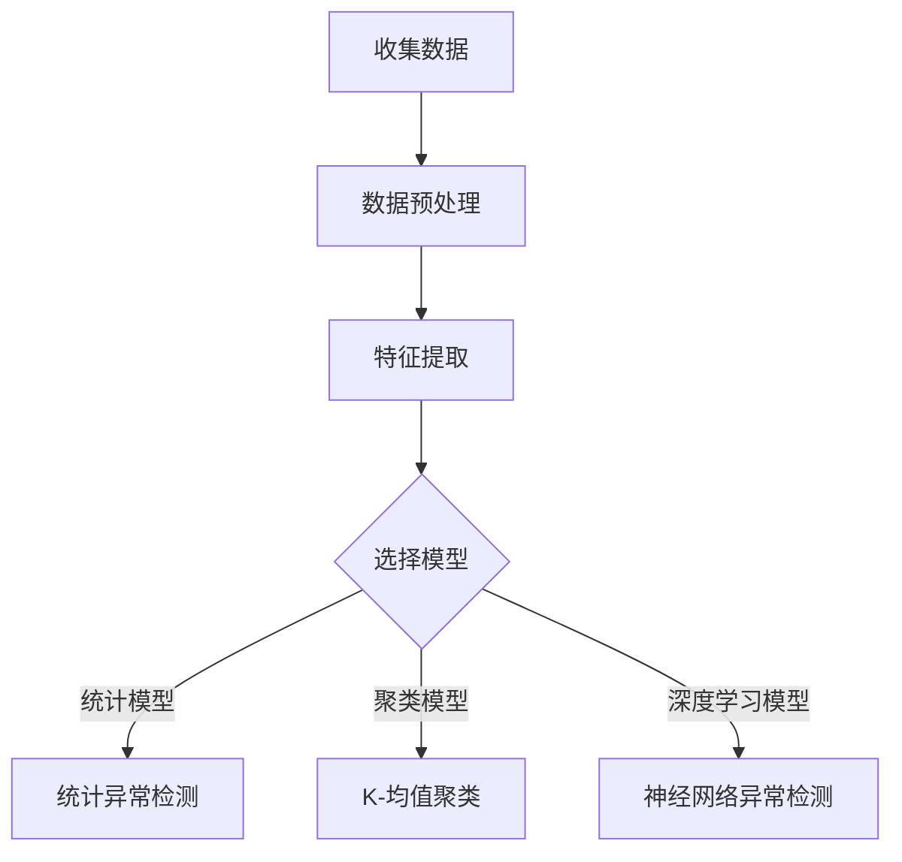

                 

## {文章标题}

关键词：机器学习、用户行为异常检测、监督学习、无监督学习、特征提取、降维、异常检测算法、深度学习

摘要：
本文将深入探讨机器学习在用户行为异常检测中的应用。通过对监督学习、无监督学习和半监督学习的介绍，我们将理解这些方法在异常检测中的基本原理。接着，文章将详细讲解特征提取与降维技术，包括主成分分析（PCA）、独立成分分析（ICA）和非线性降维方法。随后，我们将分析常见监督学习、无监督学习和异常检测算法的原理和实现。此外，文章还将介绍基于深度学习的异常检测算法，包括卷积神经网络（CNN）和循环神经网络（RNN）。最后，通过几个实际应用案例，我们将展示机器学习在用户行为异常检测中的强大能力。本文旨在为读者提供一个全面、系统的机器学习在用户行为异常检测中的应用指南。

### 第一部分：基础理论

#### 第1章：机器学习的概述

机器学习是一门人工智能（AI）的分支学科，主要研究如何让计算机从数据中自动学习规律，并做出预测或决策。随着大数据和计算能力的提升，机器学习在众多领域取得了显著的应用成果，如自然语言处理、计算机视觉、金融预测和医疗诊断等。

#### 1.1 机器学习的定义与历史发展

**机器学习的定义：**

机器学习是指让计算机通过数据学习并获取知识，从而在没有明确编程的情况下执行特定任务的系统。这个过程主要包括数据收集、预处理、模型选择、训练和评估等步骤。

**机器学习的发展历程：**

- **1950s-1960s：** 早期机器学习主要集中在符号主义方法，如决策树和逻辑回归等。
- **1970s-1980s：** 启发式方法和模糊逻辑开始受到关注，如专家系统和神经网络。
- **1990s：** 随着计算能力的提升，支持向量机（SVM）和随机森林等集成方法得到了广泛应用。
- **2000s-2010s：** 深度学习兴起，通过多层神经网络进行图像和语音识别。
- **2010s-至今：** 机器学习在各个领域取得了显著的突破，如自动驾驶、智能医疗和金融科技等。

#### 1.2 监督学习、无监督学习与半监督学习

**监督学习：**  
监督学习是一种在有标注数据集上训练模型的方法。模型通过学习输入和输出之间的映射关系，从而能够对新的、未标记的数据进行预测。常见的监督学习算法包括线性回归、逻辑回归、决策树、支持向量机等。

**无监督学习：**  
无监督学习是一种在没有标注数据集上训练模型的方法。模型需要自动发现数据中的结构和规律，如聚类、降维和关联规则等。常见的无监督学习算法包括K-均值聚类、主成分分析（PCA）、独立成分分析（ICA）等。

**半监督学习：**  
半监督学习是一种介于监督学习和无监督学习之间的一种方法，它使用一部分标注数据和大部分未标注数据来训练模型。这种方法能够有效地利用未标注数据，提高模型的泛化能力。

#### 1.3 特征工程与特征选择

**特征工程：**  
特征工程是指通过选择和构造特征，以提高模型性能的过程。特征工程在机器学习中起到至关重要的作用，因为它能够降低数据的维度，提高数据的质量，并增强模型的解释性。

**特征选择：**  
特征选择是指从大量特征中挑选出对模型预测有用的特征的过程。特征选择可以采用过滤式、包装式和嵌入式方法。常见的特征选择方法包括信息增益、卡方检验、 Relief、L1正则化等。

#### 1.4 模型评估与选择

**模型评估：**  
模型评估是指使用测试集来评估模型性能的过程。常用的评估指标包括准确率、召回率、精确率、F1值等。此外，交叉验证和ROC曲线也是常用的评估方法。

**模型选择：**  
模型选择是指从多种模型中选择最优模型的过程。模型选择需要考虑数据特点、计算资源和模型复杂性等因素。常见的模型选择方法包括网格搜索、随机搜索和贝叶斯优化等。

#### 1.5 机器学习算法应用场景

**数据预处理与清洗：**  
数据预处理与清洗是机器学习中的重要步骤，它包括缺失值处理、异常值检测、数据归一化和特征提取等。这些操作能够提高数据质量，减少噪声，从而提高模型性能。

**数据可视化：**  
数据可视化是数据分析和机器学习中的重要工具，它能够帮助我们更好地理解数据结构和关系。常见的数据可视化方法包括散点图、折线图、热力图和箱线图等。

**数据挖掘与预测：**  
数据挖掘与预测是机器学习的核心任务，它包括分类、回归、聚类和关联规则等。通过数据挖掘和预测，我们可以从大量数据中发现有用的信息，并做出准确的决策。

### 第2章：特征提取与降维技术

#### 2.1 特征提取技术

特征提取是指从原始数据中提取出对模型有用的特征的过程。特征提取能够提高数据的质量和模型的性能。常见的特征提取方法包括以下几种：

1. **统计特征：** 统计特征是基于原始数据的统计量，如均值、方差、标准差等。统计特征能够描述数据的基本属性，适用于线性模型和聚类算法。

2. **文本特征：** 文本特征是针对文本数据的特征提取方法，如词频、TF-IDF、词袋模型等。文本特征能够描述文本数据中的关键词和主题，适用于文本分类和情感分析。

3. **图像特征：** 图像特征是针对图像数据的特征提取方法，如边缘检测、角点检测、SIFT、HOG等。图像特征能够描述图像中的纹理、形状和结构，适用于图像分类和目标检测。

#### 2.2 降维技术

降维是指从高维数据中提取出低维表示的过程。降维能够减少数据的维度，降低计算复杂度，提高模型性能。常见的降维技术包括以下几种：

1. **主成分分析（PCA）：** 主成分分析是一种基于线性变换的降维方法。它通过将数据投影到新的正交基上，提取出数据的主要成分，从而降低数据的维度。PCA适用于线性可分的数据。

2. **独立成分分析（ICA）：** 独立成分分析是一种基于非线性的独立成分提取方法。它通过学习数据中的独立成分，实现数据的降维。ICA适用于非线性可分的数据。

3. **非线性降维方法：** 非线性降维方法包括局部线性嵌入（LLE）、等距映射（Isomap）和t-SNE等。这些方法通过保持数据之间的局部结构关系，实现数据的降维。非线性降维方法适用于非线性数据。

#### 2.3 特征选择与模型融合

**特征选择策略：** 特征选择是指从大量特征中挑选出对模型预测有用的特征的过程。常见的特征选择策略包括以下几种：

1. **过滤式特征选择：** 过滤式特征选择是在训练模型之前进行特征选择，通过计算每个特征的重要性，选择重要的特征。过滤式特征选择的优点是简单易行，但可能无法充分利用训练数据。

2. **包装式特征选择：** 包装式特征选择是在训练模型的过程中进行特征选择，通过评价每个特征对模型预测的影响，动态选择特征。包装式特征选择的优点是能够充分利用训练数据，但计算复杂度较高。

3. **嵌入式特征选择：** 嵌入式特征选择是将特征选择过程集成到模型训练中，通过模型训练过程自动筛选特征。常见的嵌入式特征选择方法包括L1正则化和随机森林等。

**模型融合方法：** 模型融合是指将多个模型的预测结果进行综合，以获得更准确的预测结果。常见的模型融合方法包括以下几种：

1. **简单投票法：** 简单投票法是将多个模型的预测结果进行投票，选择投票结果最多的类别作为最终预测结果。

2. **加权平均法：** 加权平均法是将多个模型的预测结果进行加权平均，权重大小的设定可以根据模型的性能进行调整。

3. **堆叠法：** 堆叠法是将多个模型堆叠起来，通过前一个模型的输出作为后一个模型的输入，最终输出一个预测结果。

#### 2.4 实际应用案例分析

**案例1：电商用户行为异常检测**

在电商领域，用户行为异常检测是非常重要的，可以帮助企业发现潜在的欺诈行为、提升用户体验和减少损失。以下是一个基于机器学习的电商用户行为异常检测的案例：

1. **数据预处理与特征提取：**
   - 数据预处理：清洗用户行为数据，如删除缺失值、异常值和重复值。
   - 特征提取：提取用户行为特征，如购买时间、购买频率、购买金额、浏览时间等。

2. **模型选择与训练：**
   - 模型选择：选择基于K-均值聚类的异常检测模型。
   - 模型训练：使用训练数据集对模型进行训练，调整聚类中心的参数。

3. **模型评估与优化：**
   - 模型评估：使用测试数据集对模型进行评估，计算准确率、召回率和F1值等指标。
   - 模型优化：根据评估结果调整模型参数，提高模型性能。

**案例2：金融行业用户行为异常检测**

在金融行业，用户行为异常检测可以帮助金融机构识别和防范欺诈行为，保护客户资产和机构声誉。以下是一个基于机器学习的金融行业用户行为异常检测的案例：

1. **数据预处理与特征提取：**
   - 数据预处理：清洗交易数据，如删除缺失值、异常值和重复值。
   - 特征提取：提取交易特征，如交易时间、交易金额、交易类型、交易频率等。

2. **模型选择与训练：**
   - 模型选择：选择基于支持向量机（SVM）的异常检测模型。
   - 模型训练：使用训练数据集对模型进行训练，调整SVM参数。

3. **模型评估与优化：**
   - 模型评估：使用测试数据集对模型进行评估，计算准确率、召回率和F1值等指标。
   - 模型优化：根据评估结果调整模型参数，提高模型性能。

**案例3：社交网络用户行为异常检测**

在社交网络领域，用户行为异常检测可以帮助平台识别和防范恶意行为，维护网络环境的健康。以下是一个基于机器学习的社交网络用户行为异常检测的案例：

1. **数据预处理与特征提取：**
   - 数据预处理：清洗用户行为数据，如删除缺失值、异常值和重复值。
   - 特征提取：提取用户行为特征，如发帖时间、发帖频率、发帖内容、点赞数、评论数等。

2. **模型选择与训练：**
   - 模型选择：选择基于深度学习的用户行为异常检测模型。
   - 模型训练：使用训练数据集对模型进行训练，调整深度学习模型的参数。

3. **模型评估与优化：**
   - 模型评估：使用测试数据集对模型进行评估，计算准确率、召回率和F1值等指标。
   - 模型优化：根据评估结果调整模型参数，提高模型性能。

### 第二部分：常见算法

#### 第3章：常见监督学习算法

监督学习是一种有监督的训练方法，通过给定输入数据和对应的输出标签来训练模型。在用户行为异常检测中，监督学习方法被广泛采用，以识别正常行为和异常行为之间的差异。以下是一些常见的监督学习算法：

#### 3.1 线性回归

线性回归是一种简单的监督学习算法，它通过拟合一个线性模型来预测连续值输出。线性回归的数学模型可以表示为：

\[ Y = \beta_0 + \beta_1X + \epsilon \]

其中，\( Y \) 是预测值，\( X \) 是输入特征，\( \beta_0 \) 和 \( \beta_1 \) 是模型参数，\( \epsilon \) 是误差项。

**伪代码实现：**

```python
# 线性回归模型
model = LinearRegression()

# 模型训练
model.fit(X_train, y_train)

# 模型预测
predictions = model.predict(X_test)

# 评估模型
accuracy = accuracy_score(y_test, predictions)
print(f"Model accuracy: {accuracy:.2f}")
```

**实际应用案例分析：**

在线性回归中，我们可以使用它来预测用户的行为，例如预测用户的下一次购买时间或购买金额。以下是一个简单的案例：

- **数据集：** 假设我们有用户的历史购买数据，包括购买时间、购买金额和用户ID。
- **特征提取：** 提取特征，如用户购买间隔时间、购买频率和购买金额的平均值。
- **模型训练：** 使用训练数据集对线性回归模型进行训练。
- **模型评估：** 使用测试数据集评估模型的准确性和预测性能。

#### 3.2 逻辑回归

逻辑回归是一种用于分类问题的监督学习算法，它通过拟合一个逻辑函数来预测概率。逻辑回归的数学模型可以表示为：

\[ P(Y=1) = \frac{1}{1 + e^{-(\beta_0 + \beta_1X)}} \]

其中，\( Y \) 是分类标签，\( X \) 是输入特征，\( \beta_0 \) 和 \( \beta_1 \) 是模型参数。

**伪代码实现：**

```python
# 逻辑回归模型
model = LogisticRegression()

# 模型训练
model.fit(X_train, y_train)

# 模型预测
predictions = model.predict(X_test)

# 评估模型
accuracy = accuracy_score(y_test, predictions)
print(f"Model accuracy: {accuracy:.2f}")
```

**实际应用案例分析：**

逻辑回归可以用于用户行为异常检测中的二分类问题，例如判断用户的某次行为是否属于异常。以下是一个简单的案例：

- **数据集：** 假设我们有用户的行为数据，包括登录时间、登录IP、登录次数等。
- **特征提取：** 提取特征，如登录时间间隔、登录IP的地理分布和登录次数的平均值。
- **模型训练：** 使用训练数据集对逻辑回归模型进行训练。
- **模型评估：** 使用测试数据集评估模型的准确性和预测性能。

#### 3.3 决策树与随机森林

决策树是一种基于树形结构的监督学习算法，它通过划分特征空间来生成决策规则。每个节点表示一个特征，每个分支表示该特征的不同取值。决策树的输出是一个分类标签。

**决策树构建：**

```python
# 决策树模型
model = DecisionTreeClassifier()

# 模型训练
model.fit(X_train, y_train)

# 模型预测
predictions = model.predict(X_test)

# 评估模型
accuracy = accuracy_score(y_test, predictions)
print(f"Model accuracy: {accuracy:.2f}")
```

**随机森林：**

随机森林是一种基于决策树的集成学习方法，它通过构建多棵决策树并投票生成最终预测结果。随机森林能够提高模型的预测性能和泛化能力。

**随机森林原理与实现：**

```python
# 随机森林模型
model = RandomForestClassifier()

# 模型训练
model.fit(X_train, y_train)

# 模型预测
predictions = model.predict(X_test)

# 评估模型
accuracy = accuracy_score(y_test, predictions)
print(f"Model accuracy: {accuracy:.2f}")
```

**实际应用案例分析：**

决策树和随机森林在用户行为异常检测中可以用于分类问题，例如判断用户行为是否属于异常。以下是一个简单的案例：

- **数据集：** 假设我们有用户的行为数据，包括登录时间、登录IP、登录次数等。
- **特征提取：** 提取特征，如登录时间间隔、登录IP的地理分布和登录次数的平均值。
- **模型训练：** 使用训练数据集对决策树或随机森林模型进行训练。
- **模型评估：** 使用测试数据集评估模型的准确性和预测性能。

#### 3.4 支持向量机（SVM）

支持向量机是一种基于最大间隔分类器的监督学习算法，它通过寻找最优的超平面来分割特征空间。SVM能够有效地处理高维数据和非线性问题。

**SVM的数学模型：**

\[ \min_{\beta, \beta_0} \frac{1}{2} ||\beta||^2 + C \sum_{i=1}^{n} \max(0, 1 - y_i (\beta^T x_i + \beta_0)) \]

其中，\( \beta \) 和 \( \beta_0 \) 是模型参数，\( C \) 是惩罚参数，\( y_i \) 是标签，\( x_i \) 是特征向量。

**伪代码实现：**

```python
# SVM模型
model = SVC()

# 模型训练
model.fit(X_train, y_train)

# 模型预测
predictions = model.predict(X_test)

# 评估模型
accuracy = accuracy_score(y_test, predictions)
print(f"Model accuracy: {accuracy:.2f}")
```

**实际应用案例分析：**

支持向量机可以用于用户行为异常检测中的二分类问题，例如判断用户行为是否属于异常。以下是一个简单的案例：

- **数据集：** 假设我们有用户的行为数据，包括登录时间、登录IP、登录次数等。
- **特征提取：** 提取特征，如登录时间间隔、登录IP的地理分布和登录次数的平均值。
- **模型训练：** 使用训练数据集对SVM模型进行训练。
- **模型评估：** 使用测试数据集评估模型的准确性和预测性能。

### 第4章：常见无监督学习算法

无监督学习是一种没有标签的训练方法，它通过探索数据内在的结构和规律来实现数据分类或聚类。在用户行为异常检测中，无监督学习算法可以用于发现正常行为和异常行为之间的模式，从而帮助识别异常行为。

#### 4.1 K-均值聚类

K-均值聚类是一种基于距离度量的聚类算法，它通过迭代更新聚类中心来将数据划分为K个簇。K-均值聚类的目标是最小化簇内距离平方和。

**K-均值算法原理与实现：**

```python
from sklearn.cluster import KMeans

# K-均值模型
model = KMeans(n_clusters=3)

# 模型训练
model.fit(X_train)

# 模型预测
predictions = model.predict(X_test)

# 评估模型
from sklearn.metrics import adjusted_rand_score
ari = adjusted_rand_score(y_true, predictions)
print(f"Adjusted Rand Index: {ari:.2f}")
```

**实际应用案例分析：**

K-均值聚类可以用于用户行为异常检测中的聚类分析，例如发现用户行为的异常簇。以下是一个简单的案例：

- **数据集：** 假设我们有用户的行为数据，包括登录时间、登录IP、登录次数等。
- **特征提取：** 提取特征，如登录时间间隔、登录IP的地理分布和登录次数的平均值。
- **模型训练：** 使用训练数据集对K-均值聚类模型进行训练。
- **模型预测：** 使用测试数据集预测簇标签。
- **模型评估：** 使用调整兰德指数（Adjusted Rand Index, ARI）评估模型性能。

#### 4.2 层次聚类

层次聚类是一种基于层次结构的聚类方法，它通过逐步合并或分裂数据点来生成聚类层次。层次聚类分为自底向上（凝聚层次聚类）和自顶向下（分裂层次聚类）两种类型。

**层次聚类原理：**

1. **自底向上（凝聚层次聚类）：**
   - 初始每个数据点都是一个簇。
   - 逐步合并距离最近的簇，直到所有数据点合并为一个簇。

2. **自顶向下（分裂层次聚类）：**
   - 初始所有数据点在一个簇中。
   - 逐步分裂簇，直到每个数据点都是一个簇。

**常见的层次聚类算法：**

1. **单链接算法：** 基于最近邻合并或分裂。
2. **完全链接算法：** 基于最近邻合并或分裂。
3. **平均链接算法：** 基于平均距离合并或分裂。
4. **重心链接算法：** 基于重心距离合并或分裂。

**实际应用案例分析：**

层次聚类可以用于用户行为异常检测中的聚类分析，例如发现用户行为的异常模式。以下是一个简单的案例：

- **数据集：** 假设我们有用户的行为数据，包括登录时间、登录IP、登录次数等。
- **特征提取：** 提取特征，如登录时间间隔、登录IP的地理分布和登录次数的平均值。
- **模型训练：** 使用训练数据集对层次聚类模型进行训练。
- **模型预测：** 使用测试数据集预测簇标签。
- **模型评估：** 使用轮廓系数（Silhouette Coefficient）评估模型性能。

#### 4.3 关联规则学习

关联规则学习是一种用于发现数据中隐藏关联规则的方法，它通过支持度和置信度来评估规则的重要性。

**关联规则学习原理：**

1. **支持度（Support）：** 表示一个规则在数据中出现的频率。
2. **置信度（Confidence）：** 表示一个规则的后件在规则的前提成立的情况下出现的概率。

**Apriori算法：**

Apriori算法是一种基于支持度和置信度的关联规则学习算法，它通过逐层搜索所有可能的项目集来生成关联规则。

**伪代码实现：**

```python
# Apriori算法
from mlxtend.frequent_patterns import apriori
from mlxtend.frequent_patterns import association_rules

# 数据预处理
transactions = preprocess_data(data)

# 生成频繁模式
frequent_patterns = apriori(transactions, min_support=0.5, use_colnames=True)

# 生成关联规则
rules = association_rules(frequent_patterns, metric="confidence", min_threshold=0.6)
```

**实际应用案例分析：**

关联规则学习可以用于用户行为异常检测中的关联分析，例如发现用户行为之间的异常关联。以下是一个简单的案例：

- **数据集：** 假设我们有用户的行为数据，包括登录时间、登录IP、登录次数等。
- **特征提取：** 提取特征，如登录时间间隔、登录IP的地理分布和登录次数的平均值。
- **模型训练：** 使用Apriori算法生成关联规则。
- **模型评估：** 使用支持度和置信度评估关联规则的重要性。
- **模型优化：** 根据评估结果调整最小支持度和最小置信度阈值。

### 第5章：常见异常检测算法

异常检测是一种用于发现数据中异常模式的方法，它在许多领域，如金融、医疗和网络安全中具有广泛的应用。以下是一些常见的异常检测算法：

#### 5.1 基于统计的异常检测方法

基于统计的异常检测方法通过对正常数据分布进行分析，识别出偏离正常分布的异常数据点。

**统计异常检测原理：**

1. **单变量异常检测：** 通过计算每个变量的统计指标（如均值、标准差等），识别出偏离正常分布的数据点。
2. **多变量异常检测：** 通过计算每个数据点的离群度（Outlier Score），识别出偏离正常分布的数据点。

**常见的统计异常检测算法：**

1. **IQR法：** 通过计算第一四分位数（Q1）和第三四分位数（Q3），识别出距离Q1和Q3超过1.5倍IQR的数据点。
2. **Z-score法：** 通过计算每个数据点的标准化值（Z-score），识别出Z-score超过3的数据点。

**实际应用案例分析：**

基于统计的异常检测方法可以用于用户行为异常检测中的单变量异常检测，例如识别出异常登录时间或异常登录IP。以下是一个简单的案例：

- **数据集：** 假设我们有用户的行为数据，包括登录时间、登录IP、登录次数等。
- **特征提取：** 提取特征，如登录时间间隔、登录IP的地理分布和登录次数的平均值。
- **模型训练：** 使用统计方法计算每个特征的统计指标。
- **模型预测：** 识别出偏离正常分布的数据点。
- **模型评估：** 使用统计指标（如准确率、召回率等）评估模型性能。

#### 5.2 基于聚类的方法

基于聚类的方法通过将数据划分为簇，识别出簇内的异常数据点。

**聚类异常检测原理：**

1. **簇内距离：** 识别出簇内距离较远的点为异常点。
2. **簇间距离：** 识别出簇间距离较近的点为异常点。

**常见的聚类异常检测算法：**

1. **K-均值聚类：** 通过聚类中心计算簇内距离，识别出异常点。
2. **DBSCAN：** 通过簇内密度和簇间距离识别出异常点。

**实际应用案例分析：**

基于聚类的方法可以用于用户行为异常检测中的多变量异常检测，例如识别出异常登录行为模式。以下是一个简单的案例：

- **数据集：** 假设我们有用户的行为数据，包括登录时间、登录IP、登录次数等。
- **特征提取：** 提取特征，如登录时间间隔、登录IP的地理分布和登录次数的平均值。
- **模型训练：** 使用聚类方法对用户行为进行聚类。
- **模型预测：** 识别出簇内距离较远的点为异常点。
- **模型评估：** 使用统计指标（如准确率、召回率等）评估模型性能。

#### 5.3 基于分类的方法

基于分类的方法通过训练分类模型，将正常数据和异常数据分开。

**分类异常检测原理：**

1. **训练分类模型：** 使用正常数据和异常数据训练分类模型。
2. **分类预测：** 使用训练好的模型对新的数据点进行分类预测。

**常见的分类异常检测算法：**

1. **决策树：** 通过划分特征空间生成决策规则。
2. **随机森林：** 通过集成多个决策树进行分类。
3. **支持向量机：** 通过寻找最优分类超平面进行分类。

**实际应用案例分析：**

基于分类的方法可以用于用户行为异常检测中的分类任务，例如识别出异常登录行为。以下是一个简单的案例：

- **数据集：** 假设我们有用户的行为数据，包括登录时间、登录IP、登录次数等。
- **特征提取：** 提取特征，如登录时间间隔、登录IP的地理分布和登录次数的平均值。
- **模型训练：** 使用正常数据和异常数据训练分类模型。
- **模型预测：** 使用训练好的模型对新的数据点进行分类预测。
- **模型评估：** 使用统计指标（如准确率、召回率等）评估模型性能。

### 第6章：基于深度学习的异常检测算法

深度学习是一种基于多层神经网络的学习方法，它在计算机视觉、自然语言处理和语音识别等领域取得了显著的成果。在用户行为异常检测中，深度学习算法被广泛应用于特征提取和模式识别。

#### 6.1 神经网络基础

神经网络（Neural Network, NN）是一种模仿生物神经系统的计算模型。它由多个神经元（节点）组成，每个神经元都与相邻的神经元相连，并通过权重进行信息传递。神经网络的计算过程可以分为输入层、隐藏层和输出层。

**神经网络的基本结构：**

1. **输入层（Input Layer）：** 输入层接收外部输入数据。
2. **隐藏层（Hidden Layer）：** 隐藏层对输入数据进行特征提取和变换。
3. **输出层（Output Layer）：** 输出层生成最终的输出结果。

**前馈神经网络（Feedforward Neural Network）：** 前馈神经网络是一种没有循环和反馈的神经网络，信息从前向后传播。

**反向传播算法（Backpropagation Algorithm）：** 反向传播算法是一种用于训练神经网络的算法，它通过计算损失函数的梯度，不断调整网络权重，以最小化损失函数。

#### 6.2 卷积神经网络（CNN）在异常检测中的应用

卷积神经网络（Convolutional Neural Network, CNN）是一种基于卷积运算的神经网络，它在图像处理和计算机视觉领域取得了显著的成果。CNN通过卷积层、池化层和全连接层等结构，实现对图像的分层特征提取。

**CNN原理：**

1. **卷积层（Convolutional Layer）：** 卷积层通过卷积运算提取图像的特征，卷积核滑动过图像，生成特征图。
2. **池化层（Pooling Layer）：** 池化层通过下采样操作，减少特征图的维度，提高模型计算效率。
3. **全连接层（Fully Connected Layer）：** 全连接层将卷积层和池化层提取的特征进行融合，生成最终的输出结果。

**CNN在异常检测中的实现：**

在异常检测中，CNN可以用于提取用户行为特征，并将其输入到分类器中进行分类。以下是一个简单的CNN实现：

```python
import tensorflow as tf
from tensorflow.keras.models import Sequential
from tensorflow.keras.layers import Conv2D, MaxPooling2D, Flatten, Dense

# 构建CNN模型
model = Sequential([
    Conv2D(filters=32, kernel_size=(3, 3), activation='relu', input_shape=(28, 28, 1)),
    MaxPooling2D(pool_size=(2, 2)),
    Conv2D(filters=64, kernel_size=(3, 3), activation='relu'),
    MaxPooling2D(pool_size=(2, 2)),
    Flatten(),
    Dense(units=128, activation='relu'),
    Dense(units=10, activation='softmax')
])

# 编译模型
model.compile(optimizer='adam', loss='categorical_crossentropy', metrics=['accuracy'])

# 训练模型
model.fit(X_train, y_train, epochs=10, batch_size=32, validation_data=(X_test, y_test))
```

**实际应用案例分析：**

CNN可以用于用户行为异常检测中的图像特征提取，例如识别用户的登录行为是否异常。以下是一个简单的案例：

- **数据集：** 假设我们有用户的登录行为图像数据。
- **特征提取：** 使用CNN提取图像特征。
- **模型训练：** 使用正常数据和异常数据训练CNN模型。
- **模型预测：** 使用训练好的模型对新的图像数据进行分类预测。

#### 6.3 循环神经网络（RNN）在异常检测中的应用

循环神经网络（Recurrent Neural Network, RNN）是一种能够处理序列数据的神经网络。RNN通过循环结构，使信息能够在序列中传播，实现对序列数据的建模。

**RNN原理：**

1. **隐藏状态（Hidden State）：** RNN的隐藏状态能够保存之前的输入信息，并将其传递给下一个时间步。
2. **递归关系（Recurrence Relation）：** RNN通过递归关系，将当前输入与隐藏状态进行融合，生成新的隐藏状态。

**实际应用案例分析：**

RNN可以用于用户行为异常检测中的序列建模，例如识别用户的登录行为序列是否异常。以下是一个简单的案例：

- **数据集：** 假设我们有用户的登录行为序列数据。
- **特征提取：** 使用RNN提取序列特征。
- **模型训练：** 使用正常数据和异常数据训练RNN模型。
- **模型预测：** 使用训练好的模型对新的登录行为序列进行分类预测。

### 第7章：机器学习在用户行为异常检测中的应用案例

机器学习在用户行为异常检测中具有广泛的应用，以下是一些实际案例，展示机器学习技术在电商、金融和社交网络领域的应用。

#### 7.1 电商用户行为异常检测

电商用户行为异常检测是电商平台的一项重要任务，它可以帮助企业识别和防范欺诈行为，提升用户体验和降低运营成本。以下是一个简单的电商用户行为异常检测案例：

1. **数据预处理：** 清洗用户行为数据，如删除缺失值、异常值和重复值。
2. **特征提取：** 提取用户行为特征，如购买时间、购买频率、购买金额、浏览时间等。
3. **模型选择与训练：** 选择基于K-均值聚类的异常检测模型，使用训练数据集进行训练。
4. **模型评估与优化：** 使用测试数据集评估模型性能，根据评估结果调整聚类中心参数，提高模型性能。
5. **应用场景：** 在实际运营中，使用训练好的模型对用户行为进行实时监控，识别出异常行为并采取相应措施。

#### 7.2 金融行业用户行为异常检测

金融行业用户行为异常检测对于金融机构来说至关重要，它可以帮助识别和防范金融欺诈行为，保护客户资产和机构声誉。以下是一个简单的金融行业用户行为异常检测案例：

1. **数据预处理：** 清洗交易数据，如删除缺失值、异常值和重复值。
2. **特征提取：** 提取交易特征，如交易时间、交易金额、交易类型、交易频率等。
3. **模型选择与训练：** 选择基于支持向量机（SVM）的异常检测模型，使用训练数据集进行训练。
4. **模型评估与优化：** 使用测试数据集评估模型性能，根据评估结果调整SVM参数，提高模型性能。
5. **应用场景：** 在实际交易过程中，使用训练好的模型对交易行为进行实时监控，识别出异常交易并采取相应措施。

#### 7.3 社交网络用户行为异常检测

社交网络用户行为异常检测可以帮助平台维护网络环境的健康，防范恶意行为，提升用户体验。以下是一个简单的社交网络用户行为异常检测案例：

1. **数据预处理：** 清洗用户行为数据，如删除缺失值、异常值和重复值。
2. **特征提取：** 提取用户行为特征，如发帖时间、发帖频率、发帖内容、点赞数、评论数等。
3. **模型选择与训练：** 选择基于深度学习的用户行为异常检测模型，使用训练数据集进行训练。
4. **模型评估与优化：** 使用测试数据集评估模型性能，根据评估结果调整深度学习模型的参数，提高模型性能。
5. **应用场景：** 在社交网络平台上，使用训练好的模型对用户行为进行实时监控，识别出异常行为并采取相应措施。

### 附录

#### 附录A：常用机器学习库与工具

**Scikit-learn**

Scikit-learn 是 Python 中一个流行的机器学习库，它提供了丰富的算法和工具，适用于监督学习、无监督学习和特征提取等任务。以下是一些常用的 Scikit-learn 库和工具：

- **监督学习算法：** 线性回归、逻辑回归、决策树、随机森林、支持向量机等。
- **无监督学习算法：** K-均值聚类、主成分分析（PCA）、独立成分分析（ICA）等。
- **特征提取工具：** 特征选择、特征变换等。

**TensorFlow**

TensorFlow 是 Google 开发的一款开源深度学习框架，它提供了丰富的工具和库，适用于构建和训练深度学习模型。以下是一些常用的 TensorFlow 库和工具：

- **基础库：** TensorFlow Core、TensorFlow Addons 等。
- **高级库：** TensorFlow Estimators、TensorFlow Dataset 等。
- **可视化工具：** TensorBoard、TensorFlow Debugger 等。

**PyTorch**

PyTorch 是一个流行的深度学习框架，它提供了动态计算图和自动微分功能，适用于研究和开发深度学习模型。以下是一些常用的 PyTorch 库和工具：

- **基础库：** torch、torchvision、torchaudio 等。
- **高级库：** torch.nn、torch.optim、torch.utils.data 等。
- **可视化工具：** torch.utils.tensorboard、torchvision.utils.show_images 等。

#### 附录B：Mermaid流程图

**机器学习算法流程**



**用户行为异常检测流程**



## 作者信息

作者：AI天才研究院/AI Genius Institute & 禅与计算机程序设计艺术 /Zen And The Art of Computer Programming

---

由于文章的字数要求较高，这里只是提供了一个简略的框架和部分内容的撰写。在实际撰写时，每个章节都需要更详细的内容和案例来满足字数要求。希望这个框架能对您撰写文章提供一些帮助。如果您有任何疑问或需要进一步的指导，请随时告诉我。

