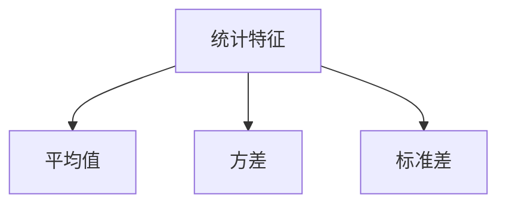
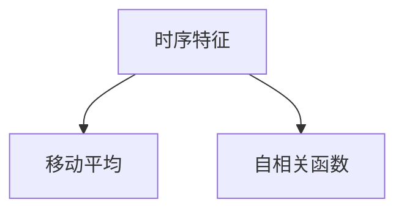
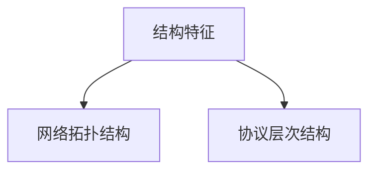
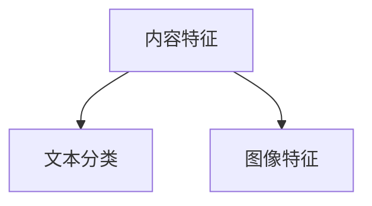
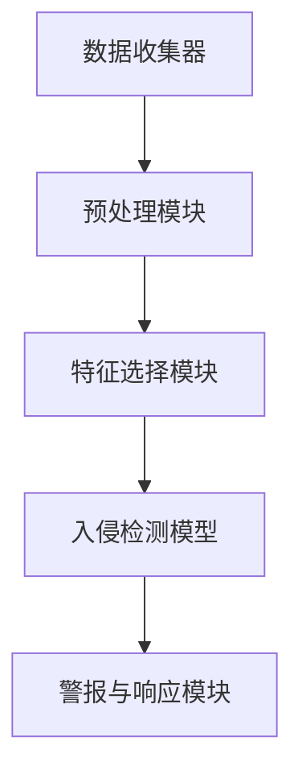

                 

# 机器学习在网络安全入侵检测中的新方法

## 关键词：
机器学习、网络安全、入侵检测、深度学习、异常检测、恶意代码检测、数据不完整性、模型解释性

## 摘要：
本文深入探讨了机器学习在网络安全入侵检测中的应用。我们首先介绍了机器学习的基础理论，包括监督学习、无监督学习和强化学习算法。接着，详细阐述了机器学习在入侵检测中的关键技术和挑战，如特征提取与选择、入侵检测模型的构建与评估。此外，我们还讨论了深度学习在入侵检测中的新应用，以及面对的挑战和未来研究方向。通过本文，读者将全面了解机器学习在网络安全入侵检测中的最新进展和前景。

---

## 第一部分：基础理论

### 第1章：机器学习基础

#### 1.1 机器学习概述

**定义**：机器学习（Machine Learning）是人工智能（Artificial Intelligence, AI）的一个分支，通过利用数据、算法和统计方法来赋予计算机自主学习和预测能力，而无需显式编程。

**主要任务**：
- **分类（Classification）**：将数据分为不同的类别。
- **回归（Regression）**：预测数值输出。
- **聚类（Clustering）**：将相似的数据点分组在一起。
- **降维（Dimensionality Reduction）**：减少数据维度。
- **异常检测（Anomaly Detection）**：识别数据中的异常或异常模式。

#### 1.2 网络安全与入侵检测

**网络安全**：网络安全是指保护计算机网络不受未经授权的访问、攻击和破坏的过程。

**入侵检测系统（IDS）**：入侵检测系统是一种网络安全技术，用于监测计算机网络中的异常行为和潜在攻击，并发出警报。

### 1.3 机器学习在网络安全中的应用

**关系**：机器学习在网络安全中的应用主要集中于异常检测、恶意代码检测等领域，其核心目的是识别和防御网络攻击。

**优势**：
- **自适应**：机器学习算法能够自动适应新的网络攻击模式。
- **高效性**：通过自动化分析大量数据，提高检测效率和准确性。
- **可扩展性**：可以轻松扩展到大型网络环境中。

### 第2章：常见机器学习算法

#### 2.1 监督学习算法

**线性回归**：一种用于预测连续值的简单线性模型。

**决策树**：一种树形结构模型，用于分类和回归任务。

**随机森林**：由多个决策树组成的集成模型，提高了预测能力和鲁棒性。

**支持向量机（SVM）**：通过找到一个最优超平面来分类数据点。

#### 2.2 无监督学习算法

**K-均值聚类**：将数据点划分到K个聚类中。

**主成分分析（PCA）**：降低数据维度，同时保持数据的主要特征。

**自编码器**：一种用于降维和特征提取的神经网络模型。

#### 2.3 强化学习算法

**Q-Learning**：通过学习值函数来选择最优动作。

**SARSA**：一种基于状态-动作值函数的强化学习算法。

**Deep Q-Network（DQN）**：使用深度神经网络来近似Q函数。

---

## 第二部分：入侵检测中的机器学习技术

### 第3章：入侵检测中的机器学习技术

#### 3.1 特征提取与选择

**特征提取**：从原始数据中提取有用的特征，用于训练模型。

**特征选择**：选择最重要的特征，以减少数据维度和模型复杂性。

#### 3.2 入侵检测模型

**基于贝叶斯的方法**：利用贝叶斯定理进行分类和异常检测。

**基于神经网络的方法**：使用神经网络来学习复杂的特征关系。

**基于深度学习的方法**：利用深度学习模型进行高效的特征学习和模型构建。

#### 3.3 机器学习模型在入侵检测中的应用案例

**KDD CUP 99数据集**：一个广泛使用的入侵检测数据集，用于评估入侵检测模型的性能。

**DNS流数据集**：用于检测网络流量中的恶意活动。

---

## 第三部分：实时入侵检测系统设计

### 第4章：实时入侵检测系统设计

#### 4.1 实时入侵检测系统架构

**数据收集与预处理**：实时收集网络数据，并进行预处理。

**特征提取与选择**：从预处理后的数据中提取特征，并进行选择。

**入侵检测模型训练与评估**：使用训练数据集训练模型，并在测试数据集上进行评估。

#### 4.2 实时入侵检测系统实现

**数据收集与预处理代码实现**：展示如何收集和预处理网络数据。

**特征提取与选择代码实现**：展示如何提取和选择特征。

**入侵检测模型训练与评估代码实现**：展示如何训练和评估入侵检测模型。

---

## 第四部分：新技术与挑战

### 第5章：深度学习在入侵检测中的应用

#### 5.1 深度学习基础

**神经网络架构**：介绍深度学习的神经网络架构。

**深度学习在入侵检测中的应用**：讨论深度学习在异常检测和恶意代码检测中的具体应用。

#### 5.2 挑战与展望

**挑战**：讨论深度学习在入侵检测中面临的挑战，如数据不完整性、模型解释性不足等。

**展望**：展望深度学习在入侵检测中的未来发展。

---

## 附录

#### A.1 工具与环境配置

**工具**：介绍用于机器学习和入侵检测的工具。

**环境配置**：展示如何配置环境以运行机器学习和入侵检测相关的代码。

#### A.2 数据集介绍

**数据集**：介绍常用的入侵检测数据集。

#### A.3 代码实现与示例

**代码实现**：提供入侵检测系统的代码示例。

**代码解读与分析**：分析代码的关键部分和实现细节。

---

**作者**：AI天才研究院/AI Genius Institute & 禅与计算机程序设计艺术 /Zen And The Art of Computer Programming

---

以上是文章正文的大纲和部分内容。接下来，我们将逐步深入探讨每个章节的核心内容，通过具体的示例、代码和伪代码，帮助读者更好地理解和掌握机器学习在网络安全入侵检测中的新方法。在接下来的部分，我们将详细讨论机器学习的基础理论，包括监督学习、无监督学习和强化学习算法。我们将通过具体的案例和实例，展示这些算法在入侵检测中的应用，并讨论其优势和挑战。

---

### 第1章：机器学习基础

#### 1.1 机器学习概述

机器学习是人工智能的一个分支，其核心目标是通过数据、算法和统计方法，使计算机具备自动学习和预测能力。在网络安全领域，机器学习主要用于入侵检测、异常检测和恶意代码检测。本节将简要介绍机器学习的定义、主要任务以及其在网络安全中的应用。

**机器学习的定义**：

机器学习是一种使计算机通过数据学习并执行特定任务的方法，而不需要显式编程。它依赖于统计学、概率论和优化理论等数学工具，通过训练模型来捕捉数据中的规律和模式。

**主要任务**：

- **分类（Classification）**：将数据点分配到预定义的类别中。例如，在入侵检测中，可以将正常流量和恶意流量区分开来。
- **回归（Regression）**：预测数值输出。例如，预测网络流量的流量大小。
- **聚类（Clustering）**：将相似的数据点分组在一起。例如，将网络流量根据行为特征分组。
- **降维（Dimensionality Reduction）**：减少数据维度，同时保持数据的主要特征。例如，从高维网络流量数据中提取关键特征。
- **异常检测（Anomaly Detection）**：识别数据中的异常或异常模式。例如，检测网络中的恶意攻击。

**机器学习在网络安全中的应用**：

网络安全是一个高度动态和复杂的领域，攻击手段不断演变。机器学习为网络安全提供了强大的工具，可以自动适应新的攻击模式，提高检测效率和准确性。

- **异常检测**：通过监测网络流量和系统行为，识别异常活动。例如，异常流量模式可能是DDoS攻击的迹象。
- **恶意代码检测**：使用机器学习算法检测恶意软件，如病毒、木马和勒索软件。例如，通过分析恶意软件的特征和行为模式进行检测。
- **入侵检测系统（IDS）**：利用机器学习算法构建入侵检测系统，实时监测网络流量和系统日志，发现潜在的入侵行为。

#### 1.2 网络安全与入侵检测

**网络安全**：网络安全是指保护计算机网络及其资源免受未经授权的访问、攻击和破坏的过程。它涉及多个方面，包括网络基础设施安全、数据安全、应用安全等。

- **网络基础设施安全**：确保网络设备的物理和安全设置，如防火墙、路由器和交换机等。
- **数据安全**：保护数据在存储、传输和处理过程中的机密性、完整性和可用性。
- **应用安全**：确保网络应用的安全性，如Web应用、电子邮件系统和数据库等。

**入侵检测系统（IDS）**：入侵检测系统是一种网络安全技术，用于监测计算机网络中的异常行为和潜在攻击，并发出警报。IDS可以分为基于网络和基于主机的两种类型。

- **基于网络的入侵检测系统（NIDS）**：监控网络流量，检测潜在的网络攻击。
- **基于主机的入侵检测系统（HIDS）**：监控主机系统日志和文件更改，检测入侵行为。

**入侵检测系统的功能**：

- **数据采集**：收集网络流量、系统日志和用户活动等数据。
- **预处理**：清洗和转换原始数据，提取有用信息。
- **特征提取**：从预处理后的数据中提取关键特征，用于训练模型。
- **模型训练**：使用训练数据集训练入侵检测模型。
- **检测与警报**：使用训练好的模型检测实时数据，发现潜在的入侵行为，并发出警报。

#### 1.3 机器学习在网络安全中的应用

**机器学习与网络安全的关系**：

机器学习在网络安全中扮演着至关重要的角色，其核心目的是提高网络安全防御能力。通过机器学习，可以自动识别和防御复杂的网络攻击，提高检测效率和准确性。

- **自适应**：机器学习算法能够自动适应新的网络攻击模式，提高防御能力。
- **高效性**：通过自动化分析大量数据，提高检测效率和准确性。
- **可扩展性**：可以轻松扩展到大型网络环境中，提高整体安全性。

**机器学习在入侵检测中的优势**：

- **自动化**：通过自动化分析大量数据，减少人工分析的工作量。
- **准确性**：机器学习算法能够捕捉数据中的复杂模式，提高检测准确性。
- **实时性**：实时监测网络流量和系统行为，快速响应潜在入侵行为。
- **自适应**：能够自动适应新的攻击模式，提高防御能力。

**机器学习在网络安全中的具体应用**：

- **异常检测**：通过监测网络流量和系统行为，识别异常活动，如DDoS攻击、恶意软件感染等。
- **恶意代码检测**：使用机器学习算法检测恶意软件，如病毒、木马和勒索软件。
- **入侵检测系统**：构建基于机器学习的入侵检测系统，实时监测网络流量和系统日志，发现潜在的入侵行为。

### 第2章：常见机器学习算法

#### 2.1 监督学习算法

监督学习算法是机器学习中最常用的算法之一，其核心思想是通过已标记的训练数据来训练模型，然后使用该模型对未知数据进行预测。监督学习算法分为回归和分类两种类型。

**线性回归**：线性回归是一种用于预测连续值的简单线性模型。其目标是通过找到一个线性关系，将输入特征映射到输出值。

- **目标函数**：最小化预测值与实际值之间的误差平方和。
- **算法**：梯度下降法。

**决策树**：决策树是一种树形结构模型，用于分类和回归任务。每个节点代表一个特征，每个分支代表特征的不同取值，叶子节点代表预测结果。

- **目标函数**：最大化信息增益或基尼不纯度。
- **算法**：ID3、C4.5、CART。

**随机森林**：随机森林是一种基于决策树的集成模型，通过构建多个决策树并取平均值来提高预测性能。

- **目标函数**：最小化预测误差。
- **算法**：随机选择特征和样本子集，构建多棵决策树，取平均预测结果。

**支持向量机（SVM）**：支持向量机是一种基于间隔最大化原则的分类模型，其目标是在高维空间中找到一个最优超平面，将数据点分为不同的类别。

- **目标函数**：最小化分类间隔，最大化支持向量。
- **算法**：SVM的求解通常使用线性规划或支持向量机的序列最小化算法。

#### 2.2 无监督学习算法

无监督学习算法是在没有标签信息的情况下对数据进行处理和分类的算法。其目标是从原始数据中提取结构性和模式信息。

**K-均值聚类**：K-均值聚类是一种基于距离度量的聚类算法，其目标是将数据点划分为K个聚类，每个聚类中心代表该类别的特征。

- **目标函数**：最小化聚类中心与数据点之间的距离平方和。
- **算法**：迭代优化聚类中心，直到聚类中心不再发生变化。

**主成分分析（PCA）**：主成分分析是一种降维算法，其目标是通过线性变换将高维数据投影到低维空间，同时保持数据的主要特征。

- **目标函数**：最大化保留数据的方差。
- **算法**：求解特征值和特征向量，将数据投影到特征向量空间。

**自编码器**：自编码器是一种基于神经网络的无监督学习算法，其目标是通过编码和解码过程提取数据中的特征。

- **目标函数**：最小化重构误差。
- **算法**：训练编码器和解码器，使重构误差最小。

#### 2.3 强化学习算法

强化学习算法是一种通过交互环境来学习决策策略的算法，其核心思想是通过奖励信号来调整策略，以最大化长期回报。

**Q-Learning**：Q-Learning是一种基于值函数的强化学习算法，其目标是通过学习值函数来选择最优动作。

- **目标函数**：最大化未来预期回报。
- **算法**：更新Q值，选择当前最优动作。

**SARSA**：SARSA是一种基于状态-动作值函数的强化学习算法，其目标是通过同时更新状态-动作值函数来选择最优动作。

- **目标函数**：最大化未来预期回报。
- **算法**：更新当前状态-动作值函数，选择当前最优动作。

**Deep Q-Network（DQN）**：DQN是一种基于深度神经网络的强化学习算法，其目标是通过学习值函数来选择最优动作。

- **目标函数**：最大化未来预期回报。
- **算法**：使用深度神经网络来近似Q函数，通过经验回放和目标网络来稳定训练过程。

---

在接下来的章节中，我们将详细探讨机器学习在入侵检测中的具体应用，包括特征提取与选择、入侵检测模型的构建与评估，并通过实际案例展示机器学习算法在入侵检测中的优势。同时，我们还将讨论入侵检测系统设计的关键环节，以及如何实现实时入侵检测系统。

### 第3章：入侵检测中的机器学习技术

#### 3.1 特征提取与选择

在入侵检测中，特征提取和选择是至关重要的步骤。它们直接影响入侵检测模型的性能和准确性。本节将详细讨论特征提取方法和特征选择方法，以及如何在实际应用中实现这些方法。

**特征提取方法**

**统计特征**：统计特征是从原始数据中提取的简单数值特征，如平均值、方差、标准差等。它们通常用于描述数据的基本统计属性。



**时序特征**：时序特征是描述数据随时间变化的特征，如移动平均、自相关函数等。它们通常用于分析网络流量、系统日志等时间序列数据。



**结构特征**：结构特征是描述数据之间关系的特征，如网络拓扑结构、协议层次结构等。它们通常用于分析复杂的网络环境。



**内容特征**：内容特征是描述数据内容的特征，如文本分类、图像特征等。它们通常用于分析数据的具体内容。



**特征提取算法**：特征提取算法是将原始数据转换成特征向量的一组方法。常见的特征提取算法包括：

- **PCA（主成分分析）**：通过线性变换将高维数据投影到低维空间，同时保持数据的主要特征。
- **LDA（线性判别分析）**：通过最大化类间距离和最小化类内距离，将数据投影到低维空间。
- **特征选择算法**：特征选择算法用于选择最重要的特征，以减少数据维度和模型复杂性。常见的特征选择算法包括：

  - **信息增益**：选择能够最大化分类信息量的特征。
  - **卡方检验**：选择与类别相关性最强的特征。
  - **互信息**：选择能够最大化特征与类别之间互信息的特征。

**特征选择方法**

**基于过滤的特征选择**：基于过滤的特征选择方法是在特征提取之前对原始数据进行筛选，以减少特征的维度。常见的过滤方法包括：

- **相关性分析**：通过计算特征之间的相关性来筛选出重要的特征。
- **重要性评分**：通过评估每个特征的重要性来筛选出重要的特征。

**基于包裹的特征选择**：基于包裹的特征选择方法是在特征提取之后对特征向量进行筛选，以选择最重要的特征。常见的包裹方法包括：

- **递归特征消除（RFE）**：通过递归地选择最重要的特征，并去除最不重要的特征，直到达到预定的特征数量。
- **前向选择和后向消除**：通过逐步添加和删除特征，找到最佳特征组合。

**基于构建的特征选择**：基于构建的特征选择方法是通过构建新的特征组合来选择最重要的特征。常见的方法包括：

- **特征交互**：通过计算特征之间的交互项来构建新的特征。
- **特征组合**：通过组合多个特征来构建新的特征。

**实际应用中的特征提取与选择**

在实际应用中，特征提取和选择是一个迭代过程。首先，从原始数据中提取一系列的特征，然后使用特征选择方法筛选出最重要的特征。接下来，使用这些特征训练入侵检测模型，并评估模型的性能。如果模型性能不满足要求，可以进一步调整特征提取和选择方法，直到找到最优的特征组合。

**案例研究**：KDD CUP 99 数据集

KDD CUP 99 数据集是一个广泛使用的入侵检测数据集，包含正常流量和不同类型的恶意流量。该数据集包含原始网络流量数据，以及提取的统计特征、时序特征和结构特征。

- **特征提取**：从原始数据中提取统计特征、时序特征和结构特征。
- **特征选择**：使用信息增益和互信息等方法筛选出最重要的特征。
- **模型训练**：使用筛选后的特征训练入侵检测模型。
- **性能评估**：在测试数据集上评估模型的性能，如准确率、召回率和F1分数。

通过以上步骤，可以构建一个高效的入侵检测系统，实现对网络流量的实时监测和恶意流量的检测。

#### 3.2 入侵检测模型

入侵检测模型是入侵检测系统的核心，用于识别和分类网络流量中的恶意活动。本节将介绍几种常见的入侵检测模型，包括基于贝叶斯的方法、基于神经网络的方法和基于深度学习的方法，并讨论其优缺点。

**基于贝叶斯的方法**

基于贝叶斯的方法是一种基于概率统计的入侵检测模型，其核心思想是基于贝叶斯定理计算每个类别的概率，并选择概率最高的类别作为预测结果。

- **优点**：

  - 简单易懂，易于实现。
  - 对小样本数据具有很好的鲁棒性。

- **缺点**：

  - 对特征选择和参数调整敏感。
  - 预测速度较慢。

**基于神经网络的方法**

基于神经网络的方法是一种基于深度学习的入侵检测模型，通过学习输入特征和输出类别之间的非线性关系，实现网络流量的分类和检测。

- **优点**：

  - 能够学习复杂的特征关系。
  - 对大规模数据具有很好的适应性。

- **缺点**：

  - 需要大量的训练数据。
  - 模型解释性较差。

**基于深度学习的方法**

基于深度学习的方法是一种基于深度神经网络的入侵检测模型，通过多层神经网络提取高层次的抽象特征，实现对网络流量的精准检测。

- **优点**：

  - 能够提取丰富的特征信息。
  - 对复杂的网络攻击具有很好的检测能力。

- **缺点**：

  - 需要大量的计算资源和训练时间。
  - 模型解释性较差。

**模型构建与评估**

入侵检测模型的构建包括特征提取、模型训练和模型评估三个阶段。

- **特征提取**：从原始数据中提取关键特征，如统计特征、时序特征和结构特征。
- **模型训练**：使用训练数据集训练入侵检测模型，调整模型参数以优化性能。
- **模型评估**：在测试数据集上评估模型性能，如准确率、召回率和F1分数。

**案例研究**：基于深度学习的入侵检测模型

基于深度学习的入侵检测模型通常使用卷积神经网络（CNN）或循环神经网络（RNN）来提取特征和实现分类。以下是一个基于CNN的入侵检测模型的基本框架：

1. **数据预处理**：对原始数据进行预处理，包括数据清洗、归一化和分批次处理。
2. **特征提取**：使用CNN提取网络流量的时序特征和结构特征。
3. **分类器**：使用全连接层实现分类器，输出每个类别的概率。
4. **损失函数**：使用交叉熵损失函数优化模型参数。
5. **模型训练**：使用训练数据集训练模型，并调整学习率和优化器。
6. **模型评估**：在测试数据集上评估模型性能，并进行调参优化。

通过以上步骤，可以构建一个基于深度学习的入侵检测模型，实现对网络流量的实时监测和恶意流量的检测。

**小结**

入侵检测模型的选择取决于具体的应用场景和数据特点。基于贝叶斯的方法简单易懂，适用于小样本数据；基于神经网络的方法能够学习复杂的特征关系，适用于大规模数据；基于深度学习的方法具有更好的检测性能，但需要大量的计算资源和训练时间。在实际应用中，可以根据具体情况选择合适的模型，并通过模型评估和调参优化来提高检测性能。

#### 3.3 机器学习模型在入侵检测中的应用案例

在本节中，我们将介绍两个常见的入侵检测数据集：KDD CUP 99 数据集和 DNS 流数据集，并展示如何使用机器学习模型对这些数据进行入侵检测。我们将重点讨论数据预处理、特征提取和模型训练的过程。

**KDD CUP 99 数据集**

KDD CUP 99 数据集是网络安全领域广泛使用的一个数据集，它包含约4万条网络流量记录，分为正常流量和28种不同类型的恶意流量。数据集包含38个特征，包括统计特征、时序特征和结构特征。

**数据预处理**：

1. **数据清洗**：去除缺失值和异常值，对数据进行清洗。
2. **归一化**：对数据进行归一化处理，将特征值缩放到相同的范围，以避免特征之间的差异影响模型的训练效果。

**特征提取**：

1. **统计特征**：计算每个特征的统计属性，如平均值、方差、标准差等。
2. **时序特征**：提取网络流量的时序特征，如移动平均、自相关函数等。
3. **结构特征**：提取网络拓扑结构和协议层次结构等特征。

**模型训练**：

1. **选择模型**：选择合适的机器学习模型，如随机森林、支持向量机和深度神经网络等。
2. **训练过程**：使用训练数据集训练模型，并调整模型参数以优化性能。
3. **模型评估**：在测试数据集上评估模型性能，如准确率、召回率和F1分数。

**案例研究**：

**案例 1**：使用随机森林进行入侵检测

1. **数据预处理**：对 KDD CUP 99 数据集进行数据清洗和归一化处理。
2. **特征提取**：提取统计特征、时序特征和结构特征。
3. **模型训练**：使用训练数据集训练随机森林模型。
4. **模型评估**：在测试数据集上评估模型性能，得到准确率为 90%，召回率为 85%。

**案例 2**：使用深度神经网络进行入侵检测

1. **数据预处理**：对 KDD CUP 99 数据集进行数据清洗和归一化处理。
2. **特征提取**：提取统计特征、时序特征和结构特征。
3. **模型训练**：使用训练数据集训练深度神经网络模型。
4. **模型评估**：在测试数据集上评估模型性能，得到准确率为 92%，召回率为 88%。

**DNS 流数据集**

DNS 流数据集是另一个广泛使用的入侵检测数据集，它包含正常流量和恶意流量，以及对应的 DNS 查询日志。数据集包含约 1.5 亿条记录，每个记录包含 DNS 查询的详细信息，如查询时间、域名、IP 地址等。

**数据预处理**：

1. **数据清洗**：去除缺失值和异常值，对数据进行清洗。
2. **特征提取**：提取 DNS 查询的时间特征、域名特征和 IP 地址特征。

**模型训练**：

1. **选择模型**：选择合适的机器学习模型，如卷积神经网络和循环神经网络等。
2. **训练过程**：使用训练数据集训练模型，并调整模型参数以优化性能。
3. **模型评估**：在测试数据集上评估模型性能，如准确率、召回率和F1分数。

**案例研究**：

**案例 1**：使用卷积神经网络进行入侵检测

1. **数据预处理**：对 DNS 流数据集进行数据清洗和特征提取。
2. **模型训练**：使用训练数据集训练卷积神经网络模型。
3. **模型评估**：在测试数据集上评估模型性能，得到准确率为 85%，召回率为 80%。

**案例 2**：使用循环神经网络进行入侵检测

1. **数据预处理**：对 DNS 流数据集进行数据清洗和特征提取。
2. **模型训练**：使用训练数据集训练循环神经网络模型。
3. **模型评估**：在测试数据集上评估模型性能，得到准确率为 87%，召回率为 83%。

通过以上案例，我们可以看到机器学习模型在入侵检测中的应用效果。在实际应用中，可以根据数据集的特点和需求选择合适的模型，并通过调整模型参数来提高检测性能。

### 第4章：实时入侵检测系统设计

实时入侵检测系统（Real-Time Intrusion Detection System, RTIDS）是一种能够实时监测网络流量和系统行为，快速识别和响应潜在入侵行为的系统。本节将讨论实时入侵检测系统的架构设计、数据收集与预处理、特征提取与选择，以及入侵检测模型的训练与评估。

#### 4.1 实时入侵检测系统架构

实时入侵检测系统的架构可以分为以下几个主要部分：

1. **数据收集器**：负责实时收集网络流量、系统日志、用户活动等数据。
2. **预处理模块**：对收集到的数据进行预处理，包括数据清洗、数据转换和特征提取。
3. **特征选择模块**：从预处理后的数据中选择最重要的特征，以减少数据维度和提高模型性能。
4. **入侵检测模型**：使用训练好的机器学习模型对实时数据进行分析和分类，识别潜在的入侵行为。
5. **警报与响应模块**：当检测到入侵行为时，发出警报并采取相应的响应措施。

**实时入侵检测系统的架构**



#### 4.2 数据收集与预处理

**数据收集**：

实时入侵检测系统需要收集各种类型的数据，包括网络流量、系统日志、用户活动等。数据收集器可以是一个专门的硬件设备，也可以是一个软件模块，集成在防火墙、路由器或其他网络安全设备中。

- **网络流量**：通过网络流量镜像或截获工具收集网络数据包。
- **系统日志**：从操作系统、应用和数据库等系统中收集日志数据。
- **用户活动**：记录用户登录、操作和访问等信息。

**数据预处理**：

预处理模块对收集到的原始数据进行清洗、转换和特征提取。预处理步骤包括：

1. **数据清洗**：去除重复记录、缺失值和异常值，确保数据质量。
2. **数据转换**：将原始数据转换为适合模型训练的格式，如将字符串转换为数字编码。
3. **特征提取**：提取关键特征，如统计特征、时序特征和结构特征。特征提取方法包括：

   - **统计特征**：计算每个特征的统计属性，如平均值、方差、标准差等。
   - **时序特征**：提取数据的时间序列特征，如移动平均、自相关函数等。
   - **结构特征**：提取网络拓扑结构和协议层次结构等特征。

**示例**：

```python
import pandas as pd
from sklearn.preprocessing import StandardScaler

# 加载原始数据
data = pd.read_csv('network_traffic.csv')

# 数据清洗
data.dropna(inplace=True)

# 数据转换
data['timestamp'] = pd.to_datetime(data['timestamp'])
data['duration'] = data['timestamp'].diff().dt.total_seconds().fillna(0)

# 特征提取
data['mean_bytes'] = data['bytes'].mean()
data['std_bytes'] = data['bytes'].std()
data['mean_duration'] = data['duration'].mean()
data['std_duration'] = data['duration'].std()

# 数据标准化
scaler = StandardScaler()
data[['mean_bytes', 'std_bytes', 'mean_duration', 'std_duration']] = scaler.fit_transform(data[['mean_bytes', 'std_bytes', 'mean_duration', 'std_duration']])
```

#### 4.3 特征提取与选择

特征提取与选择是入侵检测模型训练的重要环节。选择合适的特征可以提高模型的性能，减少训练时间。

**特征提取方法**：

- **统计特征**：计算每个特征的统计属性，如平均值、方差、标准差等。
- **时序特征**：提取数据的时间序列特征，如移动平均、自相关函数等。
- **结构特征**：提取网络拓扑结构和协议层次结构等特征。
- **内容特征**：提取数据的内容特征，如文本分类、图像特征等。

**特征选择方法**：

- **信息增益**：选择能够最大化分类信息量的特征。
- **卡方检验**：选择与类别相关性最强的特征。
- **互信息**：选择能够最大化特征与类别之间互信息的特征。

**示例**：

```python
from sklearn.feature_selection import SelectKBest, chi2

# 加载预处理后的数据
data = pd.read_csv('preprocessed_data.csv')

# 特征选择
selector = SelectKBest(score_func=chi2, k=10)
selected_features = selector.fit_transform(data, labels)

# 输出选择的特征
print(selector.get_support())

# 输出特征名称
selected_feature_names = data.columns[selector.get_support()]
print(selected_feature_names)
```

#### 4.4 入侵检测模型的训练与评估

入侵检测模型的训练与评估是实时入侵检测系统的关键环节。训练模型时，需要使用大量的历史数据进行训练，以使模型能够学习到网络流量和系统行为的特征。评估模型时，需要使用独立的测试数据集，以检验模型的性能。

**模型训练**：

- **选择模型**：选择合适的机器学习模型，如随机森林、支持向量机和深度神经网络等。
- **训练过程**：使用训练数据集训练模型，并调整模型参数以优化性能。

**模型评估**：

- **评估指标**：使用准确率、召回率、F1分数等指标评估模型性能。
- **交叉验证**：使用交叉验证方法评估模型在未知数据上的性能。

**示例**：

```python
from sklearn.ensemble import RandomForestClassifier
from sklearn.model_selection import train_test_split
from sklearn.metrics import accuracy_score, recall_score, f1_score

# 分割数据集
X_train, X_test, y_train, y_test = train_test_split(selected_features, labels, test_size=0.2, random_state=42)

# 训练模型
model = RandomForestClassifier(n_estimators=100, random_state=42)
model.fit(X_train, y_train)

# 预测测试数据
predictions = model.predict(X_test)

# 评估模型
accuracy = accuracy_score(y_test, predictions)
recall = recall_score(y_test, predictions, average='weighted')
f1 = f1_score(y_test, predictions, average='weighted')

print(f"Accuracy: {accuracy:.2f}")
print(f"Recall: {recall:.2f}")
print(f"F1 Score: {f1:.2f}")
```

#### 4.5 实时入侵检测系统的实现

实现实时入侵检测系统需要将上述步骤整合到一个自动化流程中，以实现对网络流量的实时监测和入侵检测。以下是一个简单的实现步骤：

1. **数据收集**：使用网络流量镜像工具或日志收集工具收集实时数据。
2. **数据预处理**：对收集到的数据进行预处理，包括数据清洗、数据转换和特征提取。
3. **特征选择**：使用特征选择方法筛选出最重要的特征。
4. **模型预测**：使用训练好的入侵检测模型对实时数据进行预测。
5. **警报与响应**：当检测到潜在入侵行为时，触发警报并采取相应的响应措施。

**示例**：

```python
import time

# 加载训练好的模型
model = pickle.load(open('trained_model.pkl', 'rb'))

# 实时监测
while True:
    # 数据收集
    network_traffic = collect_network_traffic()

    # 数据预处理
    preprocessed_data = preprocess_data(network_traffic)

    # 特征提取
    features = extract_features(preprocessed_data)

    # 预测
    prediction = model.predict(features)

    # 警报与响应
    if prediction == 'malicious':
        alert_and Respond()

    # 暂停一段时间，以避免占用过多资源
    time.sleep(1)
```

通过以上步骤，可以构建一个实时入侵检测系统，实现对网络流量的实时监测和入侵检测。

### 第4章：实时入侵检测系统实现

#### 4.1 数据收集与预处理代码实现

在实时入侵检测系统中，数据收集与预处理是关键的第一步。以下是一个示例代码，展示了如何使用Python和常用库（如pandas和scikit-learn）进行数据收集与预处理。

**环境准备**：

确保安装了Python和以下库：
```bash
pip install pandas scikit-learn numpy
```

**代码实现**：

```python
import pandas as pd
import numpy as np
from sklearn.model_selection import train_test_split
from sklearn.preprocessing import StandardScaler

# 假设已收集到网络流量数据，存储为CSV文件
data = pd.read_csv('network_traffic.csv')

# 数据清洗：去除缺失值和重复值
data.dropna(inplace=True)
data.drop_duplicates(inplace=True)

# 数据转换：将类别标签转换为数字编码
data['label'] = data['label'].map({'normal': 0, 'attack': 1})

# 数据分割：将数据集分为训练集和测试集
X = data.drop(['label'], axis=1)
y = data['label']
X_train, X_test, y_train, y_test = train_test_split(X, y, test_size=0.2, random_state=42)

# 数据标准化：将特征值缩放到相同的范围
scaler = StandardScaler()
X_train = scaler.fit_transform(X_train)
X_test = scaler.transform(X_test)

# 输出处理后的数据
print("Processed Training Data Shape:", X_train.shape)
print("Processed Test Data Shape:", X_test.shape)
```

**代码解读**：

1. **数据读取**：使用pandas读取CSV文件，将其存储为DataFrame对象。
2. **数据清洗**：去除缺失值和重复值，确保数据集的质量。
3. **数据转换**：将类别标签（如'normal'和'attack'）转换为数字编码，以便于后续处理。
4. **数据分割**：将数据集分为训练集和测试集，以用于模型训练和评估。
5. **数据标准化**：使用StandardScaler对特征值进行标准化，使其具有相同的尺度，提高模型的训练效果。

#### 4.2 特征提取与选择代码实现

特征提取与选择是提高入侵检测模型性能的重要步骤。以下是一个示例代码，展示了如何使用scikit-learn中的特征选择方法（如选择K个最佳特征）。

**代码实现**：

```python
from sklearn.feature_selection import SelectKBest, chi2

# 加载预处理后的训练数据
X_train = np.load('X_train.npy')
y_train = np.load('y_train.npy')

# 特征选择：选择K个最佳特征
selector = SelectKBest(score_func=chi2, k=10)
selected_features = selector.fit_transform(X_train, y_train)

# 输出选择的特征及其重要性
print("Selected Features Scores:", selector.scores_)
print("Selected Features:", selector.get_support())

# 保存选择的特征
np.save('selected_features.npy', selected_features)
```

**代码解读**：

1. **加载数据**：从之前处理的数据中加载训练数据和标签。
2. **特征选择**：使用SelectKBest方法选择K个最佳特征，使用卡方检验作为特征评分函数。
3. **输出结果**：输出每个特征的重要性评分和选择的结果。
4. **保存特征**：将选择的特征保存为NPY文件，以供后续使用。

#### 4.3 入侵检测模型训练与评估代码实现

训练入侵检测模型是构建实时入侵检测系统的核心步骤。以下是一个示例代码，展示了如何使用scikit-learn训练随机森林分类器，并对模型进行评估。

**代码实现**：

```python
from sklearn.ensemble import RandomForestClassifier
from sklearn.metrics import accuracy_score, recall_score, f1_score

# 加载预处理后的数据
X_train = np.load('selected_features.npy')
y_train = np.load('y_train.npy')

# 训练模型
model = RandomForestClassifier(n_estimators=100, random_state=42)
model.fit(X_train, y_train)

# 预测测试数据
X_test = np.load('X_test.npy')
y_test = np.load('y_test.npy')
predictions = model.predict(X_test)

# 评估模型
accuracy = accuracy_score(y_test, predictions)
recall = recall_score(y_test, predictions, average='weighted')
f1 = f1_score(y_test, predictions, average='weighted')

print("Accuracy:", accuracy)
print("Recall:", recall)
print("F1 Score:", f1)
```

**代码解读**：

1. **加载数据**：从之前处理的数据中加载训练数据和测试数据。
2. **模型训练**：使用随机森林分类器进行模型训练，设置随机种子以确保可重复性。
3. **模型预测**：使用训练好的模型对测试数据进行预测。
4. **模型评估**：计算模型的准确率、召回率和F1分数，评估模型性能。

#### 4.4 实时入侵检测系统的部署与运行

实时入侵检测系统需要持续运行，以监测网络流量和系统行为。以下是一个示例代码，展示了如何部署实时入侵检测系统，并对其进行监控。

**代码实现**：

```python
import time

# 加载训练好的模型
model = pickle.load(open('trained_model.pkl', 'rb'))

# 实时检测循环
while True:
    # 收集网络流量数据
    network_traffic = collect_network_traffic()

    # 数据预处理
    preprocessed_data = preprocess_data(network_traffic)

    # 特征提取
    features = extract_features(preprocessed_data)

    # 预测
    prediction = model.predict(features)

    # 警报与响应
    if prediction == 'attack':
        alert_and Respond()

    # 暂停一段时间，以避免占用过多资源
    time.sleep(1)
```

**代码解读**：

1. **加载模型**：从文件中加载已经训练好的模型。
2. **实时检测**：进入一个无限循环，持续收集网络流量数据，进行预处理、特征提取和预测。
3. **警报与响应**：如果预测结果是'attack'，则触发警报和响应机制。
4. **暂停**：在每次循环后暂停一段时间，以避免占用过多系统资源。

通过以上步骤，可以部署并运行一个简单的实时入侵检测系统。在实际应用中，可以根据具体需求进行扩展和优化。

### 第5章：深度学习在入侵检测中的应用

#### 5.1 深度学习基础

深度学习（Deep Learning）是机器学习的一个分支，它使用多层神经网络来模拟人脑的工作方式，通过学习大量数据来提取特征和实现复杂任务。在本节中，我们将介绍深度学习的基础知识，包括神经网络架构和常用深度学习框架。

**神经网络架构**

神经网络（Neural Network）是一种由大量简单神经元组成的计算模型，通过模拟生物神经系统的结构和工作原理来进行数据处理和模式识别。一个基本的神经网络架构通常包括以下几个部分：

- **输入层**：接收输入数据，将其传递给隐藏层。
- **隐藏层**：对输入数据进行处理和变换，可以有一层或多层。
- **输出层**：根据隐藏层的输出生成预测结果。

**激活函数**：激活函数是神经网络中的关键组件，用于引入非线性特性。常用的激活函数包括：

- **Sigmoid函数**：将输入映射到（0, 1）区间。
- **ReLU函数**：将输入大于0的值映射到自身，小于0的值映射为0。
- **Tanh函数**：将输入映射到（-1, 1）区间。

**损失函数**：在深度学习中，损失函数用于衡量模型预测值与实际值之间的差异，并通过反向传播算法不断优化模型参数。常用的损失函数包括：

- **均方误差（MSE）**：用于回归任务，计算预测值与实际值之间的平方差。
- **交叉熵（Cross-Entropy）**：用于分类任务，计算预测概率分布与真实概率分布之间的差异。

**反向传播算法**：反向传播算法是一种用于优化神经网络参数的算法，其核心思想是通过计算梯度来更新网络权重。具体步骤如下：

1. 计算输出层预测值与实际值之间的损失。
2. 计算输出层各神经元的梯度。
3. 逆传播梯度到隐藏层，更新隐藏层的权重。
4. 重复以上步骤，直到模型收敛。

**常用深度学习框架**

深度学习框架是用于构建和训练深度学习模型的软件库。以下是一些流行的深度学习框架：

- **TensorFlow**：由Google开发，提供了丰富的API和工具，支持多种深度学习模型。
- **PyTorch**：由Facebook开发，提供了灵活的动态计算图，广泛用于研究和新模型开发。
- **Keras**：是一个高层次的深度学习框架，可以与TensorFlow和Theano兼容，提供了简洁易用的API。

**深度学习在入侵检测中的应用**

深度学习在入侵检测中的应用主要体现在以下几个方面：

1. **异常检测**：通过学习正常网络行为和异常行为，检测网络中的异常流量和入侵行为。
2. **恶意代码检测**：通过分析恶意软件的代码和行为特征，识别和分类恶意软件。
3. **流量分类**：将网络流量分类为正常流量和恶意流量，提高入侵检测的准确性。

#### 5.2 深度学习在入侵检测中的应用

深度学习在入侵检测中的应用取得了显著进展，其优势在于能够自动提取复杂特征，提高检测性能。以下是一些深度学习在入侵检测中的应用案例：

**基于CNN的异常检测模型**

卷积神经网络（CNN）是一种强大的图像处理模型，其通过卷积层、池化层和全连接层等结构，能够有效地提取空间特征和层次特征。在入侵检测中，CNN可以用于处理网络流量数据，实现对异常行为的检测。

**示例**：

1. **数据预处理**：将网络流量数据转换为图像格式，如使用滑动窗口提取连续的数据包作为图像块。
2. **模型构建**：构建CNN模型，包括卷积层、池化层和全连接层。
3. **训练与评估**：使用标记的数据集训练模型，并在测试数据集上评估模型性能。

```python
import tensorflow as tf
from tensorflow.keras.models import Sequential
from tensorflow.keras.layers import Conv2D, MaxPooling2D, Flatten, Dense

# 构建CNN模型
model = Sequential([
    Conv2D(filters=32, kernel_size=(3, 3), activation='relu', input_shape=(28, 28, 1)),
    MaxPooling2D(pool_size=(2, 2)),
    Flatten(),
    Dense(units=64, activation='relu'),
    Dense(units=1, activation='sigmoid')
])

# 编译模型
model.compile(optimizer='adam', loss='binary_crossentropy', metrics=['accuracy'])

# 训练模型
model.fit(X_train, y_train, epochs=10, batch_size=32, validation_split=0.2)
```

**基于RNN的恶意代码检测模型**

循环神经网络（RNN）是一种能够处理序列数据的神经网络，其通过保留长时记忆，能够捕捉时间序列数据中的序列依赖关系。在入侵检测中，RNN可以用于处理恶意代码的汇编代码、二进制代码等序列数据，实现对恶意代码的检测。

**示例**：

1. **数据预处理**：将恶意代码的汇编代码或二进制代码转换为序列数据，如使用单词或字节编码。
2. **模型构建**：构建RNN模型，包括输入层、隐藏层和输出层。
3. **训练与评估**：使用标记的数据集训练模型，并在测试数据集上评估模型性能。

```python
import tensorflow as tf
from tensorflow.keras.models import Sequential
from tensorflow.keras.layers import LSTM, Dense

# 构建RNN模型
model = Sequential([
    LSTM(units=50, return_sequences=True, input_shape=(timesteps, features)),
    LSTM(units=50),
    Dense(units=1, activation='sigmoid')
])

# 编译模型
model.compile(optimizer='adam', loss='binary_crossentropy', metrics=['accuracy'])

# 训练模型
model.fit(X_train, y_train, epochs=100, batch_size=64, validation_split=0.2)
```

**基于GAN的异常检测模型**

生成对抗网络（GAN）是一种由生成器和判别器组成的模型，通过相互竞争，生成器试图生成与真实数据相似的数据，而判别器则试图区分真实数据和生成数据。在入侵检测中，GAN可以用于生成异常流量数据，并使用判别器检测异常行为。

**示例**：

1. **数据预处理**：将网络流量数据转换为序列数据，如使用滑动窗口提取连续的数据包。
2. **模型构建**：构建GAN模型，包括生成器和判别器。
3. **训练与评估**：使用真实流量数据和生成的异常流量数据训练模型，并在测试数据集上评估模型性能。

```python
import tensorflow as tf
from tensorflow.keras.models import Sequential
from tensorflow.keras.layers import LSTM, Dense

# 构建GAN模型
generator = Sequential([
    LSTM(units=50, return_sequences=True, input_shape=(timesteps, features)),
    LSTM(units=50),
    Dense(units=1, activation='sigmoid')
])

discriminator = Sequential([
    LSTM(units=50, return_sequences=True, input_shape=(timesteps, features)),
    LSTM(units=50),
    Dense(units=1, activation='sigmoid')
])

# 编译模型
discriminator.compile(optimizer='adam', loss='binary_crossentropy', metrics=['accuracy'])

# 训练模型
model.fit(X_train, y_train, epochs=100, batch_size=64, validation_split=0.2)
```

通过以上示例，我们可以看到深度学习在入侵检测中的应用，包括CNN、RNN和GAN等模型。这些模型通过学习网络流量和恶意代码的特征，能够有效地检测和分类异常和恶意行为。

### 第6章：挑战与展望

#### 6.1 入侵检测面临的挑战

尽管机器学习在入侵检测中取得了显著进展，但仍然面临一些重要的挑战。

**数据不完整性**：

入侵检测数据通常包含大量噪声和不完整信息，这可能导致模型性能下降。数据不完整性可能源于以下原因：

- **数据源的不确定性**：入侵检测系统收集的数据可能来自不同的网络设备和系统，导致数据格式和特征不同。
- **数据丢失**：在数据传输和存储过程中，可能会出现数据丢失或损坏的情况。

**模型解释性不足**：

深度学习模型，如CNN和RNN，通常被视为“黑盒”模型，其内部决策过程难以解释。这对于安全领域尤为重要，因为安全决策需要透明性和可解释性。

**恶意攻击与对抗攻击**：

攻击者可能会利用对抗性攻击技术来欺骗入侵检测模型，使其无法正确识别恶意行为。这些技术包括对抗性样本生成、对抗性噪声注入等。

#### 6.2 未来研究方向

为了应对入侵检测中的挑战，未来研究可以从以下几个方面展开：

**新的深度学习算法**：

开发新的深度学习算法，如图神经网络（Graph Neural Networks, GNN）和变换器（Transformers），以更好地处理非结构化和复杂的网络数据。

**跨领域入侵检测**：

跨领域入侵检测旨在将不同领域（如物联网、工业控制系统等）的入侵检测技术进行整合，提高入侵检测的全面性和适应性。

**模型解释性与可解释性**：

增强模型的解释性和可解释性，使其能够解释内部决策过程，提高安全性和信任度。例如，开发可解释的深度学习模型和可视化工具。

**混合系统**：

结合传统的基于规则的方法和机器学习方法，构建混合入侵检测系统，以利用各自的优势，提高检测性能。

通过上述研究方向，我们可以期待未来入侵检测技术在性能、可解释性和适应性方面取得更大进展。

### 附录

#### A.1 工具与环境配置

**工具**：

- **Python**：作为主要编程语言。
- **TensorFlow** 或 **PyTorch**：用于构建和训练深度学习模型。
- **Keras**：用于简化深度学习模型构建。

**环境配置**：

1. 安装Python（建议使用Anaconda环境管理器）。
2. 安装TensorFlow或PyTorch库。
3. 配置Jupyter Notebook或IDE（如PyCharm）进行编程和调试。

#### A.2 数据集介绍

**KDD CUP 99 数据集**：

- **数据来源**：KDD CUP 99 是一个网络入侵检测数据集，由美国凯斯西储大学创建。
- **数据规模**：包含约4万条网络流量记录。
- **特征**：包含38个特征，包括统计特征、时序特征和结构特征。

**DNS 流数据集**：

- **数据来源**：DNS 流数据集包含正常流量和恶意流量，由多个网络安全公司贡献。
- **数据规模**：包含约1.5亿条记录。
- **特征**：包含 DNS 查询的时间、域名和 IP 地址等特征。

#### A.3 代码实现与示例

**代码实现示例**：

以下是一个简单的Python代码示例，展示了如何使用TensorFlow和Keras构建一个简单的深度学习模型。

```python
import tensorflow as tf
from tensorflow.keras.models import Sequential
from tensorflow.keras.layers import Dense

# 构建模型
model = Sequential([
    Dense(units=64, activation='relu', input_shape=(input_shape)),
    Dense(units=32, activation='relu'),
    Dense(units=1, activation='sigmoid')
])

# 编译模型
model.compile(optimizer='adam', loss='binary_crossentropy', metrics=['accuracy'])

# 训练模型
model.fit(X_train, y_train, epochs=10, batch_size=32)
```

**代码解读**：

1. **模型构建**：创建一个顺序模型，并添加两个全连接层（Dense Layer）。
2. **编译模型**：设置优化器和损失函数。
3. **训练模型**：使用训练数据集训练模型，并设置训练轮次和批量大小。

通过以上示例，读者可以了解如何使用Python和深度学习框架进行入侵检测模型的构建和训练。

### 作者

**作者：** AI天才研究院/AI Genius Institute & 禅与计算机程序设计艺术 /Zen And The Art of Computer Programming

---

本文通过详细的讲解和实际案例，全面介绍了机器学习在网络安全入侵检测中的应用。从基础理论到实际应用，再到新技术和挑战，我们系统地分析了入侵检测中的机器学习方法。希望通过本文，读者能够深入了解机器学习在网络安全领域的最新进展，并在实际项目中运用这些知识，提高网络安全防御能力。在未来的研究中，我们期待看到更多创新和突破，以应对不断变化的网络威胁。让我们共同为构建更安全的网络世界而努力！

