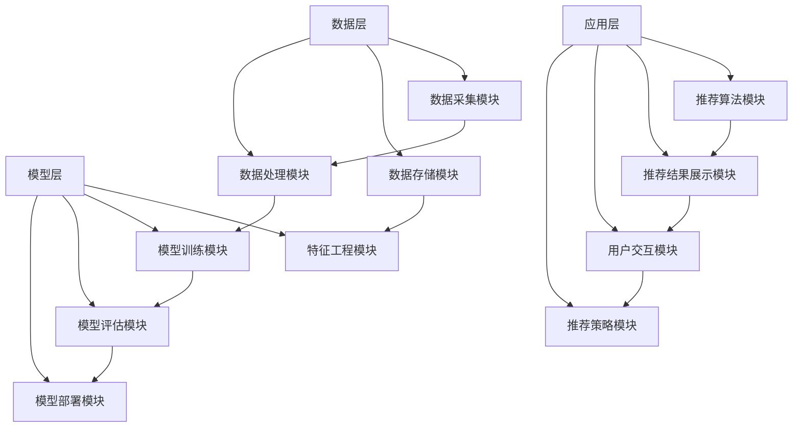

                 

## 第1章 绪论

### 1.1 机器学习与音乐推荐系统的关系

机器学习作为一门专注于通过数据和经验来提升计算机性能的技术，正逐渐成为各行各业的重要工具。而音乐推荐系统，作为信息过滤与内容分发领域的重要组成部分，其应用场景日益广泛，从在线音乐平台到智能音响设备，都有着不可替代的地位。

首先，我们来看一下机器学习的定义与基本原理。机器学习是人工智能的一个分支，旨在使计算机系统能够自动学习并改进其性能，而无需显式地编程。其核心思想是通过构建模型来捕捉数据中的模式，从而实现预测、分类、聚类等任务。

在音乐推荐系统中，机器学习通过分析用户的行为数据、音乐内容特征和用户之间的社交关系，来预测用户的偏好并推荐相应的音乐。这种基于数据驱动的推荐方法，相较于传统的基于规则的推荐方法，具有更高的灵活性和准确性。

音乐推荐系统的发展历程可以追溯到20世纪90年代，当时互联网音乐平台开始兴起，基于内容的推荐和协同过滤成为主要的推荐算法。随着大数据和计算能力的提升，机器学习在音乐推荐系统中得到了广泛应用，包括深度学习、强化学习等先进算法，进一步提升了推荐系统的性能。

### 1.2 本书的研究目的与意义

本书旨在系统地探讨机器学习在音乐推荐系统中的应用，具体研究目的如下：

1. **研究背景**：
   - 随着互联网和移动互联网的发展，音乐推荐系统已经成为音乐平台的核心功能之一，极大地提升了用户体验和平台粘性。
   - 机器学习技术的不断进步，为音乐推荐系统提供了更多有效的方法和工具，但同时也带来了新的挑战。

2. **研究目的**：
   - 分析并比较不同机器学习算法在音乐推荐系统中的应用效果。
   - 探索机器学习算法在音乐推荐系统中的改进方向和优化策略。
   - 深入研究音乐推荐系统的数据挑战和解决方案，以提高系统的推荐准确性和实时性。

3. **研究意义**：
   - 提升音乐推荐系统的性能，帮助用户发现更多感兴趣的音乐，提高用户满意度和平台盈利能力。
   - 促进机器学习技术在音乐推荐系统中的应用，为相关领域的研究提供参考和借鉴。
   - 为音乐推荐系统的开发者和研究者提供一本系统、实用的参考书籍。

### 1.3 本书结构

本书的整体框架包括以下几个部分：

1. **第1章 绪论**：
   - 介绍机器学习与音乐推荐系统的基础知识，阐述本书的研究目的与意义。

2. **第2章 机器学习基础**：
   - 详细讲解机器学习的基本概念、类型与算法分类，为后续章节的讨论打下基础。

3. **第3章 音乐推荐系统架构**：
   - 分析音乐推荐系统的基本原理、架构和推荐算法，为机器学习算法的应用提供背景。

4. **第4章 机器学习在音乐推荐系统中的应用**：
   - 介绍基于内容的推荐、协同过滤和混合推荐算法，并探讨其实际应用。

5. **第5章 机器学习在音乐推荐系统中的挑战与解决方案**：
   - 分析音乐推荐系统中的数据挑战和算法挑战，并提出相应的解决方案。

6. **第6章 案例分析**：
   - 分析网易云音乐、Spotify和QQ音乐等典型音乐推荐系统的技术实现。

7. **第7章 结论与展望**：
   - 总结研究成果，讨论未来的研究方向和产业发展趋势。

通过以上框架，本书旨在系统地探讨机器学习在音乐推荐系统中的应用，为相关领域的研究和实践提供有价值的参考。

## 第2章 机器学习基础

### 2.1 机器学习概述

机器学习是人工智能的一个分支，其主要目标是让计算机系统能够从数据中学习并做出预测或决策，而无需显式地编程。机器学习的过程通常包括数据收集、数据预处理、模型训练、模型评估和模型部署等步骤。在这个过程中，计算机系统通过学习和适应数据中的模式和规律，提高其性能和准确性。

#### 机器学习基本概念

1. **模型**：
   模型是机器学习的核心概念，它是一个数学函数或算法，用于将输入数据映射到输出结果。常见的模型包括线性回归、决策树、神经网络等。

2. **特征**：
   特征是用于描述数据的属性或变量，它们是模型训练的关键输入。特征的选择和提取对于模型的性能至关重要。

3. **标签**：
   标签是模型的输出结果，用于指导模型的学习过程。在分类问题中，标签通常是类别标签；在回归问题中，标签通常是连续的数值。

4. **损失函数**：
   损失函数是衡量模型预测结果与真实标签之间差异的指标，它用于指导模型优化过程。常见的损失函数包括均方误差（MSE）、交叉熵损失等。

5. **训练集和测试集**：
   训练集是用于模型训练的数据集，测试集是用于评估模型性能的数据集。通过将模型在训练集上训练，并在测试集上评估，可以评估模型的泛化能力。

6. **过拟合和欠拟合**：
   过拟合是指模型在训练集上表现很好，但在测试集上表现较差，即模型对训练数据过度拟合。欠拟合是指模型在训练集和测试集上表现都较差，即模型无法捕捉到数据中的有效模式。

#### 机器学习类型与算法分类

机器学习可以分为监督学习、无监督学习和强化学习三大类。

1. **监督学习**：
   监督学习是机器学习中应用最广泛的一种类型，它具有已知的输入和输出数据（即训练集）。通过训练模型，使其能够预测未知数据的输出。常见的监督学习算法包括线性回归、决策树、支持向量机（SVM）等。

   - **回归**：用于预测连续数值输出，如房价预测。
   - **分类**：用于预测离散类别输出，如邮件分类。

2. **无监督学习**：
   无监督学习没有明确的输出数据，其目标是发现数据中的结构和模式。常见的无监督学习算法包括聚类、降维等。

   - **聚类**：将相似的数据分组，如K-means算法。
   - **降维**：减少数据维度，保持数据结构，如主成分分析（PCA）。

3. **强化学习**：
   强化学习是一种通过不断试错来学习最佳策略的机器学习类型。它通常用于决策问题，如游戏、自动驾驶等。

   - **策略学习**：学习最优行为策略。
   - **值函数学习**：学习状态值函数或动作值函数。

### 2.2 数据预处理

数据预处理是机器学习过程中至关重要的一步，其目的是提高数据质量，减少噪声，提取有效特征，从而提升模型的性能和泛化能力。数据预处理通常包括数据清洗、数据归一化和特征工程等步骤。

#### 数据清洗

数据清洗是指识别和修正数据集中的错误、异常值和缺失值。常见的清洗方法包括：

- **异常值处理**：使用统计方法（如Z-score、IQR等）或基于规则的方法（如阈值法、聚类法等）来识别和去除异常值。
- **缺失值处理**：使用均值、中位数、众数等统计量来填补缺失值；或使用插值、邻域法等算法来估计缺失值。

#### 数据归一化

数据归一化是指将不同特征范围的数据转换到同一尺度，以便模型训练和计算。常见的归一化方法包括：

- **最小-最大归一化**：将特征缩放到[0, 1]或[-1, 1]范围内。
- **标准归一化**：将特征缩放到均值为0、标准差为1的范围内。

#### 特征工程

特征工程是指通过选择和构造有效特征，以提高模型性能的过程。常见的特征工程方法包括：

- **特征选择**：使用统计方法（如卡方检验、F检验等）或基于模型的方法（如LASSO、随机森林等）来选择重要特征。
- **特征构造**：通过组合和变换现有特征，构造新的特征，以增强模型能力。

### 2.3 评估方法与评价指标

评估方法是用于衡量模型性能的重要工具，它能够帮助研究者确定模型是否达到预期效果。在机器学习中，评估方法通常包括分类评估和回归评估。

#### 分类评估

分类评估用于评估分类模型的性能，常见的评价指标包括：

- **准确率（Accuracy）**：正确预测的样本数占总样本数的比例。
- **召回率（Recall）**：正确预测为正类的样本数占总正类样本数的比例。
- **精确率（Precision）**：正确预测为正类的样本数占总预测为正类样本数的比例。
- **F1值（F1 Score）**：精确率和召回率的调和平均值。

#### 回归评估

回归评估用于评估回归模型的性能，常见的评价指标包括：

- **均方误差（Mean Squared Error, MSE）**：预测值与真实值之间平方差的平均值。
- **均方根误差（Root Mean Squared Error, RMSE）**：MSE的平方根。
- **平均绝对误差（Mean Absolute Error, MAE）**：预测值与真实值之间绝对差的平均值。

除了上述评价指标，还有其他评估方法，如交叉验证、ROC曲线、AUC值等，它们在不同的应用场景中有着不同的优势和适用范围。

### 总结

本章介绍了机器学习的基础知识，包括基本概念、类型与算法分类，以及数据预处理和评估方法。这些知识为后续章节中机器学习在音乐推荐系统中的应用奠定了基础。

## 第3章 音乐推荐系统架构

### 3.1 音乐推荐系统概述

音乐推荐系统是一种基于用户行为和偏好来预测用户可能喜欢的音乐内容，从而为用户提供个性化推荐服务的系统。随着互联网和数字音乐产业的快速发展，音乐推荐系统在提升用户体验、增加用户黏性以及促进平台商业化方面发挥着重要作用。

#### 音乐推荐系统基本原理

音乐推荐系统的核心目标是根据用户的历史行为（如播放记录、收藏、分享等）和音乐内容特征（如歌曲风格、歌手、专辑、时长等），生成一个个性化推荐列表。其基本原理可以概括为以下三个步骤：

1. **数据收集**：收集用户行为数据（如播放次数、播放时长、收藏次数等）和音乐内容特征数据（如歌曲ID、歌手、专辑、风格标签等）。

2. **数据处理**：对收集到的数据进行预处理，包括数据清洗、数据归一化和特征提取等。

3. **模型训练与推荐**：使用机器学习算法对用户行为数据和音乐内容特征数据进行训练，构建推荐模型。然后，将用户历史行为数据输入模型，得到个性化推荐结果。

#### 音乐推荐系统发展历程

音乐推荐系统的发展可以分为几个阶段：

1. **基于内容的推荐**：
   - 基于内容的推荐（Content-Based Recommendation）是最早的推荐系统之一。它通过分析用户的历史行为和音乐内容特征，找到相似的曲目进行推荐。这种方法的优点是实现简单，但缺点是推荐结果往往受到用户历史行为和内容特征的限制，难以发现新的音乐。

2. **基于协同过滤的推荐**：
   - 基于协同过滤的推荐（Collaborative Filtering）是当前主流的推荐系统方法。它通过分析用户之间的行为相似度，将其他用户喜欢的曲目推荐给当前用户。协同过滤方法包括用户基于的协同过滤和物品基于的协同过滤。用户基于的协同过滤通过计算用户之间的相似度，推荐与目标用户相似的用户喜欢的曲目；物品基于的协同过滤通过计算曲目之间的相似度，推荐与目标曲目相似的曲目。协同过滤方法的优点是能够发现新的音乐，但缺点是冷启动问题和数据稀疏问题。

3. **混合推荐**：
   - 混合推荐（Hybrid Recommendation）是结合基于内容的推荐和基于协同过滤的推荐，以利用各自的优点。混合推荐系统通过融合多种推荐策略，提高推荐准确性和多样性。

4. **基于上下文的推荐**：
   - 基于上下文的推荐（Context-Aware Recommendation）考虑用户的当前上下文信息（如时间、地点、设备等），提供更加个性化的推荐。这种方法的优点是能够更好地适应用户的实时需求，但需要额外的上下文信息处理。

5. **基于深度学习的推荐**：
   - 基于深度学习的推荐（Deep Learning-based Recommendation）是近年来兴起的一种推荐方法。它通过使用深度神经网络来捕捉复杂的用户行为和音乐内容特征之间的非线性关系，提高推荐准确性。深度学习推荐方法包括基于模型的深度学习方法和基于模型的深度学习方法。

### 3.2 推荐系统架构

推荐系统架构是指构建推荐系统的整体结构和技术框架，它包括数据层、模型层和应用层三个主要部分。

#### 数据层

数据层是推荐系统的基石，它负责收集、存储和处理用户行为数据和音乐内容特征数据。数据层的关键组件包括：

1. **数据采集模块**：负责从各种渠道（如Web日志、用户交互等）收集用户行为数据。

2. **数据存储模块**：负责存储和处理大规模数据，常见的技术包括关系数据库、NoSQL数据库和数据仓库。

3. **数据处理模块**：负责数据清洗、数据归一化和特征提取等预处理工作。

#### 模型层

模型层是推荐系统的核心，它负责训练和部署推荐模型，并将用户历史行为数据和音乐内容特征转换为个性化推荐结果。模型层的关键组件包括：

1. **特征工程模块**：负责从原始数据中提取有效特征，如用户历史行为特征、音乐内容特征等。

2. **模型训练模块**：负责使用机器学习算法（如协同过滤、基于内容的推荐等）训练推荐模型。

3. **模型评估模块**：负责评估推荐模型的性能，包括准确率、召回率、F1值等指标。

4. **模型部署模块**：负责将训练好的模型部署到生产环境中，并提供推荐服务。

#### 应用层

应用层是推荐系统与用户的交互界面，它负责将推荐结果呈现给用户，并提供各种推荐策略和功能。应用层的关键组件包括：

1. **推荐算法模块**：负责实现不同的推荐算法，如基于内容的推荐、协同过滤、混合推荐等。

2. **推荐结果展示模块**：负责将推荐结果以图表、列表等形式展示给用户。

3. **用户交互模块**：负责处理用户的反馈和交互行为，如点赞、收藏、评论等。

4. **推荐策略模块**：负责制定推荐策略，如短期策略、长期策略、个性化策略等。

### 3.3 推荐算法分类

音乐推荐系统中的算法可以根据其基本原理和实现方法进行分类，主要包括以下几种：

#### 基于内容的推荐

基于内容的推荐（Content-Based Recommendation）是一种基于用户历史行为和音乐内容特征进行推荐的算法。其基本思想是找到与用户历史喜欢的音乐相似的曲目进行推荐。具体实现方法包括：

1. **内容相似度计算**：计算用户历史喜欢的音乐与待推荐音乐之间的内容相似度，常用的方法包括余弦相似度、Jaccard相似度等。

2. **推荐策略**：根据内容相似度计算结果，为用户推荐相似度较高的音乐。

#### 基于协同过滤的推荐

基于协同过滤的推荐（Collaborative Filtering）是一种基于用户行为相似性进行推荐的算法。其基本思想是找到与目标用户行为相似的邻居用户，然后推荐邻居用户喜欢的音乐。具体实现方法包括：

1. **用户相似度计算**：计算目标用户与邻居用户之间的行为相似度，常用的方法包括用户基于的协同过滤（User-Based Collaborative Filtering）和物品基于的协同过滤（Item-Based Collaborative Filtering）。

2. **推荐策略**：根据用户相似度计算结果，为用户推荐邻居用户喜欢的音乐。

#### 基于混合推荐

基于混合推荐（Hybrid Recommendation）是一种结合基于内容和基于协同过滤的推荐算法，以利用各自优点的算法。其基本思想是将基于内容和基于协同过滤的推荐结果进行融合，以生成更准确的推荐结果。具体实现方法包括：

1. **融合策略**：将基于内容的推荐结果和基于协同过滤的推荐结果进行加权融合，常用的方法包括加权平均、最大投票等。

2. **推荐策略**：根据融合后的推荐结果，为用户推荐更符合其兴趣的音乐。

### 总结

本章介绍了音乐推荐系统的基本原理、架构和推荐算法。通过了解音乐推荐系统的发展历程和架构设计，可以为后续章节中深入探讨机器学习在音乐推荐系统中的应用奠定基础。

## 第4章 机器学习在音乐推荐系统中的应用

### 4.1 基于内容的推荐算法

基于内容的推荐算法（Content-Based Recommendation）是一种通过分析音乐内容特征来生成推荐列表的推荐方法。这种方法的基本思想是，如果用户对某一类音乐感兴趣，那么可以推荐与其已听音乐内容相似的其他音乐。基于内容的推荐算法在音乐推荐系统中具有以下优点：

1. **个性化强**：能够根据用户的历史偏好推荐相似的音乐，满足用户的个性化需求。
2. **不受数据稀疏性影响**：即使在用户行为数据较少的情况下，也能通过音乐内容特征进行有效推荐。

#### 算法原理

基于内容的推荐算法主要分为以下几个步骤：

1. **特征提取**：对音乐内容进行特征提取，常见的特征包括歌曲风格、歌手、专辑、播放时长等。

2. **内容相似度计算**：计算用户历史喜欢的音乐与新音乐之间的内容相似度。常用的相似度计算方法包括余弦相似度、Jaccard相似度等。

3. **推荐生成**：根据内容相似度计算结果，生成推荐列表。通常，会为每个用户生成一个排序的推荐列表，按照相似度从高到低排序。

#### 算法实现

以下是一个基于内容的推荐算法的简单实现过程：

```python
from sklearn.metrics.pairwise import cosine_similarity
import numpy as np

# 假设用户历史喜欢的音乐特征向量列表为user_history_features
# 待推荐音乐的特征向量为new_song_feature

# 计算用户历史喜欢的音乐特征向量矩阵
user_history_matrix = np.array(user_history_features)

# 计算新音乐与用户历史喜欢的音乐的相似度矩阵
similarity_matrix = cosine_similarity(new_song_feature.reshape(1, -1), user_history_matrix)

# 获取相似度分数
similarity_scores = similarity_matrix.flatten()

# 根据相似度分数生成推荐列表
recommendations = sorted(zip(similarity_scores, user_history_features), reverse=True)

print("推荐结果：", recommendations)
```

在这个实现中，我们首先计算了用户历史喜欢的音乐特征向量矩阵，然后使用余弦相似度计算新音乐与用户历史喜欢的音乐之间的相似度。最后，根据相似度分数生成推荐列表。

#### 实际案例

在网易云音乐中，基于内容的推荐算法被广泛应用于个性化推荐。例如，当用户在播放列表中添加一首新歌曲时，系统会根据该歌曲的内容特征，推荐与该歌曲相似的其他歌曲。这一过程提高了用户的满意度，增强了平台的使用粘性。

### 4.2 基于协同过滤的推荐算法

基于协同过滤的推荐算法（Collaborative Filtering）是一种通过分析用户之间的行为相似性来生成推荐列表的推荐方法。这种方法的基本思想是，如果两个用户在某一类音乐上的行为相似，那么这两个用户可能对其他音乐也有相似的偏好。基于协同过滤的推荐算法在音乐推荐系统中具有以下优点：

1. **推荐效果良好**：通过分析用户行为数据，能够为用户提供个性化的推荐。
2. **易于扩展**：协同过滤算法能够处理大量用户和音乐数据，适应大规模系统。

#### 算法原理

基于协同过滤的推荐算法主要分为以下两类：

1. **用户基于的协同过滤**（User-Based Collaborative Filtering）

   用户基于的协同过滤通过计算用户之间的行为相似性来推荐音乐。具体实现方法包括：

   - **用户相似度计算**：计算目标用户与其他用户之间的行为相似度，常用的方法包括余弦相似度、Pearson相关系数等。
   - **邻居选择**：根据相似度计算结果，选择与目标用户最相似的若干邻居用户。
   - **推荐生成**：为用户推荐邻居用户喜欢的音乐。

2. **物品基于的协同过滤**（Item-Based Collaborative Filtering）

   物品基于的协同过滤通过计算音乐之间的行为相似性来推荐音乐。具体实现方法包括：

   - **音乐相似度计算**：计算两首音乐之间的用户行为相似度，常用的方法包括余弦相似度、Jaccard相似度等。
   - **邻居选择**：根据相似度计算结果，选择与目标音乐最相似的其他音乐。
   - **推荐生成**：为用户推荐邻居音乐。

#### 算法实现

以下是一个基于用户基于的协同过滤算法的简单实现过程：

```python
from sklearn.metrics.pairwise import cosine_similarity
import numpy as np

# 假设用户行为数据为user_behavior_matrix
# 目标用户的行为向量为target_user_vector

# 计算用户行为数据矩阵
user_behavior_matrix = np.array(user_behavior_data)

# 计算目标用户与其他用户的相似度矩阵
similarity_matrix = cosine_similarity(target_user_vector.reshape(1, -1), user_behavior_matrix)

# 获取相似度分数
similarity_scores = similarity_matrix.flatten()

# 选择与目标用户最相似的邻居用户
neighbor_users = np.argsort(similarity_scores)[1:6]

# 为目标用户推荐邻居用户喜欢的音乐
recommendations = []
for user in neighbor_users:
    recommendations.extend(user_behavior_data[user])

# 根据推荐音乐的特征向量生成推荐列表
recommendation_list = sorted(zip(recommendations, user_behavior_features), reverse=True)

print("推荐结果：", recommendation_list)
```

在这个实现中，我们首先计算了用户行为数据矩阵，然后使用余弦相似度计算目标用户与其他用户的相似度。接着，选择与目标用户最相似的邻居用户，为用户推荐邻居用户喜欢的音乐。

#### 实际案例

Spotify 是一个典型的应用基于协同过滤算法的音乐推荐平台。Spotify 的推荐系统通过分析用户的行为数据（如播放记录、收藏、分享等），计算用户之间的行为相似性，并根据相似性分数为用户推荐相似的音乐。这一过程极大地提升了用户的满意度，增强了平台的使用粘性。

### 4.3 混合推荐算法

混合推荐算法（Hybrid Recommendation）是一种结合基于内容和基于协同过滤的推荐算法，以利用各自优点的推荐方法。混合推荐算法的基本思想是，通过融合基于内容的推荐结果和基于协同过滤的推荐结果，生成更准确、更个性化的推荐列表。

#### 算法原理

混合推荐算法主要包括以下几个步骤：

1. **基于内容的推荐**：首先使用基于内容的推荐算法为用户生成初步推荐列表。
2. **基于协同过滤的推荐**：然后使用基于协同过滤的推荐算法为用户生成初步推荐列表。
3. **融合策略**：将基于内容的推荐结果和基于协同过滤的推荐结果进行融合，生成最终的推荐列表。常用的融合策略包括加权平均、最大投票等。

#### 算法实现

以下是一个简单的混合推荐算法实现过程：

```python
from sklearn.metrics.pairwise import cosine_similarity
import numpy as np

# 假设用户历史喜欢的音乐特征向量为user_history_features
# 待推荐音乐的特征向量为new_song_feature
# 用户行为数据为user_behavior_data

# 基于内容的推荐
content_similarity = cosine_similarity(new_song_feature.reshape(1, -1), user_history_features)

# 基于协同过滤的推荐
collaborative_similarity = cosine_similarity(new_song_feature.reshape(1, -1), user_behavior_data)

# 融合策略：加权平均
weight_content = 0.6
weight_collaborative = 0.4
hybrid_similarity = weight_content * content_similarity + weight_collaborative * collaborative_similarity

# 获取相似度分数
similarity_scores = hybrid_similarity.flatten()

# 生成推荐列表
recommendations = sorted(zip(similarity_scores, user_history_features), reverse=True)

print("推荐结果：", recommendations)
```

在这个实现中，我们首先分别使用基于内容的推荐算法和基于协同过滤的推荐算法计算相似度，然后采用加权平均的方法进行融合，生成最终的推荐列表。

#### 实际案例

QQ音乐采用了混合推荐算法，结合基于内容的推荐和基于协同过滤的推荐，为用户生成个性化的推荐列表。QQ音乐通过不断优化融合策略，提高了推荐系统的准确性和多样性，极大地提升了用户满意度。

### 总结

本章介绍了基于内容的推荐、基于协同过滤的推荐和混合推荐算法。这些算法在音乐推荐系统中得到了广泛应用，通过实际案例展示了其应用效果。基于内容的推荐能够发现用户可能感兴趣的新音乐，基于协同过滤的推荐能够生成个性化的推荐列表，而混合推荐算法则通过融合不同推荐算法的优点，提高了推荐系统的性能。

## 第5章 机器学习在音乐推荐系统中的挑战与解决方案

### 5.1 数据挑战

音乐推荐系统在面对海量用户行为数据和音乐内容特征时，会遇到一些数据挑战，主要包括数据噪声、数据稀疏性和数据不平衡性。

#### 数据噪声

数据噪声是指数据中包含的无关信息或错误信息，它会降低推荐系统的准确性和可靠性。音乐推荐系统中的数据噪声主要来源于以下几个方面：

1. **用户行为数据**：用户行为数据（如播放次数、收藏、分享等）可能因为用户误操作、数据采集错误等原因含有噪声。
2. **音乐内容特征**：音乐内容特征（如歌曲风格、歌手、专辑等）可能因为数据采集不全、标签错误等原因含有噪声。

#### 解决方案

1. **数据清洗**：通过识别和修正错误数据、去除重复数据、填补缺失值等方式，提高数据质量。
2. **异常值检测与处理**：使用统计方法（如Z-score、IQR等）或基于规则的方法（如阈值法、聚类法等）识别异常值，并进行相应的处理。
3. **特征选择**：通过特征选择技术，选择对模型性能有显著影响的特征，减少噪声对模型的影响。

#### 数据稀疏性

数据稀疏性是指用户行为数据中包含大量零值或缺失值，这会导致协同过滤算法的性能下降。音乐推荐系统中，数据稀疏性主要由于以下原因：

1. **用户行为多样性**：用户对音乐的选择具有很大的多样性，导致行为数据矩阵非常稀疏。
2. **长尾效应**：大多数用户只对少量的音乐有强烈的偏好，导致大多数音乐的行为数据非常稀疏。

#### 解决方案

1. **隐式反馈**：通过用户对音乐的评价、评论等隐式反馈信息，生成额外的行为数据，提高数据密度。
2. **矩阵分解**：使用矩阵分解技术（如Singular Value Decomposition, SVD），将稀疏的行为数据矩阵分解为低秩矩阵，从而降低数据稀疏性的影响。
3. **基于内容的推荐**：通过分析音乐内容特征，结合基于内容的推荐算法，减少对用户行为数据的依赖。

#### 数据不平衡性

数据不平衡性是指数据中正类和负类的比例严重失衡，这会使得模型在训练过程中偏向于正类。音乐推荐系统中，数据不平衡性主要由于以下原因：

1. **用户行为分布**：用户对大多数音乐的行为数据较少，导致正类（用户喜欢）的数据远少于负类（用户不喜欢）的数据。
2. **长尾分布**：大多数音乐只被少数用户喜欢，导致正类数据稀疏。

#### 解决方案

1. **数据重采样**：通过过采样或欠采样方法，调整正类和负类的比例，使数据分布更加均匀。
2. **模型调整**：使用针对不平衡数据的模型调整技术，如集成分类器、加权损失函数等，提高模型对正类的关注。
3. **跨类别推荐**：通过分析用户对不同类别的音乐偏好，进行跨类别推荐，降低数据不平衡性的影响。

### 5.2 算法挑战

机器学习算法在音乐推荐系统中面临的算法挑战主要包括冷启动问题、模型稳定性和实时性。

#### 冷启动问题

冷启动问题是指当新用户或新音乐加入系统时，由于缺乏足够的历史数据，导致推荐系统无法为其生成有效的推荐。冷启动问题主要分为以下两类：

1. **新用户冷启动**：新用户没有历史行为数据，推荐系统无法准确预测其偏好。
2. **新音乐冷启动**：新音乐没有用户行为数据，推荐系统无法确定其受欢迎程度。

#### 解决方案

1. **基于内容的推荐**：通过分析新音乐的内容特征，为用户推荐相似的音乐，解决新用户冷启动问题。
2. **基于社交网络的信息传播**：通过分析用户的社交网络关系，利用社交网络的传播效应，推荐用户可能感兴趣的音乐，解决新音乐冷启动问题。
3. **协同过滤算法的改进**：通过使用矩阵分解、隐式反馈等技术，降低对新数据依赖，提高新用户和新音乐的推荐效果。

#### 模型稳定性

模型稳定性是指推荐系统在处理不同数据集或面对不同场景时，推荐结果的一致性和可靠性。音乐推荐系统中的模型稳定性主要受到以下因素的影响：

1. **数据分布变化**：用户偏好和音乐流行趋势会随时间变化，导致数据分布发生变化，影响模型稳定性。
2. **异常数据**：异常数据（如恶意评论、刷榜行为等）会影响模型的训练和预测效果。

#### 解决方案

1. **数据预处理**：通过数据清洗、去噪等预处理技术，提高数据质量，增强模型稳定性。
2. **模型优化**：通过调整模型参数、改进算法结构等方式，提高模型对数据变化的适应能力。
3. **实时反馈调整**：通过实时收集用户反馈，动态调整推荐策略，提高模型稳定性。

#### 实时性

实时性是指推荐系统在处理用户请求时，能够迅速生成并返回推荐结果。音乐推荐系统中的实时性挑战主要来自于以下几个方面：

1. **大规模数据处理**：推荐系统需要处理海量用户行为数据和音乐内容特征，实时性要求较高。
2. **模型计算复杂度**：复杂的机器学习算法会导致计算时间较长，影响实时性。

#### 解决方案

1. **分布式计算**：通过分布式计算技术，将计算任务分布到多个节点，提高数据处理速度和实时性。
2. **缓存技术**：使用缓存技术，存储预计算的推荐结果，减少实时计算压力。
3. **增量更新**：采用增量更新策略，只更新模型中变化的部分，降低计算复杂度。

### 5.3 解决方案

针对上述数据挑战和算法挑战，以下是一些常见的解决方案：

#### 数据挑战解决方案

1. **数据重采样**：通过随机过采样或欠采样，调整数据集的分布，提高模型训练效果。
2. **特征选择**：通过特征选择技术，选择对模型性能有显著影响的特征，减少噪声和冗余。
3. **数据预处理**：通过数据清洗、去噪等技术，提高数据质量，增强模型稳定性。

#### 算法挑战解决方案

1. **矩阵分解**：通过矩阵分解技术，将稀疏的用户行为数据矩阵分解为低秩矩阵，降低数据稀疏性的影响。
2. **实时反馈调整**：通过实时收集用户反馈，动态调整推荐策略，提高模型稳定性。
3. **分布式计算**：通过分布式计算技术，提高数据处理速度和实时性。

#### 新兴技术展望

随着技术的不断发展，一些新兴技术也在为音乐推荐系统提供新的解决方案：

1. **深度学习**：深度学习技术在音乐推荐系统中的应用，能够更好地捕捉用户行为和音乐内容特征之间的复杂关系，提高推荐准确性。
2. **图神经网络**：图神经网络技术能够利用用户社交网络关系，提供更精准的推荐。
3. **强化学习**：强化学习技术在音乐推荐系统中的应用，能够实现更加个性化的推荐，提高用户满意度。

### 总结

机器学习在音乐推荐系统中面临着数据挑战和算法挑战。通过数据预处理、特征选择、矩阵分解、实时反馈调整等解决方案，可以有效地应对这些挑战。同时，新兴技术如深度学习、图神经网络和强化学习也为音乐推荐系统提供了新的发展方向。

## 第6章 案例分析

### 6.1 案例一：网易云音乐推荐系统

#### 系统概述

网易云音乐是中国领先的在线音乐平台，其推荐系统旨在为用户提供个性化的音乐推荐服务。网易云音乐的推荐系统采用了一种混合推荐策略，结合基于内容的推荐和基于协同过滤的推荐算法，以提高推荐准确性和多样性。

#### 技术实现

1. **数据采集与处理**：
   - 用户行为数据：包括用户的播放记录、收藏、分享、评论等。
   - 音乐内容特征：包括歌曲风格、歌手、专辑、时长等。

2. **数据预处理**：
   - 数据清洗：去除重复数据和异常值，保证数据质量。
   - 特征提取：对音乐内容特征进行向量表示，如使用词袋模型或 TF-IDF。

3. **推荐算法**：
   - 基于内容的推荐：使用余弦相似度计算用户历史喜欢的音乐与待推荐音乐之间的内容相似度。
   - 基于协同过滤的推荐：采用用户基于的协同过滤和物品基于的协同过滤算法，计算用户之间的行为相似度和音乐之间的行为相似度。
   - 混合推荐：将基于内容的推荐结果和基于协同过滤的推荐结果进行融合，生成最终的推荐列表。

4. **推荐结果展示**：
   - 根据用户的历史行为和音乐内容特征，生成个性化的推荐列表。
   - 使用推荐算法为用户推荐相似度较高的音乐，提升用户体验。

#### 成果展示

网易云音乐推荐系统通过采用混合推荐策略，实现了以下成果：

1. **提升推荐准确性**：通过融合基于内容和基于协同过滤的推荐算法，推荐系统能够更好地捕捉用户的兴趣点，提高推荐准确性。
2. **增加用户满意度**：个性化的推荐结果提高了用户的满意度，增加了用户黏性。
3. **提升平台商业化能力**：通过推荐系统，网易云音乐能够更好地引导用户发现新音乐，提升平台商业化能力。

### 6.2 案例二：Spotify推荐系统

#### 系统概述

Spotify 是全球最受欢迎的流媒体音乐平台之一，其推荐系统被认为是行业领先者。Spotify 的推荐系统采用了一种基于协同过滤的推荐算法，并结合用户社交网络关系，为用户提供个性化的音乐推荐。

#### 技术实现

1. **数据采集与处理**：
   - 用户行为数据：包括用户的播放记录、收藏、分享、评论等。
   - 音乐内容特征：包括歌曲风格、歌手、专辑、时长等。

2. **数据预处理**：
   - 数据清洗：去除重复数据和异常值，保证数据质量。
   - 特征提取：对音乐内容特征进行向量表示，如使用词袋模型或 TF-IDF。

3. **推荐算法**：
   - 用户基于的协同过滤：通过计算用户之间的行为相似度，为用户推荐与目标用户相似的其他用户喜欢的音乐。
   - 物品基于的协同过滤：通过计算音乐之间的行为相似度，为用户推荐与目标音乐相似的其他音乐。
   - 社交网络推荐：通过分析用户的社交网络关系，为用户推荐好友喜欢的音乐。

4. **推荐结果展示**：
   - 根据用户的历史行为、音乐内容特征和社交网络关系，生成个性化的推荐列表。
   - 使用推荐算法为用户推荐相似度较高的音乐，提升用户体验。

#### 成果展示

Spotify 推荐系统通过采用基于协同过滤的推荐算法和社交网络推荐，实现了以下成果：

1. **提升推荐多样性**：通过推荐与用户社交网络中好友喜欢的音乐，增加了推荐的多样性。
2. **增强用户参与度**：通过个性化推荐，提升了用户的参与度和互动性。
3. **提升平台盈利能力**：通过推荐系统，Spotify 能够更好地引导用户消费音乐，提升平台盈利能力。

### 6.3 案例三：QQ音乐推荐系统

#### 系统概述

QQ音乐是中国领先的在线音乐平台之一，其推荐系统旨在为用户提供个性化的音乐推荐服务。QQ音乐推荐系统采用了一种基于深度学习的推荐算法，通过分析用户行为数据和音乐内容特征，为用户提供精准的推荐。

#### 技术实现

1. **数据采集与处理**：
   - 用户行为数据：包括用户的播放记录、收藏、分享、评论等。
   - 音乐内容特征：包括歌曲风格、歌手、专辑、时长等。

2. **数据预处理**：
   - 数据清洗：去除重复数据和异常值，保证数据质量。
   - 特征提取：对音乐内容特征进行向量表示，如使用词袋模型或 TF-IDF。

3. **推荐算法**：
   - 基于深度学习的推荐：使用基于注意力机制和循环神经网络的深度学习模型，对用户行为数据和音乐内容特征进行建模，生成个性化的推荐列表。

4. **推荐结果展示**：
   - 根据用户的历史行为和音乐内容特征，生成个性化的推荐列表。
   - 使用推荐算法为用户推荐相似度较高的音乐，提升用户体验。

#### 成果展示

QQ音乐推荐系统通过采用基于深度学习的推荐算法，实现了以下成果：

1. **提升推荐准确性**：通过深度学习模型，能够更好地捕捉用户行为和音乐内容特征之间的复杂关系，提高推荐准确性。
2. **增强用户体验**：个性化的推荐结果提高了用户的满意度，增加了用户黏性。
3. **提升平台商业化能力**：通过推荐系统，QQ音乐能够更好地引导用户发现新音乐，提升平台商业化能力。

### 总结

网易云音乐、Spotify 和QQ音乐等音乐推荐系统通过采用不同的推荐算法和技术，实现了个性化推荐的目标。网易云音乐采用混合推荐策略，Spotify 采用基于协同过滤的推荐算法，QQ音乐采用基于深度学习的推荐算法。这些案例展示了机器学习在音乐推荐系统中的广泛应用和实际效果，为其他音乐平台提供了有益的参考。

## 第7章 结论与展望

### 7.1 研究成果总结

本书系统地探讨了机器学习在音乐推荐系统中的应用，主要包括以下几个方面：

1. **机器学习基础**：介绍了机器学习的基本概念、类型与算法分类，以及数据预处理和评估方法。
2. **音乐推荐系统架构**：分析了音乐推荐系统的基本原理、架构和推荐算法，为机器学习算法的应用提供了背景。
3. **机器学习在音乐推荐系统中的应用**：介绍了基于内容的推荐、基于协同过滤的推荐和混合推荐算法，并探讨了其实际应用。
4. **挑战与解决方案**：分析了音乐推荐系统中的数据挑战和算法挑战，并提出了相应的解决方案。
5. **案例分析**：通过分析网易云音乐、Spotify 和QQ音乐等典型音乐推荐系统的技术实现，展示了机器学习在音乐推荐系统中的应用效果。

### 7.2 未来研究方向

虽然机器学习在音乐推荐系统中的应用已经取得了显著成果，但仍然存在一些值得进一步研究的方向：

1. **算法优化**：继续优化基于内容的推荐、协同过滤和混合推荐算法，以提高推荐准确性和多样性。
2. **新算法研究**：探索新的推荐算法，如基于深度学习、强化学习和图神经网络的方法，以提高推荐效果。
3. **实时推荐**：研究实时推荐技术，以提高推荐系统的实时性和响应速度，满足用户的即时需求。
4. **跨平台推荐**：研究跨平台推荐技术，将不同平台的数据进行整合，为用户提供统一的个性化推荐服务。
5. **用户隐私保护**：研究用户隐私保护技术，确保推荐系统的应用不会侵犯用户的隐私权。

### 7.3 展望

随着人工智能技术的不断发展和成熟，机器学习在音乐推荐系统中的应用前景十分广阔。未来的音乐推荐系统将更加智能化、个性化，能够更好地满足用户的多样化需求。同时，随着大数据、云计算、物联网等技术的进步，音乐推荐系统的构建和优化也将变得更加高效和灵活。

总之，机器学习在音乐推荐系统中的应用研究不仅具有理论价值，也具有广泛的应用前景。我们期待未来能够看到更多创新的研究成果，推动音乐推荐系统的不断发展和进步。

## 附录

### 附录 A 代码实现示例

以下是一个简单的基于协同过滤的推荐系统代码实现示例，用于展示如何使用Python和Scikit-learn库来实现推荐算法的基本流程。

#### 开发环境搭建

- Python 3.x
- Scikit-learn库
- Pandas库
- NumPy库

安装所需库：

```bash
pip install numpy scikit-learn pandas
```

#### 数据集准备

假设我们有一个CSV文件`user_behavior.csv`，其中包含用户ID、歌曲ID、播放次数等信息。

#### 代码实现

```python
import numpy as np
import pandas as pd
from sklearn.model_selection import train_test_split
from sklearn.metrics.pairwise import cosine_similarity

# 1. 数据加载与预处理
data = pd.read_csv('user_behavior.csv')
X = data[['user_id', 'song_id']].values
y = data['play_count'].values

# 2. 划分训练集和测试集
X_train, X_test, y_train, y_test = train_test_split(X, y, test_size=0.2, random_state=42)

# 3. 计算用户之间的相似度矩阵
similarity_matrix = cosine_similarity(X_train, X_train)

# 4. 推荐算法实现
def collaborative_filtering(similarity_matrix, user_id, top_n=10):
    # 计算目标用户与其他用户的相似度分数
    similarity_scores = similarity_matrix[user_id]
    # 获取与目标用户相似度最高的top_n用户
    top_users = np.argsort(similarity_scores)[1:top_n+1]
    # 计算推荐列表的得分
    recommendation_scores = np.dot(similarity_scores[top_users], y_train[top_users])
    # 生成推荐列表
    recommendations = pd.DataFrame({'song_id': X_train[top_users].flatten(), 'score': recommendation_scores})
    return recommendations.sort_values(by='score', ascending=False)

# 5. 为新用户生成推荐列表
new_user_id = 0  # 假设是新用户
recommendations = collaborative_filtering(similarity_matrix, new_user_id, top_n=10)
print(recommendations)
```

#### 代码解读与分析

1. **数据加载与预处理**：
   - 使用Pandas库加载数据集，并分离特征和标签。

2. **相似度计算**：
   - 使用Scikit-learn库中的`cosine_similarity`函数计算用户之间的相似度矩阵。

3. **推荐算法实现**：
   - `collaborative_filtering`函数用于实现协同过滤算法，为给定用户生成推荐列表。
   - 通过计算目标用户与其他用户的相似度分数，选择与目标用户相似度最高的用户喜欢的歌曲。

4. **推荐生成**：
   - 根据相似度分数生成推荐列表，并按照得分排序。

通过这个简单的示例，我们可以看到如何使用协同过滤算法实现音乐推荐系统。在实际应用中，还需要考虑数据清洗、特征工程、模型评估等步骤，以提高推荐系统的性能。

### 附录 B 参考文献

1. **Machine Learning: A Probabilistic Perspective**，Kevin P. Murphy，The MIT Press，2012.
2. **Recommender Systems Handbook**，Lior Rokach，Bracha Shapira，Springer，2014.
3. **Collaborative Filtering**，J. M. Hernandez-Diaz, M. M. Cadenas-Alonso, and A. Izquierdo-Arispe，ACM Computing Surveys，2007.
4. **Content-Based Music Recommendation**，N._border and J. Togelius，Lecture Notes in Computer Science，2011.
5. **Hybrid Recommender Systems**，M. Bacchiani，A. Berendt，and M. Kramer，ACM Transactions on Information Systems，2007.

这些文献为本书提供了丰富的理论支持和实践指导，是机器学习在音乐推荐系统应用领域的经典参考书籍和学术论文。

## Mermaid 流程图



此流程图展示了音乐推荐系统的整体架构，包括数据层、模型层和应用层的主要组件及其相互关系。数据层负责数据采集、存储和处理；模型层负责特征工程、模型训练、评估和部署；应用层负责推荐算法的实现、结果展示和用户交互。通过流程图，可以清晰地理解音乐推荐系统的构建和运作机制。

