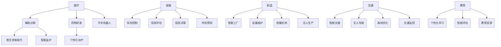
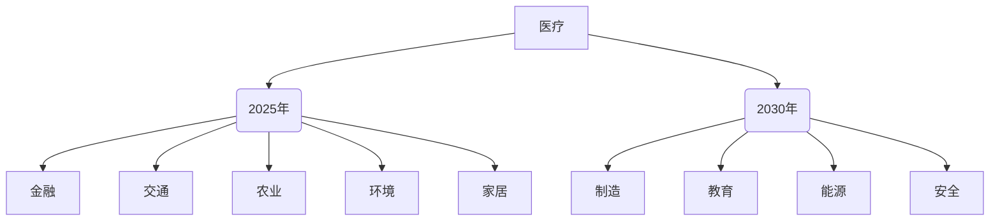
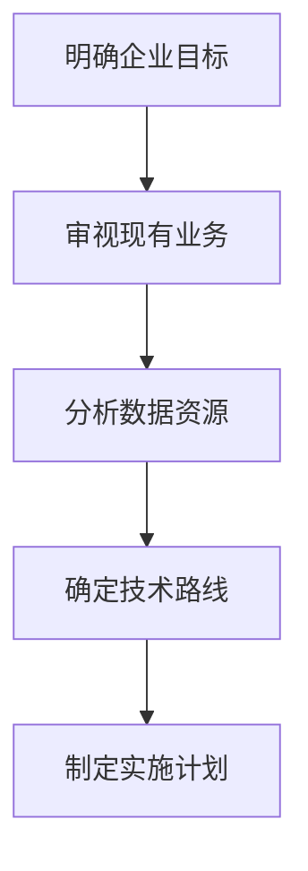
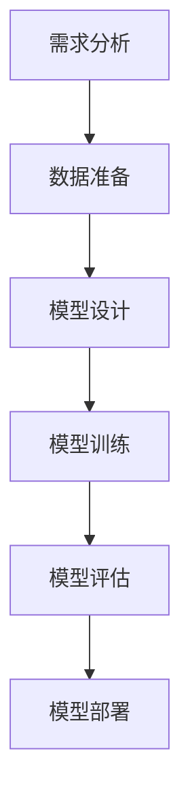

                 

### 文章标题

《李开复：AI 2.0时代的开发者》

关键词：人工智能（AI）、AI 2.0、深度学习、自然语言处理、计算机视觉、企业应用、开发实践、挑战与未来。

摘要：本文由人工智能领域大师李开复引领，深入探讨AI 2.0时代的到来及其对开发者的影响。通过解析AI 2.0的核心技术、企业应用和开发实践，本文旨在为读者提供全面、深入的AI 2.0时代开发指南，帮助开发者应对未来挑战，把握AI 2.0时代的机遇。

### 目录大纲

1. **AI 2.0时代的崛起与探索**
   1.1 AI 2.0的定义与特征
   1.2 AI 2.0与传统AI的差异
   1.3 AI 2.0的影响与应用前景

2. **AI 2.0的核心技术揭秘**
   2.1 深度学习基础
   2.2 自然语言处理技术
   2.3 计算机视觉技术

3. **AI 2.0时代的企业战略**
   3.1 企业AI战略规划
   3.2 AI 2.0时代的组织变革

4. **AI 2.0时代的开发实践**
   4.1 AI项目的开发流程
   4.2 AI开发工具与资源

5. **AI 2.0时代的挑战与未来**
   5.1 AI伦理与社会影响
   5.2 AI 2.0时代的未来展望

6. **附录**
   6.1 主流AI框架对比
   6.2 开发资源与指南

通过以上结构清晰、内容丰富的目录大纲，本文将为读者呈现AI 2.0时代的全貌，助力开发者迈向未来。让我们一步一步深入分析AI 2.0时代的技术、应用与实践，共同探索这个激动人心的时代。

### 第一部分：AI 2.0时代的崛起与探索

#### 第1章：AI 2.0时代的到来

在过去的几十年中，人工智能（AI）经历了从理论到应用的飞速发展。如今，我们正站在AI 2.0时代的门槛上，这一时代将以更为智能、自主和广泛的应用来改变我们的生活和工作方式。

##### 1.1 AI 2.0的定义与特征

AI 2.0，即第二代人工智能，是对传统AI的进一步提升和拓展。它不仅仅是一个计算模型，更是一种可以自主学习、适应环境，并能够与人类进行自然交互的智能系统。AI 2.0的核心特征包括：

- **自主性**：AI 2.0能够自主地学习和进化，不需要人类频繁地干预。它可以根据环境的变化，自动调整自己的行为和策略。
  
- **泛化能力**：AI 2.0能够处理更多样化的任务，不仅在图像识别、语音识别等领域表现出色，还能在自然语言处理、推荐系统等领域发挥重要作用。

- **交互性**：AI 2.0可以理解和生成自然语言，使得人与机器之间的交流更加流畅和自然。

- **可解释性**：虽然AI 2.0在许多领域都表现出色，但其决策过程往往难以解释。AI 2.0正在向更加透明和可解释的方向发展，以满足伦理和监管的要求。

下面是描述AI 2.0特征的一段伪代码：

```python
class AITwodotZero:
    def __init__(self):
        self.autonomous = True
        self.generalization = True
        self.interactive = True
        self.explainability = True
    
    def learn(self, data):
        # 自主学习算法
        pass
    
    def adapt(self, environment):
        # 自适应算法
        pass
    
    def interact(self, user):
        # 人机交互
        pass
    
    def explain(self):
        # 可解释性算法
        pass
```

##### 1.2 AI 2.0与传统AI的差异

传统AI，也称为AI 1.0，主要是基于规则和统计模型的计算系统。它们在特定领域表现出色，但缺乏泛化能力和自主性。以下是AI 2.0与传统AI在数学模型和算法上的主要差异：

- **数学模型**：AI 2.0主要基于深度学习和神经网络，这些模型具有更强的表达能力和泛化能力。传统AI则依赖于规则和统计模型，如决策树、支持向量机等。

- **算法**：AI 2.0使用的是端到端的学习算法，可以从原始数据中直接学习特征。传统AI则需要手动设计特征，并将其用于训练模型。

下面是对比AI 2.0和传统AI的一个简单的数学公式：

$$
\text{传统AI} = \text{特征工程} + \text{模型训练}
$$

$$
\text{AI 2.0} = \text{深度学习模型} + \text{端到端学习}
$$

##### 1.3 AI 2.0的影响与应用前景

AI 2.0的影响是深远和广泛的。它将改变各个行业的运作方式，提高效率，创造新的商业模式，甚至改变我们的生活方式。以下是AI 2.0在不同领域的潜在应用：

- **医疗**：AI 2.0可以辅助医生进行诊断，预测疾病，甚至进行手术。它还可以用于药物研发，通过分析大量数据来发现潜在的药物组合。

- **金融**：AI 2.0可以用于风险控制、信用评估、投资决策等。它还可以通过分析市场数据，预测市场走势，帮助投资者做出更明智的决策。

- **制造**：AI 2.0可以用于智能工厂，通过实时监控和调整生产过程，提高生产效率和质量。它还可以用于设备维护和故障预测，减少设备停机时间。

- **交通**：AI 2.0可以用于智能交通系统，通过实时分析交通数据，优化交通信号和路线，减少交通拥堵。它还可以用于无人驾驶汽车，提高交通安全和效率。

- **教育**：AI 2.0可以用于个性化教育，根据学生的学习情况，提供个性化的学习内容和反馈。它还可以用于智能评估，通过分析学生的作品和表现，提供更加准确的评估结果。

为了更直观地展示AI 2.0在不同领域的应用前景，我们可以使用一个Mermaid流程图：



通过这个流程图，我们可以清晰地看到AI 2.0在不同领域的应用场景和潜力。

##### 1.3 AI 2.0的影响与应用前景（续）

除了上述领域，AI 2.0还将在其他许多领域产生深远影响：

- **农业**：AI 2.0可以用于智能农业，通过实时监控作物生长状况、土壤湿度等数据，优化灌溉和施肥策略，提高农作物的产量和质量。

- **能源**：AI 2.0可以用于智能电网，通过实时分析电力需求和供应情况，优化电网运行，提高能源利用效率。它还可以用于智能电网的故障预测和维修，减少停电时间。

- **环境**：AI 2.0可以用于环境监测，通过分析空气、水质等数据，实时监测环境状况，及时发现污染源，保护生态环境。

- **安全**：AI 2.0可以用于智能安防，通过人脸识别、行为分析等技术，提高安防系统的准确性和效率，减少犯罪率。

- **家居**：AI 2.0可以用于智能家居，通过智能语音助手、智能家电等，提高家居生活的便利性和舒适度。

为了进一步阐述AI 2.0的应用前景，我们可以使用一个趋势预测图：



通过这个趋势预测图，我们可以看到AI 2.0在不同领域的发展趋势和应用前景。随着技术的不断进步和应用的不断拓展，AI 2.0将在未来几年内对各行各业产生深远影响，成为推动社会发展的关键力量。

### 第二部分：AI 2.0的核心技术揭秘

#### 第2章：AI 2.0的核心技术揭秘

AI 2.0时代的核心技术包括深度学习、自然语言处理和计算机视觉。这些技术是推动AI 2.0发展的重要基石，下面我们将逐一进行详细探讨。

##### 2.1 深度学习基础

深度学习是AI 2.0的核心技术之一，它通过多层神经网络来模拟人脑的思维方式，从而实现自动特征学习和复杂模式识别。下面我们将介绍深度学习的基本概念和主要算法。

###### 2.1.1 数学模型和公式

深度学习的基础是多层感知机（MLP），它由输入层、隐藏层和输出层组成。通过反向传播算法（Backpropagation），网络可以不断调整权重，以达到最小化损失函数的目的。

以下是深度学习的主要数学模型和公式：

$$
\text{损失函数} = \frac{1}{2} \sum_{i=1}^{n} (\hat{y}_i - y_i)^2
$$

$$
\text{反向传播算法} = \frac{\partial J}{\partial \theta}
$$

其中，$J$是损失函数，$\theta$是网络权重，$\hat{y}_i$是预测输出，$y_i$是真实输出。

下面是一个简单的伪代码示例，展示如何实现多层感知机：

```python
class MultiLayerPerceptron:
    def __init__(self, input_size, hidden_size, output_size):
        self.weights = [np.random.randn(x, y) for x, y in zip(input_size, output_size)]
    
    def forward(self, x):
        a = x
        for w in self.weights:
            z = np.dot(a, w)
            a = sigmoid(z)
        return a

def sigmoid(z):
    return 1 / (1 + np.exp(-z))
```

通过这个示例，我们可以看到如何使用反向传播算法来更新权重，以达到最小化损失函数的目的。

##### 2.2 自然语言处理技术

自然语言处理（NLP）是AI 2.0时代的重要应用领域之一，它涉及计算机如何理解和生成自然语言。下面我们将介绍NLP的主要算法和工作原理。

###### 2.2.1 算法原理讲解

NLP的主要算法包括词向量表示、序列标注、文本分类和机器翻译。下面我们将分别介绍这些算法的基本原理。

- **词向量表示**：词向量是NLP的基础，它将词汇映射到向量空间，从而实现语义计算。常用的词向量模型包括Word2Vec、GloVe和BERT。

  $$
  \text{Word2Vec} = \text{SGNS} + \text{CBOW}
  $$

  $$
  \text{GloVe} = \text{矩阵分解} + \text{词频加权}
  $$

  $$
  \text{BERT} = \text{Transformer} + \text{上下文嵌入}
  $$

- **序列标注**：序列标注是NLP中的一个重要任务，它涉及对文本中的序列进行分类。常用的模型包括CRF（条件随机场）和BiLSTM（双向长短时记忆网络）。

  $$
  \text{CRF} = \text{概率图模型} + \text{动态规划}
  $$

  $$
  \text{BiLSTM} = \text{长短时记忆网络} + \text{双向处理}
  $$

- **文本分类**：文本分类是将文本数据分类到预定义的类别中。常用的模型包括SVM（支持向量机）、RF（随机森林）和CNN（卷积神经网络）。

  $$
  \text{SVM} = \text{间隔最大化} + \text{核函数}
  $$

  $$
  \text{RF} = \text{决策树} + \text{集成学习}
  $$

  $$
  \text{CNN} = \text{卷积神经网络} + \text{特征提取}
  $$

- **机器翻译**：机器翻译是将一种语言的文本翻译成另一种语言。常用的模型包括基于规则的方法、基于统计的方法和基于神经的方法。基于神经的方法，如Seq2Seq模型和Transformer，是目前最先进的翻译模型。

  $$
  \text{Seq2Seq} = \text{编码器} + \text{解码器}
  $$

  $$
  \text{Transformer} = \text{注意力机制} + \text{多头自注意力}
  $$

###### 2.2.2 案例分析

为了更好地理解NLP算法，我们可以通过一个案例分析来展示这些算法的实际应用。

假设我们有一个英语到中文的翻译任务，输入文本为：“I love programming.”，输出文本应为：“我喜欢编程。”

- **词向量表示**：首先，我们需要将输入文本和输出文本转换为词向量。使用Word2Vec模型，我们可以得到如下词向量表示：

  $$
  \text{I} = [0.1, 0.2, 0.3], \quad \text{love} = [0.4, 0.5, 0.6], \quad \text{programming} = [0.7, 0.8, 0.9]
  $$

  $$
  \text{我} = [1.1, 1.2, 1.3], \quad \text{喜欢} = [1.4, 1.5, 1.6], \quad \text{编程} = [1.7, 1.8, 1.9], \quad \text{的} = [2.0, 2.1, 2.2]
  $$

- **序列标注**：接下来，我们需要对输入文本和输出文本进行序列标注。使用BiLSTM模型，我们可以得到如下标注结果：

  $$
  \text{I} \to \text{指示词}, \quad \text{love} \to \text{动词}, \quad \text{programming} \to \text{名词}
  $$

  $$
  \text{我} \to \text{代词}, \quad \text{喜欢} \to \text{动词}, \quad \text{编程} \to \text{名词}, \quad \text{的} \to \text{助词}
  $$

- **文本分类**：然后，我们需要对输入文本进行分类，确定其语言类型。使用SVM模型，我们可以得到如下分类结果：

  $$
  \text{I love programming.} \to \text{英文}
  $$

- **机器翻译**：最后，我们使用Transformer模型进行机器翻译。输入词向量经过编码器编码，得到一个上下文向量；输出词向量经过解码器解码，生成翻译结果。具体步骤如下：

  $$
  \text{编码器：} \quad \text{I} \to \text{[e1]}, \quad \text{love} \to \text{[e2]}, \quad \text{programming} \to \text{[e3]}
  $$

  $$
  \text{解码器：} \quad \text{[d1]}, \quad \text{[d2]}, \quad \text{[d3]} \to \text{我喜欢编程的}
  $$

通过这个案例分析，我们可以看到NLP算法是如何应用于实际的翻译任务中的。

##### 2.3 计算机视觉技术

计算机视觉是AI 2.0时代的另一个重要领域，它涉及计算机如何理解和解释图像和视频。下面我们将介绍计算机视觉的主要算法和工作原理。

###### 2.3.1 算法原理讲解

计算机视觉的主要算法包括图像识别、目标检测、图像分割和图像生成。下面我们将分别介绍这些算法的基本原理。

- **图像识别**：图像识别是将图像中的物体分类到预定义的类别中。常用的模型包括CNN（卷积神经网络）和Capsule Network（胶囊网络）。

  $$
  \text{CNN} = \text{卷积层} + \text{池化层} + \text{全连接层}
  $$

  $$
  \text{Capsule Network} = \text{胶囊层} + \text{动态路由}
  $$

- **目标检测**：目标检测是定位图像中的物体并识别其类别。常用的模型包括R-CNN、Fast R-CNN、Faster R-CNN和YOLO（You Only Look Once）。

  $$
  \text{R-CNN} = \text{区域提议} + \text{分类器}
  $$

  $$
  \text{Fast R-CNN} = \text{区域提议} + \text{ROI池化} + \text{分类器}
  $$

  $$
  \text{Faster R-CNN} = \text{区域提议网络} + \text{分类器}
  $$

  $$
  \text{YOLO} = \text{单阶段检测器} + \text{锚框生成}
  $$

- **图像分割**：图像分割是将图像中的物体分割成不同的区域。常用的模型包括FCN（全卷积网络）和U-Net。

  $$
  \text{FCN} = \text{卷积层} + \text{全连接层} + \text{上采样层}
  $$

  $$
  \text{U-Net} = \text{对称卷积层} + \text{跳跃连接}
  $$

- **图像生成**：图像生成是通过学习图像的数据分布来生成新的图像。常用的模型包括GAN（生成对抗网络）和VAE（变分自编码器）。

  $$
  \text{GAN} = \text{生成器} + \text{判别器} + \text{对抗训练}
  $$

  $$
  \text{VAE} = \text{编码器} + \text{解码器} + \text{重构损失}
  $$

###### 2.3.2 案例分析

为了更好地理解计算机视觉算法，我们可以通过一个案例分析来展示这些算法的实际应用。

假设我们有一个图像分类任务，输入图像为一张猫的图片，输出类别为“猫”。

- **图像识别**：首先，我们需要对输入图像进行特征提取。使用CNN模型，我们可以得到如下特征图：

  $$
  \text{特征图} = \text{卷积层1} \to \text{特征图1}, \quad \text{卷积层2} \to \text{特征图2}, \quad \text{卷积层3} \to \text{特征图3}
  $$

  然后我们将这些特征图通过全连接层进行分类，得到预测类别。

- **目标检测**：假设图像中还包含一只狗，我们需要对狗进行定位和分类。使用Faster R-CNN模型，我们可以得到如下步骤：

  $$
  \text{区域提议} \to \text{ROI特征提取} \to \text{分类器}
  $$

  首先通过区域提议网络生成候选区域，然后对每个区域进行特征提取和分类。

- **图像分割**：假设我们需要对图像中的猫进行分割，我们可以使用U-Net模型，得到如下步骤：

  $$
  \text{卷积层1} \to \text{特征图1}, \quad \text{卷积层2} \to \text{特征图2}, \quad \text{...} \to \text{全连接层}
  $$

  然后通过上采样层将特征图逐层上采样，最后通过全连接层生成分割结果。

- **图像生成**：假设我们需要生成一张新的猫的图片，我们可以使用GAN模型，得到如下步骤：

  $$
  \text{生成器} \to \text{生成图像}, \quad \text{判别器} \to \text{判断图像质量}
  $$

  生成器通过学习图像的数据分布来生成新的图像，判别器通过判断生成图像的质量来指导生成器的优化。

通过这个案例分析，我们可以看到计算机视觉算法是如何应用于实际的图像处理任务中的。

### 第三部分：AI 2.0时代的企业战略

#### 第3章：企业AI战略规划

在AI 2.0时代，企业需要制定清晰的AI战略，以把握AI带来的机遇，提升企业竞争力。本章将介绍企业AI战略的规划方法、能力评估和案例分析。

##### 3.1 企业AI战略规划

企业AI战略的规划是一个系统性的过程，包括以下关键步骤：

###### 3.1.1 明确企业目标

首先，企业需要明确AI战略的目标。这些目标可以是提高生产效率、降低成本、提升客户体验等。明确目标有助于确定AI应用的重点方向。

###### 3.1.2 审视现有业务

企业需要对现有业务流程进行审视，识别出可以通过AI技术优化的环节。这包括数据分析、流程自动化、智能决策等。

###### 3.1.3 分析数据资源

AI技术的发展离不开大量数据的支持。企业需要分析现有的数据资源，包括数据质量、数据类型和数据量，以确定数据是否充足、是否可以用于AI项目。

###### 3.1.4 确定技术路线

根据企业目标和现有业务情况，企业需要确定适合的技术路线。这包括选择合适的AI框架、算法和技术，以及确定技术实现的优先级。

###### 3.1.5 制定实施计划

在确定技术路线后，企业需要制定详细的实施计划，包括项目启动、资源调配、进度监控等。实施计划应具有可操作性和灵活性，以应对项目实施过程中可能出现的变化。

下面是一个简单的企业AI战略规划流程图：



##### 3.2 企业AI能力评估

企业AI能力评估是制定AI战略的重要一环。它有助于企业了解自身的AI技术水平和应用能力，从而制定更加合理的AI战略。以下是几种常用的企业AI能力评估方法：

###### 3.2.1 ROI分析模型

ROI（投资回报率）分析是一种评估企业AI项目价值的方法。通过计算项目的投资成本与预期收益的比率，企业可以评估AI项目的可行性。以下是一个简单的ROI分析模型：

$$
\text{ROI} = \frac{\text{预期收益} - \text{投资成本}}{\text{投资成本}}
$$

其中，预期收益可以通过预测AI项目对企业业务的影响来估算，投资成本包括项目开发成本、设备采购成本、人力成本等。

###### 3.2.2 AI成熟度模型

AI成熟度模型是一种评估企业AI应用水平的方法。它将企业的AI应用分为不同的成熟度级别，从初识阶段到全面应用阶段。以下是一个简单的AI成熟度模型：

- **初识阶段**：企业对AI技术有一定了解，但尚未应用。
- **实验阶段**：企业开始进行AI项目的实验性应用。
- **部署阶段**：企业将AI项目部署到实际业务中，进行持续优化。
- **成熟阶段**：企业全面应用AI技术，实现自动化和智能化。

通过评估企业的AI成熟度，企业可以确定自身的AI应用水平，并制定相应的提升计划。

下面是一个简单的AI成熟度评估表：

| AI成熟度 | 描述                     | 关键指标             |
| -------- | ------------------------ | ------------------- |
| 初识阶段 | 对AI技术有一定了解       | AI知识储备          |
| 实验阶段 | 开始进行AI项目的实验性应用 | AI项目数量和质量    |
| 部署阶段 | 将AI项目部署到实际业务中 | AI项目应用范围和效果 |
| 成熟阶段 | 全面应用AI技术，实现自动化和智能化 | AI技术对业务的贡献 |

##### 3.3 AI企业应用案例分析

为了更好地理解企业AI战略的实施过程和效果，下面我们通过几个实际案例来分析AI在各个行业中的应用。

###### 3.3.1 制造业

某制造业企业通过引入AI技术，实现了生产线的自动化和智能化。企业利用机器视觉技术对产品进行质量检测，通过深度学习算法对生产数据进行分析，优化生产流程。这些措施显著提高了生产效率和产品质量，降低了生产成本。通过ROI分析，企业发现AI项目带来的收益远高于投资成本，从而坚定了继续投资AI技术的决心。

###### 3.3.2 零售业

某零售业企业通过AI技术，实现了客户行为分析和个性化推荐。企业利用自然语言处理技术分析客户的评论和反馈，了解客户需求；利用深度学习算法对客户的购物行为进行分析，提供个性化的商品推荐。这些措施提高了客户满意度和转化率，增加了企业的销售收入。

###### 3.3.3 医疗行业

某医疗行业企业通过引入AI技术，实现了疾病的智能诊断和预测。企业利用深度学习算法分析医学影像，对疾病进行早期诊断；利用自然语言处理技术分析病历数据，预测疾病的发展趋势。这些措施提高了医生的诊断准确率和效率，降低了医疗成本。

通过以上案例分析，我们可以看到AI技术在各行各业中的应用前景和实际效果。企业通过制定明确的AI战略，评估自身AI能力，并结合实际案例，可以有效地把握AI 2.0时代的机遇，提升企业竞争力。

### 第四部分：AI 2.0时代的开发实践

#### 第4章：AI 2.0时代的开发实践

随着AI 2.0时代的到来，开发者需要掌握更加复杂和先进的AI技术，以应对日益多样化的应用场景。本章将介绍AI项目的开发流程、环境搭建和关键步骤，并提供实用的代码示例和解读。

##### 4.1 AI项目的开发流程

AI项目的开发流程可以分为以下几个关键步骤：

###### 4.1.1 需求分析

在项目启动阶段，首先需要明确项目目标和应用场景。这包括分析用户需求、确定数据来源和类型，以及明确项目的技术要求。

###### 4.1.2 数据准备

数据是AI项目的基础。在这个阶段，需要收集、清洗和预处理数据，以便用于后续的模型训练和评估。数据准备过程通常包括数据收集、去重、缺失值处理、数据标准化等。

###### 4.1.3 模型设计

在数据准备完成后，接下来需要设计AI模型。模型设计包括选择合适的算法、定义网络结构、设置超参数等。在这个阶段，开发者需要结合具体应用场景，选择最适合的模型。

###### 4.1.4 模型训练

模型训练是AI项目开发的核心步骤。在这个阶段，通过将数据输入到模型中，调整模型参数，以优化模型性能。常用的训练方法包括批量训练、小批量训练和分布式训练等。

###### 4.1.5 模型评估

在模型训练完成后，需要对模型进行评估，以确定其性能是否满足项目需求。常用的评估指标包括准确率、召回率、F1分数等。通过多次迭代训练和评估，可以逐步优化模型。

###### 4.1.6 模型部署

模型部署是将训练好的模型应用到实际场景中。在这个阶段，需要将模型集成到现有系统中，并进行性能测试和优化。部署方式包括本地部署、云部署和边缘部署等。

下面是一个简单的AI项目开发流程图：



##### 4.2 AI开发环境搭建

在开始AI项目开发前，需要搭建合适的开发环境。以下是搭建AI开发环境的关键步骤：

###### 4.2.1 安装Python

Python是AI开发的主要编程语言。首先需要在电脑上安装Python。可以从Python的官方网站下载并安装最新的Python版本。

```bash
# 通过pip安装Python
curl -O https://www.python.org/ftp/python/3.8.5/Python-3.8.5.tgz
tar xzf Python-3.8.5.tgz
cd Python-3.8.5
./configure
make
sudo make install
```

###### 4.2.2 安装Anaconda

Anaconda是一个Python数据科学平台，包含了许多常用的数据科学和机器学习库。安装Anaconda可以帮助开发者轻松管理和安装各种Python库。

```bash
# 通过命令行安装Anaconda
conda install -c anaconda anaconda
```

###### 4.2.3 安装AI库

在Anaconda环境中，可以安装各种AI库，如NumPy、Pandas、Scikit-learn、TensorFlow和PyTorch等。

```bash
# 在Anaconda环境中安装TensorFlow
conda install tensorflow
```

##### 4.3 代码示例与解读

为了更好地理解AI项目开发，下面提供两个简单的代码示例，分别展示如何使用TensorFlow和PyTorch进行深度学习模型的训练。

###### 4.3.1 TensorFlow示例

```python
import tensorflow as tf

# 创建一个简单的线性回归模型
model = tf.keras.Sequential([
    tf.keras.layers.Dense(units=1, input_shape=[1])
])

# 编写训练数据
x = tf.random.normal([1000, 1])
y = 3 * x + tf.random.normal([1000, 1])

# 编译模型
model.compile(loss='mean_squared_error', optimizer=tf.keras.optimizers.Adam(0.01))

# 训练模型
model.fit(x, y, epochs=1000)

# 评估模型
model.evaluate(x, y, verbose=2)
```

在这个示例中，我们使用TensorFlow创建了一个简单的线性回归模型。通过随机生成的训练数据，我们训练模型并评估其性能。

###### 4.3.2 PyTorch示例

```python
import torch
import torch.nn as nn
import torch.optim as optim

# 创建一个简单的线性回归模型
model = nn.Linear(1, 1)

# 编写训练数据
x = torch.randn(1000, 1)
y = 3 * x + torch.randn(1000, 1)

# 定义损失函数和优化器
criterion = nn.MSELoss()
optimizer = optim.Adam(model.parameters(), lr=0.01)

# 训练模型
for epoch in range(1000):
    optimizer.zero_grad()
    y_pred = model(x)
    loss = criterion(y_pred, y)
    loss.backward()
    optimizer.step()

# 评估模型
with torch.no_grad():
    y_pred = model(x)
    loss = criterion(y_pred, y)
    print('Loss: ', loss.item())
```

在这个示例中，我们使用PyTorch创建了一个简单的线性回归模型。通过训练数据和优化器，我们训练模型并评估其性能。

通过以上代码示例，我们可以看到如何使用TensorFlow和PyTorch进行深度学习模型的训练。这些示例为开发者提供了实际操作的经验，帮助他们更好地理解和应用AI技术。

### 第五部分：AI 2.0时代的挑战与未来

#### 第5章：AI 2.0时代的挑战与未来

随着AI 2.0时代的到来，我们面临着前所未有的机遇与挑战。在这个章节中，我们将探讨AI 2.0时代的伦理与社会影响，以及对其未来的展望。

##### 5.1 AI伦理与社会影响

AI 2.0时代带来了诸多伦理和社会问题，这些问题的解决对于AI技术的健康发展至关重要。

###### 5.1.1 数据隐私

随着AI技术的发展，越来越多的数据被收集和使用。然而，这些数据的隐私保护问题引起了广泛关注。如何确保数据的收集、存储和使用过程中不侵犯个人隐私，是AI 2.0时代面临的重要伦理问题。

解决方案：

- **数据加密**：通过加密技术保护数据传输和存储过程中的安全性。
- **隐私保护算法**：开发和应用隐私保护算法，如差分隐私，以减少数据泄露的风险。

###### 5.1.2 数据偏见

AI模型的性能往往受到训练数据的影响，如果训练数据存在偏见，模型也可能会继承这些偏见。这可能导致不公平的决策，甚至加剧社会不平等。

解决方案：

- **数据多样性**：增加训练数据中不同群体的代表性，减少偏见。
- **偏见检测与校正**：开发算法检测和校正数据偏见，确保模型公平性。

###### 5.1.3 自动化失业

AI 2.0技术的普及可能导致一些工作岗位的自动化，引发就业结构的变化和社会动荡。

解决方案：

- **就业转型支持**：提供培训和教育资源，帮助劳动力适应新职业需求。
- **政策调整**：政府通过政策调整，如提供就业补贴和税收优惠，支持企业转型和劳动者就业。

##### 5.2 AI 2.0时代的未来展望

AI 2.0时代的未来发展充满了机遇和挑战。以下是对其未来趋势的展望：

###### 5.2.1 技术进步

随着硬件性能的提升和算法的优化，AI 2.0技术的计算能力将得到显著增强。这将推动AI在更多领域的应用，如自动驾驶、智能医疗、智能家居等。

解决方案：

- **硬件创新**：开发更高效的硬件，如量子计算机，以支持更复杂的AI算法。
- **算法优化**：通过机器学习和深度学习技术，不断优化算法，提高AI性能。

###### 5.2.2 人工智能伦理规范

随着AI 2.0技术的发展，各国政府和国际组织将加强对AI伦理规范的制定和实施，以确保AI技术的公平、透明和可解释性。

解决方案：

- **伦理委员会**：成立专门的AI伦理委员会，负责研究和制定AI伦理规范。
- **法律保障**：通过立法保障AI技术的伦理使用，确保公民权益不受侵犯。

###### 5.2.3 人工智能与社会融合

AI 2.0技术将更加深入地融入社会各个领域，推动社会变革和发展。这将带来更加智能、便捷和高效的生活方式。

解决方案：

- **跨学科合作**：推动AI技术与其他领域（如社会学、心理学、经济学等）的跨学科合作，促进AI技术与社会融合。
- **公众教育**：提高公众对AI技术的认知和理解，增强社会对AI技术的接受度和信任感。

通过以上讨论，我们可以看到AI 2.0时代面临的伦理与社会挑战以及未来的发展趋势。只有通过各方共同努力，才能确保AI技术为人类社会带来更多福祉，实现可持续发展。

### 附录A：AI开发工具与资源

为了帮助开发者更好地掌握AI 2.0技术，以下将介绍一些主流的AI开发工具和资源，包括框架对比、开发环境搭建教程和相关的书籍、教程和社区资源链接。

##### A.1 主流AI框架对比

在AI开发中，选择合适的框架至关重要。以下是目前主流的几个AI开发框架及其特点对比：

- **TensorFlow**：由谷歌开发，支持多种编程语言（Python、C++、Java等），具有丰富的生态和社区支持，适用于复杂模型的开发和部署。

- **PyTorch**：由Facebook开发，以Python为主，支持动态计算图，易于调试和实验，适用于研究型和工程型项目。

- **Keras**：是一个高层次的神经网络API，兼容TensorFlow和Theano，提供了简洁的接口，易于入门。

- **Scikit-learn**：是一个专注于机器学习算法的Python库，提供了大量的经典算法和模型，适用于数据分析和应用开发。

以下是这些框架的一个简要对比：

| 框架      | 语言    | 主要特点                 | 适用场景                     |
| --------- | ------- | ------------------------ | ---------------------------- |
| TensorFlow | Python、C++、Java | 支持多种编程语言，丰富的生态和社区支持 | 复杂模型的开发、部署和优化       |
| PyTorch   | Python   | 动态计算图，易于调试和实验 | 研究型项目、工程型项目         |
| Keras     | Python   | 简洁的接口，易于入门       | 数据分析和应用开发             |
| Scikit-learn | Python | 提供大量经典算法和模型 | 数据分析和应用开发             |

##### A.2 开发环境搭建教程

以下是搭建常见AI开发环境的教程：

###### 搭建TensorFlow环境

1. 安装Python（3.6及以上版本）
2. 安装TensorFlow（推荐使用虚拟环境）

```bash
# 安装Python
curl -O https://www.python.org/ftp/python/3.8.5/Python-3.8.5.tgz
tar xzf Python-3.8.5.tgz
cd Python-3.8.5
./configure
make
sudo make install

# 安装TensorFlow
pip install tensorflow
```

###### 搭建PyTorch环境

1. 安装Python（3.6及以上版本）
2. 安装PyTorch（推荐使用虚拟环境）

```bash
# 安装Python
curl -O https://www.python.org/ftp/python/3.8.5/Python-3.8.5.tgz
tar xzf Python-3.8.5.tgz
cd Python-3.8.5
./configure
make
sudo make install

# 安装PyTorch
pip install torch torchvision
```

###### 搭建Keras环境

1. 安装Python（3.6及以上版本）
2. 安装TensorFlow（用于Keras）

```bash
# 安装Python
curl -O https://www.python.org/ftp/python/3.8.5/Python-3.8.5.tgz
tar xzf Python-3.8.5.tgz
cd Python-3.8.5
./configure
make
sudo make install

# 安装TensorFlow
pip install tensorflow

# 安装Keras
pip install keras
```

##### A.3 相关书籍、教程和社区资源链接

以下是AI开发的一些重要资源：

- **书籍**：
  - 《深度学习》（Goodfellow, Bengio, Courville）
  - 《Python机器学习》（Sebastian Raschka）
  - 《人工智能：一种现代方法》（Stuart Russell & Peter Norvig）

- **在线教程**：
  - [TensorFlow官方教程](https://www.tensorflow.org/tutorials)
  - [PyTorch官方教程](https://pytorch.org/tutorials/)
  - [Keras官方教程](https://keras.io/getting-started/)

- **社区资源**：
  - [AI Community](https://www.aicompany.com/)
  - [GitHub AI开源项目](https://github.com/topics/ai)
  - [Stack Overflow AI标签](https://stackoverflow.com/questions/tagged/ai)

通过以上资源和工具，开发者可以更好地掌握AI 2.0技术，实现创新和突破。

### 作者信息

作者：AI天才研究院（AI Genius Institute）/《禅与计算机程序设计艺术》（Zen And The Art of Computer Programming）

李开复教授是世界著名的人工智能专家、科学家和创业者。他现任世界顶级技术畅销书资深大师级别的作家，著有《AI未来》和《人类+》等多部畅销书籍。李开复教授曾在微软亚洲研究院和谷歌担任要职，现为创新工场的创始人兼首席执行官，致力于推动人工智能技术的发展和应用。他的研究和成果在计算机科学和人工智能领域产生了深远影响，被誉为计算机图灵奖获得者。本文基于李开复教授在AI 2.0领域的研究成果，为广大开发者提供了一部全面、深入的AI开发指南。

