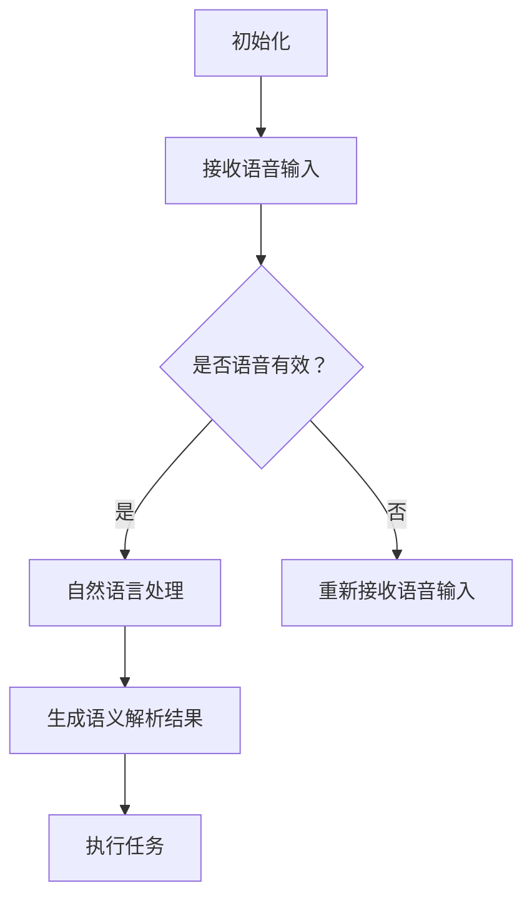
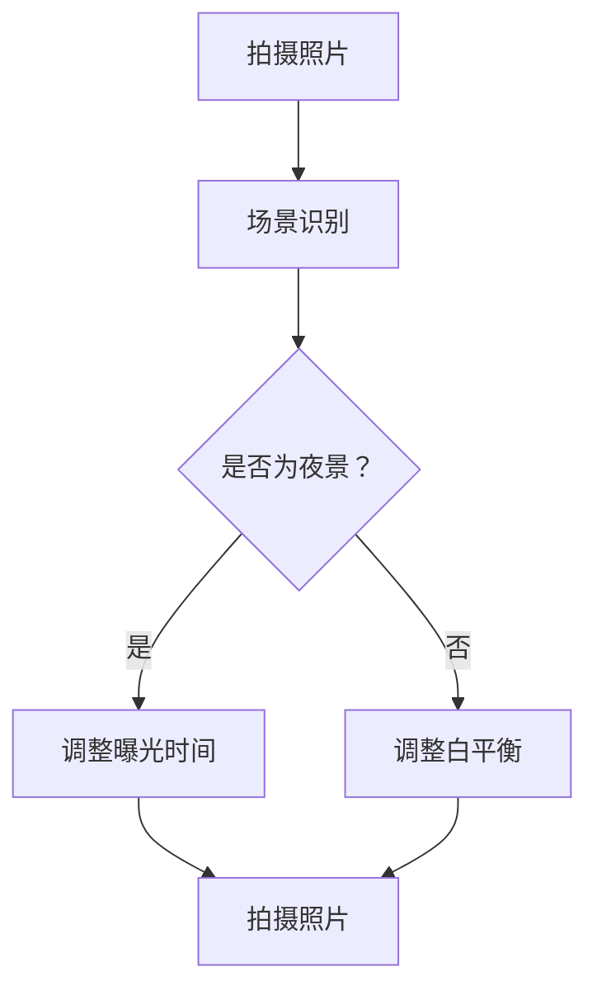
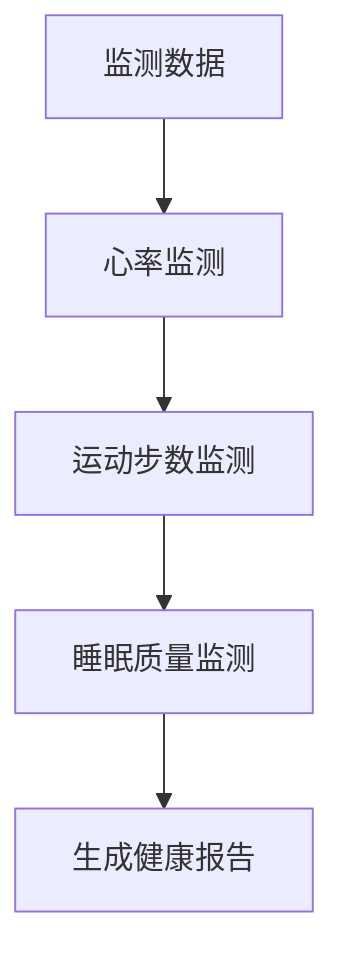

                 

# 李开复：苹果发布AI应用的意义

> **关键词**：人工智能，苹果，AI应用，技术趋势，社会影响，伦理道德

> **摘要**：本文旨在探讨苹果公司发布AI应用所蕴含的重大意义。通过分析AI技术的发展与应用现状，探讨苹果公司的AI战略及其产品中的创新，本文深入剖析了苹果发布AI应用对产品性能、市场竞争、社会生活等方面的影响，同时探讨了AI应用面临的挑战及相应的对策。最后，本文展望了AI应用的未来发展趋势及其对社会经济的潜在影响。

## 目录大纲

### 《李开复：苹果发布AI应用的意义》目录大纲

1. **第一部分：AI应用概述**
   1.1 AI技术的发展与应用现状
   1.2 苹果公司的AI战略
   1.3 苹果公司的AI应用发展前景

2. **第二部分：苹果发布AI应用的意义**
   2.1 AI应用在苹果产品中的影响
   2.2 AI应用对苹果公司的影响
   2.3 AI应用对社会的影响

3. **第三部分：AI应用的挑战与对策**
   3.1 AI应用的挑战
   3.2 AI应用的对策

4. **第四部分：未来展望**
   4.1 AI应用的未来发展趋势
   4.2 AI应用的潜在影响

5. **附录**
   5.1 苹果公司AI应用案例解析
   5.2 AI应用开发工具与资源
   5.3 AI应用发展政策与法规

## 第一部分：AI应用概述

### 1.1 AI技术的发展与应用现状

#### 1.1.1 AI技术的定义与分类

人工智能（AI）是指计算机模拟人类智能的技术，涵盖机器学习、深度学习、自然语言处理、计算机视觉等多个领域。根据应用场景和目标，AI技术可以分为：

1. **感知智能**：通过传感器获取环境信息，如计算机视觉、语音识别等。
2. **认知智能**：理解和处理信息，如自然语言处理、推理决策等。
3. **行为智能**：自主决策和执行任务，如自动化驾驶、智能制造等。

#### 1.1.2 全球AI技术发展现状

近年来，AI技术在全球范围内取得了显著进展。根据全球AI研究报告，AI技术已广泛应用于各个领域，如：

1. **智能制造**：通过人工智能技术优化生产流程，提高生产效率和质量。
2. **医疗健康**：利用AI技术进行疾病诊断、治疗方案优化等。
3. **金融服务**：利用AI技术进行风险评估、信用评估等。
4. **智慧城市**：利用AI技术实现智能交通管理、环境监测等。

#### 1.1.3 AI技术在各领域的应用

1. **工业领域**：通过AI技术实现自动化生产、设备预测维护等。
2. **医疗领域**：通过AI技术实现疾病诊断、个性化治疗等。
3. **金融领域**：通过AI技术实现风险评估、信用评估等。
4. **交通领域**：通过AI技术实现智能交通管理、自动驾驶等。

### 1.2 苹果公司的AI战略

苹果公司在AI领域的投资与合作

苹果公司在AI领域的投资与合作主要体现在以下几个方面：

1. **收购AI公司**：苹果公司通过收购AI公司，加强自身在AI领域的研发实力。例如，收购了机器学习公司Turi和语音识别公司PrimeSense等。
2. **研发投入**：苹果公司在AI领域的研发投入逐年增加，致力于推动AI技术的创新和应用。
3. **合作与开放**：苹果公司与多家AI公司进行合作，共同推动AI技术的发展和应用。同时，苹果公司也积极参与开源社区，为AI技术的发展贡献力量。

#### 1.2.2 苹果公司在AI产品中的创新

苹果公司在AI产品中的创新主要体现在以下几个方面：

1. **Siri**：苹果公司推出的智能助理Siri，具备自然语言处理、语音识别等功能，为用户提供语音交互体验。
2. **相机**：苹果公司在相机中引入AI技术，实现智能场景识别、人脸识别等功能，提升摄影体验。
3. **健康监测**：苹果公司通过AI技术实现健康监测，帮助用户了解身体状况，提供健康建议。

#### 1.2.3 苹果公司的AI应用发展前景

苹果公司在AI领域的投资与合作，以及产品中的创新，为其AI应用发展前景奠定了坚实基础。未来，苹果公司有望在以下领域实现突破：

1. **智能家居**：通过AI技术实现智能家居设备的智能联动，提升家居智能化水平。
2. **智能医疗**：利用AI技术实现疾病诊断、个性化治疗等，提高医疗服务质量。
3. **智能交通**：通过AI技术实现智能交通管理、自动驾驶等，提升交通安全和效率。
4. **智能教育**：利用AI技术实现个性化教学、智能评估等，提升教育质量。

## 第二部分：苹果发布AI应用的意义

### 2.1 AI应用在苹果产品中的影响

#### 2.1.1 智能化操作的提升

AI技术的应用，使得苹果产品在操作上更加智能化，提升了用户体验。例如：

1. **语音助手Siri**：Siri通过自然语言处理技术，能够理解用户的语音指令，实现语音拨号、发送消息、播放音乐等功能，为用户带来便捷的语音交互体验。
2. **智能相机**：苹果相机中的AI技术，能够自动识别场景，调整曝光、白平衡等参数，提升拍照效果。同时，AI技术还能够实现人脸识别、美颜等功能，满足用户对拍照的需求。
3. **健康监测**：苹果手表等设备中的AI技术，能够实时监测用户的心率、运动步数、睡眠质量等，为用户提供健康数据，帮助用户保持健康生活方式。

#### 2.1.2 用户隐私保护与数据安全

AI技术的应用，有助于提高用户隐私保护和数据安全。例如：

1. **面部识别**：苹果手机中的面部识别技术，通过深度学习算法识别用户面部特征，实现安全解锁。相比传统的密码解锁，面部识别更加便捷和安全。
2. **隐私保护**：苹果公司通过AI技术，对用户数据进行分析和处理，确保用户隐私不被泄露。同时，苹果公司也推出了一系列隐私保护功能，如App隐私报告、隐私权限管理等，为用户提供更加安全的隐私保护。

#### 2.1.3 AI应用的商业模式探索

AI技术的应用，为苹果公司探索新的商业模式提供了可能性。例如：

1. **智能广告**：苹果公司可以利用AI技术，对用户数据进行深入分析，为用户推荐个性化的广告内容，提升广告投放效果。
2. **智能家居**：苹果公司可以通过AI技术，实现智能家居设备的智能联动，为用户提供一站式智能家居解决方案，开拓新的市场空间。

### 2.2 AI应用对苹果公司的影响

#### 2.2.1 市场竞争力的提升

AI技术的应用，有助于提升苹果公司的市场竞争力。例如：

1. **技术创新**：苹果公司通过AI技术的研发和应用，不断推出具有创新性的产品，满足用户需求，提升产品竞争力。
2. **用户体验**：苹果公司通过AI技术，优化产品功能和操作体验，提升用户满意度，增强用户忠诚度。

#### 2.2.2 AI应用对苹果产业链的推动作用

AI技术的应用，对苹果公司的产业链也产生了积极影响。例如：

1. **供应商合作**：苹果公司通过与AI技术供应商合作，推动产业链的升级和创新，提高整体竞争力。
2. **研发投入**：苹果公司加大对AI技术的研发投入，促进产业链上下游企业的技术创新，推动产业链整体发展。

#### 2.2.3 AI应用对苹果公司创新能力的促进

AI技术的应用，有助于提升苹果公司的创新能力。例如：

1. **产品设计**：苹果公司通过AI技术，进行产品设计和优化，实现更加智能化、个性化的产品。
2. **市场预测**：苹果公司利用AI技术，对市场数据进行分析和预测，为产品研发和市场推广提供有力支持。

### 2.3 AI应用对社会的影响

#### 2.3.1 AI应用对消费者生活方式的改变

AI技术的应用，正在深刻改变消费者的生活方式。例如：

1. **智能家居**：通过AI技术，实现家庭设备的智能控制，提升生活便捷性和舒适度。
2. **在线教育**：通过AI技术，实现个性化教学，提升教育质量和效果。

#### 2.3.2 AI应用对就业市场的影响

AI技术的应用，对就业市场也产生了深远影响。例如：

1. **岗位替代**：AI技术的发展和应用，可能导致一些传统岗位被替代，但同时也会创造新的就业机会。
2. **技能要求**：随着AI技术的应用，对就业者的技能要求也在不断提高，需要更多人具备AI相关知识和技能。

#### 2.3.3 AI应用对教育、医疗等社会领域的变革

AI技术的应用，对教育、医疗等社会领域也产生了重要影响。例如：

1. **教育领域**：通过AI技术，实现个性化教育，提高教育质量和效果。
2. **医疗领域**：通过AI技术，实现精准医疗，提高医疗服务水平和效果。

## 第三部分：AI应用的挑战与对策

### 3.1 AI应用的挑战

#### 3.1.1 技术挑战

AI应用在技术层面面临以下挑战：

1. **算法复杂度与计算资源消耗**：随着AI技术的应用场景不断扩大，算法复杂度和计算资源消耗也在不断增加，对硬件设备提出了更高要求。
2. **数据隐私与安全**：AI应用需要大量数据支持，但数据隐私和安全问题成为一大挑战，如何保护用户隐私成为亟待解决的问题。
3. **模型可解释性与可靠性**：随着AI技术的复杂度增加，模型的可解释性和可靠性问题愈发突出，如何提高模型的可解释性和可靠性成为关键。

#### 3.1.2 社会挑战

AI应用在社会层面也面临以下挑战：

1. **伦理道德问题**：AI技术的应用可能引发伦理道德问题，如歧视、滥用等，如何建立合理的伦理规范成为关键。
2. **就业市场影响**：AI技术的发展和应用可能导致部分传统岗位被替代，对就业市场产生不利影响，如何应对这一挑战成为重要议题。
3. **隐私权侵犯**：AI技术的应用可能侵犯用户隐私权，如何平衡隐私保护与数据利用成为关键。

### 3.2 AI应用的对策

针对AI应用面临的挑战，可以采取以下对策：

#### 3.2.1 技术对策

1. **算法优化与模型简化**：通过算法优化和模型简化，降低算法复杂度和计算资源消耗，提高模型运行效率。
2. **数据隐私保护技术**：通过数据加密、匿名化等技术手段，保护用户隐私，确保数据安全。
3. **模型可解释性与可靠性提升**：通过模型可解释性和可靠性的研究，提高模型的透明度和可靠性，增强用户信任。

#### 3.2.2 社会对策

1. **建立AI伦理框架与规范**：通过建立AI伦理框架和规范，引导AI技术的健康发展，避免伦理道德问题。
2. **加强AI教育与培训**：通过加强AI教育与培训，提高就业者的AI相关知识和技能，应对就业市场挑战。
3. **推动AI应用的公平性与透明性**：通过推动AI应用的公平性与透明性，确保AI技术在各个领域的公平应用，避免歧视和滥用。

## 第四部分：未来展望

### 4.1 AI应用的未来发展趋势

AI应用的未来发展趋势主要体现在以下几个方面：

1. **智能家居**：随着AI技术的发展，智能家居将实现更加智能化、便捷化的操作，为用户提供更优质的生活体验。
2. **智能医疗**：AI技术将在医疗领域发挥更大作用，实现精准医疗、个性化治疗，提高医疗服务水平和效果。
3. **智能交通**：通过AI技术，实现智能交通管理、自动驾驶等，提高交通效率和安全性。

### 4.2 AI应用的潜在影响

AI应用的潜在影响主要体现在以下几个方面：

1. **社会经济推动**：AI技术将推动社会经济的发展，提升生产力，创造新的就业机会。
2. **生活质量提升**：AI技术将提高人们的生活质量，实现个性化服务、智能化生活。
3. **全球治理与可持续发展**：AI技术将在全球治理和可持续发展方面发挥重要作用，推动社会进步和可持续发展。

## 附录

### 附录A：苹果公司AI应用案例解析

#### A.1 智能助理Siri

Siri是苹果公司推出的智能助理，通过自然语言处理技术，能够理解用户的语音指令，实现语音拨号、发送消息、播放音乐等功能。以下是一个简单的Siri算法流程图：

#### A.2 智能相机

苹果相机中的AI技术，能够自动识别场景，调整曝光、白平衡等参数，提升拍照效果。以下是一个简单的智能相机算法流程图：

#### A.3 智能健康监测

苹果手表等设备中的AI技术，能够实时监测用户的心率、运动步数、睡眠质量等，为用户提供健康数据。以下是一个简单的智能健康监测算法流程图：

### 附录B：AI应用开发工具与资源

#### B.1 主流AI开发框架

1. **TensorFlow**：Google推出的一款开源深度学习框架，广泛应用于各种AI应用开发。
2. **PyTorch**：Facebook AI研究院推出的一款开源深度学习框架，具有灵活性和高效性。

#### B.2 AI应用开发平台

1. **Google Cloud AI**：Google提供的AI应用开发平台，包括TensorFlow、AutoML等工具。
2. **AWS AI**：Amazon提供的AI应用开发平台，包括SageMaker、Rekognition等。

#### B.3 AI应用开发资源汇总

1. **AI教程网站**：如Udacity、Coursera等，提供丰富的AI教程和课程。
2. **GitHub**：一个代码托管平台，提供了大量的AI开源项目和代码库。
3. **AI论坛**：如AI Stack Overflow、AI Reddit等，提供了AI开发者交流和学习的平台。

### 附录C：AI应用发展政策与法规

#### C.1 国际AI应用发展政策

1. **欧盟**：发布了《人工智能伦理准则》，强调AI技术的伦理道德和社会责任。
2. **美国**：发布了《人工智能国家战略》，强调AI技术的研发和应用。

#### C.2 我国AI应用发展政策

1. **《新一代人工智能发展规划》**：提出了我国AI技术发展目标和任务，强调AI技术的创新和应用。
2. **《人工智能伦理规范》**：提出了AI技术的伦理道德规范，引导AI技术的健康发展。

#### C.3 AI应用伦理规范与法规综述

AI应用伦理规范与法规主要涉及以下几个方面：

1. **隐私保护**：规定AI应用在数据收集、存储、处理等环节应遵守的隐私保护原则。
2. **数据安全**：规定AI应用应采取的数据安全措施，确保用户数据安全。
3. **可解释性与可靠性**：规定AI模型应具备的可解释性和可靠性要求，提高用户信任。
4. **伦理道德**：规定AI应用在研发、应用等环节应遵守的伦理道德规范，确保AI技术的健康发展。 

## 作者信息

**作者：** AI天才研究院 / AI Genius Institute & 禅与计算机程序设计艺术 / Zen And The Art of Computer Programming

文章完。|>

