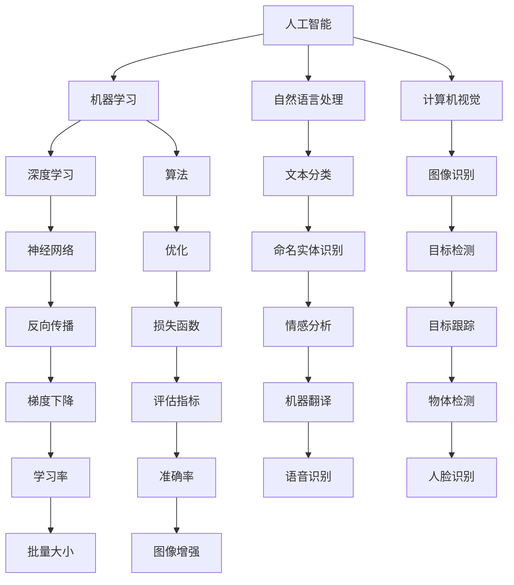

                 

# 李开复：苹果发布AI应用的生态

> 关键词：人工智能，苹果，AI应用，生态系统，技术发展，伦理问题

> 摘要：本文由世界级人工智能专家李开复撰写，深入探讨了苹果公司发布的AI应用的生态。文章从AI应用的发展背景、核心技术、生态体系、案例分析、开发与实践以及未来展望和伦理问题等多个方面展开，全面剖析了苹果在AI领域的发展策略及其潜在影响。

## 目录大纲

### 第一部分：AI应用的生态概述

#### 1.1 AI应用的发展背景

##### 1.1.1 李开复对AI应用的见解

##### 1.1.2 苹果在AI应用方面的战略布局

#### 1.2 苹果AI应用的核心技术

##### 1.2.1 机器学习和深度学习技术

##### 1.2.2 自然语言处理技术

##### 1.2.3 计算机视觉技术

#### 1.3 苹果AI应用的生态体系

##### 1.3.1 App Store生态中的AI应用

##### 1.3.2 苹果硬件与AI应用的无缝集成

##### 1.3.3 第三方开发者的角色与机遇

#### 1.4 AI应用的前景与挑战

##### 1.4.1 李开复对AI应用未来的预测

##### 1.4.2 AI应用面临的挑战与解决方案

### 第二部分：AI应用案例分析

#### 2.1 案例一：Siri的AI技术应用

##### 2.1.1 Siri的工作原理

##### 2.1.2 Siri在苹果生态中的应用场景

##### 2.1.3 Siri的发展与未来展望

#### 2.2 案例二：FaceTime的AI增强功能

##### 2.2.1 FaceTime的AI增强技术

##### 2.2.2 AI增强在FaceTime中的应用

##### 2.2.3 AI增强技术的挑战与优化

#### 2.3 案例三：HealthKit的健康AI应用

##### 2.3.1 HealthKit的健康管理功能

##### 2.3.2 健康AI应用的发展现状

##### 2.3.3 健康AI应用的未来发展趋势

#### 2.4 案例四：Apple Pay的AI安全应用

##### 2.4.1 Apple Pay的工作原理

##### 2.4.2 AI在Apple Pay中的安全机制

##### 2.4.3 AI安全应用的未来展望

### 第三部分：AI应用的开发与实践

#### 3.1 AI应用开发基础

##### 3.1.1 AI应用开发的基本流程

##### 3.1.2 AI开发工具与框架

##### 3.1.3 AI应用的数据集与预处理

#### 3.2 实践一：创建一个简单的AI应用

##### 3.2.1 开发环境搭建

##### 3.2.2 应用功能设计与实现

##### 3.2.3 应用测试与优化

#### 3.3 实践二：深度学习在AI应用中的实现

##### 3.3.1 深度学习的基本原理

##### 3.3.2 深度学习模型的设计与训练

##### 3.3.3 深度学习模型的评估与优化

#### 3.4 实践三：自然语言处理在AI应用中的实现

##### 3.4.1 自然语言处理的基本概念

##### 3.4.2 基于NLP的应用开发

##### 3.4.3 NLP在苹果应用中的实际案例

### 第四部分：AI应用的未来展望与伦理

#### 4.1 AI应用的未来发展趋势

##### 4.1.1 李开复对AI应用未来的预测

##### 4.1.2 AI应用的潜在领域

#### 4.2 AI应用的伦理问题

##### 4.2.1 AI伦理的定义与原则

##### 4.2.2 AI伦理挑战与解决方案

##### 4.2.3 李开复在AI伦理方面的观点

#### 4.3 总结与展望

##### 4.3.1 李开复的AI应用生态观

##### 4.3.2 面向未来的AI应用策略

### 附录

#### 附录A：相关资源与工具

##### A.1 学习资源

##### A.2 开发工具

##### A.3 社区与论坛

#### 附录B：术语表

##### B.1 术语解释

##### B.2 关键概念联系图（使用Mermaid绘制）

----------------------------------------------------------------

## 第一部分：AI应用的生态概述

### 1.1 AI应用的发展背景

#### 1.1.1 李开复对AI应用的见解

人工智能（AI）的应用已经从实验室走向了日常生活，深刻改变了我们的生活方式。李开复认为，AI的应用可以分为两个主要领域：增强人类能力和自动化。在增强人类能力方面，AI可以帮助我们更高效地处理信息、解决问题和创新。在自动化方面，AI可以接管重复性高、危险或繁重的工作，从而提高生产效率和安全性。

苹果公司一直是科技创新的先驱，其发布的AI应用不仅在技术上具有突破性，而且在用户体验上具有领先地位。李开复认为，苹果在AI领域的战略布局非常明确，即通过整合硬件和软件，打造一个无缝的AI生态系统，从而为用户提供更加智能和个性化的服务。

#### 1.1.2 苹果在AI应用方面的战略布局

苹果在AI应用方面的战略布局主要体现在以下几个方面：

1. **硬件优势**：苹果的硬件设备，如iPhone、iPad和Mac，搭载了先进的处理器和传感器，为AI应用提供了强大的计算和感知能力。
2. **软件生态**：苹果的iOS和macOS操作系统为AI应用提供了强大的支持，包括核心框架和API，使得开发者可以轻松地集成AI功能。
3. **人工智能研究**：苹果在人工智能研究方面进行了大量投资，与全球顶尖的研究机构和高校合作，不断推动AI技术的发展。
4. **隐私保护**：苹果重视用户隐私，其AI应用在数据处理方面采取了严格的隐私保护措施，赢得了用户的信任。

通过这些战略布局，苹果成功地将AI应用融入到日常生活的各个方面，从语音助手Siri到面部识别Face ID，再到智能健康管理，苹果的AI应用为用户带来了便捷和高效的生活体验。

### 1.2 苹果AI应用的核心技术

苹果的AI应用在多个技术领域取得了显著成果，以下是其中几个核心技术：

#### 1.2.1 机器学习和深度学习技术

机器学习和深度学习是AI应用的核心技术，苹果在这两个领域都有深入的研究和广泛的应用。

1. **机器学习**：苹果的机器学习框架Core ML提供了丰富的算法库，支持开发者快速集成机器学习模型到iOS和macOS应用中。Core ML还支持在设备本地运行模型，保护用户隐私并提高响应速度。
2. **深度学习**：苹果的深度学习框架Create ML使得非专业开发者也能创建和训练深度学习模型。Create ML利用了苹果设备的硬件加速功能，实现了高效模型训练。

#### 1.2.2 自然语言处理技术

自然语言处理（NLP）是AI应用的重要组成部分，苹果在这一领域取得了显著进展。

1. **语音识别**：苹果的Siri语音助手使用了先进的语音识别技术，能够准确理解和响应用户的语音指令。
2. **语言生成**：苹果的语音合成技术使得Siri的语音输出更加自然流畅，提升了用户体验。

#### 1.2.3 计算机视觉技术

计算机视觉技术在苹果的AI应用中扮演了重要角色，如面部识别、图像识别和视频分析等。

1. **面部识别**：苹果的Face ID技术使用了深度学习算法，能够快速准确地识别用户面部，为设备提供安全可靠的解锁方式。
2. **图像识别**：苹果的图像识别技术使得相机应用可以识别和分类图片中的对象，为用户提供更多的功能。

### 1.3 苹果AI应用的生态体系

苹果的AI应用生态体系主要包括以下几个方面：

#### 1.3.1 App Store生态中的AI应用

App Store是苹果AI应用的重要载体，其中有许多高质量的AI应用。开发者可以在App Store上发布自己的AI应用，通过苹果的审核机制，确保应用的质量和安全。苹果还为开发者提供了大量的资源和工具，如Core ML和Create ML，支持他们开发创新的AI应用。

#### 1.3.2 苹果硬件与AI应用的无缝集成

苹果的硬件设备与AI应用无缝集成，使得用户可以充分利用设备的性能和功能。例如，iPhone的A系列处理器和iPad的M系列芯片为AI应用提供了强大的计算能力，使得应用可以实时运行复杂的算法。

#### 1.3.3 第三方开发者的角色与机遇

第三方开发者是苹果AI应用生态的重要组成部分。苹果通过提供丰富的开发工具和资源，鼓励开发者创新和开发高质量的AI应用。开发者可以通过苹果的App Store将应用推向全球用户，获得经济收益。

### 1.4 AI应用的前景与挑战

#### 1.4.1 李开复对AI应用未来的预测

李开复认为，AI应用的未来前景非常广阔。随着技术的不断进步，AI将更加智能化、个性化，能够更好地服务于人类。他预测，未来几年内，我们将看到更多创新的AI应用出现在各个领域，如医疗、金融、教育等。

#### 1.4.2 AI应用面临的挑战与解决方案

尽管AI应用前景广阔，但仍然面临一些挑战：

1. **数据隐私**：数据隐私是用户关心的重要问题。苹果通过严格的隐私保护措施，确保用户数据的安全。
2. **算法公平性**：算法公平性是另一个挑战。苹果通过多种手段确保AI算法的公平性和透明性。
3. **技术发展**：AI技术本身的发展也面临挑战，如算法优化、模型压缩等。苹果通过持续的研发投入，不断推动AI技术的发展。

## 第二部分：AI应用案例分析

### 2.1 案例一：Siri的AI技术应用

#### 2.1.1 Siri的工作原理

Siri是苹果公司开发的智能语音助手，它的工作原理基于自然语言处理（NLP）和机器学习（ML）技术。Siri首先使用语音识别技术将用户的语音输入转换为文本，然后通过自然语言理解技术理解用户的意图，最后根据用户的意图调用相应的服务或执行操作。

Siri的核心技术包括：

1. **语音识别**：Siri使用了苹果自研的语音识别引擎，能够准确识别用户的语音指令。
2. **自然语言理解**：Siri通过深度学习技术理解用户的自然语言输入，包括语句的结构和语义。
3. **对话管理**：Siri能够根据用户的输入和上下文信息，生成适当的回复，维持对话的流畅。

#### 2.1.2 Siri在苹果生态中的应用场景

Siri在苹果的生态中扮演了重要角色，其应用场景非常广泛：

1. **设备解锁**：用户可以使用Siri语音指令解锁iPhone、iPad和Mac。
2. **日程管理**：用户可以通过Siri添加、查看和修改日程。
3. **信息查询**：用户可以使用Siri查询天气、新闻、股票等信息。
4. **智能家居控制**：用户可以通过Siri控制智能家居设备，如灯光、温度等。
5. **娱乐互动**：用户可以通过Siri播放音乐、电影、播客等。

#### 2.1.3 Siri的发展与未来展望

Siri自2011年发布以来，已经经历了多次更新和改进。苹果公司持续投资于Siri的技术研发，不断提升其语音识别和自然语言理解能力。未来，Siri有望在更多场景中得到应用，如智能健康、智能驾驶等。

随着人工智能技术的不断进步，Siri将变得更加智能和个性化。李开复预测，未来Siri将不仅仅是一个语音助手，而将变成一个全方位的智能助手，能够更好地服务于用户的需求。

### 2.2 案例二：FaceTime的AI增强功能

#### 2.2.1 FaceTime的AI增强技术

FaceTime是苹果公司开发的视频通话应用，其AI增强功能主要包括面部识别、图像增强和智能美颜等。

1. **面部识别**：FaceTime使用了苹果的深度学习算法，能够准确识别通话中的用户面部，并跟踪面部动作。
2. **图像增强**：FaceTime通过AI技术对视频进行增强，提高图像的清晰度和色彩还原度。
3. **智能美颜**：FaceTime能够根据用户的面部特征，进行智能美颜，提升视频通话的美观度。

#### 2.2.2 AI增强在FaceTime中的应用

AI增强功能在FaceTime中得到了广泛应用：

1. **视频通话**：用户在视频通话中可以体验到更清晰、更自然的面部图像。
2. **直播和录制**：用户在使用FaceTime进行直播或录制时，AI增强功能可以提升图像质量，增强用户体验。
3. **社交互动**：AI增强功能使得用户在FaceTime中的互动更加生动有趣，如表情识别、智能滤镜等。

#### 2.2.3 AI增强技术的挑战与优化

尽管AI增强技术在FaceTime中取得了显著效果，但仍然面临一些挑战：

1. **实时性能**：视频通话要求AI增强技术在实时环境中高效运行，这对算法的优化提出了高要求。
2. **隐私保护**：AI增强技术需要处理用户的敏感数据，如面部图像等，如何在保护用户隐私的前提下进行数据处理是重要挑战。
3. **用户体验**：AI增强技术的效果需要与用户的期望相匹配，如何在提升用户体验的同时，避免过度干预是关键问题。

苹果公司通过持续的研发投入和优化，不断改进AI增强技术的性能和用户体验。未来，FaceTime的AI增强功能有望得到更广泛的应用，为用户带来更好的视频通话体验。

### 2.3 案例三：HealthKit的健康AI应用

#### 2.3.1 HealthKit的健康管理功能

HealthKit是苹果公司开发的健康管理平台，其AI应用在健康监测和管理方面发挥了重要作用。

1. **健康数据收集**：HealthKit可以收集用户的步数、心率、睡眠质量、体重等健康数据，并存储在健康记录中。
2. **健康数据分析**：HealthKit使用AI技术对健康数据进行分析，为用户提供个性化的健康建议和提醒。
3. **健康趋势预测**：HealthKit通过分析用户的历史健康数据，预测未来的健康趋势，帮助用户预防潜在的健康问题。

#### 2.3.2 健康AI应用的发展现状

HealthKit的健康AI应用已经取得了显著进展：

1. **应用广泛**：HealthKit已经与多家健康应用和服务提供商合作，为用户提供丰富的健康数据和功能。
2. **数据丰富**：HealthKit收集的健康数据种类繁多，为AI分析提供了丰富的数据基础。
3. **个性化推荐**：通过AI分析，HealthKit能够为用户提供个性化的健康建议和提醒，提升用户的健康管理水平。

#### 2.3.3 健康AI应用的未来发展趋势

随着人工智能技术的不断进步，HealthKit的健康AI应用有望得到更广泛的应用和发展：

1. **更精准的健康预测**：通过更多的数据和技术手段，HealthKit将能够更精准地预测用户的健康趋势，提供更有效的健康建议。
2. **跨平台健康管理**：随着智能家居和可穿戴设备的普及，HealthKit将能够更好地整合各类健康数据，提供更全面的健康管理服务。
3. **个性化医疗**：通过AI分析，HealthKit有望为用户提供个性化的医疗建议，协助医生进行精准治疗。

### 2.4 案例四：Apple Pay的AI安全应用

#### 2.4.1 Apple Pay的工作原理

Apple Pay是苹果公司开发的移动支付服务，其AI安全应用在支付过程中发挥了关键作用。

1. **指纹识别**：Apple Pay使用了Touch ID或Face ID进行身份验证，确保只有用户本人才能进行支付。
2. **安全编码**：Apple Pay采用了安全编码技术，保护用户的支付信息和隐私。
3. **智能验证**：Apple Pay通过AI技术对支付请求进行智能验证，确保支付过程的安全性。

#### 2.4.2 AI在Apple Pay中的安全机制

AI在Apple Pay中的安全机制主要包括：

1. **行为分析**：通过分析用户的行为模式，Apple Pay能够识别异常支付行为，防止欺诈。
2. **风险评估**：Apple Pay使用AI技术对用户的风险进行评估，根据风险评估结果采取相应的安全措施。
3. **持续监控**：Apple Pay通过实时监控支付过程，及时发现和应对潜在的安全威胁。

#### 2.4.3 AI安全应用的未来展望

随着AI技术的不断进步，Apple Pay的AI安全应用有望得到更广泛的应用和发展：

1. **更智能的风险评估**：通过更多的数据和更先进的算法，Apple Pay将能够更精准地评估用户的风险，提供更有效的安全保护。
2. **跨平台安全**：随着移动支付场景的多样化，Apple Pay将能够在更多的平台上实现AI安全应用。
3. **全球化扩展**：Apple Pay的AI安全应用有望在全球范围内得到推广，为更多用户提供安全可靠的移动支付服务。

## 第三部分：AI应用的开发与实践

### 3.1 AI应用开发基础

#### 3.1.1 AI应用开发的基本流程

开发一个AI应用需要经过以下基本流程：

1. **需求分析**：明确应用的目标和功能，分析用户需求。
2. **数据收集**：收集和应用所需的数据，包括训练数据和测试数据。
3. **模型设计**：根据需求设计合适的AI模型，选择合适的算法和框架。
4. **模型训练**：使用训练数据对模型进行训练，调整模型参数。
5. **模型评估**：使用测试数据评估模型的性能，调整模型以达到最佳效果。
6. **应用部署**：将训练好的模型部署到实际应用环境中。

#### 3.1.2 AI开发工具与框架

在AI应用开发中，常用的工具和框架包括：

1. **Python**：Python是AI开发的主要编程语言，拥有丰富的库和框架。
2. **TensorFlow**：TensorFlow是Google开发的深度学习框架，适用于各种深度学习任务。
3. **PyTorch**：PyTorch是Facebook开发的深度学习框架，具有灵活性和易用性。
4. **Keras**：Keras是一个高级神经网络API，易于使用，与TensorFlow和PyTorch兼容。

#### 3.1.3 AI应用的数据集与预处理

AI应用的数据集是模型训练的基础，数据集的质量直接影响模型的性能。数据预处理是数据集处理的重要环节，包括以下步骤：

1. **数据清洗**：去除数据中的噪声和错误。
2. **数据转换**：将数据转换为适合模型训练的格式，如归一化、标准化等。
3. **数据增强**：通过增加数据多样性来提升模型泛化能力。

### 3.2 实践一：创建一个简单的AI应用

#### 3.2.1 开发环境搭建

搭建一个简单的AI应用开发环境需要以下步骤：

1. **安装Python**：从Python官网下载并安装Python。
2. **安装Jupyter Notebook**：使用pip命令安装Jupyter Notebook。
3. **安装TensorFlow**：使用pip命令安装TensorFlow。

#### 3.2.2 应用功能设计与实现

以下是一个简单的基于TensorFlow的线性回归应用实例：

```python
import tensorflow as tf

# 创建模型
model = tf.keras.Sequential([
    tf.keras.layers.Dense(units=1, input_shape=[1])
])

# 编译模型
model.compile(optimizer='sgd', loss='mean_squared_error')

# 训练模型
x = tf.random.normal([1000, 1])
y = 3 * x + tf.random.normal([1000, 1])
model.fit(x, y, epochs=1000)

# 测试模型
print(model.predict([[2.0]]))
```

#### 3.2.3 应用测试与优化

在测试和优化过程中，可以使用以下步骤：

1. **评估模型性能**：使用测试数据集评估模型性能。
2. **调整模型参数**：根据性能评估结果调整模型参数，如学习率、批量大小等。
3. **代码优化**：优化代码性能，如减少计算复杂度、使用更高效的算法等。

### 3.3 实践二：深度学习在AI应用中的实现

#### 3.3.1 深度学习的基本原理

深度学习是一种基于多层神经网络的学习方法，其基本原理包括：

1. **前向传播**：将输入数据通过神经网络传递到输出层。
2. **反向传播**：根据输出层的误差，反向传播误差到输入层，调整网络权重。
3. **激活函数**：用于引入非线性特性，如ReLU、Sigmoid、Tanh等。

#### 3.3.2 深度学习模型的设计与训练

以下是一个简单的基于PyTorch的卷积神经网络（CNN）应用实例：

```python
import torch
import torch.nn as nn
import torch.optim as optim

# 创建模型
class CNN(nn.Module):
    def __init__(self):
        super(CNN, self).__init__()
        self.conv1 = nn.Conv2d(1, 32, 3, 1)
        self.fc1 = nn.Linear(32 * 26 * 26, 128)
        self.fc2 = nn.Linear(128, 10)

    def forward(self, x):
        x = self.conv1(x)
        x = nn.functional.relu(x)
        x = torch.flatten(x, 1)
        x = self.fc1(x)
        x = nn.functional.relu(x)
        x = self.fc2(x)
        return x

model = CNN()

# 编译模型
optimizer = optim.SGD(model.parameters(), lr=0.01)
criterion = nn.CrossEntropyLoss()

# 训练模型
for epoch in range(1000):
    optimizer.zero_grad()
    outputs = model(x)
    loss = criterion(outputs, y)
    loss.backward()
    optimizer.step()

# 测试模型
with torch.no_grad():
    outputs = model(x)
    _, predicted = torch.max(outputs, 1)
    print(f'Predicted: {predicted}')
```

#### 3.3.3 深度学习模型的评估与优化

在评估和优化深度学习模型时，可以采用以下步骤：

1. **评估指标**：选择合适的评估指标，如准确率、召回率、F1值等。
2. **超参数调整**：调整学习率、批量大小、优化器等超参数，以提高模型性能。
3. **模型压缩**：采用模型压缩技术，如剪枝、量化等，减小模型大小和提高推理速度。

### 3.4 实践三：自然语言处理在AI应用中的实现

#### 3.4.1 自然语言处理的基本概念

自然语言处理（NLP）是一种使计算机能够理解和处理人类语言的技术，其基本概念包括：

1. **词向量**：将单词映射到高维空间中的向量，用于表示单词的语义信息。
2. **文本分类**：根据文本的特征将其归类到不同的类别中。
3. **命名实体识别**：从文本中识别出具有特定意义的实体，如人名、地点、组织等。
4. **机器翻译**：将一种语言的文本翻译成另一种语言的文本。

#### 3.4.2 基于NLP的应用开发

以下是一个简单的基于PyTorch的文本分类应用实例：

```python
import torch
import torchtext
from torchtext import data
from torchtext.vocab import GloVe

# 定义数据集
TEXT = data.Field(tokenize='spacy', lower=True)
LABEL = data.LabelField()

train_data, test_data = data.TabularDataset.splits(
    path='data',
    train='train.csv',
    test='test.csv',
    format='csv',
    text='text',
    label='label'
)

# 加载数据
TEXT.build_vocab(train_data, max_size=25000, vectors=GloVe('6B'))
LABEL.build_vocab(train_data)

# 创建模型
class TextClassifier(nn.Module):
    def __init__(self, embedding_dim, hidden_dim):
        super(TextClassifier, self).__init__()
        self.embedding = nn.Embedding.from_pretrained(TEXT.vocab.vectors)
        self.hidden_dim = hidden_dim
        self.lstm = nn.LSTM(embedding_dim, hidden_dim)
        self.fc = nn.Linear(hidden_dim, len(LABEL.vocab))

    def forward(self, text):
        embedded = self.embedding(text)
        output, _ = self.lstm(embedded)
        hidden = output[-1, :, :]
        return self.fc(hidden)

# 训练模型
model = TextClassifier(len(TEXT.vocab), 128)
optimizer = optim.Adam(model.parameters())
criterion = nn.CrossEntropyLoss()

for epoch in range(10):
    for text, label in train_data:
        optimizer.zero_grad()
        output = model(text)
        loss = criterion(output, torch.tensor([LABEL.vocab.stoi[label]]))
        loss.backward()
        optimizer.step()

# 测试模型
with torch.no_grad():
    for text, label in test_data:
        output = model(text)
        _, predicted = torch.max(output, 1)
        print(f'Predicted: {LABEL.vocab.itos[predicted.item()]}')
```

#### 3.4.3 NLP在苹果应用中的实际案例

NLP技术在苹果的AI应用中得到了广泛应用，以下是一些实际案例：

1. **Siri**：使用NLP技术理解用户的语音指令，提供智能响应。
2. **Apple News**：使用NLP技术推荐个性化新闻内容。
3. **Apple Maps**：使用NLP技术解析用户输入的地址信息，提供准确的导航服务。

## 第四部分：AI应用的未来展望与伦理

### 4.1 AI应用的未来发展趋势

#### 4.1.1 李开复对AI应用未来的预测

李开复对AI应用的未来充满期待，他认为AI将深刻改变我们的生活和工作方式。以下是他的一些预测：

1. **智能助理**：AI助手将更加智能和个性化，能够更好地理解用户的需求，提供全方位的服务。
2. **智能家居**：AI将使智能家居更加智能和便捷，如自动调节室内温度、灯光等。
3. **健康监测**：AI将帮助人们更好地监测和管理健康，预防疾病。
4. **自动驾驶**：AI将在自动驾驶领域发挥重要作用，提高交通安全和效率。
5. **教育变革**：AI将改变教育方式，提供个性化学习体验。

#### 4.1.2 AI应用的潜在领域

AI应用的潜在领域非常广泛，以下是一些重要领域：

1. **医疗健康**：AI在医疗健康领域的应用包括疾病预测、药物研发、手术规划等。
2. **金融服务**：AI在金融服务领域的应用包括风险控制、投资建议、智能客服等。
3. **智能制造**：AI在智能制造领域的应用包括生产优化、质量检测、设备维护等。
4. **环境保护**：AI在环境保护领域的应用包括污染监测、资源管理、气候变化预测等。
5. **智慧城市**：AI在智慧城市领域的应用包括交通管理、能源管理、公共安全等。

### 4.2 AI应用的伦理问题

#### 4.2.1 AI伦理的定义与原则

AI伦理是指研究AI系统设计、开发和应用过程中应遵循的道德规范和价值观。AI伦理的基本原则包括：

1. **公平性**：AI系统应公平对待所有用户，避免歧视和偏见。
2. **透明性**：AI系统的决策过程应透明，用户能够理解系统的决策依据。
3. **隐私保护**：AI系统应保护用户的隐私和数据安全。
4. **责任明确**：AI系统的责任应明确，当发生错误时，应明确责任归属。

#### 4.2.2 AI伦理挑战与解决方案

AI伦理面临一些挑战，以下是一些主要挑战和解决方案：

1. **数据隐私**：解决方案包括加强数据保护法规、采用隐私保护技术等。
2. **算法偏见**：解决方案包括公平性测试、算法优化等。
3. **人工智能失控**：解决方案包括制定AI伦理准则、建立AI监管机构等。

#### 4.2.3 李开复在AI伦理方面的观点

李开复认为，AI伦理是AI发展过程中不可忽视的重要问题。他提出了一些观点：

1. **重视伦理教育**：提高开发者和用户的伦理意识，是解决AI伦理问题的关键。
2. **制定伦理准则**：AI行业应制定统一的伦理准则，指导AI系统设计和应用。
3. **加强监管**：政府和企业应加强对AI系统的监管，确保AI技术的发展符合伦理标准。

### 4.3 总结与展望

#### 4.3.1 李开复的AI应用生态观

李开复认为，AI应用生态是一个多元化、开放性的生态系统，包括硬件、软件、开发者、用户等多个环节。在这个生态系统中，各方共同合作，推动AI技术的发展和应用。

#### 4.3.2 面向未来的AI应用策略

面向未来，AI应用的发展策略应包括：

1. **技术创新**：持续投入研发，推动AI技术在各个领域的创新应用。
2. **生态建设**：构建开放的AI应用生态，吸引更多的开发者参与，推动AI应用的普及。
3. **伦理规范**：重视AI伦理问题，制定并遵守伦理规范，确保AI技术的发展符合道德和法律要求。
4. **教育培训**：加强AI伦理教育，提高公众对AI技术的理解和接受度。

## 附录

### 附录A：相关资源与工具

#### A.1 学习资源

1. **书籍**：《人工智能：一种现代的方法》、《深度学习》、《自然语言处理综合教程》
2. **在线课程**：Coursera、edX、Udacity等平台上的AI相关课程
3. **开源框架**：TensorFlow、PyTorch、Keras等

#### A.2 开发工具

1. **编程语言**：Python、R、Java等
2. **集成开发环境**：PyCharm、Visual Studio Code、Jupyter Notebook等
3. **数据集**：Kaggle、UCI机器学习库、Google Dataset Search等

#### A.3 社区与论坛

1. **社区**：Stack Overflow、GitHub、Reddit等
2. **论坛**：AI Stack Exchange、Kaggle论坛、TensorFlow社区等

### 附录B：术语表

#### B.1 术语解释

- **人工智能**：使计算机系统能够模拟人类智能行为的技术和科学。
- **机器学习**：一种人工智能方法，通过数据训练模型，使其能够从数据中学习并做出预测或决策。
- **深度学习**：一种机器学习方法，基于多层神经网络，通过反向传播算法优化模型参数。
- **自然语言处理**：使计算机能够理解和处理人类语言的技术和科学。
- **计算机视觉**：使计算机能够理解和解释视觉信息的技术和科学。
- **伦理**：关于道德规范和价值观的哲学研究。

#### B.2 关键概念联系图（使用Mermaid绘制）



## 作者信息

作者：AI天才研究院/AI Genius Institute & 禅与计算机程序设计艺术 /Zen And The Art of Computer Programming

