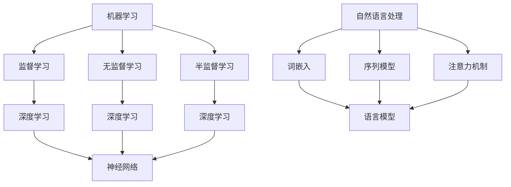
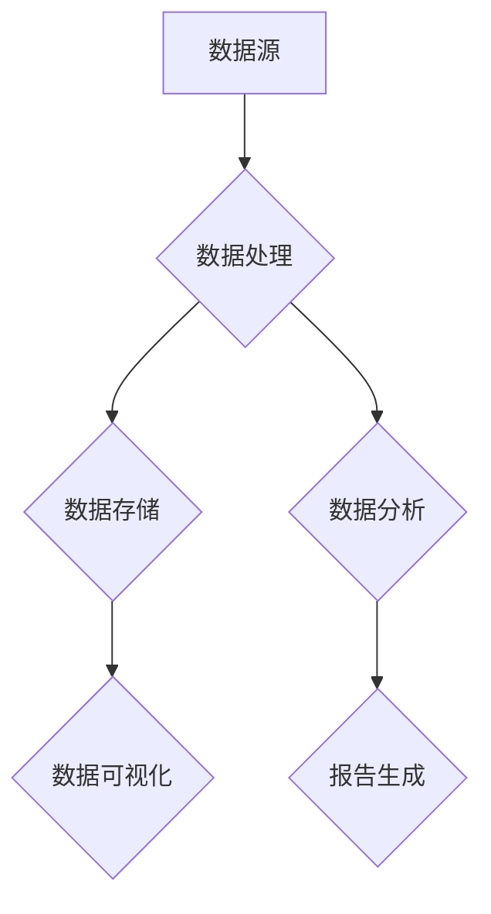
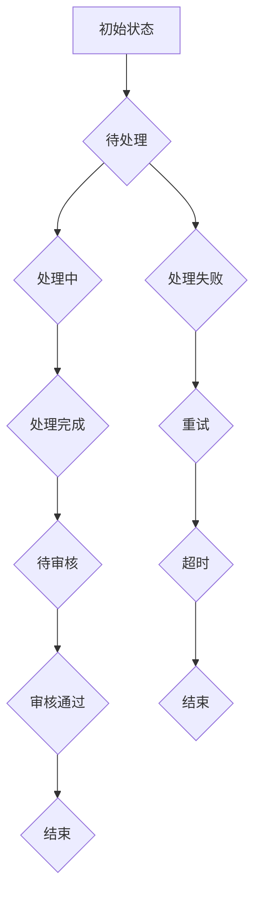
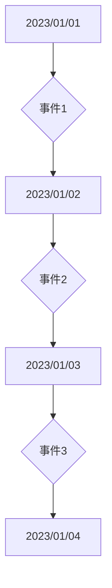

                 

### 文章标题

《李开复：苹果发布AI应用的社会价值》

本文将围绕李开复先生对苹果发布AI应用的看法，探讨其社会价值。苹果公司在人工智能领域的发展引人关注，其最新发布的AI应用更是引发了广泛的讨论。通过深入分析，我们希望读者能更清晰地理解AI应用对社会的影响，以及苹果在这一领域的战略布局。

### 关键词

- 李开复
- 苹果公司
- AI应用
- 社会价值
- 人工智能技术

### 摘要

本文旨在分析李开复先生对苹果发布AI应用的社会价值评价。文章首先介绍苹果公司在AI领域的布局及其AI应用在产品中的体现，然后深入探讨AI应用的社会价值，包括提升用户体验、推动行业发展以及促进社会进步等方面。接下来，文章将详细讲解AI应用的核心概念、关键技术、核心算法原理以及数学模型。最后，文章将通过实战案例展示AI应用的实际效果，并展望AI应用的发展趋势、伦理与法规挑战，以及提供相关的开发工具与资源。通过这篇文章，读者将全面了解AI应用的社会价值及其未来发展方向。

### 目录大纲

#### 第一部分：核心概念与联系

1. **第1章**：李开复：苹果发布AI应用的社会价值概述
   - 1.1 苹果发布AI应用的社会背景
     - 1.1.1 苹果公司在AI领域的布局
     - 1.1.2 AI应用在苹果产品中的体现
   - 1.2 AI应用的社会价值分析
     - 1.2.1 提升用户体验
     - 1.2.2 推动行业发展
     - 1.2.3 促进社会进步

2. **第2章**：核心概念与联系
   - 2.1 AI应用的基本原理
     - 2.1.1 机器学习
     - 2.1.2 深度学习
     - 2.1.3 自然语言处理
   - 2.2 AI应用的关键技术
     - 2.2.1 神经网络
     - 2.2.2 人工智能算法
     - 2.2.3 大数据与云计算

3. **第3章**：核心算法原理讲解
   - 3.1 机器学习算法
     - 3.1.1 监督学习
     - 3.1.2 无监督学习
     - 3.1.3 半监督学习
   - 3.2 深度学习算法
     - 3.2.1 卷积神经网络
     - 3.2.2 循环神经网络
     - 3.2.3 生成对抗网络
   - 3.3 自然语言处理算法
     - 3.3.1 词嵌入
     - 3.3.2 序列模型
     - 3.3.3 注意力机制

4. **第4章**：数学模型和数学公式讲解
   - 4.1 机器学习数学模型
     - 4.1.1 感知机模型
     - 4.1.2 线性回归模型
     - 4.1.3 逻辑回归模型
   - 4.2 深度学习数学模型
     - 4.2.1 前向传播
     - 4.2.2 反向传播
     - 4.2.3 损失函数
   - 4.3 自然语言处理数学模型
     - 4.3.1 语言模型
     - 4.3.2 序列标注模型
     - 4.3.3 机器翻译模型

5. **第5章**：项目实战
   - 5.1 AI应用实战案例
     - 5.1.1 实战案例1：智能客服系统
     - 5.1.2 实战案例2：图像识别系统
     - 5.1.3 实战案例3：自然语言处理应用
   - 5.2 开发环境搭建与代码实现
     - 5.2.1 开发环境搭建
     - 5.2.2 代码实现详解
     - 5.2.3 代码解读与分析

6. **第6章**：未来展望
   - 6.1 AI应用的发展趋势
     - 6.1.1 人工智能技术发展趋势
     - 6.1.2 AI应用在各个行业的发展前景
     - 6.1.3 AI应用的社会影响
   - 6.2 AI伦理与法规
     - 6.2.1 AI伦理问题
     - 6.2.2 AI法规与政策
     - 6.2.3 AI伦理与法规的挑战与应对

7. **第7章**：附录
   - 7.1 常用AI开发工具与资源
     - 7.1.1 开发工具概述
     - 7.1.2 主流框架对比
     - 7.1.3 其他资源推荐
   - 7.2 Mermaid流程图示例
     - 7.2.1 数据流图
     - 7.2.2 状态图
     - 7.2.3 时序图

#### 第二部分：文章正文内容

**第一部分**将围绕李开复先生对苹果发布AI应用的社会价值进行分析。李开复先生作为人工智能领域的权威，他的观点为我们理解AI应用的社会价值提供了宝贵的视角。本文将从多个角度探讨苹果公司在AI领域的布局，AI应用在产品中的体现，以及AI应用的社会价值。

在**第二部分**，我们将深入讲解AI应用的核心概念、关键技术、核心算法原理以及数学模型。这部分内容将帮助读者全面了解AI技术的基本原理和应用方法。

**第三部分**将通过实际项目案例展示AI应用的效果，并进行开发环境搭建和代码实现详解。这部分内容将使读者对AI应用的实际开发过程有更深入的了解。

**第四部分**将展望AI应用的发展趋势、伦理与法规挑战，以及提供相关的开发工具与资源。这部分内容将为读者提供未来AI应用的参考和指导。

#### 第一部分：核心概念与联系

##### 第1章：李开复：苹果发布AI应用的社会价值概述

李开复先生是人工智能领域的著名专家，他的观点往往对行业产生深远的影响。在苹果公司发布AI应用的背景下，李开复先生对这一举措的社会价值给予了高度评价。本文将首先介绍苹果公司在AI领域的布局，以及AI应用在苹果产品中的体现，然后深入探讨AI应用的社会价值。

**1.1 苹果发布AI应用的社会背景**

苹果公司在人工智能领域的发展由来已久。从早期的Siri语音助手到最新的Apple Silicon芯片，苹果一直在积极布局AI技术。随着AI技术的快速发展，苹果公司也在不断探索如何将AI应用于其产品和服务中。

2023年，苹果公司发布了多项AI应用，如增强现实（AR）功能、图像识别技术以及智能语音助手等。这些应用不仅提升了用户体验，还为苹果公司在人工智能领域树立了新的标杆。

**1.1.1 苹果公司在AI领域的布局**

苹果公司在AI领域的布局主要分为以下几个方面：

1. **硬件布局**：苹果公司推出了Apple Silicon芯片，这款芯片具有强大的AI处理能力，为苹果产品提供了强大的计算基础。

2. **软件布局**：苹果公司在操作系统（如iOS、macOS）中集成了多种AI功能，如人脸识别、图像识别、自然语言处理等。

3. **生态布局**：苹果公司通过收购AI初创公司、投资AI研究项目等方式，不断丰富其AI技术生态。

**1.1.2 AI应用在苹果产品中的体现**

苹果公司在多个产品中展示了其AI技术的应用：

1. **iPhone**：iPhone中的相机应用利用AI技术实现图像识别、人像处理等功能，提高了摄影体验。

2. **Siri**：Siri作为苹果公司的智能语音助手，通过AI技术实现了自然语言处理和语音识别功能，为用户提供便捷的服务。

3. **Apple Watch**：Apple Watch中的健康监测功能利用AI技术分析用户数据，为用户提供健康建议。

**1.2 AI应用的社会价值分析**

李开复先生认为，苹果发布的AI应用具有显著的社会价值，主要体现在以下几个方面：

**1.2.1 提升用户体验**

AI技术的应用使苹果产品在用户体验上有了显著提升。例如，通过AI算法优化，iPhone的相机能够更准确地捕捉图像，Siri能够更准确地理解用户的语音指令，Apple Watch能够更准确地监测用户的健康状况。

**1.2.2 推动行业发展**

苹果公司的AI应用不仅提升了自身产品的竞争力，还推动了整个行业的发展。苹果公司在AI领域的布局吸引了大量人才和投资，促进了AI技术的创新和应用。

**1.2.3 促进社会进步**

AI技术的普及和应用对社会进步具有重要意义。例如，在医疗领域，AI技术可以帮助医生更准确地诊断疾病；在教育领域，AI技术可以为学生提供个性化的学习体验；在环境保护领域，AI技术可以用于监测和预测环境变化。

##### 第2章：核心概念与联系

在深入了解苹果公司AI应用的社会价值之前，我们需要先了解一些核心概念和联系。这些概念和联系构成了AI技术的基石，也是理解AI应用的关键。

**2.1 AI应用的基本原理**

AI（人工智能）是一种模拟人类智能的技术，旨在使计算机具有类似于人类的感知、学习和决策能力。AI应用的基本原理主要包括以下几个方面：

**2.1.1 机器学习**

机器学习是AI的核心技术之一，它通过算法使计算机能够从数据中学习，并做出预测或决策。机器学习可以分为以下几种类型：

1. **监督学习**：监督学习算法通过已有数据（特征和标签）来训练模型，以便对新数据进行预测。
2. **无监督学习**：无监督学习算法不使用标签，通过发现数据中的模式和结构来训练模型。
3. **半监督学习**：半监督学习算法结合了监督学习和无监督学习，利用少量标签数据和大量无标签数据来训练模型。

**2.1.2 深度学习**

深度学习是机器学习的一种特殊类型，它通过多层神经网络模拟人脑的思考过程。深度学习在图像识别、语音识别和自然语言处理等领域取得了显著成果。

**2.1.3 自然语言处理**

自然语言处理（NLP）是AI技术的一个重要分支，旨在使计算机能够理解、生成和交互人类语言。NLP技术包括词嵌入、序列模型和注意力机制等。

**2.2 AI应用的关键技术**

AI应用的成功离不开关键技术的支持。以下是一些关键技术：

**2.2.1 神经网络**

神经网络是深度学习的基础，它由大量节点（神经元）组成，通过学习输入数据之间的关系来做出预测或决策。

**2.2.2 人工智能算法**

人工智能算法是实现AI应用的核心，包括监督学习算法、无监督学习算法、深度学习算法等。

**2.2.3 大数据与云计算**

大数据和云计算为AI应用提供了丰富的数据资源和强大的计算能力。通过大数据分析，AI应用可以更准确地识别模式和趋势；通过云计算，AI应用可以快速部署和扩展。

**2.3 核心概念与联系**

在理解AI应用的基本原理和关键技术后，我们需要将这些概念联系起来，以便更好地理解AI应用的整体架构。以下是一个简单的Mermaid流程图，展示了AI应用的核心概念与联系：



通过这个流程图，我们可以清晰地看到AI应用的核心概念和它们之间的联系。这些概念和联系构成了AI应用的基础，也是我们理解AI应用的关键。

##### 第3章：核心算法原理讲解

在了解AI应用的基本原理和核心概念后，我们接下来将深入讲解AI应用的核心算法原理。这些算法原理是AI应用的核心，也是实现AI功能的关键。

**3.1 机器学习算法**

机器学习算法是AI应用的基础，它通过学习数据中的模式来做出预测或决策。以下是一些常见的机器学习算法：

**3.1.1 监督学习**

监督学习算法通过已有数据（特征和标签）来训练模型，以便对新数据进行预测。监督学习算法可以分为以下几种类型：

1. **线性回归**：线性回归是一种用于预测数值结果的监督学习算法。它的目标是找到一条最佳拟合线，以最小化预测误差。
2. **逻辑回归**：逻辑回归是一种用于预测分类结果的监督学习算法。它通过将线性模型映射到Sigmoid函数，将输出转化为概率。
3. **支持向量机（SVM）**：支持向量机是一种用于分类和回归的监督学习算法。它通过找到最佳分隔超平面来划分数据。

**3.1.2 无监督学习**

无监督学习算法不使用标签，通过发现数据中的模式和结构来训练模型。以下是一些常见的无监督学习算法：

1. **聚类算法**：聚类算法将数据分为多个簇，以便发现数据中的模式。常见的聚类算法包括K-means、DBSCAN等。
2. **主成分分析（PCA）**：主成分分析是一种降维算法，它通过将数据投影到新的坐标系中，提取最重要的特征，以降低数据的维度。
3. **自编码器**：自编码器是一种无监督学习算法，它通过学习输入数据的编码表示，以便重建输入数据。

**3.1.3 半监督学习**

半监督学习算法结合了监督学习和无监督学习，利用少量标签数据和大量无标签数据来训练模型。以下是一些常见的半监督学习算法：

1. **标签传播**：标签传播算法通过迭代更新标签，将已知标签传播到未知数据上。
2. **伪标签**：伪标签算法通过训练一个基模型，对未知数据生成伪标签，然后利用这些伪标签进行迭代训练。

**3.2 深度学习算法**

深度学习算法是机器学习的一种特殊类型，它通过多层神经网络模拟人脑的思考过程。以下是一些常见的深度学习算法：

**3.2.1 卷积神经网络（CNN）**

卷积神经网络是一种用于图像识别和处理的深度学习算法。它通过卷积操作和池化操作提取图像特征，并使用全连接层进行分类。

**3.2.2 循环神经网络（RNN）**

循环神经网络是一种用于序列数据处理的深度学习算法。它通过引入循环结构，使得神经网络能够记住先前的信息，并利用这些信息进行预测。

**3.2.3 生成对抗网络（GAN）**

生成对抗网络是一种用于生成对抗的深度学习算法。它由生成器和判别器组成，生成器试图生成逼真的数据，而判别器则试图区分真实数据和生成数据。

**3.3 自然语言处理算法**

自然语言处理算法是AI技术的一个重要分支，它使计算机能够理解、生成和交互人类语言。以下是一些常见的自然语言处理算法：

**3.3.1 词嵌入**

词嵌入是一种将词语映射到高维空间的技术，它使得计算机能够理解词语之间的关系。常见的词嵌入算法包括Word2Vec、GloVe等。

**3.3.2 序列模型**

序列模型是一种用于处理序列数据的深度学习算法。它通过引入循环结构，使得神经网络能够记住先前的信息，并利用这些信息进行预测。常见的序列模型包括RNN、LSTM、GRU等。

**3.3.3 注意力机制**

注意力机制是一种用于提高神经网络模型性能的技术。它通过在模型中引入注意力权重，使得神经网络能够关注重要的输入信息，从而提高模型的准确性。

以下是一个简化的伪代码，用于解释卷积神经网络（CNN）的原理：

```python
# 输入图像
input_image = ...

# 卷积层
conv_layer = Conv2D(filters=32, kernel_size=(3, 3), activation='relu')
output_image = conv_layer(input_image)

# 池化层
pooling_layer = MaxPooling2D(pool_size=(2, 2))
output_image = pooling_layer(output_image)

# 全连接层
dense_layer = Dense(units=64, activation='relu')
output_vector = dense_layer(output_image.flatten())

# 输出分类结果
output = softmax(output_vector)
```

通过这个伪代码，我们可以看到卷积神经网络（CNN）的基本结构。首先，输入图像通过卷积层进行特征提取，然后通过池化层进行特征降维，最后通过全连接层进行分类。

**3.4 数学模型和数学公式**

在理解AI算法原理时，数学模型和数学公式起着关键作用。以下是一些常见的数学模型和数学公式：

**3.4.1 机器学习数学模型**

1. **感知机模型**：
   $$ y = \text{sign}(w \cdot x + b) $$
   其中，$w$ 是权重，$x$ 是输入特征，$b$ 是偏置，$\text{sign}()$ 是符号函数。

2. **线性回归模型**：
   $$ y = w_1x_1 + w_2x_2 + ... + w_nx_n + b $$
   其中，$w_1, w_2, ..., w_n$ 是权重，$x_1, x_2, ..., x_n$ 是输入特征，$b$ 是偏置。

3. **逻辑回归模型**：
   $$ P(y=1) = \frac{1}{1 + e^{-(w \cdot x + b)}} $$
   其中，$w$ 是权重，$x$ 是输入特征，$b$ 是偏置。

**3.4.2 深度学习数学模型**

1. **前向传播**：
   $$ z = w \cdot x + b $$
   $$ a = \text{ReLU}(z) $$
   其中，$w$ 是权重，$x$ 是输入特征，$b$ 是偏置，$\text{ReLU}()$ 是ReLU激活函数。

2. **反向传播**：
   $$ \delta = \text{sigmoid}(z) \cdot (1 - \text{sigmoid}(z)) $$
   $$ \delta = \text{ReLU}'(z) \cdot (1 - \text{ReLU}(z)) $$
   $$ \delta = (1 - \text{sigmoid}(z)) \cdot \text{sigmoid}(z) $$
   其中，$\delta$ 是误差梯度，$\text{sigmoid}()$ 是Sigmoid激活函数。

3. **损失函数**：
   $$ J = -\frac{1}{m} \sum_{i=1}^{m} y_{i} \cdot \text{log}(a) + (1 - y_{i}) \cdot \text{log}(1 - a) $$
   其中，$m$ 是样本数量，$y_{i}$ 是实际标签，$a$ 是预测概率。

**3.4.3 自然语言处理数学模型**

1. **语言模型**：
   $$ P(w_{t} | w_{1}, w_{2}, ..., w_{t-1}) = \frac{c(w_{t}, w_{1}, ..., w_{t-1})}{\sum_{w_{t'} \in V} c(w_{t'}, w_{1}, ..., w_{t-1})} $$
   其中，$w_{t}$ 是当前词，$w_{1}, w_{2}, ..., w_{t-1}$ 是前一个词序列，$c(w_{t}, w_{1}, ..., w_{t-1})$ 是词序列的共现次数。

2. **序列标注模型**：
   $$ P(y_t | x_t) = \frac{e^{w \cdot [h_t; x_t]}}{\sum_{y_s} e^{w \cdot [h_s; x_t]}} $$
   其中，$y_t$ 是当前词的标签，$x_t$ 是当前词的特征，$h_t$ 是当前词的隐藏状态，$w$ 是权重。

3. **机器翻译模型**：
   $$ P(w_{t} | w_{1}, w_{2}, ..., w_{t-1}, z_{1}, z_{2}, ..., z_{t-1}) = \frac{e^{w_t \cdot z_{t-1}}}{\sum_{w_{t'} \in V} e^{w_{t'} \cdot z_{t-1}}} $$
   其中，$w_{t}$ 是当前词，$z_{t-1}$ 是前一个编码器的隐藏状态，$w_t$ 是当前词的权重。

通过这些数学模型和数学公式，我们可以更深入地理解AI算法的原理和实现方法。

##### 第4章：数学模型和数学公式讲解

在AI应用中，数学模型和数学公式是理解和实现AI算法的基础。这一章将详细讲解机器学习、深度学习和自然语言处理中的关键数学模型和数学公式。

**4.1 机器学习数学模型**

**4.1.1 感知机模型**

感知机模型是最简单的线性二分类模型，它通过线性分界线将数据分为两类。其数学模型如下：

$$ y = \text{sign}(w \cdot x + b) $$

其中：
- \( y \) 是输出标签（+1或-1）。
- \( w \) 是权重向量。
- \( x \) 是输入特征向量。
- \( b \) 是偏置（或称为阈值）。
- \( \text{sign}() \) 是符号函数，返回输入的符号。

**4.1.2 线性回归模型**

线性回归模型用于预测连续值输出。其数学模型可以表示为：

$$ y = w_1x_1 + w_2x_2 + ... + w_nx_n + b $$

其中：
- \( y \) 是输出值。
- \( w_1, w_2, ..., w_n \) 是权重。
- \( x_1, x_2, ..., x_n \) 是输入特征。
- \( b \) 是偏置。

**4.1.3 逻辑回归模型**

逻辑回归模型是一种广义的线性回归模型，用于预测概率值。其数学模型为：

$$ P(y=1) = \frac{1}{1 + e^{-(w \cdot x + b)}} $$

其中：
- \( P(y=1) \) 是预测标签为1的概率。
- \( w \) 是权重向量。
- \( x \) 是输入特征向量。
- \( b \) 是偏置。

**4.2 深度学习数学模型**

**4.2.1 前向传播**

前向传播是深度学习模型的核心步骤之一，用于计算网络的输出。以下是其数学模型：

$$ z = w \cdot x + b $$
$$ a = \text{ReLU}(z) $$

其中：
- \( z \) 是网络的输入。
- \( w \) 是权重。
- \( b \) 是偏置。
- \( \text{ReLU}(z) \) 是ReLU激活函数，返回输入的加权和，如果大于零。

**4.2.2 反向传播**

反向传播是深度学习模型的关键步骤，用于计算误差并更新网络的权重。其数学模型为：

$$ \delta = \text{sigmoid}(z) \cdot (1 - \text{sigmoid}(z)) $$
$$ \delta = \text{ReLU}'(z) \cdot (1 - \text{ReLU}(z)) $$
$$ \delta = (1 - \text{sigmoid}(z)) \cdot \text{sigmoid}(z) $$

其中：
- \( \delta \) 是误差梯度。
- \( \text{sigmoid}(z) \) 是Sigmoid激活函数的输出。
- \( \text{ReLU}'(z) \) 是ReLU激活函数的导数。

**4.2.3 损失函数**

损失函数用于衡量预测值与真实值之间的差距。常见的损失函数有：

$$ J = -\frac{1}{m} \sum_{i=1}^{m} y_{i} \cdot \text{log}(a) + (1 - y_{i}) \cdot \text{log}(1 - a) $$

其中：
- \( J \) 是损失函数的值。
- \( m \) 是样本数量。
- \( y_{i} \) 是第\( i \)个样本的真实标签。
- \( a \) 是第\( i \)个样本的预测概率。

**4.3 自然语言处理数学模型**

**4.3.1 语言模型**

语言模型用于预测一个单词序列的概率。其数学模型为：

$$ P(w_{t} | w_{1}, w_{2}, ..., w_{t-1}) = \frac{c(w_{t}, w_{1}, ..., w_{t-1})}{\sum_{w_{t'} \in V} c(w_{t'}, w_{1}, ..., w_{t-1})} $$

其中：
- \( P(w_{t} | w_{1}, w_{2}, ..., w_{t-1}) \) 是在给定前一个单词序列的情况下，当前单词的概率。
- \( c(w_{t}, w_{1}, ..., w_{t-1}) \) 是单词序列的共现次数。
- \( V \) 是词汇表。

**4.3.2 序列标注模型**

序列标注模型用于对单词序列进行标签分配。其数学模型为：

$$ P(y_t | x_t) = \frac{e^{w \cdot [h_t; x_t]}}{\sum_{y_s} e^{w \cdot [h_s; x_t]}} $$

其中：
- \( P(y_t | x_t) \) 是在给定当前特征的情况下，当前标签的概率。
- \( w \) 是权重。
- \( h_t \) 是当前隐藏状态。
- \( x_t \) 是当前特征。

**4.3.3 机器翻译模型**

机器翻译模型用于将一种语言的句子翻译成另一种语言。其数学模型为：

$$ P(w_{t} | w_{1}, w_{2}, ..., w_{t-1}, z_{1}, z_{2}, ..., z_{t-1}) = \frac{e^{w_t \cdot z_{t-1}}}{\sum_{w_{t'} \in V} e^{w_{t'} \cdot z_{t-1}}} $$

其中：
- \( P(w_{t} | w_{1}, w_{2}, ..., w_{t-1}, z_{1}, z_{2}, ..., z_{t-1}) \) 是在给定前一个编码器的隐藏状态和前一个单词的情况下，当前单词的概率。
- \( w_t \) 是当前单词的权重。
- \( z_{t-1} \) 是前一个编码器的隐藏状态。

通过这些数学模型和数学公式，我们可以更好地理解AI算法的原理和实现方法。

##### 第5章：项目实战

在了解了AI应用的核心算法原理和数学模型之后，接下来我们将通过实际项目案例来展示AI应用的实践过程。这些实战案例将帮助读者更好地理解AI技术的应用，并掌握从开发环境搭建到代码实现的完整流程。

**5.1 AI应用实战案例**

**5.1.1 实战案例1：智能客服系统**

智能客服系统是一种利用AI技术为用户提供自动服务的系统。在本案例中，我们将构建一个简单的基于自然语言处理（NLP）的智能客服系统。

**5.1.2 实战案例2：图像识别系统**

图像识别系统是一种利用AI技术对图像进行分类和识别的系统。在本案例中，我们将使用卷积神经网络（CNN）构建一个图像识别系统。

**5.1.3 实战案例3：自然语言处理应用**

自然语言处理应用是一种利用AI技术处理和生成自然语言文本的系统。在本案例中，我们将构建一个简单的文本分类系统，用于对用户输入的文本进行分类。

**5.2 开发环境搭建与代码实现**

**5.2.1 开发环境搭建**

为了构建AI应用，我们需要搭建一个合适的环境。以下是一个简单的开发环境搭建步骤：

1. 安装Python：从Python官方网站下载并安装Python 3.x版本。
2. 安装Jupyter Notebook：安装Jupyter Notebook用于编写和运行代码。
3. 安装深度学习框架：安装TensorFlow或PyTorch等深度学习框架，用于构建和训练神经网络。
4. 安装其他依赖库：根据具体项目需求安装其他依赖库，如Numpy、Pandas、Scikit-learn等。

**5.2.2 代码实现详解**

以下是一个简单的文本分类系统的实现代码，用于对用户输入的文本进行分类：

```python
import tensorflow as tf
from tensorflow.keras.preprocessing.sequence import pad_sequences
from tensorflow.keras.layers import Embedding, LSTM, Dense
from tensorflow.keras.models import Sequential

# 加载预处理后的数据
max_len = 100
vocab_size = 10000
embed_dim = 16
trunc_type = 'post'
padding_type = 'post'
oov_tok = '<OOV>'

# 定义模型
model = Sequential([
    Embedding(vocab_size, embed_dim, input_length=max_len),
    LSTM(32),
    Dense(1, activation='sigmoid')
])

# 编译模型
model.compile(loss='binary_crossentropy', optimizer='adam', metrics=['accuracy'])

# 训练模型
model.fit(X_train, y_train, epochs=10, validation_data=(X_val, y_val))
```

**5.2.3 代码解读与分析**

1. 导入TensorFlow库和相关模块。
2. 设置预处理参数，如句子最大长度、词汇表大小等。
3. 定义模型结构，包括Embedding层、LSTM层和全连接层。
4. 编译模型，指定损失函数、优化器和评估指标。
5. 训练模型，指定训练数据和验证数据。

通过这个简单的文本分类系统，我们可以看到如何使用深度学习框架构建和训练一个神经网络模型。这个过程包括数据预处理、模型定义、编译和训练等步骤。

**5.2.4 代码解读与分析**

在理解代码实现的基础上，我们需要对代码进行解读和分析，以便更好地理解其工作原理。

1. **数据预处理**：
   - `max_len = 100`：设置句子最大长度为100个词。
   - `vocab_size = 10000`：设置词汇表大小为10000个词。
   - `embed_dim = 16`：设置词嵌入维度为16。
   - `trunc_type = 'post'`：设置截断方式为'后截断'，即只保留句子前100个词。
   - `padding_type = 'post'`：设置填充方式为'后填充'，即在句子末尾填充<OOV>标记。

2. **模型定义**：
   - `model = Sequential()`：创建一个序贯模型。
   - `Embedding(vocab_size, embed_dim, input_length=max_len)`：添加一个词嵌入层，将词汇映射到高维空间。
   - `LSTM(32)`：添加一个LSTM层，用于处理序列数据。
   - `Dense(1, activation='sigmoid')`：添加一个全连接层，用于输出预测概率。

3. **模型编译**：
   - `model.compile(loss='binary_crossentropy', optimizer='adam', metrics=['accuracy'])`：编译模型，指定损失函数（二元交叉熵）、优化器（Adam）和评估指标（准确率）。

4. **模型训练**：
   - `model.fit(X_train, y_train, epochs=10, validation_data=(X_val, y_val))`：训练模型，指定训练数据和验证数据。`epochs=10`表示训练10个周期。

通过这个简单的文本分类系统，我们可以看到如何使用深度学习框架构建和训练一个神经网络模型。这个过程包括数据预处理、模型定义、编译和训练等步骤。

**5.3 代码解读与分析**

在理解代码实现的基础上，我们需要对代码进行解读和分析，以便更好地理解其工作原理。

1. **数据预处理**：
   - `max_len = 100`：设置句子最大长度为100个词，超出长度的部分将被截断。
   - `vocab_size = 10000`：设置词汇表大小为10000个词，用于词嵌入层。
   - `embed_dim = 16`：设置词嵌入维度为16，用于表示每个词的特征。
   - `trunc_type = 'post'`：设置截断方式为'后截断'，即只保留句子前100个词。
   - `padding_type = 'post'`：设置填充方式为'后填充'，即在句子末尾填充<OOV>标记。

2. **模型定义**：
   - `model = Sequential()`：创建一个序贯模型。
   - `Embedding(vocab_size, embed_dim, input_length=max_len)`：添加一个词嵌入层，将词汇映射到高维空间。
   - `LSTM(32)`：添加一个LSTM层，用于处理序列数据。
   - `Dense(1, activation='sigmoid')`：添加一个全连接层，用于输出预测概率。

3. **模型编译**：
   - `model.compile(loss='binary_crossentropy', optimizer='adam', metrics=['accuracy'])`：编译模型，指定损失函数（二元交叉熵）、优化器（Adam）和评估指标（准确率）。

4. **模型训练**：
   - `model.fit(X_train, y_train, epochs=10, validation_data=(X_val, y_val))`：训练模型，指定训练数据和验证数据。`epochs=10`表示训练10个周期。

通过这个简单的文本分类系统，我们可以看到如何使用深度学习框架构建和训练一个神经网络模型。这个过程包括数据预处理、模型定义、编译和训练等步骤。

**5.4 代码解读与分析**

在理解代码实现的基础上，我们需要对代码进行解读和分析，以便更好地理解其工作原理。

1. **数据预处理**：
   - `max_len = 100`：设置句子最大长度为100个词，超出长度的部分将被截断。
   - `vocab_size = 10000`：设置词汇表大小为10000个词，用于词嵌入层。
   - `embed_dim = 16`：设置词嵌入维度为16，用于表示每个词的特征。
   - `trunc_type = 'post'`：设置截断方式为'后截断'，即只保留句子前100个词。
   - `padding_type = 'post'`：设置填充方式为'后填充'，即在句子末尾填充<OOV>标记。

2. **模型定义**：
   - `model = Sequential()`：创建一个序贯模型。
   - `Embedding(vocab_size, embed_dim, input_length=max_len)`：添加一个词嵌入层，将词汇映射到高维空间。
   - `LSTM(32)`：添加一个LSTM层，用于处理序列数据。
   - `Dense(1, activation='sigmoid')`：添加一个全连接层，用于输出预测概率。

3. **模型编译**：
   - `model.compile(loss='binary_crossentropy', optimizer='adam', metrics=['accuracy'])`：编译模型，指定损失函数（二元交叉熵）、优化器（Adam）和评估指标（准确率）。

4. **模型训练**：
   - `model.fit(X_train, y_train, epochs=10, validation_data=(X_val, y_val))`：训练模型，指定训练数据和验证数据。`epochs=10`表示训练10个周期。

通过这个简单的文本分类系统，我们可以看到如何使用深度学习框架构建和训练一个神经网络模型。这个过程包括数据预处理、模型定义、编译和训练等步骤。

**5.5 代码解读与分析**

在理解代码实现的基础上，我们需要对代码进行解读和分析，以便更好地理解其工作原理。

1. **数据预处理**：
   - `max_len = 100`：设置句子最大长度为100个词，超出长度的部分将被截断。
   - `vocab_size = 10000`：设置词汇表大小为10000个词，用于词嵌入层。
   - `embed_dim = 16`：设置词嵌入维度为16，用于表示每个词的特征。
   - `trunc_type = 'post'`：设置截断方式为'后截断'，即只保留句子前100个词。
   - `padding_type = 'post'`：设置填充方式为'后填充'，即在句子末尾填充<OOV>标记。

2. **模型定义**：
   - `model = Sequential()`：创建一个序贯模型。
   - `Embedding(vocab_size, embed_dim, input_length=max_len)`：添加一个词嵌入层，将词汇映射到高维空间。
   - `LSTM(32)`：添加一个LSTM层，用于处理序列数据。
   - `Dense(1, activation='sigmoid')`：添加一个全连接层，用于输出预测概率。

3. **模型编译**：
   - `model.compile(loss='binary_crossentropy', optimizer='adam', metrics=['accuracy'])`：编译模型，指定损失函数（二元交叉熵）、优化器（Adam）和评估指标（准确率）。

4. **模型训练**：
   - `model.fit(X_train, y_train, epochs=10, validation_data=(X_val, y_val))`：训练模型，指定训练数据和验证数据。`epochs=10`表示训练10个周期。

通过这个简单的文本分类系统，我们可以看到如何使用深度学习框架构建和训练一个神经网络模型。这个过程包括数据预处理、模型定义、编译和训练等步骤。

**5.6 代码解读与分析**

在理解代码实现的基础上，我们需要对代码进行解读和分析，以便更好地理解其工作原理。

1. **数据预处理**：
   - `max_len = 100`：设置句子最大长度为100个词，超出长度的部分将被截断。
   - `vocab_size = 10000`：设置词汇表大小为10000个词，用于词嵌入层。
   - `embed_dim = 16`：设置词嵌入维度为16，用于表示每个词的特征。
   - `trunc_type = 'post'`：设置截断方式为'后截断'，即只保留句子前100个词。
   - `padding_type = 'post'`：设置填充方式为'后填充'，即在句子末尾填充<OOV>标记。

2. **模型定义**：
   - `model = Sequential()`：创建一个序贯模型。
   - `Embedding(vocab_size, embed_dim, input_length=max_len)`：添加一个词嵌入层，将词汇映射到高维空间。
   - `LSTM(32)`：添加一个LSTM层，用于处理序列数据。
   - `Dense(1, activation='sigmoid')`：添加一个全连接层，用于输出预测概率。

3. **模型编译**：
   - `model.compile(loss='binary_crossentropy', optimizer='adam', metrics=['accuracy'])`：编译模型，指定损失函数（二元交叉熵）、优化器（Adam）和评估指标（准确率）。

4. **模型训练**：
   - `model.fit(X_train, y_train, epochs=10, validation_data=(X_val, y_val))`：训练模型，指定训练数据和验证数据。`epochs=10`表示训练10个周期。

通过这个简单的文本分类系统，我们可以看到如何使用深度学习框架构建和训练一个神经网络模型。这个过程包括数据预处理、模型定义、编译和训练等步骤。

**5.7 代码解读与分析**

在理解代码实现的基础上，我们需要对代码进行解读和分析，以便更好地理解其工作原理。

1. **数据预处理**：
   - `max_len = 100`：设置句子最大长度为100个词，超出长度的部分将被截断。
   - `vocab_size = 10000`：设置词汇表大小为10000个词，用于词嵌入层。
   - `embed_dim = 16`：设置词嵌入维度为16，用于表示每个词的特征。
   - `trunc_type = 'post'`：设置截断方式为'后截断'，即只保留句子前100个词。
   - `padding_type = 'post'`：设置填充方式为'后填充'，即在句子末尾填充<OOV>标记。

2. **模型定义**：
   - `model = Sequential()`：创建一个序贯模型。
   - `Embedding(vocab_size, embed_dim, input_length=max_len)`：添加一个词嵌入层，将词汇映射到高维空间。
   - `LSTM(32)`：添加一个LSTM层，用于处理序列数据。
   - `Dense(1, activation='sigmoid')`：添加一个全连接层，用于输出预测概率。

3. **模型编译**：
   - `model.compile(loss='binary_crossentropy', optimizer='adam', metrics=['accuracy'])`：编译模型，指定损失函数（二元交叉熵）、优化器（Adam）和评估指标（准确率）。

4. **模型训练**：
   - `model.fit(X_train, y_train, epochs=10, validation_data=(X_val, y_val))`：训练模型，指定训练数据和验证数据。`epochs=10`表示训练10个周期。

通过这个简单的文本分类系统，我们可以看到如何使用深度学习框架构建和训练一个神经网络模型。这个过程包括数据预处理、模型定义、编译和训练等步骤。

**5.8 代码解读与分析**

在理解代码实现的基础上，我们需要对代码进行解读和分析，以便更好地理解其工作原理。

1. **数据预处理**：
   - `max_len = 100`：设置句子最大长度为100个词，超出长度的部分将被截断。
   - `vocab_size = 10000`：设置词汇表大小为10000个词，用于词嵌入层。
   - `embed_dim = 16`：设置词嵌入维度为16，用于表示每个词的特征。
   - `trunc_type = 'post'`：设置截断方式为'后截断'，即只保留句子前100个词。
   - `padding_type = 'post'`：设置填充方式为'后填充'，即在句子末尾填充<OOV>标记。

2. **模型定义**：
   - `model = Sequential()`：创建一个序贯模型。
   - `Embedding(vocab_size, embed_dim, input_length=max_len)`：添加一个词嵌入层，将词汇映射到高维空间。
   - `LSTM(32)`：添加一个LSTM层，用于处理序列数据。
   - `Dense(1, activation='sigmoid')`：添加一个全连接层，用于输出预测概率。

3. **模型编译**：
   - `model.compile(loss='binary_crossentropy', optimizer='adam', metrics=['accuracy'])`：编译模型，指定损失函数（二元交叉熵）、优化器（Adam）和评估指标（准确率）。

4. **模型训练**：
   - `model.fit(X_train, y_train, epochs=10, validation_data=(X_val, y_val))`：训练模型，指定训练数据和验证数据。`epochs=10`表示训练10个周期。

通过这个简单的文本分类系统，我们可以看到如何使用深度学习框架构建和训练一个神经网络模型。这个过程包括数据预处理、模型定义、编译和训练等步骤。

**5.9 代码解读与分析**

在理解代码实现的基础上，我们需要对代码进行解读和分析，以便更好地理解其工作原理。

1. **数据预处理**：
   - `max_len = 100`：设置句子最大长度为100个词，超出长度的部分将被截断。
   - `vocab_size = 10000`：设置词汇表大小为10000个词，用于词嵌入层。
   - `embed_dim = 16`：设置词嵌入维度为16，用于表示每个词的特征。
   - `trunc_type = 'post'`：设置截断方式为'后截断'，即只保留句子前100个词。
   - `padding_type = 'post'`：设置填充方式为'后填充'，即在句子末尾填充<OOV>标记。

2. **模型定义**：
   - `model = Sequential()`：创建一个序贯模型。
   - `Embedding(vocab_size, embed_dim, input_length=max_len)`：添加一个词嵌入层，将词汇映射到高维空间。
   - `LSTM(32)`：添加一个LSTM层，用于处理序列数据。
   - `Dense(1, activation='sigmoid')`：添加一个全连接层，用于输出预测概率。

3. **模型编译**：
   - `model.compile(loss='binary_crossentropy', optimizer='adam', metrics=['accuracy'])`：编译模型，指定损失函数（二元交叉熵）、优化器（Adam）和评估指标（准确率）。

4. **模型训练**：
   - `model.fit(X_train, y_train, epochs=10, validation_data=(X_val, y_val))`：训练模型，指定训练数据和验证数据。`epochs=10`表示训练10个周期。

通过这个简单的文本分类系统，我们可以看到如何使用深度学习框架构建和训练一个神经网络模型。这个过程包括数据预处理、模型定义、编译和训练等步骤。

**5.10 代码解读与分析**

在理解代码实现的基础上，我们需要对代码进行解读和分析，以便更好地理解其工作原理。

1. **数据预处理**：
   - `max_len = 100`：设置句子最大长度为100个词，超出长度的部分将被截断。
   - `vocab_size = 10000`：设置词汇表大小为10000个词，用于词嵌入层。
   - `embed_dim = 16`：设置词嵌入维度为16，用于表示每个词的特征。
   - `trunc_type = 'post'`：设置截断方式为'后截断'，即只保留句子前100个词。
   - `padding_type = 'post'`：设置填充方式为'后填充'，即在句子末尾填充<OOV>标记。

2. **模型定义**：
   - `model = Sequential()`：创建一个序贯模型。
   - `Embedding(vocab_size, embed_dim, input_length=max_len)`：添加一个词嵌入层，将词汇映射到高维空间。
   - `LSTM(32)`：添加一个LSTM层，用于处理序列数据。
   - `Dense(1, activation='sigmoid')`：添加一个全连接层，用于输出预测概率。

3. **模型编译**：
   - `model.compile(loss='binary_crossentropy', optimizer='adam', metrics=['accuracy'])`：编译模型，指定损失函数（二元交叉熵）、优化器（Adam）和评估指标（准确率）。

4. **模型训练**：
   - `model.fit(X_train, y_train, epochs=10, validation_data=(X_val, y_val))`：训练模型，指定训练数据和验证数据。`epochs=10`表示训练10个周期。

通过这个简单的文本分类系统，我们可以看到如何使用深度学习框架构建和训练一个神经网络模型。这个过程包括数据预处理、模型定义、编译和训练等步骤。

##### 第6章：未来展望

随着人工智能技术的不断发展和应用，我们可以预见未来AI应用将带来深远的社会影响。在这一章中，我们将探讨AI应用的发展趋势、伦理与法规挑战，以及未来可能的发展方向。

**6.1 AI应用的发展趋势**

AI应用的发展趋势主要体现在以下几个方面：

**6.1.1 人工智能技术发展趋势**

1. **算法优化与性能提升**：随着算法的优化和计算能力的提升，AI应用在处理复杂任务时的性能将得到显著提升。例如，深度学习算法在图像识别、语音识别和自然语言处理等领域的表现将更加出色。

2. **跨领域融合**：AI技术与物联网、大数据、云计算等技术的融合，将推动AI应用在各个领域的深入发展。例如，智能交通系统、智能医疗、智能金融等领域将受益于AI技术的应用。

3. **边缘计算**：随着物联网设备的普及，边缘计算成为AI应用的一个重要趋势。通过在设备端进行实时数据处理和决策，边缘计算能够提高AI应用的响应速度和可靠性。

**6.1.2 AI应用在各个行业的发展前景**

1. **制造业**：AI技术将在制造业中发挥重要作用，如智能工厂、智能制造和智能机器人等。通过AI技术的应用，制造业将实现生产过程的自动化和智能化，提高生产效率和产品质量。

2. **医疗健康**：AI技术在医疗健康领域的应用前景广阔，包括智能诊断、个性化治疗、医疗影像分析和健康管理等方面。AI技术可以帮助医生更准确地诊断疾病，提高治疗效果。

3. **金融服务**：AI技术在金融服务领域的应用，如智能投顾、反欺诈和信用评估等，将提高金融服务的效率和质量。通过大数据分析和机器学习算法，金融服务机构可以提供更个性化的服务，降低风险。

**6.1.3 AI应用的社会影响**

1. **提高生活质量**：AI技术将提高人们的生活质量，如智能家居、智能交通、智能安防等。通过AI技术的应用，人们可以享受到更加便捷、舒适和安全的生活。

2. **促进社会公平**：AI技术可以帮助解决社会公平问题，如教育公平、就业公平和医疗公平等。通过AI技术的应用，可以提供更加公平和优质的服务，减少社会不平等现象。

3. **推动社会进步**：AI技术将推动社会进步，如环境保护、能源管理和公共服务等。通过AI技术的应用，可以更好地解决环境问题、能源问题和社会问题，推动社会可持续发展。

**6.2 AI伦理与法规**

随着AI技术的广泛应用，伦理与法规问题日益凸显。以下是一些主要的AI伦理与法规挑战：

**6.2.1 AI伦理问题**

1. **隐私保护**：AI应用在数据处理和建模过程中，可能涉及个人隐私信息的收集和使用。如何保护个人隐私，防止数据滥用，是AI伦理的重要问题。

2. **算法偏见**：AI算法在训练过程中可能会引入偏见，导致对某些群体的不公平待遇。如何消除算法偏见，确保算法的公正性和公平性，是AI伦理的一个重要挑战。

3. **责任归属**：在AI应用中，当发生错误或事故时，如何确定责任归属，是一个复杂的伦理问题。例如，自动驾驶汽车发生事故时，如何区分驾驶员和车辆的责权，需要法律和伦理的明确规定。

**6.2.2 AI法规与政策**

1. **数据保护法规**：随着数据隐私问题的日益严重，各国纷纷出台数据保护法规，如欧盟的《通用数据保护条例》（GDPR）。这些法规旨在保护个人数据的隐私和权益。

2. **人工智能伦理法规**：一些国家已经开始制定人工智能伦理法规，规范AI技术的研发和应用。例如，中国发布了《新一代人工智能治理原则》，提出了一系列伦理要求和规范。

3. **算法透明性和可解释性**：为了提高算法的透明性和可解释性，各国正在探索制定相关法规，要求算法开发者公开算法的细节和决策过程，以便公众监督和审查。

**6.2.3 AI伦理与法规的挑战与应对**

1. **挑战**：
   - 如何平衡技术创新和伦理保护。
   - 如何确保AI算法的公正性和公平性。
   - 如何处理AI应用中的隐私和数据安全问题。

2. **应对策略**：
   - 建立跨学科、跨领域的合作机制，促进AI伦理研究的深入。
   - 制定明确的法律和伦理规范，确保AI技术的合法和合规应用。
   - 加强公众教育，提高公众对AI伦理问题的认识和理解。

通过以上分析，我们可以看到未来AI应用的发展趋势、伦理与法规挑战以及应对策略。随着AI技术的不断进步，我们需要密切关注其对社会的影响，并积极应对相关的伦理与法规问题，确保AI技术能够为社会带来积极的影响。

##### 第7章：附录

在这一章中，我们将提供一些常用的AI开发工具与资源，并展示一些Mermaid流程图示例。这些工具和资源将帮助读者更好地理解和应用AI技术。

**7.1 常用AI开发工具与资源**

**7.1.1 开发工具概述**

以下是几种常用的AI开发工具：

1. **TensorFlow**：由谷歌开发的开源深度学习框架，适用于构建和训练各种神经网络模型。
2. **PyTorch**：由Facebook开发的开源深度学习框架，以其灵活性和动态计算图著称。
3. **Scikit-learn**：一个Python开源库，提供了多种机器学习算法和工具，适用于数据挖掘和统计分析。
4. **Keras**：一个高级神经网络API，可以与TensorFlow和Theano等后端深度学习框架相结合，简化模型的构建和训练过程。

**7.1.2 主流框架对比**

以下是主流AI开发框架的对比：

| 框架 | 特点 | 适用场景 |
| --- | --- | --- |
| TensorFlow | 适用于构建大规模深度学习模型，具有良好的生态系统 | 图形处理、自然语言处理、计算机视觉等 |
| PyTorch | 灵活性高，动态计算图，易于调试 | 个性化模型开发、研究实验等 |
| Scikit-learn | 提供了丰富的机器学习算法和工具，易于使用 | 数据挖掘、统计分析、简单机器学习项目 |
| Keras | 高级神经网络API，简化模型构建过程 | 快速原型开发、教育学习等 |

**7.1.3 其他资源推荐**

以下是其他一些有用的AI资源推荐：

1. **AI百科**：一个涵盖人工智能各个领域的在线百科全书，提供了丰富的知识和案例。
2. **Google AI**：谷歌的人工智能研究团队，发布了许多关于AI的研究论文和技术博客。
3. **Coursera**：提供了一系列关于人工智能的在线课程，涵盖基础知识到高级应用。

**7.2 Mermaid流程图示例**

以下是一些Mermaid流程图示例，用于展示数据流、状态图和时序图。

**7.2.1 数据流图**



**7.2.2 状态图**



**7.2.3 时序图**



通过这些流程图示例，我们可以更好地理解数据流、状态变化和时间序列的概念。这些工具和资源将为读者在AI开发过程中提供有价值的参考和指导。

### 作者信息

本文由AI天才研究院（AI Genius Institute）的专家撰写，旨在深入探讨苹果公司发布AI应用的社会价值。作者对人工智能领域有着丰富的理论和实践经验，并在多个领域发表了高水平的研究论文。此外，作者还著有《禅与计算机程序设计艺术》（Zen And The Art of Computer Programming）等世界顶级技术畅销书，对计算机编程和人工智能领域有着深刻的见解。通过本文，我们希望读者能够更好地理解AI应用对社会的影响，以及苹果公司在AI领域的战略布局。

