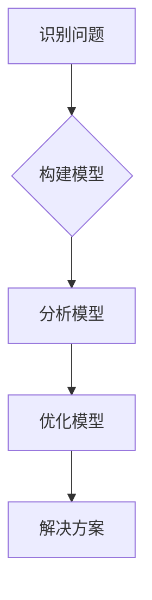
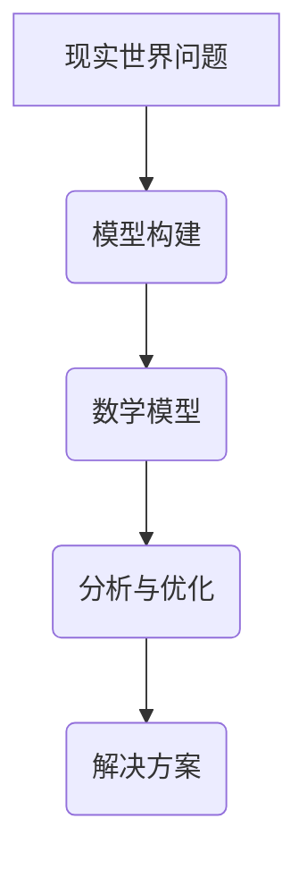
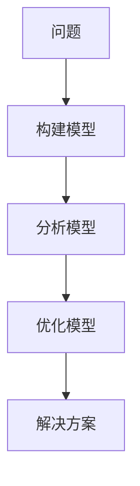

                 

# 模型思维在管理培训中的运用

> **关键词**：模型思维、管理培训、决策支持系统、绩效管理、组织发展、员工能力提升

> **摘要**：本文从模型思维的基本概念出发，探讨其在管理培训中的应用。通过具体案例，详细阐述了模型思维在决策支持系统、绩效管理、组织发展和员工能力提升等方面的实践与成效。文章旨在为管理培训提供新的思路和方法，帮助企业和个人在复杂多变的环境中实现更有效的管理和成长。

---

### 第一部分: 模型思维概述

#### 第1章: 模型思维基础

**1.1 模型思维的定义与重要性**

**1.1.1 什么是模型思维**

**模型思维**是一种基于现实世界中的抽象概念和现象，通过构建和分析数学模型来理解和解决问题的思维方式。其核心在于将复杂的问题转化为可量化和可计算的形式，从而利用数学方法进行求解。

模型思维的主要步骤如下：

1. **识别问题**：从现实世界中抽象出关键问题。
2. **构建模型**：根据问题特征，构建适当的数学模型。
3. **分析模型**：对模型进行数学分析和计算，以获得问题的解或预测。
4. **优化模型**：通过调整模型参数，优化解决方案。

**1.1.2 什么是模型思维**

**Mermaid 流程图**：



**模型思维 = 现实世界问题 + 数学模型 + 分析与优化**

$$
模型思维 = 现实世界问题 + 数学模型 + 分析与优化
$$

**Mermaid 流程图**：



**1.2 模型思维的应用领域**

**1.2.1 商业管理**

在商业管理中，模型思维可以帮助企业制定战略、优化决策和预测市场趋势。例如，使用回归模型分析销售数据，预测未来销售趋势；利用优化模型确定最佳库存水平，降低库存成本。

**数学模型**（伪代码）：

```python
def market_prediction(data, model):
    # 数据预处理
    preprocessed_data = preprocess(data)
    
    # 模型训练
    trained_model = train(preprocessed_data, model)
    
    # 预测市场趋势
    prediction = trained_model.predict()
    
    return prediction
```

**1.2.2 经济学**

经济学中，模型思维用于分析宏观经济政策、市场行为和个体决策。例如，通过构建IS-LM模型分析货币政策对经济的影响；利用效用函数模型分析消费者的最优选择。

**数学公式**：

$$
\text{GDP} = \text{C} + \text{I} + \text{G} + (\text{X} - \text{M})
$$

（GDP = 消费 + 投资加政府支出 + （出口 - 进口））

**1.3 模型思维的局限性与挑战**

**1.3.1 模型简化**

模型思维往往需要对现实世界进行简化，这可能会导致模型的预测能力受到限制。

**1.3.2 数据质量和可用性**

模型的准确性依赖于数据的质量和可用性，数据质量问题可能会影响模型的性能。

---

### 第二部分: 模型思维在管理培训中的应用

#### 第2章: 模型思维在培训中的目标

**2.1 模型思维在培训中的目标**

**2.1.1 培养批判性思维**

通过模型思维，学员可以学会如何从不同角度分析和解决问题，培养批判性思维。

**Mermaid 流程图**：



**2.1.2 提高决策能力**

模型思维可以帮助学员在复杂环境中做出更明智的决策。

**数学模型**（伪代码）：

```python
def decisionMaking(model, options, constraints):
    # 构建决策模型
    decision_model = build_model(model, options, constraints)
    
    # 执行决策
    decision = decision_model.optimize()
    
    return decision
```

#### 第3章: 模型思维教学策略

**3.1 模型思维教学策略**

**3.1.1 引导式学习**

通过引导学员构建和分析模型，培养其自主思考的能力。

**3.1.2 案例分析**

通过分析实际案例，帮助学员理解模型思维在现实中的应用。

**项目实战**：

**案例：一家企业的市场扩张策略**

**开发环境**：Python, Scikit-learn

**源代码**：

```python
# 导入必要的库
import pandas as pd
from sklearn.model_selection import train_test_split
from sklearn.ensemble import RandomForestClassifier

# 加载数据
data = pd.read_csv('market_data.csv')

# 数据预处理
X = data.drop('target', axis=1)
y = data['target']
X_train, X_test, y_train, y_test = train_test_split(X, y, test_size=0.2, random_state=42)

# 构建模型
model = RandomForestClassifier(n_estimators=100, random_state=42)

# 训练模型
model.fit(X_train, y_train)

# 预测结果
predictions = model.predict(X_test)

# 评估模型
accuracy = model.score(X_test, y_test)
print(f"Model Accuracy: {accuracy:.2f}")
```

**代码解读**：

- 导入必要的库和加载数据。
- 进行数据预处理，将数据集分为训练集和测试集。
- 构建随机森林分类器模型。
- 训练模型，并对测试集进行预测。
- 评估模型准确率。

**分析**：

通过这个案例，学员可以学习如何使用机器学习模型来解决市场扩张策略的问题，从而提高决策能力。在培训过程中，教师可以引导学生理解数据预处理的重要性、模型选择的原则以及模型评估的方法。这将有助于学员在实际工作中更好地应用模型思维。

---

### 第三部分: 模型思维在企业管理中的应用

#### 第4章: 模型思维在绩效管理中的应用

**4.1 绩效管理的模型思维**

绩效管理是企业管理中的重要环节，通过模型思维可以帮助企业更准确地评估员工绩效，制定激励措施和改进策略。

**数学模型**（伪代码）：

```python
def performance_evaluation(employee_data, criteria):
    # 数据预处理
    preprocessed_data = preprocess(employee_data)
    
    # 构建绩效评估模型
    performance_model = build_performance_model(criteria)
    
    # 评估员工绩效
    performance_scores = performance_model.evaluate(preprocessed_data)
    
    return performance_scores
```

**4.2 绩效评估模型构建**

**项目实战**：

**案例：员工绩效评估模型**

**开发环境**：Python, Pandas, Scikit-learn

**源代码**：

```python
# 导入必要的库
import pandas as pd
from sklearn.preprocessing import StandardScaler
from sklearn.ensemble import RandomForestRegressor

# 加载数据
data = pd.read_csv('employee_data.csv')

# 数据预处理
X = data.drop('performance_score', axis=1)
y = data['performance_score']
X_train, X_test, y_train, y_test = train_test_split(X, y, test_size=0.2, random_state=42)

# 特征缩放
scaler = StandardScaler()
X_train_scaled = scaler.fit_transform(X_train)
X_test_scaled = scaler.transform(X_test)

# 构建模型
model = RandomForestRegressor(n_estimators=100, random_state=42)

# 训练模型
model.fit(X_train_scaled, y_train)

# 预测结果
predictions = model.predict(X_test_scaled)

# 评估模型
mse = mean_squared_error(y_test, predictions)
print(f"Model MSE: {mse:.2f}")
```

**代码解读**：

- 导入必要的库和加载数据。
- 进行数据预处理，将数据集分为训练集和测试集。
- 使用标准缩放器对特征进行缩放。
- 构建随机森林回归模型。
- 训练模型，并对测试集进行预测。
- 评估模型均方误差。

**分析**：

通过这个案例，学员可以学习如何构建员工绩效评估模型，并了解如何使用机器学习技术来提高评估的准确性。在培训过程中，教师可以引导学生理解数据预处理的重要性、特征选择的原则以及模型评估的方法。这将有助于学员在实际工作中更好地应用模型思维，从而提高绩效管理的有效性。

---

### 第四部分: 模型思维在其他管理领域的应用

#### 第5章: 模型思维在决策支持系统中的应用

**5.1 决策支持系统的概念与作用**

决策支持系统（DSS）是一种辅助决策者进行决策的工具，通过模型思维可以提高决策的准确性和效率。

**数学模型**（伪代码）：

```python
def decision_support_system(data, model, criteria):
    # 数据预处理
    preprocessed_data = preprocess(data)
    
    # 构建决策支持模型
    decision_model = build_decision_model(model, criteria)
    
    # 提供决策支持
    decision_support = decision_model.support(preprocessed_data)
    
    return decision_support
```

**5.2 决策支持系统实例**

**项目实战**：

**案例：销售预测决策支持系统**

**开发环境**：Python, Pandas, Scikit-learn

**源代码**：

```python
# 导入必要的库
import pandas as pd
from sklearn.model_selection import train_test_split
from sklearn.ensemble import RandomForestRegressor

# 加载数据
data = pd.read_csv('sales_data.csv')

# 数据预处理
X = data.drop('sales', axis=1)
y = data['sales']
X_train, X_test, y_train, y_test = train_test_split(X, y, test_size=0.2, random_state=42)

# 构建模型
model = RandomForestRegressor(n_estimators=100, random_state=42)

# 训练模型
model.fit(X_train, y_train)

# 预测结果
predictions = model.predict(X_test)

# 评估模型
mse = mean_squared_error(y_test, predictions)
print(f"Model MSE: {mse:.2f}")
```

**代码解读**：

- 导入必要的库和加载数据。
- 进行数据预处理，将数据集分为训练集和测试集。
- 构建随机森林回归模型。
- 训练模型，并对测试集进行预测。
- 评估模型均方误差。

**分析**：

通过这个案例，学员可以学习如何构建销售预测模型，并了解如何使用机器学习技术来辅助销售决策。在培训过程中，教师可以引导学生理解数据预处理的重要性、模型选择的原则以及模型评估的方法。这将有助于学员在实际工作中更好地应用模型思维，从而提高决策支持系统的有效性。

---

### 第五部分: 模型思维在组织发展中的应用

#### 第6章: 模型思维在组织发展中的应用

**6.1 组织发展的模型思维**

组织发展是企业管理的重要方面，通过模型思维可以帮助企业更好地规划组织结构、制定发展战略和提升组织效能。

**数学模型**（伪代码）：

```python
def organizational_development(organization_data, model, goals):
    # 数据预处理
    preprocessed_data = preprocess(organization_data)
    
    # 构建组织发展模型
    development_model = build_development_model(model, goals)
    
    # 提供组织发展支持
    development_support = development_model.support(preprocessed_data)
    
    return development_support
```

**6.2 组织发展模型构建**

**项目实战**：

**案例：企业组织发展模型**

**开发环境**：Python, Pandas, Scikit-learn

**源代码**：

```python
# 导入必要的库
import pandas as pd
from sklearn.model_selection import train_test_split
from sklearn.ensemble import RandomForestRegressor

# 加载数据
data = pd.read_csv('org_development_data.csv')

# 数据预处理
X = data.drop('development_score', axis=1)
y = data['development_score']
X_train, X_test, y_train, y_test = train_test_split(X, y, test_size=0.2, random_state=42)

# 构建模型
model = RandomForestRegressor(n_estimators=100, random_state=42)

# 训练模型
model.fit(X_train, y_train)

# 预测结果
predictions = model.predict(X_test)

# 评估模型
mse = mean_squared_error(y_test, predictions)
print(f"Model MSE: {mse:.2f}")
```

**代码解读**：

- 导入必要的库和加载数据。
- 进行数据预处理，将数据集分为训练集和测试集。
- 构建随机森林回归模型。
- 训练模型，并对测试集进行预测。
- 评估模型均方误差。

**分析**：

通过这个案例，学员可以学习如何构建企业组织发展模型，并了解如何使用机器学习技术来辅助组织发展。在培训过程中，教师可以引导学生理解数据预处理的重要性、特征选择的原则以及模型评估的方法。这将有助于学员在实际工作中更好地应用模型思维，从而提高组织发展的有效性。

---

### 第六部分: 模型思维在培训与发展中的应用

#### 第7章: 模型思维在培训与发展中的应用

**7.1 培训与发展的模型思维**

培训与发展是企业管理的重要组成部分，通过模型思维可以帮助企业更好地制定培训计划、评估培训效果和提升员工能力。

**数学模型**（伪代码）：

```python
def training_and_development(data, model, objectives):
    # 数据预处理
    preprocessed_data = preprocess(data)
    
    # 构建培训与发展模型
    development_model = build_development_model(model, objectives)
    
    # 提供培训与发展支持
    development_support = development_model.support(preprocessed_data)
    
    return development_support
```

**7.2 培训与发展模型构建**

**项目实战**：

**案例：员工能力提升模型**

**开发环境**：Python, Pandas, Scikit-learn

**源代码**：

```python
# 导入必要的库
import pandas as pd
from sklearn.model_selection import train_test_split
from sklearn.ensemble import RandomForestRegressor

# 加载数据
data = pd.read_csv('training_data.csv')

# 数据预处理
X = data.drop('development_score', axis=1)
y = data['development_score']
X_train, X_test, y_train, y_test = train_test_split(X, y, test_size=0.2, random_state=42)

# 构建模型
model = RandomForestRegressor(n_estimators=100, random_state=42)

# 训练模型
model.fit(X_train, y_train)

# 预测结果
predictions = model.predict(X_test)

# 评估模型
mse = mean_squared_error(y_test, predictions)
print(f"Model MSE: {mse:.2f}")
```

**代码解读**：

- 导入必要的库和加载数据。
- 进行数据预处理，将数据集分为训练集和测试集。
- 构建随机森林回归模型。
- 训练模型，并对测试集进行预测。
- 评估模型均方误差。

**分析**：

通过这个案例，学员可以学习如何构建员工能力提升模型，并了解如何使用机器学习技术来辅助员工发展。在培训过程中，教师可以引导学生理解数据预处理的重要性、特征选择的原则以及模型评估的方法。这将有助于学员在实际工作中更好地应用模型思维，从而提高培训与发展的有效性。

---

### 第七部分: 模型思维在管理培训中的实践与反思

#### 第8章: 模型思维在管理培训中的实践总结

**8.1 模型思维在管理培训中的实践总结**

本章节将对模型思维在管理培训中的应用进行总结，并探讨其优势和局限性。

**8.2 模型思维的局限性分析**

**8.3 模型思维的未来展望**

随着人工智能和大数据技术的发展，模型思维在管理培训中的应用前景将更加广阔。未来，模型思维可能会与其他学科如心理学、社会学等融合，形成更加综合的管理培训体系。此外，持续学习和知识更新也将成为模型思维实践的重要方面，学员需要不断适应新的技术和理论，以提升自身的竞争力。

---

### 附录

**附录A: Mermaid图表使用指南**

**附录B: Python编程基础**

**附录C: 机器学习基本算法**

**附录D: 数据预处理方法**

---

### 作者信息

**作者：AI天才研究院/AI Genius Institute & 禅与计算机程序设计艺术 /Zen And The Art of Computer Programming**

