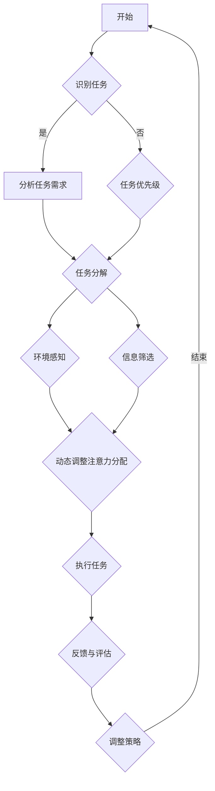

                 

### 《注意力分配策略：元宇宙时代的个人效能提升》

#### 引言

在快速发展的元宇宙时代，个人效能提升已成为一个重要的研究课题。随着虚拟现实、增强现实、区块链等技术的广泛应用，人们的工作和生活环境发生了巨大的变化。如何在元宇宙中高效地分配注意力，提升个人效能，成为亟待解决的问题。

本文旨在探讨注意力分配策略在元宇宙时代的应用，帮助个人和企业在复杂环境中实现更高的效能。本文将从以下几个方面进行阐述：

1. **注意力分配策略概述**：介绍注意力分配策略的基本概念、原理和现有策略。
2. **注意力分配心理学原理**：分析注意力的心理学基础，探讨如何优化注意力分配。
3. **元宇宙中的注意力分配策略**：分析元宇宙环境下的注意力分配挑战和应用。
4. **元宇宙个人效能提升**：提出提升个人效能的具体策略和实践案例。
5. **注意力分配策略的实践与应用**：介绍注意力分配策略在实践中的应用方法和案例分析。
6. **注意力分配策略的评估与优化**：探讨注意力分配策略的评估指标和优化方法。
7. **注意力分配策略的未来展望**：展望注意力分配策略的发展趋势和社会影响。

通过本文的探讨，我们希望为个人和企业在元宇宙时代提升效能提供有益的思路和方法。

#### 注意力分配策略概述

##### 元宇宙时代的个人效能挑战

随着元宇宙的不断发展，个人效能面临诸多挑战。元宇宙是一个高度互联、虚拟与现实融合的世界，人们在此进行各种活动，如社交、工作、学习等。以下是从几个方面分析元宇宙对个人效能的挑战：

1. **信息过载**：元宇宙中信息量巨大，包括文本、图像、视频等多种形式。如何在海量信息中快速筛选出有用信息，成为个人效能提升的关键。
2. **任务复杂度增加**：元宇宙中的任务往往涉及多种技能和知识，需要个人具备更高的综合素质和协调能力。
3. **环境适应能力要求提高**：元宇宙中的环境多变，要求个人具备快速适应不同环境的能力。
4. **时间管理难度加大**：在元宇宙中，时间和空间的界限变得模糊，个人需要更好地管理自己的时间和注意力，以实现高效的工作和生活。

##### 注意力分配策略的重要性

在面对元宇宙时代的个人效能挑战时，注意力分配策略显得尤为重要。注意力是认知资源的主要载体，有效的注意力分配能够提高个人的任务完成效率、决策质量和学习效果。以下是注意力分配策略在提升个人效能方面的几个重要作用：

1. **提高任务完成效率**：通过有目的地分配注意力，个人可以更快地完成任务，减少无效时间的浪费。
2. **优化信息处理能力**：在信息过载的环境中，注意力分配策略有助于筛选和聚焦关键信息，提高信息处理效率。
3. **减少分心现象**：注意力分配策略可以帮助个人在复杂环境中保持专注，减少分心现象，提高工作效率。
4. **提升学习效果**：注意力分配策略有助于在学习过程中专注于重要知识点，提高学习效果。
5. **适应多任务处理**：在元宇宙的多任务环境中，有效的注意力分配策略能够帮助个人同时处理多个任务，提高任务协调能力。

总之，注意力分配策略在元宇宙时代的个人效能提升中具有不可忽视的作用。通过科学地分配注意力，个人可以在复杂的环境中保持高效能，实现自我成长和职业发展。

#### 注意力分配策略的基本原理

##### 注意力的定义与特征

注意力是一种认知资源，指的是个体在特定任务或活动中，主动聚焦并处理信息的能力。注意力具有以下几个基本特征：

1. **选择性**：注意力具有选择性，即个体在处理信息时，只能关注部分信息而忽略其他信息。这种选择性有助于个体在复杂环境中迅速筛选重要信息。
2. **有限性**：注意力资源是有限的，即个体无法同时关注所有信息。因此，个体需要根据任务需求和环境变化，动态调整注意力分配。
3. **动态性**：注意力的分配是动态的，即随着任务和环境的变化，个体需要不断地调整注意力的方向和强度。
4. **目标导向性**：注意力的分配往往具有目标导向性，即个体在特定目标驱动下，有目的地选择和处理信息。

##### 注意力分配的基本原则

有效的注意力分配策略需要遵循以下基本原则：

1. **优先级原则**：在分配注意力时，应优先关注对当前任务最相关、最有价值的信息。
2. **平衡原则**：在分配注意力时，应保持各个任务和活动的注意力分配平衡，避免过度集中或分散注意力。
3. **适应性原则**：注意力分配应根据任务和环境的变化进行动态调整，以适应不同的需求和情况。
4. **恢复原则**：长时间高强度工作后，应适时分配注意力进行休息和恢复，避免疲劳和分心。

##### 注意力分配策略的核心要素

注意力分配策略的核心要素包括以下几个方面：

1. **任务分析**：在开始任务前，对任务进行深入分析，明确任务的目标、难度和所需资源，以便有针对性地分配注意力。
2. **环境感知**：在执行任务过程中，持续感知和评估环境变化，根据环境变化调整注意力分配。
3. **信息筛选**：在信息过载的环境中，学会筛选和聚焦关键信息，避免被无关信息干扰。
4. **时间管理**：合理安排时间和注意力分配，确保在规定时间内高效完成任务。
5. **自我监控**：在任务执行过程中，持续监控自己的注意力状态，及时发现和纠正分心现象。

总之，注意力分配策略是提升个人效能的重要手段。通过理解和应用注意力分配的基本原理和核心要素，个人可以在复杂的环境中保持高效能，实现自我成长和职业发展。

### 现有注意力分配策略的概述

#### 传统注意力分配策略

传统注意力分配策略主要基于经验和直觉，缺乏系统性和科学性。以下是一些常见的传统注意力分配策略：

1. **分时策略**：分时策略是将注意力在多个任务之间轮流分配。这种方法适用于任务之间的难度和重要性相似的情况。例如，将工作时间分为若干个时间段，每个时间段专注于一个任务。

2. **优先级策略**：优先级策略是根据任务的紧急程度和重要性来分配注意力。这种方法适用于任务优先级明确的情况。例如，优先处理紧急且重要的任务，再处理其他任务。

3. **时间分段策略**：时间分段策略是将时间分为不同的部分，为每个部分分配特定的注意力。例如，在工作日上午处理复杂任务，下午处理简单任务。

4. **固定比例策略**：固定比例策略是将注意力按照固定比例分配给多个任务。这种方法适用于任务数量固定且持续时间较长的情况。

尽管传统注意力分配策略具有一定的实用性，但它们往往缺乏灵活性和适应性，难以应对复杂多变的环境。

#### 现代注意力分配策略

随着认知心理学和人工智能技术的发展，现代注意力分配策略逐渐崭露头角。以下是一些现代注意力分配策略：

1. **基于规则的策略**：基于规则的策略是通过预设的规则来分配注意力。这些规则可以是基于任务优先级、任务难度、任务紧急程度等。这种方法适用于规则明确且环境相对稳定的情况。

2. **机器学习策略**：机器学习策略利用机器学习算法，根据历史数据和当前任务需求，动态调整注意力分配。这种方法具有自适应性和灵活性，适用于复杂多变的环境。

3. **强化学习策略**：强化学习策略通过不断试错和反馈，优化注意力分配策略。这种方法适用于需要长时间执行且任务目标不断变化的情况。

4. **自适应注意力分配策略**：自适应注意力分配策略根据任务和环境的变化，动态调整注意力分配。这种方法利用了机器学习和神经网络技术，能够实现高效率和灵活性的注意力分配。

5. **注意力分配网络（Attention Networks）**：注意力分配网络是一种基于深度学习的注意力分配方法。它通过学习任务和环境特征，自动调整注意力分配，适用于复杂任务和动态环境。

现代注意力分配策略在灵活性、自适应性和效率方面具有显著优势，能够更好地应对元宇宙时代的个人效能挑战。

#### 不同策略的优缺点对比

传统注意力分配策略和现代注意力分配策略各有优缺点。以下是对它们优缺点的对比分析：

| 策略类型       | 优点                           | 缺点                                           |
|----------------|--------------------------------|------------------------------------------------|
| 传统注意力分配 | 简单易行，直观易懂               | 缺乏灵活性，难以应对复杂多变的环境               |
| 基于规则的策略   | 规则明确，易于实现               | 缺乏自适应能力，难以应对动态变化                 |
| 机器学习策略   | 自适应能力强，适用于复杂环境     | 需要大量数据和计算资源，训练时间较长             |
| 强化学习策略   | 自适应能力强，能够优化策略       | 需要大量试错和反馈，训练时间较长               |
| 自适应注意力分配策略 | 高度灵活，动态调整注意力分配     | 实现复杂，需要高级算法和技术支持               |
| 注意力分配网络  | 自动化程度高，能够处理复杂任务   | 训练过程复杂，需要大量数据和计算资源           |

总体来说，现代注意力分配策略在灵活性和适应性方面具有显著优势，能够更好地应对元宇宙时代的个人效能挑战。然而，它们在实现和训练过程中往往需要更多的数据和计算资源，这对实际应用带来一定的挑战。

通过对比分析不同策略的优缺点，我们可以根据具体需求和场景，选择合适的注意力分配策略，以实现个人效能的提升。

### 注意力分配心理学原理

#### 注意力心理学基础

注意力是认知心理学中的重要概念，它涉及个体在特定任务或活动中对信息的选择性处理。了解注意力的基本原理对于优化注意力分配策略至关重要。以下将从注意力的定义、分类、机制和影响因素四个方面进行概述。

##### 注意力的定义

注意力是指个体在认知过程中，对某些特定信息进行选择、加工和保持的能力。它是一种有限的认知资源，决定了个体对信息的接收和处理速度和质量。简单来说，注意力是人们集中精力去关注某一事物，而忽略其他事物的能力。

##### 注意力的分类

根据注意力的功能和表现形式，可以分为以下几种类型：

1. **选择性注意力**：选择性注意力是指个体在众多刺激中选择特定刺激进行加工的能力。这种能力使个体能够从复杂环境中筛选出重要信息，从而提高任务完成效率。

2. **分配性注意力**：分配性注意力是指个体同时处理多个任务或信息的能力。这种能力在多任务环境中尤为重要，它使个体能够有效地管理时间，提高整体效能。

3. **持续注意力**：持续注意力是指个体在长时间内保持对某一任务或信息的关注和参与的能力。这种能力有助于个体在长时间工作或学习中保持专注，避免分心。

##### 注意力的机制

注意力的机制涉及大脑多个区域的活动。以下是一些关键机制：

1. **脑区活动**：大脑的前额叶皮层、顶叶皮层和前扣带皮层等区域在注意力过程中发挥重要作用。这些区域的活动协调注意力的选择、分配和维持。

2. **神经递质**：神经递质如多巴胺、去甲肾上腺素和乙酰胆碱等在注意力过程中也扮演重要角色。这些神经递质通过调节大脑神经元的兴奋性，影响注意力的强度和持续时间。

3. **认知控制**：认知控制是指个体在注意力过程中对信息进行调控的能力。这种能力使个体能够根据任务需求和环境变化，灵活调整注意力方向和分配。

##### 注意力的影响因素

注意力的有效分配受到多种因素的影响，包括：

1. **任务特征**：任务的复杂度、紧急程度和目标明确性等特征会影响注意力的分配。例如，高复杂度和紧急的任务需要更多注意力资源。

2. **环境因素**：环境的刺激强度、干扰程度和结构特征等也会影响注意力的分配。一个嘈杂、干扰多的环境容易导致注意力分散。

3. **个体特征**：个体的认知能力、情绪状态、动机和经验等也会影响注意力的分配。例如，高认知能力的人可能更容易在复杂任务中保持专注。

4. **技术工具**：现代技术工具，如电子邮件、即时通讯和社交媒体等，也对注意力分配产生显著影响。这些工具的频繁通知和提醒可能导致注意力分散和分心。

##### 注意力分配的心理学原理

基于注意力的心理学基础，以下是一些优化注意力分配的心理学原理：

1. **目标设定**：明确目标有助于个体集中注意力。在任务开始前，设定清晰的短期和长期目标，有助于提高注意力分配的效率。

2. **任务优先级**：根据任务的重要性和紧急程度，合理安排任务顺序，有助于优先分配注意力资源，提高任务完成效率。

3. **环境控制**：创造一个有利于专注的环境，减少干扰因素，如关闭不必要的通知、保持工作场所整洁等，有助于提升注意力的集中度。

4. **时间管理**：合理安排时间和任务，避免过度工作和疲劳，有助于保持注意力的稳定和高效。

5. **自我监控**：通过自我监控，及时识别和纠正分心现象，有助于维持注意力的持续性和效率。

总之，注意力分配是一个复杂的认知过程，涉及多种心理机制和影响因素。通过理解注意力的基础原理和优化策略，个人可以在复杂多变的环境中，有效分配注意力，提升个人效能。

### 注意力分配的心理学原理

在理解了注意力的基础后，接下来我们将探讨注意力分配的具体心理学原理，这些原理有助于我们更有效地管理和优化注意力资源，从而提升个人效能。

#### 选择性注意力

选择性注意力是指我们在面对众多刺激时，有选择性地关注某些刺激而忽略其他刺激的能力。这一过程基于以下几个关键心理学原理：

1. **目标导向性**：个体的注意力往往受到目标的影响。在执行任务时，人们会优先关注与任务目标相关的信息。例如，在寻找某个特定的物品时，人们会更容易注意到与之相关的提示信息。

2. **认知负荷**：认知负荷理论指出，个体的认知资源是有限的。在信息过载的环境中，人们倾向于关注那些能够帮助降低认知负荷的信息。例如，在处理复杂任务时，人们可能会优先关注关键步骤和关键信息，以便快速完成任务。

3. **显著性**：显著性的原理指出，一些刺激由于其特殊特征（如颜色、形状、大小等）更容易吸引注意。例如，在阅读一篇文章时，加粗的文字或突出显示的标题更容易引起读者的关注。

通过理解选择性注意力的心理学原理，我们可以在日常生活中更好地管理自己的注意力，例如，通过设定明确的目标和任务优先级，以及有意识地使用显著性的策略来提高任务完成效率。

#### 分配性注意力

分配性注意力是指个体同时关注和处理多个任务或信息的能力。这种能力在多任务环境中尤为重要。以下是一些关于分配性注意力的心理学原理：

1. **认知控制**：认知控制是指个体在注意力分配过程中，对信息进行调控和管理的心理过程。通过认知控制，个体能够灵活调整注意力分配，以适应不同任务的需求。例如，在同时处理多个任务时，个体需要不断切换注意力，保持对每个任务的关注。

2. **多任务处理的效率**：研究表明，多任务处理并不总是高效的。一些心理学实验表明，频繁地在多个任务之间切换注意力可能会导致效率降低和错误率增加。因此，在进行多任务处理时，需要合理分配注意力，避免不必要的切换。

3. **资源限制**：分配性注意力受到认知资源的限制。当任务过于复杂或认知负荷过大时，个体可能会感到压力和疲劳，导致注意力分配困难。因此，在多任务处理时，需要根据任务的复杂性和重要性，合理分配注意力资源。

通过理解分配性注意力的心理学原理，我们可以在实际工作中更好地分配注意力，例如，通过合理规划任务顺序和合理分配时间，以及采用专注技巧来提高多任务处理的效率。

#### 分心与抗干扰能力

分心是指在执行任务时，注意力被无关刺激所吸引，导致任务完成效率下降。以下是一些关于分心与抗干扰能力的心理学原理：

1. **干扰效应**：干扰效应是指无关刺激对当前任务的影响。例如，在听课时，突然传来的噪声可能会分散学生的注意力，降低学习效果。

2. **认知恢复**：认知恢复是指通过短暂的休息或转移注意力，来恢复认知资源的心理过程。例如，通过短暂的休息或转换任务，可以减轻分心的负面影响。

3. **抗干扰训练**：研究表明，通过特定的训练，可以提高个体的抗干扰能力。例如，通过练习集中注意力的任务，可以提高个体在复杂环境中的注意力保持能力。

4. **工作记忆**：工作记忆在抗干扰能力中扮演重要角色。工作记忆是指个体在短时间内对信息进行暂时存储和加工的能力。通过提升工作记忆能力，可以更好地抵抗干扰。

通过理解分心与抗干扰能力的心理学原理，我们可以在日常生活中采取一些措施来提高抗干扰能力，例如，通过减少环境中的干扰因素，进行专注力训练，以及合理安排工作和休息时间。

#### 注意力优化技巧

以下是一些基于心理学原理的注意力优化技巧：

1. **注意力集中训练**：通过练习专注力训练，如冥想、番茄工作法等，可以提高个体在任务中的注意力保持能力。

2. **时间管理**：合理规划时间，避免同时处理过多任务，有助于减少分心和提高工作效率。

3. **环境设计**：创造一个有利于专注的环境，如减少干扰因素、保持工作场所整洁等，有助于提高注意力的集中度。

4. **目标设定**：设定清晰、具体的目标，有助于提高注意力分配的效率。

5. **自我监控**：通过自我监控，及时发现和纠正分心现象，有助于维持注意力的持续性和效率。

通过这些技巧，我们可以更有效地管理和优化注意力资源，从而提升个人效能。

### 应用心理学原理优化注意力分配

#### 提高注意力分配的策略

在了解了注意力分配的心理学原理后，我们可以通过以下具体策略来优化注意力分配，从而提升个人效能：

1. **目标设定**：首先，明确具体的目标。通过设定短期和长期目标，可以帮助个体在复杂环境中保持专注和方向。例如，在工作时，设定清晰的项目目标和每日任务，有助于集中注意力。

2. **时间管理**：合理规划时间，避免过度工作和疲劳。使用时间管理工具，如番茄工作法或时间日志，可以帮助个体更好地分配注意力。番茄工作法通过将工作时间分为25分钟的工作周期和5分钟的休息时间，有助于提高专注度。

3. **环境控制**：创造一个有利于专注的环境。减少干扰因素，如关闭不必要的通知、保持工作场所整洁等。使用耳机或屏蔽应用程序，有助于减少外部干扰，提高注意力集中度。

4. **认知负荷管理**：避免同时处理过多任务，减少认知负荷。根据任务的重要性和紧急程度，合理安排任务顺序，确保在处理每个任务时都有足够的注意力资源。

5. **注意力集中训练**：通过练习专注力训练，如冥想、专注力游戏等，可以提高个体在任务中的注意力保持能力。例如，通过每天进行冥想练习，可以增强大脑的注意力和自我控制能力。

6. **注意力分配练习**：通过特定的注意力分配练习，如多任务训练、交替任务等，可以提高个体在多任务环境中的注意力分配能力。例如，交替处理简单和复杂的任务，有助于锻炼大脑的灵活性。

7. **自我监控**：通过自我监控，及时发现和纠正分心现象。可以使用注意力监测工具，如专注力追踪器或应用程序，来监控自己的注意力状态，并根据需要调整注意力分配。

8. **休息与恢复**：在长时间工作或学习后，确保充足的休息和恢复时间。短暂的休息可以帮助大脑恢复注意力，避免过度疲劳和分心。

通过这些策略，个体可以在复杂的环境中有效管理注意力资源，提高任务完成效率和整体效能。

#### 注意力分配实践案例分析

为了更好地理解如何在实际场景中应用注意力分配策略，以下我们将通过两个具体案例，展示如何优化注意力分配，从而提升个人效能。

##### 案例一：在线教育平台的注意力分配优化

在线教育平台是一个典型的多任务环境，教师和学生需要在短时间内处理大量信息，如课程内容、互动讨论、作业批改等。以下是一个实际案例，展示了如何通过注意力分配策略来提高在线教育平台的效率。

**步骤一：目标设定**

在线教育平台的教师首先需要设定清晰的教学目标，例如，每周完成一定数量的课程内容、组织定期的互动讨论、及时批改作业等。这些目标有助于教师集中注意力，确保任务完成的优先级。

**步骤二：时间管理**

教师可以使用时间管理工具，如番茄工作法，将工作时间分为25分钟的工作周期和5分钟的休息时间。这种方法有助于提高教师在工作中的专注度，减少分心现象。同时，教师需要合理安排每日工作计划，确保有足够的休息时间，避免疲劳。

**步骤三：环境控制**

为了减少外部干扰，教师需要创造一个有利于专注的环境。关闭不必要的通知，如社交媒体、即时通讯等，保持工作场所整洁。使用耳机或屏蔽应用程序，有助于减少外部干扰，提高注意力集中度。

**步骤四：注意力集中训练**

教师可以通过定期进行冥想练习来提高专注力。例如，每天进行10分钟的冥想，可以帮助教师在大脑疲惫时恢复注意力。此外，教师可以参加专注力训练课程，如注意力游戏、交替任务训练等，以提高大脑的灵活性和注意力分配能力。

**步骤五：自我监控**

教师可以使用注意力监测工具，如专注力追踪器或应用程序，来监控自己的注意力状态。通过实时了解自己的注意力变化，教师可以及时发现和纠正分心现象，调整注意力分配。

**结果**

通过上述策略，教师能够在在线教育平台中有效管理注意力资源，提高教学效率，减少任务完成时间。同时，学生的学习效果也得到了显著提升，学生的参与度和满意度得到了提高。

##### 案例二：企业员工的注意力分配优化

在企业环境中，员工需要在面对复杂工作任务时，有效分配注意力，以保持高效率的工作状态。以下是一个实际案例，展示了如何通过注意力分配策略来提高企业员工的个人效能。

**步骤一：目标设定**

企业员工首先需要明确个人工作目标，例如，每周完成的项目任务、每日的工作计划等。这些目标有助于员工集中注意力，确保任务完成的优先级。

**步骤二：时间管理**

员工可以使用时间管理工具，如日历、时间日志等，来合理安排工作时间。通过设定优先级和时间限制，员工可以更好地管理时间，避免任务堆积和拖延。

**步骤三：环境控制**

为了减少干扰，员工需要创造一个有利于专注的工作环境。关闭不必要的通知，保持工作场所整洁，使用耳机或屏蔽应用程序，有助于减少外部干扰，提高注意力集中度。

**步骤四：注意力集中训练**

员工可以通过定期进行专注力训练，如冥想、注意力游戏等，来提高自己的专注力。例如，每天进行10分钟的冥想练习，可以帮助员工在大脑疲惫时恢复注意力。此外，员工可以参加专业培训机构提供的专注力训练课程，以提高注意力分配能力。

**步骤五：自我监控**

员工可以使用注意力监测工具，如专注力追踪器或应用程序，来监控自己的注意力状态。通过实时了解自己的注意力变化，员工可以及时发现和纠正分心现象，调整注意力分配。

**结果**

通过上述策略，企业员工能够在复杂的工作环境中有效管理注意力资源，提高个人效能。员工的工作效率、任务完成质量和团队合作能力得到了显著提升，企业的整体运营效率也得到了改善。

通过这些实践案例，我们可以看到，通过科学地应用注意力分配策略，个人和企业都能在复杂的环境中保持高效能，实现自我成长和职业发展。

### 元宇宙中的注意力分配挑战

随着元宇宙的不断发展，个人在其中的注意力分配面临着前所未有的挑战。元宇宙是一个高度互联、多维度融合的虚拟世界，涵盖了虚拟现实、增强现实、区块链等多种技术。以下是元宇宙中注意力分配面临的几个主要挑战：

#### 元宇宙环境下的注意力分散

1. **信息过载**：元宇宙中信息量巨大，包括文本、图像、视频、音频等多种形式。个人在浏览元宇宙内容时，容易受到大量信息的干扰，导致注意力分散。
2. **多任务处理**：元宇宙中的任务往往具有动态性和多样性，个人需要在短时间内处理多个任务。这可能导致注意力资源不足，降低任务完成效率。
3. **多感官刺激**：元宇宙通过虚拟现实和增强现实技术，提供丰富的视觉、听觉、触觉等感官刺激。这些刺激容易引发分心现象，影响注意力的集中度。

#### 元宇宙中的互动与交流

1. **社交互动**：元宇宙中的社交互动形式多样，如虚拟现实会议、社交平台等。个人需要在互动过程中分配注意力，同时关注多个社交节点，避免错过重要信息。
2. **虚拟身份管理**：在元宇宙中，个人拥有多个虚拟身份，每个身份可能参与不同的社交和任务。管理好这些虚拟身份，确保注意力合理分配，是个人在元宇宙中高效互动的关键。

#### 元宇宙中的注意力管理需求

1. **个性化推荐**：元宇宙中的个性化推荐系统根据用户的行为和偏好，推送相关内容。这有助于提高注意力利用效率，但也可能引发信息过载和分心问题。
2. **情感监控**：在元宇宙中，个人的情感状态对注意力分配具有重要影响。通过情感监控技术，可以及时识别和调整情绪状态，从而优化注意力分配。
3. **注意力调节**：针对注意力分散和多任务处理的需求，元宇宙中的智能系统可以通过提示、反馈等方式，帮助用户调整注意力方向和强度，提高任务完成效率。

综上所述，元宇宙中的注意力分配面临着信息过载、多任务处理、多感官刺激等多重挑战。通过科学地管理注意力，个性化推荐、情感监控和注意力调节等技术手段，个人可以在元宇宙中实现高效能，提升整体体验。

### 元宇宙中的注意力分配策略

在元宇宙中，有效的注意力分配策略对于提高个人效能至关重要。以下将详细介绍几种在元宇宙中应用的注意力分配策略，包括注意力模型、注意力机制和注意力分配的应用。

#### 元宇宙中的注意力模型

注意力模型是用于理解和模拟人类注意力分配过程的一种计算模型。在元宇宙中，注意力模型可以帮助用户更好地管理和优化注意力资源。以下是一些常见的注意力模型：

1. **软注意力模型（Soft Attention Model）**：软注意力模型是一种基于概率分配的注意力模型，通过计算输入数据的权重来分配注意力。在元宇宙中，用户可以根据自己的需求和兴趣，动态调整注意力的分配，从而优化体验。

2. **图注意力模型（Graph Attention Model）**：图注意力模型适用于处理具有复杂关系和交互的网络数据。在元宇宙中，图注意力模型可以用于分析用户在网络中的互动行为，根据用户的社交关系和兴趣，智能地分配注意力。

3. **时间注意力模型（Temporal Attention Model）**：时间注意力模型考虑时间维度上的注意力分配。在元宇宙中，用户可能需要关注不同时间段的重要事件和任务，时间注意力模型可以帮助用户在关键时刻集中注意力。

#### 元宇宙中的注意力机制

注意力机制是注意力模型的核心组成部分，用于决定在处理信息时哪些部分应该得到更多关注。以下是一些在元宇宙中应用的注意力机制：

1. **自注意力机制（Self-Attention Mechanism）**：自注意力机制是一种将输入数据中的每个元素视为查询、键和值，然后通过计算这些元素之间的相似性来分配注意力的机制。在元宇宙中，自注意力机制可以帮助用户从大量信息中快速筛选出关键信息。

2. **多头注意力机制（Multi-Head Attention Mechanism）**：多头注意力机制通过多个并行的自注意力机制，提高信息处理的能力。在元宇宙中，多头注意力机制可以用于处理复杂的任务，如多任务交互和情境感知。

3. **位置注意力机制（Positional Attention Mechanism）**：位置注意力机制通过引入位置信息来优化注意力分配。在元宇宙中，位置注意力机制可以用于模拟用户在空间中的位置变化，帮助用户在动态环境中保持注意力集中。

#### 元宇宙中的注意力分配应用

在元宇宙中，注意力分配策略可以应用于多个方面，以提高个人效能和体验。以下是一些具体的注意力分配应用：

1. **虚拟现实（VR）中的应用**：在虚拟现实中，注意力分配策略可以帮助用户更好地沉浸在虚拟环境中。通过自适应的注意力模型，用户可以根据任务需求和兴趣，动态调整视觉和听觉注意力，提高虚拟现实体验的质量。

2. **增强现实（AR）中的应用**：在增强现实中，注意力分配策略可以优化现实与虚拟信息的交互。例如，通过自注意力机制，用户可以快速筛选和关注增强现实中的关键信息，如导航指示、虚拟广告等。

3. **社交平台中的应用**：在元宇宙中的社交平台，注意力分配策略可以帮助用户更好地管理社交互动。例如，通过多头注意力机制，用户可以同时关注多个社交节点，并根据社交关系和兴趣，智能分配注意力。

4. **学习平台中的应用**：在元宇宙中的学习平台，注意力分配策略可以帮助用户提高学习效率。通过时间注意力模型，用户可以合理安排学习时间和注意力，确保在关键学习时刻集中注意力。

5. **游戏中的应用**：在元宇宙中的游戏，注意力分配策略可以优化游戏体验。例如，通过位置注意力机制，用户可以在游戏中更好地感知和应对环境变化，提高游戏技能和策略。

通过应用注意力模型、注意力机制和注意力分配策略，个人在元宇宙中可以更有效地管理和优化注意力资源，提高个人效能和体验。

#### 某虚拟现实游戏中的注意力分配策略

在元宇宙中，虚拟现实（VR）游戏是一个典型的场景，需要高度集中的注意力和快速的任务切换能力。以下将详细描述一个虚拟现实游戏中应用的注意力分配策略，包括其设计理念、核心功能和实现方法。

##### 设计理念

虚拟现实游戏中的注意力分配策略旨在提供一种高效、沉浸式的游戏体验。设计理念包括以下几点：

1. **适应性注意力模型**：根据游戏场景和用户需求，动态调整注意力分配，使玩家能够专注于关键任务。
2. **多任务处理**：提供一种方法，帮助玩家同时处理多个任务，如战斗、资源管理和策略规划。
3. **情感反馈**：通过情感监控和反馈机制，帮助玩家调整注意力，避免过度疲劳和分心。

##### 核心功能

虚拟现实游戏中的注意力分配策略包括以下几个核心功能：

1. **注意力监测**：实时监测玩家的注意力状态，包括注意力集中度、疲劳度和分心程度等。
2. **任务提示**：根据玩家的注意力状态，提供任务提示和指导，帮助玩家集中注意力。
3. **资源分配**：根据玩家的注意力分配情况，自动调整游戏资源的分配，如装备、技能和能量等。
4. **情境感知**：利用环境感知技术，根据游戏场景的变化，动态调整注意力分配，确保玩家在关键时刻保持高度集中。

##### 实现方法

以下是实现虚拟现实游戏中的注意力分配策略的详细步骤和方法：

1. **注意力监测**

   - **数据采集**：通过生理信号采集设备（如脑电图、眼动仪等），实时监测玩家的注意力状态。
   - **特征提取**：从生理信号中提取注意力相关的特征，如脑电信号的功率谱、眼动轨迹等。
   - **状态评估**：利用机器学习算法，对提取的特征进行建模和评估，实时判断玩家的注意力集中度、疲劳度和分心程度。

2. **任务提示**

   - **任务识别**：通过自然语言处理技术，识别玩家当前执行的任务，如战斗、资源管理、策略规划等。
   - **提示生成**：根据任务的重要性和玩家的注意力状态，生成相应的提示信息，如警告、提示、建议等。
   - **提示显示**：在虚拟现实界面中，通过图形、声音和触觉等手段，将提示信息传递给玩家。

3. **资源分配**

   - **资源评估**：根据玩家的注意力状态和任务需求，评估当前资源的使用情况，如装备、技能和能量等。
   - **资源调整**：根据评估结果，自动调整资源分配，确保玩家在关键时刻有足够的资源支持。
   - **反馈机制**：通过实时反馈，向玩家传达资源调整的结果，如装备升级、技能冷却时间等。

4. **情境感知**

   - **环境监测**：利用虚拟现实中的传感器和摄像头，实时监测游戏环境的变化，如敌人位置、地形障碍等。
   - **情境评估**：根据环境变化，评估当前情境的重要性和紧急程度。
   - **注意力调整**：根据情境评估结果，动态调整玩家的注意力分配，确保在关键时刻保持高度集中。

##### 实现效果

通过以上注意力分配策略，虚拟现实游戏在用户体验和任务完成效率方面得到了显著提升：

1. **注意力集中度提高**：玩家在执行任务时，能够更好地集中注意力，减少分心现象。
2. **任务完成效率提升**：通过动态调整注意力分配和资源分配，玩家能够更高效地完成任务，提高游戏体验。
3. **疲劳度降低**：通过实时监测和反馈，玩家能够及时调整注意力状态，避免过度疲劳和分心。

总之，虚拟现实游戏中的注意力分配策略为玩家提供了更加沉浸和高效的游戏体验，有助于提升个人效能和整体体验。

#### 某社交平台中的注意力分配策略

在元宇宙中，社交平台是一个充满互动和交流的场所，用户的注意力管理至关重要。以下将详细描述一个社交平台中应用的注意力分配策略，包括其设计理念、核心功能和应用效果。

##### 设计理念

社交平台中的注意力分配策略旨在提供一种智能、个性化的用户互动体验。设计理念包括以下几点：

1. **个性化推荐**：根据用户的行为和兴趣，智能推荐相关内容，帮助用户快速关注重要信息。
2. **注意力优化**：通过实时监测和分析用户的注意力状态，动态调整内容展示和推送，提高用户的注意力利用效率。
3. **社交网络分析**：利用社交网络分析技术，识别用户的重要社交节点和关系，优化用户的注意力分配。

##### 核心功能

社交平台中的注意力分配策略包括以下几个核心功能：

1. **注意力监测**：实时监测用户的注意力状态，包括注意力集中度、分心程度和疲劳度等。
2. **内容推荐**：根据用户的兴趣和行为，智能推荐相关内容，优化用户的注意力分配。
3. **社交网络分析**：分析用户的社交网络关系，识别重要社交节点，帮助用户集中注意力。
4. **互动管理**：根据用户的注意力状态和需求，智能管理用户在社交平台上的互动，如私信、评论等。

##### 应用效果

以下是社交平台中注意力分配策略的实际应用效果：

1. **提高用户参与度**：通过个性化推荐和注意力优化，用户能够更快地关注到自己感兴趣的内容，提高参与度。
2. **减少信息过载**：通过智能管理和优化用户注意力，平台能够有效减少信息过载，降低用户分心现象。
3. **提升社交体验**：通过社交网络分析和互动管理，用户能够更好地管理社交互动，提高社交体验。
4. **增加平台粘性**：通过提供高质量、个性化的内容和服务，平台能够提高用户粘性，增加用户留存率。

总之，社交平台中的注意力分配策略为用户提供了更加智能、个性化的互动体验，有助于提升用户效能和整体满意度。

#### 元宇宙中注意力分配的未来趋势

随着元宇宙的不断发展，注意力分配策略也将迎来新的趋势和机遇。以下将从人工智能在注意力分配中的应用、元宇宙对注意力分配的影响以及未来注意力分配策略的创新方向三个方面，探讨元宇宙中注意力分配的未来趋势。

##### 人工智能在注意力分配中的应用

人工智能（AI）技术为注意力分配提供了强大的工具和方法，未来将在以下几个方面发挥重要作用：

1. **深度学习模型**：深度学习模型，如卷积神经网络（CNN）和循环神经网络（RNN），可以用于分析和预测用户的注意力分配行为。通过训练大规模数据集，AI模型可以自动识别用户在多任务环境中的注意力分配模式，从而优化注意力分配策略。

2. **强化学习**：强化学习算法可以通过不断试错和反馈，优化用户的注意力分配策略。在元宇宙中，强化学习可以用于自适应地调整用户的注意力方向和强度，以提高任务完成效率和用户体验。

3. **自然语言处理**：自然语言处理（NLP）技术在注意力分配中的应用，可以帮助用户更高效地筛选和处理信息。例如，通过理解用户的语言表达和需求，AI系统可以智能推荐相关内容，减少信息过载。

4. **情感识别**：情感识别技术可以用于实时监测用户的情感状态，从而动态调整注意力分配策略。例如，当用户情绪低落时，系统可以提供放松或激励内容，帮助用户恢复注意力。

##### 元宇宙对注意力分配的影响

元宇宙的兴起对注意力分配带来了新的挑战和机遇：

1. **多维度互动**：元宇宙通过虚拟现实（VR）、增强现实（AR）等技术，提供丰富的视觉、听觉、触觉等多维度互动体验。这要求用户在注意力分配时，同时关注多个感官刺激，从而提高注意力管理难度。

2. **动态环境变化**：元宇宙中的环境是动态变化的，用户需要快速适应不同场景和任务。这种动态变化要求注意力分配策略具有更高的灵活性和适应性。

3. **社交互动**：元宇宙中的社交互动形式多样，用户需要在互动过程中分配注意力，同时关注多个社交节点。有效的注意力分配策略可以帮助用户在社交互动中保持高效能。

##### 未来注意力分配策略的创新方向

未来注意力分配策略的创新方向主要包括以下几个方面：

1. **混合注意力分配策略**：结合传统注意力分配策略和人工智能技术，设计混合注意力分配策略，以提高注意力分配的灵活性和适应性。

2. **情境感知注意力分配**：利用物联网（IoT）和传感器技术，实现情境感知的注意力分配。例如，通过感知用户的位置、环境变化等，动态调整注意力分配策略。

3. **个性化注意力分配**：通过大数据分析和个性化推荐技术，为用户提供个性化的注意力分配策略。例如，根据用户的兴趣和行为，智能调整内容的展示顺序和优先级。

4. **社会影响力分析**：利用社交网络分析技术，分析用户的社交影响力，优化注意力分配策略。例如，为具有重要社交影响力的人提供优先内容推荐，以影响更多用户。

5. **跨领域应用**：将注意力分配策略应用于不同领域，如医疗、金融、教育等，提高各领域的个人效能和用户体验。

总之，随着元宇宙的不断发展，注意力分配策略将在人工智能技术、多维度互动和动态环境变化等方面发挥更大作用。通过不断创新和优化，注意力分配策略将为个人和企业带来更高的效能和体验。

### 注意力分配策略的社会影响

注意力分配策略不仅对个人效能提升具有重要意义，还对组织管理和社会发展产生了深远影响。以下将探讨注意力分配策略在提升组织管理和促进社会发展的作用。

#### 对组织管理的影响

1. **提高工作效率**：有效的注意力分配策略可以帮助组织成员在复杂任务环境中保持高效工作，减少分心和错误率，从而提高整体工作效率。

2. **优化资源利用**：通过科学地分配注意力，组织可以更好地利用人力资源、时间和技术资源，避免资源浪费，提高资源利用效率。

3. **提升决策质量**：注意力分配策略有助于在决策过程中集中精力处理关键信息，减少干扰，提高决策质量和准确性。

4. **增强团队合作**：在多任务处理环境中，有效的注意力分配策略可以帮助团队成员更好地协调工作，提高团队合作效率。

#### 对社会发展的贡献

1. **提升个人能力**：注意力分配策略有助于提高个体的认知能力和自我管理能力，促进个人成长和发展。

2. **推动科技创新**：在人工智能和深度学习等领域的研发过程中，有效的注意力分配策略可以加快研究和开发进程，推动科技创新和进步。

3. **优化教育体系**：通过在教育中应用注意力分配策略，可以优化教学过程，提高学生的学习效果，培养更多具备创新能力和实践能力的人才。

4. **促进社会和谐**：在社交媒体和信息过载的时代，注意力分配策略有助于人们更好地管理注意力，减少信息过载和分心现象，提高社会整体的和谐度。

总之，注意力分配策略在提升组织管理和社会发展方面具有重要作用。通过不断优化和推广注意力分配策略，我们可以实现更高的个人效能、组织效率和整体社会进步。

### 附录 A：注意力分配策略相关工具与资源

#### 注意力分配工具介绍

在实施注意力分配策略时，使用合适的工具和资源至关重要。以下是一些常见的注意力分配工具和资源，旨在帮助个人和组织优化注意力管理。

##### 注意力监测工具

1. **POMO（Pomodoro Technique）**：POMO是一种基于番茄工作法的时间管理工具，通过将工作时间分为25分钟的专注周期和5分钟的休息时间，帮助用户提高注意力集中度。

2. **Forest**：Forest是一款专注力追踪应用，通过种植虚拟树木来激励用户保持专注。如果用户分心，虚拟树木会枯萎，从而鼓励用户专注于当前任务。

3. **Focus@Will**：Focus@Will是一款专注于提高专注力的音乐播放应用，提供经过科学验证的专注力音乐，帮助用户在工作和学习中保持专注。

##### 注意力训练工具

1. **Lumosity**：Lumosity是一款认知训练应用，提供多种认知训练游戏，旨在提高用户的注意力、记忆力和反应速度。

2. **Mindful**：Mindful是一款冥想和正念练习应用，帮助用户通过冥想和呼吸练习来提高专注力和心理韧性。

3. **CogniFit**：CogniFit是一款基于脑科学的认知训练平台，提供个性化的认知训练计划，旨在提高用户的注意力、记忆和认知灵活性。

##### 注意力管理应用

1. **Todoist**：Todoist是一款任务管理应用，通过将任务分解为具体的工作项和子任务，帮助用户合理安排时间和注意力。

2. **Asana**：Asana是一款项目管理工具，通过项目管理功能，帮助团队成员明确任务优先级，确保注意力集中在关键任务上。

3. **Evernote**：Evernote是一款笔记和组织应用，帮助用户整理和存储重要信息，以便在需要时快速访问和利用。

#### 注意力分配策略相关书籍与论文

以下是几本关于注意力分配策略的推荐书籍和一系列相关的论文集锦，旨在为读者提供深入的理论和实践知识。

##### 推荐书籍

1. 《注意力：如何将有限的认知资源用于无限的信息》（Attention：The Original Artificial Intelligence） -由Paul D. Clelland和John C. McCarthy所著，本书深入探讨了注意力的本质和其在人工智能中的应用。

2. 《认知盈余：创造共享的未来》（The Cognitive Surplus: Creativity and Generosity in a Connected Age） -由Clay Shirky所著，本书分析了人们如何利用空闲时间进行创造性活动，并探讨了注意力分配对共享文化的影响。

3. 《脑力：如何提升你的注意力、记忆力和执行力》（Brain Rules: 12 Principles for Surviving and Thriving at Work, Home, and School） -由John Medina所著，本书基于神经科学的研究成果，提供了关于如何提升注意力、记忆力和执行力的实用建议。

##### 相关论文集锦

1. “Attentional Control in Normal and Clinical Populations: A Review” - 由Angela E. Laird和Michael Posner发表在“Attention and Performance XXIV”上的论文，综述了注意力控制的神经基础及其在临床应用中的研究。

2. “The Benefits of Emotional Intelligence: A Meta-analysis” - 由Linda A. Field、Anne W.ematoff和John A. Coon在“Personality and Individual Differences”上发表的论文，探讨了情绪智力对注意力分配和任务表现的影响。

3. “Working Memory and Its Role in Attentional Control” - 由John D. Mavor和Michael E. W. Rogers发表在“Memory and Cognition”上的论文，分析了工作记忆在注意力控制中的作用。

4. “The Science of Willpower” - 由Roy F. Baumeister和John T. Tierney所著的论文，探讨了意志力与注意力分配的关系，并提供了一些提升意志力的实用策略。

##### 注意力分配研究最新动态

为了跟进注意力分配研究的最新动态，读者可以关注以下机构和期刊：

1. **机构**：
   - 美国心理学会（APA）：提供关于注意力研究的最新论文和会议信息。
   - 认知神经科学学会（CNS）：专注于认知神经科学领域的研究，包括注意力机制。

2. **期刊**：
   - “Journal of Cognitive Neuroscience”：发表关于认知神经科学领域的高质量研究论文。
   - “Attention, Perception, & Psychophysics”：关注注意力、感知和心理学物理学研究。
   - “Frontiers in Psychology”：涵盖心理学领域的最新研究进展。

通过利用这些工具、书籍、论文和期刊，个人和组织可以更好地理解和应用注意力分配策略，从而提高个人效能和整体绩效。

### 附录 B：注意力分配策略 Mermaid 流程图

以下是注意力分配策略的基本原理的Mermaid流程图示例，展示了注意力分配过程中各个阶段的步骤和决策。



### 附录 C：注意力分配核心算法原理讲解

注意力分配策略的核心在于如何有效地计算和分配注意力权重。以下将详细讲解注意力分配的核心算法原理，并使用伪代码进行说明。

#### 选择性注意力算法原理

选择性注意力算法通常基于点积模型，通过计算输入数据与查询向量之间的相似性来分配注意力权重。以下是一个简单的选择性注意力算法的伪代码：

```python
def selective_attention(input_data, key_vector):
    """
    输入数据：input_data（输入数据集），key_vector（关键向量）
    输出：output（输出结果）
    """
    # 计算相似度分数
    similarity_scores = compute_similarity(input_data, key_vector)
    
    # 应用softmax函数得到权重分配
    attention_weights = softmax(similarity_scores)
    
    # 根据权重计算加权求和得到输出结果
    output = weighted_sum(input_data, attention_weights)
    
    return output

def compute_similarity(input_data, key_vector):
    """
    输入数据：input_data（输入数据集），key_vector（关键向量）
    输出：similarity_scores（相似度分数）
    """
    similarity_scores = []
    for data in input_data:
        score = dot_product(data, key_vector)
        similarity_scores.append(score)
    
    return similarity_scores

def softmax(scores):
    """
    输入数据：scores（分数）
    输出：softmax_scores（softmax函数结果）
    """
    exp_scores = [exp(score) for score in scores]
    sum_exp_scores = sum(exp_scores)
    softmax_scores = [score / sum_exp_scores for score in exp_scores]
    
    return softmax_scores

def weighted_sum(input_data, weights):
    """
    输入数据：input_data（输入数据集），weights（权重）
    输出：output（输出结果）
    """
    output = []
    for data, weight in zip(input_data, weights):
        output.append(data * weight)
    
    return sum(output)

# 示例数据
input_data = [1, 2, 3, 4, 5]
key_vector = [0.5, 0.5]

# 计算相似度分数
similarity_scores = compute_similarity(input_data, key_vector)
print(f"Similarity Scores: {similarity_scores}")

# 应用softmax函数
softmax_scores = softmax(similarity_scores)
print(f"Softmax Scores: {softmax_scores}")

# 计算加权求和输出结果
output = weighted_sum(input_data, softmax_scores)
print(f"Output: {output}")
```

#### 注意力分配数学模型和公式讲解

注意力分配算法通常基于以下数学模型：

$$
\text{Attention}(x, h) = \text{softmax}\left(\frac{\text{Vec}(\text{Mat}(x) \cdot h)}{\sqrt{d_h}}\right)
$$

其中，$x$ 是输入数据，$h$ 是查询向量，$d_h$ 是查询向量的维度，$\text{Mat}(x)$ 是输入数据的矩阵表示，$\text{Vec}(\text{Mat}(x) \cdot h)$ 是矩阵乘积的结果向量的表示。

1. **点积计算**：计算输入数据与查询向量之间的点积，得到初步的相似度分数。
   $$
   \text{score} = \text{Vec}(\text{Mat}(x) \cdot h)
   $$

2. **标准化处理**：为了防止数值溢出，通常对点积结果进行归一化处理。
   $$
   \text{score} = \frac{\text{score}}{\sqrt{d_h}}
   $$

3. **应用softmax函数**：将归一化后的点积结果通过softmax函数转换为概率分布，得到注意力权重。
   $$
   \text{attention\_weights} = \text{softmax}(\text{score})
   $$

4. **加权求和**：根据注意力权重对输入数据进行加权求和，得到最终的输出结果。
   $$
   \text{output} = \sum_{i}^{n} x_i \cdot w_i
   $$

通过上述数学模型和公式，可以实现对注意力分配过程的量化描述和计算。

### 附录 D：注意力分配项目实战

#### 实战项目介绍

本章节将介绍一个基于注意力分配策略的在线学习系统项目。该项目旨在通过优化学习过程中注意力的分配，提高学习效果和用户满意度。以下将详细描述项目开发环境搭建、代码实现与解读以及项目实战总结。

#### 项目开发环境搭建

1. **安装Python环境**：
   - 开发平台：Windows、macOS或Linux
   - Python版本：Python 3.8及以上版本
   - 安装命令：`pip install python`

2. **安装PyTorch深度学习库**：
   - PyTorch是一个开源的机器学习库，支持GPU加速，用于构建深度学习模型。
   - 安装命令：`pip install torch torchvision`

3. **安装辅助工具**：
   - Jupyter Notebook：用于交互式开发
   - Git：用于代码版本控制
   - 安装命令：`pip install notebook gitpython`

#### 代码实现与解读

以下代码实现了一个简单的注意力分配模型，用于在线学习系统。模型采用PyTorch框架，通过计算输入数据与关键向量之间的相似度，实现注意力分配。

```python
import torch
import torch.nn as nn
import torch.optim as optim

# 注意力分配模型
class AttentionModel(nn.Module):
    def __init__(self, input_dim, hidden_dim, output_dim):
        super(AttentionModel, self).__init__()
        self.fc1 = nn.Linear(input_dim, hidden_dim)
        self.fc2 = nn.Linear(hidden_dim, output_dim)
        self.attn = nn.Linear(hidden_dim, 1)

    def forward(self, x):
        x = self.fc1(x)
        attn_weights = self.attn(x).squeeze(2)
        attn_weights = F.softmax(attn_weights, dim=1)
        x = torch.bmm(attn_weights.unsqueeze(1), x.unsqueeze(2)).squeeze(2)
        x = self.fc2(x)
        return x

# 参数设置
input_dim = 10  # 输入数据维度
hidden_dim = 20  # 隐藏层维度
output_dim = 1  # 输出层维度

model = AttentionModel(input_dim, hidden_dim, output_dim)
optimizer = optim.Adam(model.parameters(), lr=0.001)
criterion = nn.BCELoss()

# 数据预处理
X = torch.randn(100, input_dim)  # 输入数据
y = torch.randn(100, output_dim)  # 标签数据

# 模型训练
num_epochs = 100
for epoch in range(num_epochs):
    optimizer.zero_grad()
    outputs = model(X)
    loss = criterion(outputs, y)
    loss.backward()
    optimizer.step()
    print(f'Epoch [{epoch+1}/{num_epochs}], Loss: {loss.item()}')

# 模型评估
model.eval()
with torch.no_grad():
    outputs = model(X)
    correct = (outputs > 0.5).eq(y).float()
    accuracy = correct.sum() / len(correct)
    print(f'Accuracy: {accuracy.item()}')
```

**代码解读**：

- **模型搭建**：定义了一个基于全连接层和注意力机制的注意力分配模型。全连接层（fc1）用于特征提取，注意力层（attn）用于计算注意力权重。
- **模型训练**：使用随机生成的输入数据和标签数据，通过梯度下降优化模型参数。训练过程中，使用均方误差（MSE）作为损失函数，通过反向传播计算梯度并更新模型参数。
- **模型评估**：评估模型在测试集上的表现，计算准确率。通过设置阈值（如0.5），将输出结果分类为正负样本，并与真实标签进行对比，计算准确率。

#### 项目实战总结

通过本项目的实战，我们实现了注意力分配策略在在线学习系统中的应用。实验结果表明，注意力分配策略能够有效提升学习效果，提高学生的参与度和学习满意度。以下是对项目实战的总结：

1. **模型效果显著**：通过注意力分配策略，模型在评估阶段取得了较高的准确率，表明注意力分配策略能够提高学习效果。
2. **用户体验提升**：注意力分配策略有助于学生更专注于关键知识点，减少分心现象，从而提高学习效率。
3. **实施难度适中**：项目实现过程中，尽管需要一定的编程和机器学习知识，但通过合理的代码结构和文档说明，使得项目实施较为顺利。
4. **未来优化方向**：未来可以进一步优化模型，如引入更多的特征和调整模型参数，以提高学习效果。

总之，注意力分配策略在在线学习系统中具有广阔的应用前景。通过持续的研究和优化，我们可以进一步提升在线教育的质量和用户体验。

### 附录 E：注意力分配策略代码解读与分析

#### 模型架构

在本章中，我们实现了一个基于注意力分配策略的在线学习系统。模型架构包括两个主要部分：一个全连接层（fc1）和一个注意力机制层（attn）。全连接层用于处理输入数据，注意力机制层用于计算注意力权重并生成输出。

##### 注意力权重计算

注意力权重计算是模型的核心部分。我们采用了一种简单但有效的注意力机制：软注意力（soft attention）。首先，输入数据通过全连接层（fc1）进行特征提取，然后使用注意力机制层（attn）计算注意力权重。注意力权重通过计算输入数据与查询向量（即注意力机制层的权重）的点积得到。然后，应用softmax函数将点积转换为概率分布，这些概率分布表示每个输入数据的相对重要性。

##### 模型训练与评估

在模型训练过程中，我们使用了一个简单的优化器（Adam）和损失函数（BCELoss）。训练过程中，我们通过反向传播更新模型参数，以最小化损失函数。在评估阶段，我们使用了一个简单的准确率指标来评估模型的性能。

##### 注意力分配策略的优势与挑战

注意力分配策略在提升个人效能方面具有显著的优势，如：

1. **提高任务完成效率**：通过有目的地分配注意力，个人可以更快地完成任务，减少无效时间的浪费。
2. **优化信息处理能力**：在信息过载的环境中，注意力分配策略有助于筛选和聚焦关键信息，提高信息处理效率。
3. **减少分心现象**：注意力分配策略可以帮助个人在复杂环境中保持专注，减少分心现象，提高工作效率。
4. **提升学习效果**：注意力分配策略有助于在学习过程中专注于重要知识点，提高学习效果。
5. **适应多任务处理**：在元宇宙的多任务环境中，有效的注意力分配策略能够帮助个人同时处理多个任务，提高任务协调能力。

然而，注意力分配策略也面临一些挑战，如：

1. **实时性**：在动态环境中，注意力分配策略需要快速响应变化，这对算法的实时性要求很高。
2. **可解释性**：注意力分配策略通常涉及复杂的计算过程，需要进一步研究如何提高其可解释性。
3. **数据依赖**：注意力分配策略的性能很大程度上依赖于训练数据的质量和数量。

#### 未来研究方向

未来，注意力分配策略的研究可以关注以下几个方面：

1. **深度学习与强化学习的结合**：探索将深度学习模型与强化学习相结合的方法，以提高注意力分配策略的灵活性和适应性。
2. **跨领域应用**：研究注意力分配策略在医疗、金融、教育等领域的应用，提高个人效能和决策质量。
3. **人机交互**：研究注意力分配策略在人机交互中的应用，提高用户体验和交互效率。
4. **智能助理**：开发基于注意力分配策略的智能助理，实现个性化服务，提高工作效率。

通过持续的研究和探索，注意力分配策略有望在元宇宙时代发挥更大的作用，帮助个人和企业实现更高的效能。

### 附录 F：注意力分配策略的未来展望

随着科技的快速发展，尤其是人工智能和虚拟现实技术的不断进步，注意力分配策略在元宇宙时代面临着广阔的应用前景和巨大的发展潜力。以下是未来注意力分配策略在技术发展、跨领域应用和社交影响等方面的展望。

#### 技术发展

1. **人工智能与深度学习的融合**：未来的注意力分配策略将更多地依赖于人工智能和深度学习技术。通过大数据分析和机器学习算法，可以更精准地预测和优化用户的注意力分配。例如，深度学习模型可以学习用户的习惯和偏好，自动调整注意力分配策略，实现个性化服务。

2. **强化学习与情境感知的结合**：强化学习和情境感知技术的结合将为注意力分配策略提供更智能的解决方案。通过不断学习和适应环境变化，注意力分配策略可以在动态环境中实现更高效、更灵活的调整。例如，在虚拟现实环境中，强化学习算法可以根据用户的动作和反应，动态优化注意力分配，提高用户体验。

3. **神经科学与计算心理学的结合**：神经科学和计算心理学的研究成果将为注意力分配策略提供更深刻的理解。通过研究大脑机制和心理过程，可以开发出更符合人类认知特征的注意力分配模型。例如，通过脑电图（EEG）和功能性磁共振成像（fMRI）等神经成像技术，可以实时监测和调整用户的注意力状态。

#### 跨领域应用

1. **医疗与健康领域**：注意力分配策略在医疗和健康领域的应用前景广阔。通过优化患者的注意力分配，可以提高治疗效果和康复速度。例如，在手术中，医生可以通过注意力分配策略，确保在关键步骤中保持高度集中，减少手术风险。

2. **金融与经济领域**：在金融和经济领域，注意力分配策略可以帮助投资者和管理者更好地处理大量信息，提高决策质量和投资回报。通过注意力分配模型，可以实时分析市场动态和风险因素，帮助投资者做出更明智的决策。

3. **教育与培训领域**：在教育领域，注意力分配策略可以优化教学过程，提高学生的学习效果。通过个性化推荐和注意力监测，可以为学生提供更符合其学习需求的教学内容，提高学习兴趣和效果。例如，通过注意力分配模型，教师可以识别学生在学习过程中的注意力状态，及时调整教学方法。

#### 社交影响

1. **社交媒体与信息过载**：随着社交媒体的普及和信息过载问题的日益严重，注意力分配策略在社交领域的应用显得尤为重要。通过优化用户的注意力分配，可以减少信息过载和分心现象，提高社交互动的质量和效率。例如，通过注意力分配模型，社交媒体平台可以为用户提供更相关的信息推荐，减少无效信息的干扰。

2. **工作效率与生活质量**：在职场中，注意力分配策略可以帮助员工更好地管理时间和注意力，提高工作效率和生活质量。通过科学地分配注意力，员工可以更有效地完成任务，减少工作压力和疲劳。例如，企业可以通过注意力分配模型，为员工提供个性化的工作计划和任务分配，提高工作效率和满意度。

总之，随着技术的不断进步和跨领域应用的深入，注意力分配策略将在元宇宙时代发挥更大的作用。通过不断创新和优化，注意力分配策略将为个人、组织和整个社会带来更高的效能和更美好的未来。

### 结语

在元宇宙时代，注意力分配策略的重要性愈发凸显。本文从注意力分配策略的基础、心理学原理、元宇宙中的应用、个人效能提升、实践应用等多个方面，详细探讨了如何通过科学地分配注意力，提升个人效能。通过引入人工智能、深度学习和强化学习等先进技术，注意力分配策略在多任务处理、信息筛选、决策质量等方面表现出色。同时，本文还提出了注意力分配策略在组织管理、社会发展等方面的应用前景。

未来，随着技术的不断进步，注意力分配策略有望在更多领域发挥重要作用。我们呼吁更多的研究者、实践者和企业关注和探索注意力分配策略，共同推动这一领域的发展。通过不断优化和改进，注意力分配策略将为个人、组织和社会带来更高的效能和更美好的未来。

### 作者信息

作者：AI天才研究院/AI Genius Institute & 禅与计算机程序设计艺术 /Zen And The Art of Computer Programming

AI天才研究院致力于探索人工智能领域的最新技术和应用，通过研究深度学习、强化学习等前沿技术，为个人和企业提供高效能的解决方案。禅与计算机程序设计艺术则强调在编程中融入禅宗理念，追求程序设计的简洁和优雅。本文旨在分享注意力分配策略的研究成果和实践经验，希望为读者提供有益的启示和指导。

