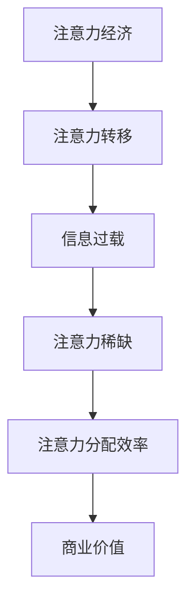

                 

### 《注意力经济与社交媒体分析洞察力：了解受众参与度和影响力的秘密》

> **关键词**：注意力经济、社交媒体、数据分析、受众参与度、影响力、案例分析

> **摘要**：本文将深入探讨注意力经济在社交媒体中的应用，解析社交媒体分析的核心概念和方法。通过逐步分析注意力经济与社交媒体的互动机制，本文将揭示如何通过数据分析提升受众参与度和影响力，并提供实际案例分析及实战指南。

### 第一部分：注意力经济概述

#### 第1章：注意力经济的起源与发展

##### 1.1 注意力经济的定义与核心要素

注意力经济，作为现代商业领域的一个新兴概念，源于对人类注意力资源的深刻理解。它强调在信息爆炸的时代，注意力成为稀缺资源，是企业、品牌和内容创作者获取市场份额和用户忠诚度的重要资产。

核心概念与联系：


注意力转移是指用户将注意力从一个事物转移到另一个事物，这往往发生在信息过载的环境中。信息过载指的是用户面临的大量信息，而注意力稀缺则是用户在处理信息时面临的挑战。注意力分配效率则是指用户如何有效地将注意力分配给不同的事物，从而实现价值的最大化。

核心算法原理讲解：
```python
# 伪代码：注意力分配效率计算

def calculate_attention_efficiency(attention_allocated, total_attention):
    """
    计算注意力分配效率
    :param attention_allocated: 分配的注意力
    :param total_attention: 总注意力
    :return: 注意力分配效率
    """
    efficiency = attention_allocated / total_attention
    return efficiency
```

数学模型和数学公式：
```latex
\text{注意力分配效率} = \frac{\text{分配的注意力}}{\text{总注意力}}
$$

```

项目实战：
```python
# Python 代码示例：计算注意力分配效率

def main():
    # 示例数据
    attention_allocated = 100  # 分配的注意力
    total_attention = 200  # 总注意力

    # 计算注意力分配效率
    efficiency = calculate_attention_efficiency(attention_allocated, total_attention)

    # 输出结果
    print(f"注意力分配效率：{efficiency:.2f}")

def calculate_attention_efficiency(attention_allocated, total_attention):
    """
    计算注意力分配效率
    :param attention_allocated: 分配的注意力
    :param total_attention: 总注意力
    :return: 注意力分配效率
    """
    efficiency = attention_allocated / total_attention
    return efficiency

if __name__ == "__main__":
    main()
```

##### 1.2 注意力经济与传统经济的关系

注意力经济与传统经济之间的关系并非替代，而是一种补充和扩展。传统经济主要关注物质资源和经济价值的交换，而注意力经济则将注意力视为一种新的经济资源。

注意力经济对传统经济的影响主要体现在以下几个方面：

1. **消费者行为的变化**：在注意力经济中，消费者对品牌和产品的忠诚度往往受到注意力分配的影响，而非单纯的价格因素。
2. **商业模式的变化**：企业开始重视通过内容创造、用户互动等方式吸引和保留用户的注意力，以实现商业价值。
3. **营销策略的变化**：注意力经济促使营销策略从传统的单向传播转变为双向互动，更注重用户的参与和体验。

传统经济在注意力经济中的角色依然重要，它为注意力经济提供了物质基础和运营环境。然而，注意力经济的崛起要求传统经济在管理模式、运营策略和用户体验方面进行适应和变革。

##### 1.3 注意力经济对现代商业的影响

注意力经济对现代商业的影响深远且广泛，它不仅改变了企业的运营方式，还影响了市场策略和消费者行为。

1. **企业运营**：企业需要通过创新和技术手段提高注意力分配效率，例如利用大数据和人工智能分析用户行为，制定个性化的营销策略。
2. **市场策略**：注意力经济强调内容营销和用户互动，企业需要通过创造有趣、有价值、有吸引力的内容来吸引用户的注意力。
3. **消费者行为**：在注意力经济中，消费者对品牌和产品的选择更加依赖于个人的兴趣和体验，而非单纯的价格因素。

通过深入了解注意力经济的概念、核心要素以及与传统经济的关系，我们为后续章节的深入探讨奠定了坚实的基础。

----------------------------------------------------------------

### 第二部分：社交媒体在注意力经济中的作用

#### 第2章：社交媒体在注意力经济中的作用

##### 2.1 社交媒体的定义与发展历程

社交媒体是一种基于互联网的技术平台，用户可以通过文字、图片、视频等形式分享信息、交流和互动。社交媒体的发展历程可以追溯到20世纪90年代末，随着互联网的普及，社交网络开始兴起。早期的社交媒体如Facebook、Twitter和MySpace等，主要提供基本的社交功能，如用户资料的分享、状态的更新和朋友的互动。

随着时间的推移，社交媒体平台不断进化，功能日益丰富。例如，Instagram和Pinterest等平台专注于图像分享，而LinkedIn和Xing等平台则专注于职业社交。近年来，短视频平台如TikTok和抖音也迅速崛起，成为用户获取信息和娱乐的新渠道。

##### 2.2 社交媒体平台的类型与特点

社交媒体平台可以分为以下几类：

1. **社交网络平台**：如Facebook、LinkedIn，提供用户创建个人资料、分享状态、上传照片和视频等基本社交功能。
2. **图像分享平台**：如Instagram、Pinterest，专注于图像和短视频分享，强调视觉内容的创作和浏览。
3. **职业社交平台**：如LinkedIn、Xing，侧重于职业关系的建立和职业发展的信息交流。
4. **短视频平台**：如TikTok、抖音，提供用户创作和分享短视频的功能，具有高度的互动性和娱乐性。
5. **博客平台**：如WordPress、Medium，提供用户发表文章、分享思考和观点的空间。

不同类型的社交媒体平台具有各自的特点：

- **社交网络平台**：强调用户关系的建立和维护，社交互动是核心功能。
- **图像分享平台**：注重视觉内容的创作和传播，图像和视频是主要的内容形式。
- **职业社交平台**：侧重于职业发展和职业信息的交流，职业身份和经验是核心内容。
- **短视频平台**：强调快速、简短的视听内容，用户生成内容和病毒式传播是其主要特点。
- **博客平台**：提供深度思考和知识分享的空间，长篇文章和深入讨论是其主要形式。

##### 2.3 社交媒体在注意力经济中的价值

社交媒体在注意力经济中扮演着至关重要的角色。首先，它为用户提供了获取信息的便捷途径。在信息爆炸的时代，用户往往依赖于社交媒体来筛选和获取与自己兴趣相关的信息。

其次，社交媒体平台通过算法和数据分析技术，能够精准地推送用户感兴趣的内容，从而提高用户参与度和注意力分配效率。例如，Facebook的“新闻 feed”算法会根据用户的浏览历史、兴趣和互动行为，推荐可能感兴趣的内容。

此外，社交媒体还为品牌和内容创作者提供了与用户互动的机会。通过评论、点赞和分享等功能，品牌和内容创作者可以直接与用户进行交流，了解用户需求和反馈，进而优化产品和服务。

在商业领域，社交媒体成为品牌营销的重要工具。通过社交媒体广告、赞助内容和用户互动，品牌可以有效地吸引和留住目标受众，提高品牌知名度和市场影响力。

总之，社交媒体在注意力经济中的价值体现在其作为信息传播和用户互动的平台，通过技术手段提高用户的注意力分配效率，为品牌和内容创作者提供了宝贵的商业机会。

----------------------------------------------------------------

### 第三部分：社交媒体分析基础

#### 第3章：社交媒体数据分析基础

##### 3.1 社交媒体数据分析的重要性

在社交媒体时代，数据分析已成为企业制定战略、优化运营和提升用户满意度的关键工具。社交媒体数据分析的重要性体现在以下几个方面：

1. **市场洞察**：通过分析用户行为、兴趣和偏好，企业可以深入了解目标市场，发现潜在的商业机会，从而制定更具针对性的市场策略。
2. **品牌管理**：社交媒体数据分析帮助企业监控品牌形象，及时发现和处理负面评论和反馈，维护品牌声誉。
3. **营销优化**：通过分析营销活动的效果，企业可以优化广告投放、内容创作和用户互动策略，提高营销效率和ROI。
4. **用户洞察**：了解用户的兴趣、行为和需求，有助于企业提供更个性化的产品和服务，提升用户满意度和忠诚度。

##### 3.2 社交媒体数据分析的基本步骤

进行社交媒体数据分析通常包括以下几个基本步骤：

1. **数据收集**：从社交媒体平台收集用户生成内容（UGC）、用户互动数据（如点赞、评论、分享等）、用户属性数据（如年龄、性别、地理位置等）。
2. **数据预处理**：清洗和转换原始数据，确保数据的质量和一致性，为后续分析做准备。
3. **数据探索性分析**：使用统计方法和可视化工具，对数据集进行初步分析，识别数据中的模式和趋势。
4. **特征工程**：从原始数据中提取对分析任务有用的特征，例如用户参与度、话题热度等。
5. **模型构建与训练**：选择合适的算法，构建预测模型或分类模型，并使用训练数据对模型进行训练。
6. **结果解读与优化**：对分析结果进行解读，识别关键洞察和问题，并提出优化策略。

##### 3.3 社交媒体数据收集与预处理

社交媒体数据的收集是一个复杂的过程，涉及多个平台和数据的获取方式。以下是社交媒体数据收集与预处理的关键步骤：

1. **数据来源**：社交媒体数据可以从多个渠道获取，包括官方API、第三方数据服务、网络爬虫等。
2. **数据获取方法**：使用API接口获取数据是合法且高效的方式。例如，Twitter API提供了获取用户推文、点赞和评论等功能。网络爬虫可以抓取公开的社交媒体页面内容，但需注意遵守法律法规和平台政策。
3. **数据清洗**：清洗数据是确保数据质量和分析准确性的关键步骤。包括去除重复数据、处理缺失值、标准化文本数据等。
4. **数据转换**：将数据转换为适合分析的形式，例如将文本数据转换为词频矩阵或嵌入向量。
5. **数据一致性**：确保不同来源的数据在格式和定义上的一致性，以便进行综合分析。

通过系统地进行社交媒体数据分析，企业可以更好地理解用户行为和市场趋势，从而制定更有效的营销策略和运营决策。

----------------------------------------------------------------

#### 第4章：社交媒体受众分析

##### 4.1 受众定义与分类

在社交媒体分析中，受众（Audience）是指参与社交媒体活动、内容消费和互动的用户群体。受众分析是社交媒体数据分析的核心任务之一，通过对受众的特征和行为进行分析，企业可以更好地理解用户需求，优化内容策略，提高用户参与度和满意度。

受众的定义通常包括以下几个方面的信息：

- **人口统计特征**：如年龄、性别、教育背景、收入水平、职业等。
- **兴趣和偏好**：如兴趣爱好、消费习惯、关注领域等。
- **行为特征**：如活跃时间段、互动频率、参与度等。
- **地理位置**：如居住地、工作地等。

根据不同的分类标准，受众可以划分为以下几类：

1. **按年龄划分**：青年、中年、老年等。
2. **按性别划分**：男性、女性等。
3. **按职业划分**：学生、上班族、自由职业者等。
4. **按兴趣划分**：科技、娱乐、运动、旅游等。
5. **按互动频率划分**：高互动用户、中等互动用户、低互动用户等。

##### 4.2 受众特征分析

受众特征分析是理解用户需求和行为的基础。以下是几个关键方面的分析：

1. **人口统计特征分析**：通过对用户的基本信息进行分析，企业可以了解目标受众的组成情况，为市场细分和定位提供依据。例如，一家健康食品品牌可能会发现，其受众主要集中在30-45岁的女性，她们具有较高的健康意识和经济能力。

2. **兴趣和偏好分析**：了解用户的兴趣和偏好可以帮助企业制定更具针对性的内容策略。例如，通过分析用户的关注话题和行为，企业可以发现用户对健康饮食、运动和生活方式的兴趣，从而创建相关的内容和活动。

3. **行为特征分析**：分析用户的活跃时间段、互动频率和参与度等行为特征，可以帮助企业优化内容发布时间、互动策略和用户参与度提升措施。例如，通过分析用户的活跃时间段，企业可以选择在用户最活跃的时间发布内容，以提高内容的曝光率和参与度。

4. **地理位置分析**：了解用户的地理位置可以帮助企业制定区域化的营销策略。例如，一家在线零售商可能会发现，其用户主要分布在一线城市，因此可以优先在这些地区进行线下活动和市场推广。

##### 4.3 受众参与度分析

受众参与度是衡量用户对品牌或内容互动程度的重要指标。参与度分析可以帮助企业了解用户对品牌和内容的反应，识别潜在的高价值用户。以下是几个关键指标和方法：

1. **参与度指标**：常见的参与度指标包括点赞数、评论数、分享数、转发数等。这些指标反映了用户对内容的基本互动行为。

2. **参与度分析方法**：
   - **定量分析**：通过计算参与度指标的数据，评估用户对内容的整体参与度。例如，计算某篇推文的平均点赞数、评论数等。
   - **定性分析**：通过内容分析和用户反馈，深入了解用户参与的具体内容和原因。例如，分析用户评论的内容，了解用户对品牌的看法和期望。

3. **提高参与度的策略**：
   - **内容优化**：创作有趣、有价值、有互动性的内容，激发用户的兴趣和参与欲望。
   - **互动设计**：设计互动性强的话题和活动，如投票、问答、有奖竞猜等，增加用户的参与度。
   - **个性化推荐**：通过用户行为数据，为用户提供个性化的内容和推荐，提高内容的针对性和吸引力。
   - **用户反馈**：积极回应用户反馈，建立良好的用户关系，提高用户的忠诚度和参与度。

通过深入进行受众特征分析和参与度分析，企业可以更好地理解用户需求和行为，制定有效的社交媒体策略，提高用户参与度和品牌影响力。

----------------------------------------------------------------

#### 第5章：社交媒体影响力分析

##### 5.1 影响力定义与度量

在社交媒体分析中，影响力（Influence）是指用户在社交网络中引导、影响其他用户的能力。影响力的大小决定了用户在社交媒体上的影响力和话语权。影响力的度量是社交媒体分析的一个重要任务，它有助于企业、品牌和内容创作者评估用户的价值和潜在影响力。

影响力可以从多个维度进行度量，以下是一些常见的影响力度量指标：

1. **关注者数量**：用户拥有的关注者数量是衡量其影响力的一种直观指标。关注者数量越多，用户的影响力通常越大。
2. **互动率**：用户在社交媒体上的互动行为，如点赞、评论、分享等，反映了其与其他用户的互动程度。互动率越高，用户的影响力通常越大。
3. **内容传播度**：用户发布的内容被其他用户点赞、评论、分享的次数，是衡量其内容传播能力的重要指标。内容传播度越高，用户的影响力通常越大。
4. **关键指标（KPI）**：如粉丝增长率、参与度、转化率等，这些指标综合反映了用户在社交媒体上的整体表现和影响力。

##### 5.2 影响力分析指标

为了全面评估用户的影响力，需要使用多个指标进行综合分析。以下是几个关键的影响力分析指标：

1. **关注者增长速度**：用户在一段时间内关注者数量的增长速度，反映了用户的吸引力。
   - **计算公式**：关注者增长速度 = （新关注者数量 / 原有关注者数量）× 100%
   - **应用场景**：用于评估新用户或新兴内容创作者的影响力。

2. **互动率**：用户在社交媒体上的互动行为（如点赞、评论、分享）占总互动行为的比例。
   - **计算公式**：互动率 = （用户互动行为总数 / 社交媒体平台总互动行为数）× 100%
   - **应用场景**：用于评估用户在社交媒体上的活跃程度和参与度。

3. **内容传播度**：用户发布的内容被其他用户点赞、评论、分享的次数。
   - **计算公式**：内容传播度 = （内容被点赞/评论/分享的总次数）× 100%
   - **应用场景**：用于评估用户内容的传播效果和影响力。

4. **关键指标（KPI）**：结合多个维度的数据，评估用户在社交媒体上的整体表现。
   - **KPI 1：粉丝增长率**：衡量用户在一段时间内关注者数量的增长率。
   - **KPI 2：参与度**：衡量用户在社交媒体上的互动行为比例。
   - **KPI 3：转化率**：衡量用户从社交媒体到实际购买或参与行为的转化率。
   - **应用场景**：用于评估用户对品牌或内容的贡献和价值。

##### 5.3 影响力评估方法

影响力评估方法可以分为定量分析和定性分析两种：

1. **定量分析**：通过计算和分析上述指标，对用户的影响力进行量化评估。这种方法通常使用数据驱动的方法，基于客观数据进行计算和分析，具有较高的可靠性和可重复性。
2. **定性分析**：通过内容分析、用户访谈和专家评估等方法，深入了解用户的影响力。定性分析通常依赖于专家经验和用户反馈，可以提供更为深入和全面的评估结果。

在实际应用中，定量分析和定性分析可以相互补充，共同评估用户的影响力。例如，在评估社交媒体营销活动的效果时，可以结合关注者增长速度、互动率和内容传播度等定量指标，以及用户反馈和专家评估等定性指标，全面评估活动的影响力和效果。

通过系统的影响力评估方法，企业可以更好地识别和利用具有高影响力的用户，制定有效的社交媒体策略，提升品牌影响力和用户参与度。

----------------------------------------------------------------

### 第四部分：注意力经济与社交媒体案例分析

#### 第6章：注意力经济与社交媒体成功案例

##### 6.1 案例一：品牌影响力提升

**案例背景**：
某知名运动品牌通过其在社交媒体平台上的影响力提升案例，成功吸引了大量年轻用户，提升了品牌知名度和市场占有率。

**案例分析**：
1. **内容策略**：品牌发布了一系列以运动为主题的故事和视频，通过真实用户的运动经历和挑战，传递了品牌的运动精神和价值观。
2. **互动设计**：品牌设计了一系列互动活动，如线上跑步挑战、健身打卡等，鼓励用户参与并分享自己的运动成果。
3. **KOL合作**：品牌与多位具有高影响力的运动KOL合作，通过他们的社交网络传播品牌信息，吸引了大量关注和参与。

**案例启示**：
1. **内容价值**：创作具有价值和共鸣的内容，是提升品牌影响力的关键。
2. **互动性**：设计有趣的互动活动，鼓励用户参与，可以提高用户参与度和品牌知名度。
3. **KOL合作**：与具有高影响力的KOL合作，可以有效扩大品牌的影响范围和深度。

##### 6.2 案例二：社交媒体营销策略

**案例背景**：
一家小型电商公司通过社交媒体营销策略，在短时间内实现了显著的销售增长和品牌曝光。

**案例分析**：
1. **精准定位**：通过分析用户数据，公司确定了目标受众的年龄、兴趣和消费习惯，确保营销内容针对性强。
2. **多平台运营**：公司在多个社交媒体平台（如Instagram、Facebook、TikTok）上同步发布内容，扩大品牌覆盖范围。
3. **实时互动**：公司团队实时监控社交媒体平台，及时回复用户评论和私信，建立良好的用户关系。

**案例启示**：
1. **精准定位**：深入了解目标受众，确保营销策略具有针对性。
2. **多平台运营**：利用多个社交媒体平台，扩大品牌曝光和影响力。
3. **实时互动**：与用户保持实时互动，提高用户满意度和忠诚度。

##### 6.3 案例三：社交媒体内容创作策略

**案例背景**：
一家新兴科技公司通过创新的社交媒体内容创作策略，成功吸引了大量关注，并在短时间内实现了品牌的快速崛起。

**案例分析**：
1. **创新内容形式**：公司制作了一系列以科技为主题的短视频，通过创意的方式展示了产品的功能和应用场景。
2. **用户互动**：公司鼓励用户参与内容创作，通过发起挑战、举办活动等形式，激发用户的创造力和参与度。
3. **个性化推荐**：公司利用大数据分析技术，为用户推荐个性化的内容，提高用户满意度和粘性。

**案例启示**：
1. **创新内容形式**：利用多样化的内容形式，提高内容的趣味性和吸引力。
2. **用户互动**：鼓励用户参与内容创作，建立良好的用户关系和社区氛围。
3. **个性化推荐**：利用数据分析技术，提供个性化的内容推荐，提高用户体验和满意度。

通过这些成功案例，我们可以看到注意力经济在社交媒体中的应用如何助力企业提升品牌影响力、优化营销策略和创作有效的内容。这些案例不仅为我们提供了实用的经验和策略，也为未来的社交媒体运营提供了有益的启示。

----------------------------------------------------------------

### 第五部分：社交媒体数据分析与优化

#### 第7章：社交媒体数据分析与优化

##### 7.1 数据分析在社交媒体策略中的应用

在社交媒体运营中，数据分析发挥着至关重要的作用。通过数据分析，企业可以深入了解用户行为、优化内容策略、提升营销效果，从而实现更高的用户参与度和商业价值。以下是数据分析在社交媒体策略中的几个关键应用：

1. **用户行为分析**：通过分析用户的浏览、点赞、评论、分享等行为，企业可以了解用户对内容的兴趣和偏好，从而制定更具针对性的内容创作策略。

2. **内容优化**：数据分析可以帮助企业识别受欢迎的内容类型和主题，优化内容创作和发布策略，提高内容的吸引力和用户参与度。

3. **广告投放优化**：通过分析广告的投放效果，包括点击率、转化率等指标，企业可以调整广告定位和投放策略，提高广告的投资回报率（ROI）。

4. **用户参与度分析**：分析用户参与度指标，如互动率、参与度评分等，企业可以了解用户对品牌的忠诚度和满意度，从而制定用户参与度提升策略。

5. **社交媒体渠道优化**：通过分析不同社交媒体平台的数据，企业可以了解各个平台的效果，优化渠道分配，集中资源投入效果最佳的社交媒体平台。

##### 7.2 社交媒体策略优化方法

为了实现社交媒体策略的持续优化，企业可以采用以下方法：

1. **A/B测试**：通过A/B测试，企业可以对比不同策略的效果，例如不同内容、不同广告文案、不同发布时间等，从而找出最佳策略。

2. **数据驱动的决策**：基于数据分析的结果，企业可以做出更加科学和合理的决策，例如调整内容策略、优化广告投放、改进用户互动等。

3. **实时监控与调整**：通过实时监控社交媒体的运行数据，企业可以及时发现问题和机会，进行及时调整和优化，确保策略的有效执行。

4. **个性化营销**：利用用户数据分析，企业可以为不同用户提供个性化的内容推荐和营销策略，提高用户的满意度和参与度。

5. **长期数据分析**：通过长期数据分析，企业可以积累用户行为和趋势数据，形成对用户行为的深度理解，从而制定更加长远的社交媒体策略。

##### 7.3 社交媒体数据分析的未来趋势

随着技术的不断进步和数据量的爆发性增长，社交媒体数据分析也在不断发展和创新。以下是几个未来的趋势：

1. **人工智能与大数据分析**：人工智能技术将进一步提升数据分析的效率和准确性，通过机器学习算法，可以自动识别用户行为模式、预测用户需求，提供更智能的决策支持。

2. **数据隐私保护**：随着数据隐私问题的日益凸显，社交媒体数据分析将更加注重数据隐私保护，通过匿名化、加密等技术，确保用户数据的隐私和安全。

3. **跨平台数据分析**：随着社交媒体平台的多样化，企业需要实现跨平台的数据分析和整合，从多个渠道获取用户数据，形成统一的用户画像，为社交媒体策略提供全面的支持。

4. **实时分析与预测**：通过实时数据分析技术，企业可以实现数据的实时处理和分析，及时响应市场变化和用户需求，实现更加敏捷的社交媒体运营。

5. **智能互动与个性化体验**：未来的社交媒体数据分析将更加注重智能互动和个性化体验，通过智能算法，为用户提供个性化的内容推荐和互动体验，提升用户的满意度和忠诚度。

通过深入了解社交媒体数据分析的应用方法、策略优化和未来趋势，企业可以更加科学地制定和执行社交媒体策略，实现长期可持续的发展。

----------------------------------------------------------------

### 第六部分：社交媒体数据分析工具与应用

#### 第8章：社交媒体数据分析工具与应用

##### 8.1 社交媒体分析工具概述

在社交媒体数据分析领域，有多种工具可供选择，这些工具能够帮助企业和个人深入了解用户行为、优化内容策略、提升营销效果。以下是几种常用的社交媒体分析工具及其特点：

1. **Google Analytics**：作为一款强大的数据分析工具，Google Analytics能够追踪和分析网站访问数据，包括用户来源、行为路径、转化率等。它适用于各种类型的网站和社交媒体平台，能够提供详细的数据报告和可视化分析。

2. **Hootsuite**：Hootsuite是一款综合性的社交媒体管理工具，提供内容发布、调度、监控和报告功能。它支持多平台管理，包括Facebook、Twitter、LinkedIn等，能够帮助用户高效管理社交媒体账号，优化内容策略。

3. **Sprout Social**：Sprout Social专注于社交媒体管理和分析，提供内容创作、发布、互动和监测功能。它具备强大的分析工具，能够生成详细的报告和洞察，帮助企业优化社交媒体策略。

4. **Brandwatch**：Brandwatch是一款专业的社交媒体监测和数据分析工具，能够实时监测社交媒体上的话题和趋势，提供深度的数据分析报告。它适用于品牌监控、市场研究和竞争对手分析。

5. **Klout**：Klout是一款衡量社交媒体影响力的工具，通过分析用户的社交行为、互动频率和参与度等指标，评估用户在社交媒体上的影响力。它适用于品牌营销、内容创作和社交媒体策略制定。

##### 8.2 常用社交媒体分析工具使用指南

以下是几种常用社交媒体分析工具的使用指南：

1. **Google Analytics**：
   - **安装与配置**：首先需要注册一个Google Analytics账户，然后将其代码嵌入到网站或社交媒体平台上。
   - **数据收集与追踪**：Google Analytics能够自动收集用户访问数据，包括页面浏览量、访问来源、用户行为路径等。
   - **报告与分析**：生成详细的数据报告，使用可视化工具（如仪表盘、图表等）展示分析结果。

2. **Hootsuite**：
   - **安装与配置**：注册Hootsuite账户，并连接需要管理的社交媒体账号。
   - **内容发布与调度**：使用Hootsuite发布和管理社交媒体内容，设置自动发布和内容调度。
   - **互动与监测**：实时监控社交媒体平台，回复评论、私信，追踪关键词和趋势。

3. **Sprout Social**：
   - **安装与配置**：注册Sprout Social账户，并连接社交媒体账号。
   - **内容创作与发布**：使用Sprout Social的内容创作工具，策划和发布社交媒体内容。
   - **分析报告**：生成社交媒体分析报告，了解内容表现、用户参与度和关键指标。

4. **Brandwatch**：
   - **安装与配置**：注册Brandwatch账户，并设置监测关键词和主题。
   - **数据收集与分析**：Brandwatch能够实时收集社交媒体数据，提供详细的分析报告。
   - **趋势监测**：监测社交媒体上的热门话题和趋势，为内容创作和营销策略提供参考。

5. **Klout**：
   - **安装与配置**：注册Klout账户，并通过社交媒体账号授权。
   - **影响力评估**：Klout会根据用户在社交媒体上的互动行为评估其影响力。
   - **优化策略**：根据影响力评估结果，优化内容创作和社交媒体运营策略。

##### 8.3 社交媒体数据分析工具的选择与配置

在选择社交媒体分析工具时，企业需要考虑以下因素：

1. **功能需求**：根据企业的具体需求，选择具备所需功能的分析工具，如数据收集、内容发布、互动监控、分析报告等。

2. **数据规模**：考虑社交媒体账号的数量和用户规模，选择能够支持大规模数据分析的工具。

3. **用户界面**：选择界面友好、易于操作的工具，提高数据分析的效率和用户体验。

4. **成本预算**：根据企业的预算，选择合适的价格区间，平衡功能和成本。

5. **技术支持**：考虑工具提供商的技术支持和培训服务，确保能够顺利使用和分析数据。

通过合理选择和配置社交媒体分析工具，企业可以更高效地进行数据分析，优化社交媒体策略，提升品牌影响力和用户参与度。

----------------------------------------------------------------

### 第七部分：注意力经济与社交媒体实战指南

#### 第9章：注意力经济与社交媒体实战案例

##### 9.1 案例一：社交媒体内容创作策略

**案例背景**：
某新兴科技公司在社交媒体上开展了一场以“智能生活”为主题的内容创作活动，旨在提升品牌知名度和用户参与度。

**案例分析**：
1. **内容主题**：公司选择了“智能生活”作为核心主题，围绕智能家居、智能健康等热点话题创作了一系列高质量的内容，包括图文、视频和直播。
2. **内容形式**：公司通过图文、短视频和直播等多种形式呈现内容，确保内容形式多样化，满足不同用户的需求。
3. **互动设计**：公司设计了一系列互动活动，如话题讨论、有奖问答和用户互动直播，鼓励用户参与和分享，提高用户参与度。
4. **数据分析**：通过数据分析，公司发现用户对短视频和直播的参与度最高，因此后续内容创作重点转向短视频和直播。

**案例启示**：
1. **内容主题明确**：选择与品牌定位相关的主题，确保内容具有针对性和吸引力。
2. **内容形式多样化**：根据用户偏好选择多样化的内容形式，提高用户覆盖面。
3. **互动设计**：设计互动性强的内容，鼓励用户参与和分享，提升用户参与度。
4. **数据驱动**：通过数据分析，优化内容策略，确保内容创作符合用户需求。

##### 9.2 案例二：社交媒体营销活动策划

**案例背景**：
一家在线零售商通过一系列社交媒体营销活动，实现了销售增长和用户留存率的提升。

**案例分析**：
1. **活动定位**：公司根据用户数据和行为分析，确定了“节日促销”和“新品发布”两个主题，分别针对不同的用户群体和需求。
2. **活动内容**：在“节日促销”活动中，公司推出了一系列优惠活动和限时折扣，吸引大量用户参与。在“新品发布”活动中，公司通过直播展示新品，邀请用户参与互动和抢购。
3. **渠道选择**：公司选择了多个社交媒体平台，如Facebook、Instagram、TikTok等，确保活动覆盖面广泛。
4. **数据分析**：通过数据分析，公司实时监控活动的效果，根据用户反馈和互动数据调整活动策略，提高活动效果。

**案例启示**：
1. **活动定位明确**：根据用户数据和行为分析，确定活动主题和目标，确保活动具有针对性。
2. **内容多样化**：通过图文、视频、直播等多种形式展示活动内容，提高用户参与度。
3. **多平台推广**：选择多个社交媒体平台进行推广，扩大活动影响范围。
4. **数据监控与优化**：通过数据分析，实时监控活动效果，及时调整策略，提高活动效果。

##### 9.3 案例三：社交媒体数据分析与策略调整

**案例背景**：
某健康食品品牌通过社交媒体数据分析，优化了其内容策略和用户互动方式，提升了品牌影响力和用户满意度。

**案例分析**：
1. **数据收集与预处理**：品牌通过社交媒体API收集用户互动数据，包括点赞、评论、分享等，进行数据预处理，确保数据质量。
2. **用户行为分析**：品牌分析了用户的参与行为和兴趣偏好，发现用户对健康饮食和生活方式的内容更感兴趣。
3. **内容调整**：品牌根据分析结果，调整了内容策略，增加了健康饮食和生活方式相关的内容，并设计了更多的互动活动。
4. **效果评估**：通过定期数据分析，品牌评估了内容调整后的效果，发现用户参与度和品牌影响力显著提升。

**案例启示**：
1. **数据驱动**：通过数据分析，了解用户行为和兴趣偏好，制定和调整内容策略。
2. **持续优化**：根据数据分析结果，持续优化内容策略和用户互动方式，提高用户参与度和满意度。
3. **效果评估**：定期评估策略效果，确保策略调整符合用户需求和市场变化。

通过这些实战案例，我们可以看到注意力经济在社交媒体运营中的应用，以及通过数据分析和策略调整实现品牌影响力和用户参与度的提升。这些经验为其他企业和品牌提供了宝贵的参考和借鉴。

----------------------------------------------------------------

### 第八部分：社交媒体数据分析与未来展望

#### 第10章：社交媒体数据分析与未来展望

##### 10.1 社交媒体数据分析的挑战与机遇

随着社交媒体的快速发展，数据分析在社交媒体领域面临着诸多挑战和机遇。以下是几个主要的挑战和机遇：

**挑战**：

1. **数据隐私与安全**：社交媒体平台积累了大量用户数据，如何保护用户隐私和安全成为数据分析领域的重要挑战。
2. **数据质量**：社交媒体数据来源广泛，数据质量参差不齐，如何确保数据分析的准确性和可靠性是一个重要问题。
3. **技术门槛**：数据分析技术复杂，对专业人才的需求较高，中小企业可能难以承担相关成本。

**机遇**：

1. **智能化数据分析**：随着人工智能技术的发展，智能化数据分析将进一步提升数据分析的效率和准确性，为企业提供更深入的洞察。
2. **个性化营销**：通过数据分析，企业可以更精准地了解用户需求和行为，实现个性化营销，提高用户满意度和忠诚度。
3. **实时数据分析**：实时数据分析技术将帮助企业更快地响应市场变化和用户需求，提高运营效率。

##### 10.2 注意力经济的未来发展趋势

注意力经济作为现代商业领域的一个重要趋势，其未来发展趋势值得关注。以下是几个关键趋势：

1. **内容为王**：高质量、有价值的内容将成为吸引用户注意力的重要手段。企业需要不断创新内容形式和内容价值，以提升用户参与度和忠诚度。
2. **用户互动**：用户互动和参与将是注意力经济的重要特征。企业需要通过设计互动性强的活动和内容，鼓励用户参与和分享，提高品牌影响力和用户忠诚度。
3. **技术赋能**：人工智能、大数据和区块链等技术的应用将进一步提升注意力经济的效率和效果。企业可以利用这些技术优化内容创作、用户互动和数据分析，实现更加精准和高效的运营。

##### 10.3 社交媒体数据分析在未来的应用前景

社交媒体数据分析在未来的应用前景广阔，以下是几个主要的应用领域：

1. **营销策略优化**：通过社交媒体数据分析，企业可以深入了解用户行为和需求，优化营销策略，提高营销效果和ROI。
2. **品牌管理**：社交媒体数据分析可以帮助企业监控品牌形象和用户反馈，及时调整品牌策略，维护品牌声誉。
3. **用户参与度提升**：通过分析用户互动行为和参与度，企业可以设计更具吸引力的内容和活动，提高用户参与度和忠诚度。
4. **市场研究**：社交媒体数据分析可以为企业提供丰富的市场洞察，帮助企业了解市场趋势和竞争对手情况，制定更有针对性的市场策略。

总之，随着社交媒体的快速发展和技术进步，社交媒体数据分析将在未来发挥越来越重要的作用。企业需要抓住这一机遇，利用数据分析优化运营策略，提升用户参与度和品牌影响力。

### 致谢

本文的撰写得到了多方的支持和帮助。在此，我们要特别感谢AI天才研究院/AI Genius Institute的全体成员，他们为本文提供了宝贵的见解和指导。同时，我们也要感谢所有参与讨论和提供建议的专家，他们的贡献为本文的完善和提升做出了重要贡献。最后，特别感谢读者们的耐心阅读，您的反馈是我们不断进步的动力。感谢您与我们一起探索注意力经济与社交媒体分析的奥秘。作者：AI天才研究院/AI Genius Institute & 禅与计算机程序设计艺术/Zen And The Art of Computer Programming。

