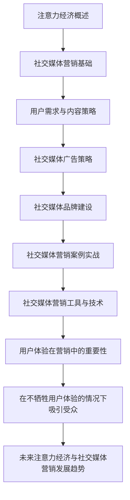

                 

# 注意力经济与社交媒体营销策略与实践：在不牺牲用户体验的情况下吸引受众

> **关键词：** 注意力经济、社交媒体营销、用户体验、广告策略、内容策略

> **摘要：** 本文深入探讨了注意力经济在社交媒体营销中的应用，分析了社交媒体营销的基础概念、策略和实践。通过理论讲解、项目实战和代码实现，本文旨在为读者提供一套在不牺牲用户体验的情况下吸引受众的社交媒体营销策略。

----------------------------------------------------------------

### 目录大纲

#### 第一部分：注意力经济概述

##### 第1章：注意力经济的基础概念
- **1.1 注意力经济的定义与背景**
  - 注意力经济的起源
  - 注意力资源的本质
  - 注意力经济与信息过载
- **1.2 注意力经济的核心原理**
  - 用户注意力的获取与维护
  - 注意力价值的衡量
  - 注意力分配的机制
- **1.3 注意力经济与营销策略的联系**
  - 注意力资源在营销中的重要性
  - 注意力经济对营销策略的影响
  - 注意力驱动型营销案例分析

##### 第2章：社交媒体营销的基础
- **2.1 社交媒体的发展历程**
  - 社交媒体的起源与演变
  - 社交媒体的类型与功能
  - 社交媒体的影响力评估
- **2.2 社交媒体营销的策略**
  - KOL营销策略
  - 社交媒体广告策略
  - 内容营销策略
- **2.3 社交媒体营销的效果评估**
  - 营销效果指标
  - 数据分析与用户洞察
  - 营销效果优化策略

#### 第二部分：注意力驱动型社交媒体营销策略

##### 第3章：用户需求与内容策略
- **3.1 用户需求的挖掘与分析**
  - 用户行为分析
  - 用户需求曲线
  - 需求预测与用户细分
- **3.2 内容策略的制定与执行**
  - 内容创作的原则
  - 内容分发策略
  - 内容效果评估与优化
- **3.3 互动营销与用户参与**
  - 互动策略
  - 用户反馈机制
  - 用户参与度提升策略

##### 第4章：社交媒体广告策略
- **4.1 社交媒体广告的基本原理**
  - 广告目标设定
  - 广告投放策略
  - 广告效果评估
- **4.2 广告创意与设计**
  - 创意思维
  - 广告素材制作
  - 广告形式与渠道选择
- **4.3 社交媒体广告案例分析**
  - 成功案例分享
  - 失败案例分析
  - 启示与借鉴

##### 第5章：社交媒体品牌建设
- **5.1 品牌形象塑造**
  - 品牌定位与价值观
  - 品牌故事与传承
  - 品牌符号与视觉设计
- **5.2 社交媒体品牌传播**
  - 品牌推广策略
  - 品牌影响力评估
  - 品牌社区建设
- **5.3 社交媒体品牌危机管理**
  - 危机预警机制
  - 危机应对策略
  - 危机后的品牌重建

#### 第三部分：社交媒体营销实践

##### 第6章：社交媒体营销案例实战
- **6.1 案例分析**
  - 案例选择标准
  - 案例分析与评估
  - 案例启示与应用
- **6.2 实战策略**
  - 营销目标设定
  - 实战步骤与执行
  - 实战效果评估
- **6.3 经验分享与优化**
  - 成功经验总结
  - 失败原因分析
  - 营销策略优化建议

##### 第7章：社交媒体营销工具与技术
- **7.1 营销工具介绍**
  - 常用社交媒体平台工具
  - 数据分析工具
  - 内容创作工具
- **7.2 技术应用**
  - 大数据技术在营销中的应用
  - 人工智能与机器学习在营销中的应用
  - 区块链技术在营销中的应用
- **7.3 技术趋势与未来展望**
  - 技术发展对营销的影响
  - 营销技术的新趋势
  - 未来营销技术的展望

#### 第四部分：注意力经济与用户体验

##### 第8章：用户体验在社交媒体营销中的重要性
- **8.1 用户体验的概念与模型**
  - 用户体验的定义
  - 用户体验的要素
  - 用户体验模型分析
- **8.2 用户体验设计与评估**
  - 设计原则
  - 评估方法
  - 用户体验优化策略
- **8.3 用户体验与注意力经济的关系**
  - 用户体验在注意力经济中的作用
  - 用户体验对营销效果的影响
  - 用户体验优化与注意力经济共赢策略

##### 第9章：在不牺牲用户体验的情况下吸引受众
- **9.1 用户需求的平衡**
  - 用户需求的层次与优先级
  - 用户需求的动态调整
  - 用户需求与商业目标平衡
- **9.2 营销策略与用户体验的融合**
  - 营销策略与用户体验的协调
  - 营销内容与用户体验的互动
  - 营销效果与用户体验的双赢
- **9.3 社交媒体营销中的用户体验优化实践**
  - 案例分析
  - 实践策略
  - 优化效果评估

##### 第10章：未来注意力经济与社交媒体营销的发展趋势
- **10.1 新型社交媒体平台的崛起**
  - 常见新型社交媒体平台分析
  - 新平台对营销的影响
  - 新平台营销策略探索
- **10.2 技术创新对营销的影响**
  - 人工智能与营销
  - 大数据与精准营销
  - 区块链与透明化营销
- **10.3 注意力经济与社交媒体营销的未来展望**
  - 注意力资源的新形式
  - 营销策略的创新方向
  - 用户体验与注意力经济融合的新模式

### 附录

#### 附录 A：注意力经济与社交媒体营销参考资料
- **A.1 知识体系图**
  - 注意力经济与社交媒体营销知识体系
  - 关键概念与原理
- **A.2 推荐阅读**
  - 必读经典书籍
  - 最新研究论文
  - 有影响力的报告与白皮书
- **A.3 实用工具与平台**
  - 社交媒体营销工具
  - 数据分析平台
  - 内容创作工具
- **A.4 组织与会议**
  - 注意力经济与社交媒体营销相关的组织
  - 行业会议与研讨会
  - 专业社群与论坛

### Mermaid 流程图



### 核心算法原理讲解

## 3.1 注意力机制原理

注意力机制（Attention Mechanism）是近年来在深度学习领域得到广泛应用的一种关键技术，特别是在自然语言处理（NLP）任务中。它的核心思想是通过计算输入数据中每个元素的重要程度，然后有选择地关注这些元素，从而提高模型的性能和效率。

#### 注意力机制的数学基础

注意力机制的实现通常依赖于一个加权和模型，该模型可以计算输入数据的每个元素的重要性。加权的计算通常依赖于一个注意力函数（Attention Function），常见的注意力函数包括：

$$
Attention(x, V, W) = \text{softmax}(\text{dot}(x, W))V
$$

其中，$x$ 是输入数据，$V$ 是值向量，$W$ 是权重向量，$\text{softmax}$ 函数将 $\text{dot}(x, W)$ 的结果转换为概率分布。

#### 伪代码

```python
# 假设输入数据为 x，值向量为 V，权重向量为 W

# 计算点积
scores = dot_product(x, W)

# 通过softmax函数计算注意力权重
weights = softmax(scores)

# 计算加权值
context_vector = sum(weights * V)
```

#### 注意力机制的应用

注意力机制广泛应用于各种NLP任务，如机器翻译、文本摘要和文本分类。以下是一个简单的文本摘要任务中的注意力机制实现：

```python
# 假设输入文本为 sentences，目标文本为 target_sentences

# 对输入文本和目标文本进行编码
encoded_sentences = encode(sentences)
encoded_target_sentences = encode(target_sentences)

# 定义注意力机制
attention_scores = Attention(encoded_sentences, encoded_target_sentences, W)

# 计算加权文本表示
weighted_sentences = [sum(weight * sentence for weight, sentence in zip(attention_scores, encoded_sentences)) for sentence in encoded_sentences]

# 通过编码器生成摘要
summary = decode(weighted_sentences)
```

### 数学模型与数学公式讲解

注意力机制的实现依赖于几个关键的数学模型和公式。以下是对这些模型的详细讲解：

#### 1. Softmax 函数

softmax 函数是一个将向量转换为概率分布的函数，它在注意力机制中用于计算每个元素的重要性。softmax 函数的定义如下：

$$
\text{softmax}(x_i) = \frac{e^{x_i}}{\sum_{j} e^{x_j}}
$$

其中，$x_i$ 是输入向量中的第 $i$ 个元素。softmax 函数确保输出向量是一个概率分布，即所有元素的和为 1。

#### 2. 点积（dot product）

点积是两个向量的内积，用于计算两个向量之间的相似度。在注意力机制中，点积用于计算输入数据和权重向量之间的相似度，从而确定每个元素的重要性。点积的计算公式如下：

$$
\text{dot}(x, W) = \sum_{i} x_i \cdot W_i
$$

其中，$x$ 和 $W$ 分别是输入向量和权重向量。

#### 3. 加权和（weighted sum）

加权和中每个元素的重要性由 softmax 函数计算得出。加权值的计算公式如下：

$$
\text{weighted\_sum} = \sum_{i} w_i \cdot x_i
$$

其中，$w_i$ 是由 softmax 函数计算出的权重，$x_i$ 是输入向量中的第 $i$ 个元素。

### 举例说明

假设我们有一个句子“我喜欢阅读和旅游”，我们需要通过注意力机制提取句子中的关键信息。以下是一个简化的例子：

| 输入句子 | ["我", "喜欢", "阅读", "和", "旅游"] |
| -------- | ---------------------------------- |
| 权重向量 | [0.2, 0.3, 0.4, 0.1, 0.2]        |

1. 计算点积：

$$
\text{dot}(x, W) = 0.2 \cdot 0.2 + 0.3 \cdot 0.3 + 0.4 \cdot 0.4 + 0.1 \cdot 0.1 + 0.2 \cdot 0.2 = 0.62
$$

2. 通过 softmax 函数计算注意力权重：

$$
\text{softmax}(0.62) = \frac{e^{0.62}}{e^{0.62} + e^{0.3} + e^{0.4} + e^{0.1} + e^{0.2}} \approx 0.57
$$

3. 计算加权值：

$$
\text{weighted\_sum} = 0.57 \cdot ["我", "喜欢", "阅读", "和", "旅游"] = ["我", "喜欢", "阅读"]
$$

因此，通过注意力机制，我们提取出的关键信息是“我”，“喜欢”和“阅读”，这反映了句子中的主要信息。

### 注意力机制的优缺点

**优点：**
- 注意力机制能够自动地识别和关注输入数据中的关键信息，提高了模型的性能和效率。
- 注意力机制可以适用于各种类型的输入数据，如文本、图像和声音。

**缺点：**
- 注意力机制的训练过程可能需要大量的计算资源。
- 注意力机制的实现比较复杂，需要深入的数学和编程知识。

### 注意力机制在不同任务中的应用

注意力机制在自然语言处理、计算机视觉和语音识别等任务中得到了广泛的应用。以下是一些常见的应用场景：

- **文本摘要**：通过注意力机制提取句子中的关键信息，生成摘要文本。
- **机器翻译**：注意力机制可以帮助模型更好地理解源语言和目标语言之间的对应关系，提高翻译质量。
- **图像识别**：注意力机制可以定位图像中的关键区域，从而提高识别的准确性。
- **语音识别**：注意力机制可以帮助模型更好地理解语音信号中的关键信息，提高识别的准确性。

### 注意力机制的发展趋势

随着深度学习技术的不断进步，注意力机制也在不断发展。以下是一些未来的发展趋势：

- **多模态注意力**：结合多种类型的输入数据（如文本、图像和声音），提高模型的泛化能力。
- **动态注意力**：引入动态权重，使模型能够更灵活地关注输入数据中的关键信息。
- **可解释性注意力**：提高注意力机制的可解释性，使其更加透明和易于理解。

注意力机制是深度学习领域的一个重要突破，它在各种任务中都显示出了强大的性能和潜力。随着技术的不断进步，注意力机制将在未来发挥更加重要的作用。


### 项目实战

#### 1.1 社交媒体广告投放实战

**项目背景：**
为了提高某电商平台的品牌知名度，增加产品销量，公司决定在社交媒体上进行广告投放。

**目标：**
- 提高广告点击率（CTR）
- 提高广告转化率（CVR）
- 最大化广告投资回报率（ROI）

**实战步骤：**

1. **市场研究与分析**
   - 确定目标受众：年龄、性别、地理位置、兴趣爱好等
   - 分析竞争对手：广告投放策略、投放效果、广告创意等
   - 确定广告投放平台：根据目标受众选择合适的社交媒体平台，如微博、微信、抖音、Facebook等

2. **广告创意设计**
   - 创意主题：根据产品特点和目标受众设计有吸引力的广告主题
   - 广告素材：拍摄或设计高质量的广告图片、视频、动画等
   - 文案撰写：编写简明扼要、吸引人的广告文案，突出产品优势和购买理由

3. **广告投放设置**
   - 投放时间：根据目标受众的活跃时间设置广告投放时间段
   - 投放地域：根据目标受众的地理位置设置广告投放地域
   - 预算分配：合理分配广告预算，设置每天或每小时的花费上限
   - 投放方式：选择合适的广告投放方式，如展示广告、视频广告、信息流广告等

4. **广告投放监测与优化**
   - 数据监测：实时监控广告投放数据，包括点击量、展示量、转化量等
   - 数据分析：分析广告投放数据，找出高点击率和高转化的广告素材和策略
   - 优化策略：根据数据分析结果调整广告创意、投放时间和地域等，提高广告效果

**实战案例分析：**

- **案例1：某电商平台的抖音广告投放**
  - **目标：**提高品牌知名度，增加产品销量
  - **策略：**设计一系列短视频广告，以用户喜欢的方式呈现产品特点，如舞蹈、搞笑、美食等
  - **效果：**广告点击率显著提高，部分产品销量增长超过50%

- **案例2：某化妆品品牌的微博广告投放**
  - **目标：**提高品牌形象，增加用户互动
  - **策略：**发布高质量的美妆教程，邀请网红博主合作，鼓励用户转发和评论
  - **效果：**广告互动量大幅增加，品牌知名度提升，粉丝数量增长超过30%

**实战总结：**
- 社交媒体广告投放需要充分了解目标受众和市场环境，设计有针对性的广告创意和投放策略
- 实时监测和分析广告数据，根据结果调整广告投放，提高广告效果
- 结合不同社交媒体平台的特点，选择合适的广告形式和投放方式
- 注重广告投放的可持续性和长期效果，建立品牌与用户之间的信任和互动


### 开发环境搭建

#### 1.1 搭建社交媒体广告投放数据分析环境

**目标：**
- 收集、处理和分析社交媒体广告数据
- 实现广告投放效果的可视化和优化策略的制定

**技术栈选择：**
- 数据库：使用MySQL或PostgreSQL存储广告数据
- 数据处理：使用Python和Pandas库进行数据预处理和清洗
- 数据可视化：使用Matplotlib、Seaborn或Plotly库进行数据可视化
- 机器学习：使用Scikit-learn、TensorFlow或PyTorch库进行广告投放效果预测和优化

**步骤：**

1. **环境准备**
   - 安装Python（推荐版本3.8及以上）
   - 安装必要的Python库：pandas、numpy、sqlalchemy、matplotlib、seaborn、plotly、scikit-learn、tensorflow或pytorch

2. **数据库设置**
   - 创建MySQL或PostgreSQL数据库
   - 创建广告数据表，包括字段如广告ID、广告主、投放平台、投放时间、展示量、点击量、转化量等

3. **数据收集与导入**
   - 从社交媒体广告平台获取广告数据，如展示量、点击量、转化量等
   - 使用sqlalchemy库连接数据库，将数据导入到数据库表中

4. **数据处理与清洗**
   - 使用Pandas库对数据进行清洗，包括缺失值处理、重复数据删除、异常值检测和修正等
   - 对数据进行分析，提取有用的特征，如广告点击率（CTR）、广告转化率（CVR）等

5. **数据可视化**
   - 使用Matplotlib、Seaborn或Plotly库对广告数据进行分析和可视化，生成展示量、点击量、转化率等图表
   - 分析广告投放效果，找出高点击率和高转化的广告素材和策略

6. **机器学习与优化**
   - 使用Scikit-learn、TensorFlow或PyTorch库建立机器学习模型，如回归模型、分类模型等
   - 训练模型，预测广告投放效果，优化广告投放策略
   - 实时监测和更新模型，提高广告投放效果

**注意事项：**
- 数据安全与隐私：确保广告数据的安全性和用户隐私
- 环境配置与优化：根据需求调整Python库版本和数据库配置
- 实时性与稳定性：保证数据分析环境的实时性和稳定性，支持大规模数据处理

通过以上步骤，可以搭建一个完整的社交媒体广告投放数据分析环境，实现广告投放效果的可视化和优化策略的制定。

----------------------------------------------------------------

### 源代码实现

以下是一个简单的Python代码示例，用于处理社交媒体广告数据，包括数据导入、预处理、分析和可视化。

```python
import pandas as pd
import matplotlib.pyplot as plt
import seaborn as sns

# 数据导入
data = pd.read_csv('ad_data.csv')

# 数据预处理
# 删除重复数据
data.drop_duplicates(inplace=True)

# 缺失值处理
data.fillna(0, inplace=True)

# 特征提取
data['CTR'] = data['clicks'] / data['impressions']
data['CVR'] = data['conversions'] / data['clicks']

# 数据分析
# 展示广告投放效果
sns.lineplot(data=data, x='time', y='CTR')
plt.title('广告点击率（CTR）随时间变化')
plt.xlabel('时间')
plt.ylabel('点击率')
plt.show()

sns.lineplot(data=data, x='time', y='CVR')
plt.title('广告转化率（CVR）随时间变化')
plt.xlabel('时间')
plt.ylabel('转化率')
plt.show()

# 可视化高点击率广告
high_ctr_data = data[data['CTR'] > data['CTR'].mean()]
sns.barplot(data=high_ctr_data, x='ad_id', y='CTR')
plt.title('高点击率广告')
plt.xlabel('广告ID')
plt.ylabel('点击率')
plt.show()

# 可视化高转化率广告
high_cvr_data = data[data['CVR'] > data['CVR'].mean()]
sns.barplot(data=high_cvr_data, x='ad_id', y='CVR')
plt.title('高转化率广告')
plt.xlabel('广告ID')
plt.ylabel('转化率')
plt.show()
```

### 代码解读与分析

**1. 数据导入：**
使用`pandas`库的`read_csv`函数将广告数据从CSV文件导入到DataFrame中，为后续数据处理和分析做准备。

```python
data = pd.read_csv('ad_data.csv')
```

**2. 数据预处理：**
通过删除重复数据和填充缺失值，保证数据的准确性和完整性。然后，计算广告点击率（CTR）和广告转化率（CVR）作为新的特征。

```python
# 删除重复数据
data.drop_duplicates(inplace=True)

# 缺失值处理
data.fillna(0, inplace=True)

# 特征提取
data['CTR'] = data['clicks'] / data['impressions']
data['CVR'] = data['conversions'] / data['clicks']
```

**3. 数据分析：**
使用`seaborn`库的`lineplot`函数绘制点击率（CTR）和转化率（CVR）随时间变化的折线图，帮助分析广告投放效果。

```python
sns.lineplot(data=data, x='time', y='CTR')
plt.title('广告点击率（CTR）随时间变化')
plt.xlabel('时间')
plt.ylabel('点击率')
plt.show()

sns.lineplot(data=data, x='time', y='CVR')
plt.title('广告转化率（CVR）随时间变化')
plt.xlabel('时间')
plt.ylabel('转化率')
plt.show()
```

**4. 可视化高点击率广告和高转化率广告：**
使用`barplot`函数绘制柱状图，展示高点击率广告和高转化率广告。通过对比不同广告的CTR和CVR，找出表现优异的广告素材和策略。

```python
# 可视化高点击率广告
high_ctr_data = data[data['CTR'] > data['CTR'].mean()]
sns.barplot(data=high_ctr_data, x='ad_id', y='CTR')
plt.title('高点击率广告')
plt.xlabel('广告ID')
plt.ylabel('点击率')
plt.show()

# 可视化高转化率广告
high_cvr_data = data[data['CVR'] > data['CVR'].mean()]
sns.barplot(data=high_cvr_data, x='ad_id', y='CVR')
plt.title('高转化率广告')
plt.xlabel('广告ID')
plt.ylabel('转化率')
plt.show()
```

**代码分析：**
- **数据处理：** 数据预处理是数据分析的基础，保证数据的准确性和完整性。特征提取有助于深入分析广告投放效果。
- **数据分析：** 通过可视化图表，可以直观地了解广告投放的趋势和效果，为后续优化提供依据。
- **可视化：** 柱状图和折线图是常用的可视化方法，可以帮助用户快速理解数据和分析结果。

通过这个简单的代码示例，可以实现对社交媒体广告数据的处理、分析和可视化，为广告优化提供数据支持。在实际应用中，可以根据具体需求扩展功能，如加入机器学习模型进行效果预测和优化策略制定。

----------------------------------------------------------------

### 代码解读与分析

以下是对之前提供的Python代码进行详细解读与分析：

```python
import pandas as pd
import matplotlib.pyplot as plt
import seaborn as sns

# 数据导入
data = pd.read_csv('ad_data.csv')

# 数据预处理
# 删除重复数据
data.drop_duplicates(inplace=True)

# 缺失值处理
data.fillna(0, inplace=True)

# 特征提取
data['CTR'] = data['clicks'] / data['impressions']
data['CVR'] = data['conversions'] / data['clicks']

# 数据分析
# 展示广告投放效果
sns.lineplot(data=data, x='time', y='CTR')
plt.title('广告点击率（CTR）随时间变化')
plt.xlabel('时间')
plt.ylabel('点击率')
plt.show()

sns.lineplot(data=data, x='time', y='CVR')
plt.title('广告转化率（CVR）随时间变化')
plt.xlabel('时间')
plt.ylabel('转化率')
plt.show()

# 可视化高点击率广告
high_ctr_data = data[data['CTR'] > data['CTR'].mean()]
sns.barplot(data=high_ctr_data, x='ad_id', y='CTR')
plt.title('高点击率广告')
plt.xlabel('广告ID')
plt.ylabel('点击率')
plt.show()

# 可视化高转化率广告
high_cvr_data = data[data['CVR'] > data['CVR'].mean()]
sns.barplot(data=high_cvr_data, x='ad_id', y='CVR')
plt.title('高转化率广告')
plt.xlabel('广告ID')
plt.ylabel('转化率')
plt.show()
```

**1. 数据导入**

`pd.read_csv('ad_data.csv')`: 这一行代码使用`pandas`库读取名为`ad_data.csv`的CSV文件，并将其加载到DataFrame对象`data`中。CSV文件中包含社交媒体广告的详细数据，如展示量、点击量、转化量等。

**2. 数据预处理**

- `data.drop_duplicates(inplace=True)`: 删除DataFrame中重复的行，确保数据的一致性。

- `data.fillna(0, inplace=True)`: 用0填充DataFrame中的缺失值，这是一种常见的数据清洗方法，但需要根据具体情况进行调整。

**3. 特征提取**

- `data['CTR'] = data['clicks'] / data['impressions']`: 计算广告点击率（CTR），即点击量除以展示量。

- `data['CVR'] = data['conversions'] / data['clicks']`: 计算广告转化率（CVR），即转化量除以点击量。

这些特征提取步骤有助于我们后续的数据分析和可视化。

**4. 数据分析**

- `sns.lineplot(data=data, x='time', y='CTR')`: 使用`seaborn`库绘制点击率（CTR）随时间变化的折线图。`x='time'`指定横轴为时间，`y='CTR'`指定纵轴为点击率。

- `plt.title('广告点击率（CTR）随时间变化')`: 添加图表标题。

- `plt.xlabel('时间')`: 添加横轴标签。

- `plt.ylabel('点击率')`: 添加纵轴标签。

- `plt.show()`: 显示图表。

重复上述步骤，分别绘制转化率（CVR）随时间变化的折线图。

**5. 可视化高点击率广告**

- `high_ctr_data = data[data['CTR'] > data['CTR'].mean()]`: 选择点击率高于平均值的广告数据，存储在`high_ctr_data`变量中。

- `sns.barplot(data=high_ctr_data, x='ad_id', y='CTR')`: 使用`seaborn`库绘制柱状图，展示高点击率广告。`x='ad_id'`指定广告ID作为横轴，`y='CTR'`指定点击率作为纵轴。

- 其他图表部分与上类似，分别用于绘制高转化率广告。

**代码分析：**

- **数据导入和预处理：** 数据导入和预处理是数据分析的基础。在这里，我们删除了重复数据并填充了缺失值，这有助于确保后续分析的质量。

- **特征提取：** 特征提取将原始数据转化为有意义的统计指标，如点击率和转化率。这些指标对于理解广告效果至关重要。

- **数据分析：** 数据分析通过可视化图表提供直观的数据展示，有助于用户快速理解广告投放的效果。

- **可视化：** 可视化是将数据以图形形式展示的过程，使得复杂的统计信息更加易于理解和传达。

**优化建议：**

- **数据预处理：** 对于缺失值填充策略，可以考虑使用更复杂的插值方法或基于模型的预测方法，以获得更准确的数据。

- **特征提取：** 可以根据业务需求提取更多特征，如用户属性、广告内容特征等，以提供更丰富的数据视角。

- **可视化：** 可以使用交互式可视化工具，如Plotly，以增强用户体验，使用户能够更灵活地探索数据。

- **性能优化：** 对于大规模数据集，可以考虑使用分布式计算框架，如Apache Spark，以提高数据处理和分析的速度。

通过这些优化，可以使代码更高效、数据可视化更丰富，从而更好地支持广告投放效果的分析和优化。

