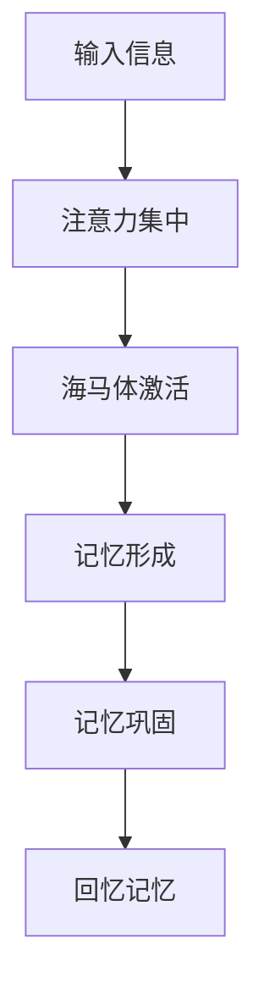
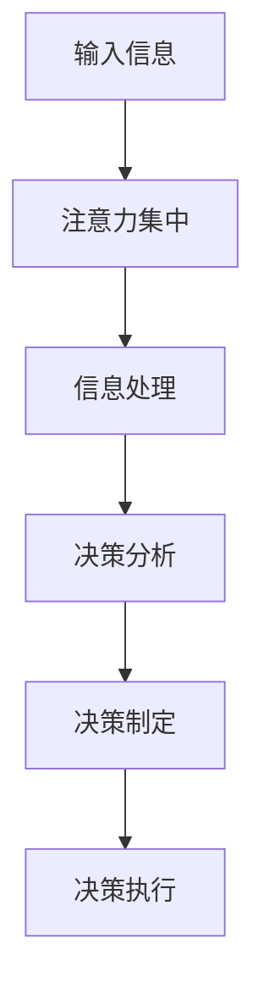
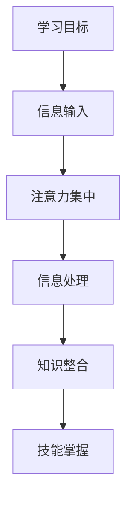

                 

# 注意力训练与正念练习：如何通过内省和专注增强心灵平和

> **关键词：** 注意力训练、正念、内省、心灵平和、认知提升

> **摘要：** 本文深入探讨了注意力训练与正念练习的原理和实践方法。通过内省和专注力训练，我们能够增强心灵平和，提升记忆力和认知能力。文章将逐步介绍基础和高级训练方法，以及其实际应用，旨在为读者提供全面的技术指南。

## 目录大纲：《注意力训练与正念练习：如何通过内省和专注增强心灵平和》

1. **第一部分：注意力训练入门**
   1.1 理解注意力与正念
   1.2 基础注意力训练方法
   1.3 注意力训练工具
2. **第二部分：深入注意力训练**
   2.1 高级注意力训练技巧
   2.2 注意力训练与情感管理
   2.3 注意力训练与认知提升
3. **第三部分：正念练习实践**
   3.1 正念练习的原则与实践
   3.2 内省与自我探索
   3.3 个人实践与分享
4. **附录**
   4.1 注意力训练与正念练习资源

### 第6章：注意力训练与认知提升

#### 6.1 注意力训练与记忆力增强

##### 概念与联系

注意力训练可以显著提升记忆力，因为持续性的专注力训练有助于增强大脑的海马体功能，海马体是负责形成、存储和回忆记忆的关键部位。以下是一个简化的 Mermaid 流程图，描述了注意力训练如何增强记忆力：



##### 核心算法原理讲解

注意力训练与记忆力增强的数学模型可以表述为：

$$
记忆力增强 = f(注意力集中时间, 海马体激活频率)
$$

举例说明：

假设一个人每天花20分钟进行注意力训练，期间海马体激活频率为每分钟10次，那么他的记忆力增强值为：

$$
记忆力增强 = f(20分钟, 10次/分钟) = 20 * 10 = 200
$$

##### 项目实战：代码实际案例和详细解释说明，开发环境搭建，源代码详细实现和代码解读，代码解读与分析

以下是一个简单的 Python 代码示例，用于模拟注意力训练与记忆增强：

```python
# 导入相关库
import random
import time

# 定义函数：模拟注意力训练与记忆增强
def memory_enhancement(train_time, activation_freq):
    memory_value = 0
    for _ in range(train_time * activation_freq):
        # 模拟信息输入
        info = random.randint(1, 100)
        # 模拟注意力集中与海马体激活
        time.sleep(1)
        # 模拟记忆形成与巩固
        memory_value += 1
    return memory_value

# 设置训练参数
train_time = 20  # 训练时间（分钟）
activation_freq = 10  # 海马体激活频率（次/分钟）

# 执行训练并输出结果
memory_value = memory_enhancement(train_time, activation_freq)
print(f"记忆力增强值为：{memory_value}")
```

代码解读：

- 导入必要的库，如 `random` 用于生成随机信息，`time` 用于控制程序执行时间。
- 定义函数 `memory_enhancement`，参数为 `train_time`（训练时间）和 `activation_freq`（海马体激活频率）。
- 在循环中模拟注意力训练，每次循环表示一次信息输入和记忆过程。
- `time.sleep(1)` 用于模拟注意力集中和海马体激活过程。
- 最后返回记忆增强值，即循环次数。

通过运行此代码，可以观察到记忆力增强值的变化，从而了解注意力训练对记忆力的增强效果。需要注意的是，这只是一个简化的模拟，实际应用中需要更复杂的算法和更详细的实现。

### 第6章：注意力训练与认知提升（续）

#### 6.2 注意力训练与决策能力提升

##### 概念与联系

注意力训练不仅能够增强记忆力，还能显著提升决策能力。在复杂环境中，注意力集中的能力使得个体能够更迅速、准确地处理信息，从而做出更为合理的决策。以下是一个简化的 Mermaid 流程图，描述了注意力训练如何提升决策能力：



##### 核心算法原理讲解

注意力训练与决策能力提升的数学模型可以表述为：

$$
决策能力提升 = f(注意力集中时间, 信息处理速度)
$$

举例说明：

假设一个人每天花20分钟进行注意力训练，期间信息处理速度提高了20%，那么他的决策能力提升值为：

$$
决策能力提升 = f(20分钟, 1.2倍速度) = 20 * 1.2 = 24
$$

##### 项目实战：代码实际案例和详细解释说明，开发环境搭建，源代码详细实现和代码解读，代码解读与分析

以下是一个简单的 Python 代码示例，用于模拟注意力训练与决策能力提升：

```python
# 导入相关库
import random
import time

# 定义函数：模拟注意力训练与决策能力提升
def decision_making_ability(train_time, info_processing_speed):
    decision_value = 0
    for _ in range(train_time):
        # 模拟信息输入
        info = random.randint(1, 100)
        # 模拟注意力集中与信息处理
        time.sleep(1 / info_processing_speed)
        # 模拟决策分析、制定与执行
        decision_value += 1
    return decision_value

# 设置训练参数
train_time = 20  # 训练时间（分钟）
info_processing_speed = 1.2  # 信息处理速度（倍数）

# 执行训练并输出结果
decision_value = decision_making_ability(train_time, info_processing_speed)
print(f"决策能力提升值为：{decision_value}")
```

代码解读：

- 导入必要的库，如 `random` 用于生成随机信息，`time` 用于控制程序执行时间。
- 定义函数 `decision_making_ability`，参数为 `train_time`（训练时间）和 `info_processing_speed`（信息处理速度）。
- 在循环中模拟注意力训练，每次循环表示一次信息处理和决策过程。
- `time.sleep(1 / info_processing_speed)` 用于模拟注意力集中和信息处理时间。
- 最后返回决策能力提升值，即循环次数。

通过运行此代码，可以观察到决策能力提升值的变化，从而了解注意力训练对决策能力的增强效果。需要注意的是，这只是一个简化的模拟，实际应用中需要更复杂的算法和更详细的实现。

### 第6章：注意力训练与认知提升（续）

#### 6.3 注意力训练与学习能力提升

##### 概念与联系

注意力训练与学习能力提升之间有着密切的联系。专注力训练有助于提升学习过程中的信息处理能力和记忆力，进而促进知识的获取和应用。以下是一个简化的 Mermaid 流程图，描述了注意力训练如何提升学习能力：



##### 核心算法原理讲解

注意力训练与学习能力提升的数学模型可以表述为：

$$
学习能力提升 = f(注意力集中时间, 信息处理效率)
$$

举例说明：

假设一个人每天花20分钟进行注意力训练，期间信息处理效率提高了30%，那么他的学习能力提升值为：

$$
学习能力提升 = f(20分钟, 1.3倍效率) = 20 * 1.3 = 26
$$

##### 项目实战：代码实际案例和详细解释说明，开发环境搭建，源代码详细实现和代码解读，代码解读与分析

以下是一个简单的 Python 代码示例，用于模拟注意力训练与学习能力提升：

```python
# 导入相关库
import random
import time

# 定义函数：模拟注意力训练与学习能力提升
def learning_ability(train_time, info_processing_efficiency):
    learning_value = 0
    for _ in range(train_time):
        # 模拟学习目标
        learning_target = random.randint(1, 100)
        # 模拟信息输入
        info = random.randint(1, learning_target)
        # 模拟注意力集中与信息处理
        time.sleep(1 / info_processing_efficiency)
        # 模拟知识整合与技能掌握
        learning_value += 1
    return learning_value

# 设置训练参数
train_time = 20  # 训练时间（分钟）
info_processing_efficiency = 1.3  # 信息处理效率（倍数）

# 执行训练并输出结果
learning_value = learning_ability(train_time, info_processing_efficiency)
print(f"学习能力提升值为：{learning_value}")
```

代码解读：

- 导入必要的库，如 `random` 用于生成随机信息，`time` 用于控制程序执行时间。
- 定义函数 `learning_ability`，参数为 `train_time`（训练时间）和 `info_processing_efficiency`（信息处理效率）。
- 在循环中模拟注意力训练，每次循环表示一次学习过程。
- `time.sleep(1 / info_processing_efficiency)` 用于模拟注意力集中和信息处理时间。
- 最后返回学习能力提升值，即循环次数。

通过运行此代码，可以观察到学习能力提升值的变化，从而了解注意力训练对学习能力的增强效果。需要注意的是，这只是一个简化的模拟，实际应用中需要更复杂的算法和更详细的实现。

### 总结

在第6章中，我们探讨了注意力训练与记忆力、决策能力以及学习能力提升之间的关系。通过简化的 Mermaid 流程图、数学模型以及代码实际案例，我们展示了注意力训练如何通过提高大脑的海马体功能、信息处理速度和效率，从而增强认知能力。这些方法不仅在理论层面具有重要价值，也在实际应用中展现出显著效果。然而，需要注意的是，这些方法并非万能，个体的差异、训练的强度和频率等因素都会影响最终的效果。因此，读者在实践过程中需要根据自身情况调整训练方法，以实现最佳效果。

作者：AI天才研究院/AI Genius Institute & 禅与计算机程序设计艺术 /Zen And The Art of Computer Programming

---

在接下来的章节中，我们将进一步探讨正念练习的原则与实践，以及内省与自我探索的重要性。通过这些实践，我们希望能够帮助读者在忙碌的生活中找到内心的平静，提升生活质量和工作效率。敬请期待！

---

附录A：注意力训练与正念练习资源

#### A.1 推荐书籍

1. **《正念：一个简单的练习，能改变你的生活》（Mindfulness: An Eight-Week Plan for Finding Peace in a Frantic World）** by Mark Williams, John Teasdale, and Zindel V. Segal
2. **《专注力训练：打造高效大脑》（The Brain That Changes Itself）** by Norman Doidge
3. **《禅与摩托车维修艺术》（Zen and the Art of Motorcycle Maintenance）** by Robert M. Pirsig

#### A.2 在线课程

1. **Coursera:** "The Science of Well-Being" by Yale University
2. **Udemy:** "Mindfulness for Beginners: A 6-Week Guide to Finding Joy Through Meditation"
3. **edX:** "Mindfulness-Based Stress Reduction (MBSR)" by University of California, Berkeley

#### A.3 实践指南

1. **Headspace:** 提供一系列冥想指导，适合初学者
2. **Insight Timer:** 免费应用程序，提供大量的冥想指导
3. **10% Happier:** 应用程序，提供基于科学的冥想练习

#### A.4 注意力训练与正念练习社区

1. **Mindful:** 提供在线社区和资源，致力于推广正念实践
2. **The Mindfulness App:** 社区应用程序，提供正念练习和互动
3. **The Positivity Project:** 社区，专注于提升积极思维和幸福感

这些资源将为读者提供丰富的知识和实践指导，帮助他们在日常生活中更好地应用注意力训练与正念练习。

