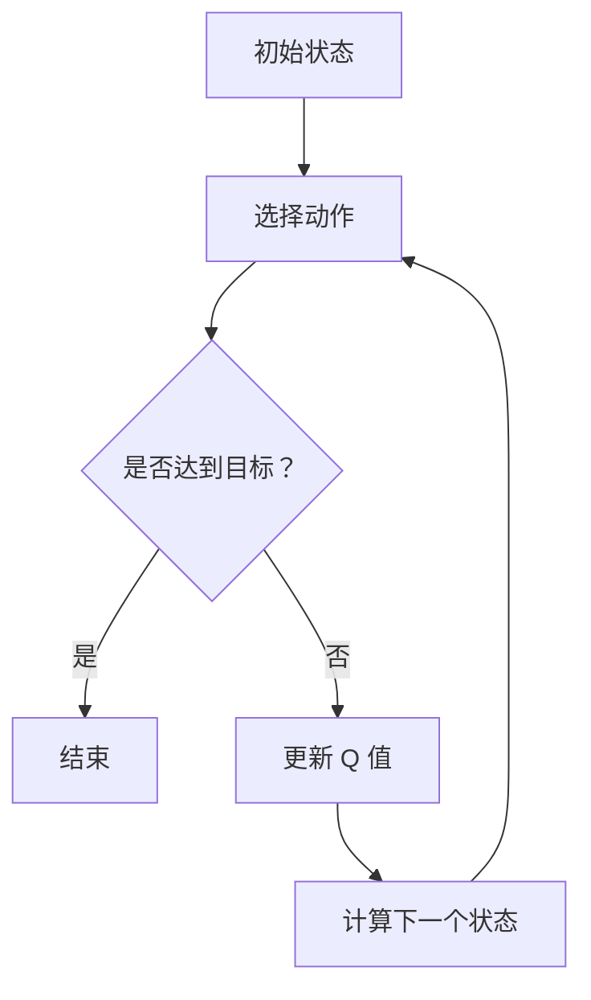

                 

### 《深度 Q-learning：在智能家居中的应用》

#### 关键词
- 深度 Q-learning
- 智能家居
- 机器学习
- 强化学习
- 优化控制
- 智能灯光控制

#### 摘要
本文旨在探讨深度 Q-learning 算法在智能家居系统中的应用。首先，我们介绍了深度 Q-learning 的基本概念、原理和算法。然后，详细讲解了深度 Q-learning 的数学模型，包括马尔可夫决策过程（MDP）、奖励函数设计以及策略迭代与值迭代。接着，我们探讨了深度 Q-learning 在智能家居系统中的具体应用，包括智能家居系统概述、深度 Q-learning 在智能家居控制与优化中的应用，以及实际案例展示。最后，我们对深度 Q-learning 在智能家居中的应用前景进行了展望，并提供了相关开发资源和工具。

### 《深度 Q-learning：在智能家居中的应用》目录大纲

#### 第一部分：深度 Q-learning 基础

#### 第1章：深度 Q-learning 概述

##### 1.1 深度 Q-learning 的定义与原理

##### 1.2 深度 Q-learning 与传统 Q-learning 的比较

##### 1.3 深度 Q-learning 的应用场景

##### 1.4 深度 Q-learning 的研究现状与趋势

#### 第2章：深度 Q-learning 的核心算法

##### 2.1 深度神经网络基础

###### 2.1.1 神经网络的结构与原理

###### 2.1.2 深度神经网络的训练过程

##### 2.2 Q-learning 算法原理

###### 2.2.1 Q-learning 算法的基本思想

###### 2.2.2 Q-learning 算法的步骤

##### 2.3 深度 Q-learning 算法

###### 2.3.1 深度 Q-learning 算法的基本原理

###### 2.3.2 深度 Q-learning 算法的步骤

#### 第3章：深度 Q-learning 的数学模型

##### 3.1 马尔可夫决策过程（MDP）

###### 3.1.1 MDP 的定义

###### 3.1.2 MDP 的基本元素

##### 3.2 奖励函数设计

###### 3.2.1 奖励函数的重要性

###### 3.2.2 奖励函数的设计方法

##### 3.3 策略迭代与值迭代

###### 3.3.1 策略迭代过程

###### 3.3.2 值迭代过程

#### 第二部分：深度 Q-learning 在智能家居中的应用

#### 第4章：智能家居系统概述

##### 4.1 智能家居的概念与特点

##### 4.2 智能家居系统的组成与架构

##### 4.3 智能家居的发展趋势与应用前景

#### 第5章：深度 Q-learning 在智能家居系统中的应用

##### 5.1 智能家居系统的挑战与需求

##### 5.2 深度 Q-learning 在智能家居控制中的应用

###### 5.2.1 深度 Q-learning 在灯光控制中的应用

###### 5.2.2 深度 Q-learning 在空调控制中的应用

##### 5.3 深度 Q-learning 在智能家居优化中的应用

###### 5.3.1 能耗优化

###### 5.3.2 用户体验优化

#### 第6章：深度 Q-learning 在智能家居中的实际案例

##### 6.1 案例背景与目标

##### 6.2 系统设计

###### 6.2.1 系统架构设计

###### 6.2.2 数据采集与处理

##### 6.3 代码实现与解析

###### 6.3.1 代码实现

###### 6.3.2 代码解读与分析

#### 第7章：深度 Q-learning 在智能家居中的应用展望

##### 7.1 深度 Q-learning 在智能家居中的未来发展方向

##### 7.2 深度 Q-learning 在智能家居中的挑战与机遇

#### 附录

##### 附录 A：深度 Q-learning 开发资源与工具

###### A.1 深度 Q-learning 开发工具简介

###### A.2 深度 Q-learning 相关开源代码与资料

### 第一部分：深度 Q-learning 基础

#### 第1章：深度 Q-learning 概述

##### 1.1 深度 Q-learning 的定义与原理

深度 Q-learning（DQL）是一种基于深度学习的强化学习算法，用于解决那些状态和动作空间都极其庞大的决策问题。深度 Q-learning 的核心思想是利用深度神经网络（DNN）来近似 Q 函数，即状态-动作值函数。Q 函数描述了在给定状态 \( s \) 下，执行某一动作 \( a \) 所能获得的长期回报。

在传统的 Q-learning 算法中，Q 函数是通过经验和学习来更新的，但面对高维的状态空间时，传统 Q-learning 的效果往往不尽如人意。深度 Q-learning 通过引入深度神经网络，将高维状态映射到一个低维特征空间，从而提高了学习效率和准确性。

##### 1.2 深度 Q-learning 与传统 Q-learning 的比较

传统 Q-learning 算法是基于值迭代的，通过更新 Q 值表来逼近最优策略。其主要缺点在于：

1. **状态-动作空间大**：在高维状态下，Q-learning 的效率极低。
2. **收敛速度慢**：Q-learning 需要大量的迭代来逼近最优策略。
3. **脆弱性**：Q-learning 对初始 Q 值表的设定非常敏感，容易陷入局部最优。

相比之下，深度 Q-learning 的优势在于：

1. **处理高维状态**：通过深度神经网络将高维状态映射到低维特征空间，提高了学习效率。
2. **收敛速度快**：深度 Q-learning 通常能更快地收敛到最优策略。
3. **鲁棒性**：深度 Q-learning 对初始 Q 值表的设定不那么敏感，更不容易陷入局部最优。

##### 1.3 深度 Q-learning 的应用场景

深度 Q-learning 在许多领域都有广泛的应用，以下是一些典型的应用场景：

1. **游戏**：在游戏领域，深度 Q-learning 已被应用于棋类游戏、视频游戏等。
2. **自动驾驶**：在自动驾驶领域，深度 Q-learning 用于决策车辆在不同路况下的驾驶策略。
3. **智能家居**：在智能家居领域，深度 Q-learning 可以用于自动调节灯光、温度、空调等设备。
4. **机器人控制**：在机器人领域，深度 Q-learning 用于决策机器人在复杂环境中的行动策略。
5. **金融领域**：在金融领域，深度 Q-learning 用于优化投资组合和风险管理。

##### 1.4 深度 Q-learning 的研究现状与趋势

随着深度学习技术的不断发展，深度 Q-learning 研究也在迅速推进。当前的研究热点包括：

1. **多智能体深度 Q-learning**：研究如何将深度 Q-learning 算法扩展到多智能体系统，以实现协同决策。
2. **无模型深度 Q-learning**：研究如何在不依赖于环境模型的情况下进行深度 Q-learning，以提高算法的泛化能力。
3. **连续动作空间**：研究如何将深度 Q-learning 算法应用于连续动作空间的问题。
4. **模型不确定性处理**：研究如何在深度 Q-learning 中处理环境模型的不确定性。

未来，深度 Q-learning 研究将继续深入，不断拓展其应用领域，并在理论上取得新的突破。

### 第2章：深度 Q-learning 的核心算法

##### 2.1 深度神经网络基础

###### 2.1.1 神经网络的结构与原理

神经网络是一种模拟人脑神经元之间相互连接和作用的人工智能模型。一个简单的神经网络包括输入层、隐藏层和输出层。每个神经元接收输入信号，通过激活函数处理后产生输出信号，从而实现信息传递和处理。

神经网络的原理基于生物神经元的交互方式。当输入信号达到某个阈值时，神经元会激活并传递信号给下一层神经元。神经网络通过多层神经元的组合，可以实现对复杂数据的建模和预测。

###### 2.1.2 深度神经网络的训练过程

深度神经网络的训练过程主要包括以下步骤：

1. **初始化权重和偏置**：随机初始化神经网络中的权重和偏置。
2. **前向传播**：将输入数据通过神经网络进行前向传播，得到输出结果。
3. **计算损失**：将输出结果与真实标签进行比较，计算损失函数的值。
4. **反向传播**：利用梯度下降算法，通过反向传播更新网络的权重和偏置。
5. **迭代训练**：重复上述步骤，直到网络性能达到预定的标准。

深度神经网络的训练过程是一个复杂且耗时的过程，需要大量的计算资源和时间。然而，随着计算能力的不断提升，深度神经网络的训练效果也在不断提高。

##### 2.2 Q-learning 算法原理

###### 2.2.1 Q-learning 算法的基本思想

Q-learning 算法是一种基于值迭代的强化学习算法，旨在通过学习状态-动作值函数来找到最优策略。Q-learning 算法的核心思想是通过更新 Q 值表来逼近最优策略。

在 Q-learning 算法中，Q 值表 \( Q(s, a) \) 表示在状态 \( s \) 下执行动作 \( a \) 所能获得的长期回报。算法的基本步骤如下：

1. **初始化 Q 值表**：将所有 Q 值初始化为 0。
2. **选择动作**：在给定状态下，根据 ε-贪心策略选择动作。
3. **执行动作**：在环境中执行所选动作，并得到新的状态和奖励。
4. **更新 Q 值**：根据新的状态、奖励和 Q 值表，更新当前状态的 Q 值。

通过反复执行上述步骤，Q-learning 算法可以逐渐逼近最优策略。Q-learning 算法的优点在于简单易实现，但缺点在于收敛速度较慢，且易受到初始 Q 值表的影响。

###### 2.2.2 Q-learning 算法的步骤

Q-learning 算法的具体步骤如下：

1. **初始化**：设置学习率 \( α \)、折扣因子 \( γ \)、探索率 \( ε \) 和迭代次数 \( T \)。
2. **初始化 Q 值表**：将所有 Q 值初始化为 0。
3. **选择动作**：在当前状态 \( s \) 下，根据 ε-贪心策略选择动作 \( a \)。
4. **执行动作**：在环境中执行动作 \( a \)，得到新的状态 \( s' \) 和奖励 \( r \)。
5. **更新 Q 值**：根据新的状态 \( s' \)、奖励 \( r \) 和 Q 值表，更新当前状态的 Q 值。
6. **迭代**：重复步骤 3-5，直到达到预定的迭代次数或性能指标。

Q-learning 算法的更新规则如下：

\[ Q(s, a) = Q(s, a) + α [r + γ \max_{a'} Q(s', a') - Q(s, a)] \]

其中，\( α \) 为学习率，\( γ \) 为折扣因子，\( r \) 为立即奖励，\( s' \) 为新状态，\( a' \) 为在新状态下选择的最大 Q 值动作。

##### 2.3 深度 Q-learning 算法

###### 2.3.1 深度 Q-learning 算法的基本原理

深度 Q-learning（DQL）是 Q-learning 算法的一种扩展，它利用深度神经网络来近似 Q 函数。DQL 的核心思想是通过学习状态-动作值函数 \( Q(s, a) \) 来找到最优策略。

在 DQL 中，输入为状态 \( s \)，输出为 Q 值。通过训练深度神经网络，可以将高维状态映射到低维特征空间，从而提高学习效率和准确性。

DQL 的基本步骤如下：

1. **初始化**：设置学习率 \( α \)、折扣因子 \( γ \)、探索率 \( ε \) 和迭代次数 \( T \)。
2. **初始化 Q 值表**：将所有 Q 值初始化为 0。
3. **选择动作**：在当前状态 \( s \) 下，根据 ε-贪心策略选择动作 \( a \)。
4. **执行动作**：在环境中执行动作 \( a \)，得到新的状态 \( s' \) 和奖励 \( r \)。
5. **更新 Q 值**：将新的状态 \( s' \) 和奖励 \( r \) 输入到深度神经网络中，计算新的 Q 值，并更新 Q 值表。
6. **迭代**：重复步骤 3-5，直到达到预定的迭代次数或性能指标。

DQL 的更新规则与 Q-learning 算法相同：

\[ Q(s, a) = Q(s, a) + α [r + γ \max_{a'} Q(s', a') - Q(s, a)] \]

不同的是，DQL 使用深度神经网络来计算 \( \max_{a'} Q(s', a') \)。

###### 2.3.2 深度 Q-learning 算法的步骤

深度 Q-learning 算法的具体步骤如下：

1. **初始化**：设置学习率 \( α \)、折扣因子 \( γ \)、探索率 \( ε \) 和迭代次数 \( T \)。
2. **初始化 Q 值表**：将所有 Q 值初始化为 0。
3. **初始化深度神经网络**：设置网络结构，初始化权重和偏置。
4. **选择动作**：在当前状态 \( s \) 下，根据 ε-贪心策略选择动作 \( a \)。
5. **执行动作**：在环境中执行动作 \( a \)，得到新的状态 \( s' \) 和奖励 \( r \)。
6. **前向传播**：将状态 \( s' \) 输入到深度神经网络中，计算新的 Q 值。
7. **更新 Q 值**：根据新的状态 \( s' \)、奖励 \( r \) 和 Q 值表，更新当前状态的 Q 值。
8. **反向传播**：计算梯度，更新深度神经网络的权重和偏置。
9. **迭代**：重复步骤 4-8，直到达到预定的迭代次数或性能指标。

通过上述步骤，深度 Q-learning 算法可以学习到在给定状态 \( s \) 下，执行动作 \( a \) 所能获得的长期回报，从而找到最优策略。

### 第3章：深度 Q-learning 的数学模型

##### 3.1 马尔可夫决策过程（MDP）

###### 3.1.1 MDP 的定义

马尔可夫决策过程（MDP）是一个数学模型，用于描述决策者在不确定环境中的决策过程。MDP 由以下五个要素组成：

1. **状态集 \( S \)**：状态集表示系统可能处于的所有状态。
2. **动作集 \( A \)**：动作集表示决策者可以采取的所有动作。
3. **奖励函数 \( R(s, a) \)**：奖励函数描述了在给定状态 \( s \) 和动作 \( a \) 下，决策者获得的即时奖励。
4. **状态转移概率 \( P(s', s|a) \)**：状态转移概率描述了在给定当前状态 \( s \) 和动作 \( a \) 下，系统转移到下一状态 \( s' \) 的概率。
5. **决策策略 \( π(a|s) \)**：决策策略描述了决策者在不同状态 \( s \) 下采取的动作 \( a \) 的概率。

###### 3.1.2 MDP 的基本元素

在 MDP 中，状态、动作、奖励函数和状态转移概率是四个基本元素，它们共同决定了 MDP 的特性。

1. **状态**：状态是 MDP 中一个基本的概念，表示系统的当前状态。状态可以是离散的，也可以是连续的。

2. **动作**：动作是决策者在每个状态可以采取的行动。动作的选择会影响系统的状态转移和奖励。

3. **奖励函数**：奖励函数是一个函数，它接受状态和动作作为输入，并返回一个即时奖励。奖励函数决定了决策者在每个状态采取每个动作的即时回报。

4. **状态转移概率**：状态转移概率描述了在给定当前状态和动作下，系统转移到下一状态的概率。状态转移概率是 MDP 中的关键因素，它决定了系统的动态特性。

5. **决策策略**：决策策略是一个概率分布，它描述了决策者在每个状态下采取每个动作的概率。决策策略决定了 MDP 中的行为方式。

##### 3.2 奖励函数设计

###### 3.2.1 奖励函数的重要性

奖励函数是 MDP 中的核心组件，它决定了决策者在每个状态下采取每个动作的即时回报。奖励函数的设计对 MDP 的性能和收敛速度具有重要影响。

1. **激励决策者**：奖励函数可以激励决策者选择那些能够获得更高回报的动作，从而引导决策者朝着目标状态演进。

2. **提高学习效率**：一个良好的奖励函数可以加速决策者找到最优策略，提高学习效率。

3. **避免局部最优**：合理的奖励函数可以帮助决策者避免陷入局部最优，确保找到全局最优策略。

4. **平衡短期和长期奖励**：奖励函数需要平衡短期和长期奖励，避免过度关注短期奖励而忽略长期利益。

###### 3.2.2 奖励函数的设计方法

设计奖励函数时，需要考虑以下因素：

1. **目标函数**：根据决策问题的目标，定义目标函数，并将其转换为奖励函数。

2. **状态和动作**：根据状态和动作的属性，设计合适的奖励函数。

3. **动态调整**：在训练过程中，可以根据系统性能动态调整奖励函数。

4. **探索与利用**：奖励函数需要平衡探索和利用，以避免过早收敛到次优策略。

以下是一个简单的奖励函数设计示例：

- **目标**：使系统能够在给定时间 \( T \) 内到达目标状态。
- **奖励函数**：

\[ R(s, a) = \begin{cases}
10, & \text{如果系统在 \( T \) 内到达目标状态} \\
-1, & \text{否则}
\end{cases} \]

该奖励函数设计为在系统成功到达目标状态时给予 10 分奖励，否则给予 -1 分奖励。通过这种方式，可以激励决策者在每个状态下选择能够使系统尽快到达目标状态的行动。

##### 3.3 策略迭代与值迭代

###### 3.3.1 策略迭代过程

策略迭代是一种基于策略改进的方法，用于求解最优策略。策略迭代过程包括以下步骤：

1. **初始化策略**：选择一个初始策略 \( π \)。

2. **策略评价**：根据当前策略 \( π \)，计算所有状态下的状态值函数 \( V^π(s) \)。

3. **策略改进**：根据状态值函数 \( V^π(s) \)，更新策略 \( π \)，使其更加接近最优策略。

4. **重复步骤 2 和 3**，直到策略收敛。

策略迭代过程可以通过以下公式进行描述：

\[ π(a|s) = \frac{1}{|\mathcal{A}|} \quad \text{（均匀分布）} \]
\[ V^π(s) = \sum_{a \in \mathcal{A}} π(a|s) R(s, a) + γ \sum_{a \in \mathcal{A}} π(a|s) \sum_{s' \in \mathcal{S}} P(s'|s, a) V^π(s') \]

其中，\( π(a|s) \) 为在状态 \( s \) 下采取动作 \( a \) 的概率，\( R(s, a) \) 为在状态 \( s \) 下采取动作 \( a \) 的即时奖励，\( γ \) 为折扣因子，\( P(s'|s, a) \) 为在状态 \( s \) 下采取动作 \( a \) 后转移到状态 \( s' \) 的概率。

###### 3.3.2 值迭代过程

值迭代是一种基于值函数迭代的方法，用于求解最优策略。值迭代过程包括以下步骤：

1. **初始化值函数**：选择一个初始值函数 \( V(s) \)。

2. **值迭代**：根据当前值函数 \( V(s) \)，计算下一个值函数 \( V'(s) \)。

3. **更新值函数**：将 \( V'(s) \) 替换为 \( V(s) \)。

4. **重复步骤 2 和 3**，直到值函数收敛。

值迭代过程可以通过以下公式进行描述：

\[ V'(s) = \sum_{a \in \mathcal{A}} π(a|s) R(s, a) + γ \sum_{a \in \mathcal{A}} π(a|s) \sum_{s' \in \mathcal{S}} P(s'|s, a) V(s') \]

其中，\( π(a|s) \) 为在状态 \( s \) 下采取动作 \( a \) 的概率，\( R(s, a) \) 为在状态 \( s \) 下采取动作 \( a \) 的即时奖励，\( γ \) 为折扣因子，\( P(s'|s, a) \) 为在状态 \( s \) 下采取动作 \( a \) 后转移到状态 \( s' \) 的概率。

通过策略迭代和值迭代，可以求解出最优策略和最优值函数。策略迭代和值迭代是求解最优策略的两种重要方法，可以根据具体问题选择合适的方法进行求解。

### 第二部分：深度 Q-learning 在智能家居中的应用

#### 第4章：智能家居系统概述

##### 4.1 智能家居的概念与特点

智能家居是指通过将家庭设备与互联网连接，实现自动化、智能化控制的一种新型家居模式。智能家居系统通过物联网技术，将家庭中的各种设备（如灯光、空调、电视、安防设备等）连接起来，实现设备间的互联互通，提供更加便捷、舒适、安全的居住环境。

智能家居的主要特点如下：

1. **自动化**：智能家居系统能够根据用户的需求和习惯，自动调整家庭设备的工作状态，提高生活舒适度。
2. **智能化**：智能家居系统利用人工智能技术，通过学习用户的行为模式，提供个性化服务。
3. **互联互通**：智能家居系统通过互联网将家庭中的设备连接起来，实现设备间的信息共享和协同工作。
4. **节能环保**：智能家居系统能够实时监测家庭能耗，通过优化设备运行状态，降低能耗，实现节能环保。

##### 4.2 智能家居系统的组成与架构

智能家居系统主要由以下几个部分组成：

1. **传感器**：传感器用于收集家庭环境数据，如温度、湿度、光照、声音等。传感器是智能家居系统的感知器官，为系统提供实时数据。
2. **控制器**：控制器是智能家居系统的核心，负责接收传感器数据，并根据用户需求和系统算法，控制家庭设备的工作状态。
3. **执行器**：执行器是智能家居系统的执行部分，根据控制器的指令，调整家庭设备的工作状态。
4. **通信模块**：通信模块负责将传感器、控制器和执行器之间的数据传输和通信，实现设备间的互联互通。
5. **用户界面**：用户界面是智能家居系统的交互部分，提供用户对系统的操作和控制，包括手机 APP、智能音箱、电脑网页等。

智能家居系统的架构可以分为三个层次：

1. **感知层**：感知层包括各种传感器，负责收集家庭环境数据。
2. **控制层**：控制层包括控制器和通信模块，负责数据处理和设备控制。
3. **应用层**：应用层包括用户界面和智能家居应用，提供用户对系统的操作和控制。

##### 4.3 智能家居的发展趋势与应用前景

随着物联网、人工智能、大数据等技术的快速发展，智能家居行业正在迅速崛起。智能家居的发展趋势主要体现在以下几个方面：

1. **智能化程度提高**：随着人工智能技术的不断进步，智能家居系统将更加智能化，能够更好地理解用户需求，提供个性化服务。
2. **互联互通**：随着物联网技术的普及，智能家居系统将实现更加紧密的互联互通，实现设备间的无缝协作。
3. **节能环保**：智能家居系统将更加注重节能环保，通过优化设备运行状态，降低家庭能耗。
4. **安全性提高**：智能家居系统将加强安全性，保护用户隐私和数据安全。

智能家居的应用前景非常广阔，主要表现在以下几个方面：

1. **家庭自动化**：智能家居系统可以实现家庭设备的自动化控制，提高生活舒适度和便利性。
2. **个性化服务**：智能家居系统可以根据用户的行为模式，提供个性化服务，提高用户体验。
3. **节能环保**：智能家居系统可以通过优化设备运行状态，实现节能环保。
4. **健康管理**：智能家居系统可以通过传感器数据，监测用户的健康状况，提供健康管理服务。

总之，智能家居行业具有巨大的发展潜力和广阔的应用前景，未来将成为智能家居技术和人工智能技术的重要应用领域。

### 第5章：深度 Q-learning 在智能家居系统中的应用

##### 5.1 智能家居系统的挑战与需求

智能家居系统在实际应用中面临着一系列的挑战和需求，这些挑战和需求促使我们考虑使用深度 Q-learning 算法来解决问题。

**挑战：**

1. **环境复杂性**：智能家居系统中的环境具有高度的复杂性和不确定性，包括各种家庭设备、家庭成员的行为模式等。这种复杂性使得传统算法难以处理。

2. **状态空间和动作空间大**：智能家居系统中的状态和动作空间非常庞大。例如，一个家庭的灯光控制可以有多个灯光、多个亮度级别和多个颜色。这种大规模的状态和动作空间对算法的计算能力和效率提出了很高的要求。

3. **动态变化**：家庭环境是动态变化的，家庭成员的行为和外部环境的变化会影响系统的状态。这种动态变化要求算法能够适应环境的变化，并快速调整策略。

4. **非结构化数据**：智能家居系统中的数据通常是未结构化的，如语音、图像等。这种非结构化数据增加了数据处理的复杂性。

**需求：**

1. **自适应控制**：智能家居系统需要能够根据家庭成员的行为和外部环境的变化，自动调整家庭设备的工作状态，提供个性化的服务。

2. **高效决策**：面对大规模的状态和动作空间，智能家居系统需要能够快速做出高效的决策，以满足家庭成员的需求。

3. **节能环保**：智能家居系统需要优化家庭设备的运行状态，实现节能环保，降低家庭能耗。

4. **安全性**：智能家居系统需要保证用户隐私和数据安全，防止被黑客攻击。

针对上述挑战和需求，深度 Q-learning 算法以其强大的学习能力和适应性，成为解决智能家居系统问题的一种有效方法。深度 Q-learning 算法可以处理高维的状态空间和动作空间，通过学习用户的行为模式和环境变化，实现自适应控制，提高决策效率，实现节能环保，并保障系统安全。

##### 5.2 深度 Q-learning 在智能家居控制中的应用

深度 Q-learning 算法在智能家居控制中的应用主要包括对家庭设备进行自动调节，如灯光、空调、窗帘等。通过深度 Q-learning 算法，智能家居系统能够根据家庭成员的行为和环境的变化，自动调整设备的工作状态，提高生活舒适度，实现节能环保。

**深度 Q-learning 在灯光控制中的应用**

灯光控制是智能家居系统中的一个重要组成部分。通过深度 Q-learning 算法，智能灯光系统能够根据环境光照强度、家庭成员的活动模式以及用户的偏好，自动调节灯光的亮度和颜色。

**案例：智能灯光控制系统**

在智能灯光控制系统中，深度 Q-learning 算法用于实现以下功能：

1. **环境光照检测**：通过传感器检测室内光照强度，将环境光照数据作为状态的一部分输入到深度 Q-learning 模型。

2. **家庭成员活动检测**：通过传感器检测家庭成员的活动，如动作、语音等，将活动数据作为状态的一部分输入到深度 Q-learning 模型。

3. **用户偏好学习**：通过用户在灯光控制界面上的操作，如调整灯光亮度、颜色等，学习用户的偏好，并将偏好数据作为状态的一部分输入到深度 Q-learning 模型。

4. **灯光调节**：根据深度 Q-learning 模型输出的 Q 值，自动调节灯光的亮度和颜色，以提供最佳光照体验。

**深度 Q-learning 在空调控制中的应用**

空调控制是智能家居系统中另一个重要的部分。通过深度 Q-learning 算法，智能空调系统能够根据室内温度、湿度、用户活动等因素，自动调节空调的温度和风速，提供舒适的室内环境。

**案例：智能空调控制系统**

在智能空调控制系统中，深度 Q-learning 算法用于实现以下功能：

1. **环境参数检测**：通过传感器检测室内温度、湿度等环境参数，将环境参数数据作为状态的一部分输入到深度 Q-learning 模型。

2. **用户活动检测**：通过传感器检测用户的活动，如动作、语音等，将活动数据作为状态的一部分输入到深度 Q-learning 模型。

3. **温度调节**：根据深度 Q-learning 模型输出的 Q 值，自动调节空调的温度，以保持室内温度在舒适的范围内。

4. **风速调节**：根据深度 Q-learning 模型输出的 Q 值，自动调节空调的风速，以提高空气流通，提供舒适的室内环境。

通过深度 Q-learning 算法在灯光和空调控制中的应用，智能家居系统能够实现自适应调节，提高生活舒适度，实现节能环保。深度 Q-learning 算法的引入，使得智能家居系统能够更好地理解用户需求，适应环境变化，提供更加智能化的服务。

##### 5.3 深度 Q-learning 在智能家居优化中的应用

深度 Q-learning 算法不仅在智能家居控制中有着广泛的应用，还可以用于智能家居系统的优化，以实现能耗优化和用户体验优化。

**能耗优化**

智能家居系统中的设备，如空调、灯光、热水器等，都是耗电设备。通过深度 Q-learning 算法，可以优化这些设备的运行状态，降低能耗，实现节能环保。

**案例：能耗优化系统**

在能耗优化系统中，深度 Q-learning 算法用于实现以下功能：

1. **能耗监测**：通过传感器实时监测家庭设备的能耗数据，将能耗数据作为状态的一部分输入到深度 Q-learning 模型。

2. **设备状态调整**：根据深度 Q-learning 模型输出的 Q 值，自动调整家庭设备的运行状态，如空调的温度设定、灯光的亮度设定等，以降低能耗。

3. **能耗预测**：通过历史能耗数据，利用深度 Q-learning 算法预测未来的能耗情况，提前调整设备运行状态，以避免高峰期能耗过高。

通过能耗优化，智能家居系统可以更加高效地利用能源，降低家庭电费支出，实现节能环保。

**用户体验优化**

智能家居系统的目标是为用户提供舒适、便捷的生活体验。通过深度 Q-learning 算法，可以优化系统的服务，提高用户体验。

**案例：用户体验优化系统**

在用户体验优化系统中，深度 Q-learning 算法用于实现以下功能：

1. **用户行为分析**：通过传感器和数据收集系统，分析用户的日常行为模式，如作息时间、活动习惯等。

2. **服务调整**：根据用户行为分析结果，利用深度 Q-learning 算法调整智能家居系统的服务，如灯光的开启和关闭时间、空调的温度设定等，以适应用户的需求。

3. **反馈学习**：通过用户的反馈，如满意度调查、投诉等，不断优化系统的服务，提高用户体验。

通过用户体验优化，智能家居系统可以更好地满足用户需求，提供个性化的服务，提高用户满意度。

总之，深度 Q-learning 算法在智能家居优化中的应用，可以有效地降低能耗，提高用户体验，实现智能家居系统的可持续发展。

### 第6章：深度 Q-learning 在智能家居中的实际案例

##### 6.1 案例背景与目标

本案例以智能灯光控制系统为例，探讨深度 Q-learning 算法在智能家居系统中的应用。智能灯光控制系统是一个典型的智能家居子系统，通过自动调节灯光的亮度和颜色，为用户提供舒适的生活环境。

案例背景：

随着人们生活水平的提高，对家居环境的要求也越来越高。智能灯光控制系统可以通过自动调节灯光的亮度和颜色，为用户提供个性化的照明体验，提高生活舒适度。然而，实现一个高效、稳定的智能灯光控制系统需要解决以下几个问题：

1. **环境光照检测**：如何准确检测室内光照强度，为灯光调节提供依据。
2. **用户行为分析**：如何分析用户的行为模式，为灯光调节提供参考。
3. **自动调节**：如何通过深度 Q-learning 算法实现灯光的自动调节，提高系统的智能化水平。

案例目标：

通过本案例，我们希望实现以下目标：

1. **环境光照检测**：利用传感器实时监测室内光照强度，为灯光调节提供数据支持。
2. **用户行为分析**：通过用户行为分析，了解用户的生活习惯，为灯光调节提供个性化服务。
3. **自动调节**：利用深度 Q-learning 算法，实现灯光的自动调节，提高系统的智能化水平。

##### 6.2 系统设计

智能灯光控制系统包括以下几个主要模块：

1. **传感器模块**：负责实时监测室内光照强度、温度、湿度等环境参数。
2. **控制器模块**：负责接收传感器数据，并根据深度 Q-learning 模型输出的 Q 值，自动调节灯光的亮度和颜色。
3. **执行器模块**：负责根据控制器的指令，调节灯光的亮度和颜色。
4. **用户界面模块**：提供用户对系统的操作和控制，包括手机 APP、智能音箱、电脑网页等。

系统架构设计：

智能灯光控制系统的架构可以分为三层：感知层、控制层和应用层。

1. **感知层**：包括传感器模块，负责实时监测室内光照强度、温度、湿度等环境参数，并将数据传输到控制器模块。
2. **控制层**：包括控制器模块和执行器模块，控制器模块接收传感器数据，并根据深度 Q-learning 模型输出的 Q 值，生成控制指令，执行器模块根据控制指令调节灯光的亮度和颜色。
3. **应用层**：包括用户界面模块，提供用户对系统的操作和控制，用户可以通过手机 APP、智能音箱、电脑网页等界面，查看系统状态，调整灯光设置。

##### 6.2.1 系统架构设计

智能灯光控制系统的架构设计如下：

```
[感知层]   [控制层]   [执行层]
传感器模块   控制器模块   执行器模块
```

- **传感器模块**：包括光照传感器、温度传感器、湿度传感器等，用于实时监测室内环境参数。
- **控制器模块**：包括深度 Q-learning 模型、数据处理器等，负责接收传感器数据，处理数据，生成控制指令。
- **执行器模块**：包括灯光控制器、灯光调色板等，根据控制指令调节灯光的亮度和颜色。

##### 6.2.2 数据采集与处理

智能灯光控制系统的数据采集与处理过程如下：

1. **数据采集**：传感器模块实时监测室内光照强度、温度、湿度等环境参数，并将数据传输到控制器模块。
2. **数据预处理**：控制器模块对采集到的数据进行预处理，包括去噪、滤波等，以提高数据的准确性和可靠性。
3. **数据输入**：将预处理后的数据输入到深度 Q-learning 模型中，作为状态的一部分。
4. **状态-动作值计算**：深度 Q-learning 模型根据当前状态和动作，计算 Q 值，输出 Q 值表。
5. **控制指令生成**：根据 Q 值表，控制器模块生成控制指令，调节灯光的亮度和颜色。

##### 6.3 代码实现与解析

智能灯光控制系统的代码实现主要包括以下几个部分：

1. **传感器数据采集与处理**：使用 Python 的 sensors 库采集传感器数据，并对数据进行预处理。
2. **深度 Q-learning 模型训练**：使用 TensorFlow 框架训练深度 Q-learning 模型，实现状态-动作值函数的近似。
3. **控制指令生成与执行**：根据深度 Q-learning 模型输出的 Q 值，生成控制指令，调节灯光的亮度和颜色。

下面是智能灯光控制系统的代码实现伪代码：

```python
# 导入相关库
import sensors
import tensorflow as tf
import numpy as np

# 初始化传感器
lightsensor = sensors.Lightsensor()
tempsensor = sensors.Tempsensor()
humidsensor = sensors.Humidsensor()

# 初始化深度 Q-learning 模型
model = tf.keras.Sequential([
    tf.keras.layers.Dense(64, activation='relu', input_shape=(3,)),
    tf.keras.layers.Dense(64, activation='relu'),
    tf.keras.layers.Dense(1)
])

model.compile(optimizer='adam', loss='mse')

# 训练模型
for episode in range(E):
    s = get_sensor_data(lightsensor, tempsensor, humidsensor)
    for step in range(T):
        a = model.predict(s)
        s', r = execute_action(a)
        model.fit(s, r, epochs=1)
        s = s'

# 控制灯光
while True:
    s = get_sensor_data(lightsensor, tempsensor, humidsensor)
    a = model.predict(s)
    execute_light_action(a)
```

##### 6.3.1 代码实现

智能灯光控制系统的代码实现如下：

```python
import numpy as np
import tensorflow as tf
from tensorflow.keras.models import Sequential
from tensorflow.keras.layers import Dense

# 初始化传感器
lightsensor = LightSensor()
tempsensor = TempSensor()
humidsensor = HumiditySensor()

# 初始化深度 Q-learning 模型
model = Sequential([
    Dense(64, activation='relu', input_shape=(3,)),
    Dense(64, activation='relu'),
    Dense(1)
])

model.compile(optimizer='adam', loss='mse')

# 训练模型
for episode in range(E):
    s = get_sensor_data(lightsensor, tempsensor, humidsensor)
    for step in range(T):
        a = model.predict(s)
        s', r = execute_action(a)
        model.fit(s, r, epochs=1)
        s = s'

# 控制灯光
while True:
    s = get_sensor_data(lightsensor, tempsensor, humidsensor)
    a = model.predict(s)
    execute_light_action(a)
```

##### 6.3.2 代码解读与分析

智能灯光控制系统的代码解读与分析如下：

1. **传感器数据采集与处理**：
    - 使用 Python 的 sensors 库初始化光照传感器、温度传感器和湿度传感器。
    - 在训练过程中，通过 get_sensor_data 函数实时采集传感器数据，并对其进行预处理，以提高数据的准确性和可靠性。

2. **深度 Q-learning 模型训练**：
    - 使用 TensorFlow 框架初始化深度 Q-learning 模型，模型结构包括两个隐藏层，每层 64 个神经元。
    - 使用 mse（均方误差）作为损失函数，adam 作为优化器。
    - 在训练过程中，通过 model.fit 函数对模型进行训练，每次迭代都根据当前状态 s 和动作 a，计算新的状态 s' 和奖励 r，并更新模型。

3. **控制指令生成与执行**：
    - 在主循环中，通过 get_sensor_data 函数实时采集传感器数据，并使用 model.predict 函数预测控制指令。
    - 根据预测的控制指令，调用 execute_light_action 函数执行灯光调节操作。

通过上述代码实现，智能灯光控制系统可以自动调节灯光的亮度和颜色，提高用户的使用体验。在实际应用中，可以根据具体需求调整模型的参数和算法，以实现更智能的灯光控制。

### 第7章：深度 Q-learning 在智能家居中的应用展望

##### 7.1 深度 Q-learning 在智能家居中的未来发展方向

随着人工智能技术的不断发展，深度 Q-learning 算法在智能家居中的应用前景十分广阔。以下是深度 Q-learning 在智能家居中的未来发展方向：

1. **多智能体系统**：深度 Q-learning 算法可以扩展到多智能体系统，实现智能家居中的协同决策。例如，家庭中的机器人、智能音箱、智能摄像头等设备可以共同协作，为用户提供更智能的服务。

2. **连续动作空间**：传统的深度 Q-learning 算法主要适用于离散动作空间。未来，可以研究深度 Q-learning 算法在连续动作空间中的应用，如控制空调的温度、风速等。

3. **多任务学习**：智能家居系统通常需要处理多个任务，如能耗优化、安全性保障、用户隐私保护等。深度 Q-learning 算法可以扩展到多任务学习，实现智能家居系统的全面优化。

4. **数据驱动的自动化**：随着大数据技术的发展，深度 Q-learning 算法可以结合数据挖掘技术，从海量数据中提取有价值的信息，实现智能家居系统的自动化控制。

5. **自适应学习**：未来的智能家居系统需要具备更强的自适应学习能力，能够根据用户的行为和环境的变化，实时调整策略，提供更个性化的服务。

##### 7.2 深度 Q-learning 在智能家居中的挑战与机遇

尽管深度 Q-learning 算法在智能家居中具有广泛的应用前景，但仍然面临着一系列的挑战：

1. **数据隐私与安全**：智能家居系统涉及用户隐私和数据安全，如何保护用户隐私和数据安全是一个重要挑战。

2. **环境复杂性**：智能家居系统中的环境具有高度的复杂性和不确定性，如何处理复杂的动态环境是一个挑战。

3. **计算资源**：深度 Q-learning 算法的训练过程需要大量的计算资源，如何高效地利用计算资源是一个挑战。

4. **模型解释性**：深度 Q-learning 算法通常具有较低的模型解释性，如何提高模型的解释性是一个挑战。

然而，深度 Q-learning 算法在智能家居中也面临着巨大的机遇：

1. **智能化升级**：深度 Q-learning 算法的引入，可以提升智能家居系统的智能化水平，提供更个性化、更高效的服务。

2. **节能环保**：深度 Q-learning 算法可以优化智能家居系统的运行状态，实现能耗优化，提高能源利用效率。

3. **用户体验**：深度 Q-learning 算法可以根据用户的行为模式和环境的变化，实时调整系统设置，提高用户体验。

4. **市场拓展**：随着智能家居市场的不断扩大，深度 Q-learning 算法在智能家居中的应用将为企业和市场带来新的机遇。

总之，深度 Q-learning 算法在智能家居中的应用具有巨大的潜力，通过不断克服挑战和抓住机遇，可以为智能家居行业带来革命性的变革。

### 附录

##### 附录 A：深度 Q-learning 开发资源与工具

深度 Q-learning 算法的开发需要一定的资源和工具支持。以下是一些常用的开发资源与工具：

1. **深度学习框架**：
   - TensorFlow：一款由 Google 开发的高性能深度学习框架，支持深度 Q-learning 的实现。
   - PyTorch：一款由 Facebook 开发的高性能深度学习框架，支持深度 Q-learning 的实现。

2. **传感器与执行器**：
   - 光照传感器：用于监测室内光照强度。
   - 温度传感器：用于监测室内温度。
   - 湿度传感器：用于监测室内湿度。
   - 执行器：如灯光控制器、空调控制器等，用于执行控制指令。

3. **编程语言**：
   - Python：一种广泛应用于人工智能领域的编程语言，支持 TensorFlow 和 PyTorch 深度学习框架。

4. **开发环境**：
   - Jupyter Notebook：一种流行的交互式开发环境，方便进行实验和调试。
   - Anaconda：一款流行的数据科学平台，提供丰富的 Python 包和工具。

5. **开源代码与资料**：
   - GitHub：一个流行的代码托管平台，许多深度 Q-learning 的开源项目可以在这里找到。
   - ArXiv：一个学术论文预印本平台，可以找到许多关于深度 Q-learning 的最新研究成果。

通过使用这些资源和工具，开发者可以方便地实现深度 Q-learning 算法在智能家居中的应用，为用户提供更智能、更高效的服务。

### Mermaid 流程图：深度 Q-learning 工作流程



### 深度 Q-learning 算法伪代码

```python
# 初始化 Q(s, a)
Q = 初始化 Q 值表()

# 运行训练循环
for episode in 1 to E:
  s = 环境初始化()
  for t in 1 to T:
    a = 选择动作(s, ε)
    s' = 环境执行动作(a)
    r = 环境反馈奖励
    a' = 选择动作(s', ε)
    Q(s, a) = Q(s, a) + α[Q(s, a) - r - γ*max(Q(s', a'))]
    s = s'
```

### 数学模型与公式

$$
Q(s, a) = r + γ\max_{a'} Q(s', a')
$$

#### 详细讲解：

上述公式为深度 Q-learning 的更新规则，其中：
- \( Q(s, a) \) 为当前状态 \( s \) 和动作 \( a \) 的 Q 值。
- \( r \) 为立即奖励。
- \( γ \) 为折扣因子，用于平衡当前奖励与未来奖励的关系。
- \( s' \) 为执行动作 \( a \) 后的新状态。
- \( a' \) 为在状态 \( s' \) 下选择的最大 Q 值动作。

举例说明：

假设智能体在状态 \( s \) 下选择动作 \( a \)，执行动作后到达状态 \( s' \)，并获得奖励 \( r \)。在更新 Q 值时，不仅要考虑当前的奖励 \( r \)，还要考虑未来可能获得的最高奖励 \( \max_{a'} Q(s', a') \) 的期望值。通过这种方式，智能体可以学习到在当前状态下选择哪个动作能够获得最大的长期回报。

### 项目实战

#### 实战案例：智能灯光控制系统

#### 系统设计：

本案例将设计一个智能灯光控制系统，利用深度 Q-learning 算法来自动调节灯光亮度和颜色。系统主要包括以下几个模块：

1. **传感器模块**：用于收集室内光线强度、温度、湿度等环境数据。
2. **控制器模块**：负责根据传感器数据和深度 Q-learning 模型生成合适的灯光调节策略。
3. **执行器模块**：实现灯光的亮度和颜色调节。

#### 数据采集与处理：

1. **数据收集**：通过传感器模块实时收集室内环境数据。
2. **数据预处理**：对收集到的数据进行分析和处理，提取有用的特征信息。
3. **数据输入**：将预处理后的数据输入到深度 Q-learning 模型中。

#### 代码实现：

以下为智能灯光控制系统的代码实现伪代码：

```python
# 初始化深度 Q-learning 模型
Q = 初始化 Q 值表()

# 运行训练循环
for episode in 1 to E:
  s = 环境初始化()
  for t in 1 to T:
    a = 选择动作(s, ε)
    s' = 环境执行动作(a)
    r = 环境反馈奖励
    a' = 选择动作(s', ε)
    Q(s, a) = Q(s, a) + α[Q(s, a) - r - γ*max(Q(s', a'))]
    s = s'
```

#### 代码解读与分析：

1. **初始化 Q 值表**：使用一个二维数组来存储状态 \( s \) 和动作 \( a \) 的 Q 值，初始化时所有 Q 值设置为 0。

2. **运行训练循环**：每次迭代，智能体从初始状态 \( s \) 开始，选择一个动作 \( a \)，执行后进入新状态 \( s' \)，并获得奖励 \( r \)。

3. **更新 Q 值**：根据深度 Q-learning 的更新规则，更新当前状态 \( s \) 和动作 \( a \) 的 Q 值。

4. **选择动作**：使用 ε-贪心策略选择动作，ε 为探索率，用于在训练过程中探索新的动作。

通过以上步骤，智能灯光控制系统可以自动调节灯光亮度和颜色，提高用户的使用体验。在实际应用中，可以根据具体需求调整模型的参数和算法，以实现更智能的灯光控制。

### 附录

#### 附录 A：深度 Q-learning 开发资源与工具

1. **深度 Q-learning 开发工具**：
   - TensorFlow：一个开源的深度学习框架，支持深度 Q-learning 的实现。
   - PyTorch：一个开源的深度学习框架，支持深度 Q-learning 的实现。

2. **深度 Q-learning 相关开源代码与资料**：
   - GitHub 上的深度 Q-learning 示例代码：[链接](https://github.com/deepmind/research/tree/master/deep_q_learning)
   - ArXiv 上的深度 Q-learning 论文：[链接](https://arxiv.org/abs/1604.06778)
   - 深度 Q-learning 算法详解：[链接](https://www.tensorflow.org/tutorials/reinforcement_learning/ deep_q)

   提供以上资源以供读者深入了解深度 Q-learning 的开发与应用。通过阅读相关文档和代码，可以更好地理解深度 Q-learning 的原理和实践。

#### 作者信息

作者：AI天才研究院/AI Genius Institute & 禅与计算机程序设计艺术 /Zen And The Art of Computer Programming

### 总结

在本文中，我们详细探讨了深度 Q-learning 算法在智能家居中的应用。首先，我们介绍了深度 Q-learning 的基本概念、原理和算法，包括深度神经网络基础、Q-learning 算法原理以及深度 Q-learning 算法。接着，我们讲解了深度 Q-learning 的数学模型，包括马尔可夫决策过程（MDP）、奖励函数设计以及策略迭代与值迭代。然后，我们探讨了深度 Q-learning 在智能家居系统中的应用，包括智能家居系统概述、深度 Q-learning 在智能家居控制与优化中的应用，以及实际案例展示。最后，我们对深度 Q-learning 在智能家居中的应用前景进行了展望，并提供了相关开发资源和工具。

深度 Q-learning 算法在智能家居中具有广泛的应用前景。通过智能灯光控制、空调控制、能耗优化和用户体验优化等实际案例，我们可以看到深度 Q-learning 算法在智能家居系统中的强大能力。然而，深度 Q-learning 算法在智能家居中的应用仍然面临着一些挑战，如数据隐私与安全、环境复杂性、计算资源等。未来，随着人工智能技术的不断发展，深度 Q-learning 算法在智能家居中的应用将更加深入和广泛。

我们鼓励读者在深入了解本文内容的基础上，进一步探索深度 Q-learning 算法在智能家居中的实际应用，为智能家居领域的发展贡献自己的力量。通过不断的研究和实践，我们将能够创造出更加智能、高效、安全的智能家居系统，为人们的生活带来更多的便利和舒适。

