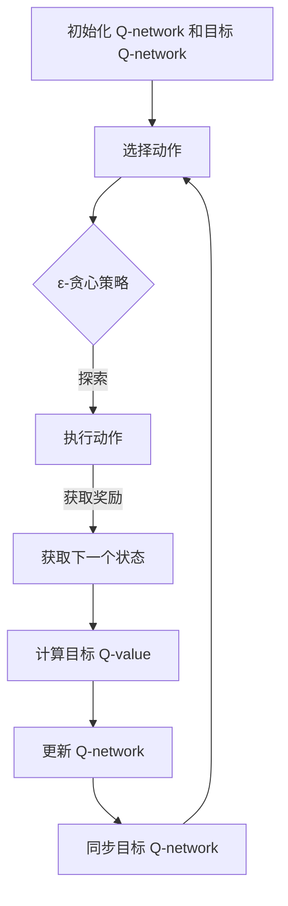
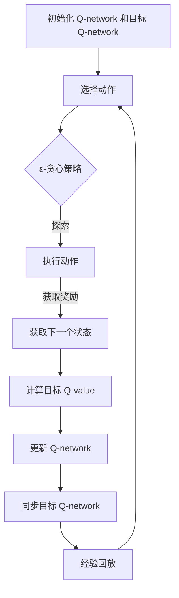
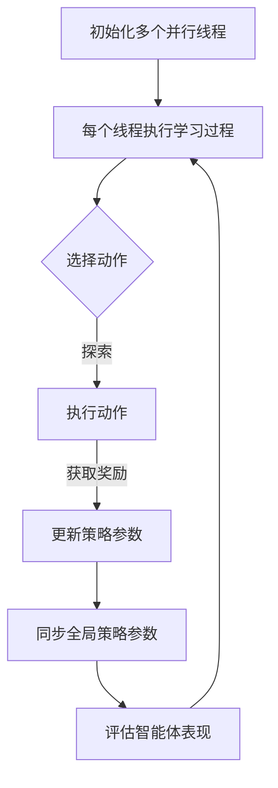

                 

# 深度 Q-learning：环境模型的建立与利用

## 关键词

- 深度 Q-learning
- 强化学习
- 环境模型
- 值函数
- 优化方法

## 摘要

本文旨在深入探讨深度 Q-learning 算法及其在环境建模中的应用。首先，我们将介绍深度 Q-learning 的基本概念和优势，回顾 Q-learning 算法的基本原理。接着，我们将讨论深度神经网络与深度 Q-learning 的关系，详细解析深度 Q-network 的架构。随后，我们将详细阐述深度 Q-learning 算法的原理和实现过程，包括其改进方法和优化策略。本文还将重点讨论环境模型的基本概念和构建方法，分析其在深度 Q-learning 中的重要性。通过实践案例，我们将展示如何在不同领域中应用深度 Q-learning，包括游戏开发、自动驾驶和机器人控制。最后，本文将总结深度 Q-learning 的优化方法及其在实际应用中的挑战，探讨其未来发展趋势和潜在问题。

## 目录大纲

### 第一部分：深度 Q-learning基础

1. **第1章：深度 Q-learning概述**
   - 1.1 深度 Q-learning的定义与优势
   - 1.2 Q-learning算法回顾

2. **第2章：深度神经网络与深度 Q-learning**
   - 2.1 深度神经网络的基本结构
   - 2.2 深度 Q-learning的核心组成部分

3. **第3章：深度 Q-learning算法原理与实现**
   - 3.1 深度 Q-learning算法的基本原理
   - 3.2 深度 Q-learning算法的伪代码实现

### 第二部分：环境模型的建立

4. **第4章：环境模型的基本概念与构建方法**
   - 4.1 环境模型的基本概念
   - 4.2 建立环境模型的方法

5. **第5章：深度 Q-learning在环境建模中的应用**
   - 5.1 环境建模在深度 Q-learning中的重要性
   - 5.2 环境建模的深度学习方法

6. **第6章：环境建模的实践案例**
   - 6.1 环境建模在不同领域的应用
   - 6.2 案例分析：基于深度 Q-learning的智能游戏开发

### 第三部分：深度 Q-learning的优化与应用

7. **第7章：深度 Q-learning的优化方法**
   - 7.1 经验回放（Experience Replay）
   - 7.2 双Q学习（Double Q-learning）
   - 7.3 深度 Q-learning的变种算法

8. **第8章：深度 Q-learning的实际应用场景**
   - 8.1 深度 Q-learning在游戏开发中的应用
   - 8.2 深度 Q-learning在自动驾驶中的应用
   - 8.3 深度 Q-learning在其他领域的应用

9. **第9章：深度 Q-learning的未来发展与挑战**
   - 9.1 深度 Q-learning的发展趋势
   - 9.2 深度 Q-learning面临的挑战

### 附录

10. **附录A：深度 Q-learning常用工具与资源**
    - 10.1 深度学习框架
    - 10.2 强化学习资源

11. **附录B：深度 Q-learning相关 Mermaid 流程图**
    - 11.1 深度 Q-learning算法流程
    - 11.2 双 Q-learning算法流程
    - 11.3 DQN算法流程
    - 11.4 A3C算法流程
    - 11.5 DDPG算法流程

### 结束语

本文为《深度 Q-learning：环境模型的建立与利用》的目录大纲，每个章节的内容都将包含核心概念与联系、核心算法原理讲解、数学模型和数学公式 & 详细讲解 & 举例说明，以及项目实战。希望这个目录大纲能帮助读者更好地理解和掌握深度 Q-learning及其应用。接下来，我们将按照这个大纲逐步深入探讨深度 Q-learning 的各个方面。

----------------------------------------------------------------

# 第一部分：深度 Q-learning基础

## 第1章：深度 Q-learning概述

### 1.1 深度 Q-learning的定义与优势

深度 Q-learning（DQN）是强化学习（Reinforcement Learning，RL）的一种重要算法，它结合了深度神经网络（Deep Neural Network，DNN）和 Q-learning 算法。传统的 Q-learning 算法是基于值函数的，它使用一个 Q 表来存储状态-动作值（Q-value），以估计每个状态下的最优动作。然而，Q 表的大小通常与状态和动作的数目成指数关系，这使得 Q-learning 在处理高维状态空间时效率低下。

深度 Q-learning 的核心思想是用一个深度神经网络来近似 Q 函数，从而将高维的状态空间映射到连续的 Q-value。这种方法的显著优势在于：

- **处理高维状态空间**：深度神经网络可以有效地处理高维状态空间，将复杂的特征自动编码，从而减少状态空间的维度。
- **自适应特征提取**：深度神经网络能够自适应地学习状态的特征，从而提高 Q-value 的预测准确性。
- **增强学习能力**：由于深度神经网络的结构复杂，它可以捕捉到状态之间的复杂关系，从而增强算法的学习能力。

### 1.2 Q-learning算法回顾

Q-learning 是一种基于值函数的强化学习算法，其目标是学习一个最优策略，以最大化累积奖励。Q-learning 算法的基本原理是：通过不断更新 Q 表中的值，使得每个状态-动作对的 Q-value 都接近于该状态下的最大预期奖励。

Q-learning 的更新规则如下：

$$
Q(s, a) \leftarrow Q(s, a) + \alpha [r + \gamma \max_{a'} Q(s', a') - Q(s, a)]
$$

其中：
- $Q(s, a)$ 是状态 $s$ 下动作 $a$ 的 Q-value。
- $\alpha$ 是学习率，用于控制更新幅度。
- $r$ 是立即奖励。
- $\gamma$ 是折扣因子，用于考虑未来奖励。
- $\max_{a'} Q(s', a')$ 是在下一个状态 $s'$ 下，所有动作 $a'$ 的最大 Q-value。

Q-learning 算法的局限性和改进：

- **高维状态空间**：Q 表的大小与状态和动作的数目成指数关系，这使得 Q-learning 在处理高维状态空间时效率低下。
- **样本效率**：Q-learning 算法需要大量的样本来收敛，这导致学习过程较为缓慢。
- **探索与利用**：Q-learning 算法在探索阶段可能无法充分利用已有的知识，而在利用阶段又可能因过度依赖过去的经验而无法适应新的情况。

为了解决这些问题，深度 Q-learning 应运而生，它通过引入深度神经网络来近似 Q 函数，从而提高了算法的处理高维状态空间的能力和样本效率。

### 1.3 深度 Q-learning的基本原理

深度 Q-learning 的基本原理与 Q-learning 类似，但使用深度神经网络来近似 Q 函数。具体来说，深度 Q-learning 的核心组成部分包括：

- **状态表示**：将状态 $s$ 映射到输入特征向量，通常使用卷积神经网络（CNN）或循环神经网络（RNN）来实现。
- **动作表示**：将动作 $a$ 映射到一个一维向量。
- **值函数**：使用深度神经网络来近似 Q 函数，即 $Q(s, a) \approx f_{\theta}(s, a)$，其中 $\theta$ 是神经网络参数。
- **Q-network**：一个前向传播的神经网络，用于计算状态-动作值。

深度 Q-learning 的学习过程可以概括为以下几个步骤：

1. **初始化**：初始化 Q-network 和目标 Q-network 的参数。
2. **选择动作**：根据当前状态 $s$ 和 Q-network 的输出选择动作 $a$。通常采用ε-贪心策略，即在探索阶段以概率 $\epsilon$ 随机选择动作，在利用阶段以概率 $1 - \epsilon$ 选择最大 Q-value 的动作。
3. **执行动作**：在环境中执行动作 $a$，并获得新的状态 $s'$ 和立即奖励 $r$。
4. **更新 Q-value**：使用更新规则更新 Q-network 的参数，即：

$$
\theta \leftarrow \theta + \alpha [r + \gamma \max_{a'} f_{\theta'}(s', a') - f_{\theta}(s, a)]
$$

其中 $f_{\theta'}(s', a')$ 是目标 Q-network 的输出。

5. **重复步骤 2-4**，直到达到预定的训练时间或收敛条件。

### 1.4 深度 Q-learning的优势与挑战

深度 Q-learning 相比传统的 Q-learning 算法具有以下优势：

- **处理高维状态空间**：深度神经网络可以有效地处理高维状态空间，将复杂的特征自动编码，从而减少状态空间的维度。
- **自适应特征提取**：深度神经网络能够自适应地学习状态的特征，从而提高 Q-value 的预测准确性。
- **增强学习能力**：由于深度神经网络的结构复杂，它可以捕捉到状态之间的复杂关系，从而增强算法的学习能力。

然而，深度 Q-learning 也面临着一些挑战：

- **训练稳定性**：由于深度神经网络的非线性和大规模参数，训练过程可能不稳定，需要使用一些技巧来提高训练的稳定性，如目标网络（Target Network）和经验回放（Experience Replay）。
- **可解释性**：深度神经网络的学习过程具有一定的黑盒性质，难以解释和理解，这给算法的调试和应用带来了一定的困难。
- **计算成本**：深度 Q-learning 的训练过程通常需要大量的计算资源，特别是在处理大型状态空间时。

总之，深度 Q-learning 是强化学习领域的一个重要进展，它通过引入深度神经网络有效地解决了高维状态空间处理和自适应特征提取的问题。然而，要充分发挥其潜力，还需要克服训练稳定性、可解释性和计算成本等方面的挑战。

## 第2章：深度神经网络与深度 Q-learning

### 2.1 深度神经网络的基本结构

深度神经网络（Deep Neural Network，DNN）是一种具有多个隐藏层的神经网络，它通过逐层提取特征，将输入数据映射到输出。DNN 的基本结构包括输入层、隐藏层和输出层。

- **输入层**：输入层接收外部输入数据，并将其传递到隐藏层。
- **隐藏层**：隐藏层是 DNN 的核心部分，每个隐藏层都负责提取不同层次的抽象特征。层数越多，网络能够捕捉到的特征层次越丰富。
- **输出层**：输出层根据隐藏层传递的信息生成输出结果。

DNN 的训练过程是通过反向传播算法来实现的。反向传播算法是一种基于梯度下降的方法，它通过计算输出层误差的梯度，逐层更新网络的权重和偏置。具体步骤如下：

1. **前向传播**：输入数据从输入层传递到隐藏层，再传递到输出层，生成预测结果。
2. **计算损失**：计算预测结果与真实标签之间的损失，常用的损失函数包括均方误差（MSE）和交叉熵损失。
3. **反向传播**：计算输出层误差的梯度，并反向传播到隐藏层，更新网络的权重和偏置。
4. **迭代更新**：重复前向传播和反向传播的过程，直到网络收敛。

### 2.2 深度神经网络的发展历史

深度神经网络的发展历程可以分为以下几个阶段：

- **1980年代**：深度神经网络最初在神经网络研究的热潮中兴起，但由于计算资源和算法的限制，其发展缓慢。
- **1990年代**：随着计算机性能的提升，深度神经网络开始复苏。1992年，Hinton等人提出了反向传播算法，使得深度神经网络训练成为可能。
- **2000年代**：深度神经网络在图像识别、语音识别和自然语言处理等领域取得了显著成果。Hinton等人于2006年提出了深度置信网络（Deep Belief Network，DBN），为深度神经网络的发展奠定了基础。
- **2010年代**：随着大规模数据和计算资源的普及，深度神经网络迎来了新的发展机遇。2012年，AlexNet在ImageNet比赛中取得突破性成果，标志着深度学习时代的到来。

### 2.3 深度神经网络的优点与挑战

深度神经网络具有以下优点：

- **强大的特征学习能力**：深度神经网络可以通过多层的非线性变换，从原始数据中提取丰富的特征，从而提高模型的预测准确性。
- **良好的泛化能力**：深度神经网络在训练过程中，通过反向传播算法不断调整参数，使得模型具有较好的泛化能力，即在新数据上表现良好。
- **适应性强**：深度神经网络可以应用于多种领域，如图像识别、语音识别、自然语言处理等，具有广泛的应用前景。

然而，深度神经网络也面临着一些挑战：

- **计算成本高**：深度神经网络通常具有大量参数，训练过程需要大量的计算资源和时间。
- **训练难度大**：深度神经网络的训练过程可能存在局部最优问题，导致模型无法收敛到全局最优解。
- **可解释性差**：深度神经网络的学习过程具有一定的黑盒性质，难以解释和理解，这给算法的调试和应用带来了一定的困难。

### 2.4 深度 Q-learning 的核心组成部分

深度 Q-learning（DQN）的核心组成部分包括状态表示、动作表示、值函数和深度 Q-network（DQN）架构。

- **状态表示**：状态表示是深度 Q-learning 中一个关键部分，它将环境中的状态映射到输入特征向量。通常，状态可以是一组离散的数值或连续的实数，然后通过预处理技术（如归一化或嵌入）将其转换为适合输入深度神经网络的格式。
  
- **动作表示**：动作表示将环境中的动作映射到一组离散或连续的数值。在 DQN 中，每个动作通常与一个 Q-value 相关联，表示在当前状态下执行该动作的预期收益。

- **值函数**：值函数是 Q-learning 的核心，它估计在给定状态和动作下，未来的累积奖励。在 DQN 中，值函数由一个深度神经网络近似，即 $Q(s, a) \approx f_{\theta}(s, a)$，其中 $\theta$ 是神经网络的参数。

- **深度 Q-network（DQN）架构**：DQN 的架构通常由输入层、隐藏层和输出层组成。输入层接收状态表示，隐藏层负责提取特征，输出层生成 Q-value。为了提高训练稳定性，DQN 通常还包括一个目标 Q-network，它是一个参数与原始 Q-network 相似的网络，用于生成目标 Q-value。

### 2.5 深度 Q-network（DQN）架构

深度 Q-network（DQN）的架构是一个前向传播的神经网络，其核心目的是通过训练学习到状态-动作值函数，从而指导智能体选择最佳动作。DQN 的架构通常包括以下几个部分：

1. **输入层**：输入层接收状态表示，将其作为神经网络的输入。
2. **隐藏层**：隐藏层负责提取状态的特征，通常包含多个隐藏层，以实现更深层次的特征抽象。
3. **输出层**：输出层生成每个动作的 Q-value，即状态-动作值函数的估计值。对于每个状态，输出层生成一组 Q-value，其中每个值对应于执行某个动作的预期收益。

DQN 的训练过程包括以下几个步骤：

1. **初始化**：初始化 Q-network 和目标 Q-network 的参数。通常，目标 Q-network 的参数会在每个训练周期更新一次，以减缓 Q-network 的变化速度，从而提高训练的稳定性。
2. **选择动作**：根据当前状态和 Q-network 的输出，采用 ε-贪心策略选择动作。在探索阶段，以概率 ε 随机选择动作；在利用阶段，以概率 1 - ε 选择具有最大 Q-value 的动作。
3. **执行动作**：在环境中执行选定的动作，并获得新的状态和立即奖励。
4. **更新 Q-value**：使用更新规则更新 Q-network 的参数。具体来说，使用以下更新规则：

$$
\theta \leftarrow \theta + \alpha [r + \gamma \max_{a'} f_{\theta'}(s', a') - f_{\theta}(s, a)]
$$

其中 $f_{\theta'}(s', a')$ 是目标 Q-network 的输出。

5. **重复步骤 2-4**，直到达到预定的训练时间或收敛条件。

通过上述过程，DQN 能够逐步学习到状态-动作值函数，从而指导智能体选择最佳动作，实现强化学习。

## 第3章：深度 Q-learning算法原理与实现

### 3.1 深度 Q-learning算法的基本原理

深度 Q-learning（DQN）是一种基于值函数的强化学习算法，其核心思想是通过训练一个深度神经网络来近似 Q 函数，从而学习到状态-动作值函数。DQN 的基本原理可以概括为以下几个步骤：

1. **初始化**：初始化 Q-network 和目标 Q-network 的参数。通常，目标 Q-network 的参数会在每个训练周期更新一次，以减缓 Q-network 的变化速度，从而提高训练的稳定性。

2. **选择动作**：根据当前状态和 Q-network 的输出，采用 ε-贪心策略选择动作。在探索阶段，以概率 ε 随机选择动作；在利用阶段，以概率 1 - ε 选择具有最大 Q-value 的动作。

3. **执行动作**：在环境中执行选定的动作，并获得新的状态和立即奖励。

4. **更新 Q-value**：使用更新规则更新 Q-network 的参数。具体来说，使用以下更新规则：

$$
\theta \leftarrow \theta + \alpha [r + \gamma \max_{a'} f_{\theta'}(s', a') - f_{\theta}(s, a)]
$$

其中 $f_{\theta'}(s', a')$ 是目标 Q-network 的输出。

5. **重复步骤 2-4**，直到达到预定的训练时间或收敛条件。

通过上述过程，DQN 能够逐步学习到状态-动作值函数，从而指导智能体选择最佳动作，实现强化学习。

### 3.2 深度 Q-learning算法的改进方法

深度 Q-learning（DQN）在处理高维状态空间和连续动作空间时表现出一定的局限性。为了克服这些局限性，研究人员提出了一系列改进方法，包括优先级队列、双 Q-learning、经验回放等。

1. **优先级队列（Priority Queue）**

优先级队列用于根据样本的误差大小对经验进行排序，从而在训练过程中对误差较大的样本进行重复训练，提高样本利用效率。具体实现方法如下：

- 初始化优先级队列，并设置一个经验池。
- 每次更新 Q-value 时，将样本加入经验池，并根据误差大小对样本进行排序。
- 在训练过程中，按照优先级队列的顺序从经验池中抽取样本进行训练。

2. **双 Q-learning（Double Q-learning）**

双 Q-learning 是一种用于解决 Q-learning 算法中目标不稳定问题的方法。具体实现方法如下：

- 初始化两个 Q-network：Q-network 和目标 Q-network。
- 在每次更新 Q-value 时，使用目标 Q-network 的输出作为目标 Q-value。
- 同时更新两个 Q-network 的参数，以保持它们之间的稳定关系。

3. **经验回放（Experience Replay）**

经验回放是一种用于缓解样本相关性和探索-利用冲突的方法。具体实现方法如下：

- 初始化一个经验池，用于存储训练过程中的经验样本。
- 在每次更新 Q-value 时，将样本加入经验池。
- 在训练过程中，从经验池中随机抽取样本进行训练，以避免样本的相关性。

### 3.3 深度 Q-learning的学习过程

深度 Q-learning（DQN）的学习过程可以分为以下几个阶段：

1. **探索阶段**：在探索阶段，智能体以概率 ε 随机选择动作，以最大化探索未知状态和动作。

2. **利用阶段**：在利用阶段，智能体以概率 1 - ε 选择具有最大 Q-value 的动作，以最大化累积奖励。

3. **更新 Q-value**：每次执行动作后，根据新的状态和奖励更新 Q-value。

4. **重复迭代**：重复探索阶段和利用阶段，直到达到预定的训练时间或收敛条件。

在深度 Q-learning 的学习过程中，目标 Q-value 的计算是一个关键问题。目标 Q-value 用于更新当前 Q-value，其计算公式为：

$$
Q_{\text{target}}(s, a) = r + \gamma \max_{a'} Q_{\text{target}}(s', a')
$$

其中，$r$ 是立即奖励，$\gamma$ 是折扣因子，$Q_{\text{target}}(s', a')$ 是在下一个状态 $s'$ 下，所有动作 $a'$ 的最大目标 Q-value。

### 3.4 深度 Q-learning算法的伪代码实现

下面是深度 Q-learning（DQN）算法的伪代码实现，包括初始化、选择动作、更新 Q-value 等关键步骤。

```python
# 初始化
初始化 Q-network 和目标 Q-network 的参数
初始化经验池
初始化优先级队列

# 主循环
for episode in 1 to 总训练周期数 do
    初始化状态 s
    对于每个时间步 t do
        根据ε-贪心策略选择动作 a
        在环境中执行动作 a，获得状态 s' 和立即奖励 r
        将 (s, a, r, s') 加入经验池
        根据优先级队列更新经验池中的样本
        计算目标 Q-value：
            Q_{\text{target}}(s, a) = r + γ * max_{a'} Q_{\text{target}}(s', a')
        使用梯度下降更新 Q-network 的参数：
            Δθ = α * (r + γ * max_{a'} Q_{\text{target}}(s', a') - Q(s, a))
        更新目标 Q-network 的参数：
            θ' = θ + Δθ
    end for
end for
```

在这个伪代码中，`ε` 是探索率，`α` 是学习率，`γ` 是折扣因子。经验池用于存储训练过程中的经验样本，优先级队列用于根据样本的误差大小进行排序和重复训练。

## 第4章：环境模型的基本概念与构建方法

### 4.1 环境模型的基本概念

环境模型是强化学习算法中的一个重要组成部分，它定义了智能体与外部环境之间的交互方式。在强化学习中，环境模型主要涉及以下几个方面：

1. **状态空间**：状态空间是智能体所处环境的所有可能状态的集合。每个状态可以用一组特征来描述，这些特征可以是离散的或连续的。

2. **动作空间**：动作空间是智能体可以采取的所有可能动作的集合。动作可以是离散的，如选择下一个方向；也可以是连续的，如调整速度。

3. **奖励函数**：奖励函数定义了智能体在每个状态执行特定动作后获得的即时奖励。奖励函数可以鼓励智能体采取有利于其目标的行为，同时惩罚不利于目标的行为。

4. **状态转移概率**：状态转移概率定义了在给定当前状态和动作的条件下，智能体转移到下一个状态的概率。状态转移概率通常用于描述环境的动态特性。

5. **终止条件**：终止条件定义了何时结束智能体的交互过程。通常，终止条件可以是达到某个目标状态、经历一定的时间步数或累积奖励达到阈值。

### 4.2 建立环境模型的方法

建立环境模型的方法可以分为以下几种：

1. **基于规则的方法**：基于规则的方法通过定义一系列规则来描述环境的动态特性。这种方法简单直观，但可能难以处理复杂的环境。

2. **基于概率的方法**：基于概率的方法使用概率模型来描述状态转移和奖励分配。这种方法的灵活性较高，可以较好地处理不确定的环境。

3. **基于深度学习的方法**：基于深度学习的方法使用深度神经网络来学习状态转移概率和奖励函数。这种方法可以自动提取高维状态空间的复杂特征，但训练过程可能需要大量的计算资源和时间。

4. **混合方法**：混合方法结合了基于规则和基于深度学习的方法，通过规则来描述部分环境的动态特性，使用深度神经网络来学习剩余部分。这种方法在处理复杂环境时具有较高的灵活性和鲁棒性。

### 4.2.1 基于状态转移概率的方法

基于状态转移概率的方法使用概率模型来描述环境的动态特性。这种方法的核心是建立状态转移概率矩阵，该矩阵定义了在给定当前状态和动作的条件下，智能体转移到下一个状态的概率。具体步骤如下：

1. **定义状态和动作**：根据环境特性定义状态空间和动作空间。

2. **收集数据**：通过模拟或实际交互收集状态-动作-状态-奖励数据。

3. **计算状态转移概率**：根据收集的数据计算状态转移概率矩阵。

4. **构建概率模型**：使用状态转移概率矩阵构建概率模型，通常采用马尔可夫决策过程（MDP）模型。

5. **优化模型参数**：使用优化算法（如梯度下降）优化概率模型参数，以最小化损失函数。

### 4.2.2 基于 reward 函数的方法

基于 reward 函数的方法通过定义奖励函数来描述智能体在不同状态下的期望收益。这种方法的核心是设计一个能够鼓励智能体采取有利于目标行为的奖励函数。具体步骤如下：

1. **定义状态和动作**：根据环境特性定义状态空间和动作空间。

2. **设计奖励函数**：根据智能体的目标和环境特性设计奖励函数，通常需要考虑奖励的即时性和长期性。

3. **训练奖励函数**：使用强化学习算法（如 Q-learning）训练奖励函数，使其能够正确指导智能体的行为。

4. **评估和优化奖励函数**：评估奖励函数的有效性，并根据评估结果优化奖励函数。

### 4.2.3 基于深度学习的方法

基于深度学习的方法使用深度神经网络来学习状态转移概率和奖励函数。这种方法的核心是使用深度神经网络自动提取高维状态空间的复杂特征。具体步骤如下：

1. **定义状态和动作**：根据环境特性定义状态空间和动作空间。

2. **收集数据**：通过模拟或实际交互收集状态-动作-状态-奖励数据。

3. **构建深度神经网络**：设计深度神经网络架构，用于学习状态转移概率和奖励函数。

4. **训练神经网络**：使用收集的数据训练深度神经网络，使用优化算法（如梯度下降）最小化损失函数。

5. **评估和优化神经网络**：评估深度神经网络的性能，并根据评估结果优化神经网络架构和参数。

### 4.2.4 深度 Q-learning 在环境建模中的应用

在深度 Q-learning 中，环境模型主要通过状态表示和奖励函数来描述。具体应用如下：

1. **状态表示**：使用深度神经网络将高维状态空间映射到低维特征空间，从而简化状态表示。常用的网络结构包括卷积神经网络（CNN）和循环神经网络（RNN）。

2. **奖励函数**：设计合适的奖励函数来鼓励智能体采取有利于目标的行为。奖励函数通常与智能体的目标密切相关，如达到目标位置或最大化累积奖励。

3. **状态转移概率**：通过训练深度 Q-learning 模型，自动学习状态转移概率，从而描述环境的动态特性。

4. **探索与利用**：在训练过程中，结合 ε-贪心策略和经验回放技巧，平衡探索和利用，以避免过度依赖过去的经验。

通过上述方法，深度 Q-learning 能够在复杂环境中实现智能体的有效学习和决策，从而实现强化学习目标。

### 4.3 环境建模的具体示例

为了更好地理解环境建模的方法，以下是一个简单的示例：

#### 示例：机器人导航

假设一个机器人在二维平面内移动，其状态由位置 (x, y) 和方向组成，动作包括前进、后退、左转和右转。奖励函数可以定义为到达目标位置获得 +10 分，每次移动获得 -1 分，碰撞障碍物获得 -5 分。

1. **定义状态和动作**：
   - 状态：位置 (x, y) 和方向θ
   - 动作：前进、后退、左转和右转

2. **收集数据**：
   - 使用仿真环境生成大量状态-动作-状态-奖励数据

3. **构建状态转移概率矩阵**：
   - 根据数据计算每个状态在每个动作下的状态转移概率

4. **设计奖励函数**：
   - 定义到达目标位置获得 +10 分，每次移动获得 -1 分，碰撞障碍物获得 -5 分

5. **训练深度 Q-learning 模型**：
   - 使用收集的数据训练深度 Q-learning 模型，学习状态-动作值函数

6. **评估和优化模型**：
   - 评估模型在仿真环境中的性能，根据评估结果优化模型参数

通过上述步骤，机器人导航任务中的环境模型得以建立，并指导智能体在复杂环境中进行有效导航。

## 第5章：深度 Q-learning 在环境建模中的应用

### 5.1 环境建模在深度 Q-learning 中的重要性

在深度 Q-learning（DQN）中，环境建模是至关重要的一环。环境建模的质量直接影响智能体在环境中的学习效果和决策能力。具体来说，环境建模在深度 Q-learning 中具有以下重要性：

1. **状态表示**：环境建模决定了如何将环境的状态映射到输入特征向量。对于高维状态空间，合适的表示方法可以显著降低计算复杂度，提高学习效率。

2. **动作表示**：环境建模决定了如何将环境中的动作映射到离散或连续的数值。适当的动作表示方法可以保证智能体在执行动作时能够准确反映环境的动态特性。

3. **奖励函数**：奖励函数是指导智能体行为的直接指标。一个设计合理的奖励函数可以鼓励智能体采取有利于目标的行为，从而提高学习效率。

4. **状态转移概率**：通过环境建模，可以学习到状态之间的转移概率，这有助于智能体理解环境的动态特性，从而做出更明智的决策。

5. **终止条件**：终止条件的设定有助于智能体在适当的时候停止学习过程，避免不必要的计算资源浪费。

### 5.2 基于深度学习的环境建模方法

基于深度学习的环境建模方法利用深度神经网络自动提取高维状态空间的复杂特征，从而提高智能体对环境的理解和适应能力。以下介绍几种常见的基于深度学习的环境建模方法：

1. **自监督学习方法**

自监督学习方法通过无监督方式从数据中学习特征表示，无需人工标注。这种方法在强化学习领域得到了广泛应用，特别是在处理高维状态空间时。具体方法如下：

- **预训练**：使用大量的无标签数据进行预训练，学习到通用特征表示。
- **微调**：将预训练的模型在特定任务上进行微调，以适应具体环境。

2. **迁移学习方法**

迁移学习方法通过利用在不同任务上预训练的模型，将知识迁移到新的任务上。这种方法可以有效减少对大量标注数据的依赖，提高学习效率。具体方法如下：

- **预训练模型**：在一个大规模数据集上预训练一个通用模型，学习到通用特征表示。
- **适应特定环境**：将预训练模型应用于特定环境，通过少量数据进行微调。

3. **联合状态-动作价值函数模型**

联合状态-动作价值函数模型将状态和动作视为统一的特征空间，通过一个共享的网络学习到状态-动作值函数。这种方法可以同时处理高维状态和动作空间，提高学习效率。具体方法如下：

- **共享网络**：设计一个共享的网络结构，用于同时处理状态和动作。
- **联合训练**：使用状态-动作对同时训练网络，以学习到状态-动作值函数。

### 5.3 自监督学习方法在深度 Q-learning 中的应用

自监督学习方法在深度 Q-learning 中具有广泛的应用，以下介绍几种常见的自监督学习方法：

1. **自监督 Q-learning（Self-Supervised Q-Learning）**

自监督 Q-learning 利用目标网络和当前网络之间的差异来训练模型。具体方法如下：

- **目标网络**：初始化一个目标网络，用于生成目标 Q-value。
- **误差函数**：使用当前网络输出的 Q-value 与目标网络输出的 Q-value 之间的差异作为误差函数，训练网络。

2. **自监督逆再参数化（Self-Supervised Inverse Reinforcement Learning）**

自监督逆再参数化通过从观察到的行为中学习奖励函数，然后使用 Q-learning 算法进行训练。具体方法如下：

- **行为数据**：收集一系列的行为数据，包括状态、动作和奖励。
- **奖励函数学习**：从行为数据中学习奖励函数，以鼓励智能体产生类似的行为。
- **Q-learning训练**：使用学习的奖励函数和状态-动作对进行 Q-learning 训练。

### 5.4 迁移学习方法在深度 Q-learning 中的应用

迁移学习方法在深度 Q-learning 中有助于利用已有的知识快速适应新环境。以下介绍几种常见的迁移学习方法：

1. **预训练模型迁移（Pre-trained Model Transfer）**

预训练模型迁移通过将预训练的深度神经网络应用于新的任务，从而减少对新数据的依赖。具体方法如下：

- **预训练模型**：在一个大规模数据集上预训练一个通用模型。
- **微调**：在新的任务上使用少量数据进行微调，以适应特定环境。

2. **多任务学习（Multi-Task Learning）**

多任务学习通过同时训练多个任务，从而提高模型的泛化能力。具体方法如下：

- **共享网络**：设计一个共享的网络结构，用于同时处理多个任务。
- **联合训练**：使用多个任务的数据同时训练网络，以学习到通用的特征表示。

3. **对抗性迁移学习（Adversarial Transfer Learning）**

对抗性迁移学习通过对抗性训练来提高模型的泛化能力。具体方法如下：

- **生成对抗网络（GAN）**：使用生成对抗网络生成与原数据分布相似的数据。
- **迁移训练**：使用生成的数据和原数据同时训练模型，以提高模型的泛化能力。

### 5.5 联合状态-动作价值函数模型在深度 Q-learning 中的应用

联合状态-动作价值函数模型通过将状态和动作视为统一的特征空间，从而提高了学习效率。以下介绍几种常见的联合状态-动作价值函数模型：

1. **双 Q-network（Double Q-Network）**

双 Q-network 通过使用两个独立的 Q-network，以避免梯度消失和梯度爆炸问题。具体方法如下：

- **两个 Q-network**：初始化两个独立的 Q-network，分别用于当前网络和目标网络。
- **联合训练**：同时更新两个 Q-network 的参数，以提高训练稳定性。

2. **优先级经验回放（Prioritized Experience Replay）**

优先级经验回放通过根据样本的重要性对经验进行排序和重复训练，从而提高学习效率。具体方法如下：

- **优先级队列**：初始化一个优先级队列，用于存储和排序经验样本。
- **经验回放**：从优先级队列中随机抽取样本进行训练，以提高样本的利用效率。

3. **分布式训练（Distributed Training）**

分布式训练通过将训练任务分布在多个计算节点上，以提高训练速度和效率。具体方法如下：

- **任务分配**：将训练任务分配到多个计算节点。
- **同步更新**：定期同步各节点的参数，以保持模型的一致性。

通过以上方法，深度 Q-learning 在环境建模中的应用可以显著提高智能体的学习和适应能力，从而实现强化学习的目标。

### 5.6 实际案例：基于深度 Q-learning 的智能游戏开发

在本节中，我们将通过一个实际案例来展示如何利用深度 Q-learning（DQN）进行智能游戏开发。我们以经典的电子游戏“Pong”为例，介绍如何建立环境模型、设计奖励函数以及训练和评估智能体的表现。

#### 5.6.1 游戏环境的构建

首先，我们需要构建游戏环境。在“Pong”游戏中，环境的状态包括：

- **球的位置**：球在水平方向上的坐标。
- **球的速度**：球的水平速度和垂直速度。
- **玩家的位置**：玩家的 Paddle 在水平方向上的坐标。
- **玩家的动作**：玩家的 Paddle 向上或向下的移动。

动作空间包括两种可能的动作：

- **保持当前位置**。
- **向上移动**或**向下移动**。

奖励函数的设计目标是鼓励智能体使球击中对手，同时避免球击中自己。具体奖励函数如下：

- **击中对手**：获得 +1 分。
- **球击中自身**：获得 -1 分。
- **球丢失**：获得 -5 分。

状态转移概率由游戏逻辑决定，即根据当前球的位置、速度和玩家的动作，预测下一个状态。

#### 5.6.2 DQN 算法的实现

我们使用 Python 和 TensorFlow 实现一个基本的 DQN 模型。以下是一个简化的代码框架：

```python
import numpy as np
import tensorflow as tf
from tensorflow.keras.models import Sequential
from tensorflow.keras.layers import Dense, Conv2D, Flatten
from tensorflow.keras.optimizers import Adam

# 定义 DQN 模型
def create_dqn_model(input_shape):
    model = Sequential([
        Conv2D(32, kernel_size=(8, 8), activation='relu', input_shape=input_shape),
        Flatten(),
        Dense(64, activation='relu'),
        Dense(action_size, activation='linear')
    ])
    return model

# 创建环境实例
env = Environment()

# 初始化 DQN 模型
state_size = env.observation_space.shape
action_size = env.action_space.n
dqn = create_dqn_model(state_size)

# 定义目标 DQN 模型
target_dqn = create_dqn_model(state_size)
update_target_dqn()

# 定义损失函数和优化器
loss_fn = tf.keras.losses.MeanSquaredError()
optimizer = Adam(learning_rate=0.001)

# 训练 DQN 模型
for episode in range(total_episodes):
    state = env.reset()
    done = False
    
    while not done:
        action = dqn.predict(state)
        next_state, reward, done, _ = env.step(action)
        
        if done:
            next_state = np.zeros(state.shape)
        
        target = reward + gamma * np.max(target_dqn.predict(next_state))
        
        with tf.GradientTape() as tape:
            current_q_values = dqn(state)
            target_q_values = current_q_values.copy()
            target_q_values[0, action] = target
        
        grads = tape.gradient(target_q_values, dqn.trainable_variables)
        optimizer.apply_gradients(zip(grads, dqn.trainable_variables))
        
        state = next_state

# 更新目标 DQN 模型
update_target_dqn()

# 评估 DQN 模型
total_reward = 0
state = env.reset()
done = False

while not done:
    action = np.argmax(dqn.predict(state))
    next_state, reward, done, _ = env.step(action)
    total_reward += reward
    state = next_state

print(f"Episode: {episode}, Total Reward: {total_reward}")
```

在这个代码中，我们首先定义了 DQN 模型，包括输入层、隐藏层和输出层。接着，我们创建环境实例并初始化 DQN 模型和目标 DQN 模型。训练过程中，我们使用 ε-贪心策略选择动作，并使用经验回放和目标网络更新策略。

#### 5.6.3 案例分析：挑战与解决方案

在训练过程中，我们可能会遇到以下挑战：

1. **探索与利用冲突**：智能体需要在探索未知动作和利用已知动作之间找到平衡。解决方案是使用 ε-贪心策略，在训练早期进行更多探索，随着训练进行，逐渐减少探索，增加利用。

2. **梯度消失和梯度爆炸**：由于深度神经网络的深度和规模，训练过程中可能会出现梯度消失或梯度爆炸问题。解决方案是使用激活函数（如 ReLU）和适当的网络结构，以减少梯度消失和梯度爆炸的风险。

3. **样本效率低**：由于游戏环境的动态特性和随机性，训练过程中可能需要大量样本来收敛。解决方案是使用经验回放和优先级队列，以提高样本利用效率。

通过克服这些挑战，我们可以在“Pong”游戏中训练出一个能够自我学习的智能体，实现较好的游戏水平。

### 5.7 总结

通过本章的案例分析和实践，我们展示了如何利用深度 Q-learning（DQN）进行智能游戏开发。我们介绍了游戏环境的构建、DQN 模型的实现和训练过程，并讨论了训练过程中可能遇到的挑战和解决方案。这些经验和技巧为在其他领域应用深度 Q-learning 提供了宝贵的参考。

## 第6章：深度 Q-learning 的优化方法

### 6.1 经验回放（Experience Replay）

经验回放（Experience Replay）是深度 Q-learning（DQN）中的一个关键优化方法，旨在解决训练样本的相关性和提高样本利用率。在传统的 DQN 中，智能体在每一步都会将新的经验（状态、动作、奖励和下一个状态）存储到经验池中，然后从中随机抽取经验进行训练。然而，这种方法可能会导致训练样本的相关性，即新样本与之前样本之间的相关性较高，从而影响学习效果。

经验回放通过以下步骤来改善这一现象：

1. **经验池初始化**：初始化一个经验池，用于存储大量的经验样本。
2. **存储经验**：在智能体的学习过程中，将新的经验（状态、动作、奖励和下一个状态）存储到经验池中。
3. **经验回放**：在训练时，从经验池中随机抽取经验样本进行训练。这样可以避免新样本与之前样本之间的相关性，从而提高训练效果。

经验回放的主要优势在于：

- **减少样本相关性**：通过随机抽取经验样本，减少了训练样本之间的相关性，有助于模型更好地学习。
- **提高样本利用率**：经验回放允许重复使用经验样本，从而提高了样本的利用率，减少了训练所需的数据量。

### 6.2 双 Q-learning（Double Q-learning）

双 Q-learning 是一种用于解决 DQN 中目标不稳定问题的优化方法。在传统的 DQN 中，目标 Q-value 是由当前 Q-network 生成的，这可能导致目标不稳定，影响训练效果。双 Q-learning 通过引入两个独立的 Q-network 来解决这一问题。

双 Q-learning 的核心思想是：

1. **初始化两个 Q-network**：初始化两个独立的 Q-network，分别称为当前 Q-network（Q-network）和目标 Q-network（Target Q-network）。
2. **选择动作**：在每一步，使用当前 Q-network 选择动作。
3. **更新当前 Q-network**：根据实际获得的奖励和下一个状态，使用目标 Q-network 的输出作为目标 Q-value 更新当前 Q-network。
4. **定期更新目标 Q-network**：为了保持目标 Q-network 的稳定性，需要定期更新其参数。一种常见的方法是每若干步就将当前 Q-network 的参数复制到目标 Q-network 中。

双 Q-learning 的优势在于：

- **提高训练稳定性**：通过使用目标 Q-network 的输出作为目标 Q-value，减少了目标不稳定问题，提高了训练的稳定性。
- **减少偏差**：双 Q-learning 减少了由于目标不稳定导致的 Q-value 更新偏差。

### 6.3 深度 Q-learning 的变种算法

除了经验回放和双 Q-learning，还有许多其他优化方法，这些方法在 DQN 的基础上进行改进，以提高其性能。以下介绍几种常见的变种算法：

1. **优先级经验回放（Prioritized Experience Replay）**

优先级经验回放是经验回放的一种改进方法，通过为每个经验样本分配优先级来提高样本的利用效率。优先级通常基于经验样本的误差大小进行计算。在训练过程中，优先级高的样本被更频繁地回放，从而提高了训练效果。

2. **分布式深度 Q-learning（Distributed Deep Q-learning）**

分布式深度 Q-learning 通过将训练任务分布在多个计算节点上，以提高训练速度和效率。每个节点维护一个本地 Q-network 和经验池，并定期同步参数。这种方法可以显著减少训练时间，特别是在处理大规模状态空间和动作空间时。

3. **异步优势演员-评论家（Asynchronous Advantage Actor-Critic，A3C）**

A3C 是一种基于异步策略梯度方法的深度强化学习算法，通过多个并行线程同时进行训练，以提高学习效率。A3C 包括两个主要部分：优势演员（Advantage Actor）和评论家（Critic）。优势演员负责更新策略参数，评论家负责评估策略的好坏。

4. **深度确定性策略梯度（Deep Deterministic Policy Gradient，DDPG）**

DDPG 是一种基于确定性策略梯度方法的深度强化学习算法，特别适用于连续动作空间。DDPG 包括两个主要部分：状态-动作值函数（Actor）和值函数（Critic）。状态-动作值函数负责生成动作，值函数负责评估策略的好坏。

通过这些优化方法和变种算法，深度 Q-learning 可以在更广泛的场景中发挥作用，实现更高效、更稳定的强化学习。

### 6.4 经验回放和双 Q-learning 的实际应用案例

以下是一个简单的实际应用案例，展示了如何在实际项目中使用经验回放和双 Q-learning 优化深度 Q-learning（DQN）模型。

#### 案例背景

假设我们要训练一个智能体在机器人控制任务中导航到目标位置。状态包括机器人的位置、方向、电池电量等；动作包括前进、后退、左转、右转等。

#### 数据收集

首先，我们使用仿真环境收集状态-动作-奖励-下一个状态数据。这些数据将在后续的训练过程中用于训练 DQN 模型。

```python
import numpy as np
import random

# 初始化经验池
experience_pool = []

# 模拟环境交互
for episode in range(total_episodes):
    state = env.reset()
    done = False
    
    while not done:
        action = random.choice(actions)  # 随机选择动作
        next_state, reward, done, _ = env.step(action)
        experience = (state, action, reward, next_state, done)
        experience_pool.append(experience)
        state = next_state
        
    # 清理环境
    env.reset()
```

#### 经验回放

接下来，我们使用经验回放来训练 DQN 模型。经验回放允许我们随机选择经验样本，从而减少样本相关性，提高训练效果。

```python
# 从经验池中随机选择经验样本
def sample_experiences(batch_size):
    indices = random.sample(range(len(experience_pool)), batch_size)
    batch = [experience_pool[i] for i in indices]
    return batch

# 训练 DQN 模型
for episode in range(total_episodes):
    state_batch, action_batch, reward_batch, next_state_batch, done_batch = sample_experiences(batch_size)
    
    # 计算目标 Q-value
    next_state_Q_values = target_dqn.predict(next_state_batch)
    target_Q_values = reward_batch + gamma * (1 - done_batch) * np.max(next_state_Q_values, axis=1)
    
    # 计算当前 Q-value
    current_state_Q_values = dqn.predict(state_batch)
    current_state_Q_values[range(batch_size), action_batch] = target_Q_values
    
    # 更新 DQN 模型
    dqn.fit(state_batch, current_state_Q_values, epochs=1, verbose=0)
    
    # 更新目标 DQN 模型
    update_target_dqn()
```

#### 双 Q-learning

为了进一步提高训练稳定性，我们引入双 Q-learning。双 Q-learning 通过使用两个独立的 Q-network 来避免目标不稳定问题。

```python
# 初始化两个 Q-network
dqn = create_dqn_model(state_size)
target_dqn = create_dqn_model(state_size)

# 定义更新目标 Q-network 的函数
def update_target_dqn():
    target_dqn.set_weights(dqn.get_weights())

# 更新 DQN 模型和目标 Q-network
for episode in range(total_episodes):
    state_batch, action_batch, reward_batch, next_state_batch, done_batch = sample_experiences(batch_size)
    
    # 计算目标 Q-value
    next_state_Q_values = target_dqn.predict(next_state_batch)
    target_Q_values = reward_batch + gamma * (1 - done_batch) * np.max(next_state_Q_values, axis=1)
    
    # 计算当前 Q-value
    current_state_Q_values = dqn.predict(state_batch)
    current_state_Q_values[range(batch_size), action_batch] = target_Q_values
    
    # 更新 DQN 模型
    dqn.fit(state_batch, current_state_Q_values, epochs=1, verbose=0)
    
    # 更新目标 Q-network，每若干步进行一次
    if episode % target_update_frequency == 0:
        update_target_dqn()
```

通过上述代码，我们成功地实现了经验回放和双 Q-learning 的优化方法，以提高 DQN 模型的训练效果和稳定性。这个案例展示了如何在实际项目中应用这些优化方法，为智能体的训练提供了更有效的策略。

## 第7章：深度 Q-learning 的实际应用场景

### 7.1 深度 Q-learning 在游戏开发中的应用

深度 Q-learning（DQN）在游戏开发中具有广泛的应用，特别是在开发智能游戏玩家方面。通过训练智能体，开发者可以实现能够与人类玩家竞争甚至超越的人类水平的游戏表现。以下是一些深度 Q-learning 在游戏开发中的应用案例：

#### 7.1.1 游戏环境设计

在游戏开发中，游戏环境的设计是关键的一步。环境应包括以下要素：

- **状态表示**：状态通常包括游戏地图、玩家的位置、对手的位置、玩家的生命值等。
- **动作表示**：动作包括移动、攻击、防御等。
- **奖励函数**：奖励函数应根据游戏的目标进行设计。例如，在动作游戏中，奖励函数可以设计为玩家每次击败对手获得正奖励，每次受到攻击获得负奖励。

#### 7.1.2 深度 Q-learning 算法的改进

为了提高 DQN 在游戏开发中的应用效果，研究人员提出了一系列改进方法：

- **优先级经验回放**：通过为每个经验样本分配优先级，可以减少样本相关性，提高学习效率。
- **双 Q-learning**：使用两个 Q-network 来提高训练稳定性，避免目标不稳定问题。
- **经验回放**：通过将经验存储到经验池中，并随机抽取样本进行训练，可以减少样本相关性，提高学习效果。

#### 7.1.3 游戏开发案例分析

以下是一个基于 DQN 的智能游戏开发的案例分析：

**案例：Atari 游戏智能玩家**

研究人员使用 DQN 训练智能玩家在 Atari 游戏中击败人类玩家。具体步骤如下：

1. **数据收集**：首先，通过模拟器收集大量的状态-动作-奖励-下一个状态数据。
2. **经验回放**：使用经验回放技术，将收集到的数据存储到经验池中，并从中随机抽取样本进行训练。
3. **双 Q-learning**：使用双 Q-learning 策略，以提高训练稳定性。
4. **训练 DQN 模型**：使用收集到的数据训练 DQN 模型，不断更新 Q-value。
5. **评估智能体**：在真实游戏环境中评估智能体的表现，根据智能体的得分和表现进行进一步优化。

通过上述步骤，研究人员成功地训练出能够与人类玩家竞争甚至超越的智能玩家。这个案例展示了 DQN 在游戏开发中的应用潜力和效果。

### 7.2 深度 Q-learning 在自动驾驶中的应用

深度 Q-learning（DQN）在自动驾驶领域也有广泛的应用，特别是在车辆控制、路径规划和障碍物检测等方面。以下是一些深度 Q-learning 在自动驾驶中的应用案例：

#### 7.2.1 自动驾驶环境建模

在自动驾驶中，环境建模是关键的一步。环境模型应包括以下要素：

- **状态表示**：状态通常包括车辆位置、速度、加速度、周围车辆的位置和速度等。
- **动作表示**：动作包括加速、减速、转向等。
- **奖励函数**：奖励函数应根据自动驾驶的目标进行设计。例如，奖励函数可以设计为车辆安全到达目的地获得正奖励，发生碰撞获得负奖励。

#### 7.2.2 深度 Q-learning 算法的优化

为了提高 DQN 在自动驾驶中的应用效果，研究人员提出了一系列优化方法：

- **经验回放**：通过将经验存储到经验池中，并随机抽取样本进行训练，可以减少样本相关性，提高学习效果。
- **双 Q-learning**：使用两个 Q-network 来提高训练稳定性，避免目标不稳定问题。
- **分布式训练**：通过将训练任务分布在多个计算节点上，可以提高训练速度和效率。

#### 7.2.3 自动驾驶案例分析

以下是一个基于 DQN 的自动驾驶汽车路径规划的案例分析：

**案例：自动车道保持**

研究人员使用 DQN 训练自动驾驶汽车在车道内保持行驶。具体步骤如下：

1. **数据收集**：首先，通过模拟器收集大量的状态-动作-奖励-下一个状态数据。
2. **经验回放**：使用经验回放技术，将收集到的数据存储到经验池中，并从中随机抽取样本进行训练。
3. **双 Q-learning**：使用双 Q-learning 策略，以提高训练稳定性。
4. **训练 DQN 模型**：使用收集到的数据训练 DQN 模型，不断更新 Q-value。
5. **评估智能体**：在真实环境中评估智能体的表现，根据智能体的得分和表现进行进一步优化。

通过上述步骤，研究人员成功地训练出能够自动在车道内保持行驶的自动驾驶汽车。这个案例展示了 DQN 在自动驾驶中的应用潜力和效果。

### 7.3 深度 Q-learning 在其他领域的应用

除了游戏开发和自动驾驶，深度 Q-learning（DQN）还在其他领域得到了广泛应用，如机器人控制、能源管理和金融投资等。以下是一些深度 Q-learning 在这些领域中的应用案例：

#### 7.3.1 机器人控制

在机器人控制中，深度 Q-learning 可以用于训练机器人执行复杂的任务，如路径规划、抓取和导航等。以下是一个基于 DQN 的机器人路径规划的案例分析：

**案例：机器人路径规划**

研究人员使用 DQN 训练机器人进行路径规划。具体步骤如下：

1. **数据收集**：首先，通过仿真环境收集大量的状态-动作-奖励-下一个状态数据。
2. **经验回放**：使用经验回放技术，将收集到的数据存储到经验池中，并从中随机抽取样本进行训练。
3. **双 Q-learning**：使用双 Q-learning 策略，以提高训练稳定性。
4. **训练 DQN 模型**：使用收集到的数据训练 DQN 模型，不断更新 Q-value。
5. **评估智能体**：在真实环境中评估智能体的表现，根据智能体的得分和表现进行进一步优化。

通过上述步骤，研究人员成功地训练出能够自动进行路径规划的机器人。这个案例展示了 DQN 在机器人控制中的应用潜力和效果。

#### 7.3.2 股票交易

在金融投资中，深度 Q-learning 可以用于训练智能交易系统，预测股票价格走势并作出交易决策。以下是一个基于 DQN 的股票交易系统案例分析：

**案例：智能交易系统**

研究人员使用 DQN 训练智能交易系统进行股票交易。具体步骤如下：

1. **数据收集**：首先，从历史数据中收集大量的状态-动作-奖励-下一个状态数据。
2. **经验回放**：使用经验回放技术，将收集到的数据存储到经验池中，并从中随机抽取样本进行训练。
3. **双 Q-learning**：使用双 Q-learning 策略，以提高训练稳定性。
4. **训练 DQN 模型**：使用收集到的数据训练 DQN 模型，不断更新 Q-value。
5. **评估智能体**：在模拟交易环境中评估智能体的表现，根据智能体的交易结果进行进一步优化。

通过上述步骤，研究人员成功地训练出能够进行有效股票交易的智能系统。这个案例展示了 DQN 在金融投资领域中的应用潜力和效果。

### 7.4 深度 Q-learning 在实际应用中的挑战与解决方案

尽管深度 Q-learning（DQN）在多个领域表现出强大的潜力，但在实际应用中仍面临一些挑战。以下是一些常见挑战及其解决方案：

#### 7.4.1 数据收集困难

深度 Q-learning 需要大量的高质量数据来训练模型。然而，在实际应用中，特别是在复杂的动态环境中，获取这些数据可能非常困难。解决方案包括：

- **模拟环境**：使用仿真环境生成大量数据，为实际环境训练提供数据基础。
- **半监督学习**：利用已有的标注数据和未标注数据，通过半监督学习方法提高数据利用率。

#### 7.4.2 训练稳定性问题

深度 Q-learning 的训练过程可能不稳定，特别是在高维状态空间和连续动作空间中。以下是一些提高训练稳定性的方法：

- **经验回放**：通过经验回放减少样本相关性，提高训练稳定性。
- **目标网络**：使用目标网络来稳定目标 Q-value，减少目标不稳定问题。

#### 7.4.3 可解释性问题

深度 Q-learning 的学习过程具有一定的黑盒性质，难以解释和理解。以下是一些提高可解释性的方法：

- **可视化和解释工具**：使用可视化和解释工具，如注意力机制和梯度可视化，帮助理解模型决策过程。
- **模块化设计**：将复杂模型分解为模块，每个模块具有明确的任务和功能，提高模型的透明度。

通过解决这些挑战，深度 Q-learning 可以在更多实际应用场景中发挥其潜力，实现更高效、更可靠的强化学习。

## 第8章：深度 Q-learning 的未来发展与挑战

### 8.1 深度 Q-learning 的发展趋势

深度 Q-learning（DQN）作为强化学习领域的重要算法，其发展趋势如下：

1. **算法改进**：研究人员将继续探索和提出新的改进方法，如自适应探索策略、多任务学习、元学习等，以提高算法的效率和稳定性。
2. **多模态输入**：深度 Q-learning 将扩展到多模态输入，如结合视觉、语音、文本等多种信息源，以增强智能体的感知和决策能力。
3. **实时性**：随着硬件性能的提升，深度 Q-learning 将逐步应用于实时性要求较高的场景，如自动驾驶、无人机控制等。
4. **硬件加速**：利用硬件加速技术（如 GPU、TPU），深度 Q-learning 的训练和推理速度将得到显著提升，进一步降低计算成本。

### 8.2 深度 Q-learning 面临的挑战

尽管深度 Q-learning 具有显著的优势，但在实际应用中仍面临一些挑战：

1. **稳定性问题**：深度 Q-learning 在高维状态空间和连续动作空间中可能存在训练不稳定的问题，需要进一步研究如何提高算法的稳定性。
2. **可解释性问题**：深度 Q-learning 的学习过程具有一定的黑盒性质，难以解释和理解。如何提高算法的可解释性，以便更好地理解其决策过程，是一个重要的研究方向。
3. **实时性问题**：在实时性要求较高的应用场景中，深度 Q-learning 的训练和推理速度可能无法满足需求。如何提高算法的实时性，是一个亟待解决的问题。
4. **数据需求**：深度 Q-learning 需要大量高质量的数据来训练模型，数据收集和标注成本较高。如何高效地利用数据，减少数据依赖，是一个重要的研究方向。

### 8.3 深度 Q-learning 在未来可能的应用扩展

随着深度 Q-learning 算法的不断改进，其应用领域将进一步扩展：

1. **医疗领域**：在医疗领域，深度 Q-learning 可以用于疾病诊断、治疗方案推荐等，通过学习患者的历史数据和医疗图像，提高诊断和治疗的准确性。
2. **智能制造**：在智能制造领域，深度 Q-learning 可以用于生产线的自动化控制、机器人协同工作等，通过学习生产环境和规则，提高生产效率和产品质量。
3. **智能家居**：在智能家居领域，深度 Q-learning 可以用于智能家电的控制、家庭安全管理等，通过学习用户行为和环境特征，提供个性化的服务和安全保障。
4. **环境保护**：在环境保护领域，深度 Q-learning 可以用于环境监测、灾害预警等，通过学习环境数据，提高环境监测和预警的准确性。

### 8.4 深度 Q-learning 的潜在问题和解决方案

为了充分发挥深度 Q-learning 的潜力，解决其潜在问题是一个重要的研究方向。以下是一些潜在问题和相应的解决方案：

1. **稳定性问题**：通过引入自适应探索策略、目标网络等技巧，提高训练稳定性。同时，研究如何设计更稳定的神经网络架构，以减少训练过程中出现的振荡和发散现象。
2. **可解释性问题**：通过可视化工具、模块化设计等方法，提高算法的可解释性。此外，研究如何从理论上解释深度 Q-learning 的行为，以提高算法的可信度。
3. **实时性问题**：通过优化算法和硬件加速技术，提高训练和推理速度。同时，研究如何设计更高效的神经网络架构，以适应实时性要求较高的应用场景。
4. **数据需求问题**：通过数据增强、迁移学习等方法，提高算法对数据的利用效率。此外，研究如何从数据生成、数据标注等方面降低数据收集和标注成本。

总之，深度 Q-learning 作为强化学习领域的重要算法，其在未来具有广阔的发展前景。通过不断改进和优化，深度 Q-learning 将在更多实际应用场景中发挥其潜力，为人工智能的发展贡献力量。

## 附录A：深度 Q-learning 常用工具与资源

### A.1 深度学习框架

在实现深度 Q-learning 算法时，选择合适的深度学习框架是一个关键步骤。以下是一些常用的深度学习框架：

#### A.1.1 TensorFlow

TensorFlow 是由 Google 开发的一款开源深度学习框架，具有广泛的应用和丰富的文档资源。它支持多种神经网络架构和优化器，适合进行深度 Q-learning 算法的开发和部署。

- 官网：[https://www.tensorflow.org/](https://www.tensorflow.org/)
- 实践教程：[TensorFlow 官方文档](https://www.tensorflow.org/tutorials)

#### A.1.2 PyTorch

PyTorch 是由 Facebook 开发的一款开源深度学习框架，以其动态计算图和灵活的接口受到许多研究者和开发者的青睐。它支持自动微分和并行计算，适合进行深度 Q-learning 算法的实验和开发。

- 官网：[https://pytorch.org/](https://pytorch.org/)
- 实践教程：[PyTorch 官方文档](https://pytorch.org/tutorials/)

### A.2 强化学习资源

#### A.2.1 论文

以下是一些关于深度 Q-learning 的经典论文，可以帮助读者深入了解该算法的理论基础和应用：

- **“Deep Q-Network” by DeepMind**：[http://papers.nips.cc/paper/2015/file/aaai-hamerly15.pdf](http://papers.nips.cc/paper/2015/file/aaai-hamerly15.pdf)
- **“Prioritized Experience Replay” by DeepMind**：[https://arxiv.org/abs/1511.05952](https://arxiv.org/abs/1511.05952)
- **“Asynchronous Advantage Actor-Critic” by DeepMind**：[https://arxiv.org/abs/1602.01783](https://arxiv.org/abs/1602.01783)

#### A.2.2 论坛

以下是一些关于强化学习和深度 Q-learning 的论坛和社区，读者可以在这些平台上提问、交流和分享经验：

- **Reddit：Reinforcement Learning**：[https://www.reddit.com/r/reinforcementlearning/](https://www.reddit.com/r/reinforcementlearning/)
- **Stack Overflow：Reinforcement Learning**：[https://stackoverflow.com/questions/tagged/reinforcement-learning](https://stackoverflow.com/questions/tagged/reinforcement-learning)
- **AI Stack Exchange**：[https://ai.stackexchange.com/](https://ai.stackexchange.com/)

#### A.2.3 开源项目

以下是一些开源的深度 Q-learning 项目，读者可以参考这些项目进行学习和实践：

- **DeepMind 的 DQN 实现**：[https://github.com/deepmindlab/deep_q_network](https://github.com/deepmindlab/deep_q_network)
- **PyTorch DQN 实现**：[https://github.com/Alexander-Fabrikov/pytorch-dqn](https://github.com/Alexander-Fabrikov/pytorch-dqn)
- **TensorFlow DQN 实现**：[https://github.com/hukoo/tensorflow-dqn](https://github.com/hukoo/tensorflow-dqn)

通过使用这些工具和资源，读者可以更深入地了解深度 Q-learning 的理论、实现和应用，为实际项目提供有力支持。

## 附录B：深度 Q-learning 相关 Mermaid 流程图

以下是一些使用 Mermaid 语法绘制的深度 Q-learning 相关流程图，包括算法的基本流程、双 Q-learning、经验回放等。

### B.1 深度 Q-learning 算法流程

```mermaid
graph TD
A[初始化 Q-network 和目标 Q-network] --> B[选择动作]
B --> C{ε-贪心策略}
C -->|探索| D[执行动作]
C -->|利用| E[max(Q(s, a))] --> F[更新 Q-value]
F --> G[重复学习过程]
D -->|获取奖励| H[获取下一个状态]
H --> B
```

### B.2 双 Q-learning 算法流程



### B.3 经验回放流程

```mermaid
graph TD
A[初始化经验池] --> B[选择动作]
B --> C{ε-贪心策略}
C -->|探索| D[执行动作]
D -->|获取奖励| E[获取下一个状态]
E --> F[将 (s, a, r, s') 加入经验池]
F --> G[更新经验池（优先级队列）]
G --> H[从经验池中随机抽取样本]
H --> I[更新 Q-value]
I --> B
```

### B.4 DQN 算法流程



### B.5 A3C 算法流程



通过这些 Mermaid 流程图，可以更直观地了解深度 Q-learning 及其相关算法的执行过程和关键步骤，为读者提供实用的参考。

